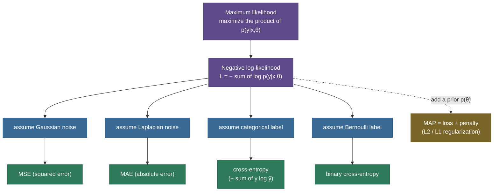
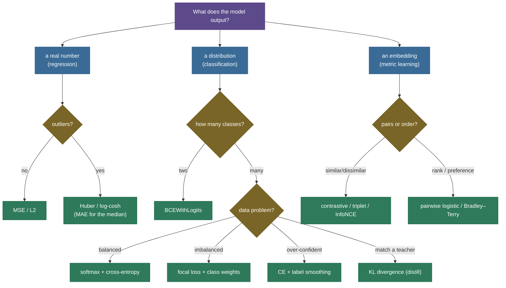

# Loss functions: the number the network is trying to make small

Every neural network learns by playing the same game over and over: make a prediction, measure how wrong it is with a single number, and nudge the weights to make that number smaller. That single number is the **loss**, and choosing it is one of the most consequential decisions in all of machine learning — because the loss is the *only* thing the optimizer actually cares about. The optimizer is a blind machine that rolls downhill on whatever surface you hand it; the loss *is* that surface. Hand it the wrong one and you can train a perfectly good architecture, on perfectly good data, to do exactly the wrong thing — and it will do it confidently.

The loss has **two jobs**, and they are not the same job. First, it must **score** a prediction: given $\hat y$ and the truth $y$, produce a scalar that is small when the prediction is good and large when it is bad. Second — and this is the part beginners under-weight — because we learn by gradient descent, it must **supply a useful gradient**: a slope that keeps pointing the weights toward "less wrong" *even when the model is badly wrong*. A loss can be perfect at scoring and disastrous at gradients (we will watch MSE-on-a-classifier do exactly this), and when that happens, training stalls while the score still looks plausible. So the recurring theme of this entire page is: **we don't just want a loss that scores correctly, we want one whose slope keeps doing useful work.**

I'm going to teach this the way I'd actually explain it to a teammate who keeps "trying losses until one works." We'll start with the one principle that secretly generates almost all of them — **maximum likelihood** — then derive the regression family (MSE, MAE, Huber, log-cosh) and the classification family (cross-entropy, hinge, focal, KL) *from* that principle, prove the single most-asked result in the field (the softmax+cross-entropy gradient is just $\hat y - y$), connect penalized losses to MAP and regularization, and finish with numerical stability, a decision table, and four worked examples you can reproduce by hand. By the end you'll be able to:

- explain what a loss is, the **two jobs** it must do, and the difference between a **loss** (a differentiable *training* objective) and a **metric** (a possibly non-differentiable *evaluation* number);
- derive **MSE** as Gaussian-noise maximum likelihood, **MAE** as Laplacian MLE, and reason about **Huber / log-cosh** and outlier robustness;
- derive **cross-entropy** as the negative log-likelihood of a categorical/Bernoulli label, and connect it to **entropy** and **KL divergence** via $H(p,q)=H(p)+D_{\text{KL}}(p\|q)$;
- derive the clean gradient $\partial L/\partial z = \hat y - y$ for **softmax + cross-entropy** step by step, and explain precisely **why MSE on a classifier saturates**;
- derive the **focal-loss** modulating factor $(1-p_t)^\gamma$ and explain class-imbalance training;
- see the **loss ↔ MLE ↔ MAP ↔ regularization** chain (a penalized loss is MAP under a prior);
- pick the right loss per task from a decision table, handle **reduction** and **class weighting**, and write the **numerically stable** form (logits in, `log_softmax`/`BCEWithLogits`);
- implement these from scratch and confirm every claim against PyTorch.

Intuition and pictures first, then the derivations (with sources), then runnable, verified code.

> **Note:** almost every loss in supervised learning is secretly **maximum likelihood** — "choose parameters that make the observed data most probable." MSE falls out of assuming Gaussian noise; MAE from Laplacian noise; cross-entropy from a categorical/Bernoulli label. Seeing that *one* principle behind all of them is the thing that makes losses click instead of feeling like a grab-bag of formulas to memorize. If you remember one sentence from this page, make it that one.

---

## The problem: turning "how wrong" into one differentiable number

We have a model that outputs predictions $\hat y$ and ground-truth targets $y$. To train it by gradient descent we need a function $L(\hat y, y)$ with three properties:

- **a single scalar** over the batch — so we can totally order runs ("this one is better") and minimize;
- **minimized by the right answer** — smallest when $\hat y = y$, or when the predicted distribution matches the true one;
- **differentiable almost everywhere** — so backprop can compute $\partial L / \partial \hat y$ (and hence $\partial L/\partial \theta$) and push the weights downhill.

The third property is the subtle one. Two losses can agree on *which* prediction is best and still give wildly different gradients on the way there — and the gradient, not the score, is what training actually follows. A loss that is flat (zero slope) in the region where the model is wrong gives the optimizer no signal there; the model can sit, badly wrong, with nothing telling it which way to move. So the design question is never just "does this number rank predictions correctly?" It is "does its **slope** keep pointing usefully, especially where the model is worst?"

> **Tip — loss vs. metric (a distinction interviewers love).** A **loss** is the differentiable function you *optimize during training*; a **metric** is the (often non-differentiable, human-meaningful) number you *report at evaluation*. You train a classifier with **cross-entropy** but you report **accuracy / F1 / AUC**; you train a regressor with **MSE** but you may report **RMSE / MAE / R²**. They can disagree — a model can lower its loss while a metric plateaus, because the loss is a *smooth surrogate* the metric isn't. You cannot backprop through accuracy (it's a step function with zero gradient everywhere), which is *why* we optimize a smooth surrogate and merely *monitor* the metric. We cover the evaluation side separately in [Classification Metrics](../../03.%20Supervised_Learning/concepts/14-Classification-Metrics.md) and [Regression Metrics](../../03.%20Supervised_Learning/concepts/15-Regression-Metrics.md) — this page is about the *training objective*.

---

## Intuition: the loss is the landscape, the gradient is the slope

Picture the optimizer as a hiker dropped, blindfolded, somewhere on a vast terrain, whose only goal is to reach the lowest valley. The hiker can't see; all they can do is feel the **slope under their feet** and step downhill. The **loss function is that terrain** — you, the engineer, sculpt it — and the **gradient is the slope** the hiker feels. This single picture explains why the loss's *shape* matters as much as its *minimum*:

- If the terrain is a smooth bowl (like MSE near zero, or cross-entropy), the slope always points cleanly toward the bottom and gets gentler as you arrive — the hiker glides in and settles.
- If the terrain has a **flat plateau** exactly where the hiker is lost (MSE-on-a-saturated-sigmoid in the "confidently wrong" zone), the slope is ~zero — the hiker feels no downhill direction and **stands still, lost**, even though a deep valley is right there. That flat plateau is the vanishing-gradient trap, and it's a property of the *loss*, not the data.
- If the terrain has a **sharp spike** at one outlier (MSE on heavy-tailed data), the hiker is yanked toward chasing that spike instead of fitting the bulk — that's outlier sensitivity.

So when we "choose a loss," we are literally choosing the shape of the landscape the optimizer will navigate. A good loss is a landscape with **no misleading flats where the model is wrong** and **no spikes that hijack the descent**. Every design decision below — squaring vs. absolute value, the Huber crossover, the softmax+CE cancellation, the focal modulating factor — is a deliberate reshaping of this terrain to keep the slope honest. Keep the hiker in mind; it makes every formula that follows a story about a slope.

> **Tip:** the same intuition explains *learning-rate* sensitivity. A loss with steep, narrow valleys (sharp curvature) needs small steps or the hiker overshoots and bounces off the walls; a flat, gently-curved loss tolerates big steps. The loss's curvature (its second derivative / Hessian) and your learning rate are two halves of one tuning problem — see [Optimizers](07-Optimizers.md).

---

## The unifying view: a loss is a negative log-likelihood

Before any specific formula, install the lens that generates them. Suppose your model defines a **probability** of the data given its parameters $\theta$: $p(y \mid x, \theta)$. The **maximum-likelihood** principle says: pick $\theta$ that makes the observed data most probable. For a dataset of $N$ i.i.d. examples,

$$
\theta^\star = \arg\max_\theta \prod_{i=1}^{N} p(y_i \mid x_i, \theta)
= \arg\max_\theta \sum_{i=1}^{N} \log p(y_i \mid x_i, \theta).
$$

We take the **log** because it turns the fragile product (which underflows to zero for large $N$) into a numerically friendly sum, and because $\log$ is monotonic so the $\arg\max$ is unchanged. Maximizing a sum of log-probabilities is the same as **minimizing their negation**:

$$
\boxed{\;L(\theta) = -\frac{1}{N}\sum_{i=1}^N \log p(y_i \mid x_i, \theta)\;}
\qquad\text{(the negative log-likelihood, NLL).}
$$

That single boxed expression is the mother of nearly every loss on this page. To get a concrete loss you just **pick the noise model** — the form of $p(y\mid x,\theta)$ — and the algebra hands you the loss:

- **Gaussian** $p(y\mid x) = \mathcal N(\hat y,\sigma^2)$ → **MSE**.
- **Laplacian** $p(y\mid x) = \text{Laplace}(\hat y, b)$ → **MAE**.
- **Categorical** $p(y\mid x) = \text{Cat}(\hat y_1,\dots,\hat y_K)$ → **cross-entropy**.
- **Bernoulli** $p(y\mid x) = \text{Bern}(\hat y)$ → **binary cross-entropy**.



Hold this diagram in your head; the rest of the page is just walking each arrow and showing the algebra. We'll close the loop at the end with the dashed arrow — adding a **prior** $p(\theta)$ turns MLE into **MAP**, and that is *exactly* where weight-decay regularization comes from.

---

## Regression losses: MSE, MAE, Huber, log-cosh

When the target is a real number — a price, a temperature, a pixel value, an RL value function — the natural losses act on the **residual** (error) $e = \hat y - y$. The four you should know, and their one-line identities:

- **Mean Squared Error (MSE / L2):** $L_{\text{MSE}} = \frac{1}{N}\sum (\hat y_i - y_i)^2$ — squares the error. Gaussian MLE.
- **Mean Absolute Error (MAE / L1):** $L_{\text{MAE}} = \frac{1}{N}\sum |\hat y_i - y_i|$ — absolute value. Laplacian MLE, robust, the **median** estimator.
- **Huber / smooth-L1:** quadratic near 0, linear in the tail — robustness *and* a smooth gradient.
- **log-cosh:** $\frac{1}{N}\sum \log\cosh(\hat y_i - y_i)$ — a smooth, parameter-free Huber.


The picture *is* the intuition. MSE's quadratic arms mean a single large outlier dominates the total loss, so the model **bends to chase it** — read off the annotation: at $e=3$ MSE charges $9$ but Huber only $2.5$. MAE grows only linearly, so it is **robust to outliers**, but its kink at $0$ gives a *constant-magnitude* gradient (it doesn't ease off as you converge, and it is non-differentiable exactly at $0$). **Huber** takes the best of both — smooth quadratic near zero (good gradients as you home in), linear far out (robust) — with a knob $\delta$ setting the crossover. **log-cosh** achieves nearly the same shape with no knob at all.

### Deriving MSE from Gaussian maximum likelihood

This is the derivation interviewers ask for. Assume the target is the model's output corrupted by additive **Gaussian noise**: $y = \hat y + \varepsilon$, $\varepsilon \sim \mathcal N(0,\sigma^2)$. Then the likelihood of a single observation is the Gaussian density evaluated at the residual:

$$
p(y\mid x,\theta) = \frac{1}{\sqrt{2\pi\sigma^2}}\exp\!\left(-\frac{(y-\hat y)^2}{2\sigma^2}\right).
$$

Take the negative log of the product over the dataset:

$$
-\log\prod_i p(y_i\mid x_i)
= \sum_i \frac{(y_i-\hat y_i)^2}{2\sigma^2} + \underbrace{\frac{N}{2}\log(2\pi\sigma^2)}_{\text{constant in }\theta}.
$$

The second term doesn't depend on $\theta$, so it drops out of the $\arg\min$; the first is $\frac{1}{2\sigma^2}\sum (\hat y_i - y_i)^2$, and the constant $\frac{1}{2\sigma^2}$ doesn't change the minimizer. **Minimizing MSE is exactly Gaussian maximum likelihood.** That is *why* MSE is the default for clean regression — and also *why* it's wrong for heavy-tailed data: it implicitly assumes your errors are Gaussian, and Gaussians have thin tails, so a genuine outlier (which a Gaussian deems nearly impossible) gets a huge squared penalty and warps the fit.

> *Where this comes from: the Gaussian-MLE derivation of MSE is in **Pattern Recognition and Machine Learning** (Bishop) §1.2.5 and §3.1.1, and **Deep Learning** (Goodfellow et al.) §5.5.1. Huber is Huber (1964). All in the references.*

**The MSE gradient.** Differentiate $L = \frac1N\sum(\hat y_i - y_i)^2$ with respect to one prediction: $\partial L/\partial \hat y_i = \frac{2}{N}(\hat y_i - y_i) = \frac{2}{N}e_i$. The gradient is **proportional to the error**, so the worst-fit points are pushed hardest — elegant, but it's also exactly why one big outlier (large $e_i$) hijacks the update.

### Deriving MAE from Laplacian MLE — and the median connection

Repeat the recipe with a **Laplacian** noise model, $p(y\mid x) = \frac{1}{2b}\exp(-|y-\hat y|/b)$. The negative log-likelihood is $\sum_i |y_i - \hat y_i|/b + \text{const}$, i.e. minimizing **MAE** is Laplacian maximum likelihood. The Laplacian has *fatter tails* than the Gaussian, so it considers large residuals far less surprising — which is the probabilistic reason MAE shrugs off outliers that MSE chases.

There's a beautiful statistical payoff. For a constant predictor, the value that minimizes **MSE** is the **mean** of the targets, while the value that minimizes **MAE** is the **median**. (Set the derivative to zero: $\sum 2(\hat y - y_i)=0 \Rightarrow \hat y=\text{mean}$; for MAE the subgradient $\sum \text{sign}(\hat y - y_i)=0$ is balanced at the median.) The median is famously robust to outliers — so "MAE is robust" isn't a slogan, it's the median estimator wearing a loss-function costume.

> **Gotcha — MAE's constant gradient is a double-edged sword.** Because $\partial|e|/\partial e = \pm 1$, MAE's gradient magnitude is the *same* whether you're miles off or a hair off. Great for not over-reacting to outliers; annoying near the optimum, where it doesn't ease off and can cause the optimizer to oscillate around the minimum instead of settling (and it's non-differentiable at $e=0$, where frameworks just pick a subgradient). Huber exists precisely to remove this wrinkle.

### Huber: quadratic near zero, linear in the tail

Huber loss explicitly stitches the two together:

$$
L_\delta(e) = \begin{cases} \tfrac12 e^2 & |e|\le\delta \\[4pt] \delta\big(|e| - \tfrac12\delta\big) & |e| > \delta \end{cases}
$$

For small residuals it *is* MSE (the smooth quadratic bowl gives well-behaved, vanishing-at-the-minimum gradients); past the threshold $\delta$ it switches to a **linear** penalty whose gradient is **clamped at $\pm\delta$**, so no single outlier can contribute an unbounded gradient. The two pieces are constructed to **match in value and in slope** at $|e|=\delta$ (that's where the $-\frac12\delta$ offset comes from), so the whole function is continuous and $C^1$ — exactly the smoothness backprop wants. In object detection this same function is called **smooth-L1**. The cost is one hyperparameter, $\delta$ (the residual scale at which you stop trusting a point as "signal" and start treating it as "outlier").

**log-cosh** removes even that knob: $\log\cosh(e) \approx \frac12 e^2$ for small $e$ (since $\cosh e \approx 1+\frac12 e^2$) and $\approx |e| - \log 2$ for large $e$ — Huber's shape, infinitely differentiable, no $\delta$ to tune. The price is a slightly more expensive `cosh`/`log` and marginally less control.

> **Tip — choosing among the regression four.** Clean data, big errors genuinely worse → **MSE**. Outliers you don't want to chase → **MAE** or, better, **Huber/log-cosh** (robust *and* smooth). MSE penalizes a 10-unit miss $100\times$ a 1-unit miss; MAE penalizes it only $10\times$; Huber penalizes it $\approx 10\times$ too but keeps MSE-like gradients near the optimum. When in doubt for tabular regression, **Huber** is the safe default.

---

## Classification losses: cross-entropy and friends

For classification the model outputs a **probability distribution** over $K$ classes — logits $z$ pushed through **softmax** (covered in [Activation Functions](03-Activation-Functions.md)) — and we want it to place as much probability as possible on the true class. The loss is **cross-entropy**. For one example with one-hot truth $y$ and predicted probabilities $\hat y$:

$$
L_{\text{CE}} = -\sum_{c=1}^{K} y_c \log \hat y_c \;=\; -\log \hat y_{\text{true}}.
$$

Because $y$ is one-hot, the sum collapses to a single term: **the negative log-probability the model assigned to the correct class.** That's the whole loss — every other class's prediction enters only indirectly, through the softmax's normalization.


The shape is the entire intuition. Assigning the true class $p=0.9$ costs almost nothing ($0.105$); $p=0.5$ costs $0.69$; $p=0.1$ — confident *and wrong* — costs $2.30$; and as $p\to 0$ the penalty goes to **infinity**. Cross-entropy punishes confident mistakes mercilessly and rewards calibrated confidence, which is exactly what you want from a probabilistic classifier: it's not enough to be right, you should be right *and appropriately confident*.

### Deriving cross-entropy from MLE of a categorical

Same recipe as before, now with a **categorical** label. The model outputs class probabilities $\hat y_c$; the probability it assigns to the actual observed label is $\prod_c \hat y_c^{\,y_c}$ (with $y$ one-hot, this is just $\hat y_{\text{true}}$). The negative log-likelihood of the dataset is

$$
-\sum_i \log \prod_c \hat y_{i,c}^{\,y_{i,c}}
= -\sum_i \sum_c y_{i,c}\log \hat y_{i,c},
$$

which is precisely **cross-entropy summed over the data**. So minimizing cross-entropy = maximizing the likelihood of the labels. **Binary** classification is the two-class special case with a single sigmoid output $p$ and a Bernoulli label: $L_{\text{BCE}} = -[\,y\log p + (1-y)\log(1-p)\,]$ — the NLL of a coin flip. Same principle, same origin; categorical for $K$ classes, Bernoulli for two.

> *Where it comes from: cross-entropy as the NLL of a categorical/Bernoulli label is derived in **Deep Learning** (Goodfellow et al.) §6.2.1.1 and **d2l.ai** §4.1 (softmax regression). The binary case as a likelihood is Andrew Ng's logistic-regression cost (references).*

### The information-theory view: CE = entropy + KL

Cross-entropy isn't an arbitrary formula; it's a named quantity in information theory, and that view explains *why* it's the right objective. The **cross-entropy** between a true distribution $p$ and a model distribution $q$ is $H(p,q) = -\sum_c p_c \log q_c$ — the expected number of bits (nats) to encode samples from $p$ using a code optimized for $q$. It decomposes exactly:

$$
H(p,q) = \underbrace{-\sum_c p_c\log p_c}_{H(p)\;=\;\text{entropy of the data}} \;+\; \underbrace{\sum_c p_c\log\frac{p_c}{q_c}}_{D_{\text{KL}}(p\,\|\,q)\;=\;\text{extra cost of using }q}.
$$

Since $H(p)$ — the data's own entropy — is **fixed** (it doesn't depend on your model), **minimizing cross-entropy is identical to minimizing the KL divergence** $D_{\text{KL}}(p\|q)$ from your model to the true label distribution. That's the principled punchline: cross-entropy training literally drives your predicted distribution as close as possible (in KL) to reality. We verify this decomposition numerically in the code ($H(p)+\text{KL}=\text{CE}$ to machine precision). For the deeper information-theory treatment see [Cross-Entropy & KL Divergence](../../01.%20Foundations/concepts/23-Cross-Entropy-and-KL-Divergence.md).

> **Note — where KL shows up directly.** When the target is itself a *distribution* (not a one-hot label), you minimize KL or cross-entropy against it directly. The headline case is **knowledge distillation** (Hinton et al. 2015): a small "student" is trained to match a big "teacher's" *softened* output distribution (softmax at temperature $T$), so the loss is $D_{\text{KL}}(\text{teacher}\,\|\,\text{student})$ over all classes — the "dark knowledge" in the teacher's relative probabilities (that a "7" looks a bit like a "1") teaches far more than a hard label. Same machinery, soft targets. **Label smoothing** is the cheap cousin: replace the one-hot target with a slightly softened distribution (e.g. $0.9$ on the true class, $0.1$ spread over the rest), which is mathematically a KL term toward a uniform prior and curbs over-confidence — see [Regularization](09-Regularization.md).

### Temperature: softening a distribution before you compare it

The "softened" distribution above is worth one paragraph because temperature shows up everywhere — distillation, calibration, LLM sampling. A **temperature** $T$ divides the logits before softmax: $\hat y_i = \text{softmax}(z/T)_i$. At $T=1$ you get the ordinary softmax. As $T\to\infty$ the logits are squashed toward zero, so the distribution flattens toward **uniform** (maximum entropy — every class nearly equally likely); as $T\to 0$ it sharpens toward a one-hot **argmax** (a hard pick). Distillation uses a *high* $T$ (say $4$) on both teacher and student so the student sees the teacher's full shape — the small relative probabilities among the wrong classes, the "dark knowledge" — instead of a near-one-hot vector that hides it. Crucially, because softening at temperature $T$ scales the resulting gradients by roughly $1/T^2$, the distillation loss is multiplied by $T^2$ to keep its magnitude comparable to the hard-label cross-entropy it's usually blended with. Same softmax+cross-entropy machinery, one extra knob that controls how much *structure* in the distribution survives into the loss.

---

## The result that makes softmax and cross-entropy inseparable: ∂L/∂z = ŷ − y

This is the single most-asked loss result in interviews, and it's worth deriving by hand once so it's yours forever. Feed logits $z$ through softmax to get probabilities $\hat y$, then through cross-entropy against one-hot $y$. The gradient of the loss **with respect to the logits** is, astonishingly, just:

$$
\boxed{\;\frac{\partial L_{\text{CE}}}{\partial z_i} = \hat y_i - y_i\;}
$$

Predicted-probability minus the truth. No leftover softmax derivative, no division, no mess — just the error, exactly like the MSE gradient was the error. Here is the derivation, in full.

**Step 1 — the pieces.** Softmax is $\hat y_i = \dfrac{e^{z_i}}{\sum_j e^{z_j}}$, and the loss for true class $k$ (so $y_k=1$, others $0$) is $L = -\log \hat y_k$.

**Step 2 — the softmax Jacobian.** Differentiating softmax gives a clean form (two cases that combine via the Kronecker delta $\delta_{ij}$, which is $1$ if $i=j$ else $0$):

$$
\frac{\partial \hat y_i}{\partial z_j} = \hat y_i(\delta_{ij} - \hat y_j).
$$

*(Sketch: for $i=j$, the quotient rule on $e^{z_i}/\sum_j e^{z_j}$ gives $\hat y_i(1-\hat y_i)$; for $i\ne j$ the numerator is constant in $z_j$ and you get $-\hat y_i\hat y_j$. The delta packs both into one line.)*

**Step 3 — chain rule.** $L=-\log\hat y_k$ so $\dfrac{\partial L}{\partial \hat y_i} = -\dfrac{1}{\hat y_k}\,\mathbb 1[i=k]$. Therefore

$$
\frac{\partial L}{\partial z_j} = \sum_i \frac{\partial L}{\partial \hat y_i}\frac{\partial \hat y_i}{\partial z_j}
= -\frac{1}{\hat y_k}\,\frac{\partial \hat y_k}{\partial z_j}
= -\frac{1}{\hat y_k}\,\hat y_k(\delta_{kj} - \hat y_j)
= \hat y_j - \delta_{kj}.
$$

**Step 4 — read it off.** $\delta_{kj}$ is exactly the one-hot target $y_j$ (it's $1$ at the true class $k$, $0$ elsewhere). So $\partial L/\partial z_j = \hat y_j - y_j$. Done.

The magic isn't luck — it's a **designed cancellation**. The $1/\hat y_k$ from differentiating $\log$ exactly annihilates the $\hat y_k$ factor in the softmax Jacobian, leaving the bare error. **Softmax and cross-entropy are a matched pair**, built to cancel; pulling them apart (e.g. softmax then MSE) breaks the cancellation and reintroduces a vanishing factor — which is the next section.

> *Where this derivation lives: the full step-by-step is in **d2l.ai** §4.1.2 and Bishop §4.3.2; Brandon Rohrer's "Softmax and its derivative" (references) walks the cancellation pictorially. The code below confirms it against autograd to $10^{-8}$. The same result is rederived inside the backward pass in [Backpropagation](02-Backpropagation-and-Computational-Graphs.md).*

> **Note — this is also why backprop through a classifier starts so cleanly.** In [Backpropagation](02-Backpropagation-and-Computational-Graphs.md) the backward pass through the final layer *begins* with this $\hat y - y$ vector — the entire gradient computation for a softmax classifier is seeded by it, which is why frameworks fuse softmax+CE into one op (`CrossEntropyLoss`) with this gradient hard-coded.

### Why cross-entropy over MSE for classification: the saturation argument

You *could* put MSE on top of a sigmoid/softmax. You shouldn't, and the reason is gradients, not scores. Consider a single sigmoid output $p=\sigma(z)$ with true label $y$. With **MSE**, $L=\frac12(p-y)^2$ and the chain rule gives

$$
\frac{\partial L}{\partial z} = (p-y)\cdot \underbrace{p(1-p)}_{\sigma'(z)}.
$$

That extra factor $p(1-p)$ is the sigmoid's derivative, and it is **near zero exactly when the model is saturated** — i.e. confidently outputting $p\approx 0$ or $p\approx 1$. So a confidently **wrong** example ($p\approx 0$ when $y=1$) produces a gradient $\approx (0-1)\cdot 0 = 0$: the very examples that most need correcting generate almost no learning signal, and training stalls. With **cross-entropy** the $p(1-p)$ is cancelled (previous section): $\partial L/\partial z = p-y$, which is $\approx -1$ for that same confidently-wrong example — a strong push in the right direction. The figure makes the gap unmistakable.


> **Gotcha — never put MSE on a classifier.** Beyond the vanishing gradient, MSE-on-a-sigmoid is **non-convex** in the weights (cross-entropy is convex for logistic regression), so you also lose the clean optimization landscape. The figure's shaded "confidently wrong" band is the whole argument: CE ≈ 1 (learns fast), MSE ≈ 0 (learns nothing). Use cross-entropy for anything that outputs class probabilities.

### Hinge loss: the margin view (SVMs)

Not every classifier wants calibrated probabilities. The **hinge loss** (the SVM loss) cares only that the correct class beats the rest by a **margin**: $L_{\text{hinge}} = \max(0,\, 1 - m)$, where $m$ is the (signed) score of the true class. If the model is correct by margin $\ge 1$, the loss is *exactly zero* — no further reward for being more confident; if it's correct but inside the margin, or wrong, the loss grows linearly. This produces sparse, margin-focused solutions (only the "support vectors" near the boundary matter) but **does not yield probabilities**, so it's a poor fit when you need calibrated confidence. The next figure shows hinge alongside cross-entropy as two different **smooth surrogates** for the thing we actually care about — the non-differentiable 0–1 (misclassification) loss.


> **Note — every classification loss is a surrogate.** What we *want* to minimize is the **0–1 loss** (count of mistakes), but it's a step function: flat everywhere (no gradient) with a discontinuity at the boundary — useless for gradient descent. Hinge, logistic/cross-entropy, and focal are all **convex (or smooth) upper bounds** on it that *are* differentiable. We optimize the surrogate and report the 0–1-based metric (accuracy). That's the loss-vs-metric split from the top of the page, drawn as a picture.

### Focal loss: down-weighting the easy examples

In tasks with extreme class imbalance — dense object detection has roughly $10^4$ easy background boxes per object — plain cross-entropy is swamped: a flood of easy, already-correct negatives, each contributing a small loss, collectively drowns out the few hard positives. **Focal loss** (Lin et al. 2017) fixes this by *reshaping* cross-entropy with a **modulating factor**. Writing $p_t$ for the probability the model assigned to the *true* class:

$$
L_{\text{focal}} = -(1 - p_t)^{\gamma}\,\log p_t,
\qquad \gamma \ge 0.
$$

Read the factor $(1-p_t)^\gamma$ carefully — it's the whole idea. For an **easy** example the model already gets right ($p_t\to 1$), $(1-p_t)^\gamma \to 0$, so its loss is **crushed toward zero** and it stops dominating the gradient. For a **hard** example ($p_t$ small), $(1-p_t)^\gamma \approx 1$, so it keeps essentially its full cross-entropy weight. The exponent $\gamma$ (typically $2$) controls how aggressively easy examples are silenced; $\gamma=0$ recovers plain cross-entropy exactly. The next figure shows the family, with the measured down-weighting called out.


The numbers (verified in the code) are the proof: at $p_t=0.9$, focal-$\gamma{=}2$ down-weights the easy example by **100×** but the hard $p_t=0.1$ example by only **1.23×**. That asymmetry — almost no change to hard examples, near-erasure of easy ones — is precisely what re-balances the gradient toward the cases that still need learning. In practice focal is paired with an $\alpha$ class-weight: $L = -\alpha_t(1-p_t)^\gamma\log p_t$.

> **Tip — the loss encodes what you actually want.** Class imbalance → **focal loss** or class weights. Over-confidence / poor calibration → **label smoothing**. Want embeddings, not labels → **contrastive/triplet**. Need a margin, not probabilities → **hinge**. Reaching for the right loss is usually a cleaner fix for a task-specific pathology than fighting it with architecture or data hacks.

---

## Metric-learning and ranking losses (brief)

Some tasks don't classify or regress a single output — they shape an **embedding space** so that *distances* are meaningful, and the loss operates on **pairs or triplets** rather than (prediction, target) pairs.

- **Contrastive loss** pulls embeddings of *similar* pairs together and pushes *dissimilar* pairs apart beyond a margin: $L = y\,d^2 + (1-y)\max(0, m-d)^2$ for distance $d$ and same/different label $y$.
- **Triplet loss** uses an (anchor, positive, negative) triple and asks the anchor to be closer to the positive than to the negative by a margin $m$: $L = \max(0,\; d(a,p) - d(a,n) + m)$ — the backbone of face-recognition embeddings (FaceNet).
- **InfoNCE / NT-Xent** is the modern workhorse of **self-supervised** and **contrastive** representation learning (SimCLR, CLIP): treat the matching pair as the positive among a batch of negatives and apply **softmax + cross-entropy over similarities**. Note that under the hood this *is* cross-entropy — the same loss, applied to a similarity matrix instead of class logits.
- **Ranking losses** (pairwise like RankNet, or listwise) optimize *order* rather than absolute values — central to search, recommendation, and the **reward-model** training in RLHF (a Bradley–Terry pairwise-preference loss is just logistic loss on score differences).

The unifying thread: even these "exotic" losses are usually a margin or a softmax-cross-entropy in disguise, applied to distances or score-differences instead of raw predictions.

---

## The loss ↔ MLE ↔ MAP ↔ regularization chain

We promised the dashed arrow in the first diagram. Pure maximum likelihood maximizes $p(\text{data}\mid\theta)$ — but it has no opinion about $\theta$ itself, so it can happily overfit by driving weights to extreme values. **Maximum a posteriori (MAP)** estimation adds a **prior** $p(\theta)$ and maximizes the *posterior* $p(\theta\mid\text{data})\propto p(\text{data}\mid\theta)\,p(\theta)$. Take negative logs:

$$
\underbrace{-\log p(\theta\mid\text{data})}_{\text{minimize this}}
= \underbrace{-\log p(\text{data}\mid\theta)}_{\text{the loss (NLL)}}
\;+\; \underbrace{(-\log p(\theta))}_{\text{a penalty on }\theta}
\;+\;\text{const.}
$$

The first term is exactly the data loss we've been deriving; the second is a **penalty determined entirely by the prior you chose**. Two famous choices:

- A **Gaussian prior** $\theta\sim\mathcal N(0,\tau^2)$ gives $-\log p(\theta) = \frac{1}{2\tau^2}\|\theta\|_2^2 + \text{const}$ — i.e. an **L2 penalty** $\lambda\|\theta\|^2$. **L2 regularization (weight decay) *is* MAP with a Gaussian prior on the weights.**
- A **Laplacian prior** gives $\lambda\|\theta\|_1$ — i.e. **L1 regularization**, with its sparsity-inducing corners.

So "add weight decay" is not an ad-hoc hack — it's switching from MLE to MAP under a zero-mean Gaussian belief that weights *should* be small. The regularization strength $\lambda$ is set by the prior's variance ($\lambda = 1/(2\tau^2)$): a tighter prior (smaller $\tau$) = stronger pull toward zero = larger $\lambda$. This is the bridge from this page to [Regularization](09-Regularization.md): a penalized loss is a MAP objective, and the penalty is your prior in disguise.

> **Note — the whole hierarchy in one line.** **MLE** = fit the data (loss only). **MAP** = fit the data *and* respect a prior on $\theta$ (loss + penalty = regularized training). Full **Bayesian** = don't pick one $\theta$, integrate over all of them weighted by the posterior. Day-to-day deep learning lives at **MAP**: a likelihood-based loss plus weight decay.

---

## Reduction, class weighting, and the per-example vs per-batch question

Two practical knobs that trip people up in code review.

**Reduction.** A loss is defined per example; to get one scalar for the batch you **reduce** — `mean` (the default and almost always right), `sum`, or `none` (return the per-example vector, e.g. to weight or inspect it). The choice matters more than it looks: with `sum`, the gradient magnitude **scales with batch size**, so doubling the batch doubles the effective learning rate — a subtle bug when you change batch size and your tuned LR silently mis-scales. `mean` decouples the two, which is why it's the default. Use `none` when you need the per-example losses (focal weighting, hard-example mining, masking padded tokens in a sequence).

**Class weighting.** For imbalanced classification, pass per-class weights so rare classes count more: `CrossEntropyLoss(weight=w)` multiplies each example's loss by its class weight, effectively re-balancing the gradient *without* resampling the data. It's the simplest imbalance fix and composes with focal loss. A common recipe is inverse-frequency weights ($w_c \propto 1/\text{freq}(c)$).

> **Gotcha — masking and ignored targets.** In sequence models (e.g. next-token LM), padded positions must **not** contribute to the loss. Use the framework's `ignore_index` (PyTorch's `CrossEntropyLoss(ignore_index=-100)`) or an explicit mask with `reduction='none'`, then average over *real* tokens only. Forgetting this dilutes the loss with padding and silently hurts training — a classic, hard-to-spot bug.

---

## Numerical stability: always feed logits, never softmax-then-log

Computing softmax and then taking its log as two separate steps is a numerical landmine. A large logit makes $e^{z}$ **overflow** to `inf`; a tiny probability makes $\log(\hat y)\to -\infty$, and `inf - inf` or `log(0)` give `nan` that poisons the whole backward pass. The fix is the **log-sum-exp** trick — compute $\log\text{softmax}$ in one fused, stable step by subtracting the max logit first:

$$
\log\text{softmax}(z)_i = z_i - \log\sum_j e^{z_j} = (z_i - m) - \log\sum_j e^{z_j - m},\quad m=\max_j z_j.
$$

Subtracting $m$ leaves the result **mathematically unchanged** (it cancels top and bottom of the softmax) but makes every exponent $\le 0$, so $e^{z_j-m}\in(0,1]$ — no overflow, and the largest term is exactly $1$ so the log is well-conditioned. This is why every framework gives you a **fused** `cross_entropy` / `log_softmax` that consumes **logits**, not probabilities. The binary analogue is `BCEWithLogitsLoss`, which folds the sigmoid and the log together via the same trick: $\text{BCEWithLogits}(z,y) = \max(z,0) - z\,y + \log(1+e^{-|z|})$ — note there's no explicit `sigmoid`, no `log` of a probability, nothing to overflow.

We verify in the code that the stable form **equals** the naive form on safe inputs (to $\sim10^{-8}$) and **stays finite** where the naive form blows up: at a logit of $50$ the naive BCE returns $100.0$ (a garbage saturated value) while the stable form correctly returns $50.0$.

> **Gotcha — pass logits to the loss, not softmax outputs.** Call `F.cross_entropy(logits, target)` / `nn.CrossEntropyLoss()` on **raw logits**; do *not* apply softmax yourself first. Doing so double-applies normalization and is numerically worse — a top-3 silent bug in homegrown training loops. If you genuinely have probabilities (e.g. distillation targets), use `F.kl_div(log_q, p)` or `nll_loss(log(p), …)`, mind the `log`, and keep the inputs in log-space.

---

## Choosing a loss for the task: a decision table

| Task / situation | Loss | Why |
|---|---|---|
| Regression, clean data | **MSE / L2** | Gaussian MLE; large errors genuinely worse; smooth gradient proportional to error |
| Regression, outliers present | **Huber / log-cosh** | robust tail + smooth near 0; MAE if you want the median |
| Regression, want the median | **MAE / L1** | Laplacian MLE; the L1 minimizer is the median |
| Multi-class classification | **softmax + cross-entropy** | categorical MLE; clean ŷ−y gradient; calibrated probabilities |
| Binary classification | **BCEWithLogits** | Bernoulli MLE; numerically stable; logits in |
| Severe class imbalance | **focal loss** (gamma≈2) + alpha | (1−p_t)^gamma silences easy negatives, keeps hard ones |
| Over-confidence / calibration | **CE + label smoothing** | soft targets = KL toward uniform; curbs over-confidence |
| Match a teacher distribution | **KL divergence** (distillation) | transfer soft "dark knowledge" from teacher to student |
| Max-margin, no probabilities needed | **hinge** | SVM-style margin; sparse support vectors |
| Embeddings / retrieval / SSL | **contrastive / triplet / InfoNCE** | shape the metric space; pull positives, push negatives |
| Ranking / preferences (reward models) | **pairwise logistic / Bradley–Terry** | optimize *order*, not absolute values |
| LLM next-token pretraining | **categorical cross-entropy** | a V-way softmax over the vocabulary, per token |

> **Tip — start from the output type, then adjust for pathology.** First pick by *what the model emits* (real number → regression loss; distribution → cross-entropy; embedding → contrastive). *Then* patch for the data's specific problem (outliers → Huber; imbalance → focal/weights; over-confidence → smoothing). Two decisions, in that order, and you've chosen correctly almost every time.

The same logic as a decision tree:



---

## Where each loss shows up in the wild

- **MSE / Huber** — forecasting, regression heads, **value functions in RL** (TD targets), autoencoder/diffusion reconstruction.
- **Cross-entropy** — virtually all classification, **including every token of LLM next-token prediction**: a softmax over the ~$10^4$–$10^5$-token vocabulary plus cross-entropy *is* the pretraining loss. Everything on this page scales straight up to frontier models — the loss that trains GPT is the same formula as the loss that trains a 3-class toy.
- **Focal / weighted CE** — dense object detection (RetinaNet), medical/fraud detection, any long-tailed classification.
- **KL divergence** — knowledge distillation, variational autoencoders (the latent-prior term), and RLHF's KL-to-reference penalty that keeps a fine-tuned policy from drifting.
- **Contrastive / InfoNCE** — self-supervised pretraining (SimCLR, DINO), retrieval and embedding models, **CLIP** (image–text alignment).

> **Tip — "what loss trains an LLM?" is a gimme if you've read this far.** Plain categorical cross-entropy over the vocabulary, one term per predicted token, averaged over the sequence (with padding masked out). The 50,000-way softmax is the only thing that's "big"; the loss is exactly the one we derived and coded here.

---

## Worked examples

Four by-hand examples of increasing complexity; the code section reproduces every number against PyTorch.

**Example 1 — regression on a tiny vector, with an outlier.** Predictions $\hat y = [2.5,\,0.0,\,2.1,\,8.0]$, targets $y = [3.0,\,-0.5,\,2.0,\,2.0]$. Residuals $e = [-0.5,\,0.5,\,0.1,\,6.0]$ — the last is a genuine outlier. Then:

$$
L_{\text{MSE}} = \tfrac14(0.25+0.25+0.01+36.0) = 9.13,\qquad
L_{\text{MAE}} = \tfrac14(0.5+0.5+0.1+6.0) = 1.78.
$$

Look how the outlier dominates MSE — $36$ of the $36.51$ squared-error mass is that one point. Huber($\delta{=}1$) replaces its $36$ with $1\cdot(6-0.5)=5.5$, giving $L_{\text{Huber}}=\frac14(0.125+0.125+0.005+5.5)=1.44$. The per-element **MSE gradient** is $\frac2N e = [-0.25,\,0.25,\,0.05,\,\mathbf{3.0}]$ — the outlier's gradient is $60\times$ the third point's, so it hijacks the update. The **MAE gradient** is $\frac1N\text{sign}(e)=[-0.25,\,0.25,\,0.25,\,\mathbf{0.25}]$ — every point contributes equally, outlier included. That contrast *is* robustness.

**Example 2 — softmax + cross-entropy forward and the $\hat y - y$ gradient, 3 classes.** Logits $z = [2.0,\,1.0,\,0.1]$, true class $0$. Softmax: $e^z = [7.389,\,2.718,\,1.105]$, sum $=11.213$, so $\hat y = [0.659,\,0.242,\,0.099]$. Loss $= -\log(0.659) = 0.417$. Now the gradient: $\hat y - y = [0.659-1,\,0.242-0,\,0.099-0] = [-0.341,\,0.242,\,0.099]$. That vector is what flows backward — note it sums to zero (softmax outputs live on a probability simplex, so the gradient lies in its tangent space), it's **negative on the true class** (push that logit up) and **positive on the wrong ones** (push them down). The code confirms this matches autograd to $7\times10^{-9}$.

**Example 3 — focal loss down-weighting, easy vs hard, numerically.** Take $\gamma=2$. An **easy** example the model nails, $p_t=0.9$: cross-entropy is $-\log 0.9 = 0.105$; focal multiplies by $(1-0.9)^2 = 0.01$, giving $0.00105$ — a **100×** reduction. A **hard** example, $p_t=0.1$: cross-entropy is $-\log 0.1 = 2.303$; focal multiplies by $(1-0.1)^2 = 0.81$, giving $1.865$ — only a **1.23×** reduction. So focal barely touches the hard example while nearly erasing the easy one; in a batch flooded with easy negatives, the gradient is re-weighted toward the few hard positives. That single asymmetric pair of numbers is the entire reason focal loss works.

**Example 4 — a measured comparison: CE vs MSE gradient where it matters.** Consider one sigmoid output, true label $y=1$, model confidently wrong at $z=-5$ so $p=\sigma(-5)=0.0067$. **Cross-entropy** gradient: $|p-y| = |0.0067 - 1| = 0.993$ — nearly maximal, a hard shove toward correct. **MSE** gradient: $|(p-y)\,p(1-p)| = 0.993 \times 0.0067 \times 0.993 = 0.0066$ — about **150× smaller**, essentially no signal. The model is as wrong as it can be, and MSE has nothing to say. This is the saturation plot's left edge, in two numbers, and it's the definitive answer to "why not MSE on a classifier."

---

## Code: every claim on this page, checked against PyTorch

Runnable on CPU in about a second. It reproduces the four worked examples and the CE = entropy + KL identity, each verified against `torch.nn.functional`.

```python
"""Loss functions from scratch, every claim checked against PyTorch.
Verified on Python 3.12 (torch 2.x), CPU."""
import torch, torch.nn.functional as F, numpy as np

# --- 1. regression by hand vs torch, with an outlier (Example 1) ---
yhat = torch.tensor([2.5, 0.0, 2.1, 8.0]); y = torch.tensor([3.0, -0.5, 2.0, 2.0])
e = yhat - y                                          # residuals; last is an outlier (+6)
mse, mae = (e**2).mean(), e.abs().mean()
hub = torch.where(e.abs() <= 1.0, 0.5*e**2, 1.0*(e.abs()-0.5)).mean()
print(f"MSE  hand {mse:.4f}  torch {F.mse_loss(yhat,y):.4f}")
print(f"MAE  hand {mae:.4f}  torch {F.l1_loss(yhat,y):.4f}")
print(f"Huber hand {hub:.4f}  torch {F.huber_loss(yhat,y,delta=1.0):.4f}")
print("MSE grad:", [f'{v:.3f}' for v in (2*e/len(e)).tolist()],   # outlier dominates
      "| MAE grad:", [f'{v:.3f}' for v in (torch.sign(e)/len(e)).tolist()])

# --- 2. softmax+CE forward (from scratch, stable) and the (p - y) gradient (Example 2) ---
z = torch.tensor([[2.0, 1.0, 0.1]], requires_grad=True); yidx = torch.tensor([0])
def log_softmax(z):                                   # log-sum-exp: subtract max, never overflow
    m = z.max(dim=1, keepdim=True).values
    return z - m - (z - m).exp().sum(1, keepdim=True).log()
ce_hand = -log_softmax(z)[0, yidx[0]]                  # NLL of the true class, hand-rolled
L = F.cross_entropy(z, yidx); L.backward()
Y = F.one_hot(yidx, 3).float()
print(f"\nCE hand {ce_hand.item():.4f}  torch {L.item():.4f}   softmax = {[round(v,4) for v in F.softmax(z,1).detach().flatten().tolist()]}")
print("autograd dL/dz:", [f'{v:.4f}' for v in z.grad.flatten().tolist()])
print("p - y        :", [f'{v:.4f}' for v in (F.softmax(z,1)-Y).detach().flatten().tolist()],
      f"  max|diff| = {(z.grad-(F.softmax(z,1)-Y)).abs().max():.1e}")

# --- 3. focal loss down-weighting, easy vs hard (Example 3) ---
focal = lambda pt, g: (1-pt)**g * (-np.log(pt))
print(f"\nfocal g=2: easy p=0.9 CE={focal(0.9,0):.4f}->{focal(0.9,2):.4f} ({focal(0.9,0)/focal(0.9,2):.0f}x down)",
      f"| hard p=0.1 CE={focal(0.1,0):.4f}->{focal(0.1,2):.4f} ({focal(0.1,0)/focal(0.1,2):.2f}x down)")

# --- 4. CE vs MSE gradient where the model is confidently wrong (Example 4) ---
zc = torch.tensor(-5.0); p = torch.sigmoid(zc)        # true label y=1, p≈0.0067
print(f"\nconfidently wrong (z=-5, y=1): CE grad |p-1| = {abs(p-1):.4f}",
      f"| MSE grad |(p-1)p(1-p)| = {abs((p-1)*p*(1-p)):.4f}  (~150x weaker)")

# --- 5. CE = H(p) + KL(p||q), and BCEWithLogits stable == naive on safe inputs ---
p_, q_ = torch.tensor([0.7,0.2,0.1]), torch.tensor([0.5,0.3,0.2])
H, KL = -(p_*p_.log()).sum(), (p_*(p_/q_).log()).sum()
print(f"\nH(p)={H:.4f} + KL(p||q)={KL:.4f} = {H+KL:.4f}  ==  CE(p,q)={-(p_*q_.log()).sum():.4f}")
lo, tg = torch.tensor([2.0,-1.5,0.3,-4.0]), torch.tensor([1.0,0.0,1.0,0.0])
print(f"BCE naive {F.binary_cross_entropy(torch.sigmoid(lo),tg):.6f} == stable "
      f"{F.binary_cross_entropy_with_logits(lo,tg):.6f}  |  naive@logit50 = "
      f"{F.binary_cross_entropy(torch.sigmoid(torch.tensor([50.])),torch.tensor([0.])).item():.1f} "
      f"(garbage) vs stable {F.binary_cross_entropy_with_logits(torch.tensor([50.]),torch.tensor([0.])).item():.1f}")
```

Output:

```
MSE  hand 9.1275  torch 9.1275
MAE  hand 1.7750  torch 1.7750
Huber hand 1.4388  torch 1.4388
MSE grad: ['-0.250', '0.250', '0.050', '3.000'] | MAE grad: ['-0.250', '0.250', '0.250', '0.250']

CE hand 0.4170  torch 0.4170   softmax = [0.659, 0.2424, 0.0986]
autograd dL/dz: ['-0.3410', '0.2424', '0.0986']
p - y        : ['-0.3410', '0.2424', '0.0986']   max|diff| = 7.5e-09

focal g=2: easy p=0.9 CE=0.1054->0.0011 (100x down) | hard p=0.1 CE=2.3026->1.8651 (1.23x down)

confidently wrong (z=-5, y=1): CE grad |p-1| = 0.9933 | MSE grad |(p-1)p(1-p)| = 0.0066  (~150x weaker)

H(p)=0.8018 + KL(p||q)=0.0851 = 0.8869  ==  CE(p,q)=0.8869
BCE naive 0.225212 == stable 0.225212  |  naive@logit50 = 100.0 (garbage) vs stable 50.0
```

> **Note — read the payoff lines.** (1) Hand-computed MSE/MAE/Huber match torch exactly, and the **MSE gradient's outlier entry (3.0) is 60× the next point's** while MAE's is uniform — robustness, quantified. (2) The softmax+CE autograd gradient equals $\hat y - y$ to $7\times10^{-9}$ — the clean gradient is **real**, not a heuristic. (3) Focal down-weights the easy example **100×** but the hard one only **1.23×**. (4) On a confidently-wrong example CE's gradient is $\sim$150× MSE's — *why* you never use MSE on a classifier. (5) $H(p)+\text{KL}$ equals CE to the last digit, and the stable BCE stays at $50.0$ where the naive one returns a garbage $100.0$.

> **Tip — see it at full scale.** Swap the toy logits for a real model: `F.cross_entropy(model(x), labels)` is the identical call with a $V$-way vocabulary instead of 3 classes. The formula, the gradient, and the stability concerns are all exactly what you just ran.

---

## Common pitfalls (where loss bugs actually live)

Loss bugs are insidious because the loss still *looks* like it's training — it goes down, just to the wrong place, or stalls while the curve looks plausible. The ones that bite in practice:

- **Double softmax.** Applying `softmax` yourself and then passing the result to `CrossEntropyLoss` (which applies `log_softmax` internally). The loss is wrong *and* numerically worse; training underperforms with no error message. Pass **raw logits**. This is the single most common homegrown-loop bug.
- **MSE on a classifier.** It "works" enough to fool you — accuracy climbs slowly — but the saturated-gradient trap means confident mistakes never get corrected. Use cross-entropy for anything that emits class probabilities.
- **Forgetting the mask / `ignore_index`.** Padded tokens, ignored pixels, or masked positions silently leak into the average, diluting the real loss. In sequence models this can quietly cap your model's quality.
- **Wrong reduction when you change batch size.** Switching from `mean` to `sum` (or vice versa) rescales the gradient by the batch size, so a previously-tuned learning rate is now off by that factor — looks like a mysterious instability or stall.
- **Class imbalance treated as an architecture problem.** Reaching for fancier models when the fix is a **weighted CE or focal loss**. Always rule out the loss before re-architecting.
- **Un-clipped / un-scaled targets into MSE.** A single mislabeled or unscaled target (e.g. a price in dollars next to one in cents) becomes a giant residual that MSE squares into a gradient bomb. Standardize targets; consider Huber if you can't guarantee clean labels.
- **`log(0)` from hand-rolled cross-entropy.** Writing $-\log(p)$ on a probability that underflowed to exactly $0$ gives `-inf` → `nan`. Use the fused, logit-consuming op or add a tiny `eps`; never `log` a raw probability you computed yourself.
- **Comparing losses across reductions or temperatures.** A loss number is only meaningful against the *same* reduction, weighting, and (for distillation) temperature. Don't compare a `sum`-reduced run's loss to a `mean`-reduced one and conclude anything.

> **Gotcha — a falling loss is necessary, not sufficient.** The loss going down only tells you the optimizer found *a* downhill direction on *the surface you gave it*. If that surface is the wrong one (MSE on a classifier, an unmasked loss, a mis-scaled target), the model dutifully descends to the wrong place. Always cross-check the **metric** you actually care about, not just the training loss.

---

## Recap and rapid-fire

**If you remember nothing else:** the loss is the single number training minimizes, and it must supply a useful *gradient*, not merely a correct *score*. Almost every loss is a **negative log-likelihood** under an assumed noise model — **MSE** = Gaussian MLE (outlier-sensitive), **MAE** = Laplacian MLE (robust, the median), **Huber/log-cosh** blend the two, **cross-entropy** = categorical/Bernoulli MLE = minimizing **KL** to the data. Softmax + cross-entropy give the clean gradient $\hat y - y$ — which is precisely why you never put MSE on a classifier (its gradient saturates when confidently wrong). **Focal** down-weights easy examples for imbalance; **label smoothing** curbs over-confidence; a penalized loss is **MAP** under a prior. Always feed **logits** and let the framework fuse `log_softmax`/`BCEWithLogits` for stability.

**Quick-fire — say these out loud:**

- *What two jobs does a loss do?* Score the prediction **and** supply a useful gradient.
- *Loss vs metric?* Loss = differentiable training objective; metric = (often non-differentiable) evaluation number. You backprop the loss and report the metric.
- *Where does MSE come from?* Maximum likelihood under Gaussian noise. MAE? Laplacian noise (and its minimizer is the median).
- *Where does cross-entropy come from?* Negative log-likelihood of a categorical/Bernoulli label.
- *MSE vs MAE vs Huber?* MSE squares (outlier-sensitive, smooth); MAE is linear (robust, kink, gradient $\pm1$); Huber is quadratic-near-0, linear-far (robust **and** smooth).
- *Why cross-entropy over MSE for classification?* CE's gradient is $\hat y - y$, strong when wrong; MSE+sigmoid picks up a $p(1-p)$ factor that **vanishes** on confident mistakes (and is non-convex).
- *Cross-entropy vs KL divergence?* $H(p,q)=H(p)+D_{\text{KL}}(p\|q)$; since $H(p)$ is fixed, minimizing CE = minimizing KL to the truth.
- *Softmax+CE gradient — derive it?* $\partial L/\partial z = \hat y - y$; the $1/\hat y$ from $\log$ cancels the softmax Jacobian's $\hat y$ factor.
- *Focal loss — what's the modulating factor and why?* $(1-p_t)^\gamma$; it $\to 0$ for easy ($p_t\to1$) examples and $\to 1$ for hard ones, re-balancing the gradient under imbalance.
- *Logits or probabilities into the loss?* Logits — frameworks fuse `log_softmax`/`BCEWithLogits` (log-sum-exp) for numerical stability.
- *A penalized loss is…?* MAP estimation: a Gaussian prior on weights gives L2 (weight decay); a Laplacian prior gives L1.
- *`mean` vs `sum` reduction?* `mean` (default) decouples gradient scale from batch size; `sum` makes the effective LR scale with batch.
- *What loss trains an LLM?* Categorical cross-entropy over the vocabulary, per token, padding masked.

---

## References and further reading

The curated link library for this topic — videos, courses, interactive/visual resources, articles, papers, books, and internal cross-links — lives in a companion file so it can be reused as a standalone reference list:

**→ [Loss Functions — references and further reading](04-Loss-Functions.references.md)**
