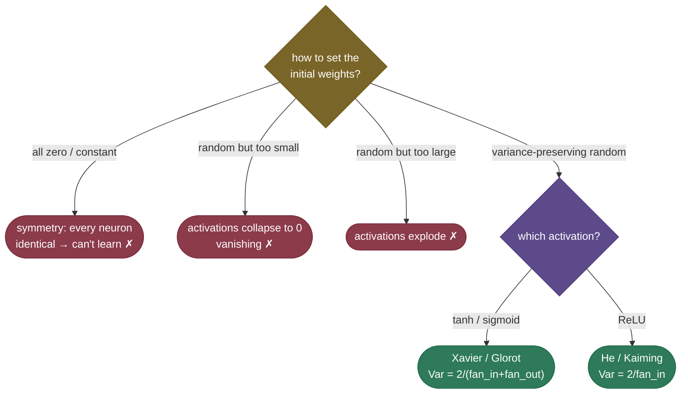

# Weight initialization: the starting point that decides if training works

Before a network takes a single gradient step, you have to fill its weight matrices with *some* numbers — and that seemingly trivial choice can be the difference between a model that trains beautifully and one that never learns at all. Set the weights too small and the signal shrinks to nothing as it passes through the layers (the activations, and then the gradients, vanish); set them too large and it blows up; set them all *equal* and every neuron in a layer computes the same thing forever. **Xavier/Glorot** and **He/Kaiming** initialization solve this with a single idea: scale the random initial weights by the layer's width so that the **variance** of the signal stays roughly constant from layer to layer — neither shrinking nor growing. It's a small piece of arithmetic that quietly made deep networks trainable.

By the end of this page you'll be able to:

- explain the **symmetry** problem and why you can't initialize weights to zero (or any constant);
- derive the **variance-preserving** rule — why $\text{Var}(W) \approx 1/n$ keeps the signal alive;
- state **Xavier/Glorot** (tanh/sigmoid) vs **He/Kaiming** (ReLU, the extra factor of 2) and when to use each;
- reason about how **normalization and residual connections** changed how much init matters;
- demonstrate signal collapse/explosion/preservation and symmetry-breaking in code.

Intuition and pictures first, then the math (with sources), then runnable code.

> **Note:** initialization, [activation choice](03-Activation-Functions.md), and [normalization](11-Normalization.md) all attack the *same* enemy — the [vanishing/exploding signal](06-Vanishing-Exploding-Gradients.md). Init is the cheapest of the three: it costs nothing at runtime and just sets a good *starting* scale so the others have less work to do.

---

## The problem: two ways naive initialization fails

There are two distinct failures, and a good answer names both:

1. **The symmetry problem.** If you set every weight to the **same** value (including zero), then every neuron in a layer receives the same inputs *and* the same weights, so they all compute the **identical** activation — and during backprop they all receive the **identical** gradient, so they update identically and *stay* identical forever. The layer might as well be a single neuron; its extra capacity is wasted. You **must** break symmetry with **random** weights.

2. **The scale problem.** Even with random weights, the *magnitude* matters enormously. Each layer multiplies the signal's variance by a factor that depends on the weight scale and the layer width. Too small a scale and that factor is $< 1$, so the signal **shrinks** geometrically through depth; too large and it $> 1$, so it **explodes**.

---

## The variance argument (where the formulas come from)

Consider one layer: output $z_j = \sum_{i=1}^{n} W_{ji}\,x_i$ over $n$ inputs (fan-in $n$). If the weights and inputs are independent, zero-mean, then the variance of each output is:

$$\text{Var}(z_j) = n \cdot \text{Var}(W) \cdot \text{Var}(x)$$

The signal's variance gets multiplied by $n \cdot \text{Var}(W)$ at every layer. To keep it **constant** across depth — so it neither vanishes nor explodes — you want that factor to be **1**:

$$n \cdot \text{Var}(W) = 1 \quad\Longrightarrow\quad \text{Var}(W) = \frac{1}{n}$$

That's the whole principle. Scale the random initial weights so their variance is about $1/(\text{fan-in})$, and the signal magnitude is preserved layer to layer. The two famous schemes are refinements of this:


---

## Xavier/Glorot and He/Kaiming

- **Xavier / Glorot** init targets **tanh/sigmoid** layers. To balance keeping the variance stable on *both* the forward pass (fan-in) and the backward pass (fan-out), it uses $\text{Var}(W) = \frac{2}{n_{\text{in}} + n_{\text{out}}}$ (the average of the two widths).

- **He / Kaiming** init targets **ReLU**. ReLU zeros out *half* its inputs, which halves the output variance — so He init compensates with an extra factor of 2: $\text{Var}(W) = \frac{2}{n_{\text{in}}}$. The figure shows exactly why this matters: on a ReLU net, Xavier's signal slowly decays (it's missing the factor of 2) while He's stays flat.

The collapse is visible directly in the activations of a deep layer:


> *Where these come from: the variance-preserving derivation and Xavier init are **Understanding the difficulty of training deep feedforward networks** (Glorot & Bengio 2010); the ReLU factor-of-2 correction is **Delving Deep into Rectifiers** (He et al. 2015); the symmetry argument is **Deep Learning** (Goodfellow et al.) §8.4. All in the references.*

---

## Choosing an initialization



> **See it interactively:** DeepLearning.AI's [Initializing neural networks](https://www.deeplearning.ai/ai-notes/initialization/index.html) lets you slide the init scale and watch activations collapse to zero (too small) or saturate (too large), with the just-right scale in between — the live version of the figure above.

> **Tip:** the rule of thumb is short — **ReLU/GELU layers → He init; tanh/sigmoid → Xavier**. Frameworks default sensibly (PyTorch's `Linear` uses a Kaiming-style scheme), so you rarely set it by hand — but you *do* get asked to explain why, and to recognize "my deep net won't train" as possibly an init problem. Biases are usually initialized to **0** (no symmetry issue — the random weights already break it).

---

## How normalization and residuals changed the story

Init used to be make-or-break; today it matters a bit less, because two other techniques also keep the signal healthy:

- **Normalization (BatchNorm/LayerNorm)** re-standardizes activations *during* the forward pass, so even imperfect init gets corrected layer by layer.
- **Residual connections** give the signal (and gradient) an identity path that doesn't depend on the weight scale.

But init still matters, especially in very deep models *without* normalization, and at scale: large transformers use **scaled initialization** (e.g., scaling residual-branch weights by $1/\sqrt{N}$ for $N$ layers, as in GPT-2) precisely to keep the variance controlled as depth grows. Good init is a free head start even when other stabilizers are present.

---

## Worked example: variance through one layer

A hidden layer has fan-in $n = 256$ and ReLU activation, with input activations of variance 1.

- **Naive** (standard normal weights, $\text{Var}(W) = 1$): output variance $\approx n \cdot 1 \cdot 1 = 256$ before ReLU — already 256× too big; after a few layers it explodes.
- **He init** ($\text{Var}(W) = 2/256 = 0.0078$, i.e. std $\approx 0.088$): output variance $\approx 256 \cdot \tfrac{2}{256} \cdot 1 = 2$ before ReLU; ReLU halves it back to $\approx 1$. **Preserved** — exactly the goal. (The code confirms `kaiming_normal_` produces std $0.088 = \sqrt{2/256}$.)

---

## Code: signal preservation and symmetry-breaking

```python
"""Weight init: variance preservation through depth, and why constant init fails.
Verified on ml-py312 (torch 2.12), CPU."""
import torch, numpy as np
torch.manual_seed(0)

def final_std(scale_fn, L=20, W=256):
    rng = np.random.default_rng(0); a = rng.standard_normal((W, 256))
    for _ in range(L):
        a = np.maximum(0, (rng.standard_normal((W, W)) * scale_fn(W)) @ a)   # ReLU layer
    return a.std()

print("activation std after 20 ReLU layers (input std = 1):")
for name, fn in [("too small ×0.01", lambda n: 0.01), ("too large ×1.0", lambda n: 1.0),
                 ("Xavier 1/sqrt(n)", lambda n: 1/np.sqrt(n)), ("He sqrt(2/n)", lambda n: np.sqrt(2/n))]:
    print(f"  {name:<17} -> std = {final_std(fn):.2e}")

# symmetry: identical weights -> identical neurons & gradients, forever
x = torch.randn(1, 4); W1 = torch.full((4, 5), 0.3, requires_grad=True)   # ALL equal
h = torch.relu(x @ W1); h.sum().backward()
print(f"\nconstant init: hidden units all equal? {torch.allclose(h, h[0,0])}; "
      f"all gradients equal? {torch.allclose(W1.grad, W1.grad[0,0])}  -> must use RANDOM init")
```

Output:

```
activation std after 20 ReLU layers (input std = 1):
  too small ×0.01   -> std = 9.06e-20
  too large ×1.0    -> std = 9.06e+20
  Xavier 1/sqrt(n)  -> std = 7.49e-04
  He sqrt(2/n)      -> std = 7.67e-01

constant init: hidden units all equal? True; all gradients equal? True  -> must use RANDOM init
```

> **Note:** the std numbers are the figure in one column — too-small init collapses the signal to $10^{-20}$, too-large explodes it to $10^{20}$, **Xavier under-shoots on ReLU** ($\sim 10^{-4}$, missing the factor of 2), and **He keeps it near 1**. And the last line proves the symmetry trap: constant weights give identical activations *and* identical gradients, so the neurons can never diverge — random init is mandatory.

---

## Where it matters

- **Deep networks without normalization** — init is critical; the wrong scale means no training.
- **Very deep / large models** — scaled init (residual-branch scaling) keeps variance controlled as depth grows.
- **RNNs** — sensitive to init (orthogonal init is common) because the recurrent matrix is applied many times.
- **Transfer learning** — when you add new heads to a pretrained model, the new layers still need sensible init.

> **Tip:** if a from-scratch deep model isn't learning, **init is a prime suspect** — log the activation std per layer (as in the figure). Std shrinking toward deeper layers → init too small (or use He instead of Xavier on ReLU); std growing → too large. It's a five-minute diagnostic that catches a surprising number of "my net won't train" cases.

---

## Recap and rapid-fire

**If you remember nothing else:** initialization sets the starting scale of the signal, and it must (1) be **random** to break symmetry, and (2) have the right **variance** so the signal neither vanishes nor explodes through depth. The variance-preserving rule is $\text{Var}(W) \approx 1/(\text{fan-in})$; **Xavier** ($\frac{2}{n_{in}+n_{out}}$) is for tanh/sigmoid, **He** ($\frac{2}{n_{in}}$, the extra ×2 for ReLU's halving) is for ReLU.

**Quick-fire — say these out loud:**

- *Why not initialize weights to zero?* Symmetry — all neurons compute the same thing and get the same gradient, so they never differentiate.
- *Why does init scale matter?* Each layer multiplies signal variance by $n\cdot\text{Var}(W)$; off from 1 → vanish or explode through depth.
- *The variance-preserving rule?* $\text{Var}(W) \approx 1/(\text{fan-in})$ (so $n\cdot\text{Var}(W) \approx 1$).
- *Xavier vs He?* Xavier $=\frac{2}{n_{in}+n_{out}}$ (tanh/sigmoid); He $=\frac{2}{n_{in}}$ (ReLU — the ×2 compensates ReLU zeroing half its inputs).
- *Why does He have the factor of 2?* ReLU sets ~half its outputs to 0, halving variance; the ×2 restores it.
- *How are biases initialized?* Usually 0 (the random weights already break symmetry).
- *Does init still matter with BatchNorm/residuals?* Less, but yes — especially deep nets without normalization and at scale (scaled init).
- *Diagnostic?* Log per-layer activation std; shrinking → too small, growing → too large.

---

## References and further reading

The curated link library for this topic — videos, courses, interactive/visual resources, articles, papers, books, and internal cross-links — lives in a companion file so it can be reused as a standalone reference list:

**→ [Weight Initialization — references and further reading](05-Weight-Initialization.references.md)**
