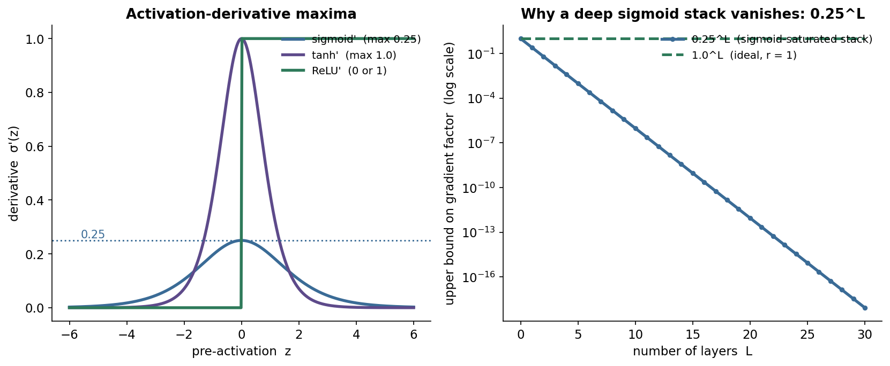
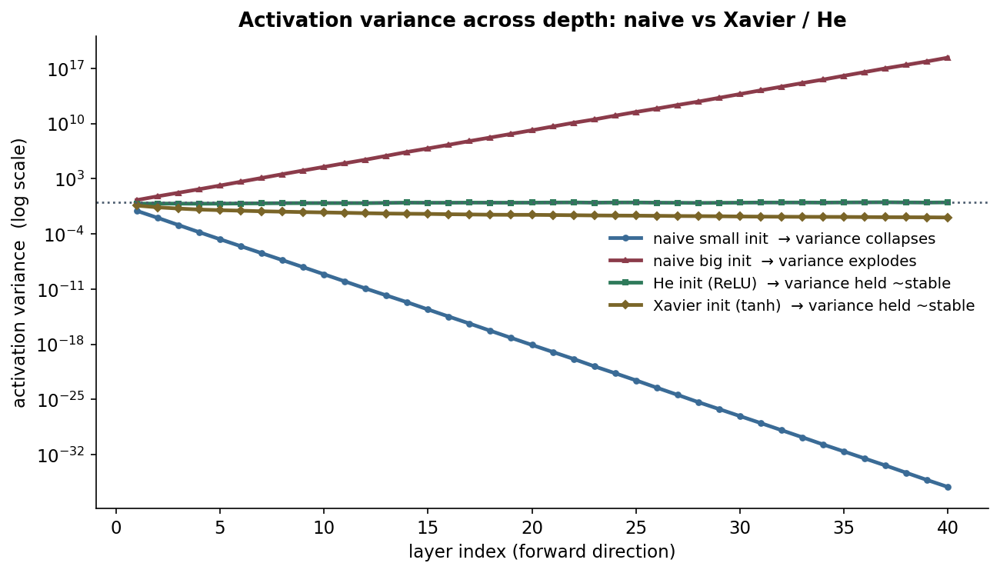
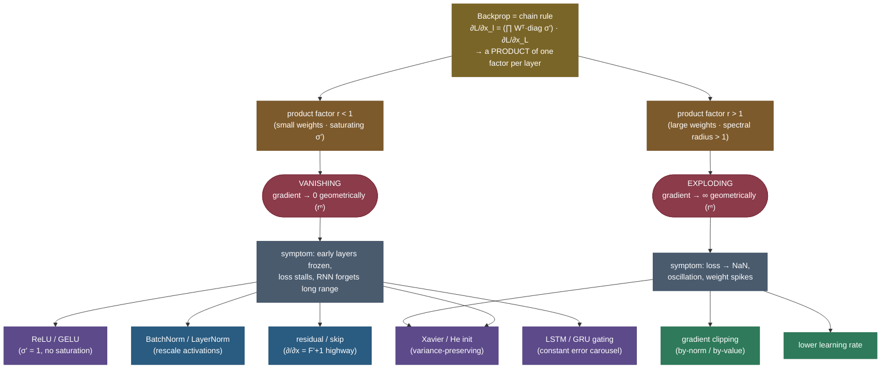
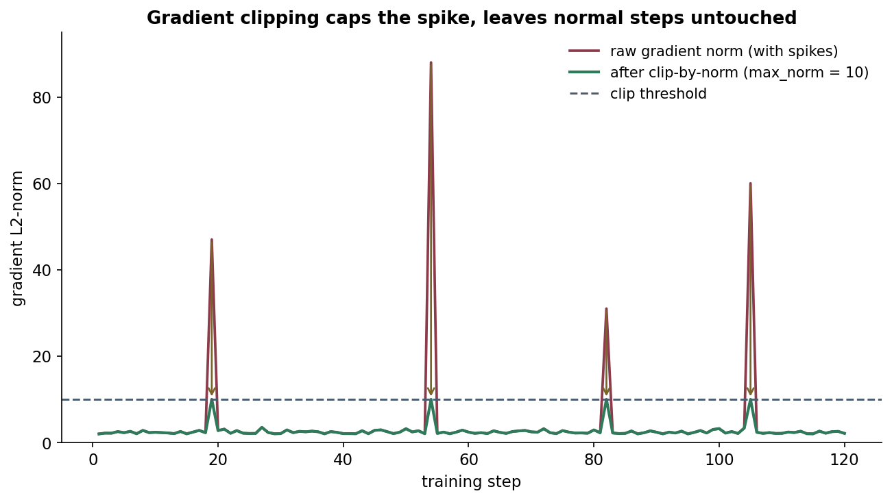
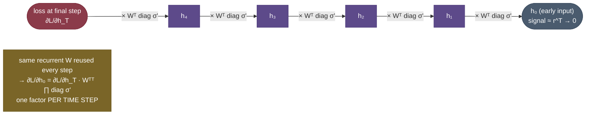

# Vanishing and exploding gradients: why deep networks wouldn't train

For about two decades, the single most stubborn fact in neural networks was this: **"just add more layers" did not work.** Past a handful of layers, networks got *harder* to train, not better — the loss would stall with the early layers barely moving, or training would suddenly fly apart into `NaN`. Recurrent networks were worse still; they simply could not learn to connect something at the end of a sentence to something at the beginning. For a long time nobody could make very deep or long-recurrent models learn, and it wasn't obvious why.

The culprit turned out to be a single mechanism hiding inside backpropagation. The gradient that reaches an early layer is a **product** of many per-layer factors — one Jacobian for every layer (or every time step) the signal passes through on its way back. And a product of many numbers is a *knife-edge*. If those factors are consistently **a little less than 1**, the product shrinks toward zero **exponentially in depth** and the gradient **vanishes** — the early layers receive almost no learning signal and freeze. If they're consistently **a little more than 1**, the product blows up exponentially and the gradient **explodes** — the update is enormous and training diverges. There is no middle setting that is automatically safe; only a factor of *exactly* 1 is stable, and a product of many independent factors essentially never lands there by accident.

Almost the entire modern toolkit for training deep nets — ReLU, careful initialization (Xavier/He), normalization (BatchNorm/LayerNorm), residual connections, LSTM/GRU gates, and gradient clipping — exists for one reason: **to keep that per-layer product near 1.** Once you see the problem as "repeated multiplication of a factor," every fix on that list snaps into focus as a different way to control the same factor. That's the through-line of this page.

By the end of this page you'll be able to:

- explain **mechanistically** why backprop multiplies Jacobians, and **derive** the product $\partial L/\partial x_l = \partial L/\partial x_L \cdot \prod_{k=l}^{L-1}\big(W_k^{\top}\,\mathrm{diag}(\sigma'(z_k))\big)$;
- take **norms** of that product to show why $r<1$ vanishes and $r>1$ explodes geometrically (the spectral-radius argument);
- show why **sigmoid/tanh saturation** makes vanishing worse — including the **derivation** that $\sigma'_{\text{sigmoid}}\le 0.25$, so a deep sigmoid stack decays like $0.25^L$;
- **derive** why **Xavier/He init** preserves variance, why **normalization** stabilizes the signal, and why **residual connections** give a "$+1$ gradient highway";
- apply **gradient clipping** for the explosion side, **derive** the clip-by-norm rescale, and know exactly where it comes from;
- recognize the **through-time** version in RNNs (a product over time steps) and why **LSTM/GRU gating** fixes it;
- **measure** all of this in runnable code and read a per-layer gradient-norm plot like a practitioner.

Intuition and pictures first, then the math (derived, with sources), then runnable code you can paste and verify.

> **Note:** vanishing and exploding gradients are the *same* phenomenon — repeated multiplication — pointing in two directions. That's why the cures overlap: anything that keeps the per-layer gradient factor near **1** (good activations, good init, normalization, skip connections, gating) fights *both* at once, while clipping is a targeted patch for the explosion side only. Hold onto that unifying idea; it's the whole page in one sentence.

---

## The problem: deep and recurrent networks that won't learn

Before any math, here are the three symptoms an interviewer wants you to recognize on sight — because in practice you diagnose this problem from its fingerprints, not from a derivation:

- **A deep network trains slowly or stalls**, and when you inspect it, the **early layers' weights barely change** between epochs — their gradients are effectively zero. The network behaves as if only the last few layers exist. *(vanishing)*
- **Training suddenly diverges.** The loss is descending nicely, then in one step it spikes and the next step is `inf` or `NaN`. Often you'll see the gradient norm jump by orders of magnitude right before the blow-up. *(exploding)*
- **An RNN can't learn long-range dependencies.** It handles short contexts fine but cannot connect a late output to an early input — by the time the gradient is back-propagated through many time steps, it has shrunk to nothing, so the early time step receives no credit. *(vanishing, through time)*

All three trace to the **same** product-of-Jacobians structure. The exponential is hidden, but it's the cause of every one of them. The rest of this page is: *(1)* derive that exponential, *(2)* show what tips it toward 0 or ∞, and *(3)* go fix by fix through the toolkit that tames it.

> **Gotcha:** these symptoms are easy to misread as "bad learning rate" or "not enough data." The tell is **where** the trouble lives: a *uniform* slow-down is usually optimization or data; **early layers specifically frozen** (or a **sudden `NaN` after a gradient-norm spike**) is the gradient-pathology signature. When in doubt, **log per-layer gradient norms** — that single plot diagnoses it instantly (we build it below).

### A short history: how each fix unlocked more depth

This problem is not academic trivia — it *is* the history of deep learning, told as a series of victories over the same exponential:

- **1991 — Hochreiter** identifies the vanishing-gradient problem in his diploma thesis: gradients through deep/recurrent nets shrink exponentially, so early layers and distant time steps don't learn.
- **1994 — Bengio, Simard & Frasconi** formalize it for RNNs, proving the trade-off: a recurrence that reliably stores information *necessarily* has vanishing gradients. This was a genuine impossibility-flavored result, and it stalled RNN research for years.
- **1997 — Hochreiter & Schmidhuber** introduce the **LSTM**: an additive cell state (the constant error carousel) that routes the gradient around the multiplicative bottleneck. The first real defeat of through-time vanishing.
- **2010 — Glorot & Bengio** derive **Xavier init** from variance preservation, showing the right *starting* weight scale keeps the signal alive — and that saturating activations were a big part of the problem.
- **2013 — Pascanu, Mikolov & Bengio** analyze the **exploding** side via the spectral radius and introduce **gradient-norm clipping**, finally making RNNs trainable in practice.
- **2015 — He et al.** ship **He init** + popularize **ReLU** for very deep nets, then **ResNet** (residual connections) trains **152 layers** — the moment "deeper is better" finally became true. The same year, **Ioffe & Szegedy's BatchNorm** stabilizes the signal *during* training.
- **2017+ — Transformers** combine all of it (residuals + LayerNorm + careful init + clipping) and scale to hundreds of layers and billions of parameters. None of it works without the vanishing/exploding-gradient fixes underneath.

Every breakthrough on that list is a different way to keep the per-layer factor near 1. That's why understanding *this* mechanism gives you the key to most of modern deep-learning architecture.

---

## The mechanism: backprop multiplies a factor per layer

Let's derive the exponential from backprop itself, because the whole problem — and every fix — falls out of one equation.

Consider a plain feedforward net. Layer $k$ takes the previous activation $x_k$, applies a linear map and an elementwise nonlinearity:

$$z_k = W_k\, x_k, \qquad x_{k+1} = \sigma(z_k).$$

We want the gradient of the loss $L$ with respect to an **early** activation $x_l$, given the gradient at the **last** layer $x_L$. By the chain rule, the gradient passes back through every layer in between. For one layer, differentiate $x_{k+1}=\sigma(W_k x_k)$:

$$\frac{\partial x_{k+1}}{\partial x_k} = \underbrace{\mathrm{diag}\!\big(\sigma'(z_k)\big)}_{\text{nonlinearity Jacobian}}\; \underbrace{W_k}_{\text{linear map}}.$$

The backward pass multiplies the *transpose* of these Jacobians (because gradients flow as $\partial L/\partial x_k = (\partial x_{k+1}/\partial x_k)^{\top}\,\partial L/\partial x_{k+1}$). Composing across all layers from $l$ up to $L$ gives the central equation of this entire topic:

$$\boxed{\;\frac{\partial L}{\partial x_l} \;=\; \left(\prod_{k=l}^{L-1} W_k^{\top}\,\mathrm{diag}\!\big(\sigma'(z_k)\big)\right)\frac{\partial L}{\partial x_L}\;}$$

Read it slowly: the gradient reaching layer $l$ is the gradient at the top, **multiplied by one matrix factor for every layer in between**. Each factor bundles that layer's weight matrix $W_k$ and its activation derivative $\mathrm{diag}(\sigma'(z_k))$. *Nothing else* determines whether the signal survives the trip back.

**Now take norms.** Using the sub-multiplicative property $\lVert AB\rVert \le \lVert A\rVert\,\lVert B\rVert$:

$$\left\lVert \frac{\partial L}{\partial x_l}\right\rVert \;\le\; \left(\prod_{k=l}^{L-1} \big\lVert W_k^{\top}\big\rVert \cdot \big\lVert \mathrm{diag}(\sigma'(z_k))\big\rVert\right)\left\lVert \frac{\partial L}{\partial x_L}\right\rVert.$$

Define the **per-layer factor** $r_k = \lVert W_k\rVert \cdot \max|\sigma'(z_k)|$ (the spectral norm of the weight times the largest activation-derivative magnitude). Approximate them all by a typical magnitude $r$, and over $n = L-l$ layers the gradient scales like:

$$\left\lVert \frac{\partial L}{\partial x_l}\right\rVert \;\sim\; r^{\,n}\left\lVert \frac{\partial L}{\partial x_L}\right\rVert.$$

That **$r^n$** is the villain of the entire story:

- if $r < 1$: $r^n \to 0$ — the gradient **vanishes geometrically**, early layers stop learning;
- if $r > 1$: $r^n \to \infty$ — the gradient **explodes geometrically**, training diverges;
- if $r = 1$: stable — but this is a measure-zero knife-edge you have to *engineer*, not get for free.


This is the whole problem in one measured picture. The blue line is vanishing, the red is exploding, the green stays flat — and the difference between them is *only* the choice of activation and initialization, i.e. the value of $r$. To make the scale visceral: $r=0.7$ over 25 layers gives $0.7^{25}\approx 10^{-4}$ (gradient four orders of magnitude smaller); $r=1.3$ gives $1.3^{25}\approx 700$ (a thousand-fold blow-up). **Depth turns a small per-layer bias into an exponential catastrophe**, and only $r\approx 1$ is safe.

> **Note:** there's a subtlety worth knowing for interviews. The norm bound above uses the *spectral norm* $\lVert W\rVert$ (largest singular value). A tighter statement uses the **spectral radius** $\rho(W)$ (largest eigenvalue magnitude) of the product Jacobian: the gradient grows iff $\rho>1$ and decays iff $\rho<1$. For the deep-net intuition the singular-value bound is enough; the spectral-radius view is the rigorous one and the one **Pascanu et al. (2013)** use for RNNs.

> *Where this comes from: the product-of-Jacobians analysis of vanishing gradients is **Learning long-term dependencies with gradient descent is difficult** (Bengio, Simard & Frasconi 1994) and **Deep Learning** (Goodfellow, Bengio & Courville) §8.2.5 / §10.7; the exploding-gradient and spectral-radius analysis is **On the difficulty of training RNNs** (Pascanu, Mikolov & Bengio 2013) — all in the references.*

### A tiny numeric trace: watch one factor shrink the gradient

To make the product tangible, walk a $2\times 2$ example by hand. Suppose every layer's combined Jacobian factor is the same diagonal matrix (weights scaled so the effective per-layer multiplier is 0.5 on each coordinate):

$$J = \begin{bmatrix} 0.5 & 0 \\ 0 & 0.5 \end{bmatrix}, \qquad \frac{\partial L}{\partial x_L} = \begin{bmatrix} 1 \\ 1 \end{bmatrix}.$$

Back-propagating through one layer multiplies by $J$: $J\,[1,1]^\top = [0.5, 0.5]^\top$. Through two layers: $J^2\,[1,1]^\top = [0.25, 0.25]^\top$. Through $n$ layers the gradient is $[0.5^n,\,0.5^n]^\top$, with norm $\sqrt{2}\cdot 0.5^n$:

| layers back $n$ | gradient norm | |
|---|---|---|
| 0 | $1.41$ | (at the loss) |
| 4 | $0.088$ | already 16× smaller |
| 10 | $1.4\times 10^{-3}$ | barely a signal |
| 20 | $1.3\times 10^{-6}$ | **vanished** |

Now flip the multiplier to $1.5$ (factor $> 1$): the same trace gives $[1.5^n, 1.5^n]^\top$, so at $n=20$ the norm is $\sqrt{2}\cdot 1.5^{20}\approx 4{,}900$ — **exploded**. Nothing about this depends on the network being fancy; it's just $0.5^n$ versus $1.5^n$, the two branches of $r^n$. This is the *whole* mechanism, and every fix below is about keeping that diagonal entry near 1 instead of 0.5 or 1.5.

The diagonal case makes the multiplier obvious, but real weight matrices aren't diagonal — and that's where **spectral radius** earns its keep. For a general $W$, the long-run growth/decay of $W^n v$ is governed by the **largest-magnitude eigenvalue** $\rho(W)$, *not* by individual entries. A matrix can have small entries yet $\rho>1$ (and explode), or large entries yet $\rho<1$ (and vanish). For example $W=\begin{bmatrix}0.6 & 0.6\\ 0.6 & 0.6\end{bmatrix}$ has $\rho = 1.2 > 1$ (its eigenvalues are $1.2$ and $0$), so repeated multiplication grows like $1.2^n$ despite every entry being below 1. This is why the rigorous criterion for vanishing/exploding — especially in RNNs, where the *same* $W$ is raised to the power $T$ — is stated in terms of $\rho(W)$ relative to 1, and why constraining the spectral radius (or the closely-related spectral norm) is a principled, if heavier-weight, alternative to clipping.

### The backward pass has its own variance budget

The forward derivation above ($\mathrm{Var}(z)=n_\text{in}\mathrm{Var}(W)\mathrm{Var}(x)$) keeps *activations* stable going forward. But the gradient flows **backward**, and it has its own variance to conserve. Propagating $\partial L/\partial x_{k}= W_k^\top (\partial L/\partial x_{k+1}\odot\sigma')$, the same independence argument gives, for the gradient variance $\mathrm{Var}(g)$:

$$\mathrm{Var}(g_k) \;\approx\; n_\text{out}\,\mathrm{Var}(W)\,\overline{(\sigma')^2}\,\mathrm{Var}(g_{k+1}).$$

To keep the *gradient* variance constant you need $n_\text{out}\,\mathrm{Var}(W)\,\overline{(\sigma')^2}\approx 1$. This is why Xavier uses $n_\text{in}+n_\text{out}$ (it can't perfectly satisfy both the forward $1/n_\text{in}$ and backward $1/n_\text{out}$ conditions, so it averages them) and why He's $2/n_\text{in}$ carries the same factor-of-2 that the forward ReLU analysis produced — the $\overline{(\sigma')^2}=\tfrac12$ for ReLU shows up identically in the backward budget. **Forward signal preservation and backward gradient preservation are two sides of the same variance equation**, which is the deeper reason variance-preserving init fixes *both* vanishing and exploding at once.

---

## Intuition: the telephone game, and compound interest

Two analogies make the exponential feel inevitable.

**The telephone game (vanishing).** A message is whispered down a line of 25 people, and each person passes on only ~70% of what they heard. By person 25, $0.7^{25}\approx 0.0001$ of the original survives — the message is gone. The "gradient" is the correction signal traveling *back* up the line to tell person 1 what to fix; if each person attenuates it, person 1 hears nothing and never improves. That's a frozen early layer.

**Compound interest (exploding).** Money at +30% per period grows $1.3^{25}\approx 700\times$ in 25 periods. The exact same compounding, applied to a gradient where each layer multiplies it by $r>1$, makes the update astronomically large by the time it reaches the early layers — one step overshoots so far the loss becomes `NaN`. Vanishing and exploding are **the same compounding**, one with a rate below 1 and one above it.

The reason the cures are so consistent is now obvious: **you want the "rate" to be 1.** A signal multiplied by 1 at every step arrives unchanged. Everything below — ReLU, careful init, normalization, residual highways, gating — is a different mechanism for nudging that per-step rate back to 1.

There are really only **two knobs** on the per-layer rate $r=\lVert W\rVert\cdot\max|\sigma'|$: the **weight scale** $\lVert W\rVert$ (set by initialization, and re-centered by normalization) and the **activation derivative** $\max|\sigma'|$ (set by your choice of nonlinearity). Vanishing means at least one knob is turned down; exploding means at least one is turned up. Residual connections and LSTM gates are the third option — instead of tuning the knobs, they add a *parallel additive path* that bypasses the multiplication entirely, so the gradient has a route that doesn't depend on $r$ at all. Hold those three ideas — **scale the weights, pick the activation, add an additive bypass** — and you can re-derive the entire toolkit from scratch.

> **Tip:** if you remember one number, remember **1**. "Keep the per-layer gradient factor near 1" is the answer to *why* almost every deep-learning stability trick exists. In an interview, anchoring every fix to "it pushes $r$ toward 1" shows you understand the mechanism, not just the menu.

---

## Why this matters: it gates how deep you can go

It's worth stating plainly *why* this one mechanism deserves a whole page. Depth is the primary source of a neural network's representational power — each layer composes features from the previous one, and the richest functions (the ones that make deep learning "deep") need many layers of composition. **The vanishing/exploding-gradient problem is the thing that, for two decades, made depth unusable.** If you can't get a learning signal to the early layers, those layers stay at their random init forever and the "deep" network is effectively a shallow one wearing a tall hat.

So every gain in trainable depth — from ~5 layers in the 1990s to ResNet's 152 to today's 100+-layer transformers — is a *direct* consequence of better controlling $r$. The causal chain is tight:

$$\text{control } r \approx 1 \;\Rightarrow\; \text{gradients reach early layers} \;\Rightarrow\; \text{depth becomes trainable} \;\Rightarrow\; \text{more representational power} \;\Rightarrow\; \text{the models that work today.}$$

This is also why the topic is a perennial interview favorite: it sits at the intersection of calculus (the chain rule), linear algebra (norms and spectral radius), and practical engineering (init, normalization, architecture). A candidate who can derive $r^n$, explain the $0.25$ bound, justify He's factor of 2, and write clip-by-norm has demonstrated they understand *why* modern architectures look the way they do — not just that they do.

> **Note:** the same "keep the per-step factor near 1" principle reappears far beyond training deep nets — in the stability of iterated maps, in numerical linear algebra (condition numbers), and in any system that composes many transformations. Recognizing it as a *general* phenomenon, with deep-net training as one instance, is a sign you've truly internalized it.

---

## Why activations tip the balance: the 0.25 derivation

Two things set the per-layer factor $r$: the **activation's derivative** and the **weight scale**. Take the activation first, because it gives the cleanest derivation and the most famous number on this page.

The logistic sigmoid is $\sigma(z) = \dfrac{1}{1+e^{-z}}$. A classic identity is that its derivative is $\sigma'(z) = \sigma(z)\big(1-\sigma(z)\big)$. Let $s=\sigma(z)\in(0,1)$; then $\sigma' = s(1-s)$, a downward parabola in $s$. Maximize it:

$$\frac{d}{ds}\,s(1-s) = 1 - 2s = 0 \;\Rightarrow\; s = \tfrac12 \;\Rightarrow\; \sigma'_{\max} = \tfrac12\cdot\tfrac12 = \boxed{0.25}.$$

So **the sigmoid derivative never exceeds 0.25**, and it is that large only at $z=0$; out in the tails ($|z|\gtrsim 4$) it collapses toward 0 — the neuron is **saturated**. Now feed that into the product. Even in the best case, a stack of $L$ sigmoids contributes an activation-derivative factor of at most:

$$\prod_{k=1}^{L} \sigma'(z_k) \;\le\; 0.25^{\,L},$$

which decays *brutally*: $0.25^{10}\approx 9.5\times 10^{-7}$ and $0.25^{20}\approx 9\times 10^{-13}$. Even with perfectly scaled weights, deep sigmoid networks vanish on the activation term **alone**. This single inequality is most of why sigmoids disappeared from deep hidden layers.



Compare the alternatives:

- **tanh** has $\tanh'(z) = 1-\tanh^2(z)$, peaking at **1.0** at $z=0$ — four times better than sigmoid at the center, and it's zero-centered (helpful for optimization). But it *also saturates*: out in the tails $\tanh'\to 0$, so deep tanh stacks still vanish, just more slowly.
- **ReLU** is $\max(0,z)$ with derivative **exactly 1 for $z>0$** and 0 for $z<0$. The positive branch contributes a factor of exactly 1 — no saturation-driven shrinkage at all. This is the single biggest reason ReLU replaced sigmoid/tanh in deep hidden layers (see [Activation Functions](03-Activation-Functions.md)).

Here's the full activation lineup as it relates to gradient flow — the column that matters is the **derivative's range**, because that's the $\max|\sigma'|$ term in $r$:

| Activation | Derivative | Max $|\sigma'|$ | Saturates? | Gradient-flow verdict |
|---|---|---|---|---|
| Sigmoid | $s(1-s)$ | **0.25** | Yes (both tails) | Worst — $0.25^L$ decay even unsaturated |
| Tanh | $1-\tanh^2 z$ | **1.0** | Yes (both tails) | Better center, still vanishes deep |
| ReLU | $\mathbf{1}[z>0]$ | **1.0** | Half-dead (negative side) | Good, but "dying ReLU" risk |
| Leaky ReLU / PReLU | $1$ or $\alpha$ ($\approx 0.01$) | 1.0 | No | Fixes dying ReLU, keeps flow |
| GELU / Swish | smooth, $\approx 1$ for $z\gg 0$ | $\approx 1.1$ | No (smooth) | Modern default (transformers) |

The pattern is clear: the **non-saturating** activations (ReLU family, GELU, Swish) keep the derivative near 1 over the active region, so they don't multiply the gradient down. GELU and Swish — smooth, near-1 for positive inputs, with a small nonzero negative slope — are why transformers stopped using ReLU: they keep the gradient-flow benefit *and* avoid dead units.

> **Gotcha — dying ReLU.** ReLU fixes *shrinkage* but introduces its own failure: if a neuron's pre-activation is negative for every input (often from a large negative bias or a bad update), its gradient is **0 forever** and it never recovers — a "dead" unit. This is a *different* problem from vanishing (it's per-neuron, permanent, and one-sided), and it's exactly what **Leaky ReLU / PReLU / GELU** were designed to mitigate by giving the negative branch a small nonzero slope. Don't conflate "dying ReLU" with "vanishing gradients" in an interview — they have different causes and different fixes.

> **Note:** saturation is *state-dependent*, not just architectural. A well-initialized sigmoid net can still drift into saturation mid-training if activations grow; that's part of why **normalization** (which re-centers activations into the high-derivative region every layer) helps even when the activation function itself is unchanged.

---

## Why initialization tips the balance: variance preservation

The other lever on $r$ is the **weight scale**, and the right way to think about it is *variance*. We want the variance of the activations (forward) and of the gradients (backward) to stay **roughly constant from layer to layer** — neither shrinking (vanish) nor growing (explode). That requirement *derives* the famous initialization schemes.

**Xavier/Glorot (for tanh/sigmoid).** Take a linear layer $z = Wx$ with $n_\text{in}$ inputs, weights drawn i.i.d. with variance $\mathrm{Var}(W)$, and inputs with variance $\mathrm{Var}(x)$. For one output unit $z_i = \sum_{j=1}^{n_\text{in}} W_{ij} x_j$, independence gives:

$$\mathrm{Var}(z_i) = n_\text{in}\,\mathrm{Var}(W)\,\mathrm{Var}(x).$$

To keep $\mathrm{Var}(z)=\mathrm{Var}(x)$ on the **forward** pass we need $n_\text{in}\,\mathrm{Var}(W)=1$, i.e. $\mathrm{Var}(W)=1/n_\text{in}$. Running the same argument on the **backward** pass gives $\mathrm{Var}(W)=1/n_\text{out}$. Glorot & Bengio split the difference, giving the **Xavier** rule:

$$\mathrm{Var}(W) = \frac{2}{n_\text{in}+n_\text{out}}.$$

**He (for ReLU).** ReLU zeros out (in expectation) **half** of its inputs, halving the variance that passes through. So to preserve variance you must double the weight variance to compensate, giving the **He** rule:

$$\mathrm{Var}(W) = \frac{2}{n_\text{in}}.$$

That factor of **2** is precisely the correction for ReLU killing half the signal — a small change with a large effect at depth. The payoff is measurable: with He init the activation variance stays near 1 through 40 ReLU layers, while a naive init either collapses to ~$10^{-37}$ or explodes by $10^{17}$.



> **Note:** init controls *both* directions. Too-small weights → $r<1$ → vanish; too-large weights → $r>1$ → explode. Variance-preserving init is the choice that centers $r$ on 1 *before training even starts*, which is why it's the cheapest and most universal fix. See [Weight Initialization](05-Weight-Initialization.md) for the full treatment.

> **Tip:** PyTorch defaults already encode this — `torch.nn.init.kaiming_normal_` is He, `xavier_normal_` is Glorot, and `nn.Linear`/`nn.Conv2d` initialize with a Kaiming-style scheme by default. You rarely set this by hand, but you *should* know which one matches your activation (He↔ReLU/GELU, Xavier↔tanh/sigmoid) and why a mismatch reintroduces the problem.

**Worked init numbers.** Make it concrete for a hidden layer with $n_\text{in}=n_\text{out}=512$:

- **Xavier**: $\mathrm{Var}(W)=\dfrac{2}{512+512}=\dfrac{1}{512}\approx 0.00195$, so the std is $\sqrt{1/512}\approx 0.044$. (Uniform form: draw from $[-a,a]$ with $a=\sqrt{6/(n_\text{in}+n_\text{out})}\approx 0.077$.)
- **He**: $\mathrm{Var}(W)=\dfrac{2}{512}\approx 0.0039$, std $\sqrt{2/512}\approx 0.0625$ — exactly $\sqrt{2}\approx 1.41\times$ larger than Xavier, the ReLU compensation factor.

So "use He for ReLU" cashes out as "initialize weights ~41% larger than you would for tanh." Get this backwards (Xavier weights on a deep ReLU net) and each layer passes through only ~$1/\sqrt 2$ of the variance, so after 40 layers the signal is down by $2^{-20}\approx 10^{-6}$ — vanishing, purely from a one-line init mismatch. The factor of 2 is small; at depth it is everything.

> *Where this comes from: variance-preserving initialization is **Understanding the difficulty of training deep feedforward networks** (Glorot & Bengio 2010, Xavier) and **Delving Deep into Rectifiers** (He et al. 2015, He init) — references.*

---

## The fix toolkit, organized by mechanism

Every fix is a way to control the same product. The map below ties **cause → symptom → fix**, and the sections after it derive the two most important fixes (residual highways and clipping).



A one-line summary of each lever and which term of $r$ it attacks:

- **ReLU / GELU activations** — drive the activation-derivative term toward 1 (no saturation shrinkage). Attacks the $\max|\sigma'|$ factor.
- **Xavier / He initialization** — set the weight scale so $\lVert W\rVert$ keeps $r\approx 1$ from step 0. Attacks the $\lVert W\rVert$ factor.
- **Normalization (BatchNorm / LayerNorm)** — re-standardize activations each layer, keeping them in the high-derivative (unsaturated) region and re-centering $r$ *during* training, not just at init (see [Normalization](11-Normalization.md)).
- **Residual / skip connections** — add an identity path so the gradient has a route that *bypasses* the multiplying factors entirely (next section). The most important deep-net fix.
- **LSTM / GRU gating** — for RNNs, an additive cell-state path (the "constant error carousel") that lets gradients flow across many time steps without repeated multiplication.
- **Gradient clipping** — a blunt cap on the gradient *norm* for the explosion side only (derived two sections down).

### Why residual connections are a gradient highway

This is the most-asked "derive it" question on the topic, and it's two lines. A residual block computes $\text{out} = \mathcal{F}(x) + x$ instead of $\text{out} = \mathcal{F}(x)$ — it adds the input back to the block's output. Differentiate with respect to the input:

$$\frac{\partial\,\text{out}}{\partial x} = \frac{\partial \mathcal{F}(x)}{\partial x} + \frac{\partial x}{\partial x} = \mathcal{F}'(x) + 1.$$

That **$+1$** is everything. In the plain-net case the Jacobian factor was $\mathcal{F}'(x)$ alone, which could be tiny (vanishing) or huge (exploding). With the residual, the factor is $\mathcal{F}'(x)+1$: even if $\mathcal{F}'(x)\approx 0$ (the vanishing case), the gradient **still flows back through the identity path undiminished** — it can never fully vanish, because there is always the $+1$. Stack $N$ residual blocks and the backward pass has a clean "highway" straight to the early layers: expanding $\prod(\mathcal{F}'_k+1)$ contains a path that multiplies $1\cdot 1 \cdots 1 = 1$ all the way down.

This is exactly why ResNet could train **152 layers** in 2015 when plain nets stalled around 20 — and why *every* modern deep architecture, CNNs and transformers alike, is built from residual blocks. (In the gradient-vs-depth figure, the residual/BN line is the flat green one.)

> **Note:** residual connections don't just *help* gradient flow — they change what the layers have to learn. With $\text{out}=\mathcal{F}(x)+x$, a layer only needs to learn a **residual correction** $\mathcal{F}(x)=\text{out}-x$ on top of identity, which is often near-zero and far easier to fit than the full mapping. Easier optimization landscape *and* a gradient highway, from the same $+1$.

> *Where this comes from: the residual / identity-shortcut argument is **Deep Residual Learning for Image Recognition** (He et al. 2015) — references; see also [Residual / Skip Connections](18-Residual-Skip-Connections.md).*

### Why normalization helps (briefly, mechanistically)

BatchNorm/LayerNorm insert a step that re-standardizes each layer's pre-activations to roughly zero mean and unit variance: $\hat z = (z-\mu)/\sqrt{\sigma^2+\epsilon}$, then a learned rescale/shift. Two consequences for gradients: *(1)* activations stay in the **unsaturated, high-derivative** region of the nonlinearity, keeping the $\max|\sigma'|$ term healthy; and *(2)* the normalization makes each layer's output scale roughly invariant to the weight scale, so $\lVert W\rVert$ swings translate into smaller swings in the forward/backward signal — it actively re-centers $r$ toward 1 *during* training, complementing init (which only sets the starting point). This is why the healthy curve in the gradient-vs-depth figure uses BN-style renormalization to stay flat. Full treatment in [Normalization](11-Normalization.md).

The init-vs-normalization division of labor is worth stating crisply: **initialization centers $r$ on 1 at step 0; normalization keeps it there as the weights move.** Without normalization, a perfectly-initialized net can still drift into vanishing/exploding after a few thousand updates as the weight norms grow — init is a one-time guarantee, training is an ongoing process. That's exactly why the most robust recipes use *both*: matched init to start clean, normalization to *stay* clean. In the end-to-end demo below, it's the `LayerNorm` layers (not init alone) that keep the 20-layer ReLU net's gradient alive across 400 steps of training, not just at initialization.

---

## Gradient clipping: the patch for the explosion side

Clipping is the one fix that is **explosion-only** and the one that's a literal one-liner. The idea: if a gradient's norm exceeds a threshold, **rescale the whole vector down** to that threshold while keeping its **direction** unchanged.

**Clip-by-norm (derived).** Let $g$ be the full gradient vector and $\tau$ the threshold (`max_norm`). Define:

$$g \;\leftarrow\; \begin{cases} g & \text{if } \lVert g\rVert \le \tau,\\[4pt] \dfrac{\tau}{\lVert g\rVert}\,g & \text{if } \lVert g\rVert > \tau. \end{cases}$$

When clipping triggers, the new norm is $\big\lVert \tfrac{\tau}{\lVert g\rVert} g\big\rVert = \tfrac{\tau}{\lVert g\rVert}\lVert g\rVert = \tau$ — exactly the threshold — and because we scaled by a positive scalar, the **unit vector $g/\lVert g\rVert$ is unchanged**, so the *direction* of the step is preserved. You still step the way the gradient says to; you just don't take an insane-sized step. (A compact way to write it: $g \leftarrow g\cdot\min(1,\ \tau/\lVert g\rVert)$.)

**Clip-by-value** is the cruder cousin: clamp each component independently to $[-c, c]$. It's simpler but **distorts the direction** (different components get clipped by different amounts), so clip-*by-norm* is the standard choice for RNNs and transformers, where occasional gradient spikes — exactly the "cliffs" in the loss surface that Pascanu et al. describe — would otherwise blow up training.



The figure shows the key property: clipping is a **safety valve**, not a global rescale — normal steps (norm ~2) flow through unchanged, and only the rare spikes get capped. That's why you can leave it on permanently with essentially no downside on well-behaved steps.

**A subtlety: clip the *global* norm, not per-layer.** The standard practice (and PyTorch's `clip_grad_norm_`) computes the norm over **all** parameters concatenated, then rescales every gradient by the *same* factor. This preserves the relative scale between layers — which matters, because clipping each layer's gradient independently would distort the descent direction across the whole model, much like clip-by-value distorts it within a vector. One global rescale, direction fully preserved.

**Beyond fixed-threshold clipping.** Two refinements you may meet:
- **Adaptive Gradient Clipping (AGC)** scales the clip threshold *per parameter* by the ratio of the gradient norm to the weight norm, $\lVert g\rVert / \lVert W\rVert$ — so the cap adapts to each layer's scale. It let the *normalizer-free* (no BatchNorm) NFNets match BN-based ResNets, showing clipping can partially *substitute* for normalization's stabilizing role.
- **Spectral-norm constraints** attack the cause directly: bound $\lVert W\rVert$ (the largest singular value) so $r$ can't exceed 1 by construction — used in GAN training and as a Lipschitz constraint.

> **Tip:** clipping treats the *symptom*, not the cause. It keeps a spike from killing the run, but if you're clipping on *most* steps, your real problem is elsewhere — usually a too-high learning rate, bad init, or missing normalization. Reach for clipping as a seatbelt for the occasional spike; fix init/normalization/LR for a chronically exploding model.

> *Where this comes from: gradient norm clipping is **On the difficulty of training RNNs** (Pascanu et al. 2013) — references. In PyTorch it's `torch.nn.utils.clip_grad_norm_(params, max_norm)`, called between `loss.backward()` and `optimizer.step()`.*

---

## The through-time version: why RNNs were the original victims

Recurrent networks were where this problem was *first* felt, and they make it worse in a specific way. An RNN reuses the **same** recurrent weight matrix $W$ at **every** time step: $h_t = \sigma(W h_{t-1} + U x_t)$. Back-propagating the loss at the final step $T$ to an early hidden state $h_0$ multiplies one Jacobian **per time step** — and because it's the same $W$ each time, the product is essentially a *matrix power*:

$$\frac{\partial L}{\partial h_0} \;=\; \left(\prod_{t=1}^{T} W^{\top}\,\mathrm{diag}(\sigma'(z_t))\right)\frac{\partial L}{\partial h_T} \;\sim\; \big(W^{\top}\big)^{T}\,(\cdots).$$



A matrix power is governed by the **spectral radius** $\rho(W)$: if $\rho<1$ the contribution of distant time steps decays like $\rho^T\to 0$ (vanishing — the network forgets), and if $\rho>1$ it grows like $\rho^T\to\infty$ (exploding). Sequences are long (hundreds of steps), so the exponent $T$ is large and the effect is severe — which is *why* vanilla RNNs cannot learn long-range dependencies, and why clipping became standard for them.

**The fix: LSTM/GRU gating.** LSTMs route information through an additive **cell state** $c_t = f_t \odot c_{t-1} + i_t \odot \tilde c_t$, where $f_t$ is the forget gate. The gradient along the cell state is $\partial c_t/\partial c_{t-1} = f_t$ — a (near-)**additive** path, not a repeated matmul. When the forget gate is open ($f_t\approx 1$), the gradient flows across many time steps **without** being multiplied down by $W^\top$ and $\sigma'$ at each step. This is the **constant error carousel**: the same trick as a residual highway, but unrolled through time instead of through depth. GRUs achieve the same with a coupled update gate. (Full mechanics in [RNN / LSTM / GRU](14-RNN-LSTM-GRU.md).)

> **Note:** notice the deep symmetry — **residual connection** (depth) and **LSTM cell state** (time) are the *same idea*: replace a multiplicative path with an additive one so the gradient has an unobstructed route. Hochreiter's 1991 diploma thesis identified the vanishing-gradient problem in RNNs; the 1997 LSTM was the additive-path cure. Once you see "additive path = gradient highway," both architectures are obvious.

A **fully numeric** through-time example makes the spectral-radius claim concrete. Take a scalar recurrent unit $h_t = w\,h_{t-1}$ (linear, so $\sigma'=1$) over $T=30$ steps — the gradient of the final loss with respect to the first hidden state is $\partial h_T/\partial h_0 = w^T$:

- $w = 0.9$: $0.9^{30} \approx 0.042$ — the early step's contribution is 4% of the late step's. The network can *just* feel 30 steps back, and at $T=100$, $0.9^{100}\approx 2.7\times 10^{-5}$ — gone. **Vanished.**
- $w = 1.0$: $1.0^{30}=1$ — perfect memory, the knife-edge.
- $w = 1.1$: $1.1^{30} \approx 17.4$ — a 17× blow-up at 30 steps, $1.1^{100}\approx 13{,}780$ at 100. **Exploded.**

Now the LSTM contrast: replace the multiply with the additive cell-state recurrence $c_t = f_t\,c_{t-1} + \tilde c_t$ and hold the forget gate open at $f_t = 1$. Then $\partial c_T/\partial c_0 = \prod_{t} f_t = 1^{30} = 1$ — the gradient arrives **undiminished** across all 30 steps, *regardless* of the recurrent weight, because the path it travels is addition, not repeated multiplication. That single contrast ($w^T \to 0/\infty$ vs. $\prod f_t = 1$) is the entire reason LSTMs/GRUs replaced vanilla RNNs for long sequences.

> *Where this comes from: the RNN vanishing-gradient problem is **Hochreiter (1991)** and **Bengio et al. (1994)**; the LSTM cell-state cure is **Hochreiter & Schmidhuber, Long Short-Term Memory (1997)**; the spectral-radius + clipping analysis is **Pascanu et al. (2013)** — references.*

---

## Worked examples (increasing in complexity)

Six examples, each a notch harder — the first few verifiable in the code below, the last two worked by hand.

**Example 1 — the bare exponential ($N$ sigmoid layers).** Suppose every layer is sigmoid and saturated to its best case, contributing the maximal derivative $0.25$. The activation-derivative term of the gradient after $N$ layers is at most $0.25^N$:

- $N=10$: $0.25^{10} \approx 9.5\times 10^{-7}$ — already a *millionth* of the signal.
- $N=20$: $0.25^{20} \approx 9.1\times 10^{-13}$ — a *trillionth*.
- $N=50$: $0.25^{50} \approx 7.9\times 10^{-31}$ — numerically zero.

Even ignoring the weights entirely, depth alone kills the gradient in a sigmoid net. **Vanished.**

**Example 2 — a 20-layer chain with a tunable factor.** Now bundle weights and activation into a single per-layer factor $r$ over 20 layers; the early-layer gradient scales like $r^{20}$:

- $r = 0.8$ (mild shrink): $0.8^{20} \approx 0.012$ — early-layer gradient is ~1% of the signal. **Vanished.**
- $r = 1.0$ (perfectly tuned): $1.0^{20} = 1$. **Stable** — but this requires *exactly* the right init/activation.
- $r = 1.2$ (mild growth): $1.2^{20} \approx 38$. **Exploded** — a 38× amplification, and at depth 100 that's $1.2^{100}\approx 8\times 10^7$.

The lesson: even a *small* deviation of $r$ from 1 becomes enormous at depth 20 and catastrophic at depth 100. Keeping $r\approx 1$ is the entire job of the toolkit.

**Example 3 — He vs naive init, measured across 40 layers.** Run a real 40-layer ReLU net (averaged over 24 random seeds) and watch the *activation variance* per layer:

- **He init** ($\mathrm{Var}(W)=2/n_\text{in}$): variance starts at ~0.68 and is ~1.0 at layer 40 — **held stable**, exactly as the derivation promised.
- **naive small init** ($0.5/\sqrt{n_\text{in}}$): variance collapses to ~$10^{-37}$ by layer 40 — the forward signal (and with it the backward gradient) is gone.

This is the derivation made empirical: the factor of 2 in He init is *what* keeps the variance from collapsing through ReLUs.

**Example 4 — clipping rescues an exploded step.** A gradient $g=(30,-40,50)$ has norm $\lVert g\rVert = \sqrt{30^2+40^2+50^2} = \sqrt{5000}\approx 70.7$. With `max_norm` $=5$, clip-by-norm rescales it by $5/70.7$, producing a vector of norm **exactly 5.0** pointing in the **same direction**. Training takes a sane step instead of diverging — the explosion is contained without changing *where* the model wants to move.

**Example 5 — the full per-layer gradient-norm plot (the practitioner's view).** The single most useful diagnostic: back-propagate through a deep net and plot the gradient L2-norm reaching *each* layer. The `veg_grad_vs_depth.png` figure above *is* this plot, measured: sigmoid+Xavier decays smoothly to ~$10^{-25}$ (vanishing), naive-big-init ReLU climbs to ~$10^{10}$ (exploding), and ReLU+He+BN/residual stays flat in the healthy band. In real debugging you log exactly this plot during training — a downward slope toward the input means vanishing; an upward slope or spikes means exploding.

**Example 6 — plain vs residual, the same block side by side.** Take one block with internal Jacobian $\mathcal{F}'(x)=0.3$ (a vanishing-prone block), stacked 10 deep. Without a skip, the gradient factor through 10 blocks is $0.3^{10}\approx 5.9\times 10^{-6}$ — gone. *With* a residual, each block's factor is $\mathcal{F}'(x)+1 = 1.3$, so the product is $1.3^{10}\approx 13.8$ — the gradient not only survives but is mildly *amplified*, dominated by the identity path. Flip $\mathcal{F}'$ to an exploding $2.0$: plain gives $2^{10}=1024$ (blows up), residual gives $(2+1)^{10}=3^{10}\approx 59{,}000$ — note residuals *don't* fix explosion (that's clipping's job), they fix **vanishing** by guaranteeing the factor is at least $\approx 1$. The two failure modes need two different tools, and this example shows exactly which tool covers which: residual ⇒ floor the factor at ~1 (anti-vanish); clip ⇒ ceiling the norm (anti-explode).

---

## Code: measure it, then fix it

Everything above, runnable on CPU in a couple of seconds. This reproduces all five worked examples and prints the exact numbers quoted.

```python
"""Vanishing / exploding gradients: measure them, then clip an exploding one.
Verified on Python 3.12 (torch 2.12), CPU."""
import torch, numpy as np

# --- Example 1: the bare 0.25^N decay of a saturated sigmoid stack ---
for N in (10, 20, 50):
    print(f"0.25^{N:<2d} = {0.25**N:.3e}")
print()

# --- Example 3/5: gradient reaching the FIRST layer of a deep net ---
def grad_norm_at_input(mode, L=25, W=64, seed=0):
    """Forward then backward through L layers; return the gradient norm at layer 1."""
    rng = np.random.default_rng(seed)
    a = rng.standard_normal((W, 1)); Ws, zs, acts = [], [], [a]
    for _ in range(L):
        scale = (1/np.sqrt(W)) if mode == "sigmoid" else np.sqrt(2/W)   # Xavier vs He
        Wl = rng.standard_normal((W, W)) * scale
        z = Wl @ acts[-1]
        a = 1/(1+np.exp(-z)) if mode == "sigmoid" else np.maximum(0, z)
        Ws.append(Wl); zs.append(z); acts.append(a)
    g = np.ones((W, 1))
    for l in reversed(range(L)):
        if mode == "sigmoid":
            s = 1/(1+np.exp(-zs[l])); g = Ws[l].T @ (g * s * (1-s))     # sigmoid' = s(1-s)
        else:
            g = Ws[l].T @ (g * (zs[l] > 0))                            # ReLU' = 1[z>0]
    return np.linalg.norm(g)

print(f"sigmoid + Xavier: grad at layer 1 = {grad_norm_at_input('sigmoid'):.2e}  <- VANISHED")
print(f"ReLU + He init:   grad at layer 1 = {grad_norm_at_input('relu'):.2e}  <- healthy")
print()

# --- Example 3: He keeps activation variance ~1 across depth; naive collapses ---
def fwd_variance(mode, L=40, W=256, seeds=24):
    out = []
    for s in range(seeds):
        rng = np.random.default_rng(s); a = rng.standard_normal((W, 1)); vs = []
        for _ in range(L):
            scale = np.sqrt(2/W) if mode == "he" else 0.5/np.sqrt(W)
            a = np.maximum(0, (rng.standard_normal((W, W)) * scale) @ a); vs.append(a.var())
        out.append(vs)
    return np.mean(out, axis=0)
vh, vn = fwd_variance("he"), fwd_variance("naive")
print(f"He    init: var(layer1)={vh[0]:.3f}  var(layer40)={vh[-1]:.3f}  <- held ~1")
print(f"naive init: var(layer1)={vn[0]:.3f}  var(layer40)={vn[-1]:.2e}  <- collapsed")
print()

# --- Example 4: gradient clipping by norm (Pascanu et al. 2013) ---
g = torch.tensor([30.0, -40.0, 50.0]); max_norm = 5.0
clipped = g * min(1.0, max_norm / g.norm())                            # rescale, keep direction
print(f"clip: norm {g.norm():.1f} -> {clipped.norm():.1f}  (direction kept: "
      f"{torch.allclose(clipped/clipped.norm(), g/g.norm())})")
```

Output (reproducible):

```
0.25^10 = 9.537e-07
0.25^20 = 9.095e-13
0.25^50 = 7.889e-31

sigmoid + Xavier: grad at layer 1 = 6.79e-16  <- VANISHED
ReLU + He init:   grad at layer 1 = 3.14e+01  <- healthy

He    init: var(layer1)=0.681  var(layer40)=0.997  <- held ~1
naive init: var(layer1)=0.085  var(layer40)=7.50e-37  <- collapsed

clip: norm 70.7 -> 5.0  (direction kept: True)
```

> **Note:** read those numbers together. Through 25 **sigmoid** layers the gradient reaching the first layer is $\sim 10^{-16}$ — *utterly* vanished, so those layers cannot learn — while **ReLU + He** keeps it at a healthy $\sim 31$. He init holds activation variance at ~1 across 40 layers while naive init collapses it to $10^{-37}$. And clipping takes a gradient of norm 70.7 down to exactly 5.0 **without changing its direction**. Each line is one fix from the toolkit, measured.

> **Tip:** the teaching code uses NumPy so the backward pass is fully explicit. In a real model you'd let autograd do this and just **instrument** it: register hooks (`tensor.register_hook`) or read `param.grad.norm()` per layer after `loss.backward()`, and `torch.nn.utils.clip_grad_norm_(model.parameters(), 1.0)` before `optimizer.step()`. Same mechanics, two lines.

### End to end: a net that won't learn vs one that does

The clearest demonstration is to actually *train* two 20-layer networks on the same task and watch one stay frozen while the other learns. The target is standardized so that a model which learns **nothing** sits at loss $\approx 1.0$ (the variance — i.e. it can do no better than predicting the mean).

```python
"""A deep net that won't train (sigmoid + naive init) vs one that does (ReLU+He+LN+clip).
Verified on Python 3.12 (torch 2.12), CPU."""
import torch, torch.nn as nn

torch.manual_seed(0)
X = torch.randn(512, 16)
y = (X ** 2).sum(1, keepdim=True); y = (y - y.mean()) / y.std()   # standardized target

def make_net(act, init):
    layers, d = [], 16
    for _ in range(20):                                  # 20 hidden layers — deep enough to hurt
        lin = nn.Linear(d, 32)
        if init == "he":
            nn.init.kaiming_normal_(lin.weight, nonlinearity="relu")
        else:
            nn.init.normal_(lin.weight, std=0.05)        # naive small init
        layers += [lin, act()]; d = 32
        if act is nn.ReLU and init == "he":
            layers += [nn.LayerNorm(32)]                 # normalization keeps the signal alive
    layers += [nn.Linear(d, 1)]
    return nn.Sequential(*layers)

def train(net, clip=False, steps=400):
    opt = torch.optim.Adam(net.parameters(), lr=1e-3); lossfn = nn.MSELoss()
    for _ in range(steps):
        opt.zero_grad(); loss = lossfn(net(X), y); loss.backward()
        gnorm = net[0].weight.grad.norm().item()         # gradient reaching the FIRST layer
        if clip: torch.nn.utils.clip_grad_norm_(net.parameters(), 1.0)
        opt.step()
    return loss.item(), gnorm

lb, gb = train(make_net(nn.Sigmoid, "naive"))
lg, gg = train(make_net(nn.ReLU, "he"), clip=True)
print(f"baseline loss (predict the mean) = {y.var().item():.2f}")
print(f"sigmoid + naive init : final loss = {lb:.3f}   grad@layer1 = {gb:.2e}  (stuck at baseline)")
print(f"ReLU + He + LN + clip: final loss = {lg:.3f}   grad@layer1 = {gg:.2e}  (learns)")
```

Output:

```
baseline loss (predict the mean) = 1.00
sigmoid + naive init : final loss = 0.998   grad@layer1 = 0.00e+00  (stuck at baseline)
ReLU + He + LN + clip: final loss = 0.011   grad@layer1 = 6.73e-01  (learns)
```

The sigmoid + naive-init net's gradient at layer 1 is **literally `0.00e+00`** (it underflowed to zero through 20 saturating layers) — so after 400 steps the early layers never moved and the loss is still pinned at the predict-the-mean baseline of ~1.0. The ReLU + He + LayerNorm + clipping net has a healthy gradient (~0.67) reaching layer 1 and drives the loss down to **0.011** — nearly two orders of magnitude better. *Same task, same depth, same optimizer, same learning rate.* The only difference is the four fixes from the toolkit — and that difference is the line between a model that learns and one that does nothing at all.

> **Gotcha:** this is also a warning about **silent failure**. The sigmoid net didn't crash; it ran all 400 steps and produced a number. If you weren't watching the loss-vs-baseline (or the per-layer gradient norms), you might conclude "the task is just hard" and never realize the early layers were dead the whole time. Always sanity-check a deep model against the trivial baseline.

---

## Common misconceptions and interview traps

A few distinctions that separate a precise answer from a vague one:

- **"Vanishing gradients = small learning rate."** No. A small learning rate scales *every* layer's update uniformly; vanishing gradients shrink the signal *exponentially with depth*, so early layers get vastly less than late ones. The fixes are different (init/activation/normalization vs. just bumping the LR).
- **"ReLU solves vanishing gradients."** It *mitigates* the activation-derivative term (no saturation shrinkage on the positive side), but the **weight scale** still matters — a ReLU net with bad init still vanishes or explodes (the red curve in the gradient-vs-depth figure is ReLU). ReLU + He is the pair; ReLU alone isn't a guarantee.
- **"Dying ReLU is the same as vanishing gradients."** Different problems. Vanishing is a *global, exponential, two-sided* product effect across depth; dying ReLU is a *per-neuron, permanent, one-sided* effect (a unit stuck in its zero region). One is fixed by init/normalization/residuals; the other by leaky activations.
- **"BatchNorm and gradient clipping do the same thing."** No. Normalization keeps the *forward signal* (and thus $r$) healthy on **every** step, addressing the *cause*; clipping caps a gradient-norm *spike* after the fact, addressing a *symptom* on the explosion side only.
- **"Residual connections and normalization are redundant."** They attack different terms. Residuals add an identity path so the gradient can *bypass* the multiplying factors; normalization keeps those factors near 1 in the first place. Modern nets use both, together, on purpose.
- **"Exploding gradients are rare, so I can ignore them."** They're rare in well-tuned feedforward nets but *common* in RNNs/transformers and any model with a too-high learning rate or bad init — which is exactly why gradient clipping is a default in most large-model training recipes.

> **Tip:** when asked "how would you fix a deep net that won't train," resist naming a single trick. The strong answer is the *diagnostic loop*: log per-layer gradient norms → read the slope → vanishing (init/activation/normalization/residual) or exploding (clipping/LR/init). Showing the diagnosis-then-fix process beats reciting the menu.

---

## Where it matters

- **Recurrent networks** — the original motivation. Vanishing gradients across time steps is *why* LSTMs/GRUs (gated additive memory) exist, and *why* gradient clipping is standard practice for any RNN.
- **Very deep feedforward / convolutional networks** — before residual connections and normalization, depth past ~20 layers was effectively untrainable; ReLU + He + BN + residuals together unlocked ResNets (152+ layers) and everything after.
- **Transformers** — train stably at great depth *only* because they stack residual connections, LayerNorm, careful init, and gradient clipping. See [Transformer Architecture](16-Transformer-Architecture.md).
- **Historical pivot** — this problem, and the fixes for it, are much of *why* deep learning works at all today. The "deep learning revolution" is in large part the story of learning to keep $r\approx 1$.

**Pre-norm vs post-norm — a live VEG design choice.** The original Transformer put LayerNorm *after* the residual add ("post-norm": $x \leftarrow \text{LN}(x + \text{Sublayer}(x))$). This works for moderate depth but, at very large depth, the LayerNorm sits *on* the residual path and partially attenuates the identity gradient highway — so very deep post-norm transformers need careful learning-rate warmup or they diverge. **Pre-norm** ($x \leftarrow x + \text{Sublayer}(\text{LN}(x))$) moves the normalization *inside* the residual branch, leaving the identity path completely clean — the gradient highway is unobstructed all the way down. That's why essentially every modern large LLM uses **pre-norm** (often with RMSNorm): it's a direct application of the "keep the $+1$ identity path clean" principle to a 100-layer stack. The choice of *where* to put the norm is, at its core, a vanishing-gradient decision.

> **Tip — the practical debugging loop.** If a deep model won't learn, **log per-layer gradient norms** (one line with a hook). Norms shrinking toward the input → **vanishing**: switch to ReLU/GELU, check init matches the activation, add normalization and/or residual connections. Norms spiking or going `NaN` → **exploding**: add gradient clipping, lower the learning rate, and re-check init. This one plot turns a mysterious "it won't train" into a named, fixable problem.

> **Gotcha:** modern defaults (ReLU/GELU + Kaiming init + LayerNorm + residuals) make these failures *rare enough that engineers forget they exist* — until they hand-roll a deep MLP, an exotic activation, a very deep custom RNN, or remove normalization "to simplify," and the old ghost returns. Knowing the mechanism is what lets you diagnose it in five minutes instead of five days.

---

## A diagnosis walkthrough

Suppose you inherit a 30-layer feedforward model that "trains but plateaus at a bad loss." Here's the reasoning, mapped to what each observation rules in or out:

1. **Check the loss against the trivial baseline.** It sits near "predict the mean." → The model is learning *almost nothing*, not "a little." That points at a *signal* problem (gradients), not a capacity or data problem.
2. **Log per-layer gradient norms after one `backward()`.** You see norms of ~$10^{-1}$ at the output layers decaying smoothly to ~$10^{-12}$ at the input. → **Vanishing**, confirmed — and the *smooth* decay (not a spike) says it's the multiplicative product, not an explosion.
3. **Look at the activation.** It's sigmoid in the hidden layers. → Prime suspect: $0.25^{30}\approx 10^{-18}$, enough to explain the decay on its own. Swap to ReLU/GELU.
4. **Check the init.** It's `normal(std=0.02)` everywhere. → Too small for ReLU; switch to He. Re-log the gradient norms — they should flatten dramatically.
5. **If still imperfect**, add LayerNorm and (for >10 layers) residual connections. Re-log: the per-layer norm plot should now be roughly flat across depth.
6. **If you ever see a `NaN` instead**, that's the *other* failure — add `clip_grad_norm_` and lower the LR.

The whole diagnosis is *reading one plot* (per-layer gradient norm) and *matching the slope to a cause*. A downward slope toward the input is vanishing; an upward slope or a `NaN`-preceding spike is exploding. Everything else follows from the toolkit.

> **Note:** the reason this walkthrough is fast is that the symptom is *legible* once you know to look. Most "my deep model won't train" tickets are one of: wrong activation for the depth, init mismatched to the activation, missing normalization, or missing residuals — exactly steps 3–5. The mechanism tells you which.

---

## Application: a stabilization playbook

Put the pieces together into the order you'd actually apply them when building or debugging a deep model. The principle throughout is **keep $r$ near 1, then add a safety valve.**

1. **Match the activation to the depth.** For deep hidden layers use a **non-saturating** activation — ReLU/GELU/Swish — never sigmoid/tanh in the trunk. Reserve sigmoid for the *output* of a binary classifier (one layer, no depth to compound) and tanh for bounded gates. This alone removes the $0.25^L$ catastrophe.

2. **Match the init to the activation.** ReLU/GELU → **He/Kaiming** ($\mathrm{Var}=2/n_\text{in}$); tanh/sigmoid → **Xavier/Glorot** ($2/(n_\text{in}+n_\text{out})$). A mismatch (Xavier on ReLU, say) silently halves your variance every layer and re-introduces vanishing. In PyTorch this is one `nn.init.kaiming_normal_` call per layer (or just trust the framework default, which is Kaiming-style).

3. **Add normalization.** Insert **BatchNorm** (CNNs) or **LayerNorm** (transformers, RNNs, anything with variable batch/sequence) so activations are re-standardized every layer and can't drift into saturation or blow up mid-training. This makes the model robust to a *much* wider range of learning rates and inits — it's the difference between "works if tuned perfectly" and "just works."

4. **Add residual connections** for anything deep (>~10 layers). The identity path is the single biggest enabler of depth; it's why ResNets and transformers exist. With residuals, even a poorly-behaved block can't fully block the gradient.

5. **Turn on gradient clipping** as the explosion seatbelt — `clip_grad_norm_(params, 1.0)` (or a task-tuned threshold) between `backward()` and `step()`. Essentially free on well-behaved steps, life-saving on the occasional spike. Standard for RNNs and large-model training.

6. **For RNNs specifically**, prefer **LSTM/GRU** over vanilla RNNs (the additive cell state defeats through-time vanishing) and keep clipping on (RNNs are the explosion-prone case).

7. **Instrument and watch.** Log per-layer gradient norms (a one-line hook) and the loss-vs-baseline. A downward slope toward the input → vanishing (revisit steps 1–4); spikes/`NaN` → exploding (revisit steps 2, 5, and the learning rate).

> **Tip:** the steps are roughly ordered by *leverage per unit of effort*. If you can only do two things on a deep net, do **non-saturating activation + matched init** (steps 1–2); if you can do four, add **normalization + residuals** (steps 3–4). Clipping is cheap insurance you should almost always add on top.

> **Note:** normalization comes in a family, each suited to a regime — **BatchNorm** (across the batch; great for CNNs, awkward for tiny batches and sequences), **LayerNorm** (across features per example; the transformer/RNN default), **GroupNorm** (across feature groups; batch-size-robust for vision), and **RMSNorm** (LayerNorm without the mean-subtraction; cheaper, used in Llama-class models). They all serve the same gradient-stability role; pick the one whose normalization axis matches your data layout. See [Normalization](11-Normalization.md).

---

## Recap and rapid-fire

**If you remember nothing else:** backprop multiplies one Jacobian factor per layer, so the early-layer gradient scales like $r^{\text{depth}}$ — $r<1$ **vanishes**, $r>1$ **explodes**, and only $r\approx 1$ trains. Saturating activations (sigmoid's $\sigma'\le 0.25$) and bad init push $r$ off 1; the fixes (**ReLU/GELU, Xavier/He init, normalization, residual connections, LSTM/GRU gating**) keep it near 1, and **gradient clipping** caps the explosion side. RNNs are the worst case because the *same* $W$ is reused every time step, so the product is a matrix power governed by the spectral radius.

**Quick-fire — say these out loud:**

- *Why do gradients vanish/explode?* Backprop multiplies a Jacobian per layer; the product scales like $r^n$ — shrinks ($r<1$) or blows up ($r>1$) exponentially with depth.
- *Write the gradient product.* $\partial L/\partial x_l = \big(\prod_{k=l}^{L-1} W_k^{\top}\,\mathrm{diag}(\sigma'(z_k))\big)\,\partial L/\partial x_L$.
- *Why does sigmoid make it worse?* Its derivative is $s(1-s)$, **max 0.25** (at $z=0$) and $\to 0$ when saturated, so a deep stack multiplies many tiny factors ($\le 0.25^L$).
- *How does ReLU help, and what's its catch?* Derivative = 1 for $z>0$ (no saturation shrinkage); catch = **dying ReLU** (neurons stuck off forever), mitigated by Leaky/GELU.
- *What do Xavier/He init do?* Set weight variance so activation/gradient variance stays ~constant across layers — Xavier $=2/(n_\text{in}+n_\text{out})$ (tanh/sigmoid), He $=2/n_\text{in}$ (ReLU; the 2 offsets ReLU killing half the signal).
- *Why do residual connections fix it?* $\partial(\mathcal{F}(x)+x)/\partial x = \mathcal{F}'(x)+1$ — the $+1$ gives the gradient an identity highway that never fully vanishes.
- *Fix for RNN long-range vanishing?* LSTM/GRU gating — an **additive** cell-state path (constant error carousel) instead of a repeated matmul.
- *Fix for exploding?* Gradient clipping by norm — $g\leftarrow g\cdot\min(1,\tau/\lVert g\rVert)$, caps the norm at $\tau$ and keeps direction; also lower LR / better init.
- *How do you diagnose it?* Log per-layer gradient norms — shrinking toward the input → vanish; spiking/`NaN` → explode.

**The one-table cheat sheet** — every fix, the term of $r=\lVert W\rVert\cdot\max|\sigma'|$ it controls, and which failure it addresses:

| Fix | Controls | Fights | How |
|---|---|---|---|
| ReLU / GELU / Swish | $\max\|\sigma'\|$ | Vanish | Derivative $\approx 1$, no saturation shrinkage |
| Xavier / He init | $\lVert W\rVert$ | Both | Variance-preserving weight scale from step 0 |
| BatchNorm / LayerNorm | both terms | Both | Re-standardize activations each layer, keep $r\approx 1$ during training |
| Residual / skip | adds identity path | Vanish | $\mathcal{F}'(x)+1$ floors the factor at $\approx 1$ |
| LSTM / GRU gating | through-time path | Vanish (time) | Additive cell state (constant error carousel) |
| Gradient clipping | gradient *norm* | Explode | Cap $\lVert g\rVert$ at $\tau$, keep direction |
| Lower learning rate | step size | Explode | Smaller steps tolerate larger gradients |

Read across any row and you can state, in one breath, *what* the fix does and *why* — which is exactly the level of fluency this topic rewards.

---

## References and further reading

The curated link library for this topic — videos, courses, interactive/visual resources, articles, papers, books, and internal cross-links — lives in a companion file so it can be reused as a standalone reference list:

**→ [Vanishing / Exploding Gradients — references and further reading](06-Vanishing-Exploding-Gradients.references.md)**
