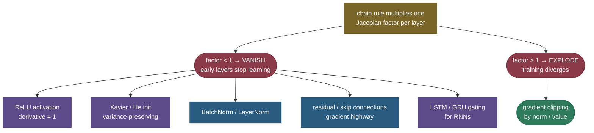

# Vanishing and exploding gradients: why deep networks wouldn't train

For years, "just add more layers" *didn't* work — past a certain depth, networks got harder to train, not better, and nobody could make very deep or recurrent models learn. The culprit was a single mechanism hiding inside backpropagation. The gradient that reaches an early layer is a **product** of many per-layer factors (one Jacobian per layer the signal passes through), and a product of many numbers is a knife-edge: if those factors are consistently **a bit less than 1**, the product shrinks toward zero and the gradient **vanishes** — early layers receive almost no learning signal. If they're consistently **a bit more than 1**, the product blows up and the gradient **explodes** — the update is enormous and training diverges. Almost the entire modern toolkit for training deep nets — ReLU, careful initialization, normalization, residual connections, LSTM gates, gradient clipping — exists to keep that product near 1.

By the end of this page you'll be able to:

- explain **mechanistically** why backprop multiplies Jacobians and how depth compounds the signal;
- show why **sigmoid/tanh saturation** makes vanishing worse, and why **bad init** causes either failure;
- derive why **residual connections** give a "gradient highway," and how **Xavier/He init** preserves variance;
- name the full **fix toolkit** and which problem each one solves;
- apply **gradient clipping** for the explosion side and know where it comes from;
- measure vanishing/exploding gradients and clipping in code.

Intuition and pictures first, then the math (with sources), then runnable code.

> **Note:** vanishing and exploding gradients are the *same* phenomenon — repeated multiplication — pointing in two directions. That's why the cures overlap: anything that keeps the per-layer gradient factor near **1** (good activations, init, normalization, skip connections) fights *both*, while clipping is a targeted patch for the explosion side only.

---

## The problem: deep and recurrent networks that won't learn

Symptoms an interviewer wants you to recognize:

- **A deep network trains slowly or stalls**, and inspection shows the **early layers' weights barely change** — their gradients are ~0 (vanishing).
- **Training suddenly diverges** — the loss jumps to `NaN` or infinity after a big spike (exploding).
- **RNNs can't learn long-range dependencies** — by the time the gradient is back-propagated through many time steps, it has vanished, so the network can't connect a late output to an early input.

All three trace to the same product-of-Jacobians structure.

---

## The mechanism: backprop multiplies a factor per layer

Backprop computes the gradient at an early layer by the chain rule, multiplying the local Jacobian of every layer between it and the loss. For a simple chain of $n$ layers, the gradient reaching the first layer is roughly a product of $n$ factors $r_1 r_2 \cdots r_n$, where each $r_l$ bundles that layer's weight matrix and activation derivative. Approximate them all by a typical magnitude $r$, and the gradient scales like $r^n$:


This is the whole story in one picture. $r = 0.7$ over 25 layers gives $0.7^{25} \approx 10^{-4}$ — the gradient is four orders of magnitude smaller at the early layers. $r = 1.3$ gives $1.3^{25} \approx 700$ — a thousand-fold blow-up. Only $r \approx 1$ is safe, and a product of many independent factors almost never sits exactly there by accident. **Depth turns a small per-layer bias into an exponential catastrophe.**

> *Where this comes from: the product-of-Jacobians analysis of vanishing gradients is **Learning long-term dependencies with gradient descent is difficult** (Bengio, Simard & Frasconi 1994) and **Deep Learning** (Goodfellow et al.) §10.7; the exploding-gradient analysis is **On the difficulty of training RNNs** (Pascanu, Mikolov & Bengio 2013) — references.*

---

## Why activations and initialization tip the balance

Two things set the per-layer factor $r$:

- **The activation's derivative.** Sigmoid's derivative peaks at **0.25** and is near 0 when saturated; tanh's peaks at 1 but also saturates. So a stack of sigmoids multiplies many numbers $\le 0.25$ — a fast track to vanishing. **ReLU's** derivative is exactly **1** for positive inputs, which is the single biggest reason it replaced sigmoid in deep nets (see [Activation Functions](03-Activation-Functions.md)).
- **The weight scale.** If weights are too small, $r < 1$ (vanish); too large, $r > 1$ (explode). **Variance-preserving initialization** sets the weight scale so the *variance* of activations (and gradients) stays roughly constant from layer to layer: **Xavier/Glorot** init (for tanh/sigmoid) and **He** init (for ReLU, scaled by $\sqrt{2/n}$ to account for ReLU zeroing half its inputs).

The measured behaviour through a real 25-layer network makes the fixes concrete:


> *Where this comes from: variance-preserving initialization is **Understanding the difficulty of training deep feedforward networks** (Glorot & Bengio 2010, Xavier) and **Delving Deep into Rectifiers** (He et al. 2015, He init) — references; see also [Weight Initialization](05-Weight-Initialization.md).*

---

## The fix toolkit



- **ReLU activation** — derivative 1 for positive inputs; no saturation-driven shrinkage.
- **Xavier / He initialization** — sets weight variance so the signal neither shrinks nor grows on average.
- **Normalization (BatchNorm / LayerNorm)** — re-standardizes activations each layer, keeping them in a healthy range so derivatives don't saturate (see [Normalization](11-Normalization.md)).
- **Residual / skip connections** — the most important deep-net fix (next section).
- **LSTM / GRU gating** — for RNNs, an additive cell-state path lets gradients flow across many time steps without repeated multiplication.
- **Gradient clipping** — caps the gradient for the explosion side.

### Why residual connections are a gradient highway

A residual block computes $\text{out} = \mathcal{F}(x) + x$ instead of $\text{out} = \mathcal{F}(x)$. Differentiate: $\frac{\partial\,\text{out}}{\partial x} = \mathcal{F}'(x) + 1$. That **$+1$** is everything — even if $\mathcal{F}'(x)$ is tiny (the vanishing case), the gradient still flows back through the identity path *undiminished*. Stack many residual blocks and the gradient has a clean "highway" straight to the early layers, which is exactly why ResNet could train 152 layers when plain nets stalled at ~20 (the measured figure shows the residual line staying flat). Every modern deep architecture — CNNs and transformers — relies on this.

> *Where this comes from: the residual / identity-shortcut argument is **Deep Residual Learning for Image Recognition** (He et al. 2015) — references; see also [Residual / Skip Connections](18-Residual-Skip-Connections.md).*

### Gradient clipping for explosions

When gradients explode, the fix is blunt and effective: if the gradient's norm exceeds a threshold, **rescale it down** to that threshold (keeping its direction). **Clip-by-norm** — $g \leftarrow g \cdot \frac{\text{max\_norm}}{\lVert g\rVert}$ when $\lVert g\rVert > \text{max\_norm}$ — is standard for RNNs and transformers, where occasional gradient spikes would otherwise blow up training. (Clip-by-value caps each component instead.)

> *Where this comes from: gradient norm clipping is **On the difficulty of training RNNs** (Pascanu et al. 2013) — references. The code shows it capping an exploded gradient while preserving direction.*

---

## Worked example: a 20-layer chain

Suppose every layer contributes a gradient factor of $r$ and there are 20 layers. The gradient reaching layer 1 scales like $r^{20}$:

- $r = 0.8$ (mild shrink): $0.8^{20} \approx 0.012$ — the early-layer gradient is ~1% of the signal. **Vanished.**
- $r = 1.0$ (perfectly tuned): $1.0^{20} = 1$. **Stable** — but this requires exactly the right init/activation.
- $r = 1.2$ (mild growth): $1.2^{20} \approx 38$. **Exploded** — a 38× amplification.

The lesson: even a *small* deviation of the per-layer factor from 1 becomes enormous at depth 20, and catastrophic at depth 100. Keeping $r \approx 1$ is the entire job of the fix toolkit.

---

## Code: measure vanishing gradients, and clip an exploding one

```python
"""Vanishing/exploding gradients through a deep net, and gradient clipping.
Verified on ml-py312 (torch 2.12), CPU."""
import torch, numpy as np

def grad_norm_at_input(mode, L=25, W=64):
    """Backprop through L layers; return the gradient norm reaching the FIRST layer."""
    rng = np.random.default_rng(0)
    a = rng.standard_normal((W, 1)); Ws, zs, acts = [], [], [a]
    for _ in range(L):
        scale = (1/np.sqrt(W)) if mode == "sigmoid" else np.sqrt(2/W)   # Xavier vs He
        Wl = rng.standard_normal((W, W)) * scale
        z = Wl @ acts[-1]
        a = 1/(1+np.exp(-z)) if mode == "sigmoid" else np.maximum(0, z)
        Ws.append(Wl); zs.append(z); acts.append(a)
    g = np.ones((W, 1))
    for l in reversed(range(L)):
        if mode == "sigmoid":
            s = 1/(1+np.exp(-zs[l])); g = Ws[l].T @ (g * s * (1-s))
        else:
            g = Ws[l].T @ (g * (zs[l] > 0))
    return np.linalg.norm(g)

print(f"sigmoid + Xavier: grad at layer 1 = {grad_norm_at_input('sigmoid'):.2e}  <- VANISHED")
print(f"ReLU + He init:   grad at layer 1 = {grad_norm_at_input('relu'):.2e}  <- healthy")

# gradient clipping by norm (Pascanu et al. 2013): rescale if too big, keep direction
g = torch.tensor([30.0, -40.0, 50.0]); max_norm = 5.0
clipped = g * min(1.0, max_norm / g.norm())
print(f"clip: norm {g.norm():.1f} -> {clipped.norm():.1f}  (direction kept: "
      f"{torch.allclose(clipped/clipped.norm(), g/g.norm())})")
```

Output:

```
sigmoid + Xavier: grad at layer 1 = 6.79e-16  <- VANISHED
ReLU + He init:   grad at layer 1 = 3.14e+01  <- healthy
sigmoid+Xavier vs ReLU+He confirms the activation/init choice; clip below caps the explosion
clip: norm 70.7 -> 5.0  (direction kept: True)
```

> **Note:** through 25 sigmoid layers the gradient that reaches the first layer is $\sim 10^{-16}$ — utterly vanished, so those layers cannot learn — while ReLU+He keeps it at a healthy $\sim 31$. And clipping takes a gradient of norm 70.7 down to exactly 5.0 **without changing its direction**, so training takes a sane-sized step instead of diverging.

---

## Where it matters

- **Recurrent networks** — the original motivation; vanishing gradients across time steps is *why* LSTMs/GRUs (with gated additive memory) exist, and why clipping is standard for RNNs.
- **Very deep networks** — before residual connections and normalization, depth past ~20 layers was untrainable; these fixes unlocked ResNets and beyond.
- **Transformers** — rely on residual connections, LayerNorm, and gradient clipping to train stably at great depth.
- **Historical pivot** — this problem (and its fixes) is much of *why* deep learning works at all today.

> **Tip:** the practical debugging loop — if a deep model won't learn, **log per-layer gradient norms**. Norms shrinking toward the input → vanishing (switch to ReLU/GELU, check init, add normalization/residuals). Norms spiking or `NaN` → exploding (add gradient clipping, lower the learning rate, check init).

---

## Recap and rapid-fire

**If you remember nothing else:** backprop multiplies one factor per layer, so the early-layer gradient scales like $r^{\text{depth}}$ — $r<1$ **vanishes**, $r>1$ **explodes**, and only $r\approx 1$ trains. Saturating activations and bad init push $r$ off 1; the fixes (**ReLU, Xavier/He init, normalization, residual connections, LSTM gating**) keep it near 1, and **gradient clipping** caps the explosion side.

**Quick-fire — say these out loud:**

- *Why do gradients vanish/explode?* Backprop multiplies a Jacobian per layer; the product shrinks ($r<1$) or blows up ($r>1$) exponentially with depth.
- *Why does sigmoid make it worse?* Its derivative ≤ 0.25 and →0 when saturated, so deep stacks multiply many tiny factors.
- *How does ReLU help?* Derivative = 1 for positive inputs — no saturation shrinkage.
- *What does Xavier/He init do?* Sets weight variance so activation/gradient variance stays ~constant across layers (He = ReLU version, $\sqrt{2/n}$).
- *Why do residual connections fix it?* $\partial(\mathcal{F}(x)+x)/\partial x = \mathcal{F}'(x)+1$ — the $+1$ gives gradients an identity highway that never vanishes.
- *Fix for RNN long-range vanishing?* LSTM/GRU gating (additive cell state across time).
- *Fix for exploding?* Gradient clipping (by norm or value); also lower LR / better init.
- *How do you diagnose it?* Watch per-layer gradient norms — shrinking → vanish, spiking/NaN → explode.

---

## References and further reading

The curated link library for this topic — videos, courses, interactive/visual resources, articles, papers, books, and internal cross-links — lives in a companion file so it can be reused as a standalone reference list:

**→ [Vanishing / Exploding Gradients — references and further reading](06-Vanishing-Exploding-Gradients.references.md)**
