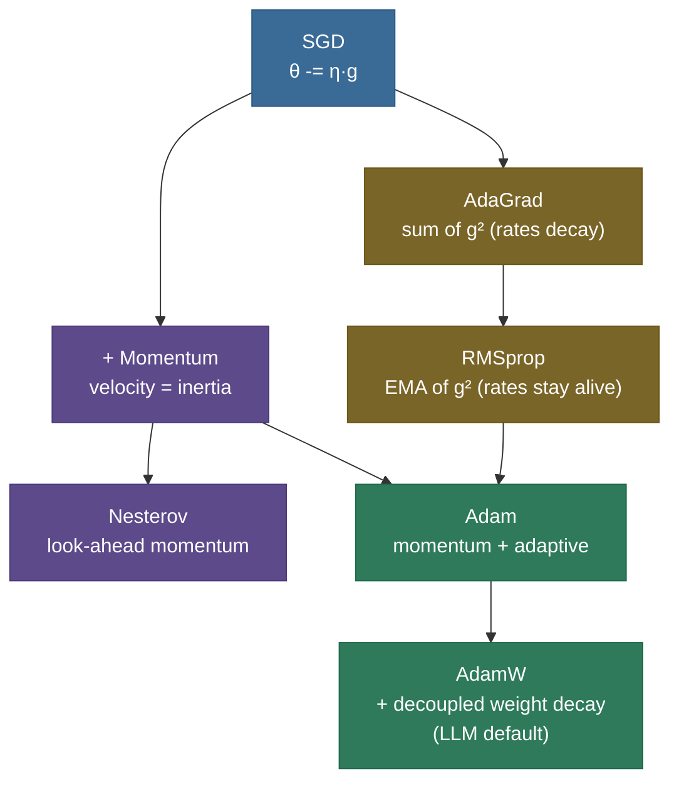
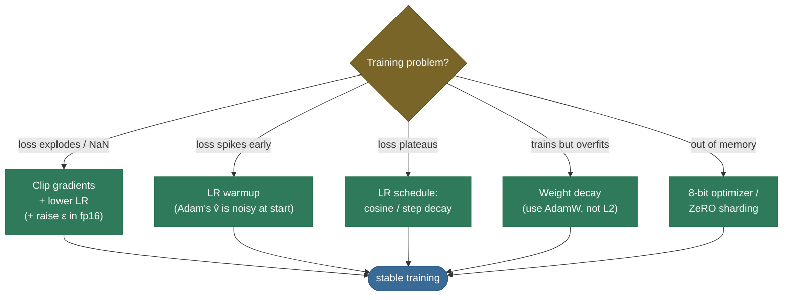

# Optimizers: turning gradients into good weight updates

Backprop hands you a **gradient** — the direction of steepest increase in the loss. The obvious move is to step the opposite way. But "step how far, in which combined direction, and at what rate for each of a billion parameters?" is exactly where naive gradient descent falls apart, and where the **optimizer** earns its keep. The optimizer is the rule that turns the raw gradient into the actual weight change — the difference between a model that converges in hours and one that oscillates forever or never trains at all.

This page is the complete tour. By the end you'll be able to:

- **write the SGD, Momentum, Nesterov, AdaGrad, RMSprop, and Adam update rules** and explain what each adds;
- explain **Adam's first/second moments and bias correction**, and **why AdamW decouples weight decay**;
- distinguish **weight decay from L2 regularization**;
- apply **gradient clipping**, **learning-rate warmup/schedules**, and the **batch-size↔LR** rule;
- reason about the **SGD-vs-Adam generalization trade-off** and **optimizer-state memory**;
- place the **newer optimizers** (Lion, Adafactor, Shampoo, Sophia) and why **second-order** methods aren't used for deep nets.

Intuition first (a ball rolling downhill), then the rules, then code that matches PyTorch exactly.

> **Note:** keep two ideas separate. **Gradient descent** is the *strategy* (move against the gradient). The **optimizer** is the *specific update rule* implementing it — how it uses the current gradient plus a memory of past gradients to decide each step.

---

## The problem: one learning rate can't fit every direction

Plain gradient descent uses a single global learning rate $\eta$ for every parameter: $\theta \leftarrow \theta - \eta g$. That breaks on real loss surfaces:

- **Ravines (ill-conditioning).** Steep in one direction, shallow in another: a rate small enough to be stable in the steep direction is far too small for the shallow one. Result: the classic **zig-zag**.
- **Heterogeneous gradients.** An embedding row for a rare word gets huge, infrequent gradients; a bias gets tiny, steady ones. One $\eta$ can't serve both.
- **Saddle points and noise.** High-dimensional surfaces are full of saddles, and the mini-batch gradient is noisy.


> **Tip:** "why not just lower the learning rate?" is a trap. Lowering $\eta$ fixes the steep-direction zig-zag but makes the already-slow shallow direction hopeless. Better optimizers stop using *one* rate for *every* direction.

---

## What it is

An optimizer is a function `(weights, gradient, state) → new weights`. The family is a short ladder, each rung adding one idea:

- **SGD** — step downhill.
- **+ Momentum / Nesterov** — accumulate a velocity to push *through* ravines.
- **+ Adaptive rates (AdaGrad → RMSprop)** — give each parameter its own effective rate.
- **Adam** — combine momentum **and** per-parameter adaptive rates.
- **AdamW** — Adam with **decoupled weight decay**; the default for transformers and LLMs.

---

## Intuition: a ball rolling downhill

Picture the loss as a landscape and your parameters as a ball on it.

- **SGD** is a *light* ball with no memory: on a ravine it rolls into a wall, then back, zig-zagging.
- **Momentum** makes the ball *heavy*: it builds velocity down the valley and averages out the back-and-forth, rolling *through* small bumps and saddles.
- **Adaptive methods** put a **governor on each wheel**: a parameter with huge, erratic gradients gets its step shrunk; one with small, steady gradients keeps its step.
- **Adam** is the heavy ball *with* per-wheel governors — momentum for direction, adaptive scaling for step size. It's why Adam "just works" out of the box.

---

## The update rules: SGD to RMSprop



- **SGD:** $\theta \leftarrow \theta - \eta g$.
- **Momentum:** $v \leftarrow \beta v + g;\ \theta \leftarrow \theta - \eta v$ ($\beta = 0.9$ ≈ averaging the last ~10 gradients).
- **Nesterov accelerated gradient (NAG):** evaluate the gradient at the *look-ahead* point $\theta + \beta v$ instead of $\theta$ — "look before you leap." Usually a bit faster/more stable than plain momentum; the standard for SGD+momentum in vision.
- **AdaGrad:** $s \leftarrow s + g^2;\ \theta \leftarrow \theta - \eta\,g/(\sqrt{s}+\epsilon)$. Accumulates *all* past squared gradients, so per-parameter rates **monotonically shrink** — great for sparse features, but the rate eventually decays to ~0 and learning stalls.
- **RMSprop:** $s \leftarrow \beta s + (1-\beta)g^2;\ \theta \leftarrow \theta - \eta\,g/(\sqrt{s}+\epsilon)$. Replaces AdaGrad's growing sum with an **EMA**, so rates stay alive — the fix that made adaptive methods practical.

> **Gotcha:** AdaGrad vs RMSprop is a favorite interview contrast. AdaGrad's denominator only grows (sum), so it *starves*; RMSprop's decays (EMA), so it *doesn't*. Adam inherits RMSprop's EMA for exactly this reason.

> **Note:** momentum's accumulated velocity makes its *effective* step roughly $1/(1-\beta)$ times the raw gradient — about **10×** at $\beta = 0.9$. That's why you use a **smaller** learning rate with momentum (and with Adam) than you might with plain SGD: the inertia is already amplifying each step.

---

## Why it matters

**Convergence — speed and whether it happens at all.** The optimizer largely determines how fast a network trains and whether it converges.

**Robustness — the real reason Adam dominates.** On a clean, well-conditioned problem a well-tuned SGD is hard to beat. Adam's superpower isn't being *fastest* — it's being **forgiving**: it converges across a wide range of learning rates, where SGD diverges if $\eta$ is too high and crawls if too low.


> **Note:** the famous **SGD-vs-Adam generalization trade-off**: tuned **SGD + momentum** often *generalizes better* (lower test error), especially in vision — which is why ResNets still use SGD. **Adam/AdamW** wins on transformers and anything with sparse/heterogeneous gradients, and wins on convenience everywhere. The honest answer names both.

---

## The math: Adam, bias correction, and AdamW

**Adam** keeps two exponential moving averages per parameter — the mean of recent gradients (first moment, *direction*) and the mean of recent *squared* gradients (second moment, *volatility*):

$$m_t = \beta_1 m_{t-1} + (1-\beta_1) g_t, \qquad v_t = \beta_2 v_{t-1} + (1-\beta_2) g_t^2$$

$$\hat{m}_t = \frac{m_t}{1 - \beta_1^t}, \qquad \hat{v}_t = \frac{v_t}{1 - \beta_2^t}, \qquad \theta_t \leftarrow \theta_{t-1} - \eta\,\frac{\hat{m}_t}{\sqrt{\hat{v}_t} + \epsilon}$$

The update is roughly *direction ÷ volatility*: steady parameters take full steps, jittery ones get throttled. Defaults: $\beta_1 = 0.9$, $\beta_2 = 0.999$, $\epsilon = 10^{-8}$.


**Why bias-correct?** $m$ and $v$ start at **0**, so early estimates are biased toward zero. Dividing by $(1-\beta^t)$ removes it: on step 1, $\hat m_1 = g_1$ (the code below prints exactly this). Without it the first $v$ is tiny, $\sqrt{\hat v}$ is tiny, and the **first steps are catastrophically large**.

---

## Weight decay vs L2 regularization

These are often conflated and the distinction is *the* reason AdamW exists.

- **L2 regularization** adds $\tfrac{\lambda}{2}\lVert\theta\rVert^2$ to the **loss**, so the gradient gains a $\lambda\theta$ term.
- **Weight decay** shrinks weights directly in the **update**: $\theta \leftarrow (1-\eta\lambda)\theta - \eta g$.

For **plain SGD** these are *identical*. But in **Adam**, L2's $\lambda\theta$ goes *through* the adaptive denominator $\sqrt{\hat v}$ — so weights with large gradients get *less* decay, which is not what you want. **AdamW** decouples it, applying the decay straight to the weights, outside the adaptive term:

$$\theta_t \leftarrow \theta_{t-1} - \eta\left(\frac{\hat m_t}{\sqrt{\hat v_t} + \epsilon} + \lambda\,\theta_{t-1}\right)$$

This small change measurably improves generalization and is why **AdamW**, not Adam, is the transformer default.

> **Note:** Adam isn't *guaranteed* to converge — Reddi et al. found cases where its EMA of $v$ "forgets" rare large gradients and overshoots. **AMSGrad** patches this by using the running **max** of $\hat v$ instead of the EMA, forcing a non-increasing step size. Plain AdamW is usually fine in practice, but naming this failure case is interview gold.

---

## Gradient clipping

Sometimes a single bad batch produces an enormous gradient that blows up the weights (an **exploding gradient**, common in RNNs and early LLM training). **Gradient clipping** caps it before the update:

- **Clip-by-norm (standard):** if $\lVert g\rVert > c$, rescale $g \leftarrow c\,g/\lVert g\rVert$ — keeps the *direction*, caps the *magnitude*. LLMs typically clip the global norm to ~1.0.
- **Clip-by-value:** clamp each component to $[-c, c]$ — cruder, changes direction.

> **Tip:** clip-by-**global-norm** (over all parameters at once) is the near-universal choice for transformer training. If loss occasionally spikes to NaN, turning on (or tightening) gradient clipping is the first thing to try.

---

## Learning-rate schedules and warmup

The optimizer sets the *direction and scaling*; the **schedule** sets how $\eta$ changes over training — and you almost never use a constant rate. The standard recipe is **warmup then decay**:

- **Warmup** — ramp $\eta$ from ~0 over the first few hundred/thousand steps. This matters *because* Adam's $\hat v$ estimate is unreliable early (exactly when bias correction works hardest), so big early steps are dangerous.
- **Decay** — **cosine** (smooth to ~0), **linear**, or **inverse-sqrt**, annealing the rate as you approach a minimum.

See [Learning-Rate Schedules & Warmup](08-Learning-Rate-Schedules-and-Warmup.md) for the full treatment.

> **Note:** **batch size and learning rate move together.** The **linear scaling rule**: when you multiply batch size by $k$, multiply $\eta$ by ~$k$ (with warmup to stay stable). Larger batches give less-noisy gradients that can tolerate — and need — bigger steps.

> **Tip:** can't fit a big batch in memory? **Gradient accumulation** sums gradients over several micro-batches before a single optimizer step, simulating a larger effective batch — then apply the linear-scaling LR as if the batch really were that large. It's how small-GPU setups train with large effective batch sizes.

---

## Newer optimizers and second-order methods

Beyond the AdamW default, a few directions worth knowing:

- **Lion** — a sign-based update ($\theta \leftarrow \theta - \eta\,\text{sign}(\text{interp}(m, g))$) discovered by search; keeps only **one** state (vs Adam's two), so half the optimizer memory, with competitive results.
- **Adafactor** — factorizes the second-moment matrix to use **sublinear** memory; built for training huge models where Adam's two full states don't fit (used for large T5).
- **Shampoo** — a **full-matrix** preconditioner (block-diagonal), closer to second-order; strong but heavier per step.
- **Sophia** — a light **Hessian**-based optimizer aimed at faster LLM pre-training.
- **Second-order methods** (Newton, **L-BFGS**, natural gradient) use curvature (the Hessian) for better steps, but the Hessian is $O(n^2)$ to store and $O(n^3)$ to invert — infeasible for million-to-billion-parameter nets. L-BFGS is occasionally used for small, full-batch problems; deep nets stick to first-order methods that only need the gradient.

> **Tip:** the unifying view: Adam's $1/\sqrt{\hat v}$ is a cheap **diagonal** approximation to the inverse-curvature that a true second-order method would compute exactly — "a poor man's second-order method." That one sentence ties the whole landscape together.

---

## Where it is used

- **AdamW** — the default for **Transformers, LLMs, and diffusion models**: sparse/heterogeneous gradients and huge parameter counts are its sweet spot.
- **SGD + momentum/Nesterov** — still standard for **CNNs / vision** (ResNets), where it generalizes better.
- **Adafactor / 8-bit Adam / ZeRO** — when optimizer-state memory is the constraint. Adam stores **two extra states per parameter** (~56 GB for a 7B model in FP32), so weights + gradients + moments ≈ **4× the parameter memory** before activations.

> **Tip:** the optimizer-state memory is a load-bearing fact for LLM-training interviews and the main reason full fine-tuning is so expensive — and why [LoRA/PEFT](../../09.%20LLMs/concepts/12-LoRA-and-PEFT.md) (far fewer trained parameters) saves so much.

---

## Application: choosing and configuring an optimizer

**Step 1 — pick it.** Transformer/LLM → **AdamW**. CNN/vision where you can tune for best test accuracy → **SGD + Nesterov momentum**. Memory-constrained huge model → **Adafactor / 8-bit Adam**. Prototyping → AdamW (robust by default).

**Step 2 — set the knobs.** AdamW defaults are stable: $\beta_1=0.9$, $\beta_2=0.999$ (or $0.95$ for large LLMs), $\epsilon=10^{-8}$ (raise in mixed precision), weight decay $0.01$–$0.1$. The one knob you must tune is the **learning rate**.

**Step 3 — pair it with a schedule and guards.** Warmup + cosine decay, gradient clipping at global-norm ~1.0, and the batch-size↔LR rule. The decision map when things go wrong:



> **Gotcha:** in mixed-precision (FP16) training, the default $\epsilon = 10^{-8}$ can **underflow** in $\sqrt{\hat v} + \epsilon$, making steps explode. If FP16 diverges early while FP32 is fine, raise $\epsilon$ before suspecting anything else.

---

## Code: the update rules, and Adam matching PyTorch

From-scratch SGD/Momentum/Adam, with the from-scratch Adam verified against `torch.optim.Adam` step for step. Runs on CPU in a second.

```python
"""From-scratch SGD / Momentum / Adam; Adam checked against torch.optim.Adam.
Verified on ml-py312 (torch 2.12), CPU."""
import torch
torch.manual_seed(0)

def sgd(w, g, st, lr=0.1):                       # plain gradient step
    return w - lr * g

def momentum(w, g, st, lr=0.1, beta=0.9):        # velocity accumulates -> inertia
    st["v"] = beta * st.get("v", torch.zeros_like(g)) + g
    return w - lr * st["v"]

def adam(w, g, st, lr=0.1, b1=0.9, b2=0.999, eps=1e-8):
    st["t"] = st.get("t", 0) + 1
    st["m"] = b1 * st.get("m", torch.zeros_like(g)) + (1 - b1) * g        # 1st moment (direction)
    st["v"] = b2 * st.get("v", torch.zeros_like(g)) + (1 - b2) * g * g    # 2nd moment (volatility)
    mhat = st["m"] / (1 - b1 ** st["t"])         # bias correction (crucial on early steps)
    vhat = st["v"] / (1 - b2 ** st["t"])
    return w - lr * mhat / (vhat.sqrt() + eps)   # per-parameter step: direction / sqrt(volatility)

# bias correction in action: on step 1 it recovers the true gradient
st = {}; g1 = torch.tensor([4.0])
_ = adam(torch.zeros(1), g1, st)
print("Adam step 1 — m raw:", round(st["m"].item(), 3),
      "| m_hat (bias-corrected):", round((st["m"] / (1 - 0.9)).item(), 3), "= true gradient 4.0")

# verify our Adam matches torch.optim.Adam, step for step
A = torch.tensor([6.0, 1.0])
def f(w): return 0.5 * (A * w ** 2).sum()
w_ref = torch.tensor([-9.0, -4.5], requires_grad=True)
opt = torch.optim.Adam([w_ref], lr=0.1, betas=(0.9, 0.999), eps=1e-8)
w_ours = torch.tensor([-9.0, -4.5]); st = {}
for _ in range(30):
    opt.zero_grad(); f(w_ref).backward(); opt.step()       # torch
    w_ours = adam(w_ours, A * w_ours, st)                  # ours (grad of f is A*w)
print("our Adam matches torch:", torch.allclose(w_ours, w_ref.detach(), atol=1e-5),
      "| max diff:", f"{(w_ours - w_ref.detach()).abs().max():.2e}")
```

Output:

```
Adam step 1 — m raw: 0.4 | m_hat (bias-corrected): 4.0 = true gradient 4.0
our Adam matches torch: True | max diff: 4.77e-07
```

> **Note:** the first line *is* bias correction: the raw first moment is `0.4` (biased toward the zero it started at), but $\hat m_1 = 0.4/(1-0.9) = 4.0$ recovers the true gradient. The second line confirms these ~10 lines reproduce PyTorch's Adam exactly.

---

## Recap and rapid-fire

**If you remember nothing else:** the optimizer turns a gradient into a weight step. **SGD** steps downhill; **Momentum/Nesterov** add velocity; **AdaGrad/RMSprop** give per-parameter rates; **Adam** combines momentum + adaptive scaling (bias-corrected); **AdamW** decouples weight decay and is the LLM default. Pair it with **warmup + decay** and **gradient clipping**. Adam's real edge is robustness to the learning rate, not raw speed.

**Quick-fire — say these out loud:**

- *SGD update?* $\theta \leftarrow \theta - \eta g$.
- *Nesterov vs momentum?* Nesterov evaluates the gradient at the look-ahead point $\theta + \beta v$ — "look before you leap."
- *AdaGrad vs RMSprop?* AdaGrad sums all past $g^2$ (rates starve); RMSprop uses an EMA (rates stay alive).
- *What do Adam's m and v track?* $m$ = EMA of the gradient (direction); $v$ = EMA of squared gradient (per-parameter scale).
- *Why bias-correct?* $m,v$ start at 0, biasing early estimates low; $/(1-\beta^t)$ fixes it and prevents huge first steps.
- *Weight decay vs L2?* Identical for SGD; in Adam, L2 goes through the adaptive denominator — AdamW decouples it (better generalization).
- *Gradient clipping?* Cap the global gradient norm (~1.0) to stop exploding-gradient NaNs.
- *Batch size ↔ LR?* Linear scaling rule: ×k batch → ×k learning rate (with warmup).
- *Adam's memory?* Two extra states per parameter ≈ 2× the weights — the reason for 8-bit Adam, Adafactor, ZeRO.
- *Why no second-order for deep nets?* The Hessian is $O(n^2)$ to store / $O(n^3)$ to invert; Adam's $1/\sqrt{\hat v}$ is a cheap diagonal stand-in.

---

## References and further reading

The curated link library for this topic — videos, courses, articles, papers, books, and internal cross-links — lives in a companion file so it can be reused as a standalone reference list:

**→ [Optimizers — references and further reading](07-Optimizers.references.md)**
