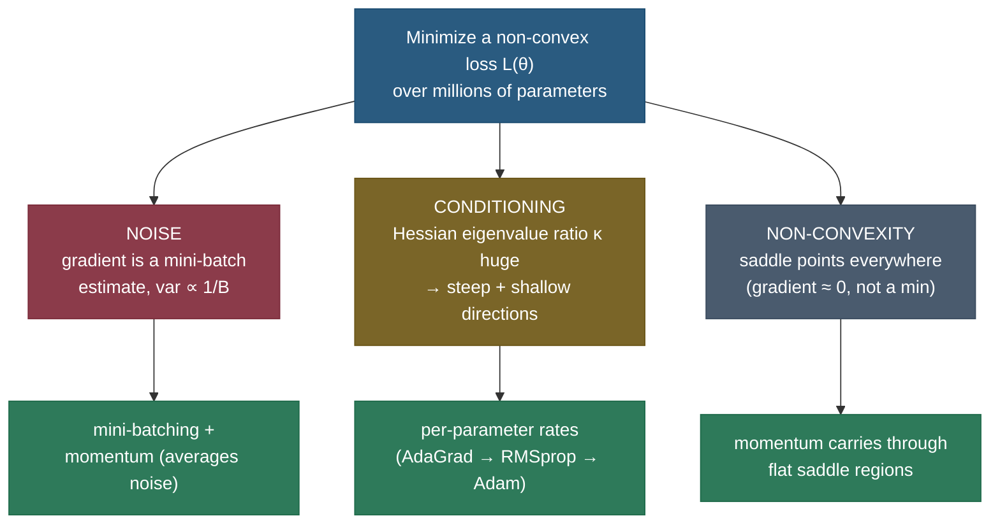
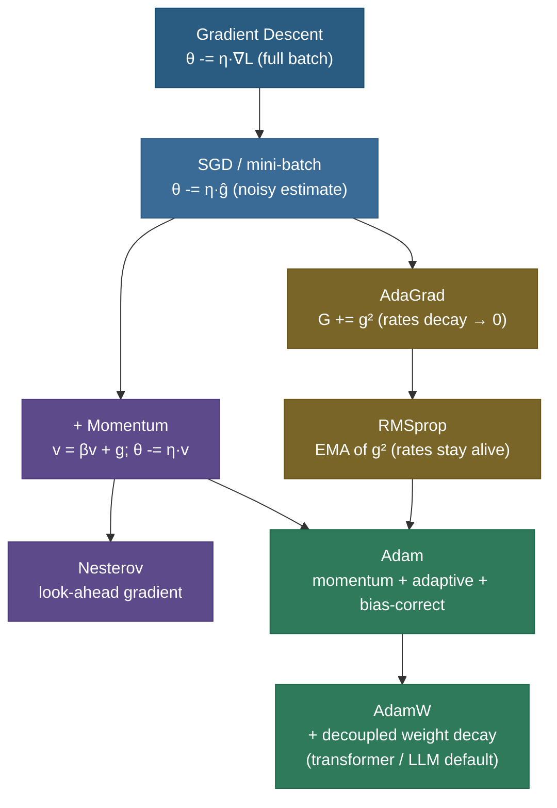
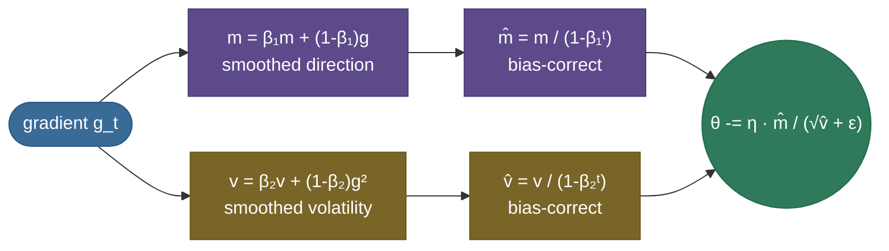
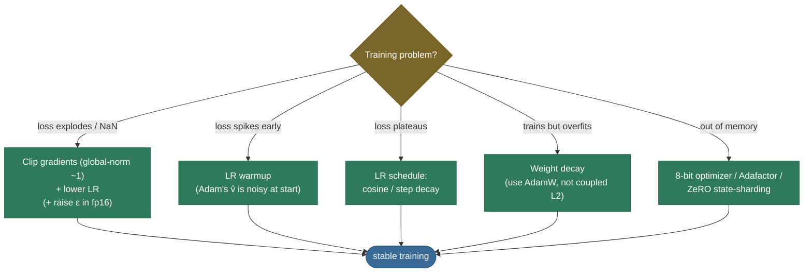

# Optimizers: turning gradients into good weight updates

[Backprop](02-Backpropagation-and-Computational-Graphs.md) hands you a **gradient** — the direction of steepest *increase* in the loss. The obvious move is to step the opposite way. But *"step how far, in which combined direction, and at what rate for each of a billion parameters whose gradients you only know approximately?"* is exactly where naive gradient descent falls apart, and where the **optimizer** earns its keep. The optimizer is the rule that turns the raw gradient into the actual weight change. It is the difference between a model that converges in hours and one that oscillates forever, blows up to `NaN`, or crawls so slowly it never finishes — and on modern transformers, the choice of optimizer (Adam vs SGD), and one or two of its knobs, is among the highest-leverage decisions in the whole training recipe.

I'm going to walk this the way I'd actually teach it to a teammate who can already differentiate a loss but keeps reaching for `torch.optim.Adam` without knowing *why* it works. We start from the **problem** — minimizing a high-dimensional, non-convex loss from *noisy* gradient estimates over an *ill-conditioned* surface — and then build the optimizer ladder one rung at a time, **deriving every rule from the rung below it**, never just stating a formula. By the end you'll be able to:

- explain the **three things that make the optimization hard** — noise, conditioning, and non-convexity — and how each optimizer idea attacks one of them;
- **derive** the full-batch → stochastic → mini-batch progression, including *why the gradient-noise variance scales like* $1/B$;
- **derive momentum** as an exponential moving average of gradients, show it's a low-pass filter, and prove its effective step is $\approx \eta/(1-\beta)$;
- **derive Nesterov's lookahead**, **AdaGrad**, and **RMSprop**, and explain AdaGrad's "death" problem and RMSprop's fix;
- **derive Adam fully** — both moments, *and the bias correction* (with the algebra showing **why** the zero-initialized EMA is biased);
- **derive why L2 ≠ weight decay for adaptive optimizers**, and how **AdamW** fixes it;
- place **second-order** methods (Newton, K-FAC, Shampoo, Sophia) and explain why the exact Hessian is hopeless at scale;
- reason about the **SGD-vs-Adam generalization** debate, **gradient clipping**, and the **hyperparameter defaults** — and back all of it with **worked numbers** and **measured plots**.

Intuition first (a ball rolling downhill), then the rules in full, then code that reproduces PyTorch's Adam to $10^{-6}$.

> **Note:** keep two ideas strictly separate. **Gradient descent** is the *strategy* — move against the gradient. The **optimizer** is the *specific update rule* implementing it: how it uses the current gradient *plus a memory of past gradients and their sizes* to decide each step. Every optimizer on this page is "gradient descent"; they differ only in how cleverly they use that memory.

---

## The problem: a hard optimization, not a clean one

If loss surfaces were nice — convex, well-scaled, and if we could compute the *exact* gradient — plain gradient descent with a single well-chosen learning rate would be all you ever needed, and this page would be one line. Real deep-learning optimization is hard for **three** compounding reasons, and the entire optimizer family is a sequence of fixes for them.

**1. The gradient is noisy.** We never compute the true loss gradient — that would require a forward/backward pass over the *entire* dataset for *every* step. Instead we estimate it on a small random **mini-batch**. That estimate is unbiased but *noisy*: it points roughly downhill, but jitters from batch to batch. Too much noise and the step is unreliable; too little and each step is ruinously expensive. (We make the $1/B$ noise scaling precise below.)

**2. The surface is ill-conditioned.** Deep loss surfaces are wildly anisotropic — far steeper in some parameter directions than others. Locally the loss looks like a quadratic bowl $L(\theta)\approx \tfrac12 (\theta-\theta^\star)^\top H (\theta-\theta^\star)$, and the **eigenvalues of the Hessian** $H$ are the curvatures along its principal axes. Their ratio — the **condition number** $\kappa = \lambda_{\max}/\lambda_{\min}$ — can be in the thousands. A single global step size cannot serve a direction with curvature 1000 and another with curvature 1 at the same time. This is the **ravine** problem, and it is the central villain of this whole page.

**3. The surface is non-convex and high-dimensional.** With millions to billions of parameters, the surface is riddled not with bad *local minima* (those turn out to be rare and usually fine) but with **saddle points** — places flat in some directions and curved in others, where the gradient nearly vanishes and naive GD stalls. High dimension makes saddles overwhelmingly more common than minima.

*Why saddles dominate (the intuition).* At any critical point (gradient zero) the Hessian's eigenvalues tell you the shape: a **minimum** needs *all* $n$ eigenvalues positive (curving up in every direction); a **saddle** needs at least one negative. If you imagine each eigenvalue's sign as a coin flip, the chance that *all* $n$ come up "positive" is vanishingly small for large $n$ — so critical points are almost always saddles, and true minima are exponentially rare. This is *good* news: deep nets rarely get trapped in bad local minima; the real obstacle is the *plateaus* around saddles where the gradient is tiny and plain GD inches along. **Momentum is the cure** — it carries velocity straight through a flat saddle region where a memoryless step would stall.



> **Note:** the three problems map almost one-to-one onto the three big optimizer ideas. **Momentum** averages away noise *and* coasts through saddles. **Adaptive per-parameter rates** (AdaGrad/RMSprop) attack conditioning. **Adam** is just both at once. Hold this map in your head and the rest of the page is filling in the algebra.

---

## From full-batch GD to mini-batch SGD (derived)

Start with the cleanest possible rule and add reality.

**Full-batch gradient descent.** Define the loss as an average over the whole dataset of $N$ examples, $L(\theta)=\tfrac1N\sum_{i=1}^N \ell_i(\theta)$. The exact gradient is $g=\nabla_\theta L=\tfrac1N\sum_i \nabla_\theta \ell_i$, and the update is

$$\theta_{t+1} = \theta_t - \eta\, g_t.$$

This is the "true" steepest-descent step, but computing $g$ needs a pass over *all* $N$ examples for *one* update. On a dataset of millions, that is one tiny step per epoch — hopelessly slow.

**Stochastic gradient descent (SGD).** Go to the other extreme: estimate the gradient from a **single** random example $i$,

$$\hat g_t = \nabla_\theta \ell_i(\theta_t), \qquad \mathbb{E}_i[\hat g_t] = g_t.$$

The estimate is *unbiased* (its average over the random draw equals the true gradient) but high-variance. You get an update *per example* — thousands of cheap, noisy steps where full-batch took one expensive clean one.

**Mini-batch SGD (the practical middle).** Average the gradient over a random batch $\mathcal{B}$ of $B$ examples:

$$\hat g_t = \frac1B\sum_{i\in\mathcal{B}} \nabla_\theta \ell_i(\theta_t).$$

Now *derive the variance*. Treat the per-example gradients as i.i.d. draws with true mean $g$ and per-coordinate variance $\sigma^2$. The batch estimate is their sample mean, so by the standard variance-of-a-mean result,

$$\operatorname{Var}[\hat g_t] = \operatorname{Var}\!\left[\frac1B\sum_{i\in\mathcal{B}}\nabla\ell_i\right] = \frac{1}{B^2}\sum_{i\in\mathcal{B}}\operatorname{Var}[\nabla\ell_i] = \frac{\sigma^2}{B}.$$

So **the gradient-noise variance falls like $1/B$** — and the noise *standard deviation* like $1/\sqrt B$. That single fact governs the speed/noise trade-off:

- **Small $B$** → cheap steps, but noisy: more updates per second, each less reliable.
- **Large $B$** → expensive steps, but accurate: fewer, cleaner updates (and to *halve* the noise you must *quadruple* the batch — diminishing returns).

> **Note:** the $1/\sqrt B$ noise-vs-$1/B$ variance distinction is interview gold. Doubling the batch only cuts the gradient *noise* (std-dev) by $\sqrt2\approx1.41$, not by 2. That sub-linear payoff is exactly why there is a "critical batch size" beyond which bigger batches buy almost nothing — and it's the quantitative backbone of the **linear-scaling rule** later.

> **Tip:** the noise isn't purely a cost — it's a *feature*. The jitter lets SGD **rattle off saddle points and out of sharp, narrow minima** that full-batch GD would get stuck in or settle into. A growing body of work argues this noise is part of *why* SGD-trained nets generalize well: it biases training toward flat, wide minima. Full-batch GD on the same net often generalizes *worse*. So we don't just tolerate the noise — within reason, we *want* it.

> **Gotcha:** "SGD" in a modern paper or a `torch.optim.SGD` call almost always means **mini-batch** SGD (usually with momentum), not the literal one-example version. The pure single-example algorithm is mostly a teaching device. When you read "we trained with SGD," read "mini-batch SGD + momentum."

---

## The conditioning problem: a ravine (the central villain)

Plain gradient descent uses one global learning rate $\eta$ for *every* parameter: $\theta \leftarrow \theta - \eta g$. Watch it fail on the simplest hard surface — a 2-D quadratic that is steep in one direction and shallow in the other.

Take $L(\theta)=\tfrac12(a\,x^2 + b\,y^2)$ with $a\gg b$ (say $a=12$, $b=1$, so $\kappa=12$). The gradient is $g=(a x,\, b y)$, so each axis evolves *independently*:

$$x_{t+1} = x_t - \eta\,a\,x_t = (1-\eta a)\,x_t, \qquad y_{t+1} = (1-\eta b)\,y_t.$$

Each coordinate is a geometric sequence. It **converges only if** $|1-\eta\lambda|<1$, i.e. $0<\eta<2/\lambda$. The catch: *both* axes share the *same* $\eta$.

- To stay **stable in the steep direction** you need $\eta < 2/a$. Push $\eta$ above that and $|1-\eta a|>1$: the steep coordinate's sign flips and grows every step — the classic **zig-zag that diverges**.
- But that same small $\eta$ makes the **shallow direction** crawl, since $1-\eta b$ is barely below 1, so $y$ shrinks by a tiny fraction each step.

The number that governs everything is the eigenvalue ratio $\kappa = a/b$. The best convergence rate plain GD can achieve on this surface is $\frac{\kappa-1}{\kappa+1}$ per step — so large $\kappa$ means glacial progress. **This is the ravine: oscillate across the steep walls while inching along the valley floor.**


> **Tip:** "why not just lower the learning rate?" is a trap an interviewer will set. Lowering $\eta$ *does* cure the steep-direction zig-zag — but it makes the already-glacial shallow direction *hopeless*. One knob cannot win both axes. Every optimizer past plain SGD is, at heart, a way to **stop using one rate for every direction.**


---

## What it is: a short ladder

An optimizer is a pure function `(weights, gradient, state) → (new weights, new state)`. The family is a short ladder; each rung adds **exactly one idea** to the rung below:

- **SGD** — step downhill. (No state.)
- **+ Momentum / Nesterov** — accumulate a *velocity* so consistent directions build speed and oscillations cancel. (State: one vector.)
- **+ Adaptive rates (AdaGrad → RMSprop)** — give *each parameter its own* effective step from the size of its recent gradients. (State: one vector.)
- **Adam** — momentum **and** per-parameter adaptive rates together, bias-corrected. (State: two vectors.)
- **AdamW** — Adam with **decoupled weight decay**; the default for transformers, LLMs, and diffusion models.



**A 60-year provenance, in one line each** (the *where-this-came-from* notes are folded into the references):

- **1951** — Robbins & Monro formalize **stochastic approximation**, the theoretical root of SGD.
- **1964** — Polyak's **heavy-ball momentum** (the $v=\beta v+g$ above).
- **1983** — Nesterov's **accelerated gradient** (the lookahead, with the $O(1/t^2)$ rate).
- **2011** — Duchi, Hazan & Singer's **AdaGrad** (per-parameter rates from $\sum g^2$).
- **2012** — Tieleman & Hinton's **RMSprop** (EMA fix), in a Coursera lecture — never formally published.
- **2014/15** — Kingma & Ba's **Adam** (momentum + RMSprop + bias correction) — now the most-cited optimizer.
- **2017/19** — Loshchilov & Hutter's **AdamW** (decoupled weight decay), the modern transformer default.
- **2023** — search-discovered **Lion** and Hessian-light **Sophia** push at the efficiency frontier.

---

## Intuition: a ball rolling downhill

Before the algebra, hold the physical picture — every rule below is a literal upgrade to this ball.

- **SGD** is a *light, frictionless* ball with no memory. On a ravine it rolls straight into the steep wall, bounces back, and zig-zags — reacting only to the local slope, forgetting where it just came from.
- **Momentum** makes the ball *heavy*. It builds velocity coasting down the valley and **averages out** the back-and-forth across the walls, so it rolls *through* small bumps and coasts across flat saddles instead of stalling.
- **Adaptive methods** put a **governor on each wheel**. A wheel (parameter) that keeps getting huge, erratic gradients has its step *shrunk*; a wheel with small, steady gradients keeps a *full* step. Now the steep and shallow axes can each get the rate they need.
- **Adam** is the heavy ball **with** per-wheel governors — momentum for *direction*, adaptive scaling for *step size per axis*. That combination is why Adam "just works" on a fresh problem: it self-corrects for both noise and conditioning without you tuning much.

---

## Momentum, derived

Plain SGD reacts to *this* step's gradient and nothing else. Momentum gives it memory. Define a **velocity** $v_t$ as an exponentially-weighted accumulation of gradients, then step along the velocity:

$$\boxed{\;v_t = \beta\, v_{t-1} + g_t, \qquad \theta_t = \theta_{t-1} - \eta\, v_t\;}$$

with $v_0=0$ and momentum coefficient $\beta\in[0,1)$ (typically $0.9$). This is the Polyak / "heavy-ball" form (1964); PyTorch's default is the equivalent variant $v_t=\beta v_{t-1}+g_t$.

**Unroll it to see what the velocity *is*.** Expanding the recurrence,

$$v_t = g_t + \beta g_{t-1} + \beta^2 g_{t-2} + \dots = \sum_{k=0}^{t-1}\beta^k\, g_{t-k}.$$

So $v_t$ is a **discounted sum of all past gradients**, weighting recent ones most and fading old ones geometrically by $\beta^k$. With $\beta=0.9$, a gradient's weight halves about every 7 steps and the "effective window" is roughly $1/(1-\beta)=10$ gradients. **Momentum is a low-pass filter on the gradient stream.**

**Why it cancels oscillation and accelerates the valley.** Decompose the gradient into its steep-axis and shallow-axis components:

- **Steep axis** — the gradient *flips sign* every step as the ball oscillates across the ravine. In the discounted sum those alternating $+,-,+,-$ terms **cancel**, so the accumulated velocity across the steep axis stays small. The oscillation is *damped*.
- **Shallow axis** — the gradient points the *same* way every step (steadily downhill along the valley). Those aligned terms **reinforce**, so velocity *grows* toward a steady-state.

**Derive the steady-state (effective) step.** Suppose the gradient is roughly constant $g$ along the valley. The velocity approaches a fixed point $v_\infty = \beta v_\infty + g$, giving the geometric sum

$$v_\infty = \frac{g}{1-\beta}, \qquad\text{so the effective step}\quad \eta\,v_\infty = \frac{\eta}{1-\beta}\,g.$$

At $\beta=0.9$ that's a **10×** amplification of the raw-gradient step along consistent directions — momentum literally moves ten times faster down the valley than plain SGD at the same $\eta$, while *shrinking* the wasteful cross-axis motion.

> **Note:** this $1/(1-\beta)$ amplification is *why you use a smaller learning rate with momentum (and with Adam) than with plain SGD.* The inertia already multiplies every consistent step by ~10; keep the old $\eta$ and you'll overshoot. Reach for momentum and instinctively drop $\eta$.

> **Gotcha:** be careful which momentum convention a framework uses. PyTorch's `SGD(momentum=β)` uses $v_t=\beta v_{t-1}+g_t$ then $\theta-=\eta v_t$ (so the effective step is $\sim\eta/(1-\beta)$). Some texts write $v_t=\beta v_{t-1}+(1-\beta)g_t$ (a true EMA, where the $1-\beta$ is folded in). They differ by a constant factor absorbed into $\eta$ — same dynamics, but it changes what "$\eta=0.1$" *means*. Always check the form before porting hyperparameters.

---

## Nesterov accelerated gradient, derived

Plain (heavy-ball) momentum has a flaw: it computes the gradient at *where you are now*, then takes a big inertial step — so if the velocity is about to carry you past the minimum, you only find out *after* you've overshot. **Nesterov's accelerated gradient** (Nesterov 1983; popularized for deep nets by Sutskever et al. 2013) fixes this with a **lookahead**: evaluate the gradient at the point the momentum is *about to* take you, not where you stand.

Concretely, first take the inertial part of the step to a *lookahead* point $\tilde\theta = \theta_{t-1} - \eta\beta\,v_{t-1}$, evaluate the gradient *there*, and only then complete the update:

$$v_t = \beta\, v_{t-1} + \nabla L\big(\underbrace{\theta_{t-1} - \eta\beta\,v_{t-1}}_{\text{lookahead point}}\big), \qquad \theta_t = \theta_{t-1} - \eta\, v_t.$$

**Why this corrects overshoot.** If the velocity is about to carry you up the *far* wall of the valley, the gradient at the lookahead point already *points back* — so Nesterov starts braking *one step early*, before it has overshot, instead of reacting a step late like plain momentum. It's "look before you leap": same inertia, but the gradient is sampled where you're heading. The result is a **provably better convergence rate** on convex problems ($O(1/t^2)$ vs momentum's $O(1/t)$) and, in practice, a slightly faster and more stable descent. Nesterov momentum is the standard for SGD-with-momentum in vision.

> **Tip:** in code, the math above is awkward (you'd need the gradient at a shifted point). Frameworks use an **algebraically equivalent reformulation** in terms of the current parameters that needs only the ordinary gradient $\nabla L(\theta_{t-1})$ — that's what `torch.optim.SGD(nesterov=True)` implements. Same trajectory, no extra forward pass.

---

## Adaptive per-parameter rates: AdaGrad, derived

Momentum fixes *direction* but still uses one global $\eta$ for every parameter. The adaptive family attacks the *other* half of the ravine: give **each parameter its own effective learning rate**, automatically scaled down for parameters with large gradients and up for those with small ones.

**AdaGrad** (Duchi, Hazan & Singer 2011) accumulates the *sum of squared gradients* per parameter and divides the step by its square root. Per coordinate $j$:

$$G_{t,j} = G_{t-1,j} + g_{t,j}^2 = \sum_{\tau=1}^{t} g_{\tau,j}^2, \qquad \theta_{t,j} = \theta_{t-1,j} - \frac{\eta}{\sqrt{G_{t,j}}+\epsilon}\, g_{t,j}.$$

The **effective learning rate** for parameter $j$ is $\eta/(\sqrt{G_{t,j}}+\epsilon)$. A parameter that has seen big gradients has a large $G$ and so a *small* step; one with tiny, infrequent gradients (a rare embedding row) keeps a *large* step. This is precisely what the ravine wants: the steep axis (big $g$) gets throttled, the shallow axis (small $g$) keeps moving. AdaGrad shines on **sparse features** for exactly this reason — rare features get their large step when they finally fire.

**The death problem (derive it).** $G_{t,j}$ is a *running sum* of non-negative terms, so it only ever **grows**. Even with a constant gradient $g$, after $t$ steps $G_t = t\,g^2$, so the effective rate is

$$\frac{\eta}{\sqrt{G_t}} = \frac{\eta}{\sqrt{t}\,|g|} \;\xrightarrow{t\to\infty}\; 0.$$

The learning rate **decays monotonically to zero** — it shrinks like $1/\sqrt t$ whether or not you've actually converged. On a long deep-learning run AdaGrad's steps starve and learning *stalls* well before reaching a good minimum. Great for convex, sparse problems; fatal for long non-convex training.


---

## RMSprop, derived

The fix is one word: replace the **growing sum** with a **decaying average**. **RMSprop** (Tieleman & Hinton, Coursera lecture 2012) keeps an **exponential moving average** of squared gradients instead of their cumulative sum:

$$E[g^2]_t = \rho\, E[g^2]_{t-1} + (1-\rho)\, g_t^2, \qquad \theta_t = \theta_{t-1} - \frac{\eta}{\sqrt{E[g^2]_t}+\epsilon}\, g_t,$$

with decay $\rho$ (typically $0.9$ or $0.99$). Because old squared gradients **fade** instead of accumulating, $E[g^2]_t$ tracks the *recent* gradient magnitude rather than the all-time total. On a constant gradient $g$ it converges to a *fixed point* $E[g^2]_\infty = g^2$ (not $t\,g^2$), so the effective rate **settles at a stable nonzero value** $\eta/|g|$ and never starves — exactly the green curve above. RMSprop made adaptive methods practical for deep nets, and its EMA-of-$g^2$ is the second moment that Adam inherits wholesale.

> **Gotcha:** AdaGrad vs RMSprop is a favorite interview contrast — give the one-line reason. AdaGrad's denominator is a **sum** (only grows → rate starves to 0); RMSprop's is an **EMA** (forgets old gradients → rate stays alive). Adam keeps RMSprop's EMA for precisely this reason.

---

## Adam, derived fully

**Adam** (Kingma & Ba 2015) — "adaptive moment estimation" — is just **momentum + RMSprop**, made rigorous with a bias correction. It maintains *two* EMAs per parameter: the first moment (mean of gradients = smoothed *direction*, the momentum part) and the second moment (mean of squared gradients = *volatility*, the RMSprop part):

$$m_t = \beta_1 m_{t-1} + (1-\beta_1) g_t \quad\text{(1st moment, direction)}$$
$$v_t = \beta_2 v_{t-1} + (1-\beta_2) g_t^2 \quad\text{(2nd moment, volatility)}$$

with $m_0=v_0=0$ and defaults $\beta_1=0.9,\ \beta_2=0.999$.

**The bias-correction problem — derive *why* it's needed.** Both EMAs start at **zero**, which biases the early estimates *toward zero*. Make this exact. Unroll the second-moment EMA:

$$v_t = (1-\beta_2)\sum_{\tau=1}^{t} \beta_2^{\,t-\tau}\, g_\tau^2.$$

Take expectations, assuming the true second moment $\mathbb{E}[g_\tau^2]\approx \mathbb{E}[g^2]$ is roughly stationary over the window, so it pulls out of the sum:

$$\mathbb{E}[v_t] = (1-\beta_2)\,\mathbb{E}[g^2]\sum_{\tau=1}^{t}\beta_2^{\,t-\tau} = \mathbb{E}[g^2]\,(1-\beta_2)\cdot\frac{1-\beta_2^{\,t}}{1-\beta_2} = \mathbb{E}[g^2]\,\big(1-\beta_2^{\,t}\big),$$

using the finite geometric series $\sum_{k=0}^{t-1}\beta_2^k = \frac{1-\beta_2^{\,t}}{1-\beta_2}$. So $\mathbb{E}[v_t]$ is **too small by exactly the factor $(1-\beta_2^{\,t})$** — and on early steps that factor is tiny (at $t=1$, $1-\beta_2 = 0.001$, so $v_1$ underestimates by **1000×**). The identical algebra gives $\mathbb{E}[m_t] = (1-\beta_1^{\,t})\,\mathbb{E}[g]$.

**The fix is to divide out that factor** — the bias correction:

$$\hat m_t = \frac{m_t}{1-\beta_1^{\,t}}, \qquad \hat v_t = \frac{v_t}{1-\beta_2^{\,t}}, \qquad \boxed{\;\theta_t = \theta_{t-1} - \eta\,\frac{\hat m_t}{\sqrt{\hat v_t}+\epsilon}\;}$$

After dividing, $\mathbb{E}[\hat m_t]=\mathbb{E}[g]$ and $\mathbb{E}[\hat v_t]=\mathbb{E}[g^2]$ — *unbiased*. As $t\to\infty$ the factor $\to1$ and the correction vanishes; it matters **only at the start**, where it matters enormously.


**Why skipping it is catastrophic.** Without correction, on step 1 the *uncorrected* $v_1=(1-\beta_2)g_1^2 = 0.001\,g_1^2$ is a thousand times too small, so $\sqrt{v_1}\approx 0.0316\,|g_1|$ is ~30× too small, and the step $\eta\,m_1/\sqrt{v_1}$ is ~30× too big — a huge, destabilizing first jump exactly when the model is most fragile. The correction also makes the *first* step beautifully interpretable: $\hat m_1 = m_1/(1-\beta_1)=(1-\beta_1)g_1/(1-\beta_1)=g_1$ and likewise $\hat v_1=g_1^2$, so step 1 is just $-\eta\,g_1/(|g_1|+\epsilon)\approx -\eta\,\operatorname{sign}(g_1)$ — a clean unit-scaled step. (The code below prints exactly this.)



The whole update reads as **direction ÷ volatility**: $\hat m$ is *where to go*, $\sqrt{\hat v}$ is *how unreliable that direction has been*. A parameter whose gradient is steady gets $\hat m/\sqrt{\hat v}\approx \pm1$ — a full, confident step. A parameter whose gradient thrashes has large $\hat v$ and gets throttled. That self-normalization is why Adam is so **forgiving about the global learning rate** — each parameter's step is already rescaled to roughly unit size before $\eta$ multiplies it.

**Scale-invariance — derive it.** Suppose you rescale a parameter's gradient by any constant $c$ (say its loss term is weighted $c\times$ heavier). Then $m_t\to c\,m_t$ and $v_t\to c^2 v_t$, so the *ratio* is

$$\frac{\hat m_t}{\sqrt{\hat v_t}} \;\to\; \frac{c\,\hat m_t}{\sqrt{c^2\,\hat v_t}} = \frac{c\,\hat m_t}{|c|\sqrt{\hat v_t}} = \frac{\hat m_t}{\sqrt{\hat v_t}}$$

— **unchanged.** Adam's step magnitude is invariant to any constant rescaling of the gradient (and approximately to the loss scale). This is precisely why it copes with transformers' wildly different per-tensor gradient scales: a layer whose gradients are 100× larger doesn't get a 100× bigger step, because the $\sqrt{\hat v}$ in the denominator divides it back out. Plain SGD has no such invariance — rescale a gradient and its step scales right along with it, which is why SGD needs careful per-layer tuning (or normalization) where Adam just works.

> **Note:** the "$\sqrt{\hat v}$" is per-parameter, so Adam effectively gives the steep ravine axis a small rate and the shallow axis a large one *automatically* — solving the conditioning problem without you ever computing a Hessian. The momentum $\hat m$ simultaneously handles the noise and saddles. One optimizer, all three problems.

> **Note:** Adam is **not guaranteed to converge**. Reddi et al. (2018) built convex cases where the EMA of $v$ "forgets" a rare but informative large gradient and the step *grows* when it should shrink, causing divergence. **AMSGrad** patches this by using the running **max** of $\hat v$ (instead of the current $\hat v$), forcing a non-increasing per-parameter step. Plain Adam/AdamW is fine in practice, but naming AMSGrad and *why* it exists is interview gold.

---

## AdamW: why L2 ≠ weight decay for adaptive optimizers (derived)

This is the single most important refinement on top of Adam, and the reason **AdamW** — not Adam — is the transformer/LLM default. The subtlety: two things people treat as identical, **L2 regularization** and **weight decay**, are *not* the same once the optimizer is adaptive.

**They're identical for plain SGD.** L2 regularization adds $\tfrac{\lambda}{2}\lVert\theta\rVert^2$ to the loss, so the gradient gains a $\lambda\theta$ term: $\nabla(L + \tfrac\lambda2\lVert\theta\rVert^2)=g+\lambda\theta$. Plug into the SGD update:

$$\theta \leftarrow \theta - \eta(g+\lambda\theta) = (1-\eta\lambda)\,\theta - \eta g.$$

That $(1-\eta\lambda)\theta$ is *literally* "shrink every weight by a constant factor each step" — i.e. weight decay. For SGD, **L2 and weight decay are the same operation.**

**They diverge for Adam.** With Adam, the L2 term rides *inside* the gradient, so it flows *through the adaptive denominator*. The gradient becomes $g+\lambda\theta$, and the update divides the *whole thing* by $\sqrt{\hat v}$:

$$\theta_t \leftarrow \theta_{t-1} - \eta\,\frac{\widehat{(g+\lambda\theta)}}{\sqrt{\hat v_t}+\epsilon}.$$

Now the decay a weight receives is $\propto \lambda\theta/\sqrt{\hat v}$ — **inversely scaled by its gradient history.** A parameter with *large* gradients (big $\hat v$) gets its decay *divided down* — it is **under-regularized**, exactly the high-gradient weights you'd most want to keep in check. The intended uniform shrinkage is corrupted by the per-parameter scaling.

**AdamW's fix (Loshchilov & Hutter 2017/2019): decouple the decay** — apply it straight to the weights, *outside* the adaptive term:

$$\boxed{\;\theta_t \leftarrow \theta_{t-1} - \eta\left(\frac{\hat m_t}{\sqrt{\hat v_t}+\epsilon} + \lambda\,\theta_{t-1}\right)\;}$$

Now **every** weight is decayed by the same factor $\eta\lambda$ regardless of its gradient size, while the *gradient* still gets the adaptive treatment. This decoupling measurably improves generalization and is why AdamW is the default for transformers, LLMs, and diffusion models.

> **Gotcha:** because of this, the `weight_decay` argument means *different things* in `torch.optim.Adam` (it's the broken coupled L2 — `weight_decay` is added to the gradient) versus `torch.optim.AdamW` (it's the decoupled decay). If you copy a `weight_decay` value from an SGD recipe into `Adam`, you are not getting the regularization you think you are. For transformers, **use `AdamW`.**

> **Tip:** a practical detail in real recipes: **don't decay everything.** Bias terms and LayerNorm/RMSNorm gains are typically *excluded* from weight decay (decaying a normalization scale toward 0 just fights the norm). Most LLM training scripts build two parameter groups — "decay" (weight matrices) and "no-decay" (biases + norm params) — and pass `weight_decay=0` to the second.

---

## A glimpse of second order: why we don't use the Hessian

Every adaptive method above is secretly chasing something a **second-order** method would compute exactly. The gold standard for using curvature is **Newton's method**:

$$\theta_{t+1} = \theta_t - H_t^{-1} g_t,$$

where $H=\nabla^2 L$ is the **Hessian** (the matrix of second derivatives / curvatures). Multiplying by $H^{-1}$ rescales *and rotates* the step to account for the full curvature — on the ravine quadratic, Newton jumps to the exact minimum in **one** step, because $H^{-1}$ perfectly undoes the conditioning.

*See it on our ravine.* For $L=\tfrac12(a x^2+b y^2)$ the gradient is $g=(ax, by)$ and the Hessian is the constant diagonal $H=\operatorname{diag}(a,b)$, so $H^{-1}g = (ax/a,\ by/b) = (x, y) = \theta$. The Newton step is therefore $\theta - H^{-1}g = \theta - \theta = 0$ — it lands **exactly** on the minimum in a *single* step, for *any* starting point and *any* condition number $\kappa$. That is the power we're approximating: where SGD took dozens of zig-zag steps and Adam took ~50, Newton needs **one**. So why doesn't everyone use it?

**Because $H$ is hopeless at scale.** For a model with $n$ parameters, $H$ is $n\times n$. For a 7B-parameter model that's $(7\times10^9)^2\approx 5\times10^{19}$ entries — you cannot *store* it, let alone **invert** it ($O(n^3)$). Even forming it is out of reach. So practitioners use **approximations**:

- **Adam itself** is the cheapest one: its $1/\sqrt{\hat v}$ is a **diagonal** approximation to $H^{-1}$ — it captures per-parameter curvature (the diagonal of $H$) but ignores all the off-diagonal coupling between parameters. "A poor man's second-order method."
- **K-FAC** approximates $H$ as block-diagonal Kronecker factors per layer — far cheaper to invert than the full matrix, capturing within-layer curvature.
- **Shampoo** keeps small *full-matrix* preconditioners per tensor dimension (a structured, layer-wise curvature) — strong but heavier per step; it and its variants have been used to speed up large-scale training.
- **Sophia** estimates a cheap **diagonal Hessian** via a Hutchinson-style probe and clips it, aiming to roughly halve the steps needed to pretrain an LLM.
- **L-BFGS** builds an implicit low-rank inverse-Hessian from a *history* of gradients (no matrix stored). It's excellent for **small, full-batch, deterministic** problems but doesn't tolerate mini-batch noise, so it's rare in deep learning.

> **Tip:** the unifying sentence that ties the whole landscape together: *Adam's $1/\sqrt{\hat v}$ is a cheap diagonal stand-in for the inverse curvature a true second-order method would compute exactly.* Every fancier optimizer (K-FAC, Shampoo, Sophia) is buying back *more* of that curvature information at *more* cost per step. First-order methods win in deep learning because they need only the gradient — which backprop already gives you essentially for free.

---

## The SGD-vs-Adam generalization debate

A genuine open question worth understanding, because interviewers love it and the honest answer names *both* sides.

**The phenomenon.** Adam trains *faster* and is far more forgiving of the learning rate, yet a well-tuned **SGD + momentum** often *generalizes better* — lower **test** error — especially on vision/CNN tasks (which is why ResNets are still trained with SGD+momentum to this day). Adam can reach a lower *training* loss while landing at a slightly *worse* test loss.

**Why (the leading explanations).** SGD's update is a noisier, more "uniform" step that tends to settle in **flat, wide minima**, which generalize better than the **sharp** minima adaptive methods can be drawn toward. Adam's per-parameter rescaling can also interact badly with naive L2 (the very problem AdamW fixes — and AdamW closes much of the historical gap). It's an active research area, not a settled law.

**So why does Adam *dominate* transformers and LLMs?** Three reasons that flip the trade-off:
1. **Heterogeneous, sparse gradients.** Token-embedding rows, attention projections, LayerNorm gains, and MLP weights have *wildly* different gradient scales. Adam's per-parameter rescaling is essential; one global SGD rate simply cannot serve them all, and SGD often won't even *converge* on a transformer at a usable rate.
2. **Robustness at scale.** You get *one* shot at a multi-million-dollar pretraining run. Adam's tolerance of the learning rate and its self-normalization make training *reliable*, which matters more than squeezing out a fraction of test-loss.
3. **The generalization gap is small/absent here.** For large language models trained ~once over enormous data, the flat-minima generalization edge of SGD largely evaporates, while Adam's stability advantage is decisive.

![Final loss after 80 steps versus learning rate, swept across three orders of magnitude on the ravine. SGD (red) and Momentum (amber) plunge to a deep minimum at their sweet-spot rate but then hit a cliff and diverge to the diverged line once the rate exceeds their stability limit. RMSprop (blue) has a razor-sharp optimum and also diverges past it. Adam (green) stays in a low, flat band across the entire range — it never finds the very deepest point, but it never blows up either. That wide tolerance, not raw speed, is Adam's real headline advantage. Measured.](images/opt_lr_robustness.png)

> **Note:** the crisp interview answer: **"Tuned SGD+momentum can generalize better and is standard in vision; Adam/AdamW trains faster, tolerates the learning rate, and is essential for transformers/LLMs because their gradients are too heterogeneous for a single global rate. AdamW is the modern default; SGD is the vision specialist."** Naming both, with the *reason*, is what separates a strong answer from a memorized one.

> **Tip:** the plot above is *exactly* why Adam is the safe default for an expensive one-shot run: you don't need to find the razor-thin optimal learning rate that SGD/RMSprop demand — anything in a broad band works, so you spend your compute training rather than tuning. Adam trades a sliver of best-case performance for a huge gain in *reliability*.

---

## Gradient clipping

Sometimes a single unlucky batch (or an instability early in training) produces an **enormous** gradient that, taken at face value, blows the weights to `NaN` in one step — the **exploding-gradient** failure, common in RNNs and early/large LLM training. **Gradient clipping** caps the gradient *before* the optimizer sees it:

- **Clip-by-global-norm (standard).** Compute the norm of the *entire* gradient vector (all parameters concatenated). If $\lVert g\rVert > c$, rescale $g \leftarrow c\,g/\lVert g\rVert$. This keeps the *direction* intact and only caps the *magnitude* — the right thing to do. LLMs almost universally clip the global norm to $\sim1.0$.
- **Clip-by-value.** Clamp each component into $[-c,c]$ independently — cruder, and it *changes the direction* (it can rotate the gradient), so it's rarely the first choice.

> **Tip:** clip-by-**global-norm** over *all* parameters at once is the near-universal choice for transformer training, applied *after* backprop and *before* `optimizer.step()`. If your loss occasionally spikes to `NaN`, turning on (or tightening) gradient clipping is the very first thing to try — before touching the learning rate or the architecture.

---

## Learning-rate schedules and warmup (pointer)

The optimizer sets the *direction and per-parameter scaling*; the **schedule** sets how the global $\eta$ changes over training — and you almost never use a constant rate. The standard recipe is **warmup then decay**: ramp $\eta$ up from ~0 over the first few hundred/thousand steps, then anneal it down (cosine, linear, or inverse-sqrt). Warmup exists *specifically because* Adam's $\hat v$ estimate is unreliable in the very first steps (precisely where bias correction is working hardest) — so big early steps are dangerous, and a gentle ramp keeps them safe.

This page deliberately stops here — the schedule has its own full treatment.

**→ [Learning-Rate Schedules & Warmup](08-Learning-Rate-Schedules-and-Warmup.md)** covers cosine/linear/inverse-sqrt decay, warmup length, and restarts in depth.

> **Note:** **batch size and learning rate move together.** The **linear scaling rule** (Goyal et al. 2017): multiply the batch size by $k$ and multiply $\eta$ by $\sim k$ (with warmup for stability). The justification is the $1/B$ noise law derived earlier — a $k\times$ larger batch gives a $\sqrt k\times$ less-noisy gradient, which can tolerate (and needs) a proportionally bigger step to make the same progress per epoch.

> **Tip:** can't fit a big batch in memory? **Gradient accumulation** sums the gradients over several micro-batches before one optimizer step, simulating a larger *effective* batch — then apply the linear-scaling LR as if the batch really were that size. It's how small-GPU setups train with large effective batch sizes.

---

## Newer optimizers worth knowing

Beyond the AdamW default, a few directions appear in modern recipes and interviews:

- **Lion** (Chen et al. 2023) — a sign-based update $\theta \leftarrow \theta - \eta\,\operatorname{sign}\!\big(\beta_1 m + (1-\beta_1)g\big)$ discovered by symbolic search. It keeps **one** state (vs Adam's two), so *half* the optimizer memory, with competitive results on large models. The sign makes every coordinate's step the same size — a different normalization than Adam's $1/\sqrt{\hat v}$.
- **Adafactor** (Shazeer & Stern 2018) — factorizes the second-moment matrix into row and column statistics to use **sublinear** memory (it doesn't store a full per-parameter $v$). Built for training huge models where Adam's two full states won't fit; used for large T5.
- **8-bit Adam** (Dettmers et al.) — stores Adam's two states in 8-bit with block-wise quantization, cutting optimizer memory ~4× with negligible quality loss; a staple of memory-constrained fine-tuning.
- **Shampoo / Sophia** — the second-order-ish methods above, aimed at faster large-scale pretraining.

---

## Optimizer-state memory: the load-bearing fact for LLM training

A point worth its own section because it dominates LLM-training cost. Adam/AdamW stores **two extra full-precision states per parameter** — $m$ and $v$ — on top of the weights and gradients. In mixed-precision training the standard accounting (per parameter) is roughly:

- FP16 weights: 2 bytes, plus an FP32 master copy: 4 bytes,
- FP32 gradient: 4 bytes,
- Adam $m$ (FP32): 4 bytes, Adam $v$ (FP32): 4 bytes.

That's **~16–18 bytes per parameter** before activations — and the **optimizer states alone are 8 of those bytes, twice the size of the FP16 weights.** For a 7B model the Adam states are $\sim 7\text{B}\times 8 \approx 56$ GB on their own. This is *the* reason full fine-tuning is so expensive, and the direct motivation for **8-bit Adam, Adafactor, ZeRO state-sharding**, and parameter-efficient methods.

> **Tip:** this is exactly why [LoRA/PEFT](../../09.%20LLMs/concepts/12-LoRA-and-PEFT.md) saves so much memory: by training only a few million low-rank adapter parameters instead of all 7B, you only pay Adam's $2\times$ state overhead on the *adapters*, shrinking optimizer memory from tens of GB to a fraction of a GB. The optimizer-state cost is the bridge between "optimizers" and "why PEFT exists."

---

## Worked examples (by hand, increasing in complexity)

Numbers make the rules concrete. Four examples, each adding a layer.

### Example 1 — momentum vs plain GD on a ravine, one step at a time

Take the ravine $L=\tfrac12(10x^2 + y^2)$, so $g=(10x,\,y)$, start at $\theta_0=(1,\,1)$, and use $\eta=0.18$ (just *below* the steep-axis stability limit $2/10=0.2$, so stable but close — exactly where the zig-zag is most visible).

**Plain GD.** Each axis: $x_{t+1}=(1-0.18\cdot10)x_t = (1-1.8)x_t = -0.8\,x_t$; $y_{t+1}=(1-0.18)y_t=0.82\,y_t$.

| step | $x$ (steep) | $y$ (shallow) |
|---|---|---|
| 0 | $1.000$ | $1.000$ |
| 1 | $-0.800$ | $0.820$ |
| 2 | $0.640$ | $0.672$ |
| 3 | $-0.512$ | $0.551$ |

The steep coordinate **flips sign and shrinks slowly** ($|{-0.8}|=0.8$ per step — the zig-zag), while the shallow coordinate **crawls** ($0.82$ per step). Classic ravine: lots of motion across, little progress along.

**Momentum** ($\beta=0.9$, $v_0=0$, same $\eta$). Steep axis: $v_1 = 0.9\cdot0 + 10\cdot1 = 10$, so $x_1 = 1 - 0.18\cdot10 = -0.8$ (same first step). But now $g(x_1)=10\cdot(-0.8)=-8$, so $v_2=0.9\cdot10 + (-8)=1.0$ and $x_2 = -0.8 - 0.18\cdot1.0 = -0.98$ — the velocity has *absorbed* the sign flip (it was $+10$, the new gradient is $-8$, they partly cancel), so the steep oscillation is **damped** instead of cleanly reversing. Meanwhile on the shallow axis the velocity *accumulates*: $v^y_1=1,\ v^y_2=0.9\cdot1+0.82=1.72,\ v^y_3=0.9\cdot1.72+0.51\approx2.06$ — growing well past the raw gradient (toward a steady-state $\sim g/(1-\beta)$), so $y$ descends **faster and faster** down the valley. Momentum's path is smoother *and* quicker, exactly as the algebra predicted.

### Example 2 — Adam's m, v, and bias correction for the first 3 steps

Single parameter, constant gradient $g=0.1$ every step, $\beta_1=0.9,\ \beta_2=0.999,\ \eta=0.001,\ \epsilon=10^{-8}$. Trace the EMAs and corrections.

| $t$ | $m_t=0.9m+0.1g$ | $v_t=0.999v+0.001g^2$ | $\hat m_t=m/(1-0.9^t)$ | $\hat v_t=v/(1-0.999^t)$ | step $=\eta\,\hat m/(\sqrt{\hat v}+\epsilon)$ |
|---|---|---|---|---|---|
| 1 | $0.0100$ | $1.00\times10^{-5}$ | $0.1000$ | $0.0100$ | $0.001\cdot0.1/0.1 = 1.00\times10^{-3}$ |
| 2 | $0.0190$ | $2.00\times10^{-5}$ | $0.1000$ | $0.0100$ | $1.00\times10^{-3}$ |
| 3 | $0.0271$ | $3.00\times10^{-5}$ | $0.1000$ | $0.0100$ | $1.00\times10^{-3}$ |

Two things to see. First, **bias correction works**: the *raw* $m_1=0.01$ is 10× too small, but $\hat m_1 = 0.01/(1-0.9)=0.1$ recovers the true gradient exactly; the raw $v_1=10^{-5}$ is 1000× too small, but $\hat v_1=10^{-5}/(1-0.999)=0.01=g^2$ is spot on. Second, with a *constant* gradient the bias-corrected ratio $\hat m/\sqrt{\hat v}=0.1/0.1=1$ every step, so each step is exactly $\eta=10^{-3}$ — **Adam takes a unit-scaled step regardless of the gradient's magnitude.** That scale-invariance is its signature.

### Example 3 — AdaGrad's effective rate shrinking over steps

Same constant gradient $g=0.1$, $\eta=0.1$, AdaGrad's $G_t=\sum g^2 = t\cdot0.01$:

| $t$ | $G_t = t\cdot0.01$ | $\sqrt{G_t}$ | effective LR $=\eta/\sqrt{G_t}$ | step $=\text{effLR}\cdot g$ |
|---|---|---|---|---|
| 1 | $0.01$ | $0.100$ | $1.000$ | $0.1000$ |
| 4 | $0.04$ | $0.200$ | $0.500$ | $0.0500$ |
| 25 | $0.25$ | $0.500$ | $0.200$ | $0.0200$ |
| 100 | $1.00$ | $1.000$ | $0.100$ | $0.0100$ |
| 400 | $4.00$ | $2.000$ | $0.050$ | $0.0050$ |

The effective rate falls like $1/\sqrt t$ — *halving every time $t$ quadruples* — and keeps shrinking forever, even though the gradient never changed and we never converged. That's the death problem in five rows. RMSprop's EMA, by contrast, would lock the effective rate at $\eta/|g|=1.0$ and hold it.

### Example 4 — the measured trajectory comparison

The three hand-traced rules above, run for real over 80 steps on the ravine, produce the measured loss curves below — the quantitative version of the trajectory plot.


> **Note:** don't over-read the *ordering* in any single loss plot — on a clean quadratic a well-tuned plain SGD or RMSprop is genuinely hard to beat, and Adam's headline advantage is **robustness across learning rates and gradient scales**, not raw speed on a toy bowl. The shapes are what teach: SGD's smooth geometric decay, Momentum's overshoot-and-ring, the adaptive methods' per-axis rescaling.

---

## The family at a glance

Every rule on this page, side by side — what state it keeps, what it adds, and where it lands.

| Optimizer | Update (core) | State / param | Adds over the previous rung | Best at | Watch out for |
|---|---|---|---|---|---|
| **SGD** | $\theta -= \eta g$ | none | the baseline | clean, well-conditioned problems | zig-zags on ravines; one rate for all |
| **+ Momentum** | $v=\beta v+g;\ \theta-=\eta v$ | 1 vector ($v$) | velocity (low-pass filter) | ravines, saddles, noisy gradients | inertia overshoots — lower $\eta$ |
| **+ Nesterov** | lookahead gradient | 1 vector | brakes a step early | convex / vision SGD | same as momentum |
| **AdaGrad** | $\theta-=\eta g/\sqrt{\sum g^2}$ | 1 vector ($G$) | per-parameter rates | sparse features, convex | rate **decays to 0** (death) |
| **RMSprop** | $\theta-=\eta g/\sqrt{\mathrm{EMA}[g^2]}$ | 1 vector | EMA fixes the decay | RNNs, non-stationary | no momentum, no bias-correct |
| **Adam** | $\theta-=\eta\,\hat m/(\sqrt{\hat v}+\epsilon)$ | 2 vectors ($m,v$) | momentum + adaptive + bias-correct | transformers, default everywhere | not always convergent (→ AMSGrad) |
| **AdamW** | Adam $+\ \lambda\theta$ decoupled | 2 vectors | decoupled weight decay | **the LLM/transformer default** | use AdamW, not coupled-L2 Adam |
| **Lion** | $\theta-=\eta\,\mathrm{sign}(\cdots)$ | 1 vector | half the memory of Adam | huge models, memory-bound | needs re-tuning vs Adam |

> **Note:** read the table top-to-bottom and you've recovered the whole ladder: each row keeps everything below it and adds *one* labelled idea. That single-idea-per-rung structure is the cleanest way to hold the family in your head — and the cleanest way to *teach* it back in an interview.

---

## Where each optimizer is used

- **AdamW** — the default for **transformers, LLMs, and diffusion models**. Heterogeneous/sparse gradients and huge parameter counts are its sweet spot, and its robustness de-risks expensive runs.
- **SGD + momentum / Nesterov** — still standard for **CNNs / vision** (ResNets), where a tuned SGD generalizes better.
- **Adafactor / 8-bit Adam / ZeRO** — when **optimizer-state memory** is the binding constraint (huge models, limited VRAM).
- **Lion** — when you want Adam-like results at half the optimizer memory and are willing to retune.
- **L-BFGS** — small, full-batch, low-noise problems (classical ML, some physics-informed nets), almost never deep nets.

---

## Application: choosing and configuring an optimizer

**Step 1 — pick it.** Transformer / LLM / diffusion → **AdamW**. CNN/vision tuned for best test accuracy → **SGD + Nesterov momentum**. Memory-bound huge model → **Adafactor / 8-bit Adam**. Prototyping anything → AdamW (robust by default).

**Step 2 — set the knobs.** AdamW defaults are stable: $\beta_1=0.9$, $\beta_2=0.999$ (drop $\beta_2$ to $0.95$ for large LLMs, which makes $v$ more responsive to recent gradient scale), $\epsilon=10^{-8}$ (raise to $10^{-6}$ in mixed precision), weight decay $0.01$–$0.1$ (excluding biases and norm params). The **one** knob you must always tune is the **learning rate**.

**Step 3 — pair it with a schedule and guards.** Warmup + cosine decay, gradient clipping at global-norm $\sim1.0$, and the batch-size↔LR linear-scaling rule. The decision map when training misbehaves:



> **Gotcha:** in mixed-precision (FP16) training, the default $\epsilon=10^{-8}$ can **underflow** inside $\sqrt{\hat v}+\epsilon$ when $\hat v$ is tiny, making the denominator collapse and the step explode. If FP16 diverges early while FP32 is fine, **raise $\epsilon$** (to $10^{-6}$) before suspecting anything else. (BF16, with its larger exponent range, mostly sidesteps this.)

---

## Code: the update rules, and Adam matching PyTorch

From-scratch SGD/Momentum/AdaGrad/Adam, with the from-scratch Adam verified against `torch.optim.Adam` step for step, plus the hand-traced momentum and AdaGrad numbers from the worked examples. Runs on CPU in about a second.

```python
"""From-scratch SGD / Momentum / AdaGrad / Adam; Adam checked against
torch.optim.Adam, plus the hand-traced Adam and AdaGrad numbers.
Verified on Python 3.12 (torch 2.x), CPU."""
import torch
torch.manual_seed(0)

def sgd(w, g, st, lr=0.1):                       # plain gradient step
    return w - lr * g

def momentum(w, g, st, lr=0.1, beta=0.9):        # velocity accumulates -> inertia
    st["v"] = beta * st.get("v", torch.zeros_like(g)) + g
    return w - lr * st["v"]

def adagrad(w, g, st, lr=0.1, eps=1e-8):         # running SUM of g^2 -> rate decays
    st["G"] = st.get("G", torch.zeros_like(g)) + g * g
    return w - lr * g / (st["G"].sqrt() + eps)

def adam(w, g, st, lr=0.1, b1=0.9, b2=0.999, eps=1e-8):
    st["t"] = st.get("t", 0) + 1
    st["m"] = b1 * st.get("m", torch.zeros_like(g)) + (1 - b1) * g        # 1st moment (direction)
    st["v"] = b2 * st.get("v", torch.zeros_like(g)) + (1 - b2) * g * g    # 2nd moment (volatility)
    mhat = st["m"] / (1 - b1 ** st["t"])         # bias correction (crucial on early steps)
    vhat = st["v"] / (1 - b2 ** st["t"])
    return w - lr * mhat / (vhat.sqrt() + eps)   # per-parameter step: direction / sqrt(volatility)

# --- bias correction in action: on step 1 it recovers the true gradient ---
st = {}; g1 = torch.tensor([4.0])
_ = adam(torch.zeros(1), g1, st)
print("Adam step 1 - m raw:", round(st["m"].item(), 3),
      "| m_hat (bias-corrected):", round((st["m"] / (1 - 0.9)).item(), 3), "= true gradient 4.0")

# --- worked Example 2: Adam's m, v, m_hat, v_hat for g=0.1, first 3 steps ---
st = {}; g = torch.tensor([0.1])
print("\nAdam trace (g=0.1 constant):  t |   m_t   |   v_t    |  m_hat | v_hat")
for t in range(1, 4):
    _ = adam(torch.zeros(1), g, st, lr=1e-3)
    mh = st["m"] / (1 - 0.9 ** t); vh = st["v"] / (1 - 0.999 ** t)
    print(f"   {t} | {st['m'].item():.4f} | {st['v'].item():.2e} | {mh.item():.4f} | {vh.item():.4f}")

# --- worked Example 3: AdaGrad effective LR shrinking like 1/sqrt(t) ---
st = {}; g = torch.tensor([0.1]); print("\nAdaGrad effective LR (g=0.1, eta=0.1):")
for t in range(1, 401):
    _ = adagrad(torch.zeros(1), g, st, lr=0.1)
    if t in (1, 4, 25, 100, 400):
        print(f"   t={t:3d}  G={st['G'].item():.3f}  effLR={0.1 / (st['G'].sqrt().item()):.4f}")

# --- verify our Adam matches torch.optim.Adam, step for step ---
A = torch.tensor([6.0, 1.0])
def f(w): return 0.5 * (A * w ** 2).sum()
w_ref = torch.tensor([-9.0, -4.5], requires_grad=True)
opt = torch.optim.Adam([w_ref], lr=0.1, betas=(0.9, 0.999), eps=1e-8)
w_ours = torch.tensor([-9.0, -4.5]); st = {}
for _ in range(30):
    opt.zero_grad(); f(w_ref).backward(); opt.step()       # torch
    w_ours = adam(w_ours, A * w_ours, st)                  # ours (grad of f is A*w)
print("\nour Adam matches torch:", torch.allclose(w_ours, w_ref.detach(), atol=1e-5),
      "| max diff:", f"{(w_ours - w_ref.detach()).abs().max():.2e}")
```

Output:

```
Adam step 1 - m raw: 0.4 | m_hat (bias-corrected): 4.0 = true gradient 4.0

Adam trace (g=0.1 constant):  t |   m_t   |   v_t    |  m_hat | v_hat
   1 | 0.0100 | 1.00e-05 | 0.1000 | 0.0100
   2 | 0.0190 | 2.00e-05 | 0.1000 | 0.0100
   3 | 0.0271 | 3.00e-05 | 0.1000 | 0.0100

AdaGrad effective LR (g=0.1, eta=0.1):
   t=  1  G=0.010  effLR=1.0000
   t=  4  G=0.040  effLR=0.5000
   t= 25  G=0.250  effLR=0.2000
   t=100  G=1.000  effLR=0.1000
   t=400  G=4.000  effLR=0.0500

our Adam matches torch: True | max diff: 4.77e-07
```

> **Note:** every worked-example number above is reproduced by code. The first line *is* bias correction (raw $m_1=0.4$ biased toward 0; $\hat m_1=4.0$ recovers the true gradient). The Adam trace matches Example 2 row-for-row; the AdaGrad table matches Example 3's $1/\sqrt t$ decay exactly; and the final line confirms these ~12 lines reproduce PyTorch's Adam to $\sim10^{-6}$.

> **Tip:** to feel the real thing at scale, train any model with `torch.optim.SGD` vs `torch.optim.AdamW` on the *same* schedule and watch how much less the AdamW run cares about the exact learning rate — that robustness, not a single loss number, is the practical reason it's the default.

---

## Recap and rapid-fire

**If you remember nothing else:** the optimizer turns a noisy mini-batch gradient into a good weight step against an ill-conditioned, non-convex surface. **SGD** steps downhill (noise $\propto 1/B$); **Momentum/Nesterov** add a velocity that averages noise, coasts through saddles, and accelerates the valley ($\sim\!1/(1-\beta)$ amplification); **AdaGrad** gives per-parameter rates but starves (sum of $g^2$); **RMSprop** fixes that with an EMA; **Adam** = momentum + RMSprop + bias correction; **AdamW** decouples weight decay and is the transformer/LLM default. Pair it with **warmup + decay** and **gradient clipping**. Adam's real edge is **robustness**, not raw speed — and its $1/\sqrt{\hat v}$ is a cheap diagonal stand-in for the Hessian we can't afford.

**Quick-fire — say these out loud:**

- *SGD update?* $\theta \leftarrow \theta - \eta g$, with $g$ a mini-batch estimate whose variance $\propto 1/B$.
- *Why can mini-batch noise *help*?* It rattles the iterate off saddles and out of sharp minima, biasing toward flatter, better-generalizing solutions.
- *Momentum update + effective step?* $v=\beta v+g,\ \theta-=\eta v$; effective step $\approx \eta/(1-\beta)\approx10\eta$ at $\beta=0.9$.
- *Nesterov vs momentum?* Nesterov evaluates the gradient at the *look-ahead* point $\theta-\eta\beta v$ — it starts braking a step early, so it overshoots less.
- *AdaGrad vs RMSprop?* AdaGrad sums all past $g^2$ (rate decays to 0 — the death problem); RMSprop uses an EMA (rate stays alive).
- *Adam's m and v?* $m$ = EMA of $g$ (direction); $v$ = EMA of $g^2$ (per-parameter volatility); update $\approx$ direction $\div$ volatility.
- *Why bias-correct, exactly?* $m,v$ start at 0 so $\mathbb{E}[v_t]=(1-\beta_2^t)\mathbb{E}[g^2]$ is too small early; dividing by $(1-\beta^t)$ unbiases it and prevents a huge first step.
- *Weight decay vs L2?* Identical for SGD; in Adam, L2 flows through $1/\sqrt{\hat v}$ so high-gradient weights get under-decayed — AdamW decouples the decay (better generalization, the LLM default).
- *Gradient clipping?* Cap the **global** gradient norm ($\sim1.0$) to stop exploding-gradient `NaN`s — keeps direction, caps magnitude.
- *Batch size ↔ LR?* Linear scaling rule: $\times k$ batch → $\times k$ LR (with warmup), justified by the $1/B$ noise law.
- *Adam's memory cost?* Two extra states per parameter (~$2\times$ the FP16 weights, ~56 GB for a 7B model) — the reason for 8-bit Adam, Adafactor, ZeRO, and a big motivation for LoRA/PEFT.
- *Why no second-order for deep nets?* The Hessian is $O(n^2)$ to store / $O(n^3)$ to invert; Adam's $1/\sqrt{\hat v}$ is a cheap diagonal approximation; K-FAC/Shampoo/Sophia buy back more curvature at more cost.
- *SGD vs Adam generalization?* Tuned SGD+momentum often generalizes better (vision); Adam/AdamW trains faster, tolerates the LR, and is essential for transformers/LLMs.

---

## References and further reading

The curated link library for this topic — videos, courses, articles, papers, books, and internal cross-links — lives in a companion file so it can be reused as a standalone reference list:

**→ [Optimizers — references and further reading](07-Optimizers.references.md)**
