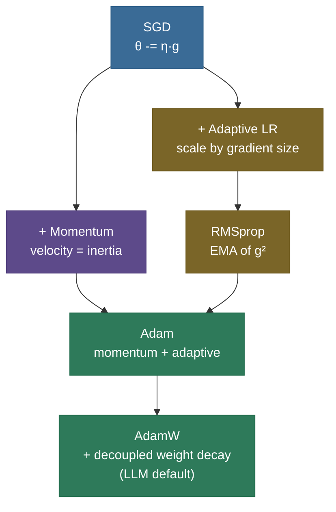
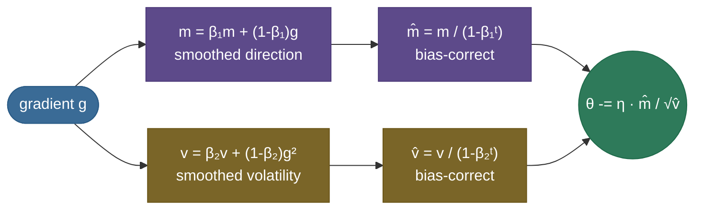

# Optimizers: turning gradients into good weight updates

Backprop hands you a **gradient** — the direction of steepest increase in the loss. The obvious move is to step the opposite way. But "step how far, in which combined direction, and at what rate for each of a billion parameters?" is exactly where naive gradient descent falls apart, and where the **optimizer** earns its keep. The optimizer is the rule that turns the raw gradient into the actual weight change — and the difference between a good one and a bad one is the difference between a model that converges in hours and one that oscillates forever or never trains at all.

By the end of this page you'll be able to **write the SGD, Momentum, and Adam update rules from memory**, explain **what the first and second moments do in Adam and why we bias-correct them**, articulate **why AdamW decouples weight decay**, and reason about the **SGD-vs-Adam generalization trade-off** that interviewers love. Intuition first (a ball rolling downhill), then the update rules, then code you can run that matches PyTorch exactly.

> **Note:** keep two ideas separate. **Gradient descent** is the *strategy* (move against the gradient). The **optimizer** is the *specific update rule* implementing it — how it uses the current gradient plus a memory of past gradients to decide each step. Everything below is a different answer to "how should we use the gradient?"

---

## The problem: one learning rate can't fit every direction

Plain gradient descent uses a single global learning rate $\eta$ for every parameter: $\theta \leftarrow \theta - \eta g$. That breaks on the loss surfaces real models actually have:

- **Ravines (ill-conditioning).** When the loss is steep in one direction and shallow in another, a learning rate small enough to be stable in the steep direction is *far* too small for the shallow one. The result is the classic **zig-zag**: bouncing across the steep walls while barely crawling toward the minimum.
- **Heterogeneous gradients.** Different parameters live on wildly different scales — an embedding row for a rare word gets huge, infrequent gradients; a bias term gets tiny, steady ones. One $\eta$ cannot serve both.
- **Saddle points and noise.** High-dimensional loss surfaces are full of saddles and the mini-batch gradient is noisy, so a dumb step can stall or wander.


> **Tip:** "why not just lower the learning rate?" is a trap question. Lowering $\eta$ fixes the zig-zag in the steep direction but makes the already-slow shallow direction hopeless. The whole point of better optimizers is to stop using *one* rate for *every* direction.

---

## What it is

An optimizer is a function `(weights, gradient, state) → new weights`. The family is a short ladder, each rung adding one idea:

- **SGD** — step downhill: $\theta \leftarrow \theta - \eta g$.
- **+ Momentum** — accumulate a velocity so you push *through* ravines and small bumps instead of bouncing.
- **+ Adaptive rates (AdaGrad → RMSprop)** — give each parameter its *own* effective learning rate, scaled by how big its recent gradients have been.
- **Adam** — combine momentum **and** per-parameter adaptive rates.
- **AdamW** — Adam with **decoupled weight decay**; the default for transformers and LLMs.

---

## Intuition: a ball rolling downhill

Picture the loss as a landscape and your parameters as a ball on it.

- **SGD** is a *light* ball with no memory. On a ravine it rolls straight down the steepest local slope — into a wall — then back, zig-zagging. Each step forgets the last.
- **Momentum** makes the ball *heavy*. It builds up velocity in the consistent direction (down the valley) and averages out the back-and-forth across the walls. The heavy ball rolls *through* small bumps and saddle points that would trap the light one.
- **Adaptive methods** put a **governor on each wheel**: a parameter whose gradient has been huge and erratic gets its step shrunk; one whose gradient is small and steady gets its step kept. Per-parameter learning rates, tuned automatically.
- **Adam** is the heavy ball *with* per-wheel governors — momentum for direction, adaptive scaling for step size. It's why Adam "just works" out of the box on most problems.

---

## Why it matters

**Convergence — speed and whether it happens at all.** The optimizer largely determines how fast a network trains and whether it converges at all. On the ravine above, the same problem and the same gradients give wildly different trajectories.

**Robustness — the real reason Adam dominates.** On a clean, well-conditioned problem a well-tuned SGD is hard to beat. Adam's superpower isn't being *fastest* — it's being **forgiving**: it converges across a wide range of learning rates, where SGD diverges if $\eta$ is a bit too high and crawls if it's a bit too low. That robustness is why Adam is the default when you can't afford a learning-rate search.


> **Note:** the famous **SGD-vs-Adam generalization trade-off**: tuned **SGD + momentum** often *generalizes better* (lower test error) than Adam, especially in vision — which is why ResNets are still trained with SGD. **Adam/AdamW** wins on transformers and on anything with sparse or heterogeneous gradients, and wins on convenience everywhere. The honest interview answer names both.

---

## How it works: the update rules

Each optimizer is a few lines. The family tree, with what each rung adds:



- **SGD:** $\theta \leftarrow \theta - \eta g$
- **Momentum:** $v \leftarrow \beta v + g; \quad \theta \leftarrow \theta - \eta v$ — $v$ is an accumulating velocity ($\beta = 0.9$ ≈ averaging the last ~10 gradients).
- **RMSprop:** $s \leftarrow \beta s + (1-\beta) g^2; \quad \theta \leftarrow \theta - \eta\, g / (\sqrt{s} + \epsilon)$ — dividing by the running gradient magnitude gives each parameter its own rate.

> **Gotcha:** in **Momentum**, the velocity makes the optimizer *overshoot* a sharp minimum before settling — visible as the wide swings in the trajectory plot. That overshoot is usually a feature (it escapes shallow traps), but it's why momentum can look unstable if the learning rate is too high.

---

## The math: Adam, bias correction, and AdamW

**Adam** keeps two exponential moving averages per parameter — the mean of recent gradients (first moment, *direction*) and the mean of recent *squared* gradients (second moment, *volatility*):

$$m_t = \beta_1 m_{t-1} + (1-\beta_1) g_t, \qquad v_t = \beta_2 v_{t-1} + (1-\beta_2) g_t^2$$

$$\hat{m}_t = \frac{m_t}{1 - \beta_1^t}, \qquad \hat{v}_t = \frac{v_t}{1 - \beta_2^t}, \qquad \theta_t \leftarrow \theta_{t-1} - \eta\,\frac{\hat{m}_t}{\sqrt{\hat{v}_t} + \epsilon}$$

The update is roughly *direction ÷ volatility*: steady parameters take full steps, jittery ones get throttled (the right panel above). Defaults: $\beta_1 = 0.9$, $\beta_2 = 0.999$, $\epsilon = 10^{-8}$.



**Why bias-correct?** $m$ and $v$ start at **0**, so early estimates are biased toward zero. Dividing by $(1-\beta^t)$ removes it: on step 1, $\hat m_1 = m_1/(1-\beta_1) = g_1$ — the correction recovers the true gradient (the code below prints exactly this). Without it the first $v$ is tiny, $\sqrt{\hat v}$ is tiny, and the **first steps are catastrophically large** — right when the model is most fragile.

**Why AdamW?** The natural way to add weight decay is L2 regularization — add $\lambda\theta$ to the gradient. But in Adam that term then gets divided by $\sqrt{\hat v}$, so the decay is **scaled per-parameter** and effectively weakened for the parameters with large gradients. **AdamW** fixes this by **decoupling**: apply the decay straight to the weights, outside the adaptive denominator:

$$\theta_t \leftarrow \theta_{t-1} - \eta\left(\frac{\hat m_t}{\sqrt{\hat v_t} + \epsilon} + \lambda\,\theta_{t-1}\right)$$

This small change measurably improves generalization and is why **AdamW**, not Adam, is the transformer default.

---

## Where it is used

- **AdamW** — the default for **Transformers, LLMs, and diffusion models**: sparse/heterogeneous gradients and huge parameter counts are exactly its sweet spot.
- **SGD + momentum (often Nesterov)** — still standard for **CNNs / vision** (ResNets), where it tends to generalize better and the gradients are well-behaved.
- **8-bit / fused optimizers** — Adam stores **two extra states per parameter** (the $m$ and $v$ moments). For a 7B model in FP32 that's ~56 GB of optimizer state, which is why **8-bit Adam** and sharded optimizers (ZeRO) exist.

> **Tip:** the optimizer-state memory is a load-bearing fact for LLM training interviews. Model weights + gradients + Adam's two moments ≈ **4× the parameter memory** before activations. It's the main reason full fine-tuning is so expensive and why [LoRA/PEFT](../../09.%20LLMs/concepts/12-LoRA-and-PEFT.md) (which trains far fewer parameters) saves so much.

---

## Application: choosing and configuring an optimizer

**Step 1 — pick the optimizer.** Training a transformer/LLM → **AdamW**. Training a CNN where you can afford to tune and want best test accuracy → **SGD + momentum (Nesterov)**. Unsure / prototyping → AdamW (robust by default).

**Step 2 — set the knobs.** AdamW defaults are remarkably stable: $\beta_1=0.9$, $\beta_2=0.999$ (or $0.95$ for large LLMs), $\epsilon=10^{-8}$ (raise to $10^{-6}$/$10^{-4}$ in mixed precision to avoid underflow), weight decay $0.01$–$0.1$. The one knob you must tune is the **learning rate**.

**Step 3 — schedule the learning rate.** Almost never use a constant rate: pair the optimizer with **warmup + decay** (see [Learning-Rate Schedules](08-Learning-Rate-Schedules-and-Warmup.md)). Warmup matters specifically *because* Adam's $\hat v$ estimate is unreliable in the first few steps — exactly when bias correction is doing the most work.

> **Gotcha:** in mixed-precision (FP16) training, the default $\epsilon = 10^{-8}$ can **underflow** in the denominator $\sqrt{\hat v} + \epsilon$, making steps explode. Large-scale configs routinely raise $\epsilon$. If FP16 training diverges early while FP32 is fine, suspect this before anything else.

---

## Code: the update rules, and Adam matching PyTorch

From-scratch SGD/Momentum/Adam, with the from-scratch Adam verified against `torch.optim.Adam` step for step. Runs on CPU in a second.

```python
"""From-scratch SGD / Momentum / Adam; Adam checked against torch.optim.Adam.
Verified on ml-py312 (torch 2.12), CPU."""
import torch
torch.manual_seed(0)

def sgd(w, g, st, lr=0.1):                       # plain gradient step
    return w - lr * g

def momentum(w, g, st, lr=0.1, beta=0.9):        # velocity accumulates -> inertia
    st["v"] = beta * st.get("v", torch.zeros_like(g)) + g
    return w - lr * st["v"]

def adam(w, g, st, lr=0.1, b1=0.9, b2=0.999, eps=1e-8):
    st["t"] = st.get("t", 0) + 1
    st["m"] = b1 * st.get("m", torch.zeros_like(g)) + (1 - b1) * g        # 1st moment (direction)
    st["v"] = b2 * st.get("v", torch.zeros_like(g)) + (1 - b2) * g * g    # 2nd moment (volatility)
    mhat = st["m"] / (1 - b1 ** st["t"])         # bias correction (crucial on early steps)
    vhat = st["v"] / (1 - b2 ** st["t"])
    return w - lr * mhat / (vhat.sqrt() + eps)   # per-parameter step: direction / sqrt(volatility)

# bias correction in action: on step 1 it recovers the true gradient
st = {}; g1 = torch.tensor([4.0])
_ = adam(torch.zeros(1), g1, st)
print("Adam step 1 — m raw:", round(st["m"].item(), 3),
      "| m_hat (bias-corrected):", round((st["m"] / (1 - 0.9)).item(), 3), "= true gradient 4.0")

# verify our Adam matches torch.optim.Adam, step for step
A = torch.tensor([6.0, 1.0])
def f(w): return 0.5 * (A * w ** 2).sum()
w_ref = torch.tensor([-9.0, -4.5], requires_grad=True)
opt = torch.optim.Adam([w_ref], lr=0.1, betas=(0.9, 0.999), eps=1e-8)
w_ours = torch.tensor([-9.0, -4.5]); st = {}
for _ in range(30):
    opt.zero_grad(); f(w_ref).backward(); opt.step()       # torch
    w_ours = adam(w_ours, A * w_ours, st)                  # ours (grad of f is A*w)
print("our Adam matches torch:", torch.allclose(w_ours, w_ref.detach(), atol=1e-5),
      "| max diff:", f"{(w_ours - w_ref.detach()).abs().max():.2e}")
```

Output:

```
Adam step 1 — m raw: 0.4 | m_hat (bias-corrected): 4.0 = true gradient 4.0
our Adam matches torch: True | max diff: 4.77e-07
```

> **Note:** the first line *is* bias correction: the raw first moment is `0.4` (biased toward the zero it started at), but $\hat m_1 = 0.4/(1-0.9) = 4.0$ recovers the true gradient. The second line confirms these ~10 lines reproduce PyTorch's Adam exactly.

---

## Recap and rapid-fire

**If you remember nothing else:** the optimizer decides how to turn a gradient into a weight step. **SGD** steps downhill; **Momentum** adds velocity to power through ravines; **adaptive** methods give each parameter its own rate; **Adam** combines momentum + adaptive scaling (direction ÷ volatility, bias-corrected); **AdamW** decouples weight decay and is the LLM default. Adam's real edge is robustness to the learning rate, not raw speed.

**Quick-fire — say these out loud:**

- *SGD update?* $\theta \leftarrow \theta - \eta g$.
- *What do Adam's m and v track?* $m$ = EMA of the gradient (direction/momentum); $v$ = EMA of the squared gradient (volatility / per-parameter scale).
- *Why bias-correct?* $m, v$ start at 0, biasing early estimates low; $/(1-\beta^t)$ fixes it — and prevents catastrophically large first steps.
- *Why AdamW over Adam?* It decouples weight decay from the adaptive denominator, so decay isn't weakened for high-gradient parameters — better generalization.
- *SGD vs Adam?* Tuned SGD+momentum often generalizes better (vision); AdamW is more robust and the default for transformers/LLMs.
- *Adam's memory cost?* Two extra states (m, v) per parameter ≈ 2× the weights — the reason 8-bit optimizers and ZeRO exist.
- *Default betas?* $\beta_1=0.9$, $\beta_2=0.999$ (β₂ often 0.95 for large LLMs).

---

## References and further reading

The curated link library for this topic — videos, courses, articles, papers, books, and internal cross-links — lives in a companion file so it can be reused as a standalone reference list:

**→ [Optimizers — references and further reading](07-Optimizers.references.md)**
