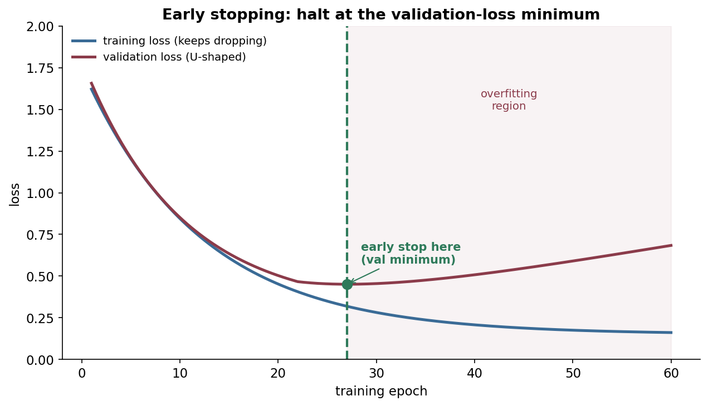
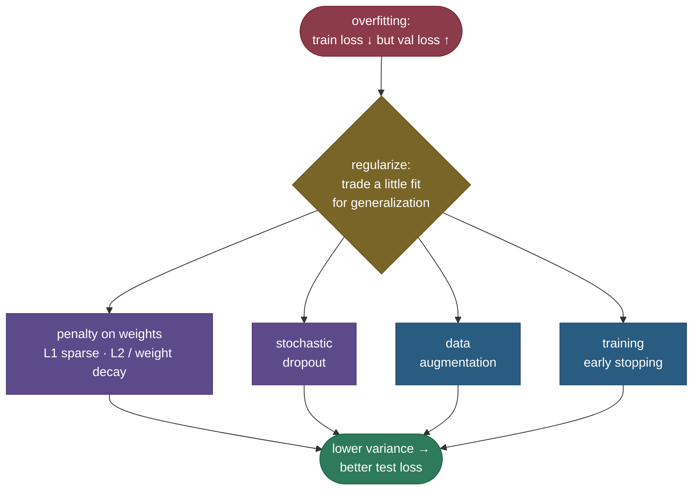

# Regularization: making a model generalize instead of memorize

A model with enough capacity can fit its training data *perfectly* — and still be useless, because it has memorized the noise instead of learning the pattern. You see it as the tell-tale gap: training loss keeps dropping while validation loss flattens and then climbs. That's **overfitting**, and **regularization** is the family of techniques that fight it. The common thread is a deliberate trade: give up a little fit on the training set in exchange for a model that's *simpler* — smaller weights, fewer active features, a shorter training run — and therefore generalizes better to data it hasn't seen. Regularization is how you move along the **bias–variance** trade-off on purpose.

By the end of this page you'll be able to:

- explain overfitting in terms of **bias and variance**, and what regularization trades;
- derive how an **L2 penalty** modifies the gradient and *why it is exactly "weight decay"*;
- explain geometrically why **L1 gives sparsity** (some weights exactly zero) and **L2 doesn't**;
- reason about **early stopping** as an implicit regularizer, and place **dropout / augmentation / label smoothing** in the toolkit;
- know the **AdamW** subtlety — L2 penalty $\ne$ weight decay under adaptive optimizers;
- demonstrate all of it in code (the weight-decay identity, and L1's sparsity recovering the true features).

Intuition and pictures first, then the math (with sources), then runnable code.

> **Note:** every regularizer is a way of saying *"prefer a simpler explanation."* L2 prefers small weights, L1 prefers few weights, early stopping prefers a model that hasn't trained long enough to memorize, dropout prefers a network that doesn't rely on any single neuron. Different biases toward simplicity — same goal: don't memorize the noise.

---

## The problem: overfitting and the bias–variance trade-off

Train a high-capacity model long enough and it will drive **training** loss toward zero by fitting every quirk of the sample — including noise that won't recur. On new data it fails. The framing interviewers want is **bias–variance**:

- **High bias (underfitting):** model too simple — misses real structure; train *and* test loss both high.
- **High variance (overfitting):** model too flexible — fits noise; train loss low, test loss high.

Regularization deliberately **adds a bit of bias to cut variance**, landing at a lower *total* error. The art is tuning *how much*: too little and you still overfit; too much and you underfit.

> **See it interactively:** in [TensorFlow Playground](https://playground.tensorflow.org/) switch the **Regularization** dropdown between None / L1 / L2 and watch the decision boundary go from a jagged, noise-fitting shape to a smooth one — overfitting cured in real time, in your browser.

---

## L2 regularization (weight decay): prefer small weights

L2 adds a penalty proportional to the **squared magnitude** of the weights to the loss:

$$L_{\text{total}} = L_{\text{data}} + \frac{\lambda}{2}\sum_i w_i^2 = L_{\text{data}} + \frac{\lambda}{2}\lVert w\rVert_2^2$$

The strength $\lambda$ is a hyperparameter. Now watch what it does to the gradient update. The penalty's gradient is $\lambda w$, so:

$$w \leftarrow w - \eta\big(\nabla L_{\text{data}} + \lambda w\big) = \underbrace{(1 - \eta\lambda)\,w}_{\text{shrink first}} - \eta\,\nabla L_{\text{data}}$$

Every step, the weight is first **multiplied by $(1 - \eta\lambda) < 1$** — pulled a little toward zero — *then* takes the usual data-gradient step. That multiplicative shrink is literally why L2 is called **weight decay**: the two are the same thing for plain SGD (the code confirms it to $10^{-7}$). Why does shrinking weights help? Smaller weights mean a **smoother, less wiggly function** — the network can't form the sharp, high-curvature shapes needed to fit noise, so it generalizes.

> *Where this comes from: weight decay / L2 as a gradient shrink is **Deep Learning** (Goodfellow et al.) §7.1.1; the classic generalization analysis is **A Simple Weight Decay Can Improve Generalization** (Krogh & Hertz 1991) — references.*

---

## L1 regularization (Lasso): prefer few weights

L1 penalizes the **absolute** value of the weights instead:

$$L_{\text{total}} = L_{\text{data}} + \lambda \sum_i |w_i| = L_{\text{data}} + \lambda \lVert w\rVert_1$$

Its gradient is $\lambda\,\text{sign}(w)$ — a **constant pull toward zero** regardless of how small $w$ already is (L2's pull, by contrast, *fades* as $w \to 0$). That constant pull is strong enough to push small weights **exactly to zero**, so L1 produces **sparse** models: it effectively performs feature selection. The cleanest way to see why is geometric:


Picture minimizing the data loss *subject to* a budget on the weights. L2's budget is a **circle**; the loss contour touches it at a smooth tangent — generically **off the axes**, so every weight is nonzero. L1's budget is a **diamond** with sharp **corners on the axes**; loss contours tend to first touch a *corner*, and a corner has one coordinate **exactly zero**. That's the whole sparsity story — corners, not curves.

> *Where this comes from: the diamond-vs-circle geometry is the classic Lasso picture from **The Elements of Statistical Learning** (Hastie, Tibshirani & Friedman) §3.4; the original Lasso is Tibshirani (1996); the deep-learning treatment is Goodfellow et al. §7.1 — references.*

> **Tip:** the one-liner — **L2 makes weights small; L1 makes weights zero.** Reach for L1 when you want a sparse, interpretable model or automatic feature selection; L2 (the default in deep learning) when you just want to tame magnitude. **Elastic net** combines both penalties when you want sparsity *and* L2's stability.

---

## The AdamW subtlety: L2 penalty ≠ weight decay under Adam

For plain SGD, "add an L2 penalty" and "decay the weights" are identical (we just showed it). For **adaptive** optimizers like Adam, they are **not**: Adam divides the gradient by a per-parameter running scale, so an L2 penalty folded into the gradient gets divided too — weights with large gradients get *less* decay, which isn't what you want. **AdamW** fixes this by **decoupling** weight decay from the gradient: it applies the $(1 - \eta\lambda)w$ shrink directly, separately from the Adam step. It's the standard optimizer for transformers for exactly this reason.

> *Where this comes from: **Decoupled Weight Decay Regularization** (Loshchilov & Hutter 2017) — the AdamW paper; in the references. See also [Optimizers](07-Optimizers.md).*

---

## Early stopping: the free regularizer

Watch training and validation loss as training proceeds: training loss falls monotonically, but validation loss is **U-shaped** — it improves, bottoms out, then rises as the model starts memorizing. **Early stopping** simply halts at that validation minimum:



It's almost free (you're already computing validation loss) and acts as an **implicit regularizer**: stopping early keeps the weights from growing as large as they would with full training, which is closely related to an L2 constraint. In practice you keep a **patience** counter — stop if validation hasn't improved for *k* epochs — and restore the best checkpoint.

---

## The rest of the toolkit

Regularization is a family; the penalty methods above are just the explicit ones:



- **[Dropout](10-Dropout.md)** — randomly zero a fraction of activations each step, so the network can't rely on any single neuron (an ensemble-like stochastic regularizer; covered in its own page).
- **Data augmentation** — expand the training set with label-preserving transforms (crops, flips, noise); the most effective regularizer when you can do it, because it adds real information about invariances.
- **Label smoothing** — soften one-hot targets so the model doesn't get pathologically over-confident (improves calibration; see [Loss Functions](04-Loss-Functions.md)).
- **Batch/layer normalization** — has a mild regularizing side effect (batch noise), though that's not its main job.

> **Tip:** Karpathy's practical order (in his "Recipe for Training Neural Networks," referenced) — get a model that *overfits* first (proves capacity), then regularize it down: add data/augmentation, then weight decay, then dropout, then early stopping, tuning each. Don't regularize a model that can't even fit the training set.

---

## Worked example: one L2 step

Weight $w = 2.0$, learning rate $\eta = 0.1$, L2 strength $\lambda = 0.5$, and a data gradient $\nabla L_{\text{data}} = 0.4$ at this point.

- **Shrink factor:** $(1 - \eta\lambda) = 1 - 0.1\cdot0.5 = 0.95$.
- **Update:** $w \leftarrow 0.95 \cdot 2.0 - 0.1 \cdot 0.4 = 1.90 - 0.04 = 1.86$.

Without regularization the update would be $2.0 - 0.04 = 1.96$. The extra pull of $0.10$ toward zero is the weight decay — applied every step, it keeps the weight from drifting large. (With $\nabla L_{\text{data}} = 0$, the weight just decays geometrically: $2.0 \to 1.90 \to 1.805 \to \dots \to 0$.)

---

## Code: the weight-decay identity, and L1's sparsity

```python
"""Regularization: (1) L2's gradient IS weight decay; (2) L1 gives sparsity, L2 doesn't.
Verified on Python 3.12 (torch 2.12), CPU."""
import torch
torch.manual_seed(0)

# (1) L2 penalty gradient == weight-decay update
w = torch.randn(5); gradL = torch.randn(5); lr, lam = 0.1, 0.5
upd_penalty = w - lr * (gradL + lam * w)          # minimize L + (lam/2)||w||^2
upd_decay   = (1 - lr * lam) * w - lr * gradL     # "shrink then step" form
print(f"L2 penalty == weight decay?  max diff = {(upd_penalty - upd_decay).abs().max():.2e}")

# (2) sparsity: recover y built from only 3 of 20 features
N, D = 200, 20
X = torch.randn(N, D); true_w = torch.zeros(D); true_w[[2, 7, 15]] = torch.tensor([3., -2., 1.5])
y = X @ true_w + 0.1 * torch.randn(N)

def fit(penalty, lam=0.1, steps=2000, lr=0.05):
    w = torch.zeros(D, requires_grad=True); opt = torch.optim.SGD([w], lr=lr)
    for _ in range(steps):
        loss = ((X @ w - y) ** 2).mean()
        reg = lam * w.abs().sum() if penalty == "L1" else lam * (w ** 2).sum()
        opt.zero_grad(); (loss + reg).backward(); opt.step()
    return w.detach()

z = lambda w: int((w.abs() < 1e-2).sum())
w_l1, w_l2 = fit("L1"), fit("L2")
print(f"L1 (Lasso): {z(w_l1)}/{D} weights ~0  -> sparse;  nonzero idx {sorted((w_l1.abs()>=1e-2).nonzero().flatten().tolist())} (true [2,7,15])")
print(f"L2 (Ridge): {z(w_l2)}/{D} weights ~0  -> dense, keeps all")
```

Output:

```
L2 penalty == weight decay?  max diff = 2.38e-07
L1 (Lasso): 17/20 weights ~0  -> sparse;  nonzero idx [2, 7, 15] (true [2,7,15])
L2 (Ridge): 4/20 weights ~0  -> dense, keeps all
```

> **Note:** the first line confirms the algebra — adding an L2 penalty *is* multiplicative weight decay (to floating-point precision). The second shows L1 doing feature selection for real: it zeroed 17 of 20 weights and kept **exactly** the three that generated the data, while L2 left almost everything nonzero. That's sparse-vs-dense, demonstrated.

---

## Where regularization is used

- **Everywhere in training** — weight decay is on by default in essentially every modern training recipe (AdamW); dropout and augmentation are standard.
- **Small-data / high-capacity regimes** — the more parameters relative to data, the more regularization matters (classic ML, fine-tuning, medical/scientific data).
- **Feature selection** — L1/Lasso when you want a sparse, interpretable subset of inputs.
- **LLMs** — weight decay (AdamW), dropout, and label smoothing are all part of large-scale pretraining; data scale itself is a powerful implicit regularizer.

> **Tip:** regularization strength is one of the **highest-leverage hyperparameters** you tune. The validation curve is your instrument: if train ≪ val, regularize more; if train ≈ val and both are high, regularize less (or add capacity).

---

## Recap and rapid-fire

**If you remember nothing else:** regularization trades a little training fit for better generalization by preferring *simpler* models. **L2 / weight decay** shrinks weights every step ($w \leftarrow (1-\eta\lambda)w - \eta\nabla L$) for smoother functions; **L1 / Lasso** pulls weights to *exactly zero* (sparsity / feature selection) because its constraint has corners on the axes; **early stopping** halts at the validation minimum; **dropout, augmentation, label smoothing** round out the kit. It's all the **bias–variance** trade-off, steered on purpose.

**Quick-fire — say these out loud:**

- *What problem does regularization solve?* Overfitting — high variance, train ≪ test loss.
- *L2 update?* $w \leftarrow (1-\eta\lambda)w - \eta\nabla L_{\text{data}}$ — shrink then step; that shrink is "weight decay."
- *Why is L2 called weight decay?* Its gradient adds $\lambda w$, which multiplies $w$ by $(1-\eta\lambda)$ each step.
- *L1 vs L2?* L1 → sparse (weights exactly 0, feature selection); L2 → small-but-dense.
- *Why does L1 give sparsity (geometrically)?* Its constraint is a diamond; contours meet it at a corner on an axis → a weight is 0.
- *Early stopping — why does it regularize?* It stops before weights grow large enough to memorize; ≈ an L2 constraint.
- *AdamW vs Adam + L2?* AdamW decouples weight decay from the adaptive step; L2-in-the-gradient gets wrongly rescaled by Adam.
- *Bias–variance?* Regularization adds bias to cut variance, lowering total test error.
- *Most effective regularizer when available?* More/augmented data.

---

## References and further reading

The curated link library for this topic — videos, courses, interactive/visual resources, articles, papers, books, and internal cross-links — lives in a companion file so it can be reused as a standalone reference list:

**→ [Regularization — references and further reading](09-Regularization.references.md)**
