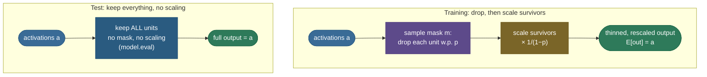
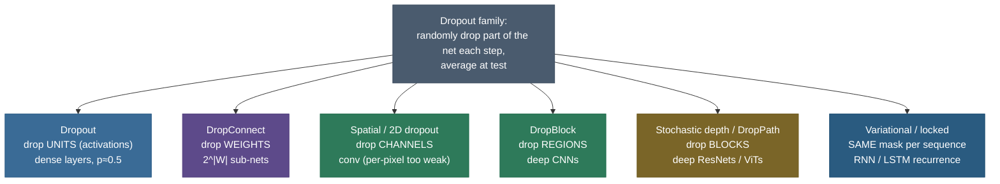

# Dropout: regularizing by randomly breaking the network

Dropout is one of those ideas that sounds like sabotage and turns out to be brilliant. During training, on *every single forward pass*, you **randomly switch off a fraction of the neurons** — set their outputs to zero — and train only what's left. Do it again on the next mini-batch with a *different* random set of survivors. Run the network a thousand times and it is, in a literal sense, a thousand slightly different networks. It looks destructive — you are deliberately lobotomizing a perfectly good model on purpose, mid-training, over and over. And yet it is one of the most effective regularizers ever discovered, the single technique most responsible for making the first generation of large deep nets (AlexNet, the 2012 ImageNet winner) generalize instead of memorize.

The reason it works is that it cures a *specific* disease of over-parameterized networks: **co-adaptation**, where neurons quietly learn to lean on each other in fragile, over-fit combinations that memorize the training noise. If any neuron might vanish at any moment, none can afford to depend on a specific partner being present — so each is forced to learn a feature that is useful *on its own*. The payoff is a network that generalizes markedly better, and — as a bonus that turns out to be the deepest part of the theory — an elegant interpretation as **training an ensemble of exponentially many networks at the cost of one**.

By the end of this page you'll be able to:

- explain **co-adaptation** precisely and how randomly dropping units breaks it;
- **derive** the ensemble / model-averaging interpretation — that $n$ droppable units define $2^n$ weight-sharing sub-networks, so dropout ≈ training-and-averaging an exponential ensemble;
- handle the crucial **train-vs-test** mismatch and **derive inverted dropout** — why scaling survivors by $\tfrac{1}{1-p}$ at train time keeps the expected activation fixed and leaves test time untouched;
- explain why the test-time full network approximates a **geometric-mean ensemble**, and why dropout is roughly an **adaptive $L_2$** penalty (Wager et al.);
- choose the **rate $p$** sensibly and explain the **dropout + BatchNorm conflict** (the variance shift);
- name and *justify* the variants — **spatial/2D dropout, DropConnect, DropBlock, stochastic depth / DropPath, variational (locked) dropout for RNNs, attention dropout** — and say *why* each exists;
- explain the **decline of dropout in very large models** and **MC-dropout** for Bayesian uncertainty;
- implement inverted dropout and **confirm** its expectation, its $2^n$ count, its match to `torch.nn.Dropout`, the measured overfit-gap closing, and the rate sweet-spot — all in runnable code.

Intuition and pictures first, then the math (every result *derived*, with sources), then runnable, verified code.

> **Note:** dropout is a member of the [regularization](09-Regularization.md) family — like $L_2$, early stopping, or data augmentation, it trades a little training fit for better generalization. What makes it distinctive is *how*: instead of penalizing the weights with an explicit term in the loss, it injects **noise into the architecture itself** every forward pass. That stochastic perturbation turns out to be a remarkably effective — and, as we'll derive, theoretically principled — way to prevent memorization.

---

## The problem: co-adaptation and the ensemble you can't afford

Start with the disease, because dropout is designed precisely against it.

A modern network is **over-parameterized**: it has far more weights than there are training examples, more than enough capacity to memorize the training set outright. When a high-capacity model is trained on a finite dataset, it doesn't just learn the signal — it also fits the **noise**: the random quirks of *these particular* training points that won't recur at test time. The result is the classic gap of **overfitting** — tiny training error, large test error.

Networks overfit in a particular, sneaky way that has a name: **co-adaptation**. Groups of neurons learn to work as fragile committees. Neuron B learns to correct neuron A's mistakes *on the specific training examples*; neuron C patches B's residual error; and so on — a house of cards of mutually-dependent feature detectors that fits the training data through brittle collaboration rather than through robust, individually-meaningful features. Each detector is only useful *in the precise context of its co-conspirators*. It works beautifully on data the committee has seen and falls apart on data it hasn't, because the exact co-occurrence pattern the committee relies on doesn't hold on new inputs.

> **Note:** "co-adaptation" is a sharper idea than generic overfitting. Overfitting is the *symptom* (train ≪ test error); co-adaptation is one *mechanism* — feature detectors that are only meaningful as a group. Hinton's framing (2012) is that you want each hidden unit to be a useful feature detector *on its own*, not merely a cog that's load-bearing only when seven specific other cogs are also present.

The textbook cure for an over-fit, high-variance model is an **ensemble**: train *many* different models and average their predictions. Averaging cancels each model's idiosyncratic errors (the variance) while keeping the shared signal (the bias roughly fixed) — bagging reliably reduces variance, which is why random forests and model-averaging dominate Kaggle. The catch is cost: training, storing, and running hundreds of independent deep networks is wildly impractical for anything but tiny problems.

This is the gap dropout fills. It gives you the variance-reduction of an enormous ensemble — *exponentially* large, as we'll see — for almost exactly the price of training **one** network. That is the whole pitch, and the rest of the page is unpacking how a single trick delivers both "no co-adaptation" and "free ensemble" at once.

---

## What dropout does

The mechanism is almost embarrassingly simple. During training, for each forward pass and each unit in the layers you choose to apply it to:

> **keep the unit with probability $q = 1-p$, and zero it (drop it) with probability $p$ — independently per unit, resampled fresh every forward pass.**

The fraction $p$ is the **dropout rate** (the probability of *dropping*); $q = 1-p$ is the **keep probability**. With $p = 0.5$, roughly half the units are silenced on any given pass — and a *different* random half on the next pass. The kept units carry the forward signal and receive gradients in the backward pass; the dropped units output exactly zero and, because zero flows forward, receive no gradient that step (their incoming and outgoing weights are simply not updated by that example).

Concretely, if a layer produces a vector of activations $\mathbf{a} = (a_1, \dots, a_k)$, dropout samples a binary **mask** $\mathbf{m} = (m_1, \dots, m_k)$ with each $m_i \sim \text{Bernoulli}(q)$ independently, and replaces the activation with the elementwise product $\mathbf{m} \odot \mathbf{a}$ (we'll add the survivor-scaling factor in a moment). Next step, a brand-new mask. The mask is **multiplicative noise** drawn fresh each time.


> **Gotcha:** dropout is applied to the **outputs of units (activations)**, not directly to the weights, and only in the layers you choose — typically the dense hidden layers and, at a lower rate, the inputs; rarely the output layer (you don't want to randomly delete logits you're about to score). The output layer and the loss see the *thinned* network's prediction, and gradients flow back only through the surviving paths.

> **Tip:** the dropped units aren't "deleted from the model" — their weights are untouched and waiting. They're just *silenced for this one forward/backward pass*. On the next pass a different random subset is silenced. Over training, every unit and every weight gets updated many times, but never in the company of exactly the same teammates twice.

---

## Intuition: the company that rotates its staff

Picture a company where, every single day, a random half of the employees calls in sick — and *which* half is different each day. In a fragile company, work would grind to a halt: critical knowledge lives in one person's head, and the moment they're out, their tasks fail. But run this regime long enough and the company *adapts*: it can no longer afford any single point of failure, so every important skill gets spread across several people, hand-offs get documented, and each employee becomes broadly competent rather than narrowly indispensable. The organization that survives "random half out every day" is *robust* — it works no matter which subset shows up. Then on the one day everyone *is* present (test time), it runs better than ever, because all that redundant, distributed competence is now firing at once.

That is dropout. Each neuron is an employee; "calling in sick" is being dropped; the surviving network is whoever showed up today. Training under constant random absence forces the network to build redundant, distributed representations with no single point of failure — and at test time, with everyone present, you reap the benefit of all that robustness. The "scale survivors by $\frac{1}{1-p}$" trick is the overtime pay: when only half the staff is in, each works twice as hard so the day's *expected* output matches a full-staff day.

A second, equivalent picture is the **ensemble in disguise**. Imagine you wanted the wisdom of a thousand different expert committees but could only afford to pay one salary. Dropout's answer: keep one set of experts, but each day randomly pick a different sub-committee to make the call, and over time every possible sub-committee gets trained — all sharing the *same* underlying expertise. At decision time you ask the whole assembly at once, which behaves like the average opinion of all those committees. The next two sections turn each of these pictures into precise mechanics.

---

## Why it works, intuition one: no co-adaptation

The first reason dropout helps is the direct antidote to the disease above. **Because any neuron's neighbours might be gone on the next pass, no neuron can rely on a specific other neuron being present.** Neuron B can no longer build its feature on the assumption "neuron A will be there to correct me" — half the time A *won't* be there. The brittle mutual-correction committees can't form, because their members keep disappearing.

What each unit learns instead is a feature that is **independently useful and robust** — one that contributes correctly *on average over all the random subsets of teammates it might find itself working with*. This spreads the representation out: instead of one fragile path encoding a concept, the network is pushed to encode it redundantly across several units, any subset of which can carry it. Redundant, distributed representations are exactly what generalize, because they don't hinge on a precise co-occurrence that may not recur at test time. Hinton's original intuition put it as forcing each hidden unit to be a good feature detector "regardless of which other hidden units are present."

> **Note:** there's a vivid evolutionary analogy from Srivastava et al. (2014). Sexual reproduction shuffles genes so a gene must be useful when paired with a *random* set of other genes — not just with one fixed co-adapted partner — which favours robust, individually-useful genes over fragile co-adapted gene complexes. Dropout does the same to neurons: it forces each to be useful in the company of a *random* subset of the others, breeding robustness over brittle co-adaptation.

---

## Why it works, intuition two: a free ensemble of $2^n$ networks (derived)

The second reason is deeper and is the part interviewers love, because it explains *why test time works the way it does*. Let's derive it.

Take a network with $n$ units that can be dropped. On any forward pass, each of those $n$ units is independently either present or absent — a binary choice. So the number of distinct **thinned sub-networks** dropout can sample is the number of binary strings of length $n$:

$$\underbrace{2 \times 2 \times \cdots \times 2}_{n \text{ units}} = 2^{\,n}.$$

For a tiny layer of $n=8$ droppable units that's already $2^8 = 256$ sub-networks; for a realistic hidden layer of $n=1000$ it is $2^{1000}$ — more than the number of atoms in the observable universe. Every training step, dropout samples **one** of these $2^n$ sub-networks (whichever the random mask selects) and takes a gradient step on it.

Here is the crucial twist that makes this cheap: **all $2^n$ sub-networks share the same underlying weights.** A weight $w_{ij}$ between unit $i$ and unit $j$ is the *same number* in every sub-network that happens to contain both endpoints — there is one global weight matrix, and each sub-network is just a masked view of it. So when you update $w_{ij}$ on the sub-network you sampled this step, you are simultaneously nudging *every* sub-network that shares that weight. Training the ensemble doesn't cost $2^n\times$ the work; it costs $1\times$, because the $2^n$ models are tied together through their shared parameters.

Dropout is therefore **training an exponentially large ensemble of weight-sharing sub-networks by stochastic gradient descent** — sampling a different ensemble member each step, and letting weight-sharing knit them into one. This is a form of **bagging**, with two differences from textbook bagging: (1) the models are not independent — they share weights — and (2) you don't train each to convergence, you take one SGD step on a fresh sample each iteration. But the variance-reduction intuition carries over: at test time you want to *average over the ensemble*, and averaging an ensemble reduces variance.

> *Where this comes from: both interpretations are in the original dropout papers — **Improving neural networks by preventing co-adaptation of feature detectors** (Hinton et al. 2012) and **Dropout: A Simple Way to Prevent Overfitting** (Srivastava et al. 2014), which frames test-time inference as approximate model averaging over the $2^n$ thinned networks. **Deep Learning** (Goodfellow et al.) §7.12 develops the bagging view rigorously. All in the references.*

> **Note:** the $2^n$ count is for the *number of units you apply dropout to*, summed across all dropout layers — not the number of weights and not the number of layers. If you put dropout on two hidden layers with 500 units each, that's $n=1000$ droppable units and $2^{1000}$ sub-networks sampled from the single shared weight set.

---

## The inference problem, and inverted dropout (full derivation)

The ensemble view raises an immediate, practical question: **at test time, which of the $2^n$ sub-networks do you run?** You'd love to run all $2^n$ and average their predictions — that's the ideal model average — but $2^n$ forward passes is exactly the intractability dropout was supposed to avoid. We need a cheap stand-in.

The cheap stand-in is: **run the single full network with all units present, no dropping.** Intuitively, the full network "contains" all the sub-networks at once, and running it once approximates averaging them (we make this precise below with the geometric-mean argument). But running the full network naively breaks a scale invariant, and fixing that is the whole point of **inverted dropout**.

**The scale mismatch.** Consider a unit downstream of a dropout layer. During training, a given upstream unit was present only a fraction $q = 1-p$ of the time, so the *expected* input the downstream unit received from it was $q \cdot a$ (present with value $a$ a fraction $q$ of the time, zero otherwise). The downstream weights adapted to that expected input scale. Now at test time you turn *all* upstream units on — every one contributes its full $a$, with nothing zeroed — so the downstream unit suddenly receives an input that is, in expectation, $\frac{1}{q}$ times larger than what it was tuned for. With $p = 0.5$ that's **double** the expected pre-activation, which can saturate nonlinearities and wreck the prediction. Something has to rescale to undo that factor of $\frac{1}{q}$.

There are two equivalent places to put the correction:

1. **Scale at test time (the original "standard dropout").** Train with plain masking $\mathbf{m}\odot\mathbf{a}$, then at test time multiply every weight (or every activation) coming out of a dropout layer by $q$, shrinking the test-time signal back down to the scale the downstream units expect. This works, but it requires a special test-time pass that differs from training.

2. **Scale at train time (inverted dropout — the modern standard).** Do the correction *during training* by multiplying the surviving activations by $\frac{1}{q}$ the moment you drop. Then the expected output is already at the right scale, and test time is the plain full network with **no special handling at all**. This is what every framework does today, because it keeps inference code trivially simple — eval mode is just the identity.

**Why $\frac{1}{q}$ is exactly the right factor (derivation).** Under inverted dropout, a unit's output is

$$\tilde{a} \;=\; \frac{m}{q}\,a, \qquad m \sim \text{Bernoulli}(q),\quad q = 1-p.$$

Take the expectation over the random mask $m$ (the activation $a$ is fixed for a given input):

$$\mathbb{E}[\tilde{a}] \;=\; \frac{a}{q}\,\mathbb{E}[m] \;=\; \frac{a}{q}\cdot \underbrace{q}_{\mathbb{E}[\text{Bernoulli}(q)]} \;=\; a.$$

The factor $\frac{1}{q}$ exactly cancels the $\mathbb{E}[m] = q$ from the dropout, leaving $\mathbb{E}[\tilde a] = a$ — **the expected activation under inverted dropout equals the original, un-dropped activation.** So a downstream unit sees, *in expectation*, exactly the same input scale during training (with dropout + scaling) as it will see at test time (full network, no scaling). The invariant is preserved, and test time needs no correction. This is why inverted dropout is so clean: the scaling is baked into training, and inference is just `forward()` with dropout disabled.


The right panel is the derivation made empirical: average enough inverted-dropout passes and each unit's mean returns to its original value, because $\mathbb{E}[\tilde a]=a$. The code section below confirms this numerically (the average over many masks lands at $1.0003$ for an input of $1.0$).



> *Where this comes from: inverted dropout (scale at train time so inference is unscaled) is the standard implementation in **d2l.ai** §5.6 and the **CS231n** notes (both in the references). It is exactly what `nn.Dropout` does — the code section below confirms that in train mode it scales survivors by precisely $\frac{1}{1-p}$ and that eval mode is the identity.*

> **Gotcha:** this is the **#1 dropout bug**, identical in spirit to the BatchNorm one — **forgetting `model.eval()`** at inference. Leave the model in train mode and dropout keeps randomly zeroing units (and scaling survivors), so your predictions become *noisy and non-deterministic* — the same input gives different outputs on repeated calls. Always switch to eval mode before evaluating (which conveniently also freezes BatchNorm's running statistics). Conversely, forgetting `model.train()` after an eval loop silently turns regularization *off* for the rest of training.

> **Note — the expectation is exact but the function isn't.** Inverted dropout matches the *expected* activation per unit, but the full network's output is **not** literally the average of the $2^n$ sub-networks' outputs, because a network is nonlinear and $\mathbb{E}[f(x)] \ne f(\mathbb{E}[x])$ in general. Running the full network is an *approximation* to the ensemble average — a very good and cheap one. The next section pins down *what kind* of average it actually is.

---

## Why the full network ≈ a geometric-mean ensemble

So the full network with inverted-dropout scaling approximates "averaging the $2^n$ sub-networks" — but *which* average? Hinton and Srivastava give the clean answer for the case that matters most: **a single softmax/linear layer fed by dropout.**

Consider a softmax output unit whose log-probability for class $k$ under a sampled mask $\mathbf m$ is linear in the masked activations: $\log z_k(\mathbf m) = \mathbf w_k^\top (\mathbf m \odot \mathbf a) + b_k$. The proper ensemble prediction averages the *probabilities* the $2^n$ sub-networks assign. A close and tractable cousin is the **geometric mean** of the sub-network distributions (then renormalized). Take the geometric mean of the unnormalized class scores over all masks: because the log-score is linear in $\mathbf m$, the geometric mean over masks corresponds to *averaging the masks themselves* inside the linear layer — and the average mask is exactly $q = 1-p$ per unit. So the geometric-mean ensemble's score uses weights scaled by $q$:

$$\Big(\textstyle\prod_{\mathbf m} z_k(\mathbf m)\Big)^{1/2^n} \;\propto\; \exp\!\big(\,q\,\mathbf w_k^\top \mathbf a + b_k\big).$$

That is *precisely* the full network with its weights scaled by $q$ — i.e. the weight-scaling inference rule (equivalently, inverted dropout's $\frac{1}{q}$ at train time leaving test weights unscaled). For a single linear/softmax layer this is **exact**: the deterministic weight-scaled network computes the geometric-mean ensemble *exactly*. For deep nonlinear stacks it is an approximation, but empirically an excellent one — which is why "just run the full net at test time" works as well as it does.

A concrete tiny instance makes the "exact" claim tangible. Take a single linear score $z(\mathbf m) = w_1 m_1 a_1 + w_2 m_2 a_2$ with two droppable inputs at keep prob $q=\tfrac12$, so there are $2^2=4$ equally-likely masks. Their scores are $0$ (both dropped), $w_1 a_1$, $w_2 a_2$, and $w_1 a_1 + w_2 a_2$. The *arithmetic* mean of these four scores is $\tfrac14\big(0 + w_1 a_1 + w_2 a_2 + (w_1 a_1 + w_2 a_2)\big) = \tfrac12 w_1 a_1 + \tfrac12 w_2 a_2 = q\,(w_1 a_1 + w_2 a_2)$ — exactly the full network with weights scaled by $q=\tfrac12$. Because the score is *linear* in the mask, averaging the masked scores equals scaling by the mean mask $q$; pushing this through the softmax's exponential is what turns "average score" into "geometric mean of probabilities," and the weight-scaled full network reproduces it with one forward pass.

> *Where this comes from: the geometric-mean / weight-scaling argument and its exactness for a single softmax layer are in **Srivastava et al. (2014) §7** and **Deep Learning** (Goodfellow et al.) §7.12 — the references. The takeaway worth memorizing: weight-scaling inference is *exact* model averaging for one linear layer and a strong approximation otherwise.*

> **Tip:** this is the rigorous content behind the loose claim "dropout trains an ensemble and test time averages it." The averaging is a **geometric** mean of the sub-network distributions, and the cheap weight-scaled full network *is* that geometric mean for a linear readout. It's a genuinely beautiful result: an exponential ensemble collapsed into one deterministic forward pass.

---

## Why it regularizes: noise, and an adaptive $L_2$

We have two intuitions (no co-adaptation; ensemble averaging). There's a third, more analytical view that connects dropout to the rest of the regularization toolkit: **dropout is approximately an adaptive $L_2$ penalty.**

The mechanism is noise injection. Multiplying activations by a random Bernoulli mask injects multiplicative noise into the forward pass, and a long line of work shows that *training with input/activation noise is equivalent to a penalty on the model's sensitivity to that noise.* Wager, Wang & Liang (2013) made this precise for dropout: after expanding the dropout objective and taking the expectation over masks, the leading correction term beyond the ordinary loss is a **penalty on the weights, scaled per-feature by that feature's estimated variance** under the model. In a generalized linear model the dropout objective is, to second order,

$$\mathbb{E}_{\mathbf m}[\text{loss}] \;\approx\; \text{loss}_{\text{full}} \;+\; \underbrace{\tfrac{p}{1-p}\sum_i \big(\text{feature variance}_i\big)\, w_i^2}_{\text{adaptive } L_2 \text{ penalty}}.$$

Two things to read off this. First, the penalty is **quadratic in the weights** — it *is* an $L_2$ / weight-decay-like term, which is why dropout shrinks weights and improves conditioning. Second, it is **adaptive**: each weight's penalty is scaled by its feature's variance (after a normalization, by the inverse Fisher information), so dropout penalizes weights on high-variance, less-reliable features *more* than weights on stable, informative ones — something plain $L_2$ (which penalizes every weight equally) cannot do. This is one reason dropout often outperforms a tuned $L_2$: it's a *smarter*, data-dependent shrinkage. Note the coefficient $\frac{p}{1-p}$ grows with the rate $p$ — more dropping means stronger effective regularization, matching intuition and the measured sweep below.

> *Where this comes from: **Dropout Training as Adaptive Regularization** (Wager, Wang & Liang 2013, in the references) derives the second-order equivalence to an adaptive $L_2$ penalty and the connection to Fisher information. The high-level takeaway — dropout ≈ a variance-scaled, data-adaptive weight penalty — is the one to carry into an interview.*

> **Note:** these three views — *no co-adaptation*, *ensemble averaging*, *adaptive $L_2$* — are not competing theories; they're three faces of the same mechanism (multiplicative Bernoulli noise on activations). A strong interview answer names all three and notes that the adaptive-$L_2$ view is what mathematically connects dropout to ordinary weight decay.

---

## Choosing the rate $p$, and the measured sweet spot

The rate $p$ is a hyperparameter, and the right value depends on *where* you put the dropout and *how* over-parameterized the layer is. Common, battle-tested defaults:

- **Fully-connected hidden layers: $p \approx 0.5$.** The original sweet spot from Srivastava et al. — and not a coincidence: $p=0.5$ maximizes the number of *distinct* sub-networks the mask can sample (the Bernoulli has maximum entropy at $0.5$), giving the richest ensemble. Big dense layers have the most spare capacity to regularize.
- **Input layer: $p \approx 0.1$–$0.2$.** Inputs carry information you can't reconstruct if you delete it, so you drop them gently. (Dropping inputs heavily is closer to a crude data-augmentation/denoising scheme and usually hurts.)
- **Convolutional layers: low or none** (and prefer **spatial dropout** if any — see variants). Conv layers are already parameter-efficient via weight sharing, and per-pixel dropout is weak on them (next section).
- **Transformers: $p \approx 0.1$** on attention weights, residual/sub-layer outputs, and embeddings. Lower than dense MLPs because transformers are huge and trained on huge data, where less regularization is needed.

Higher $p$ means stronger regularization but slower, noisier training and, past a point, **underfitting** — too few units survive to represent the function. So $p$ has a sweet spot, which you find on a validation set. The measured sweep below shows the whole curve on an over-parameterized MLP fit to a noisy two-moons task.


Read the curve like a regularization dial. At $p=0$ the net memorizes (train accuracy $1.00$) but generalizes poorly (test $\approx 0.79$ — a wide gap = overfitting). As $p$ rises, train accuracy slides down (the net *can't* memorize as easily) while **test accuracy climbs** — regularization is closing the gap — until it peaks (here near $p=0.7$, test $\approx 0.92$). Push $p$ higher still and test accuracy *falls again*: at $p=0.9$ nine of ten units are gone each pass, the survivors can't represent the boundary, and the model **underfits** (train and test both drop). The sweet spot is wherever validation performance peaks — and notice the optimal $p$ here is high because this toy is *severely* over-parameterized relative to its 120 noisy points; a normal model on real data peaks lower, around the $0.5$ default.

> **Tip:** tune $p$ on **validation loss**, not training loss — training loss always *looks worse* with more dropout (that's the point), so it's the wrong signal. And tune it *with* your other regularizers, not in isolation: dropout, weight decay, and data augmentation overlap, so the best dropout rate depends on how much of the regularization budget the others already spend.

---

## The dropout + BatchNorm conflict (variance shift)

A frequent and sharp interview point: **dropout and BatchNorm can interfere, and stacking them naively hurts.** Here's the mechanism, because "they just conflict" isn't a real answer.

[BatchNorm](11-Normalization.md) normalizes activations using statistics (mean, variance) it accumulates during training and then *freezes* for inference. The problem is that dropout **changes the variance of the activations between train and test**. During training a unit downstream of dropout sees inputs with extra variance from the random masking (a Bernoulli-times-activation has higher variance than the activation alone); at test time, with dropout off, that extra variance vanishes. So a BatchNorm layer placed *after* dropout estimates its running variance from the high-variance training distribution, then at inference applies that (now wrong) variance to the low-variance test distribution — a train/test mismatch Li et al. (2019) named the **"variance shift."** The result is a BatchNorm that's mis-calibrated at inference, and a measurable accuracy hit when you stack the two in the wrong order.

The practical guidance:

- **Often, pick one.** Modern **CNNs** lean on BatchNorm and use little or no dropout (BatchNorm already injects mild batch-noise regularization — see the [Normalization](11-Normalization.md) page). **Transformers** use dropout heavily but pair it with **LayerNorm**, not BatchNorm — and LayerNorm normalizes per-example over features, so it has *no batch statistics to shift* and doesn't suffer the variance-shift problem at all. This is a big reason transformers comfortably combine dropout with normalization while CNNs avoid the combination.
- **If you must stack them, order matters:** Li et al. recommend placing **dropout after all BatchNorm layers** (so BN's statistics are estimated on undropped activations), or using a variance-stable variant. The exact pattern is less important than knowing the failure mode exists.

> **Gotcha:** the failure is silent — the model trains fine and only under-performs at *inference*, because the damage is a train/test statistics mismatch, not a training-time error. If a CNN that combines dropout and BatchNorm validates worse than expected, suspect the variance shift and try removing the dropout (or moving it after the last BN). The companion [Normalization](11-Normalization.md) page covers BatchNorm's own train/test statistics in depth.

---

## Variants worth naming (and why each exists)

Plain dropout zeros independent scalar activations. Several variants change *what* gets dropped to fit a particular architecture — and each exists for a concrete reason.

**Spatial / 2D dropout (drop whole channels).** In a conv layer, the activation is a stack of feature maps, and *neighbouring pixels within a map are strongly spatially correlated* — they encode nearly the same information. If you drop individual pixels (standard dropout), the surviving neighbours leak almost all of a dropped pixel's information straight back, so the "drop" barely removes anything — the regularization is **weak and the effective dropout rate is far below $p$**. Spatial dropout (Tompson et al. 2015, `nn.Dropout2d`) fixes this by dropping **entire feature-map channels** at once: zero a whole channel and *all* its spatially-correlated activations vanish together, so the unit of information you remove is a whole feature, not a redundant pixel. This is the right form of dropout for convolutions.

> **Note — derive why per-pixel dropout is weak on conv maps:** a feature map is locally smooth, so pixel $(i,j)$ and its neighbour $(i,j{+}1)$ carry highly redundant values. Drop $(i,j)$ and the next conv/pooling layer still "sees" essentially the same feature via the un-dropped neighbour — the information you tried to remove survives. Dropping the *whole channel* removes that feature everywhere at once, so there's no spatial neighbour to leak it back. Hence spatial (channel-wise) dropout, not per-element, for conv layers.

**DropBlock (drop contiguous regions).** A refinement of spatial dropout for conv nets (Ghiasi et al. 2018): instead of whole channels, drop **contiguous square blocks** of a feature map. The same logic as spatial dropout — remove correlated regions together so the drop actually bites — but at a spatial granularity between per-pixel and whole-channel, which works well in deep CNNs like ResNets.

**DropConnect (drop weights, not units).** A generalization (Wan et al. 2013): instead of zeroing whole units' *outputs*, zero individual *weights* (connections) at random, each with probability $p$. Dropout is the special case where you drop *all* of a unit's outgoing connections together; DropConnect drops them independently, giving an even larger family of sampled sub-networks ($2^{|W|}$ over the *weights*). It can edge out dropout on some benchmarks but is costlier and less common, since the per-weight mask is bigger and the clean expectation/inference story is messier.

**Stochastic depth / DropPath (drop whole layers).** For very deep **residual** networks, drop *entire residual blocks* each step — replace $F(x)+x$ with just $x$ for a random subset of blocks (Huang et al. 2016). This is dropout lifted from the *neuron* level to the *block* level, and it only works because the residual shortcut means "skip this block" is already a well-defined, signal-preserving operation. It regularizes, *speeds up* training (fewer blocks computed per step), and lets you train networks with 1000+ layers. See the [Residual / Skip Connections](18-Residual-Skip-Connections.md) page, which derives stochastic depth from the "unraveled ensemble of paths" view of ResNets — the same ensemble logic as dropout, one level up. (The per-block drop is also called **DropPath** in vision transformers and ConvNeXt-style nets.)

> **Note:** notice the family: **dropout** drops *neurons*, **DropConnect** drops *weights*, **spatial/DropBlock** drops *channels/regions*, and **stochastic depth / DropPath** drops *whole blocks*. All rely on the surviving structure still computing a valid (if thinner/shallower) function, and all are instances of "sample a random sub-architecture each step, average at test time." Residual connections are precisely what make *block*-level dropping valid.

**Variational / locked dropout for RNNs (same mask across timesteps).** Applying fresh, independent dropout at every timestep of an RNN is destructive: it injects new noise into the recurrent state at each step, and that noise compounds along the sequence, swamping the signal and hurting the recurrence. The fix (Gal & Ghahramani 2016, "variational dropout"; also "locked"/"weight-tied" dropout) is to **sample one dropout mask per sequence and reuse the *same* mask at every timestep** for the recurrent connections. The same units are dropped for the whole sequence, so the noise is consistent over time, the recurrent dynamics aren't randomly disrupted step-to-step, and the regularization is principled (it corresponds to a proper variational approximation). This is why RNN/LSTM regularizers (and libraries like AWD-LSTM) use locked/variational dropout, not naive per-step dropout, on the recurrent weights.

> **Note — derive why per-step RNN dropout breaks recurrence:** the recurrent state $h_t = f(h_{t-1}, x_t)$ threads information through time. Independent dropout at each step perturbs $h_{t-1}$ with *fresh* noise before computing $h_t$, so the noise is re-randomized every step and accumulates over the sequence — the model can't learn to carry information forward because the channel it would carry it on is randomly re-broken each step. A *fixed* per-sequence mask perturbs the *same* coordinates throughout, which is a consistent, learnable handicap rather than a step-by-step demolition. Same mask across time = variational dropout.

**Attention / embedding dropout (transformers).** Inside a transformer, dropout is applied in three standard places: on the **attention weights** (the post-softmax probabilities, so the model can't over-rely on a single key), on each **sub-layer's output** before the residual add, and on the summed **token + positional embeddings**. See the [Transformer Architecture](16-Transformer-Architecture.md) page for exactly where these sit in the block.

The whole family is one idea — *sample a random sub-architecture each step, average at test* — applied at different granularities:



---

## Dropout in transformers, and its decline in very large models

Transformers were, for years, *heavy* dropout users — the original "Attention Is All You Need" applies dropout at $p=0.1$ in all three places above plus on the FFN, and pairs it with LayerNorm (which, recall, sidesteps the BatchNorm variance-shift). For a model trained on a fixed, moderate-sized corpus, that dropout is doing real work preventing overfitting.

But something interesting happens at the frontier scale: **the largest language models use little or no dropout.** GPT-3-scale and beyond often set dropout to $0$ (or very low) during pretraining. Why the reversal?

The reason is that dropout fights *overfitting*, and at frontier scale **there is barely any overfitting to fight.** A model trained on trillions of tokens — often seeing each token roughly once, in a near-single-epoch regime — has so much data relative to its capacity that it can't memorize the way an over-parameterized net on a small dataset does. The regularization that matters there comes for free from the **sheer data scale**, plus **weight decay** and **data diversity/augmentation**. Adding dropout on top mostly just slows convergence (you're throwing away signal every step) for little generalization gain — and it *de-syncs* the train/test computation, which large-scale training prefers to avoid. So the modern pattern is: **dropout for models that can overfit (limited data, fine-tuning a big model on a small set); little or none for from-scratch frontier pretraining on web-scale data.**

> **Tip:** the practical rule is unchanged — *reach for dropout when a model overfits and you can't get more data.* That's exactly the situation in **fine-tuning** (small task dataset, large pretrained model) and in mid-size supervised models — where dropout is still very much alive — and exactly *not* the situation in web-scale pretraining, where it has quietly faded. Knowing both halves of this story (heavy in 2017 transformers, near-zero in 2023 LLM pretraining) is a strong interview signal.

---

## MC-dropout: dropout for uncertainty (Bayesian view)

One more twist turns dropout from a regularizer into an **uncertainty estimator**. Normally you turn dropout *off* at test time. **Monte-Carlo (MC) dropout** does the opposite: keep dropout **on** at test time and run the *same* input through the network many times, each with a different random mask, collecting a *distribution* of predictions. The **mean** of those predictions is your point estimate; the **spread (variance)** is a cheap estimate of the model's **predictive uncertainty** — how much the answer wobbles as you perturb the network tells you how confident the model is.

The remarkable result of Gal & Ghahramani (2016) is that this isn't a hack — it has a **Bayesian justification**. Training with dropout can be cast as approximate **variational inference** over a posterior on the weights: the dropout masks at test time are sampling from an approximate posterior, so MC-dropout's prediction distribution approximates the true **Bayesian predictive distribution**. You get a principled uncertainty estimate for the price of a few extra forward passes and *zero* changes to the trained model — any net trained with dropout already supports it. The code below shows it producing a non-zero, calibrated spread.

> *Where this comes from: **Dropout as a Bayesian Approximation** (Gal & Ghahramani 2016, in the references) shows dropout training ≈ variational inference in a deep Gaussian process and that test-time MC sampling approximates the Bayesian posterior. The companion RNN paper (Gal & Ghahramani 2016, variational dropout) is the principled per-sequence mask above.*

> **Gotcha:** MC-dropout uncertainty is only as good as the dropout you trained with — it captures the *epistemic* (model) uncertainty implied by your dropout approximation, not all sources of uncertainty, and it's sensitive to the rate $p$. Treat it as a cheap, useful uncertainty signal in safety-sensitive settings (medical imaging, active learning), not a calibrated probability you can take to the bank without checking calibration.

---

## Worked examples

Four worked examples of increasing complexity, every step shown.

### Example 1 — inverted-dropout scaling and expectation on a tiny vector

A layer outputs activations $\mathbf a = [2.0,\ 0.5,\ 3.0,\ 1.0]$ with dropout rate $p = 0.5$ (so keep prob $q = 0.5$, scale factor $\frac{1}{q} = 2$). On one training pass the sampled mask keeps units 1 and 3 and drops units 2 and 4, i.e. $\mathbf m = [1, 0, 1, 0]$:

- **After masking** ($\mathbf m \odot \mathbf a$): $[2.0,\ 0,\ 3.0,\ 0]$.
- **After inverted-dropout scaling** ($\times \frac{1}{q} = \times 2$): $\boxed{[4.0,\ 0,\ 6.0,\ 0]}$.

The survivors are *doubled* so they carry the missing units' expected contribution. Now verify the expectation for, say, unit 1: under inverted dropout it is $4.0$ with probability $q=0.5$ (kept) and $0$ with probability $0.5$ (dropped), so $\mathbb{E} = 0.5\cdot 4.0 + 0.5\cdot 0 = 2.0 = a_1$. ✓ Every unit's expected output equals its original value — which is exactly why **test time can skip all of this** and just pass $\mathbf a$ through unchanged: the full network already sits at the expected scale.

### Example 2 — counting the ensemble ($2^n$)

Suppose dropout is applied to two hidden layers of 4 units each, so $n = 8$ droppable units total. The number of distinct thinned sub-networks dropout can sample is

$$2^{\,n} = 2^{8} = \mathbf{256}.$$

All 256 share the single weight matrix; each training step samples one and takes a gradient step on it, simultaneously nudging every other sub-network that shares the updated weights. Scale this to a realistic pair of 512-unit layers ($n = 1024$) and it's $2^{1024} \approx 10^{308}$ sub-networks — an ensemble larger than any you could ever train explicitly, knit together by weight sharing into one model. *(The code prints $2^8 = 256$ to confirm the count.)*

### Example 3 — train (mask + scale) vs eval (full), matching `torch.nn.Dropout`

We expect two behaviours from any correct inverted-dropout implementation, which the code verifies against PyTorch on large tensors so the statistics are tight (rate $p=0.3$, so $\frac{1}{1-p} = 1.429$):

| Mode | Expected behaviour | Measured (torch, $N=200{,}000$) |
|---|---|---|
| **eval** | exact identity — output $=$ input | `eval == identity? True` |
| **train** | survivors scaled by $\frac{1}{1-p}$ | survivor ratio $= 1.429$ ✓ |
| **train** | kept fraction $\approx 1-p$ | kept fraction $= 0.701$ ✓ |
| **train** | $\mathbb{E}[\text{out}] \approx \mathbb{E}[\text{input}]$ | $-0.0025$ vs input mean $-0.0037$ ✓ |

This confirms PyTorch implements inverted dropout exactly as derived: eval mode is a no-op (clean inference), and train mode masks then scales survivors by precisely $\frac{1}{1-p}$, leaving the mean unchanged.

### Example 4 — a measured overfitting curve that dropout closes

This is the headline empirical result, computed live (over-parameterized MLP on a noisy two-moons task; see the generator):

| Setting | Train accuracy | Test accuracy | Train−test gap |
|---|---|---|---|
| **no dropout ($p=0$)** | $1.00$ (memorizes) | $0.79$ | $+0.21$ (overfit) |
| **dropout ($p=0.5$)** | $0.92$ | $0.85$ | $+0.08$ (gap closes) |

Without dropout the network drives training accuracy to a perfect $1.00$ while test accuracy stalls at $0.79$ — a $21$-point gap, textbook overfitting, with the validation *loss* actively *climbing* as training loss falls (the left panel below). Turn on $p=0.5$ and the network can no longer memorize (train accuracy drops to $0.92$) but generalizes better (test up to $0.85$), the gap shrinks to $8$ points, and the validation loss stays flat instead of diverging. **Dropout traded a little training fit for a lot of generalization** — the entire point of regularization, measured.


---

## Code: inverted dropout, the $2^n$ count, the torch match, and MC-dropout

Everything below runs on CPU in a couple of seconds; outputs are the actual measured values.

```python
"""Dropout, verified four ways. Python 3.12 (torch 2.12), CPU."""
import torch, torch.nn as nn
torch.manual_seed(0)

# --- [1] inverted dropout preserves the expected activation ---
def inverted_dropout(x, p, train):
    if not train or p == 0:
        return x                                     # eval: identity, no scaling
    mask = (torch.rand_like(x) > p).float()
    return x * mask / (1 - p)                         # scale survivors so E[out] = x

x, p = torch.ones(100_000), 0.4
avg = torch.stack([inverted_dropout(x, p, train=True) for _ in range(50)]).mean(0)
print(f"[1] E[inverted dropout] over masks = {avg.mean():.4f}   (input 1.0 -> preserved)")

# --- [2] the ensemble count: n droppable units -> 2^n sub-networks ---
n = 8
print(f"[2] {n} droppable units -> {2**n} weight-sharing sub-networks")

# --- [3] train (mask+scale) vs eval (identity) matches torch.nn.Dropout's contract ---
p = 0.3
drop, a = nn.Dropout(p=p), torch.randn(200_000)
drop.eval();  out_eval = drop(a)
drop.train(); out_train = drop(a)
survivors, orig = out_train[out_train != 0], a[out_train != 0]
print(f"[3] eval == identity?                 {torch.equal(out_eval, a)}")
print(f"[3] train survivor scale (1/(1-p)={1/(1-p):.3f}) = {(survivors/orig).mean():.3f}")
print(f"[3] train kept fraction (~1-p={1-p:.2f})        = {(out_train!=0).float().mean():.3f}")
print(f"[3] train E[out] (~E[x]={a.mean():.4f})           = {out_train.mean():.4f}")

# --- [4] MC-dropout: keep dropout ON at test -> a predictive distribution ---
torch.manual_seed(0)
net = nn.Sequential(nn.Linear(4, 64), nn.ReLU(), nn.Dropout(0.3), nn.Linear(64, 1))
xin = torch.randn(1, 4)
net.eval();  det = torch.cat([net(xin) for _ in range(30)])     # dropout off: deterministic
net.train(); mc  = torch.cat([net(xin) for _ in range(200)])    # dropout on: MC samples
print(f"[4] eval (dropout off) std over passes = {det.std():.4f}  (deterministic)")
print(f"[4] MC-dropout mean={mc.mean():.3f}  std={mc.std():.3f}  (predictive uncertainty)")
```

Output:

```
[1] E[inverted dropout] over masks = 1.0003   (input 1.0 -> preserved)
[2] 8 droppable units -> 256 weight-sharing sub-networks
[3] eval == identity?                 True
[3] train survivor scale (1/(1-p)=1.429) = 1.429
[3] train kept fraction (~1-p=0.70)        = 0.701
[3] train E[out] (~E[x]=-0.0037)           = -0.0025
[4] eval (dropout off) std over passes = 0.0000  (deterministic)
[4] MC-dropout mean=0.474  std=0.090  (predictive uncertainty)
```

> **Note:** every derived claim is pinned down here. **[1]** the expected activation over masks is $1.0003 \approx 1$ — inverted dropout's $\frac{1}{1-p}$ scaling preserves it exactly. **[2]** eight droppable units give $2^8 = 256$ sub-networks. **[3]** `nn.Dropout` in **eval** mode is the exact identity (clean inference), and in **train** mode scales survivors by precisely $1.429 = \frac{1}{1-0.3}$, keeps a $\approx 0.70$ fraction, and leaves the mean unchanged — confirming PyTorch implements inverted dropout as derived. **[4]** with dropout off the network is deterministic (std $0$); with dropout left on, the same input yields a spread (std $0.090$) — that spread is MC-dropout's uncertainty estimate.

The measured overfitting curve and the rate sweep (Examples 4 and the choosing-$p$ section) are produced by the diagram generator `tools/gen_dropout_diagrams.py`, which trains the MLP with `torch` live and prints the same numbers shown in those tables — so every figure on this page is reproducible, not hand-drawn.

> **Tip:** to see dropout work on a *real* model, take any over-fitting net, add `nn.Dropout(0.5)` after its dense hidden layers, and watch the train/validation gap shrink — exactly the left→right transition in the overfitting figure. Toggle it with `model.train()` / `model.eval()` and confirm the predictions go from noisy to deterministic.

---

## A practical playbook

When you reach for dropout in a real model, here's the order of operations that avoids the common traps:

1. **Confirm you're actually overfitting first.** Dropout fixes a *generalization* gap (train ≪ validation), not an optimization problem (both high). If training loss is also poor, you're underfitting — add capacity or train longer; dropout would only make it worse.
2. **Place it after the activation, on the dense/representation layers.** The canonical spot is `Linear → activation → Dropout`. Put it on the wide hidden layers (most spare capacity), a *lower* rate on inputs, and **not** on the output logits.
3. **Start at the defaults, tune on validation.** $p\approx 0.5$ dense, $\approx 0.1$ transformers/inputs. Sweep $p$ and read the *validation* curve (training loss always worsens with dropout — that's expected, not a signal).
4. **Wire `model.train()` / `model.eval()` correctly.** Train loop in `train()`, every eval/inference in `eval()`. This is the single most common bug; make it impossible by structuring the loop so eval mode is automatic.
5. **Pick the right variant for the architecture.** Conv layers → spatial/2D dropout or DropBlock (per-pixel is too weak). Very deep ResNets/ViTs → stochastic depth / DropPath. RNNs → variational (locked) dropout, same mask per sequence. Plain dense/transformer → standard dropout.
6. **Mind the BatchNorm interaction.** In a CNN with BatchNorm, prefer *one* regularizer; if you stack them, put dropout after the last BN (variance shift). With LayerNorm (transformers) there's no conflict.
7. **Don't expect it at web scale.** Fine-tuning on a small set → yes, dropout helps. Pretraining from scratch on web-scale data → usually $p=0$; data scale plus weight decay already regularize.

> **Gotcha — the most common real-world failure modes, in one place:** (a) **dropout left on at inference** (forgot `eval()`) → noisy, irreproducible predictions; (b) **per-pixel dropout on conv layers** → near-zero effect because neighbours leak the dropped information back; (c) **dropout stacked before BatchNorm** → silent inference accuracy loss from the variance shift; (d) **independent per-step dropout in an RNN** → the recurrent channel is re-broken every step and the model can't carry information; (e) **using dropout to fix underfitting** → it makes it worse. Each maps directly to a derivation above.

---

## Where dropout is used (and where it isn't)

- **Fully-connected / dense layers — the original and still-strong use.** Dropout on dense hidden layers ($p\approx 0.5$) is where it shines, because those layers carry the most spare capacity to regularize.
- **Transformers — pervasive at moderate scale.** Attention weights, residual/sub-layer outputs, embeddings, and FFN layers, at $p\approx 0.1$, with LayerNorm (which avoids the BatchNorm variance shift). See [Transformer Architecture](16-Transformer-Architecture.md).
- **Fine-tuning a large model on a small dataset — very much alive.** This is the overfitting-prone regime dropout was built for.
- **Uncertainty estimation — MC-dropout** for cheap predictive uncertainty in safety-sensitive applications.
- **Less in modern CNNs — superseded by BatchNorm** (and the variance-shift conflict), though **spatial dropout / DropBlock** still appear, and **stochastic depth** is standard in very deep ResNets / vision transformers.
- **Largely off in frontier LLM pretraining** — web-scale data plus weight decay regularize for free; adding dropout mostly just slows convergence.

> **Tip:** the one-line decision rule — **use dropout when your model overfits and you can't get more data**, especially in dense or transformer layers, especially when fine-tuning. If you're already using BatchNorm in a CNN, you usually don't need much dropout (and stacking them risks the variance shift). Start around $p=0.5$ for dense layers, $p=0.1$ for transformers/inputs, and tune down on validation loss if it underfits.

---

## Recap and rapid-fire

**If you remember nothing else:** dropout randomly zeros a fraction $p$ of units on each training pass, which (1) **prevents co-adaptation** — every neuron must be independently useful since its teammates keep vanishing; (2) **implicitly trains an ensemble** of $2^n$ weight-sharing sub-networks, which the full network approximates at test time as a *geometric-mean* average; and (3) acts as an **adaptive $L_2$** penalty (Wager et al.). **Inverted dropout** scales survivors by $\frac{1}{1-p}$ during training so $\mathbb{E}[\text{activation}]$ is preserved and **test time keeps all units with no rescaling** — just remember `model.eval()`. Use it where models overfit (dense layers, transformers, fine-tuning); it's faded from web-scale LLM pretraining where data scale regularizes for free.

**Quick-fire — say these out loud:**

- *What does dropout do?* Randomly zeros a fraction $p$ of units (resampled) each training forward pass.
- *Why does it help — name the views?* Prevents co-adaptation (robust independent features); is an ensemble of $2^n$ weight-sharing sub-networks (geometric-mean averaging at test); ≈ an adaptive $L_2$ penalty.
- *How many sub-networks does $n$ droppable units give?* $2^n$ — all sharing one weight set.
- *Train vs test?* Drop (and scale) during training; keep all units, no scaling, at test.
- *What is inverted dropout, and why $\frac{1}{1-p}$?* Scale survivors by $\frac{1}{1-p}$ at train time; since $\mathbb{E}[m]=1-p$, this makes $\mathbb{E}[\text{out}]=a$, so test needs no correction.
- *Why does the full network ≈ the ensemble?* For a linear/softmax readout, the weight-scaled full network computes the *exact* geometric mean of the $2^n$ sub-networks; deep nets, a strong approximation.
- *Most common bug?* Forgetting `model.eval()` → dropout stays on at inference → noisy, non-deterministic predictions.
- *Typical rates?* $\approx 0.5$ dense hidden, $0.1$–$0.2$ inputs, $\approx 0.1$ transformers, low/none for conv.
- *Dropout + BatchNorm?* They conflict via the **variance shift** (dropout changes train/test activation variance, mis-calibrating BN); pick one, or put dropout after all BN. LayerNorm is immune.
- *Variants?* Spatial/2D (channels, for conv — per-pixel is too weak), DropBlock (regions), DropConnect (weights), stochastic depth/DropPath (residual blocks), variational/locked (one mask per sequence for RNNs).
- *Why per-step RNN dropout is bad?* Fresh noise each step re-breaks the recurrent channel and compounds; a fixed per-sequence mask is consistent and learnable — variational dropout.
- *Why is dropout fading in large LLMs?* They barely overfit (web-scale data + weight decay regularize for free), so dropout mostly slows convergence.
- *MC-dropout?* Keep dropout on at test, run many passes; the prediction spread estimates Bayesian uncertainty.
- *Is dropout regularization?* Yes — a stochastic, noise-injection regularizer, ≈ an adaptive weight penalty.

---

## References and further reading

The curated link library for this topic — videos, courses, interactive/visual resources, articles, papers, books, and internal cross-links — lives in a companion file so it can be reused as a standalone reference list:

**→ [Dropout — references and further reading](10-Dropout.references.md)**
