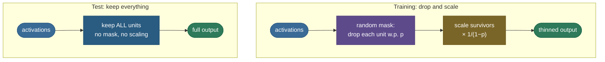

# Dropout: regularizing by randomly breaking the network

Dropout is one of those ideas that sounds like sabotage and turns out to be brilliant: during training, on *every* forward pass, you **randomly switch off a fraction of the neurons** — set their outputs to zero — and train what's left. Do it again next step with a *different* random set. It seems destructive, but it cures a specific disease of over-parameterized networks: **co-adaptation**, where neurons learn to lean on each other in fragile, over-fit combinations. If any neuron might vanish at any moment, none can afford to depend on a specific partner, so each must learn a feature that's useful on its own. The payoff is a network that generalizes markedly better — and, as a bonus, an elegant interpretation as training an *ensemble* of exponentially many networks at the cost of one.

By the end of this page you'll be able to:

- explain **co-adaptation** and how dropping units prevents it;
- give the **ensemble / model-averaging** interpretation (an implicit bag of $2^n$ sub-networks);
- handle the crucial **train-vs-test** difference and why **inverted dropout** keeps test time clean;
- reason about the **dropout rate** $p$ and where dropout sits relative to **BatchNorm**;
- know the variants — **spatial dropout, DropConnect, attention dropout, MC-dropout** (Bayesian uncertainty);
- implement inverted dropout and confirm its expectation and train/eval behaviour against PyTorch.

Intuition and pictures first, then the math (with sources), then runnable code.

> **Note:** dropout is a member of the [regularization](09-Regularization.md) family — like L2 or early stopping, it trades a little training fit for better generalization. What makes it distinctive is *how*: instead of penalizing weights, it injects **noise** into the architecture itself, which turns out to be a remarkably effective way to prevent memorization.

---

## The problem: co-adaptation and brittle ensembles of one

A big network has more than enough capacity to memorize its training set, and it does so in a sneaky way: groups of neurons **co-adapt**. Neuron B learns to correct neuron A's mistakes on the *specific* training examples, C patches B, and so on — a house of cards that fits the training data through fragile, mutually-dependent feature detectors. It works beautifully on data it has seen and falls apart on data it hasn't. You'd love to train *many* different networks and average them (a classic **ensemble**, which reliably reduces variance), but training and running hundreds of networks is impractical. Dropout gets you that benefit almost for free.

---

## What dropout does

During training, for each forward pass and each unit (in the layers you choose), **keep the unit with probability $1-p$ and zero it with probability $p$** — independently, resampled every step. The fraction $p$ is the **dropout rate**. With $p = 0.5$, roughly half the units are silenced on any given pass, and a *different* random half next pass. The kept units carry the forward signal and receive gradients; the dropped ones contribute nothing that step.


---

## Why it works: no co-adaptation, and a free ensemble

There are two complementary ways to understand dropout, and a good answer names both:

1. **It prevents co-adaptation.** Since any neuron's neighbours might be gone on the next pass, no neuron can rely on a specific other neuron being present. Each is forced to learn a feature that's **independently useful and robust**, which spreads the representation out and stops the fragile mutual-correction that causes overfitting.

2. **It's an implicit ensemble (model averaging).** A network with $n$ droppable units has $2^n$ possible sub-networks. Dropout samples a different one each step and trains them all — with **shared weights** — simultaneously. At test time, using the full network approximates **averaging** that entire ensemble. You get the variance-reduction of bagging $2^n$ models for the price of training one.

> *Where this comes from: both interpretations are the original dropout papers — **Improving neural networks by preventing co-adaptation of feature detectors** (Hinton et al. 2012) and **Dropout: A Simple Way to Prevent Overfitting** (Srivastava et al. 2014), which frames it as approximate model averaging; **Deep Learning** (Goodfellow et al.) §7.12 gives the bagging view. All in the references.*

---

## Train vs test, and why we use inverted dropout

Here's the wrinkle. At **test** time you want a deterministic prediction, so you keep **all** units (no dropping). But if a unit was present only $(1-p)$ of the time during training, its downstream neighbours learned to expect an input scaled by $(1-p)$ — keeping all units now feeds them a signal that's too large by a factor of $\frac{1}{1-p}$. Something has to rescale.

The clean solution is **inverted dropout**: do the scaling *during training* instead. When you drop with probability $p$, **scale the surviving activations up by $\frac{1}{1-p}$** right away. Then each unit's **expected output is unchanged**, and test time needs no special handling at all — you just run the full network as-is.


The math is a one-liner: a unit's output under inverted dropout is $\frac{m}{1-p}\,a$ where the mask $m \in \{0,1\}$ is 1 with probability $1-p$. Its expectation is $\mathbb{E}[m]\cdot\frac{a}{1-p} = (1-p)\cdot\frac{a}{1-p} = a$ — exactly the un-dropped activation. The figure's right panel shows this empirically: average enough passes and you're back to the original. So:



> *Where this comes from: inverted dropout (scale at train time so inference is unscaled) is the standard implementation in **d2l.ai** §5.6 and the CS231n notes — references. It's what `nn.Dropout` does: the code confirms it scales survivors by exactly $1/(1-p)$ in train mode and is the identity in eval mode.*

> **Gotcha:** this is the #1 dropout bug, identical in spirit to the BatchNorm one — **forgetting `model.eval()`**. Leave the model in train mode at inference and dropout keeps randomly zeroing units, so predictions become noisy and wrong. Always switch to eval mode (which also fixes BatchNorm) before evaluating.

---

## The dropout rate, and dropout vs BatchNorm

The rate $p$ is a hyperparameter. Common choices: **$p = 0.5$** for fully-connected hidden layers (the original sweet spot), **$p \approx 0.1$–$0.2$** for inputs, and *lower* for convolutional layers (which are already parameter-efficient). Higher $p$ = stronger regularization but slower, noisier training; tune it on validation loss.

> **Tip — dropout and BatchNorm don't always mix.** They can interfere: dropout changes the variance of activations between train and test, which clashes with BatchNorm's running statistics (the "variance shift" problem). In practice you often **pick one** — modern **CNNs** lean on BatchNorm and use little/no dropout, while **transformers** use dropout heavily (on attention weights, residual branches, and FFN layers) with LayerNorm rather than BatchNorm. Knowing they can conflict is a frequent interview point.

---

## Variants worth naming

- **Spatial (2D) dropout** — drops entire feature-map channels rather than individual pixels; the right form for convolutions, where neighbouring pixels are correlated.
- **DropConnect** — drops individual *weights* instead of whole units; a generalization of dropout.
- **Attention / embedding dropout** — dropout applied to attention weights and embeddings inside transformers.
- **Monte-Carlo (MC) dropout** — keep dropout **on at test time** and run many forward passes; the variation across passes is a cheap estimate of **model uncertainty**, with a Bayesian justification.

> *Where this comes from: the Bayesian reading — dropout at test time as approximate variational inference — is **Dropout as a Bayesian Approximation** (Gal & Ghahramani 2016), in the references. The code shows MC-dropout producing a nonzero prediction spread.*

---

## Worked example

A layer outputs activations $a = [2.0,\ 0.5,\ 3.0,\ 1.0]$ with dropout rate $p = 0.5$. On one training pass the sampled mask keeps units 1 and 3 (zeros 2 and 4):

- **After dropping:** $[2.0,\ 0,\ 3.0,\ 0]$.
- **After inverted-dropout scaling** ($\times \frac{1}{1-0.5} = \times 2$): $[4.0,\ 0,\ 6.0,\ 0]$.

The survivors are doubled so that, *averaged over many masks*, each unit's expected output equals its original value (e.g. unit 1: half the time $4.0$, half the time $0$ → mean $2.0 = a_1$). At **test** time you skip all of this and just pass $a$ through unchanged.

---

## Code: inverted dropout, expectation, and train/eval

```python
"""Inverted dropout: expectation preserved, test-time identity, train/eval vs torch.
Verified on Python 3.12 (torch 2.12), CPU."""
import torch, torch.nn as nn
torch.manual_seed(0)

def inverted_dropout(x, p, train):
    if not train or p == 0:
        return x                                    # test time: identity, no scaling
    mask = (torch.rand_like(x) > p).float()
    return x * mask / (1 - p)                        # scale survivors so E[out] = x

x, p = torch.ones(100_000), 0.4
avg = torch.stack([inverted_dropout(x, p, train=True) for _ in range(50)]).mean(0)
print(f"E[inverted dropout] over many masks = {avg.mean():.4f}  (input 1.0 -> expectation preserved)")

d = nn.Dropout(p=0.4); xb = torch.randn(10_000)
d.eval();  ev = d(xb)
d.train(); tr = d(xb)
print(f"torch Dropout EVAL == identity?  max|out-x| = {(ev - xb).abs().max():.2e}")
print(f"torch Dropout TRAIN scales survivors by 1/(1-p)=1.667?  ratio = {(tr[tr!=0]/xb[tr!=0]).mean():.3f}")
```

Output:

```
E[inverted dropout] over many masks = 1.0003  (input 1.0 -> expectation preserved)
torch Dropout EVAL == identity?  max|out-x| = 0.00e+00
torch Dropout TRAIN scales survivors by 1/(1-p)=1.667?  ratio = 1.667
```

> **Note:** the three lines pin down everything. The expected activation over masks is $1.0003 \approx 1$ — inverted dropout's scaling preserves it. `nn.Dropout` in **eval** mode is the exact identity (so test time is clean), and in **train** mode it scales surviving activations by $1.667 = 1/(1-0.4)$ — confirming PyTorch implements inverted dropout exactly as derived.

---

## Where dropout is used

- **Fully-connected layers** — the original and still-strong use; dropout on dense hidden layers.
- **Transformers** — pervasive: dropout on attention weights, residual connections, embeddings, and FFN layers (with LayerNorm).
- **Uncertainty estimation** — MC-dropout for cheap predictive uncertainty in safety-sensitive applications.
- **Less in modern CNNs** — largely superseded by BatchNorm there, though spatial dropout still appears.

> **Tip:** the practical rule — reach for dropout when a model **overfits and you can't get more data**, especially in fully-connected or transformer layers. If you're already using BatchNorm in a CNN, you often don't need much dropout. Start around $p=0.5$ for dense layers and tune down if it underfits.

---

## Recap and rapid-fire

**If you remember nothing else:** dropout randomly zeros a fraction $p$ of units on each training pass, which **prevents co-adaptation** (every neuron must be independently useful) and **implicitly trains an ensemble** of $2^n$ weight-sharing sub-networks. **Inverted dropout** scales survivors by $\frac{1}{1-p}$ during training so the expected activation is preserved and **test time keeps all units with no rescaling** — just remember `model.eval()`.

**Quick-fire — say these out loud:**

- *What does dropout do?* Randomly zeros a fraction $p$ of units each training forward pass.
- *Why does it help — two reasons?* Prevents co-adaptation (robust independent features) **and** acts as an ensemble of $2^n$ sub-networks (model averaging).
- *Train vs test?* Drop during training; keep all units at test.
- *What is inverted dropout?* Scale survivors by $1/(1-p)$ at train time, so the expectation is preserved and test needs no scaling.
- *Most common bug?* Forgetting `model.eval()` → dropout stays on at inference → noisy predictions.
- *Typical rates?* ~0.5 for dense hidden layers, ~0.1–0.2 for inputs, lower for conv.
- *Dropout + BatchNorm?* They can conflict (variance shift); often pick one — BN for CNNs, dropout for transformers.
- *MC-dropout?* Keep dropout on at test, run many passes; the spread estimates model uncertainty.
- *Is dropout regularization?* Yes — a stochastic, noise-injection regularizer.

---

## References and further reading

The curated link library for this topic — videos, courses, interactive/visual resources, articles, papers, books, and internal cross-links — lives in a companion file so it can be reused as a standalone reference list:

**→ [Dropout — references and further reading](10-Dropout.references.md)**
