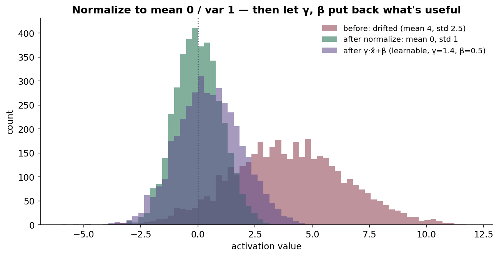
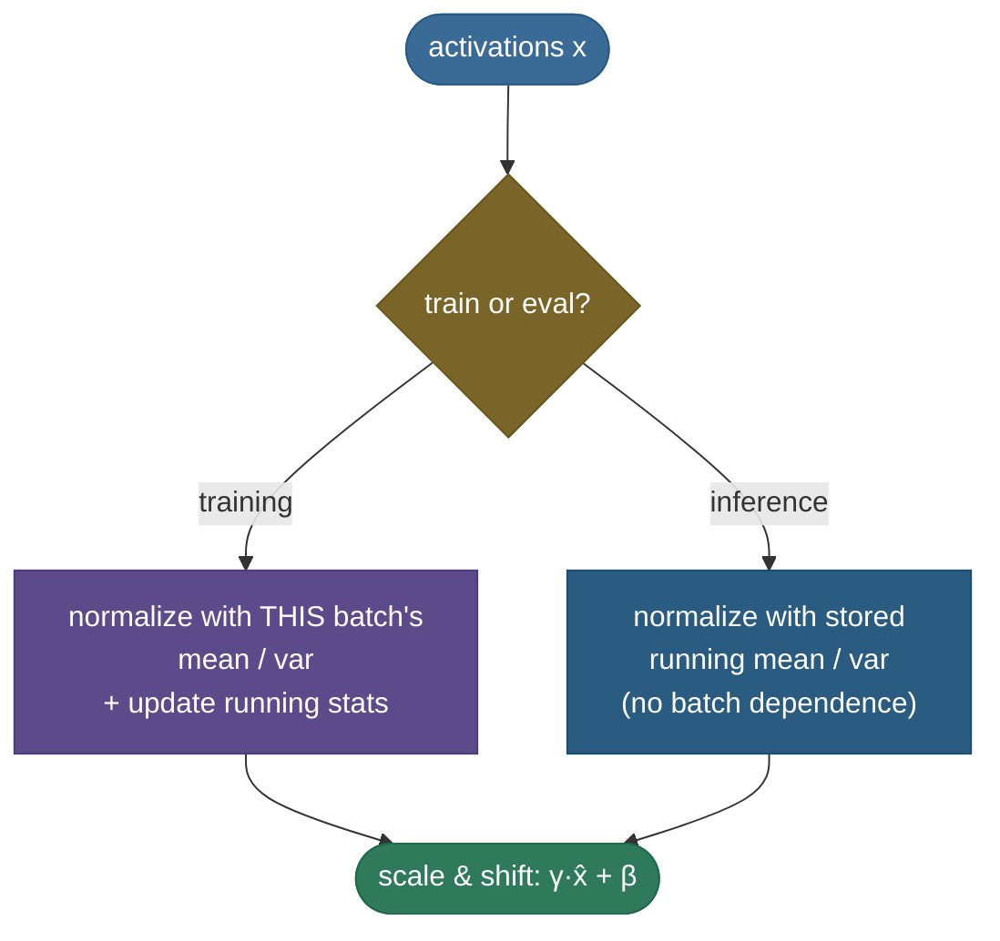
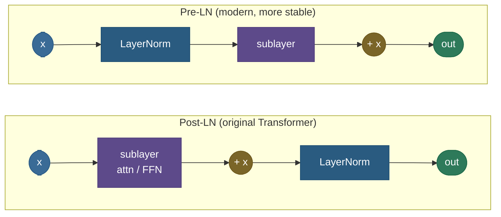

# Normalization: keeping activations in a sane range

Training a deep network is a balancing act between layers. Each layer's output is the next layer's input, so when one layer's activations drift — growing too large, too small, or just *shifting* as the weights below it update — every layer above has to chase a moving target. Left unchecked this makes deep nets painfully slow to train, forces tiny learning rates, and feeds the vanishing/exploding-gradient problem. **Normalization layers** are the fix: they re-center and re-scale activations to a stable distribution *inside* the network, which smooths the optimization landscape and lets you train deeper, faster, with larger learning rates. The family — **BatchNorm, LayerNorm, GroupNorm, RMSNorm** — differs only in *which numbers they average over*, and that one choice decides where each belongs.

By the end of this page you'll be able to:

- explain **why** normalizing activations helps (and why the original "internal covariate shift" story is only half-right);
- write the **normalize → scale-and-shift** computation and the role of the learnable **γ, β**;
- say exactly **which axes** each norm reduces over — the single most-asked normalization question;
- contrast **BatchNorm** (per-channel over the batch; CNNs), **LayerNorm** (per-sample over features; transformers), **RMSNorm** (no centering; modern LLMs), and **GroupNorm** (small batches);
- reason about **BatchNorm's train-vs-eval** running-stats behaviour and the **pre-norm vs post-norm** placement debate;
- implement all three from scratch and match PyTorch.

> **Note:** every norm here does the *same two steps* — (1) subtract a mean and divide by a standard deviation computed over some set of values, (2) apply a learnable scale γ and shift β. The **only** thing that changes between BatchNorm, LayerNorm, GroupNorm, and RMSNorm is **which values go into that mean and variance.** Hold that fixed in your head and the whole family collapses to one idea.

---

## The problem: activations won't sit still

Stack 50 layers and feed a batch forward. The first layer produces activations in some range; the second transforms them; by layer 20 the scale can be wildly off — saturating sigmoids, exploding into the thousands, or collapsing toward zero. Worse, as training updates the early weights, the **distribution** of inputs to later layers keeps shifting, so those layers never settle. The classic symptoms:

- you must use a **tiny learning rate** or training diverges;
- **deep** networks barely train at all (the gradient signal degrades layer by layer);
- training is **slow** and sensitive to initialization.

The idea, from statistics: if you **standardize** a layer's activations — subtract the mean, divide by the standard deviation, so they have mean 0 and variance 1 — every layer above receives inputs in a predictable range, every step. Do it as a *layer inside the network* (so gradients flow through the normalization too) and you get a dramatically easier optimization problem.

---

## What it is: normalize, then let the network take back control

A normalization layer does two things to a set of activations $\{x_i\}$:

$$\hat x_i = \frac{x_i - \mu}{\sqrt{\sigma^2 + \epsilon}}, \qquad y_i = \gamma\,\hat x_i + \beta$$

**Step 1 — standardize** to mean 0, variance 1 using the mean $\mu$ and variance $\sigma^2$ computed over some chosen set (the $\epsilon$ in the denominator prevents divide-by-zero and is a real numerical-stability safeguard, typically $10^{-5}$). **Step 2 — scale and shift** by *learnable* parameters $\gamma$ (scale) and $\beta$ (shift).

Why step 2? Because forcing every activation to mean 0 / variance 1 might *destroy* useful information — maybe this unit *should* have a large mean. The learnable $\gamma, \beta$ let the network **undo** the normalization if that's better (set $\gamma = \sigma, \beta = \mu$ and you recover the original): normalization gives a good *default* distribution, and γ/β let training adjust from there. You get the optimization benefit without losing representational power.



> *Where this comes from: this normalize-then-scale-shift formulation, with the learnable γ/β, is **Batch Normalization: Accelerating Deep Network Training by Reducing Internal Covariate Shift** (Ioffe & Szegedy 2015), §3 — in the references.*

---

## The one question they always ask: which axes?

Every norm computes $\mu$ and $\sigma^2$ — the difference is **over which dimensions**. Picture a batch of activations as a grid of (batch samples × channels/features); each norm averages over a different slice:


- **BatchNorm** — for each **channel/feature**, average over **the whole batch** (and spatial positions). Stats depend on the batch.
- **LayerNorm** — for each **sample**, average over **its features**. No batch dependence at all.
- **InstanceNorm** — per sample, per channel (over spatial only). Common in style transfer.
- **GroupNorm** — per sample, over a **group of channels**. A middle ground that ignores the batch.

That one design choice — *what to average over* — is the entire taxonomy. Everything below is a consequence of it.

---

## BatchNorm: normalize each feature across the batch

[BatchNorm](https://arxiv.org/abs/1502.03167) (Ioffe & Szegedy 2015) computes, for each feature/channel, the mean and variance **across the mini-batch**, normalizes, then applies γ/β. It was the breakthrough that made very deep CNNs trainable, and it's still the default in convolutional vision models.

But "stats over the batch" creates a wrinkle: **at inference you may have a batch of 1**, and you don't want a prediction to depend on whatever other examples happen to be batched with it. So BatchNorm keeps a **running average** of the mean/variance during training and uses those **fixed** stats at eval time:



> **Gotcha:** this train/eval split is the #1 BatchNorm bug. Forget to call `model.eval()` and your inference silently uses *batch* statistics — predictions then depend on batch composition and jump around. It's also why BatchNorm **degrades at small batch sizes**: with a batch of 2–4, the per-batch mean/variance are noisy estimates, so the normalization is unstable. That weakness is exactly what GroupNorm and LayerNorm sidestep.

---

## Why it *really* works (not "covariate shift")

The original paper sold BatchNorm as reducing **internal covariate shift** (the shifting input distributions described above). That story is intuitive but turned out to be largely wrong: Santurkar et al. (2018) showed you can *inject* covariate shift after BatchNorm and it still trains beautifully. The real mechanism is that normalization makes the **loss landscape smoother** — it reduces the Lipschitz constant of the loss and its gradients, so gradient steps are more predictable and you can safely use larger learning rates.

> *Where this comes from: the smoothing explanation is **How Does Batch Normalization Help Optimization?** (Santurkar, Tsipras, Ilyas & Madry 2018) — its loss-landscape figures are the clearest visual of *why* normalization helps; in the references.*

> **Tip:** in an interview, name both: "It was *introduced* to reduce internal covariate shift, but later work (Santurkar et al.) showed the real benefit is a smoother, better-conditioned loss landscape." That one sentence signals you know the topic past the textbook.

---

## LayerNorm: normalize each sample across its features

[LayerNorm](https://arxiv.org/abs/1607.06450) (Ba, Kiros & Hinton 2016) computes the mean/variance **over the features of a single example** — so it has **no batch dependence**, behaves identically at train and eval, and works with a batch of 1. That makes it the natural choice when the batch axis is awkward: **RNNs** (variable-length sequences) and, decisively, **transformers**.

Why transformers use LayerNorm and not BatchNorm: sequence models process variable-length inputs where batching statistics are noisy and position-dependent; LayerNorm normalizes each token's feature vector independently, which is stable regardless of sequence length or batch size. Every transformer block normalizes with LayerNorm (or its RMS variant below).

> *Where this comes from: **Layer Normalization** (Ba, Kiros & Hinton 2016). LayerNorm's gradient and a clean walk-through are in Lei Mao's blog (references).*

---

## RMSNorm: drop the mean, keep the scale

Modern LLMs (LLaMA, T5, Gemma) use a cheaper cousin: [RMSNorm](https://arxiv.org/abs/1910.07467) (Zhang & Sennrich 2019). The observation: most of LayerNorm's benefit comes from the **re-scaling**, not the **re-centering**. So RMSNorm skips subtracting the mean entirely and just divides by the **root-mean-square**:

$$\bar x_i = \frac{x_i}{\sqrt{\frac{1}{d}\sum_{j=1}^{d} x_j^2 + \epsilon}}\;\cdot\; g_i$$

No mean, no $\beta$ shift (usually) — just one learnable gain $g$. It's a touch faster and uses less memory per call (no mean to compute or store), and at LLM scale that adds up. The trade: the output is **not** zero-centered (you can see this in the code — RMSNorm leaves a non-zero mean), and empirically that's fine.

> *Where this comes from: **Root Mean Square Layer Normalization** (Zhang & Sennrich 2019) — references.*

---

## GroupNorm and the placement debate

**GroupNorm** ([Wu & He 2018](https://arxiv.org/abs/1803.08494)) splits channels into groups and normalizes within each group, per sample. Because it never touches the batch axis, its accuracy is **flat across batch sizes** — the go-to when BatchNorm's small-batch noise hurts (detection, segmentation, anything memory-bound to tiny batches).

**Pre-norm vs post-norm** — *where* you put the norm relative to the residual connection matters a lot for deep transformers:



**Post-LN** (norm *after* the residual add) was the original Transformer; it needs careful learning-rate warmup or deep stacks diverge. **Pre-LN** (norm *before* the sublayer, inside the residual branch) keeps a clean identity path through the residual, trains stably without warmup, and is what essentially every modern LLM uses.

> *Where this comes from: the pre-norm vs post-norm analysis is **On Layer Normalization in the Transformer Architecture** (Xiong et al. 2020) — references.*

---

## Worked example: BatchNorm on a tiny batch

Take one feature across a batch of 4: values $x = [2, 4, 6, 8]$.

1. **Mean:** $\mu = (2+4+6+8)/4 = 5$.
2. **Variance** (biased, as BatchNorm uses): $\sigma^2 = \frac{1}{4}\big[(2{-}5)^2 + (4{-}5)^2 + (6{-}5)^2 + (8{-}5)^2\big] = \frac{1}{4}(9+1+1+9) = 5$.
3. **Normalize** (with $\epsilon \approx 0$, $\sqrt 5 \approx 2.236$): $\hat x = [-1.342,\, -0.447,\, 0.447,\, 1.342]$ — mean 0, variance 1. ✓
4. **Scale & shift** with, say, $\gamma = 2, \beta = 1$: $y = [-1.683,\, 0.106,\, 1.894,\, 3.683]$.

The standardized values are dimensionless and batch-relative; γ/β then place them wherever training wants. (LayerNorm runs the identical arithmetic, but over the *features of one sample* instead of one feature over the batch — the formula is the same, the axis changes.)

---

## Where each is used

- **BatchNorm** — convolutional vision (ResNet and descendants). Great when batches are reasonably large.
- **LayerNorm** — transformers and RNNs; anything where the batch axis is awkward or you need train/eval parity.
- **RMSNorm** — modern LLMs, where its slightly lower cost matters at scale.
- **GroupNorm** — small-batch regimes (detection/segmentation), where BatchNorm's stats get noisy.

> **Tip:** the picker, in one breath — *CNN with big batches → BatchNorm; transformer/RNN → LayerNorm; LLM → RMSNorm; tiny batches → GroupNorm.*

---

## Code: BatchNorm, LayerNorm, RMSNorm from scratch (matches PyTorch)

The whole family in a dozen lines, each verified against `torch.nn`. Watch the **axis** change — that's the only real difference.

```python
"""BatchNorm / LayerNorm / RMSNorm from scratch, checked against torch.
Verified on ml-py312 (torch 2.12), CPU."""
import torch, torch.nn as nn
torch.manual_seed(0)
N, D = 8, 5                              # batch of 8, feature dim 5
x = torch.randn(N, D) * 2.5 + 4.0       # drifted activations
eps = 1e-5

# BatchNorm: normalize each FEATURE over the BATCH (dim 0)
mu_b  = x.mean(0, keepdim=True)
var_b = x.var(0, unbiased=False, keepdim=True)        # biased var = torch train mode
bn_ours = (x - mu_b) / torch.sqrt(var_b + eps)
bn_torch = nn.BatchNorm1d(D, eps=eps, affine=False); bn_torch.train()
print(f"BatchNorm  max|ours-torch| = {(bn_ours - bn_torch(x)).abs().max():.2e}")

# LayerNorm: normalize each SAMPLE over its FEATURES (last dim)
mu_l  = x.mean(-1, keepdim=True)
var_l = x.var(-1, unbiased=False, keepdim=True)
ln_ours  = (x - mu_l) / torch.sqrt(var_l + eps)
ln_torch = nn.LayerNorm(D, eps=eps, elementwise_affine=False)
print(f"LayerNorm  max|ours-torch| = {(ln_ours - ln_torch(x)).abs().max():.2e}")

# RMSNorm: divide by root-mean-square, NO mean subtraction (LLM default)
rms_ours  = x / torch.sqrt(x.pow(2).mean(-1, keepdim=True) + eps)
rms_torch = nn.RMSNorm(D, eps=eps, elementwise_affine=False)
print(f"RMSNorm    max|ours-torch| = {(rms_ours - rms_torch(x)).abs().max():.2e}")
print(f"RMSNorm row-0 mean = {rms_ours[0].mean():+.3f}  (NOT 0 — RMSNorm doesn't center)")
```

Output:

```
BatchNorm  max|ours-torch| = 3.58e-07
LayerNorm  max|ours-torch| = 1.79e-07
RMSNorm    max|ours-torch| = 1.19e-07
RMSNorm row-0 mean = +0.849  (NOT 0 — RMSNorm doesn't center)
```

> **Note:** all three match PyTorch to ~$10^{-7}$ (floating-point noise), confirming the implementations are exact. The last line makes RMSNorm's defining property concrete — it normalizes the *scale* but leaves the *mean* alone, unlike Batch/LayerNorm.

---

## Recap and rapid-fire

**If you remember nothing else:** normalization standardizes a layer's activations (mean 0, var 1) and then re-scales with learnable **γ, β** — smoothing the loss landscape so you can train deeper, faster, at higher learning rates. The family differs **only in which axis the mean/variance are computed over**: **BatchNorm** per-feature over the batch (CNNs; train/eval running-stats gotcha), **LayerNorm** per-sample over features (transformers/RNNs), **RMSNorm** scale-only, no centering (LLMs), **GroupNorm** per channel-group (small batches).

**Quick-fire — say these out loud:**

- *What does a norm layer compute?* Standardize over some axis ($\hat x = (x-\mu)/\sqrt{\sigma^2+\epsilon}$), then $\gamma\hat x + \beta$.
- *What's the role of γ, β?* Learnable scale/shift — lets the network undo normalization if it hurts (can recover the identity).
- *BatchNorm vs LayerNorm axis?* BN: per feature, over the batch. LN: per sample, over features.
- *Why do transformers use LayerNorm?* No batch dependence — stable across variable sequence lengths and batch sizes; train/eval parity.
- *Why does BatchNorm behave differently at eval?* It uses stored **running** mean/var (not the current batch), so predictions don't depend on batch composition.
- *Why does BatchNorm struggle at small batch size?* Per-batch stats become noisy → unstable normalization (use GroupNorm/LayerNorm).
- *What is RMSNorm and who uses it?* LayerNorm without mean-centering (divide by RMS only) — cheaper; LLaMA and most modern LLMs.
- *Does normalization really fix "covariate shift"?* That was the original pitch; Santurkar et al. showed the real benefit is a **smoother loss landscape**.
- *Pre-norm vs post-norm?* Pre-LN (norm inside the residual branch) trains deep transformers stably without warmup; post-LN was the fragile original.

---

## References and further reading

The curated link library for this topic — videos, courses, interactive/visual resources, articles, papers, books, and internal cross-links — lives in a companion file so it can be reused as a standalone reference list:

**→ [Normalization — references and further reading](11-Normalization.references.md)**
