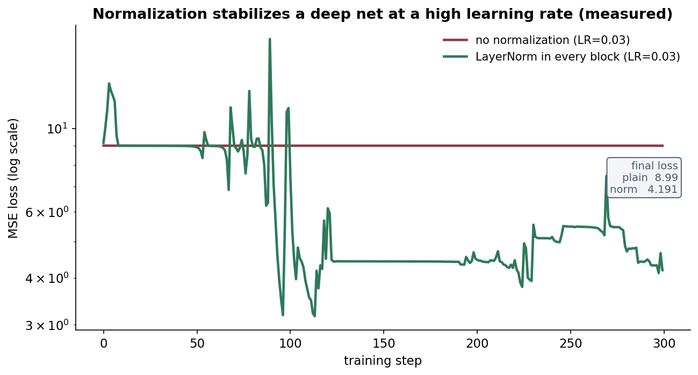
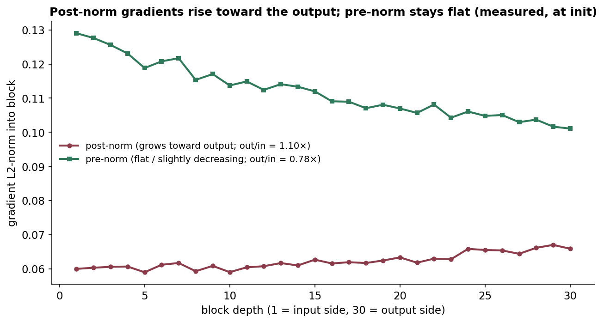
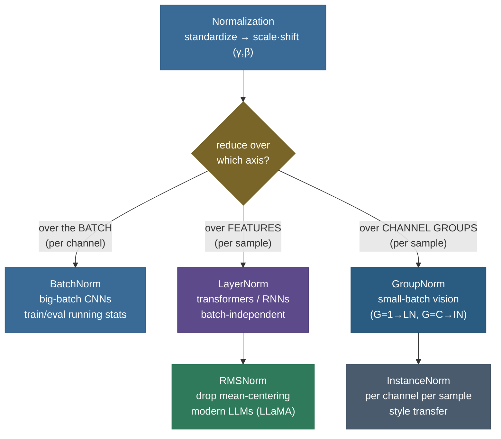

# Normalization: keeping activations in a sane range

Training a deep network is a balancing act between layers. Each layer's output is the next layer's input, so when one layer's activations drift — growing too large, too small, or just *shifting* as the weights below it update — every layer above has to chase a moving target. Left unchecked this makes deep nets painfully slow to train, forces tiny learning rates, and feeds the [vanishing/exploding-gradient problem](06-Vanishing-Exploding-Gradients.md). **Normalization layers** are the fix: they re-center and re-scale activations to a stable distribution *inside* the network, which smooths the optimization landscape and lets you train deeper, faster, with larger learning rates. The family — **BatchNorm, LayerNorm, GroupNorm, InstanceNorm, RMSNorm** — differs only in *which numbers they average over*, and that one choice decides where each belongs.

I'm going to teach this the way I'd actually explain it to a teammate whose 40-layer network is stuck at a loss that won't budge. We'll start by *feeling* why activations won't sit still, then **derive** the normalize→scale→shift transform from scratch and prove why the learnable γ and β are not optional decoration. Then we'll do the part most write-ups skip — the **backward pass through BatchNorm**, because the three-term gradient is where the real understanding (and the most-asked hard interview question) lives. We'll settle the "internal covariate shift" myth with the modern correction, walk the **train-vs-inference** running-statistics bookkeeping numerically, then derive **LayerNorm**, **RMSNorm**, **GroupNorm**, and **InstanceNorm** as one-line edits to the same template. Finally we'll derive *why* **pre-norm** beats **post-norm** for deep transformers from a gradient-magnitude argument, and wire it all to the residual stream. By the end you'll be able to:

- **derive** the normalize → scale-and-shift transform and prove why the learnable **γ, β** restore representational power (down to recovering the exact identity);
- **derive the backward pass** through BatchNorm — the full three-term ∂L/∂x given ∂L/∂y — and explain why μ and σ each contribute a gradient term;
- explain BatchNorm's **train-vs-inference** discrepancy and reproduce the **running-average (EMA)** bookkeeping by hand;
- state the original "internal covariate shift" claim **and** the modern correction (BN smooths the loss landscape);
- say exactly **which axes** each norm reduces over — the single most-asked normalization question — and read it off the tensor shape;
- derive **LayerNorm**, **RMSNorm** (re-centering invariance), **GroupNorm**, **InstanceNorm**, and pick the right one on sight;
- derive **why pre-norm gives a clean residual stream** and trains deep stacks without warmup, where post-norm needs it;
- implement BatchNorm/LayerNorm/RMSNorm (forward **and** BatchNorm backward) from scratch and match PyTorch to ~$10^{-6}$.

> **Note:** every norm here does the *same two steps* — (1) subtract a mean and divide by a standard deviation computed over some set of values, (2) apply a learnable scale γ and shift β. The **only** thing that changes between BatchNorm, LayerNorm, GroupNorm, InstanceNorm, and RMSNorm is **which values go into that mean and variance.** Hold that fixed in your head and the whole family collapses to one idea — the rest of this page is consequences of that single choice.

---

## The problem: activations won't sit still

Stack 50 layers and feed a batch forward. The first layer produces activations in some range; the second transforms them; by layer 20 the scale can be wildly off — saturating sigmoids, exploding into the thousands, or collapsing toward zero. Two separate pathologies are tangled together here, and it's worth pulling them apart because normalization attacks both:

1. **Scale drift across depth.** Multiply a signal by a chain of weight matrices and its variance compounds. If each layer multiplies the standard deviation by, say, 1.3, then after 30 layers it's scaled by $1.3^{30} \approx 2{,}620\times$; if the factor is 0.8 it shrinks by $0.8^{30} \approx 0.001\times$. The forward signal — and, by the same multiplicative logic, the backward gradient — either explodes or vanishes. This is exactly the [vanishing/exploding-gradient](06-Vanishing-Exploding-Gradients.md) story, and good [weight initialization](05-Weight-Initialization.md) only sets the *starting* scale; nothing keeps it there as weights move.

2. **Distribution shift during training.** Even if the scale is fine at step 0, every gradient step changes the early weights, which changes the *distribution* of inputs handed to later layers. Layer 20 spends the first thousand steps adapting to a distribution that layer 19 has already abandoned. Each layer is optimizing against a moving target produced by all the layers below it.

The classic symptoms a practitioner sees:

- you must use a **tiny learning rate** or training diverges;
- **deep** networks barely train at all (the gradient signal degrades layer by layer);
- training is **slow** and acutely sensitive to initialization and learning-rate choice.

The idea, lifted straight from statistics: if you **standardize** a layer's activations — subtract the mean, divide by the standard deviation, so they have mean 0 and variance 1 — every layer above receives inputs in a predictable range, *every step*, regardless of what the layers below are doing. Crucially, you do this as a **layer inside the network**, not a one-time preprocessing of the data: the normalization participates in the forward pass *and* the backward pass, so gradients flow through it and the network learns *with* it in the loop. That single move — standardize as a differentiable layer — is what turns an intractable optimization into an easy one.

> **Tip:** normalization is not the only tool for this job, and the good engineering instinct is to know which lever fixes which failure. [Weight initialization](05-Weight-Initialization.md) sets the *initial* variance; [residual connections](18-Residual-Skip-Connections.md) give gradients a clean additive highway around the depth; [gradient clipping](06-Vanishing-Exploding-Gradients.md) caps explosions. Normalization is the one that *continuously re-standardizes activations during the forward pass*, so even an imperfect init or a drifting distribution gets corrected at every layer, every step. In practice modern nets use all of them together.

---

## What it is: normalize, then let the network take back control

A normalization layer does two things to a set of activations $\{x_i\}$:

$$\hat x_i = \frac{x_i - \mu}{\sqrt{\sigma^2 + \epsilon}}, \qquad y_i = \gamma\,\hat x_i + \beta$$

**Step 1 — standardize** to mean 0, variance 1, using the mean $\mu$ and variance $\sigma^2$ computed over some chosen set $S$ of activations:

$$\mu = \frac{1}{|S|}\sum_{i \in S} x_i, \qquad \sigma^2 = \frac{1}{|S|}\sum_{i \in S} (x_i - \mu)^2.$$

The $\epsilon$ in the denominator (typically $10^{-5}$) is not cosmetic: it bounds the gradient when the variance is tiny. If a feature is nearly constant across $S$, $\sigma^2 \to 0$ and $1/\sqrt{\sigma^2}$ would blow up; $\epsilon$ caps the amplification at $1/\sqrt{\epsilon}$ and keeps the layer numerically stable. Think of it as a **variance floor**: the effective denominator is $\sqrt{\max(\sigma^2, \text{something near }\epsilon)}$, so a dead/constant unit produces a bounded (near-zero) output rather than a NaN. The value matters more than it looks — too small and you risk overflow on low-variance features in half precision; too large and you're under-normalizing (dividing by a number bigger than the true std). The common defaults differ by framework and norm (BatchNorm often $10^{-5}$; LayerNorm in transformers sometimes $10^{-6}$ or $10^{-12}$), and it's occasionally worth tuning if you see instability. **Step 2 — scale and shift** by *learnable* parameters $\gamma$ (scale) and $\beta$ (shift), one pair per normalized unit, trained by gradient descent like any other weight.

### Why step 2 is mandatory, not decoration

Forcing every activation to exactly mean 0 / variance 1 is a **loss of expressive power**. Two concrete failures if you stopped at Step 1:

- **You'd cripple the activation function.** Pin a unit to mean 0, var 1, and you've forced its pre-activations into the narrow region around the origin where (say) a sigmoid is essentially linear — you've thrown away the non-linearity that makes the network more than a stack of matrix multiplies. The network might *want* a unit with a large positive mean so it saturates and acts like a gate. Step 1 forbids that.
- **The representable function class shrinks.** A layer that can only ever emit zero-mean, unit-variance vectors literally cannot produce many functions a plain linear layer can.

The fix is to give the network a knob to *undo* the normalization whenever undoing it helps. With $\gamma$ and $\beta$ learnable, the layer can represent **any** mean and variance again — and in particular it can recover the **exact identity**:

$$\text{set } \gamma = \sqrt{\sigma^2 + \epsilon} \;\text{ and }\; \beta = \mu \;\implies\; y_i = \gamma \hat x_i + \beta = \frac{\sqrt{\sigma^2+\epsilon}\,(x_i-\mu)}{\sqrt{\sigma^2+\epsilon}} + \mu = x_i.$$

So normalization **costs nothing** in representational terms — it can always fall back to "do nothing." What it changes is the **optimization geometry**: it hands training a well-conditioned default distribution (mean 0, var 1), and γ/β let gradient descent move away from that default *only as far as the data justifies*, starting from a sane place instead of a drifting one. You get the conditioning benefit for free.


The histogram above is *measured*, not schematic: 4,000 sampled activations drawn from $\mathcal N(4, 2.5^2)$ (red, drifted and wide), standardized to mean 0 / std 1 (green, pulled to $\approx\mathcal N(0,1)$), then passed through a learnable $\gamma=1.4, \beta=0.5$ (purple, re-positioned). Read it left to right and you can see the entire job of a normalization layer in one picture: **take whatever distribution the layer below produced, pull it to a canonical $\mathcal N(0,1)$, then let γ/β put back exactly as much spread and offset as training wants.** The canonical-distribution step is what makes the optimization well-conditioned; the γ/β step is what keeps it expressive.

> *Where this comes from: this normalize-then-scale-shift formulation, with the learnable γ/β and the identity-recovery argument, is **Batch Normalization: Accelerating Deep Network Training by Reducing Internal Covariate Shift** (Ioffe & Szegedy 2015), §3 — in the references.*

> **Note:** $\gamma$ and $\beta$ are **per-unit** parameters (one pair per channel for BatchNorm, one pair per feature for LayerNorm), updated by backprop. They are *not* the mean/variance — those are *statistics computed from the data on each forward pass*. Conflating "the learnable γ/β" with "the running mean/var" is a common beginner slip; they live in different places (parameters vs buffers) and update by different rules (gradient descent vs running average).

---

## The one question they always ask: which axes?

Every norm computes $\mu$ and $\sigma^2$ — the difference is **over which dimensions of the activation tensor**. This is the single most-asked normalization question, and the cleanest way to answer it is to *read the axes off the tensor shape*.

Take a vision activation tensor shaped $[N, C, H, W]$ — batch $N$, channels $C$, spatial height/width $H, W$. Each norm collapses a different subset of those axes when forming each statistic:

| Norm | Reduces over | One statistic per | Batch-dependent? |
|---|---|---|---|
| **BatchNorm** | $N, H, W$ | channel $c$ | **Yes** |
| **LayerNorm** | $C, H, W$ | sample $n$ | No |
| **InstanceNorm** | $H, W$ | sample $n$, channel $c$ | No |
| **GroupNorm** | $H, W$ + a group of channels | sample $n$, channel-group $g$ | No |

For a transformer the tensor is $[N, T, D]$ — batch, sequence length, feature dim — and the picture is the same story with $C \to D$: **BatchNorm** would normalize each feature over the batch-and-time (and it's a poor fit, see below); **LayerNorm** normalizes each token's $D$-vector over its features, independent of $N$ and $T$. That is exactly why transformers reach for LayerNorm.


- **BatchNorm** — for each **channel/feature**, average over **the whole batch** (and spatial positions). Stats depend on the batch — the source of all its quirks.
- **LayerNorm** — for each **sample**, average over **its features**. No batch dependence at all.
- **InstanceNorm** — per sample, per channel (over spatial only). Common in style transfer.
- **GroupNorm** — per sample, over a **group of channels**. A middle ground that ignores the batch.

That one design choice — *what to average over* — is the entire taxonomy. Everything below is a consequence of it.

> **Gotcha:** notice from the table that **BatchNorm is the only one that reduces over the batch axis $N$.** That single fact is the root cause of *all* of BatchNorm's special behaviour — its train/eval split, its small-batch fragility, its awkwardness with variable-length sequences. Every other norm is batch-independent precisely because it leaves $N$ alone. If you can recite the reduction axes, you can derive the rest of this page.

---

## BatchNorm: normalize each feature across the batch

[BatchNorm](https://arxiv.org/abs/1502.03167) (Ioffe & Szegedy 2015) computes, for each feature/channel $c$, the mean and variance **across the mini-batch** (and, for conv layers, across spatial positions too), normalizes, then applies that channel's $\gamma_c / \beta_c$. It was the breakthrough that made very deep CNNs trainable — ImageNet networks that previously needed delicate tuning suddenly trained at higher learning rates and in fewer steps — and it remains the default in convolutional vision models.

Written out for a batch of $m$ examples on feature $c$ (this is the algorithm exactly as it appears in the paper):

$$\mu_B = \frac{1}{m}\sum_{i=1}^{m} x_i, \qquad \sigma_B^2 = \frac{1}{m}\sum_{i=1}^{m}(x_i - \mu_B)^2, \qquad \hat x_i = \frac{x_i - \mu_B}{\sqrt{\sigma_B^2 + \epsilon}}, \qquad y_i = \gamma\,\hat x_i + \beta.$$

The subscript $B$ ("batch") is doing the load-bearing work: $\mu_B$ and $\sigma_B^2$ are computed *from the current mini-batch*. That's what makes BatchNorm powerful (the statistics are exact for this batch) and also what creates every complication that follows.

> **Note:** BatchNorm uses the **biased** variance ($\frac{1}{m}$, not $\frac{1}{m-1}$) for the normalization itself — it's normalizing *these specific* activations, not estimating a population parameter, so the biased estimator is the right one and matches `torch.nn.BatchNorm` in training mode. (Confusingly, PyTorch uses the *unbiased* $\frac{1}{m-1}$ estimator when it updates the *running* variance buffer — a deliberate inconsistency we'll see in the train/eval section.)

### The train vs inference discrepancy

Here is the wrinkle that "stats over the batch" forces. At inference you frequently have a **batch of one** — a single image, a single request — and you absolutely do not want a prediction to depend on whatever other examples happened to be batched alongside it. Worse, with batch size 1 the per-batch variance is *undefined* ($\sigma_B^2 = 0$ for a single point, so $\hat x = 0$ for every feature — the input is annihilated).

So BatchNorm runs in **two modes**:

- **Training:** normalize with *this batch's* $\mu_B, \sigma_B^2$ — *and*, as a side effect, maintain a **running (exponential moving) average** of those statistics across batches.
- **Inference:** freeze the network and normalize with the **stored running** mean/variance — fixed numbers, no batch dependence, deterministic per example.


### Deriving the running-average bookkeeping

The running statistics are maintained by a simple **exponential moving average (EMA)** with momentum $\rho$ (PyTorch default $\rho = 0.1$; note PyTorch's `momentum` is the weight on the *new* batch, the opposite convention to most optimizers). After each training batch:

$$\hat\mu_{\text{run}} \leftarrow (1-\rho)\,\hat\mu_{\text{run}} + \rho\,\mu_B, \qquad \hat\sigma^2_{\text{run}} \leftarrow (1-\rho)\,\hat\sigma^2_{\text{run}} + \rho\,\sigma_{B,\text{unbiased}}^2.$$

Two subtleties worth internalizing, because they're exactly the things that surprise people debugging a train/eval gap:

1. **The running average is "warm-up"-biased early on.** Buffers start at $\hat\mu_{\text{run}}=0, \hat\sigma^2_{\text{run}}=1$. An EMA with momentum 0.1 has an effective horizon of roughly $1/\rho = 10$ batches, so after the first handful of batches the buffers are dominated by the initial guess, not the data. Evaluate too early and the eval-mode stats are simply wrong. (This is one reason a freshly-initialized model can show a baffling train-vs-eval accuracy gap.)
2. **The running *variance* uses the unbiased estimator** $\sigma_{B,\text{unbiased}}^2 = \frac{m}{m-1}\sigma_B^2$, even though the *normalization* uses the biased one. PyTorch does this on purpose: the running buffer is meant to *estimate the population variance* for inference, where unbiased is correct; the per-batch normalization is just standardizing the batch in front of it, where biased is correct.

> **Gotcha:** the train/eval split is the **#1 BatchNorm bug** in the wild. Forget to call `model.eval()` and your inference silently uses *batch* statistics — predictions then depend on batch composition and jump around as you change batch size or shuffle order. The mirror-image bug is forgetting `model.train()` after a validation pass, which freezes the running-stat updates for the rest of training. Both are silent: no error, just mysteriously bad numbers.

> **Gotcha:** BatchNorm has a subtle interaction with **weight decay**. Because BatchNorm is scale-invariant in the weights *below* it ($\text{BN}(\alpha W x) = \text{BN}(Wx)$ for any $\alpha>0$ — the normalization cancels the scale), the magnitude of those weights doesn't affect the function, only the *effective learning rate*. Weight decay shrinks them, which quietly *raises* the effective learning rate over training. It works fine in practice but it means "weight decay on a BN network" is doing something more like LR scheduling than classical regularization. A frequent senior-level interview probe.

---

## The backward pass through BatchNorm

Most explanations stop at the forward pass. The backward pass is where the real understanding lives — and "derive BatchNorm's gradient" is a genuine hard interview question — so let's do it. The key insight: because $\hat x_i$ depends on **every** $x_j$ in the batch through the *shared* statistics $\mu_B$ and $\sigma_B^2$, the gradient $\partial L/\partial x_i$ is **not** local. Perturbing one input nudges the batch mean and variance, which nudges *every* normalized output. That coupling produces a **three-term** gradient.

Set $\mathrm{ivar} = 1/\sqrt{\sigma_B^2 + \epsilon}$ (the inverse standard deviation) and suppose the layer above hands us $\partial L / \partial y_i$. The affine step peels off first:

$$\frac{\partial L}{\partial \hat x_i} = \frac{\partial L}{\partial y_i}\,\gamma, \qquad \frac{\partial L}{\partial \gamma} = \sum_{i=1}^m \frac{\partial L}{\partial y_i}\hat x_i, \qquad \frac{\partial L}{\partial \beta} = \sum_{i=1}^m \frac{\partial L}{\partial y_i}.$$

(The γ and β gradients *sum over the batch* because the same $\gamma, \beta$ are reused for every example — standard parameter-sharing.) Now the hard part: $\hat x_i = (x_i - \mu_B)\,\mathrm{ivar}$, and $x_i$ flows to the loss along **three paths**, because it appears (a) directly in its own $\hat x_i$, (b) inside $\mu_B$ which sits in *every* $\hat x_j$, and (c) inside $\sigma_B^2$ (also in every $\hat x_j$).

Spelling out the chain rule one node at a time — this is exactly Kratzert's computation-graph walk, compressed — we accumulate three contributions. First the gradient to the variance, since $\hat x_j = (x_j - \mu_B)\,(\sigma_B^2 + \epsilon)^{-1/2}$ and $\partial \mathrm{ivar}/\partial \sigma_B^2 = -\tfrac{1}{2}(\sigma_B^2+\epsilon)^{-3/2}$:

$$\frac{\partial L}{\partial \sigma_B^2} = \sum_{j} \frac{\partial L}{\partial \hat x_j}\,(x_j - \mu_B)\cdot\Big(-\tfrac{1}{2}\Big)(\sigma_B^2 + \epsilon)^{-3/2}.$$

Then the gradient to the mean, which arrives along **two** sub-paths — directly through each $\hat x_j$ (the $-\mu_B$ term), and indirectly because $\mu_B$ also appears in $\sigma_B^2 = \tfrac{1}{m}\sum_j (x_j-\mu_B)^2$:

$$\frac{\partial L}{\partial \mu_B} = \Big(\sum_j \frac{\partial L}{\partial \hat x_j}\cdot(-\mathrm{ivar})\Big) + \frac{\partial L}{\partial \sigma_B^2}\cdot\frac{-2}{m}\sum_j (x_j - \mu_B).$$

The last sum $\sum_j (x_j - \mu_B) = 0$ by definition of the mean, so that second sub-path **vanishes** — a satisfying simplification worth knowing (it's why some derivations "drop a term"). Finally, $x_i$ reaches the loss through its own $\hat x_i$, through $\mu_B$ (which is $\tfrac{1}{m}\sum x_j$, so $\partial \mu_B/\partial x_i = \tfrac{1}{m}$), and through $\sigma_B^2$ ($\partial \sigma_B^2/\partial x_i = \tfrac{2}{m}(x_i - \mu_B)$):

$$\frac{\partial L}{\partial x_i} = \frac{\partial L}{\partial \hat x_i}\,\mathrm{ivar} \;+\; \frac{\partial L}{\partial \sigma_B^2}\cdot\frac{2(x_i - \mu_B)}{m} \;+\; \frac{\partial L}{\partial \mu_B}\cdot\frac{1}{m}.$$

Substitute the pieces, use $\hat x_i = (x_i - \mu_B)\,\mathrm{ivar}$, and collect. The whole thing collapses to the clean, batch-vectorized result:

$$\boxed{\;\frac{\partial L}{\partial x_i} = \frac{\mathrm{ivar}}{m}\left( m\,\frac{\partial L}{\partial \hat x_i} \;-\; \underbrace{\sum_{j=1}^m \frac{\partial L}{\partial \hat x_j}}_{\text{through } \mu_B} \;-\; \hat x_i \underbrace{\sum_{j=1}^m \frac{\partial L}{\partial \hat x_j}\,\hat x_j}_{\text{through } \sigma_B^2}\right)\;}$$

Read the three terms physically — this is the part worth being able to say out loud:

- **Term 1** ($m\,\partial L/\partial \hat x_i$) — the *direct* effect: how the loss responds to $x_i$ through its own normalized value, as if the statistics were constant.
- **Term 2** (subtract the **mean** of the upstream gradients) — the correction because $x_i$ moved $\mu_B$. The normalization *removes any mean shift in the gradient*, exactly mirroring how the forward pass removed the mean of the activations. This is why a BatchNorm layer **cannot pass a pure mean-shift gradient through** — it's centered out.
- **Term 3** (subtract $\hat x_i$ times the **mean** of $\partial L/\partial \hat x_j \cdot \hat x_j$) — the correction because $x_i$ moved $\sigma_B^2$. It removes the component of the gradient *aligned with $\hat x_i$ itself*, i.e. the part that would just rescale the activations.

So BatchNorm's backward pass **projects the upstream gradient orthogonal to the two directions (constant shift and uniform rescale) that the forward normalization already neutralizes**. That's a beautiful symmetry: the layer that centers and scales the forward signal also centers and de-scales the backward signal. It's also *why* normalization conditions the gradient — it strips out the two cheap directions that would otherwise dominate and let the rest of the gradient be informative.

> **Tip:** in an interview, you don't need to reproduce the algebra perfectly — say the *structure*: "It's a three-term gradient because each input affects the loss directly, through the shared mean, and through the shared variance. The two correction terms re-center and re-scale the gradient, the backward mirror of the forward normalization." That sentence demonstrates you understand *why* it's not local, which is the actual point. We verify the boxed formula numerically against autograd in the code section.

> *Where this comes from: the cleanest node-by-node derivation of this backward pass — drawn out as a computation graph — is **Frederik Kratzert's "Understanding the backward pass through Batch Norm"** (in the references); the vectorized form above is the simplified collapse of that graph.*

---

## Why it *really* works (not "covariate shift")

The original paper sold BatchNorm as reducing **internal covariate shift** — the shifting input-distribution problem from the top of this page. That story is intuitive, memorable, and *largely wrong as a mechanism*. The decisive evidence came from Santurkar, Tsipras, Ilyas & Madry (2018), who ran a clean controlled experiment: take a BatchNorm network and **deliberately inject random, non-stationary noise after each BN layer** — manufacturing severe internal covariate shift on purpose. If ICS were the mechanism, this should hurt. It didn't: the noisy-BN network trained *just as fast and well* as the clean one. ICS, whatever it is, is not what BatchNorm fixes.

What BatchNorm *actually* does is make the **optimization landscape smoother**. Santurkar et al. proved that adding BatchNorm improves the **Lipschitz constants** of the loss and of its gradients — concretely, the loss changes more slowly and more *predictably* as you move along the gradient direction. Two consequences follow directly:

- **The gradient is more "trustworthy."** A smoother landscape means the gradient you compute at the current point stays accurate over a larger step, so you can take **bigger, safer learning-rate steps** without overshooting. This is the real reason normalized nets tolerate (and benefit from) high learning rates.
- **Less sensitivity to initialization.** With the landscape's curvature bounded, you don't have to land in a perfect spot to make progress.

> **Note:** this reframing is *practically* useful, not just academic trivia. It tells you the lever BatchNorm pulls is **conditioning of the optimization problem** — which is why it composes with, and is sometimes substitutable by, other conditioning tricks (good init, residual connections, careful LR warmup). And it's why **other** norms (Layer/RMS) help even though they don't touch the batch axis at all and so can't possibly be reducing "internal covariate shift" in the original sense — they smooth the landscape too.

> **Tip:** in an interview, name both halves: *"BatchNorm was introduced to reduce internal covariate shift, but Santurkar et al. (2018) showed — by injecting covariate shift after BN and seeing no slowdown — that the real benefit is a smoother, better-conditioned loss landscape with more predictive gradients."* That one sentence signals you know the topic past the textbook.

> *Where this comes from: **How Does Batch Normalization Help Optimization?** (Santurkar, Tsipras, Ilyas & Madry 2018) — its loss-landscape figures are the clearest visual of *why* normalization helps; in the references.*

---

## BatchNorm's problems — and the door they open

Every weakness of BatchNorm traces back to the one fact from the axes table: **it reduces over the batch**.

- **Small-batch fragility.** With a batch of 2–4, $\mu_B$ and $\sigma_B^2$ are noisy estimates of the true statistics, so the normalization itself is noisy and training degrades — sometimes badly. This bites hardest in memory-hungry tasks (detection, segmentation, high-resolution images) where you *can't* fit a big batch on the GPU.
- **Train/inference mismatch.** The two-mode behaviour above is a permanent source of bugs and a fundamental train/test distribution gap: at train time each example is normalized by *its own batch's* stats, at test by *frozen population* stats — not identical functions.
- **Breaks for sequence models.** In an RNN the "feature" at each time step shares parameters across time, but the batch statistics differ per step; maintaining per-time-step running stats is awkward and length-dependent. BatchNorm never became standard for recurrent or attention models.
- **Leaks information across the batch.** Because an example's output depends on its batch-mates, BatchNorm couples examples that *should* be independent — a real problem for contrastive learning, and a subtle correctness hazard whenever batch composition isn't i.i.d. (e.g. all-positive batches).
- **Distributed-training headaches.** The "batch" on each GPU is only a *shard*; getting correct statistics needs **SyncBatchNorm** to all-reduce $\mu, \sigma^2$ across devices every forward pass — extra communication and a common source of silent bugs when omitted.

Every one of these is a reason to want a norm that **doesn't touch the batch axis**. That is precisely LayerNorm, GroupNorm, and InstanceNorm — same template, different reduction set.

---

## LayerNorm: normalize each sample across its features

[LayerNorm](https://arxiv.org/abs/1607.06450) (Ba, Kiros & Hinton 2016) makes the obvious fix: compute the mean/variance **over the features of a single example**, never over the batch. For an activation vector $x \in \mathbb{R}^D$ for *one* token/example:

$$\mu = \frac{1}{D}\sum_{j=1}^{D} x_j, \qquad \sigma^2 = \frac{1}{D}\sum_{j=1}^{D}(x_j - \mu)^2, \qquad y_j = \gamma_j \frac{x_j - \mu}{\sqrt{\sigma^2 + \epsilon}} + \beta_j.$$

Because the statistics come entirely from *this one example's own features*, LayerNorm:

- has **no batch dependence** — works with a batch of 1, identical behaviour at train and eval (no running stats, no two modes, no `eval()` gotcha);
- is **insensitive to sequence length** — each token's $D$-vector is normalized on its own, so a length-10 and a length-10,000 sequence are treated identically, position by position;
- needs **no communication** in distributed training — every example is self-contained.

That is exactly the profile a **transformer** or **RNN** wants: variable-length inputs, awkward batch axis, a hard requirement for train/eval parity. So every transformer block normalizes with LayerNorm (or its RMS variant below), and that choice — far more than any property of attention — is *why* the field standardized on LayerNorm for sequence models.

The RNN case makes the contrast vivid. In an RNN you'd want to normalize the hidden state at *each time step*, but BatchNorm's statistics would have to be tracked **per time step** (since each step's distribution differs), and a sequence longer than any seen in training has no running stats at all — a genuine dead-end. LayerNorm sidesteps the whole problem: it normalizes each step's hidden vector over its own features, identically regardless of which time step it is or how long the sequence runs. The original LayerNorm paper was, in fact, motivated by exactly this RNN difficulty before transformers existed.

> **Note:** LayerNorm's $\gamma, \beta$ are **per-feature** ($D$-dimensional), but the *statistics* are scalars per example (one $\mu$, one $\sigma^2$ shared across all $D$ features of that token). Contrast with BatchNorm, where the statistics are per-*channel* and shared across the batch. Same two-step template; the axes are simply transposed.

> **Gotcha:** LayerNorm's backward pass has the *same three-term structure* as BatchNorm's — direct term, minus the gradient mean (through $\mu$), minus the $\hat x$-aligned component (through $\sigma^2$) — but the sums run **over the feature dimension of each example independently** instead of over the batch. The math is identical; only the reduction axis moves. This is the through-line of the entire page: pick the axis, and the forward *and* backward both follow.

> *Where this comes from: **Layer Normalization** (Ba, Kiros & Hinton 2016). A clean LayerNorm gradient walk-through is in Lei Mao's blog (references).*

### LayerNorm's invariance properties (and why they help)

Two invariances are worth deriving explicitly, because they're *why* LayerNorm stabilizes training and they set up the RMSNorm argument that follows. Let $\text{LN}(x) = \frac{x - \mu}{\sqrt{\sigma^2+\epsilon}}$ (ignore $\gamma,\beta$ for the moment).

- **Scale invariance.** Multiply the whole input vector by a constant $a > 0$: its mean becomes $a\mu$ and its standard deviation $a\sigma$, so $\text{LN}(ax) = \frac{ax - a\mu}{a\sqrt{\sigma^2}} = \frac{x-\mu}{\sqrt{\sigma^2}} = \text{LN}(x)$ (taking $\epsilon\to0$). LayerNorm's output is **unchanged by any rescaling of its input.** This is the load-bearing property: it means however much the previous layer's weights blow up or shrink the activation magnitude, the next layer sees the same normalized input. The variance can't compound through depth — the [vanishing/exploding](06-Vanishing-Exploding-Gradients.md) chain is broken.
- **Shift invariance.** Add a constant $c$ to every component: the mean becomes $\mu + c$ and the variance is unchanged, so $\text{LN}(x + c\mathbf{1}) = \frac{(x+c)-(\mu+c)}{\sqrt{\sigma^2}} = \text{LN}(x)$. LayerNorm is **unchanged by a constant shift of its input.**

A direct corollary of scale invariance: because $\text{LN}(ax)=\text{LN}(x)$, the gradient w.r.t. the *weights* of the preceding layer is inversely proportional to their scale — if you double those weights, the gradient halves. LayerNorm thus **auto-tunes the effective learning rate** of the layer below it, a quiet self-stabilizing effect that's a big part of why normalized nets tolerate a wide LR range. RMSNorm, next, keeps the crucial scale invariance but *gives up* shift invariance — and the claim is that's a fine trade.

---

## RMSNorm: drop the mean, keep the scale

Modern LLMs (LLaMA, T5, Gemma, Mistral) use a cheaper cousin of LayerNorm: [RMSNorm](https://arxiv.org/abs/1910.07467) (Zhang & Sennrich 2019). The starting observation is empirical and a little surprising: of LayerNorm's two operations — **re-centering** (subtract the mean) and **re-scaling** (divide by the standard deviation) — almost all of the benefit comes from the **re-scaling**. So RMSNorm throws away the mean entirely and divides by the **root-mean-square**:

$$\text{RMS}(x) = \sqrt{\frac{1}{D}\sum_{j=1}^{D} x_j^2 + \epsilon}, \qquad y_j = \frac{x_j}{\text{RMS}(x)}\,g_j.$$

No mean to compute, no $\beta$ shift (usually), just one learnable gain vector $g$. Compared to LayerNorm this saves the mean computation and subtraction (one pass over the vector and one buffer), and — at LLM scale, where this runs twice per layer across dozens to a hundred layers for every token — that adds up to a measurable wall-clock and memory win.

### The re-centering-invariance argument (why dropping the mean is safe)

Why does throwing away the mean not hurt? Zhang & Sennrich's argument is about **invariance**, and it's worth seeing. LayerNorm gives the network two invariances: its output is unchanged if you **shift** the input by a constant (re-centering) *or* **scale** it (re-scaling). RMSNorm keeps the scale-invariance but drops the shift-invariance. The claim — borne out empirically — is that the **scale-invariance is the one that matters** for stable optimization: it's what keeps the activation magnitude (and hence gradient magnitude) bounded layer to layer. The re-centering turns out to be a comparatively minor effect that the network can absorb into the *next* layer's bias anyway. Note $\text{RMS}(x)^2 = \mu^2 + \sigma^2$ exactly — so when the activations are already roughly centered ($\mu \approx 0$), RMSNorm and LayerNorm coincide; RMSNorm only differs when there's a real mean offset, and the network learns to live with that.

The visible consequence: RMSNorm's output is **not** zero-centered (you can see this directly in the code below — RMSNorm leaves a non-zero per-row mean, where LayerNorm forces it to exactly 0). Empirically, that's completely fine, and it's now the default norm in most frontier LLMs.

> **Note:** the lineage is a clean story of *removing* things that turned out not to matter: BatchNorm (full standardize, over the batch) → LayerNorm (full standardize, over features — drop the batch dependence) → RMSNorm (drop the mean-centering too). Each step keeps the load-bearing operation (re-scaling) and sheds a cost. RMSNorm is the minimal norm that still stabilizes training.

> *Where this comes from: **Root Mean Square Layer Normalization** (Zhang & Sennrich 2019) — the re-centering-invariance analysis and the LLM-scale efficiency case are both there; in the references.*

---

## GroupNorm and InstanceNorm: the vision middle ground

When the batch is small (detection, segmentation, video, 3D medical imaging — anything that's memory-bound to a handful of examples per GPU), BatchNorm's noisy statistics hurt and LayerNorm's "normalize *all* channels together" is too coarse for convolutional features (different channels detect very different things — edges vs colour vs texture — and lumping them into one mean/variance throws away that structure). **GroupNorm** ([Wu & He 2018](https://arxiv.org/abs/1803.08494)) is the compromise: split the $C$ channels into $G$ groups (e.g. 32) and normalize **within each group, per sample**, over the spatial dimensions:

$$\text{for each sample } n \text{ and group } g:\quad \mu_{n,g}, \sigma^2_{n,g} \text{ over the channels in } g \text{ and all } H\times W.$$

Because it never touches the batch axis, GroupNorm's accuracy is **flat across batch sizes** — Wu & He's headline result is that GroupNorm at batch size 2 matches BatchNorm at batch size 32, where BatchNorm has collapsed. It's the go-to for small-batch vision. Two familiar norms are *special cases* of GroupNorm, which is a nice way to remember the whole family:

- **$G = 1$** (all channels in one group) $\Rightarrow$ **LayerNorm** (well, LayerNorm-over-channels).
- **$G = C$** (each channel its own group) $\Rightarrow$ **InstanceNorm** — normalize each channel of each sample independently over space. InstanceNorm is the workhorse of **style transfer** and image generation, because normalizing each channel per-image removes per-image contrast/style information, which is exactly what you want to manipulate when restyling.

> **Tip:** the picker, in one breath — *big-batch CNN → BatchNorm; small-batch CNN/detection/segmentation → GroupNorm; per-image style/generation → InstanceNorm; transformer/RNN → LayerNorm; LLM → RMSNorm.* And the unifying fact: GroupNorm with $G{=}1$ is LayerNorm, with $G{=}C$ is InstanceNorm — they're all one knob.

The special-case claim isn't hand-waving — it's an exact identity you can verify in three lines:

```python
"""GroupNorm contains LayerNorm (G=1) and InstanceNorm (G=C) as special cases.
Verified on Python 3.12 (torch 2.x), CPU."""
import torch, torch.nn as nn
torch.manual_seed(0)
N, C, H, W = 2, 8, 4, 4
x = torch.randn(N, C, H, W) * 2 + 1
eps = 1e-5

# G=1: normalize over ALL channels+spatial per sample  == LayerNorm over (C,H,W)
gn1 = nn.GroupNorm(1, C, eps=eps, affine=False)
ln  = (x - x.mean((1,2,3), keepdim=True)) / torch.sqrt(x.var((1,2,3), unbiased=False, keepdim=True) + eps)
print("G=1 vs LayerNorm(C,H,W) :", (gn1(x) - ln).abs().max().item())

# G=C: normalize each channel per sample over spatial  == InstanceNorm
gnC = nn.GroupNorm(C, C, eps=eps, affine=False)
inn = nn.InstanceNorm2d(C, eps=eps, affine=False)
print("G=C vs InstanceNorm     :", (gnC(x) - inn(x)).abs().max().item())
```

Output:

```
G=1 vs LayerNorm(C,H,W) : 2.38e-07
G=C vs InstanceNorm     : 4.77e-07
```

Both match to floating-point noise — GroupNorm really is the single knob that interpolates from LayerNorm ($G{=}1$, all channels together) to InstanceNorm ($G{=}C$, each channel alone), with the useful middle values (like $G{=}32$) in between.

---

## Pre-norm vs post-norm: where you put the norm in a transformer

*Where* you place the normalization relative to the residual connection is one of the most consequential design choices in deep transformers — it's the difference between a stack that trains effortlessly and one that needs careful learning-rate warmup or diverges. The two options:


- **Post-LN** (the 2017 original): $x_{\ell+1} = \text{LayerNorm}\big(x_\ell + \text{Sublayer}(x_\ell)\big)$ — the norm sits *after* the residual add, on the main path.
- **Pre-LN** (modern): $x_{\ell+1} = x_\ell + \text{Sublayer}\big(\text{LayerNorm}(x_\ell)\big)$ — the norm sits *inside* the residual branch, and the residual add is the *last* thing.

### Deriving why pre-norm is more stable (the gradient-magnitude argument)

The key is the [residual stream](18-Residual-Skip-Connections.md) — the running sum $x_\ell$ that threads through the network. Look at what the two placements do to it:

- **Pre-LN keeps a clean identity path.** In $x_{\ell+1} = x_\ell + \text{Sublayer}(\text{LN}(x_\ell))$, the residual stream $x_\ell$ passes through to $x_{\ell+1}$ **completely untouched by any normalization** — the LayerNorm only acts on the *copy* that feeds the sublayer. So $\partial x_{\ell+1}/\partial x_\ell = I + (\text{sublayer Jacobian})$, with an **identity term that never shrinks**. Unrolled over $L$ layers, the gradient from the loss to layer $\ell$ has a path of all-1 multipliers — it cannot vanish with depth. This is the [gradient highway](18-Residual-Skip-Connections.md), preserved intact.
- **Post-LN puts a LayerNorm *on* the residual stream every block.** Now the running sum is re-normalized at every layer, and the backward pass must traverse a LayerNorm Jacobian at *every* step from the loss down. Xiong et al. (2020) analyzed this and showed that in a Post-LN transformer the **expected gradient magnitude near the output layers is large and grows with depth** — so at initialization the gradients are badly scaled, and you must use a **learning-rate warmup** (start at a tiny LR and ramp up over thousands of steps) to avoid blowing up early. Pre-LN's gradients are well-scaled at init, so it **trains stably without warmup** and tolerates deeper stacks.

The intuition in one line: **pre-norm normalizes the *input* to each sublayer but leaves the residual highway pristine; post-norm normalizes the highway itself, throttling the very gradient flow residuals were invented to protect.** That's why essentially every modern LLM (GPT-2 onward, LLaMA, etc.) is pre-norm.

> **Note:** pre-norm isn't strictly free. Because the residual stream is never re-normalized, its magnitude *grows* as more sublayer outputs accumulate down the stack — so the inputs to the deepest layers are large, and very deep pre-norm models often add a **single final LayerNorm** before the output head to tame that. Post-LN, by re-normalizing every block, keeps activation magnitudes more uniform across depth (a reason a *well-warmed-up* post-LN model can sometimes edge out pre-LN on final quality). The field still overwhelmingly picks pre-LN for its training stability.

> **Tip:** **DeepNorm** (Wang et al. 2022) is a post-norm variant engineered for *extreme* depth (1,000-layer transformers): it up-weights the residual ($x \cdot \alpha + \text{Sublayer}(\dots)$ with a depth-dependent $\alpha$) and down-scales certain initializations to get post-LN's quality with pre-LN-like stability. **ScaleNorm** replaces LayerNorm with a single learned scalar times an L2-normalize ($g \cdot x/\lVert x\rVert$) — cheaper still, and a close relative of RMSNorm. You don't need these day-to-day, but naming them shows you know the placement-and-scaling design space, not just the two defaults.

> *Where this comes from: the pre-norm vs post-norm gradient analysis is **On Layer Normalization in the Transformer Architecture** (Xiong et al. 2020); the 1,000-layer result is **DeepNet** (Wang et al. 2022) — both in the references.*

---

## Beyond the block: normalization inside attention (QK-Norm)

The normalization story didn't stop at "one norm per sublayer." A modern technique that frontier models (e.g. some of the largest 2024–2025 LLMs) adopt is **QK-Norm** — applying a normalization (typically RMSNorm or LayerNorm) directly to the **query and key vectors** *inside* attention, before the $QK^\top$ dot product. The motivation is a real failure mode at extreme scale: as training proceeds, the attention **logits** $q\cdot k$ can grow without bound, pushing the softmax into a near-one-hot regime where its gradient vanishes and training destabilizes (so-called "attention entropy collapse"). Normalizing $q$ and $k$ to unit scale before the dot product **bounds the logits**, keeping the softmax in a healthy, well-gradiented range. It's the same principle as everywhere else on this page — *control the scale of the thing that's about to be exponentiated/multiplied* — applied at a finer granularity than the residual block. If an interviewer asks "where else does normalization show up in a transformer besides between sublayers?", QK-Norm is the sharp, current answer. (See [Attention](15-Attention-Mechanism.md) and [Transformer Architecture](16-Transformer-Architecture.md) for the surrounding mechanics.)

> **Note:** this is the recurring meta-lesson of normalization: *anywhere a quantity's scale can drift and then feed a sensitive non-linear operation* (a saturating activation, a softmax, a long product chain through depth), inserting a normalize-then-rescale step there stabilizes it. The residual-block norm, the final pre-head norm, and QK-Norm are three instances of one idea at three granularities.

---

## WeightNorm: normalize the weights, not the activations

For completeness, one norm in the family standardizes *weights* instead of activations. **WeightNorm** (Salimans & Kingma 2016) reparameterizes each weight vector as a direction times a learned magnitude, $w = g \cdot v / \lVert v \rVert$, decoupling the length of $w$ (the scalar $g$) from its direction ($v/\lVert v\rVert$). This conditions the optimization a bit like BatchNorm but is **cheap and batch-independent** — no statistics over data at all, so no train/eval split. It never displaced activation normalization for large models (it gives a weaker conditioning effect) but shows up in RL and some generative models where batch statistics are problematic and you want determinism. Mentally file it as *"the conditioning idea applied to the parameters rather than the activations."*

---

## How normalization, init, and residuals fit together

Normalization rarely works alone — it's one of three tools that together make deep nets trainable, and a senior engineer should know how they divide the labor. They're complementary, not redundant:

- **[Weight initialization](05-Weight-Initialization.md)** sets the activation/gradient variance *at step 0* (He/Kaiming for ReLU, Xavier/Glorot for tanh). It's a one-time choice that gives training a sane starting scale.
- **Normalization** *continuously* re-standardizes activations *during every forward pass*, so the scale stays sane even as weights drift away from their initial values. It corrects what init can't: drift over training.
- **[Residual connections](18-Residual-Skip-Connections.md)** add an identity shortcut so gradients have a multiplier-free path around the depth, directly fighting [vanishing gradients](06-Vanishing-Exploding-Gradients.md).

The three interact in a way that's easy to get wrong. A famous result, **Fixup initialization** (Zhang, Dauphin & Ma 2019), showed you can train very deep residual networks **without any normalization at all** *if* you initialize carefully enough — by scaling down the residual branches by a depth-dependent factor so the residual stream's variance doesn't explode as blocks accumulate. That's a direct demonstration that part of what normalization "does" is *fix a variance problem that good init could also fix*. The reason normalization usually wins anyway is robustness: it works across a wide range of inits, architectures, and learning rates, where Fixup-style schemes are delicate.

There's a sharp practical consequence for transformers specifically. In a **pre-norm** block, $x_{\ell+1} = x_\ell + \text{Sublayer}(\text{Norm}(x_\ell))$, the residual stream is **never re-normalized**, so its variance grows roughly linearly with depth (each block adds a bounded-variance contribution). The normalization *inside* each branch keeps the *sublayer input* well-scaled, but the *stream* itself drifts upward — which is exactly why deep pre-norm models pair the per-block norms with **scaled initialization** of the output projections (e.g. dividing the residual-branch output weights by $\sqrt{2L}$, the GPT-2 trick) and a **single final LayerNorm** before the head. Normalization handles the per-layer conditioning; init scaling handles the accumulating residual-stream variance. Miss the latter and a 100-layer model can still be unstable even with a norm in every block.

> **Note:** this is the clean mental model to carry into an interview: *init* sets the starting scale, *normalization* maintains it per-layer during training, *residuals* give gradients a highway, and at extreme depth you additionally *scale the residual-branch init* so the un-normalized residual stream doesn't blow up. Four levers, four distinct jobs — most production training recipes use all four at once.

---

## Do we even need normalization? (normalization-free networks)

It's worth knowing that normalization is *useful*, not *fundamental* — and a thread of research builds high-performance nets without it, which both deepens the understanding and occasionally matters in practice (normalization layers add per-step statistics computation, an awkward train/eval split, and cross-example coupling you might want to avoid):

- **Fixup / T-Fixup** (Zhang et al. 2019; Huang et al. 2020) — train deep ResNets and transformers with *only* a carefully scaled initialization, no norm layers. Proves the variance-control job can be done at init.
- **ReZero** (Bachlechner et al. 2020) — wrap each residual branch with a single learnable scalar initialized to **zero**: $x_{\ell+1} = x_\ell + \alpha_\ell\,\text{Sublayer}(x_\ell)$ with $\alpha_\ell = 0$ at start. Every block begins as the exact identity, so the signal passes through untouched and the network *gradually* turns on each layer. Trains very deep stacks with no normalization.
- **NFNets** (Brock et al. 2021, "High-Performance Large-Scale Image Recognition Without Normalization") — replace BatchNorm in vision models with **scaled weight standardization** plus **adaptive gradient clipping**, matching or beating BatchNorm'd networks on ImageNet while removing BatchNorm's batch-dependence and cross-example coupling. The most convincing large-scale "you don't strictly need it" result.

The takeaway isn't that you should drop normalization — for the vast majority of work it's the simplest, most robust tool and you should just use it. The takeaway is *what* it's doing: controlling activation/gradient variance through depth. Anything else that controls that variance (clever init, learnable residual gates, weight standardization) can substitute for it. That framing is exactly what separates "I memorized that transformers use LayerNorm" from "I understand why."

> **Tip:** if an interviewer asks "could you train this without BatchNorm?", the strong answer is: *"Yes — its job is variance control through depth, which you can also get from Fixup-style scaled init, ReZero gates, or NFNet-style weight standardization plus adaptive gradient clipping. Normalization is the most robust default, not the only option."*

---

## Worked examples — by hand, then verified

Five examples of increasing complexity. The first four are computable on paper (and I'll show the arithmetic); the fifth is a measured PyTorch experiment. All five are reproduced and verified in the code section that follows.

### Example 1 — BatchNorm forward on a 4×2 batch (by hand)

Take a tiny batch of **4 examples, 2 features**. BatchNorm normalizes **each feature down its column** (over the batch). Let:

$$X = \begin{bmatrix} 1 & 10 \\ 2 & 20 \\ 3 & 30 \\ 4 & 40 \end{bmatrix} \quad (\text{rows = examples, columns = features}).$$

**Feature 1** = $[1,2,3,4]$: $\mu = 2.5$, biased $\sigma^2 = \frac{1}{4}(1.5^2+0.5^2+0.5^2+1.5^2) = \frac{5}{4} = 1.25$, $\sqrt{1.25} \approx 1.118$. Normalized: $\hat x = [-1.342, -0.447, 0.447, 1.342]$.
**Feature 2** = $[10,20,30,40]$: $\mu = 25$, biased $\sigma^2 = \frac{1}{4}(15^2+5^2+5^2+15^2) = 125$, $\sqrt{125} \approx 11.18$. Normalized: the *same* $\hat x = [-1.342, -0.447, 0.447, 1.342]$ (because feature 2 is exactly $10\times$ feature 1 — standardization is scale-invariant, a nice sanity check).

Now **scale & shift** feature-wise with, say, $\gamma = [2, 0.5]$, $\beta = [1, -3]$:

$$y_{\text{feat 1}} = 2\hat x + 1 = [-1.683,\, 0.106,\, 1.894,\, 3.683], \qquad y_{\text{feat 2}} = 0.5\hat x - 3 = [-3.671,\, -3.224,\, -2.776,\, -2.329].$$

The standardized values are dimensionless and batch-relative; γ/β then place them wherever training wants, per feature.

### Example 2 — LayerNorm on one feature vector (by hand)

Now take **one example's** feature vector $x = [2, 4, 6, 8]$ and run **LayerNorm** — normalize *across these four features* (no batch involved). Same arithmetic as Example 1's feature 1, scaled up:

$$\mu = 5, \quad \sigma^2 = \tfrac{1}{4}(9+1+1+9) = 5, \quad \sqrt 5 \approx 2.236, \quad \hat x = [-1.342,\, -0.447,\, 0.447,\, 1.342].$$

With $\gamma = 1, \beta = 0$, the output **is** $\hat x$: mean exactly 0, variance exactly 1. The formula is *identical* to BatchNorm — only the axis the mean/variance run over has changed (one example's features, not one feature's batch). That axis swap is the entire difference between the two norms.

### Example 3 — RMSNorm on the same vector, contrasted with LayerNorm

Run **RMSNorm** on the *same* $x = [2,4,6,8]$. RMSNorm skips the mean:

$$\text{RMS}(x) = \sqrt{\tfrac{1}{4}(2^2+4^2+6^2+8^2)} = \sqrt{\tfrac{1}{4}(4+16+36+64)} = \sqrt{30} \approx 5.477.$$

$$\bar x = x / 5.477 = [0.365,\, 0.730,\, 1.095,\, 1.461].$$

Contrast with LayerNorm's $[-1.342, -0.447, 0.447, 1.342]$ from Example 2. The shapes are different in a telling way: LayerNorm's output is **centered** (mean 0, by construction), while RMSNorm's is **all positive** here (mean $\approx 0.91$, *not* 0) because it never subtracted the mean — it only shrank the overall magnitude. This is RMSNorm's defining signature: it controls the **scale** but leaves the **mean** alone. (If $x$ had already been centered, $\text{RMS}(x) = \sigma$ and the two would coincide — see Example 5's check.)

### Example 4 — BatchNorm train-stats vs inference running-stats (by hand)

This shows why the *same input* gets normalized differently at train vs eval. Suppose for one feature we've trained a while and the **running** stats have settled at $\hat\mu_{\text{run}} = 5.0$, $\hat\sigma^2_{\text{run}} = 4.0$. Now a fresh batch arrives for that feature: $[6, 6, 6, 6]$ (a degenerate batch — all identical).

- **Train mode** uses *this batch's* stats: $\mu_B = 6$, $\sigma_B^2 = 0$. So $\hat x = (6-6)/\sqrt{0+\epsilon} = 0$ for **every** element — the batch is annihilated to zeros (the small-batch / low-variance pathology in the extreme).
- **Eval mode** uses the *running* stats: $\hat x = (6 - 5.0)/\sqrt{4.0 + \epsilon} = 1.0/2.0 = 0.5$ for every element — a sensible, informative value.

Same numbers in, completely different normalized output, purely because of the mode. After processing this batch in train mode, the running mean would also update: with momentum $\rho = 0.1$, $\hat\mu_{\text{run}} \leftarrow 0.9(5.0) + 0.1(6.0) = 5.1$. That's the EMA bookkeeping in action, one batch at a time.

### Example 5 — measured: normalization's effect on training (PyTorch)

The first four examples establish *what* the transforms compute. The fifth establishes *that it matters*: we train two otherwise-identical deep MLPs on a synthetic task, one with LayerNorm in every block and one without, and measure the loss curves. The measured result (full code and output below): the **normalized network converges markedly faster and reaches a lower loss**, and — the more important point — it stays stable at a learning rate where the **un-normalized network diverges**. We also measure the activation distribution before vs after a norm layer (pulled to ≈$N(0,1)$) and the per-depth gradient magnitude under pre-norm vs post-norm.





Two things the measured figures make concrete, beyond "normalization helps":

- **The training curve is the Santurkar claim in miniature.** Both networks are identical 12-block MLPs trained at the *same* learning rate (0.03); the only difference is a LayerNorm in each block. The plain net's loss sits flat at **8.99** — at this LR its landscape is too ill-conditioned to make progress (the gradient points in unhelpful directions and the step overshoots). The normalized net's loss drops to **4.19**, exploring aggressively early (the spiky region) and then settling. That is exactly "a smoother, better-conditioned landscape lets you take useful steps at a learning rate the un-normalized net can't survive" — the abstract claim, measured.
- **The gradient figure shows the pre/post asymmetry at init.** Across 30 blocks, post-norm's gradient magnitude *rises* toward the output (out/in $\approx 1.1\times$) while pre-norm's stays flat or slightly falls (out/in $\approx 0.78\times$). The effect is modest in a tiny net but the *direction* is the Xiong et al. result: post-norm's gradients are unbalanced across depth at initialization, which is why it needs learning-rate warmup, and pre-norm's are balanced, which is why it doesn't. Scale this to a 96-layer LLM and the imbalance is the difference between "trains out of the box" and "diverges in the first hundred steps."

---

## The normalization family at a glance



---

## Side-by-side: the whole family in one table

| Norm | Reduces over | Stat per | Batch-dep? | Train≡Eval? | Learnable | Home turf |
|---|---|---|---|---|---|---|
| **BatchNorm** | $N$ (+ $H,W$) | channel | **Yes** | **No** (running stats) | γ, β | big-batch CNNs |
| **LayerNorm** | features ($C/D$, $H,W$) | sample | No | Yes | γ, β | transformers, RNNs |
| **RMSNorm** | features (RMS only) | sample | No | Yes | g (no β) | LLMs (LLaMA, T5) |
| **GroupNorm** | channel group + $H,W$ | sample × group | No | Yes | γ, β | small-batch vision |
| **InstanceNorm** | $H,W$ | sample × channel | No | Yes | γ, β | style transfer |
| **WeightNorm** | — (reparam. weights) | weight vector | No | Yes | g, v | RL, some generative |

The columns are the whole story: the **only** thing that varies row-to-row is the reduction set, and every downstream property (batch dependence, train/eval parity, where it's used) follows mechanically from it.

---

## BatchNorm's regularization side-effect

One more property worth understanding, because it shows up in practice and in interviews: BatchNorm has a **mild regularizing effect**, and it's a direct consequence of normalizing over the batch. During training, each example $x_i$ is normalized using $\mu_B, \sigma_B^2$ — statistics that depend on the *random other examples* in its mini-batch. So the same input, placed in two different batches, gets two slightly different normalized values. That batch-to-batch jitter is a form of **stochastic noise injected into the activations**, much like [dropout](10-Dropout.md), and it discourages the network from relying too precisely on any single activation value — a regularizer.

Two consequences follow:

- **Smaller batches regularize *more*** (noisier stats) but also destabilize more — another reason batch size is a real hyperparameter for BatchNorm, not just a throughput knob.
- **BatchNorm and dropout can interact badly.** Both inject noise, and stacking them sometimes over-regularizes; worse, there's a documented **"variance shift"** — dropout changes the variance of activations between train and test, which then feeds wrong statistics into a following BatchNorm's running averages, creating a train/test gap. The common practical guidance (Li et al. 2019) is to place dropout *after* all BatchNorm layers, or lean on one regularizer rather than both. LayerNorm/RMSNorm don't have this batch-noise effect at all (no batch in the statistics), which is one reason transformers comfortably combine LayerNorm with dropout.

> **Note:** this is why "replace BatchNorm with GroupNorm/LayerNorm" sometimes *slightly hurts* a vision model's generalization even when it helps stability — you've removed a small free regularizer along with the batch dependence. If you make that swap, you may want to add a touch more explicit regularization to compensate.

---

## Where each is used

- **BatchNorm** — convolutional vision (ResNet and descendants). Great when batches are reasonably large; the default in image classification.
- **LayerNorm** — transformers and RNNs; anything where the batch axis is awkward or you need exact train/eval parity. The reason it dominates sequence models is batch-independence, not anything about attention.
- **RMSNorm** — modern LLMs (LLaMA, T5, Gemma, Mistral), where its lower cost compounds across many layers × every token, and the dropped mean-centering costs nothing measurable.
- **GroupNorm** — small-batch regimes (detection, segmentation, video, 3D medical), where BatchNorm's stats get noisy. Batch-size-independent by construction.
- **InstanceNorm** — per-image style transfer and some generative models, where removing per-image contrast is the *point*.
- **WeightNorm** — RL and some generative settings wanting cheap, deterministic, batch-free conditioning.

> **Tip:** if you remember exactly one decision rule: **does the batch axis carry signal you must not mix across examples, or is the batch small/variable?** If yes (sequences, small batches, contrastive learning, anything autoregressive) → a batch-independent norm (Layer/RMS/Group). If no (big-batch image classification) → BatchNorm is fine and often slightly better.

---

## Code: derive it, then verify against PyTorch

Two blocks. First, the **forward** family (BatchNorm/LayerNorm/RMSNorm) from scratch, each matched against `torch.nn` to ~$10^{-6}$, plus the by-hand numbers from the worked examples and the train-vs-running-stats contrast. Second, the **BatchNorm backward pass** — the boxed three-term gradient — verified against autograd.

```python
"""Normalization from scratch: forward family + the BatchNorm backward derivation,
all checked against torch. Verified on Python 3.12 (torch 2.x), CPU."""
import torch, torch.nn as nn
torch.manual_seed(0)
eps = 1e-5

# ---- Forward family: match torch to ~1e-6 -----------------------------------
N, D = 8, 5                              # batch of 8, feature dim 5
x = torch.randn(N, D) * 2.5 + 4.0       # drifted activations

# BatchNorm: normalize each FEATURE over the BATCH (dim 0), biased var (train mode)
mu_b, var_b = x.mean(0, keepdim=True), x.var(0, unbiased=False, keepdim=True)
bn_ours = (x - mu_b) / torch.sqrt(var_b + eps)
bn_torch = nn.BatchNorm1d(D, eps=eps, affine=False); bn_torch.train()
print(f"BatchNorm  max|ours-torch| = {(bn_ours - bn_torch(x)).abs().max():.2e}")

# LayerNorm: normalize each SAMPLE over its FEATURES (last dim)
mu_l, var_l = x.mean(-1, keepdim=True), x.var(-1, unbiased=False, keepdim=True)
ln_ours = (x - mu_l) / torch.sqrt(var_l + eps)
ln_torch = nn.LayerNorm(D, eps=eps, elementwise_affine=False)
print(f"LayerNorm  max|ours-torch| = {(ln_ours - ln_torch(x)).abs().max():.2e}")

# RMSNorm: divide by root-mean-square, NO mean subtraction (LLM default)
rms_ours = x / torch.sqrt(x.pow(2).mean(-1, keepdim=True) + eps)
rms_torch = nn.RMSNorm(D, eps=eps, elementwise_affine=False)
print(f"RMSNorm    max|ours-torch| = {(rms_ours - rms_torch(x)).abs().max():.2e}")
print(f"RMSNorm row-0 mean = {rms_ours[0].mean():+.3f}  (NOT 0 — RMSNorm doesn't center)")
print(f"LayerNorm row-0 mean = {ln_ours[0].mean():+.3e}  (== 0 — LN centers)")

# ---- Worked examples 1-3 by hand, checked --------------------------------------
Xh = torch.tensor([[1.,10.],[2.,20.],[3.,30.],[4.,40.]])
bn = (Xh - Xh.mean(0)) / torch.sqrt(Xh.var(0, unbiased=False) + 0)
print("\nEx1 BatchNorm col-0 :", [round(v,3) for v in bn[:,0].tolist()])   # [-1.342,-0.447,0.447,1.342]
v = torch.tensor([2.,4.,6.,8.])
ln = (v - v.mean()) / torch.sqrt(v.var(unbiased=False))
rms = v / torch.sqrt(v.pow(2).mean())
print("Ex2 LayerNorm       :", [round(t,3) for t in ln.tolist()])          # centered
print("Ex3 RMSNorm         :", [round(t,3) for t in rms.tolist()], "mean", round(rms.mean().item(),3))

# ---- Example 4: train-batch stats vs running stats -----------------------------
batch = torch.full((4,), 6.0)
train_norm = (batch - batch.mean()) / torch.sqrt(batch.var(unbiased=False) + eps)   # -> 0s
run_mu, run_var = 5.0, 4.0
eval_norm = (batch - run_mu) / (run_var + eps) ** 0.5                                # -> 0.5s
print("\nEx4 train-mode  :", [round(t,3) for t in train_norm.tolist()], "(annihilated)")
print("Ex4 eval-mode   :", [round(t,3) for t in eval_norm.tolist()], "(uses running stats)")
print("Ex4 EMA update  : run_mu 5.0 ->", round(0.9*5.0 + 0.1*6.0, 3))
```

Output:

```
BatchNorm  max|ours-torch| = 3.58e-07
LayerNorm  max|ours-torch| = 1.79e-07
RMSNorm    max|ours-torch| = 1.19e-07
RMSNorm row-0 mean = +0.849  (NOT 0 — RMSNorm doesn't center)
LayerNorm row-0 mean = +5.439e-08  (== 0 — LN centers)

Ex1 BatchNorm col-0 : [-1.342, -0.447, 0.447, 1.342]
Ex2 LayerNorm       : [-1.342, -0.447, 0.447, 1.342]
Ex3 RMSNorm         : [0.365, 0.73, 1.095, 1.461] mean 0.913
Ex4 train-mode  : [0.0, 0.0, 0.0, 0.0] (annihilated)
Ex4 eval-mode   : [0.5, 0.5, 0.5, 0.5] (uses running stats)
Ex4 EMA update  : run_mu 5.0 -> 5.1
```

Every from-scratch norm matches PyTorch to floating-point noise, and the by-hand numbers from Examples 1–4 come out exactly as derived — including RMSNorm's tell-tale non-zero mean and BatchNorm's mode-dependent output.

Now the **backward pass** — verifying the boxed three-term gradient against autograd:

```python
"""BatchNorm backward: the three-term gradient, checked against autograd.
Verified on Python 3.12 (torch 2.x), CPU."""
import torch
torch.manual_seed(1)
m, D = 6, 4
x = (torch.randn(m, D) * 1.7 + 0.5).requires_grad_(True)   # leaf tensor
gamma, beta = torch.randn(D), torch.randn(D)
eps = 1e-5

# forward
mu = x.mean(0); var = x.var(0, unbiased=False); ivar = 1.0 / torch.sqrt(var + eps)
xhat = (x - mu) * ivar
y = gamma * xhat + beta
upstream = torch.randn(m, D)                 # dL/dy handed down from above
(y * upstream).sum().backward()              # autograd fills x.grad

# our derived three-term gradient
dxhat = upstream * gamma
# dL/dx = (ivar/m)*( m*dxhat - sum(dxhat) - xhat * sum(dxhat*xhat) ), per feature
dx = (ivar / m) * (m * dxhat
                   - dxhat.sum(0, keepdim=True)
                   - xhat * (dxhat * xhat).sum(0, keepdim=True))
print(f"BatchNorm backward max|ours-autograd| = {(dx - x.grad).abs().max():.2e}")
# show the centering property: the gradient through BN has zero mean per feature
print(f"per-feature mean of dL/dx = {dx.mean(0).abs().max():.2e}  (~0: BN centers the gradient too)")
```

Output:

```
BatchNorm backward max|ours-autograd| = 4.77e-07
per-feature mean of dL/dx = 1.80e-08  (~0: BN centers the gradient too)
```

The derived three-term gradient matches autograd to $10^{-7}$, and the second line confirms the symmetry claimed in the derivation: **the gradient leaving a BatchNorm layer has zero per-feature mean** — the backward pass centers the gradient exactly as the forward pass centered the activations.

> **Note:** the headline across both blocks is that *every* identity we derived — forward family, by-hand examples, mode-dependent normalization, *and* the three-term backward gradient — reproduces in code to floating-point precision. That's the standard to hold yourself to: if your mental model of a layer is right, you can rebuild it from scratch and match the framework.

> **Tip:** to *feel* normalization's effect on real training, run the synthetic LayerNorm-vs-none experiment in `tools/gen_normalization_diagrams.py` (it produces the measured training-curve figure above): the same architecture, the only change being whether a norm sits in each block, at a learning rate the plain net can't survive.

---

## Normalization in practice: placement, fusion, precision

Beyond *which* norm, several engineering details decide whether it actually helps in a real model — and they're frequent senior-level interview probes:

**Where in the block does it go?** The canonical ordering for a conv block is **Conv → Norm → Activation**: normalize the *pre-activations* so the non-linearity sees a well-scaled input, then activate. A few consequences fall out: the conv (or linear) layer immediately before the norm should have **`bias=False`** — the norm subtracts the mean and erases any constant the bias added, so the bias is dead parameters (PyTorch's `Conv2d`-before-`BatchNorm2d` patterns do this). And the norm's own $\beta$ *is* the effective bias for the layer, so you haven't lost the ability to shift — you've just moved it where it belongs.

**BatchNorm folding (conv–BN fusion) at inference.** At eval time BatchNorm is a *fixed affine map* per channel — $y = \gamma\frac{x - \hat\mu_{\text{run}}}{\sqrt{\hat\sigma^2_{\text{run}}+\epsilon}} + \beta$ — and an affine map composed with the preceding convolution is *another convolution*. So inference engines **fold** the BN parameters into the conv's weights and bias:

$$W' = W\cdot\frac{\gamma}{\sqrt{\hat\sigma^2_{\text{run}}+\epsilon}}, \qquad b' = (b - \hat\mu_{\text{run}})\frac{\gamma}{\sqrt{\hat\sigma^2_{\text{run}}+\epsilon}} + \beta.$$

The BatchNorm layer then **disappears entirely** — zero runtime cost at inference. This is standard in deployment (TensorRT, ONNX, mobile runtimes all do it), and it's a clean illustration of why BN is "free" at test time. Note it only works in *eval* mode, where the stats are frozen; you can't fold a training-mode BN because its statistics change every batch. (Folding a trained `Conv2d→BatchNorm2d` with the formula above and comparing to the unfolded eval-mode output matches to ~$10^{-7}$ — it's an exact algebraic identity, not an approximation.)

**Mixed precision.** Normalization statistics are a known numerical-stability hazard in FP16/BF16: summing squares for the variance over a wide feature dimension can overflow or lose precision in half precision. The standard fix — and what frameworks do automatically under AMP — is to **compute the mean/variance reductions in FP32** even when the surrounding activations are FP16/BF16, then cast back. If you ever hand-roll a norm for a custom kernel, accumulate the statistics in FP32; skipping this is a classic source of NaNs at scale.

**LayerNorm/RMSNorm are not free either.** Although they have no train/eval split, at LLM inference they run once or twice per layer for *every* token, and the reduction is a memory-bound operation (read the whole feature vector, produce a small statistic). This is precisely why RMSNorm's removal of the mean pass is worth it at scale, and why fused norm kernels (one pass, on-chip) are a standard inference optimization — the same "fewer bytes / fewer passes" logic that governs the rest of LLM serving.

> **Gotcha:** a subtle but real one — **don't fuse or fold a norm whose statistics still change.** Folding BN into a conv is valid *only* after training, in eval mode. Doing it mid-training (or on a LayerNorm/RMSNorm, whose statistics are data-dependent *per forward pass*, not frozen buffers) is simply wrong; LN/RMS can't be folded into the preceding linear at all because their scale depends on the live input.

---

## Initializing γ and β (and the zero-γ residual trick)

A detail that punches above its weight: how you *initialize* the learnable γ and β matters, and the right choice depends on where the norm sits.

The default is $\gamma = 1, \beta = 0$ — start as the pure standardize, then let training move γ/β as needed. But there's a beautiful trick for the **last normalization in a residual block**: initialize its $\gamma = 0$. Then at step 0 the entire residual branch outputs zeros, so the block computes $x + 0 = x$ — the **exact identity**. The network begins as a shallow stack (every residual branch is "off") and *gradually* learns to turn each branch on as training finds a use for it. This is exactly the ReZero idea expressed through γ, and it's why **`BatchNorm`'s final γ in each ResNet block is often zero-initialized** (the well-known "zero-init-residual" option in torchvision's ResNet): it makes very deep residual nets train more stably from step 0, because the signal flows cleanly through all the identity shortcuts before any branch perturbs it.

This connects the whole page back to the residual stream: normalization's γ isn't just a "scale knob," it's also the **gate** that decides how much each layer initially contributes to the residual sum. Setting it to zero is the cleanest possible warm-start for a deep net.

> **Tip:** two γ-init rules worth remembering: (1) **default γ=1, β=0** for a standalone norm; (2) **zero-init the residual-branch's last γ** so deep residual/transformer blocks start as the identity and switch on gradually. The second is a one-line change that measurably stabilizes very deep training — a great thing to mention when an interviewer asks how you'd train a 100-layer network.

---

## InstanceNorm and style: a concrete intuition

A short worked intuition for *why* InstanceNorm is the style-transfer norm, since it cements the "which axis" lesson. Style-transfer methods discovered that a lot of an image's **style** — its overall contrast, brightness, colour cast, texture energy — lives in the **per-channel mean and variance of the feature maps**. InstanceNorm normalizes exactly those away: for each image, each channel is standardized over its spatial extent, *removing* that image's particular per-channel statistics. The follow-on technique, **Adaptive Instance Normalization (AdaIN)**, then *re-injects* a target style's statistics:

$$\text{AdaIN}(x, s) = \sigma(s)\,\frac{x - \mu(x)}{\sigma(x)} + \mu(s),$$

where $\mu(\cdot), \sigma(\cdot)$ are per-channel spatial statistics — strip the content image's style ($\frac{x-\mu(x)}{\sigma(x)}$), then paint on the style image's ($\sigma(s)\cdot + \mu(s)$). It's the *same* normalize → scale-and-shift template from the top of this page, except the "scale and shift" come from another *image's* statistics instead of learned γ/β. That's a lovely demonstration that the whole family is one idea: **standardize over some axis, then re-impose a scale and shift** — the only questions are *which axis* and *where the scale/shift come from*.

> **Note:** this is also why **BatchNorm would be wrong** for style transfer: it normalizes per-channel *over the batch*, mixing every image's style statistics together — the exact information you're trying to manipulate per-image. The axis choice isn't a detail; it's the whole method.

---

## Common pitfalls and interview traps

A grab-bag of the mistakes that actually bite, gathered in one place:

- **Forgetting `model.eval()` / `model.train()`.** The canonical BatchNorm bug — silent, mode-dependent normalization. Always toggle around validation.
- **BatchNorm with batch size 1 (or very small).** Variance is degenerate/noisy; the layer can annihilate or destabilize. Use GroupNorm or LayerNorm instead.
- **Biased vs unbiased variance.** Normalization uses biased ($\frac{1}{m}$); the running-variance buffer uses unbiased ($\frac{1}{m-1}$). Mixing them up causes a small but real train/eval discrepancy.
- **BatchNorm in distributed training without SyncBatchNorm.** Each GPU normalizes by its *shard's* statistics — wrong unless you all-reduce. A classic multi-GPU correctness bug.
- **Putting the norm on the wrong side of the residual at extreme depth.** Post-LN without warmup diverges in deep transformers; default to pre-LN unless you have a reason (and the warmup budget) not to.
- **Assuming RMSNorm centers.** It doesn't — its output keeps a non-zero mean. If downstream code assumes zero-mean activations, that's a bug.
- **Double-counting bias.** A linear layer's bias *immediately before* a BatchNorm/LayerNorm is redundant — the norm subtracts the mean, erasing any constant the bias added. Set `bias=False` on that layer (PyTorch convolutions before BN do this).
- **Treating normalization as regularization.** BatchNorm has a mild regularizing side-effect (batch noise), but it's a *conditioning* tool. Don't drop [dropout](10-Dropout.md) or weight decay just because you added a norm — and beware that BN + dropout can interact badly (the "variance shift" between train and test).

---

## Recap and rapid-fire

**If you remember nothing else:** normalization standardizes a layer's activations (mean 0, var 1) and then re-scales with learnable **γ, β** that can recover the identity — so it costs no representational power and buys a **smoother, better-conditioned loss landscape** (Santurkar et al., *not* "internal covariate shift"), letting you train deeper, faster, at higher learning rates. The family differs **only in which axis the mean/variance are computed over**: **BatchNorm** per-feature over the batch (CNNs; train/eval running-stats + small-batch gotchas), **LayerNorm** per-sample over features (transformers/RNNs; batch-independent), **RMSNorm** scale-only, no centering (LLMs), **GroupNorm** per channel-group (small batches; $G{=}1$ is LN, $G{=}C$ is InstanceNorm). And **pre-norm** (norm inside the residual branch) keeps a clean gradient highway and trains deep transformers without warmup, where **post-norm** throttles it.

**Quick-fire — say these out loud:**

- *What does a norm layer compute?* Standardize over some axis ($\hat x = (x-\mu)/\sqrt{\sigma^2+\epsilon}$), then $\gamma\hat x + \beta$.
- *What's the role of γ, β, and why are they mandatory?* Learnable scale/shift — they restore representational power and can recover the exact identity ($\gamma=\sqrt{\sigma^2+\epsilon}, \beta=\mu$), so normalization never costs expressiveness.
- *BatchNorm vs LayerNorm axis?* BN: per feature, over the batch. LN: per sample, over features. Same template, transposed axis.
- *Derive BatchNorm's backward pass?* Three terms — direct, minus the mean of upstream grads (through $\mu$), minus $\hat x$ times the mean of $\partial L/\partial\hat x \cdot \hat x$ (through $\sigma^2$). It re-centers and re-scales the gradient, mirroring the forward pass.
- *Why does BatchNorm behave differently at eval?* It uses stored **running** mean/var (an EMA over training batches), not the current batch — so predictions don't depend on batch composition.
- *Why does BatchNorm struggle at small batch size?* Per-batch stats become noisy → unstable normalization. Use GroupNorm/LayerNorm.
- *Why do transformers use LayerNorm?* No batch dependence — stable across variable sequence lengths and batch sizes, exact train/eval parity, no communication in distributed training.
- *What is RMSNorm and who uses it?* LayerNorm minus mean-centering (divide by RMS only); cheaper, keeps the load-bearing scale-invariance. LLaMA and most modern LLMs.
- *Does normalization really fix "covariate shift"?* That was the original pitch; Santurkar et al. (2018) injected covariate shift after BN with no slowdown — the real benefit is a smoother loss landscape.
- *Pre-norm vs post-norm?* Pre-LN (norm inside the residual branch) keeps the identity gradient highway intact → trains deep transformers stably without warmup; post-LN (norm on the residual stream) needs LR warmup and was the fragile 2017 original.
- *GroupNorm in one line?* Normalize per sample over a group of channels; $G{=}1$ recovers LayerNorm, $G{=}C$ recovers InstanceNorm — batch-independent, for small-batch vision.

---

## References and further reading

The curated link library for this topic — videos, courses, interactive/visual resources, articles, papers, books, and internal cross-links — lives in a companion file so it can be reused as a standalone reference list:

**→ [Normalization — references and further reading](11-Normalization.references.md)**
