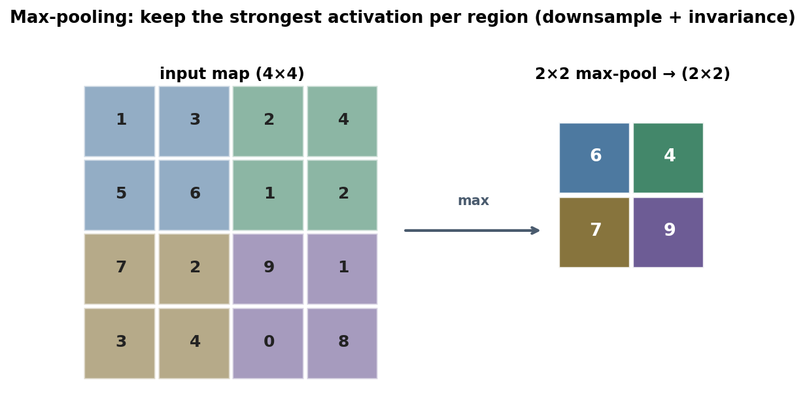
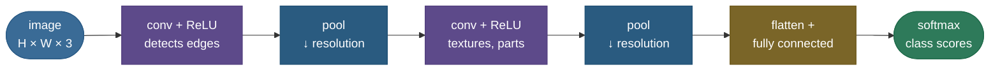

# CNNs and convolution: networks that exploit the structure of images

Hand a fully-connected network a photo and it sees a flat list of numbers — it has no idea that two pixels next to each other are related, or that a cat is a cat whether it's in the top-left or the bottom-right. Worse, the parameter count explodes: connecting every pixel of a modest 224×224 colour image to a hidden layer needs *hundreds of billions* of weights. **Convolutional neural networks** fix both problems with one idea borrowed from how vision works: slide a small **filter** across the image, looking for a local pattern, and **reuse the same filter everywhere**. That single move — local filters with shared weights — slashes parameters by orders of magnitude, builds in the knowledge that nearby pixels matter, and makes the network recognize a pattern no matter where it appears. Stack these layers and the network learns a hierarchy: edges, then textures, then parts, then whole objects.

By the end of this page you'll be able to:

- explain *why* fully-connected nets fail on images and what three **priors** CNNs bake in (local connectivity, weight sharing, translation equivariance);
- compute the **convolution** of a kernel with an input, and the **output-size formula** $O = \frac{W - K + 2P}{S} + 1$ cold;
- reason about **channels**, **parameter counts**, **pooling**, and **receptive fields**;
- explain **1×1 convolutions** and the **LeNet → AlexNet → VGG → Inception → ResNet** progression (and why residuals mattered);
- implement 2D convolution from scratch and match PyTorch.

Pictures and intuition first, then the arithmetic (with sources), then runnable code.

> **Note:** the operation deep-learning calls "convolution" is technically **cross-correlation** — true convolution flips the kernel first. Because the kernel is *learned*, the flip is irrelevant (the network just learns the flipped filter), so everyone uses the un-flipped version and calls it convolution. Worth knowing for an interview; harmless in practice.

---

## The problem: fully-connected nets don't fit images

Flatten a 224×224×3 image into a vector and feed it to a dense layer of the same size. The first weight matrix alone needs $(3 \cdot 224 \cdot 224) \times (\text{hidden units})$ parameters — for a same-size hidden layer that's nearly **half a trillion** weights (the code computes this). Three things are wrong:

- **Parameter explosion** — billions of weights to learn, hopeless to train or store.
- **No spatial structure** — flattening throws away the fact that adjacent pixels form edges and shapes; the network must rediscover geometry from scratch.
- **No translation invariance** — a feature learned for the top-left corner is a *completely separate* set of weights from the same feature in the bottom-right. The network learns "cat in this spot" instead of "cat."

Images have structure we *know* about — locality and translation. A CNN builds that knowledge into the architecture instead of forcing the network to learn it.

---

## The convolution operation

A **convolution** slides a small **kernel** (filter) — say 3×3 — across the input. At each position it does an element-wise multiply of the kernel with the overlapping patch and **sums** the result into one number of the output **feature map**. Slide by the **stride**, repeat.


The kernel *is* a learned pattern detector: the vertical-edge filter above (positive column, negative column) produces large outputs where the image has a left-to-right intensity change — a vertical edge — and near-zero where it's flat. A convolutional layer learns many such kernels, each tuned to a different local pattern, all by gradient descent.

> **See it live:** [CNN Explainer](https://poloclub.github.io/cnn-explainer/) (Georgia Tech) runs a real trained CNN in your browser — hover any neuron and watch the exact patch-times-kernel sum that produced it, layer by layer. It makes this figure interactive.

> *Where the mechanics come from: the convolution/cross-correlation layer, its arithmetic, and the priors it encodes are **Deep Learning** (Goodfellow, Bengio & Courville) Ch. 9 and **d2l.ai** Ch. 7; CS231n's "Convolutional Networks" notes are the canonical sizing reference — all in the references.*

---

## Output-size arithmetic (memorize this)

Three hyperparameters set the output dimensions: **kernel size** $K$, **stride** $S$ (how far the kernel jumps), and **padding** $P$ (zeros added around the border). For an input of width $W$:

$$O = \left\lfloor \frac{W - K + 2P}{S} \right\rfloor + 1$$

Worked through several settings (the code reproduces these):

| $W$ | $K$ | $P$ | $S$ | Output $O$ | what's happening |
|---|---|---|---|---|---|
| 7 | 3 | 0 | 1 | **5** | plain conv shrinks by $K-1$ |
| 7 | 3 | 1 | 1 | **7** | "same" padding preserves size |
| 7 | 3 | 0 | 2 | **3** | stride 2 halves (roughly) |
| 224 | 11 | 2 | 4 | **55** | AlexNet's first layer |

Two patterns to keep: **padding $P = (K-1)/2$ with stride 1 keeps the size the same** ("same" convolution), and **stride $> 1$ downsamples**. This formula is asked constantly — be able to produce it without thinking.

---

## Channels and the real shape of a conv layer

Real images have **channels** (RGB = 3). A kernel spans *all* input channels: a 3×3 kernel on a 3-channel input is actually $3 \times 3 \times 3 = 27$ weights, and it sums across channels to produce **one** output channel. A conv layer learns many such filters — one per **output channel**. So a layer mapping $C_{in}$ channels to $C_{out}$ channels with $K \times K$ kernels has:

$$\text{params} = C_{out} \cdot (C_{in} \cdot K \cdot K) + C_{out} \quad (\text{the } + C_{out} \text{ is biases})$$

A 3×3 conv from 3→64 channels is just **1,792 parameters** — and crucially that number is **independent of the image size**. The equivalent dense layer over a 224×224 image needs ~480 *billion*. That ~270-million-fold saving (computed in the code) is the entire economic case for CNNs.

---

## The three priors that make CNNs work

Everything above is a consequence of three built-in assumptions ("inductive biases") that happen to be true for images:

1. **Local connectivity** — each output looks at a small patch, not the whole image. Vision is local: edges and corners are local patterns.
2. **Weight sharing** — the *same* kernel is used at every position. This is where the parameter saving comes from, and it encodes "a feature is worth detecting wherever it occurs."
3. **Translation equivariance** — because the kernel is shared, shifting the input shifts the feature map the same way. Detect a cat once and you detect it everywhere. (Pooling later turns some of this *equivariance* into *invariance*.)

> **Tip:** "Why a CNN over an MLP for images?" answer in three words — **locality, weight-sharing, translation-equivariance** — then add the parameter-count punchline. That's the whole question.

---

## Pooling: downsample and gain invariance

A **pooling** layer shrinks the feature map by summarizing each small region — **max-pooling** keeps the strongest activation, **average-pooling** the mean:



Pooling does two jobs: it **reduces resolution** (fewer activations → cheaper deeper layers, larger receptive fields), and it adds a little **translation invariance** — if a feature shifts by one pixel within a pooling window, the max is unchanged. Modern architectures sometimes replace pooling with strided convolutions, but the idea — progressive downsampling — is universal.

---

## Receptive fields and 1×1 convolutions

The **receptive field** of a neuron is the region of the *original input* that can influence it. Early layers see tiny patches (one 3×3 kernel → 3×3 receptive field); stack convolutions and pooling and it grows, so deep neurons "see" large portions of the image — which is how the network climbs from edges to whole objects. (Computing it exactly is a favourite interview follow-up; the Distill article in the references does it rigorously.)

**1×1 convolutions** look trivial — a kernel that sees one pixel — but they're a workhorse: with $C_{in}$ input channels a 1×1 conv is a learned **linear mix across channels** at every position, used to **cheaply change channel count** (the "bottleneck" in ResNet/Inception) before an expensive 3×3. They add representational power and cut compute.

---

## Putting it together: the CNN pipeline and its lineage

A classic CNN alternates conv+activation and pooling to build a feature hierarchy, then flattens to a classifier:



The landmark architectures are this template, pushed deeper:

- **LeNet-5** (1998) — the original: two conv+pool stages → FC, for digit recognition.
- **AlexNet** (2012) — deeper, ReLU, dropout, GPUs; **won ImageNet and started the deep-learning era**.
- **VGG** (2014) — show that stacking small **3×3** convs deep (16–19 layers) is clean and powerful.
- **Inception/GoogLeNet** (2014) — parallel multi-scale filters + **1×1 bottlenecks** for efficiency.
- **ResNet** (2015) — **residual (skip) connections** let gradients flow through 50–152 layers; the breakthrough that made *very* deep nets trainable, and still a default backbone.

> *Where this comes from: ResNet's residual connection is **Deep Residual Learning for Image Recognition** (He et al. 2015); AlexNet (Krizhevsky et al. 2012), VGG (Simonyan & Zisserman 2014), and Inception (Szegedy et al. 2014) are in the references.*

> **Gotcha:** the single most important architectural idea after convolution itself is the **residual connection** ($\text{out} = \mathcal{F}(x) + x$). Without it, networks past ~20 layers got *worse*, not better, because gradients degraded. Skip connections give gradients a clean identity highway — that's why every deep model since, CNNs and transformers alike, uses them.

---

## Worked example: one convolution by hand

Take the figure's top-left patch and the vertical-edge kernel:

$$\text{patch} = \begin{bmatrix} 2 & 0 & 0 \\ 2 & 1 & 0 \\ 2 & 2 & 2 \end{bmatrix}, \quad \text{kernel} = \begin{bmatrix} 1 & 0 & -1 \\ 1 & 0 & -1 \\ 1 & 0 & -1 \end{bmatrix}$$

Element-wise multiply and sum: $(2{\cdot}1 + 0 + 0{\cdot}{-}1) + (2{\cdot}1 + 0 + 0{\cdot}{-}1) + (2{\cdot}1 + 0 + 2{\cdot}{-}1) = 2 + 2 + 0 = 4$. That single number is the top-left cell of the feature map. Slide the kernel one step right (stride 1) and repeat over the whole image; with $W=5, K=3, P=0, S=1$ the output is $\frac{5-3}{1}+1 = 3$ wide — a 3×3 feature map.

---

## Code: 2D convolution from scratch (matches PyTorch)

```python
"""2D convolution from scratch vs torch + the output-size & parameter-sharing math.
Verified on Python 3.12 (torch 2.12), CPU."""
import torch, torch.nn.functional as F
torch.manual_seed(0)
x = torch.randn(1, 3, 7, 7)            # (batch, in_channels, H, W)
w = torch.randn(5, 3, 3, 3); b = torch.randn(5)   # 5 filters over 3 input channels

def conv2d_scratch(x, w, b, stride=1, pad=0):
    x = F.pad(x, (pad, pad, pad, pad))
    B, Cin, H, W = x.shape; Cout, _, kH, kW = w.shape
    Hout, Wout = (H - kH)//stride + 1, (W - kW)//stride + 1
    out = torch.zeros(B, Cout, Hout, Wout)
    for oc in range(Cout):
        for i in range(Hout):
            for j in range(Wout):
                patch = x[:, :, i*stride:i*stride+kH, j*stride:j*stride+kW]
                out[:, oc, i, j] = (patch * w[oc]).sum(dim=(1, 2, 3)) + b[oc]
    return out

ours = conv2d_scratch(x, w, b)
print(f"conv output {tuple(ours.shape)}   max|ours - torch| = {(ours - F.conv2d(x, w, b)).abs().max():.2e}")

out_size = lambda W, K, P, S: (W - K + 2*P)//S + 1            # the output-size formula
print("AlexNet conv1  W=224 K=11 P=2 S=4  ->  O =", out_size(224, 11, 2, 4))

conv = 64*(3*3*3) + 64                                        # 3x3 conv, 3->64 channels
dense = (3*224*224) * (64*224*224)                            # equivalent dense layer
print(f"3x3 conv 3->64: {conv:,} params  vs  dense {dense:,}  ->  ~{dense//conv:,}x smaller")
```

Output:

```
conv output (1, 5, 5, 5)   max|ours - torch| = 1.43e-06
AlexNet conv1  W=224 K=11 P=2 S=4  ->  O = 55
3x3 conv 3->64: 1,792 params  vs  dense 483,385,147,392  ->  ~269,746,176x smaller
```

> **Note:** the from-scratch convolution matches PyTorch to $10^{-6}$ (the residual is just float32 summation order). And the parameter line is the whole story in one number — a conv layer is **~270 million times smaller** than the dense equivalent on a 224×224 image, *and* its size doesn't grow with the image. That's why vision runs on convolutions.

---

## Where CNNs are used

- **Image classification / detection / segmentation** — the original and still-dominant domain (ResNet, YOLO, U-Net).
- **Anything with grid structure** — audio spectrograms, video (3D conv), medical imaging, even board games (AlphaGo's policy/value nets).
- **Feature backbones** — pretrained CNNs supply features for downstream tasks via transfer learning.
- **Hybrids** — though Vision Transformers now rival CNNs, convolutions remain everywhere for their efficiency and built-in locality, often combined with attention.

> **Tip:** CNNs aren't only for images — any data with **local, translation-invariant structure on a grid** (1D signals, 2D spectrograms, 3D volumes) is a fit. The question to ask is "do nearby elements form meaningful local patterns?" If yes, convolution is a strong prior.

---

## Recap and rapid-fire

**If you remember nothing else:** a CNN slides small **learned filters** over the input and **shares those weights** across every position — encoding locality, weight-sharing, and translation-equivariance, which is exactly the structure images have. That cuts parameters by orders of magnitude (independent of image size), and stacking conv+pool builds a hierarchy from edges to objects. Output size is $O = \frac{W-K+2P}{S}+1$; pooling downsamples; residual connections made it go deep.

**Quick-fire — say these out loud:**

- *Why CNN over MLP for images?* Locality + weight-sharing + translation-equivariance → far fewer params and built-in spatial structure.
- *Output-size formula?* $O = \lfloor (W - K + 2P)/S \rfloor + 1$.
- *"Same" padding?* $P = (K-1)/2$ with stride 1 → output size = input size.
- *Params of a conv layer?* $C_{out}\,(C_{in} K^2) + C_{out}$ — independent of image size.
- *Convolution vs cross-correlation?* DL uses cross-correlation (no kernel flip); irrelevant because the kernel is learned.
- *What does pooling do?* Downsamples and adds small translation invariance (max keeps the strongest activation).
- *Receptive field?* The input region that influences a neuron; grows with depth/pooling.
- *Why 1×1 convolutions?* Cheap learned channel mixing / bottlenecks to change channel count.
- *What did ResNet add and why?* Residual/skip connections → gradients flow through very deep nets (50–152 layers).
- *Translation equivariance vs invariance?* Convolution is equivariant (shift in → shift out); pooling adds invariance (shift in → same out).

---

## References and further reading

The curated link library for this topic — videos, courses, interactive/visual resources, articles, papers, books, and internal cross-links — lives in a companion file so it can be reused as a standalone reference list:

**→ [CNNs & Convolution — references and further reading](13-CNNs-and-Convolution.references.md)**
