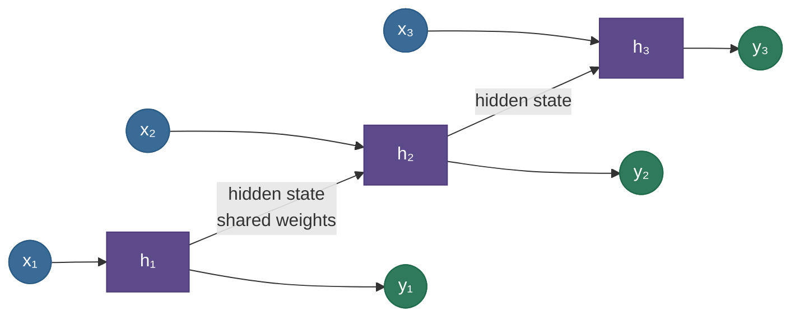

# RNNs, LSTMs, and GRUs: networks with memory

A feedforward network sees a fixed-size input all at once and has no notion of *order* or *history*. But language, speech, time series, and DNA are **sequences** — the meaning of each element depends on what came before, and the sequences come in different lengths. **Recurrent neural networks** handle this by adding the one thing feedforward nets lack: a **memory**. An RNN walks through a sequence one element at a time, maintaining a **hidden state** that it updates at each step and carries forward — so by the time it reaches the end, the hidden state is a summary of everything it has seen. The same weights are reused at every step, so the network can process a sequence of any length. The catch is that plain RNNs *forget*: the same repeated multiplication that powers them makes gradients vanish over long ranges, so they can't connect distant events. **LSTMs** and **GRUs** fix this with **gated memory** — learnable valves that decide what to keep, forget, and output — and that gating is what let recurrent nets model long-range dependencies (and dominate sequence modeling until transformers arrived).

By the end of this page you'll be able to:

- explain the RNN **hidden state**, weight sharing across time, and **backpropagation-through-time (BPTT)**;
- explain *why* vanilla RNNs suffer **vanishing/exploding gradients over time** and forget long-range context;
- describe the **LSTM** cell state and its **forget/input/output gates**, and why the **additive** update is a gradient highway;
- describe how a **GRU** simplifies this to update/reset gates;
- reason about RNN **vs transformer** trade-offs;
- implement an LSTM cell and measure the long-range gradient in code.

Intuition and pictures first, then the math (with sources), then runnable code.

> **Note:** the single idea that connects all of this to the rest of deep learning is **repeated multiplication**. An RNN applies the *same* recurrent weight matrix at every time step, so processing a length-$T$ sequence is like a $T$-layer-deep network with *shared* weights — and it inherits the exact [vanishing/exploding gradient](06-Vanishing-Exploding-Gradients.md) problem, just along the time axis. LSTMs solve it the same way residual connections do: with an **additive** path instead of a multiplicative one.

---

## The problem: sequences need order and memory

Why not just use a feedforward net or a CNN on sequences? Because:

- **Variable length** — sentences and time series differ in length; a fixed-input net can't handle that gracefully.
- **Order matters** — "dog bites man" ≠ "man bites dog"; the representation must depend on sequence order.
- **Long-range memory** — the subject of a sentence can determine a verb's form 20 words later; the model needs to *carry* information across the gap.

An RNN addresses all three with a recurrent hidden state that threads through the sequence.

---

## What an RNN is

At each time step $t$, an RNN combines the current input $x_t$ with the previous hidden state $h_{t-1}$ to produce a new hidden state:

$$h_t = \tanh(W_x\,x_t + W_h\,h_{t-1} + b)$$

The same weights $W_x, W_h$ are used at **every** step (weight sharing across time), which is what lets one small network process arbitrarily long sequences. "Unrolling" the recurrence over time makes it look like a deep feedforward net with one layer per step:



Training uses **backpropagation through time (BPTT)**: unroll the network over the sequence and back-propagate the loss through every time step, accumulating the gradient for the shared weights.

---

## Why plain RNNs forget

Here's the problem, and it's the heart of the topic. Because the *same* recurrent matrix $W_h$ is applied at every step, the gradient that flows from a late output back to an early input gets multiplied by (roughly) $W_h$ once per step — a factor raised to the power of the **time-lag**. Just like in deep nets, that product **vanishes** if the factor is $<1$ (the common case) or **explodes** if $>1$:


The figure (measured in the code) shows it starkly: a plain RNN's gradient to an input 40 steps back is $\sim 10^{-10}$ — utterly vanished — so it simply **cannot learn** that a distant word matters. This is *the* limitation that motivated gated RNNs.

> *Where this comes from: the vanishing/exploding-gradient-through-time analysis is **Learning long-term dependencies with gradient descent is difficult** (Bengio et al. 1994), **Deep Learning** (Goodfellow et al.) Ch. 10, and **On the difficulty of training RNNs** (Pascanu et al. 2013, which adds gradient clipping for the explosion side) — references.*

---

## LSTM: a gated memory cell

The **Long Short-Term Memory** unit fixes forgetting with two ideas: a separate **cell state** that runs straight through the sequence (a "constant error carousel"), and **gates** — sigmoid-valued valves that learn how much to let through:


The three gates, each a sigmoid of the input and previous hidden state:

$$f_t = \sigma(\cdots) \quad i_t = \sigma(\cdots) \quad o_t = \sigma(\cdots), \qquad \tilde C_t = \tanh(\cdots)$$

drive the **cell-state update** and the hidden output:

$$C_t = f_t \odot C_{t-1} + i_t \odot \tilde C_t, \qquad h_t = o_t \odot \tanh(C_t)$$

Read it plainly: the **forget gate** $f_t$ decides how much old memory to keep, the **input gate** $i_t$ decides how much new content $\tilde C_t$ to write, and the **output gate** $o_t$ decides what to expose as the hidden state. The crucial part is that $C_t$ is updated by **addition**, not by a matrix multiply — so when the forget gate is near 1, $\partial C_t / \partial C_{t-1} \approx 1$ and the gradient flows back across many steps **without vanishing** (exactly the $+1$ trick from [residual connections](18-Residual-Skip-Connections.md), here on the time axis). That additive path is why the LSTM line in the figure stays flat.

> *Where this comes from: the LSTM cell and the constant-error-carousel argument are **Long Short-Term Memory** (Hochreiter & Schmidhuber 1997); Chris Olah's "Understanding LSTM Networks" is the canonical illustrated walk-through — references.*

> **Tip:** initializing the **forget-gate bias to ~1** (so $f_t$ starts near 1) is a standard trick that makes LSTMs remember from the start of training — it's exactly what makes the LSTM curve in the figure flat. Worth mentioning in an interview.

---

## GRU: a lighter gated unit

The **Gated Recurrent Unit** simplifies the LSTM: it merges the cell and hidden states into one, and uses just **two** gates — an **update** gate (how much of the past to carry vs the new candidate) and a **reset** gate (how much past to use when forming the candidate). Fewer gates means **fewer parameters** and faster training, with the same additive-update spirit that preserves gradients.

> *Where this comes from: the GRU is **Learning Phrase Representations using RNN Encoder–Decoder** (Cho et al. 2014); the LSTM-vs-GRU head-to-head is **Empirical Evaluation of Gated RNNs** (Chung et al. 2014) — references.*

> **Tip:** LSTM vs GRU in one line — **GRU is lighter (2 gates, fewer params, faster); LSTM is slightly more expressive (3 gates, separate cell state).** Empirically they're close; GRU is a fine default when you want speed, LSTM when you want maximum capacity.

---

## RNNs vs transformers

Gated RNNs ruled sequence modeling (translation, speech, captioning) until **transformers** ([attention](16-Transformer-Architecture.md)) overtook them around 2017. The trade-off interviewers want:

| | RNN / LSTM | Transformer |
|---|---|---|
| **Computation** | sequential (step $t$ needs step $t-1$) | fully parallel over the sequence |
| **Training speed** | slow (no parallelism over time) | fast (parallel) — the decisive advantage |
| **Long-range** | hard (gradient still decays) | easy (direct attention to any position) |
| **Memory / step at inference** | $O(1)$ state — cheap streaming | $O(n)$ KV-cache grows with context |

Transformers won mainly because they **parallelize training** and model long range directly — but RNNs' $O(1)$-per-step inference keeps them relevant for **streaming, on-device, and very-long-sequence** settings (and recent state-space models like Mamba revive the recurrent idea).

---

## Worked example: why the lag kills it

Suppose the recurrent Jacobian has a typical magnitude of $0.8$ per step. The gradient from the output back to an input $k$ steps earlier scales like $0.8^{k}$:

- lag $k = 5$: $0.8^5 \approx 0.33$ — still usable.
- lag $k = 20$: $0.8^{20} \approx 0.012$ — barely a signal.
- lag $k = 50$: $0.8^{50} \approx 1.4\times10^{-5}$ — **gone**; the RNN can't learn a dependency this long.

An LSTM with forget gate $f \approx 1$ instead keeps $\partial C_t/\partial C_{t-1} \approx 1$, so $1^{50} = 1$ — the gradient survives. Same sequence, completely different ability to remember.

---

## Code: LSTM cell from scratch, and the long-range gradient

```python
"""LSTM cell from scratch (matches torch), and gradient-across-time.
Verified on ml-py312 (torch 2.12), CPU."""
import torch, torch.nn as nn
torch.manual_seed(0)
H, D = 16, 4
cell = nn.LSTMCell(D, H); x = torch.randn(1, D); h0 = torch.randn(1, H); c0 = torch.randn(1, H)

# from-scratch LSTM, torch's gate order [input, forget, cell, output]
gates = x @ cell.weight_ih.T + cell.bias_ih + h0 @ cell.weight_hh.T + cell.bias_hh
i, f, g, o = gates.chunk(4, dim=1)
i, f, o, g = torch.sigmoid(i), torch.sigmoid(f), torch.sigmoid(o), torch.tanh(g)
c1 = f * c0 + i * g                                    # the ADDITIVE cell update
h1 = o * torch.tanh(c1)
h_ref, c_ref = cell(x, (h0, c0))
print(f"LSTM from scratch vs torch: max|h-h_ref| = {(h1-h_ref).abs().max():.2e}")

# gradient across time: sensitivity of the last output to the FIRST input, 35 steps back
def sens(kind, T=35):
    rnn, lstm = nn.RNNCell(1, H), nn.LSTMCell(1, H)
    with torch.no_grad():
        lstm.bias_ih[H:2*H].fill_(3.0); lstm.bias_hh[H:2*H].fill_(3.0)   # forget-bias init
    xs = [torch.zeros(1, 1, requires_grad=True) for _ in range(T)]
    h = torch.zeros(1, H); c = torch.zeros(1, H)
    for t in range(T):
        h, c = lstm(xs[t], (h, c)) if kind == "LSTM" else (rnn(xs[t], h), c)
    h.sum().backward(); return xs[0].grad.abs().sum().item()

print(f"output's sensitivity to an input 35 steps earlier:")
print(f"  plain RNN: {sens('RNN'):.2e}  <- vanished")
print(f"  LSTM:      {sens('LSTM'):.2e}  <- preserved")
```

Output:

```
LSTM from scratch vs torch: max|h-h_ref| = 5.96e-08
output's sensitivity to an input 35 steps earlier:
  plain RNN: 2.43e-11  <- vanished
  LSTM:      2.13e-01  <- preserved
```

> **Note:** the from-scratch cell matches PyTorch to $10^{-8}$, confirming the gate equations. The sensitivity numbers are the whole point: a plain RNN's output barely depends on an input 35 steps back ($2\times10^{-11}$), while the LSTM's does ($0.21$) — a *ten-billion-fold* difference, entirely due to the additive cell-state update and the forget-gate-bias init.

---

## Where RNNs are used

- **Historically dominant** — machine translation (seq2seq), speech recognition, image captioning, language modeling — before transformers.
- **Streaming / low-latency / on-device** — RNNs' $O(1)$-per-step state is cheaper than a growing KV-cache for real-time or edge inference.
- **Modern revival** — state-space models (S4, Mamba) bring back the recurrent, linear-time idea for very long sequences, rivaling transformers in some settings.

> **Tip:** you won't reach for a vanilla RNN over a transformer for most tasks today, but the *concepts* are core interview material — BPTT, why RNNs forget, the LSTM gates, and the RNN-vs-transformer trade-off — and the gating idea (additive memory) recurs in modern architectures.

---

## Recap and rapid-fire

**If you remember nothing else:** an RNN carries a **hidden state** across a sequence with shared weights, but the repeated multiplication makes gradients **vanish over time**, so plain RNNs forget long-range context. **LSTMs** add a **cell state** with **forget/input/output gates**; its **additive** update ($C_t = f_t \odot C_{t-1} + i_t \odot \tilde C_t$) is a gradient highway that preserves long-range signal. **GRUs** do the same with two gates and fewer parameters. **Transformers** later won by parallelizing training and modeling long range directly.

**Quick-fire — say these out loud:**

- *What does an RNN's hidden state do?* Carries a summary of the sequence so far; updated each step with shared weights.
- *What is BPTT?* Backprop through the time-unrolled network, accumulating gradients for the shared weights.
- *Why do plain RNNs forget?* The recurrent matrix is applied every step, so gradients vanish/explode as a power of the time-lag.
- *How does an LSTM fix it?* A cell state with an **additive** update and gates; $\partial C_t/\partial C_{t-1} \approx f_t \approx 1$ keeps gradients alive.
- *Name the three LSTM gates.* Forget (keep old memory), input (write new), output (expose as hidden).
- *GRU vs LSTM?* GRU = 2 gates (update, reset), fewer params, faster; LSTM = 3 gates + separate cell, slightly more expressive; close in practice.
- *RNN vs transformer?* RNN sequential + cheap streaming inference; transformer parallel training + direct long-range, which is why it won.
- *A practical LSTM trick?* Initialize the forget-gate bias to ~1 so it remembers from the start.

---

## References and further reading

The curated link library for this topic — videos, courses, interactive/visual resources, articles, papers, books, and internal cross-links — lives in a companion file so it can be reused as a standalone reference list:

**→ [RNN / LSTM / GRU — references and further reading](14-RNN-LSTM-GRU.references.md)**
