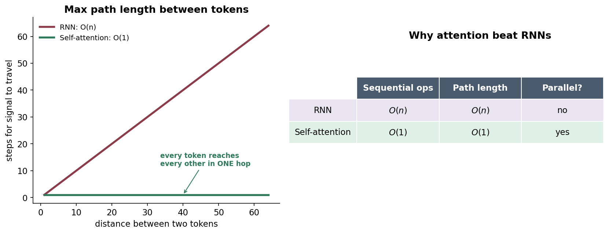
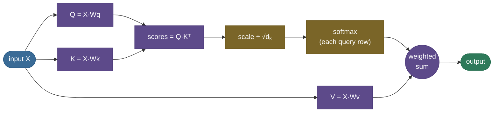
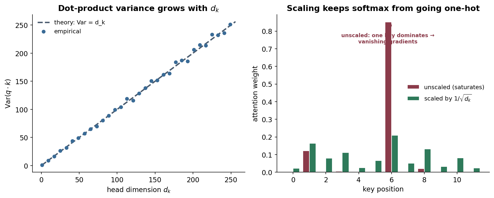
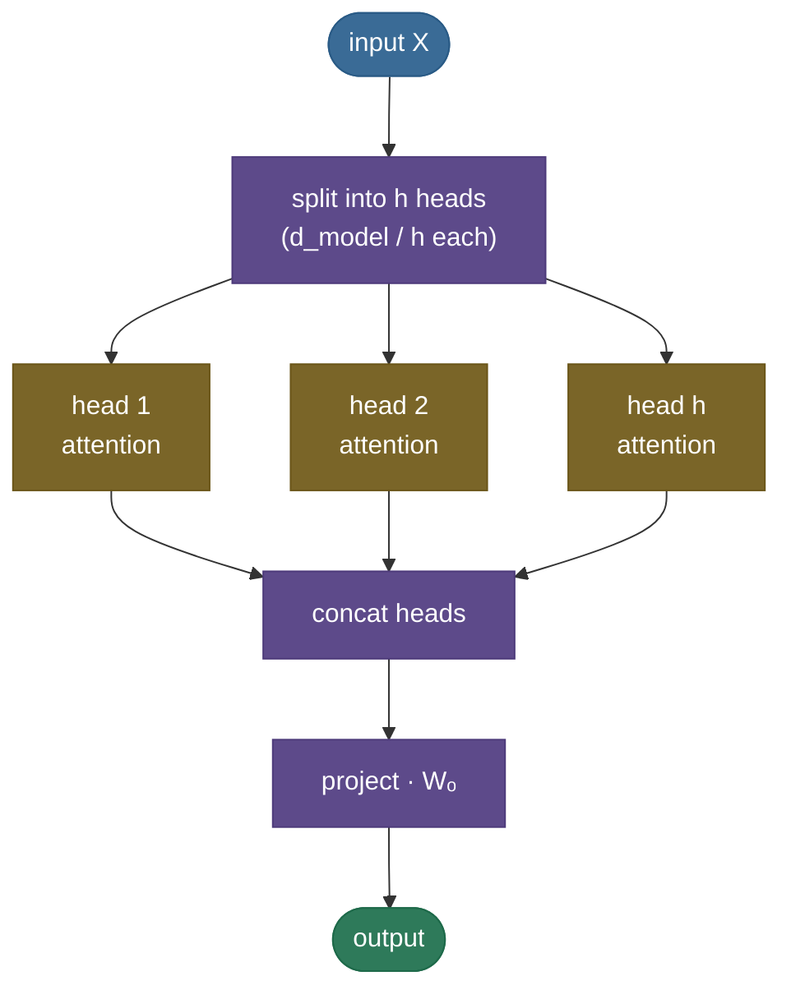
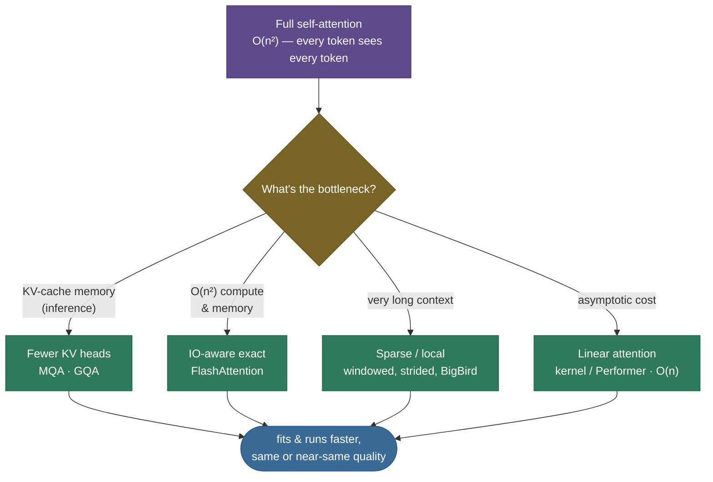

# Attention: let every token look at every other token

Picture translating a long sentence by first reading the whole thing, memorizing it as a **single mental snapshot**, and only *then* starting to write the translation — never allowed to glance back at the original. You'd nail short sentences and fall apart on long ones, because one snapshot can't hold everything. That was machine translation before 2014. **Attention** is the fix: instead of one frozen snapshot, the model gets to **look back at every input element and decide, for each output, which inputs matter right now** — a soft, learned spotlight. That one idea dissolved the bottleneck, then became the entire engine of the transformer.

This page is the complete tour. By the end you'll be able to:

- **derive scaled dot-product attention** from scratch and explain the **Query / Key / Value** roles;
- say exactly **why we divide by √dₖ**;
- distinguish **self- vs cross-attention**, **additive vs dot-product**, and **bidirectional vs causal**;
- walk a **worked numeric example** by hand;
- explain **multi-head** attention and why it helps;
- implement **causal and padding masks** and know which bug each prevents;
- analyze the **O(n²) cost** and name the **efficient variants** (MQA/GQA, FlashAttention, sparse, linear) that exist because of it;
- connect attention forward to the [KV cache](../../09.%20LLMs/concepts/05-KV-Cache.md), [FlashAttention](../../09.%20LLMs/concepts/06-Efficient-Attention-FlashAttention.md), and the [Transformer](16-Transformer-Architecture.md).

Intuition first, then the math, then code you can run.

> **Note:** "attention" is one mechanism with two framings. **Cross-attention** (the original): queries come from one sequence (e.g. the decoder), keys/values from another (the encoder). **Self-attention** (the transformer's workhorse): queries, keys, and values all come from the *same* sequence. Same math; different source of Q, K, V. We cover both below.

---

## The problem: one fixed vector can't hold a whole sequence

Before attention, sequence-to-sequence models ([RNN/LSTM/GRU](14-RNN-LSTM-GRU.md)) translated by having an **encoder** compress the entire input into a single fixed-length **context vector**, which the **decoder** then unrolled. The whole meaning of "The agreement on the European Economic Area was signed in August 1992" had to survive in one vector of, say, 512 numbers.

Two things break:

1. **The information bottleneck.** A fixed-size vector is a fixed-size bucket; the longer the sentence, the more gets crushed out, and translation quality falls off a cliff with length.
2. **The distance problem.** An RNN carries information token-by-token, so a dependency between word 1 and word 30 must survive **30 sequential hops** through the hidden state — exactly where gradients vanish.

Attention ([Bahdanau et al., 2014](https://arxiv.org/abs/1409.0473)) removes the bucket: keep **all** the encoder's per-token states, and at each step let the decoder build a *fresh, weighted blend* of them — heavy on the words that matter for the word it's about to produce.


---

## What it is

Attention is a **content-based, weighted lookup**. Every position emits three vectors:

- ***Query*** ($q$) — "what am I looking for?"
- ***Key*** ($k$) — "what do I offer, as a label?"
- ***Value*** ($v$) — "the actual content I'll hand over if you pick me."

A query is compared against **every** key to get a relevance score; the scores are softmaxed into weights; the output is the **weighted sum of the values**. In one line — the equation worth tattooing:

$$\text{Attention}(Q,K,V) = \text{softmax}\!\left(\frac{QK^\top}{\sqrt{d_k}}\right)V$$

> *Where this comes from: scaled dot-product attention is **Attention Is All You Need** (Vaswani et al. 2017, §3.2.1); its additive precursor is **Neural Machine Translation by Jointly Learning to Align and Translate** (Bahdanau et al. 2014). Both are in the references, with a runnable build in d2l.ai Ch. 11.*

With $Q \in \mathbb{R}^{n \times d_k}$, $K \in \mathbb{R}^{m \times d_k}$, $V \in \mathbb{R}^{m \times d_v}$: $QK^\top$ is $n\times m$ (every query against every key), the softmax normalizes each row, and multiplying by $V$ gives an $n \times d_v$ output — one blended vector per query. Everything else — multi-head, masks, the KV cache — is machinery around this core.

> **Note:** keys and values are *separate* projections on purpose. The **key** decides *how well a token matches* a query; the **value** is *what that token contributes* if it matches. Decoupling them lets a token be retrieved on one basis (its key) while handing back different content (its value) — strictly more expressive than matching and returning the same vector, the way a search engine matches on a title but returns the article.

---

## Intuition: a soft dictionary lookup

A Python dict is a **hard** lookup: a key either matches or it doesn't, and you get back exactly one value. Attention is the **soft** version: your query partially matches *every* key, and you get back a **blend** of all the values, weighted by how well each key matched. Nothing is all-or-nothing; everything is a weighted average.

Make it concrete. When the model processes **"it"** in *"The animal didn't cross the street because it was tired,"* its query for "it" lights up most strongly on the key for **"animal"** — so "it"'s new representation is built mostly from "animal"'s value. The model has *resolved the pronoun*, purely through weighted lookup.


> **Tip:** map Q/K/V to web search. **Query** = your search-box text. **Keys** = the titles of all documents. **Values** = the documents themselves. Attention scores your query against every title, then returns a blended summary weighted by relevance — instead of a single top hit.

> **Note:** it's tempting to read attention weights as *explanations* ("the model looked here"), but treat them with care: different weightings can produce the same output, and a high weight doesn't guarantee high causal influence. Attention maps are a useful diagnostic, not a proof of *why* the model decided something.

---

## Self-attention vs cross-attention

The mechanism is identical; only the *source* of Q, K, V changes — and that distinction defines the major transformer types.

- **Self-attention** — Q, K, V are all projections of the **same** sequence $X$: $Q = XW_q,\ K = XW_k,\ V = XW_v$. Every token attends to every token in its own sequence (including itself). This is what builds contextual representations inside an encoder or decoder.
- **Cross-attention** — Q comes from one sequence (the decoder's current state), K and V from **another** (the encoder's outputs): $Q = X_{\text{dec}}W_q,\ K = X_{\text{enc}}W_k,\ V = X_{\text{enc}}W_v$. This is how a translator's decoder "reads" the source sentence, and how multimodal models let text attend to image features.

> **Note:** the three attention blocks in a full encoder–decoder transformer are: **encoder self-attention** (bidirectional), **decoder masked self-attention** (causal), and **decoder→encoder cross-attention**. A decoder-only LLM (GPT) keeps only the middle one. Knowing which is which is a classic interview checkpoint.

---

## A worked example, by hand

Take one query and two key/value pairs in $d_k = 2$, with $q = [1,0]$, keys $k_1 = [1,0],\ k_2 = [0,1]$, values $v_1 = [1,0],\ v_2 = [0,1]$.

1. **Scores** $= q\cdot k$: $\;q\cdot k_1 = 1,\quad q\cdot k_2 = 0$.
2. **Scale** by $\sqrt{d_k} = \sqrt 2$: $\;[\,1/\sqrt2,\ 0\,] = [0.707,\ 0]$.
3. **Softmax**: $\;e^{0.707}=2.028,\ e^{0}=1$, sum $=3.028 \Rightarrow$ weights $=[0.670,\ 0.330]$.
4. **Weighted sum** of values: $\;0.670\,v_1 + 0.330\,v_2 = [0.670,\ 0.330]$.

So this query attends **67% to the matching token, 33% to the other**, and its output is a blend tilted toward the match. Change $q$ toward $k_2$ and the weights flip. That is the entire operation — the code section reproduces exactly this.

---

## Why it matters

Attention changed what neural sequence models *can* do, on three axes:

**1. Any-to-any in one hop.** In an RNN, two tokens $n$ apart are $n$ sequential steps apart. In self-attention, **every token reads every other token directly** — path length $O(1)$. Long-range dependencies stop being a game of telephone.

**2. Full parallelism.** An RNN must finish token 1 before token 2. Self-attention computes all interactions as **two matrix multiplies** ($QK^\top$, then $\cdot V$), so the whole sequence goes through at once on a GPU — the property that made training billion-parameter models practical.

**3. Dynamic, content-based routing.** The weights are computed from the data every forward pass, so the same layer routes information differently for every input — unlike a fixed convolution kernel.



> **Note:** the costs of these gains: self-attention is **$O(n^2)$ in sequence length** (covered in detail below), and it has **no inherent notion of order** (it's permutation-equivariant) — which is exactly why transformers add **positional encodings**.

---

## How it works: Q, K, V, and the four steps

> **See it live:** the **[Transformer Explainer](https://poloclub.github.io/transformer-explainer/)** (Georgia Tech / Polo Club) runs a real GPT-2 in your browser and lets you watch the attention weights light up token by token as you type; **[bbycroft.net/llm](https://bbycroft.net/llm)** shows the same Q·Kᵀ→softmax→·V flow in an animated 3D model. Either makes the four steps below click instantly.

Self-attention projects the input $X$ (one row per token) into three matrices, then runs four steps:

$$Q = XW_q,\qquad K = XW_k,\qquad V = XW_v$$

1. **Score** — every query against every key: $S = QK^\top$. Entry $S_{ij}$ = how much token $i$ should attend to token $j$.
2. **Scale** — divide by $\sqrt{d_k}$ (next section explains why).
3. **Normalize** — softmax over each **row**, so each query's weights are non-negative and sum to 1.
4. **Mix** — multiply the weights by $V$: each output row is a weighted blend of all value vectors.



> **Gotcha:** the softmax is over the **key** dimension (each query's row sums to 1), *not* the query dimension. Getting this axis wrong runs without error and silently learns nothing — the single most common attention bug. In code it's `softmax(scores, dim=-1)`.

> **Note:** softmax is computed stably by subtracting the row max before exponentiating — $\text{softmax}(z)_i = e^{z_i - \max z}\big/\sum_j e^{z_j - \max z}$ — so large scores don't overflow. This dovetails with masking: a forbidden score set to $-\infty$ becomes $e^{-\infty}=0$ after the shift, contributing exactly zero weight.

---

## The math: why divide by √dₖ

This is the one-line derivation most people only half-remember. Take a query $q$ and key $k$ with entries independent, mean 0, variance 1. Their dot product is $q\cdot k = \sum_{i=1}^{d_k} q_i k_i$. Each term has mean 0 and variance 1, independent, so:

$$\mathbb{E}[q\cdot k] = 0, \qquad \text{Var}(q\cdot k) = d_k.$$

So raw scores have standard deviation $\sqrt{d_k}$ — they grow with head size. For $d_k = 64$ that's a spread of ±8 or more. Feed scores that large into a softmax and it **saturates**: one weight → ~1, the rest → ~0, and the gradient through softmax → **0**. Dividing by $\sqrt{d_k}$ rescales the variance back to 1, keeping the softmax responsive.

> *Where this comes from: the $1/\sqrt{d_k}$ scaling and this variance argument are stated in **Attention Is All You Need** (Vaswani et al. 2017, §3.2.1, footnote 4).*



> **Tip:** an interviewer may push: *"what if you forget the scaling?"* For small $d_k$ it barely matters; for large $d_k$ early training stalls because every softmax is one-hot and no gradient flows — the model can't learn which tokens to attend to.

---

## Additive vs dot-product (multiplicative) attention

There are two classic ways to compute the score between a query and a key:

- **Additive / Bahdanau attention:** $\text{score}(q,k) = w^\top \tanh(W_q q + W_k k)$ — a small one-hidden-layer MLP. Naturally well-scaled, and it works even when $q$ and $k$ have different dimensions.
- **Dot-product / multiplicative (Luong, then Vaswani):** $\text{score}(q,k) = q\cdot k$ (scaled by $1/\sqrt{d_k}$). Just a matrix multiply.

[Vaswani et al.](https://arxiv.org/abs/1706.03762) chose **scaled dot-product** because it's a single matmul — dramatically faster and more memory-efficient on GPUs than a per-pair MLP — and the $1/\sqrt{d_k}$ factor is the small price that undoes the variance blow-up additive scoring never had. Modern transformers are all dot-product.

> **Note:** there's also a **learned vs fixed** axis you may be asked about — but for the score *function*, "additive vs dot-product" is the distinction that matters, and "we use scaled dot-product because it's a fast matmul" is the answer.

---

## Multi-head attention

One attention is one "view" of the relationships. **Multi-head attention** runs $h$ attentions in parallel on *different learned projections*, so different heads can specialize — one tracks syntactic agreement, another coreference, another positional patterns — then concatenates and projects the results:

$$\text{head}_i = \text{Attention}(XW_q^i, XW_k^i, XW_v^i), \qquad \text{MultiHead}(X) = \text{Concat}(\text{head}_1,\dots,\text{head}_h)\,W_o$$

> *Source: multi-head attention is **Attention Is All You Need** (Vaswani et al. 2017, §3.2.2).*

Each head works in a smaller dimension $d_k = d_{\text{model}}/h$, so $h$ heads cost about the same as one full-width head but buy $h$ independent relationship patterns. In practice $h$ is 8–128.



> **Gotcha:** the multi-head reshape is the classic bug. You split $d_{\text{model}}$ into `(n_heads, d_head)` and move heads to a batch-like dimension *before* attention, then concat back *after*. An off-by-one in those `view`/`transpose` calls produces wrong-but-plausible numbers — always assert the output is back to `(seq, d_model)`.

---

## Masking: causal and padding

Two masks turn the same attention into different behaviors, by setting forbidden scores to $-\infty$ **before** the softmax (so their weights become 0):

- **Causal (look-ahead) mask** — for autoregressive generation, token $i$ must not see tokens $>i$. Mask the upper triangle of the score matrix. This single change is the only structural difference between an **encoder** (bidirectional, no mask) and a **decoder** (causal) — and it is what makes the [KV cache](../../09.%20LLMs/concepts/05-KV-Cache.md) valid at inference.
- **Padding mask** — batches pad sequences to equal length; real tokens must not attend to padding. Mask the padded key positions.

> **Gotcha:** masking with `-inf` happens **before** softmax so the renormalization redistributes weight only among the allowed positions. Masking *after* softmax (zeroing weights) leaves the row no longer summing to 1 — a subtle bug that degrades quality without crashing.

---

## Complexity: the O(n²) problem

The score matrix $QK^\top$ is $n \times n$ — every token against every token. So self-attention is:

- **Time:** $O(n^2 d)$ — quadratic in sequence length $n$.
- **Memory:** $O(n^2)$ for the attention matrix (per head, per layer).

At $n = 1{,}000$ that's a million scores; at $n = 100{,}000$ it's ten billion. This quadratic wall is *the* reason long context is expensive, and the reason an entire research area exists to get around it.

(For **cross-attention** with $n$ queries and $m$ keys the cost is $O(nmd)$ time and $O(nm)$ memory — self-attention is just the $n=m$ case.)

---

## Efficient attention variants

Most modern attention research is about beating the $O(n^2)$ cost or shrinking the inference-time [KV cache](../../09.%20LLMs/concepts/05-KV-Cache.md). Which lever you pull depends on the bottleneck:



- **MQA / GQA** — share K/V across query heads to shrink the KV cache (an *inference-memory* win, not an asymptotic one).
- **[FlashAttention](../../09.%20LLMs/concepts/06-Efficient-Attention-FlashAttention.md)** — computes *exact* attention but tiles the work to avoid ever materializing the full $n\times n$ matrix in slow memory; a huge constant-factor and memory win.
- **Sparse / local attention** (sliding-window, strided, BigBird) — each token attends to a *subset* of positions, dropping cost toward $O(n\sqrt n)$ or $O(n)$ at some quality cost.
- **Linear attention** (Performer, kernel methods) — reorder the computation to avoid the $n\times n$ matrix entirely, reaching $O(n)$ — approximate, with trade-offs.

---

## Where it is used

- **Every transformer.** Encoder self-attention (BERT), decoder causal self-attention (GPT), and encoder–decoder cross-attention (T5, original NMT) are all this mechanism.
- **Beyond text.** Vision Transformers attend over image patches; attention drives speech models, protein folding (AlphaFold), diffusion backbones, and recommender systems.
- **Cross-attention as the "read" primitive.** Anywhere one stream pulls relevant information from another — multimodal models, retrieval-augmented generation — cross-attention is the glue.

> **Tip:** if a model needs to relate *every* element to *every* other and you can afford $O(n^2)$, attention is almost always the right primitive. When $n$ is huge, that's exactly when you reach for the efficiency variants above.

---

## Application: from formula to a working layer

**Step 1 — use the fused kernel.** `torch.nn.functional.scaled_dot_product_attention(Q, K, V, is_causal=...)` implements the equation with a FlashAttention-style memory-efficient kernel; `nn.MultiheadAttention` wraps the projections + heads. Reach for these before hand-rolling.

**Step 2 — get the mask right.** Causal generation → causal mask; padded batches → padding mask. A wrong mask is a silent correctness bug, not a crash.

> **Tip:** during **training**, dropout is applied to the attention weights right after the softmax — a standard regularizer that stops the model leaning on any single attention edge. It's disabled at inference, so it never affects generation.

**Step 3 — pick the efficiency lever** from the variants map: shrink the KV cache (MQA/GQA), speed the compute (FlashAttention), or cut the asymptotic cost (sparse/linear) — chosen by your bottleneck.

> **Gotcha:** because attention has no notion of order, you must add **positional information** (sinusoidal, learned, RoPE, or ALiBi). Forget it and the model treats your sentence as a bag of words — it will train, but it can't tell "dog bites man" from "man bites dog."

---

## Code: build it, then check it against PyTorch

From-scratch scaled dot-product and multi-head attention, plus the causal mask and a cross-attention call, verified to match PyTorch's fused kernel. Runs on CPU in seconds.

```python
"""From-scratch scaled dot-product + multi-head attention, checked against PyTorch.
Verified on ml-py312 (torch 2.12), CPU."""
import torch, torch.nn.functional as F
torch.manual_seed(0)

def attention(Q, K, V, mask=None):
    # Q,K,V: (..., seq, d_k).  returns (..., seq, d_v) and the weights
    d_k = Q.shape[-1]
    scores = Q @ K.transpose(-2, -1) / d_k ** 0.5      # (..., seq_q, seq_k)
    if mask is not None:
        scores = scores.masked_fill(mask == 0, float("-inf"))   # mask BEFORE softmax
    weights = F.softmax(scores, dim=-1)                # softmax over KEYS (last dim)
    return weights @ V, weights

# tiny worked example: 4 tokens, d_k = 8
seq, d_k = 4, 8
Q, K, V = torch.randn(seq, d_k), torch.randn(seq, d_k), torch.randn(seq, d_k)
out, w = attention(Q, K, V)
print("rows sum to 1:", w.sum(-1).round(decimals=3).tolist())
ref = F.scaled_dot_product_attention(Q, K, V)
print("matches torch SDPA:", torch.allclose(out, ref, atol=1e-5), "| max diff:", f"{(out-ref).abs().max():.2e}")

# causal mask: token i attends only to j <= i
causal = torch.tril(torch.ones(seq, seq))
out_c, w_c = attention(Q, K, V, mask=causal)
print("causal weights upper-triangle zero:", bool((w_c.triu(1) == 0).all()))
print("matches torch causal:", torch.allclose(out_c, F.scaled_dot_product_attention(Q, K, V, is_causal=True), atol=1e-5))

# cross-attention: queries from one sequence, keys/values from another
Xdec, Xenc = torch.randn(3, d_k), torch.randn(6, d_k)        # 3 decoder, 6 encoder tokens
cross, wc = attention(Xdec, Xenc, Xenc)                       # Q=dec, K=V=enc
print("cross-attention out shape:", tuple(cross.shape), "(3 decoder queries over 6 encoder tokens)")

# multi-head attention
def multi_head_attention(X, Wq, Wk, Wv, Wo, n_heads):
    seq, d_model = X.shape; d_head = d_model // n_heads
    split = lambda t: t.view(seq, n_heads, d_head).transpose(0, 1)   # (h, seq, d_head)
    ctx, _ = attention(split(X @ Wq), split(X @ Wk), split(X @ Wv))  # per-head attention
    return ctx.transpose(0, 1).reshape(seq, d_model) @ Wo            # concat heads, project

d_model, n_heads = 16, 4
X = torch.randn(seq, d_model)
Wq, Wk, Wv, Wo = (torch.randn(d_model, d_model) * 0.1 for _ in range(4))
print("multi-head output shape:", tuple(multi_head_attention(X, Wq, Wk, Wv, Wo, n_heads).shape))
```

Output:

```
rows sum to 1: [1.0, 1.0, 1.0, 1.0]
matches torch SDPA: True | max diff: 2.98e-07
causal weights upper-triangle zero: True
matches torch causal: True
cross-attention out shape: (3, 16)
multi-head output shape: (4, 16)
```

> **Note:** one `attention` function powers **self-attention** (Q,K,V from one sequence), **causal** self-attention (add the triangular mask), **cross-attention** (Q from the decoder, K/V from the encoder), and **multi-head** (run it per head, concat). That reuse is the whole point: attention is a single primitive the transformer arranges in different ways.

---

## Recap and rapid-fire

**If you remember nothing else:** attention is a soft dictionary lookup — score a **query** against all **keys**, softmax into weights, return the weighted sum of **values**: $\text{softmax}(QK^\top/\sqrt{d_k})V$. It gives every token an $O(1)$, fully parallel, content-dependent path to every other token, which is why it replaced the RNN and became the core of the transformer — at an $O(n^2)$ cost that the efficient variants exist to tame.

**Quick-fire — say these out loud:**

- *What are Q, K, V?* Query = what I'm looking for; Key = what each token offers as a label; Value = the content returned.
- *Self vs cross attention?* Self: Q,K,V from one sequence. Cross: Q from the decoder, K/V from the encoder.
- *Why divide by √dₖ?* Dot-product scores have variance $d_k$; without scaling, softmax saturates and gradients vanish.
- *Which dimension does softmax run over?* The **keys** (each query's row sums to 1).
- *Additive vs dot-product?* Additive (Bahdanau) = an MLP scorer; dot-product (Vaswani) = a matmul — faster, but needs the √dₖ scaling.
- *Why multi-head?* $h$ parallel attentions on different projections capture different relationship types, at roughly the cost of one.
- *Causal vs padding mask?* Causal hides future tokens (generation); padding hides pad positions (batching). Both set scores to −∞ before softmax.
- *Complexity?* $O(n^2 d)$ time, $O(n^2)$ memory — the reason FlashAttention, sparse, linear attention, and the KV cache exist.
- *Why positional encodings?* Attention is permutation-equivariant; without position it's a bag of words.

---

## References and further reading

The curated link library for this topic — videos, courses, articles, papers, books, and internal cross-links — lives in a companion file so it can be reused as a standalone reference list:

**→ [Attention Mechanism — references and further reading](15-Attention-Mechanism.references.md)**
