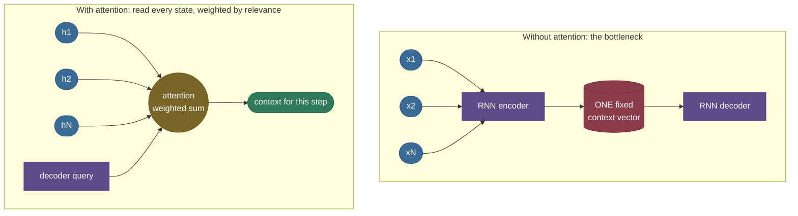
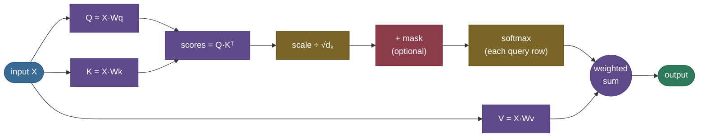
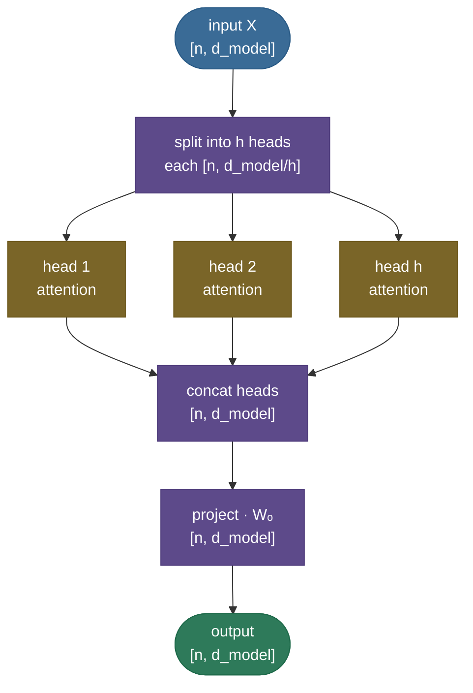
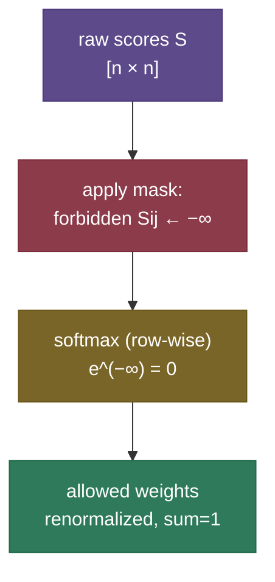
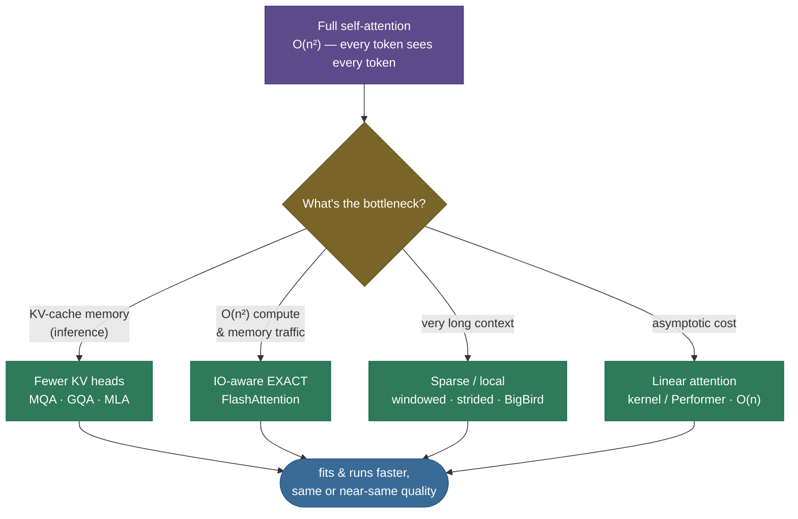

# Attention: let every token look at every other token

Picture translating a long sentence by first reading the whole thing, memorizing it as a **single mental snapshot**, and only *then* starting to write the translation — never allowed to glance back at the original. You'd nail short sentences and fall apart on long ones, because one snapshot can't hold everything. That was machine translation before 2014. **Attention** is the fix: instead of one frozen snapshot, the model gets to **look back at every input element and decide, for each output, which inputs matter right now** — a soft, learned spotlight. That one idea dissolved the bottleneck, then became the entire engine of the transformer, and through the transformer the entire engine of modern AI.

I'm going to teach this the way I'd actually walk a strong teammate through it at a whiteboard: feel the *problem* attention was invented to solve, meet the **Query / Key / Value** abstraction as a soft dictionary lookup, then **derive** scaled dot-product attention — including the one piece of real math everyone half-remembers, *why we divide by √dₖ* — and only then layer on multi-head, masking, and the $O(n^2)$ cost that spawned an entire research field. Four worked numeric examples (each a notch harder than the last) ground every equation, and runnable PyTorch at the end proves the from-scratch numbers match the fused kernel to the last decimal. By the end you'll be able to:

- explain the **seq2seq bottleneck** attention removed, and the historical lineage (**Bahdanau additive → Luong multiplicative → Vaswani scaled dot-product**);
- **derive** $\text{Attention}(Q,K,V)=\text{softmax}(QK^\top/\sqrt{d_k})V$ from scratch, with **every shape stated**;
- **derive** the variance argument for the $1/\sqrt{d_k}$ scaling and show the softmax-saturation it prevents — numerically;
- distinguish **self- vs cross-attention**, **additive vs dot-product**, **bidirectional vs causal**;
- explain **multi-head** attention, why it helps, and walk its **shapes** end to end;
- implement **causal and padding masks** and know which silent bug each prevents;
- analyze the **$O(n^2)$ cost** and name the variants — **KV cache**, **FlashAttention**, **MQA/GQA**, **sparse**, **linear** — that exist because of it;
- connect attention forward to the [KV cache](../../09.%20LLMs/concepts/05-KV-Cache.md), [FlashAttention](../../09.%20LLMs/concepts/06-Efficient-Attention-FlashAttention.md), the full [Transformer](16-Transformer-Architecture.md), and [positional encoding](17-Positional-Encoding.md).

Intuition first, then the math, then code you can run.

> **Note:** "attention" is one mechanism with two framings that trip people up. **Cross-attention** (the original 2014 idea): queries come from one sequence (e.g. the decoder), keys/values from another (the encoder). **Self-attention** (the transformer's workhorse): queries, keys, and values all come from the *same* sequence. Identical math; different source of Q, K, V. We cover both below — and the same primitive powers each.

---

## The problem: one fixed vector can't hold a whole sequence

Before attention, sequence-to-sequence models ([RNN/LSTM/GRU](14-RNN-LSTM-GRU.md)) translated by having an **encoder** compress the entire input into a single fixed-length **context vector** $c$, which the **decoder** then unrolled token by token. The whole meaning of *"The agreement on the European Economic Area was signed in August 1992"* had to survive in one vector of, say, 512 numbers — and the decoder saw nothing else.

Two things break, and they break worse the longer the sentence:

1. **The information bottleneck.** A fixed-size vector is a fixed-size bucket. The longer the source sentence, the more gets crushed out of that bucket, and translation quality (BLEU) falls off a cliff past ~30 tokens. You are asking 512 numbers to losslessly summarize an arbitrarily long sentence — they can't.
2. **The distance problem.** An RNN carries information token-by-token, so a dependency between word 1 and word 30 must survive **30 sequential hops** through the hidden state. That is exactly the regime where gradients vanish (see [vanishing gradients](12-Vanishing-Exploding-Gradients.md)), so the model *structurally* struggles to connect distant words.

Attention ([Bahdanau et al., 2014](https://arxiv.org/abs/1409.0473)) removes the bucket. Keep **all** of the encoder's per-token hidden states $h_1, \dots, h_m$ — don't compress them into one vector — and at each decoding step let the decoder build a *fresh, weighted blend* of them, heavy on the words that matter for the word it's about to produce. Instead of *"here is my one summary of the source,"* the encoder now says *"here is every word's representation; reach for whichever ones you need, right now."*



> **Note:** Bahdanau's paper is literally titled *"Neural Machine Translation by **Jointly Learning to Align and Translate**."* That phrase is the whole idea: the model learns *what to translate* and *where to look* at the same time, end to end, with no hand-built alignment table. The attention weights *are* a soft alignment between source and target words.

---

## What it is

Attention is a **content-based, weighted lookup**. Every position emits three vectors, each a learned linear projection of that position's representation:

- ***Query*** ($q$) — "what am I looking for?"
- ***Key*** ($k$) — "what do I offer, as a label?"
- ***Value*** ($v$) — "the actual content I'll hand over if you pick me."

A query is compared against **every** key to get a relevance score; the scores are softmaxed into weights; the output is the **weighted sum of the values**. In one line — the equation worth tattooing:

$$\text{Attention}(Q,K,V) = \text{softmax}\!\left(\frac{QK^\top}{\sqrt{d_k}}\right)V$$

> *Where this comes from: scaled dot-product attention is **Attention Is All You Need** (Vaswani et al. 2017, §3.2.1); its additive precursor is **Neural Machine Translation by Jointly Learning to Align and Translate** (Bahdanau et al. 2014); the dot-product family was studied by **Luong et al. 2015**. All three are in the references, with a runnable build in d2l.ai Ch. 11.*

With $Q \in \mathbb{R}^{n \times d_k}$, $K \in \mathbb{R}^{m \times d_k}$, $V \in \mathbb{R}^{m \times d_v}$: $QK^\top$ is $n\times m$ (every query against every key), the softmax normalizes each **row**, and multiplying by $V$ gives an $n \times d_v$ output — one blended vector per query. Everything else in this page — the scaling, multi-head, masks, the KV cache — is machinery wrapped around this single core.



![Scaled dot-product attention as a dataflow with every shape labelled: Q, K, V feed QKᵀ (scores, [n,m]), which is scaled by 1/√dₖ, optionally masked, softmaxed row-wise, then multiplied by V to give the [n, d_v] output. The two matmuls (QKᵀ and ·V) are the entire cost.](images/attn_dataflow.png)

> **Note:** keys and values are *separate* projections on purpose. The **key** decides *how well a token matches* a query; the **value** is *what that token contributes* if it matches. Decoupling them lets a token be retrieved on one basis (its key) while handing back different content (its value) — strictly more expressive than matching and returning the same vector, the way a search engine matches on a title but returns the article body.

---

## Intuition: a soft dictionary lookup

A Python `dict` is a **hard** lookup: a key either matches or it doesn't, and you get back exactly one value. Attention is the **soft** version: your query partially matches *every* key, and you get back a **blend** of all the values, weighted by how well each key matched. Nothing is all-or-nothing; everything is a weighted average. Where a dict returns `d[k]`, attention returns $\sum_j \text{(match}(q,k_j)) \cdot v_j$ with the matches normalized to sum to 1.

Make it concrete. When the model processes **"it"** in *"The animal didn't cross the street because it was tired,"* its query for "it" lights up most strongly on the key for **"animal"** — so "it"'s new representation is built mostly from "animal"'s value. The model has *resolved the pronoun*, purely through weighted lookup, in a single layer, with no recurrence and no parse tree.


> **Tip:** map Q/K/V to web search and it sticks for good. **Query** = your search-box text. **Keys** = the titles of all documents. **Values** = the document bodies. Attention scores your query against every title, softmaxes the scores into relevance weights, then returns a *blended* summary weighted by relevance — instead of a single top hit. Self-attention is just the case where the documents *are* the other words in your own sentence.

> **Note:** it's tempting to read attention weights as *explanations* ("the model looked here"), and the heatmaps are seductive. Treat them with care: different weightings can produce the same output, gradients can route influence that the weights don't show, and a high weight doesn't guarantee high causal influence. Attention maps are a useful diagnostic, not a proof of *why* the model decided something — a point made carefully in the "Attention is not Explanation" literature.

---

## Historical lineage: Bahdanau → Luong → Vaswani

Attention did not arrive fully formed. Three papers, one year apart each, took it from a translation patch to the foundation of an architecture. The *score function* — how a query and a key produce a single number — is what changed.

**Bahdanau (2014) — additive / concat attention.** The original. The score between decoder state $s$ (the query) and encoder state $h$ (the key) is a small one-hidden-layer MLP:

$$\text{score}(s, h) = v_a^\top \tanh(W_s\, s + W_h\, h)$$

with learned $W_s, W_h, v_a$. It's called *additive* because it **adds** the two projected vectors inside a $\tanh$. It's naturally well-scaled (the $\tanh$ bounds the activations), and it works even when $s$ and $h$ have **different dimensions** — handy in the encoder–decoder setting where they might.

**Luong (2015) — multiplicative / dot-product attention.** Luong, Pham & Manning asked: do we need the MLP at all? They proposed scoring by a plain dot product (and a "general" variant with a learned matrix in between):

$$\text{score}_{\text{dot}}(s,h) = s^\top h, \qquad \text{score}_{\text{general}}(s,h) = s^\top W h.$$

A dot product is a single matmul — far cheaper and more GPU-friendly than a per-pair MLP. The catch they flagged: for large dimensions the dot products grow large and destabilize the softmax (foreshadowing the next paper's fix).

**Vaswani (2017) — scaled dot-product attention.** *Attention Is All You Need* took Luong's dot-product, added the crucial **$1/\sqrt{d_k}$ scaling** to tame exactly that instability, generalized "decoder reads encoder" into "every token reads every token" (**self-attention**), ran $h$ of them in parallel (**multi-head**), and threw away the RNN entirely. The result *is* the transformer.

| | Bahdanau 2014 | Luong 2015 | Vaswani 2017 |
|---|---|---|---|
| **Score function** | $v_a^\top \tanh(W_s s + W_h h)$ | $s^\top h$ (or $s^\top W h$) | $q^\top k / \sqrt{d_k}$ |
| **Name** | additive / concat | multiplicative / dot | scaled dot-product |
| **Cost per pair** | an MLP | one dot product | one dot product + a scalar |
| **Q, K dims** | may differ | usually equal | equal ($d_k$) |
| **Where used** | RNN seq2seq | RNN seq2seq | the transformer |

> **Note:** additive vs dot-product is a recurring interview question, and the crisp answer is: *"both score a query against a key; additive uses an MLP (Bahdanau), dot-product uses a matmul (Luong/Vaswani). Modern transformers use **scaled** dot-product because a matmul is dramatically faster on GPUs, and the $1/\sqrt{d_k}$ factor undoes the variance blow-up the MLP never had."* Empirically the two score equally well at small $d_k$; dot-product wins on speed, which is decisive at scale.

---

## Self-attention vs cross-attention

The mechanism is identical; only the *source* of Q, K, V changes — and that one distinction defines the major transformer block types.

- **Self-attention** — Q, K, V are all projections of the **same** sequence $X$:
  $$Q = XW_q,\quad K = XW_k,\quad V = XW_v.$$
  Every token attends to every token in its own sequence (including itself). This is what builds contextual representations inside an encoder or decoder — "it" reaching back to "animal" lives here.
- **Cross-attention** — Q comes from one sequence (the decoder's current state), K and V from **another** (the encoder's outputs):
  $$Q = X_{\text{dec}}W_q,\quad K = X_{\text{enc}}W_k,\quad V = X_{\text{enc}}W_v.$$
  This is how a translator's decoder "reads" the source sentence, and how multimodal models let text attend to image features. Here $n$ (decoder length) and $m$ (encoder length) genuinely differ.

> **Note:** the three attention blocks in a full encoder–decoder transformer are: **encoder self-attention** (bidirectional, no mask), **decoder masked self-attention** (causal), and **decoder→encoder cross-attention**. A decoder-only LLM (GPT-style) keeps only the middle one. Knowing which block is which — and which mask each carries — is a classic interview checkpoint. The full assembly is the subject of the [Transformer Architecture](16-Transformer-Architecture.md) page; here we stay zoomed in on the attention operation itself.

### Bidirectional vs causal — the same self-attention with one mask

Cutting across self vs cross is a second axis that decides what a model is *for*: whether a token may look **forward** as well as back.

- **Bidirectional** self-attention (BERT-style encoders) — *no mask*. Every token attends to every other token, past **and** future. Great for *understanding* a fixed input (classification, NER, retrieval embeddings) where the whole sequence is available at once. You cannot generate left-to-right with it, because token $i$ has already seen the answer.
- **Causal** self-attention (GPT-style decoders) — *triangular mask*. Token $i$ attends only to $\le i$, never to the future. This is what lets the model **generate**: at each step it predicts the next token from the past alone, exactly as it will at inference. It's also what makes the [KV cache](../../09.%20LLMs/concepts/05-KV-Cache.md) valid (past K/V never change).

| | Bidirectional (encoder) | Causal (decoder) |
|---|---|---|
| **Mask** | none | upper-triangle → −∞ |
| **Token $i$ sees** | all tokens | tokens $\le i$ |
| **Good for** | understanding / embeddings | generation |
| **Example** | BERT, RoBERTa, ViT | GPT, Llama, Mistral |

The remarkable thing: **the only code difference is one mask.** Same projections, same softmax, same weighted sum — add the triangular mask and a bidirectional encoder becomes an autoregressive decoder.

---

## How it works: Q, K, V, and the four steps

> **See it live:** the **[Transformer Explainer](https://poloclub.github.io/transformer-explainer/)** (Georgia Tech / Polo Club) runs a real GPT-2 in your browser and lets you watch the attention weights light up token by token as you type; **[bbycroft.net/llm](https://bbycroft.net/llm)** shows the same Q·Kᵀ→softmax→·V flow in an animated 3D model. Either makes the four steps below click instantly — open one in a tab as you read.

Self-attention projects the input $X$ (one row per token, $X \in \mathbb{R}^{n \times d_{\text{model}}}$) into three matrices, then runs four steps:

$$Q = XW_q,\qquad K = XW_k,\qquad V = XW_v$$

1. **Score** — every query against every key: $S = QK^\top \in \mathbb{R}^{n \times m}$. Entry $S_{ij}$ = the raw, un-normalized relevance of token $j$ to token $i$ (how much query $i$ should attend to key $j$).
2. **Scale** — divide by $\sqrt{d_k}$ (the next section derives why this exact constant).
3. **Normalize** — softmax over each **row**, so each query's weights are non-negative and sum to 1. Now $A = \text{softmax}(S/\sqrt{d_k})$ is a proper probability distribution per query.
4. **Mix** — multiply the weights by $V$: $\;O = AV \in \mathbb{R}^{n \times d_v}$. Each output row is a weighted blend of all value vectors.

That's it: two matmuls ($QK^\top$, then $AV$) with a scale, a softmax, and an optional mask between them.

> **Gotcha:** the softmax is over the **key** dimension (each query's row sums to 1), *not* the query dimension. Getting this axis wrong runs without error and silently learns nothing — the single most common attention bug. In code it's `softmax(scores, dim=-1)` when scores are shaped `[..., n_queries, n_keys]`.

> **Note:** softmax is computed *stably* by subtracting the row max before exponentiating — $\text{softmax}(z)_i = e^{z_i - \max z}\big/\sum_j e^{z_j - \max z}$ — so large scores don't overflow to `inf`. This dovetails with masking: a forbidden score set to $-\infty$ becomes $e^{-\infty}=0$ after the shift, contributing exactly zero weight to the normalized sum. (This same online/streaming softmax is the trick FlashAttention exploits — more below.)

---

## The math: why divide by √dₖ (derived)

This is the one-line derivation most people only half-remember, so let's do it properly — it's a clean probability argument and interviewers love asking it.

**Setup.** Take a query $q$ and a key $k$, each a vector in $\mathbb{R}^{d_k}$, with entries that are **independent, mean 0, variance 1** (a reasonable approximation right after initialization, when projections are small-random). Their dot product is

$$q\cdot k = \sum_{i=1}^{d_k} q_i\, k_i.$$

**Mean.** Each term $q_i k_i$ is a product of two independent mean-0 variables, so $\mathbb{E}[q_i k_i] = \mathbb{E}[q_i]\,\mathbb{E}[k_i] = 0$. Summing $d_k$ of them, by linearity:

$$\mathbb{E}[q\cdot k] = \sum_{i=1}^{d_k}\mathbb{E}[q_i k_i] = 0.$$

**Variance.** For each term, since $q_i, k_i$ are independent and mean-0 with unit variance:

$$\text{Var}(q_i k_i) = \mathbb{E}[q_i^2 k_i^2] - (\mathbb{E}[q_i k_i])^2 = \mathbb{E}[q_i^2]\,\mathbb{E}[k_i^2] - 0 = 1\cdot 1 = 1.$$

The $d_k$ terms are independent, so variances add:

$$\boxed{\;\text{Var}(q\cdot k) = \sum_{i=1}^{d_k}\text{Var}(q_i k_i) = d_k.\;}$$

**The consequence.** Raw scores therefore have **standard deviation $\sqrt{d_k}$** — they grow with head size. For $d_k = 64$ that's a spread of about ±8 between the largest and smallest scores; for $d_k = 128$, ±11. Feed scores that large into a softmax and it **saturates**: one weight → ~1, the rest → ~0, the distribution collapses to near one-hot. And a saturated softmax has a **vanishing Jacobian** — $\partial\,\text{softmax}_i/\partial z_j \approx 0$ when one output is ~1 — so essentially **no gradient flows back** through the attention weights. Early training stalls: the model can't learn *which* tokens to attend to because the gradient that would teach it is ~0.

**The fix.** Divide the scores by $\sqrt{d_k}$ *before* the softmax. This rescales the variance back to 1 (dividing a variable by $c$ divides its variance by $c^2$, and $(\sqrt{d_k})^2 = d_k$), keeping the softmax in its responsive, high-gradient regime regardless of head size. That single constant is what lets you make heads as wide as you like without the softmax going dead.

> *Where this comes from: the $1/\sqrt{d_k}$ scaling and exactly this variance argument are stated in **Attention Is All You Need** (Vaswani et al. 2017, §3.2.1, footnote 4): "We suspect that for large values of $d_k$, the dot products grow large in magnitude, pushing the softmax into regions where it has extremely small gradients."*


We can watch the saturation happen as a *measured* function of $d_k$. Holding the score *pattern* fixed and only growing $d_k$ (so the dot-product magnitudes scale as the theory predicts), the **unscaled** softmax marches from near-uniform toward one-hot — its entropy crashing to 0 and its peak weight climbing to 1 — while the **scaled** softmax stays put at a healthy, trainable spread. This is the variance derivation, in pictures:


And we can confirm the *gradient* really does vanish, not just the entropy. Take a softmax over 16 scores, push them through a trivial downstream loss, and measure the **gradient norm that reaches the scores** as we crank up the score spread (which is what large $d_k$ does):

| score std (∝ √dₖ) | softmax max weight | gradient norm at the scores |
|---:|---:|---:|
| 1.0 | 0.172 | 1.333 |
| 2.0 | 0.383 | 1.366 |
| 4.0 | 0.994 | **0.037** |
| 8.0 | 1.000 | **0.00001** |

The gradient norm holds above 1.3 while the softmax is responsive, then **collapses by five orders of magnitude** once the softmax saturates (max weight → 1). That near-zero gradient is *literally* why an unscaled wide-head attention can't learn its alignments — there is no signal to update the projections with. Dividing by $\sqrt{d_k}$ keeps the scores in the std ≈ 1 row, where the gradient is healthy. (This exact table is printed by the verification script below.)

> **Tip:** an interviewer may push: *"what if you forget the scaling?"* For small $d_k$ it barely matters (the variance is small either way). For large $d_k$, early training **stalls** because every softmax is effectively one-hot and — per the table above — no gradient flows, so the model can't learn its alignments. People who skip the scaling and then see "loss won't go down at the start" are usually looking at exactly this.

> **Gotcha:** the unit-variance assumption is an *approximation* that holds best near initialization. As training proceeds, learned projections deliberately *shape* the score variance (some heads sharpen, some flatten). The $\sqrt{d_k}$ scaling is the right *default* normalization to start from; it doesn't pin the variance to 1 forever, and it isn't meant to.

---

## A worked example, by hand (Example 1: one query, three key/value pairs)

Take **one** query attending over **three** key/value pairs in $d_k = 4$, $d_v = 2$. Let

$$q = [2,0,0,0],\quad
k_1 = [2,0,0,0],\ k_2=[0,2,0,0],\ k_3=[1,0,1,0],\quad
v_1=[10,0],\ v_2=[0,10],\ v_3=[5,5].$$

Read $k_1$ as "aligned with the query," $k_2$ as "orthogonal," $k_3$ as "partly aligned."

1. **Scores** $= q\cdot k_j$: $\;q\cdot k_1 = 4,\quad q\cdot k_2 = 0,\quad q\cdot k_3 = 2.\;$ So $S = [4,\,0,\,2]$.
2. **Scale** by $\sqrt{d_k} = \sqrt 4 = 2$: $\;S/2 = [2,\,0,\,1].$
3. **Softmax** (subtract the max, 2, then exponentiate): $\;e^{0}=1,\ e^{-2}=0.135,\ e^{-1}=0.368$; sum $=1.503$. Weights $= [0.665,\,0.090,\,0.245]$ (they sum to 1).
4. **Weighted sum** of values: $\;0.665\,v_1 + 0.090\,v_2 + 0.245\,v_3 = [7.88,\ 2.12].$

So this query puts **66.5% of its weight on the aligned key**, almost ignores the orthogonal one (9%), and gives 24.5% to the partial match — and its output is a blend dominated by $v_1$'s content, nudged toward $v_3$. Change $q$ to point along $k_2$ and the weights reshuffle accordingly. **That is the entire operation.** The code section reproduces these exact numbers and checks them against PyTorch.

> **Tip:** notice the scaling already doing its job here. The raw scores $[4,0,2]$ softmax to $[0.84,0.02,0.14]$ — sharper; after the $/\sqrt{d_k}$ scale, $[2,0,1]$ softmax to the gentler $[0.665,0.090,0.245]$. With a wider head the *unscaled* gap would be enormous and the softmax would pin to one key; the scale keeps multiple keys in play so the model can actually *blend*.

---

## A second worked example (Example 2: the √dₖ effect, numerically)

Let's *see* the saturation the derivation predicts, with numbers you can check. Hold a fixed score *pattern* — "one key strongly aligned, one half-aligned, one not" — but let the dot-product magnitudes grow with $d_k$ as the theory says they do (the aligned dot product scales like $d_k$). Then compare the softmax **with** and **without** the $1/\sqrt{d_k}$ scale, reading off the **max attention weight** (1.0 = fully one-hot, collapsed):

| $d_k$ | unscaled max weight | scaled ($/\sqrt{d_k}$) max weight |
|---:|---:|---:|
| 2 | 0.736 | 0.629 |
| 8 | 0.997 | 0.848 |
| 32 | 1.000 | 0.982 |
| 128 | 1.000 | 1.000 |

Read across the **unscaled** column: by $d_k = 8$ it is already 0.997 — essentially one-hot, gradients gone. The **scaled** column climbs far more gently (it eventually sharpens too, because this synthetic pattern keeps one key genuinely dominant — but it stays in the trainable regime an order of magnitude longer). The lesson the table teaches with hard numbers: **without scaling, a wide head's softmax is dead on arrival; with scaling, it stays alive.** These figures are produced and printed by the verification script below.

> **Note:** in real attention the scaled column doesn't march to 1.0 the way this *deliberately-dominant* synthetic does — the measured-entropy figure above (random scores) shows the scaled softmax staying *flat* across all $d_k$. The two views agree: scaling removes the *$d_k$-driven* sharpening. Any residual sharpness is the model's *learned* choice, not an artifact of head width.

---

## A third worked example (Example 3: a full 2-token self-attention pass)

Now a complete self-attention forward pass for a tiny sequence — **two tokens, $d_{\text{model}} = 2$** — so every matrix fits on a line. Input and weights:

$$X = \begin{bmatrix}1&0\\0&1\end{bmatrix},\quad
W_q=W_k=\begin{bmatrix}1&0\\0&1\end{bmatrix},\quad
W_v=\begin{bmatrix}2&0\\0&3\end{bmatrix}.$$

**Project** ($Q=XW_q$, etc.). Because $W_q,W_k$ are the identity, $Q = K = X$. The value projection scales: $V = XW_v = \begin{bmatrix}2&0\\0&3\end{bmatrix}$ (token 1's value is $[2,0]$, token 2's is $[0,3]$).

**Scores** $S = QK^\top$. With $Q=K=I$: $\;S = \begin{bmatrix}1&0\\0&1\end{bmatrix}$ (each token's query dot-products to 1 with itself, 0 with the other).

**Scale** by $\sqrt{d_k}=\sqrt2$: $\;S/\sqrt2 = \begin{bmatrix}0.707&0\\0&0.707\end{bmatrix}.$

**Softmax** each row. Row 1: $\text{softmax}([0.707,0]) = [0.670,\,0.330]$ (from $e^{0.707}=2.028$, $e^0=1$, sum $3.028$). Row 2 is the mirror: $[0.330,\,0.670]$. So

$$A = \begin{bmatrix}0.670 & 0.330\\ 0.330 & 0.670\end{bmatrix}.$$

**Mix** $O = AV$. Row 1: $0.670\cdot[2,0] + 0.330\cdot[0,3] = [1.34,\ 0.99]$. Row 2: $0.330\cdot[2,0] + 0.670\cdot[0,3] = [0.66,\ 2.01]$. So

$$O = \begin{bmatrix}1.34 & 0.99\\ 0.66 & 2.01\end{bmatrix}.$$

Each output token is now a **blend** of both tokens' values, tilted ~2:1 toward itself (because each query matched its own key best). Token 1's representation absorbed some of token 2's "$3$"; token 2's absorbed some of token 1's "$2$." That mutual mixing — every token folding in a weighted bit of every other — is *exactly* what self-attention does in a real model, just with $d_{\text{model}}$ in the hundreds and learned, non-identity projections. The code below confirms this $O$ matches `torch...scaled_dot_product_attention` to ~$10^{-7}$.

> **Tip:** this is the smallest example that shows the **whole** loop — projection, score, scale, softmax, mix — with the *value* projection deliberately different from $W_q/W_k$ so you can see K and V playing different roles. If you can reproduce these four matrices by hand, you understand self-attention.

---

## Multi-head attention (and Example 4: the shape walk-through)

One attention is one "view" of the relationships. **Multi-head attention** runs $h$ attentions in parallel on *different learned projections*, so different heads can specialize — one head tracks subject–verb agreement, another coreference, another local position, another rare-token copying — then concatenates and output-projects the results:

$$\text{head}_i = \text{Attention}(XW_q^i,\, XW_k^i,\, XW_v^i),\qquad
\text{MultiHead}(X) = \text{Concat}(\text{head}_1,\dots,\text{head}_h)\,W_o.$$

> *Source: multi-head attention is **Attention Is All You Need** (Vaswani et al. 2017, §3.2.2). Their base model uses $h=8$ heads of $d_k=d_v=64$, summing to $d_{\text{model}}=512$.*

**Why it helps (derived intuition).** A single softmax attention produces *one* weighted average per query — so a single head can only commit to *one* relationship pattern at a time. If "it" needs to simultaneously attend to its antecedent *and* to the verb it's the subject of, one head must compromise between them. Splitting $d_{\text{model}}$ into $h$ heads of dimension $d_k = d_{\text{model}}/h$ gives the model $h$ **independent** attention distributions, computed in $h$ different learned subspaces, that it then concatenates. Crucially this costs about the **same** as one full-width head: $h$ heads of width $d_{\text{model}}/h$ have the same total projection and matmul FLOPs as one head of width $d_{\text{model}}$ — you buy $h$ relationship patterns for the price of one. In practice $h$ is 8–128.



**Example 4 — follow the shapes.** Take $n=5$ tokens, $d_{\text{model}}=16$, $h=4$ heads, so $d_{\text{head}}=16/4=4$. The journey of the tensor:

| Step | Shape | Note |
|---|---|---|
| input $X$ | `[5, 16]` | one row per token |
| project, then split into heads | `[4, 5, 4]` | $(h,\,n,\,d_{\text{head}})$ — heads moved to a batch-like axis |
| per-head scores $QK^\top$ | `[4, 5, 5]` | each head: a $5\times5$ attention matrix |
| per-head context $AV$ | `[4, 5, 4]` | each head's weighted-sum output |
| concat heads (transpose + reshape) | `[5, 16]` | glue the $h$ slices back to $d_{\text{model}}$ |
| output projection $\cdot W_o$ | `[5, 16]` | mix information *across* heads; back to $(n, d_{\text{model}})$ |

The output is back to `[5, 16]` — same shape as the input, which is *why* you can stack attention blocks indefinitely. The verification script prints exactly these shapes.

> **Gotcha:** the multi-head reshape is the classic bug. You split $d_{\text{model}}$ into `(n_heads, d_head)` and move heads to a batch-like dimension *before* attention, then concat back *after*. An off-by-one in those `view`/`transpose` calls produces wrong-but-plausible numbers that train *almost* fine — the worst kind of bug. Always `assert out.shape == (seq, d_model)` and, if you can, check one head by hand.

> **Note:** the final $W_o$ is not decorative — it's where information **mixes across heads**. Without it, you'd have $h$ independent subspace outputs sitting side by side with no communication; $W_o$ lets head 3's coreference signal inform the same output coordinate as head 1's syntax signal. The attention matrix is *per head*; $W_o$ is what re-fuses them.

**Parameter count (a common follow-up).** A multi-head self-attention block has exactly four weight matrices: $W_q, W_k, W_v$, each $d_{\text{model}}\times d_{\text{model}}$, and $W_o$, also $d_{\text{model}}\times d_{\text{model}}$. (Splitting into heads is a *reshape*, not new parameters — the per-head projections are slices of the same $d_{\text{model}}\times d_{\text{model}}$ matrix.) So the block has

$$4\,d_{\text{model}}^2 \;\;(\text{plus } 4\,d_{\text{model}} \text{ bias terms, often omitted}).$$

For $d_{\text{model}}=512$ that's $4\times512^2 \approx 1.05\text{M}$ parameters per attention block — **independent of the number of heads** $h$ and of sequence length $n$. The head count changes how the *same* parameters are partitioned into subspaces, not how many there are. (The feed-forward sublayer that follows, typically $8\,d_{\text{model}}^2$, actually holds *more* parameters than attention — a frequently-missed fact.)

> **Gotcha:** "more heads = more parameters" is wrong and a common interview trap. With fixed $d_{\text{model}}$, going from 8 heads to 16 leaves the parameter count *identical* ($4 d_{\text{model}}^2$); it only makes each head **narrower** ($d_{\text{head}} = d_{\text{model}}/h$ shrinks). Too many heads and each subspace is too small to represent a useful relationship; too few and the model can't track enough relationships at once. The count is a capacity/expressiveness trade-off, not a parameter-budget one.

---

## What heads actually learn

Multi-head attention is not just a theoretical nicety — probing real trained transformers shows heads **specializing** into recognizable, reusable roles, which is the empirical payoff of giving the model many independent attention distributions:

- **Positional / local heads** attend to fixed offsets — "the previous token," "two tokens back" — effectively reconstructing the convolution-like locality an RNN gets for free.
- **Syntactic heads** track grammatical relations: a head that reliably links verbs to their subjects, or determiners to their nouns, mirroring a dependency parse.
- **Coreference heads** resolve pronouns — the "it → animal" link from our running example — connecting a referent to its antecedent across a long span.
- **Induction heads** ([Olsson et al., 2022](https://transformer-circuits.pub/2022/in-context-learning-and-induction-heads/index.html)) are a famous discovery: a pair of heads that implement the rule *"I saw `[A][B]` earlier; I just saw `[A]` again, so predict `[B]`."* They are now believed to be a primary mechanism behind **in-context learning** — the ability to pick up a pattern from the prompt itself.

The lesson: the *capacity to attend differently per head* is what the model spends on these distinct jobs. A single head would have to average them into mush; $h$ heads let syntax, coreference, and position each get a dedicated channel.

> **Note:** this is also a caution about reading too much into any one head. Heads are *redundant* (ablate one and another often compensates) and *polysemantic* (one head can do several jobs depending on context). The clean "this head does coreference" story is real but partial — interpretability is an active research area, not a solved decoder ring. Pair this with the earlier note that attention weights are a diagnostic, not a faithful explanation.

---

## Masking: causal and padding

Two masks turn the same attention into different behaviors, by setting forbidden scores to $-\infty$ **before** the softmax (so their normalized weights become exactly 0):

- **Causal (look-ahead) mask** — for autoregressive generation, token $i$ must not see tokens $>i$ (it would be cheating: peeking at the answer it's trying to predict). Mask the **upper triangle** of the $n\times n$ score matrix. This single change is the *only* structural difference between an **encoder** (bidirectional, no mask) and a **decoder** (causal) — and it is exactly what makes the [KV cache](../../09.%20LLMs/concepts/05-KV-Cache.md) valid at inference: because token $i$'s representation never depends on future tokens, a token's K and V are frozen forever once computed.
- **Padding mask** — batches pad shorter sequences up to a common length so they fit in one tensor; real tokens must not attend to those pad positions (they carry no information). Mask the padded **key** columns. Both masks can be applied at once (logical OR of the two forbidden sets).



**Example 5 — a padding mask, by the numbers.** One query attends over four keys with raw scores $[2.0,\,1.0,\,0.5,\,3.0]$, where the **last position is padding** (and, awkwardly, has the *highest* raw score, 3.0). Softmax with no mask:

$$\text{softmax}([2,1,0.5,3]) = [0.232,\ 0.085,\ 0.052,\ \mathbf{0.631}].$$

The padding token would soak up **63% of the attention** — its garbage value would dominate the output. Now mask position 4 to $-\infty$ *before* softmax:

$$\text{softmax}([2,1,0.5,-\infty]) = [\mathbf{0.629},\ 0.231,\ 0.140,\ \mathbf{0.000}].$$

The 63% that the pad was stealing is **redistributed** across the three real tokens, and the row still sums to 1. *This* is why the mask goes in before softmax: the renormalization happens over the allowed set only. Mask *after* softmax (zero out the 0.631 and don't renormalize) and the row sums to 0.369 — the output is silently scaled down by a third, a bug that never crashes.

> **Gotcha:** masking with $-\infty$ must happen **before** softmax so renormalization redistributes weight only among the *allowed* positions. Masking *after* softmax (zeroing the forbidden weights) leaves each row no longer summing to 1 — exactly the Example-5 failure — a subtle bug that quietly degrades quality without ever crashing. The principled order is: scores → scale → mask (add $-\infty$) → softmax → ·V.

> **Note:** the causal mask is why a decoder can be **trained in parallel** (teacher forcing) yet behave autoregressively: all $n$ positions are scored at once, but the triangular mask makes position $i$'s output depend only on $\le i$, identical to having generated them one at a time. At *inference* the [KV cache](../../09.%20LLMs/concepts/05-KV-Cache.md) drops the mask entirely — the cache only ever holds past tokens, so causality is automatic and there's nothing to mask.

---

## Complexity: the O(n²) problem

The score matrix $S = QK^\top$ is $n \times n$ — every token against every token. So self-attention is:

- **Time:** $O(n^2 d)$ — the two matmuls $QK^\top$ and $AV$ each cost $\sim n^2 d$ multiply-adds, quadratic in sequence length $n$.
- **Memory:** $O(n^2)$ to hold the attention matrix (per head, per layer) for the backward pass.

At $n = 1{,}000$ that's a million scores; at $n = 100{,}000$ it's **ten billion** — per head, per layer. Double the context and you **quadruple** the cost. This quadratic wall is *the* reason long context is expensive, and the reason an entire research area exists to get around it.


(For **cross-attention** with $n$ queries and $m$ keys the cost is $O(nmd)$ time and $O(nm)$ memory — self-attention is just the $n=m$ case.)

> **Gotcha:** be precise about *which* term is quadratic. The **matmuls** $QK^\top$ and $AV$ are $O(n^2 d)$; the **projections** $XW_q$ etc. and the feed-forward sublayer are only $O(n\,d^2)$ (linear in $n$). For short sequences ($n \ll d$) the linear $d^2$ terms actually dominate and attention feels cheap; the quadratic term only takes over once $n$ grows past $d$ — which is exactly the long-context regime everyone is fighting over.

---

## FlashAttention: same math, no n² in memory (high level)

The $O(n^2)$ **memory** is more often the killer than the $O(n^2)$ compute — you simply can't fit a $100\text{k}\times100\text{k}$ score matrix in GPU memory. **FlashAttention** ([Dao et al. 2022](https://arxiv.org/abs/2205.14135)) computes *exactly the same output* **without ever materializing that matrix**. It tiles K and V into blocks, streams them through the GPU's fast on-chip SRAM, and maintains a **running (online) softmax** — keeping a running max and running normalizer per query so each output is accumulated block by block and rescaled as new blocks arrive. The full score matrix never exists in slow HBM at once.

The payoff is **IO**, not FLOPs: standard attention is bottlenecked by reading/writing that $n\times n$ matrix to and from HBM ($O(n^2)$ memory traffic); FlashAttention reduces the traffic to $O(n)$, so it runs several times faster and fits far longer contexts — while being numerically *exact*, not an approximation. It's the kernel that quietly powers nearly every modern long-context model.

The trick that makes "never materialize the matrix" possible is the **online softmax**. Normally softmax needs the global max and global sum over *all* keys before it can normalize — which seems to require seeing the whole row at once. Instead, process keys in blocks while carrying three running quantities for each query: the running max $m$, the running normalizer $\ell$, and the running output accumulator $o$. When a new block arrives with its own local max $m'$, you **rescale** the accumulators by $e^{m - m_{\text{new}}}$ to put them on the new max's scale, then fold in the block:

$$m_{\text{new}} = \max(m, m'),\quad
\ell_{\text{new}} = e^{m-m_{\text{new}}}\ell + \textstyle\sum_{j\in\text{block}} e^{s_j - m_{\text{new}}},\quad
o_{\text{new}} = e^{m-m_{\text{new}}}\, o + \textstyle\sum_{j\in\text{block}} e^{s_j - m_{\text{new}}} v_j.$$

After the last block, $o/\ell$ is *exactly* the softmax-weighted sum you'd have gotten from the full row — no approximation, and the $n\times n$ matrix never existed in slow memory. This is the same numerically-stable subtract-the-max softmax from earlier, just computed incrementally.

> **Note:** this is checkable in a few lines: run the block recurrence above over a 20-key example and compare to a plain `softmax(scores) @ V` — they agree to `~6e-08` (float rounding), confirming FlashAttention is *exact*. The dedicated [FlashAttention](../../09.%20LLMs/concepts/06-Efficient-Attention-FlashAttention.md) page builds the full tiled kernel; the takeaway here is simply that the global softmax can be computed block-by-block, which is what frees attention from the $O(n^2)$-memory materialization.

> **Note:** the online-softmax trick FlashAttention is built on is the *same* numerically-stable, subtract-the-max softmax from earlier — just computed incrementally as blocks stream by, with a correction factor that fixes up the partial sums when a new block's max exceeds the old running max. FlashAttention attacks the **compute/IO** side of the cost; the [KV cache](../../09.%20LLMs/concepts/05-KV-Cache.md) attacks the **inference-memory** side. A real long-context stack uses both. The dedicated [FlashAttention](../../09.%20LLMs/concepts/06-Efficient-Attention-FlashAttention.md) page derives the tiling and online softmax in full.

---

## Efficient attention variants: which lever for which bottleneck

Most modern attention research is about beating the $O(n^2)$ cost or shrinking the inference-time [KV cache](../../09.%20LLMs/concepts/05-KV-Cache.md). Which lever you pull depends entirely on *which* bottleneck is hurting you:



- **KV cache** (inference) — don't recompute past tokens' K and V each decode step; store and reuse them. Turns per-step generation cost from $O(n)$ recompute into $O(1)$. The single most important inference optimization; covered in depth on the [KV Cache](../../09.%20LLMs/concepts/05-KV-Cache.md) page.
- **MQA / GQA / MLA** — share K/V across query heads (or compress them to a latent) to shrink the KV cache. An *inference-memory* win, not an asymptotic one — GQA cuts the cache ~8×, the lever that makes long-context 70B models servable.
- **[FlashAttention](../../09.%20LLMs/concepts/06-Efficient-Attention-FlashAttention.md)** — computes *exact* attention but tiles the work to avoid ever materializing the $n\times n$ matrix in slow memory; a large constant-factor speedup and an $O(n)$-memory win.
- **Sparse / local attention** (sliding-window, strided, [BigBird](https://arxiv.org/abs/2007.14062), [Longformer](https://arxiv.org/abs/2004.05150)) — each token attends to a *subset* of positions, dropping cost toward $O(n\sqrt n)$ or $O(n)$ at some quality cost on truly global dependencies.
- **Linear attention** ([Performer](https://arxiv.org/abs/2009.14794), kernel methods) — reorder the computation $(QK^\top)V \to Q(K^\top V)$ via a feature map to avoid the $n\times n$ matrix entirely, reaching $O(n)$ — approximate, with accuracy trade-offs.

> **Tip:** the interview-grade summary: *"the KV cache and FlashAttention are the two you reach for first because they're **exact** — same outputs, just faster/smaller. MQA/GQA trade a sliver of quality for a big inference-memory cut. Sparse and linear attention change the asymptotics but approximate the result, so you use them only when $n$ is so large that exact attention is simply impossible."*

---

## Attention as kernel smoothing and soft retrieval

It's worth seeing attention from one rung up, because it connects it to classical ideas. Rewrite the output for query $q$:

$$\text{out}(q) = \sum_{j} \underbrace{\frac{\exp(q\cdot k_j/\sqrt{d_k})}{\sum_{j'}\exp(q\cdot k_{j'}/\sqrt{d_k})}}_{w_j(q)}\; v_j.$$

Each $w_j(q)$ is a **normalized similarity** between the query and key $j$, and the output is a similarity-weighted average of the values. That is *exactly* the form of **Nadaraya–Watson kernel regression** — predict the value at a query point as a weighted average of observed values, weighted by a kernel of distances — with an exponential (softmax) kernel and *learned* feature maps ($W_q, W_k$) defining "distance." Attention is **differentiable, learned kernel smoothing**; equivalently it's **soft, content-addressable retrieval** (a soft version of a key–value memory). This is why the same primitive shows up far beyond language: any time you want "fetch a learned blend of stored items by similarity to a query," attention is the operator.

> **Note:** this lens also explains *why values are separate from keys*. In kernel regression you weight by similarity in the **key** space but average **values** that can live in a different space — search on the title, return the article. Tying them ($v=k$) would force "what I match on" to equal "what I return," strictly less expressive. The decoupling is what makes attention a *retrieval* mechanism rather than just a smoother.

---

## Permutation invariance → why attention needs positional encoding

Here is a property that surprises people: **self-attention has no inherent notion of order.** If you permute the input rows of $X$, the set of outputs permutes the same way and is otherwise unchanged — the operation is **permutation-equivariant**. Concretely, the score $S_{ij} = q_i \cdot k_j$ depends only on the *content* of tokens $i$ and $j$, never on their *positions*. To attention, *"dog bites man"* and *"man bites dog"* are the **same bag of words** — same multiset of tokens, so the same outputs up to a permutation.

That's a problem: word order carries meaning. The fix is to inject **positional information** into the token representations *before* attention, so position becomes part of the content the scores can see:

- **Sinusoidal** (original transformer) — fixed sine/cosine patterns of different frequencies added to the embeddings.
- **Learned** positional embeddings (BERT, GPT-2) — a trainable vector per position.
- **RoPE** (rotary) — rotate Q and K by a position-dependent angle so the dot product depends on *relative* position; the dominant choice in modern LLMs.
- **ALiBi** — add a position-distance bias straight to the attention scores, with strong length extrapolation.

> **Gotcha:** because attention is permutation-equivariant, **forget positional encoding and the model treats your sentence as a bag of words** — it will train and the loss will go down, but it can't distinguish "dog bites man" from "man bites dog." This is the single most consequential thing attention *can't* do on its own, and exactly why every transformer adds position. The four schemes above are the subject of the [Positional Encoding](17-Positional-Encoding.md) page.

---

## Why it matters

Step back: attention changed what neural sequence models *can* do, on three axes that together explain why it replaced the RNN and enabled the scaling era.

**1. Any-to-any in one hop.** In an RNN, two tokens $n$ apart are $n$ sequential steps apart. In self-attention, **every token reads every other token directly** — maximum path length $O(1)$. Long-range dependencies stop being a game of telephone through a vanishing-gradient channel.

**2. Full parallelism.** An RNN must finish token 1 before token 2. Self-attention computes all interactions as **two matrix multiplies** ($QK^\top$, then $AV$), so the whole sequence flows through at once on a GPU. *This* is the property that made training billion-parameter models on trillions of tokens practical — you can't parallelize an RNN over its own time dimension, but you can parallelize attention completely.

**3. Dynamic, content-based routing.** The weights are computed from the data every forward pass, so the same layer routes information differently for every input — unlike a fixed convolution kernel that applies the same filter regardless of content.


> **Note:** the costs of these gains are the rest of this page: self-attention is **$O(n^2)$ in sequence length**, and it has **no inherent notion of order** (permutation-equivariance) — which is exactly why transformers bolt on **positional encodings** and why an entire efficiency literature (FlashAttention, sparse, linear, KV cache) exists. Every superpower has its tax.

Put the three sequence primitives side by side and the trade attention makes is stark — it pays a quadratic cost to buy a constant path length and full parallelism:

| | Recurrence (RNN/LSTM) | Convolution | Self-attention |
|---|---|---|---|
| **Path length between two tokens** | $O(n)$ | $O(\log_k n)$ (dilated) | $O(1)$ |
| **Sequential ops (can't parallelize)** | $O(n)$ | $O(1)$ | $O(1)$ |
| **Compute per layer** | $O(n\,d^2)$ | $O(k\,n\,d^2)$ | $O(n^2 d)$ |
| **Receptive field** | unbounded (in theory) | local (kernel $k$) | global, every layer |
| **Order awareness** | built in (sequential) | built in (local) | none — needs positional encoding |

This is the table from §6 of *Attention Is All You Need*, and it's the one-slide argument for the transformer: attention is the only one of the three that gives **global receptive field, $O(1)$ path length, and full parallelism at once** — at the price of an $O(n^2)$ term the efficiency literature then chips away at.

---

## Where it is used

- **Every transformer.** Encoder self-attention (BERT), decoder causal self-attention (GPT), and encoder–decoder cross-attention (T5, the original NMT model) are all this one mechanism, differing only in the source of Q/K/V and the mask.
- **Beyond text.** Vision Transformers (ViT) attend over image patches; attention drives speech models (Whisper), protein structure (AlphaFold's Evoformer), diffusion-model backbones, graph networks, and recommender systems.
- **Cross-attention as the universal "read" primitive.** Anywhere one stream pulls relevant information from another — multimodal models grounding text on images, [retrieval-augmented generation](../../11.%20RAG-and-LLM-Apps/) attending over fetched documents — cross-attention is the glue.

> **Tip:** the heuristic for *when* to reach for attention: if a model needs to relate *every* element to *every* other and you can afford $O(n^2)$ (or its efficient approximations), attention is almost always the right primitive. When $n$ is huge, that "can you afford it" is precisely when you reach for the efficiency variants above.

---

## Application: from formula to a working layer

A practical playbook for putting attention into real code:

**Step 1 — use the fused kernel.** `torch.nn.functional.scaled_dot_product_attention(Q, K, V, is_causal=...)` implements the equation with a FlashAttention-style memory-efficient kernel (auto-selecting Flash/memory-efficient/math backends); `nn.MultiheadAttention` wraps the projections + heads + output projection. Reach for these in production before hand-rolling — they're faster and battle-tested. Hand-roll only to *learn* (as we do below) or to do something the API can't.

**Step 2 — get the mask right.** Causal generation → causal mask (`is_causal=True`); padded batches → a key-padding mask; both at once when you have both. A wrong mask is a *silent correctness bug*, not a crash — verify it explicitly (e.g. assert the upper triangle of a causal weight matrix is zero).

> **Tip:** during **training**, dropout is applied to the attention weights right *after* the softmax — a standard regularizer that stops the model leaning on any single attention edge. It's disabled at inference (`model.eval()`), so it never affects generation. If your train/eval numbers diverge oddly, check you toggled it.

**Step 3 — pick the efficiency lever** from the variants map by your actual bottleneck: shrink the KV cache (MQA/GQA) if you're inference-memory-bound, speed the compute and fit longer context (FlashAttention) if you're throughput- or memory-traffic-bound, or cut the asymptotic cost (sparse/linear) only when $n$ is so large that exact attention is impossible.

**Step 4 — don't forget position.** Add a positional scheme (sinusoidal/learned/RoPE/ALiBi) *before* attention, or the model is order-blind (see the gotcha above). Modern stacks default to RoPE.

> **Gotcha:** when you stack attention into a real block, it never rides alone — it's wrapped in a **residual connection** and **layer norm** (`x = x + attn(norm(x))`), then followed by a **feed-forward** sublayer with its own residual. Attention *moves information between tokens*; the FFN *transforms each token independently*. Drop the residual/norm and deep transformers won't train. That full block is the [Transformer Architecture](16-Transformer-Architecture.md) page.

---

## Code: build it, then check it against PyTorch

From-scratch scaled dot-product and multi-head attention, the causal mask, a cross-attention call, plus the four worked examples above — all verified against PyTorch's fused kernel. Runs on CPU in seconds.

```python
"""From-scratch attention: the four worked examples + a check against PyTorch SDPA.
Verified on Python 3.12 (torch 2.12), CPU."""
import math, torch, torch.nn.functional as F
torch.manual_seed(0)

def attention(Q, K, V, mask=None):
    # Q,K,V: (..., seq, d).  returns (..., seq, d_v) and the attention weights.
    d_k = Q.shape[-1]
    scores = Q @ K.transpose(-2, -1) / d_k ** 0.5          # (..., seq_q, seq_k)
    if mask is not None:
        scores = scores.masked_fill(mask == 0, float("-inf"))   # mask BEFORE softmax
    weights = F.softmax(scores, dim=-1)                    # softmax over KEYS (last dim)
    return weights @ V, weights

# --- Example 1: one query, three key/value pairs, d_k=4 (matches the by-hand math) ---
q = torch.tensor([[2., 0., 0., 0.]])
K = torch.tensor([[2.,0.,0.,0.], [0.,2.,0.,0.], [1.,0.,1.,0.]])
V = torch.tensor([[10.,0.], [0.,10.], [5.,5.]])
out1, w1 = attention(q, K, V)
print("Ex1 weights:", [round(x,3) for x in w1[0].tolist()], "| output:", [round(x,3) for x in out1[0].tolist()])

# --- Example 2: the sqrt(d_k) effect — same score pattern, growing d_k ---
print("Ex2  d_k | unscaled max w | scaled max w")
for dk in [2, 8, 32, 128]:
    raw = torch.tensor([float(dk), float(dk)*0.25, 0.0])           # aligned, partial, none
    mu = F.softmax(raw, -1).max().item()                          # unscaled
    ms = F.softmax(raw / math.sqrt(dk), -1).max().item()          # scaled
    print(f"     {dk:4d} |     {mu:.4f}     |   {ms:.4f}")

# --- Example 3: full 2-token self-attention pass ---
X = torch.tensor([[1., 0.], [0., 1.]])
Wq = Wk = torch.eye(2); Wv = torch.tensor([[2., 0.], [0., 3.]])
Q3, K3, V3 = X @ Wq, X @ Wk, X @ Wv
out3, w3 = attention(Q3, K3, V3)
print("Ex3 attn weights:", [[round(v,3) for v in r] for r in w3.tolist()])
print("Ex3 output      :", [[round(v,3) for v in r] for r in out3.tolist()])
print("Ex3 matches SDPA:", torch.allclose(out3, F.scaled_dot_product_attention(Q3, K3, V3), atol=1e-6))

# --- Example 4: multi-head, watch the shapes ---
def multi_head_attention(X, Wq, Wk, Wv, Wo, n_heads):
    seq, d_model = X.shape; d_head = d_model // n_heads
    split = lambda t: t.view(seq, n_heads, d_head).transpose(0, 1)   # (h, seq, d_head)
    ctx, _ = attention(split(X @ Wq), split(X @ Wk), split(X @ Wv))  # per-head attention
    return ctx.transpose(0, 1).reshape(seq, d_model) @ Wo           # concat heads, project
seq, d_model, n_heads = 5, 16, 4
Xb = torch.randn(seq, d_model)
Wq, Wk, Wv, Wo = (torch.randn(d_model, d_model) * 0.1 for _ in range(4))
print("Ex4 multi-head output shape:", tuple(multi_head_attention(Xb, Wq, Wk, Wv, Wo, n_heads).shape), "= (seq, d_model)")

# --- Generic check: from-scratch attention matches torch SDPA ---
seq, d_k = 4, 8
Q, K, V = torch.randn(seq, d_k), torch.randn(seq, d_k), torch.randn(seq, d_k)
out, w = attention(Q, K, V)
print("rows sum to 1:", w.sum(-1).round(decimals=3).tolist())
print("matches torch SDPA:", torch.allclose(out, F.scaled_dot_product_attention(Q, K, V), atol=1e-5),
      "| max diff:", f"{(out - F.scaled_dot_product_attention(Q, K, V)).abs().max():.2e}")

# --- Causal mask: token i attends only to j <= i ---
causal = torch.tril(torch.ones(seq, seq))
out_c, w_c = attention(Q, K, V, mask=causal)
print("causal weights upper-triangle zero:", bool((w_c.triu(1) == 0).all()),
      "| rows still sum to 1:", w_c.sum(-1).round(decimals=3).tolist())
print("matches torch causal:", torch.allclose(out_c, F.scaled_dot_product_attention(Q, K, V, is_causal=True), atol=1e-5))

# --- Cross-attention: queries from one sequence, keys/values from another ---
Xdec, Xenc = torch.randn(3, d_k), torch.randn(6, d_k)        # 3 decoder, 6 encoder tokens
cross, _ = attention(Xdec, Xenc, Xenc)                       # Q=dec, K=V=enc
print("cross-attention out shape:", tuple(cross.shape), "(3 decoder queries over 6 encoder tokens)")

# --- Example 5: padding mask redistributes weight (mask BEFORE softmax) ---
raw = torch.tensor([2.0, 1.0, 0.5, 3.0])                     # last position is PADDING
masked = raw.clone(); masked[3] = float("-inf")
print("Ex5 no-mask weights:", [round(x,3) for x in F.softmax(raw, -1).tolist()])
print("Ex5 masked weights :", [round(x,3) for x in F.softmax(masked, -1).tolist()], "(pad → 0, rest renormalized)")

# --- Vanishing gradient when softmax saturates (the √dₖ motivation, measured) ---
torch.manual_seed(0)
print("score std | softmax max w | grad-norm at scores")
for std in [1.0, 2.0, 4.0, 8.0]:
    s = (torch.randn(16) * std).requires_grad_(True)
    F.softmax(s, -1).mul(torch.arange(16.)).sum().backward()   # trivial downstream loss
    print(f"  {std:4.1f}    |    {F.softmax(s,-1).max():.4f}    |    {s.grad.norm():.5f}")
```

Output:

```
Ex1 weights: [0.665, 0.09, 0.245] | output: [7.876, 2.124]
Ex2  d_k | unscaled max w | scaled max w
        2 |     0.7361     |   0.6292
        8 |     0.9972     |   0.8482
       32 |     1.0000     |   0.9825
      128 |     1.0000     |   0.9998
Ex3 attn weights: [[0.67, 0.33], [0.33, 0.67]]
Ex3 output      : [[1.34, 0.991], [0.66, 2.009]]
Ex3 matches SDPA: True
Ex4 multi-head output shape: (5, 16) = (seq, d_model)
rows sum to 1: [1.0, 1.0, 1.0, 1.0]
matches torch SDPA: True | max diff: 1.19e-07
causal weights upper-triangle zero: True | rows still sum to 1: [1.0, 1.0, 1.0, 1.0]
matches torch causal: True
cross-attention out shape: (3, 8) (3 decoder queries over 6 encoder tokens)
Ex5 no-mask weights: [0.232, 0.085, 0.052, 0.631]
Ex5 masked weights : [0.629, 0.231, 0.14, 0.0] (pad → 0, rest renormalized)
score std | softmax max w | grad-norm at scores
   1.0    |    0.1715    |    1.33322
   2.0    |    0.3825    |    1.36597
   4.0    |    0.9936    |    0.03709
   8.0    |    1.0000    |    0.00001
```

> **Note:** the from-scratch numbers match the **worked examples exactly** (Ex1 weights `[0.665, 0.09, 0.245]`; Ex3 weights `[[0.67,0.33],[0.33,0.67]]`) and match PyTorch's fused kernel to `2.98e-07` — the residual is just float32 rounding, confirming our hand math *is* the operation PyTorch runs. One `attention` function powers **self-attention** (Q,K,V from one sequence), **causal** self-attention (add the triangular mask), **cross-attention** (Q from decoder, K/V from encoder), and **multi-head** (run it per head, concat). That reuse is the whole point: attention is a single primitive the transformer arranges in different ways.

> **Tip:** to feel the $O(n^2)$ wall yourself, wrap the generic check in a loop over `seq = 512, 1024, 2048, 4096` and time it — wall-clock and peak memory roughly **quadruple** each doubling. Then swap in `F.scaled_dot_product_attention` (Flash backend) and watch the memory stop blowing up while the answer stays identical: exact attention, $O(n)$ memory.

---

## Common pitfalls (a checklist)

- **Softmax over the wrong axis.** Must be over keys (`dim=-1`); over queries it silently learns nothing. The #1 bug.
- **Masking after softmax.** Zeroing weights post-softmax breaks the "rows sum to 1" invariant; mask with $-\infty$ *before*.
- **Forgetting the $\sqrt{d_k}$ scale.** Wide heads train fine *with* it and stall *without* it; the symptom is "early loss won't move."
- **Multi-head reshape off-by-one.** `view`/`transpose` order matters; assert the output is back to `(seq, d_model)`.
- **No positional encoding.** The model becomes a bag of words; it trains but can't tell "dog bites man" from "man bites dog."
- **Reading weights as ground-truth explanations.** High weight ≠ high causal influence; treat attention maps as a diagnostic.
- **Ignoring the residual + norm + FFN around attention.** Attention alone isn't a transformer block; without the wrapper deep stacks won't train.

---

## Recap and rapid-fire

**If you remember nothing else:** attention is a soft dictionary lookup — score a **query** against all **keys**, scale by $1/\sqrt{d_k}$, softmax into weights, return the weighted sum of **values**: $\text{softmax}(QK^\top/\sqrt{d_k})V$. It gives every token an $O(1)$, fully parallel, content-dependent path to every other token, which is why it replaced the RNN and became the core of the transformer — at an $O(n^2)$ cost the KV cache, FlashAttention, and sparse/linear variants exist to tame, and with no sense of order, which is why positional encoding exists.

**Quick-fire — say these out loud:**

- *What are Q, K, V?* Query = what I'm looking for; Key = what each token offers as a label; Value = the content returned.
- *Self vs cross attention?* Self: Q,K,V from one sequence. Cross: Q from the decoder, K/V from the encoder.
- *Why divide by √dₖ?* Dot-product scores have variance $d_k$; without scaling, softmax saturates to one-hot and gradients vanish — scaling restores unit variance.
- *Additive vs dot-product?* Additive (Bahdanau) = an MLP scorer; dot-product (Luong/Vaswani) = a matmul — faster on GPUs, but needs the √dₖ scaling.
- *Which dimension does softmax run over?* The **keys** (each query's row sums to 1).
- *Why multi-head?* $h$ parallel attentions on different learned subspaces capture different relationship types simultaneously, at roughly the cost of one full-width head; $W_o$ fuses them.
- *Causal vs padding mask?* Causal hides future tokens (generation); padding hides pad positions (batching). Both set scores to $-\infty$ **before** softmax.
- *Complexity?* $O(n^2 d)$ time, $O(n^2)$ memory — the reason FlashAttention, sparse/linear attention, and the KV cache exist.
- *What is FlashAttention?* Exact attention computed by tiling + online softmax so the $n\times n$ matrix is never materialized — an $O(n)$-memory, IO-bound speedup.
- *Why positional encodings?* Attention is permutation-equivariant; without position it's a bag of words.

---

## References and further reading

The curated link library for this topic — videos, courses, articles, papers, books, and internal cross-links — lives in a companion file so it can be reused as a standalone reference list:

**→ [Attention Mechanism — references and further reading](15-Attention-Mechanism.references.md)**
