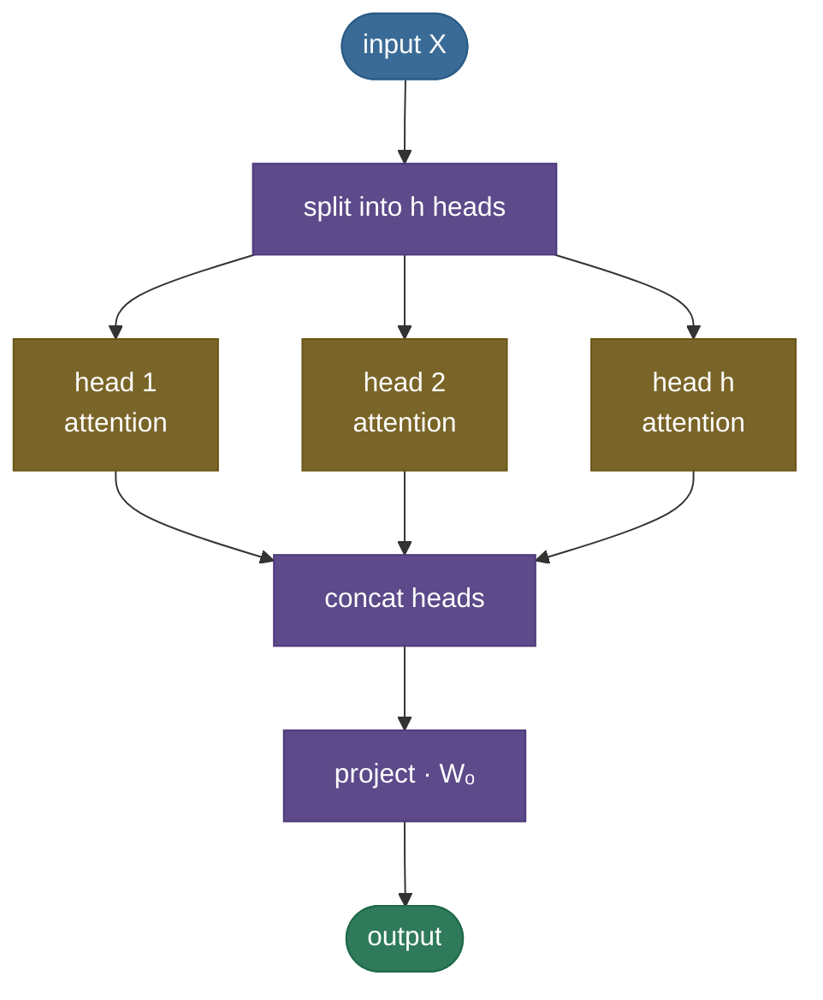

# Attention: let every token look at every other token

Picture translating a long sentence by first reading the whole thing, memorizing it as a **single mental snapshot**, and only *then* starting to write the translation — never allowed to glance back at the original. You'd nail short sentences and fall apart on long ones, because one snapshot can't hold everything. That was machine translation before 2014. **Attention** is the fix: instead of one frozen snapshot, the model gets to **look back at every input word and decide, for each output word, which inputs matter right now** — a soft, learned spotlight. That one idea dissolved the bottleneck, then became the entire engine of the transformer.

By the end of this page you'll be able to **derive scaled dot-product attention** from scratch, explain the **Query/Key/Value** roles in one breath, say exactly **why we divide by √dₖ**, distinguish **self- vs cross-attention** and **additive vs dot-product**, reason about **multi-head** attention, and connect it forward to the [KV cache](../../09.%20LLMs/concepts/05-KV-Cache.md) and [FlashAttention](../../09.%20LLMs/concepts/06-Efficient-Attention-FlashAttention.md). I'll build it the way I'd teach it at a whiteboard — the picture first, then the math, then code you can run today.

> **Note:** "attention" is one mechanism with two framings. **Cross-attention** (the original): queries come from one sequence (the decoder), keys/values from another (the encoder). **Self-attention** (the transformer's workhorse): queries, keys, and values all come from the *same* sequence — every token attends to every token, including itself. Same math; different source of Q, K, V.

---

## The problem: one fixed vector can't hold a whole sentence

Before attention, sequence-to-sequence models ([RNN/LSTM/GRU](14-RNN-LSTM-GRU.md)) translated by having an **encoder** compress the entire input into a single fixed-length **context vector**, which the **decoder** then unrolled into the output. The whole meaning of "The agreement on the European Economic Area was signed in August 1992" had to survive in one vector of, say, 512 numbers.

Two things break:

1. **The information bottleneck.** A fixed-size vector is a fixed-size bucket. The longer the sentence, the more gets crushed out — translation quality falls off a cliff as length grows.
2. **The distance problem.** Even setting capacity aside, an RNN carries information token-by-token, so a dependency between word 1 and word 30 has to survive **30 sequential hops** through the hidden state — exactly where gradients vanish.

Attention ([Bahdanau et al., 2014](https://arxiv.org/abs/1409.0473)) removes the bucket entirely: keep **all** the encoder's per-token states, and at each decoding step let the decoder build a *fresh, weighted blend* of them — heavy on the words that matter for the word it's about to produce.


---

## What it is

Attention is a **content-based, weighted lookup**. Every position emits three vectors:

- ***Query*** ($q$) — "what am I looking for?"
- ***Key*** ($k$) — "what do I offer, as a label?"
- ***Value*** ($v$) — "the actual content I'll hand over if you pick me."

A query is compared against **every** key to get a relevance score; the scores are softmaxed into weights; the output is the **weighted sum of the values**. In one line — the equation worth tattooing:

$$\text{Attention}(Q,K,V) = \text{softmax}\!\left(\frac{QK^\top}{\sqrt{d_k}}\right)V$$

That's it. Everything else — multi-head, causal masks, the KV cache — is machinery around this core.

---

## Intuition: a soft dictionary lookup

A Python dict is a **hard** lookup: a key either matches or it doesn't, and you get back exactly one value. Attention is the **soft** version: your query partially matches *every* key, and you get back a **blend** of all the values, weighted by how well each key matched. Nothing is all-or-nothing; everything is a weighted average.

Make it concrete with the classic sentence. When the model processes the word **"it"** in *"The animal didn't cross the street because it was tired,"* its query for "it" lights up most strongly on the key for **"animal"** — so "it"'s new representation is built mostly from "animal"'s value. The model has *resolved the pronoun*, purely through weighted lookup. Each row below is one token's query; the colors are how much weight it puts on each key.


> **Tip:** "Q, K, V" feels abstract until you map it to search. **Query** = your search box text. **Keys** = the titles of all documents. **Values** = the documents themselves. Attention scores your query against every title, then returns a blended summary weighted by relevance — instead of a single top hit.

---

## Why it matters

Attention didn't just patch seq2seq — it changed what neural sequence models *can* do, on three axes:

**1. Any-to-any in one hop.** In an RNN, two tokens $n$ apart are $n$ sequential steps apart. In self-attention, **every token can read every other token directly** — the path length is $O(1)$. Long-range dependencies stop being a game of telephone.

**2. Full parallelism.** An RNN must process token 1 before token 2. Self-attention computes all positions' interactions as **two big matrix multiplies** ($QK^\top$, then $\cdot V$), so the whole sequence goes through at once on a GPU. This is the property that made training billion-parameter models practical.

**3. Dynamic, content-based routing.** The weights aren't fixed — they're computed from the data every forward pass, so the same layer routes information differently for every input.


> **Note:** the costs of these gains, both worth knowing for interviews: self-attention is **$O(n^2)$ in sequence length** (every token attends to every token), which is why long context is expensive and why [FlashAttention](../../09.%20LLMs/concepts/06-Efficient-Attention-FlashAttention.md) and sparse/linear attentions exist; and it has **no inherent notion of order** (it's permutation-equivariant), which is why transformers add **positional encodings**.

---

## How it works: Q, K, V, and the four steps

Self-attention turns an input matrix $X$ (one row per token) into three projections via learned weight matrices, then runs four steps:

$$Q = XW_q,\qquad K = XW_k,\qquad V = XW_v$$

1. **Score** — every query against every key: $S = QK^\top$. Shape $(n \times n)$: entry $S_{ij}$ is how much token $i$ should attend to token $j$.
2. **Scale** — divide by $\sqrt{d_k}$ (the next section explains why).
3. **Normalize** — softmax over each **row**, so each query's weights are non-negative and sum to 1.
4. **Mix** — multiply the weights by $V$: each output row is a weighted blend of all value vectors.


> **Gotcha:** the softmax is over the **key** dimension (each query's row sums to 1), *not* the query dimension. Getting this axis wrong is the single most common attention bug — it runs without error and silently learns nothing. In the code below it's `softmax(scores, dim=-1)`.

**Causal masking.** For autoregressive generation, a token must not peek at the future. Before the softmax, set the scores for all "future" positions to $-\infty$ (so their weights become 0). That single masked-fill is the whole difference between an encoder (bidirectional) and a decoder (causal) — and it's what makes the [KV cache](../../09.%20LLMs/concepts/05-KV-Cache.md) possible.

---

## The math: why divide by √dₖ

This is the part interviewers love, because it's a one-line derivation that most people only half-remember.

Take a query $q$ and key $k$ whose entries are independent, mean 0, variance 1. Their dot product is $q\cdot k = \sum_{i=1}^{d_k} q_i k_i$. Each term $q_i k_i$ has mean 0 and variance 1, and they're independent, so:

$$\mathbb{E}[q\cdot k] = 0, \qquad \text{Var}(q\cdot k) = d_k.$$

So the raw scores have standard deviation $\sqrt{d_k}$ — they grow with head size. For $d_k = 64$ that's a spread of ±8 or more. Feed scores that large into a softmax and it **saturates**: one weight goes to ~1, the rest to ~0, and the gradient through softmax goes to **zero** — the layer stops learning. Dividing by $\sqrt{d_k}$ rescales the variance back to 1, keeping the softmax in its responsive range.


> **Note:** this is also the cleanest answer to *"additive vs dot-product attention?"* Bahdanau's original used an **additive** score (a small MLP), which is naturally well-scaled. [Vaswani et al.](https://arxiv.org/abs/1706.03762) switched to **dot-product** because it's just a matmul (far faster on GPUs) — and the $1/\sqrt{d_k}$ factor is the price of that switch: it undoes the variance blow-up that additive scoring never had.

**Multi-head attention.** One attention is one "view" of the relationships. **Multi-head** runs $h$ attentions in parallel on *different learned projections*, so different heads can specialize (one tracks syntax, another coreference, another position), then concatenates and projects:

$$\text{head}_i = \text{Attention}(XW_q^i, XW_k^i, XW_v^i), \qquad \text{MultiHead}(X) = \text{Concat}(\text{head}_1,\dots,\text{head}_h)\,W_o$$

Each head works in a smaller dimension $d_k = d_{\text{model}}/h$, so multi-head costs about the same as one full-width head but buys $h$ independent relationship patterns.

---

## Where it is used

- **Every transformer.** Encoder self-attention (BERT), decoder causal self-attention (GPT), and encoder–decoder cross-attention (T5, original NMT) are all this same mechanism.
- **Beyond text.** Vision Transformers (ViT) attend over image patches; attention shows up in speech, protein folding (AlphaFold), diffusion model backbones, and recommender systems.
- **Cross-attention as the "read" primitive.** Anywhere one stream needs to pull relevant information from another — multimodal models, retrieval-augmented generation — cross-attention is the glue.

> **Tip:** if a model needs to relate *every* element to *every* other element and you can afford $O(n^2)$, attention is almost always the right primitive. When $n$ is huge (long documents, high-res images), that's exactly when you reach for the efficiency variants below.

---

## Application: from formula to a working layer

In practice you rarely hand-roll attention — but you must know what the library is doing. The modern path:

**Step 1 — use the fused kernel.** `torch.nn.functional.scaled_dot_product_attention(Q, K, V, is_causal=...)` implements exactly the equation above with a [FlashAttention](../../09.%20LLMs/concepts/06-Efficient-Attention-FlashAttention.md)-style memory-efficient kernel. `nn.MultiheadAttention` wraps the projections + heads. Reach for these before writing your own.

**Step 2 — get the mask right.** Causal generation → causal mask; padded batches → padding mask so real tokens don't attend to padding. A wrong mask is a silent correctness bug, not a crash.

**Step 3 — know the efficiency levers** (all of which exist *because* attention is the bottleneck):



- **At inference**, cache K and V so you don't recompute the past every step — the [KV cache](../../09.%20LLMs/concepts/05-KV-Cache.md), and its memory-savers **MQA/GQA** (share K/V across heads).
- **For the $O(n^2)$ compute**, [FlashAttention](../../09.%20LLMs/concepts/06-Efficient-Attention-FlashAttention.md) (exact, IO-aware) and sparse/linear attentions (approximate).

> **Gotcha:** multi-head reshaping is the other classic bug. You split $d_{\text{model}}$ into `(n_heads, d_head)` and move heads to a batch-like dimension *before* attention, then concat back *after*. An off-by-one in those `view`/`transpose` calls produces wrong-but-plausible numbers. Always assert your output shape is back to `(seq, d_model)`.

---

## Code: build it, then check it against PyTorch

From-scratch scaled dot-product and multi-head attention, verified to match PyTorch's fused kernel. Runs on CPU in seconds.

```python
"""From-scratch scaled dot-product + multi-head attention, checked against PyTorch.
Verified on ml-py312 (torch 2.12), CPU."""
import torch, torch.nn.functional as F
torch.manual_seed(0)

def attention(Q, K, V, mask=None):
    # Q,K,V: (..., seq, d_k).  returns (..., seq, d_v) and the weights
    d_k = Q.shape[-1]
    scores = Q @ K.transpose(-2, -1) / d_k ** 0.5      # (..., seq_q, seq_k)
    if mask is not None:
        scores = scores.masked_fill(mask == 0, float("-inf"))
    weights = F.softmax(scores, dim=-1)                # softmax over KEYS (last dim)
    return weights @ V, weights

# tiny worked example: 4 tokens, d_k = 8
seq, d_k = 4, 8
Q, K, V = torch.randn(seq, d_k), torch.randn(seq, d_k), torch.randn(seq, d_k)
out, w = attention(Q, K, V)
print("attention weights (each row sums to 1):"); print(w.round(decimals=2))

# check against PyTorch's fused kernel
ref = F.scaled_dot_product_attention(Q, K, V)
print("matches torch SDPA:", torch.allclose(out, ref, atol=1e-5), "| max diff:", f"{(out-ref).abs().max():.2e}")

# causal mask: token i may only attend to j <= i
causal = torch.tril(torch.ones(seq, seq))
out_c, w_c = attention(Q, K, V, mask=causal)
print("causal weights (upper triangle is 0):"); print(w_c.round(decimals=2))

# multi-head attention
def multi_head_attention(X, Wq, Wk, Wv, Wo, n_heads):
    seq, d_model = X.shape; d_head = d_model // n_heads
    split = lambda t: t.view(seq, n_heads, d_head).transpose(0, 1)   # (h, seq, d_head)
    ctx, _ = attention(split(X @ Wq), split(X @ Wk), split(X @ Wv))  # per-head attention
    return ctx.transpose(0, 1).reshape(seq, d_model) @ Wo            # concat heads, project

d_model, n_heads = 16, 4
X = torch.randn(seq, d_model)
Wq, Wk, Wv, Wo = (torch.randn(d_model, d_model) * 0.1 for _ in range(4))
print("multi-head output shape:", tuple(multi_head_attention(X, Wq, Wk, Wv, Wo, n_heads).shape))
```

Output:

```
attention weights (each row sums to 1):
tensor([[0.12, 0.74, 0.11, 0.03],
        [0.26, 0.27, 0.17, 0.31],
        [0.34, 0.02, 0.19, 0.46],
        [0.20, 0.62, 0.10, 0.07]])
matches torch SDPA: True | max diff: 2.98e-07
causal weights (upper triangle is 0):
tensor([[1.00, 0.00, 0.00, 0.00],
        [0.49, 0.51, 0.00, 0.00],
        [0.62, 0.03, 0.35, 0.00],
        [0.20, 0.62, 0.10, 0.07]])
multi-head output shape: (4, 16)
```

> **Note:** read the **causal** weights — every row is lower-triangular and still sums to 1, because the masked (future) entries became 0 *before* the softmax renormalized. That is autoregression in one matrix, and it's the structure the [KV cache](../../09.%20LLMs/concepts/05-KV-Cache.md) exploits at inference.

---

## Recap and rapid-fire

**If you remember nothing else:** attention is a soft dictionary lookup — score a **query** against all **keys**, softmax into weights, return the weighted sum of **values**: $\text{softmax}(QK^\top/\sqrt{d_k})V$. It gives every token an $O(1)$, fully parallel, content-dependent path to every other token, which is why it replaced the RNN and became the core of the transformer.

**Quick-fire — say these out loud:**

- *What are Q, K, V?* Query = what I'm looking for; Key = what each token offers as a label; Value = the content returned. Self-attention: all three come from the same sequence.
- *Why divide by √dₖ?* Dot-product scores have variance $d_k$; without scaling, softmax saturates and gradients vanish. $1/\sqrt{d_k}$ restores unit variance.
- *Which dimension does softmax run over?* The **keys** (each query's row sums to 1).
- *Additive vs dot-product?* Additive (Bahdanau) uses an MLP scorer; dot-product (Vaswani) is a matmul — faster, but needs the √dₖ scaling.
- *Why multi-head?* $h$ parallel attentions on different projections capture different relationship types, at roughly the cost of one.
- *Self vs cross attention?* Self: Q, K, V from one sequence. Cross: Q from the decoder, K/V from the encoder.
- *Complexity?* $O(n^2 d)$ time and $O(n^2)$ memory in sequence length — the reason FlashAttention and the KV cache exist.

---

## References and further reading

The curated link library for this topic — videos, courses, articles, papers, books, and internal cross-links — lives in a companion file so it can be reused as a standalone reference list:

**→ [Attention Mechanism — references and further reading](15-Attention-Mechanism.references.md)**
