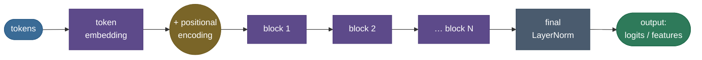
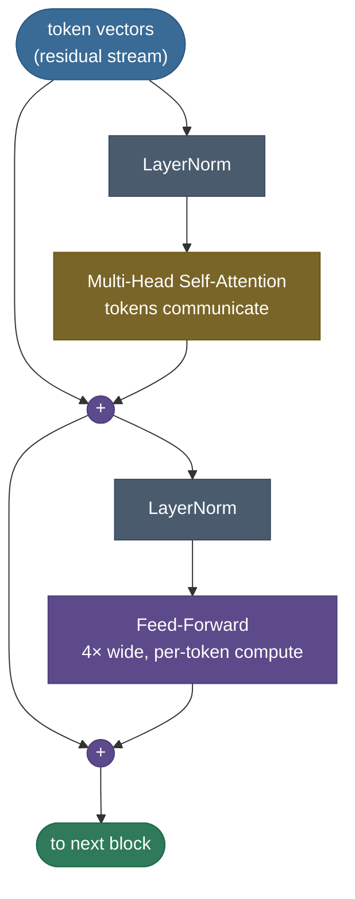
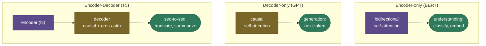

# The Transformer: attention is (almost) all you need

In 2017 a paper made a deliberately provocative claim: throw away recurrence and convolution entirely, build a sequence model out of **nothing but [attention](15-Attention-Mechanism.md) and plain feed-forward layers**, and it will train faster and work better. That model — the **transformer** — turned out to be one of the most consequential architectures in the history of computing. Every LLM you've used (GPT, Claude, Llama), every modern translation system, BERT, Vision Transformers, AlphaFold's backbone — all transformers. If attention is the *mechanism*, the transformer is the *machine* built around it.

By the end of this page you'll be able to **draw the transformer block from memory**, explain the two-part rhythm (**attention = tokens communicate; feed-forward = each token thinks**), say why we need **positional encodings**, walk the **encoder vs decoder vs encoder–decoder** split (BERT vs GPT vs T5), and account for **where the parameters live**. The intuition first, then the anatomy, then code you can run.

> **Note:** "transformer" names the *architecture*; "attention" names *one component* inside it. The other components — feed-forward layers, residual connections, layer norm, positional encodings — are what turn a clever attention operation into a trainable, scalable model. The interview answer that impresses is the one that explains those supporting parts, not just attention.

---

## The problem: attention fixed access, but recurrence was still the engine

The previous generation of models had *already* added [attention](15-Attention-Mechanism.md) — but bolted onto an **RNN**. That hybrid fixed the information-access problem yet kept the RNN's fatal flaw: **recurrence is inherently sequential.** To compute the hidden state at position $t$ you must first compute $t-1$, which needs $t-2$, all the way back. On a GPU built to do thousands of operations at once, you're forced to wait in line, one token at a time. Training on long sequences crawls.

The transformer's bet: if attention already lets every token see every other token directly, **why keep the recurrence at all?** Drop it, process the **entire sequence in parallel**, and recover the only thing recurrence gave you for free — a sense of word *order* — with an explicit **positional encoding**. That single move unlocked training at a scale that made today's LLMs possible.

> **Tip:** the cleanest one-sentence "why transformers beat RNNs": **RNNs serialize computation over the sequence; transformers parallelize it.** Same reason GPUs love them and the same reason they scale.

---

## What it is

A transformer is a **stack of identical blocks** wrapped around an embedding layer. Each block has exactly two sub-layers, each followed by a residual connection and layer normalization:

1. **Multi-head self-[attention](15-Attention-Mechanism.md)** — every token gathers information from every other token.
2. **Position-wise feed-forward network (FFN)** — a small 2-layer MLP applied to each token independently.

Because there's no recurrence to encode order, the input is **token embedding + positional encoding**. Depending on which attention mask the blocks use, you get one of three flavors:

- **Encoder** (bidirectional attention) — BERT-style; for *understanding*.
- **Decoder** (causal attention) — GPT-style; for *generation*.
- **Encoder–decoder** (encoder + a decoder that also cross-attends) — T5-style; for *seq-to-seq*.



---

## Intuition: the residual stream, communicate then compute

The clearest mental model is the **residual stream**. Picture a wide highway of token vectors running straight through the whole network from input to output. Each block doesn't *replace* what's on the highway — it **reads** from it, computes something, and **adds** the result back (that's the residual `+`). Information accumulates; nothing is destroyed.

Every block does two things, in a fixed rhythm:

- **Attention = communication.** Tokens look at each other and move information *between positions*. ("The word *it* pulls in meaning from *animal*.")
- **Feed-forward = computation.** Each token, now holding gathered context, is processed *independently* — the FFN is where the model does its per-token "thinking" and stores most of what it knows.

Mix between tokens, then think per token. Mix, think. Mix, think. $N$ times. That's the whole architecture.



> **Note:** the **residual connections** aren't decoration — they're what makes deep stacks trainable. They give gradients a direct path from the loss back to early layers (the [ResNet](https://arxiv.org/abs/1512.03385) insight), so a 96-layer transformer doesn't suffer the vanishing gradients that killed deep RNNs. Remove the residuals and a deep transformer won't train.

---

## Why it matters

**1. Parallelism → trainability at scale.** With recurrence gone, a whole sequence flows through each block as a couple of big matrix multiplies. This is the property that made it economically possible to train models on trillions of tokens.

**2. It scales predictably.** The transformer turned out to obey clean **scaling laws** — add parameters, data, and compute in the right ratio and loss falls on a smooth power-law curve. That predictability is *why* labs were willing to spend nine figures training larger ones; the transformer is the architecture that made "just make it bigger" a winning strategy.

**3. It's universal.** The same block, fed patches instead of tokens, is a Vision Transformer; fed amino acids, it's a protein model; fed audio frames, a speech model. One architecture swallowed most of deep learning.


> **Tip:** a number worth memorizing: a transformer layer has roughly **12·d_model²** parameters (4·d² for the four attention projections + 8·d² for the FFN at the standard 4× width). Multiply by layers for a quick parameter estimate — and notice the FFN, not attention, is the bigger half.

---

## How it works: positional encoding, then mix-and-think blocks

**Step 0 — give the model a sense of order.** Self-attention is *permutation-equivariant*: shuffle the input tokens and the outputs shuffle the same way — it has no built-in notion of "first" vs "last." So we **add a positional encoding** to each token embedding. The original transformer used fixed **sinusoidal** encodings: each dimension is a sine/cosine wave of a different frequency, so every position gets a unique, smooth fingerprint that the model can use to reason about distance.


**Steps 1…N — the blocks.** Each block applies, in order: `LayerNorm → multi-head attention → add residual`, then `LayerNorm → FFN → add residual`. Stacking $N$ of these (12 for BERT-base, 96+ for the largest LLMs) builds depth. A final layer norm and an output projection (to vocabulary logits, or to a classification head) finish the model.

**Encoder, decoder, or both** — the only structural difference is the attention mask and whether a cross-attention sub-layer is present:



> **Gotcha:** modern transformers use **pre-LN** (LayerNorm *before* each sub-layer, as drawn above), not the **post-LN** of the original 2017 paper (LayerNorm *after*). Pre-LN keeps the residual stream clean and makes deep models train stably without a finicky learning-rate warmup. If you implement post-LN at depth and training diverges, this is usually why.

---

## The math: the pieces, defined

**Positional encoding** (sinusoidal). For position $pos$ and dimension $i$ (of $d_{\text{model}}$):

$$PE_{(pos,\,2i)} = \sin\!\left(\frac{pos}{10000^{2i/d}}\right), \qquad PE_{(pos,\,2i+1)} = \cos\!\left(\frac{pos}{10000^{2i/d}}\right)$$

The geometric range of wavelengths (short for low dims, long for high dims) lets the model express *relative* offsets as a fixed linear map — and, unlike a learned table, it extrapolates to lengths unseen in training.

**The block** (pre-LN form). With $\text{LN}$ = layer norm and $\text{MHA}$ = multi-head attention:

$$x \leftarrow x + \text{MHA}(\text{LN}(x)), \qquad x \leftarrow x + \text{FFN}(\text{LN}(x))$$

**Feed-forward.** Two linear layers with a non-linearity, widening to $d_{ff} = 4\,d_{\text{model}}$ and back:

$$\text{FFN}(x) = W_2\,\phi(W_1 x + b_1) + b_2, \qquad \phi \in \{\text{ReLU}, \text{GELU}\}$$

**Parameter budget per block.** Attention is $4 d^2$ (the $W_q, W_k, W_v, W_o$ projections); the FFN is $2 \cdot d \cdot 4d = 8 d^2$. Total $\approx 12\,d_{\text{model}}^2$ per layer — and the FFN is two-thirds of it.

---

## Where it is used

- **Decoder-only (GPT, Llama, Claude)** — autoregressive generation; the dominant LLM design. Its inference loop is exactly what the [KV cache](../../09.%20LLMs/concepts/05-KV-Cache.md) accelerates.
- **Encoder-only (BERT, RoBERTa)** — bidirectional understanding for classification, retrieval, embeddings.
- **Encoder–decoder (T5, BART, Whisper)** — translation, summarization, speech — anywhere you map one full sequence to another.
- **Beyond text** — Vision Transformers (image patches), diffusion model backbones, AlphaFold, multimodal models. The block barely changes.

---

## Application: building and choosing one

**Step 1 — pick the shape from the task.** Generation → decoder-only. Classification/embedding → encoder-only. Seq-to-seq with distinct input/output → encoder–decoder. For most "build an LLM" goals today, the answer is **decoder-only**.

**Step 2 — use the framework block, know its knobs.** `nn.TransformerEncoderLayer` / `nn.TransformerDecoderLayer` give you a tuned block; the hyperparameters you actually set are `d_model`, `n_heads` (so `d_head = d_model / n_heads`), `d_ff` (usually `4 × d_model`), `n_layers`, and the choice of **pre-LN** (`norm_first=True` — prefer it).

**Step 3 — wire in the modern essentials.** Real LLMs swap a few originals: **rotary positional embeddings (RoPE)** instead of sinusoidal, **RMSNorm** instead of LayerNorm, **GQA** attention for a smaller [KV cache](../../09.%20LLMs/concepts/05-KV-Cache.md), and [FlashAttention](../../09.%20LLMs/concepts/06-Efficient-Attention-FlashAttention.md) for the $O(n^2)$ compute. The skeleton is unchanged; these are bolt-on upgrades.

> **Gotcha:** the FFN holds most of the parameters and most of the FLOPs at inference for short sequences — but as context grows, the $O(n^2)$ **attention** term takes over. Which one is your bottleneck depends on sequence length, and it decides whether you reach for FFN-side tricks (quantization, MoE) or attention-side tricks (FlashAttention, sparse attention).

---

## Code: a transformer block from scratch

A pre-LN encoder/decoder block built from the [attention](15-Attention-Mechanism.md) you already saw, with a parameter count that matches the diagram. Runs on CPU in seconds.

```python
"""A transformer block from scratch (pre-LN). Verified on ml-py312 (torch 2.12), CPU."""
import torch, torch.nn as nn, torch.nn.functional as F
torch.manual_seed(0)

class MultiHeadSelfAttention(nn.Module):
    def __init__(self, d_model, n_heads):
        super().__init__()
        self.h, self.dh = n_heads, d_model // n_heads
        self.Wq = nn.Linear(d_model, d_model, bias=False)
        self.Wk = nn.Linear(d_model, d_model, bias=False)
        self.Wv = nn.Linear(d_model, d_model, bias=False)
        self.Wo = nn.Linear(d_model, d_model, bias=False)
    def forward(self, x, causal=False):
        B, T, D = x.shape
        split = lambda t: t.view(B, T, self.h, self.dh).transpose(1, 2)   # (B,h,T,dh)
        q, k, v = split(self.Wq(x)), split(self.Wk(x)), split(self.Wv(x))
        ctx = F.scaled_dot_product_attention(q, k, v, is_causal=causal)
        return self.Wo(ctx.transpose(1, 2).reshape(B, T, D))             # concat heads, project

class TransformerBlock(nn.Module):
    """Pre-LN: x = x + Attn(LN(x)); x = x + FFN(LN(x))."""
    def __init__(self, d_model, n_heads, d_ff):
        super().__init__()
        self.ln1, self.ln2 = nn.LayerNorm(d_model), nn.LayerNorm(d_model)
        self.attn = MultiHeadSelfAttention(d_model, n_heads)
        self.ffn = nn.Sequential(nn.Linear(d_model, d_ff), nn.GELU(), nn.Linear(d_ff, d_model))
    def forward(self, x, causal=False):
        x = x + self.attn(self.ln1(x), causal=causal)   # communicate between tokens
        x = x + self.ffn(self.ln2(x))                    # think per token
        return x

d_model, n_heads, d_ff = 768, 12, 3072
block = TransformerBlock(d_model, n_heads, d_ff)
x = torch.randn(2, 16, d_model)
print("output shape:", tuple(block(x).shape), "== input: the residual stream keeps its width")

attn_p = sum(p.numel() for p in block.attn.parameters())
ffn_p  = sum(p.numel() for p in block.ffn.parameters())
print(f"attention: {attn_p/1e6:.2f}M (4·d²)  |  FFN: {ffn_p/1e6:.2f}M (~2× attention)  |  block ≈ {(attn_p+ffn_p)/1e6:.2f}M")
# flip encoder <-> decoder with one flag:
print("decoder (causal) output:", tuple(block(x, causal=True).shape))
```

Output:

```
output shape: (2, 16, 768) == input: the residual stream keeps its width
attention: 2.36M (4·d²)  |  FFN: 4.72M (~2× attention)  |  block ≈ 7.08M
decoder (causal) output: (2, 16, 768)
```

> **Note:** the only difference between a GPT block and a BERT block in this code is the single `causal=` flag on the attention — one masks the future, one doesn't. Everything else is identical. That's how unified the architecture really is.

---

## Recap and rapid-fire

**If you remember nothing else:** a transformer is a stack of identical blocks on a **residual stream**, each block doing **multi-head attention (tokens communicate) → feed-forward (each token computes)**, with residuals + layer norm holding it together and a **positional encoding** supplying the order that dropping recurrence threw away. No recurrence means full parallelism, which means scale, which means LLMs.

**Quick-fire — say these out loud:**

- *Two sub-layers of a block?* Multi-head self-attention, then a position-wise feed-forward network — each with a residual connection and layer norm.
- *Why positional encodings?* Self-attention is permutation-equivariant (no order); the encoding injects position.
- *Encoder vs decoder vs enc-dec?* Bidirectional (BERT) vs causal (GPT) vs encoder + cross-attending causal decoder (T5).
- *Where do the parameters live?* The FFN — about 2× the attention; ≈12·d² per layer total.
- *Pre-LN vs post-LN?* Pre-LN (norm before the sub-layer) trains deep models stably; it's the modern default.
- *Why did it beat RNNs?* It parallelizes computation over the sequence instead of serializing it — so it trains fast and scales.
- *What makes deep stacks trainable?* Residual connections give gradients a direct path to early layers.

---

## References and further reading

The curated link library for this topic — videos, courses, articles, papers, books, and internal cross-links — lives in a companion file so it can be reused as a standalone reference list:

**→ [Transformer Architecture — references and further reading](16-Transformer-Architecture.references.md)**
