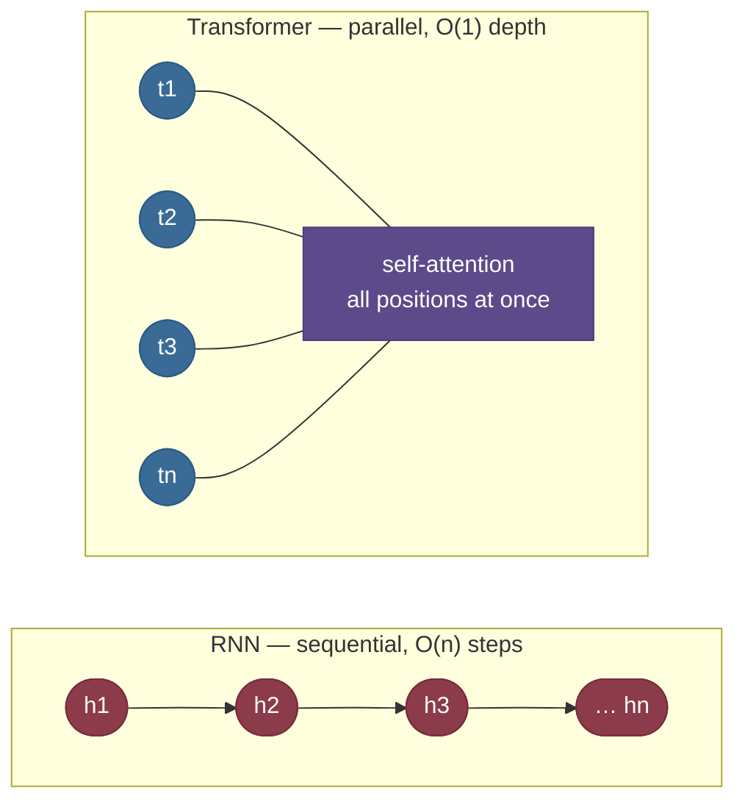
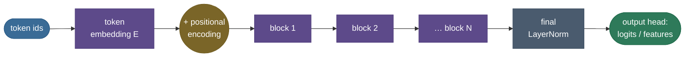
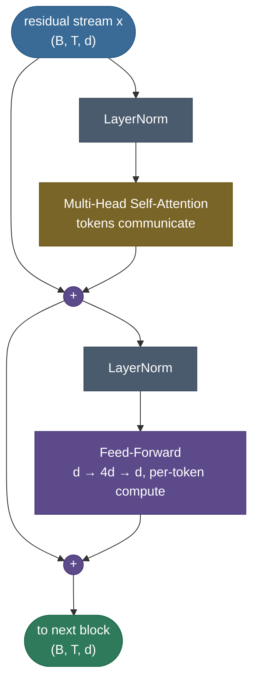
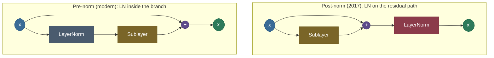
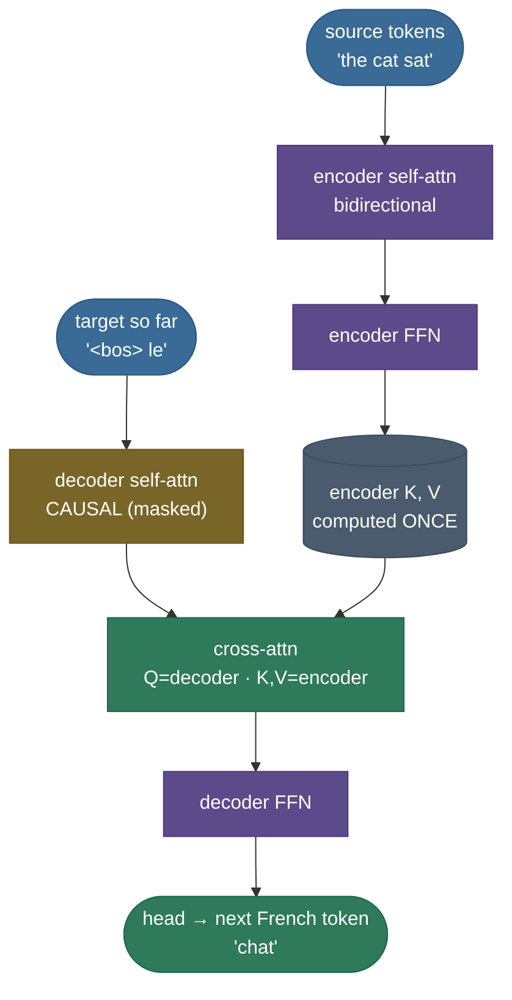
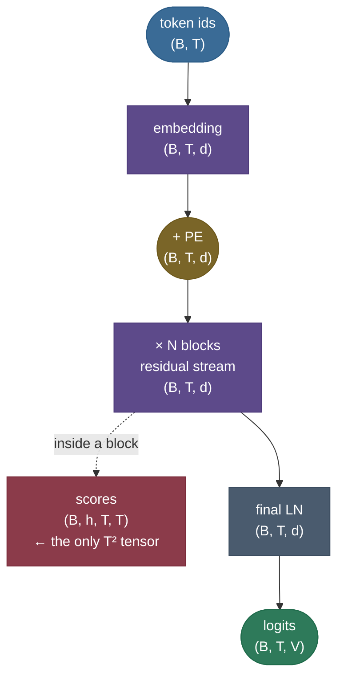
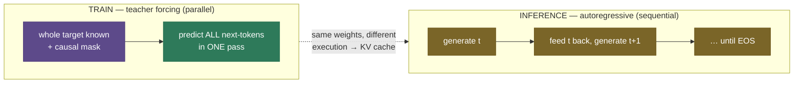
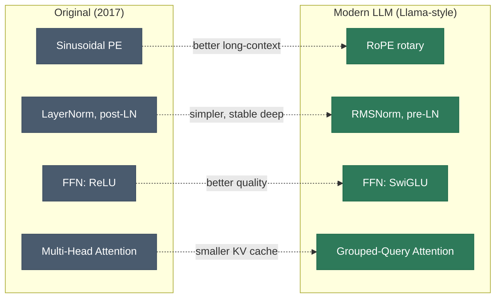

# The Transformer: attention is (almost) all you need

In 2017 a paper made a deliberately provocative claim: throw away recurrence and convolution entirely, build a sequence model out of **nothing but [attention](15-Attention-Mechanism.md) and plain feed-forward layers**, and it will train faster and work better. That model — the **transformer** — became one of the most consequential architectures in computing. Every LLM you've used (GPT, Claude, Llama), every modern translation system, BERT, Vision Transformers, AlphaFold's backbone, Whisper, Stable Diffusion's text encoder — all transformers. If [attention](15-Attention-Mechanism.md) is the *mechanism*, the transformer is the *machine* built around it: the embedding layer that gets tokens onto the highway, the feed-forward networks that do the thinking, the residual connections and normalization that keep a hundred-layer stack trainable, the positional encoding that smuggles in word order, and the output head that turns vectors back into tokens.

This page is the complete tour of that machine. The [attention math](15-Attention-Mechanism.md) — scaled dot-product, multi-head, masks, $\sqrt{d_k}$ — lives on its **own page**; here we *use* it as a component and spend our depth on everything around it: the block, the stack, the three family shapes, the data flow with shapes, the parameter and FLOP accounting, and why the whole thing parallelizes. By the end you'll be able to:

- **draw the transformer block from memory** and write its exact pre-norm and post-norm equations;
- explain the **position-wise feed-forward network** — the $d \to 4d \to d$ expansion — and **derive that it holds ~⅔ of every block's parameters**;
- explain **residual connections** and **pre- vs post-norm** placement, and why pre-norm trains deep stacks stably;
- trace the full forward path **token ids → embedding + positional encoding → N blocks → final norm → logits**, with **tensor shapes at every step**;
- distinguish the three families — **encoder–decoder (T5), encoder-only (BERT), decoder-only (GPT)** — and derive where the decoder's masked self-attention and cross-attention get their Q, K, V;
- **compute the parameter budget** of a block and a full model by hand (≈$12d^2$/layer + $Vd$ embedding), and reproduce GPT-2-small's 124M;
- derive the **attention-vs-FFN FLOP crossover** ($n = 4d$) and say which term dominates in any regime;
- explain **why it parallelizes** in training and why inference is sequential (→ the [KV cache](../../09.%20LLMs/concepts/05-KV-Cache.md));
- name the **modern components** (RoPE, RMSNorm, SwiGLU, GQA, MoE) and *why* each replaced the 2017 original.

Intuition first, then the anatomy, then code you can run.

> **Note:** "transformer" names the *architecture*; "attention" names *one component* inside it. The other parts — feed-forward layers, residual connections, normalization, positional encodings, the embedding and output head — are what turn a clever attention operation into a trainable, scalable model. The answer that impresses in an interview explains those supporting parts, not just attention; most of this page is exactly those parts.

---

## The problem: attention fixed access, but recurrence was still the engine

The previous generation had *already* added [attention](15-Attention-Mechanism.md) — but bolted onto an **RNN**. That hybrid (Bahdanau 2014) fixed information *access* — the decoder could finally look back at every input token instead of squeezing the whole sentence through one fixed context vector — yet it kept the RNN's fatal flaw underneath: **recurrence is inherently sequential.**

Think about what computing an RNN's hidden states actually requires. To get the state at position $t$ you need the state at $t-1$; to get $t-1$ you need $t-2$; and so on back to the start. There is no way to compute position 50's hidden state without first computing positions 1 through 49 *in order*. On a GPU built to do tens of thousands of multiply-adds **simultaneously**, that is a catastrophe: the hardware sits idle waiting for a chain of dependencies to resolve, one token at a time. A sequence of length $n$ costs $O(n)$ **non-parallelizable** sequential steps. Training on long sequences crawls, and the crawl gets worse the longer the sequence.

There's a second, related wound. Even with attention layered on top, the RNN's hidden state is still the conduit for *local* information, and a dependency between token 1 and token 100 has to survive ~100 sequential hops through that state — exactly the path where gradients vanish or explode (the reason [LSTMs and GRUs](14-RNN-LSTM-GRU.md) exist at all, and why even they strain at very long range).

The transformer's bet, stated in one sentence: **if attention already lets every token see every other token directly, why keep the recurrence at all?** Drop it. Process the **entire sequence in parallel** as a couple of big matrix multiplies, give every pair of tokens an $O(1)$ direct path, and recover the *only* thing recurrence gave you for free — a sense of word **order** — with an explicit **positional encoding** added at the input. That single trade ("replace a sequential recurrence with a parallel attention + an explicit position signal") is the entire conceptual leap of *Attention Is All You Need*.



> **Tip:** the cleanest one-sentence "why transformers beat RNNs": **RNNs serialize computation over the sequence; transformers parallelize it.** Same reason GPUs love them, same reason they scale, same reason a 2017 idea ate the entire field. Memorize that sentence and the rest of this page is its justification.

> **Note:** "process the whole sequence in parallel" is a **training/prefill** statement, not an inference one. When a decoder-only model *generates*, it still emits one token at a time — the parallelism returns only because each generated token's keys and values can be cached. That training-vs-inference asymmetry is a recurring theme below and the entire reason the [KV cache](../../09.%20LLMs/concepts/05-KV-Cache.md) exists.

---

## What it is

A transformer is a **stack of $N$ identical blocks** wrapped around an embedding layer at the input and an output head at the top. Each block has exactly two sub-layers, each wrapped in a residual connection and a normalization:

1. **Multi-head self-[attention](15-Attention-Mechanism.md)** — every token gathers information from every other token (the *communication* step).
2. **Position-wise feed-forward network (FFN)** — a small MLP applied to each token independently (the *computation* step).

Because there's no recurrence to encode order, the input to the first block is **token embedding + positional encoding**. Depending only on the **attention mask** (and whether a cross-attention sub-layer is present), the same block gives you one of three flavors: **encoder** (bidirectional, for understanding), **decoder** (causal, for generation), or **encoder–decoder** (for sequence-to-sequence). That is the whole architecture — and the astonishing thing is how little changes between a translation model, BERT, and GPT.



---

## Intuition: the residual stream, communicate then compute

> **See it live:** **[bbycroft.net/llm](https://bbycroft.net/llm)** is an animated 3D walk through an entire small GPT — embeddings, the residual stream, each block's attention and FFN, layer by layer; the **[Transformer Explainer](https://poloclub.github.io/transformer-explainer/)** runs a real GPT-2 in the browser. Spending two minutes in either makes the rest of this page concrete in a way no static diagram can.

The clearest mental model is the **residual stream**. Picture a wide highway of token vectors running straight through the network from input to output — one lane per token, each lane $d$ numbers wide. Each block doesn't *replace* what's on the highway; it **reads** a copy, computes something, and **adds** the result back (the residual `+`). Information accumulates down the stack; nothing is destroyed. The highway's width never changes — input $d$, output $d$ — which is exactly why you can stack $N$ identical blocks: each one's output is shaped to be the next one's input.

Every block does two things, in a fixed rhythm:

- **Attention = communication.** Tokens look at each other and move information *between positions*. After attention, the vector at position $i$ has mixed in content from the tokens it found relevant.
- **Feed-forward = computation.** Each token, now holding gathered context, is processed *independently* by the same small MLP — the FFN is where the model does its per-token "thinking" and, as we'll derive, stores most of what it knows.

Mix between tokens, then think per token. Mix, think. Mix, think. $N$ times. That two-beat rhythm is the soul of the architecture.

A second framing makes it click for systems-minded readers: a transformer is a **differentiable, data-dependent router**. At each block, attention decides — *from the content of the tokens themselves, freshly each forward pass* — which positions send information where (the routing table is the softmax weights), and the FFN decides what to compute once the information has arrived. Unlike a CNN, whose connectivity (the kernel) is fixed regardless of input, the transformer's wiring is recomputed for every input. That's why the same weights handle "the cat sat" and a Python program and a protein: the *structure* of the computation is read off the data, not baked into the architecture. Hold both pictures — residual highway (what flows) and dynamic router (how it's wired) — and almost every design choice on this page becomes obvious.



> **Note:** the **residual connections** (cross-link [Residual / Skip Connections](18-Residual-Skip-Connections.md)) aren't decoration — they're what makes deep stacks trainable. They give gradients a direct path from the loss back to early layers (the [ResNet](https://arxiv.org/abs/1512.03385) insight), so a 96-layer transformer doesn't suffer the vanishing gradients that killed deep RNNs. Remove the residuals and a deep transformer simply won't train. The residual stream framing — read, transform, add back — is also why mechanistic-interpretability work treats each block as *writing into* a shared communication channel rather than overwriting it.

> **Note:** the residual's *partner* is **initialization**. Because every block *adds* to the stream, the stream's variance would otherwise grow with depth; deep transformers counter this by scaling the residual-branch output weights down by ≈$1/\sqrt{2N}$ ($N$ = layers, as in GPT-2). Pre-norm placement plus this init are together why 100-plus-layer stacks train without diverging.

There's one more intuition the residual stream buys you: **what different depths learn.** Because each block only *adds* a small contribution, information builds up gradually, and empirically the stack organizes into a rough hierarchy — early layers resolve surface and syntactic structure (token identity, part of speech, local agreement), middle layers handle semantics and longer-range relations (coreference, who-did-what), and late layers assemble the task-specific, abstract features the output head needs. It isn't a hard partition — the residual stream lets any layer read what any earlier layer wrote — but the gradient of abstraction with depth is real and is why **probing** a frozen transformer at different layers recovers different linguistic properties, and why fine-tuning often touches the later layers most. The communicate-then-compute rhythm, repeated $N$ times on a shared stream, is what produces that emergent depth-wise specialization.

---

## The transformer block, dissected

Everything important happens inside one block, so we'll take it apart sub-layer by sub-layer. We use the **pre-norm** form (norm *before* each sub-layer) because it's the modern default; the post-norm original is one line away and we give it below.

### Sub-layer 1 — multi-head self-attention (the communication step)

This is the [attention](15-Attention-Mechanism.md) page's subject, so here we only place it in the block and note what the block needs from it. Self-attention projects the residual stream $x$ into queries, keys, and values, scores every query against every key, softmaxes, and returns a weighted blend of values — $\text{softmax}(QK^\top/\sqrt{d_k})\,V$ — run in parallel across $h$ heads and re-projected by $W_o$. In the block it's wrapped as $x \leftarrow x + \text{MHA}(\text{LN}(x))$.

The two facts the block cares about: (1) MHA is the **only** place tokens exchange information — the FFN never looks across positions — so all "context" enters here; and (2) its parameters are the four projection matrices $W_q, W_k, W_v, W_o$, each $d \times d$, for **$4d^2$ parameters** per block (derived below). The mask plugged into this sub-layer is the single switch that turns a BERT block into a GPT block. *(Full derivation of scaled dot-product, the $\sqrt{d_k}$ scaling, multi-head, and masking is on the [Attention Mechanism](15-Attention-Mechanism.md) page — don't re-derive it; point to it.)*

### Sub-layer 2 — the position-wise feed-forward network (the computation step)

After attention has mixed context into each position, the FFN processes **each position independently and identically** with a two-layer MLP that widens to an inner dimension $d_{ff}$ and projects back:

$$\text{FFN}(x) = W_2\,\phi(W_1 x + b_1) + b_2, \qquad W_1 \in \mathbb{R}^{d \times d_{ff}},\ W_2 \in \mathbb{R}^{d_{ff} \times d},\ \phi \in \{\text{ReLU}, \text{GELU}, \text{SwiGLU}\}$$

Three things make the FFN matter more than it looks:

1. **"Position-wise" means the same MLP at every position.** There is no interaction between tokens here — it's the *same* $W_1, W_2$ applied to the vector at position 1, position 2, …, position $T$. In tensor terms it's just a batched linear over the time axis; that's why it parallelizes trivially. The work happens **per token**, which is exactly why it's $O(n d^2)$ (linear in $n$) while attention is $O(n^2 d)$.

2. **The $d \to 4d \to d$ expansion.** The standard inner width is $d_{ff} = 4d$ (Vaswani used $d=512, d_{ff}=2048$; BERT-base $768 \to 3072$; GPT-3 $12288 \to 49152$). The FFN projects *up* into a 4× wider space, applies the nonlinearity there, then projects back down. That wide hidden layer is where the model has room to compute rich nonlinear features of each token's gathered context. A useful framing from interpretability: $W_1$'s rows act like a set of $d_{ff}$ "feature detectors" (keys), the nonlinearity gates which fire, and $W_2$'s columns are the "values" written back — an associative key-value memory operating per token. *Why 4 specifically?* It's an empirical sweet spot, not a derivation: narrower than ~$2d$ starves capacity, much wider than $4d$ gives diminishing returns at growing cost. The wide-then-narrow shape matters because the nonlinearity only does useful work in the *expanded* space — projecting up first gives it room, then $W_2$ compresses the result back onto the residual stream's fixed width.

3. **It holds most of the block's parameters — derive it.** With $d_{ff} = 4d$:
   $$\underbrace{|W_1| + |W_2|}_{\text{FFN}} = d \cdot 4d + 4d \cdot d = 8d^2, \qquad \underbrace{|W_q|+|W_k|+|W_v|+|W_o|}_{\text{attention}} = 4 \cdot d^2 = 4d^2.$$
   So the FFN carries **$8d^2$** parameters to attention's **$4d^2$** — *twice as many*, i.e. **~⅔ of every block's ~$12d^2$ parameters live in the FFN.** This is why people say "most of an LLM's knowledge is in the MLPs": both the parameter count and the editing/interpretability evidence point there.


> **Tip:** a number worth memorizing: a transformer layer has roughly **$12\,d^2$** parameters — $4d^2$ for the four attention projections + $8d^2$ for the FFN at 4× width. Multiply by the number of layers for a quick model-size estimate, and remember the FFN, not attention, is the bigger (⅔) half. The code section measures this exactly: 2.36M attention + 4.72M FFN per BERT-base block.

> **Gotcha:** "the FFN is just an MLP, it can't matter much" is wrong on two counts. It's two-thirds of the parameters, *and* it's the only nonlinear per-token transform in the whole architecture — attention is (softmax aside) a linear mixing of values. Strip the FFNs out and a transformer collapses toward a stack of linear mixers; the model loses most of its expressive power. The FFN is where representation actually happens.

The nonlinearity $\phi$ inside the FFN has its own short evolution worth knowing. The 2017 paper used **ReLU** ($\max(0,x)$) — simple, but its hard zero discards information and its gradient is dead for negative inputs. BERT and GPT moved to **GELU** ($x \cdot \Phi(x)$, a smooth, probabilistically-motivated gate) which trains a touch better. Modern LLMs use **SwiGLU**, a *gated* unit that splits the up-projection into two halves and multiplies them ($\text{Swish}(xW_1) \odot xW_3$), letting the network learn a data-dependent gate per feature; it consistently beats a plain MLP at equal parameters and is the current default (Llama, PaLM, Mistral). The trend is uniform: **smoother, gated nonlinearities edge out the hard ReLU** — small individually, but they compound across hundreds of layers. (Full treatment on the [Activation Functions](03-Activation-Functions.md) page.)

### Sub-layer wiring — residual + normalization

Each sub-layer is wrapped in a **residual add** and a **normalization**. The two standard wirings differ only in *where the norm sits*:

$$\textbf{Post-norm (2017 original):}\quad x \leftarrow \text{LN}\big(x + \text{Sublayer}(x)\big)$$
$$\textbf{Pre-norm (modern default):}\quad x \leftarrow x + \text{Sublayer}\big(\text{LN}(x)\big)$$

For a full block, pre-norm expands to the two lines you should be able to write from memory:

$$x \leftarrow x + \text{MHA}\big(\text{LN}_1(x)\big), \qquad x \leftarrow x + \text{FFN}\big(\text{LN}_2(x)\big).$$

The difference is subtle on paper but decisive in practice. In **post-norm**, the normalization sits *on* the residual path — every residual add is immediately re-normalized, so the clean "identity highway" of the residual stream is interrupted at every sub-layer. Gradients flowing back must pass *through* each LayerNorm, and in deep stacks this makes early training unstable: the original transformer needed a careful **learning-rate warmup** schedule to avoid diverging. In **pre-norm**, the normalization sits *inside* the residual branch — the residual stream itself is never normalized, so there's an uninterrupted additive path from the loss all the way to the embeddings. That clean path is what lets you train 100+ layer models stably, often without warmup.



> **Note:** the **normalization** itself (cross-link [Normalization](11-Normalization.md)) standardizes each token's vector to zero mean and unit variance, then rescales with learned $\gamma, \beta$. Transformers use **LayerNorm** (per-token, over the feature axis) — *not* BatchNorm — because the statistics must not depend on other tokens in the batch or on sequence length, which would be unstable for variable-length text and wrong at inference with batch size 1. Modern LLMs swap in **RMSNorm** (normalize by root-mean-square only, no mean subtraction, no bias) — cheaper, equally effective.

> **Tip:** if a deep **post-norm** transformer diverges early in training, the fix is almost always one of: add learning-rate warmup, lower the LR, or switch to **pre-norm**. "Deep model won't train, no warmup" → suspect post-norm. This is a very common practical interview probe, and the [Xiong et al. 2020](https://arxiv.org/abs/2002.04745) paper is the citation.

> **Gotcha:** pure pre-norm has one known downside — because every block's output is *added* to an un-normalized stream, the stream's magnitude grows with depth, and in very deep models this can slightly under-use the later layers. Production stacks address it with the $1/\sqrt{2N}$ residual scaling above, or hybrids (e.g. a final LN, or "sandwich"/DeepNorm variants). The headline still holds: **pre-norm is the safe default; post-norm needs care.**

---

## Positional encodings: why order has to be injected

Self-attention is **permutation-equivariant** — shuffle the input tokens and the outputs shuffle exactly the same way, with *identical values*. The reason is structural: attention computes $\text{softmax}(QK^\top/\sqrt{d_k})V$, and every term in it is symmetric in position — token $j$'s contribution to token $i$ depends only on the *content* of $i$ and $j$, never on *where* they sit. So a raw transformer literally cannot tell "dog bites man" from "man bites dog"; to it both are the same bag of three vectors. Order has to be **added explicitly** at the input.

Four schemes, in rough historical order (full treatment on the [Positional Encoding](17-Positional-Encoding.md) page — summarized here):

- **Sinusoidal (Vaswani 2017).** Fixed sine/cosine waves of geometric frequencies added to the embedding: $PE_{(pos,\,2i)} = \sin\!\big(pos/10000^{2i/d}\big)$, $PE_{(pos,\,2i+1)} = \cos\!\big(pos/10000^{2i/d}\big)$. Each position gets a unique smooth code; because $PE_{pos+k}$ is a linear function of $PE_{pos}$, the model can learn to attend by *relative* offset, and it extrapolates somewhat past the training length.
- **Learned absolute (BERT, GPT-2).** A trainable embedding per position, added like the token embedding. Simple and effective, but it **cannot extrapolate** beyond the maximum trained length — position 1025 was never seen, so its vector is undefined.
- **RoPE — rotary (GPT-NeoX, Llama, most modern LLMs).** *Rotate* the query and key vectors by a position-dependent angle, so the attention dot product $q_i \cdot k_j$ depends only on the **relative** offset $i-j$. Strong long-context behavior and the current default.
- **ALiBi.** Add a linear, head-specific **distance penalty** directly to the attention scores — no position embeddings at all — with excellent length extrapolation.


> **Note:** the move from **absolute** (sinusoidal/learned, *added to the embedding* at the input) to **relative** (RoPE/ALiBi, *applied inside attention*) is one of the biggest practical upgrades in modern LLMs, because relative positions generalize far better to sequences longer than those seen in training — the property that makes 128K-context models possible.

> **Gotcha:** with **RoPE/ALiBi** there is no vector added at the input at all — position is injected *inside* the attention sub-layer (rotating Q/K, or biasing scores). So "the transformer adds a positional encoding to the embedding" is only literally true for the *absolute* schemes; for the modern relative ones, position lives in the attention computation. Worth stating precisely.

---

## From tokens to logits: embeddings and the output head

Before and after the block stack sit pieces that are easy to overlook but always asked about:

- **Tokenization.** Text is split into subword **tokens** (BPE / WordPiece / SentencePiece) — a vocabulary of ~30k–256k pieces balancing sequence length against vocabulary size. Subword units mean rare and unseen words still decompose into known pieces, so the model never hits a true out-of-vocabulary wall.
- **Token embedding.** Each token id indexes a learned **embedding matrix** $E \in \mathbb{R}^{V \times d}$, turning the id into a $d$-dimensional vector — the first thing placed on the residual stream. This is a pure lookup: id $7$ returns row $7$ of $E$.
- **Output head.** After the final norm, a linear projection (the "unembedding") maps each position's $d$-vector to **$V$ logits**, and softmax turns them into a next-token distribution (for a decoder) or class scores (for an encoder's task head).
- **Weight tying.** The output projection often **shares weights with the input embedding** ($\text{logits} = x\,E^\top$), saving a full $V \times d$ matrix (huge for large vocabularies) and usually improving quality — the same notion of "what this token means" is reused to read tokens in and to write them out.

> **Tip:** for a quick parameter estimate of an LLM, don't forget the **embedding/output matrix**: $V \times d$. For a 256k vocabulary at $d=4096$ that's ~1B parameters before any transformer blocks — which is exactly why weight tying matters, and why small models are dominated by their embeddings while large models are dominated by their blocks (we make this precise in the parameter-budget section).

---

## The three family shapes: encoder–decoder, encoder-only, decoder-only

The single most clarifying fact about transformers: **the block is the same in all three families.** What changes is (a) the **attention mask** and (b) whether a **cross-attention** sub-layer is present. Each shape pairs naturally with a training objective.

```mermaid
graph TD
    subgraph ED["Encoder–Decoder (T5, original NMT) — seq2seq"]
    EX["encoder stack<br/>bidirectional self-attn"]:::process --> EXO[("encoder output<br/>K, V")]:::frozen
    EDC["decoder stack<br/>masked self-attn + cross-attn"]:::amber
    EXO --> EDC
    EDC --> EDU(["denoising / translation:<br/>generate target seq"]):::out
    end
    subgraph EO["Encoder-only (BERT) — understanding"]
    EB["bidirectional<br/>self-attention"]:::process --> EBU(["MLM:<br/>predict masked tokens"]):::out
    end
    subgraph DO["Decoder-only (GPT, Llama) — generation"]
    DB["causal<br/>self-attention"]:::amber --> DBU(["causal LM:<br/>predict next token"]):::out
    end

    classDef process fill:#5D4A8A,stroke:#4D3A7A,color:#fff
    classDef amber fill:#7A6528,stroke:#6A5518,color:#fff
    classDef frozen fill:#4A5B6E,stroke:#3A4B5E,color:#fff
    classDef out fill:#2E7A5A,stroke:#1E6A4A,color:#fff
```



### Encoder–decoder (the original, 2017)

The shape from *Attention Is All You Need*, built for **sequence-to-sequence** tasks where input and output are distinct sequences (translate English → German). It has **two stacks**:

- The **encoder** reads the whole source with **bidirectional** self-attention (no mask — every source token sees every other) and produces a set of contextual vectors, $K$ and $V$, summarizing the input.
- The **decoder** generates the target one token at a time, and each decoder block has **three** sub-layers: (1) **masked self-attention** over the tokens generated *so far* (causal — can't peek at the future), (2) **cross-attention**, where the decoder's queries attend over the **encoder's** keys and values, and (3) the FFN.

This is the natural home for translation and summarization, where the output must repeatedly *read* a fixed input. Modern examples: **T5, BART, Whisper** (speech → text).

### Encoder-only (BERT, 2018)

Keep only the encoder stack: **bidirectional** self-attention everywhere, no causal mask, no generation. Because every token sees the entire sequence in both directions, encoder-only models build the richest possible *understanding* of fixed text — ideal for **classification, retrieval, embeddings, token tagging**. They are trained with **masked language modeling (MLM)**: hide ~15% of tokens and predict them from *both* sides. The cost: they aren't natural generators (you'd have to fill blanks, not extend text). Examples: **BERT, RoBERTa, DeBERTa**, and most embedding models.

### Decoder-only (GPT, the dominant LLM design)

Keep only a decoder-style stack but **drop the cross-attention** (there's no separate encoder to read from). What remains is a stack of blocks with **causal self-attention** — token $i$ attends only to tokens $\le i$. Trained with **causal (autoregressive) language modeling** — predict the next token from the left context only — this is the objective behind essentially every generative LLM: **GPT, Llama, Claude, Mistral, Gemini**. Its great virtue is uniformity and scale: one objective, one stack, trillions of tokens, and the inference loop is exactly what the [KV cache](../../09.%20LLMs/concepts/05-KV-Cache.md) accelerates.

> **Note:** in the encoder–decoder, **cross-attention is the bridge** between the two stacks. The decoder's queries come from the **decoder** ($Q = X_{\text{dec}} W_q$), but the keys and values come from the **encoder's** output ($K = X_{\text{enc}} W_k$, $V = X_{\text{enc}} W_v$). So every generated token can read the entire source sequence. A decoder-only LLM simply omits this sub-layer and keeps only causal self-attention — that single deletion is the structural difference between T5's decoder and GPT.

> **Note:** the objective and the mask **must agree**. MLM needs *bidirectional* attention (you're allowed to see the future to fill a blank); causal LM needs the *look-ahead* mask (you must not see the token you're predicting, or training is trivial). Mismatch them and you either leak the answer (a causal model with no mask cheats) or starve the model of context (a bidirectional model forced to be causal). Naming which mask goes with which objective is a classic interview checkpoint.

> **Gotcha:** "why did decoder-only win when encoder–decoder was the original?" — for *open-ended generation and in-context learning*, a single causal stack is simpler, scales cleanly, reuses the same weights for "reading" the prompt and "writing" the answer, and benefits directly from the KV cache. Encoder–decoder still wins where there's a clear fixed input to encode once and attend to many times (translation, speech, long-document summarization), which is why T5/Whisper persist.

### A concrete trace: translating with an encoder–decoder

To make the three attention blocks tangible, walk one step of translating *"the cat sat"* → *"le chat …"*:

1. **Encode the source, once.** The 3 source tokens flow through the encoder's bidirectional self-attention (each English token sees all three) and out come 3 contextual vectors. Project them once to encoder $K, V$ — these are **fixed for the entire translation** and reused at every decoding step.
2. **Decoder self-attention (causal).** The decoder has produced `<bos> le` so far. Its *masked* self-attention lets `le` attend to `<bos>` and itself — but not to the not-yet-generated future. This builds the decoder's running representation of *what it has said*.
3. **Decoder cross-attention.** Now the decoder's query for the current position attends over the **encoder's** $K, V$ — i.e. it *reads the English source* to decide the next French word. Its query asks "given I've said 'le', which source words matter now?" and the softmax lights up on *cat* → the model emits `chat`.
4. **FFN + head.** The per-token FFN refines the vector, the output head turns it into a distribution over the French vocabulary, and `chat` is sampled. Append it, and repeat from step 2 with `<bos> le chat`.

Three distinct attention roles, one mechanism: **encoder self-attention** (understand the source, bidirectional), **decoder self-attention** (track the output so far, causal), **cross-attention** (read the source while writing, decoder→encoder). A GPT keeps only the middle one; that's the whole difference.



> **Note:** the encoder runs **once**; only the decoder loops. This is why encoder–decoder inference caches *two* sets of K/V — the decoder's own self-attention (grows each step) and the cross-attention (computed once from the encoder, then frozen). The [KV cache](../../09.%20LLMs/concepts/05-KV-Cache.md) page covers both.

---

## The full stacks and the data flow with tensor shapes

Now assemble the pieces end to end and **track the tensor shape at every step**, because shapes are where understanding becomes concrete (and where most implementation bugs live). Take batch $B$, sequence length $T$, model width $d$, heads $h$ (so head dim $d_h = d/h$), inner FFN width $d_{ff} = 4d$, vocabulary $V$, depth $L$.

| Step | Operation | Output shape |
|---|---|---|
| 1 | token ids (input) | $(B,\ T)$ — integers |
| 2 | token embedding $E[\text{ids}]$ | $(B,\ T,\ d)$ |
| 3 | $+$ positional encoding | $(B,\ T,\ d)$ |
| 4a | per block: $\text{LN}_1$, then project $Q,K,V$ | $(B,\ T,\ d)$ each |
| 4b | split into heads | $(B,\ h,\ T,\ d_h)$ |
| 4c | scores $QK^\top/\sqrt{d_h}$ | $(B,\ h,\ T,\ T)$ |
| 4d | softmax · $V$, then merge heads | $(B,\ T,\ d)$ |
| 4e | $W_o$, residual add | $(B,\ T,\ d)$ |
| 4f | $\text{LN}_2$, FFN $d \to 4d \to d$, residual add | $(B,\ T,\ d)$ |
| 5 | repeat 4a–4f for $L$ blocks | $(B,\ T,\ d)$ |
| 6 | final LayerNorm | $(B,\ T,\ d)$ |
| 7 | output head $x E^\top$ | $(B,\ T,\ V)$ — logits |

The two shapes worth burning in: the **residual stream stays $(B, T, d)$** from step 2 all the way to step 6 — that invariant is *why* you can stack identical blocks — and the only place an $n^2$ tensor ever appears is the **scores $(B, h, T, T)$** in step 4c, which is the entire source of attention's $O(T^2)$ cost and the reason long context is hard.



> **Tip:** when debugging a transformer, **assert shapes at exactly these boundaries** — after embedding ($d$), after head-split ($d_h$ and the new head axis), after the scores matmul ($T\times T$), and after head-merge (back to $d$). The notorious multi-head reshape bug (a wrong `view`/`transpose`) produces wrong-but-plausible numbers that run without error; an assertion that the post-attention tensor is back to $(B, T, d)$ catches it instantly.

---

## Why it parallelizes — and the training/inference asymmetry

Here is the property that made everything else possible. In **training** (and in **prefill**, when a decoder digests a prompt), the entire sequence is available at once, so a whole block is a handful of big matrix multiplies over the time axis: project all $T$ tokens' Q/K/V together, do the two $T\times T$-touching matmuls, run the FFN over all $T$ positions in parallel. There is **no sequential dependency along the sequence** — position 500 doesn't wait for position 499. The GPU stays saturated. Contrast the RNN, which must unroll $T$ sequential steps. That's the whole "transformers parallelize, RNNs serialize" story, now made mechanical.

But there's an asymmetry that trips people up. **Training is parallel; autoregressive inference is sequential.** When a decoder-only model *generates*, token $t+1$ depends on token $t$, which the model just produced — you cannot generate them all at once, because you don't *have* the future tokens yet. So generation is an inherently sequential loop, one token per step.

How is training parallel if generation is sequential? **Teacher forcing.** During training the entire target sequence is already known, so you feed the *ground-truth* tokens (shifted right) as input and, with the causal mask, predict all $T$ next-tokens **in one parallel pass** — each position predicts its successor while the mask prevents it from seeing the answer. At inference there's no ground truth to feed, so you must generate left to right.



This asymmetry is precisely where the [**KV cache**](../../09.%20LLMs/concepts/05-KV-Cache.md) enters: in a causal model, a token's keys and values never change once computed, so the sequential decode loop caches them and recomputes only the new token's K/V — turning $O(n^2)$ redundant recompute into $O(n)$. The cache is the transformer's inference optimization; it doesn't change *what* the model outputs, only how fast. (We deliberately don't re-derive it here — that's the cache page's job.)

> **Note:** this is also why a generative LLM has **two latency numbers**: a compute-bound, parallel **prefill** (sets time-to-first-token) and a memory-bound, sequential **decode** (sets time-per-output-token). The transformer's training-parallel / inference-sequential split is the root cause of that entire serving picture.

The deepest reason self-attention wins is captured by comparing the three sequence-model primitives on the properties that actually matter for learning long-range structure at scale. The original paper made this argument with a table much like this:

| Property | RNN / LSTM | CNN (1-D) | Self-attention |
|---|---|---|---|
| Sequential ops to process a sequence | $O(n)$ — **serial** | $O(1)$ — parallel | $O(1)$ — **parallel** |
| Max path length between two tokens | $O(n)$ | $O(\log_k n)$ (dilated) | $O(1)$ — **direct** |
| Compute per layer | $O(n\,d^2)$ | $O(k\,n\,d^2)$ | $O(n^2 d)$ |
| Inductive bias | recency / order | locality | almost none (learned) |

Two columns decide it. **Sequential ops** is why RNNs can't use a GPU's parallelism and transformers can — the single biggest practical lever. **Max path length** is how many steps information must travel between two positions: $O(n)$ for an RNN (a game of telephone where gradients fade), $O(1)$ for self-attention (every token reads every other directly, so a dependency between token 1 and token 1000 is *one* hop). The transformer pays for these with an $O(n^2 d)$ compute term — the quadratic that the rest of the field works to tame — but in the scaling regime, "parallel + short paths + learn-your-own-structure" was the trade that won.

---

## Complexity and the attention-vs-FFN crossover

Two costs dominate a block's forward pass, and which one wins decides what you optimize. Let $n$ be sequence length, $d$ model width, $d_{ff} = 4d$.

- **Attention's quadratic core** — the two $n\times n$-touching matmuls (scores $QK^\top$ and the weighted sum) cost $4n^2 d$ FLOPs and need $O(n^2)$ memory for the score matrix. This is the long-context bottleneck that [FlashAttention](../../09.%20LLMs/concepts/06-Efficient-Attention-FlashAttention.md), sparse, and linear attention attack.
- **The FFN (and projections)** — $O(n d^2)$: the two FFN matmuls alone are $16 n d^2$ FLOPs. Linear in $n$, quadratic in $d$.

Set them equal to find the **crossover**:
$$4 n^2 d = 16 n d^2 \;\Longrightarrow\; n = 4d.$$

So **the FFN dominates the per-block FLOPs until the sequence length reaches ~4× the model width, after which attention's $n^2$ term takes over.** For $d = 768$ that crossover is $n = 3072$ tokens; below it (most short-to-medium contexts) the FFN is the bigger cost, which is why MoE and quantization — which target the FFN — pay off, and why people are surprised attention isn't always the bottleneck. Above it (long context) attention's $n^2$ dominates and FlashAttention / sparsity is the lever.


> **Gotcha:** which term dominates depends on **$n$ vs $d$**, and saying *which regime you're in* is the mark of someone who has profiled a model. At long context the $O(n^2)$ attention takes over (reach for FlashAttention / sparse); at short context, or as you widen the model, the $O(nd^2)$ FFN dominates (reach for MoE / quantization). "It depends" is the right answer *only if* you can name the crossover at $n = 4d$.

> **Note:** the memory picture mirrors the FLOP picture. Weights are $O(d^2)$ per layer regardless of $n$; activations include an $O(n^2)$ attention-score tensor per head per layer, which is why long-context training OOMs and why FlashAttention's refusal to *materialize* that tensor (it tiles and streams instead) is such a large win.

---

## The parameter budget, end to end

We can now write the whole model's size from two terms. **Per block** (with $d_{ff} = 4d$, ignoring the tiny LayerNorm and bias terms):

$$P_{\text{block}} \;=\; \underbrace{4d^2}_{\text{attention } W_q,W_k,W_v,W_o} \;+\; \underbrace{8d^2}_{\text{FFN } W_1,W_2} \;=\; 12d^2.$$

**Whole model**, $L$ layers plus the $V\times d$ embedding (tied with the output head, so counted once):

$$P_{\text{model}} \;\approx\; 12\,L\,d^2 \;+\; V d.$$

Two regimes fall out immediately. For **small models / large vocabularies**, the $Vd$ embedding term dominates — a tiny model can be mostly embedding table. For **large models**, the $12Ld^2$ block term dominates and the embedding becomes a rounding error. The crossover is exactly when $12Ld^2 \approx Vd$, i.e. $L d \approx V/12$.

> *Where these come from: the **block**, **FFN** (§3.3), **sinusoidal positional encoding** (§3.5), and **multi-head attention** (§3.2) are all from **Attention Is All You Need** (Vaswani et al. 2017). The **pre-LN** placement is from **On Layer Normalization in the Transformer Architecture** (Xiong et al. 2020). The $\approx 12d^2$/layer accounting is worked through in **Transformer Math 101** (EleutherAI). All in the references.*

> **Tip:** the $12Ld^2 + Vd$ formula reproduces real models. GPT-2-small ($V{=}50257, d{=}768, L{=}12$): blocks $\approx 12\cdot12\cdot768^2 \approx 85$M, embedding $50257\cdot768 \approx 39$M, **total ≈ 124M** — exactly GPT-2-small's published size. We verify this in code below. This back-of-envelope is a frequent interview ask; practice it.

To see the dimensions in real models — and how the formula tracks them — here are the standard configurations. Notice $d_{ff} \approx 4d$ holds across the dense models, depth $L$ and width $d$ both grow with scale, and the published parameter count is well-approximated by $12Ld^2 + Vd$ (SwiGLU/MoE models differ because the FFN shape changes):

| Model | $d$ | $L$ | heads | $d_{ff}$ | params | family |
|---|---|---|---|---|---|---|
| Transformer-base (2017) | 512 | 6+6 | 8 | 2048 | 65M | encoder–decoder |
| BERT-base | 768 | 12 | 12 | 3072 | 110M | encoder-only |
| BERT-large | 1024 | 24 | 16 | 4096 | 340M | encoder-only |
| GPT-2 small | 768 | 12 | 12 | 3072 | 124M | decoder-only |
| GPT-2 XL | 1600 | 48 | 25 | 6400 | 1.5B | decoder-only |
| GPT-3 | 12288 | 96 | 96 | 49152 | 175B | decoder-only |
| T5-base | 768 | 12+12 | 12 | 2048 | 220M | encoder–decoder |
| Llama-2-7B | 4096 | 32 | 32 | 11008 | 6.7B | decoder-only (SwiGLU, GQA) |

> **Note:** the head count $h$ is chosen so the head dimension $d_h = d/h$ lands around **64–128** — small enough that the $\sqrt{d_k}$ scaling keeps softmax well-behaved (see the [attention page](15-Attention-Mechanism.md)), large enough to carry signal. GPT-3's $d/h = 12288/96 = 128$; BERT-base's $768/12 = 64$. That ~64–128 head dimension is remarkably stable across the whole table.

---

## Worked examples

The page has *stated* these numbers; here we work each one by hand so the formula sticks. The code section then measures every one against PyTorch.

### Worked example 1 — one block's parameters by hand

BERT-base block: $d = 768$, $d_{ff} = 3072 = 4d$, $h = 12$ heads.

- **Attention.** Four square projections $W_q, W_k, W_v, W_o$, each $768 \times 768$: $4 \times 768^2 = 4 \times 589{,}824 = 2{,}359{,}296 \approx 2.36$M.
- **FFN.** $W_1$ is $768 \times 3072$ and $W_2$ is $3072 \times 768$: $2 \times 768 \times 3072 = 4{,}718{,}592 \approx 4.72$M — almost exactly **2×** the attention.
- **Block total.** $2.36 + 4.72 \approx 7.08$M, and $12d^2 = 12 \times 589{,}824 = 7{,}077{,}888 \approx 7.08$M. ✓

The lesson in one line: **the FFN is two-thirds of every block.** Multi-head splitting changes nothing here — $h$ heads of size $d/h$ recombine to the same $4d^2$; the head count affects *expressiveness*, not parameter count.

### Worked example 2 — a full model (GPT-2-small) by hand

$V = 50257$, $d = 768$, $L = 12$.

- **Blocks.** $12 L d^2 = 12 \times 12 \times 589{,}824 \approx 84.9$M.
- **Embedding** (tied with the output head, counted once). $V d = 50257 \times 768 \approx 38.6$M.
- **Total.** $84.9 + 38.6 \approx 123.5$M ≈ **124M**, GPT-2-small's published size. ✓

Notice the split: at this scale the embedding is *31%* of the model — large because the vocabulary is large relative to the depth×width. Push to GPT-3 ($d=12288, L=96$) and the blocks ($\approx 12 \cdot 96 \cdot 12288^2 \approx 174$B) utterly dwarf the same-ish embedding — the $12Ld^2$ term has taken over.

### Worked example 3 — the FLOP crossover numerically

Per block, $d = 768$, attention core $= 4n^2d$, FFN $= 16nd^2$:

| $n$ | attention $4n^2d$ | FFN $16nd^2$ | ratio attn/ffn | dominant |
|---|---|---|---|---|
| 512 | 0.8 GFLOP | 4.8 GFLOP | 0.17 | FFN |
| 2048 | 12.9 | 19.3 | 0.67 | FFN |
| **3072** (=4d) | 29.0 | 29.0 | **1.00** | crossover |
| 8192 | 206 | 77 | 2.67 | attention |

At short/medium context the FFN is the budget; only once $n$ passes $4d = 3072$ does attention's $n^2$ core overtake it. This is *exactly* the curve in the figure above, and the table is reproduced in code.

### Worked example 4 — tensor shapes through one block

Input $x$ of shape $(B, T, d) = (2, 16, 768)$, $h = 12$ heads so $d_h = 64$:

1. $\text{LN}_1(x) \to (2,16,768)$; project to $Q, K, V$, each $(2,16,768)$.
2. Split heads: each becomes $(2, 12, 16, 64)$ — the head axis is now batch-like.
3. Scores $QK^\top/\sqrt{64} \to (2, 12, 16, 16)$ — the only $T\times T$ tensor.
4. softmax $\cdot V \to (2,12,16,64)$; merge heads back to $(2,16,768)$; $W_o \to (2,16,768)$.
5. Residual add → $(2,16,768)$; then $\text{LN}_2$, FFN $768\to3072\to768$, residual add → $(2,16,768)$.

Output $(2,16,768)$ — **identical to the input shape.** That width-preserving invariant is what lets you stack the block $L$ times. The code prints exactly these shapes and checks the hand-written pre-norm equation reproduces the module's output bit-for-bit.

---

## Scaling laws and why transformers won

Transformers obey clean **scaling laws**: increase parameters, data, and compute in the right ratio and the loss falls on a smooth **power-law** curve, predictable across many orders of magnitude ([Kaplan et al. 2020](https://arxiv.org/abs/2001.08361); [Chinchilla / Hoffmann et al. 2022](https://arxiv.org/abs/2203.15556)). That predictability is *why* labs commit nine figures to a single training run — you can extrapolate the loss before you spend the money. Chinchilla's refinement was that parameters and **data** should grow *together*: many early large models were badly *under-trained* on tokens, and a smaller model on more data beats a bigger model on fewer.

Why did *this* architecture, specifically, become the substrate for the entire scaling era? Three reasons compound:

1. **Parallelism.** No recurrence → the whole sequence is a few matmuls → GPUs/TPUs stay saturated → you can actually afford trillions of tokens. RNNs simply couldn't be trained at this scale.
2. **Weak inductive bias.** Unlike a CNN (locality) or an RNN (recency), self-attention imposes almost no prior about how tokens relate — it learns the structure from data. With little data that's a liability; with internet-scale data it's an *asset*, because the model isn't fighting a hard-coded prior that's wrong for the task. "The bitter lesson": general methods that scale with compute beat hand-built structure.
3. **Universality.** The same block, fed different tokenized inputs, is a language model, a Vision Transformer (image patches), a protein model (amino acids), a speech model (audio frames), or a diffusion backbone. One architecture, every modality — so every efficiency advance (FlashAttention, better kernels, better hardware) lifts *all* of them at once.

> **Note:** the trio — **parallelism + weak bias + universality** — is the senior-level answer to "why did transformers win?" Each alone is insufficient (a weak-bias model that couldn't parallelize would be useless; a parallel model with a strong wrong bias would plateau). It's the *combination*, riding scaling laws, that ate the field.

---

## Modern components: what replaced the 2017 originals

Today's LLMs keep the transformer *skeleton* — residual stream, two sub-layers per block, embedding + head — but swap several internals for better-tested alternatives. Naming these swaps *with the reason for each* is the clearest signal you've read real model papers (Llama, PaLM, Mistral), not just the 2017 one.



- **Pre-LN over post-LN.** Normalize *before* each sub-layer (covered above). Keeps the residual stream clean and trains deep models stably without finicky warmup.
- **RMSNorm over LayerNorm.** Normalize by the root-mean-square only — no mean subtraction, no bias. Cheaper, equally effective ([Normalization](11-Normalization.md)).
- **SwiGLU over ReLU/GELU FFN.** A *gated* FFN, $\text{FFN}(x) = \big(\text{Swish}(xW_1) \odot xW_3\big)W_2$, consistently beats a plain MLP — at the cost of a third weight matrix, so $d_{ff}$ is shrunk to ~$\tfrac{8}{3}d$ to keep the parameter count near $8d^2$.
- **GQA over MHA.** Share K/V across groups of query heads to shrink the [KV cache](../../09.%20LLMs/concepts/05-KV-Cache.md) — the reason long-context 70B models are servable. (Architectural; baked in at pretraining.)
- **Mixture-of-Experts (MoE).** Replace the FFN with a **router + many expert FFNs**, activating only a few per token. This scales *parameters* (capacity) without scaling *compute* per token — used in the largest frontier models (Mixtral, DeepSeek-V3, GPT-4-class). Since the FFN is ⅔ of the parameters, it's the natural place to add sparse capacity.

> **Tip:** a great senior-level answer to "describe a modern transformer" is exactly this list of swaps *with the reason*: RoPE (long-context), RMSNorm + pre-LN (stable deep training), SwiGLU (quality), GQA (smaller KV cache), MoE (capacity without per-token compute). Each maps to a specific paper and a specific failure it fixes.

---

## Where it is used

- **Decoder-only (GPT, Llama, Claude, Mistral, Gemini)** — autoregressive generation; the dominant LLM design. Its inference loop is exactly what the [KV cache](../../09.%20LLMs/concepts/05-KV-Cache.md) accelerates.
- **Encoder-only (BERT, RoBERTa, DeBERTa)** — bidirectional understanding for classification, retrieval, embeddings, token tagging.
- **Encoder–decoder (T5, BART, Whisper)** — translation, summarization, speech recognition — anywhere there's a fixed input to encode once and attend to many times.
- **Beyond text** — Vision Transformers (image patches), diffusion backbones, AlphaFold (protein structure), multimodal models. The block barely changes; only the tokenizer and the head do.

The cleanest proof of universality is the **Vision Transformer (ViT)**. To apply *the exact same block stack* to images, you only change what a "token" is: cut the image into fixed patches (say 16×16 pixels), flatten and linearly project each patch to a $d$-vector — that's the "token embedding" — add a positional encoding (now 2-D-aware), prepend a learnable `[CLS]` token whose final vector feeds a classification head, and run the identical encoder. No convolutions, no image-specific inductive bias; at sufficient data scale it matches or beats CNNs. The lesson generalizes: *any* data you can chop into a sequence of vectors — audio frames, video tubelets, amino acids, graph nodes, robot actions — becomes transformer-ready by writing a tokenizer and a head. The block is the universal compute substrate; the modality lives entirely in the input projection and the output head.

---

## Application: building and choosing one

**Step 1 — pick the shape from the task.** Open-ended generation → **decoder-only**. Classification / embeddings / retrieval → **encoder-only**. Seq-to-seq with a distinct fixed input (translate, transcribe, summarize) → **encoder–decoder**. For most "build an LLM" goals, decoder-only.

**Step 2 — use the framework block, know its knobs.** `nn.TransformerEncoderLayer` / `nn.TransformerDecoderLayer` give a tuned block; the knobs are `d_model`, `nhead` ($d_h = d_{\text{model}}/\text{nhead}$), `dim_feedforward` (≈4× `d_model`), `num_layers`, and **`norm_first=True`** (pre-LN — prefer it). Set `activation="gelu"`.

**Step 3 — wire in the modern essentials.** Swap in **RoPE**, **RMSNorm**, **SwiGLU**, **GQA**, and [FlashAttention](../../09.%20LLMs/concepts/06-Efficient-Attention-FlashAttention.md); **tie** the embedding and output weights. The skeleton is unchanged; these are bolt-on upgrades.

**Step 4 — size it with the formula.** $P \approx 12 L d^2 + V d$. Pick $d$, $L$, and $V$ to hit a target parameter count, then sanity-check against a known model (GPT-2-small = 124M, Llama-2-7B, etc.).

> **Tip:** transformers regularize with **dropout in three places** — on the attention weights, on each sub-layer's output before the residual add, and on the summed token+position embeddings — plus weight decay. All dropout is disabled at inference. (Note: the largest LLMs often train with little or no dropout, relying on dataset scale instead.)

> **Gotcha:** the most common "it trains but is bad" bugs in a from-scratch transformer: (1) softmax over the wrong axis (must be over keys), (2) forgetting the causal mask in a decoder (it cheats and gets ~0 train loss but generates garbage), (3) the multi-head reshape off-by-one, and (4) forgetting positional encoding entirely (it becomes a bag of words). Each runs without crashing — assert shapes and check that a tiny model overfits a tiny batch.

---

## Common pitfalls and how to diagnose them

A transformer fails in characteristic ways, and each failure has a signature symptom. Knowing the symptom → cause map is what separates "I read the paper" from "I've trained these."

| Symptom | Likely cause | Fix / check |
|---|---|---|
| Train loss ≈ 0 immediately, generations are garbage | **Causal mask missing or wrong** — the model sees the answer | Run the causal-independence check (code §2): perturb a future token, an earlier output must not move |
| Loss plateaus high; model treats reordered input identically | **No positional encoding** — it's a bag of words | Confirm a position signal is added (or RoPE/ALiBi applied inside attention) |
| Deep model diverges early; loss → NaN in the first hundreds of steps | **Post-norm without warmup**, or LR too high | Switch to pre-norm, add LR warmup, or lower the LR |
| Output shape wrong, or subtly wrong numbers that "look fine" | **Multi-head reshape off-by-one** (`view`/`transpose`) | Assert the post-attention tensor is back to $(B,T,d)$ |
| Model learns nothing; attention weights all ≈ uniform | **Softmax over the wrong axis** (over queries, not keys) | `softmax(scores, dim=-1)` — over the key dimension |
| Training fine, inference OOMs at long context | **KV cache growth** — an inference-only cost forgotten at planning | Size from the [KV cache](../../09.%20LLMs/concepts/05-KV-Cache.md) formula, not from weights |
| Quality fine but throughput is poor at long context | **$O(n^2)$ attention** dominating past $n=4d$ | FlashAttention / sparse attention; check which regime you're in |

> **Tip:** the fastest end-to-end smoke test for any transformer you write: **can it memorize a single tiny batch?** Turn off dropout, feed one fixed batch repeatedly, and watch the loss go to ~0. If it can't overfit 8 examples, a component is broken (usually the mask, the reshape, or the loss target alignment) — debug *that* before you ever touch a real dataset.

> **Gotcha:** **target alignment** is an under-appreciated bug. For causal LM the target at position $i$ is the token at $i+1$ — the inputs and labels are the same sequence shifted by one. Off-by-one here (predicting the *current* token instead of the *next*) gives a model that "works" but learns a trivial copy, with deceptively low loss. Always verify the shift.

---

## Code: a transformer block and a full encoder from scratch

A pre-norm block built from the [attention](15-Attention-Mechanism.md) you already saw, then a complete weight-tied encoder, with the parameter count, the FFN expansion, and a check against PyTorch's own layer. The single `causal=` flag is the only difference between a GPT block and a BERT block.

```python
"""A transformer block + full encoder from scratch (pre-LN, weight-tied).
Verified on Python 3.12 (torch 2.12), CPU."""
import torch, torch.nn as nn, torch.nn.functional as F
torch.manual_seed(0)

class MultiHeadSelfAttention(nn.Module):
    def __init__(self, d_model, n_heads):
        super().__init__()
        self.h, self.dh = n_heads, d_model // n_heads
        self.Wq = nn.Linear(d_model, d_model, bias=False)
        self.Wk = nn.Linear(d_model, d_model, bias=False)
        self.Wv = nn.Linear(d_model, d_model, bias=False)
        self.Wo = nn.Linear(d_model, d_model, bias=False)
    def forward(self, x, causal=False):
        B, T, D = x.shape
        split = lambda t: t.view(B, T, self.h, self.dh).transpose(1, 2)   # (B,h,T,dh)
        q, k, v = split(self.Wq(x)), split(self.Wk(x)), split(self.Wv(x))
        ctx = F.scaled_dot_product_attention(q, k, v, is_causal=causal)
        return self.Wo(ctx.transpose(1, 2).reshape(B, T, D))              # concat heads, project

class TransformerBlock(nn.Module):
    """Pre-LN: x = x + Attn(LN(x)); x = x + FFN(LN(x))."""
    def __init__(self, d_model, n_heads, d_ff):
        super().__init__()
        self.ln1, self.ln2 = nn.LayerNorm(d_model), nn.LayerNorm(d_model)
        self.attn = MultiHeadSelfAttention(d_model, n_heads)
        self.ffn = nn.Sequential(nn.Linear(d_model, d_ff), nn.GELU(), nn.Linear(d_ff, d_model))
    def forward(self, x, causal=False):
        x = x + self.attn(self.ln1(x), causal=causal)   # communicate between tokens
        x = x + self.ffn(self.ln2(x))                    # think per token
        return x

# ---- one block: shapes + the parameter split ----
d_model, n_heads, d_ff = 768, 12, 3072
block = TransformerBlock(d_model, n_heads, d_ff)
x = torch.randn(2, 16, d_model)
print("block out:", tuple(block(x).shape), "== input — the residual stream keeps its width")

attn_p = sum(p.numel() for p in block.attn.parameters())
ffn_p  = sum(p.numel() for p in block.ffn.parameters())
print(f"attention: {attn_p/1e6:.2f}M (=4*d^2={4*d_model**2/1e6:.2f}M)  |  "
      f"FFN: {ffn_p/1e6:.2f}M (~8*d^2={8*d_model**2/1e6:.2f}M, ~2x attn)  |  "
      f"block ~ {(attn_p+ffn_p)/1e6:.2f}M (~12*d^2)")
print("FFN expansion d -> d_ff -> d:", block.ffn[0].out_features == 4*d_model, "(4x wide)")
print("decoder (causal) out:", tuple(block(x, causal=True).shape))  # one flag flips GPT <-> BERT

# ---- pre-norm equation reproduced by hand ----
with torch.no_grad():
    manual = x + block.attn(block.ln1(x)); manual = manual + block.ffn(block.ln2(manual))
print("hand-computed pre-norm == block(x):", torch.allclose(manual, block(x), atol=1e-6))

# ---- shape-match against PyTorch's own pre-norm encoder layer ----
ref = nn.TransformerEncoderLayer(d_model, n_heads, d_ff, norm_first=True,
                                 batch_first=True, activation="gelu", dropout=0.0).eval()
print("torch nn.TransformerEncoderLayer out:", tuple(ref(x).shape), "== ours")

# ---- a full weight-tied encoder: token ids -> logits ----
class Encoder(nn.Module):
    def __init__(self, V, d, h, d_ff, L, maxlen=512):
        super().__init__()
        self.tok = nn.Embedding(V, d); self.pos = nn.Embedding(maxlen, d)
        self.blocks = nn.ModuleList([TransformerBlock(d, h, d_ff) for _ in range(L)])
        self.lnf = nn.LayerNorm(d); self.head = nn.Linear(d, V, bias=False)
        self.head.weight = self.tok.weight                       # weight tying
    def forward(self, ids, causal=False):
        T = ids.shape[1]; x = self.tok(ids) + self.pos(torch.arange(T))[None]
        for b in self.blocks: x = b(x, causal=causal)
        return self.head(self.lnf(x))

enc = Encoder(V=1000, d=128, h=8, d_ff=512, L=4)
ids = torch.randint(0, 1000, (2, 16))
print("\nencoder: ids", tuple(ids.shape), "-> logits", tuple(enc(ids).shape), "(B, T, V)")
print("output head weight tied to embedding:", enc.head.weight is enc.tok.weight)

# ---- the 12*L*d^2 + V*d budget reproduces GPT-2-small (124M) ----
V, d, L = 50257, 768, 12
blocks = 12 * L * d**2; embed = V * d
print(f"\nGPT-2-small formula: blocks {blocks/1e6:.0f}M + embedding {embed/1e6:.0f}M (tied) "
      f"= {(blocks+embed)/1e6:.0f}M  (published: 124M)")
```

Output:

```
block out: (2, 16, 768) == input — the residual stream keeps its width
attention: 2.36M (=4*d^2=2.36M)  |  FFN: 4.72M (~8*d^2=4.72M, ~2x attn)  |  block ~ 7.08M (~12*d^2)
FFN expansion d -> d_ff -> d: True (4x wide)
decoder (causal) out: (2, 16, 768)
hand-computed pre-norm == block(x): True
torch nn.TransformerEncoderLayer out: (2, 16, 768) == ours
encoder: ids (2, 16) -> logits (2, 16, 1000) (B, T, V)
output head weight tied to embedding: True
GPT-2-small formula: blocks 85M + embedding 39M (tied) = 124M  (published: 124M)
```

Everything the page claimed, measured: the **residual stream keeps its $(B,T,d)$ width**, attention is **exactly $4d^2$** and the FFN **exactly $8d^2$** (≈2× attention, ⅔ of the block), the **FFN expands 4×**, the **pre-norm equation reproduces by hand**, our block **matches PyTorch's** layer shapes, the full encoder maps **ids → logits** with the **output head tied** to the embedding, and the **$12Ld^2 + Vd$ budget lands GPT-2-small at exactly 124M.**

> **Note:** the only difference between a GPT block and a BERT block here is the single `causal=` flag — one masks the future, one doesn't. Everything else is identical. That's how unified the architecture really is: one block, one flag, the entire encoder-vs-decoder split.

> **Tip:** to go further, swap `nn.GELU()` for a SwiGLU FFN, replace `nn.LayerNorm` with RMSNorm, apply RoPE inside `MultiHeadSelfAttention`, and tie + train it on a tiny corpus — you'll have a miniature modern LLM whose every component you can now name and justify. Karpathy's [nanoGPT](https://github.com/karpathy/nanoGPT) (in the references) is exactly this, production-clean.

### Code: the three things people get wrong — causal mask, positional encoding, cross-attention

The first block covered the skeleton; this one proves the three details that silently break a transformer. (1) Does the causal mask *actually* hide the future? (2) Does the sinusoidal encoding really give every position a unique, bounded code? (3) Where exactly do the decoder's cross-attention Q, K, V come from? Each is checked numerically.

```python
"""Decoder causal-mask correctness + sinusoidal PE + cross-attention shapes.
Verified on Python 3.12 (torch 2.12), CPU."""
import torch, torch.nn as nn, torch.nn.functional as F
torch.manual_seed(0)

def split(t, h):                                  # (B,T,d) -> (B,h,T,d/h)
    B, T, D = t.shape; return t.view(B, T, h, D // h).transpose(1, 2)

# ---- 1. the causal mask must make an earlier output INDEPENDENT of later tokens ----
d, h = 64, 4
Wq, Wk, Wv = (nn.Linear(d, d, bias=False) for _ in range(3))
def causal_attn(x):
    q, k, v = split(Wq(x), h), split(Wk(x), h), split(Wv(x), h)
    return F.scaled_dot_product_attention(q, k, v, is_causal=True).transpose(1, 2).reshape(x.shape)

x = torch.randn(1, 6, d); out = causal_attn(x)
x2 = x.clone(); x2[0, 5] = torch.randn(d)         # perturb ONLY the last (future) token
out2 = causal_attn(x2)
print("causal: positions 0..4 unchanged when token 5 changes:",
      torch.allclose(out[0, :5], out2[0, :5], atol=1e-6))   # future cannot leak backward
print("causal: position 5 DID change:", not torch.allclose(out[0, 5], out2[0, 5], atol=1e-6))

# ---- 2. from-scratch sinusoidal positional encoding: bounded + unique per position ----
def sinusoidal_pe(T, d):
    pos = torch.arange(T)[:, None].float(); i = torch.arange(d)[None, :].float()
    angle = pos / torch.pow(torch.tensor(10000.0), (2 * (i // 2)) / d)
    pe = torch.zeros(T, d)
    pe[:, 0::2] = torch.sin(angle[:, 0::2]); pe[:, 1::2] = torch.cos(angle[:, 1::2])
    return pe
pe = sinusoidal_pe(50, 64)
print("\nPE shape:", tuple(pe.shape), "| all values in [-1,1]:", bool((pe.abs() <= 1 + 1e-6).all()))
print("PE rows all unique (50 positions):",
      len({tuple(r.round(decimals=4).tolist()) for r in pe}) == 50)

# ---- 3. cross-attention: Q from decoder, K/V from encoder (the enc-dec bridge) ----
d_model, h = 512, 8; Tdec, Tenc = 7, 20
Xdec, Xenc = torch.randn(1, Tdec, d_model), torch.randn(1, Tenc, d_model)
Wq2, Wk2, Wv2, Wo2 = (nn.Linear(d_model, d_model, bias=False) for _ in range(4))
q = split(Wq2(Xdec), h)                           # (1,h,Tdec,dh)  <- decoder queries
k, v = split(Wk2(Xenc), h), split(Wv2(Xenc), h)   # (1,h,Tenc,dh)  <- encoder keys/values
ctx = F.scaled_dot_product_attention(q, k, v)     # scores are (1,h,Tdec,Tenc)
out = Wo2(ctx.transpose(1, 2).reshape(1, Tdec, d_model))
print(f"\ncross-attn: Q {tuple(q.shape)} (decoder) × K {tuple(k.shape)} (encoder)")
print(f"            -> out {tuple(out.shape)}  (one vector per decoder token, reading all {Tenc} source tokens)")
```

Output:

```
causal: positions 0..4 unchanged when token 5 changes: True
causal: position 5 DID change: True

PE shape: (50, 64) | all values in [-1,1]: True
PE rows all unique (50 positions): True

cross-attn: Q (1, 8, 7, 64) (decoder) × K (1, 8, 20, 64) (encoder)
            -> out (1, 7, 512)  (one vector per decoder token, reading all 20 source tokens)
```

This nails the three details concretely: the **causal mask makes each output independent of every later token** (the property that makes the KV cache valid), the **sinusoidal code is bounded in $[-1,1]$ and unique per position** (so adding it to embeddings never blows up and never collides), and **cross-attention pairs decoder queries with encoder keys/values** — the asymmetric $(T_{\text{dec}} \times T_{\text{enc}})$ score matrix is literally the decoder reading the source.

> **Gotcha:** the causal-independence check in (1) is the single best way to *prove* your decoder mask is correct — far better than eyeballing an attention heatmap. If perturbing a future token changes an earlier output, the mask is wrong (a leak), and the model would cheat in training and collapse at inference. Make this assertion part of your test suite.

---

## Gradient flow: why the residual stream is the real innovation

It's worth making the residual-stream claim mechanical, because "residuals help gradients" is repeated far more often than it's understood. Consider the loss $\mathcal{L}$ and a block that computes $x_{out} = x + F(\text{LN}(x))$ (pre-norm). The gradient the *input* receives is, by the chain rule,

$$\frac{\partial \mathcal{L}}{\partial x} \;=\; \frac{\partial \mathcal{L}}{\partial x_{out}}\Big(\,\underbrace{1}_{\text{identity path}} \;+\; \underbrace{\frac{\partial F(\text{LN}(x))}{\partial x}}_{\text{transform path}}\Big).$$

The **`1`** is the whole point. Even if the transform path's Jacobian is tiny (a near-saturated nonlinearity, a small weight), the gradient still flows back *undiminished* through the identity term. Stack $L$ blocks and the gradient to the embeddings is a *product over blocks of (1 + something)* — which stays $O(1)$ — instead of a product of small Jacobians that would shrink geometrically toward zero (the vanishing-gradient death of deep RNNs and pre-ResNet CNNs). That additive identity, repeated at every sub-layer, is precisely why a 96-layer transformer trains where a 96-layer plain stack would not.

Pre-norm sharpens this further: because the LayerNorm sits *inside* $F$ (on the transform path) rather than *on* the identity path, the `1` term is genuinely an unobstructed identity — nothing rescales the gradient as it flows the length of the stack. Post-norm puts the norm *after* the add, so the gradient must traverse a LayerNorm at every block, attenuating the clean path; that's the mechanical reason post-norm needs warmup and pre-norm doesn't.

> **Note:** this is the same insight as [ResNet](https://arxiv.org/abs/1512.03385), transplanted into sequence models. The residual connection turns "learn the full mapping $H(x)$" into "learn the *residual* $F(x) = H(x) - x$," which is easier (a block that should do nothing just learns $F \approx 0$) and — via the identity term above — keeps gradients alive at any depth. The transformer is, in a real sense, "a ResNet for sequences with attention as the mixing op." Worth saying in an interview; it ties three architectures together.

---

## Component cheat-sheet

Every part of the architecture in one table — what it does, its parameter cost, and the one thing to remember:

| Component | Role | Params | Remember |
|---|---|---|---|
| Token embedding $E$ | id → vector (lookup) | $Vd$ | tied with the output head; dominates *small* models |
| Positional encoding | inject order | $\approx 0$ (sinusoidal) or $\text{maxlen}\cdot d$ (learned) | attention is permutation-equivariant without it |
| Multi-head attention | tokens communicate | $4d^2$ ($W_q,W_k,W_v,W_o$) | the only cross-position mixing; the only $O(n^2)$ piece |
| Feed-forward (FFN) | per-token compute | $8d^2$ ($d\to4d\to d$) | ⅔ of the block; where most knowledge lives |
| Residual connection | gradient highway | 0 | the identity path that makes depth trainable |
| LayerNorm / RMSNorm | stabilize | $2d$ / $d$ | per-token (not batch); pre-norm for deep stacks |
| Output head | vector → logits | shared with $E$ | softmax over $V$ → next-token distribution |
| Causal mask | enforce autoregression | 0 | the single switch between BERT and GPT |

Read the table top-to-bottom and you've traced a token from id to logit; read the **Params** column and you've derived $P \approx 12Ld^2 + Vd$. Those two readings are the whole architecture.

---

## Recap and rapid-fire

**If you remember nothing else:** a transformer is a stack of identical blocks on a **residual stream** of width $d$, each doing **attention (tokens communicate) → feed-forward (each token computes)**, each sub-layer wrapped in a residual + norm, with an embedding + positional encoding at the input and an output head at the top. No recurrence → full parallelism in training → scale → LLMs. The FFN holds ⅔ of the parameters ($8d^2$ vs $4d^2$), pre-norm makes deep stacks trainable, attention is the only $O(n^2)$ piece, and inference is sequential (→ KV cache) even though training is parallel.

**Quick-fire — say these out loud:**

- *Two sub-layers of a block?* Multi-head self-attention, then a position-wise FFN — each with a residual + norm.
- *Pre-norm vs post-norm equation?* Pre: $x + \text{Sublayer}(\text{LN}(x))$ (modern, stable deep). Post: $\text{LN}(x + \text{Sublayer}(x))$ (2017, needs warmup).
- *Where do the parameters live?* The FFN ($8d^2$, ≈2× attention's $4d^2$; ≈$12d^2$/layer total) plus the $V\times d$ embedding.
- *What does the FFN do, and why 4×?* Per-token nonlinear compute; widen $d\to4d$ for capacity, project back; it's where most knowledge sits.
- *Full forward path with shapes?* ids $(B,T)$ → embed $(B,T,d)$ → +PE → N blocks (scores hit $(B,h,T,T)$) → final LN → logits $(B,T,V)$.
- *Encoder vs decoder vs enc-dec + objectives?* BERT/MLM (bidirectional), GPT/causal-LM (causal, no cross-attn), T5/denoising (enc-dec, decoder has masked self-attn + cross-attn).
- *Cross-attention Q/K/V?* Q from the decoder, K and V from the encoder output.
- *Attention vs FFN — which dominates?* FFN ($O(nd^2)$) until $n=4d$, then attention's $O(n^2 d)$ core takes over.
- *Why positional encodings, and which kinds?* Attention is permutation-equivariant; absolute (sinusoidal/learned) vs relative (RoPE/ALiBi, better extrapolation).
- *Why parallel in training but sequential in inference?* Teacher forcing + causal mask predicts all tokens at once in training; generation needs each token before the next → KV cache.
- *Quick model-size estimate?* $12Ld^2 + Vd$ — lands GPT-2-small at 124M.
- *Modern swaps?* RoPE, RMSNorm + pre-LN, SwiGLU, GQA, MoE — each with a reason (long-context, stable, quality, smaller cache, capacity).
- *Why did it beat RNNs / win the era?* Parallelism + weak inductive bias + universality, riding scaling laws.

---

## References and further reading

The curated link library for this topic — videos, courses, articles, papers, books, and internal cross-links — lives in a companion file so it can be reused as a standalone reference list:

**→ [Transformer Architecture — references and further reading](16-Transformer-Architecture.references.md)**
