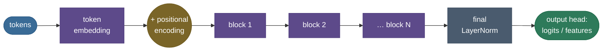
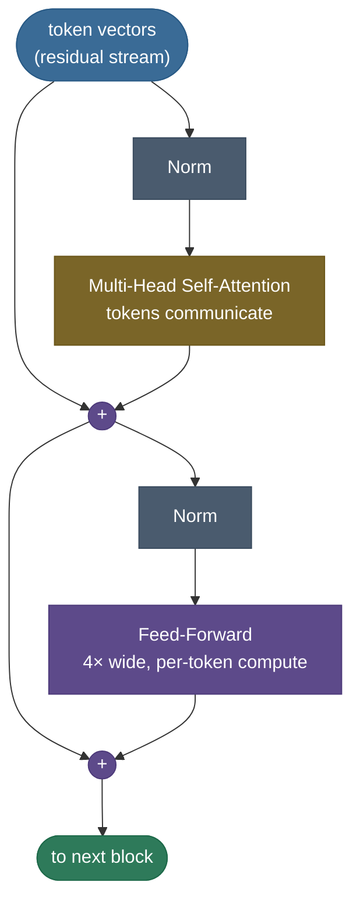
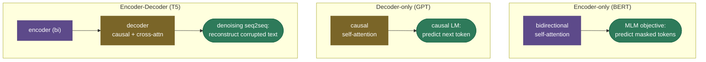
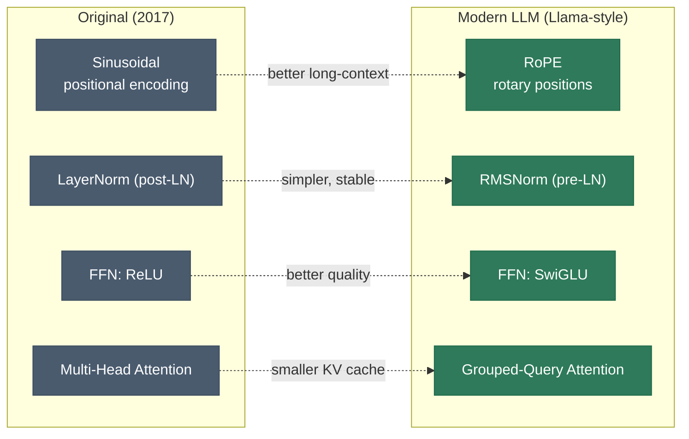

# The Transformer: attention is (almost) all you need

In 2017 a paper made a deliberately provocative claim: throw away recurrence and convolution entirely, build a sequence model out of **nothing but [attention](15-Attention-Mechanism.md) and plain feed-forward layers**, and it will train faster and work better. That model — the **transformer** — became one of the most consequential architectures in computing. Every LLM you've used (GPT, Claude, Llama), every modern translation system, BERT, Vision Transformers, AlphaFold's backbone — all transformers. If attention is the *mechanism*, the transformer is the *machine* built around it.

This page is the complete tour. By the end you'll be able to:

- **draw the transformer block from memory** and explain its two-part rhythm (attention = tokens communicate; FFN = each token thinks);
- trace the full forward path: **tokenization → embedding → positional encoding → N blocks → output head**;
- compare **positional-encoding schemes** (sinusoidal, learned, RoPE, ALiBi);
- walk the **encoder vs decoder vs encoder–decoder** split and the **training objective** each uses (MLM, causal LM, denoising);
- name the **modern components** that replaced the originals (RMSNorm, SwiGLU, GQA, RoPE, MoE) and *why*;
- account for **where the parameters and the compute go**, and how it all **scales**.

Intuition first, then the anatomy, then code you can run.

> **Note:** "transformer" names the *architecture*; "attention" names *one component* inside it. The other parts — feed-forward layers, residual connections, normalization, positional encodings, the embedding and output head — are what turn a clever attention operation into a trainable, scalable model. The answer that impresses explains those supporting parts, not just attention.

---

## The problem: attention fixed access, but recurrence was still the engine

The previous generation had *already* added [attention](15-Attention-Mechanism.md) — but bolted onto an **RNN**. That hybrid fixed information access yet kept the RNN's fatal flaw: **recurrence is inherently sequential.** To compute the hidden state at position $t$ you must first compute $t-1$, then $t-2$, all the way back. On a GPU built to do thousands of operations at once, you wait in line, one token at a time. Training on long sequences crawls.

The transformer's bet: if attention already lets every token see every other token directly, **why keep the recurrence?** Drop it, process the **entire sequence in parallel**, and recover the only thing recurrence gave you for free — a sense of word *order* — with an explicit **positional encoding**.



> **Tip:** the cleanest one-sentence "why transformers beat RNNs": **RNNs serialize computation over the sequence; transformers parallelize it.** Same reason GPUs love them, same reason they scale.

---

## What it is

A transformer is a **stack of identical blocks** wrapped around an embedding layer and an output head. Each block has two sub-layers, each followed by a residual connection and normalization:

1. **Multi-head self-[attention](15-Attention-Mechanism.md)** — every token gathers information from every other token.
2. **Position-wise feed-forward network (FFN)** — a small MLP applied to each token independently.

Because there's no recurrence to encode order, the input is **token embedding + positional encoding**. Depending on the attention mask, you get one of three flavors: **encoder** (bidirectional, for understanding), **decoder** (causal, for generation), or **encoder–decoder** (for seq-to-seq).

---

## Intuition: the residual stream, communicate then compute

The clearest mental model is the **residual stream**. Picture a wide highway of token vectors running straight through the network from input to output. Each block doesn't *replace* what's on the highway — it **reads** from it, computes something, and **adds** the result back (the residual `+`). Information accumulates; nothing is destroyed.

Every block does two things, in a fixed rhythm:

- **Attention = communication.** Tokens look at each other and move information *between positions*.
- **Feed-forward = computation.** Each token, now holding gathered context, is processed *independently* — the FFN is where the model does its per-token "thinking" and stores most of what it knows.

Mix between tokens, then think per token. Mix, think. Mix, think. $N$ times.



> **Note:** the **residual connections** aren't decoration — they're what makes deep stacks trainable. They give gradients a direct path from the loss back to early layers (the [ResNet](https://arxiv.org/abs/1512.03385) insight), so a 96-layer transformer doesn't suffer the vanishing gradients that killed deep RNNs. Remove the residuals and a deep transformer won't train.

> **Note:** the residual's *partner* is **initialization**. Because every block *adds* to the stream, the stream's variance would grow with depth; deep transformers counter this by scaling the residual-branch weights down by ≈$1/\sqrt{2N}$ ($N$ = layers, as in GPT-2). Pre-LN + this init are together why 100-plus-layer stacks train without diverging.

---

## From tokens to logits: embeddings and the output head

Before and after the block stack sit pieces that are easy to overlook but always asked about:

- **Tokenization.** Text is split into subword **tokens** (BPE / WordPiece / SentencePiece) — a vocabulary of ~30k–256k pieces balancing sequence length against vocabulary size.
- **Token embedding.** Each token id indexes a learned **embedding matrix** $E \in \mathbb{R}^{V \times d}$, turning it into a $d$-dimensional vector — the first thing placed on the residual stream.
- **Output head.** After the final norm, a linear projection maps each position's $d$-vector to **$V$ logits**, and softmax turns them into a next-token distribution (for a decoder) or class scores (for an encoder).
- **Weight tying.** The output projection often **shares weights with the input embedding** ($E^\top$), saving $V\times d$ parameters (huge for large vocabularies) and usually improving quality.

> **Tip:** for a quick parameter estimate of an LLM, don't forget the **embedding/output matrix**: $V \times d$. For a 256k vocabulary at $d=4096$ that's ~1B parameters before any transformer blocks — which is why weight tying matters.

---

## Positional encodings: four ways to inject order

Self-attention is **permutation-equivariant** — shuffle the input tokens and the outputs shuffle the same way. It has *no* built-in notion of order, so we must add position. Four schemes, in rough historical order:

- **Sinusoidal (Vaswani 2017).** Fixed sine/cosine waves of geometric frequencies added to the embedding; each position gets a unique smooth code, and it extrapolates somewhat past the training length.
- **Learned absolute (BERT, GPT-2).** A trainable embedding per position. Simple and effective, but it **cannot extrapolate** beyond the maximum trained length.
- **RoPE — rotary (GPT-NeoX, Llama, most modern LLMs).** *Rotate* the query and key vectors by a position-dependent angle, so the attention dot product depends only on the **relative** offset. Strong long-context behavior; the current default.
- **ALiBi.** Add a linear, head-specific **distance penalty** directly to the attention scores — no position embeddings at all — with excellent length extrapolation.


> **Note:** the move from **absolute** (sinusoidal/learned, added to the embedding) to **relative** (RoPE/ALiBi, applied inside attention) is one of the biggest practical upgrades in modern LLMs, because relative positions generalize far better to sequences longer than those seen in training.

---

## Why it matters

**1. Parallelism → trainability at scale.** With recurrence gone, a whole sequence flows through each block as a couple of big matrix multiplies. This made it economically possible to train on trillions of tokens.

**2. It scales predictably.** Transformers obey clean **scaling laws** — add parameters, data, and compute in the right ratio and loss falls on a smooth power-law curve. That predictability is *why* labs spend nine figures on larger ones.

**3. It's universal.** The same block, fed patches, is a Vision Transformer; fed amino acids, a protein model; fed audio frames, a speech model.


> **Tip:** a number worth memorizing: a transformer layer has roughly **12·d_model²** parameters (4·d² for the four attention projections + 8·d² for the FFN at 4× width). Multiply by layers for a quick estimate — and notice the FFN, not attention, is the bigger half.

---

## The math: the pieces, defined

**The block** (pre-LN form), with $\text{Norm}$ a normalization and $\text{MHA}$ multi-head attention:

$$x \leftarrow x + \text{MHA}(\text{Norm}(x)), \qquad x \leftarrow x + \text{FFN}(\text{Norm}(x))$$

**Feed-forward**, widening to $d_{ff} = 4\,d_{\text{model}}$ and back:

$$\text{FFN}(x) = W_2\,\phi(W_1 x + b_1) + b_2, \qquad \phi \in \{\text{ReLU}, \text{GELU}, \text{SwiGLU}\}$$

**Sinusoidal positional encoding**, for position $pos$ and dimension $i$:

$$PE_{(pos,\,2i)} = \sin\!\left(\frac{pos}{10000^{2i/d}}\right), \qquad PE_{(pos,\,2i+1)} = \cos\!\left(\frac{pos}{10000^{2i/d}}\right)$$

**Parameter budget per block.** Attention $= 4 d^2$ ($W_q, W_k, W_v, W_o$); FFN $= 2 \cdot d \cdot 4d = 8 d^2$. Total $\approx 12\,d_{\text{model}}^2$ per layer.

---

## Encoder, decoder, or both — and what each is trained to do

The only structural difference between the three transformer families is the **attention mask** and whether a **cross-attention** sub-layer is present. Each pairs with a characteristic **training objective**:



- **Masked language modeling (MLM)** — BERT-style. Mask ~15% of tokens; predict them from **both** sides. Bidirectional context, great for *understanding* (classification, retrieval), but not a natural generator.
- **Causal (autoregressive) language modeling** — GPT-style. Predict the next token from the **left** context only. This is the objective behind all generative LLMs.
- **Denoising seq2seq** — T5/BART-style. Corrupt the input (drop spans, shuffle), train the encoder–decoder to reconstruct it. Unifies many tasks as text-to-text.

> **Note:** in the encoder–decoder, **cross-attention** is the bridge between the two stacks: the decoder's queries attend over the **encoder's** keys and values (Q from the decoder, K/V from the encoder), so each generated token can read the entire source sequence. A decoder-only LLM simply omits this sub-layer and keeps only causal self-attention.

> **Note:** the objective and the mask must agree. MLM needs bidirectional attention (you're allowed to see the future to fill a blank); causal LM needs the look-ahead mask (you must not see the token you're predicting). Mismatching them either leaks the answer or starves the model of context.

---

## Modern components: what replaced the 2017 originals

Today's LLMs keep the transformer *skeleton* but swap several internals for better-tested alternatives:



- **Pre-LN over post-LN.** Normalize *before* each sub-layer (not after). Keeps the residual stream clean and trains deep models stably without finicky learning-rate warmup. (If a deep post-LN model diverges, this is usually why.)
- **RMSNorm over LayerNorm.** Normalize by the root-mean-square only — no mean subtraction, no bias. Cheaper, equally effective.
- **SwiGLU over ReLU/GELU FFN.** A *gated* FFN, $\text{FFN}(x) = (\text{Swish}(xW_1) \odot xW_3)W_2$, consistently beats a plain MLP (with $d_{ff}$ shrunk to ~$\tfrac{8}{3}d$ to keep the parameter count).
- **GQA over MHA.** Share K/V across groups of query heads to shrink the [KV cache](../../09.%20LLMs/concepts/05-KV-Cache.md) — the reason long-context 70B models are servable.
- **Mixture-of-Experts (MoE).** Replace the FFN with a **router + many expert FFNs**, activating only a few per token. This scales *parameters* (capacity) without scaling *compute* per token — used in the largest frontier models.

> **Tip:** a great senior-level answer to "describe a modern transformer" is exactly this list of swaps with the *reason* for each — it signals you've read real model papers (Llama, PaLM, Mistral), not just the 2017 one.

---

## Complexity and scaling

- **Attention** is $O(n^2 d)$ time and $O(n^2)$ memory in sequence length $n$ — the long-context bottleneck that [FlashAttention](../../09.%20LLMs/concepts/06-Efficient-Attention-FlashAttention.md), sparse, and linear attentions attack.
- **FFN** is $O(n d^2)$ — it dominates for short sequences and at inference; **MoE** and quantization target it.
- **Parameters** are $\approx 12 d^2$ per layer plus the $V\times d$ embedding. **Scaling laws** (Kaplan; Chinchilla) say loss falls as a power law in parameters and data, and that the two should grow **together** — Chinchilla's correction was that early large models were badly *under-trained* on data.

> **Gotcha:** which term dominates depends on $n$ vs $d$. At long context the $O(n^2)$ attention takes over (reach for FlashAttention / sparse); at short context the $O(nd^2)$ FFN dominates (reach for MoE / quantization). Naming *which regime you're in* is the mark of someone who has actually profiled a model.

---

## Where it is used

- **Decoder-only (GPT, Llama, Claude)** — autoregressive generation; the dominant LLM design. Its inference loop is exactly what the [KV cache](../../09.%20LLMs/concepts/05-KV-Cache.md) accelerates.
- **Encoder-only (BERT, RoBERTa)** — bidirectional understanding for classification, retrieval, embeddings.
- **Encoder–decoder (T5, BART, Whisper)** — translation, summarization, speech.
- **Beyond text** — Vision Transformers, diffusion backbones, AlphaFold, multimodal models. The block barely changes.

---

## Application: building and choosing one

**Step 1 — pick the shape from the task.** Generation → decoder-only. Classification/embedding → encoder-only. Seq-to-seq with distinct input/output → encoder–decoder. For most "build an LLM" goals, **decoder-only**.

**Step 2 — use the framework block, know its knobs.** `nn.TransformerEncoderLayer` / `nn.TransformerDecoderLayer` give a tuned block; the knobs are `d_model`, `n_heads` ($d_{head} = d_{model}/n_{heads}$), `d_ff` (≈4× `d_model`), `n_layers`, and **`norm_first=True`** (pre-LN — prefer it).

**Step 3 — wire in the modern essentials.** Swap in **RoPE**, **RMSNorm**, **SwiGLU**, **GQA**, and [FlashAttention](../../09.%20LLMs/concepts/06-Efficient-Attention-FlashAttention.md); tie the embedding/output weights. The skeleton is unchanged; these are bolt-on upgrades.

> **Tip:** transformers regularize with **dropout in three places** — on the attention weights, on each sub-layer's output before the residual add, and on the summed token+position embeddings — plus weight decay. All dropout is disabled at inference. (Note: the largest LLMs often train with little or no dropout, relying on dataset scale instead.)

---

## Code: a transformer block from scratch

A pre-LN encoder/decoder block built from the [attention](15-Attention-Mechanism.md) you already saw, with a parameter count that matches the diagram. The single `causal=` flag is the only difference between a GPT block and a BERT block.

```python
"""A transformer block from scratch (pre-LN). Verified on ml-py312 (torch 2.12), CPU."""
import torch, torch.nn as nn, torch.nn.functional as F
torch.manual_seed(0)

class MultiHeadSelfAttention(nn.Module):
    def __init__(self, d_model, n_heads):
        super().__init__()
        self.h, self.dh = n_heads, d_model // n_heads
        self.Wq = nn.Linear(d_model, d_model, bias=False)
        self.Wk = nn.Linear(d_model, d_model, bias=False)
        self.Wv = nn.Linear(d_model, d_model, bias=False)
        self.Wo = nn.Linear(d_model, d_model, bias=False)
    def forward(self, x, causal=False):
        B, T, D = x.shape
        split = lambda t: t.view(B, T, self.h, self.dh).transpose(1, 2)   # (B,h,T,dh)
        q, k, v = split(self.Wq(x)), split(self.Wk(x)), split(self.Wv(x))
        ctx = F.scaled_dot_product_attention(q, k, v, is_causal=causal)
        return self.Wo(ctx.transpose(1, 2).reshape(B, T, D))             # concat heads, project

class TransformerBlock(nn.Module):
    """Pre-LN: x = x + Attn(LN(x)); x = x + FFN(LN(x))."""
    def __init__(self, d_model, n_heads, d_ff):
        super().__init__()
        self.ln1, self.ln2 = nn.LayerNorm(d_model), nn.LayerNorm(d_model)
        self.attn = MultiHeadSelfAttention(d_model, n_heads)
        self.ffn = nn.Sequential(nn.Linear(d_model, d_ff), nn.GELU(), nn.Linear(d_ff, d_model))
    def forward(self, x, causal=False):
        x = x + self.attn(self.ln1(x), causal=causal)   # communicate between tokens
        x = x + self.ffn(self.ln2(x))                    # think per token
        return x

d_model, n_heads, d_ff = 768, 12, 3072
block = TransformerBlock(d_model, n_heads, d_ff)
x = torch.randn(2, 16, d_model)
print("output shape:", tuple(block(x).shape), "== input: the residual stream keeps its width")

attn_p = sum(p.numel() for p in block.attn.parameters())
ffn_p  = sum(p.numel() for p in block.ffn.parameters())
print(f"attention: {attn_p/1e6:.2f}M (4·d²)  |  FFN: {ffn_p/1e6:.2f}M (~2× attention)  |  block ≈ {(attn_p+ffn_p)/1e6:.2f}M")
print("decoder (causal) output:", tuple(block(x, causal=True).shape))  # one flag flips GPT <-> BERT
```

Output:

```
output shape: (2, 16, 768) == input: the residual stream keeps its width
attention: 2.36M (4·d²)  |  FFN: 4.72M (~2× attention)  |  block ≈ 7.08M
decoder (causal) output: (2, 16, 768)
```

> **Note:** the only difference between a GPT block and a BERT block here is the single `causal=` flag — one masks the future, one doesn't. Everything else is identical. That's how unified the architecture really is.

---

## Recap and rapid-fire

**If you remember nothing else:** a transformer is a stack of identical blocks on a **residual stream**, each doing **attention (tokens communicate) → feed-forward (each token computes)**, wrapped by an embedding + positional encoding at the input and an output head at the top, with residuals + norm holding it together. No recurrence → full parallelism → scale → LLMs.

**Quick-fire — say these out loud:**

- *Two sub-layers of a block?* Multi-head self-attention, then a position-wise FFN — each with a residual + norm.
- *Full forward path?* tokenize → embed → + positional encoding → N blocks → final norm → output head (logits).
- *Why positional encodings, and which kinds?* Attention is permutation-equivariant; sinusoidal/learned (absolute) vs RoPE/ALiBi (relative, better extrapolation).
- *Encoder vs decoder vs enc-dec + objectives?* BERT/MLM (bidirectional), GPT/causal-LM (causal), T5/denoising (enc-dec).
- *Where do the parameters live?* The FFN (~2× attention; ≈12·d² per layer) plus the V×d embedding.
- *Modern swaps?* RoPE, RMSNorm, SwiGLU, GQA, MoE — each with a reason (long-context, simpler, quality, smaller cache, capacity).
- *Pre-LN vs post-LN?* Pre-LN trains deep models stably; the modern default.
- *Why did it beat RNNs?* It parallelizes over the sequence instead of serializing — fast and scalable.

---

## References and further reading

The curated link library for this topic — videos, courses, articles, papers, books, and internal cross-links — lives in a companion file so it can be reused as a standalone reference list:

**→ [Transformer Architecture — references and further reading](16-Transformer-Architecture.references.md)**
