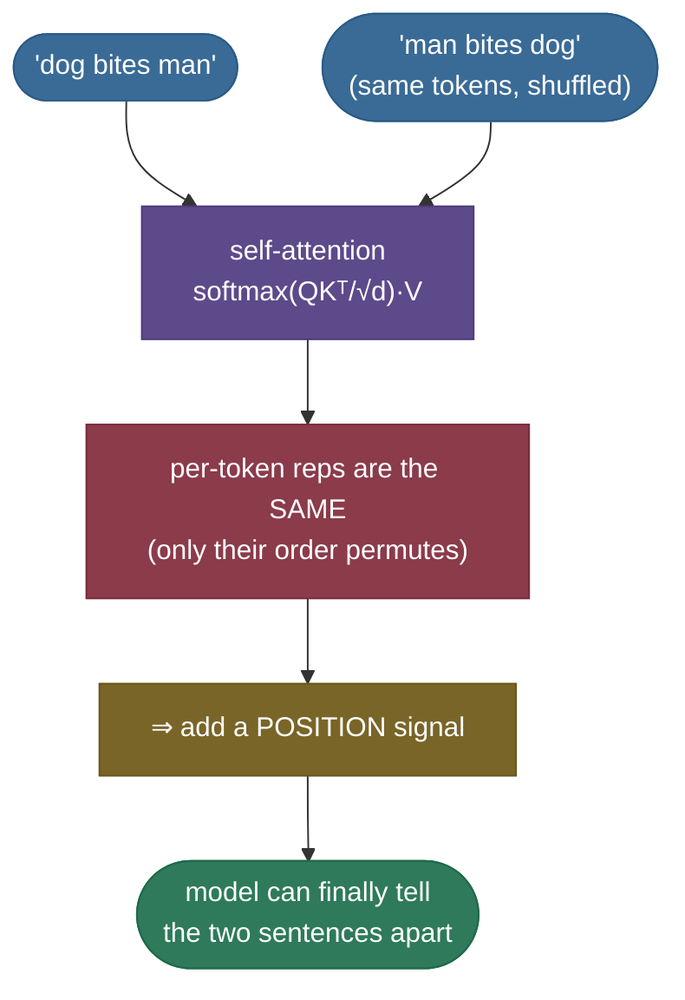
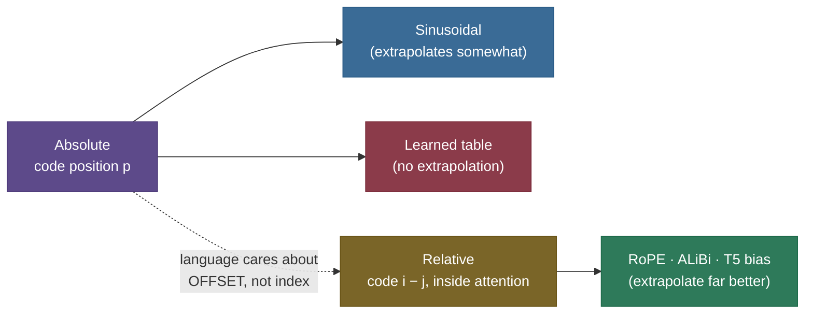
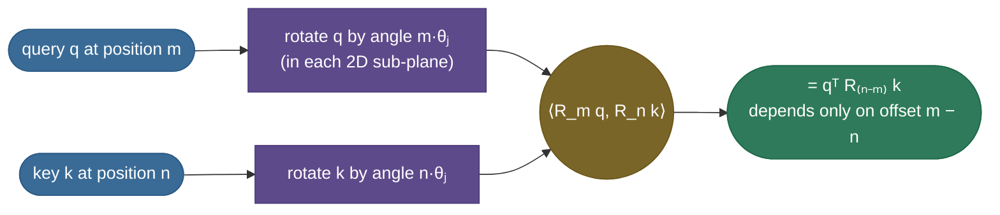
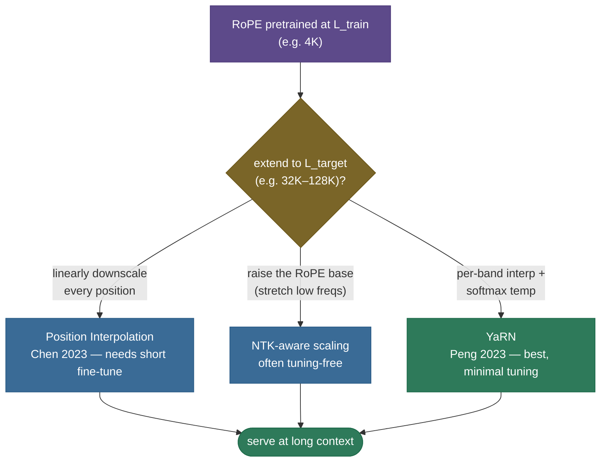

# Positional Encoding: teaching a bag of words its order

Take the sentence *"dog bites man"* and shuffle it into *"man bites dog."* To you those are different events. To the core of a transformer — **self-[attention](15-Attention-Mechanism.md)** — they are *the same set of three word-vectors*, and it would compute the **same** representation for "bites" in both. Attention is a content-based lookup: it scores every token against every other and blends their values, but **nowhere in `softmax(QKᵀ)V` is there a notion of *where* a token sits.** That is not a small bug; it is a structural fact. A transformer, on its own, reads your sentence as a **bag of words**.

**Positional encoding** is how we put the order back. It is the small signal — added to the embeddings, or folded into the attention scores — that tells the model token 5 is token 5, and that token 5 is three steps after token 2. This page derives *why* the problem exists from the attention equation itself, then builds up the whole family of solutions in the order the field discovered them: **sinusoidal → learned → relative → RoPE → ALiBi**, plus how modern systems *stretch* these to contexts longer than they were trained on. By the end you'll be able to:

- **prove** that self-attention is **permutation-equivariant** — that shuffling tokens just shuffles the outputs — straight from the softmax-attention formula;
- list the **requirements** of a good positional scheme (unique, bounded, deterministic-or-learnable, relative, extrapolating);
- **derive** the sinusoidal formula $PE(pos,2i)=\sin(pos/10000^{2i/d})$ and its key property — that $PE(pos{+}k)$ is a **fixed rotation** of $PE(pos)$;
- explain **why PE is added, not concatenated**, and why **learned** absolute embeddings can't extrapolate;
- **derive RoPE** — rotate $q$ and $k$ so $\langle R_m q, R_n k\rangle$ depends only on $m-n$ — and **ALiBi**'s linear distance bias;
- compare all schemes on *relative? extrapolates? where applied? who uses it?*;
- explain **context extension** (position interpolation, NTK-aware, YaRN);
- reproduce every result in **runnable, verified code**.

Intuition first, then the derivations, then code you can run.

> **Note:** positional encoding exists **only because** self-attention threw away order to gain its superpower — any-to-any, fully parallel token mixing (see [Attention Mechanism](15-Attention-Mechanism.md) and [Transformer Architecture](16-Transformer-Architecture.md)). RNNs never needed it: they *process* tokens in order, so order is baked into the computation. The transformer trades that implicit order for parallelism and then **buys order back explicitly**. Keep that trade in mind — it explains the entire topic.

---

## The problem: self-attention is permutation-equivariant

Let's make the claim precise, because "attention has no notion of order" is the single sentence every derivation hangs on, and you should be able to *prove* it, not just assert it.

Self-attention takes a sequence of token vectors $X = [x_1; x_2; \dots; x_n] \in \mathbb{R}^{n \times d}$ and computes

$$Q = XW_q,\quad K = XW_k,\quad V = XW_v,\qquad \text{Attn}(X) = \text{softmax}\!\left(\frac{QK^\top}{\sqrt{d_k}}\right)V.$$

Now **permute the rows** of $X$ with a permutation matrix $P$ (an $n\times n$ matrix that is all zeros except one 1 per row/column — it reorders the tokens). Feed $PX$ in instead of $X$. Because the projections are applied **row-wise** (the same $W_q, W_k, W_v$ act on each token independently), they commute with the permutation:

$$Q' = (PX)W_q = P(XW_q) = PQ, \qquad K' = PK, \qquad V' = PV.$$

The score matrix becomes

$$Q'K'^\top = (PQ)(PK)^\top = PQK^\top P^\top.$$

Softmax is applied **per row** over the key axis, and permuting rows-and-columns of a matrix by the same $P$ just relabels which query attends to which key — softmax commutes with it: $\text{softmax}(PSP^\top) = P\,\text{softmax}(S)\,P^\top$. Multiply by $V' = PV$ and the trailing $P^\top P = I$ cancels:

$$\text{Attn}(PX) = P\,\text{softmax}\!\left(\tfrac{QK^\top}{\sqrt{d_k}}\right)P^\top \, PV = P\,\text{softmax}\!\left(\tfrac{QK^\top}{\sqrt{d_k}}\right)V = P\cdot\text{Attn}(X).$$

That is the whole proof. **Permute the input and the output permutes the same way — but the *content* of each token's representation is unchanged.** The token formerly at position 2 gets the *identical* output vector no matter where you move it. Attention is **permutation-equivariant**; stripped of the row labels, it is **permutation-invariant** — it sees a *set*, not a *sequence*.

> **Note:** "equivariant" vs "invariant" is a clean interview distinction. **Equivariant**: shuffle input → output shuffles the same way ($f(Px)=Pf(x)$) — this is self-attention. **Invariant**: shuffle input → output unchanged ($f(Px)=f(x)$) — this is what you get after a permutation-invariant *pooling* (e.g. mean over tokens). Self-attention is equivariant; that's *worse* for us than it sounds, because the **per-token** representation it produces is order-blind.

> **Gotcha:** people sometimes "fix" this by pointing at the **causal mask**. A causal (lower-triangular) mask *does* break symmetry — token 3 sees $\{1,2,3\}$ while token 1 sees only $\{1\}$ — so a *masked* decoder isn't perfectly permutation-equivariant. But that only encodes *which tokens are visible*, not *how far apart* they are; the model still can't tell distance-1 from distance-50 without help. The mask is a crude, partial position signal (this is the seed of **NoPE**, later) — not a substitute for real positional encoding.



The fix is to break the symmetry **on purpose**: make each position's contribution depend on *where* it is, so the model can distinguish "dog bites man" from "man bites dog." That signal is the **positional encoding**.

---

## What we need from a positional scheme

Before looking at *any* specific encoding, it pays to write down what a *good* one must do. Almost every design in the literature is a different trade-off across these properties:

1. **Unique per position.** Position 5 and position 50 must get distinguishable codes, or the model can't tell them apart. (A naive idea — just use the integer $pos$ — fails the next requirement.)
2. **Bounded / well-scaled.** The signal shouldn't grow without limit with position. Adding the raw integer $pos$ to a unit-norm embedding would, by position 1000, drown the token's meaning under a giant constant. The code must stay in a small, stable range.
3. **Deterministic or learnable, but consistent.** The same position must always map to the same code (or be learned to). A scheme the model can *rely on* every forward pass.
4. **Encodes relative distance.** What language actually cares about is usually *how far apart* two tokens are, not their absolute index — "the adjective two words before the noun." A scheme where the model can easily read off $i-j$ is far more useful than one that only gives absolute indices.
5. **Extrapolates to longer sequences.** Train at length 2,048, deploy at 32,000. The scheme should degrade gracefully — ideally not at all — past the longest sequence it saw in training. This is the property that separates the winners (RoPE, ALiBi) from the losers (learned absolute) in modern long-context LLMs.

> **Tip:** keep this checklist in your head as a scoreboard. Sinusoidal nails 1–3 and *partly* 4–5. Learned absolute nails 1–3 and **fails** 5 hard. RoPE and ALiBi are designed to ace **4 and 5** — which is exactly why they took over. When an interviewer asks "why did the field move from sinusoidal to RoPE," the answer is *this list*, rows 4 and 5.

---

## Absolute sinusoidal encoding (Vaswani et al. 2017)

The original transformer's answer is a **fixed** (non-learned) function of position, built from sines and cosines of geometrically spaced frequencies. For position $pos$ and embedding dimension index $i \in \{0, \dots, d-1\}$:

$$PE_{(pos,\,2i)} = \sin\!\left(\frac{pos}{10000^{2i/d}}\right), \qquad PE_{(pos,\,2i+1)} = \cos\!\left(\frac{pos}{10000^{2i/d}}\right).$$

Read it slowly. Each *pair* of dimensions $(2i, 2i{+}1)$ shares a single **frequency** $\omega_i = 1/10000^{2i/d}$ and gets the $(\sin, \cos)$ of $\omega_i \cdot pos$. As $i$ climbs from $0$ to $d/2$, the exponent $2i/d$ goes from $0$ to $1$, so the wavelength $2\pi/\omega_i = 2\pi\cdot 10000^{2i/d}$ sweeps **geometrically from $2\pi$ (very fast) up to $2\pi\cdot 10000$ (very slow)**.

> *Where this comes from: the sinusoidal positional encoding is **Attention Is All You Need** (Vaswani et al. 2017, §3.5). The base constant $10000$ and the geometric-frequency design are stated there; the rotation property below is the paper's stated motivation ("we hypothesized it would allow the model to easily learn to attend by relative positions").*

### Why a *spectrum* of frequencies

A single sine wave can't give unique codes — it repeats every wavelength, so $pos$ and $pos + \text{wavelength}$ collide. But a **stack** of waves at geometrically different frequencies is exactly how a number is written in a positional number system: the fast waves are the "low-order digits" (fine position) and the slow waves are the "high-order digits" (coarse position). Together they pin down position uniquely over an enormous range — the same reason a clock's second/minute/hour hands together specify a unique time.

![The sinusoidal positional-encoding matrix PE[pos, i] as a heatmap over (position × dimension), d = 128. Low-index dimensions (left) are fast stripes — short wavelength; high-index dimensions (right) are slow bands — long wavelength. Each row (position) is a unique fingerprint across the frequency spectrum.](images/pe_sinusoidal_heatmap.png)


### Worked example 1 — compute a PE vector by hand

Take $d = 4$, so there are two frequency pairs: $i=0$ gives $\omega_0 = 1/10000^{0} = 1$, and $i=1$ gives $\omega_1 = 1/10000^{2/4} = 1/100 = 0.01$. The four components at position $pos$ are $[\sin(\omega_0 pos),\ \cos(\omega_0 pos),\ \sin(\omega_1 pos),\ \cos(\omega_1 pos)]$.

| $pos$ | dim 0 $=\sin(pos)$ | dim 1 $=\cos(pos)$ | dim 2 $=\sin(0.01\,pos)$ | dim 3 $=\cos(0.01\,pos)$ |
|---|---|---|---|---|
| 0 | $\sin 0 = 0$ | $\cos 0 = 1$ | $0$ | $1$ |
| 1 | $\sin 1 = 0.8415$ | $\cos 1 = 0.5403$ | $\sin 0.01 = 0.0100$ | $\cos 0.01 = 1.0000$ |
| 2 | $\sin 2 = 0.9093$ | $\cos 2 = -0.4161$ | $\sin 0.02 = 0.0200$ | $\cos 0.02 = 0.9998$ |

So $PE(0) = [0, 1, 0, 1]$, $PE(1) = [0.8415, 0.5403, 0.0100, 1.0000]$, $PE(2) = [0.9093, -0.4161, 0.0200, 0.9998]$ — each position a distinct vector. The **fast** pair (dims 0–1) already swings a lot between positions 1 and 2; the **slow** pair (dims 2–3) barely moves — it's the coarse "digit" that won't complete a cycle for hundreds of positions. The code block at the end reproduces these exact numbers.

> **Note:** why base $10000$? It sets the **longest** wavelength to $\approx 2\pi\cdot 10000 \approx 63{,}000$ tokens — comfortably longer than any sequence the original model would see, so even the slowest dimension hasn't wrapped around within the context, keeping every position's code unique. Tune this base up and you stretch the encoding over longer contexts — which, as we'll see, is exactly the lever **NTK-aware scaling** pulls for RoPE.

### The key property: PE(pos + k) is a *linear rotation* of PE(pos)

Here is the reason the authors chose sines and cosines rather than, say, random codes. Fix an offset $k$. For one frequency pair, the encoding at $pos$ is the 2-vector $\big(\sin(\omega pos),\ \cos(\omega pos)\big)$. The encoding at $pos + k$ is $\big(\sin(\omega(pos{+}k)),\ \cos(\omega(pos{+}k))\big)$. By the angle-addition identities,

$$\begin{aligned}
\sin(\omega(pos{+}k)) &= \sin(\omega pos)\cos(\omega k) + \cos(\omega pos)\sin(\omega k),\\
\cos(\omega(pos{+}k)) &= \cos(\omega pos)\cos(\omega k) - \sin(\omega pos)\sin(\omega k).
\end{aligned}$$

In matrix form, with $a = \omega k$:

$$\begin{bmatrix}\sin(\omega(pos{+}k))\\[2pt] \cos(\omega(pos{+}k))\end{bmatrix} = \underbrace{\begin{bmatrix}\cos a & \sin a\\[2pt] -\sin a & \cos a\end{bmatrix}}_{R_k\ (\text{depends only on } k)}\begin{bmatrix}\sin(\omega pos)\\[2pt] \cos(\omega pos)\end{bmatrix}.$$

The matrix $R_k$ is a **2D rotation** that depends **only on the offset $k$, not on $pos$.** Stacking these $2\times 2$ blocks for every frequency gives a single block-diagonal matrix, and the relation holds for the whole vector:

$$\boxed{\,PE(pos + k) = R_k \cdot PE(pos)\,}$$

This is the punchline. To shift a position by $k$, you apply the **same fixed linear map** $R_k$ regardless of where you started. A model can therefore learn to attend "$k$ positions back" by learning a single linear transform — the encoding hands relative position to it **for free, as a rotation.** That is property 4 (relative distance) emerging from the sinusoidal design.

### Worked example 2 — verify the rotation relation numerically

Take $d=16$, $pos=5$, $k=3$. Compute $PE(8)$ directly, then compute $R_3 \cdot PE(5)$ with the block-diagonal rotation above. The two agree to machine precision — first four components $[0.9894, -0.1455, 0.5743, -0.8186]$ either way, max abs difference $2.2\times 10^{-16}$. So $PE(pos{+}k)$ really is a fixed linear function of $PE(pos)$; the relative offset is encoded as a rotation, exactly as derived. (Reproduced in the code section.)

> **Tip:** this rotation property is the bridge to **RoPE**. Sinusoidal *adds* a vector that happens to rotate with position; RoPE takes the idea to its logical end and *rotates the query and key vectors themselves*. Same trigonometry, applied in a smarter place. Hold the relation $PE(pos{+}k)=R_k\,PE(pos)$ in mind — RoPE is what you get when you make the rotation the operation rather than the additive signal.

### Why *added*, not concatenated

The transformer **adds** $PE$ to the token embedding: $h^{(0)}_{pos} = \text{Embed}(\text{token}_{pos}) + PE(pos)$. A natural objection: doesn't adding *corrupt* the word's meaning by mixing position into the same dimensions? Three reasons it works:

- **Dimensionality is abundant.** In a $d=512$+ space, the model has ample room to allocate *subspaces* (linear directions) for "what the token is" and *other* directions for "where it is," and the first attention projection $W_q, W_k$ can read them out separately. Addition in a high-dimensional space is closer to placing two signals in (mostly) different directions than to destructively overwriting one.
- **Concatenation costs dimensions.** Concatenating a $d_p$-dim position vector would force the model to either grow $d$ (more parameters everywhere) or shrink the token embedding to make room — a strictly worse use of the budget. Addition keeps $d$ fixed and lets the model decide how much capacity to spend on position.
- **It empirically works at least as well.** Vaswani et al. tried learned embeddings *and* tested concatenation-style variants; added sinusoids matched learned ones and cost zero parameters, so addition won.

> **Gotcha:** "addition corrupts the embedding" is a tempting but wrong intuition. The right frame is *superposition*: the residual stream carries many features at once in different linear directions, and the attention/FFN read out the ones they need. Position is just one more feature riding the stream. (This same superposition view explains why residual streams work at all — see [Transformer Architecture](16-Transformer-Architecture.md).)

Concretely: if the word feature lives mostly in some directions of the $d$-space and the position feature in (mostly) *other* directions, then a projection $W_k$ can have rows that read one and ignore the other — the sum $\text{emb} + PE$ keeps both legible. In a 2-dim cartoon, putting "what" on the $x$-axis and "where" on the $y$-axis, their sum is a single point from which either coordinate is trivially recoverable; only if the two signals shared the *same* direction would addition destroy information. High dimension makes near-orthogonal placement easy, which is why the model never has to choose between knowing a token's identity and knowing its position.

---

## Learned absolute embeddings (BERT, GPT-2)

The simplest alternative drops the math entirely: make position a **lookup table**. Allocate a trainable matrix $P \in \mathbb{R}^{L_{\max} \times d}$ — one learned vector per position up to a maximum length $L_{\max}$ — and add row $pos$ to the token embedding, exactly like a second embedding table. BERT, GPT-2, the original GPT, RoBERTa, ViT all do this.

It's appealing: zero hand-designed structure, the model learns whatever positional features the data rewards, and it's trivial to implement (`nn.Embedding(max_len, d)`). In practice it matches sinusoidal on in-distribution lengths.

But it has a **hard ceiling** baked into the table: it only has rows for positions $0 \dots L_{\max}-1$. Feed it position $L_{\max}$ and there is *literally no vector to look up* — the model has never trained an embedding for it. So learned absolute encodings **cannot extrapolate at all** beyond the training length; you must either truncate, or retrain/resize the table and fine-tune. This is property 5 (extrapolation) failing completely, and it is the practical reason GPT-2 is stuck at 1,024 tokens and BERT at 512.

> **Note:** there's also a subtler weakness: a learned table encodes **absolute** indices, with no built-in notion that position 10→11 is "the same step" as 100→101. The model can *learn* relative structure from data, but nothing in the scheme hands it the relative-distance relation that sinusoidal's rotation property gives for free. Absolute-learned is the scheme that scores worst on **both** rows 4 and 5 of the checklist.

> **Gotcha:** "just make the table bigger" isn't free. Untrained rows start random; the model has no signal for positions it never saw, so naively extending the table and running inference produces garbage at the new positions. You must fine-tune on longer sequences to populate them — which needs long training data you may not have. This is precisely the pain that **relative** schemes were invented to avoid.

---

## The extrapolation problem, stated plainly

Step back and name the thing that drove the entire second half of this topic's history. **You train at one length and want to serve at a longer one.** Pretraining at 2K–8K tokens is cheap; users then paste a 50-page document. Every scheme above is graded on what happens at test length $\gg$ train length:

- **Learned absolute** — falls off a cliff (no embedding exists past $L_{\max}$).
- **Sinusoidal** — defined for all positions (it's a function, not a table) so it *runs*, but quality still degrades well before the wavelengths would predict, because the **attention patterns** the model learned were only ever exercised on short distances. It extrapolates *somewhat*, not *well*.

Why only "somewhat"? The encoding *values* are well-defined for any position — but what the model **learned** is a mapping from *patterns of PE values it saw in training* to attention behavior. At test position 30,000, the slow (low-frequency) dimensions take on combinations of values the model **never saw during training** (those dimensions barely moved within a 512-token training window, so the model only ever experienced a narrow slice of their range). The query/key projections were never asked to interpret those out-of-distribution position codes, so attention there is effectively undefined behavior. It's the same failure as any neural net asked to extrapolate outside its training distribution — the function is defined, but the *learned* response to it isn't reliable. Relative schemes sidestep this because the quantity the model conditions on (the offset) *stays in the trained range* even when absolute positions grow.

The realization of ~2018–2021 was that **absolute** position is the wrong target. Language cares about **relative** position, and a scheme that encodes *offset* directly — and applies it where attention actually compares tokens (the score) — both generalizes better and extrapolates further. That insight produced relative encodings, then RoPE and ALiBi.



---

## Relative position encodings (Shaw et al. 2018; T5)

The first explicitly-relative schemes change *where* position enters: instead of adding a position vector to the input, they inject a term that depends on the **offset $i - j$** directly into the **attention score** between query $i$ and key $j$.

**Shaw et al. (2018)** add a learned vector $a_{ij}^K$ (a function of the clipped relative distance $i-j$) to the key when computing the score, and a learned $a_{ij}^V$ to the value:

$$e_{ij} = \frac{(x_i W_q)\,(x_j W_k + a^K_{i-j})^\top}{\sqrt{d_k}}, \qquad z_i = \sum_j \text{softmax}_j(e_{ij})\,(x_j W_v + a^V_{i-j}).$$

The relative distances are **clipped** to a window $[-c, c]$ (distances beyond $c$ share an embedding), giving a finite table of relative-position vectors regardless of sequence length — so it generalizes across lengths far better than an absolute table. This is the direct ancestor of Transformer-XL's and DeBERTa's relative schemes.

**T5 (Raffel et al. 2020)** simplifies it to the bone: forget vectors, just add a **single learned scalar bias** $b_{ij}$ to each attention score, where $b$ is a function of the relative distance bucketed into a fixed set of bins (nearby offsets get their own bucket; far offsets share logarithmically-growing buckets), and the bias is **shared across all layers** but per-head:

$$e_{ij} = \frac{(x_i W_q)(x_j W_k)^\top}{\sqrt{d_k}} + b_{\text{bucket}(i-j)}.$$

That's it — a per-head, per-relative-bucket scalar nudged onto the logits. Cheap, parameter-light, and because the buckets are defined for *any* distance, it extrapolates respectably. T5's design is the conceptual parent of **ALiBi**, which replaces the *learned* bucketed bias with a *fixed linear* one.

> *Where this comes from: relative position representations are **Self-Attention with Relative Position Representations** (Shaw, Uszkoreit & Vaswani 2018); the bucketed scalar bias is **Exploring the Limits of Transfer Learning with a Unified Text-to-Text Transformer** (Raffel et al. 2020, the "T5" paper, §2.1). Both in the references.*

> **Note:** the architectural shift here is the whole story of modern positional encoding: **stop adding position to the input embedding; start injecting relative position into the attention computation.** Sinusoidal/learned are *input-side and absolute*; Shaw, T5, RoPE, and ALiBi are *attention-side and relative*. That move is what unlocked long context.

---

## Rotary Position Embedding — RoPE (Su et al. 2021)

RoPE is the modern default — Llama, Llama-2/3, GPT-NeoX, PaLM, Mistral, Qwen, DeepSeek, Gemma all use it — and it deserves a full derivation, because it's the most elegant idea in the topic: it makes the attention score depend on relative position **without adding anything to the input and without any learned position parameters at all.** It does it by *rotating* the query and key.

### The goal, stated as an equation

We want a way to encode position into $q$ and $k$ such that the dot product — the thing attention actually computes — depends **only on the content and the relative offset**:

$$\langle f(q, m),\ f(k, n)\rangle = g(q, k, m - n)$$

for some function $g$ that sees $m$ and $n$ only through $m - n$. RoPE's answer: let $f(x, p) = R_p\,x$ where $R_p$ is a **rotation by an angle proportional to position $p$**. Then the magic falls out of how rotations compose.

### The 2D core

Work in a 2D plane first (RoPE then tiles this over $d/2$ planes). A rotation by angle $\theta$ is the matrix

$$R_\theta = \begin{bmatrix}\cos\theta & -\sin\theta\\ \sin\theta & \cos\theta\end{bmatrix}, \qquad R_\theta^\top R_\phi = R_{\phi - \theta}.$$

That last identity is the crux: rotations are orthogonal, $R_\theta^\top = R_{-\theta}$, and they **add their angles**, so $R_\theta^\top R_\phi = R_{-\theta}R_\phi = R_{\phi-\theta}$. Now encode position by rotating $q$ at position $m$ by $m\theta$ and $k$ at position $n$ by $n\theta$, and take the dot product:

$$\langle R_{m\theta}\,q,\ R_{n\theta}\,k\rangle = (R_{m\theta}q)^\top(R_{n\theta}k) = q^\top R_{m\theta}^\top R_{n\theta}\,k = q^\top R_{(n - m)\theta}\,k.$$

The absolute positions $m$ and $n$ have **vanished**; only $R_{(n-m)\theta}$ — a rotation by the **relative** offset $n-m$ — remains. The score between a query at $m$ and a key at $n$ depends on their content and on $m-n$, *exactly* the property we asked for, with **no added vector and no learned position weights.**

**See it in one pair, by hand.** Take $q = k = (1, 0)$ and frequency $\theta = 1$ rad/position. Rotating $q$ to position $m$ gives $R_m q = (\cos m, \sin m)$, and $R_n k = (\cos n, \sin n)$. Their dot product is $\cos m\cos n + \sin m\sin n = \cos(m-n)$ — purely a function of the offset. Check three placements, all offset $2$:

| $m$ | $n$ | $R_m q$ | $R_n k$ | $\langle R_m q, R_n k\rangle$ | $\cos(m-n)$ |
|---|---|---|---|---|---|
| 2 | 0 | $(-0.416,\ 0.909)$ | $(1.000,\ 0.000)$ | $-0.416$ | $\cos 2 = -0.416$ |
| 5 | 3 | $(0.284,\ -0.959)$ | $(-0.990,\ 0.141)$ | $-0.416$ | $-0.416$ |
| 3 | 1 | $(-0.990,\ 0.141)$ | $(0.540,\ 0.841)$ | $-0.416$ | $-0.416$ |

The rotated $q$ and $k$ look completely different at each absolute position, yet their dot product is **identical** and equals $\cos(\text{offset})$ exactly. That is the relative-position property, visible in two-dimensional arithmetic you can do on paper.



### Scaling to $d$ dimensions: a spectrum of rotation speeds

One rotation speed would give a single wavelength — not enough to disambiguate long ranges (same reason one sine wave fails). So RoPE splits the $d$-dim query/key into $d/2$ consecutive 2D pairs and rotates pair $j$ by angle $m\theta_j$, with the **same geometric frequencies as sinusoidal**:

$$\theta_j = 10000^{-2j/d}, \qquad j = 0, 1, \dots, \tfrac{d}{2}-1.$$

Low-index pairs rotate fast (short wavelength, fine position), high-index pairs rotate slowly (coarse position) — the identical multi-frequency idea, but now it *rotates the data* instead of *being added to it*. The full $R_{m}$ is block-diagonal with these $2\times2$ rotation blocks, and the relative-offset property holds for the whole vector because each block contributes a $R_{(n-m)\theta_j}$ term.

> *Where this comes from: RoPE is **RoFormer: Enhanced Transformer with Rotary Position Embedding** (Su et al. 2021). The derivation above is their §3.2 (2D case) and §3.4.2 (general $d$); the frequency schedule reuses Vaswani's $10000^{-2j/d}$.*

### Worked example 3 — apply RoPE and watch the offset emerge

Take a tiny head dimension $d_h = 8$ (so 4 rotation pairs), a fixed random query $q$ and key $k$. Rotate $q$ to three different absolute positions $m$ and $k$ to positions $n$, always with **offset 3**:

| $m$ | $n$ | offset $m-n$ | $\langle R_m q,\ R_n k\rangle$ |
|---|---|---|---|
| 7 | 4 | 3 | **1.178293** |
| 107 | 104 | 3 | **1.178293** |
| 50 | 47 | 3 | **1.178293** |

The score is **identical** for all three — it genuinely sees only the offset, not the absolute positions. As a cross-check, rotating *only* $q$ by the offset $3$ and leaving $k$ unrotated, $\langle R_3 q, k\rangle = 1.178293$, matches — confirming $\langle R_m q, R_n k\rangle = \langle R_{m-n}q, k\rangle$. This is the empirical face of the derivation, and it's reproduced in code.


### Why RoPE became the default

- **Relative for free, where it counts.** The relative offset is baked into the **score**, the exact quantity attention uses — no added input vector, no extra parameters, no separate bias table.
- **Norm-preserving.** Rotations are orthogonal, so $\|R_m q\| = \|q\|$ — RoPE never inflates or shrinks the query/key magnitudes, keeping training stable (a problem additive schemes can have).
- **Plays nicely with efficient kernels.** RoPE is applied to $q,k$ *before* the dot product, as a cheap elementwise rotation; it composes cleanly with FlashAttention and the [KV cache](../../09.%20LLMs/05-KV-Cache/05-KV-Cache.md) (you cache the *rotated* keys).
- **Extrapolates far better than absolute** — and, crucially, its frequencies can be **rescaled** at inference to *extend* the context (next section), a lever that absolute schemes don't offer.

> **Gotcha:** two RoPE pitfalls bite people. (1) **Layout matters** — implementations differ on whether the rotated pairs are *interleaved* $(x_0,x_1),(x_2,x_3),\dots$ or *split-half* $(x_0,x_{d/2}),\dots$; mixing a model's checkpoint with the wrong convention silently corrupts every score. (2) RoPE is applied to **$q$ and $k$ only, never $v$** — values carry content, not position, so you rotate what's *compared*, not what's *returned*. Rotating $v$ is a classic bug.

---

## ALiBi — Attention with Linear Biases (Press et al. 2021)

ALiBi is the minimalist's positional encoding: **no embeddings, no rotations, no learned position parameters — just subtract a penalty proportional to distance from each attention score.** For a query at $i$ and key at $j$ (causal, so $j \le i$):

$$e_{ij} = \frac{q_i \cdot k_j}{\sqrt{d_k}} - m\,(i - j).$$

The bias $-m(i-j)$ grows linearly with the distance between the two tokens, so a key far from the query is penalized more before the softmax — a built-in, fixed **recency bias**. The slope $m$ is a **per-head constant** (not learned), taken from a geometric sequence so different heads look back over different ranges: for $h$ heads the slopes are $2^{-8/h}, 2^{-16/h}, \dots$ (for $h=8$: $2^{-1}, 2^{-2}, \dots, 2^{-8}$). Steep-slope heads attend very locally; shallow-slope heads see far.


ALiBi's headline claim is **extrapolation**: trained at length 1,024, it maintains quality at 2,048+ with *no* degradation, beating sinusoidal and learned soundly on length generalization, while being almost free to compute. Used by BLOOM, MPT, and several long-context models.

### Worked example 4 — ALiBi bias by hand, and its effect on the softmax

Take a query at position $i=4$ attending over keys $j = 0,1,2,3,4$ (causal). To isolate the *positional* effect, suppose all five **raw** content scores $q_i\cdot k_j/\sqrt{d_k}$ are equal — say $2.0$ — so without any position signal the softmax would weight all five keys **equally** at $0.20$ each. Now add the ALiBi bias for a head with slope $m = 0.25$. The distance is $i-j$, so the bias $-m(i-j)$ is:

| key $j$ | distance $i-j$ | bias $-0.25(i-j)$ | biased score | softmax weight |
|---|---|---|---|---|
| 4 | 0 | $0.00$ | $2.00$ | **0.310** |
| 3 | 1 | $-0.25$ | $1.75$ | 0.241 |
| 2 | 2 | $-0.50$ | $1.50$ | 0.188 |
| 1 | 3 | $-0.75$ | $1.25$ | 0.146 |
| 0 | 4 | $-1.00$ | $1.00$ | 0.114 |

Even though the *content* scores were identical, ALiBi has tilted the attention toward **nearby** keys: the adjacent token ($j=4$) now gets $0.31$ of the weight versus $0.11$ for the farthest. Swap in a steeper head, $m=0.5$, and the same setup yields weights $[0.43, 0.26, 0.16, 0.10, 0.06]$ — a much sharper recency bias. So the **slope is a per-head dial on "how local"** that head's attention is, and the geometric slope schedule gives the model a *spectrum* of locality — some heads myopic, some far-sighted — for free, with zero parameters. (These exact numbers are reproducible with the formula above.)

> *Where this comes from: ALiBi is **Train Short, Test Long: Attention with Linear Biases Enables Input Length Extrapolation** (Press, Smith & Lewis 2021). The geometric slope schedule is their §3.*

> **Tip:** the clean mental model — **sinusoidal/learned change the *inputs*; RoPE rotates the *queries and keys*; ALiBi nudges the *scores*.** Three different stages of the same attention computation. ALiBi is the cheapest (one subtraction), RoPE the most expressive relative scheme, sinusoidal the historical original. An interviewer who hears you place each at its *stage* knows you understand the mechanism, not just the names.

> **Note:** ALiBi's linear penalty is, in spirit, T5's bucketed bias with the *learned* buckets replaced by a *fixed linear* function of distance. Both inject a scalar into the score; ALiBi just hard-codes the shape (linear) and the slopes (geometric per head), which is why it needs zero position parameters and extrapolates by construction.

---

## NoPE — can a decoder learn position with *no* encoding?

A surprising 2023 result: a **causal decoder** with **no positional encoding at all** (NoPE) can still learn to use position, and on some length-generalization benchmarks even *beats* explicit schemes. How? The **causal mask** itself leaks position. Token $i$ attends to exactly $i+1$ tokens (positions $0\dots i$); a sufficiently expressive model can *count* how many tokens are visible and reconstruct absolute position implicitly. Decoders are not perfectly permutation-equivariant precisely because of the mask (recall the early Gotcha), and NoPE exploits that.

This is a research curiosity more than a default — most production decoders still use RoPE because it gives stronger, more reliable relative structure — but it's a sharp interview point: it shows positional encoding is *helpful*, not strictly *necessary*, for a masked decoder, and it underscores that the causal mask is itself a (weak) position signal.

> *Where this comes from: **The Impact of Positional Encoding on Length Generalization in Transformers** (Kazemnejad et al. 2023) — the NoPE result. In the references.*

---

## Context-length extension: stretching RoPE

Once RoPE won, a practical question dominated: a model is pretrained at, say, 4K tokens — how do you serve it at 32K or 128K **without full retraining**? Because RoPE's positions are *angles* set by the frequencies $\theta_j$, you can extend context by **rescaling those frequencies**. Three techniques, increasingly refined:

- **Position Interpolation, PI (Chen et al. 2023).** Instead of letting positions run off to large unseen angles, **linearly downscale** them: feed position $pos \cdot \frac{L_{\text{train}}}{L_{\text{target}}}$ so that the target context maps back into the *range of angles the model already trained on*. A 4K→32K extension divides every position by 8. With a short fine-tune (sometimes as few as ~1000 steps) the model adapts, and quality at long context is far better than naive extrapolation — because no rotation angle is ever larger than what training saw.
- **NTK-aware scaling (bloc97, 2023).** PI squashes *all* frequencies equally, which over-compresses the high-frequency (fine-position) dimensions and blurs local detail. NTK-aware scaling instead **changes the RoPE base** ($10000 \to 10000\cdot s$ for a scale factor $s$), which stretches the *low* frequencies (long-range) a lot while barely touching the *high* frequencies (short-range). Often works **without any fine-tuning** for moderate extensions, preserving local precision that PI loses.
- **YaRN (Peng et al. 2023).** The current best-of-both: apply different treatment to different frequency bands (interpolate the low-frequency dimensions, leave the high-frequency ones nearly untouched — "NTK-by-parts"), plus a small temperature adjustment to the attention softmax to keep the score distribution well-scaled at long context. YaRN reaches very long contexts (128K+) with minimal fine-tuning and is widely used in open long-context models.



> *Where these come from: **Extending Context Window of Large Language Models via Position Interpolation** (Chen et al. 2023); the NTK-aware idea originated in a community post by *bloc97* and is folded into **YaRN: Efficient Context Window Extension of Large Language Models** (Peng et al. 2023). In the references.*

> **Note:** all three only exist *because* RoPE encodes position as **frequencies you can rescale**. You cannot "interpolate" a learned absolute table the same way — there's nothing continuous to stretch. This rescalability is a quiet but decisive advantage of RoPE, and a big part of why nearly every long-context open model is RoPE-based.

> **Gotcha:** context extension is **not** free quality. Stretching the frequencies trades a little local precision for reach, and the model still needs to have *seen* enough long-range structure (in pretraining or a fine-tune) to use the extra context well — a "128K context window" doesn't guarantee 128K of *effective* attention. Always evaluate long-context *retrieval/quality*, not just that it runs without error.

---

## Comparison: which scheme, and why

| Scheme | Where applied | Relative? | Learned? | Extrapolates? | Used by |
|---|---|---|---|---|---|
| **Sinusoidal** (2017) | added to input embedding | partly (via rotation property) | no (fixed) | somewhat | original Transformer |
| **Learned absolute** | added to input embedding | no | yes (table) | **no** | BERT, GPT-2, GPT-1, RoBERTa, ViT |
| **Shaw relative** (2018) | added to K/V in attention | **yes** | yes | well (clipped window) | Transformer-XL, DeBERTa lineage |
| **T5 bias** (2020) | scalar added to score | **yes** | yes (bucketed) | well | T5, mT5 |
| **RoPE** (2021) | rotates Q, K before score | **yes** | no | well; **rescalable** | Llama 1/2/3, GPT-NeoX, PaLM, Mistral, Qwen, Gemma, DeepSeek |
| **ALiBi** (2021) | linear penalty on score | **yes** | no | **excellent** | BLOOM, MPT |
| **NoPE** (2023) | nothing (mask only) | implicit | no | surprisingly good | research / some small decoders |

The trajectory reads top-to-bottom: **absolute → relative**, **input-side → attention-side**, and **learned → fixed-but-rescalable**. Each move bought better length generalization, and RoPE — relative, parameter-free, applied at the score, and frequency-rescalable — sits at the convergence of all three, which is why it dominates current LLMs.

> **Tip:** the 20-second interview answer to "compare positional encodings": *Sinusoidal and learned are **absolute**, added to the **input** — learned can't extrapolate, sinusoidal barely. The field moved to **relative** encodings applied **inside attention**: **RoPE** rotates Q and K so the score depends only on the offset, and **ALiBi** subtracts a linear distance penalty. RoPE is the modern default because it's relative, parameter-free, and its frequencies can be rescaled (PI/NTK/YaRN) to extend context.*

---

## Where it's used, and where it isn't

- **Every transformer that processes sequences** needs *some* position signal — there is no transformer LLM without one (NoPE decoders being the rare, deliberate exception that leans on the causal mask).
- **Decoder-only LLMs** (the dominant design — see [Transformer Architecture](16-Transformer-Architecture.md)) almost universally use **RoPE** today, often with YaRN/NTK scaling for long context.
- **Encoder-only** models (BERT family) historically use **learned absolute**; newer ones (DeBERTa) use relative.
- **Encoder–decoder** (T5) uses the **bucketed scalar bias**.
- **Vision Transformers** add a (usually learned) positional embedding to image patches — same problem, since patch attention is just as permutation-equivariant; 2D-aware and RoPE variants exist for images.

> **Note:** the position scheme is **architectural** — baked in at pretraining. You generally can't swap a learned-absolute model to RoPE without retraining, and even RoPE context-extension (PI/YaRN) usually wants a fine-tune. When choosing a base model for long context, **check its positional scheme** the way you'd check its KV-head count for serving (see [KV Cache](../../09.%20LLMs/05-KV-Cache/05-KV-Cache.md)) — it's a first-class capability constraint, not a runtime knob.

---

## Application: choosing and wiring one up

**Step 1 — pick the scheme from the requirement.**

- Building a modern decoder LLM, especially long-context → **RoPE** (with YaRN/NTK in reserve for extension). This is the default; reach for it unless you have a reason not to.
- Want maximum extrapolation with the simplest possible mechanism → **ALiBi**.
- Encoder for understanding at a fixed, modest length → **learned absolute** is fine and simple.
- Teaching/illustration, or a fixed-length model with zero position parameters → **sinusoidal**.

**Step 2 — get the wiring right for the scheme.**

- *Absolute (sinusoidal/learned):* compute/look up $PE(pos)$ and **add** it to the token embedding *once*, at the input, before block 0.
- *RoPE:* apply the rotation to **$q$ and $k$ inside every attention layer**, *after* the $W_q,W_k$ projection and *before* the dot product — and to **neither $v$ nor the residual stream**. Cache the *rotated* keys in the [KV cache](../../09.%20LLMs/05-KV-Cache/05-KV-Cache.md).
- *ALiBi:* precompute the $-m(i-j)$ bias matrix per head and **add it to the scores** before softmax (it composes with the causal mask).

**Step 3 — if extending context, rescale, then evaluate.** Apply PI / NTK-aware / YaRN to the RoPE frequencies for the target length, do a short long-context fine-tune if you can, and **measure long-context retrieval quality** (e.g. needle-in-a-haystack), not just that it runs.

> **Gotcha:** the most common deployment failure is a **train/serve mismatch** in the positional scheme — using a different RoPE base, layout (interleaved vs split-half), or scaling factor at inference than the checkpoint was trained with. It rarely crashes; it just quietly degrades quality. Pin the position config to the checkpoint.

---

## Code: derive it, verify it

From-scratch sinusoidal PE (matched to a torch reference), a numerical check that $PE(pos{+}k)=R_k\,PE(pos)$, and a RoPE rotation showing the score depends only on the offset. Runs on CPU in under a second.

```python
"""Positional encoding from scratch: sinusoidal values, the rotation relation,
and RoPE's relative-offset property. Verified on Python 3.12 (torch 2.x), CPU."""
import math, numpy as np, torch

# ---- 1. Sinusoidal PE, by hand and as a matrix ----
def pe_scalar(pos, i, d, base=10000.0):
    angle = pos / base ** (2 * (i // 2) / d)
    return math.sin(angle) if i % 2 == 0 else math.cos(angle)

d = 4
for p in (0, 1, 2):
    print(f"PE(pos={p}) =", [round(pe_scalar(p, i, d), 4) for i in range(d)])

def pe_matrix(n_pos, d, base=10000.0):          # the d2l / Annotated-Transformer form
    pos = torch.arange(n_pos).unsqueeze(1).float()
    div = torch.exp(torch.arange(0, d, 2).float() * (-math.log(base) / d))
    P = torch.zeros(n_pos, d)
    P[:, 0::2], P[:, 1::2] = torch.sin(pos * div), torch.cos(pos * div)
    return P

byhand = torch.tensor([[pe_scalar(p, i, 4) for i in range(4)] for p in range(3)])
print("matrix matches by-hand:", torch.allclose(pe_matrix(3, 4), byhand, atol=1e-6))

# ---- 2. PE(pos+k) = R_k @ PE(pos)  (the rotation property) ----
d_model = 16
def pe_vec(pos):
    i = np.arange(d_model)
    ang = pos / 10000.0 ** (2 * (i // 2) / d_model)
    return np.where(i % 2 == 0, np.sin(ang), np.cos(ang))

def rot(k):                                     # block-diagonal rotation, offset k
    M = np.zeros((d_model, d_model))
    for j in range(d_model // 2):
        a = k / 10000.0 ** (2 * j / d_model)
        c, s = math.cos(a), math.sin(a)
        M[2*j, 2*j], M[2*j, 2*j+1] = c, s        # [sin(pos+k)w; cos(pos+k)w]
        M[2*j+1, 2*j], M[2*j+1, 2*j+1] = -s, c   #   = R_k [sin(pos)w; cos(pos)w]
    return M

pos, k = 5, 3
diff = np.abs(pe_vec(pos + k) - rot(k) @ pe_vec(pos)).max()
print(f"max |PE(pos+k) - R_k·PE(pos)| = {diff:.2e}  (rotation relation holds)")

# ---- 3. RoPE: <R_m q, R_n k> depends only on (m - n) ----
torch.manual_seed(0)
dh = 8
q, kk = torch.randn(dh), torch.randn(dh)
theta = 10000.0 ** (-2 * torch.arange(dh // 2) / dh)
def rope(x, pos):
    x1, x2, ang = x[0::2], x[1::2], pos * theta
    out = torch.empty_like(x)
    out[0::2] = x1 * torch.cos(ang) - x2 * torch.sin(ang)
    out[1::2] = x1 * torch.sin(ang) + x2 * torch.cos(ang)
    return out

for m, n in [(7, 4), (107, 104), (50, 47)]:     # all offset = 3
    s = torch.dot(rope(q, m), rope(kk, n)).item()
    print(f"m={m:>3} n={n:>3} offset={m-n}:  <R_m q, R_n k> = {s:.6f}")
ref = torch.dot(rope(q, 3), kk).item()           # rotate q by the offset only
print(f"reference <R_(m-n) q, k> = {ref:.6f}  (matches → relative-only)")
```

Output:

```
PE(pos=0) = [0.0, 1.0, 0.0, 1.0]
PE(pos=1) = [0.8415, 0.5403, 0.01, 1.0]
PE(pos=2) = [0.9093, -0.4161, 0.02, 0.9998]
matrix matches by-hand: True
max |PE(pos+k) - R_k·PE(pos)| = 2.22e-16  (rotation relation holds)
m=  7 n=  4 offset=3:  <R_m q, R_n k> = 1.178293
m=107 n=104 offset=3:  <R_m q, R_n k> = 1.178293
m= 50 n= 47 offset=3:  <R_m q, R_n k> = 1.178293
reference <R_(m-n) q, k> = 1.178293  (matches → relative-only)
```

> **Note:** three derivations, three confirmations. The sinusoidal values match the textbook formula; **`max |PE(pos+k) − R_k·PE(pos)| = 2.2e-16`** confirms the offset-as-rotation property to machine precision; and RoPE's **identical score at every absolute position for a fixed offset** is the relative-only property the whole scheme is built to give. Run it and watch the three blocks line up with the three sections above.

> **Tip:** to see the production version, read the RoPE implementation in any Llama codebase (`apply_rotary_emb`) — it's exactly the `rope` function above, vectorized over heads and batch, with the cos/sin tables precomputed once. The concept is identical; the engineering is just caching the rotation tables.

---

## Recap and rapid-fire

**If you remember nothing else:** self-attention is **permutation-equivariant** — `softmax(QKᵀ)V` sees a *set*, not a *sequence* — so transformers must add position. The original **sinusoidal** scheme adds fixed multi-frequency sin/cos waves whose key trick is that $PE(pos{+}k)=R_k\,PE(pos)$ is a fixed rotation (relative offset for free). **Learned absolute** embeddings are simple but can't extrapolate. The field then moved position **into the attention computation** and made it **relative**: **RoPE** rotates $q,k$ so the score depends only on $m-n$ (the modern default — relative, parameter-free, and rescalable for long context via PI/NTK/YaRN), and **ALiBi** subtracts a linear distance penalty for excellent extrapolation at near-zero cost.

**Quick-fire — say these out loud:**

- *Why does attention need positional encoding?* It's permutation-equivariant — `Attn(PX)=P·Attn(X)` — so without position it reads a sentence as a bag of words.
- *Sinusoidal formula?* $PE(pos,2i)=\sin(pos/10000^{2i/d})$, $PE(pos,2i+1)=\cos(\cdot)$ — geometrically spaced wavelengths.
- *Sinusoidal's key property?* $PE(pos{+}k)=R_k\,PE(pos)$ — shifting by $k$ is a fixed rotation, so relative offset is a linear map.
- *Why added, not concatenated?* High-dim superposition lets the model separate "what" from "where" without spending extra dimensions.
- *Why can't learned absolute extrapolate?* No embedding row exists past the max trained position.
- *Derive RoPE's core?* Rotate $q,k$ by angle $\propto$ position; $\langle R_m q, R_n k\rangle = q^\top R_{n-m} k$ — depends only on $m-n$.
- *RoPE vs ALiBi — where applied?* RoPE rotates Q,K before the dot product; ALiBi subtracts $m(i-j)$ from the score.
- *Apply RoPE to which tensors?* Q and K only — never V, never the residual stream.
- *How is context extended?* Rescale RoPE frequencies — Position Interpolation, NTK-aware, YaRN.
- *Which scheme do modern LLMs use?* RoPE (Llama, Mistral, Qwen, PaLM, Gemma, DeepSeek); some use ALiBi (BLOOM, MPT).

---

## References and further reading

The curated link library for this topic — videos, courses, articles, papers, books, and internal cross-links — lives in a companion file so it can be reused as a standalone reference list:

**→ [Positional Encoding — references and further reading](17-Positional-Encoding.references.md)**
