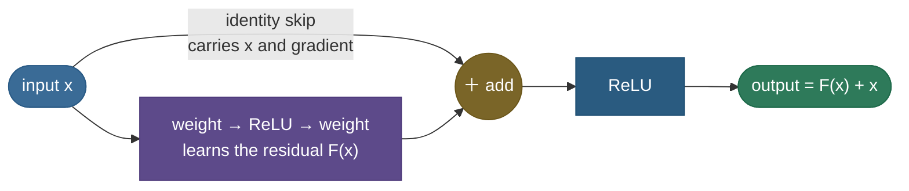

# Residual connections: the trick that let networks go truly deep

By 2015, everyone "knew" deeper networks should be more powerful — and yet, past a couple dozen layers, they got *worse*. Not worse on the test set (that would be overfitting), but worse on the **training** set, which makes no sense: a deeper network can always represent a shallower one by setting its extra layers to the identity, so it should never have *higher* training error. The fact that plain deep networks couldn't even fit the data was called the **degradation problem**, and it stalled deep learning's "just add layers" promise. The fix — the **residual connection**, from ResNet — is almost absurdly simple: instead of asking a block to compute some target $H(x)$, ask it to compute the *difference* $F(x) = H(x) - x$ and **add the input back**: $\text{output} = F(x) + x$. That one addition created a "gradient highway" that made 100- and even 1000-layer networks trainable, and it's now in essentially every deep architecture — including every transformer.

By the end of this page you'll be able to:

- explain the **degradation problem** and why it's *not* overfitting;
- describe the residual reformulation $F(x) + x$ and the two reasons it works (**easy identity** + **gradient highway**);
- derive why $\partial(F(x)+x)/\partial x = F'(x) + 1$ stops gradients from vanishing;
- describe the **residual block**, the **projection shortcut** for dimension changes, and the major **variants** (pre-activation, DenseNet, U-Net, highway);
- locate residuals inside the **transformer**;
- demonstrate the gradient highway and the degradation fix in code.

Intuition and pictures first, then the math (with sources), then runnable code.

> **Note:** the deepest idea here is that it's *easier to learn a small correction than a whole transformation*. A residual block starts life close to the identity (output ≈ input) and only has to learn how to *nudge* its input — which is both an easier optimization target and a safer default, since a useless block just learns $F \approx 0$ and passes its input through untouched.

---

## The problem: deeper plain nets train *worse*

Take a working network, stack on more layers, and — counterintuitively — training error goes *up*. This is the degradation problem, and it's a genuine paradox: the deeper network is a *superset* of the shallower one (set the extra layers to the identity and you recover it exactly), so it should achieve *at least* as low a training error. It doesn't, because plain stacked nonlinear layers find it **hard to learn the identity mapping**, and the [vanishing gradient](06-Vanishing-Exploding-Gradients.md) means the early layers barely get a learning signal. The result: a 56-layer plain net with *higher* training error than a 20-layer one.


The figure is a real training run (in the code): the 30-layer **plain** net gets stuck — it can't even fit the training data — while the **same depth with residual connections** trains down by orders of magnitude. Depth alone isn't the problem; *trainability* is.

---

## The idea: learn the residual, add the input back

A residual block reformulates the goal. Rather than have the layers compute a target mapping $H(x)$ directly, have them compute the **residual** $F(x) = H(x) - x$, then add the original input via an **identity shortcut**:



If the best thing a block can do is *nothing* (pass its input through), it just has to learn $F(x) \approx 0$ — driving a weight matrix toward zero, which is trivial — instead of learning a precise identity through nonlinear layers, which is hard. Deeper is now **strictly safe**: extra residual blocks can always no-op, so adding depth can't hurt training.

> *Where this comes from: the residual reformulation and the degradation problem are **Deep Residual Learning for Image Recognition** (He et al. 2015) — the ResNet paper; in the references.*

---

## Why it works: the gradient highway

The second reason is about backprop. Differentiate the block output with respect to its input:

$$\frac{\partial\,(F(x) + x)}{\partial x} = \frac{\partial F(x)}{\partial x} + 1$$

That **$+1$** is the whole game. Recall that [vanishing gradients](06-Vanishing-Exploding-Gradients.md) come from multiplying many small Jacobians; here, even if $\partial F/\partial x$ is tiny, the gradient flowing back through the block is $(\text{something small}) + 1 \approx 1$ — it **does not vanish**. Stack many residual blocks and the identity shortcuts compose into a clean "highway" that carries the gradient all the way back to the earliest layers, untouched:


The figure (from a real backward pass in the code) is decisive: in the plain net the gradient reaching block 1 is $\sim 10^{-7}$ — vanished — while the residual net keeps it flat at $\sim 30$ across all 30 blocks. That preserved gradient is *why* the residual net in the previous figure could train.

> *Where this comes from: the identity-shortcut gradient argument is **Deep Residual Learning** (He et al. 2015); the refinement that a *clean, unmodified* identity path (pre-activation) is optimal is **Identity Mappings in Deep Residual Networks** (He et al. 2016) — references.*

---

## The residual block in practice

A standard ResNet block is `conv → BN → ReLU → conv → BN`, then **add the input**, then a final ReLU. Two practical details:

- **Dimension changes.** When a block changes the number of channels or the spatial size (so $x$ and $F(x)$ don't match), the shortcut uses a **projection** — a $1\times1$ convolution (or linear) — to reshape $x$ before adding. The identity path is preferred whenever shapes already match (it's parameter-free and cleanest).
- **Pre-activation.** He et al. (2016) found that putting BN and ReLU *before* the weights (so the shortcut is a pure, unmodified identity) trains even-deeper nets more stably — the cleaner the highway, the better.

---

## Variants and relatives

- **Pre-activation ResNet** — BN/ReLU before the conv, keeping the identity path clean (He 2016).
- **DenseNet** — connect every layer to *every* later layer by concatenation; feature reuse taken to the extreme (Huang et al. 2016).
- **Highway networks** — a *gated* version where a learned gate decides how much to carry vs transform (the pre-ResNet ancestor).
- **U-Net** — long skip connections from encoder to decoder, carrying spatial detail across the bottleneck; the backbone of segmentation and diffusion models.

---

## Residuals in the transformer

Skip connections aren't just a CNN trick — they are load-bearing in **transformers**. Every transformer block wraps both its sub-layers in residuals: $x + \text{Attention}(\text{Norm}(x))$ and then $x + \text{FFN}(\text{Norm}(x))$. Without them, deep transformers (dozens to a hundred layers) simply wouldn't train. Combined with **pre-norm** [LayerNorm](11-Normalization.md), the residual path is what gives gradients a clean route through a 96-layer LLM (see [Transformer Architecture](16-Transformer-Architecture.md)).

---

## Worked example: gradient through one block

Compare the gradient flowing back through a plain block vs a residual block, when the block's own Jacobian factor is small — say $\partial F/\partial x = 0.05$:

- **Plain block** ($\text{out} = F(x)$): gradient is multiplied by $0.05$. Stack 30 such blocks → $0.05^{30} \approx 10^{-39}$. **Vanished.**
- **Residual block** ($\text{out} = F(x) + x$): gradient is multiplied by $0.05 + 1 = 1.05$. Stack 30 → $1.05^{30} \approx 4.3$. **Preserved** (even slightly amplified).

Same tiny per-block transformation, wildly different outcome — entirely because of the $+1$ from the identity path. That is the residual connection in one calculation.

---

## Code: the residual block and its gradient highway

```python
"""Residual connections: the F(x)+x block and the gradient highway it creates.
Verified on Python 3.12 (torch 2.12), CPU."""
import torch, torch.nn as nn
torch.manual_seed(0)

class DeepNet(nn.Module):
    def __init__(self, depth=30, width=64, residual=False):
        super().__init__()
        self.residual = residual
        self.inp = nn.Linear(1, width)
        self.blocks = nn.ModuleList([nn.Linear(width, width) for _ in range(depth)])
        self.out = nn.Linear(width, 1)
    def forward(self, x):
        h = torch.tanh(self.inp(x))
        for blk in self.blocks:
            f = torch.tanh(blk(h))
            h = h + f if self.residual else f          # skip connection: output = F(h) + h
        return self.out(h)

x = torch.randn(64, 1); y = torch.sin(x)
for residual in (False, True):
    net = DeepNet(depth=30, residual=residual)
    ((net(x) - y) ** 2).mean().backward()
    g1 = net.blocks[0].weight.grad.norm().item()       # gradient reaching the FIRST block
    print(f"{'residual' if residual else 'plain   '}: grad norm at block 1 = {g1:.2e}  "
          f"-> {'healthy (highway)' if g1 > 1e-3 else 'VANISHED'}")

# the identity: d(F(x)+x)/dx = F'(x) + 1  -> never fully vanishes
x0 = torch.tensor([1.5], requires_grad=True)
(torch.tanh(2.0 * x0) + x0).backward()
print(f"d(F(x)+x)/dx = {x0.grad.item():.4f} = F'(x) + 1  (the +1 is the identity path)")
```

Output:

```
plain   : grad norm at block 1 = 9.79e-08  -> VANISHED
residual: grad norm at block 1 = 3.81e+01  -> healthy (highway)
d(F(x)+x)/dx = 1.0197 = F'(x) + 1  (the +1 is the identity path)
```

> **Note:** the contrast is the entire concept. Through 30 plain blocks the gradient reaching the first block is $\sim 10^{-7}$ — those layers can't learn — while the residual version keeps it at a healthy $\sim 38$. The last line shows *why*: the block's derivative is $F'(x) + 1$, and that $+1$ guarantees the gradient never collapses to zero, no matter how small $F'$ gets.

---

## Where residual connections are used

- **ResNets** — the original; still a default vision backbone.
- **Transformers** — every block, around attention and the FFN; non-negotiable for depth.
- **U-Net / diffusion models** — long encoder-decoder skips carry detail; the backbone of image generation.
- **Essentially every deep model since 2015** — if it's deep, it has skip connections somewhere.

> **Tip:** "How do you train a very deep network?" → residual connections (plus normalization and good init). The residual is the **single most important** of the three: it's what turned "deeper is worse" into "deeper is safe," and it's the reason 100+ layer models exist at all.

---

## Recap and rapid-fire

**If you remember nothing else:** plain nets suffer the **degradation problem** (deeper trains *worse*) because stacked layers can't easily learn the identity and gradients vanish. A **residual connection** has a block learn $F(x) = H(x) - x$ and outputs $F(x) + x$, so (1) a useless block just learns $F \approx 0$ (easy identity) and (2) the gradient flows back through the $+1$ identity path undiminished (**gradient highway**) — making 100+ layer networks, and every transformer, trainable.

**Quick-fire — say these out loud:**

- *What is the degradation problem?* Deeper plain nets get *higher training error* — not overfitting, an optimization failure.
- *What does a residual block compute?* $\text{output} = F(x) + x$ — the layers learn the residual $F$, and the input is added back.
- *Why is that easier to learn?* A no-op block just needs $F \approx 0$; learning a small correction beats learning a full mapping.
- *Why doesn't the gradient vanish?* $\partial(F(x)+x)/\partial x = F'(x) + 1$; the $+1$ gives gradients an identity highway.
- *What if dimensions don't match?* Use a projection shortcut (a $1\times1$ conv / linear) on the skip path.
- *Where besides ResNet?* Transformers (every block), U-Net/diffusion (encoder-decoder skips), DenseNet (concat), highway nets (gated).
- *Most important of init / norm / residual for depth?* Residual connections — they made "deeper is worse" into "deeper is safe."

---

## References and further reading

The curated link library for this topic — videos, courses, interactive/visual resources, articles, papers, books, and internal cross-links — lives in a companion file so it can be reused as a standalone reference list:

**→ [Residual / Skip Connections — references and further reading](18-Residual-Skip-Connections.references.md)**
