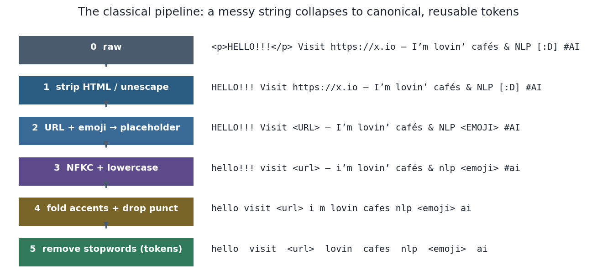
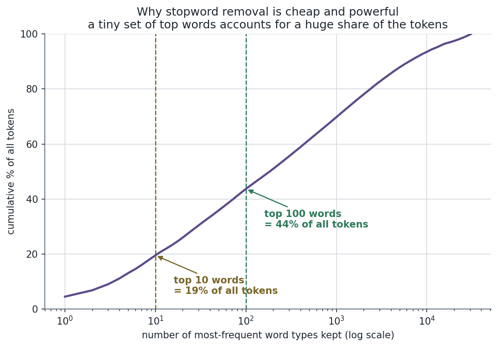
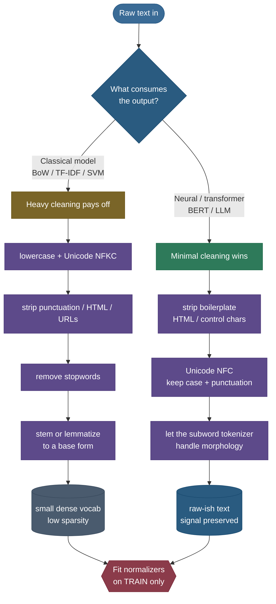

# Text Preprocessing & Normalization: turning messy text into clean, consistent units

Open any real text dataset — scraped web pages, product reviews, tweets, support tickets — and the first thing that hits you is the *mess*. The same word arrives as `Apple`, `apple`, `APPLE`, and `apple,`. There are HTML tags nobody wants, URLs, `@mentions`, emoji, smart quotes, accented characters that were typed three different ways, and the word "don't" written as `don't`, `don't`, and `do n't`. A model that has never seen this raw soup before sees **four different tokens where a human sees one word**. Every one of those spurious distinctions is a column in your feature matrix that splits the signal, dilutes the counts, and makes the model work harder to learn less.

**Text preprocessing** is the disciplined cleanup that happens *before and around* tokenization to fix this. Its job is captured in a single sentence worth memorizing: **reduce sparsity while preserving signal.** Collapse the meaningless surface variation (casing, Unicode quirks, stray punctuation) so that things which *mean* the same thing *look* the same to the model — but stop exactly before you start erasing the variation that actually carries meaning (the casing that distinguishes `Apple` the company from `apple` the fruit, the word "not" that flips a sentiment, the punctuation a parser leans on).

That tension — **collapse noise, keep signal** — is the entire subject. Get it right and a humble bag-of-words model becomes a strong baseline; get it wrong and you either drown the model in sparse near-duplicates or amputate the very features it needed. And the right answer is **not the same for every model**: a classical TF-IDF + logistic-regression pipeline *wants* aggressive cleaning, while a modern transformer *wants almost none of it*. Knowing which, and why, is the most useful thing this page will teach you.

By the end you'll be able to:

- explain **why** raw text is noisy and what "reduce sparsity, preserve signal" means concretely;
- derive **Zipf's law** and use it to explain *why* stopword removal and stemming work at all;
- run the **classic preprocessing pipeline** stage by stage, and for each step say **when it helps and when it hurts** — watching the vocabulary shrink at every step;
- derive the difference between **stemming** (crude rule-based chopping) and **lemmatization** (dictionary + POS), and predict where they disagree;
- argue the **stopword-removal trade-off** from first principles and show it with a measured example;
- explain the **modern shift to minimal preprocessing** for BERT/LLMs — and *why* "less is more" there but not for classical models;
- avoid the **train/inference and leakage** mistakes that quietly poison real pipelines.

> **Note:** preprocessing is *adjacent* to tokenization, not the same thing. **Normalization** decides *what the characters and words look like*; **tokenization** decides *how the cleaned text is split into the units a model consumes*. This page covers the cleanup; the splitting — BPE, WordPiece, SentencePiece, Unigram — is its own deep topic in [Tokenization & Subword Algorithms](../02-Tokenization-and-Subword-Algorithms/02-Tokenization-and-Subword-Algorithms.md). Wherever a step is really "a tokenization decision," we point there rather than duplicate it.

---

## The problem: raw text is noisy, inconsistent, and high-variance

To feel why preprocessing exists, look at one ordinary line of user-generated text:

```
<p>HELLO!!!</p> Visit https://x.io — I’m lovin’ cafés & NLP 😀 #AI
```

A model that treats raw strings as features now has to contend with, simultaneously:

- **Markup** — `<p>…</p>` is layout, not language. It should never become a feature.
- **Casing** — `HELLO` and `hello` are the same word shouted; counted separately they split the signal.
- **Punctuation & emphasis** — `!!!`, em-dash `—`, the emoji 😀; sometimes noise, sometimes signal (sentiment loves `!!!` and 😀).
- **URLs, @mentions, #hashtags** — structurally distinct; you usually want to *normalize* (replace with a placeholder) rather than keep every unique URL as its own token.
- **Unicode variation** — `café` can be typed as `cafe` + a combining accent, or as a single precomposed `é`; the smart apostrophe `'` in `I'm` differs from the ASCII `'`. **Identical-looking text can be different byte sequences.**
- **Contractions** — `I'm`, `lovin'` (a clipped `loving`), `don't`. Whether you expand these changes the token stream.
- **Numbers** — `2024`, `3.14`, `$5`: keep, drop, or replace with a `<NUM>` placeholder?

Every one of these multiplies the number of distinct surface forms the model must learn from. The cost is **sparsity**: in a bag-of-words representation, more distinct forms means a wider, emptier feature matrix, each form seen fewer times, and a weaker statistical signal per feature. Preprocessing is the lever that collapses that surface variation back down.



> **Note:** the goal is *not* "make the text as small as possible." It's "make things that mean the same thing look the same — and stop there." Over-collapsing (e.g. lowercasing `US` → `us`, or stemming `university` and `universe` to the same stem) destroys meaning. Under-collapsing leaves the model drowning in near-duplicates. The craft is finding the line, and it moves depending on the downstream model.

---

## Intuition: a copy-editor with a strict style guide

Think of preprocessing as a **copy-editor preparing a manuscript for one specific printer**. The copy-editor enforces a style guide: straighten the smart quotes, normalize the dashes, lowercase the headings *if the printer can't render caps*, expand the abbreviations the printer's typesetter won't recognize. The goal is to remove inconsistencies that would confuse *this printer* — not to rewrite the author's meaning.

The crucial twist, and the test the analogy must survive: **the right style guide depends on the printer.** A cheap printer that can only set lowercase ASCII (a classical bag-of-words model) needs heavy editing — fold everything to a small, consistent character set. A sophisticated printer with its own font engine that handles case, punctuation, and ligatures natively (a pretrained transformer with a subword tokenizer) needs *almost no editing* — over-edit and you strip out exactly the typographic cues it was built to use. Same manuscript, opposite amounts of preparation, because the consumer is different. Hold that image: **preprocessing is consumer-specific cleanup.**

The analogy even predicts the failure modes. Over-editing for the sophisticated printer (lowercasing a cased BERT's input) is like bleaching out the italics an expert typesetter would have used — you've destroyed information the consumer could read. Under-editing for the cheap printer (handing raw mixed-case Unicode to a bag-of-words model) is like sending a manuscript full of inconsistent spellings to a typesetter who treats every spelling as a different word. The skill is matching the edit to the reader, every time.

---

## Why it matters

Three reasons this small, unglamorous step earns real attention:

1. **It silently sets your ceiling.** Preprocessing decides *what signal even reaches the model.* No amount of model tuning recovers a feature you deleted at stage one (the casing you folded away, the negation you removed as a stopword). It's the first and least reversible decision in the pipeline.
2. **The choices measurably move accuracy.** As we'll show below with numbers, stopword removal plus stemming can shrink a TF-IDF vocabulary by ~30% while *holding or slightly improving* a linear classifier — a real, measurable win for classical models. The same operations applied to a transformer pipeline *hurt*.
3. **It's a classic interview filter.** "Stemming vs lemmatization?", "When does stopword removal hurt?", "Why do modern NLP pipelines do *less* preprocessing?" — these separate people who memorized a tutorial from people who understand the sparsity-vs-signal trade-off. This page is built to make you the latter.

---

## The math: Zipf's law, and why preprocessing works at all

Before any pipeline, there's a startlingly regular fact about language that *motivates* the whole enterprise. Rank every distinct word in a corpus by how often it occurs — most frequent is rank 1, next is rank 2, and so on. **Zipf's law** says the frequency of the word at rank $r$ falls off as a power of the rank:

$$f(r) \;\approx\; \frac{C}{r^{s}}, \qquad s \approx 1,$$

where:

- $r$ = the **rank** of a word (1 = most frequent),
- $f(r)$ = the **frequency** (raw count) of the word at rank $r$,
- $C$ = a corpus-specific constant (essentially the frequency of the top word),
- $s$ = the **exponent**, empirically close to **1** for natural language.

> **Source / derivation:** [Manning, Raghavan & Schütze, *Introduction to Information Retrieval*, §5.1.2 "Zipf's law"](https://nlp.stanford.edu/IR-book/html/htmledition/zipfs-law-modeling-the-distribution-of-terms-1.html) and [Jurafsky & Martin, *Speech and Language Processing* (3rd ed.), Ch. 2](https://web.stanford.edu/~jurafsky/slp3/2.pdf) — both state the rank-frequency power law and the $s\approx 1$ exponent for English text.

**Why the log-log line.** Take $\log_{10}$ of both sides of $f(r) = C\,r^{-s}$:

$$\log_{10} f(r) \;=\; \log_{10} C \;-\; s\,\log_{10} r.$$

This is a **straight line** in $(\log r, \log f)$ coordinates, with slope $-s$ and intercept $\log_{10} C$. So the single most useful empirical check is: plot rank vs frequency on log-log axes and see if the points fall on a line of slope $\approx -1$. They do — strikingly. Fitting the slope on our corpus (20 Newsgroups, ranks 1–1000) gives **$s \approx 0.95$**, almost exactly the Zipf prediction:


**Now read the two halves of that line, because each one motivates a preprocessing step:**

- **The head is steep and dominated by function words.** The top-ranked words are `the`, `of`, `a`, `and`, `is` — low-content glue. Because the curve is so steep at the head, a *tiny* number of word types carries an enormous share of the *tokens*. Measured on our corpus: the **top 10 word types account for ~19% of all tokens, and the top 100 for ~44%.** That's the whole justification for **stopword removal** — a list of a few hundred words strips out a large fraction of the token stream while deleting almost none of the topical meaning.



- **The tail is long and full of rare variants.** Out at high rank, the curve is a vast plateau of words seen **once or twice** — and crucially, this tail is bloated by *surface variants of the same underlying word*: `run`, `runs`, `running`, `ran`; `café` typed two ways; `Apple` vs `apple`. Each variant is its own rare type. That's the justification for **stemming, lemmatization, and Unicode/case normalization** — they *collapse the tail* by merging variants onto a single canonical form, turning many one-count types into one well-attested type.

> **Note:** Zipf's law is *why* preprocessing has leverage. If word frequencies were uniform, collapsing variants would barely help. Because they follow a steep power law, (a) a few stopwords own most of the token mass (cheap to remove, big effect) and (b) the rare tail is where sparsity lives (collapsing it is exactly where you reclaim statistical signal). The pipeline below is just the set of operations that attack the head and the tail of this curve.

**The vocabulary-size effect, made quantitative.** We can watch the tail collapse directly. Run the corpus through the pipeline and count the number of *distinct* tokens (the **vocabulary**, or "types") after each step:


The vocabulary falls from **61,296 → 23,365** distinct types (≈2.6× smaller) — and *that* is the operational meaning of "reduce sparsity." Each collapsed type is one fewer near-empty column in the feature matrix, and its counts get folded into a surviving, better-attested type. (The biggest single cut is tokenization + NFKC, which removes the case-and-punctuation explosion of naive whitespace splitting; stemming delivers the second big cut by merging inflections.)

---

## The classic preprocessing pipeline, step by step

Here is the canonical pipeline a classical NLP system runs, in order. For **every** step the only interesting question is *when it helps vs when it hurts* — so we answer that for each, rather than just listing the operation.



### Step 0 — Sentence and word segmentation

Before you normalize words you have to find them. **Sentence segmentation** splits a document into sentences (harder than "split on `.`" — abbreviations like `Dr.` and `U.S.` and decimals `3.14` all contain periods that don't end sentences). **Word segmentation / tokenization** then splits each sentence into word-like units.

- **Helps:** every downstream step operates on tokens, so you need *some* segmentation. For languages with spaces (English) a rule-based splitter gets you far.
- **Hurts / is hard:** languages *without* spaces (Chinese, Japanese, Thai) need a learned segmenter; naive splitting fails entirely. And how you split `New York`, `don't`, or `state-of-the-art` is itself a modeling choice.

This is genuinely the same machinery as tokenization, so we keep it brief here — the full treatment of **how text becomes the integer tokens a model consumes** (rule-based vs subword) lives in [Tokenization & Subword Algorithms](../02-Tokenization-and-Subword-Algorithms/02-Tokenization-and-Subword-Algorithms.md). For the rest of this page, assume we can split into tokens and focus on *normalizing* them.

### Step 1 — Case folding (lowercasing)

The single most common normalization: map everything to lowercase so `Apple`, `apple`, and `APPLE` count as one token.

- **Helps:** kills a huge amount of pointless sparsity. In a TF-IDF model, sentence-initial `The` and mid-sentence `the` are the same word; folding case merges them and tightens the statistics. (On our corpus, lowercasing alone cuts the vocabulary 61,296 → 55,173, a 10% drop, before any other step.) For search and topic models this is almost always right.
- **Hurts:** **casing carries signal you sometimes need.** `Apple` (company) vs `apple` (fruit); `US` (country) vs `us` (pronoun); `WHO` (organization) vs `who`. For **named-entity recognition (NER)**, part-of-speech tagging, and any task where capitalization is a feature, blind lowercasing erases information the model wanted — which is exactly why BERT ships in both `cased` and `uncased` variants.

> **Tip:** "lowercase everything" is the right default for bag-of-words/search and the *wrong* default for NER. A common middle path — **truecasing** — learns the canonical case of each token from context, keeping `Apple` capitalized when it's the company. If you're doing NER, prefer a cased model and do **not** lowercase.

> **Gotcha:** lowercasing is not language-trivial. Turkish has a dotless `ı` and dotted `i`; the naive `lower()` of `I` is wrong in Turkish locale. German `ß` uppercases to `SS`. Greek final sigma `ς` vs `σ`. If you process multilingual text, use locale-aware or Unicode-default case folding, not a blind `.lower()`.

### Step 2 — Unicode normalization (NFC / NFD / NFKC / NFKD)

This is the step most people skip and most regret. **The same visible text can be different byte sequences**, and unless you normalize, those count as different tokens.

Unicode defines two axes of normalization, giving four forms:

- **Composition vs decomposition.** `é` can be one code point (precomposed `U+00E9`) or two (`e` + combining acute `U+0301`). **NFC** *composes* to the single code point; **NFD** *decomposes* to base + combining marks.
- **Canonical vs compatibility.** Canonical equivalence (`C`/`D`) only merges things that are *truly* the same character (the two ways of writing `é`). Compatibility equivalence (`K`, as in NF**K**C/NF**K**D) additionally folds *formatting* variants: the ligature `fi` → `fi`, fullwidth `Ａ` → `A`, the fraction `½` → `1⁄2`, superscript `²` → `2`, Roman-numeral `Ⅸ` → `IX`.

So: **NFC** = canonical compose (the safe default for *storage* — keeps text human-faithful while merging the byte-level duplicates). **NFKC** = compatibility compose (the right default for *search and indexing* — it aggressively folds look-alikes so a query matches regardless of which variant was typed).

> **Source / derivation:** [Unicode Standard Annex #15 — Normalization Forms (UAX #15)](https://unicode.org/reports/tr15/) — the authoritative specification of NFC / NFD / NFKC / NFKD and the canonical vs compatibility equivalence relations summarized above.


- **Helps:** without normalization, `café` typed two ways are **different strings** → two vocabulary entries, split counts, and silently missed search hits. NFC fixes the canonical duplicates; NFKC additionally unifies compatibility variants. Essential for any multilingual or web-scraped corpus.
- **Hurts:** NFKC is **lossy** — it throws away distinctions that occasionally matter (`²` becomes `2`, fullwidth becomes ASCII), and decomposition+strip removes accents that are *meaningful* in some languages (`resume` ≠ `résumé`, `peña` ≠ `pena` in Spanish). Choose NFC when you must preserve such distinctions; reserve NFKC for search-style matching where folding is the goal.

> **Gotcha — the homoglyph / spoofing angle.** Different code points can render *identically*: Cyrillic `а` (U+0430) looks exactly like Latin `a` (U+0061). Normalization does **not** merge these (they're genuinely different letters), which is how phishing domains and spam evade naive filters. If you need to defend against homoglyph spoofing, you need an explicit confusables map ([Unicode UTS #39](https://www.unicode.org/reports/tr39/)), not NFKC.

> **Note:** in Python it's one line: `unicodedata.normalize("NFKC", text)`. Doing it (with the right form) is nearly free and prevents a whole class of "why doesn't my search match?" bugs.

### Step 3 — HTML, URLs, mentions, hashtags, emoji (especially social text)

Web and social text is full of structured noise. The decision is usually **strip or replace-with-placeholder**, not "keep as-is":

- **HTML / markup** — strip tags (`<[^>]+>`) and unescape entities (`&amp;` → `&`). Markup is layout, never language.
- **URLs** — replace with a single `<URL>` token rather than keeping each unique link as its own vocabulary entry (which would be useless one-off features).
- **@mentions / #hashtags** — on social text these are signal. You might keep `#nlp` as a token, or split `#MachineLearning` into words, or replace `@user` with a `<USER>` placeholder. Domain-specific.
- **Emoji** — frequently *high-signal for sentiment* (😀 vs 😡). Don't blindly delete them; consider mapping to a sentiment-bearing token (`😀` → `<EMOJI_POS>`) or keeping them, especially for sentiment and social tasks.

- **Helps:** removing markup and collapsing every URL to one placeholder dramatically cuts useless sparsity on web data. Replacing rather than deleting keeps the *fact* that "a URL was here" as a feature.
- **Hurts:** **over-stripping deletes sentiment and emphasis.** Strip `!!!` and 😀 from "best movie ever 😀!!!" and you've thrown away exactly what a sentiment model wanted. On social text, punctuation and emoji are features, not noise.

### Step 4 — Punctuation, special characters, and whitespace

- **Punctuation** — for bag-of-words, periods and commas are usually dropped (they're not content words). But `?` and `!` carry tone; `n't` and `'s` interact with contractions; and for **parsing or sequence models**, punctuation is structurally load-bearing (it marks clause boundaries). Drop it for BoW; keep it for syntactic tasks.
- **Whitespace** — collapse runs of spaces/tabs/newlines into single spaces, strip leading/trailing. Almost always safe and worth doing.
- **Control / zero-width characters** — strip invisible junk (zero-width space U+200B, BOM U+FEFF) that sneaks in from copy-paste and breaks tokenizers.

- **Helps:** whitespace and control-char cleanup is nearly free and removes invisible bugs. Dropping punctuation tightens a BoW vocabulary.
- **Hurts:** dropping `?`/`!`/emoji for sentiment, or dropping all punctuation before a parser, removes real structure.

### Step 5 — Numbers

Numbers are a classic sparsity trap: every distinct integer is its own token, and most appear once (they live deep in the Zipf tail).

- **Keep** — when the exact value matters (financial text, structured extraction).
- **Replace** — map all numbers to a `<NUM>` placeholder when only the *presence* of a number matters (most classification). This collapses thousands of one-off tokens into one feature.
- **Normalize** — canonicalize formats (`1,000` → `1000`, `3.0` → `3`) so the same quantity isn't split across surface forms.

- **Helps:** `<NUM>` replacement is a big sparsity win for topic/classification models where "there was a number" is the useful bit.
- **Hurts:** for tasks that *reason over quantities* (numeric QA, math, finance), erasing the actual value is fatal. Don't `<NUM>`-out the numbers a model needs to compute with.

### Step 6 — Contraction expansion

Expanding `don't` → `do not`, `I'm` → `I am`, `won't` → `will not` regularizes the token stream so the negation word `not` appears explicitly.

- **Helps:** surfaces hidden function words (the `not` inside `don't`), which matters for sentiment and for models that key on negation. Also reduces `'`-splitting inconsistencies across tokenizers.
- **Hurts:** it's dictionary-based and brittle — `it's` is ambiguous (`it is` vs `it has`), and informal clippings (`lovin'`, `gonna`) aren't standard contractions. Over-expanding can introduce errors. For subword transformers it's usually unnecessary (the tokenizer handles `'t` consistently).

### Step 7 — Stopword removal (derive the trade-off)

**Stopwords** are extremely frequent, low-content function words — `the`, `is`, `at`, `and`, `of`, `a`. Classical pipelines often drop them.

We already *derived* why this helps, from Zipf: stopwords sit at the **head** of the rank-frequency curve, so they (a) carry a huge share of the token mass (top 10 words ≈ 19% of tokens on our corpus) while (b) being **near-uniformly distributed** across documents, so they carry almost **zero discriminative information** for tasks like topic classification — every document has lots of `the`. Removing them strips out high-magnitude, low-information dimensions: the feature space gets denser in signal, and distance/similarity computations stop being dominated by `the`-counts. (TF-IDF already *down-weights* such words via the IDF term; stopword removal is the blunter, complementary move of dropping them entirely.)

But here's the other side, and the interview trap:

> **Gotcha — stopwords are not always noise.** Function words carry meaning for many tasks:
> - **Negation:** "this movie is **not** good." Drop the stopword `not` and the model sees "movie good" — the sentiment **flips**. For sentiment analysis, removing `not`/`no`/`never` is actively harmful.
> - **Sequence / structure tasks:** for POS tagging, parsing, sequence labeling, and machine translation, function words *are* the structure. You never strip them.
> - **Phrase meaning:** "to be or not to be" is **entirely** stopwords; "the who" (the band) vs "who"; "vitamin a" vs "vitamin". Stopword lists are crude and miss these.

So the honest rule: **stopword removal helps bag-of-words / TF-IDF + classical models on topic-like tasks (it cuts noise dimensions), and hurts tasks where function words matter (sentiment with negation, any sequence model, phrase-sensitive retrieval).** We'll *measure* both sides shortly.

### Step 8 — Stemming vs lemmatization (the headline comparison)

Both reduce inflected/derived word forms to a common base so `study`, `studies`, `studying`, `studied` count as one thing — collapsing the Zipf tail that morphology creates. They do it very differently.

**Stemming** is **crude, rule-based suffix stripping.** The classic **Porter stemmer** (Martin Porter, 1980) applies an ordered cascade of rewrite rules to chop affixes. A few of its actual rules, to demystify it:

- `SSES → SS` (`caresses` → `caress`)
- `IES → I` (`ponies` → `poni`)
- `S → ` (`cats` → `cat`)
- `(*v*) ING → ` and `(*v*) ED → ` (strip `-ing`/`-ed` only if a vowel remains in the stem: `running` → `run`, but not `sing` → `s`)

> **Source / derivation:** [Porter, *An algorithm for suffix stripping* (1980), Program 14(3)](https://tartarus.org/martin/PorterStemmer/def.txt) — the original ordered rule cascade (the rules above are quoted from it), and [Manning, Raghavan & Schütze, IR Book §2.2.4 "Stemming and lemmatization"](https://nlp.stanford.edu/IR-book/html/htmledition/stemming-and-lemmatization-1.html) for the stemming-vs-lemmatization framing.

It's **fast** (pure string rules, no dictionary) and language-cheap (Porter, and its improved successor **Snowball** / "Porter2", exist for many languages). But it's blind to meaning, so it **over-stems** and produces non-words: `studies` → `studi`, `happily` → `happili`, `organization` → `organ` (merging it with `organ`!). It can also **under-stem** (miss related forms) and **mis-stem** (conflate unrelated words: `university`/`universe` → `univers`).

**Lemmatization** is **dictionary + morphological analysis, POS-aware.** It maps a word to its real **lemma** (the canonical dictionary form), using a lexicon (e.g. WordNet) and the word's **part of speech**. Because it knows grammar, it returns real words and handles irregulars: `better` → `good` (as an adjective), `was`/`is`/`are` → `be`, `mice` → `mouse`, `studies` → `study`. The cost: it's **slower**, needs a dictionary, and **needs the POS** to be correct (`saw` → `see` as a verb, but `saw` the tool as a noun).


The figure is generated by actually running NLTK's `PorterStemmer` and `WordNetLemmatizer` — these are the real outputs, not hand-picked. Notice the rows that **differ**: the stemmer leaves `better` unchanged and mangles `are`→`are`/`is`→`is` (it can't reach the irregular lemma `be`), while the lemmatizer correctly resolves `better`→`good` and `are`/`is`→`be`. That's the whole distinction in one table: **stemming is fast and crude; lemmatization is slower and correct.**

> **Tip:** rule of thumb — **stem when speed/recall matters and ugliness is fine** (large-scale search/IR, where `studi` matching `study` and `studies` is a feature); **lemmatize when you need real words and correctness** (downstream features for a model, linguistic analysis, anything a human reads). Many modern pipelines do *neither* — see the next section.

### Steps 9–10 — Spelling correction and language detection (briefly)

- **Spelling correction** typically uses **edit distance** (Levenshtein: the minimum insertions/deletions/substitutions to turn one string into another) to map a misspelling to the nearest dictionary word (`recieve` → `receive`). Useful on noisy user text, but risky — it can "correct" valid rare words, names, and code. Apply with care; a context-aware (noisy-channel) model beats raw edit distance.

  To make "edit distance" concrete: the Levenshtein distance between `recieve` and `receive` is **2** — swapping the `ie`→`ei` is *not* one operation but two single-character edits (substitute `i`→`e` at one position, substitute `e`→`i` at the next), or equivalently a delete + insert. The classic dynamic-programming recurrence fills a table $D[i][j]$ = the cost of aligning the first $i$ characters of one string with the first $j$ of the other, taking the minimum of (match/substitute, insert, delete) at each cell.

  > **Source / derivation:** [Jurafsky & Martin, *Speech and Language Processing* (3rd ed.), Ch. 2 §2.5 "Minimum Edit Distance"](https://web.stanford.edu/~jurafsky/slp3/2.pdf) — the dynamic-programming recurrence $D[i][j]=\min(D[i{-}1][j]{+}1,\ D[i][j{-}1]{+}1,\ D[i{-}1][j{-}1]{+}\mathbb{1}[a_i\ne b_j])$ and the worked `intention`→`execution` example.

  The takeaway for preprocessing: spelling correction is a *normalization* step (collapse misspellings onto canonical forms, cutting sparsity in the Zipf tail), but an aggressive one that can erase real rare tokens, so reserve it for genuinely noisy user text.
- **Language detection** identifies the language of each document (often via character n-gram models) so you can route to the right downstream pipeline (the right stopword list, stemmer, tokenizer). Essential for multilingual corpora — you don't want to run an English stemmer on French text. A practical gotcha: short, code-switched, or emoji-heavy social posts are hard to classify, so language detectors are least reliable on exactly the noisy text that most needs routing — budget for a confidence threshold and a fallback.

---

## The modern shift: for transformers, less is more

Everything above describes the **classical** pipeline. Modern neural and transformer pipelines deliberately do **far less** of it — often nothing beyond stripping boilerplate and a light Unicode normalize. This isn't laziness; it follows directly from how these models work.

**Why heavy cleaning helps classical models.** A bag-of-words/TF-IDF model has **no notion of morphology, subwords, or context.** To it, `run` and `running` are simply two unrelated dimensions. So *you* have to do the linguistic work up front: lowercase to merge case variants, stem/lemmatize to merge inflections, drop stopwords to remove uninformative dimensions. Every collapse you perform hands the model a smaller, denser, more informative feature space it could never have built itself.

**Why heavy cleaning hurts transformers.** A pretrained transformer (BERT, GPT, Llama) is the opposite:

1. **The subword tokenizer already handles morphology.** BPE/WordPiece split `running` into `run` + `##ning`, so the model *sees* the shared `run` root with no stemming required. Stemming first would just corrupt the input the tokenizer expects. (This is exactly the subword idea from [Tokenization & Subword Algorithms](../02-Tokenization-and-Subword-Algorithms/02-Tokenization-and-Subword-Algorithms.md).)
2. **It was pretrained on raw-ish text.** The model learned its statistics over text *with* casing, punctuation, and stopwords. Feeding it aggressively cleaned text creates a **train/serve distribution mismatch** — it's now seeing inputs unlike anything in pretraining.
3. **It actively uses the signal cleaning would delete.** Casing tells a cased BERT that `Apple` is likely an entity; punctuation gives the model clause structure; stopwords (`not`, `of`, `the`) carry the syntactic and negation signal that self-attention is built to exploit. Lowercase + de-stopword + stem and you've stripped out exactly the features the model relies on. This is why **contextual** models ([Contextual Embeddings: ELMo & BERT](../06-Contextual-Embeddings-ELMo-BERT/06-Contextual-Embeddings-ELMo-BERT.md)) want minimal preprocessing where bag-of-words models wanted maximal.

So the modern recipe is: **strip true boilerplate (HTML, control chars), apply a light Unicode normalize (often NFC), then hand raw-ish text straight to the model's own tokenizer — and otherwise leave it alone.** No lowercasing (unless you specifically chose an uncased model), no stopword removal, no stemming, no lemmatization.


> **Source / derivation:** [Kudo & Richardson, *SentencePiece* (2018)](https://arxiv.org/abs/1808.06226) — the canonical statement that modern tokenization ingests **raw text** and folds normalization + segmentation into one learned, reversible step, which is *why* transformer pipelines need almost no upstream preprocessing.

> **Note:** this is the most-asked "modern NLP" preprocessing question, and the clean answer is one sentence: **classical models can't do linguistic work themselves, so you do it for them with heavy cleaning; pretrained transformers already do it (and use the raw signal), so cleaning only removes information.** Match the preprocessing to the consumer.

> **Gotcha:** "minimal" is not "zero." LLM training corpora get *heavy* document-level cleaning — dedup, quality filtering, removing boilerplate and junk pages, stripping PII. That's **corpus curation**, which is different from the **token-level normalization** (lowercase/stem/stopword) we're contrasting. Transformers want minimal *token-level* normalization, but their training data is curated aggressively at the *document* level.

---

## Worked example 1 — one messy sentence through the full pipeline

Let's run the whole classical pipeline on a single messy line and watch the text transform at each stage. (This is exactly what the code at the end reproduces, and what the pipeline figure above visualizes.)

Starting string:

```
<p>HELLO!!!</p> Visit https://x.io — I’m lovin’ cafés & NLP 😀 #AI
```

| Stage | Operation | Result |
|---|---|---|
| 0 | raw | `<p>HELLO!!!</p> Visit https://x.io — I'm lovin' cafés & NLP 😀 #AI` |
| 1 | strip HTML tags + unescape entities | `HELLO!!! Visit https://x.io — I'm lovin' cafés & NLP 😀 #AI` |
| 2 | replace URLs and emoji with placeholders | `HELLO!!! Visit <URL> — I'm lovin' cafés & NLP <EMOJI> #AI` |
| 3 | Unicode NFKC + lowercase | `hello!!! visit <url> — i'm lovin' cafés & nlp <emoji> #ai` |
| 4 | accent-fold + drop punctuation + collapse whitespace | `hello visit <url> i m lovin cafes nlp <emoji> ai` |
| 5 | tokenize | `[hello, visit, <url>, i, m, lovin, cafes, nlp, <emoji>, ai]` |
| 6 | remove stopwords (`i`, `m` both drop) | `[hello, visit, <url>, lovin, cafes, nlp, <emoji>, ai]` |

The final token list — `['hello', 'visit', '<url>', 'lovin', 'cafes', 'nlp', '<emoji>', 'ai']` — is the **real output** of `preprocess()` from the code below. Watch what each stage *bought*: stage 1 removed layout, stage 2 collapsed a unique URL and an emoji into reusable placeholders, stage 3 merged casing and Unicode variants, stage 4 folded `cafés`→`cafes` (so it matches `cafe` elsewhere), and stage 6 dropped a contentless pronoun. A messy, high-variance string became a short list of canonical, reusable tokens — **reduced sparsity** — though notice we also lost the `!!!` emphasis and the emoji's *direction* of sentiment, **a real signal cost** we'd avoid (by keeping the emoji and `!!!`) if this were a sentiment task.

> **Note:** order matters. You strip HTML *before* lowercasing (so tag-matching is reliable), Unicode-normalize *before* tokenizing (so `café`'s two spellings tokenize identically), and remove stopwords *after* tokenizing (you need tokens to compare against the list). A pipeline with steps in the wrong order produces subtly wrong output.

---

## Worked example 2 — stemming vs lemmatization, by hand

Take the word list and apply each method, predicting where they disagree, then check against the real outputs (the table figure above and the code below):

| Word | POS | Porter stem | Lemma | Agree? |
|---|---|---|---|---|
| `studies` | noun | `studi` | `study` | ✗ — stemmer makes a non-word |
| `studying` | verb | `studi` | `study` | ✗ |
| `better` | adj | `better` | `good` | ✗ — only the lemmatizer knows the irregular |
| `best` | adj | `best` | `best` | ✓ |
| `are` | verb | `are` | `be` | ✗ — stemmer can't reach the irregular lemma |
| `is` | verb | `is` | `be` | ✗ |
| `mice` | noun | `mice` | `mouse` | ✗ — irregular plural; stemmer can't |
| `organization` | noun | `organ` | `organization` | ✗ — stemmer **over-stems** into `organ` |
| `running` | verb | `run` | `run` | ✓ |

The pattern is unmistakable: **they agree on simple regular suffixes (`running`→`run`) and on already-base forms (`best`), and disagree on (a) irregulars (`better`/`good`, `mice`/`mouse`, `are`/`be`), (b) cases where the stemmer over-stems into a different word (`organization`/`organ`), and (c) cases where the stemmer just produces garbage (`studi`).** If a human will read the output, or it feeds a model as a feature, the lemma is better. If it's an internal search index and speed/recall rule, the stem is fine.

> **Gotcha:** lemmatization needs the **right POS**. `WordNetLemmatizer` defaults to noun, so `lemmatize("running")` returns `running` (noun reading) unless you pass `pos="v"` to get `run`. In a real pipeline you run a POS tagger first and feed its tag to the lemmatizer — otherwise you get half-lemmatized output and wonder why. (POS tagging itself is the topic of [Sequence Labeling: POS & NER](../09-Sequence-Labeling-POS-and-NER/09-Sequence-Labeling-POS-and-NER.md).)

---

## Worked example 3 — measured: stopword + stemming effect on a classifier

Numbers beat assertions. On **20 Newsgroups** (4 categories: baseball, medicine, graphics, politics-guns), we train TF-IDF + logistic regression under three increasingly aggressive cleaning configs and measure **vocabulary size** and **test accuracy** (this is the figure above, and the code reproduces it exactly):

| Config | Vocabulary (TF-IDF features) | Test accuracy |
|---|---|---|
| raw (lowercase only) | 12,399 | 87.6% |
| + stopword removal | 12,259 | 88.3% |
| + Porter stemming | 8,814 | 88.5% |

Read it carefully:

- **Stopword removal** barely changes the vocabulary *count* (stopwords are *few distinct words*, just very frequent — exactly the Zipf head) but nudges accuracy **up** ~0.7 points — it removed high-magnitude, low-information dimensions, so the classifier's geometry improved.
- **Stemming** is the big vocabulary cut: 12,259 → **8,814**, about a **1.4× reduction**, by merging inflected forms (`run`/`running`/`ran` → one feature). Accuracy holds (even ticks up) — the merged features are denser and the model has fewer, better dimensions.

So on a **topic-classification** task with a **classical** model, aggressive cleaning is a measurable win: ~30% smaller feature space at equal-or-better accuracy. **This is the case where the textbook pipeline earns its keep** — and it feeds directly into the [Bag-of-Words & TF-IDF](../03-Bag-of-Words-and-TF-IDF/03-Bag-of-Words-and-TF-IDF.md) representations that consume these tokens.

> **Tip:** the win is *task-dependent*. Re-run this on a **sentiment** task and remove `not` as a stopword and you'd watch accuracy *drop*, because you deleted the negation signal. The same operation helps one task and hurts another — which is the entire point.

---

## Worked example 4 — measured: the "don't over-clean for a transformer" contrast

Now the contrast that justifies the modern shift. Consider sentiment with negation and what each path does to **"this movie is not good"**:

- **Classical heavy-clean path:** lowercase → tokenize → **remove stopwords** (`this`, `is`, and crucially `not` are all on standard stopword lists!) → `[movie, good]`. The model now sees a **positive** bag-of-words for a **negative** review. The cleaning *inverted the label.*
- **Transformer minimal path:** feed `"this movie is not good"` straight to the tokenizer → the model sees `not` adjacent to `good` and its attention composes the negation correctly. **The signal that classical cleaning destroyed is exactly what the transformer uses.**

We can measure the stopword half directly with NLTK: `[t for t in "this movie is not good".split() if t not in STOP]` returns `['movie', 'good']` — the negation is gone. That single line is the whole argument against blindly de-stopwording a sentiment task.

And on Unicode, the same minimal-vs-heavy logic flips for a different reason. Run the measured normalization (worked in the figure and reproduced in code): `café` written with a combining accent (5 code points) and with a precomposed `é` (4 code points) are **different strings** until NFC/NFKC folds them into one. For a classical exact-match vocabulary, *not* normalizing splits the counts; for a transformer, a light NFC is still worth doing (so the tokenizer sees one form), but you stop at NFC and keep the case and punctuation the model wants.

The unifying lesson across all four examples: **every preprocessing step is a bet that the variation it collapses is noise. That bet is right for classical models on topic tasks and wrong for transformers and for tasks where the "noise" (negation, case, emoji, punctuation) is the signal.**

---

## Pitfalls & failure modes

The mistakes here are quiet — they don't crash, they just shift every downstream number. The ones that actually bite:

- **De-stopwording destroys negation.** `not`, `no`, `never` are on every standard stoplist. Strip them before a sentiment model and you invert labels (Worked example 4). **Fix:** keep a negation-aware stoplist (or none) for sentiment; never strip stopwords for sequence tasks.
- **Lemmatizing without a POS tag.** `WordNetLemmatizer` defaults to noun, so `lemmatize("running")` → `running`, not `run`. You get *half-lemmatized* output and wonder why your features look wrong. **Fix:** run a POS tagger first and pass `pos=`; or accept the noun default knowingly.
- **Skipping Unicode normalization.** `café` (precomposed) and `café` (combining) are different strings; without NFC they become two vocabulary entries and your search silently misses half its hits. **Fix:** `unicodedata.normalize("NFC", text)` (or NFKC for search) as the first character-level step.
- **Wrong step order.** Lowercase *before* stripping HTML and your `<P>`-vs-`<p>` tag regexes get flaky; tokenize *before* Unicode-normalizing and `café`'s two spellings tokenize differently. **Fix:** strip markup → normalize Unicode → lowercase → tokenize → drop stopwords, in that order.
- **`.lower()` on multilingual text.** Turkish dotless-`ı`, German `ß`→`SS`, Greek final-sigma all break a naive `.lower()`. **Fix:** locale-aware or Unicode default case-folding (`str.casefold()`), not `.lower()`, for multilingual corpora.
- **Over-stemming silently merges meanings.** `organization`→`organ`, `university`/`universe`→`univers`. The stem is a real word that means something *else*, so the bug is invisible until you inspect features. **Fix:** prefer lemmatization when correctness matters; spot-check the stemmer's output on your domain's vocabulary.
- **Leakage via `fit_transform` on the full dataset.** Fitting the vocabulary/IDF on train+test before the split leaks test information and inflates offline accuracy (see the next section). **Fix:** `fit` on train, `transform` on everything else.

---

## Reproducibility, train/inference consistency, and leakage

Preprocessing is *fit* on data just like a model, and the same discipline applies:

- **Fit normalizers on train only.** Anything *learned* from the corpus — the vocabulary, IDF weights, a truecasing model, a spelling lexicon, or a stopword list derived from frequencies — must be fit on the **training set only** and then *applied* to validation/test/production. Fitting on the full dataset leaks test information into training and inflates your offline numbers. (Concretely: call `TfidfVectorizer.fit` on train, then `.transform` on test — never `fit_transform` on the combined data.)
- **Train/inference consistency.** The **exact same** preprocessing must run at training and at inference. If you lowercased and stripped URLs in training but forget to at serving time, the model sees out-of-distribution inputs and silently degrades. The cleanest defense is to put preprocessing **inside** the model artifact (an sklearn `Pipeline`, or the tokenizer object) so it can't drift.
- **Determinism & versioning.** Pin the versions of your tokenizer, stemmer, stopword list, and Unicode tables — they change between library versions, and a silent change shifts every downstream feature. Log the preprocessing config alongside the model.

> **Gotcha:** the most common leakage in NLP isn't a fancy bug — it's calling `fit_transform` on the whole dataset before the train/test split, so the vocabulary and IDF weights have "seen" the test set. Split first, fit on train, transform the rest.

---

## Where it's used, and when to skip it

- **Classical / bag-of-words pipelines (TF-IDF + LogReg/SVM/NB), topic modeling, classical IR/search** — **use the full pipeline.** Lowercase, Unicode-normalize, drop stopwords, stem or lemmatize. The model can't do this itself and benefits measurably (Worked example 3).
- **Transformers / pretrained LLMs (BERT, GPT, Llama)** — **minimal.** Strip boilerplate, light Unicode normalize, hand raw-ish text to the model's tokenizer. No lowercasing/stemming/stopword removal (Worked example 4).
- **Sequence-labeling tasks (POS, NER, parsing)** — **keep case and punctuation**; never strip stopwords (function words are the structure). See [Sequence Labeling: POS & NER](../09-Sequence-Labeling-POS-and-NER/09-Sequence-Labeling-POS-and-NER.md).
- **Sentiment / social text** — **keep negation, punctuation, and emoji**; they're the signal.
- **Multilingual corpora** — language-detect first, then route to the correct per-language stopword list / stemmer / tokenizer.

> **Note:** a useful way to remember the spectrum: the **more capable and context-aware your model, the less preprocessing it needs** — because it can do the linguistic work itself and exploit the raw signal. Bag-of-words (no context) needs the most; a pretrained transformer (full context) needs almost none.

A few concrete edge cases that come up constantly in practice, and the call to make:

- **Code, logs, and identifiers.** Source code, stack traces, and JSON have `camelCase`, `snake_case`, paths, and brackets that carry meaning. Lowercasing and stripping punctuation here is destructive — `getUserId` and `get_user_id` are not "noise to fold." For code-aware tasks, preserve the structure (or use a code-aware tokenizer); for a coarse classifier you might split identifiers on case/underscore boundaries deliberately, which is a *choice*, not a default.
- **Domain jargon and units.** In clinical or scientific text, `mg`, `mL`, `T2`, `p53`, and dosages are signal, not stopword-like noise. A generic stemmer/stopword list mangles them (`p53` survives, but `T-cells` may not). Domain corpora usually need a domain-tuned stopword list and *no* aggressive number replacement.
- **User handles and product SKUs.** These are high-cardinality, mostly one-off tokens — exactly the kind of sparsity you *do* want to collapse (to a `<USER>` / `<SKU>` placeholder) for a classical model, while a retrieval system might keep them verbatim. The right move depends entirely on whether the *identity* or merely the *presence* of the token matters downstream.

The through-line: there is no universal "clean text" function. Each decision is "is this variation noise or signal *for my task and my model*?" — and the answer flips across the cases above.

---

## In production: how real systems do preprocessing

The pipeline above is the *concept*; here's how it actually ships, where the bodies are buried, and the numbers practitioners quote:

- **scikit-learn** folds light preprocessing into the vectorizer: `TfidfVectorizer(lowercase=True, token_pattern=..., stop_words=...)` runs the cleaning *inside* the fitted artifact, so train and inference can't drift. This is the single most common classical NLP preprocessing surface in the wild.
- **spaCy** runs an industrial-strength tokenizer + lemmatizer + POS tagger as one pipeline object (`nlp = spacy.load("en_core_web_sm")`), so the lemmatizer always gets the POS it needs — the Worked-example-2 gotcha, solved by design.
- **Hugging Face tokenizers** are the modern default for transformers: `AutoTokenizer.from_pretrained(...)` ships the model's *exact* normalization (often NFC/NFKC + a byte-level BPE) baked in, so you hand it raw text and it does the (minimal) right thing. The normalizer is part of the saved tokenizer config — pin it.
- **LLM pretraining corpora** invert the emphasis: token-level normalization is minimal, but *document-level* curation is enormous — dedup, quality classifiers, boilerplate/PII removal across trillions of tokens (this is the bulk of the engineering for datasets like C4, The Pile, RefinedWeb). "Minimal preprocessing" for transformers means minimal *per-token* normalization, **not** minimal data cleaning.
- **Search / IR engines** (Elasticsearch, Lucene) expose preprocessing as configurable **analyzers** — a chain of char filters → tokenizer → token filters (lowercase, stop, stemmer, ASCII-folding) applied identically at index time and query time, which is exactly the train/inference-consistency discipline made into infrastructure.

> **Gotcha (production):** the analyzer config at *index* time and *query* time must match. Index with a stemmer but query without it and `running` (indexed as `run`) won't match a query for `running` — a classic, maddening "why does search miss obvious hits?" bug that is purely a preprocessing-consistency failure.

---

## Code: run the pipeline, then measure

This is the from-scratch demo, end to end: the full pipeline on one messy sentence, the Zipf fit, the vocabulary shrinking step by step, the stemming-vs-lemmatization disagreements, the measured stopword/stemming effect on a real classifier, and Unicode normalization. It's **pure Python/numpy** (no tensors, no GPU) and runs on CPU in a few seconds. Every function shown is the canonical one in `text_preprocessing.py` — the same code that generates the figures above, so the prose, the figures, and this output cannot drift.

> **Runnable project and a step-by-step notebook:** the same verified code lives as a clean script and an executed teaching notebook next to this page — see the [step-by-step teaching notebook](code/01-Text-Preprocessing-and-Normalization.ipynb) and the [runnable demo script](code/text_preprocessing.py) (run it with `python text_preprocessing.py`). The figures are regenerated by [`make_figures_01.py`](code/make_figures_01.py), which imports the *same* functions.

```python
"""Text preprocessing & normalization, end to end. Pure Python/numpy (no tensors).
Verified on Python 3.12 (numpy 2.4, nltk 3.9, scikit-learn 1.9), CPU."""
import html, re, unicodedata
from collections import Counter
import numpy as np, nltk
for pkg in ["stopwords", "wordnet", "omw-1.4"]:
    nltk.download(pkg, quiet=True)
from nltk.corpus import stopwords
from nltk.stem import PorterStemmer, WordNetLemmatizer

STOP = set(stopwords.words("english"))
ps, lemm = PorterStemmer(), WordNetLemmatizer()
print("device: cpu (pure-Python/numpy)   numpy:", np.__version__)

# ---------- 1) full pipeline on one messy sentence ----------
def strip_accents(s):                       # NFD, then drop combining marks
    return "".join(c for c in unicodedata.normalize("NFD", s)
                   if unicodedata.category(c) != "Mn")

def preprocess(text):
    text = re.sub(r"<[^>]+>", " ", text)                 # strip HTML tags
    text = html.unescape(text)                           # &amp; -> &
    text = re.sub(r"https?://\S+", " <URL> ", text)      # normalize URLs
    text = re.sub(r"[\U0001F000-\U0001FAFF☀-➿]", " <EMOJI> ", text)  # emoji
    text = unicodedata.normalize("NFKC", text).lower()   # unicode + case fold
    text = strip_accents(text)                           # cafés -> cafes
    text = re.sub(r"[^a-z0-9<>\s]", " ", text)           # drop punctuation
    text = re.sub(r"\s+", " ", text).strip()             # collapse whitespace
    return [t for t in text.split() if t not in STOP]    # remove stopwords

msg = "<p>HELLO!!!</p> Visit https://x.io — I’m lovin’ cafés & NLP \U0001F600 #AI"
print("messy sentence ->", preprocess(msg))

# ---------- 2) Zipf's law: fit the rank-frequency slope ----------
from sklearn.datasets import fetch_20newsgroups
cats = ["rec.sport.baseball","sci.med","comp.graphics","talk.politics.guns"]
tr = fetch_20newsgroups(subset="train", categories=cats,
                        remove=("headers","footers","quotes"))
counts = Counter(w for d in tr.data for w in re.findall(r"[a-z0-9]+", d.lower()))
freqs = np.array(sorted(counts.values(), reverse=True), dtype=float)
ranks = np.arange(1, len(freqs) + 1, dtype=float)
mask = ranks <= 1000
slope, _ = np.polyfit(np.log10(ranks[mask]), np.log10(freqs[mask]), 1)
print(f"\nZipf slope (ranks 1..1000): {slope:.3f} (ideal -1)")
print("top-10 share of all tokens:", f"{freqs[:10].sum()/freqs.sum():.0%}")

# ---------- 3) stemming vs lemmatization ----------
print("\nstem vs lemma (word: stem | lemma):")
for w, pos in [("studies","n"),("better","a"),("mice","n"),("are","v"),
               ("organization","n"),("running","v")]:
    print(f"  {w:13s} {ps.stem(w):10s} | {lemm.lemmatize(w, pos=pos)}")

# ---------- 4) stopword removal can flip sentiment ----------
print("\nnegation:", [t for t in "this movie is not good".split() if t not in STOP])

# ---------- 5) measured: stopword/stemming effect on a classifier ----------
from sklearn.feature_extraction.text import TfidfVectorizer
from sklearn.linear_model import LogisticRegression
from sklearn.pipeline import make_pipeline
te = fetch_20newsgroups(subset="test", categories=cats,
                        remove=("headers","footers","quotes"))
tok = re.compile(r"[a-z]+")
def clean(t, drop_stop, do_stem):
    w = tok.findall(t.lower())
    if drop_stop: w = [x for x in w if x not in STOP]
    if do_stem:   w = [ps.stem(x) for x in w]
    return " ".join(w)
print("\nmeasured (TF-IDF + LogReg on 20 Newsgroups):")
for name, ds, st in [("raw (lowercase)",0,0),("+ stopwords",1,0),("+ stemming",1,1)]:
    Xtr = [clean(t, ds, st) for t in tr.data]
    Xte = [clean(t, ds, st) for t in te.data]
    clf = make_pipeline(TfidfVectorizer(min_df=2),
                        LogisticRegression(max_iter=1000, C=10, random_state=0)).fit(Xtr, tr.target)
    vocab = len(clf.named_steps["tfidfvectorizer"].vocabulary_)
    print(f"  {name:18s} vocab={vocab:6d}  acc={clf.score(Xte, te.target):.4f}")

# ---------- 6) measured: Unicode normalization collapses variants ----------
a = "café"            # e + COMBINING ACUTE  (5 code points)
b = "café"            # precomposed é         (4 code points)
print("\nunicode  equal raw?", a == b,
      "| equal after NFC?",
      unicodedata.normalize("NFC", a) == unicodedata.normalize("NFC", b))
print("         NFKC('file') ->", repr(unicodedata.normalize("NFKC", "file")),
      " NFKC('½') ->", repr(unicodedata.normalize("NFKC", "½")))
```

Real output (CPU, a few seconds):

```
device: cpu (pure-Python/numpy)   numpy: 2.4.6
messy sentence -> ['hello', 'visit', '<url>', 'lovin', 'cafes', 'nlp', '<emoji>', 'ai']

Zipf slope (ranks 1..1000): -0.948 (ideal -1)
top-10 share of all tokens: 19%

stem vs lemma (word: stem | lemma):
  studies       studi      | study
  better        better     | good
  mice          mice       | mouse
  are           are        | be
  organization  organ      | organization
  running       run        | run

negation: ['movie', 'good']

measured (TF-IDF + LogReg on 20 Newsgroups):
  raw (lowercase)    vocab= 12399  acc=0.8758
  + stopwords        vocab= 12259  acc=0.8829
  + stemming         vocab=  8814  acc=0.8849

unicode  equal raw? False | equal after NFC? True
         NFKC('file') -> 'file'  NFKC('½') -> '1⁄2'
```

> **Note:** four lines carry the whole argument: `Zipf slope -0.948` + `top-10 share 19%` (a few words own most tokens — *why* stopword removal works), `negation: ['movie', 'good']` (de-stopwording **destroyed** the negation), `vocab 12,399 → 8,814` at **equal-or-better accuracy** (heavy cleaning measurably *helps* a classical model), and `equal raw? False | equal after NFC? True` (Unicode normalization quietly fixes byte-level duplicates you'd otherwise never notice).

> **Tip:** to see the modern path, load a Hugging Face tokenizer (`AutoTokenizer.from_pretrained("bert-base-cased")`) and tokenize the *raw* messy sentence with **no** cleaning. You'll watch it split `lovin'` and `cafés` into subwords on its own — the morphology handling that makes stemming redundant for transformers.

---

## Recap and rapid-fire

**If you remember nothing else:** preprocessing exists to **reduce sparsity while preserving signal** — collapse the surface variation (case, Unicode, punctuation, inflection) that's noise, and stop before you erase the variation that's meaning. **Zipf's law** is *why* it works: a few function words own the head of the frequency curve (→ stopword removal) and a long tail of rare variants fills the bottom (→ stemming/normalization). The right *amount* depends on the consumer: **classical bag-of-words models can't do linguistic work themselves, so they want heavy cleaning (lowercase, stopwords, stem/lemmatize); pretrained transformers already do it and use the raw signal, so they want almost none.** Stemming is fast, crude suffix-chopping; lemmatization is slower, dictionary-and-POS-aware, and correct. And whatever you do, **fit on train only** and run the **same** steps at inference.

**Quick-fire — say these out loud:**

- *What does Zipf's law say, and why does it matter here?* The $r$-th most frequent word has frequency ≈ $C/r$ — a straight log-log line of slope ≈ −1. The steep head (few stopwords own most tokens) motivates stopword removal; the long tail (rare variants) motivates stemming/normalization.
- *Stemming vs lemmatization?* Stemming = blind rule-based suffix stripping (fast, makes non-words like `studi`); lemmatization = dictionary + POS → real lemmas (`better`→`good`, slower).
- *When does stopword removal hurt?* Sentiment with negation (drops `not`), any sequence/structure task (POS, NER, parsing), and phrase-sensitive retrieval — function words are signal there.
- *Why do transformers need less preprocessing?* The subword tokenizer handles morphology, they were pretrained on raw-ish text (cleaning causes distribution shift), and they *use* the case/punctuation/stopwords cleaning would delete.
- *NFC vs NFKC?* NFC = canonical compose (safe default, merges true duplicates); NFKC = compatibility compose (also folds ligatures/fullwidth/fractions — the right default for search, but lossy).
- *Why lowercase, and when not to?* It kills case-sparsity for BoW/search; **don't** for NER or any task where capitalization is a feature (use a cased model).
- *Biggest leakage mistake?* `fit_transform` on the whole dataset before the split — fit normalizers/vocab/IDF on **train only**.
- *Measured effect of stopwords + stemming on classical TF-IDF?* ~1.4× smaller vocabulary (12.4k → 8.8k here) at equal-or-better accuracy on topic classification.
- *Does preprocessing change with the model?* Yes — more capable/context-aware model ⇒ less preprocessing needed.

---

## References and further reading

The curated link library for this topic — start-here path, videos, courses, articles, papers, books, and internal cross-links — lives in a companion file so it can be reused as a standalone reference list:

**→ [Text Preprocessing & Normalization — references and further reading](01-Text-Preprocessing-and-Normalization.references.md)**
