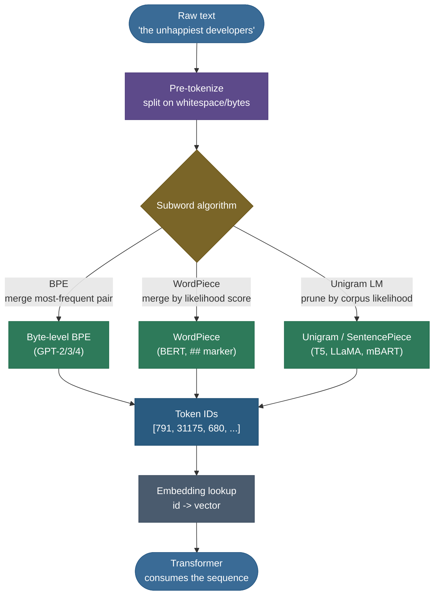
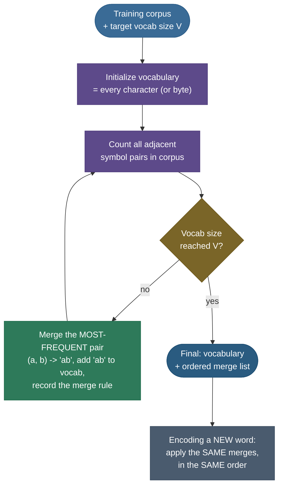
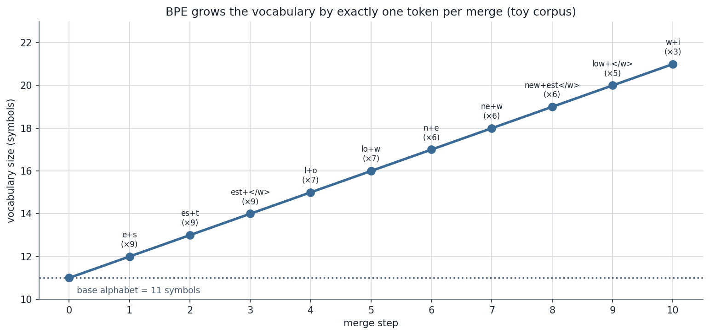

# Tokenization and subword algorithms: how text becomes numbers

A neural network cannot read the word *"unhappiest."* It can only multiply matrices of floating-point numbers. So before a single layer of a transformer runs, something has to turn a string of human characters into a sequence of integers — and then turn those integers into vectors. That something is the **tokenizer**, and it is the most under-appreciated component in the entire LLM stack. It runs *before* the model, it is *not* trained by gradient descent with the model, and yet it silently decides your model's vocabulary, how long your sequences are (and therefore how much you pay per request), how gracefully the model handles a typo or a chunk of code or a sentence in Hindi, and even which arithmetic problems it can get right. When an LLM fails to spell *"strawberry"* or miscounts the letters in a word, the tokenizer is usually the culprit — not the billion-parameter network behind it.

I'm going to teach this the way I'd actually walk a colleague through it from scratch: first *why* fixed-vocabulary tokenization is a genuinely hard problem (feel the trap), then the three obvious-but-broken answers (word-level, character-level) and why **subword** tokenization splits the difference, then the four algorithms the whole field uses — **BPE**, **byte-level BPE**, **WordPiece**, and **Unigram LM** — each derived from its training objective with worked examples you can redo by hand, then **SentencePiece** as the framework that ties them together, and finally the downstream consequences that make this an interview favorite and a production footgun. By the end you'll be able to:

- explain **why** a fixed integer vocabulary over open-ended text is hard, and why **subword** beats both word-level and character-level;
- **run the BPE training algorithm by hand** — learn merges from a corpus, then encode a brand-new word with them;
- explain **byte-level BPE** (GPT) and why it can *never* hit an out-of-vocabulary token;
- derive **WordPiece's** likelihood-based merge score and show it picks *different* merges than BPE on identical data;
- explain the **Unigram LM** model (SentencePiece/T5/Llama) — start big, prune by corpus likelihood, decode with Viterbi;
- reason about the **downstream costs** — context length and dollars, broken arithmetic, the 2-4× multilingual tax, and glitch tokens — and choose a vocabulary size deliberately.

> **Note:** keep one thing straight from the start. The tokenizer is a **separate, pre-trained artifact** that is frozen before the language model's training begins. It is *not* learned jointly with the network weights — it's trained once on a corpus (BPE merges, a WordPiece vocab, a Unigram model), saved, and then used as a fixed lookup for the model's entire life. Change the tokenizer and you must retrain the model; that's why it's such a consequential, locked-in decision.

> **Build it yourself:** every algorithm below is implemented from scratch — BPE training, WordPiece scoring, Unigram Viterbi, and the vocab-size sweep — in a single seeded module, run step-by-step in a companion notebook. See the [step-by-step teaching notebook](code/02-Tokenization-and-Subword-Algorithms.ipynb) and the [runnable source module](code/tokenization.py) (`python tokenization.py`). Every figure on this page is regenerated from those same functions by [`make_figures_02.py`](code/make_figures_02.py), so the prose, the diagrams, and the code can never drift.

---

## The problem: a fixed integer vocabulary over infinite text

To see why this is hard, you have to feel the constraint the model imposes.

A transformer's first layer is an **embedding table**: a matrix of shape `[vocab_size, d_model]` where row $i$ is the dense vector for token id $i$. That table is a *fixed-size* object — you must pick `vocab_size` **before** training and bake it into the architecture. Every input the model will ever see must be expressible as a sequence of integers drawn from $\{0, 1, \ldots, \text{vocab\_size} - 1\}$. There is no "id for a token I've never seen"; there is only the closed set you chose up front.

Now look at what you're trying to cover with that closed set: **raw human text**, which is effectively infinite and open-ended. New words appear constantly — brand names (*Ozempic*), hashtags, usernames, code identifiers (`getUserById`), URLs, emoji, typos (*teh*, *recieve*), inflections (*run / runs / running / ran*), 137 living writing systems, and numbers, of which there are infinitely many. You cannot enumerate that. So the central tension is:

> **The tokenization problem:** map an *open-ended, infinite* space of input strings onto a *fixed, finite* set of integer ids — such that (a) **every possible input** can be represented (no holes), (b) the **sequences stay short** (compute and cost scale with token count), and (c) the resulting units are **meaningful enough** that the model can learn from them.

Hold those three goals — **coverage**, **short sequences**, **meaningful units** — in your head. Every tokenization scheme is just a different point on the trade-off surface between them, and the whole story below is about who wins the compromise.

> **Tip:** the pipeline has three distinct stages that people often blur together. (1) **Pre-tokenization** — a cheap rule-based split of raw text into "words" or whitespace-delimited chunks (or, for byte-level, into raw bytes). (2) **The subword model** — BPE / WordPiece / Unigram, which splits each chunk into the actual subword tokens. (3) **Numericalization** — map each subword string to its integer id via a vocabulary lookup. "Tokenization" usually means all three; the *algorithms* in this page are stage 2.

---

## What it is: three granularities, one sweet spot

The unit you tokenize *into* is a knob, and it has three natural settings. The whole argument for subword tokenization is best seen by contrasting all three at once.


### Word-level: short sequences, but OOV holes and a bloated vocabulary

The intuitive choice is to split on whitespace and treat each **word** as a token. Sequences are short (one token per word), and tokens are linguistically meaningful. But two problems sink it:

- **Out-of-vocabulary (OOV) words.** You must freeze the vocabulary at training time, so any word not seen then — a new product, a typo, a rare inflection — has no id. The standard fallback is a single catch-all `[UNK]` token, which **throws the information away**: *"unhappiest"*, *"refactored"*, and *"Ozempic"* all collapse to the identical `[UNK]`, and the model can never recover what was actually written.
- **Vocabulary explosion.** To cut the OOV rate you grow the vocabulary, but natural language has a long Zipfian tail — English alone has hundreds of thousands of word forms once you count inflections, names, and typos. A word-level vocab that covers most text balloons to 100k–1M+ entries, and the embedding table (and the final softmax over the vocabulary) grows with it, wasting parameters on words seen a handful of times.

> **Gotcha:** word-level also has a *morphology blindness*. It can't see that *"running"*, *"runs"*, and *"runner"* share the stem *run* — each is a separate, unrelated id. The model has to relearn the relationship from scratch for every inflected form, which is exactly the kind of statistical waste subword units fix.

### Character-level: total coverage, but ruinously long sequences

Swing to the other extreme: tokenize into individual **characters**. Now the vocabulary is tiny (~100 characters for English, ~256 for raw bytes) and there is **zero OOV** — every string is just a sequence of characters you already have. Coverage is perfect.

The cost is **sequence length**. A 5-word sentence that was 5 word-tokens becomes ~30 character-tokens. Since a transformer's attention cost is **quadratic in sequence length** ($O(n^2)$), a 5-6× longer sequence is far more expensive, and the model must spend its early layers re-discovering that `t-h-e` is the word "the" — burning capacity to relearn what words even are. Character models *can* work, but they pay dearly in compute, and they make long-range dependencies harder because relevant tokens are now much further apart.

### Subword: the negotiated settlement

**Subword tokenization** is the compromise everyone converged on: keep **frequent words whole** (so *"the"*, *"developers"*, *"running"* are single tokens and sequences stay short) but **break rare words into smaller, reusable pieces** (so *"unhappiest"* → `un` + `happi` + `est`, and *"tokenization"* → `token` + `ization`). The pieces themselves are learned from the corpus, so they tend to be meaningful sub-units — prefixes, suffixes, common stems.

This single idea satisfies all three goals at once:

- **Coverage with no holes** — worst case, a never-seen word falls back to a sequence of characters (or bytes), which are always in the vocabulary. **No `[UNK]`.**
- **Short-enough sequences** — common text is mostly whole-word tokens, so a typical English word averages ~1.3 tokens, far better than character-level.
- **Meaningful units that share structure** — *"run"*, *"running"*, *"runner"* now share the `run` token, so the model learns the stem once.

> **Note:** the headline result, in one sentence: **subword tokenization gives you a fixed vocabulary that can encode any string, with sequences barely longer than word-level and graceful degradation (to pieces, then characters) on anything rare.** That's why every modern LLM — GPT, BERT, Llama, T5, Mistral — uses a subword tokenizer. The four algorithms below are just different ways to *learn which subwords to keep*.

---

## Intuition: learn the abbreviations a corpus keeps reaching for

Here's the mental model I use. Imagine you're a court stenographer who must transcribe everything said in a courtroom, fast, using as few keystrokes as possible — but you start with only single letters. You'd quickly notice that some letter sequences come up constantly (*-tion*, *-ing*, *the*, *and*), and you'd invent a **shorthand** for each frequent one so you can write it in a single stroke. You wouldn't bother inventing shorthand for a one-off surname; you'd just spell it out letter by letter.

That's *exactly* what BPE training does. It starts with the smallest possible units (characters or bytes), scans the corpus for the **most frequent adjacent pair**, and "invents a shorthand" by merging that pair into a new single token. Repeat a few thousand times and you've grown a vocabulary of exactly the abbreviations the corpus keeps reaching for — frequent whole words and common morphemes get their own token; rare strings stay spelled out in pieces. The vocabulary is *data-driven shorthand*.

WordPiece and Unigram are the same instinct with a more statistical definition of "worth a shorthand": instead of *most frequent*, they ask *which merge most improves a probabilistic model of the corpus*. Same goal — short codes for common things — different scoring rule. Keep the stenographer in mind and none of the algorithms will feel arbitrary.

---

## Why it matters: the tokenizer is upstream of everything

Before the algorithms, it's worth internalizing *why* this is worth a deep page and not a footnote, because the consequences are larger than they look:

- **It sets sequence length, which sets cost and latency.** APIs bill **per token**, and attention is quadratic in token count. A tokenizer that produces 20% more tokens for the same text makes every request 20% more expensive and slower — forever.
- **It sets the context window's real capacity.** A "128k token" context holds far less *English text* if your tokens are inefficient, and far less *other-language* text always (see the multilingual tax below). The window is measured in tokens, not characters.
- **It bounds what the model can learn about characters.** Because the model sees `strawberry` as maybe two or three tokens, not eight letters, it has no direct view of the spelling — which is why character-counting, reversing, and rhyming are weirdly hard for LLMs.
- **It is frozen and load-bearing.** Pick it wrong and you can't fix it without retraining the whole model. It is one of the few truly irreversible architecture decisions.

> **Tip:** a good interview heuristic — *almost every "the model is dumb about X" complaint where X is spelling, digits, whitespace, or a non-English script is really a tokenization artifact, not a reasoning failure.* Naming the tokenizer as the cause is a strong signal you understand the stack.

---

## How it works: the full pipeline

Zoom out to see where the algorithms sit. Raw text flows through pre-tokenization into one of the subword models, out as integer ids, and into the embedding table — the same skeleton regardless of which algorithm you chose.



The differences live entirely in the middle box — *how the vocabulary was learned* and *how a string is split with it*. Let's derive each one.

---

## BPE: byte-pair encoding, derived from scratch

**Byte-Pair Encoding** began life as a 1994 data-compression algorithm (Philip Gage) and was brought to NLP by **Sennrich, Haddow & Birch (2016)** to handle rare words in neural machine translation. It is the most important tokenization algorithm to understand, because everything else is a variation on it.

### The training algorithm

BPE learns a vocabulary by *greedily merging the most frequent adjacent pair*, over and over, until the vocabulary reaches a target size. Here is the exact loop:



Spelled out:

1. **Initialize.** Split the corpus into words (pre-tokenization) and represent each word as a sequence of characters. The base vocabulary is the set of all characters that appear. A special end-of-word marker (`</w>`, or in practice a leading-space marker — more on that under byte-level BPE) is attached so the model can tell *"est"* at the end of a word from *"est"* in the middle.
2. **Count pairs.** Tally how often each **adjacent pair** of symbols occurs across the whole corpus, weighted by word frequency.
3. **Merge the top pair.** Take the single most frequent pair $(a, b)$, create a new symbol `ab`, add it to the vocabulary, and **record the merge rule** $(a, b) \to ab$. Replace every occurrence of that adjacent pair in the corpus.
4. **Repeat** steps 2-3 until the vocabulary hits the target size $V$ (equivalently, a fixed number of merges).

The two outputs are the **vocabulary** (all base symbols plus all merged symbols) and the **ordered list of merge rules** — and that order matters enormously, because encoding replays the merges in exactly the order they were learned.

Stated as the objective BPE greedily optimizes at each step: from the set of adjacent symbol pairs $\mathcal{P}$ in the current corpus, pick

$$(a, b)^\star \;=\; \arg\max_{(a,b)\,\in\,\mathcal{P}} \ \text{freq}(a, b),$$

where $\text{freq}(a,b)$ is the corpus-wide count of the adjacent pair (weighted by word frequency). That's the whole rule — *most frequent adjacent pair wins* — applied greedily and recorded in order.

> **Source / derivation:** [Sennrich, Haddow & Birch, *Neural Machine Translation of Rare Words with Subword Units* (ACL 2016), §3.2 / Algorithm 1](https://arxiv.org/abs/1508.07909) — the merge-most-frequent-pair training loop that brought BPE (originally Gage's 1994 compression algorithm) to NLP. The objective above is Algorithm 1's selection step.

> **Note:** BPE is **deterministic and greedy** — at each step it takes the locally most-frequent pair, never reconsidering. It does not optimize any *global* objective over the final vocabulary; it's a hill-climbing heuristic that happens to produce excellent vocabularies. (Unigram LM, below, *does* optimize a global likelihood — that's the key conceptual contrast.)

### Worked example 1: learning BPE merges by hand

Let's run the algorithm on the canonical toy corpus from the literature. Four words with these counts:

| word | count |
|---|---|
| `low` | 5 |
| `lower` | 2 |
| `newest` | 6 |
| `widest` | 3 |

Append `</w>` to each and start from characters. Base symbols: `{l, o, w, e, r, n, s, t, i, d, </w>}` (11 symbols). Now count adjacent pairs across all words (weighted by count) and merge the most frequent, step by step. **I verified every step below against a from-scratch implementation** (and the diagram further down plots the exact same run):

| step | most-frequent pair | freq | why | corpus after merge (changed words) |
|---|---|---|---|---|
| 1 | `(e, s)` | 9 | `newest`×6 + `widest`×3 | `n e w` **`es`** `t </w>` , `w i d` **`es`** `t </w>` |
| 2 | `(es, t)` | 9 | same two words | `n e w` **`est`** `</w>` , `w i d` **`est`** `</w>` |
| 3 | `(est, </w>)` | 9 | same | `n e w` **`est</w>`** , `w i d` **`est</w>`** |
| 4 | `(l, o)` | 7 | `low`×5 + `lower`×2 | **`lo`** `w </w>` , **`lo`** `w e r </w>` |
| 5 | `(lo, w)` | 7 | same | **`low`** `</w>` , **`low`** `e r </w>` |
| 6 | `(n, e)` | 6 | `newest`×6 | **`ne`** `w est</w>` |
| 7 | `(ne, w)` | 6 | same | **`new`** `est</w>` |
| 8 | `(new, est</w>)` | 6 | same | **`newest</w>`** |
| 9 | `(low, </w>)` | 5 | `low`×5 | **`low</w>`** |
| 10 | `(w, i)` | 3 | `widest`×3 | **`wi`** `d est</w>` |

After 10 merges the four training words tokenize as: `low</w>` (1 token), `low e r </w>` (4 tokens), `newest</w>` (1 token), `wi d est</w>` (3 tokens). Notice the algorithm *automatically* discovered the suffix `est</w>` and the stem `low` — nobody told it about morphology; frequency did all the work. The learned, ordered merge list is the artifact we save: `(e,s), (es,t), (est,</w>), (l,o), (lo,w), (n,e), (ne,w), (new,est</w>), (low,</w>), (w,i)`.

> **Gotcha:** the *order* of the merge list is part of the model. At step 1 several pairs — `(e,s)`, `(s,t)`, `(t,</w>)` — tie at frequency 9; ties are broken by a fixed rule (implementations typically take the first encountered or lowest-id pair), and that choice is frozen. Encode with a different order and you get different tokenizations. This is why you must ship the merge list, not just the vocabulary.

### Worked example 2: encoding a brand-new word

Training gave us a merge list; **encoding** a *new* word means applying those merges, **in the same learned order**, until none apply. Take the unseen word **`lowest`** → start as characters `l o w e s t </w>` and walk the merge list top to bottom:

- `(e,s)` applies → `l o w es t </w>`
- `(es,t)` applies → `l o w est </w>`
- `(est,</w>)` applies → `l o w est</w>`
- `(l,o)` applies → `lo w est</w>`
- `(lo,w)` applies → `low est</w>`
- `(n,e)`, `(ne,w)`, `(new,est</w>)` — no match
- `(low,</w>)` — no match (`low` is followed by `est</w>`, not `</w>`)
- `(w,i)` — no match

Final: **`low` + `est</w>`** — two tokens, both already in the vocabulary even though `lowest` was never in the training corpus. This is subword tokenization's coverage guarantee in action: a new word reuses learned pieces, and in the absolute worst case (no merges apply) it falls back to single characters, which are always present. **No `[UNK]`, ever.**

> **Tip:** there's a subtle but classic interview point here — *training* BPE picks merges by **global corpus frequency**, but *encoding* a single word applies the merge list **greedily in learned order**. These can disagree: encoding doesn't search for the locally-best split for *that* word, it replays the globally-learned rules. This is exactly the inflexibility Unigram LM was designed to fix.

This coverage guarantee generalizes to *any* unseen word. The figure below trains BPE on a slightly larger corpus and then segments six **held-out** words it never saw — each one is covered, reusing learned multi-character subwords where it can and falling to single characters only where it must:

![Six unseen words segmented by a trained BPE: a word that happens to be in-vocabulary stays whole, others reuse learned subwords like `new`, `old`, `est</w>`, `wid`, and a word made of rare letters (`qux`) falls all the way to single characters — the worst case, but still fully covered with no [UNK]. Green = a learned 3+-char subword, blue = a learned 2-char subword, slate = a single-character fallback.](../images/tok_bpe_segmentation.png)

Read the rows: more of a word covered by green/blue (learned pieces) means a shorter token sequence and more shared structure with other words; more slate (single-char fallbacks) means longer sequences and less reuse — but **never** an `[UNK]`. The character floor is always there to catch anything, which is the whole coverage promise made visible.

The same vocabulary growth — one new token per merge, plotted from the actual run above — looks like this:



---

## Byte-level BPE: the GPT trick that never sees OOV

Plain BPE over **characters** has a coverage gap: what about a character the training corpus never contained — a rare CJK ideograph, an obscure emoji, a control character? It would be OOV. **Byte-level BPE** (Radford et al., **GPT-2**, 2019) closes the gap completely by running BPE not over Unicode *characters* but over raw **UTF-8 bytes**.

The insight: every possible string, in every language and script, is *already* a sequence of bytes, and there are exactly **256 possible byte values**. So if your base vocabulary is the 256 bytes, **every conceivable input is covered by construction** — there is literally no string you can't encode, because every string is bytes. BPE then learns merges over byte sequences exactly as before, building up common words and word-pieces on top of the byte foundation.

This is why GPT-2/3/4 tokenizers have **no `[UNK]` token at all** — they don't need one. Paste in Japanese, an emoji, a hex dump, a binary blob's text rendering, anything: it tokenizes to *some* sequence of byte-level tokens, always.

> **Source / derivation:** [Radford et al., *Language Models are Unsupervised Multitask Learners* (GPT-2, 2019), §2.2](https://cdn.openai.com/better-language-models/language_models_are_unsupervised_multitask_learners.pdf) — introduces byte-level BPE: run BPE over the 256 UTF-8 byte values (with a reversible byte-to-unicode map so spaces and control bytes are printable during training), guaranteeing universal coverage with no `[UNK]`.

> **Note:** byte-level BPE also handles whitespace cleanly by encoding the **leading space as part of the token**. In GPT tokenizers `" developers"` (with a leading space) and `"developers"` (without) are *different* tokens — you'll see this in Worked Example 4's figure, where the space appears as `␣` glued to the front. This lets the tokenizer round-trip whitespace perfectly, and is why GPT-2 introduced a reversible byte-to-unicode mapping so spaces and control bytes are printable during training.

> **Gotcha:** byte-level coverage is total but not *free* of weirdness. A single emoji or CJK character is **several UTF-8 bytes**, so it can cost 2-4 tokens, and a multi-byte character split across token boundaries can produce tokens that aren't valid standalone strings (they're byte fragments). This is the root of the multilingual tax and of some streaming-decode glitches where a half-character flashes on screen before the next byte arrives.

---

## WordPiece: BERT's likelihood-scored merges

**WordPiece** (Schuster & Nakajima, 2012; popularized for BERT via Wu et al., 2016) is BPE's close cousin with one crucial change in the **merge criterion**. BPE merges the most *frequent* pair. WordPiece merges the pair that most increases the **likelihood of the corpus** under a unigram language model — which, worked through, becomes the pair with the highest **score**:

$$\text{score}(a, b) \;=\; \frac{\text{freq}(a, b)}{\text{freq}(a)\,\cdot\,\text{freq}(b)}$$

> **Source / derivation:** [Schuster & Nakajima, *Japanese and Korean Voice Search* (ICASSP 2012), §2.2](https://research.google/pubs/japanese-and-korean-voice-search/) — the original WordPiece, whose merge criterion maximizes the training-data likelihood under a unigram model; the closed-form score is the standard restatement (see [Wu et al., *GNMT* (2016), §4.1](https://arxiv.org/abs/1609.08144), the scheme BERT inherited, and Hugging Face's [WordPiece walkthrough](https://huggingface.co/learn/llm-course/en/chapter6/6)).

Read this carefully, because it's the heart of the algorithm. The numerator is how often the pair occurs together; the denominator is how often each piece occurs *on its own*. So WordPiece doesn't reward a pair just for being frequent — it rewards a pair whose two halves are **frequent together but rare apart**. A pair like `(t, h)` might be very frequent, but if `t` and `h` are each independently very common, the denominator is large and the score is small. WordPiece prefers merges that reveal genuine *associations*, not just common co-occurrences. (Intuitively: it's merging the pairs that "surprise" a model that assumed the two pieces were independent — the highest-pointwise-mutual-information pairs.)

> **Note:** the derivation: a unigram LM assigns the corpus probability $\prod_i p(t_i)$. Merging $a, b$ into $ab$ changes the log-likelihood by approximately $\log \frac{p(ab)}{p(a)\,p(b)}$ per occurrence. Maximizing that gain is, up to corpus-size constants, maximizing $\frac{\text{freq}(a,b)}{\text{freq}(a)\,\text{freq}(b)}$ — the score above. WordPiece is BPE made *probabilistic* in its choice of what to merge.

### Worked example 3: WordPiece and BPE pick different merges on the same data

This is the example that makes the difference click — and I **verified the numbers in code**. Take the *same* toy corpus (`low`×5, `lower`×2, `newest`×6, `widest`×3) and ask: what does each algorithm merge **first**?

**BPE** ranks by raw frequency. The top pairs are `(e,s)`, `(s,t)`, `(t,</w>)`, each at frequency **9** — BPE's first merge is `(e, s)`.

**WordPiece** ranks by $\frac{\text{freq}(a,b)}{\text{freq}(a)\,\text{freq}(b)}$. Let's score a few pairs using the symbol counts in this corpus (`e` appears 17 times — twice in `newest`×6 plus once each in `lower`×2 and `widest`×3 — `s`=9, `t`=9, `i`=3, `d`=3, `l`=7, `o`=7). **These are the exact numbers the from-scratch scorer prints**, so the table and the figure can't drift:

| pair | freq(pair) | freq(a) · freq(b) | WordPiece score |
|---|---|---|---|
| `(i, d)` | 3 | 3 · 3 = 9 | **0.333** |
| `(l, o)` | 7 | 7 · 7 = 49 | 0.143 |
| `(s, t)` | 9 | 9 · 9 = 81 | 0.111 |
| `(e, s)` | 9 | 17 · 9 = 153 | 0.059 |

WordPiece's first merge is **`(i, d)`** — even though it occurs only **3** times, far less than `(e,s)`'s 9 — because `i` and `d` are *each* rare but *always appear together* (in `widest`), so their normalized score is highest. **Same data, completely different first merge: BPE says `(e,s)`, WordPiece says `(i,d)`.** That single contrast is the cleanest way to show you understand the two algorithms.

The same numbers, plotted from the from-scratch scorer, make the disagreement impossible to miss:


The left panel is sorted-by-height frequency, the right panel is sorted-by-association score, and *the tallest bar is a different pair in each*. That is the entire BPE-vs-WordPiece distinction in one picture: **frequency** versus **frequent-together-but-rare-apart**.

### Encoding and the `##` marker

WordPiece also differs in **encoding** and in **notation**. BERT's WordPiece marks every subword that is a *continuation* of a word with a `##` prefix, so the tokenizer (and you) can tell a word-initial piece from a word-internal one and reconstruct word boundaries:

- `"unhappiest"` → `un`, `##ha`, `##pp`, `##iest` (the `un` starts a word; the rest continue it).

And whereas BPE encodes greedily by *replaying merges left-to-right*, WordPiece encodes by **greedy longest-match-first**: at each position, take the **longest** subword in the vocabulary that matches starting there, emit it, advance, repeat. If at some point *no* vocabulary subword matches the remaining characters, the **entire word** is mapped to `[UNK]` (classic WordPiece is *not* byte-level, so it *can* produce `[UNK]` — a real difference from byte-level BPE).

> **Gotcha:** don't conflate "WordPiece" with "BERT" as if they're one thing. WordPiece is the *algorithm*; BERT is *one model* that uses it with a specific ~30k-token vocabulary and the `##` convention. Other models use WordPiece with different vocabularies and markers, and many multilingual BERT-family models use SentencePiece instead.

---

## Unigram LM: start big, prune by likelihood

The third major algorithm, **Unigram language-model tokenization** (Kudo, 2018), flips the whole strategy. BPE and WordPiece are **bottom-up** — start small, grow by merging. Unigram is **top-down** — start with a *huge* candidate vocabulary and **prune it down** to the target size by repeatedly removing the tokens that hurt the corpus likelihood least.

The model: assume each token is generated independently with probability $p(t)$ (a unigram model over subwords). The probability of a particular segmentation $\mathbf{s} = (t_1, \ldots, t_k)$ of a string $X$ is

$$P(\mathbf{s}) \;=\; \prod_{i=1}^{k} p(t_i), \qquad \sum_{t \in \mathcal{V}} p(t) = 1,$$

and training maximizes the corpus marginal log-likelihood over all valid segmentations of each string:

$$\mathcal{L} \;=\; \sum_{X \in \text{corpus}} \log \!\!\sum_{\mathbf{s} \in S(X)} \prod_{i} p(t_i),$$

where $S(X)$ is the set of all segmentations of $X$. A string can be segmented many ways; the model's score for the string is (in training) that **sum over segmentations**, and (at encode time) the **single most probable segmentation** $\arg\max_{\mathbf{s}} P(\mathbf{s})$. Training proceeds as:

1. **Seed** a large candidate vocabulary (e.g. all substrings up to some length, or a big BPE vocab) — often millions of candidates.
2. **Fit** the token probabilities $p(t)$ that maximize the corpus likelihood, using **Expectation-Maximization (EM)**: the E-step computes expected token counts under the current probabilities (summing over all segmentations via the forward-backward / Viterbi machinery), the M-step re-estimates $p(t)$ from those counts.
3. **Prune.** For each token, estimate how much *removing* it would drop the total corpus log-likelihood (its "loss"). Drop the bottom ~10-20% of tokens — the ones the corpus barely needs — while always keeping every single character, so coverage never breaks.
4. **Repeat** EM + pruning until the vocabulary reaches the target size $V$.

At **encode** time, given the trained $p(t)$, find the highest-probability segmentation of a string with the **Viterbi algorithm** (a dynamic program over split points) — the globally optimal split under the model, not a greedy replay.

> **Source / derivation:** [Kudo, *Subword Regularization* (ACL 2018), §3.1–3.2](https://arxiv.org/abs/1804.10959) — defines the unigram-LM segmentation model, the marginal-likelihood objective $\mathcal{L}$ above, the EM training with iterative pruning, and Viterbi decoding for the single best segmentation (plus the subword-regularization sampling that motivated the paper).

Concretely, Viterbi fills a table $\text{best}[i]$ = the best log-probability of segmenting the first $i$ characters, considering every vocabulary piece that *ends* at position $i$; the best path back-pointers reconstruct the optimal split. The figure traces it on the word `lowest` under a tiny hand-built model where the pieces `low` and `est` are cheap:


The contrast with BPE is the punchline: BPE *replays a fixed merge order* and accepts whatever split falls out; Unigram *searches all split points* and returns the one the model scores highest for *this* string. Same goal (good subword pieces), fundamentally different decode.

> **Note:** the deep advantage of Unigram is **probabilistic, global segmentation**. Because it scores whole segmentations, it can pick the split that's best *for this string*, not the one a fixed merge-order happens to produce. It also enables **subword regularization** (Kudo 2018): during training, *sample* a segmentation from the top-$k$ probable ones instead of always taking the best, so the model sees `un|happiest`, `unhapp|iest`, `u|n|happiest`, etc. — a data-augmentation that makes the model robust to alternative splits at inference. BPE has an analogous trick called **BPE-dropout**.

> **Tip:** how to remember which model does what — **BPE = merge most frequent (greedy, bottom-up)**; **WordPiece = merge highest likelihood-gain (greedy, bottom-up, normalized by piece frequency)**; **Unigram = prune lowest likelihood-loss (probabilistic, top-down, Viterbi decode)**. T5, ALBERT, XLNet, and LLaMA's tokenizer use Unigram (via SentencePiece); GPT uses BPE; BERT uses WordPiece.

---

## SentencePiece: the framework, not a fourth algorithm

A common point of confusion: **SentencePiece** (Kudo & Richardson, 2018) is *not* a fourth algorithm. It's an open-source **library/framework** that can train either a **BPE** *or* a **Unigram** model — its real contribution is two engineering ideas that make tokenization truly **language-agnostic**:

- **It treats the input as a raw stream of Unicode, including whitespace** — no language-specific pre-tokenizer that assumes spaces separate words. This is essential for languages like Chinese, Japanese, and Thai that **don't put spaces between words**. SentencePiece encodes the space itself as a visible meta-symbol **`▁`** (U+2581, "lower one-eighth block"), so `"Hello world"` becomes `▁Hello ▁world`. Because the space is now just another character in the stream, **decoding is perfectly reversible** — replace `▁` with a space and concatenate, recovering the exact original text (a property plain WordPiece's `##` scheme lacks).
- **It's deterministic and self-contained** — the trained model is a single file with the vocabulary and scores, no external pre-tokenization rules to reproduce on the inference side.

> **Source / derivation:** [Kudo & Richardson, *SentencePiece: A simple and language independent subword tokenizer* (EMNLP 2018 demo)](https://arxiv.org/abs/1808.06226) — the framework that treats whitespace as the `▁` meta-symbol for fully reversible, language-agnostic tokenization, wrapping either a BPE or a Unigram engine.

So the modern landscape is best drawn as: **BPE** (the algorithm) is used *raw* by GPT (byte-level) and *via SentencePiece* by some models; **Unigram** (the algorithm) is used *via SentencePiece* by T5/ALBERT/LLaMA. SentencePiece is the *delivery vehicle*; BPE and Unigram are the *engines*.

> **Gotcha:** the `▁` (U+2581) meta-space is **not** a regular space and **not** an underscore — it's a distinct Unicode glyph. If you ever see `▁` litter your decoded output, your detokenization step forgot to map it back to a real space. It's a frequent bug when people hand-roll decoding around a SentencePiece model.

---

## Special tokens: the vocabulary slots that aren't text

Beyond learned subwords, every tokenizer reserves a handful of **special tokens** — ids that don't correspond to any text but carry structural meaning the model is trained to recognize:

- **`[CLS]` / `[SEP]`** (BERT) — a classification-summary slot prepended to the input, and a separator between two segments (e.g. question and passage).
- **`[PAD]`** — filler to make all sequences in a batch the same length (masked out so it contributes nothing).
- **`[MASK]`** — the token BERT replaces words with during masked-language-model pretraining.
- **`[UNK]`** — the catch-all for unrepresentable input (present in word-level and classic WordPiece; **absent** in byte-level BPE).
- **`<s>` / `</s>` / `<|endoftext|>`** — beginning/end-of-sequence and document-boundary markers for generative models.
- **Chat / control tokens** — modern instruct models add tokens like `<|im_start|>`, `<|im_end|>`, or role markers that delimit system/user/assistant turns. These are *learned* structural signals, and mismatching them between training and inference silently breaks chat formatting.

> **Note:** special tokens are added to the vocabulary as **atomic, never-split** units, usually at fixed reserved ids. They're the model's punctuation for *structure* rather than *content* — and getting them exactly right (correct chat template, correct BOS/EOS) is one of the most common sources of "the model works in the demo but not in my code" bugs.

---

## Worked example 4: real, measured token counts (GPT-4 vs BERT)

Theory's done; let's tokenize a real sentence with two real production tokenizers and read off the differences. The sentence — chosen to stress rare morphology, a number, and code-ish words:

> `The unhappiest developers refactored 1234567 lines of code.`

The figure below shows the **actual** tokenization from `tiktoken`'s `cl100k_base` (GPT-4, byte-level BPE) and Hugging Face's `bert-base-uncased` (WordPiece) — counts measured at diagram-generation time, so they cannot drift from the prose:


Read the differences straight off the picture:

- **GPT-4 → 16 tokens**: `The` · `␣unh` · `app` · `iest` · `␣developers` · `␣ref` · `act` · `ored` · `␣` · `123` · `456` · `7` · `␣lines` · `␣of` · `␣code` · `.` — note the **leading-space tokens** (`␣developers` is one token *with* its space), and that `developers` is a single token (it's common) while `unhappiest` shatters into four pieces (it's rare).
- **BERT → 17 tokens**: `the` · `un` · `##ha` · `##pp` · `##iest` · `developers` · `ref` · `##act` · `##ored` · `123` · `##45` · `##6` · `##7` · `lines` · `of` · `code` · `.` — everything **lowercased**, word-continuations marked with **`##`**, and *no* leading-space tokens.
- **Numbers split, and split *differently*.** `1234567` becomes `123` + `456` + `7` in GPT-4 (3-digit chunks) but `123` + `##45` + `##6` + `##7` in BERT — neither tokenizer has a clean concept of "a number," which is precisely why LLMs are shaky at arithmetic: the digits don't even line up into consistent place-value tokens across the two models.

> **Tip:** the common-word-vs-rare-word split (`developers` = 1 token, `unhappiest` = 4) is the entire subword thesis made visible: pay one token for the frequent word, pay in pieces for the rare one. Sequence length is dominated by how many of your words are rare.

---

## Worked example 5: the multilingual "tokenizer tax"

Tokenizers are trained on corpora that are overwhelmingly English, so they learn long, efficient tokens for English words and only short, byte-level fragments for everything else. The result is a real, measurable **tax** on non-English text: the *same meaning* costs far more tokens — which means more money (per-token billing), more latency, and less of it fits in the context window. Here are **measured** GPT-4 (`cl100k_base`) counts for the sentence *"The cat sat on the mat."* across languages:


- **English**: 7 tokens (baseline).
- **Spanish**: 12 tokens — ~1.7× the English cost, despite being a closely related, Latin-script, well-resourced language.
- **Chinese**: 12 tokens for a much *shorter* string — each character is multiple UTF-8 bytes, so byte-level BPE spends several tokens per logograph.
- **Hindi (Devanagari)**: **27 tokens** — nearly **4×** English. Low-resource scripts get almost no learned multi-character tokens, so they fall back near the byte level.

> **Gotcha:** this tax has real consequences. A user writing in Hindi pays ~4× more per API call and gets ~4× *less* usable context window than an English user for the same content — a genuine equity issue baked into the tokenizer. It's also why "multilingual" models often ship a **larger, more balanced vocabulary** trained on a more even language mix, to spread the tokens more fairly across scripts.

---

## Downstream consequences: where tokenization bites

Pulling the threads together, here are the practical failure modes — the things interviewers probe and the things that page you in production:

- **Context length and dollars are denominated in tokens, not words.** Your context window and your bill are both in tokens, so an inefficient tokenizer (or a non-English language) silently shrinks your effective window and inflates cost. Always estimate budgets in *tokens*.
- **Arithmetic and digits are fragile.** Because numbers split into inconsistent digit-chunks (`1234567` → `123|456|7`), the model never sees clean place-value, so multi-digit arithmetic is unreliable. Newer tokenizers deliberately split numbers into **individual digits** (or fixed 3-digit groups) to help — a direct tokenizer-level fix for a "reasoning" problem.
- **Code and whitespace.** Indentation, tabs, and repeated spaces matter in code. Byte-level tokenizers that pack whitespace into tokens (or have dedicated tokens for runs of spaces, like GPT-4's) tokenize code far more efficiently than ones that don't — a real factor in code-model quality and cost.
- **Spelling, counting, reversing, rhyming.** The model sees tokens, not letters, so "how many r's in strawberry?" or "reverse this word" are genuinely hard — the character information is hidden inside a token. This is a tokenization limitation, not a reasoning one.
- **Glitch tokens.** Some tokens (famously `SolidGoldMagikarp` and friends in GPT-2/3) were learned by BPE from the *tokenizer-training* corpus but appeared so rarely in the *model's* training data that their embeddings stayed nearly untrained — feeding them in produces bizarre, unpredictable output. They're a direct artifact of training the tokenizer and the model on mismatched data distributions.

> **Note:** all five of these trace back to the same root: **the model's atomic unit is the token, and tokens are a lossy, frequency-driven compression of text that the model can't see *through*.** Once you internalize that the model literally cannot see the letters inside a token, every one of these "weird LLM behaviors" stops being mysterious.

---

## Which algorithm should I use? A decision guide

You almost never *invent* a tokenizer — you inherit the one that ships with your model, because the tokenizer and the model weights are a matched pair. But you *do* choose a model partly on its tokenizer, and you sometimes train one for a new domain, so it's worth knowing the trade-offs concretely:

- **Default to byte-level BPE** for a general-purpose autoregressive LLM. It guarantees no `[UNK]` on any input (the 256-byte base covers everything), handles code and whitespace well, and is what GPT-style models use. The downside — multi-byte characters costing several tokens — is the price of universal coverage, and it's usually acceptable.
- **Reach for Unigram (via SentencePiece)** when you want the cleanest multilingual or whitespace-free behavior (CJK, Thai), reversible decoding, or **subword regularization** during training for robustness. T5, ALBERT, and LLaMA chose it for exactly these reasons. Its probabilistic, global Viterbi segmentation also tends to produce slightly more linguistically sensible splits than greedy merge replay.
- **Use WordPiece** mainly if you're in the BERT/encoder family and need compatibility with that ecosystem (the `##` convention, the 30k cased/uncased vocabularies). For a *new* generative model there's little reason to prefer it over byte-level BPE or Unigram.
- **Consider character- or byte-level *models*** (not just tokenizers) — e.g. ByT5, CANINE — only when robustness to noise/typos or true script-agnosticism matters more than the heavy sequence-length cost. They sidestep tokenization entirely at the price of much longer sequences.

> **Tip:** the single most important practical rule — **never mix tokenizers between training and inference.** The exact tokenizer (vocabulary, merges, special tokens, chat template) that the model was trained with must be the one you encode with at inference. A subtly different tokenizer (even the "same" BPE with a different special-token id or a missing `▁`/`##` convention) silently shifts every token id and degrades or breaks the model. This is the #1 tokenization bug in practice.

### Interview pitfalls to avoid

A few traps that separate a confident answer from a shaky one:

- **"BPE and WordPiece are the same."** They differ in the *merge criterion* — BPE by raw frequency, WordPiece by the normalized likelihood score — and Worked Example 3 shows they pick *different* first merges on identical data. Saying they're identical is the most common miss.
- **"Byte-level BPE has an `[UNK]`."** It doesn't, and that's the whole point — its 256-byte base covers every string. Classic (character) WordPiece *can* emit `[UNK]`; byte-level BPE cannot.
- **"SentencePiece is an algorithm."** It's a *framework* that trains BPE or Unigram. Conflating the framework with the model underneath is a giveaway.
- **"The tokenizer is trained with the model."** It's trained *first*, separately, then frozen. The model's gradients never touch it.
- **"Longer vocab is just better."** It shortens sequences but bloats the embedding/softmax and starves rare tokens of training signal — a genuine trade-off, not a free win.

---

## Choosing a vocabulary size

The one hyperparameter you set when training a tokenizer is **vocabulary size** $V$, and it's a genuine trade-off:

- **Larger $V$** → longer, more meaningful tokens → **shorter sequences** (cheaper attention, more text per context window) → but a **bigger embedding table and output softmax** (more parameters, more memory), and each token is seen less often so its embedding is **less well-trained** (data sparsity).
- **Smaller $V$** → fewer parameters and better-trained embeddings → but **longer sequences** (quadratic attention cost) and the model burns capacity reassembling pieces.

You can *watch* the upside of a larger vocabulary directly. The figure sweeps the number of BPE merges (which equals base alphabet + merges = vocabulary size) and plots two things at once: average **tokens-per-word** on the training corpus (the compression you buy) and the fraction of **held-out** words that fall all the way to single characters (the coverage quality):


Both curves fall — more vocabulary means shorter sequences *and* better coverage of rare words — but the y-axes you *don't* see are the embedding-table parameter count and the per-token training frequency, both of which get *worse* as $V$ grows. That tension is the whole reason vocab size is a tuned hyperparameter and not just "as big as possible." In practice the field has converged on a band: **~30k-50k** for older monolingual models (BERT: 30,522; GPT-2: 50,257), **~100k-130k** for modern multilingual LLMs that need to cover many scripts (GPT-4's `cl100k_base`: ~100k; Llama-3: 128k). Bigger multilingual vocabularies buy back some of the multilingual tax by giving non-English scripts more dedicated tokens.

> **Tip:** the rule of thumb worth stating in an interview — **vocab size trades sequence length against embedding-table size and per-token data sparsity.** Multilingual coverage pushes it up (more scripts to cover); a small, single-domain corpus pulls it down (you can't well-train 100k embeddings on a little data). There's no universal best — it's tuned to corpus size, language mix, and the sequence-length budget.

---

## Code: train a tokenizer, then tokenize with real ones

Two runnable snippets. The first **trains a BPE tokenizer from scratch in pure Python** so you can watch merges being learned (and it matches Worked Example 1 exactly); the second uses the **real production tokenizers** to reproduce the measured counts above. Both run in seconds on CPU.

> **Runnable module and notebook:** these snippets are the heart of the canonical [`tokenization.py`](code/tokenization.py) module — which also implements the WordPiece scorer, the Unigram Viterbi decoder, and the vocab-size sweep — and the [step-by-step notebook](code/02-Tokenization-and-Subword-Algorithms.ipynb) walks every piece one cell at a time. The page, the notebook, and every figure import the *same* functions, so nothing can drift. Device: `cpu (pure-Python/numpy)` — the subword algorithms are integer/string bookkeeping with no tensors to accelerate.

```python
"""From-scratch BPE training + encoding. Reproduces Worked Examples 1 & 2.
Verified on Python 3.12 (CPython). Pure standard library. (Canonical version: tokenization.py)"""
from collections import Counter

corpus = {"low": 5, "lower": 2, "newest": 6, "widest": 3}

def to_symbols(corpus):                       # word -> tuple of chars + end marker
    return {tuple(list(w) + ["</w>"]): c for w, c in corpus.items()}

def pair_freqs(vocab):                         # count adjacent pairs, weighted
    pf = Counter()
    for word, c in vocab.items():
        for i in range(len(word) - 1):
            pf[(word[i], word[i + 1])] += c
    return pf

def apply_merge(vocab, pair):                  # replace every adjacent `pair` with its join
    new = {}
    for word, c in vocab.items():
        w, i, out = list(word), 0, []
        while i < len(w):
            if i < len(w) - 1 and (w[i], w[i + 1]) == pair:
                out.append(w[i] + w[i + 1]); i += 2
            else:
                out.append(w[i]); i += 1
        new[tuple(out)] = c
    return new

vocab, merges = to_symbols(corpus), []
for step in range(10):
    pf = pair_freqs(vocab)
    if not pf:
        break
    best, freq = pf.most_common(1)[0]
    merges.append(best); vocab = apply_merge(vocab, best)
    print(f"step {step+1:2d}: merge {best} (freq {freq})")

def encode(word, merges):                      # apply learned merges, in order
    sym = list(word) + ["</w>"]
    for a, b in merges:
        i = 0
        while i < len(sym) - 1:
            if sym[i] == a and sym[i + 1] == b:
                sym[i:i + 2] = [a + b]
            else:
                i += 1
    return sym

print("encode 'lowest' ->", encode("lowest", merges))   # -> ['low', 'est</w>']
```

Expected output (the merge order matches the by-hand table and the diagram):

```
step  1: merge ('e', 's') (freq 9)
step  2: merge ('es', 't') (freq 9)
step  3: merge ('est', '</w>') (freq 9)
step  4: merge ('l', 'o') (freq 7)
step  5: merge ('lo', 'w') (freq 7)
step  6: merge ('n', 'e') (freq 6)
step  7: merge ('ne', 'w') (freq 6)
step  8: merge ('new', 'est</w>') (freq 6)
step  9: merge ('low', '</w>') (freq 5)
step 10: merge ('w', 'i') (freq 3)
encode 'lowest' -> ['low', 'est</w>']
```

```python
"""Tokenize one sentence with the REAL GPT-4 and BERT tokenizers, and measure
the multilingual tax. Verified on Python 3.12 with tiktoken 0.13 +
transformers 5.10.    uv pip install tiktoken transformers
"""
import tiktoken
from transformers import AutoTokenizer

sentence = "The unhappiest developers refactored 1234567 lines of code."

enc = tiktoken.get_encoding("cl100k_base")           # GPT-4 byte-level BPE
gpt_ids = enc.encode(sentence)
gpt_toks = [enc.decode([t]) for t in gpt_ids]
print(f"GPT-4   : {len(gpt_ids):2d} tokens  {gpt_toks}")

bert = AutoTokenizer.from_pretrained("bert-base-uncased")
bert_toks = bert.tokenize(sentence)                  # WordPiece
print(f"BERT    : {len(bert_toks):2d} tokens  {bert_toks}")

for lang, s in [("EN", "The cat sat on the mat."),
                ("ES", "El gato se sentó en la alfombra."),
                ("ZH", "猫坐在垫子上。"),
                ("HI", "बिल्ली चटाई पर बैठी थी।")]:
    print(f"{lang}: {len(enc.encode(s)):2d} GPT-4 tokens")
```

Expected output (these are the exact numbers in the figures):

```
GPT-4   : 16 tokens  ['The', ' unh', 'app', 'iest', ' developers', ' ref', 'act', 'ored', ' ', '123', '456', '7', ' lines', ' of', ' code', '.']
BERT    : 17 tokens  ['the', 'un', '##ha', '##pp', '##iest', 'developers', 'ref', '##act', '##ored', '123', '##45', '##6', '##7', 'lines', 'of', 'code', '.']
EN:  7 GPT-4 tokens
ES: 12 GPT-4 tokens
ZH: 12 GPT-4 tokens
HI: 27 GPT-4 tokens
```

> **Tip:** to *see* this interactively, paste any text into OpenAI's [Tokenizer playground](https://platform.openai.com/tokenizer) (or Tiktokenizer) — it colors each token and shows the count live. Watching a sentence light up token by token, then switching languages and watching the count jump, is the fastest way to make the multilingual tax and the rare-word splitting visceral.

---

## Recap and rapid-fire

**If you remember nothing else:** a model can only consume integers, so the tokenizer maps open-ended text onto a *fixed* vocabulary. Word-level has OOV holes and a bloated vocab; character-level has no holes but ruinously long sequences; **subword** tokenization splits the difference — frequent words stay whole, rare words break into reusable pieces, so any string is covered (no `[UNK]`) with short-enough sequences. **BPE** learns this by greedily merging the most-frequent adjacent pair; **byte-level BPE** (GPT) runs BPE over the 256 bytes so nothing is ever OOV; **WordPiece** (BERT) merges by a likelihood score $\frac{\text{freq}(a,b)}{\text{freq}(a)\,\text{freq}(b)}$ and marks continuations with `##`; **Unigram LM** (SentencePiece/T5/Llama) starts huge and prunes by corpus likelihood, decoding with Viterbi. The tokenizer is frozen, upstream of everything, and silently sets context length, cost, the multilingual tax, and whether the model can spell or do arithmetic.

**Quick-fire — say these out loud:**

- *Why not word-level?* OOV `[UNK]` holes + a 100k-1M vocabulary; can't see shared morphology.
- *Why not character-level?* No OOV, tiny vocab — but ~5-6× longer sequences (quadratic attention) and capacity wasted reassembling words.
- *What does BPE merge?* The **most frequent** adjacent pair, greedily, recording an ordered merge list.
- *How does byte-level BPE avoid OOV?* Its base vocab is the 256 bytes, so every string is covered by construction — no `[UNK]`.
- *BPE vs WordPiece merge rule?* BPE: raw frequency. WordPiece: $\frac{\text{freq}(a,b)}{\text{freq}(a)\,\text{freq}(b)}$ — frequent *together* but rare *apart*.
- *What's the `##`?* WordPiece's marker for a word-continuation piece (`un`, `##happy`).
- *How is Unigram different?* Top-down: start with a huge vocab, prune lowest-likelihood-loss tokens via EM; decode the best split with Viterbi.
- *Is SentencePiece an algorithm?* No — a framework that trains BPE *or* Unigram, treats whitespace as `▁`, and is fully reversible/language-agnostic.
- *Why is multi-digit arithmetic hard?* Numbers split into inconsistent digit-chunks, so the model never sees clean place-value.
- *Why is non-English text expensive?* English-trained tokenizers fall back near byte-level for other scripts — 2-4× the tokens for the same meaning.
- *Why can't an LLM count letters in a word?* It sees tokens, not characters; the letters are hidden inside the token.
- *What's a glitch token?* A token BPE learned but the model barely trained on — its embedding is near-random, so it triggers bizarre behavior.

---

## References and further reading

The curated link library for this topic — videos, courses, articles, the original papers, and internal cross-links — lives in a companion file so it can be reused as a standalone reference list:

**→ [Tokenization & Subword Algorithms — references and further reading](02-Tokenization-and-Subword-Algorithms.references.md)**
