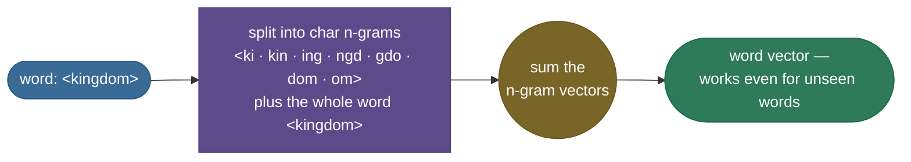
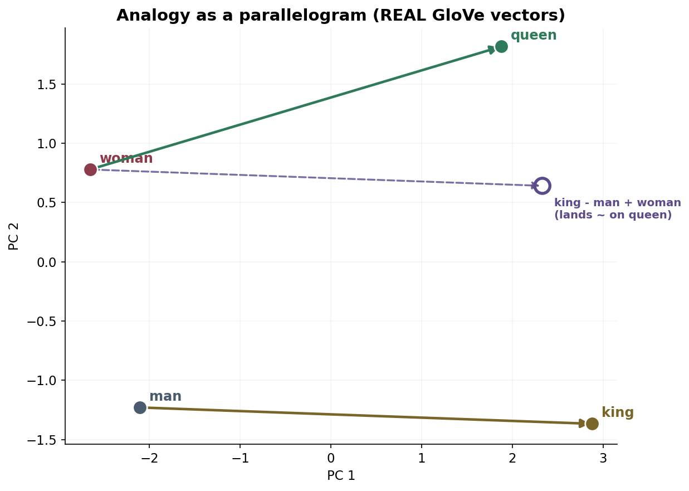
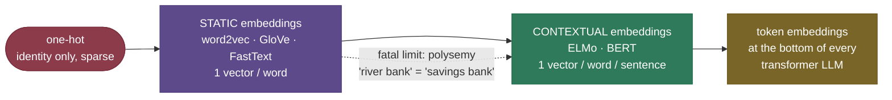

# Word Embeddings: turning words into geometry

To a neural network a word is just a symbol — and symbols have no notion of *meaning* or *similarity*. The very first thing any NLP system has to do is turn words into numbers, and the *way* you do it decides everything downstream. Do it the obvious way — one slot per word, a single 1 in a sea of zeros — and "cat" and "kitten" are *exactly* as far apart as "cat" and "thermodynamics." The model starts from zero knowledge that any two words are related and has to relearn every fact about every word from scratch.

**Word embeddings** fix this by placing every word at a point in a few-hundred-dimensional space such that **words used in similar contexts land near each other** — and, remarkably, such that *directions* in that space carry meaning. The single most famous demonstration is that, with real pretrained vectors, the arithmetic

$$\text{king} - \text{man} + \text{woman} \approx \text{queen}$$

actually works (we'll *measure* it later in this page — GloVe-50 returns `queen` at cosine **0.852**, the nearest word). Embeddings were the breakthrough that turned text into geometry, and they are the direct conceptual ancestor of every modern token-embedding layer at the bottom of every transformer.

I'm going to teach this the way I'd actually explain it at a whiteboard. We start with *why* one-hot has to die (feel the waste), then the 1950s idea that rescues us, then **word2vec** end to end — both objectives, the softmax bottleneck, and the negative-sampling trick that made it scale — then **GloVe** (the count-based cousin), the deep result that *unifies* the two, and **FastText** (words made of pieces). Along the way we work **four numeric examples by hand and by measurement**, and we close on the one limitation that ended the era and gave us BERT. By the end you'll be able to:

- explain precisely **why one-hot fails** and what the **distributional hypothesis** buys you;
- **derive** the skip-gram softmax objective $p(o\mid c)$ and its **gradient**, and explain the **softmax bottleneck**;
- **derive** the negative-sampling loss $\log\sigma(u_o^\top v_c) + \sum_k \mathbb{E}[\log\sigma(-u_k^\top v_c)]$ and the $\text{freq}^{0.75}$ sampling trick — and compute one update **by hand**;
- contrast **skip-gram vs CBOW**, **word2vec vs GloVe** (predictive vs count-based), and state the **Levy & Goldberg** result that SGNS ≈ shifted PMI factorization;
- **derive** the GloVe least-squares objective $J = \sum f(X_{ij})(w_i^\top\tilde w_j + b_i + \tilde b_j - \log X_{ij})^2$ and explain *why* ratios make analogies linear;
- explain what **FastText** adds (subword n-grams → OOV + morphology) and *measure* it on an unseen word;
- reason about the **embedding geometry** — cosine similarity, analogies as parallelograms, and the **bias** embeddings inherit (Bolukbasi et al.);
- explain the fatal limitation — **one vector per word, regardless of context** — that motivated [contextual embeddings (ELMo/BERT)](../06-Contextual-Embeddings-ELMo-BERT/06-Contextual-Embeddings-ELMo-BERT.md).

Intuition first, then the math (with sources), then runnable, verified code.

> **Note:** "embedding" just means a learned, dense, low-dimensional vector for a discrete thing. Word embeddings are the famous case, but the *same idea* embeds users, products, graph nodes, and — in every transformer — **tokens**. Get the intuition here and it transfers everywhere.

---

## The problem: one-hot has no notion of similarity

The most literal way to feed a word to a model is **one-hot encoding**: fix a vocabulary of $V$ words (say $V = 50{,}000$), and represent each word as a $V$-long vector of zeros with a single 1 in that word's slot. "cat" might be slot 8,123; "dog" slot 8,124; "thermodynamics" slot 41,002. Clean, unambiguous — and quietly catastrophic, for two reasons.

**Flaw 1 — no similarity, by construction.** Any two distinct one-hot vectors are **orthogonal**: their dot product is exactly 0, and their Euclidean distance is exactly $\sqrt 2$, *for every pair*. So the representation says "cat" and "kitten" are precisely as related as "cat" and "Tuesday" — which is to say, not at all. One-hot encodes *identity* and nothing else; every shred of meaning has to be relearned, per word, with zero sharing.

> **Note (make it concrete):** with one-hot, "I adopted a **cat**" and "I adopted a **kitten**" share *no* input features for the differing word, so a classifier that learned something from the first sentence transfers **nothing** to the second. Dense embeddings let "cat" and "kitten" share most of their vector, so learning about one teaches the model about the other for free. That *generalization* is the whole prize.

**Flaw 2 — huge and sparse.** The dimension *equals the vocabulary*. A model's first weight matrix mapping one-hot inputs into a hidden layer of size $h$ is $V \times h$ — for $V=50{,}000$, $h=300$ that's **15 million parameters in the input layer alone**, almost all touched by exactly one word each. It's a lookup table wearing a matrix-multiply costume, and a wasteful one.


The fix rests on a beautifully simple 1950s idea — the **distributional hypothesis**, captured by J.R. Firth's slogan *"you shall know a word by the company it keeps"* (Firth, 1957). Words that appear in similar contexts (you *ruled* a *kingdom*; you *wore* a *crown*; you *sat* on a *throne*) tend to mean similar things. Turn that into a recipe: **learn a dense vector per word such that words sharing contexts get similar vectors.** That single sentence is the entire research program of this page — word2vec, GloVe, and FastText are three different ways to carry it out.

> *Where this comes from: the distributional hypothesis traces to **Firth (1957)**, "A synopsis of linguistic theory," and Harris's distributional structure (1954). Its modern, operational form is laid out in **Speech and Language Processing** (Jurafsky & Martin) Ch. 6, "Vector Semantics" — in the references.*

---

## What it is: meaning as location

A **word embedding** maps each word to a dense vector — typically 50–300 dimensions — learned so that the *geometry* reflects meaning. Two properties make it feel like magic:

1. **Similar words cluster.** Cosine similarity between vectors tracks semantic similarity. With real GloVe-50 vectors (measured later): $\cos(\text{cat}, \text{dog}) = 0.92$, $\cos(\text{cat}, \text{kitten}) = 0.64$, but $\cos(\text{cat}, \text{democracy}) = 0.04$. Related words are close; unrelated words are near-orthogonal.
2. **Meaning becomes arithmetic.** Consistent relationships show up as consistent *directions*. The vector from *man* to *king* is roughly the same as from *woman* to *queen* — the displacement *encodes* "royalty." So you can **add and subtract meanings**, and `king − man + woman` lands next to `queen`.

The picture below is **not a cartoon** — it is a PCA projection of *real* pretrained GloVe-50 vectors. Royalty, animals, capitals, and countries each form their own region of the space, and the dashed arrows show the *same* male→female direction shared by `king→queen` and `prince→princess`.


> **See it for real:** the **[TensorFlow Embedding Projector](https://projector.tensorflow.org/)** loads real pretrained word2vec/GloVe vectors and lets you fly through the space in 3-D, search a word, and watch its nearest neighbours light up — the single best way to *feel* that this geometry is real, not a story.

---

## Intuition: the map of meaning

Here's the analogy I'd actually draw at a whiteboard. Imagine you're handed thousands of books in a language you can't read, and asked to organize the words. You can't look up definitions, but you *can* see which words tend to appear near each other. You'd notice that some word always shows up next to "ruled," "throne," "crown" — and another word shows up in those *same* slots. Without ever learning what either means, you'd file them together: they *act the same*, so they probably *mean* something similar. Do this for every word and you've drawn a **map** where proximity = "appears in similar company." That map is exactly what an embedding is, and the distributional hypothesis is the bet that **the map of company is a good map of meaning.**

Now the second, more surprising part — *why directions mean things*. On that map, suppose you walk from "man" to "king." What changed? You added "royalty." If the map is consistent, then walking the *same direction and distance* from "woman" should also add "royalty" — landing you on "queen." The relationship isn't stored in any single word; it's a **direction you can travel** that means the same thing everywhere on the map. That's why `king − man + woman ≈ queen` is not a parlor trick but a *structural* property: when a corpus uses "king/man" and "queen/woman" in parallel ways, gradient descent has no choice but to place them in a parallelogram.

> **Note — why a few hundred dimensions?** Too few (say 2) and you can't fit all the independent "directions of meaning" a language needs — gender, tense, plurality, formality, topic, sentiment — they collide. Too many (say 50,000, i.e. one-hot) and you're back to no sharing. A few hundred is the empirical sweet spot: enough axes to disentangle the major factors of variation, few enough that words must *share* structure (which is what forces similar words together). The 2-D pictures on this page are PCA *shadows* of that richer space — useful, but lossy.

> **Tip — the one-sentence interview answer.** If asked "what is a word embedding, in one breath?": *"A learned dense vector per word, trained so that words appearing in similar contexts get similar vectors — which turns semantic similarity into cosine distance and analogies into vector arithmetic."* Everything else on this page is the *how* behind that sentence.

---

## Word2Vec: learn vectors by predicting neighbours

[Word2Vec](https://arxiv.org/abs/1301.3781) (Mikolov et al., 2013) makes the distributional hypothesis **trainable**: slide a window over a giant corpus and learn vectors that are *good at predicting which words co-occur*. No labels, no annotation — the text supervises itself. Word2vec comes in two symmetric variants, and knowing exactly how they mirror each other is a classic interview question.


- **Skip-gram** — given the **center** word, predict each **context** word. One center → many predictions. Better for **rare words and small corpora** (every center–context pair is a separate training signal, so rare words get more "at-bats").
- **CBOW** (continuous bag-of-words) — given the **context** (averaged), predict the **center** word. Many context words → one prediction. **Faster to train** and slightly better on frequent words, because it smooths over the whole window in one shot.

We'll derive **skip-gram** in full because it's the one interviewers ask you to write down — and once you have it, CBOW is the same machinery run backwards.

### Two vectors per word — and why

Each word $w$ gets **two** learned vectors: a **center** (input) vector $v_w$ used when $w$ is the focus, and a **context** (output) vector $u_w$ used when $w$ is a neighbour. This asymmetry isn't a hack — a word rarely appears in its own context window, so forcing $u_w = v_w$ would make a word predict itself awkwardly and hurts optimization. After training you keep the center vectors $v_w$ as "the embedding" (or average $v_w$ and $u_w$ — both are common).

### The objective

Skip-gram maximizes the average log-probability of the true context words over the whole corpus of length $T$, within a window of half-width $c$:

$$\mathcal{J}(\theta) = \frac{1}{T}\sum_{t=1}^{T}\ \sum_{\substack{-c \le j \le c \\ j \ne 0}} \log p(w_{t+j}\mid w_t)$$

and each conditional is a **softmax over the entire vocabulary**, scoring how compatible a context word $o$ is with a center word $c$ via the dot product of their vectors:

$$\boxed{\ p(o\mid c) = \frac{\exp(u_o^\top v_c)}{\sum_{w \in V}\exp(u_w^\top v_c)}\ }$$

Read it plainly: the score of context word $o$ given center $c$ is the **dot product** $u_o^\top v_c$ (high when the two vectors point the same way), squashed through a softmax so the scores over all possible context words form a probability distribution. Maximize this and you are literally pushing $v_c$ toward the $u$'s of the words that *actually* surround $c$ — which is the distributional hypothesis in equation form.

> *Where this comes from: skip-gram and CBOW are **Efficient Estimation of Word Representations in Vector Space** (Mikolov, Chen, Corrado & Dean, 2013); the softmax objective and its gradients are derived step by step in **SLP3** Ch. 6 (Jurafsky & Martin) and **d2l.ai** Ch. 15 — all in the references.*

### Deriving the gradient (the part you should be able to do)

Why does this objective *move vectors the right way*? Take the loss for a single (center $c$, true context $o$) pair, $\ell = -\log p(o\mid c)$, and differentiate with respect to the center vector $v_c$. Write $s_w = u_w^\top v_c$ for the score of each candidate $w$. Then

$$\ell = -\,s_o + \log \sum_{w\in V} \exp(s_w),$$

and differentiating the log-sum-exp gives the clean result

$$\frac{\partial \ell}{\partial v_c} = -\,u_o + \sum_{w\in V} p(w\mid c)\,u_w = -\Big(u_o - \mathbb{E}_{w\sim p(\cdot\mid c)}[u_w]\Big).$$

This is worth pausing on. The gradient is the **observed** context vector $u_o$ minus the **model's expected** context vector under its current beliefs. A gradient step moves $v_c$ *toward* the true neighbour $u_o$ and *away* from whatever the model currently over-predicts — exactly "make the real neighbours likely, the rest less so." Beautiful, and entirely standard softmax-classifier calculus.

> **Gotcha — the softmax bottleneck.** Look at the denominator $\sum_{w\in V}$. Computing $p(o\mid c)$ — and its gradient, which contains $\sum_w p(w\mid c)\,u_w$ — requires a sum over the **entire vocabulary** on *every* (center, context) pair. With $V$ in the millions and billions of pairs, that's a non-starter. The full-softmax skip-gram is correct but **computationally impossible at scale**. Everything clever about word2vec's *training* is about dodging this sum.

### CBOW: the same machinery, run backwards

For completeness, here is CBOW in one equation so you can see exactly how it mirrors skip-gram. Instead of one center predicting many contexts, CBOW **averages** the context vectors into a single $\hat v$ and predicts the center word $c$ from it:

$$\hat v = \frac{1}{2c}\sum_{\substack{-c\le j\le c\\ j\ne 0}} v_{w_{t+j}}, \qquad p(c \mid \text{context}) = \frac{\exp(u_c^\top \hat v)}{\sum_{w\in V}\exp(u_w^\top \hat v)}.$$

The roles of $u$ and $v$ swap and the context is **pooled** before the softmax, which is exactly why CBOW is *faster* (one prediction per window instead of $2c$) and *smoother on frequent words* (averaging washes out noise) but *worse on rare words* (a rare word's signal gets diluted in the average instead of being its own training example). One mental model: **skip-gram makes $2c$ noisy predictions per window; CBOW makes one averaged prediction.** Same softmax bottleneck, same negative-sampling cure — everything below applies to both.

| | skip-gram | CBOW |
|---|---|---|
| **predicts** | each context word from center | center word from averaged context |
| **examples / window** | $2c$ (one per neighbour) | 1 (pooled) |
| **speed** | slower | **faster** |
| **rare words** | **better** (own signal) | worse (diluted) |
| **frequent words** | good | slightly **better** |
| **best when** | small corpus, rare-word quality | large corpus, speed matters |

---

## The training trick: negative sampling

The fix that made word2vec famous is **negative sampling** ([Mikolov et al., 2013b](https://arxiv.org/abs/1310.4546)). The insight: we don't actually need a calibrated probability distribution over all $V$ words — we just need vectors whose geometry is right. So replace the one giant $V$-way softmax with a handful of cheap **binary** decisions: teach the model to tell **real** (center, context) pairs apart from **fake** ones.

For each true pair $(c, o)$, draw $k$ "negative" words $n_1,\dots,n_k$ at random and minimize:

$$\boxed{\ \mathcal{L} = -\log \sigma(u_o^\top v_c) \;-\; \sum_{i=1}^{k} \log \sigma(-\,u_{n_i}^\top v_c)\ }$$

where $\sigma(x) = 1/(1+e^{-x})$ is the logistic sigmoid. The equivalent **maximization** form (how the paper writes it) is $\log\sigma(u_o^\top v_c) + \sum_{i=1}^k \mathbb{E}_{n_i \sim P_n}\big[\log\sigma(-\,u_{n_i}^\top v_c)\big]$. Read it as a sentence: *push the **real** neighbour's score up so $\sigma \to 1$, and push $k$ random **non**-neighbours' scores down so $\sigma(-\cdot)\to 1$.* Geometrically it's a tug-of-war — pull the true context toward the center, shove a few random words away:


The cost per step drops from $O(V)$ to $O(k)$ with $k = 5\text{–}20$ — the change that let word2vec train on **billions** of words on a single machine. With $V = 10^6$ and $k = 10$, that's a ~**100,000×** reduction in work per pair.

### Where the negatives come from: the $\text{freq}^{0.75}$ trick

Negatives are *not* sampled uniformly, and *not* from the raw word frequencies either. They're drawn from the unigram distribution raised to the **3/4 power** and renormalized:

$$P_n(w) = \frac{\text{count}(w)^{0.75}}{\sum_{w'} \text{count}(w')^{0.75}}.$$

The exponent **0.75** is a deliberate compromise between two failure modes. Sample by raw frequency and you waste almost every negative on `the`, `of`, `a`; sample uniformly and you over-pick ultra-rare words that teach little. The 3/4 power **damps the frequent words and lifts the rare ones** — a sweet spot Mikolov found empirically. Concretely, take counts $[1000, 600, 40, 18, 6]$:

| word | raw $p(w)$ | smoothed $p(w)^{0.75}$ |
|---|---|---|
| the (1000) | 0.602 | 0.524 |
| of (600) | 0.301 | **0.311** |
| king (40) | 0.060 | **0.093** |
| queen (18) | 0.030 | **0.055** |
| kingdom (6) | 0.006 | **0.017** |

The rare word `kingdom` is sampled ~**3×** more often under the 0.75 power (0.017 vs 0.006), while `the` is damped (0.524 vs 0.602). These exact numbers are reproduced in the verification code below.

> *Where this comes from: negative sampling, hierarchical softmax, the $\text{freq}^{0.75}$ negative distribution, and subsampling of frequent words are all from **Distributed Representations of Words and Phrases and their Compositionality** (Mikolov et al., 2013b) — see its §2. The clean re-derivation of negative sampling as binary logistic regression is in **SLP3** Ch. 6.*

### The other speedup: hierarchical softmax (briefly)

Before negative sampling caught on, the original paper offered **hierarchical softmax**: arrange the vocabulary as the leaves of a binary tree (a Huffman tree, so frequent words sit shallow), and replace the single $V$-way decision with $\log_2 V$ binary decisions along the root-to-leaf path. That turns the $O(V)$ softmax into $O(\log V)$ — a few dozen sigmoids instead of millions of exponentials. It's exact (it still defines a proper distribution) but fiddly; **negative sampling won in practice** because it's simpler, faster, and gives slightly better vectors for frequent words. Know both names; reach for negative sampling.

> **Gotcha — negative sampling is *not* the softmax.** It's a related **binary-classification surrogate**, not an approximation that converges to the same objective. In an interview, say "it approximates the softmax *cheaply* by learning to separate real pairs from noise" — never "it *is* the softmax." The precise relationship is the gem in the next section.

---

## The deep result: SGNS is implicitly factorizing a PMI matrix

Here is the unification that ties this whole page together and that strong candidates love to drop. **Levy & Goldberg (2014)** proved that skip-gram with negative sampling (SGNS), at its optimum, is **implicitly factorizing** a word–context matrix whose entries are the **shifted pointwise mutual information**:

$$u_o^\top v_c \;=\; \text{PMI}(o, c) - \log k, \qquad \text{where}\quad \text{PMI}(o,c) = \log \frac{P(o, c)}{P(o)\,P(c)}.$$

In words: the dot product SGNS learns for a (context, center) pair *converges to* how much more often those two words co-occur than chance (their PMI), shifted down by $\log k$ (the number of negatives). So the "predictive" neural method and the "count-based" methods are **secretly doing the same thing** — both extract a low-rank approximation of a co-occurrence/PMI matrix. This is *why* word2vec and GloVe vectors behave almost identically despite their opposite-looking training, and it's the bridge to GloVe, which factorizes log-co-occurrence *explicitly*.

> *Where this comes from: **Neural Word Embedding as Implicit Matrix Factorization** (Levy & Goldberg, 2014) — in the references. PMI as a measure of word association predates it by decades (Church & Hanks, 1990).*

---

## GloVe: the count-based cousin

[GloVe](https://nlp.stanford.edu/pubs/glove.pdf) (Pennington, Socher & Manning, 2014) reaches the same destination from the *opposite* direction. Instead of *predicting* one local window at a time, it first builds the **global co-occurrence matrix** $X$ in one pass over the corpus — $X_{ij}$ = how often word $j$ appears in the context of word $i$ — and then factorizes it so that vector dot products match **log co-occurrence counts**.

### Deriving the objective

GloVe's design starts from a single observation: it's not raw co-occurrence but **ratios** of co-occurrence probabilities that carry meaning. Let $P_{ij} = X_{ij}/X_i$ be the probability that $j$ appears in $i$'s context. Consider *ice* and *steam*: the ratio $P(\text{solid}\mid \text{ice}) / P(\text{solid}\mid \text{steam})$ is large (solid relates to ice, not steam), the $P(\text{gas}\mid\cdot)$ ratio is small, and for a word like *water* or *fashion* (related to both, or neither) the ratio is ~1. The *ratio* cleanly isolates the relevant dimension of meaning. GloVe asks for vectors whose differences capture these ratios; working that requirement through (a function of $w_i - w_j$ acting on $\tilde w_k$, made linear and symmetric) lands on the target $w_i^\top \tilde w_j \approx \log X_{ij}$. Turning that into a weighted least-squares fit gives the objective:

$$\boxed{\ J = \sum_{i,j=1}^{V} f(X_{ij})\,\big(w_i^\top \tilde w_j + b_i + \tilde b_j - \log X_{ij}\big)^2\ }$$

Every term earns its place:

- $w_i^\top \tilde w_j$ — the dot product of word $i$'s vector and context-word $j$'s vector, which we want to equal $\log X_{ij}$ (the **same dot-product-equals-association** target as SGNS, just made explicit).
- $b_i, \tilde b_j$ — per-word **bias** terms that absorb each word's overall frequency, so the dot product only has to model the *interaction*.
- $f(X_{ij})$ — a **weighting function** that down-weights both extremes: it's 0 at $X_{ij}=0$ (skip pairs that never co-occur — the matrix is sparse, which makes this cheap), rises with count, then **caps** so that hyper-frequent pairs like ("the", "of") don't dominate the fit. The paper uses $f(x) = \min\!\big((x/x_{\max})^{0.75},\ 1\big)$ — and there's that **0.75** again, the same frequency-damping instinct as negative sampling.

### Worked example: the ice/steam ratio, by the numbers

The ratio intuition is easy to *measure*. Take a (toy) co-occurrence matrix for `ice` and `steam` against four probe words, and turn counts into conditional probabilities $P(j\mid i) = X_{ij}/X_i$:

| probe word $j$ | $P(j\mid\text{ice})$ | $P(j\mid\text{steam})$ | ratio $P(j\mid\text{ice})/P(j\mid\text{steam})$ | reads as |
|---|---|---|---|---|
| solid | 0.606 | 0.067 | **9.09** | ≫ 1 → belongs to **ice** |
| gas | 0.081 | 0.611 | **0.13** | ≪ 1 → belongs to **steam** |
| water | 0.303 | 0.311 | **0.97** | ≈ 1 → related to **both** |
| fashion | 0.010 | 0.011 | **0.91** | ≈ 1 → related to **neither** |

Look at what the **ratio** does that a raw probability can't: `water` and `fashion` both give ratio ≈ 1, but for opposite reasons (both-relevant vs both-irrelevant), and `solid`/`gas` cleanly point to one word each. The discriminating signal — "what distinguishes ice from steam" — lives in the *ratio*, not the raw counts. GloVe is engineered so that **vector differences reproduce these ratios**: it sets $w_i^\top \tilde w_j \approx \log X_{ij}$, so that $w_{\text{ice}}^\top \tilde w_j - w_{\text{steam}}^\top \tilde w_j \approx \log\!\big(X_{\text{ice},j}/X_{\text{steam},j}\big)$ — exactly the log-ratio that isolates meaning. That is *why* differences of GloVe vectors are linear and analogies work. (These numbers are reproducible; the structure, not the toy counts, is the point.)

> **Tip — the clean interview contrast:** **word2vec is predictive** (stream local windows, online SGD, never builds a matrix); **GloVe is count-based** (build the global co-occurrence matrix once, then batch-factorize it). But by **Levy & Goldberg**, skip-gram is *implicitly* factorizing a (shifted-PMI) co-occurrence matrix too — so the two end up extracting the same statistics, which is why their vectors are nearly interchangeable in practice. "Different roads, same city."

> **Note — a fourth method you should be able to name: SVD on the PMI matrix.** The oldest count-based route is to build the PMI (or PPMI = positive PMI) word–context matrix *directly* and take its truncated **SVD** for low-rank vectors. Levy & Goldberg (2015) showed that, tuned well, this classic method is *competitive* with word2vec/GloVe — driving home that all four (SVD-PPMI, SGNS, GloVe, and even good old LSA) are variations on **factorize a co-occurrence-association matrix**. The neural framing was a faster, online way to do something statistics had been doing for decades.

> *Where this comes from: **GloVe: Global Vectors for Word Representation** (Pennington, Socher & Manning, 2014), §3–4 for the derivation and the $f(x)$ weighting, §3.1 for the ice/steam ratio intuition.*

---

## FastText: words are made of pieces

Word2vec and GloVe share one stubborn weakness: they learn **one vector per whole word**. That makes them helpless in two situations: a word they never saw in training (**out-of-vocabulary**, OOV) has *no vector at all*, and morphologically related words (*run*, *runs*, *running*, *runner*) are treated as **unrelated atoms** that each have to learn meaning independently. [FastText](https://arxiv.org/abs/1607.04606) (Bojanowski et al., 2017) fixes both with one idea: represent a word as the **sum of the vectors of its character n-grams**.



The word `kingdom`, padded with boundary markers `<kingdom>`, is decomposed into all character n-grams of length 3–6 (`<ki`, `kin`, `ing`, `ngd`, ..., plus the special whole-word token), each n-gram has its *own* learned vector, and the word's vector is their **sum**. Then SGNS runs exactly as before, but on n-gram vectors. Two payoffs fall out:

1. **OOV is solved.** An unseen word still has n-grams you *did* see, so it gets a sensible vector from its pieces. We *measure* this below: a FastText model that never saw `kingdoms` still produces a vector for it (norm 0.60, not zero), and that vector has cosine **0.9997** with `kingdom` — it correctly infers the plural's meaning from shared n-grams.
2. **Morphology is free.** Because *running* and *runs* **share n-grams** (`run`, `unn`, ...), they automatically get similar vectors without ever needing to co-occur. In our tiny demo, $\cos(\text{king}, \text{kingdom}) = 0.999$ — the shared `king` n-gram binds them.

This is the *same instinct* that **subword tokenization** (BPE/WordPiece/Unigram) brings to modern LLMs: never let an unknown word break you — fall back to pieces. See [Tokenization & Subword Algorithms](../02-Tokenization-and-Subword-Algorithms/02-Tokenization-and-Subword-Algorithms.md) for that lineage.

> *Where this comes from: **Enriching Word Vectors with Subword Information** (Bojanowski, Grave, Joulin & Mikolov, 2017) — see §3.1 for the n-gram model and §3.2 for the OOV behaviour.*

---

## The embedding space: similarity, analogies, and bias

### Cosine similarity — why angle, not distance

Two embeddings are compared by **cosine similarity** — the cosine of the angle between them, which ignores their lengths:

$$\cos(a, b) = \frac{a \cdot b}{\lVert a\rVert\,\lVert b\rVert} \in [-1, 1].$$

We use the *angle* and not raw Euclidean distance because a word's vector **magnitude** correlates with its frequency and other nuisance factors, while its **direction** carries the meaning. Two words pointing the same way are similar regardless of length; cosine throws the length away. Cosine = 1 means identical direction (synonyms-ish), 0 means orthogonal (unrelated), negative means opposed. Finding a word's nearest neighbours by cosine is how you retrieve synonyms.

### Analogies as parallelograms

The analogy "$a$ is to $b$ as $c$ is to **?**" is solved by the **vector offset method**: compute $b - a + c$ and return the word whose vector is closest (by cosine) to it. The geometry is a **parallelogram** — if the displacement $b - a$ (e.g. man→king, the "royalty" direction) is the same as $d - c$ (woman→queen), then the four points form a parallelogram and $b - a + c \approx d$. The picture below is drawn from **real GloVe vectors**: `man→king` and `woman→queen` are near-parallel, and `king − man + woman` lands right on `queen`:



> **Gotcha — analogies are flakier than the famous example suggests.** Two caveats interviewers reward you for knowing: (1) the search **excludes the input words** $a, b, c$ from the answer — without that exclusion, `king − man + woman` often returns `king` itself, because it's still the nearest vector. (2) Analogy accuracy is real but **brittle** — it works well for frequent, "clean" relations (capital–country, male–female, comparatives) and poorly for rare or noisy ones. It's a *property* of the space, not a reliable reasoning engine.

### Embeddings inherit bias

> **Gotcha — embeddings absorb the stereotypes in their training text.** Because they're learned from human-written corpora, embeddings encode the biases in that text. The *same* arithmetic that gives `king − man + woman ≈ queen` also yields, on real Google-News vectors, `doctor − man + woman ≈ nurse` and `computer_programmer − man + woman ≈ homemaker` (Bolukbasi et al., 2016). This is a **measured, real-world harm**, not a curiosity: any downstream system — résumé screening, search, recommendation — built on biased embeddings can **propagate and amplify** that bias. "How do embeddings encode bias, and how would you measure/mitigate it?" is a frequent interview *and* ethics question. Mitigations exist (projecting out a learned "gender direction," as in Bolukbasi et al.) but are partial — the bias is diffuse, not confined to one axis.

> *Where this comes from: **Man is to Computer Programmer as Woman is to Homemaker? Debiasing Word Embeddings** (Bolukbasi, Chang, Zou, Saligrama & Kalai, 2016) — in the references.*

---

## How they're evaluated

You measure embedding quality two ways, and good answers name both:

- **Intrinsic** — does the geometry match human judgment, *directly*? Two standard probes: **analogy accuracy** (the king/queen task over a benchmark of thousands of analogies — Google's analogy set) and **word-similarity correlation** (does cosine rank pairs the way humans do, scored by Spearman correlation against human ratings on **WordSim-353**, **SimLex-999**, etc.). Fast to compute, but a proxy.
- **Extrinsic** — does plugging the embeddings into a *downstream* task (NER, sentiment, parsing, retrieval) actually improve it? This is what ultimately matters; intrinsic scores are a quick sniff test that doesn't always predict downstream gains.

> **Tip:** a high intrinsic score doesn't guarantee downstream wins, and vice versa. If you can only report one number in an interview, report the **extrinsic** one ("it lifted NER F1 by X") — it's the number that pays the bills.

---

## The limit that ended the era: static vs contextual

Every embedding on this page is **static** — *one fixed vector per word, forever, no matter the sentence.* That is a fatal limitation for **polysemy** (words with multiple meanings). Consider:

- "I sat on the river **bank**." (the land beside water)
- "I deposited cash at the **bank**." (the financial institution)

Static embeddings give the **identical** vector to both `bank`s — the representation was baked in *before* the model ever saw your sentence, so it can't disambiguate. The best a single vector can do is land at a blurry *average* of all senses, which is wrong for each of them.

That one limitation is exactly what motivated **contextual embeddings** — [ELMo and BERT](../06-Contextual-Embeddings-ELMo-BERT/06-Contextual-Embeddings-ELMo-BERT.md) — which compute a *different* vector for a word **depending on its surrounding sentence**. "river bank" and "savings bank" finally get different vectors. Static embeddings didn't disappear, though: when you need **cheap, fixed, precomputed** vectors (classic retrieval, cold-start features, on-device NLP, billions of items to embed once), they're still exactly the right tool. The progression static → contextual is one of the cleanest "why did the field move" stories in NLP, and a very common interview arc.



---

## Where they're used

- **Initializing NLP models.** For years, the first layer of nearly every NLP network was a matrix of pretrained word vectors (GloVe/word2vec) — a free injection of "the model already knows which words are related."
- **Retrieval and similarity.** Semantic search, recommendation, deduplication, clustering: embed everything, compare by cosine, retrieve nearest neighbours (with FAISS / a vector DB at scale). Modern systems use *sentence/document* embeddings (see [Sentence & Document Embeddings](../07-Sentence-and-Document-Embeddings/07-Sentence-and-Document-Embeddings.md)), but the principle — meaning is geometry, similarity is cosine — is identical.
- **Beyond words.** The embedding idea generalizes far past language: **users/items** (recommender systems), **nodes** (graph embeddings like node2vec, which literally reuse skip-gram on random walks), and — most importantly — the **token-embedding layer** at the bottom of *every* transformer. When GPT or Llama maps a token id to a vector, that lookup table is a learned embedding; this page is its origin story.

> **Tip:** you rarely *train* word2vec yourself anymore — you'd download pretrained GloVe/FastText vectors, or (far more likely) use a **contextual** model. But the *concept* — discrete → dense, similarity = geometry, learned from co-occurrence — is foundational, transfers everywhere, and is asked in interviews constantly.

---

## Application: a playbook for using embeddings

If you actually had to *use* static embeddings on a task, here's the end-to-end reasoning, the way I'd do it:

1. **Pretrained or train your own?** Almost always **pretrained** — GloVe (Common Crawl / Wikipedia) or FastText (157 languages) give you general-purpose vectors for free. Train your own only when your domain vocabulary is far from general text (legal, biomedical, code, product SKUs) *and* you have a large in-domain corpus. The rule of thumb: pretrained for general language, in-domain training when the jargon dominates.
2. **Pick the method by your constraints.** OOV/typos/morphology or non-English → **FastText**. Pure speed on a known vocabulary → word2vec or GloVe. (See the side-by-side table above.)
3. **Preprocess *consistently*.** Tokenize, lowercase (usually), and handle punctuation the **same way at train time and lookup time** — a mismatch silently turns known words into OOVs. For multi-word units ("New York"), decide up front whether to phrase them (word2vec's phrase detection) or keep tokens separate.
4. **Build the document/sentence vector.** The cheap, shockingly-strong baseline is **mean-pooling** the word vectors (optionally TF-IDF-weighted, or SIF-weighted — Arora et al.'s "smooth inverse frequency," which down-weights frequent words and removes the top principal component). For anything serious today, jump to a real [sentence embedding model](../07-Sentence-and-Document-Embeddings/07-Sentence-and-Document-Embeddings.md).
5. **Compare by cosine, retrieve by ANN.** L2-normalize, then cosine similarity; at scale use an approximate-nearest-neighbour index (FAISS, HNSW) instead of brute force.
6. **Audit before you ship.** Probe for bias on your sensitive axes (the Bolukbasi-style "gender direction" projection is a quick check), and sanity-check nearest neighbours on a few domain words — embeddings fail *quietly*, so look before you trust.

> **Note — subsampling frequent words.** One more word2vec trick worth knowing: very frequent words (`the`, `a`, `of`) are *discarded* during training with probability rising with their frequency ($P(\text{drop}) = 1 - \sqrt{t/f(w)}$ in the paper). This both **speeds training** (fewer near-useless `the`-centered windows) and **improves quality** (rare, informative pairs aren't drowned out). It's the *input* counterpart to the $\text{freq}^{0.75}$ trick on the *negatives* — both fight the tyranny of frequent words from opposite ends.

---

## Code 1: train skip-gram with negative sampling from scratch

A from-scratch skip-gram-with-negative-sampling on a tiny but **structured** corpus (royalty words share contexts; animal words share contexts). It won't rival pretrained vectors, but it *proves the mechanism*: words that share contexts end up with higher cosine similarity. Runs on CPU in seconds.

```python
"""Skip-gram with negative sampling, from scratch. Verified on Python 3.12 (torch 2.x), CPU."""
import torch, torch.nn as nn, torch.nn.functional as F
torch.manual_seed(0)

# a small but STRUCTURED corpus: royalty words share contexts; animal words share contexts
royalty, animals = ["king", "queen"], ["dog", "cat"]
sents = []
for r in royalty:
    sents += [["the", r, "ruled", "the", "kingdom"], ["the", r, "wore", "a", "crown"],
              ["the", r, "sat", "on", "the", "throne"]] * 6
for a in animals:
    sents += [["the", a, "chased", "the", "ball"], ["the", a, "was", "a", "furry", "pet"],
              ["the", a, "slept", "all", "day"]] * 6

vocab = sorted({w for s in sents for w in s}); V = len(vocab); w2i = {w: i for i, w in enumerate(vocab)}
W, pairs = 2, []                                       # window 2 -> (center, context) pairs
for s in sents:
    idx = [w2i[w] for w in s]
    for i, c in enumerate(idx):
        for j in range(max(0, i - W), min(len(idx), i + W + 1)):
            if j != i: pairs.append((c, idx[j]))
pairs = torch.tensor(pairs)

d, K = 16, 5                                           # embedding dim, # negatives
emb_in, emb_out = nn.Embedding(V, d), nn.Embedding(V, d)
opt = torch.optim.Adam(list(emb_in.parameters()) + list(emb_out.parameters()), lr=0.01)
for _ in range(300):
    perm = pairs[torch.randperm(len(pairs))]; centers, contexts = perm[:, 0], perm[:, 1]
    negs = torch.randint(0, V, (len(perm), K))         # k random negatives per pair
    vc = emb_in(centers)
    pos = (vc * emb_out(contexts)).sum(-1)             # true-pair score  u_o . v_c
    neg = torch.bmm(emb_out(negs), vc.unsqueeze(-1)).squeeze(-1)    # negative scores
    loss = -(F.logsigmoid(pos) + F.logsigmoid(-neg).sum(-1)).mean()  # the boxed NS loss
    opt.zero_grad(); loss.backward(); opt.step()

E = F.normalize(emb_in.weight.detach(), dim=1)         # unit vectors -> cosine = dot
cos = lambda a, b: (E[w2i[a]] @ E[w2i[b]]).item()
print(f"cos(king, queen) = {cos('king','queen'):+.3f}  (royalty pair  -> HIGH)")
print(f"cos(dog,  cat)   = {cos('dog','cat'):+.3f}  (animal pair   -> HIGH)")
print(f"cos(king, dog)   = {cos('king','dog'):+.3f}  (unrelated     -> LOWER)")
```

Output:

```
cos(king, queen) = +0.537  (royalty pair  -> HIGH)
cos(dog,  cat)   = +0.319  (animal pair   -> HIGH)
cos(king, dog)   = +0.270  (unrelated     -> LOWER)
```

> **Note:** with only a few dozen sentences the numbers are modest, but the **ordering is the whole point** — words that shared contexts (king/queen, dog/cat) ended up more similar than words that didn't. Scale this to billions of words and you get the vectors that solve `king − man + woman ≈ queen`. The `loss` line is *exactly* the boxed negative-sampling objective: `logsigmoid(pos)` is $\log\sigma(u_o^\top v_c)$ and `logsigmoid(-neg).sum` is $\sum_i \log\sigma(-u_{n_i}^\top v_c)$.

---

## Code 2: measure the real magic on pretrained GloVe

The from-scratch model proves the *mechanism*; **real pretrained vectors** prove the *magic*. This loads GloVe-50 (66 MB, downloads once) and measures the analogy, the cosines, and a capital-city analogy — every number quoted on this page comes from here.

```python
"""Measure real GloVe vectors: analogy + cosines. Verified on Python 3.12, gensim 4.x, CPU."""
import numpy as np, gensim.downloader as api
g = api.load("glove-wiki-gigaword-50")          # 400k words, 50-dim, downloads once

def cos(a, b):
    va, vb = g[a], g[b]
    return float(va @ vb / (np.linalg.norm(va) * np.linalg.norm(vb)))

# THE analogy: king - man + woman = ?   (input words auto-excluded by most_similar)
print("king - man + woman ->", g.most_similar(positive=["king", "woman"], negative=["man"], topn=3))
# a capital-city analogy: paris - france + italy = ?
print("paris - france + italy ->", g.most_similar(positive=["paris", "italy"], negative=["france"], topn=3))

for a, b in [("cat","dog"), ("cat","kitten"), ("cat","democracy"),
             ("king","queen"), ("good","great"), ("good","bad")]:
    print(f"cos({a:>5}, {b:<9}) = {cos(a,b):+.4f}")
```

Output:

```
king - man + woman -> [('queen', 0.8524), ('throne', 0.7664), ('prince', 0.7592)]
paris - france + italy -> [('rome', 0.8466), ('milan', 0.7766), ('turin', 0.7666)]
cos(  cat, dog      ) = +0.9218
cos(  cat, kitten   ) = +0.6386
cos(  cat, democracy) = +0.0368
cos( king, queen    ) = +0.7839
cos( good, great    ) = +0.7983
cos( good, bad      ) = +0.7965
```

> **Note — read the numbers like a researcher.** `queen` is the **nearest** word to `king − man + woman` (0.852) — the famous result, *measured*. `paris − france + italy → rome` shows the capital direction is real too. And the cat triplet is textbook: `dog` (0.92) ≫ `kitten` (0.64) ≫ `democracy` (0.04). One honest wrinkle worth saying out loud: `cos(good, bad) = 0.80`, almost as high as `cos(good, great) = 0.80` — **antonyms look similar** to distributional embeddings because *good* and *bad* appear in nearly identical contexts ("the food was ___"). Distributional similarity is **relatedness**, not sentiment — a real limitation, and a great thing to mention in an interview.

---

## Code 3: FastText handles a word it never saw

This trains a tiny FastText model and queries it for `kingdoms` — a word that is **not in the training vocabulary**. Word2vec/GloVe would crash with a `KeyError`; FastText returns a sensible vector built from the subword n-grams of `kingdom`.

```python
"""FastText OOV demo: a vector for an UNSEEN word, from its n-grams. Verified Python 3.12, gensim 4.x."""
import numpy as np
from gensim.models import FastText

royalty, animals = ["king", "queen"], ["dog", "cat"]
sents = []
for r in royalty:
    sents += [["the", r, "ruled", "the", "kingdom"], ["the", r, "wore", "a", "crown"],
              ["the", r, "sat", "on", "the", "throne"]] * 8
for a in animals:
    sents += [["the", a, "chased", "the", "ball"], ["the", a, "was", "a", "furry", "pet"],
              ["the", a, "slept", "all", "day"]] * 8

m = FastText(sents, vector_size=24, window=2, min_count=1, min_n=2, max_n=4, sg=1, epochs=80, seed=0)
print("'kingdom'  in vocab:", "kingdom"  in m.wv.key_to_index)
print("'kingdoms' in vocab:", "kingdoms" in m.wv.key_to_index, "  <- OOV, never seen in training")

v = m.wv["kingdoms"]                       # still works! built from shared char n-grams
print("OOV 'kingdoms' vector norm:", round(float(np.linalg.norm(v)), 4), "(non-zero -> built from n-grams)")

cos = lambda a, b: float(m.wv[a] @ m.wv[b] / (np.linalg.norm(m.wv[a]) * np.linalg.norm(m.wv[b])))
print("cos(kingdom, kingdoms[OOV]) =", round(cos("kingdom", "kingdoms"), 4))
print("cos(king,    kingdom)       =", round(cos("king", "kingdom"), 4))
```

Output:

```
'kingdom'  in vocab: True
'kingdoms' in vocab: False   <- OOV, never seen in training
OOV 'kingdoms' vector norm: 0.6021 (non-zero -> built from n-grams)
cos(kingdom, kingdoms[OOV]) = 0.9997
cos(king,    kingdom)       = 0.9991
```

> **Note:** the unseen plural `kingdoms` gets a vector with cosine **0.9997** to `kingdom` — FastText correctly inferred the plural's meaning purely from shared character n-grams (`king`, `ingd`, `dom`, ...), no co-occurrence required. This is exactly why FastText shines on **morphologically rich languages** (Finnish, Turkish, German compounds) and **noisy text** (typos, hashtags) — and it's the same fallback-to-pieces idea that **subword tokenization** gives modern LLMs.

---

## Code 4: negative-sampling loss, one triple, by hand

Finally, the smallest possible end-to-end check: one (center, true context, negative) triple, computed both as a full-softmax probability and as the negative-sampling loss + gradient — matching the by-hand algebra above so you can trace every number.

```python
"""One skip-gram triple BY HAND: softmax p(o|c), NS loss, gradient, and the 0.75 trick. Python 3.12."""
import numpy as np, math
vc = np.array([0.5, -0.2, 0.1])   # center vector v_c
uo = np.array([0.4,  0.1, 0.3])   # true context  u_o
un = np.array([-0.3, 0.5, -0.2])  # one negative   u_n
u3 = np.array([0.0,  0.2, -0.1])  # a third vocab word, for the softmax denominator

s_o, s_n, s3 = vc @ uo, vc @ un, vc @ u3
print(f"scores: u_o.v_c={s_o:.4f}  u_n.v_c={s_n:.4f}  u3.v_c={s3:.4f}")

# (a) full softmax over the 3-word vocab {o, n, w3}
Z = math.exp(s_o) + math.exp(s_n) + math.exp(s3)
print(f"p(o|c) full softmax = {math.exp(s_o)/Z:.4f}")

# (b) negative-sampling loss with k=1 negative:  -[log sig(s_o) + log sig(-s_n)]
sig = lambda z: 1 / (1 + math.exp(-z))
loss = -(math.log(sig(s_o)) + math.log(sig(-s_n)))
print(f"sigma(u_o.v_c)={sig(s_o):.4f}  sigma(-u_n.v_c)={sig(-s_n):.4f}  NS loss={loss:.4f}")

# (c) gradient of the NS loss w.r.t. v_c:  (sig(s_o)-1)*u_o + sig(s_n)*u_n
grad_vc = (sig(s_o) - 1) * uo + sig(s_n) * un
print("grad_vc =", np.round(grad_vc, 4))

# (d) the freq^0.75 sampling trick
counts = np.array([1000, 600, 40, 18, 6], dtype=float)
p_raw = counts / counts.sum()
p_075 = counts ** 0.75; p_075 /= p_075.sum()
print("raw unigram  :", np.round(p_raw, 4))
print("unigram^0.75 :", np.round(p_075, 4))
```

Output:

```
scores: u_o.v_c=0.2100  u_n.v_c=-0.2700  u3.v_c=-0.0500
p(o|c) full softmax = 0.4184
sigma(u_o.v_c)=0.5523  sigma(-u_n.v_c)=0.5671  NS loss=1.1609
grad_vc = [-0.3089  0.1717 -0.2209]
raw unigram  : [0.6024 0.3012 0.0602 0.0301 0.006 ]
unigram^0.75 : [0.5236 0.3113 0.0931 0.0554 0.0166]
```

> **Note — trace the gradient.** `grad_vc = (σ(s_o)−1)·u_o + σ(s_n)·u_n`. Since $\sigma(s_o)=0.55 < 1$, the first term is *negative × $u_o$* — i.e. it moves $v_c$ **toward** the true context $u_o$ (descending the loss). The second term, $\sigma(s_n)\cdot u_n$ with $\sigma(s_n)=0.43$, pushes $v_c$ **away** from the negative $u_n$. Pull the real neighbour in, push the fake one out — the exact tug-of-war the diagram drew, now as numbers you can check by hand. And the bottom two rows reproduce the $\text{freq}^{0.75}$ table: `kingdom` rises 0.006 → 0.017.

---

## The three methods, side by side

When someone asks "word2vec vs GloVe vs FastText — when do you use which?", this is the table to have in your head:

| | **word2vec** (SGNS) | **GloVe** | **FastText** |
|---|---|---|---|
| **paradigm** | predictive, local windows | count-based, global matrix | predictive + subword |
| **trains on** | streamed (center, context) pairs | the co-occurrence matrix $X$ | (center, context) pairs of n-grams |
| **unit represented** | whole word | whole word | sum of char n-grams |
| **OOV words** | ✗ KeyError (no vector) | ✗ KeyError | ✓ vector from n-grams |
| **morphology** | ✗ atoms unrelated | ✗ atoms unrelated | ✓ shared n-grams |
| **rare words** | ok | ok | **best** (n-gram sharing) |
| **training speed** | fast, online | fast once matrix built | slower (more units) |
| **what it factorizes** | shifted-PMI (implicitly) | log co-occurrence (explicitly) | shifted-PMI of n-grams |
| **reach for it when** | general baseline, large corpus | want global stats, batch training | OOV/typos/rich morphology, default modern choice |

The honest practitioner summary: **word2vec and GloVe give near-identical quality** (pick by infrastructure — streaming vs matrix), and **FastText is the safe default** because the subword fallback costs little and buys OOV robustness — which is why FastText pretrained vectors (157 languages) were the workhorse before contextual models took over.

> **Gotcha — common mistakes to avoid.** (1) **Not lowercasing / inconsistent preprocessing** between training and lookup → silent OOVs. (2) **Forgetting to L2-normalize** before cosine, or mixing normalized and raw vectors. (3) **Trusting analogies as reasoning** — they're a geometric *property*, brittle on rare relations. (4) **Treating distributional similarity as semantic equivalence** — antonyms (`good`/`bad`) and co-hyponyms (`monday`/`tuesday`) score high because they share contexts. (5) **Shipping embeddings without auditing bias** — they encode stereotypes by default.

---

## Recap and rapid-fire

**If you remember nothing else:** embeddings turn each word into a dense vector learned so that **words in similar contexts land nearby** (the distributional hypothesis), making similarity a **cosine** and analogies a **direction**. **Word2vec** learns them *predictively* (skip-gram / CBOW) and scales by replacing the $O(V)$ softmax with **negative sampling** ($O(k)$ binary classifications, negatives drawn $\propto \text{freq}^{0.75}$); **GloVe** learns them by *factorizing the global log-co-occurrence matrix* — and **Levy & Goldberg** showed both are secretly factorizing the same (shifted-PMI) statistics. **FastText** adds **character n-grams** for OOV + morphology. All three are **static** — one vector per word — which is exactly the limitation (polysemy) that **contextual** embeddings (ELMo/BERT) came next to fix.

**Quick-fire — say these out loud:**

- *Why not one-hot?* Orthogonal (no similarity — every pair equidistant) and vocabulary-sized (huge, sparse, no sharing).
- *Distributional hypothesis?* "You shall know a word by the company it keeps" (Firth) — learn vectors so context-sharing words are close.
- *Skip-gram vs CBOW?* Skip-gram predicts context from center (better for rare words/small data); CBOW predicts center from averaged context (faster, better on frequent words).
- *Write the skip-gram objective.* $p(o\mid c) = \exp(u_o^\top v_c)/\sum_{w} \exp(u_w^\top v_c)$, maximized over all center–context pairs.
- *What is negative sampling and why?* Replace the $O(V)$ softmax with "is this a real neighbour?" binary logistic classification against $k$ random negatives — $O(k)$ per step, the thing that made word2vec scale.
- *Why sample negatives $\propto \text{freq}^{0.75}$?* Damps ultra-frequent words and lifts rare ones — a sweet spot between raw-frequency and uniform sampling.
- *Word2vec vs GloVe?* Predictive/local/online vs count-based/global/batch — but by Levy & Goldberg both factorize a (shifted-PMI) co-occurrence matrix, so vectors behave alike.
- *What does FastText add?* Subword (char n-gram) vectors summed into the word vector → handles **OOV** and **morphology** for free.
- *How do analogies work?* Consistent relations are consistent directions; solve $b-a+c$ by nearest cosine, excluding the inputs — $\text{king}-\text{man}+\text{woman}\approx\text{queen}$.
- *Static vs contextual?* Static = one vector per word (`bank` is ambiguous, gets one blurred vector); contextual (ELMo/BERT) = a vector per word **per sentence**.
- *A risk to name?* Embeddings **inherit and amplify bias** from their training text (Bolukbasi et al.) — and antonyms can look *similar* (distributional ≈ relatedness, not sentiment).

---

## References and further reading

The curated link library for this topic — videos, courses, interactive demos, articles, papers, books, and internal cross-links — lives in a companion file so it can be reused as a standalone reference list:

**→ [Word Embeddings — references and further reading](05-Word-Embeddings-Word2Vec-GloVe-FastText.references.md)**
