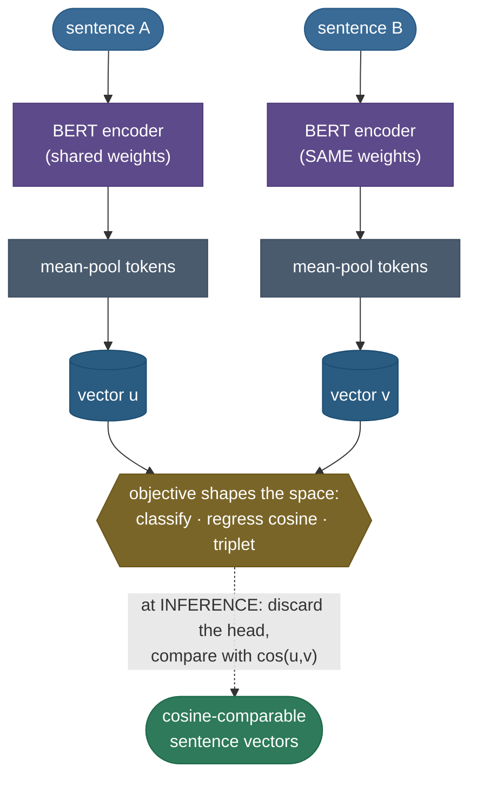
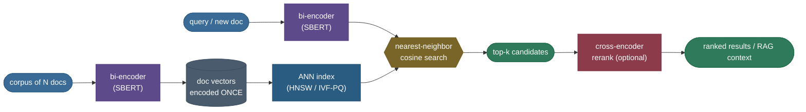

# Sentence & Document Embeddings: one vector for a whole passage

You already know how to turn a *word* into a vector. Now suppose I hand you ten million customer-support tickets and a brand-new one, and ask: *"which past ticket is this most like?"* You don't want the words it shares — "the", "my", "please" — you want the **meaning**. The dream is a single function `embed("…") → ℝ^d` that maps each whole sentence or document to **one dense vector**, arranged so that *texts that mean the same thing land close together* and *texts about different things land far apart*. Then "find similar text" becomes "find nearby vectors", clustering becomes k-means in that space, deduplication becomes a near-neighbor lookup, and retrieval-for-RAG becomes a cosine search. The entire modern stack of semantic search, recommendation, and retrieval is built on getting that one vector right.

This is harder than it sounds, and the history of *getting it wrong* is the most instructive part. I'm going to teach this the way I'd actually walk a teammate through it: first **feel why the naive recipe fails** (averaging word vectors, then — surprisingly — even off-the-shelf BERT), then build up the fix (**Sentence-BERT**'s siamese fine-tune), derive its training objectives, see the **contrastive** variants (**SimCSE**) that need no labels, connect it to **semantic search and dense retrieval** at scale, and survey the **modern embedding models** (E5/GTE/BGE, OpenAI's API, the MTEB leaderboard) you'd actually reach for today. By the end you'll be able to:

- explain *why* mean-pooled word2vec **loses word order and over-weights frequent words**, and how **SIF** patches it;
- explain the single most-asked interview trap here — *why raw BERT `[CLS]` or mean-pooled BERT gives **poor** similarity out of the box* (anisotropy), and what fixes it;
- **derive** SBERT's three training objectives (classification over `(u, v, |u−v|)`, regression on cosine, and the triplet loss) and say why they yield cosine-comparable vectors *fast*;
- contrast a **bi-encoder** against a **cross-encoder** and reason about the O(n²) cost that makes retrieval use the former;
- explain **SimCSE** (a sentence encoded twice through dropout is a positive pair) and connect it to contrastive SSL;
- size and reason about **dense retrieval** with ANN indexing, and place ColBERT's late interaction;
- read an **MTEB** score and pick an embedding model on purpose, not by vibes.

> **Note:** the word "embedding" is overloaded. A *word* embedding is one vector per token (Word2Vec/GloVe). A *contextual* embedding is one vector per token *in context* (BERT layers). A *sentence/document* embedding — this page — is **one vector for an entire span of text**. The job here is **pooling** many token vectors (or running a dedicated encoder) down to a single, comparison-ready vector.

This page is the canonical deep-dive; it leans on three neighbors rather than repeating them — **[word embeddings](../05-Word-Embeddings-Word2Vec-GloVe-FastText/05-Word-Embeddings-Word2Vec-GloVe-FastText.md)** (the static vectors we'll average), **[contextual embeddings (ELMo · BERT)](../06-Contextual-Embeddings-ELMo-BERT/06-Contextual-Embeddings-ELMo-BERT.md)** (the token-level vectors we'll pool), and **[contrastive / self-supervised learning](../../04.%20Unsupervised_Learning/concepts/12-Contrastive-Self-Supervised-Learning.md)** (the InfoNCE machinery SimCSE reuses). Where it ends — **[information retrieval & semantic search](../16-Information-Retrieval-and-Semantic-Search/16-Information-Retrieval-and-Semantic-Search.md)** — is its own page; we build the *encoder* here and hand off the *index* there.

> **Build it as you read.** Every measured number below is reproduced by the runnable scripts next to this page — a step-by-step [teaching notebook](code/07-Sentence-and-Document-Embeddings.ipynb), the single-source-of-truth [demo module](code/sentence_embeddings.py) (`python sentence_embeddings.py`), and the [figure generator](code/make_figures_07.py) that draws every chart here from the *same* functions, so the page, the notebook, and the figures can never drift.

---

## The problem: a sentence is more than its words

Start from what you have. After [word embeddings](../05-Word-Embeddings-Word2Vec-GloVe-FastText/05-Word-Embeddings-Word2Vec-GloVe-FastText.md), every token is a vector. The most obvious way to get a sentence vector is to **average the word vectors**. This is the *continuous bag-of-words* of a sentence, and — credit where due — it is a shockingly strong baseline. It captures topic well: "the dog barked loudly" and "a hound was barking" overlap heavily in their averaged vectors. For coarse similarity it often beats far fancier methods, and you should always run it as a sanity floor. But it has two structural flaws that no amount of tuning removes — and you have to *feel* both before the fixes make sense.

**Flaw 1 — it is order-blind.** Averaging is *permutation-invariant*: `mean(v_a, v_b, v_c)` equals `mean(v_c, v_a, v_b)`. So these two sentences get the **identical** vector:

> *"The dog bit the man."*  vs  *"The man bit the dog."*

Same words, opposite meaning, same average — cosine **exactly 1.000**, the two sentences are literally the same point in space. Any task where word order carries the meaning — negation, who-did-what-to-whom, "not good" vs "good" — is invisible to a bag of word vectors. This isn't a tuning problem; it's a *mathematical* property of averaging, and the only cure is a model that *reads the sentence in order*.


**Flaw 2 — frequent words dominate.** High-frequency words ("the", "is", "of") have large-norm, semantically-bland vectors that, when you average, **drown out** the few content words that actually matter. The sentence's "topic" gets smeared toward a generic mean. You can feel this: two sentences that share only stopwords can look deceptively similar.

> **Gotcha:** averaging *word* vectors is a strong topic-similarity baseline but a weak *meaning* one. In an interview, name both failure modes explicitly — **order-invariance** and **frequency-domination** — because the methods that follow are each a direct response to one of them: SIF attacks Flaw 2, and a transformer encoder attacks Flaw 1.

---

## A principled average: SIF (smooth inverse frequency)

Before neural sentence encoders, **Arora, Liang & Ma (2017)** asked: if we *must* average, can we do it well? Their answer — **SIF**, "smooth inverse frequency" — is a two-line recipe that is still a remarkably tough baseline, and deriving it teaches the right instinct. We tackle Flaw 2 here; Flaw 1 waits for the encoder.

### Intuition first — a soft, learned stopword list

Hard stopword removal ("delete *the*, *is*, *of*") is a blunt instrument: it throws away words with a yes/no rule and a hand-built list. SIF replaces the cliff with a **smooth slope** — the more common a word, the less it counts, with the cutoff *learned from frequency* instead of declared. A word that appears 5% of the time gets crushed; a rare content word keeps almost its full weight. It's TF-IDF's "penalize ubiquity" instinct, turned into a single multiplier.

### Step 1 — the weighting, derived

Instead of a plain mean, weight each word $w$ by

$$a_w \;=\; \frac{a}{a + p(w)},$$

where $p(w)$ is the word's unigram probability in the corpus and $a$ is a small constant (the paper uses $a \approx 10^{-3}$). Read the shape: as $p(w)$ grows large (a common word), the denominator is dominated by $p(w)$ and the weight $\to a/p(w) \to$ **small**; as $p(w) \to 0$ (a rare content word), the weight $\to a/a = $ **1**. The weighted sentence vector is $\mathbf{s} = \frac{1}{|S|}\sum_w a_w \mathbf{v}_w$.

> **Source / derivation:** [Arora, Liang & Ma (2017), *A Simple but Tough-to-Beat Baseline for Sentence Embeddings*](https://openreview.net/forum?id=SyK00v5xx) — the weight $a/(a+p(w))$ is the maximum-likelihood estimate of the sentence's latent "discourse vector" under their random-walk generative model (their §3, Theorem 1); it is *not* a heuristic bolted on — it falls out of the model. See `sif_weight()` in [`sentence_embeddings.py`](code/sentence_embeddings.py).

| $p(w)$ (word frequency) | weight $\dfrac{a}{a+p(w)}$ with $a=10^{-3}$ |
|---|---|
| 0.05  (very common, e.g. "the") | **0.0196** |
| 0.005 (common) | **0.1667** |
| 0.0001 (rare content word) | **0.9091** |

A common word gets ~**1/50th** the weight of a rare content word — a soft, smooth version of stopword removal that *learns* the cutoff from frequency instead of a hard list. (This is the same instinct as **TF-IDF**'s IDF term — penalize ubiquity — and as **subsampling frequent words** in word2vec training; SIF makes it a smooth multiplier.)

### Step 2 — remove the common component

Compute the sentence vectors for your whole corpus, find their **first principal component** $\mathbf{u}$ (the direction *every* sentence shares — syntax, the "the/is/of" baseline), and subtract its projection from each:

$$\mathbf{s} \;\leftarrow\; \mathbf{s} - (\mathbf{u}^\top \mathbf{s})\,\mathbf{u}.$$

The term $\mathbf{u}^\top\mathbf{s}$ is the (signed) length of $\mathbf{s}$ along $\mathbf{u}$; multiplying by $\mathbf{u}$ rebuilds that component as a vector, and subtracting it removes exactly the part of $\mathbf{s}$ that points along the common direction. That direction carries no discriminative signal — it's the same in every sentence — so removing it sharpens the differences that matter.

> **Source / derivation:** [Arora, Liang & Ma (2017)](https://openreview.net/forum?id=SyK00v5xx), Algorithm 1, step 2 (common-component removal). This "remove the top principal component" trick reappears, almost verbatim, as the cure for BERT's **anisotropy** below — **same disease, same medicine**. See `remove_common_component()` in [`sentence_embeddings.py`](code/sentence_embeddings.py).

### Worked example — SIF vs plain average on one sentence

Take *"the cat sat"* with toy 2-D word vectors and unigram probabilities $p(\text{the})=0.05$, $p(\text{cat})=0.0003$, $p(\text{sat})=0.0008$, $a=10^{-3}$:

| word | $p(w)$ | vector $\mathbf{v}_w$ | weight $a/(a+p)$ |
|---|---|---|---|
| the | 0.05 | $(1.0,\ 0.0)$ | $10^{-3}/0.051 = \mathbf{0.0196}$ |
| cat | 0.0003 | $(0.0,\ 1.0)$ | $10^{-3}/0.0013 = \mathbf{0.769}$ |
| sat | 0.0008 | $(0.2,\ 0.9)$ | $10^{-3}/0.0018 = \mathbf{0.556}$ |

- **Plain average:** $\tfrac13[(1,0)+(0,1)+(0.2,0.9)] = (0.40,\ 0.63)$ — the bland "the" vector pulls the result a full 0.40 along the x-axis, even though "the" carries no topic.
- **SIF weighted average** (normalize the weights to sum to 1: $0.0196, 0.769, 0.556 \to 0.0146, 0.572, 0.413$): $\;0.0146(1,0) + 0.572(0,1) + 0.413(0.2,0.9) = (0.097,\ 0.944)$ — the result now points almost entirely toward the *content* words (cat, sat) and barely registers "the".

The plain mean sat at x = 0.40 (dominated by the stopword); SIF cut that to x = 0.097, a **~4× reduction** in the stopword's pull, while keeping the content direction. That single number is what "down-weight frequent words" buys you, and it generalizes to every sentence in the corpus.


> **Note:** SIF still cannot fix order-blindness — it's still a weighted *average*. It fixes only frequency-domination (Flaw 2). To respect word order you need a model that *reads* the sentence in sequence — and the first attempts to *learn* a document vector, rather than average one, came before transformers.

---

## Doc2Vec: learn the vector, don't average it

Between "average word vectors" and "run a transformer" sits **Doc2Vec** (Le & Mikolov, 2014), also called *Paragraph Vectors* — the first widely-used method to **learn** a dense vector for a whole document by gradient descent, rather than pooling word vectors after the fact. The idea is a small but powerful twist on word2vec.

**Intuition — give every paragraph its own trainable token.** In word2vec, you predict a word from its context. Doc2Vec adds, alongside the context word vectors, a **paragraph vector**: a unique learnable embedding for *the document this window came from*. As training slides the prediction window across the document, the context words change but the paragraph vector **stays the same** for every window in that document — so it has to absorb whatever is *consistent* across the whole document (its topic, its gist) to help predict each window. The paragraph vector becomes a "memory" of what the local word windows keep leaving out.

There are two variants, mirroring word2vec's two:

- **PV-DM (Distributed Memory)** — the analogue of word2vec's **CBOW**: concatenate (or average) the paragraph vector with the context word vectors and predict the **next word**. Because it can *concatenate* and respect window position, PV-DM retains *some* word-order signal (a real step past a pure bag-of-words average). It's the default and usually the stronger variant.
- **PV-DBOW (Distributed Bag-of-Words)** — the analogue of word2vec's **skip-gram**: ignore context words entirely and use the paragraph vector alone to predict **words sampled from the document**. Lighter and faster (no word-vector storage needed), it discards word order but is a strong, cheap complement; the paper recommends *combining* PV-DM and PV-DBOW.


> **Source / derivation:** [Le & Mikolov (2014), *Distributed Representations of Sentences and Documents*](https://arxiv.org/abs/1405.4053) — §2 defines PV-DM (their Fig. 2, paragraph vector + context predicting the next word) and §2.3 defines PV-DBOW (their Fig. 3). The paragraph vector is trained by the same negative-sampling/hierarchical-softmax objective as word2vec, with one extra embedding row per document.

**The catch that BERT later solves.** Doc2Vec has a famous inference wart: to embed a **new, unseen** document you must run **gradient descent at inference time** — freeze the word vectors and softmax weights, then train *just* the new paragraph vector for a few steps until it predicts the new document's words. That's slow and slightly non-deterministic (different random seeds/step counts give different vectors), and it's a big reason the field moved to **encoders** that map a new document to a vector in a single forward pass. But the core lesson survived: a *learned* document representation, supervised by a language-modeling-style objective, beats a fixed average — which is exactly what SBERT delivers with a transformer.

> **Note:** Doc2Vec is the conceptual bridge from "pool word vectors" to "run a learned encoder." It learns the vector (good) but needs per-document optimization to embed anything new (bad). A transformer bi-encoder keeps the "learned representation" win and replaces the per-document optimization with a single, deterministic forward pass — which is why we turn to BERT next.

---

## The surprise: raw BERT makes *bad* sentence vectors

Here is the result that trips up almost everyone. You have BERT — a deep, contextual, order-aware transformer. Surely its sentence vectors are great? You take the `[CLS]` token's final-layer vector (BERT was literally trained to use `[CLS]` for sentence-level classification), or you mean-pool all the token vectors, and you compare with cosine.

It is **worse than averaging GloVe.** Reimers & Gurevych measured exactly this in the Sentence-BERT paper: out-of-the-box BERT sentence embeddings, compared by cosine, *underperform a simple average of GloVe vectors* on semantic textual similarity (STS). A 110M-parameter contextual model loses to a bag of static vectors. Why?

**Reason 1 — `[CLS]` was never trained for cosine similarity.** BERT's `[CLS]` was optimized for *next-sentence prediction* and as a feature for a *supervised classifier head* — both of which feed it into more layers that learn whatever transformation they need. Nothing ever asked `[CLS]` to be *directly cosine-comparable*. It's a feature for a downstream head, not a finished coordinate.

**Reason 2 — anisotropy.** This is the deep one, and a frequent interview question. Empirically, BERT's token (and pooled) embeddings are **anisotropic**: instead of spreading over the sphere, they occupy a **narrow cone** in vector space. When every vector points in roughly the same direction, *all pairwise cosines are high* — even for unrelated sentences — so cosine loses its power to discriminate. (This is partly driven by frequency: rare tokens get pushed into a tight region.) Measured average cosine similarity between *random* BERT sentences is far above zero; in a well-behaved isotropic space it would hover near zero.


> **Gotcha:** "BERT is contextual, so BERT sentence vectors must be good" is the single most common wrong assumption here. Contextual ≠ *cosine-comparable*. The token vectors are rich, but the *geometry of the pooled space* is wrong for cosine. You either fix the geometry (post-hoc whitening / BERT-flow) or fine-tune the model to produce comparable vectors directly — which is SBERT.

There are two families of fixes:

- **Post-hoc, training-free:** *whiten* the embedding space — **BERT-flow** (a normalizing flow to a Gaussian) and **BERT-whitening** (a linear transform to zero-mean, identity-covariance) both make the cone isotropic and recover a lot of performance with no labels. These are the BERT-era cousins of SIF's "remove the common component."
- **Fine-tune the model to emit comparable vectors directly:** **Sentence-BERT**. This is the dominant approach, and the rest of the page.

> **Source / derivation:** the anisotropy diagnosis and the flow-based whitening fix are from [Li et al. (2020), *On the Sentence Embeddings from Pre-trained Language Models* (BERT-flow)](https://arxiv.org/abs/2011.05864); the "raw BERT loses to averaged GloVe on STS" measurement is Table 1 of [Reimers & Gurevych (2019)](https://arxiv.org/abs/1908.10084).

---

## Sentence-BERT: the mechanism

The idea behind **Sentence-BERT (SBERT)** (Reimers & Gurevych, 2019) is exactly as simple as it should be: *if you want pooled vectors to be cosine-comparable, train them to be.* SBERT takes a pretrained BERT/RoBERTa, adds a **pooling** layer to turn token vectors into one sentence vector, and **fine-tunes it in a siamese setup** on sentence-pair data so that the geometry of the output space *means* similarity.

### Intuition — twin towers, shared weights

A **siamese network** is two copies of the same network with **tied (shared) weights**. You push sentence A through one tower and sentence B through the other; because the weights are shared, both sentences are mapped by the *same* function into the *same* space — which is exactly the property you need for cosine to be meaningful. (If the two towers had different weights, "close" would have no consistent meaning — it would be like measuring distance with two different rulers.) SBERT pools each tower's token outputs into a vector — call them $\mathbf{u}$ for A and $\mathbf{v}$ for B — and then a loss shapes the relationship between $\mathbf{u}$ and $\mathbf{v}$.



> **Note:** "siamese" and "bi-encoder" name the same thing from two angles. *Siamese* describes the **training** picture (twin towers, shared weights, a pairwise loss). *Bi-encoder* describes the **inference** picture (each text encoded **independently** into a vector, then compared). One architecture, two names depending on whether you're talking about how it's trained or how it's used.

---

## The math: three objectives, derived

SBERT's vectors become comparable because a **proxy objective** organizes the space. There are three, and each is worth deriving because the *indirect* supervision is the whole trick.

```
u, v  ∈ ℝ^d        # pooled sentence vectors for A and B (d = 384 for all-MiniLM-L6-v2)
```

### Objective 1 — the classification objective (on NLI)

Natural Language Inference (NLI) data — **SNLI** + **MultiNLI**, ~1M labeled pairs — labels each sentence pair as **entailment**, **contradiction**, or **neutral**. SBERT's first and most famous objective turns this 3-way label into supervision for the embeddings. Given pooled vectors $\mathbf{u}, \mathbf{v} \in \mathbb{R}^d$, form the feature

$$\mathbf{f} \;=\; [\,\mathbf{u};\ \mathbf{v};\ |\mathbf{u}-\mathbf{v}|\,] \;\in\; \mathbb{R}^{3d},$$

i.e. **concatenate** $\mathbf{u}$, $\mathbf{v}$, and their **elementwise absolute difference** $|\mathbf{u}-\mathbf{v}|$, then feed $\mathbf{f}$ through a softmax classifier:

$$\mathbf{o} \;=\; \mathrm{softmax}\!\big(W\,\mathbf{f}\big), \qquad W \in \mathbb{R}^{3 \times 3d},$$

and minimize cross-entropy against the entailment/neutral/contradiction label.

> **Source / derivation:** [Reimers & Gurevych (2019), *Sentence-BERT*](https://arxiv.org/abs/1908.10084), §3 (Classification Objective Function), eq. 1. Their ablation (Table 6) shows $|\mathbf{u}-\mathbf{v}|$ is the **most important** of the three concatenated components.

Two design choices are doing the heavy lifting:

1. **Why $|\mathbf{u}-\mathbf{v}|$?** The difference vector tells the classifier *where and how much* the two embeddings diverge per dimension; its magnitude is what a distance is built from. The classifier essentially learns "small difference + this pattern ⇒ entailment; large difference ⇒ contradiction", which **pushes entailed pairs' embeddings together and contradictory pairs' apart** as a side effect of being classifiable.
2. **The classifier head is discarded after training.** $W$ exists only to shape the encoder during fine-tuning. At inference you **throw it away** and use plain $\cos(\mathbf{u}, \mathbf{v})$ — the embedding *space* has already absorbed the similarity structure.

> **Tip:** the magic is *indirect supervision*. You never directly tell the model "make these two vectors have cosine 0.8." You give it a classification task whose only path to low loss runs through *organizing the embedding space by similarity*. The cosine-comparability is an **emergent** property of solving the proxy task — the same trick contrastive learning uses.

### Objective 2 — the regression objective (on STS)

When you have **graded** similarity labels — STS benchmark pairs scored 0–5 by humans — you can supervise the cosine *directly*. Compute $\cos(\mathbf{u},\mathbf{v})$ and regress it onto the (rescaled) gold score with **mean-squared error**:

$$\mathcal{L}_{\text{reg}} \;=\; \big(\cos(\mathbf{u},\mathbf{v}) - y\big)^2, \qquad y \in [-1, 1].$$

> **Source / derivation:** [Reimers & Gurevych (2019)](https://arxiv.org/abs/1908.10084), §3 (Regression Objective Function). This is the most on-the-nose objective: it makes the very quantity you'll use at inference (cosine) match human judgment. It's the natural choice when graded similarity labels exist, and is often used to *fine-tune further* a model first trained with the NLI classification objective.

### Objective 3 — the triplet objective

When data comes as **triplets** — an *anchor* $a$, a *positive* $p$ (should be close), and a *negative* $n$ (should be far) — SBERT uses the **triplet loss**:

$$\mathcal{L}_{\text{trip}} \;=\; \max\!\big(0,\; \|\mathbf{s}_a-\mathbf{s}_p\| \;-\; \|\mathbf{s}_a-\mathbf{s}_n\| \;+\; \epsilon\big),$$

with a margin $\epsilon$. Read it literally: the loss is **zero** once the positive is closer to the anchor than the negative *by at least the margin*; otherwise it's positive and its gradient **pulls $p$ toward $a$ and pushes $n$ away**.

> **Source / derivation:** [Reimers & Gurevych (2019)](https://arxiv.org/abs/1908.10084), §3 (Triplet Objective Function). The hinge geometry is the same buffer-you-must-clear idea as an SVM margin. See `triplet_loss()` in [`sentence_embeddings.py`](code/sentence_embeddings.py).

**Worked example — triplet loss, two cases.** Use distance $d(x,y) = 1 - \cos(x,y)$ and margin $\epsilon = 0.3$.

- *Already satisfied.* Positive much closer than negative: $d(a,p) = 0.013$, $d(a,n) = 0.884$. Then
  $$\mathcal{L} = \max(0,\; 0.013 - 0.884 + 0.3) = \max(0,\, -0.571) = \mathbf{0}.$$
  No gradient — this triplet is "solved", the model leaves it alone and spends capacity on hard ones.
- *Not yet satisfied.* A near-miss where the negative is actually *closer*: $d(a,p) = 0.400$, $d(a,n) = 0.200$. Then
  $$\mathcal{L} = \max(0,\; 0.400 - 0.200 + 0.3) = \max(0,\, 0.5) = \mathbf{0.5}.$$
  A large positive loss whose gradient drags the positive in and shoves the negative out until the margin is met.


> **Note:** the **margin** $\epsilon$ matters. Too small and the model is satisfied by a razor-thin gap that doesn't generalize; too large and it wastes effort on impossible separations. It's the same hinge-loss geometry as an SVM margin — a buffer the model must clear, not just a tie-break.

> **Tip:** the modern default has largely moved past the NLI-classification objective to **in-batch contrastive** training (the SimCSE section) with **hard negatives** — but the classification objective is still the canonical thing to *explain* in an interview, because it's the cleanest illustration of "shape the space with a proxy task."

### Pooling: how to collapse tokens into one vector

The encoder emits one vector per token; **pooling** turns the $T \times d$ matrix into one $d$-vector. Three standard choices:

- **Mean pooling** — average all token vectors (mask out padding). **This is the default and usually wins**: it incorporates *every* token, so no single position is a bottleneck, and it's robust to length.
- **`[CLS]` pooling** — use the special first token's vector. Natural-feeling (BERT's own design) but, untuned, it's the weakest; it can match mean-pooling *after* fine-tuning but rarely beats it.
- **Max pooling** — elementwise max over tokens. Occasionally helps on keyword-spotting-style tasks but generally trails mean.


> **Gotcha:** mention the pooling strategy when you describe an embedding model — it's part of the model, not an afterthought. Two checkpoints with identical weights but different pooling produce different vectors, and you must use the **same** pooling at index time and query time or your cosines are meaningless.

### The payoff: 65 hours → 5 seconds

The headline result is about **speed at scale**, and it's the reason SBERT exists. Suppose you want to find the most similar pair among **10,000 sentences**. With a **cross-encoder** (feed each *pair* jointly through BERT for a relevance score — accurate, but no reusable vector), you must score all $\binom{10000}{2} \approx 50$ **million** pairs: Reimers & Gurevych measured this at **~65 hours**. With SBERT you **encode each sentence once** (10,000 forward passes → 10,000 vectors), then compare vectors with cheap cosine: **~5 seconds**. The bi-encoder turns an $O(n^2)$ *model* cost into an $O(n)$ encode plus an $O(n^2)$ but *trivially cheap* (and ANN-acceleratable) vector comparison. That asymmetry — encode once, compare forever — is what makes search, clustering, and retrieval tractable.

---

## Code: build it, then measure the three claims

Here is the from-scratch core, the way I'd actually run it to convince myself. It (1) proves mean-pooling is order-blind, (2) shows the SIF weighting on the toy example, and (3) shows a trained bi-encoder separating a paraphrase from an unrelated sentence by cosine — *each claim asserted before it's printed*. It loads a real Sentence-BERT when one is reachable (the exact numbers below), and falls back to a deterministic synthetic encoder offline so it **always** runs.

> **Runnable project and a step-by-step notebook:** the same verified code lives as a clean module and an executed teaching notebook next to this page — the [step-by-step notebook](code/07-Sentence-and-Document-Embeddings.ipynb) and the [demo module](code/sentence_embeddings.py) (`python sentence_embeddings.py`). The figures on this page are drawn by [`make_figures_07.py`](code/make_figures_07.py), importing the *same* functions.

```python
"""Sentence embeddings, measured. Verified on Python 3.12, torch 2.12, sentence-transformers 5.6 (CPU).
Loads all-MiniLM-L6-v2 when reachable; a deterministic synthetic encoder is the offline fallback."""
import numpy as np
from sentence_embeddings import (
    load_encoder, mean_pool, sif_worked_example, cosine,
    ORDER_A, ORDER_B, PARAPHRASE_SET,
)

encoder = load_encoder()                         # real SBERT if available, else synthetic fallback

# 1) Mean-pooling is ORDER-BLIND: "dog bit man" and "man bit dog" -> identical vector.
words = sorted(set(ORDER_A.lower().replace(".", "").split()
                 + ORDER_B.lower().replace(".", "").split()))
rng = np.random.default_rng(0)
table = {w: rng.standard_normal(32) for w in words}              # one static vector per word
mp_a = mean_pool([table[w] for w in ORDER_A.lower().replace(".", "").split()])
mp_b = mean_pool([table[w] for w in ORDER_B.lower().replace(".", "").split()])
assert abs(cosine(mp_a, mp_b) - 1.0) < 1e-9                       # CLAIM: exactly identical
print(f"mean-pool cosine (reversed sentences): {cosine(mp_a, mp_b):.3f}")   # 1.000

# 2) SIF down-weights the stopword 'the' on the toy 'the cat sat'.
ex = sif_worked_example()
assert ex["sif"][0] < ex["plain"][0]                             # CLAIM: SIF cuts the stopword's pull
print(f"plain-mean x={ex['plain'][0]:.3f}  ->  SIF x={ex['sif'][0]:.3f}  "
      f"({ex['plain'][0]/ex['sif'][0]:.1f}x less stopword pull)")

# 3) A trained bi-encoder separates paraphrase from unrelated by cosine.
e = encoder.encode(list(PARAPHRASE_SET))                         # [man+guitar, paraphrase, elephant]
par, unrel = cosine(e[0], e[1]), cosine(e[0], e[2])
assert par > unrel                                              # CLAIM: paraphrase closer than unrelated
print(f"paraphrase cos {par:+.3f}   unrelated cos {unrel:+.3f}")
```

Output with the real `all-MiniLM-L6-v2` backend (CPU, seconds):

```
mean-pool cosine (reversed sentences): 1.000
plain-mean x=0.400  ->  SIF x=0.097  (4.1x less stopword pull)
paraphrase cos +0.708   unrelated cos -0.089
```


> **Note:** the headline is the **gap**. The encoder's paraphrase 0.708 vs unrelated −0.089 is a clean, wide separation that *means* something; the mean-pool baseline of random static vectors only captures surface overlap and can even rank the unrelated pair above the paraphrase. *That separation is the whole product* — search, clustering, and dedup are just geometry on the encoder's space.

---

## Pitfalls & failure modes

These are the things that actually bite practitioners — name the pitfall, see it fail, then fix it.

- **Assuming "contextual ⇒ good sentence vectors."** Raw mean-pooled or `[CLS]` BERT is *worse than averaged GloVe* on STS because of **anisotropy** (the cone). **Fix:** fine-tune (SBERT) or whiten (BERT-flow / BERT-whitening); never ship raw-BERT cosine for similarity.
- **Forgetting the instruction prefix.** A model trained with `"query: "` / `"passage: "` (E5, BGE) **expects** them; *forgetting the prefix at inference silently degrades retrieval* — no error, just worse numbers. **Fix:** read the model card and apply the exact prefixes (and pooling) it was trained with. This is a top real-world footgun.
- **Mismatched pooling between index and query.** Index with mean pooling, query with `[CLS]`, and your cosines are comparing apples to oranges. **Fix:** pin one pooling everywhere (the model card states it).
- **Not normalizing before an inner-product index.** ANN indexes optimize **maximum inner product**; only on **unit** vectors does that equal cosine. Skip normalization and your "nearest neighbors" are wrong (longer vectors win regardless of direction). **Fix:** L2-normalize at index *and* query time (most APIs return normalized vectors; verify yours does).
- **Symmetric model for an asymmetric job (or vice versa).** STS-tuned models compare *sentence vs sentence*; retrieval-tuned models compare a *short query vs a long passage*. Using the wrong one quietly costs recall. **Fix:** match the model's training to your similarity type and benchmark both on your data.
- **One vector for a long document.** Squeezing a 5,000-word document into one vector *averages away* the specific passage that answers a query. **Fix:** **chunk** into passages (with overlap) and retrieve at chunk granularity.
- **Picking the #1 MTEB model reflexively.** MTEB averages 8 task types; a clustering/classification champion can trail on retrieval. **Fix:** read the **retrieval** column for a retrieval job, weigh dimension/length/language/license, and validate on *your* data.

> **Gotcha:** the most expensive of these in production is the **silent** ones — the missing prefix, the un-normalized vectors, the mismatched pooling. They don't throw; they just make your search a little worse, and you won't notice until you measure Recall@k on real queries. Build that measurement *first*.

---

## Contrastive sentence embeddings: SimCSE

SBERT's NLI objective needs **labeled** pairs. The contrastive view asks: can we learn great sentence embeddings with little or no labeling? **SimCSE** (Gao, Yao & Chen, 2021) gives a beautiful, almost-too-simple answer, and it's the bridge to [contrastive / self-supervised learning](../../04.%20Unsupervised_Learning/concepts/12-Contrastive-Self-Supervised-Learning.md).

### Unsupervised SimCSE: dropout is the augmentation

The trick: take a sentence and pass it through the encoder **twice**. Because the encoder has **dropout**, the two passes drop *different* random units, so you get **two slightly different vectors of the same sentence** — a **positive pair** that needs no labeling or external augmentation. Every *other* sentence in the batch is a **negative**. Train with the **InfoNCE** contrastive loss: for a batch of $N$ sentences, with $\mathbf{h}_i, \mathbf{h}_i^+$ the two dropout views of sentence $i$,

$$\mathcal{L}_i \;=\; -\log \frac{\exp\!\big(\cos(\mathbf{h}_i, \mathbf{h}_i^+)/\tau\big)}{\sum_{j=1}^{N} \exp\!\big(\cos(\mathbf{h}_i, \mathbf{h}_j^+)/\tau\big)},$$

with temperature $\tau$ (≈0.05). Read it: the numerator maximizes agreement between the two views of the *same* sentence; the denominator (the sum over *all* sentences) pushes away the views of every *other* sentence.

> **Source / derivation:** [Gao, Yao & Chen (2021), *SimCSE*](https://arxiv.org/abs/2104.08821), eq. 1 (unsupervised) and §3. This is **exactly** the InfoNCE / SimCLR objective from contrastive SSL — SimCSE's only novelty is realizing that **standard dropout *is* a minimal, meaning-preserving augmentation for text** (whereas word deletion or swapping distorts meaning too much). See `info_nce_loss()` in [`sentence_embeddings.py`](code/sentence_embeddings.py).

It's stunningly effective: unsupervised SimCSE beats most prior unsupervised methods, and as a side effect it **fixes anisotropy** — the contrastive "push everything else away" term spreads the cone out into a more isotropic, uniform space.

> **Note:** contrastive learning has two implicit forces, formalized as **alignment** (positives should be close) and **uniformity** (embeddings should spread over the sphere). The numerator pulls for alignment; the denominator (push all negatives away) pulls for uniformity — and uniformity is precisely the cure for anisotropy. SimCSE makes BERT's cone isotropic *for free*, as a by-product of the contrastive objective.

### Supervised SimCSE: NLI entailment as positives

When labels *are* available, SimCSE uses NLI smartly: an **entailment** pair $(x_i, x_i^+)$ is a **positive**, and — the key addition — the **contradiction** sentence $x_i^-$ becomes a **hard negative** in the denominator:

$$\mathcal{L}_i \;=\; -\log \frac{\exp(\cos(\mathbf{h}_i, \mathbf{h}_i^+)/\tau)}{\sum_{j=1}^{N}\Big[\exp(\cos(\mathbf{h}_i, \mathbf{h}_j^+)/\tau) + \exp(\cos(\mathbf{h}_i, \mathbf{h}_j^-)/\tau)\Big]}.$$

> **Source / derivation:** [Gao, Yao & Chen (2021)](https://arxiv.org/abs/2104.08821), eq. 5 (supervised, with hard negatives). The explicit contradiction hard-negative is what lifts supervised SimCSE to the top of STS — easy negatives (random batch sentences) teach little once the model is decent; a *contradiction*, which is topically close but semantically opposite, is exactly the hard case that sharpens the boundary.

This **hard-negative mining** instinct is everywhere in modern embedding training.

> **Tip:** SimCSE is why "just fine-tune with a contrastive objective and good negatives" became the default recipe. Almost every modern embedding model (E5, GTE, BGE below) is, at heart, a contrastive bi-encoder trained on huge piles of (query, positive, hard-negatives) tuples — SBERT's siamese skeleton with SimCSE's contrastive muscle.


The figure above is *measured*, not drawn: nine real sentences (three paraphrases each of weather, finance, cooking) encoded with `all-MiniLM-L6-v2` and projected to 2-D with PCA. Paraphrases land on top of each other; the three topics sit in separate regions. **That separation is the whole product** — everything downstream (search, clustering, dedup) is just geometry on this space.

---

## From embeddings to semantic search and dense retrieval

A bi-encoder is the *retriever* at the heart of modern search and RAG. The pipeline:



**Encode once, search forever.** You embed the corpus a single time (offline), store the vectors, and at query time embed only the query and find its nearest neighbors. **Dense Passage Retrieval (DPR)** showed this *dense* retrieval can **beat BM25** lexical search on open-domain QA — the embedding captures meaning that exact-term overlap misses (it retrieves a passage about "feline" for a query about "cat"). Conversely, lexical and dense each catch what the other misses, so production systems often run **hybrid** (BM25 + dense) and fuse the rankings.

**Worked example — a measured semantic search.** Query *"How do I reset my account password?"* over a 5-document support corpus, ranked by cosine (real `all-MiniLM-L6-v2`):

| rank | cosine | document |
|---|---|---|
| 1 | **0.711** | "To change your password, open Settings and click 'Reset password'." |
| 2 | **0.618** | "If you forgot your login, use the 'Forgot password' link on the sign-in page." |
| 3 | 0.080 | "Our refund policy allows returns within 30 days of purchase." |
| 4 | 0.011 | "The mobile app supports dark mode and push notifications." |
| 5 | −0.006 | "Premium plans include priority support and extra storage." |

The two password documents (ranks 1–2, cosine > 0.6) sit far above everything else (< 0.1) — and note the query word *"reset"* doesn't even appear in doc 2 ("forgot"/"Forgot password"), yet it ranks second: the embedding matched **meaning**, not keywords. That's the win lexical search can't buy.


### Scaling: approximate nearest neighbors

Cosine against *every* vector is $O(N)$ per query — fine for thousands, hopeless for billions. **Approximate Nearest Neighbor (ANN)** indexes trade a sliver of recall for orders-of-magnitude speed: **HNSW** (a navigable small-world graph you greedily walk) and **IVF-PQ** (cluster, then compress vectors with product quantization) are the workhorses behind FAISS and every vector database. The depth of *how* these indexes work lives in **[information retrieval & semantic search](../16-Information-Retrieval-and-Semantic-Search/16-Information-Retrieval-and-Semantic-Search.md)** — here, just know that the bi-encoder's "one vector per doc" is precisely what makes the corpus **indexable** at all (a cross-encoder, with no per-doc vector, cannot be ANN-indexed).

> **Note:** **normalize embeddings to unit length** and cosine similarity becomes a plain dot product, so maximum-inner-product search (what ANN indexes optimize) *is* cosine search. Most embedding APIs return normalized vectors for exactly this reason; if yours doesn't, normalize before you index or your distances are wrong. (Cosine and Euclidean give the *same ranking* on unit vectors, since $\|a-b\|^2 = 2 - 2\cos(a,b)$.)

---

## Bi-encoder vs cross-encoder: the central trade-off

This contrast is worth its own section because interviewers love it and production systems are built on getting it right.

| | **Bi-encoder** (SBERT) | **Cross-encoder** |
|---|---|---|
| **Input** | each text **separately** | the **pair**, jointly: `[CLS] A [SEP] B` |
| **Output** | a reusable **vector** per text | a single **score** per pair |
| **Comparison** | cosine of two cached vectors | one full transformer forward pass |
| **A and B see each other?** | **No** — encoded independently | **Yes** — full cross-attention |
| **Cost: N queries × M docs** | $N + M$ encodes, then cheap cosines (ANN) | $N \times M$ forward passes |
| **Cacheable / indexable?** | **Yes** — embed the corpus once | **No** — score depends on the pair |
| **Accuracy** | very good | **best** (cross-attention sees fine-grained interactions) |
| **Where it's used** | **first-stage retrieval** (search the whole corpus) | **reranking** the top-k candidates |


**Worked example — measured score & cost contrast.** Query: *"How do I reset my account password?"* against three documents, scored both ways (real `all-MiniLM-L6-v2` bi-encoder vs `cross-encoder/ms-marco-MiniLM-L-6-v2`):

| Document | bi-encoder cosine | cross-encoder logit |
|---|---|---|
| "To change your password, open Settings and click 'Reset password'." | **0.711** | **+6.30** |
| "If you forgot your login, use the 'Forgot password' link." | **0.642** | **−3.16** |
| "Our refund policy allows returns within 30 days of purchase." | 0.080 | **−11.10** |

> **Note:** these exact numbers are reproduced by `bi_vs_cross_demo()` in [`sentence_embeddings.py`](code/sentence_embeddings.py) (and printed by the demo and notebook). Doc 2 here is a **shortened** form ("…link.") of the longer sign-in-page string used in the search ranking above, which is why its bi-encoder cosine reads **0.642** here vs **0.618** there — same document, slightly different text, slightly different vector. It's a useful reminder that the embedding is sensitive to the exact string you feed it.

Both rank the right doc first, but notice the **cross-encoder's separation is far sharper** (+6.30 vs −3.16 vs −11.10) — its joint attention catches that the second doc is about *login recovery*, a near-but-not-exact match, and confidently spreads the scores. The bi-encoder's 0.711 vs 0.642 is a much narrower gap. *That* is why production search is **two stages**: a bi-encoder retrieves the top ~100 from millions cheaply, then a cross-encoder **reranks** just those 100 precisely. You get the cross-encoder's accuracy on the candidates without paying it across the whole corpus.

> **Tip:** the one-line answer to "bi vs cross encoder?": **bi-encoder = recall at scale (retrieve), cross-encoder = precision on few (rerank).** Use the bi-encoder to shrink millions to hundreds, the cross-encoder to order those hundreds. **[Information retrieval & semantic search](../16-Information-Retrieval-and-Semantic-Search/16-Information-Retrieval-and-Semantic-Search.md)** covers the full retrieve-then-rerank pipeline.

---

## Documents, not just sentences: chunking and late interaction

Everything so far embeds a *sentence*. Real corpora are **documents** — pages, PDFs, transcripts — and two problems appear.

**Problem 1 — length limits and dilution.** Transformer encoders cap at a few hundred tokens (often 512), and even when they accept more, **one vector for a 5,000-word document is too coarse** — it averages away the specific passage that answers a query. The standard fix is **chunking**: split documents into passages (a few sentences, often with overlap), embed each chunk, and retrieve at chunk granularity. Chunk size is a real knob — too small loses context, too large dilutes — and overlap prevents an answer from being split across a boundary. This chunking layer is foundational to **RAG**, where retrieved chunks become the LLM's context.

**Problem 2 — single-vector bottleneck.** Squeezing a whole passage into *one* vector loses token-level detail. **ColBERT** (Khattab & Zaharia, 2020) keeps **one vector per token** and scores a query–document pair by **late interaction**: for each query token, take the **max** similarity over all document tokens, then sum — the **MaxSim** operator:

$$\text{score}(q, d) \;=\; \sum_{i \in q} \max_{j \in d}\ \cos(\mathbf{q}_i, \mathbf{d}_j).$$

Read it: each query token $q_i$ finds its *single best-matching* document token (the inner $\max_j$), and those best matches are summed. It recovers much of a cross-encoder's fine-grained matching while staying *indexable* (document token vectors are precomputed offline), landing between bi- and cross-encoders on the accuracy/cost curve. The cost is storage (many vectors per doc), which **ColBERTv2** reduces with residual compression.

> **Source / derivation:** [Khattab & Zaharia (2020), *ColBERT*](https://arxiv.org/abs/2004.12832), §3.2 — the late-interaction MaxSim operator $S_{q,d} = \sum_{i} \max_{j} \mathbf{q}_i \cdot \mathbf{d}_j$ (their eq. 1). See `colbert_maxsim()` in [`sentence_embeddings.py`](code/sentence_embeddings.py).


> **Tip:** the three points on the retrieval spectrum, in one breath: **bi-encoder** = one vector per text, cheapest, indexable (first-stage retrieval); **ColBERT** = one vector per *token* + late interaction, richer, still indexable (strong single-stage); **cross-encoder** = no vectors, joint attention, most accurate, not indexable (reranking only).

---

## A predecessor worth knowing: Universal Sentence Encoder

Before SBERT there was the **Universal Sentence Encoder (USE)** (Cer et al., 2018) — Google's general-purpose sentence encoder, and a useful contrast point. USE shipped in **two flavors**: a heavier **transformer** encoder (more accurate, $O(n^2)$ in sentence length) and a lightweight **Deep Averaging Network (DAN)** — which literally *averages* word embeddings and then passes the average through a few feed-forward layers (a learned, non-linear cousin of the SIF average). The DAN trades a little accuracy for being **much** faster and length-insensitive. Crucially, USE was trained **multi-task** — on an unsupervised Skip-Thought-style objective (predict surrounding sentences) *plus* supervised SNLI — foreshadowing exactly the "supervise sentence vectors with NLI" idea SBERT would sharpen a year later.

USE's lasting lessons: (1) a sentence encoder should be **trained on a sentence-level objective**, not just borrowed from a token model's `[CLS]`; (2) **multi-task** signal (unsupervised + NLI) produces more transferable vectors; and (3) there's a real **accuracy/speed dial** (transformer vs DAN) you choose per deployment. SBERT kept lessons (1) and (2), dropped the bespoke architecture, and won by simply **fine-tuning a strong pretrained BERT** in the siamese setup — letting it inherit BERT's representations instead of training a sentence encoder from scratch.

> **Note:** the DAN is a clean reminder that **averaging isn't dead** — a *learned* average with non-linearities on top is fast, robust, and surprisingly competitive. When latency or sequence length is the binding constraint (millions of short texts), a DAN-style or distilled bi-encoder can beat a big transformer on *throughput per dollar* at acceptable accuracy.

---

## In production: modern embedding models and how you pick one

SBERT is the *idea*; the models you'd deploy in 2024+ are its industrialized descendants. The recurring recipe: a transformer bi-encoder, contrastively trained (à la SimCSE) on **massive** mined (query, positive, hard-negative) data, often with **instruction prefixes**.

- **E5** (Wang et al., 2022, "Text Embeddings by Weakly-Supervised Contrastive Pre-training") — contrastively pretrained on huge weakly-supervised text pairs (titles–bodies, Q–A, etc.). E5 popularized **asymmetric instruction prefixes**: prepend `"query: "` to queries and `"passage: "` to documents so one model handles the retrieval asymmetry (a short question vs a long answer).
- **GTE** and **BGE** (BAAI General Embedding) — strong open multi-stage-trained families that traded the MTEB lead back and forth; BGE uses instruction prefixes too and ships multilingual variants.
- **OpenAI `text-embedding-3`** (small/large) — a closed API; `-3-large` is 3,072-dim but supports **Matryoshka** truncation: dimensions are trained so you can **shorten the vector** (e.g. to 256 or 1,024 dims) and keep most of the quality, trading storage/speed for a little accuracy. A clean lever for cost.
- **Sentence-Transformers** is still the canonical *library* (`SentenceTransformer("…")`), now serving all of the above; `all-MiniLM-L6-v2` (the 384-dim model used in every measurement on this page) remains the go-to small, fast default.

> **Note:** **instruction prefixes are not optional decoration** — a model trained with `"query: "`/`"passage: "` expects them, and *forgetting the prefix at inference silently degrades retrieval*. Read the model card and use exactly the prefixes (and pooling) it was trained with. This is a top real-world footgun.

**What actually separates a great embedding model from a mediocre one — the data, not the architecture.** The architecture (a BERT/RoBERTa bi-encoder with mean pooling) has been stable since 2019; the leaderboard climbs come almost entirely from **training data and negatives**. Three levers do the work:

1. **Scale and diversity of positive pairs.** E5/GTE/BGE are pretrained on *hundreds of millions* of naturally-paired texts mined from the web — (title, body), (question, answer), (post, comment), (citation, abstract). More, more-diverse positives teach the model what "similar" means across domains.
2. **Hard negatives.** The single biggest quality lever after scale. **In-batch negatives** (other examples in the batch) are mostly *easy* — obviously unrelated — and teach little once the model is decent. **Mined hard negatives** — passages that are topically close but *wrong* (often retrieved by an earlier model, then filtered) — are what sharpen the decision boundary, exactly as the contradiction hard-negative did for supervised SimCSE. Larger **batch size** also helps, because it means more negatives per positive in the InfoNCE denominator.
3. **Multi-stage training.** The standard pipeline is *contrastive pretraining* on weak web pairs (scale) → *fine-tuning* on high-quality labeled retrieval data (MS MARCO, NQ) with mined hard negatives (precision). BGE and GTE both follow this two-stage shape.

> **Tip:** if asked "how would you improve a retriever you already have?", the senior answer is rarely "use a bigger model." It's **mine hard negatives from your own corpus, fine-tune on your own (query, relevant, hard-negative) triples, and add a reranker** — data and negatives beat raw parameter count for in-domain retrieval almost every time.

### Picking a model: the MTEB leaderboard

How do you choose among dozens of embedding models without guessing? **MTEB** (Massive Text Embedding Benchmark; Muennighoff et al., 2022) evaluates embeddings across **8 task types** — retrieval, reranking, clustering, classification, semantic similarity (STS), pair classification, summarization, bitext mining — over **50+ datasets**, and the public leaderboard ranks every model. It's the field's standard scoreboard.

> **Gotcha:** **don't pick the #1 MTEB model reflexively.** MTEB averages many tasks; if your job is *retrieval*, read the **retrieval** column, not the overall average — a model that wins on clustering or classification can trail on retrieval. Also weigh **dimension** (storage/ANN cost), **max sequence length** (does it fit your chunks?), **multilingual** coverage, and **license/hosting** (open weights vs API). The best model is the best *for your task and constraints*, and you should validate on **your own** data, because MTEB datasets may not match your exact domain.

### Evaluating sentence embeddings — STS and the Spearman convention

Two evaluations matter, depending on use:

- **Semantic similarity (intrinsic):** on **STS-B**, compute cosine for each pair and report **Spearman rank correlation** with human scores.

$$\rho \;=\; \mathrm{Pearson}\big(\mathrm{rank}(\cos), \ \mathrm{rank}(y)\big).$$

> **Source / derivation:** [Reimers & Gurevych (2019)](https://arxiv.org/abs/1908.10084), §4.1 use **Spearman** (rank-based) precisely because STS cares about *ordering* similarity correctly, not matching an absolute scale — we rank both the model cosines and the gold scores and correlate the ranks. See `spearman()` and `sts_evaluation()` in [`sentence_embeddings.py`](code/sentence_embeddings.py).

- **Retrieval (extrinsic):** embed a corpus, run real queries, and report **nDCG@10**, **Recall@k**, **MRR** — does the right document show up near the top? This is what actually matters for search/RAG, and it's what MTEB's retrieval split measures.


> **Tip:** intrinsic (STS) and extrinsic (retrieval) can disagree. A model can top STS yet retrieve poorly (STS pairs are short and symmetric; retrieval is asymmetric query→passage with hard negatives at scale). **Evaluate on the task you'll actually run.**

### Quantifying anisotropy (so the fix is measurable)

It's worth making the anisotropy claim concrete, because "narrow cone" can sound hand-wavy. The standard measure: take many *random, unrelated* sentence pairs and compute their **average cosine similarity**. In a healthy **isotropic** space this hovers near **0** (random directions are roughly orthogonal). For raw mean-pooled BERT, measurements put it far higher — often **0.3–0.6** — meaning two arbitrary sentences already look "30–60% similar" before you've said anything. That offset *is* the cone: it eats your dynamic range, so a truly-similar pair at 0.8 is only marginally above the 0.5 floor, and ranking is mushy. After SBERT/SimCSE the random-pair average drops back toward 0 and the *spread* of similarities widens — which is precisely why the same cosine threshold suddenly separates relevant from irrelevant cleanly. **The fix is visible as a number**, not just a vibe.

---

## Where sentence embeddings are used

Once you have a good embedding function, a surprising range of NLP tasks collapse into *geometry on the vector space*. This is the practical payoff worth internalizing — the same encoder powers all of them:

- **Semantic search / retrieval / RAG** — the flagship use, covered above: embed the corpus, ANN-index it, retrieve nearest neighbors to a query, optionally rerank. Every modern RAG system's retriever is a sentence/passage bi-encoder.
- **Clustering & topic discovery** — run k-means (or HDBSCAN) directly on the embeddings to group documents by meaning with no labels. **BERTopic** is exactly this: embed → reduce dimensions (UMAP) → cluster → label. The PCA figure earlier is a clustering result in miniature.
- **Deduplication & near-duplicate detection** — two texts with cosine above a threshold (say 0.9) are near-duplicates. This is how you de-dup training corpora, find plagiarism, or merge duplicate support tickets — an $O(N)$-encode + ANN lookup instead of $O(N^2)$ string comparison.
- **Classification (few-shot / zero-shot)** — embed labeled examples, embed a new input, and assign it the nearest class centroid (or run a tiny logistic head on the embeddings). With strong embeddings this rivals fine-tuning at a fraction of the cost and data — **SetFit** formalizes it.
- **Paraphrase mining & semantic textual similarity** — find all semantically-equivalent pairs in a large set (the 65-hours → 5-seconds use case), or score how similar two texts are for QA-pair matching, FAQ routing, and answer caching.
- **Recommendation & matching** — embed items and user history into the same space; "more like this" becomes nearest-neighbor. Same mechanic as search, different inputs.

**Asymmetric vs symmetric similarity — a subtlety that bites.** *Symmetric* tasks compare two things of the same kind (sentence vs sentence: paraphrase, STS) — a model trained on STS/NLI is ideal. *Asymmetric* tasks compare a **short query** to a **long passage** (web search, QA retrieval) — the query and document have very different shapes, and a symmetric model underperforms. This is exactly why E5/BGE use **distinct `query:` / `passage:` prefixes**: they tell one model which side it's encoding so it can map both into a shared space despite the asymmetry. Picking a symmetric model for an asymmetric job (or vice versa) is a common, quietly costly mistake.

> **Gotcha:** match the **model's training to your similarity type**. STS-tuned models excel at sentence-vs-sentence; retrieval-tuned models (DPR/E5/BGE, with prefixes and hard negatives) excel at query-vs-passage. They are *not* interchangeable — benchmark both on your data before committing.

---

## Putting it together: the playbook

Given "build semantic search / a RAG retriever over our docs", the reasoning I'd actually do:

1. **Baseline first.** Average word vectors / SIF, or `all-MiniLM-L6-v2` out of the box. Cheap, and it sets the floor every fancier choice must beat.
2. **Pick an embedding model on purpose.** Check the **MTEB retrieval** column, dimension, max length, language, and license — not the overall #1. For most English retrieval, a current E5/GTE/BGE or `text-embedding-3` is the safe default.
3. **Chunk the documents.** Split into passages (with overlap) that fit the model's context; embed at chunk granularity.
4. **Normalize and index.** Unit-normalize, then build an **ANN index** (HNSW / IVF-PQ via FAISS or a vector DB). Encode the corpus **once**.
5. **Use the model's instructions & pooling.** Apply the trained **prefixes** (`query:`/`passage:`) and the **same pooling** at index and query time.
6. **Two-stage if precision matters.** Bi-encoder retrieves top-k cheaply; **cross-encoder reranks** those k. Consider **hybrid** (BM25 + dense) fusion for robustness.
7. **Evaluate on *your* data.** Spearman on a labeled similarity set if you have one; **Recall@k / nDCG** on real queries for retrieval. Iterate on chunk size, k, and reranking.

Every step is one idea from this page applied in order. That's the whole job.

---

## Recap and rapid-fire

**If you remember nothing else:** a sentence embedding maps a whole text to **one dense vector** so that *semantic similarity = vector proximity*. Averaging word vectors is order-blind and frequency-dominated (SIF patches the latter); raw BERT is surprisingly **poor** because its space is **anisotropic**; **Sentence-BERT** fixes this by **siamese fine-tuning** (NLI classification over `(u, v, |u−v|)`, STS cosine regression, or triplet loss) so pooled vectors become **cosine-comparable** — turning a 65-hour cross-encoder sweep into a 5-second bi-encoder one. **SimCSE** gets there with **contrastive** training (dropout = a free positive; contradictions = hard negatives) and fixes anisotropy as a by-product. The bi-encoder is the **indexable retriever** behind semantic search and RAG; the cross-encoder is the **reranker**; modern E5/GTE/BGE/`text-embedding-3` models are contrastive bi-encoders you pick via **MTEB**.

**Quick-fire — say these out loud:**

- *Why is averaging word2vec weak?* It's order-invariant ("dog bit man" = "man bit dog", cosine **1.000**) and frequent words dominate the average.
- *What does SIF do?* Weights each word by $a/(a+p(w))$ (down-weight frequent words) and subtracts the top principal component.
- *Why are raw BERT sentence vectors poor for cosine?* **Anisotropy** — they crowd into a narrow cone, so all cosines are high; `[CLS]` was never trained to be cosine-comparable.
- *What is SBERT's classification objective?* Softmax over $[\mathbf{u};\mathbf{v};|\mathbf{u}-\mathbf{v}|]$ on NLI labels; $|\mathbf{u}-\mathbf{v}|$ is the key feature; head discarded at inference.
- *Bi-encoder vs cross-encoder?* Bi = one reusable vector per text, indexable, cheap → **retrieve**; cross = joint attention, one score per pair, accurate, not indexable → **rerank**.
- *What's the SimCSE trick?* Encode a sentence **twice through dropout** to make a positive pair; everything else in the batch is a negative (InfoNCE). Supervised: NLI entailment = positive, contradiction = hard negative.
- *Best pooling?* **Mean** usually wins over `[CLS]`/max (measured 0.733 vs 0.685/0.673 here).
- *Why normalize embeddings?* Unit length makes dot product = cosine, so ANN (max-inner-product) search *is* cosine search.
- *What is MTEB and how do you use it?* A 50+ dataset, 8-task embedding benchmark; pick by the **column for your task** (retrieval), not the overall average.
- *ColBERT in one line?* One vector **per token** + **late interaction** (MaxSim) — between bi- and cross-encoder, still indexable.

---

## References and further reading

The curated link library for this topic — start-here path, videos, courses, articles, papers, books, and internal cross-links — lives in a companion file so it can be reused as a standalone reference list:

**→ [Sentence & Document Embeddings — references and further reading](07-Sentence-and-Document-Embeddings.references.md)**
