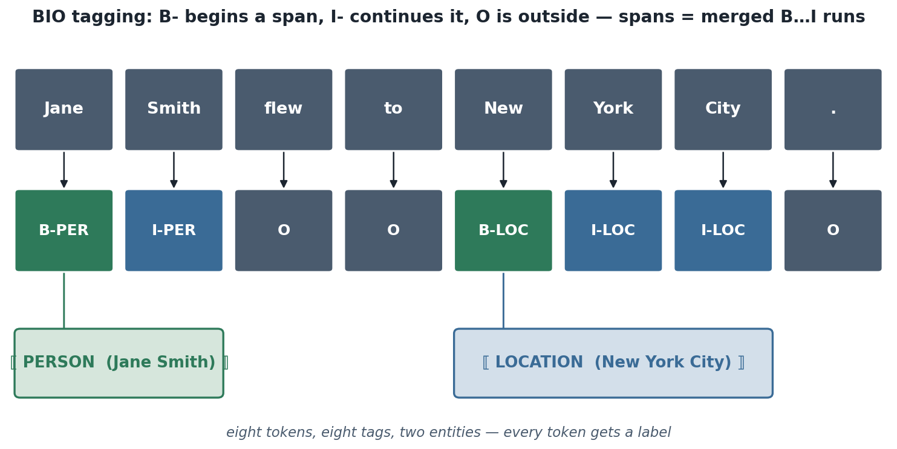
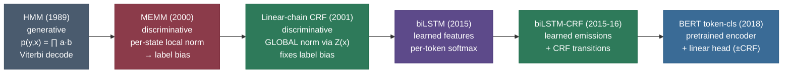

# Sequence Labeling: a label for every token

Read this sentence and, without thinking about it, you just did a job that took NLP thirty years to automate: you knew *Jane Smith* was a person, *New York City* was a place, *flew* was a verb, and *to* was just glue. You didn't classify those words one at a time in a vacuum — you used the **neighbors**. *Smith* is a surname *because* a first name sits in front of it. *City* belongs to the location *because* *New York* opened it. **Sequence labeling** is the family of tasks that teaches a model to do exactly this: assign a label to **every token in a sequence**, where each label depends on the tokens *and the labels* around it. Part-of-speech (POS) tagging, **named-entity recognition (NER)**, chunking, and slot filling are all the same shape — and they were the proving ground for nearly every idea in structured prediction: the HMM, the CRF, the biLSTM, and finally the fine-tuned transformer.

I'm going to teach this the way I'd teach a strong junior who has to *both* answer the interview question *and* ship the tagger. We'll start by feeling **why this isn't just classification** (the labels talk to each other), then nail the **tagging schemes** that turn spans into per-token labels, then climb the model ladder one rung at a time — **HMM** (and the Viterbi algorithm, derived), **MEMM** (and the label-bias trap, derived), **CRF** (and why global normalization fixes it, derived), **biLSTM** and **biLSTM-CRF**, and finally **BERT for token classification**. Then the part everyone gets wrong: **how you score it** (entity-level F1, not token accuracy). By the end you'll be able to:

- explain why sequence labeling is **structured prediction**, not independent per-token classification;
- map entity spans to per-token tags in **BIO / IOB2 / BIOES**, and recover spans back;
- write the **HMM** likelihood, and **derive the Viterbi DP recurrence** to decode it by hand;
- explain the **label-bias problem** of MEMMs and **why a globally-normalized CRF cures it**;
- say exactly **what a CRF layer adds on top of a biLSTM** and when it still helps over BERT;
- score a tagger the way CoNLL/seqeval does, and explain **why token accuracy lies**.

> **Note:** "sequence labeling" (one label per token, same length in and out) is a *different* task from "sequence-to-sequence" (variable-length output, e.g. translation — see [Seq2Seq & Encoder-Decoder](../08-Sequence-to-Sequence-and-Encoder-Decoder/08-Sequence-to-Sequence-and-Encoder-Decoder.md)) and from "sequence classification" (one label for the *whole* sequence, e.g. sentiment — see [Text Classification](../10-Text-Classification-and-Sentiment-Analysis/10-Text-Classification-and-Sentiment-Analysis.md)). The defining property here is **one tag per input token**.

---

## The problem: why this isn't just classification

The lazy first idea is: treat each token independently. Build a classifier $p(y_i \mid x_i, \text{context})$, run it on every position, done. For some POS tagging this even works *okay*. But it breaks the moment labels have **structure** — and entity labels always do.

Consider NER with **BIO** tags (defined fully below): `B-PER` begins a person span, `I-PER` continues one, `O` is outside any entity. Now an independent per-token classifier can happily emit this:

```
Jane    →  O
Smith   →  I-PER      ← illegal: an I-PER with no B-PER before it
```

That tag sequence is **structurally invalid** — you cannot *continue* a person entity that never *began*. A per-token classifier has no mechanism to forbid it, because it never looks at the *label* it just emitted, only at the input. The fix is to model the **joint** label sequence: score how well an entire assignment $y_1 \dots y_n$ fits the input $x_1 \dots x_n$ *and* obeys the grammar of labels (`I-PER` may follow `B-PER` or `I-PER`, never `O`). That is the definition of **structured prediction**: the output is not a single label but a *structured object* (here, a sequence) whose parts constrain each other.

> **Note:** the single sentence that captures the whole field — *the label of a token depends on the labels of its neighbors, so you must decode the **best sequence**, not the **best label at each position** independently.* Every model below is a different answer to "how do I score and search over whole label sequences efficiently?"

There are two coupled sub-problems hiding here, and keeping them separate clarifies every model:

1. **Scoring** — given input $x$ and a candidate label sequence $y$, how good is it? (A model assigns a number.)
2. **Decoding** — over the *exponentially many* possible label sequences ($k^n$ for $k$ tags, $n$ tokens), find the best-scoring one *without enumerating them*. (This is where **Viterbi** earns its keep.)

> **Gotcha:** "exponentially many" is not hyperbole. A 20-token sentence with 9 NER tags has $9^{20} \approx 1.2 \times 10^{19}$ possible taggings — more than you could ever enumerate. Every classical model below buys tractable decoding by making a **Markov assumption** (a label depends only on the *previous* label), which collapses that exponential search into a linear-time dynamic program. The Markov assumption *is* the trick.

---

## The tasks: POS, NER, chunking, slot filling

All four are "one label per token"; they differ only in the label set and what a span means.

- **POS tagging** — label each word with its part of speech (`NOUN`, `VERB`, `ADJ`, `DET`, …). The Penn Treebank uses 45 tags; the Universal Dependencies set uses 17. POS tags feed parsing, lemmatization, and downstream features. Hard cases are *ambiguity*: *book* is a noun ("a book") or a verb ("book a flight"); only context disambiguates.
- **Named-entity recognition (NER)** — find and type **spans** that name real-world entities: `PERSON`, `ORG`, `LOCATION`, `DATE`, `MONEY`, etc. The CoNLL-2003 benchmark uses four types (PER, ORG, LOC, MISC). NER is the workhorse of information extraction.
- **Chunking (shallow parsing)** — group tokens into flat phrases (`NP`, `VP`, `PP`) without building a full parse tree — a middle ground between POS and parsing.
- **Slot filling** — in dialogue/voice assistants, tag the tokens that fill an intent's slots ("book a flight from `[B-FromLoc]` *Boston* to `[B-ToLoc]` *Denver* on `[B-Date]` *Friday*"). Structurally identical to NER, used for ATIS-style task-oriented dialogue.

> **Tip:** if you can solve NER you can solve all of them — they share tagging scheme, models, and scoring. Interviewers almost always frame the question as NER because the **span** structure (multi-token entities) is what makes the scheme and the metric interesting. POS is the "warm-up" because most tags are single-token.

---

## Tagging schemes: turning spans into per-token labels

A model emits **one tag per token**, but an entity is a **span** of one-or-more tokens with a type. A tagging scheme is the convention that encodes spans as per-token tags (and lets you decode them back). Get this wrong and your spans silently corrupt.

**BIO / IOB2** — the standard. Each token gets `B-TYPE` (**B**egin a span of that type), `I-TYPE` (**I**nside/continue the current span), or `O` (**O**utside any entity). A span is a `B-` followed by zero or more `I-` of the same type. Decoding back: scan left to right, start a span at each `B-`, extend it through matching `I-`, close it at the next `B-`/`O`/type-change.



Worked mapping for *"Jane Smith flew to New York City ."*:

| token | Jane | Smith | flew | to | New | York | City | . |
|---|---|---|---|---|---|---|---|---|
| BIO | `B-PER` | `I-PER` | `O` | `O` | `B-LOC` | `I-LOC` | `I-LOC` | `O` |

Two spans fall out: `PER = [Jane Smith]` (the `B-PER … I-PER` run) and `LOC = [New York City]` (the `B-LOC … I-LOC … I-LOC` run). Eight tokens, eight tags, two entities.

> **Gotcha — IOB1 vs IOB2 (a real bug source).** The *original* IOB1 scheme used `B-` **only** to separate two adjacent same-type entities, so a single isolated entity started with `I-`. **IOB2** (what almost everyone means by "BIO" today) uses `B-` for the **first** token of *every* span. Mixing the two — training on one, scoring with a converter that assumes the other — silently mislabels span boundaries. When a library says "BIO," confirm it means IOB2.

**BIOES (a.k.a. BILOU)** — a richer scheme that adds two tags: `E-TYPE` (**E**nd of a multi-token span) and `S-TYPE` (a **S**ingle-token span), keeping `B`/`I`/`O`. So a one-token entity is `S-LOC` (not `B-LOC`), and a three-token entity is `B-…/I-…/E-…`.

| token | Jane | Smith | flew | to | Paris |
|---|---|---|---|---|---|
| BIO | `B-PER` | `I-PER` | `O` | `O` | `B-LOC` |
| BIOES | `B-PER` | `E-PER` | `O` | `O` | `S-LOC` |


**Why BIOES helps.** It gives the model a *dedicated, learnable signal for span boundaries*. The end of a span (`E-`) and a lone single-token span (`S-`) become their own classes instead of being inferred. Empirically this gives a small but consistent F1 bump (Ratinov & Roth 2009 reported ~1 point on CoNLL), because the model can directly learn "what does the *last* token of a person name look like" rather than discovering it implicitly. The cost is more tags (≈ $4T+1$ instead of $2T+1$ for $T$ types), so it needs more data to estimate.

> **Tip:** in interviews, the crisp version is: *BIO marks begin/inside/outside; BIOES adds explicit end and single tags so boundaries are learned directly — a small accuracy gain at the cost of a larger, sparser label set.* Mention IOB1-vs-IOB2 only if asked to convert a dataset; it's the thing that bites in practice.

> **Gotcha:** a tagging scheme only encodes **flat, non-overlapping** spans. *Nested* entities — "[Bank of [China]LOC]ORG" — and *discontinuous* entities can't be expressed in BIO at all. That limitation (covered under Challenges) is why span-based and other non-BIO formulations exist.

---

## The model ladder

Here is the whole arc on one page; the rest of the note climbs it rung by rung. Each model is a better answer to "how do I score and decode whole label sequences?"



Two axes organize the ladder. **Generative vs discriminative**: an HMM models the *joint* $p(y, x)$ (it can generate the words); MEMM/CRF model the *conditional* $p(y \mid x)$ directly (they only ever need to discriminate). **Local vs global normalization**: HMM and CRF normalize over the *whole sequence*; MEMM normalizes at *each step*, which — as we'll derive — is its fatal flaw. The neural models (biLSTM, BERT) swap hand-built features for learned representations but keep the same decoding machinery (Viterbi over a CRF layer).

---

## Rung 1: the Hidden Markov Model

The HMM is a **generative** story for how a tagged sentence is produced. Imagine a machine that walks through hidden states (the tags) and, at each state, emits a word:

1. Pick a first tag $y_1$ from a start distribution $\pi$.
2. Emit a word $x_1$ from that tag's vocabulary distribution.
3. Transition to the next tag $y_2$ based only on $y_1$.
4. Emit $x_2$ from $y_2$; repeat to the end.

Two Markov assumptions make this tractable. **Transition**: the next tag depends only on the current tag, $p(y_i \mid y_1{:}y_{i-1}) = p(y_i \mid y_{i-1})$. **Emission (output independence)**: a word depends only on its own tag, $p(x_i \mid \text{everything}) = p(x_i \mid y_i)$. Under these, the joint probability of a tag sequence and a word sequence factorizes into a clean product:

$$p(y_{1:n},\, x_{1:n}) \;=\; \pi(y_1)\, b_{y_1}(x_1) \prod_{i=2}^{n} \underbrace{a_{y_{i-1},\,y_i}}_{\text{transition}} \cdot \underbrace{b_{y_i}(x_i)}_{\text{emission}}$$

> **Source / derivation:** the HMM joint factorization for POS tagging is developed in [Jurafsky & Martin, *Speech and Language Processing* (3rd ed.), Ch. 17 "Sequence Labeling for Parts of Speech and Named Entities"](https://web.stanford.edu/~jurafsky/slp3/17.pdf) (the HMM tagger and its two Markov assumptions), and in [Rabiner (1989), *A Tutorial on Hidden Markov Models*](https://www.ece.ucsb.edu/Faculty/Rabiner/ece259/Reprints/tutorial%20on%20hmm%20and%20applications.pdf) (the three HMM problems). Both are in the references.

The parameters are just three tables:

- **transition** $a_{ij} = p(y_i = j \mid y_{i-1} = i)$ — "how often does a VERB follow a NOUN?"
- **emission** $b_j(w) = p(x = w \mid y = j)$ — "how often is the word *book* tagged VERB?"
- **start** $\pi_j = p(y_1 = j)$ — "how often does a sentence start with a NOUN?"

**Training (supervised).** With a tagged corpus, the maximum-likelihood estimates are just *counts* — no iteration needed:

$$a_{ij} = \frac{\text{count}(i \to j)}{\text{count}(i)}, \qquad b_j(w) = \frac{\text{count}(w, j)}{\text{count}(j)}, \qquad \pi_j = \frac{\text{count(sentence starts with } j)}{\#\text{sentences}}.$$

> **Note:** if your training data is *unlabeled* (you see words but not tags), you can't count — you estimate the same parameters with the **Baum–Welch** algorithm, which is **Expectation–Maximization** using the **forward–backward** algorithm in the E-step to compute the expected counts of transitions and emissions. Supervised tagging rarely needs this; it matters when tags are latent.

> **Gotcha:** emission probabilities for **unseen words** are zero, which makes the whole product zero — an HMM tagger that meets a word it never saw in training assigns probability 0 to *every* tag and breaks. Real HMM taggers need smoothing (add-$k$, or a suffix/shape model that backs off to word features like "ends in *-ing*", "is capitalized"). This brittleness to OOV words is one reason neural taggers, with their character features, eventually won.

### Decoding: deriving Viterbi

We have a model that scores any full $(y, x)$. Decoding asks for the **single most probable tag sequence** given the words:

$$y^\star = \arg\max_{y_{1:n}} \; p(y_{1:n} \mid x_{1:n}) = \arg\max_{y_{1:n}} \; p(y_{1:n},\, x_{1:n})$$

(the $\arg\max$ over $y$ is the same for the joint and the conditional, since $p(x)$ doesn't depend on $y$). Naively this is a max over $k^n$ sequences. **Viterbi** is the dynamic program that does it in $O(n k^2)$ by exploiting the Markov structure.

Define the **Viterbi variable** $\delta_t(j)$ = the probability of the **single best** tag path that ends in state $j$ at position $t$, having emitted $x_1 \dots x_t$:

$$\delta_t(j) \;=\; \max_{y_1 \dots y_{t-1}} \; p(y_1 \dots y_{t-1},\, y_t = j,\, x_1 \dots x_t).$$

The recurrence falls straight out of the factorization. To reach state $j$ at time $t$, you must have come from *some* state $i$ at time $t-1$; the best path through $j$ extends the best path through whichever $i$ maximizes the product:

$$\boxed{\;\delta_t(j) \;=\; \Big[\max_{i} \; \delta_{t-1}(i)\, a_{ij}\Big] \cdot b_j(x_t)\;}$$

> **Source / derivation:** the Viterbi recurrence $\delta_t(j)$ and its backpointer recovery are the original max-sum trellis decoder of [Forney (1973), *The Viterbi Algorithm* (Proc. IEEE 61(3):268–278)](https://www2.isye.gatech.edu/~yxie77/ece587/viterbi_algorithm.pdf), and are presented for HMM POS tagging in [Jurafsky & Martin, SLP3 Ch. 17](https://web.stanford.edu/~jurafsky/slp3/17.pdf) (the Viterbi-decoding section). Both are in the references.

with initialization $\delta_1(j) = \pi_j\, b_j(x_1)$. The key insight — the **principle of optimality** — is that the best path *into* state $j$ at time $t$ must use the best path into *some* state at time $t-1$; we never need to remember any sub-optimal prefix. So at each cell we keep just one number ($\delta$) and one **backpointer** $\psi_t(j) = \arg\max_i \delta_{t-1}(i) a_{ij}$ (which previous state we came from). At the end we take $\max_j \delta_n(j)$ and follow backpointers to recover $y^\star$.

> **Note:** Viterbi is *exactly* the shortest-path algorithm on a **trellis** — a layered graph with one node per (state, time) cell and edges weighted by $a_{ij} b_j(x_t)$. "Most probable path" = "highest-product path"; take $-\log$ of the weights and it's literally shortest-path / dynamic programming. Implementations work in **log-space** ($\log \delta$, adding log-probs) to avoid underflow from multiplying thousands of tiny probabilities.

### Worked example: Viterbi by hand on a 2-tag HMM

Let's decode the genuinely ambiguous sentence *"fish sleep"* with two tags, $N$ (noun) and $V$ (verb) — both words can be either. Parameters:

- start: $\pi_N = 0.6,\ \pi_V = 0.4$
- transition: $a_{NN}=0.3,\ a_{NV}=0.7,\ a_{VN}=0.6,\ a_{VV}=0.4$
- emission: $b_N(\text{fish})=0.5,\ b_V(\text{fish})=0.2,\ b_N(\text{sleep})=0.1,\ b_V(\text{sleep})=0.5$

**Step $t=1$ ("fish")** — initialize:
$$\delta_1(N) = \pi_N\, b_N(\text{fish}) = 0.6 \times 0.5 = \mathbf{0.30}, \qquad \delta_1(V) = \pi_V\, b_V(\text{fish}) = 0.4 \times 0.2 = \mathbf{0.08}.$$

**Step $t=2$ ("sleep")** — recurse. For state $N$:
$$\delta_2(N) = \max\big(\underbrace{\delta_1(N) a_{NN}}_{0.30\times0.3=0.090},\ \underbrace{\delta_1(V) a_{VN}}_{0.08\times0.6=0.048}\big)\cdot b_N(\text{sleep}) = 0.090 \times 0.1 = \mathbf{0.0090}\quad(\text{from } N).$$
For state $V$:
$$\delta_2(V) = \max\big(\underbrace{\delta_1(N) a_{NV}}_{0.30\times0.7=0.210},\ \underbrace{\delta_1(V) a_{VV}}_{0.08\times0.4=0.032}\big)\cdot b_V(\text{sleep}) = 0.210 \times 0.5 = \mathbf{0.1050}\quad(\text{from } N).$$

**Terminate.** $\max(\delta_2(N), \delta_2(V)) = \max(0.0090, 0.1050) = 0.1050$ at state $V$. Follow the backpointer: $V$ at $t=2$ came from $N$ at $t=1$. So:

$$y^\star = [\,N,\ V\,], \qquad p(y^\star, x) = 0.1050.$$

*"fish"* is a **noun**, *"sleep"* is a **verb** — the reading "the fish sleep," which is exactly right. Notice the model got there by balancing emission *and* transition: even though a per-word guess might wobble, the high $a_{NV}$ transition (nouns are usually followed by verbs) plus the strong $b_V(\text{sleep})$ emission lock in the correct sequence. **That coupling is the whole point — and a per-token classifier would have missed it.**


> **Tip:** the interview-ready summary of Viterbi: *fill a (states × time) table left to right; each cell = best incoming path × emission; keep a backpointer; read the answer back from the last column. $O(nk^2)$ time, $O(nk)$ space.* The recurrence $\delta_t(j) = [\max_i \delta_{t-1}(i) a_{ij}]\, b_j(x_t)$ is the line they want you to write.

### Why not just decode greedily? Viterbi beats per-token argmax

The whole reason Viterbi exists is that the **locally-best tag at each step is not the globally-best sequence.** A *greedy* decoder walks left to right and at every position commits to whichever tag has the highest local score — never reconsidering. That early commitment is a trap whenever a tempting local emission leads into a worse continuation.

Take the genuinely garden-path sentence *"time flies fast"* (every word can be Noun *or* Verb) under this HMM: $\pi_N=\pi_V=0.5$; transitions $a_{NN}=0.6,\,a_{NV}=0.4,\,a_{VN}=0.8,\,a_{VV}=0.2$; emissions $b_N(\text{time})=0.6,\,b_V(\text{time})=0.3$, $b_N(\text{flies})=0.3,\,b_V(\text{flies})=0.7$, $b_N(\text{fast})=0.2,\,b_V(\text{fast})=0.7$. Greedy reads *"time"* as N (0.6 > 0.3), then is **seduced at "flies"** by the high local verb emission $b_V(\text{flies})=0.7$ and commits to V — locking it into the path `N V N` with joint probability **0.01344**. Viterbi, scoring the *whole* sequence, instead reads *"time flies"* as a noun phrase and *"fast"* as the verb: `N N V`, joint probability **0.01512** — the true global maximum. Greedy landed on only the *second*-best tagging.


> **Note:** this is exactly why the decoder is a **dynamic program over sequences**, not a loop of independent argmaxes. The greedy walk has no way to "un-commit" to V once it sees that the *rest* of the sentence prefers N N V. Viterbi's backpointers let it keep, at every state, the best path *into* that state — so a locally-suboptimal early tag survives if it enables a better whole. The chapter notebook runs both and asserts `viterbi != greedy` on this HMM.

> **Gotcha — Viterbi vs forward.** The **forward** algorithm uses the *same* trellis but replaces $\max$ with $\sum$: $\alpha_t(j) = [\sum_i \alpha_{t-1}(i) a_{ij}] b_j(x_t)$. That computes the *total* probability $p(x)$ (summing over all paths), which you need for *training* and for the CRF's partition function — **not** the single best path. Same DP skeleton, different semiring (max-product vs sum-product). Remember: **Viterbi = max, forward = sum.**


---

## Rung 2: the MEMM and the label-bias problem

The HMM is generative — it "wastes" capacity modeling $p(x)$ (how words are generated) when all we ever want is $p(y \mid x)$. It's also awkward to add **rich, overlapping features** of the input (capitalization, prefixes, the *next* word, gazetteer membership) because the emission $b_j(x_i)$ is a single categorical distribution over words.

The **Maximum-Entropy Markov Model (MEMM)** (McCallum, Freitag & Pereira 2000) goes **discriminative**: model $p(y \mid x)$ directly, as a product of **per-state** locally-normalized classifiers:

$$p(y_{1:n} \mid x_{1:n}) = \prod_{i=1}^{n} p(y_i \mid y_{i-1},\, x), \qquad p(y_i \mid y_{i-1}, x) = \frac{\exp\big(\sum_k w_k f_k(y_{i-1}, y_i, x, i)\big)}{Z(y_{i-1}, x, i)}.$$

> **Source / derivation:** the per-state locally-normalized MEMM and its label-bias problem are introduced in [McCallum, Freitag & Pereira (2000), *Maximum Entropy Markov Models for Information Extraction and Segmentation*](https://courses.cs.washington.edu/courses/cse517/16wi/papers/mccallum2000.pdf), and the label-bias diagnosis is sharpened in [Lafferty, McCallum & Pereira (2001)](https://repository.upenn.edu/handle/20.500.14332/6188) (the CRF paper, §1). Both are in the references.

Each step is a maximum-entropy (softmax/logistic) classifier that can use **arbitrary features** $f_k$ of the whole input and the previous tag — a big expressiveness win over the HMM. But look at the denominator: $Z(y_{i-1}, x, i)$ normalizes **locally**, over the next-tag choices *at this step only, conditioned on the previous tag*. That local normalization is the bug.

### Deriving label bias

**Label bias** is the pathology that states with *fewer outgoing transitions* are unfairly favored, because each state's outgoing probabilities must sum to 1 *regardless of how much the observation actually supports any of them*. Here's the mechanism, derived.

Suppose at step $i$ the previous tag $y_{i-1} = A$ has **only one** legal next tag $B$ (a low-entropy state). Then no matter what the word $x_i$ is:

$$p(y_i = B \mid y_{i-1} = A, x) = \frac{\exp(\text{score}(A \to B, x))}{\exp(\text{score}(A \to B, x))} = 1.$$

The transition $A \to B$ gets probability **1** *whatever the observation says*, because there's nothing to normalize against — the local softmax has only one option. The observation $x_i$ is effectively **ignored**. Contrast a high-entropy state $C$ with ten plausible next tags: each gets a fraction of the mass, so even the *correct* transition out of $C$ carries less than 1.

Now decoding (Viterbi over these local probabilities) multiplies these per-step factors. A path that funnels through low-entropy states accumulates many "free" factors of ≈1, while a path through informative, high-entropy states is *penalized* for having to share probability mass — **even when the observations strongly favor the second path**. The decoder is biased toward sequences of states with few outgoing options, and toward effectively ignoring observations once it's "committed." This is **label bias**: probability mass is conserved *per state* rather than *per sequence*, so the model can't push mass *between* branches based on later evidence.

### A numeric label-bias illustration

Make it concrete with the textbook *rib / rob* example (Bottou 1991; reused by Lafferty et al. 2001). We have an MEMM that should distinguish two words, **r-i-b** and **r-o-b**, character by character. Suppose, by an accident of the training data, two facts hold. First, once the model is in state `r₁` (having read the first `r` of the *rib* branch), the **only** outgoing transition it ever saw is to `i`, and from `i` the only transition is to `b`. So the *rib* branch is a chain of **low-entropy** (one-option) states. Second, the *rob* branch's states are higher-entropy (they were also reached from other words, so they have several plausible next characters).

Now feed the model the input `r o b`. The *correct* answer is the *rob* branch. But watch the per-step probabilities the MEMM assigns:

| step | input char | *rib*-branch local prob | *rob*-branch local prob |
|---|---|---|---|
| 1 | `r` | $p(r_1 \mid \text{start}) \approx 0.5$ | $p(r_2 \mid \text{start}) \approx 0.5$ |
| 2 | `o` | $p(i \mid r_1, x{=}o) = \mathbf{1.0}$ *(only option — ignores that the char is `o`!)* | $p(o \mid r_2, x{=}o) \approx 0.3$ *(shared among options)* |
| 3 | `b` | $p(b \mid i, x{=}b) = \mathbf{1.0}$ | $p(b \mid o, x{=}b) \approx 0.6$ |

Multiply along each path (Viterbi):

$$\text{score}(rib) = 0.5 \times 1.0 \times 1.0 = \mathbf{0.50}, \qquad \text{score}(rob) = 0.5 \times 0.3 \times 0.6 = \mathbf{0.09}.$$

The MEMM **prefers *rib* even though the input was `r o b`** — at step 2 the `o` was *clear evidence* for the *rob* branch, but the *rib* branch's one-option state stamped probability 1.0 on `i` and **threw the observation away**. The low-entropy chain hoarded probability mass it never had to justify. A correct model would have let the `o` evidence cross over and crush the *rib* path; the MEMM's local normalization forbids it. This is label bias in three multiplications.

> **Note:** the crisp interview statement: *MEMMs normalize locally (per state), so a state's outgoing transitions must sum to 1 independent of the observation. Low-entropy states pass their full incoming mass forward "for free," biasing decoding toward them and letting the model ignore evidence. The cure is to normalize **globally**, over the whole sequence — which is exactly what a CRF does.*

> **Gotcha:** label bias is sometimes confused with "exposure bias" (a training/inference mismatch in autoregressive generation). They're different. Label bias is specifically about **local (per-step) normalization** in a discriminative sequence model conserving mass per-state. The fix is global normalization, not scheduled sampling.

---

## Rung 3: the linear-chain CRF

The **Conditional Random Field** (Lafferty, McCallum & Pereira 2001) keeps the MEMM's wins — discriminative, arbitrary features — but **normalizes once, over the entire sequence**, which kills label bias. A linear-chain CRF defines:

$$p(y_{1:n} \mid x_{1:n}) = \frac{1}{Z(x)} \exp\!\Big(\sum_{i=1}^{n} \sum_k w_k\, f_k(y_{i-1}, y_i, x, i)\Big) = \frac{\exp\big(\text{score}(y, x)\big)}{Z(x)}.$$

> **Source / derivation:** the linear-chain CRF — its globally-normalized form, feature functions, the partition function $Z(x)$, and why global normalization removes label bias — is from [Lafferty, McCallum & Pereira (2001), *Conditional Random Fields: Probabilistic Models for Segmenting and Labeling Sequence Data* (ICML)](https://repository.upenn.edu/handle/20.500.14332/6188), with the full inference/training treatment in [Sutton & McCallum, *An Introduction to Conditional Random Fields*](https://homepages.inf.ed.ac.uk/csutton/publications/crftutv2.pdf). Both are in the references.

Read the pieces:

- **Feature functions** $f_k(y_{i-1}, y_i, x, i)$ come in two flavors. **Transition features** depend on the tag pair $(y_{i-1}, y_i)$ — e.g. "is this an `O` → `I-PER` transition?" (which should learn a large negative weight, since it's illegal). **Emission/state features** depend on $(y_i, x, i)$ — e.g. "is $y_i = $ `B-PER` *and* $x_i$ capitalized *and* the previous word is a title like 'Mr.'?". Features can look at the **whole input** $x$ and **any position**, which is the expressiveness the HMM lacked.
- **The score** of a sequence is just the sum of all firing features times their learned weights — an *unnormalized* log-score.
- **The partition function** $Z(x) = \sum_{y'} \exp(\text{score}(y', x))$ sums over **all** $k^n$ possible label sequences. This single global $Z$ is what makes the normalization global: every sequence is scored relative to *every other sequence*, so mass can flow between branches based on the whole input. **That is precisely what fixes label bias.**

### Deriving the partition function via the forward algorithm

$Z(x)$ sums over exponentially many sequences — but the linear-chain structure (features only couple *adjacent* tags) means we can compute it with the same DP as before, in **sum**-mode. Define forward scores $\alpha_t(j) = \sum_{\text{paths ending in } j \text{ at } t} \exp(\text{partial score})$. Writing $\psi_t(i, j) = \exp\!\big(\sum_k w_k f_k(i, j, x, t)\big)$ for the (exponentiated) local factor of transitioning $i \to j$ and emitting at $t$:

$$\alpha_1(j) = \psi_1(\text{start}, j), \qquad \alpha_t(j) = \sum_i \alpha_{t-1}(i)\,\psi_t(i, j), \qquad Z(x) = \sum_j \alpha_n(j).$$

> **Source / derivation:** the forward recursion for the partition function $Z(x)$ and the forward–backward computation of the CRF gradient are derived in [Sutton & McCallum, *An Introduction to Conditional Random Fields*](https://homepages.inf.ed.ac.uk/csutton/publications/crftutv2.pdf) (§4, inference and parameter estimation) and [Lafferty et al. (2001)](https://repository.upenn.edu/handle/20.500.14332/6188). Both are in the references. The chapter code implements this `forward_logZ` in log space alongside the `viterbi` max-pass, so you can see the two semirings on identical structure.

That's the **forward algorithm** again — identical recurrence to the HMM forward pass, just with CRF factors $\psi$ instead of $a \cdot b$. So $Z(x)$ is computable in $O(nk^2)$, and **training** maximizes the log-likelihood $\log p(y \mid x) = \text{score}(y, x) - \log Z(x)$ by gradient ascent; the gradient of each weight is the familiar *(observed feature count) − (model-expected feature count)*, where the expectation comes from **forward–backward**.

### Decoding the CRF: Viterbi again

Decoding $\arg\max_y p(y \mid x) = \arg\max_y \text{score}(y, x)$ drops the constant $Z(x)$ (it doesn't depend on $y$), so it's **the same Viterbi** as the HMM — just with additive log-scores instead of multiplicative probabilities:

$$\delta_t(j) = \max_i \Big[\delta_{t-1}(i) + \underbrace{\textstyle\sum_k w_k f_k(i, j, x, t)}_{\text{transition + emission score}}\Big].$$

> **Note:** the elegant symmetry to remember: **Viterbi (max) decodes; the forward algorithm (sum) normalizes.** A CRF uses *both* — forward to compute $Z(x)$ for training, Viterbi to find the best tags at test time. The MEMM, by contrast, never computes a global $Z$ — and that omission *is* its label-bias disease.

### Why global normalization fixes label bias

Put the two side by side. In an MEMM, the per-step softmax forces $\sum_{y_i} p(y_i \mid y_{i-1}, x) = 1$ at **every state**, so a one-option state passes its mass forward unconditionally. In a CRF, the **only** normalization is the single $Z(x)$ over whole sequences. A transition from a low-entropy state earns **no free probability** — its score is just one additive term in the sequence score, and the *whole* sequence competes against every other sequence in $Z$. Evidence anywhere in the sentence can therefore down-weight a path that local normalization would have rewarded. The CRF can "change its mind" globally; the MEMM cannot. **That is the precise reason CRFs beat MEMMs on sequence labeling**, and why the CRF (not the MEMM) became the classical standard.

The most visible payoff is **structural**: a globally-scored sequence can give an *illegal* transition like `O → I-PER` a score of $-\infty$, so Viterbi simply never routes through it — *even when the per-token emission for `I-PER` is the single highest score at that position.* A per-token classifier, blind to the previous label, would happily emit the illegal `I-PER` and corrupt the span.


> **Tip:** the one-liner interviewers reward: *An MEMM normalizes per state (locally) and so suffers label bias — low-entropy states pass mass forward regardless of the input. A CRF normalizes per sequence (globally, via $Z(x)$ computed with the forward algorithm), so every label sequence competes on equal footing and the bias vanishes. Both decode with Viterbi.*

> **Gotcha:** a linear-chain CRF still makes a first-order Markov assumption on *labels* (features couple only adjacent tags), so $Z$ stays tractable. Higher-order or skip-chain CRFs relax this and pay with a larger state space (and a more expensive DP). For NER, first-order is almost always enough — the dominant constraint is just "I- must follow B-/I- of the same type."

---

## Rung 4: neural taggers — biLSTM and biLSTM-CRF

CRFs needed **hand-engineered features** (capitalization, suffixes, gazetteers). The neural era replaces that feature engineering with **learned representations**, while keeping the CRF decoding machinery.

**biLSTM tagger.** Run a [bidirectional LSTM](../../05.%20Deep_Learning/14-RNN-LSTM-GRU/14-RNN-LSTM-GRU.md) over the token embeddings: the forward LSTM reads left-to-right, the backward LSTM right-to-left, and their hidden states are concatenated, so each token's representation $h_i$ encodes **both left and right context**. A per-token linear layer + softmax then predicts the tag: $p(y_i \mid x) = \text{softmax}(W h_i + b)$. This learns the *emission* scores end-to-end, and bidirectionality is exactly what tagging wants (the tag of *Smith* depends on *Jane* before and the verb after).

But notice the failure: **independent per-token softmax has no model of label transitions.** Each $y_i$ is predicted in isolation, so — just like the naive classifier we started with — it can emit `O → I-PER`. The biLSTM gives great *emissions* and *zero* sequence constraints.

**biLSTM-CRF** (Huang, Xu & Yu 2015; Lample et al. 2016) is the fix that became the pre-BERT standard: **put a CRF layer on top of the biLSTM's emission scores.** The biLSTM produces, for each token, a vector of per-tag emission scores $P_i \in \mathbb{R}^{k}$ ($P_{i,j}$ = score of tag $j$ at position $i$). The CRF adds a learned **transition matrix** $A$ ($A_{j,j'}$ = score of going from tag $j$ to $j'$). The score of a whole tag sequence is:

$$\text{score}(y, x) = \sum_{i=1}^{n} P_{i,\,y_i} \;+\; \sum_{i=1}^{n} A_{y_{i-1},\,y_i},$$

> **Source / derivation:** the biLSTM-CRF sequence score (per-token biLSTM emissions $P_i$ plus a learned tag-to-tag transition matrix $A$, trained with the CRF log-likelihood) is from [Huang, Xu & Yu (2015), *Bidirectional LSTM-CRF Models for Sequence Tagging*](https://arxiv.org/abs/1508.01991) (§3), with the character-feature variants in [Lample et al. (2016)](https://arxiv.org/abs/1603.01360) and [Ma & Hovy (2016)](https://arxiv.org/abs/1603.01354). All three are in the references.

and training maximizes $\text{score}(y, x) - \log Z(x)$ with $Z$ from the forward algorithm — exactly the CRF objective, but the emission scores $P_i$ now come from the **biLSTM** instead of hand features.


### Why the CRF layer beats independent softmax

The win is concrete and worth stating precisely. A per-token softmax picks each tag to maximize *its own* probability; nothing stops the *sequence* of locally-best tags from being globally invalid (`O → I-PER`, or a `B-PER` directly followed by `I-LOC`). The CRF layer makes the model score the **whole sequence** and decode with Viterbi, so:

1. **Illegal transitions are learnable and avoidable.** The transition matrix $A$ learns a strongly negative $A_{\text{O},\,\text{I-PER}}$ from data, so Viterbi will route around it even if the emission for `I-PER` at that token is high.
2. **The decision is joint, not greedy.** A locally-suboptimal tag at position $i$ can be chosen if it enables a far better overall sequence — the kind of global trade-off the worked HMM example showed.
3. **It directly raises entity-level F1** (the metric below), because entities are *spans*, and spans are where invalid transitions corrupt the output. Huang et al. and Lample et al. both reported that the CRF layer adds roughly **1–2 F1 points** over a bare biLSTM softmax on CoNLL NER — small in accuracy, meaningful at the entity level.

**A numeric transition-score example.** Suppose at some token the biLSTM emissions (log-scores) are slightly *wrong*: it favors `I-PER` even though no person span is open. Say emission scores at this position are $P[\text{O}] = 1.0$ and $P[\text{I-PER}] = 1.5$ — a bare softmax would pick `I-PER`. But the learned CRF transition matrix, having seen thousands of sentences, encodes $A[\text{O} \to \text{I-PER}] = -8.0$ (illegal: you can't continue a person span that never began) versus $A[\text{O} \to \text{O}] = +0.5$. Now Viterbi compares the two continuations *from a previous* `O`:

$$\text{score}(\dots\text{O}, \text{I-PER}) = \underbrace{1.5}_{\text{emission}} + \underbrace{(-8.0)}_{\text{transition}} = -6.5, \qquad \text{score}(\dots\text{O}, \text{O}) = \underbrace{1.0}_{\text{emission}} + \underbrace{0.5}_{\text{transition}} = +1.5.$$

The CRF picks `O` (score $+1.5 \gg -6.5$) and **overrides the biLSTM's locally-wrong emission**, because the transition term makes the illegal sequence cost far more than the slightly-worse emission saves. A bare softmax, blind to transitions, would have emitted the invalid `O → I-PER` and corrupted the span. *That single comparison is why the CRF layer earns its 1–2 F1 points.*

The same effect shows up on *span consistency*, not just illegal transitions. Consider a three-token person name *"Dr Jane Smith"* where the biLSTM emissions, taken token by token, slightly favour `B-PER` again on the last token — so an independent per-token argmax emits `B-PER, I-PER, B-PER`, **breaking one person into two adjacent spans**. The CRF, scoring the whole sequence with its learned transition preferences (continuing a span is common; gluing two same-type entities with no `O` between is rare), keeps a single clean `B-PER, I-PER, I-PER` span.


> **Note:** the clean mental model — *the biLSTM scores **what tag fits this token** (emissions); the CRF layer scores **which tag may follow which** (transitions) and decodes the best legal sequence with Viterbi. Emissions + transitions, learned jointly.* That sentence is the whole architecture.

**Character-level features.** Word embeddings alone choke on **out-of-vocabulary** words and miss **morphology** — but the *shape* of a token is hugely informative for NER (capitalization → likely entity; suffix *-ung* → German noun; *-ville* → place). So strong neural taggers add a **character encoder** — a small CNN (Ma & Hovy 2016) or biLSTM (Lample et al. 2016) **over the characters** of each token — and concatenate its output to the word embedding. This gives the model a representation even for words it never saw in training (it composes them from characters), capturing prefixes, suffixes, and capitalization. It's a big chunk of why neural NER finally beat feature-engineered CRFs *without* hand-built features.

> **Tip:** the pre-BERT gold standard for NER was **char-biLSTM + word-embedding → biLSTM → CRF** (Lample et al. 2016). Know its three pieces and why each exists: char-level for OOV/morphology, biLSTM for context, CRF for valid sequences. It's the canonical answer to "how did NER work before transformers?"

---

## Rung 5: BERT for token classification

The transformer era kept the *shape* of the task and changed the encoder. With a pretrained masked language model like [BERT](../06-Contextual-Embeddings-ELMo-BERT/06-Contextual-Embeddings-ELMo-BERT.md), token classification is almost embarrassingly simple: take BERT's final-layer hidden state for each token, attach a **single linear head** (a $\mathbb{R}^{d} \to \mathbb{R}^{k}$ projection to the tag set), and **fine-tune** the whole stack on the labeled data with a per-token cross-entropy loss. BERT's deep bidirectional self-attention gives each token a context-rich representation that dwarfs what a biLSTM learned from scratch, so even this minimal head reaches state-of-the-art F1 (`BertForTokenClassification` in Hugging Face is exactly this).

Two practical wrinkles dominate the engineering:

**Subword-to-word label alignment.** BERT tokenizes into **subwords** (*"Washington"* → `Wash ##ington`), but your labels are per **word**. The standard convention: assign the word's label to its **first** subword and mark the continuation subwords with a special **ignore index** ($-100$ in PyTorch) so they don't contribute to the loss, *or* propagate the label to all subwords. At prediction time you read the tag off the **first** subword of each word. Getting this alignment wrong is the most common NER fine-tuning bug — your F1 silently tanks because labels are offset from tokens.

> **Gotcha:** the alignment must be **consistent between training and inference**. If you train with "label on first subword, $-100$ elsewhere" you must *decode* by reading the first subword's tag and re-merging subwords back to words before scoring. A mismatch (e.g. scoring at the subword level against word-level gold) corrupts both the loss and the F1. This is also why the entity-vs-token diagram below uses a real model: the `dslim/bert-base-NER` pipeline handles exactly this merge with `aggregation_strategy`.

**Does a CRF still help on top of BERT?** The honest, empirical answer: **usually only a little, and sometimes not at all.** BERT's self-attention already lets every token see every other token's representation, so much of the "valid-sequence" signal a CRF added on top of a (myopic) biLSTM is *already in the encoder*. A CRF head on BERT typically buys a small fraction of a point on rich-data benchmarks like CoNLL — often within noise — at the cost of slower training (the forward/Viterbi DP) and more code. It tends to help more in **low-resource** settings, for **noisy/long entities**, or with **strict span constraints**, where the explicit transition matrix still earns its keep. The practitioner default is **BERT + linear head**; reach for the CRF only when you measure a real gain.

> **Note:** the through-line of the whole ladder: the *decoding* machinery (Viterbi over emission + transition scores) barely changed from the HMM to biLSTM-CRF; what changed is **where the emission scores come from** — counts (HMM) → hand features (CRF) → biLSTM (neural) → pretrained transformer (BERT). Each rung made the *features* better while keeping the *structured-decoding* idea. That's the cleanest way to hold the entire arc in your head.

---

## Evaluation: entity-level F1, not token accuracy

Here is the part that separates people who *use* sequence labeling from people who only *talk* about it. **You do not measure NER by token accuracy.** You measure it by **entity-level (span-level) precision, recall, and F1**, where a predicted entity counts as correct **only if both its span (exact boundaries) and its type match the gold entity exactly** (see [NLP Evaluation Metrics](../18-NLP-Evaluation-Metrics/18-NLP-Evaluation-Metrics.md) for the broader metric family).

### Why token accuracy lies — derived with numbers

Token accuracy is dangerously inflated for two reasons. First, **most tokens are `O`** (not part of any entity) — in CoNLL-2003, ~83% of tokens are `O`. A model that predicts `O` for *everything* gets ~83% token accuracy while finding **zero entities** (F1 = 0). The metric is swamped by the majority class.

Second — and subtler — **a span is all-or-nothing**, but token accuracy gives partial credit. Take gold *"Barack Obama visited New York City last week"* with `New York City = LOC`, and a model that tags only *"New York"* and **drops "City"**:

| token | Barack | Obama | visited | New | York | City | last | week |
|---|---|---|---|---|---|---|---|---|
| gold | `B-PER` | `I-PER` | `O` | `B-LOC` | `I-LOC` | `I-LOC` | `O` | `O` |
| pred | `B-PER` | `I-PER` | `O` | `B-LOC` | `I-LOC` | **`O`** | `O` | `O` |

**Token accuracy** = 7 correct / 8 tokens = **0.875** — looks great. **Entity-level**: there are 2 gold entities (PER, LOC). The PER span matches exactly → 1 true positive. The LOC span is *wrong* — predicted `[New York]` ≠ gold `[New York City]` (boundaries differ), so it's both a false positive (a wrong predicted span) and a false negative (a missed gold span). So:

$$\text{precision} = \frac{TP}{TP+FP} = \frac{1}{2} = 0.5, \quad \text{recall} = \frac{TP}{TP+FN} = \frac{1}{2} = 0.5, \quad F_1 = \frac{2PR}{P+R} = 0.5.$$

> **Source / derivation:** entity-level (span-level) precision/recall/F1 with **exact** span+type match is the official CoNLL-2003 NER metric defined in [Tjong Kim Sang & De Meulder (2003), *Introduction to the CoNLL-2003 Shared Task*](https://aclanthology.org/W03-0419/), implemented by the `conlleval` script and its Python port [seqeval](https://github.com/chakki-works/seqeval). Both are in the references; the chapter code reimplements the same metric from scratch (`entity_prf`) and cross-checks it against `seqeval`.

**One dropped token cut F1 in half while token accuracy barely moved.** That's the whole argument for entity-level scoring: the *entity* is the unit users care about, and a half-right span is a wrong span.


> **Note:** the numbers in this figure are **computed**, not asserted — both the from-scratch `entity_prf` in the chapter code and `seqeval`'s `f1_score([gold],[pred])` return exactly 0.500 for this example, while raw token accuracy is 0.875. The runnable code and notebook at the bottom reproduce both, and assert the two agree.

**How CoNLL/seqeval scores it.** The reference implementation (the CoNLL-2003 `conlleval` script, mirrored by Python's `seqeval` library) does exactly this: it (1) converts the BIO tag stream into a set of `(type, start, end)` entity tuples for both gold and prediction, (2) counts a prediction as a **true positive only on exact tuple match** (same type *and* same boundaries), and (3) computes **micro-averaged** P/R/F1 over all entities in the corpus. Micro-averaging (pool all entities, then compute one P/R/F1) is standard because it weights by entity frequency; macro-averaging (P/R/F1 per type, then average) is reported when per-type fairness matters.

> **Gotcha:** there are **partial/relaxed** schemes too. The SemEval/MUC-style metrics give partial credit for *type-correct-but-boundary-off* or *boundary-correct-but-wrong-type* matches. **CoNLL exact-match is the default and the strictest**; if a paper quotes "F1," assume exact-match micro-F1 unless it says otherwise. Always state which you're using.

> **Tip:** for **POS tagging**, by contrast, **per-token accuracy** *is* the standard metric — because POS labels are (mostly) single tokens, there's no span structure to get partially right, and the classes are more balanced. So: **NER → entity-level F1; POS → token accuracy.** Don't mix them up.

---

## Where it's used

- **Information extraction & knowledge graphs** — NER is the entry point: find the entities, then relation-extract between them to populate a KG. Search, recommendation, and question answering all lean on it (see [Question Answering](../11-Question-Answering/11-Question-Answering.md), which often runs NER to find candidate answer spans).
- **POS as a feature** — POS tags feed dependency/constituency parsing, lemmatization, and rule-based extraction; classic pipelines tag first, then parse.
- **Slot filling for dialogue** — task-oriented assistants tag the slot-bearing tokens of an utterance (from-location, to-location, date) to fill an intent's frame — structurally identical to NER.
- **Clinical & biomedical NLP** — extract drugs, dosages, diseases, genes (BioNER); the long, irregular entity names make character features and CRFs especially valuable.
- **De-identification / PII redaction** — find and mask names, dates, addresses, IDs in medical or legal text (HIPAA Safe Harbor). Here **recall is king** — a missed PII span is a privacy leak — so the operating point is tuned toward recall, sometimes accepting lower precision.
- **Financial & legal IE** — extract parties, amounts, dates, clauses from contracts and filings.

---

## Challenges

- **Nested & overlapping entities.** BIO can't represent "[Bank of [China]LOC]ORG" — one token belongs to two entities. Span-based models (enumerate-and-classify candidate spans), hypergraph taggers, or layered/stacked taggers are needed; flat BIO simply can't.
- **Discontinuous entities.** "left *and* right *atrium*" describes two entities sharing the word *atrium* — non-contiguous spans that BIO cannot encode.
- **Domain shift.** A model trained on news (CoNLL) collapses on tweets, clinical notes, or legal text — different entity types, capitalization conventions, and jargon. Domain adaptation or in-domain pretraining (BioBERT, LegalBERT) is usually required.
- **Label scarcity.** Span annotation is expensive and needs experts (especially clinical/legal). This drives interest in weak supervision, distant supervision from gazetteers/KGs, active learning, and few-shot NER with LLMs.
- **Long & ambiguous entities.** Long organization names ("the United Nations High Commissioner for Refugees") stress boundary detection; the same surface form can be PER or ORG ("Ford") depending on context.
- **Boundary errors dominate.** Most NER errors are *boundary* errors (right type, wrong span) — exactly the errors entity-level F1 punishes hardest, and exactly the errors a CRF/BIOES scheme helps reduce.

---

## Code: Viterbi from scratch, a real NER model, and entity-level F1

This is runnable end-to-end on CPU. It (1) implements **Viterbi from scratch** and verifies it picks the right tags on our tiny HMM, (2) runs a **real pretrained NER model** (`dslim/bert-base-NER`) to extract entities, and (3) scores a span example with **`seqeval`** to show the token-vs-entity gap with real numbers. Verified in Python 3.12 (numpy 2.4, torch 2.12, transformers 5.10, seqeval 1.2).

> **Runnable project and a step-by-step notebook:** the structured-prediction backend used by every figure and demo above — the HMM tables, `viterbi`, `greedy_argmax`, `forward_logZ`, the linear-chain CRF scorer, BIO span decoding, and the entity-F1 metric — lives as one clean, seeded, pure-numpy module next to this page: the [runnable demo script](code/sequence_labeling.py) (`python sequence_labeling.py`) and the [step-by-step teaching notebook](code/09-Sequence-Labeling-POS-and-NER.ipynb), one idea per cell, each asserting its qualitative point before printing. The figures are regenerated from the *same* functions by [`make_figures_09.py`](code/make_figures_09.py), so the page, the notebook, and every figure cannot drift apart.

```python
"""Sequence labeling, end to end: Viterbi by hand, a real NER model, entity F1.
Verified on Python 3.12 (torch 2.12, transformers 5.10, seqeval 1.2.2), CPU."""

# ---- 1. Viterbi from scratch on a 2-tag HMM --------------------------------
TAGS  = ["N", "V"]
START = {"N": 0.6, "V": 0.4}                                   # pi: P(tag_1)
TRANS = {("N","N"):0.3, ("N","V"):0.7, ("V","N"):0.6, ("V","V"):0.4}  # a_ij
EMIT  = {("N","fish"):0.5, ("V","fish"):0.2,                   # b_j(word)
         ("N","sleep"):0.1, ("V","sleep"):0.5}

def viterbi(words):
    T = len(words)
    delta = [{t: 0.0 for t in TAGS} for _ in range(T)]         # best path prob into (t, tag)
    psi   = [{t: None for t in TAGS} for _ in range(T)]        # backpointers
    for t in TAGS:                                             # init: t=1
        delta[0][t] = START[t] * EMIT[(t, words[0])]
    for i in range(1, T):                                      # recurse
        for j in TAGS:
            best_k = max(TAGS, key=lambda k: delta[i-1][k] * TRANS[(k, j)])
            delta[i][j] = delta[i-1][best_k] * TRANS[(best_k, j)] * EMIT[(j, words[i])]
            psi[i][j]   = best_k
    last = max(TAGS, key=lambda t: delta[T-1][t])              # terminate + backtrack
    path = [last]
    for i in range(T-1, 0, -1):
        path.insert(0, psi[i][path[0]])
    return path, delta[T-1][last]

path, prob = viterbi(["fish", "sleep"])
print(f"Viterbi('fish sleep') -> {path}  (prob={prob:.5f})")
assert path == ["N", "V"], "expected 'fish'=Noun, 'sleep'=Verb"
print("  PASS: balances emission AND transition to pick the right sequence\n")

# ---- 2. a real pretrained NER model ----------------------------------------
from transformers import pipeline
ner = pipeline("token-classification", model="dslim/bert-base-NER",
               aggregation_strategy="first")            # merge subwords->spans; "first" takes the
                                                         # first-subword label (the alignment convention)
text = "Jane Smith flew from New York to the Acme Corporation office in Paris."
print(f"NER on: {text}")
for e in ner(text):
    print(f"  {e['entity_group']:4s}  {e['word']:20s}  (score={e['score']:.3f})")
print()

# ---- 3. entity-level F1 vs token accuracy (seqeval) ------------------------
from seqeval.metrics import precision_score, recall_score, f1_score, classification_report
gold = [["B-PER","I-PER","O","B-LOC","I-LOC","I-LOC","O","O"]]   # "New York City" = LOC
pred = [["B-PER","I-PER","O","B-LOC","I-LOC","O",     "O","O"]]   # model drops "City"
tok_acc = sum(g == p for g, p in zip(gold[0], pred[0])) / len(gold[0])
print(f"token accuracy = {tok_acc:.3f}   <- looks fine")
print(f"entity  P={precision_score(gold,pred):.3f}"
      f"  R={recall_score(gold,pred):.3f}"
      f"  F1={f1_score(gold,pred):.3f}   <- one dropped token halves it")
print(classification_report(gold, pred))
```

Output (entities and scores are produced by the real model and `seqeval`):

```
Viterbi('fish sleep') -> ['N', 'V']  (prob=0.10500)
  PASS: balances emission AND transition to pick the right sequence

NER on: Jane Smith flew from New York to the Acme Corporation office in Paris.
  PER   Jane Smith            (score=0.999)
  LOC   New York              (score=1.000)
  ORG   Acme Corporation      (score=0.999)
  LOC   Paris                 (score=1.000)

token accuracy = 0.875   <- looks fine
entity  P=0.500  R=0.500  F1=0.500   <- one dropped token halves it
              precision    recall  f1-score   support

         LOC       0.00      0.00      0.00         1
         PER       1.00      1.00      1.00         1

   micro avg       0.50      0.50      0.50         2
   macro avg       0.50      0.50      0.50         2
weighted avg       0.50      0.50      0.50         2
```

> **Note:** three lessons in one run. (1) Viterbi recovers `N, V` for *"fish sleep"* — the right reading — by trading off emission against transition, which a per-token guess can't do. (2) A real BERT tagger cleanly extracts `PER/LOC/ORG/LOC` from a sentence. (3) The same dropped-token example from the metric section yields **token acc 0.875 but entity F1 0.500** — measured, not asserted. The `classification_report` shows the PER entity perfect and the LOC entity a total miss, which is exactly the all-or-nothing span behavior entity-level scoring is built to capture.

> **Tip:** to train your own, swap step 2 for `AutoModelForTokenClassification` + the Hugging Face `Trainer` on the `conll2003` dataset, and remember the **subword alignment** (label on first subword, $-100$ on the rest). Score with `seqeval` — it's the de-facto Python port of CoNLL's `conlleval`.

---

## Recap and rapid-fire

**If you remember nothing else:** sequence labeling assigns a label to **every token**, and because labels constrain each other (`I-PER` can't follow `O`) it's **structured prediction**, not independent classification. Spans are encoded per-token with **BIO/BIOES**. The classical ladder — **HMM** (generative, Viterbi-decoded), **MEMM** (discriminative but label-biased by local normalization), **CRF** (discriminative, globally normalized via $Z(x)$ → fixes label bias) — gave way to **biLSTM-CRF** (learned emissions + a CRF transition layer) and then **BERT + linear head**. The decoding idea (Viterbi over emission + transition scores) barely changed; only the *features* got better. And you score NER with **entity-level F1**, never token accuracy.

**Quick-fire — say these out loud:**

- *Why is this not just classification?* Labels depend on neighboring labels (`I-` must follow `B-`/`I-`); you decode the best *sequence*, not the best per-token label.
- *BIO vs BIOES?* BIO = Begin/Inside/Outside; BIOES adds End and Single tags so boundaries are learned directly — small F1 gain, larger label set.
- *Write the Viterbi recurrence.* $\delta_t(j) = [\max_i \delta_{t-1}(i)\, a_{ij}]\, b_j(x_t)$; keep backpointers; $O(nk^2)$ time.
- *Viterbi vs forward?* Same trellis: Viterbi uses **max** (best path, for decoding), forward uses **sum** (total prob $p(x)$ / partition function $Z$, for training).
- *What is label bias?* Local (per-state) normalization in an MEMM forces outgoing probs to sum to 1, so low-entropy states pass mass forward for free and ignore the observation.
- *How does a CRF fix it?* Global normalization over the whole sequence via $Z(x)$ (computed with the forward algorithm) — every sequence competes equally; no free mass.
- *Why a CRF on top of a biLSTM?* The biLSTM gives emissions; the CRF adds a transition matrix and Viterbi-decodes a valid sequence, forbidding illegal transitions — ~1–2 F1 on CoNLL.
- *Why char-level features?* Capture morphology and handle OOV words (capitalization, suffixes) that word embeddings miss.
- *BERT for NER?* Per-token linear head + fine-tune; mind subword→word label alignment (label first subword, $-100$ the rest); a CRF on top usually adds little.
- *How do you score NER?* Entity-level micro-F1 with **exact** span+type match (CoNLL/seqeval) — token accuracy is inflated by `O` and gives partial credit for spans.

---

## References and further reading

The curated link library for this topic — videos, courses, articles, papers, books, and internal cross-links — lives in a companion file so it can be reused as a standalone reference list:

**→ [Sequence Labeling — references and further reading](09-Sequence-Labeling-POS-and-NER.references.md)**
