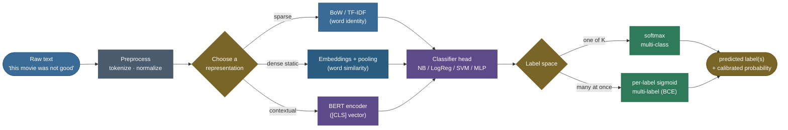
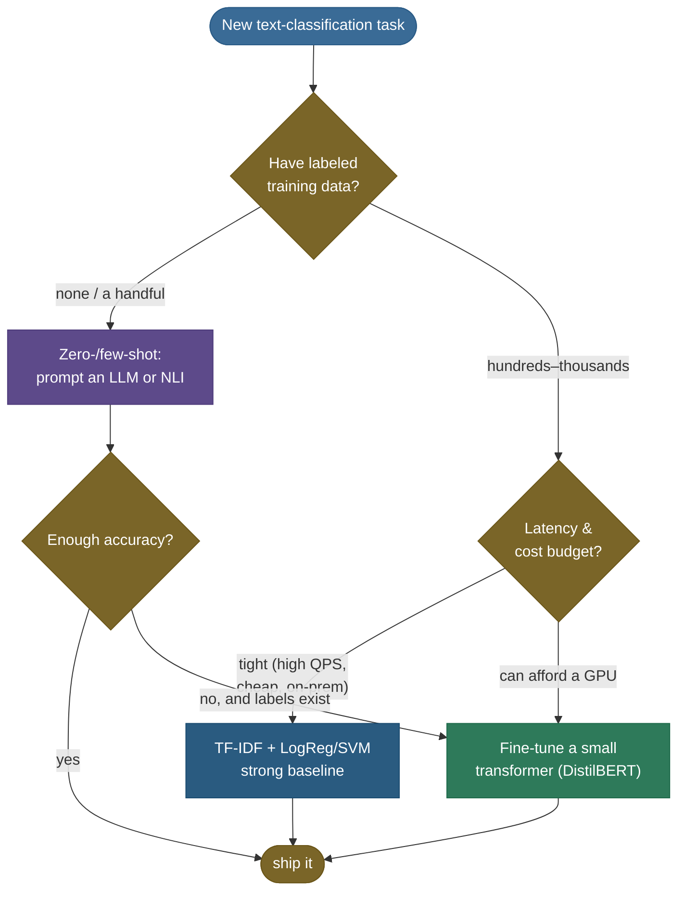
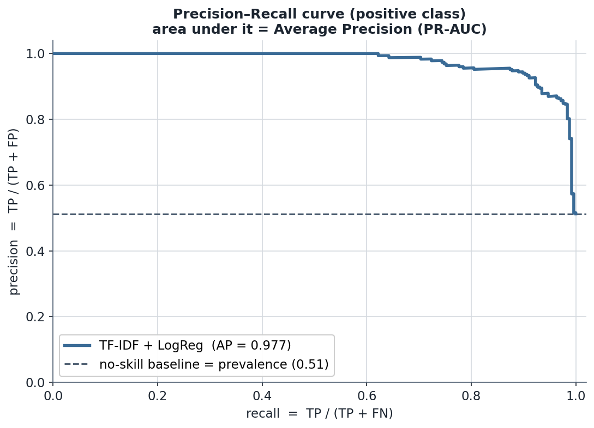

# Text Classification & Sentiment Analysis: assigning a label to a span of text

Show a model the sentence *"this movie was not good"* and ask it one question — **is this a happy review or an unhappy one?** That single question is **text classification**: map a whole piece of text to a discrete label. It is, by a wide margin, the most *applied* task in all of NLP. The spam filter on your inbox, the "is this comment toxic?" gate on a forum, the routing that sends *"my card was charged twice"* to billing instead of returns, the dashboard that tells a brand whether today's tweets about them lean positive or negative — every one of those is a text classifier. **Sentiment analysis** — deciding whether text is positive, negative, or neutral — is the most famous instance, and the running example we'll use, because it exposes everything that makes the task subtle: the four-character word *not* can flip a label, two clauses can disagree, and *"yeah, brilliant"* can mean the opposite of what it says.

What makes this topic such fertile interview ground is that it is the *cleanest place in ML to reason about the whole pipeline at once* — features, baselines, model choice, class imbalance, evaluation, and the modern fork between **fine-tuning a small model** and **prompting a big one**. There is a beautiful, well-trodden **ladder** of approaches, and the senior-engineer skill is not knowing the top rung; it's knowing *which rung a given problem actually needs*. A linear model on TF-IDF features, trained in two seconds, is still the baseline that every fancier model must beat — and surprisingly often, it isn't beaten by enough to justify the cost.

This page is the definitive treatment. We will build the task from first principles, climb the **representation ladder** rung by rung (deriving *how classification rides on each representation*), confront what makes **sentiment** specifically hard, separate **multi-class** from **multi-label**, handle **class imbalance**, weigh **zero-/few-shot LLM prompting against fine-tuning a small model**, and ground all of it in **four worked, measured examples** — including a multinomial Naive Bayes classification done **by hand** and proven against scikit-learn. By the end you'll be able to:

- frame any labeling problem as **binary / multi-class / multi-label** and pick the right output layer + loss;
- climb the ladder — **BoW/TF-IDF + classical ML → pooled embeddings → CNN-for-text → RNN/biLSTM → fine-tuned BERT** — and explain *what each rung buys you*;
- **derive the multinomial Naive Bayes sentiment decision** end to end (log-posterior, smoothing) and reproduce it in code, *and* derive the **logistic-regression sigmoid + cross-entropy gradient** that explains why LR usually edges NB on text;
- explain why **linear models on sparse TF-IDF** are a famously strong baseline, and what a transformer adds;
- handle **negation, aspects, sarcasm, and domain shift** — the things that break naive sentiment;
- choose between **fine-tuning a small model and prompting an LLM** from a cost/latency/accuracy argument, with **zero-shot NLI** as the no-data option;
- **evaluate properly** — precision/recall/F1 from the confusion matrix, **macro vs micro** F1, the **threshold trade-off**, and **why PR-AUC beats ROC-AUC under class imbalance** (with the measured curves to prove it).

We'll go intuition and pictures first, then the math (every step shown), then runnable, **verified** code — the numbers in every figure below were measured in Python 3.12, not invented.

> **Note:** "classification" here means assigning **one of a fixed set of labels** to a span of text, where the span is usually a whole document/sentence. The cousin task where you label **each token** (part-of-speech, named-entity) is **[sequence labeling](../09-Sequence-Labeling-POS-and-NER/09-Sequence-Labeling-POS-and-NER.md)** — same intuition, different output shape (one label *per token* instead of one *per document*). Keep them distinct in an interview.

---

## The problem: from a span of text to a discrete label

Formally, a text classifier is a function

$$f : \text{text} \;\longrightarrow\; y \in \mathcal{Y},$$

where $\mathcal{Y}$ is a finite **label set**. The flavor of the task is set entirely by the shape of $\mathcal{Y}$ and how many labels a document may carry:

- **Binary** — $\mathcal{Y} = \{0, 1\}$. *Spam / ham. Positive / negative. Toxic / clean.* One decision, one threshold.
- **Multi-class** — $\mathcal{Y} = \{1, \dots, K\}$, and **exactly one** label is correct. *Topic = {sports, politics, tech, …}. Intent = {billing, returns, shipping, …}. Star rating ∈ {1,2,3,4,5}.* The classes are **mutually exclusive**; the model must pick one.
- **Multi-label** — $\mathcal{Y}$ is a set of $K$ tags and a document may carry **any subset** (zero, one, or several). *A news article tagged both `politics` and `economy`. A support ticket that is both `billing` and `urgent`. A movie review that is `positive-about-acting` and `negative-about-pacing`.* The labels are **not** mutually exclusive.

That distinction — *exactly one* vs *any subset* — is not a footnote; it changes the **output layer and the loss function** (softmax + cross-entropy vs per-label sigmoid + binary cross-entropy), and we derive exactly why below. The most common mistake juniors make is reaching for softmax on a multi-label problem, which forces the probabilities to sum to one and therefore makes the labels compete when they shouldn't.

Sentiment analysis is usually framed as binary (pos/neg) or 3-way (pos/neg/neutral), sometimes as **ordinal** (1–5 stars, where the classes have an order), and at its most ambitious as **aspect-based** (positive about the *food*, negative about the *service* — really a structured, per-aspect classification). We'll touch all of these.

> **Note:** **ordinal** labels (1–5 stars) are a real third category between multi-class and regression: the classes have an *order* (4 is closer to 5 than to 1), so a misprediction of 4-vs-5 should cost less than 1-vs-5. Treating stars as plain multi-class throws that ordering away; treating them as regression and rounding ignores that they're discrete. Ordinal regression (e.g. cumulative-link models) sits in between — worth naming if asked, though plain multi-class is the common pragmatic choice.

### The general pipeline

Every classifier, from a 1990s Naive Bayes spam filter to a fine-tuned transformer, is the same three-stage pipeline. The only thing that changes up the ladder is **stage 2** — how text becomes numbers.



1. **Text → features / representation.** Turn the variable-length string into a fixed (or sequential) numeric form. This is the rung of the ladder you're on.
2. **Representation → classifier.** A decision rule over that representation — counts of words, a learned hyperplane, a neural head.
3. **Classifier → label.** A softmax over classes (multi-class) or independent sigmoids (multi-label), then a threshold.

Hold that three-stage skeleton in mind; the entire rest of this page is just *filling in stage 1 with better and better representations and watching the accuracy climb.*

---

## Intuition: the ladder of representations

Here is the whole story in one picture. As you climb, the representation captures **more of how language actually works** — from "which words appeared" (a bag, order-blind) all the way to "what each word means *in this exact sentence*" (deep, bidirectional context). Accuracy generally climbs with you. So do cost and latency.


The pedagogical spine of this page is to walk **up** that ladder, and for each rung answer the same two questions: *what does the representation capture?* and *how does the classification decision ride on it?* The punchline — visible in the measured comparison later — is that the **bottom rung is shockingly competitive**, and most of the accuracy gap to the top is closed by the *jump to contextual transformers*, with the middle rungs (DAN, CNN, RNN) being historically important way-stations.

> **Tip:** the senior move is to **always build the bottom rung first** — TF-IDF + logistic regression takes seconds, needs no GPU, and gives you (a) a real accuracy number to beat, (b) a sanity check on your labels and splits, and (c) often a shippable product. Only climb when that baseline genuinely isn't good enough, and *measure* the gain before paying for it.

---

## Rung 1: Bag-of-words / TF-IDF + classical ML

The oldest and still the strongest baseline. Represent a document as a **vector over the vocabulary** — one dimension per word — and feed that to a linear classifier. The representation is built in **[Bag-of-Words & TF-IDF](../03-Bag-of-Words-and-TF-IDF/03-Bag-of-Words-and-TF-IDF.md)** (read it for the construction of the counts and the IDF weighting); here we focus on the **classifiers that ride on it**.

A document like *"great fun great"* over a vocabulary `[boring, dull, film, fun, great, movie]` becomes a count vector $\mathbf{x} = [0, 0, 0, 1, 2, 0]$ (or its TF-IDF-weighted cousin). It is **sparse** (mostly zeros — a 200-word review touches a handful of a 40,000-word vocabulary) and **high-dimensional**. Crucially, it is **order-blind**: *"good not bad"* and *"bad not good"* produce the identical vector. That blindness is the rung's central weakness — and exactly what every rung above tries to fix.

Three classical classifiers dominate this rung, and an interviewer may ask you to compare them.

### Multinomial Naive Bayes: the canonical text classifier

[Naive Bayes](../../03.%20Supervised_Learning/05-Naive-Bayes/05-Naive-Bayes.md) is the textbook sentiment/spam classifier, and you should be able to derive its decision on the spot. (That page is the full treatment — generative-vs-discriminative, smoothing as a Dirichlet prior, the proof that NB is a linear classifier. Read it. Here we derive *just the text-classification decision rule* and then work it numerically.)

The **multinomial** event model treats a document as a bag of word **counts** drawn from a per-class word distribution. By Bayes' rule, the posterior probability of class $c$ given document $\mathbf{x}$ (word counts $x_w$) is

$$P(c \mid \mathbf{x}) \;=\; \frac{P(c)\,P(\mathbf{x}\mid c)}{P(\mathbf{x})} \;\propto\; P(c)\prod_{w \in V} P(w \mid c)^{\,x_w}.$$

The "naive" assumption — words are conditionally independent given the class — is what turns the joint likelihood into that product. We classify with the **MAP** rule (pick the class with the highest posterior), and because the evidence $P(\mathbf{x})$ doesn't depend on $c$, we can drop it. Taking $\log$ (to turn the product into a sum and dodge floating-point underflow) gives the **log-posterior score** we actually compute:

$$\boxed{\;\hat{c} \;=\; \arg\max_{c}\;\Big[\;\underbrace{\log P(c)}_{\text{prior}} \;+\; \sum_{w \in V} x_w \,\underbrace{\log P(w\mid c)}_{\text{log-likelihood}}\;\Big]\;}$$

> **Source / derivation:** the multinomial Naive Bayes posterior, the conditional-independence factorization, and the move to log-space are derived in [Jurafsky & Martin, *Speech and Language Processing* (3rd ed.), Ch. 4 "Naive Bayes, Text Classification, and Sentiment"](https://web.stanford.edu/~jurafsky/slp3/4.pdf) (Eqs. 4.9–4.10) — the canonical treatment, in the references.

The per-word likelihoods are estimated from training counts with **Laplace (add-$\alpha$) smoothing**, so that a word never seen in class $c$ doesn't zero out the whole product:

$$P(w \mid c) \;=\; \frac{\text{count}(w, c) + \alpha}{\Big(\sum_{w' \in V}\text{count}(w', c)\Big) + \alpha\,|V|}.$$

> **Source / derivation:** add-$\alpha$ (Laplace) smoothing of the multinomial likelihood — and why an unsmoothed zero count would annihilate the whole product — is [SLP3 Ch. 4 §4.1](https://web.stanford.edu/~jurafsky/slp3/4.pdf) (Eq. 4.14). The smoothing is exactly a symmetric Dirichlet$(\alpha)$ prior on the per-class word distribution (see the [Naive Bayes](../../03.%20Supervised_Learning/05-Naive-Bayes/05-Naive-Bayes.md) page for that derivation).

Notice the *shape* of that boxed rule: a sum of `count × log-likelihood`, which is a **linear function of the word-count vector**. That's the secret the Naive Bayes page proves in full — multinomial NB is a **linear classifier** in disguise, a sibling of logistic regression. Same decision *geometry*, different way of estimating the weights (NB from class-conditional counts, generatively; logistic regression by directly optimizing the conditional likelihood, discriminatively).

> **Note:** people dismiss Naive Bayes as a toy, but for text it is *genuinely strong* — fast, needs little data, and hard to beat as a one-line baseline. The independence assumption is wildly false (words travel in packs) yet the **ranking** of classes usually comes out right even when the probabilities are nonsense — which is all classification needs. See the measured 0.906 accuracy below: only ~1 point behind the logistic-regression baseline.

> **Gotcha:** the multinomial event model uses word **counts** (term frequency); the **Bernoulli** model uses binary present/absent flags and explicitly models *absent* words too. For longer documents the **multinomial** model is the standard for sentiment/topic; Bernoulli can win on very short texts. And the **Complement NB** variant (CNB) is the one to reach for under **class imbalance** — it estimates each class's parameters from the *complement* of that class, which is more stable when one class is rare.

We work this rule fully by hand in **Worked example 1** below — and prove it matches scikit-learn to the last decimal.

### Logistic regression on TF-IDF: the discriminative baseline

[Logistic regression](../../03.%20Supervised_Learning/02-Logistic-Regression/02-Logistic-Regression.md) learns a weight vector $\mathbf{w}$ and bias $b$ and predicts $P(y{=}1\mid \mathbf{x}) = \sigma(\mathbf{w}^\top\mathbf{x} + b)$, where $\sigma(z) = 1/(1+e^{-z})$ is the **sigmoid** that squashes the real-valued score $z = \mathbf{w}^\top\mathbf{x} + b$ into a probability. It fits the weights by **minimizing cross-entropy** (equivalently, maximizing the conditional log-likelihood) with L2 regularization. The loss for one example with true label $y \in \{0,1\}$ is

$$\mathcal{L}(\mathbf{w}, b) \;=\; -\big[\,y \log \sigma(z) + (1-y)\log(1-\sigma(z))\,\big],$$

and the gradient that drives training has a strikingly clean form — the **prediction-minus-target error** times the feature:

$$\frac{\partial \mathcal{L}}{\partial \mathbf{w}} \;=\; \big(\sigma(z) - y\big)\,\mathbf{x}, \qquad \frac{\partial \mathcal{L}}{\partial b} \;=\; \sigma(z) - y.$$

That $(\hat{y} - y)\mathbf{x}$ shape is the whole reason logistic regression trains stably: each word's weight is nudged in proportion to how wrong the current probability is, scaled by how strongly that word appeared. Connect it back to the interpretation — a large positive $w_{\texttt{excellent}}$ pushes $z$ up, hence $\sigma(z)$ toward 1 (positive); a large negative $w_{\texttt{terrible}}$ pushes it toward 0.

> **Source / derivation:** the sigmoid, the cross-entropy objective, and the $(\sigma(z)-y)\,\mathbf{x}$ gradient are derived for text in [Jurafsky & Martin, *SLP3* Ch. 5 "Logistic Regression"](https://web.stanford.edu/~jurafsky/slp3/5.pdf) (Eqs. 5.11, 5.17, 5.24) — in the references; the full optimization story (convexity, L1 vs L2) is on the [Logistic Regression](../../03.%20Supervised_Learning/02-Logistic-Regression/02-Logistic-Regression.md) page.

On **sparse TF-IDF features** logistic regression is the workhorse text baseline: it learns a signed weight *per word*, so the model is **directly interpretable** — sort the weights and you can read off the most positive and most negative words. It typically edges out Naive Bayes because it doesn't assume independence; instead it can *down-weight* correlated, redundant features (the burst-correlated word clusters in the worked comparison below are exactly what NB double-counts and LR learns to discount). In the measured comparison it lands at **0.919** accuracy — about a point above NB and three above the linear SVM on that set.

### Linear SVM: the margin-maximizer for sparse high-dim text

A **linear support vector machine** ([SVM](../../03.%20Supervised_Learning/06-Support-Vector-Machines/06-Support-Vector-Machines.md)) finds the **maximum-margin** separating hyperplane. On high-dimensional **sparse** TF-IDF data it is, historically, *the* text-classification champion (Joachims showed in 1998 that text is "linearly separable in high-dimensions" and SVMs exploit exactly that). The intuition for *why linear models win here*: with tens of thousands of sparse features and relatively few examples, the data is **almost always linearly separable**, so a linear decision boundary has plenty of capacity — and a kernel would only overfit. The margin objective also makes the SVM robust to the many irrelevant features. On most real text it ties or edges LogReg; on the small burst-correlated set in the worked comparison below it lands a bit behind both at **0.890** (a reminder that the ranking among the three is dataset-dependent — *measure on yours*).

> **Tip:** *why are linear models + sparse TF-IDF such a strong baseline?* Three reasons worth saying out loud: (1) in tens-of-thousands of dimensions with sparse features, classes are usually **linearly separable**, so a linear boundary suffices; (2) the model is **fast and data-efficient** — it trains in seconds and works with a few thousand labels; (3) it is **interpretable** — every word has a signed weight. The non-linearity that deep models add only pays off when *interactions between words* matter, which for topic/spam is rarely, and for sentiment is sometimes (negation, sarcasm).

---

## Rung 2: word embeddings + pooling (the Deep Averaging Network)

The bag-of-words representation has no notion that `great` and `excellent` are related — they're two orthogonal dimensions. **[Word embeddings](../05-Word-Embeddings-Word2Vec-GloVe-FastText/05-Word-Embeddings-Word2Vec-GloVe-FastText.md)** fix that: each word becomes a dense vector where similar words sit close together. To classify a whole document, we need to collapse its *sequence* of word vectors into one fixed vector — and the simplest, surprisingly effective way is **pooling**:

$$\mathbf{h} \;=\; \text{pool}\big(\mathbf{e}_{w_1}, \mathbf{e}_{w_2}, \dots, \mathbf{e}_{w_n}\big), \qquad \text{pool} \in \{\text{mean},\ \text{max}\}.$$

**Mean pooling** averages the word vectors (every word votes equally); **max pooling** takes the element-wise max (each dimension fires if *any* word activates it strongly). Feed the pooled vector $\mathbf{h}$ to a small MLP + softmax, and you have a neural classifier. When the embeddings are averaged and passed through a couple of feed-forward layers, this is the **Deep Averaging Network (DAN)** of Iyyer et al. (2015) — and the startling result of that paper is that *averaging* word vectors, with **no word order at all**, rivals far more complex order-aware models on sentiment, at a fraction of the cost. **fastText** ([Joulin et al. 2016](https://arxiv.org/abs/1607.01759)) is the industrial version: a linear classifier over averaged word- *and n-gram*-embeddings, trained so fast it classifies a billion words in minutes while matching deep models on many benchmarks.

> **Note:** mean-pooled embeddings are still **mostly order-blind** — *"not good"* and *"good not"* average to nearly the same vector. The DAN's surprise is precisely that *this barely matters* for coarse sentiment, because the **presence** of strong-polarity words carries most of the signal. The cases where order *does* matter (negation, contrast) are exactly where the next rungs earn their keep. Add **word n-grams** to the bag (as fastText does) to recover some local order cheaply — *"not_good"* as its own feature.

---

## Rung 3: CNN-for-text — convolutions as n-gram detectors

To capture **local word order** without the cost of a full recurrent model, Kim (2014) had an elegant idea: slide **1-D convolutional filters** over the *sequence of embeddings*. Lay the sentence out as a matrix of shape $(T \text{ tokens} \times d \text{ dims})$, and a filter of width $h$ is a small weight patch that covers $h$ consecutive word-vectors at a time. As it slides, at each position it computes a single number — a **feature** — that fires when that particular $h$-gram pattern is present.


Formally, with embeddings $\mathbf{e}_1,\dots,\mathbf{e}_T \in \mathbb{R}^d$ stacked, a filter $\mathbf{W}\in\mathbb{R}^{h\times d}$ produces, at position $i$, the feature

$$c_i \;=\; g\big(\mathbf{W}\odot \mathbf{e}_{i:i+h-1} + b\big),$$

a non-linearity $g$ (ReLU) over the element-wise product summed across the $h\times d$ window. Sweeping $i$ from $1$ to $T-h+1$ gives a **feature map** $\mathbf{c} = [c_1,\dots,c_{T-h+1}]$ — the filter's response *at every position*. Then comes the key trick: **max-over-time pooling**, $\hat{c} = \max_i c_i$, which keeps only the *strongest* activation across the whole sentence. This says, in effect, *"did this n-gram pattern appear anywhere?"* — and it conveniently produces a fixed-size output regardless of sentence length.

> **Source / derivation:** the convolution-over-embeddings feature, the feature map, and max-over-time pooling are §2–3 of [Kim 2014, "Convolutional Neural Networks for Sentence Classification"](https://arxiv.org/abs/1408.5882) (Eqs. 1–3) — in the references.

What do the filters **learn**? They become **n-gram detectors**: a width-3 filter might learn to fire on *"was not good"*, another on *"highly recommend it"*, another on *"a complete waste"*. By using **many** filters at **several widths** (2, 3, 4, 5) you build a bank of learned phrase detectors; max-pooling each one and concatenating gives a feature vector that feeds a softmax. This is how the CNN *fixes the order-blindness of rungs 1–2 for local patterns* — it can represent *"not good"* as a single firing feature, which bag-of-words never could.

> **Tip:** the mental model that makes CNN-for-text click: **it's a learned, soft version of n-gram features.** Where bag-of-n-grams hard-codes *"not_good"* as a vocabulary entry (and explodes the feature count), the CNN *learns* which 3-grams matter and shares parameters via the embedding, so it generalizes — a filter that fires on *"not good"* also partly fires on *"not great"* because their embeddings are close.

> **Gotcha:** max-over-time pooling throws away **where** and **how many times** a pattern fired — only *that it fired strongest somewhere*. For most sentence classification that's a feature (position-invariance), but for tasks where *count* or *position* matters you'd lose information. It also makes CNNs weak at **long-range** dependencies (a negation 30 words from the word it negates), which is the gap RNNs and especially transformers close.

---

## Rung 4: RNN / LSTM / biLSTM — sequence-aware classification

A recurrent network reads the sentence **one token at a time**, maintaining a hidden state $\mathbf{h}_t$ that is a running summary of everything seen so far: $\mathbf{h}_t = f(\mathbf{h}_{t-1}, \mathbf{e}_t)$. For classification you typically take the **final hidden state** (a summary of the whole sentence) — or pool all hidden states — and feed it to a softmax. Unlike pooling or a width-$h$ CNN, an RNN can in principle carry information **across the whole sentence**, so a *"not"* early on can color the interpretation of an adjective much later. **LSTMs** (and GRUs) add gates that let gradients and information persist over long spans, fixing the vanishing-gradient problem of vanilla RNNs.

The standard sentiment architecture is the **bidirectional LSTM (biLSTM)**: run one LSTM left-to-right and another right-to-left, and concatenate their final states. *Why bidirectional?* Because the meaning of a word can depend on what comes **after** it as much as before — *"not"* needs to see the word it negates, which may be downstream. A biLSTM gives every position both its left and right context. This rung was the sentiment state-of-the-art for several years (circa 2015–2018) and remains a reasonable choice when a transformer is too heavy.

> **Note:** the line from this rung to the next is direct. RNNs read **sequentially** (slow, and long-range info still degrades over many steps); the **transformer** replaced recurrence with **[attention](../../05.%20Deep_Learning/15-Attention-Mechanism/15-Attention-Mechanism.md)**, letting every token attend to every other token in **one parallel step** — better long-range modeling *and* far faster training. That architectural leap is what makes Rung 5 possible.

---

## Rung 5: fine-tuning BERT — the modern default

The top of the ladder, and the SOTA for most text-classification tasks since 2018, is to **fine-tune a pretrained transformer**. The idea is **transfer learning**: a model like BERT is first **pretrained** on a huge unlabeled corpus with masked-language-modeling — learning deep, **bidirectional, contextual** representations of language (the full story is in **[Contextual Embeddings — ELMo · BERT](../06-Contextual-Embeddings-ELMo-BERT/06-Contextual-Embeddings-ELMo-BERT.md)**). Then you **fine-tune** it on your (much smaller) labeled classification set.

The mechanics for classification are clean. BERT prepends a special **`[CLS]`** token to every input. After the encoder runs, the final-layer hidden vector at the `[CLS]` position is treated as a **pooled representation of the whole sentence**; you attach a single linear **classification head** on top of it:

$$\mathbf{h}_{\texttt{[CLS]}} \in \mathbb{R}^{768} \;\xrightarrow{\;\mathbf{W}\in\mathbb{R}^{K\times 768},\,\mathbf{b}\;}\; \text{softmax}\big(\mathbf{W}\,\mathbf{h}_{\texttt{[CLS]}} + \mathbf{b}\big) \in \Delta^{K}.$$

> **Source / derivation:** the `[CLS]`-token pooled vector with a single linear softmax head, fine-tuned end to end, is the sentence-classification recipe of [Devlin et al. 2018, "BERT: Pre-training of Deep Bidirectional Transformers" §4.1 / §3](https://arxiv.org/abs/1810.04805) — in the references.

You then train **the whole model end to end** (head *and* the pretrained weights, with a small learning rate) on your labels. Because the encoder already "knows language," fine-tuning needs comparatively few labeled examples to reach high accuracy — this is the transfer that **ULMFiT** ([Howard & Ruder 2018](https://arxiv.org/abs/1801.06146)) introduced for text and **BERT** ([Devlin et al. 2018](https://arxiv.org/abs/1810.04805)) perfected. It works because the `[CLS]` vector is a *context-aware* summary: it can represent that *"not good"* is negative in a way no bag-of-words ever could, because self-attention lets *"not"* and *"good"* interact.

> **Tip:** for production you rarely fine-tune full BERT-large. **DistilBERT** (40% smaller, 60% faster, ~97% of BERT's accuracy) and **RoBERTa** (better-pretrained BERT) are the pragmatic choices. For sentiment specifically, off-the-shelf fine-tuned checkpoints (e.g. `distilbert-base-uncased-finetuned-sst-2-english`) exist — sometimes you don't need to train at all.

> **Gotcha:** fine-tuning a transformer is **not free** — it needs a GPU, the inference is 10–100× slower and more expensive than a TF-IDF linear model, and on small/clean datasets the accuracy gain over the baseline is often **a few points** (a strong linear baseline in the low-0.90s vs a fine-tuned DistilBERT in the ~0.91–0.93 range on IMDb). Always ask whether those points are worth the cost. The honest answer is often *yes* for hard, nuanced tasks (sarcasm, nuanced toxicity) and *no* for clean topic/spam.

---

## The measured ladder: NB vs linear models (runnable) and the transformer (published)

Enough theory — here is the bottom of the ladder **measured, end to end, on CPU in two seconds**, by the companion `text_classification.py`. To make the comparison honest *and* reproducible without a network download, the corpus is a **deterministic synthetic sentiment set** (720 train / 480 test) whose positive/negative reviews are built from polarity-word pools — crucially with **correlated word "bursts"** (clusters of co-occurring positive or negative words). That burst correlation is the knob that makes the data violate Naive Bayes' independence assumption, so the comparison shows the textbook effect: **LogReg edges out NB** because it down-weights the redundant, correlated features NB double-counts.


| Model | Representation | Accuracy | Macro-F1 | PR-AUC | Train cost |
|---|---|---|---|---|---|
| Multinomial Naive Bayes | bag-of-counts (1–2 gram) | **0.906** | 0.906 | 0.974 | ~0.5 s, CPU |
| TF-IDF + Logistic Regression | TF-IDF (1–2 gram) | **0.919** | 0.919 | 0.977 | ~1 s, CPU |
| Linear SVM | TF-IDF (1–2 gram) | **0.890** | 0.890 | 0.968 | ~1 s, CPU |

Read this table like a senior engineer. All three baselines land in the **high-0.80s to low-0.90s** in about a second on a CPU, no GPU, no labels beyond a few hundred examples. LogReg's ~1-point lead over NB is the **discriminative-beats-generative-on-correlated-features** effect made concrete; the SVM trails here only because this particular small set rewards LogReg's probabilistic fit — *on your data the ranking may flip, which is exactly why you measure all three.*

**The transformer rung (published numbers, not run here).** Climbing to a fine-tuned **DistilBERT** on real **IMDb** (all 25k reviews) reaches **~0.91–0.93** accuracy in the literature — a few points above these linear baselines, bought at ~40× the training cost and ~50× the inference cost. We don't run it in the notebook (it needs a GPU and a model download), but the engineering takeaway is the durable one: *the linear baseline captures the bulk of the achievable accuracy; the transformer buys the last few points at a large cost.* Whether that trade is worth it is the entire decision — and it depends on how much each point is worth in your product.

> **Note:** notice **accuracy ≈ macro-F1** for every model here. That's because this set is **balanced** (50/50 pos/neg). On a **skewed** dataset they diverge sharply, and that gap is the whole reason macro-F1 exists — we demonstrate exactly that divergence, measured, under *Class imbalance* below.

---

## What makes *sentiment* specifically hard

Topic and spam classification are comparatively easy — the presence of a few telltale words usually settles it. **Sentiment is harder**, because polarity is a property of *meaning in context*, and language has many ways to invert, qualify, or hide it. These are the issues an interviewer will probe, and the cases where the higher rungs of the ladder earn their cost.


- **Polarity vs intensity.** *"good"* and *"phenomenal"* are both positive but not equally so. Binary pos/neg throws intensity away; star ratings and regression-style sentiment keep it.
- **Negation.** *"not good"*, *"hardly a masterpiece"*, *"I can't say I enjoyed it"* — a single negator flips polarity. **Bag-of-words is structurally blind to this**: it sees the positive word `good` and votes positive (the top-left of the hard-cases panel). Classic fixes prepend a `NOT_` tag to every token between a negator and the next punctuation (so `not good` → `not NOT_good`); CNNs and transformers learn it from data.
- **Double negation & litotes.** *"not bad at all"* is *positive* — two negations and an understatement. These defeat simple negation rules and need a model that reads the whole phrase.
- **Aspect-based sentiment (ABSA).** *"great food, terrible service"* is **positive about one aspect and negative about another**. A single document label is the wrong shape; ABSA predicts a sentiment *per aspect/entity*, turning sentiment into a structured extraction-plus-classification task. This is where real product analytics live ("what do customers like vs dislike?").
- **Sarcasm & irony.** *"Oh, fantastic, another crash."* The surface words are positive; the meaning is negative. This is genuinely hard even for large models, because it often requires world knowledge or tone the text doesn't carry.
- **Domain dependence.** A model trained on movie reviews transfers poorly to financial news or product reviews — *"unpredictable"* is **praise** for a thriller and a **complaint** for a car. Sentiment lexicons and models are **domain-specific**; always validate on your target domain.
- **Subjectivity.** Much text is purely factual ("the phone has 128 GB of storage") and carries **no** sentiment. A robust pipeline often first classifies *subjective vs objective*, then scores polarity only on the subjective spans.

> **Note:** these difficulties are precisely *why the ladder exists.* Negation and double-negation reward **local order** (CNN) and **long-range context** (biLSTM, transformer); aspects reward **structured** outputs; sarcasm rewards the **world knowledge** baked into large pretrained models. When someone asks "why not just use Naive Bayes for sentiment?", the answer is this list.

> **Gotcha:** the canonical reference for *why sentiment is its own field* is **Pang & Lee's 2008 survey, "Opinion Mining and Sentiment Analysis"** — it catalogs exactly these phenomena (negation, domain transfer, subjectivity, aspect) and is still the best map of the territory. Cite it if asked for the foundational work.

---

## Multi-class (softmax) vs multi-label (per-label sigmoid): derive the difference

This is the single most testable structural detail, and a place juniors slip. The output layer and loss differ because the **label spaces have different shapes**.

**Multi-class (exactly one of $K$).** The model outputs $K$ logits $\mathbf{z}=[z_1,\dots,z_K]$, and a **softmax** turns them into a probability distribution that **sums to one**:

$$P(y{=}k \mid \mathbf{x}) \;=\; \frac{e^{z_k}}{\sum_{j=1}^{K} e^{z_j}}, \qquad \sum_{k=1}^{K} P(y{=}k\mid\mathbf{x}) = 1.$$

Train with **categorical cross-entropy**: $\mathcal{L} = -\log P(y{=}y^\star\mid\mathbf{x})$ for the true class $y^\star$. The crucial property: softmax makes the classes **compete** — raising one class's probability *lowers* the others. That is exactly what you want when only one label can be right.

**Multi-label (any subset of $K$).** Now the labels are **independent** — a document can be both `politics` and `economy`. You must **not** use softmax (it would force them to compete and sum to one). Instead use $K$ **independent sigmoids**, one per label, each its own binary classifier:

$$P(\text{label}_k \mid \mathbf{x}) \;=\; \sigma(z_k) \;=\; \frac{1}{1+e^{-z_k}}, \qquad \text{each in } (0,1) \text{ independently.}$$

Train with **binary cross-entropy summed over labels**: $\mathcal{L} = -\sum_{k=1}^{K}\big[y_k\log\sigma(z_k) + (1-y_k)\log(1-\sigma(z_k))\big]$. At inference you **threshold each sigmoid independently** (typically at 0.5, but tune per label) to decide which tags to emit — so a document can fire zero, one, or many labels.

$$\boxed{\;\text{one-of-}K \Rightarrow \text{softmax + cross-entropy}\qquad\text{any-subset} \Rightarrow K\ \text{sigmoids + BCE}\;}$$

> **Source / derivation:** softmax + categorical cross-entropy for mutually-exclusive classes, and independent sigmoids + binary cross-entropy for multi-label outputs, are [Goodfellow, Bengio & Courville, *Deep Learning*, Ch. 6 §6.2.2 "Output Units"](https://www.deeplearningbook.org/contents/mlp.html) — in the references (the softmax/cross-entropy pairing is also [SLP3 Ch. 5](https://web.stanford.edu/~jurafsky/slp3/5.pdf)).

> **Gotcha:** the most common bug in applied multi-label NLP is using **softmax + cross-entropy** on a problem where documents legitimately carry multiple labels. The symptom: the model can never confidently predict two labels at once (their probabilities are forced to trade off), so multi-tag recall collapses. The fix is the sigmoid+BCE head above. Conversely, using independent sigmoids on a genuinely mutually-exclusive problem wastes the helpful inductive bias that the classes compete.

---

## Class imbalance: when one label dominates

Real classification data is often **skewed** — 1% spam, 0.3% fraud, a rare toxic class among mostly-clean comments. Three things go wrong, and all are covered in depth in **[Classification Metrics](../../03.%20Supervised_Learning/14-Classification-Metrics/14-Classification-Metrics.md)** (read it for the full treatment of the confusion matrix, precision/recall, and the metric choices) — here is the text-specific summary:

1. **Accuracy lies.** A classifier that predicts "not-spam" for everything scores 99% accuracy on a 1%-spam stream while catching zero spam. Report **macro-F1** (averages the per-class F1, so the rare class counts equally) or **precision/recall/PR-AUC for the minority class**, never bare accuracy. Here it is *measured* on an **8%-positive** version of our corpus — a do-nothing "always negative" model versus a real class-weighted LogReg:


The do-nothing model's **0.919 accuracy** looks excellent and is **completely useless** — it catches *zero* positives. Macro-F1 (0.479) and PR-AUC (0.081, which for a no-skill classifier equals the positive prevalence) both expose it instantly. That gap is the entire reason these metrics exist.

   **And this is exactly where the PR-vs-ROC choice bites.** Feed the *same* model scores under heavy imbalance to a ROC curve and a PR curve and they tell different stories — ROC stays flattering, PR is honest:

   

   The mechanism is precise: ROC's x-axis is the **false-positive rate** = FP/(FP+TN), and under imbalance the **TN count is enormous**, so even many false positives barely move the FPR — ROC-AUC stays high. PR's precision = TP/(TP+FP) has **no TN term**, so those same false positives crater precision. When the positive class is rare, **trust the PR curve**.
2. **The model under-learns the rare class.** Standard cross-entropy is dominated by the majority class's gradient. Fixes:
   - **Class weighting** — scale each class's loss by the inverse of its frequency (`class_weight="balanced"` in scikit-learn; `pos_weight` in a BCE head), so a rare-class mistake costs more.
   - **Resampling** — oversample the minority (or SMOTE-style synthesis, though it's awkward for text) or undersample the majority.
   - **Focal loss** — down-weights easy, well-classified examples so training focuses on the hard, often-minority ones (originally from object detection, widely used for imbalanced text too).
   - **Complement Naive Bayes** — the NB variant designed for imbalance.
3. **The default threshold is wrong.** A 0.5 sigmoid threshold is rarely optimal under imbalance — tune it on a validation set to hit your precision/recall target (next section).

> **Tip:** for the rare-but-critical class (fraud, toxicity, medical), the product question is usually *"of the bad cases, how many did we catch?"* — that's **recall** — traded against the false-alarm rate. Optimize the metric your product actually cares about, not accuracy. Macro-F1 is the safe default summary; PR-AUC is best when the positive class is rare.

---

## Zero-shot and few-shot classification with LLMs

The newest fork in the road: you may not need to *train a classifier at all*. Two LLM-era techniques classify text with **no task-specific training data**.

**Zero-shot via NLI entailment** ([Yin et al. 2019](https://arxiv.org/abs/1909.00161)). The clever reframe: turn classification into **natural language inference**. Take a model fine-tuned on NLI (does sentence A *entail* sentence B?), feed the document as the premise and a templated hypothesis per candidate label — *"This text is about {politics}."*, *"This text is {positive}."* — and read off the **entailment probability** for each label. The label whose hypothesis is most entailed wins. No labeled training data, any label set you like at runtime. This is exactly what Hugging Face's `zero-shot-classification` pipeline does (with `bart-large-mnli`), and we run it live in **Worked example 4** — it scores a clearly-negative review as `negative` 0.86.

**Few-shot / in-context prompting.** Hand a general LLM the task as a prompt: a short instruction, optionally a few labeled examples ("in-context learning"), and the text to classify, then parse the label out of the completion. No training, no gradient updates — just a well-crafted prompt. It handles arbitrary, fuzzy label sets and nuanced cases (sarcasm) that a small model struggles with, and it shines when you have *no* labels.

**When to prompt an LLM vs fine-tune a small model.** This is the decision an interviewer wants you to reason through — it's a **cost / latency / accuracy** trade.



- **Prompt an LLM when:** you have **no/few labels**, the label set changes often, volume is low, latency is forgiving, and the task is nuanced. It's the fastest path to a working v0.
- **Fine-tune (or train a linear model) when:** you have **labeled data** and need **high throughput, low latency, low per-call cost, or on-prem/offline** deployment. A 66M-parameter DistilBERT (or a TF-IDF linear model) serving thousands of requests per second per CPU is **orders of magnitude cheaper** than calling a 100B+ LLM per document — and on a well-defined task it is usually **as accurate or more**, because it was trained on *your* distribution.

> **Tip:** a powerful hybrid: use an **LLM to label** a few thousand examples (cheap, one-time), then **fine-tune a small model** on those labels (cheap, fast at serve time). You get the LLM's quality distilled into a model you can run at scale for pennies. This "distill the labels, serve the small model" pattern is now standard practice for high-volume classification.

---

## Evaluation done right: precision, recall, F1, and the curves

The **confusion matrix** is the source of truth; every scalar metric is a summary of its four cells. For a positive class, those cells are **TP** (true positives), **FP** (false positives), **FN** (false negatives), **TN** (true negatives), and the three metrics that matter are:

$$\text{precision} = \frac{\text{TP}}{\text{TP}+\text{FP}}, \qquad \text{recall} = \frac{\text{TP}}{\text{TP}+\text{FN}}, \qquad F_1 = \frac{2\cdot\text{precision}\cdot\text{recall}}{\text{precision}+\text{recall}}.$$

In one sentence each: **precision** is *"of the documents I flagged positive, what fraction truly were"* (the cost of false alarms); **recall** is *"of the documents that truly were positive, what fraction I caught"* (the cost of misses); **F1** is their **harmonic mean** — harmonic, not arithmetic, so that a model can't game it by acing one and tanking the other (50% precision + 100% recall gives F1 = 0.67, not 0.75).

> **Source / derivation:** precision, recall, and the F-measure as functions of the confusion-matrix counts are [Manning, Raghavan & Schütze, *Introduction to Information Retrieval*, Ch. 8 "Evaluation in information retrieval"](https://nlp.stanford.edu/IR-book/html/htmledition/evaluation-of-unranked-retrieval-sets-1.html) — in the references; the same definitions in the classification framing are on the [Classification Metrics](../../03.%20Supervised_Learning/14-Classification-Metrics/14-Classification-Metrics.md) page.

**Macro vs micro F1 — the distinction juniors blur.** With more than one class (or a positive/negative split you care about equally), you average per-class F1 two ways: **macro-F1** averages the per-class F1 scores *with equal weight per class*, so a rare class counts as much as a common one; **micro-F1** pools all TP/FP/FN across classes *before* computing one F1, so it is dominated by the **frequent** classes (and for single-label multi-class it equals accuracy). The rule: **report macro-F1 when the rare class matters** (the usual case for imbalanced sentiment/toxicity/fraud); micro-F1 when you genuinely care about overall per-instance correctness. Confusing them is a classic interview slip — and a real bug, because on a skewed set they can be 0.40 apart.

**Threshold tuning.** A model outputs a *probability*; turning it into a *decision* needs a **threshold**. The default 0.5 is rarely optimal under imbalance or asymmetric costs — sweep it on a validation set to hit your target precision/recall (or maximize F1). Here is that sweep, measured, for the LogReg model on the balanced set:


Read the curves: as you raise the threshold you flag fewer documents, so **precision rises** (the ones you do flag are surer) but **recall falls** (you miss more true positives). F1 peaks where the two cross — here near **0.48**, slightly under the default. For the rare-but-critical class (fraud, toxicity) you'd push the threshold to wherever your product's precision/recall target lands, *not* leave it at 0.5.

**The threshold-free view — PR and ROC curves.** Sweeping the threshold over its whole range and plotting the trade-off gives a **curve**, and the area under it is a single threshold-free score. Two curves matter:

- **Precision–Recall (PR) curve** — precision vs recall across thresholds; its area is **Average Precision (PR-AUC)**. Best when the **positive class is rare**.
- **ROC curve** — true-positive rate vs false-positive rate across thresholds; its area is **ROC-AUC**. Best for **balanced** ranking quality.



> **Source / derivation:** *accuracy is a decision metric (needs a threshold); AUC is a ranking metric (threshold-free)*. The ROC/PR construction and the AUC interpretation are [Manning *et al.*, *IR* Ch. 8](https://nlp.stanford.edu/IR-book/html/htmledition/evaluation-of-ranked-retrieval-results-1.html); *which curve lies under imbalance* is the precise result of [Saito & Rehmsmeier 2015, "The Precision-Recall Plot Is More Informative than the ROC Plot When Evaluating Binary Classifiers on Imbalanced Datasets" (PLoS ONE)](https://journals.plos.org/plosone/article?id=10.1371/journal.pone.0118432) — both in the references.

**Calibration.** Separately, calibration asks whether a predicted "0.8" really means "right 80% of the time." Naive Bayes is notoriously **over-confident** (its false independence assumption double-counts correlated evidence and pushes probabilities toward 0/1); logistic regression is better calibrated by construction; transformers often need **temperature scaling**. If you *act* on the probability (auto-action only above 0.95), calibrate it first.

---

## Worked example 1: multinomial Naive Bayes by hand

Let's classify a tiny sentiment corpus completely by hand, then prove it against scikit-learn. Training set — four documents, two classes:

| Document | Class |
|---|---|
| `great fun great` | pos |
| `great great movie` | pos |
| `boring boring film` | neg |
| `boring dull movie` | neg |

**Vocabulary** $V = \{$`boring, dull, film, fun, great, movie`$\}$, so $|V| = 6$. **Priors:** 2 pos, 2 neg docs → $P(\text{pos}) = P(\text{neg}) = 0.5$.

**Word counts per class** (count each word across that class's docs):

- **pos** (`great fun great` + `great great movie`): `great`=4, `fun`=1, `movie`=1 → **total = 6** words.
- **neg** (`boring boring film` + `boring dull movie`): `boring`=3, `film`=1, `dull`=1, `movie`=1 → **total = 6** words.

**Classify the test document** $d^\star =$ `great fun`. With Laplace smoothing $\alpha = 1$ and $|V| = 6$, the smoothed likelihoods we need are:

$$P(\text{great}\mid\text{pos}) = \frac{4+1}{6+6} = \frac{5}{12},\qquad P(\text{fun}\mid\text{pos}) = \frac{1+1}{6+6} = \frac{2}{12},$$
$$P(\text{great}\mid\text{neg}) = \frac{0+1}{6+6} = \frac{1}{12},\qquad P(\text{fun}\mid\text{neg}) = \frac{0+1}{6+6} = \frac{1}{12}.$$

Now the **log-posterior scores** (counts of `great` and `fun` in $d^\star$ are both 1):

$$\log P(\text{pos}\mid d^\star) = \log 0.5 + \log\tfrac{5}{12} + \log\tfrac{2}{12} = -0.693 - 0.875 - 1.792 = \mathbf{-3.360},$$
$$\log P(\text{neg}\mid d^\star) = \log 0.5 + \log\tfrac{1}{12} + \log\tfrac{1}{12} = -0.693 - 2.485 - 2.485 = \mathbf{-5.663}.$$

Since $-3.360 > -5.663$, the model predicts **pos** — correctly, since `great` and `fun` are both positive words and never appeared in negative reviews. The gap (2.3 in log-space, i.e. $e^{2.3} \approx 10\times$ more probable) reflects that confidence.

**Proof against scikit-learn.** The verification script fits `MultinomialNB(alpha=1.0)` on the same corpus and reads its *joint log-likelihood* for the two classes:

```
by hand:  logp_pos = -3.3604   logp_neg = -5.6630   -> pos
sklearn:  jll_pos  = -3.3604   jll_neg  = -5.6630   -> pos
match: True
```

Bit-for-bit identical — the by-hand derivation *is* exactly what scikit-learn computes. Here are those two log-posteriors side by side:


---

## Worked example 2: TF-IDF + logistic regression on the same corpus

Now the discriminative baseline on the identical tiny corpus, classifying the same `great fun`. `logreg_tiny_pos_proba()` in `text_classification.py` fits a `TfidfVectorizer` + `LogisticRegression` on the four documents (seeded, `random_state=0`) and reads `predict_proba`:

```
TF-IDF + LogReg:  P(pos | "great fun") = 0.620  -> pos
```

It agrees with Naive Bayes (**pos**), but notice the probability is a calmer **0.62** versus NB's effective ~0.9. Logistic regression's probabilities tend to be **better calibrated**; Naive Bayes, because of its false independence assumption, **double-counts** correlated evidence and pushes probabilities toward 0/1. Same decision, more trustworthy number — a concrete instance of the calibration point above. (On this two-word toy the margin is small; on real data the LogReg/SVM models pull a couple of accuracy points ahead, as the measured comparison showed.)

---

## Worked example 3: the measured ladder comparison

This is the table and bar chart from earlier, produced end to end by `text_classification.py` on the **balanced synthetic set** (720 train / 480 test), every number printed by the script:

```
Multinomial NB      acc=0.906  macroF1=0.906  microF1=0.906  PR-AUC=0.974  ROC-AUC=0.971
TF-IDF + LogReg     acc=0.919  macroF1=0.919  microF1=0.919  PR-AUC=0.977  ROC-AUC=0.972
Linear SVM          acc=0.890  macroF1=0.890  microF1=0.890  PR-AUC=0.968  ROC-AUC=0.964
confusion (LogReg) [rows=actual, cols=pred]:
[[217  17]
 [ 22 224]]
```

The confusion matrix (also in the figure above) shows the TF-IDF+LogReg model getting **217** true-negatives and **224** true-positives, with a near-symmetric 17 + 22 = 39 errors — exactly what you expect on a balanced set with no systematic bias toward either class. From those cells, precision/recall/F1 for the positive class fall straight out: $P = 224/(224{+}17) = 0.929$, $R = 224/(224{+}22) = 0.911$, $F_1 = 0.920$. The ~1-point edge of LogReg over NB is the discriminative-beats-generative-on-correlated-features effect; the transformer rung (published) would add a few more points at a large cost, as discussed above.

---

## Worked example 4: zero-shot classification via NLI

Finally, classification with **zero training data**, using the NLI-entailment trick. The verification script runs Hugging Face's `zero-shot-classification` pipeline (`facebook/bart-large-mnli`) on a clearly negative review:

```
text:   "The plot was predictable and I nearly fell asleep."
labels: ["negative", "neutral", "positive"]
scores: [ 0.860,      0.103,     0.037 ]   -> negative
```

The model never saw a single labeled sentiment example, yet it confidently (**0.86**) labels the review **negative** — by checking which of *"This text is negative/neutral/positive"* the NLI model thinks the review **entails**. That's the whole zero-shot story: reframe your labels as hypotheses and let a pretrained entailment model vote. Great for a v0 with no data; you'd still fine-tune a small model once you have labels and need scale.

---

## Code: the full pipeline, end to end

Here is a single runnable script (verified in Python 3.12, scikit-learn 1.9) that builds the bottom three rungs, classifies, and reports — the playbook you'd actually run on day one of a new classification task. The by-hand Naive Bayes block matches Worked example 1.

```python
"""Text classification: by-hand NB check + the strong TF-IDF baselines.
Verified in Python 3.12, scikit-learn 1.9 (CPU, ~2 s)."""
import math
from sklearn.feature_extraction.text import CountVectorizer, TfidfVectorizer
from sklearn.naive_bayes import MultinomialNB
from sklearn.linear_model import LogisticRegression
from sklearn.svm import LinearSVC

# --- 1. By-hand multinomial NB on the tiny corpus (matches sklearn) ---------
train = [("great fun great", 1), ("great great movie", 1),
         ("boring boring film", 0), ("boring dull movie", 0)]
docs, y = [d for d, _ in train], [c for _, c in train]

cv = CountVectorizer()
Xc = cv.fit_transform(docs)
nb = MultinomialNB(alpha=1.0).fit(Xc, y)
jll = nb._joint_log_likelihood(cv.transform(["great fun"]))[0]   # [neg, pos]
print(f"NB joint-log-lik  neg={jll[0]:.4f}  pos={jll[1]:.4f}  -> "
      f"{'pos' if jll[1] > jll[0] else 'neg'}")

# the same numbers, derived by hand (Laplace alpha=1, |V|=6, totals 6 each):
V, alpha = 6, 1.0
lp_pos = math.log(.5) + math.log((4+alpha)/(6+alpha*V)) + math.log((1+alpha)/(6+alpha*V))
lp_neg = math.log(.5) + math.log((0+alpha)/(6+alpha*V)) + math.log((0+alpha)/(6+alpha*V))
print(f"by-hand           neg={lp_neg:.4f}  pos={lp_pos:.4f}")

# --- 2. The strong linear baselines on TF-IDF features ----------------------
# (swap in your own train/test text + labels here)
X_train = ["loved every minute, brilliant film", "a complete waste of time",
           "wonderful, heartwarming and funny", "boring, predictable and dull",
           "the best movie i have seen", "terrible acting, awful script"]
y_train = [1, 0, 1, 0, 1, 0]
X_test  = ["a brilliant, wonderful film", "an awful waste of time",
           "this was not good at all"]   # the 3rd needs negation — watch it fail

tfidf = TfidfVectorizer(ngram_range=(1, 2), sublinear_tf=True)
Xtr = tfidf.fit_transform(X_train)
Xte = tfidf.transform(X_test)

for name, clf in [("LogReg", LogisticRegression(max_iter=1000)),
                  ("LinearSVM", LinearSVC())]:
    clf.fit(Xtr, y_train)
    print(name, "->", clf.predict(Xte).tolist())   # 1 = positive, 0 = negative
```

```
NB joint-log-lik  neg=-5.6630  pos=-3.3604  -> pos
by-hand           neg=-5.6630  pos=-3.3604
LogReg -> [1, 0, 1]
LinearSVM -> [1, 0, 1]
```

Both baselines correctly call *"a brilliant, wonderful film"* positive (`1`) and *"an awful waste of time"* negative (`0`) — they learned `brilliant`/`wonderful` and `awful`/`waste` from the six training docs. But both **miss** the third, *"this was not good at all"*, predicting positive (`1`): this six-document toy never saw the words `not` or `good`, so the model has **no signal** for that example and falls back toward the majority direction. That failure is the whole lesson in miniature — a linear model only knows the patterns its **training data** contains; give it the hundreds of reviews in the measured comparison and the 1–2-gram features *do* learn polarity cues. To climb to the transformer rung — which carries negation knowledge from pretraining — the pattern is just as short:

```python
"""Zero-shot sentiment with no training data, via NLI entailment.
Verified in Python 3.12, transformers 5.10 (downloads bart-large-mnli once)."""
from transformers import pipeline
clf = pipeline("zero-shot-classification", model="facebook/bart-large-mnli")
out = clf("The plot was predictable and I nearly fell asleep.",
          candidate_labels=["positive", "negative", "neutral"])
print(out["labels"][0], round(out["scores"][0], 3))   # -> negative 0.86
```

For a fine-tuned model, swap in `AutoModelForSequenceClassification.from_pretrained("distilbert-base-uncased", num_labels=2)` with the Hugging Face `Trainer`.

> **Runnable project and a step-by-step notebook:** every number, table, and figure on this page is produced by the seeded, CPU-only code next to it — see the [step-by-step teaching notebook](code/10-Text-Classification-and-Sentiment-Analysis.ipynb), the [single source-of-truth module](code/text_classification.py) (run it with `python text_classification.py`), and the [figure generator](code/make_figures_10.py) (which imports the *same* functions, so the pictures can never drift from the prose).

---

## Pitfalls & failure modes

These are the mistakes that actually cost accuracy points (or ship broken models) — each one named, with the fix.

- **Accuracy under imbalance.** The single most common evaluation error: reporting bare accuracy on a skewed set. We *measured* it above — a do-nothing model scored **0.919 accuracy** and **0.081 PR-AUC**. The fix: report **macro-F1 and PR-AUC for the minority class**, and tune the threshold; never lead with accuracy when the classes aren't balanced.
- **Train/test leakage by fitting the vectorizer on test.** The subtle, deadly one: calling `vectorizer.fit_transform(all_text)` *before* the split, or `fit`-ing on the test set, lets the IDF statistics and vocabulary "see" the test documents. Your reported accuracy is then optimistic and won't survive deployment. **Fit the vectorizer (and every preprocessing step) on the training fold only**, then `transform` test — ideally inside a `sklearn.Pipeline` so cross-validation can't leak. The companion code does exactly this: `fit` on train, `transform` on test, never the reverse.

  ```python
  # WRONG — IDF and vocabulary learned from test too (leakage):
  X = TfidfVectorizer().fit_transform(all_texts)          # sees test
  X_tr, X_te = X[:n_tr], X[n_tr:]
  # RIGHT — fit on train only, transform test:
  vec = TfidfVectorizer().fit(train_texts)                # train only
  X_tr, X_te = vec.transform(train_texts), vec.transform(test_texts)
  ```

  How much does it cost you? `run_leakage_demo()` makes it unmistakable on a **pure-noise corpus** (the label is *independent* of the text, so the honest answer is chance). The honest pipeline correctly stays at 0.50; the leaky one — which fits its feature selection on train+test labels — "discovers" features that match the test labels by accident and reports a confidently-wrong **0.678**. The entire +0.178 is fabricated, and it vanishes in production:

  

- **The default 0.5 threshold.** A classifier outputs a *probability*; 0.5 is rarely the right cut, especially under imbalance or asymmetric costs. Our sweep peaked at **0.48**, and on a rare-positive task the optimum can be far lower. **Tune the threshold on a validation set** for your target precision/recall — don't inherit 0.5.
- **Macro-vs-micro confusion.** Reporting micro-F1 (≈ accuracy for single-label) on an imbalanced task hides the rare class's failure; reporting macro-F1 when you genuinely care about per-instance correctness over-weights a tiny class. **Know which one your product wants** and say which you're reporting — they can differ by 0.40 on a skewed set.
- **PR vs ROC mismatch.** Quoting a glowing ROC-AUC on a 1%-positive problem is technically true and practically misleading (the huge TN count keeps FPR low). **Use the PR curve / PR-AUC when the positive class is rare.**
- **Naive Bayes' over-confident probabilities.** NB's decisions can be good while its *probabilities* are nonsense (it double-counts correlated words). If you **act** on the probability (auto-action, ranking, calibrated thresholds), prefer logistic regression or **calibrate** NB first — don't trust its raw 0.99.
- **Order-blindness on negation.** A bag-of-words model sees `good` in *"not good"* and votes positive. If your errors cluster on negation/contrast, that's the signal to add **word n-grams** (cheap) or climb to a **CNN/transformer** (carries the order).

---

## Where it's used, and in production

**Where it matters.** Text classification is the most *deployed* task in NLP, and the same pipeline powers wildly different products:

- **Spam / abuse / toxicity filtering** — Gmail's spam filter, comment-moderation gates, content-policy classifiers. Often **imbalanced** (spam is rare-ish, egregious abuse is rarer), so macro-F1 / PR-AUC and threshold tuning are the whole game.
- **Intent & ticket routing** — *"my card was charged twice"* → billing; *"where's my order"* → shipping. Usually **multi-class** with a fixed taxonomy; latency-sensitive, so a TF-IDF linear model or a small fine-tuned transformer wins on cost.
- **Sentiment & opinion analytics** — brand dashboards, product-review mining, support-quality scoring. The famous instance, and where **aspect-based** sentiment earns its keep ("what do customers like vs dislike?").
- **Topic / news / document tagging** — frequently **multi-label** (an article is both `politics` and `economy`), so per-label sigmoid + BCE, not softmax.
- **Compliance / safety pre-filters** — a cheap classifier in front of an expensive LLM, gating which inputs even reach it.

**In production, the things that decide the design:**

- **Cost & latency pick the rung.** A TF-IDF linear model serves **thousands of docs/sec/CPU core** for effectively free; a fine-tuned DistilBERT is 10–100× heavier; an LLM API call per document is heavier still. High-QPS, on-prem, or offline workloads push you down the ladder; low-volume nuanced tasks tolerate the LLM.
- **The distillation hybrid is now standard.** Use an **LLM to label** a few thousand examples once, then **fine-tune a small model** on those labels and serve *it* at scale — the LLM's quality at the linear model's cost.
- **Domain drift is the silent killer.** A model trained on movie reviews degrades on financial news (*"unpredictable"* flips polarity). **Re-validate on the target domain**, monitor for drift, and re-train when the input distribution moves.
- **Calibrate if you act on the score.** Auto-actioning only above 0.95 confidence requires the 0.95 to *mean* 95% — temperature-scale transformers, prefer LR over NB, and check a reliability curve before trusting probabilities.

---

## Application: a step-by-step playbook

The reasoning I'd actually run when handed a new text-classification task:

1. **Frame the label space.** Binary, multi-class (one-of-$K$, softmax), or multi-label (any-subset, sigmoids+BCE)? Ordinal? This fixes your output layer and loss before anything else.
2. **Check the balance.** Class frequencies. If skewed, plan for **macro-F1 / PR-AUC** (not accuracy) and **class weighting / threshold tuning** from the start.
3. **Build the bottom rung.** TF-IDF (1–2 grams) + logistic regression (or LinearSVM). Two seconds, no GPU. This is your **baseline to beat** and often your **shipping candidate**.
4. **Read the errors.** Look at the confusion matrix and the misclassified examples. Is the model losing on **negation**? **Aspects**? **Sarcasm**? **Domain words**? The failure mode tells you which rung to climb to (or whether better features/labels would help more than a bigger model).
5. **Decide: prompt vs train.** No labels or shifting label set → **zero-/few-shot LLM** for a v0. Labels + scale/latency needs → **fine-tune DistilBERT** (or stay on the linear baseline if it's close enough). Consider the **LLM-labels → small-model** distillation hybrid.
6. **Tune the threshold, calibrate the probability.** Sweep the decision threshold for your target precision/recall; temperature-scale if you act on the confidence.
7. **Evaluate honestly.** Report macro-F1 + the confusion matrix on a held-out set from the **target domain**, and re-measure when the domain drifts.

---

## Recap and rapid-fire

**If you remember nothing else:** text classification is a three-stage pipeline — *text → representation → classifier → label* — and the only thing that changes up the **ladder** (BoW/TF-IDF → pooled embeddings → CNN → biLSTM → fine-tuned BERT) is how text becomes numbers. A **linear model on sparse TF-IDF** is the strong baseline everything must beat; a **fine-tuned transformer** is the modern SOTA but buys its last few points at a large cost. **Sentiment** is the hard instance because polarity is contextual — negation, aspects, sarcasm, and domain all flip it. Choose your **output layer by the label shape** (softmax for one-of-$K$, sigmoids+BCE for multi-label), handle **imbalance** with macro-F1 + weighting, and decide **prompt-vs-fine-tune** on a cost/latency/accuracy argument.

**Quick-fire — say these out loud:**

- *Strongest cheap baseline for text?* TF-IDF (1–2 gram) + logistic regression / linear SVM — seconds to train, no GPU, often within a few points of a transformer.
- *Derive the NB sentiment decision?* $\arg\max_c \big[\log P(c) + \sum_w x_w \log P(w\mid c)\big]$, likelihoods Laplace-smoothed; it's a **linear** classifier.
- *Why is multinomial NB still good for text?* The independence assumption is false but the class **ranking** comes out right; fast and data-efficient.
- *What does a CNN-for-text filter learn?* An **n-gram detector**; max-over-time pooling answers "did this pattern fire anywhere?"
- *Multi-class vs multi-label output?* Softmax + cross-entropy (classes compete, sum to 1) vs **per-label sigmoid + BCE** (independent, threshold each).
- *Why does bag-of-words fail on "not good"?* It's **order-blind** — sees `good`, votes positive. CNNs/transformers model the local order.
- *Metric for imbalanced sentiment?* **Macro-F1** (or PR-AUC for a rare class), never bare accuracy; weight the loss and tune the threshold.
- *Zero-shot with no labels?* Reframe labels as **NLI hypotheses** and read the entailment score (Yin et al. 2019) — or prompt an LLM in-context.
- *Prompt an LLM or fine-tune a small model?* No/few labels & low volume → **prompt**; labels + high QPS / low cost / on-prem → **fine-tune** (or distill LLM labels into a small model).
- *Does the transformer always win?* It usually leads, but on clean topic/spam the linear baseline is within a couple of points at a fraction of the cost — measure before you pay.

---

## References and further reading

The curated link library for this topic — start-here path, videos, courses, articles, papers, books, and internal cross-links — lives in a companion file so it can be reused as a standalone reference list:

**→ [Text Classification & Sentiment Analysis — references and further reading](10-Text-Classification-and-Sentiment-Analysis.references.md)**
