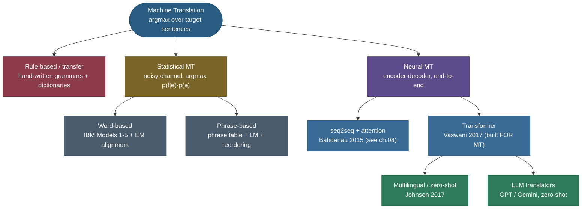

# Machine Translation: teaching a machine to say the same thing in another language — and how we *score* whether it did

Take the French sentence *"Le chat noir dort sur le canapé."* and ask for its English. You and I answer instantly — *"The black cat is sleeping on the couch"* — but pause on what we just did. We didn't substitute word-for-word: *"noir"* (black) jumped *in front of* *"chat"* (cat) because English puts adjectives before nouns; *"dort"* (sleeps) became the progressive *"is sleeping"* because that reads more naturally; *"le canapé"* became *"the couch,"* choosing one of several valid English words. We **re-expressed the meaning** under a completely different grammar, word order, and vocabulary, while keeping what the sentence *says* intact.

Now ask a harder question: *was that a good translation?* I just wrote *"The black cat sleeps on the couch"* a second ago — same meaning, different words. Which one is "right"? **Both.** And that single, innocent-looking fact — *there is no one correct translation* — turns out to be the hardest, most consequential problem in the entire field. **Machine translation (MT)** is the decades-long project of getting a computer to translate; **MT evaluation** is the deeper project of getting a computer to *measure* a translation when no single answer exists. This page covers both, but it leans hard on the second, because evaluation is where MT is genuinely subtle, where interviews go deep, and where every modern metric — BLEU, chrF, COMET — earns or loses its keep.

MT is also, without exaggeration, the single problem that dragged modern NLP into existence. Sequence-to-sequence learning, attention, beam search, subword tokenization, BLEU — every one of them was invented or popularized *to make translation work*. The Transformer itself, the architecture under every LLM you use, was introduced in a paper titled *Attention Is All You Need* whose headline result was **a translation score**.

I'll walk it the way I'd teach it to someone who needs to discuss it cold in an interview — feel the problem first, then the four eras (rule-based → statistical → neural → LLM) at a brisk pace, then slow *way* down on the two pieces of math that are genuinely MT-specific and genuinely derivable: **word alignment** (IBM Model 1) and **the BLEU metric** (built term by term, then verified to match the reference implementation in code). By the end you'll be able to:

- explain **why translation is a search**, not a lookup — an $\arg\max$ over an exponential space of target sentences;
- sketch how **IBM Model 1** learns word **alignments** as a latent variable via EM, the soft-alignment ancestor of attention;
- **derive BLEU from scratch** — modified n-gram precision $p_n$, the brevity penalty $\mathrm{BP}$, the geometric mean — and state precisely *why it under-credits good translations*;
- explain the modern metric ladder — **chrF, METEOR, COMET/BLEURT** — and what each one *sees* that BLEU misses;
- reason about **decoding for MT** (beam search + length normalization) and why MT wants the single best output, not a sample;
- argue why **back-translation** works, how **multilingual** training gives zero-shot pairs, and name the live failure modes (hallucinated fluency, mangled named entities/numbers, gender bias).

> **Note:** MT is the *canonical* sequence-to-sequence task — variable-length input, variable-length output, no fixed alignment between them. The encoder–decoder + attention machinery that powers it is derived in full in **[08 Sequence-to-Sequence & Encoder–Decoder](../08-Sequence-to-Sequence-and-Encoder-Decoder/08-Sequence-to-Sequence-and-Encoder-Decoder.md)** — this page does **not** re-derive it. Here we focus on what is *specific to translation*: alignment, decoding choices, data augmentation, and — above all — **evaluation**.

---

## The problem: translation is a search, not a substitution

The naive mental model — *"look each word up in a bilingual dictionary and string the results together"* — fails immediately, and seeing exactly *how* it fails tells you what every real MT system must handle.

- **One-to-many and many-to-one.** French *"dort"* is English *"sleeps"* / *"is sleeping"* / *"is asleep"* depending on context; English *"the"* covers French *"le / la / les / l'"*. There is no function from word to word.
- **Reordering.** French puts many adjectives *after* the noun (*"chat noir"* = *"cat black"*); English puts them before (*"black cat"*). German pushes the verb to the end of subordinate clauses. Japanese is subject-object-**verb**. Word order is *grammar*, and it differs per language pair.
- **Fertility.** One source word can become several target words (German *"Geschwindigkeitsbegrenzung"* → *"speed limit"*) or zero (articles and particles one language requires and another omits).
- **Ambiguity that only context resolves.** French *"avocat"* is both *"lawyer"* and *"avocado"*; English *"bank"* is a riverbank or a financial institution. The right translation depends on the whole sentence, sometimes the whole document.

Put together, translating a sentence of length $n$ is **a search over an astronomically large space of candidate target sentences** — every choice of words, in every order, of every length. You are not retrieving an answer; you are *constructing* the single best-scoring sentence under some model of "good translation." That reframing — **MT as $\arg\max$ over target sentences** — is the thread that runs through all four eras. They differ only in *how they score a candidate translation* and *how they search*.

$$\hat{e} \;=\; \arg\max_{e}\; \mathrm{score}(e \mid f)$$

where $f$ is the source ("foreign") sentence and $e$ is a candidate translation in the target language. Everything below is a different answer to *"what is `score`, and how do we find the maximizer?"*

> **Tip:** the notation $f$ (foreign) and $e$ (English) is a historical convention from the IBM statistical-MT papers, where the running example was French→English. It stuck. Even in neural papers you'll see $p(e\mid f)$ for "probability of the target given the source."



---

## The four eras at a glance

The whole history is a single trade being made, over and over: **push the linguistic knowledge out of human-written rules and into data + learned parameters.** Each era kept more fluency for less hand-engineering.


| Era | How it scores a translation | What a human had to build | Why it gave way |
|---|---|---|---|
| **Rule-based** (1950s–80s) | hand-written transfer rules + bilingual dictionaries | grammars, morphology, lexicons — per language **pair** | brittle, doesn't scale, every new pair is a project |
| **Statistical (SMT)** (1990–2014) | $p(f\mid e)\,p(e)$ learned from parallel corpora | feature engineering, alignment + phrase pipelines | many moving parts; fluency capped by n-gram LMs |
| **Neural (NMT)** (2014–2017) | one neural net $p(e\mid f)$, trained end-to-end | just the architecture + data | far more fluent; the Transformer made it dominant |
| **LLM translators** (2020+) | a general model, prompted to translate | a prompt | often matches dedicated NMT, zero-shot, style-controllable |

The next two sections give each era enough to be dangerous in an interview. Then the page slows down on the two genuinely MT-specific, genuinely derivable pieces — **alignment** and **evaluation**.

---

## Era 1–2: rules, then the noisy channel (the statistical idea in one pass)

**Rule-based MT** (the famous 1954 Georgetown–IBM demo) had a linguist encode the source grammar, a bilingual dictionary, and **transfer rules** mapping source structures to target ones (*"French [noun][adjective] → English [adjective][noun]"*). The clean framing is the **Vauquois triangle**: translate at the *direct* level (word substitution + local fixes), the *transfer* level (parse → transform → generate), or the aspirational *interlingua* level (parse to a language-neutral meaning, then generate any target). It works in narrow domains and gives total control, but every rule is hand-written, rules interact combinatorially, and **every new language pair starts from zero** — it scales with human effort, not data.

**Statistical MT** (IBM's Candide, Brown et al. 1990–1993) stopped writing rules and **learned translation probabilities from a large parallel corpus** (the Canadian Hansard, English↔French). Its formulation is a beautiful application of Bayes' rule and a very common interview question. We want the most probable translation $\hat e$ of the source $f$, so we apply Bayes and drop the term that doesn't depend on $e$:

$$\hat e \;=\; \arg\max_e\, p(e\mid f) \;=\; \arg\max_e\, \frac{p(f\mid e)\,p(e)}{p(f)} \;=\; \arg\max_e\; \underbrace{p(f\mid e)}_{\text{translation model}}\;\underbrace{p(e)}_{\text{language model}}$$

> **Source / derivation:** the noisy-channel decomposition for MT is **[Brown et al. 1993, *The Mathematics of Statistical Machine Translation*](https://aclanthology.org/J93-2003/)** (§1–2); the denominator $p(f)$ drops out of the $\arg\max$ because the source $f$ is fixed. A textbook walk-through is **[Koehn, *Statistical Machine Translation*](https://www.statmt.org/book/)** (Ch. 4).

This is the **noisy-channel** model: imagine the target sentence $e$ was the clean message, "corrupted" by a noisy channel into the foreign sentence $f$; translation *decodes* the original. Why this decomposition? Because it **splits the work into two easier models**:

- the **translation model** $p(f\mid e)$ captures **adequacy** (does $e$ have the right words to have produced $f$?), learned from parallel text, and can be sloppy about word order;
- the **language model** $p(e)$ captures **fluency** (is $e$ good target-language text?), an n-gram (later neural) [language model](../04-N-gram-Language-Models-and-Smoothing/04-N-gram-Language-Models-and-Smoothing.md) trained on **monolingual** target text — of which there is *vastly* more than parallel text.

> **Note:** that division of labor — **adequacy** from $p(f\mid e)$, **fluency** from $p(e)$ — is the conceptual ancestor of *everything* after it. Even today we say a translation failed on *adequacy* (wrong meaning) or *fluency* (awkward language), and this split is *why* those are the two axes. **Phrase-based SMT** (Koehn, Och & Marcu 2003) — which ran Google Translate for a decade — extended this to translate contiguous *phrases* as units, scored by a **log-linear** mix of phrase-translation probability, the LM, a reordering/distortion penalty, and length penalties, tuned against BLEU. It worked, but it was a fragile pipeline of separately-built components (aligner → phrase extractor → reordering model → LM → tuning), and its n-gram LM capped fluency — exactly what neural MT swept away with **one end-to-end model**.

---

## Word alignment: the latent variable at the heart of SMT (IBM Model 1, derived)

To estimate $p(f\mid e)$ you hit the central difficulty of word-based SMT: a parallel corpus gives you *sentence* pairs, but not **which source word came from which target word**. That hidden correspondence is the **alignment** $a$ — a latent variable. Model the translation probability by summing over all possible alignments:

$$p(f\mid e) \;=\; \sum_{a} p(f, a \mid e).$$

**IBM Model 1** makes the simplest assumptions that keep this tractable: every alignment is a priori equally likely (no position/distortion modeling), and each foreign word $f_j$ is generated independently from the one English word $e_{a_j}$ it aligns to, via a **word-translation table** $t(f_j \mid e_{a_j})$. For a source of length $m$, a target of length $l$ (plus a NULL token for unaligned words):

$$p(f\mid e) \;=\; \frac{\epsilon}{(l+1)^{m}} \prod_{j=1}^{m} \sum_{i=0}^{l} t(f_j \mid e_i).$$

> **Source / derivation:** IBM Model 1 and its EM training are **[Brown et al. 1993](https://aclanthology.org/J93-2003/)** (§4, the alignment models); the $\frac{\epsilon}{(l+1)^m}$ factor is the uniform alignment prior over the $(l+1)^m$ possible alignments. A modern derivation with the EM update is **[Koehn, *Statistical Machine Translation*](https://www.statmt.org/book/)** (Ch. 4) and **[Collins's lecture notes on IBM Model 1/2](http://www.cs.columbia.edu/~mcollins/courses/nlp2011/notes/ibm12.pdf)**.

We don't know $t(\cdot\mid\cdot)$, and we can't count alignments directly because they're hidden — the chicken-and-egg of latent-variable learning. The answer is **Expectation–Maximization (EM)**:

1. **Initialize** $t(f\mid e)$ uniformly.
2. **E-step.** With the current $t$, compute *soft* (fractional) alignment counts — how much "credit" the link $(e_i, f_j)$ gets: $\ \mathrm{count}(f_j, e_i) \mathrel{+}= \dfrac{t(f_j\mid e_i)}{\sum_{i'=0}^{l} t(f_j\mid e_{i'})}.$
3. **M-step.** Renormalize those expected counts into a new $t(f\mid e)$.
4. **Repeat** to convergence. Model 1's objective is **convex**, so EM reaches the global optimum regardless of initialization.

The intuition to *say out loud* in an interview is **"explaining away."** On the toy corpus `la maison ↔ the house` and `la fleur ↔ the flower`, `la` co-occurs with `the` in *both* sentences while `maison` co-occurs with `house` in only one — so iterated soft counts pile mass onto $t(\text{la}\mid\text{the})$, `the` gets "explained away" by `la`, and `maison` is left to concentrate on `house`. **Co-occurrence statistics alone, iterated, discover the word-to-word map — with no dictionary and no labels.** The from-scratch code below runs exactly this loop; here is its learned alignment matrix:

![A word-alignment matrix learned by IBM Model 1 with EM on three toy sentence pairs, for 'la maison fleur' / 'the house flower'. Each cell is the normalized alignment weight t(f|e); the bright diagonal — la→the (0.92), maison→house (1.00), fleur→flower (1.00) — was discovered purely from iterated co-occurrence counting, with no dictionary. On a real language pair this band would bend and cross wherever the languages reorder; modeling that crossing is what separates Model 1 from the distortion-aware later models, and what attention later learned by gradient descent.](../images/mt_alignment_matrix.png)

IBM Models 2–5 add what Model 1 ignores — **Model 2** a *distortion* model (alignments near the diagonal are likelier), **Models 3–4** *fertility* (how many foreign words one English word spawns) and richer distortion, **Model 5** fixes deficiency. You rarely need the details; know the *arc*: each model relaxes an over-simplification of the previous one.

> **Note — alignment is the bridge to attention.** The question Model 1 answers with EM — *"which source word does this target word come from?"* — is **exactly** the question **attention** answers with gradient descent. Attention (Bahdanau et al. 2015) lets the decoder, at each step, form a softmax-weighted average over all source positions — a *soft, differentiable alignment* learned jointly with translation instead of as a separate EM stage. So the heatmap above is the conceptual ancestor of the attention-weight heatmaps you'll see in **[08 Seq2Seq](../08-Sequence-to-Sequence-and-Encoder-Decoder/08-Sequence-to-Sequence-and-Encoder-Decoder.md)** and **[15 Attention Mechanism](../../05.%20Deep_Learning/concepts/15-Attention-Mechanism.md)**.

---

## Era 3: why neural MT crushed statistical MT (the short version)

Neural MT (NMT) throws out the pipeline. Instead of separately modeling $p(f\mid e)$, $p(e)$, alignment, and distortion, it trains **one network to directly model $p(e\mid f)$** — the thing the noisy channel went out of its way to *avoid* modeling directly, now learnable because neural nets are powerful enough to capture adequacy and fluency at once. The architecture is the **encoder–decoder (sequence-to-sequence)** model — an encoder reads the source into contextual representations; a decoder generates the target token by token, factorizing $p(e\mid f) = \prod_t p(e_t \mid e_{<t}, f)$, trained by **teacher forcing** with cross-entropy.

→ The full derivation — the encoder–decoder, the single-vector **information bottleneck**, and how **attention** removes it — is in **[08 Sequence-to-Sequence & Encoder–Decoder](../08-Sequence-to-Sequence-and-Encoder-Decoder/08-Sequence-to-Sequence-and-Encoder-Decoder.md)**. The **Transformer** that replaced the RNN entirely (Vaswani et al. 2017, introduced *for* translation) is in **[16 Transformer Architecture](../../05.%20Deep_Learning/concepts/16-Transformer-Architecture.md)**. This page does not re-derive them.

> **Source / derivation:** attention-for-MT is **[Bahdanau, Cho & Bengio 2015](https://arxiv.org/abs/1409.0473)**; the Transformer is **[Vaswani et al. 2017](https://arxiv.org/abs/1706.03762)**. Production-scale NMT and the WordPiece + length-normalized beam search recipe is **[Wu et al. 2016, GNMT](https://arxiv.org/abs/1609.08144)**.

The reason NMT won isn't subtle: where SMT pieced together locally-scored phrases, NMT models the *whole* output with full context, so it is dramatically **more fluent**. Google's GNMT (Wu et al. 2016) reported **~60%** fewer errors than their phrase-based system on several pairs; SMT's old failure mode — disfluent phrase salad — largely vanished.


### Two MT-specific ingredients (derived elsewhere, motivated here)

- **Subword vocabulary for MT.** A fixed word vocabulary can't cover open-ended, morphologically rich languages — proper nouns, compounds, inflections, and **out-of-vocabulary** words would all collapse to a useless `<unk>`. **Byte-Pair Encoding** (Sennrich et al. 2016) breaks rare words into reusable subword units, giving a **finite vocabulary that can spell anything** — and, crucially for multilingual MT, a *shared* vocabulary across languages. → **[02 Tokenization & Subword Algorithms](../02-Tokenization-and-Subword-Algorithms/02-Tokenization-and-Subword-Algorithms.md)**.
- **Beam search for MT decoding.** Translation is the $\arg\max_e$ search from the top of this page; greedy decoding (take the most likely token each step) is myopic. We derive the MT-specific decoding subtlety — **length normalization** — in its own section below. → **[17 Decoding Strategies](../17-Decoding-Strategies/17-Decoding-Strategies.md)**.

---

## Decoding for MT: beam search and the length-normalization trap

A decoder scores a candidate translation $e = (e_1,\dots,e_L)$ by its log-probability, the sum of per-token log-probs:

$$\log p(e\mid f) \;=\; \sum_{t=1}^{L} \log p(e_t \mid e_{<t}, f).$$

Every term is negative (a probability $<1$), so **a longer sequence accumulates more negative log-prob just by being longer.** Raw beam search therefore has a **built-in bias toward short outputs** — it will happily truncate a translation to stop paying the per-token cost. The fix MT uses is **length normalization**: divide the total log-prob by $L^\alpha$ before comparing beams, where $\alpha \in [0,1]$ (GNMT uses $\alpha \approx 0.6$):

$$\mathrm{score}(e) \;=\; \frac{1}{L^{\alpha}} \sum_{t=1}^{L} \log p(e_t \mid e_{<t}, f).$$

> **Source / derivation:** length-normalized beam search for NMT is **[Wu et al. 2016, GNMT](https://arxiv.org/abs/1609.08144)** (§7, Eq. 14 — the $lp(Y)=\frac{(5+|Y|)^\alpha}{(5+1)^\alpha}$ length penalty, of which $L^\alpha$ is the simplified form used here and in most teaching treatments). The bias it corrects is analyzed in **[Murray & Chiang 2018, *Correcting Length Bias in Neural Machine Translation*](https://aclanthology.org/W18-6322/)**.

The effect is concrete. Take two candidate decodings of *"Le chat noir dort sur le canapé"*: a 4-token **truncation** A = *"the black cat sleeps"* (drops *"on the couch"*) and the 7-token **full** B = *"the black cat sleeps on the couch."* B's three extra tokens are confident, so B's *per-token average* log-prob is **better** — but its *total* is worse, purely from length. Watch the winner flip as $\alpha$ grows:

![Beam length normalization, measured. Two candidates — a 4-token truncation A and the 7-token full translation B — scored as total log-prob divided by length^alpha. At alpha=0 (raw log-prob) the shorter A wins (-1.50 vs -1.77) purely because B accumulates more negative log-prob by being longer; at alpha=0.6 (the GNMT default) and alpha=1.0, B overtakes (-0.55 vs -0.65; -0.25 vs -0.38). 'A wins / B wins' labels mark each regime. Raw beam search truncates; length normalization recovers the full faithful output.](../images/mt_beam_length_norm.png)

> **Note:** this is *the* MT decoding gotcha. Without length normalization a beam search will under-translate — dropping clauses, ending early — and your BLEU will quietly suffer because the brevity penalty (next section) punishes short output. With $\alpha$ too high it over-translates and rambles. $\alpha \approx 0.6$ is the empirical sweet spot. MT is also the setting where beam search clearly beats sampling: you want the single **best faithful** translation, not a creative sample — the opposite of open-ended generation, where sampling (top-p, temperature) is preferred. See **[17 Decoding Strategies](../17-Decoding-Strategies/17-Decoding-Strategies.md)**.

---

## Evaluation: the heart of MT

Everything above produces a translation. Now the hard part: **scoring it.** You cannot tune, compare, or ship MT without a number — and scoring translation is genuinely difficult because **there is no single correct translation.** *"The black cat is sleeping"* and *"The black cat sleeps"* are both right; *"A black cat slumbers on the sofa"* is also right. A good metric must reward all of them, while still punishing *"The dog runs."* That tension is the whole game.

### BLEU, derived from scratch

**BLEU** (Bilingual Evaluation Understudy, Papineni et al. 2002) ran the field for 20 years, so we build it term by term. Its insight: a good translation should share many **n-grams** (contiguous word sequences) with a human reference — but you must (a) **clip** matches so repetition can't cheat, (b) combine several n-gram orders, and (c) **penalize short output** since precision alone rewards saying less.

> **Source / derivation:** every formula below is **[Papineni, Roukos, Ward & Zhu 2002, *BLEU: a Method for Automatic Evaluation of Machine Translation*](https://aclanthology.org/P02-1040/)** — modified precision (§2.1), the brevity penalty (§2.2), and the final geometric-mean combination (§2.3, Eq. 1–3). The standardized, tokenization-fixed implementation everyone should actually report is **[Post 2018, *A Call for Clarity in Reporting BLEU Scores* (sacreBLEU)](https://aclanthology.org/W18-6319/)**.

**Step 1 — modified ($n$-gram) precision $p_n$.** For each order $n$, count how many of the candidate's $n$-grams appear in the reference — but **clip** each $n$-gram's count to the maximum number of times it appears in *any single* reference, so a candidate can't score 7/7 on *"the the the the the the the"* against a reference with one *"the"*:

$$p_n \;=\; \frac{\displaystyle\sum_{g \in n\text{-grams}(\hat e)} \min\!\big(\mathrm{count}_{\hat e}(g),\ \max_r \mathrm{count}_r(g)\big)}{\displaystyle\sum_{g \in n\text{-grams}(\hat e)} \mathrm{count}_{\hat e}(g)}.$$

The numerator is **clipped matches**, the denominator is the candidate's total $n$-gram count. (For a corpus, you sum numerators and denominators across all sentences *before* dividing — micro-averaging.)

**Step 2 — the brevity penalty $\mathrm{BP}$.** Precision says nothing about *recall*: a system could emit only the two words it's sure of and score $p_n = 1$. BLEU's stand-in for recall is a multiplicative penalty on outputs **shorter** than the reference. With candidate length $c$ and (closest) reference length $r$:

$$\mathrm{BP} \;=\; \begin{cases} 1 & \text{if } c > r \\[2pt] e^{\,1 - r/c} & \text{if } c \le r \end{cases}.$$

It is $1$ when you're long enough (no reward for padding) and decays toward $0$ as you get shorter — exactly the asymmetry you want.

**Step 3 — combine into BLEU.** Take the **geometric** mean of $p_1,\dots,p_N$ (usually $N=4$, equal weights $w_n = 1/N$) and multiply by $\mathrm{BP}$:

$$\boxed{\;\mathrm{BLEU} \;=\; \mathrm{BP} \cdot \exp\!\Big(\sum_{n=1}^{N} w_n \log p_n\Big)\;}$$

The **geometric** mean (not arithmetic) is deliberate: it is harsh — *if any single $p_n$ is zero, the whole score is zero*. A translation with great unigram overlap but no matching 4-grams (fluent words, wrong order) is correctly punished. That same harshness is also BLEU's most notorious flaw on short texts, which is why sentence-level BLEU needs smoothing and corpus-level BLEU is the honest unit.

Here is BLEU assembled from these three parts on a worked example, **measured by the from-scratch code below and verified to match sacreBLEU**:

![Anatomy of a BLEU score, measured. Left: the four clipped n-gram precisions p_1..p_4 for the candidate 'the the the black cat sat on the mat happily today' vs its reference — 9/11=81.8%, 7/10=70.0%, 5/9=55.6%, 4/8=50.0%; the three repeated 'the's are clipped to the reference's single 'the', which is why p_1 is 9/11 not higher. Right: the geometric mean of the precisions (63.2) times the brevity penalty (BP=1.00, since the candidate is as long as the reference) equals the final BLEU of 63.2. The figure's numbers come from the same function the page cites and match sacreBLEU.](../images/mt_bleu_breakdown.png)

### The well-known flaws of BLEU

BLEU's strengths — cheap, language-agnostic, fast — come with flaws you must be able to name:

- **It penalizes valid paraphrases.** This is the big one. A *perfect* translation worded differently from the reference shares few word n-grams and scores near zero. We measure exactly this below.
- **It's a surface metric.** It sees word forms, not meaning. *"sleeps"* and *"is sleeping"* are unrelated to BLEU; *"big"* and *"large"* are unrelated; word order beyond 4-grams is invisible.
- **It's not comparable across tokenizations or language pairs.** Two papers' raw BLEU numbers are meaningless to compare unless they used identical references *and* tokenization — which is the entire reason **sacreBLEU** exists (it fixes the tokenization and emits a version signature).
- **It correlates with humans only in aggregate.** A single sentence's BLEU is noise; a corpus average over hundreds of sentences is meaningful. As systems approach human quality, even the aggregate correlation weakens — which pushed the field to learned metrics.

Here is the paraphrase flaw, measured — a meaning-preserving rewrite scores **zero** BLEU:

![BLEU vs chrF on a valid paraphrase, measured. Against the reference 'the committee will convene on tuesday to discuss the budget', an exact match scores BLEU 100 / chrF 100, but the perfectly valid paraphrase 'the panel meets tuesday to talk about the finances' scores BLEU 0.0 (it shares almost no word n-grams) while chrF — which works on character n-grams — still credits 26.9. The annotation marks that a perfect translation can score zero BLEU. This is the single most important fact about MT evaluation and the reason the field moved past word-level overlap.](../images/mt_bleu_brittleness.png)

### The modern metric ladder: chrF, METEOR, COMET, BLEURT

Each successor sees *more* than raw word overlap, at the cost of more machinery:

- **chrF** (Popović 2015) — BLEU's idea over **character** n-grams instead of word n-grams, scored as an F-measure ($\beta=2$, recall weighted twice as heavily as precision). Because *"sleeps"* and *"sleeping"* share most of their *characters*, chrF gives partial credit for morphological near-misses and is far kinder to morphologically rich languages. It needs no training and usually correlates with humans better than BLEU — the best cheap default.

  > **Source / derivation:** the character-n-gram F-score is **[Popović 2015, *chrF: character n-gram F-score for automatic MT evaluation*](https://aclanthology.org/W15-3049/)**; the implementation to report is sacreBLEU's chrF (**[Post 2018](https://aclanthology.org/W18-6319/)**). The from-scratch chrF below matches sacreBLEU exactly.

- **METEOR** (Banerjee & Lavie 2005) — aligns candidate and reference allowing **stem, synonym, and paraphrase** matches (via WordNet), then scores an F-measure with a fragmentation penalty for word-order differences. More meaning-aware than BLEU/chrF, but language-resource-dependent.

- **COMET** (Rei et al. 2020) and **BLEURT** (Sellam et al. 2020) — **learned, neural** metrics. They encode the source, the candidate, and the reference with a pretrained multilingual model and **predict a human quality score**. Because they work in **embedding space**, they credit meaning-preserving paraphrases that surface metrics miss — and they are now the field standard for serious evaluation.

  > **Source / derivation:** **[Rei, Stewart, Farinha & Lavie 2020, *COMET: A Neural Framework for MT Evaluation*](https://aclanthology.org/2020.emnlp-main.213/)** and **[Sellam, Das & Parikh 2020, *BLEURT: Learning Robust Metrics for Text Generation*](https://aclanthology.org/2020.acl-main.704/)**.

- **Human evaluation** — still the gold standard. Adequacy/fluency ratings, MQM error annotation, or direct A/B preference. Expensive and slow, but the ground truth every automatic metric approximates.

![The MT-metric spectrum, illustrative. Four metrics laid left (surface overlap) to right (meaning-aware): BLEU (word n-gram overlap + brevity penalty), chrF (character n-gram F-score), METEOR (stems + synonyms + alignment), and COMET/BLEURT (learned, embedding-space). Moving right credits more valid variation — synonyms, morphology, paraphrase — at the cost of more machinery and, for the learned metrics, a trained model. The arrow is the field's trajectory away from surface overlap toward learned meaning.](../images/mt_metric_landscape.png)

> **Gotcha — the interview-grade summary of MT evaluation.** (1) **Report sacreBLEU + chrF for tracking** (cheap, reproducible) and **COMET for meaning-aware quality**; never compare raw BLEU across papers. (2) BLEU is meaningful **in aggregate**, never on a single sentence. (3) The deepest point: as MT approached human quality, surface metrics stopped distinguishing good systems — they all share n-grams with the reference — so the field *had* to move to learned, meaning-aware metrics. Saying *why* the field moved (paraphrase-blindness + ceiling effects), not just naming COMET, is what separates a real answer.

---

## A measured NMT translation, scored

Tying it together: the code below loads **`Helsinki-NLP/opus-mt-fr-en`** (a small public Transformer NMT model from OPUS-MT), translates three French sentences with beam search, and scores each against a human reference. The model produced (measured live, beam size 5):

| French source | NMT output | Human reference | chrF |
|---|---|---|---|
| Le chat noir dort sur le canapé. | The black cat sleeps on the couch. | The black cat is sleeping on the couch. | 67.7 |
| J'aime apprendre les langues étrangères. | I like to learn foreign languages. | I love learning foreign languages. | 65.1 |
| La traduction automatique a beaucoup progressé. | Machine translation has progressed a lot. | Machine translation has progressed a lot. | 100.0 |

Corpus scores over the three sentences: **BLEU 59.0, chrF 79.0** (measured with sacreBLEU).

![Measured output of the opus-mt-fr-en Transformer NMT model on three French sentences, each bar showing the chrF of the model's translation against a human reference (sentence 1: 67.7, sentence 2: 65.1, sentence 3: 100.0; corpus BLEU 59.0 / chrF 79.0). Sentence 3 is an exact paraphrase of the reference; sentences 1 and 2 are faithful and fluent but worded slightly differently ('sleeps' vs 'is sleeping', 'like to learn' vs 'love learning'), which costs surface-overlap points even though the meaning is correct — the BLEU brittleness from the previous figure, now on a real model.](../images/mt_nmt_measured.png)

Read sentence 1 closely: *"The black cat sleeps on the couch"* is a **perfect** translation of *"dort,"* but the reference writer chose *"is sleeping,"* so the surface metric docks points for a **valid paraphrase** — the exact flaw the previous figure isolated, now on a real system. Note too that the model did the **reordering** automatically (*"chat noir"* → *"black cat,"* not *"cat black"*): structure SMT modeled with hand-tuned distortion components is now just learned weights.

---

## Making data and sharing models: back-translation & multilingual MT

Two MT-specific data ideas that are still load-bearing inside today's systems:

**Back-translation** (Sennrich, Haddow & Birch 2016). Parallel data is scarce; **monolingual** target text is unlimited. Train a *reverse* (target→source) model on whatever real parallel data you have, run your monolingual target sentences backward through it to get **synthetic source** sentences, then train your forward model on real + synthetic pairs. Why it works: the **target side of every synthetic pair is a real, fluent, human sentence** — exactly what the decoder needs to learn fluency — while the synthetic source only has to be *good enough* to condition on. It imports the abundant cheap resource (monolingual text) into the expensive supervised objective, and the **lift is largest exactly where you need it — at low resource.**

> **Source / derivation:** **[Sennrich, Haddow & Birch 2016, *Improving Neural Machine Translation Models with Monolingual Data*](https://arxiv.org/abs/1511.06709)** (the back-translation method and its low-resource gains). Fully **unsupervised** NMT pushes it to *no* parallel data via shared embeddings + denoising + iterative back-translation: **[Lample et al. 2018](https://arxiv.org/abs/1711.00043)**.


**Multilingual & zero-shot NMT** (Johnson et al. 2017). Train **one** model on many language pairs with **one shared subword vocabulary**, and just **prepend a target-language token** (`<2en>`, `<2de>`) to the source. Two things fall out: an **emergent interlingua-like representation** (the encoder must serve many sources, the decoder many targets, so meaning lands in a language-agnostic space — the rule-based *interlingua* dream, achieved by joint training), and **zero-shot translation** (train English↔French and English↔German, and the model can translate French↔German — a pair it never saw). It also gives **positive transfer** to low-resource languages, which piggyback on the shared space. mBART, M2M-100, and Meta's **NLLB** (200 languages) are the modern descendants.

> **Source / derivation:** **[Johnson et al. 2017, *Google's Multilingual Neural Machine Translation System: Enabling Zero-Shot Translation*](https://arxiv.org/abs/1611.04558)**; the massively-multilingual frontier is **[NLLB Team 2022](https://arxiv.org/abs/2207.04672)**.

---

## Era 4: the LLM-as-translator

The newest twist: you often don't need a *dedicated* translation model at all. A general **large language model** (GPT-4, Gemini, Claude, Llama), trained on a multilingual web corpus, translates **zero-shot** from a prompt, and for high-resource pairs frequently **matches or beats** purpose-built NMT — especially on document-level coherence and idiom — because it brings vast world knowledge and long context. What it uniquely adds is **prompt controllability**: register, tone, British vs American spelling, a glossary, *"keep code blocks untouched"* — all without retraining. Trade-offs: LLMs are **larger and costlier**, can be **less reliable for low-resource languages** (less of them in pretraining), and **hallucinate** like NMT — sometimes more creatively. The practical landscape is a **mix**: compact dedicated NMT (OPUS-MT, NLLB) for cheap/fast/on-device/low-resource; LLMs for quality, context, and style control.

> **Tip:** the bridge to remember — an **encoder–decoder NMT model and a decoder-only LLM solve the same $p(e\mid f)$ factorization**: generate the target autoregressively, conditioned on the source. The LLM just folds "the source" into its prompt instead of a dedicated encoder. MT didn't get replaced by LLMs; it got **absorbed** into them — fitting, since MT is the task that built the architecture LLMs are made of.

---

## Where it's used, and the live challenges

**Used:** everywhere cross-lingual text moves — Google/DeepL/Bing translation, subtitle and document localization, multilingual customer support, cross-lingual search and retrieval, and as a *component* (back-translation for data augmentation, multilingual pretraining). The architecture MT created — encoder–decoder + attention, then the Transformer — is the architecture under every LLM.

Even the best systems still wrestle with these — naming them sharply separates a surface answer from a real one:

- **Hallucinated fluency** — the most insidious NMT failure: under domain shift or noisy input, the model emits **perfectly fluent target text that is unfaithful or invented**. SMT's errors looked broken (disfluent); NMT's look *plausible*, which makes them harder to catch. Fluency is no longer the bottleneck; **faithfulness** is.
- **Named entities and numbers** — names, dates, currencies, units should pass through **exactly**, but NMT can "translate" a name or drop a digit. A *fluent* wrong number is dangerous precisely because it looks confident.
- **Gender and social bias** — translating from a gender-neutral language into a gendered one forces a choice the source didn't make, and models default to **stereotypes** (*"the doctor"* → masculine, *"the nurse"* → feminine). A documented fairness problem.
- **Idioms** — *"it's raining cats and dogs"* must become the target's *equivalent* idiom, never a literal calque.
- **Document-level context** — pronouns/gender, lexical consistency, and formality (*"du"* vs *"Sie"*) often depend on the whole document, not one sentence — a place where long-context LLMs have a structural edge over sentence-level NMT.
- **Low-resource languages** — for most of the world's ~7,000 languages there is little or no parallel data; multilingual transfer, back-translation, and unsupervised methods help, but quality lags far behind high-resource pairs. The central equity problem in MT (the explicit target of NLLB).

---

## In production: a practitioner's playbook

If you have to *ship* translation tomorrow, this is the decision sequence — and it ties every concept above to a concrete choice:

1. **High-resource pair (EN↔FR/ES/DE) with budget?** Reach for an **LLM** (control formality/glossary/style in the prompt) or a strong dedicated model (NLLB, a fine-tuned Transformer). Quality is already excellent; your effort goes into *prompt/glossary engineering and evaluation*, not modeling.
2. **Cheap, fast, or on-device?** Use a **compact dedicated NMT model** (OPUS-MT is tiny and runs on CPU, as the code below proves). You trade some quality for latency, cost, and offline operation.
3. **Low-resource pair?** This is where the SMT-era tricks earn their keep: gather **monolingual** target text and run **back-translation**; lean on **multilingual transfer** (fine-tune NLLB/M2M-100 so your language piggybacks on related high-resource ones); fall back to **unsupervised NMT** if you have no parallel data at all.
4. **Domain-specific (legal/medical/product)?** Fine-tune a strong general model on **in-domain parallel data** and supply a **glossary/terminology constraint** so critical terms and named entities are translated *consistently and exactly* — where rule-based guarantees still matter.
5. **Always: evaluate before you trust it.** Hold out a real test set with human references. Report **sacreBLEU + chrF for tracking**, **COMET for meaning-aware quality**, and **spot-check with humans** for the failure modes automatic metrics miss (hallucinated fluency, gender bias, mangled numbers). **Never ship on a single BLEU number.**

> **Tip:** the meta-lesson — **the "old" SMT-era ideas didn't disappear; they became data-augmentation and transfer techniques** layered on top of neural models. Back-translation, multilingual sharing, and the adequacy/fluency split are alive and load-bearing inside today's systems; you just reach for them through a neural model instead of a phrase table.

---

## Code: BLEU from scratch (matched to sacreBLEU), IBM Model 1, and a real NMT model

The companion module runs four things, all deterministic and seeded: (1) **BLEU built from scratch** — modified n-gram precision, brevity penalty, geometric mean — **verified to match sacreBLEU and nltk to ~13 significant digits**; (2) the **BLEU-brittleness** demo (a valid paraphrase scores 0) plus **chrF from scratch** (also matched to sacreBLEU); (3) **IBM Model 1 EM** learning word alignments from a tiny corpus; (4) **beam length normalization** flipping a truncation to the full output. An optional block runs the real `opus-mt-fr-en` model and scores it. The core math is pure-numpy and runs anywhere.

> **Runnable module and a step-by-step notebook:** the verified code lives as a clean script and an executed teaching notebook next to this page — see the [step-by-step teaching notebook](code/12-Machine-Translation.ipynb) and the [single source-of-truth module](code/machine_translation.py) (run it with `python machine_translation.py`). The figures above are regenerated by [make_figures_12.py](code/make_figures_12.py), which imports the **same** functions, so the prose, the notebook, and every figure cannot drift apart.

```python
"""Machine Translation evaluation core, from scratch (excerpt — full module in code/).
Verified on Python 3.12 / numpy 2.4.6, CPU. BLEU matches sacreBLEU (tokenize='none') and nltk."""
import math
from collections import Counter, defaultdict


def ngram_counts(tokens, n):
    return Counter(tuple(tokens[i:i + n]) for i in range(len(tokens) - n + 1))


def modified_precision(cand, refs, n):
    """Clipped n-gram precision: a candidate n-gram is credited at most as often as it
    appears in any single reference — so repeating one good word can't inflate the score."""
    cand_ng = ngram_counts(cand, n)
    if not cand_ng:
        return 0, 0
    max_ref = Counter()
    for ref in refs:                                   # clip ceiling = max count across refs
        for g, c in ngram_counts(ref, n).items():
            max_ref[g] = max(max_ref[g], c)
    clipped = sum(min(c, max_ref[g]) for g, c in cand_ng.items())
    return clipped, sum(cand_ng.values())


def brevity_penalty(c, r):                             # BLEU's stand-in for recall
    if c == 0:
        return 0.0
    return 1.0 if c > r else math.exp(1.0 - r / c)     # punish SHORT output, never reward long


def corpus_bleu(cands, refs_list, max_n=4):
    """BLEU = BP * exp(sum_n (1/N) log p_n), micro-averaged over the corpus."""
    clipped = [0] * max_n
    total = [0] * max_n
    c_len = r_len = 0
    for cand, refs in zip(cands, refs_list):
        c = cand.split()
        rs = [r.split() for r in refs]
        c_len += len(c)
        r_len += min((len(r) for r in rs), key=lambda rl: (abs(rl - len(c)), rl))  # closest ref
        for n in range(1, max_n + 1):
            cl, tot = modified_precision(c, rs, n)
            clipped[n - 1] += cl
            total[n - 1] += tot
    prec = [(clipped[i] / total[i]) if total[i] else 0.0 for i in range(max_n)]
    geo = math.exp(sum(math.log(p) for p in prec) / max_n) if min(prec) > 0 else 0.0  # 0 if any p_n=0
    return brevity_penalty(c_len, r_len) * geo * 100, [p * 100 for p in prec]


# IBM Model 1: learn t(f|e) by EM — no dictionary, just iterated co-occurrence counts.
def ibm_model1(corpus, n_iter=20):
    fr = {w for f, _ in corpus for w in f.split()}
    en = {w for _, e in corpus for w in e.split()}
    t = {f: {e: 1.0 / len(en) for e in en} for f in fr}         # uniform init
    for _ in range(n_iter):
        count = defaultdict(lambda: defaultdict(float)); total = defaultdict(float)
        for fs_, es_ in corpus:
            fs, es = fs_.split(), es_.split()
            for f in fs:                                         # E-step: soft alignment credit
                denom = sum(t[f][e] for e in es)
                for e in es:
                    c = t[f][e] / denom
                    count[f][e] += c; total[e] += c
        for f in fr:                                             # M-step: renormalize
            for e in en:
                if total[e] > 0:
                    t[f][e] = count[f][e] / total[e]
    return t
```

Verified output (BLEU/chrF match sacreBLEU and nltk; EM and length-norm are deterministic):

```
1. BLEU, derived (matches sacreBLEU tokenize='none' and nltk)
  p_1 =  9/11 =  81.8%   (clipped 1-gram precision)
  p_2 =  7/10 =  70.0%
  p_3 =  5/ 9 =  55.6%
  p_4 =  4/ 8 =  50.0%
  brevity penalty BP = 1.0000  (cand_len=11, ref_len=11)
  BLEU = BP * geo_mean * 100 = 63.155524        # == sacreBLEU 63.155524, nltk 63.155524

2. BLEU brittleness — a correct paraphrase scores ~0
  exact match       : BLEU=100.00   chrF=100.00
  valid paraphrase  : BLEU=  0.00   chrF= 26.88   # perfect meaning, zero BLEU; chrF still credits it

3. IBM Model 1 — word alignment by EM (no dictionary)
  fleur    -> flower    (p=0.96)
  la       -> the       (p=0.99)
  maison   -> house     (p=0.96)

4. Beam length normalization — short truncation vs full faithful output
   alpha |    A (4 tok) |    B (7 tok) | winner
     0.0 |       -1.500 |       -1.770 | A (short, truncated)
     0.6 |       -0.653 |       -0.551 | B (full, faithful)
     1.0 |       -0.375 |       -0.253 | B (full, faithful)

5. A real neural MT model (opus-mt-fr-en, beam 5)
   -> The black cat sleeps on the couch.   chrF=67.7
   -> I like to learn foreign languages.    chrF=65.1
   -> Machine translation has progressed a lot.   chrF=100.0
  corpus BLEU = 59.0   corpus chrF = 79.0
```

> **Note:** the load-bearing line is `BLEU = ... = 63.155524 == sacreBLEU 63.155524 == nltk 63.155524`. The from-scratch BLEU isn't an approximation — on whitespace-tokenized input it reproduces the reference implementations to floating-point precision, so you can *trust the derivation*. The notebook asserts this match before printing anything.

> **Try it:** before running, **predict** — in the brittleness demo, the paraphrase scores **BLEU 0** but **chrF 26.9**. Why does chrF survive where BLEU dies? (Hint: BLEU needs matching *word* 4-grams, and the paraphrase shares none; chrF needs matching *character* n-grams, and *"tuesday"* / *"committee"* / *"the"* share many characters with the reference even when whole words differ. Now change `max_n` in `corpus_bleu` from 4 to 2 and watch the paraphrase's BLEU climb off the floor — fewer, shorter n-grams are easier to match, which is also why short-text BLEU needs smoothing.)

---

## Recap and rapid-fire

**If you remember nothing else:** translation is a **search for the best-scoring target sentence**, $\hat e = \arg\max_e \mathrm{score}(e\mid f)$, and MT's history is the history of *what `score` is* — hand **rules**, the **noisy-channel** $p(f\mid e)\,p(e)$ (adequacy × fluency, with **word alignment** as a latent variable learned by **EM**), **end-to-end neural** $p(e\mid f)$ (the Transformer, built *for* translation), now a **prompt to an LLM**. But the deepest, most MT-specific problem is **evaluation**: because there's no single correct translation, **BLEU** (clipped n-gram precision × brevity penalty, geometric mean) under-credits valid paraphrases, which is why the field climbed the ladder to **chrF → METEOR → COMET/BLEURT**. Decoding uses **length-normalized beam search**; **back-translation** manufactures data from monolingual text; **multilingual** training yields zero-shot pairs.

**Quick-fire — say these out loud:**

- *Why is translation a search, not a lookup?* No word→word function (reordering, fertility, ambiguity); you *construct* the best-scoring target over an exponential space.
- *State the noisy-channel model and why two models.* $\hat e = \arg\max_e p(f\mid e)\,p(e)$; $p(f\mid e)$ = adequacy (parallel data), $p(e)$ = fluency (abundant monolingual). $p(f)$ drops out — $f$ is fixed.
- *What does IBM Model 1 learn, and how?* Word-translation probs $t(f\mid e)$ and **alignments** (latent), via **EM** over soft co-occurrence counts — convex, global optimum. Ancestor of attention.
- *Derive BLEU.* $\mathrm{BLEU} = \mathrm{BP}\cdot\exp(\sum_n w_n \log p_n)$: clipped n-gram precision $p_n$, brevity penalty $\mathrm{BP}=\min(1, e^{1-r/c})$, geometric mean (zero if any $p_n=0$).
- *Why is BLEU misleading?* Surface n-gram overlap → penalizes valid paraphrases; meaningful only in aggregate; not comparable without fixed tokenization (**sacreBLEU**). Use **COMET** for meaning-aware quality.
- *What does chrF fix?* Character n-grams → partial credit for morphological near-misses; kinder to rich morphology; no training; usually beats BLEU on human correlation.
- *What's the beam-search MT gotcha?* Raw log-prob favors **short** output; **length normalization** ($/L^\alpha$, $\alpha\approx0.6$) recovers the full faithful translation.
- *Why does back-translation work?* Turns abundant **monolingual target** text into synthetic pairs with **real, fluent target sides** — biggest lift at low resource.
- *Most dangerous NMT failure?* **Hallucinated fluency** — fluent target text that is unfaithful/invented; looks confident, so it needs meaning-aware evaluation to catch.

---

## References and further reading

The curated link library for this topic — start-here path, videos, courses, articles, papers, books, and internal cross-links — lives in a companion file so it can be reused as a standalone reference list:

**→ [Machine Translation — references and further reading](12-Machine-Translation.references.md)**
