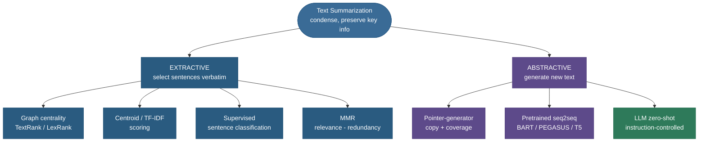
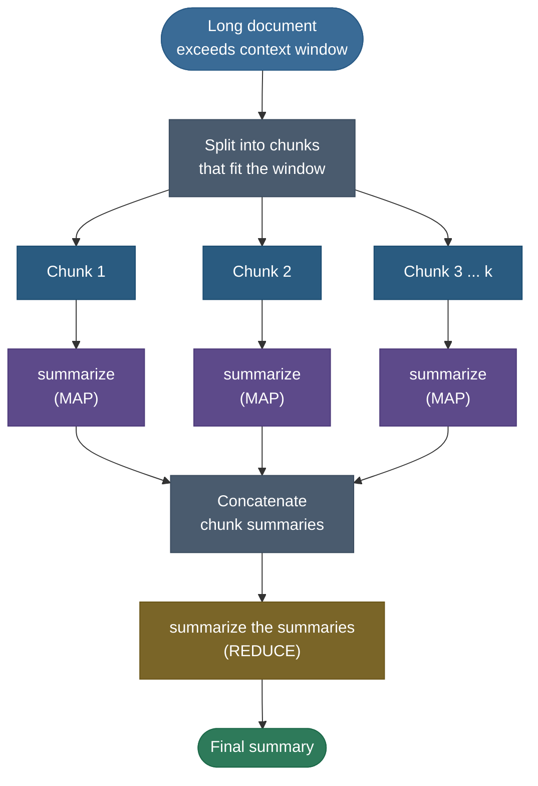

# Text Summarization: keep the signal, drop the rest

Hand a human a ten-page incident report and ask "what happened?" and they don't read you the report — they read you a *paragraph*. They scan, decide what's load-bearing, throw away the boilerplate, and either quote the few sentences that matter or, more often, **write a new sentence that fuses three of them.** That single human act — *condense a document into a shorter text that preserves the key information* — is the whole task of **automatic text summarization**, and the two ways the human did it (quote-the-best vs. write-something-new) are the field's two great paradigms: **extractive** and **abstractive**.

I'm going to teach this the way I'd actually walk a teammate through it before they shipped a summarizer to production — starting from *why the problem is hard even to define*, then the two paradigms, then **every method that matters in each** (derived, not just named), then the pretraining era and the LLM era, then the two walls that break naive systems (**long documents** and **hallucination**), and finally **how you actually measure** a summary — which turns out to be the subtlest part of all. By the end you'll be able to:

- state the problem precisely — **compression ratio**, and the three-way tension between **informativeness, fluency, and faithfulness**;
- **derive TextRank/LexRank** from scratch — build a sentence-similarity graph, run PageRank on it, and read off the most central sentences (we do it *by hand* on a real document);
- explain **MMR** and why every good extractive system trades **relevance against redundancy**;
- explain the **pointer-generator** network — the soft copy/generate switch $p_{gen}$ — and *why* it solves the out-of-vocabulary and repetition failures of naive seq2seq (with **coverage**);
- explain what **BART**, **PEGASUS**, and **T5** pretrain, and why **gap-sentence generation** is summarization-shaped;
- summarize a **long** document that doesn't fit the context window (chunk → map-reduce → refine), and a **multi-document** or **query-focused** set;
- compute **ROUGE** by hand, know exactly what it does and doesn't measure, and reach for **faithfulness** metrics (FactCC / QAGS / SummaC) when the model **hallucinates**.

> **Note:** summarization is the cleanest task in NLP for *probing a candidate's whole mental model* — it touches seq2seq, attention, copy mechanisms, decoding, pretraining objectives, and evaluation in one question. That's why it shows up in interviews far above its "everyday use" weight: a good answer to "how would you build and evaluate a summarizer?" reveals whether you understand the entire generation stack.

---

## The problem: what "summarize" actually demands

Strip away the models and the problem is: given a source $D$ (one document, or a *set* of documents), produce a much shorter text $S$ that **preserves the important information** in $D$. Three knobs make this concrete, and they pull against each other.

**1. Compression ratio.** The summary is meant to be *short*. Define the **compression ratio**

$$\rho \;=\; \frac{\text{length}(S)}{\text{length}(D)},$$

usually in tokens or sentences. A news headline is $\rho \approx 0.02$; an abstract of a paper $\rho \approx 0.05$; a "TL;DR" of an email thread maybe $\rho \approx 0.2$. The target $\rho$ is a **design choice**, not a model property — and the lower you push it, the more aggressively the system must decide what to *drop*. This is why "length control" is a first-class requirement (more below).

> **Source / derivation:** the compression ratio (and the informativeness/fluency/faithfulness framing below) follows the textbook treatment in [Jurafsky & Martin, *Speech and Language Processing*, 3rd ed.](https://web.stanford.edu/~jurafsky/slp3/) and the survey [Nenkova & McKeown, *Automatic Summarization* (2011)](https://www.cis.upenn.edu/~nenkova/1500000015-Nenkova.pdf).

**2. Informativeness vs. fluency vs. faithfulness.** A good summary must be:

- ***informative*** — it covers the *salient* content of $D$ (the right facts, not trivia);
- ***fluent*** — it reads as coherent, grammatical text, not a bag of clipped fragments;
- ***faithful*** — every claim in $S$ is *actually supported by* $D$ (no invented facts).

> **Gotcha:** these three are in genuine tension, and the two paradigms sit at opposite corners of it. **Extractive** summaries are *faithful by construction* (every word came from the source) but often *disfluent* (stitched-together sentences read jumpily) and can't *compress within* a sentence. **Abstractive** summaries are fluent and can fuse/compress freely — but they can **hallucinate**, trading faithfulness for fluency. Almost every design decision in this field is a move on this triangle.

**3. Single- vs. multi-document, generic vs. query-focused.** Summarize *one* document, or *fuse a set* (a cluster of news articles about one event)? Produce a *generic* summary, or one *focused on a user's query* ("summarize this contract's **termination clauses**")? These are different tasks with different methods — we cover both near the end.

> **Note:** "important information" is not objectively defined — it depends on the reader and the purpose. That irreducible subjectivity is *why* summarization is hard to evaluate (no single gold answer) and why reference-based metrics like ROUGE are necessary but blunt. Hold that thought; it returns when we measure.

---

## The two paradigms

Everything in summarization is a choice between, or a blend of, two strategies:

- ***Extractive*** — **SELECT** the most salient sentences or spans from $D$ and concatenate them *verbatim*. The summary is a literal subset of the source.
- ***Abstractive*** — **GENERATE** new text that conveys the source's meaning, free to *paraphrase, fuse, and compress*. The summary may contain words and phrasings that never appear in $D$.


The mental model for the whole field:



> **Tip:** in an interview, lead with the *trade-off*, not a definition. "Extractive is faithful but jumpy and can't compress within a sentence; abstractive is fluent and compressive but can hallucinate." That one sentence shows you understand *why* both exist and why modern systems often **blend** them (extract-then-rewrite).

We'll take extractive first — it's older, fully interpretable, and you can compute it on a napkin — then abstractive, where the modern action is.

---

## Extractive method 1: graph centrality (TextRank & LexRank)

The most elegant extractive idea borrows directly from how Google ranks web pages. **Mihalcea & Tarau's TextRank** (2004) and **Erkan & Radev's LexRank** (2004), discovered independently the same year, share one insight: **a sentence is important if it is *similar to many other important sentences*.** That's a recursive definition — exactly the kind **PageRank** was built to solve.

**The construction, step by step:**

1. **Nodes.** Split $D$ into sentences $s_1, \dots, s_n$; each becomes a node in a graph $G$.
2. **Edges.** Connect every pair $(s_i, s_j)$ with a weight $w_{ij}$ = their **similarity**. TextRank uses a content-overlap measure; LexRank uses **cosine similarity of TF-IDF vectors** (the version we'll compute). Cosine of TF-IDF means: represent each sentence as a vector of term frequencies reweighted by how rare each term is across the document (IDF — see [03 Bag-of-Words & TF-IDF](../03-Bag-of-Words-and-TF-IDF/03-Bag-of-Words-and-TF-IDF.md)), then measure the angle between vectors — two sentences sharing rare, content-bearing words score high; two sharing only common words score low.
3. **Score by PageRank.** Run the PageRank recursion until the scores converge:

$$\text{PR}(s_i) \;=\; \frac{1-d}{n} \;+\; d \sum_{j \,:\, w_{ji} > 0} \frac{w_{ji}}{\sum_{k} w_{jk}}\, \text{PR}(s_j),$$

where $d \approx 0.85$ is the **damping factor** (the probability the "random surfer" follows an edge rather than teleporting to a random node). Each sentence's score is a weighted vote from its neighbors, normalized by how many votes each neighbor casts.

> **Source / derivation:** the sentence-graph recurrence is [Mihalcea & Tarau, *TextRank: Bringing Order into Texts* (EMNLP 2004), Eq. 6](https://aclanthology.org/W04-3252/) (its weighted-graph generalization of PageRank), built directly on the original [Page, Brin, Motwani & Winograd, *The PageRank Citation Ranking* (Stanford 1999)](http://ilpubs.stanford.edu:8090/422/) random-surfer model; the TF-IDF-cosine edge variant is [Erkan & Radev, *LexRank* (JAIR 2004)](https://arxiv.org/abs/1109.2128).

4. **Select.** Sort sentences by PR score and take the top-$k$ (for your target $\rho$), usually **emitting them in original document order** so the summary reads in sequence.

**Why the recursion converges (the fixed point).** Stack the scores into a vector $\mathbf{p}$ and the row-normalized similarity weights into a matrix $M$ (where $M_{ij} = w_{ij}/\sum_k w_{ik}$). The recursion is then a linear map

$$\mathbf{p} \;\leftarrow\; \tfrac{1-d}{n}\mathbf{1} \;+\; d\,M^\top \mathbf{p}.$$

Because $M$ is row-stochastic and the damping term mixes in a uniform "teleport," this map is a **contraction** with a unique fixed point — the same Perron–Frobenius / power-iteration argument behind web PageRank. So iterating from any starting vector converges to the stationary scores, which is what our from-scratch `pagerank_power_iteration` (and `nx.pagerank`) returns. The damping $d=0.85$ both *guarantees* the contraction (no dangling-node traps) and keeps the ranking from being dominated by a single tight cluster.

> **Source / derivation:** the contraction-map / power-iteration convergence argument is the Perron–Frobenius analysis in [Page et al. 1999, §2.1–2.4](http://ilpubs.stanford.edu:8090/422/); we verify our numpy power iteration against `networkx.pagerank` on the identical graph (max abs diff ≈ 4.7e-7) in the notebook.


> **Note:** the stationary scores have a clean reading: $\text{PR}(s_i)$ is the long-run probability that a "random reader" — who hops from sentence to sentence proportional to similarity, occasionally teleporting to a random sentence — is *currently* on sentence $s_i$. The sentences you visit most are the most central, hence the most summary-worthy.

> **Note:** the beauty here is that it's **fully unsupervised** — no labels, no training. You can run TextRank on a document in a language you've never built a dataset for. That's why it's still a strong, dependency-light baseline (and the default behind many "summarize" buttons).

### Worked example 1 — TextRank by hand on a 5-sentence document

Take this tiny document (two on-topic clusters plus one distractor):

- **S1:** *Solar power capacity grew sharply across Europe last year.*
- **S2:** *Solar energy installations expanded rapidly throughout Europe in 2024.*
- **S3:** *Engineers warn the aging power grid struggles to absorb the new supply.*
- **S4:** *Grid operators say the network cannot easily handle the added solar load.*
- **S5:** *A local bakery announced a new sourdough recipe on Tuesday.*

By eye: S1≈S2 (both "solar grew in Europe"), S3≈S4 (both "grid can't cope"), and S5 is unrelated to everything. Now we compute it properly. Building TF-IDF vectors (English stop-words removed), taking pairwise cosine similarities as edge weights, and running weighted PageRank ($d=0.85$) to convergence yields these centrality scores (**these are measured by the from-scratch code, not hand-waved**):

| Sentence | PageRank centrality |
|---|---|
| **S1** Solar power capacity grew sharply… | **0.280** |
| **S3** Engineers warn the aging grid… | **0.238** |
| S2 Solar installations expanded rapidly… | 0.203 |
| S4 Grid operators say the network… | 0.181 |
| S5 A local bakery announced… | 0.098 |


Read the result. **The top-2 are S1 (0.280) and S3 (0.238)** — exactly the right pick: one sentence about the *solar growth* theme and one about the *grid strain* theme, giving a balanced 2-sentence summary "Solar power grew sharply in Europe… the aging grid struggles to absorb the new supply." Notice three things the algorithm got right *for free*:

1. **It demoted the distractor.** S5 (the bakery) scores **0.098** — less than half the leaders — because it shares almost no content words with anything; its only edge is tiny (0.09). PageRank's "important = connected to important" recursion *automatically* filters off-topic sentences.
2. **It avoided redundancy at the *cluster* level by accident, not by design.** S1 beats its near-twin S2 narrowly (0.280 vs 0.203) — TextRank prefers the *more central phrasing* of a cluster. But note it does **not** stop you from picking *both* S1 and S2 if you asked for top-3; raw centrality has no redundancy penalty. That gap is exactly what **MMR** fixes (next section).
3. **Cross-cluster bridges matter.** S1 and S3 each score highest in part because they link *across* the two themes (the S1↔S3 edge), making them the natural "spine" of the document.

> **Gotcha:** TextRank ranks by centrality *only*, so on a document with one dominant theme it will happily pick **three paraphrases of the same point** and miss a secondary theme entirely. Pure centrality optimizes *coverage of the densest cluster*, not *coverage of the document*. Always pair it with a redundancy control if your documents have multiple topics.

---

## Extractive method 2: centroid / TF-IDF scoring

A lighter cousin of graph ranking. Build the **centroid** of the document — the average TF-IDF vector over all sentences (or the vector of the document's top-IDF terms) — and score each sentence by its **cosine similarity to that centroid**. Sentences that look "most like the document as a whole" rank highest. It's $O(n)$ instead of PageRank's iterative cost, needs no graph, and is a fine baseline; it just lacks the recursive "important-because-connected-to-important" signal that makes TextRank robust to outliers.

> **Tip:** centroid scoring and TextRank agree on easy documents and diverge on hard ones (multiple themes, outliers). If you want the cheapest possible extractive baseline, use centroid; if you want robustness for free, use TextRank. Both are in `sumy`/`gensim`-style libraries in a few lines.

---

## Extractive method 3: supervised sentence classification

If you *have* labeled data — documents paired with human "which sentences belong in the summary" annotations — extraction becomes a **binary classification** (or sequence-labeling) problem: for each sentence, predict **in-summary / not**. Features can be hand-crafted (position in document, sentence length, presence of title words, named-entity density, TF-IDF centrality) or learned. The modern version is **BERTSUM** (Liu & Lapata, 2019): feed the document through BERT with a `[CLS]` token *before every sentence*, and put a classifier head on each `[CLS]` to score "include this sentence." Because BERT gives each sentence a *contextual* representation (it has read the whole document — see [06 Contextual Embeddings (ELMo, BERT)](../06-Contextual-Embeddings-ELMo-BERT/06-Contextual-Embeddings-ELMo-BERT.md)), the classifier captures discourse signals that bag-of-words scoring misses.

> **Note:** "lead bias" is the elephant in the extractive room. In news, the first 1–3 sentences are *so often* the best summary that a "**Lead-3**" baseline (just take the first three sentences) is shockingly hard to beat on CNN/DailyMail. A supervised model that merely learns "pick sentence 1" can look strong on news yet fail on documents (scientific papers, meetings) where salience isn't front-loaded. **Always report the Lead-3 baseline** so you know whether your model learned *salience* or just *position*.

---

## Extractive method 4: Maximal Marginal Relevance (MMR)

Centrality tells you what's *relevant*; it says nothing about whether you're *repeating yourself*. **Maximal Marginal Relevance** (Carbonell & Goldstein, 1998) fixes that by selecting sentences **greedily**, each time picking the one that maximizes a relevance−redundancy trade-off:

$$\text{MMR} \;=\; \arg\max_{s_i \in R \setminus S}\; \Big[\, \lambda \cdot \text{Rel}(s_i, D) \;-\; (1-\lambda)\cdot \max_{s_j \in S}\, \text{Sim}(s_i, s_j) \,\Big].$$

> **Source / derivation:** the MMR objective is [Carbonell & Goldstein, *The Use of MMR, Diversity-Based Reranking* (SIGIR 1998), Eq. 1](https://www.cs.cmu.edu/~jgc/publication/The_Use_MMR_Diversity_Based_LTMIR_1998.pdf) — the original relevance-minus-redundancy reranking criterion.

Read it term by term. $R$ is the pool of candidate sentences, $S$ the set already selected. $\text{Rel}(s_i, D)$ is how relevant $s_i$ is to the document/query (e.g. centroid or TextRank score). $\max_{s_j \in S}\text{Sim}(s_i, s_j)$ is $s_i$'s similarity to the *most similar already-chosen* sentence — its **redundancy**. The hyperparameter $\lambda \in [0,1]$ slides between the two: $\lambda = 1$ is pure relevance (ignore redundancy — you may pick three paraphrases), $\lambda = 0$ is pure diversity (ignore relevance — you spread out but may pick junk). In practice $\lambda \approx 0.7$ — mostly relevance, with a redundancy penalty so the second sentence you pick isn't a restatement of the first.

> **Tip:** MMR is the right lens on the **S1-vs-S2 problem** from Worked example 1. Centrality alone would let you pick both near-twins; MMR, after selecting S1, *subtracts* S2's high similarity to S1 from S2's score, so the *next* pick is pushed toward a **different** theme (S3) — giving you broader coverage. MMR is the standard way to convert any relevance score into a non-redundant *set*. It's also the workhorse of query-focused and multi-document summarization, where redundancy across documents is the central problem.

---

## From extractive to abstractive: why we need to generate

Extraction has a ceiling. It can never produce *"Solar surged but the grid can't keep up"* if no single source sentence says that — it can only hand you the two source sentences side by side. It can't drop a clause it doesn't need, can't merge two facts into one phrase, can't smooth the seams. To get *human-like* summaries that fuse and compress, you must **generate** — and that means **sequence-to-sequence** models. (The seq2seq encoder–decoder + attention machinery is the engine here; we treat it as a prerequisite and point to its dedicated page rather than re-deriving it — see [08 Sequence-to-Sequence & Encoder–Decoder](../08-Sequence-to-Sequence-and-Encoder-Decoder/08-Sequence-to-Sequence-and-Encoder-Decoder.md) and [16 Transformer Architecture](../../05.%20Deep_Learning/concepts/16-Transformer-Architecture.md).)

The first abstractive summarizers were exactly this: an RNN encoder reads the source, an RNN decoder with **attention** writes the summary token by token (Rush et al. 2015; Nallapati et al. 2016). They worked — and immediately exposed two failures that *defined the next several years of research*.

> **Gotcha:** naive seq2seq summarizers fail in two characteristic, *named* ways: (1) **OOV / factual errors** — they can't reproduce a rare name or number that isn't in their fixed output vocabulary, so they emit `<UNK>` or a wrong word; and (2) **repetition** — they get stuck re-attending to the same source region and repeat phrases ("the the the", or a whole clause twice). The pointer-generator + coverage, next, is the targeted cure for *exactly* these two.

---

## Abstractive method 1: the pointer-generator network

**See, Liu & Manning's pointer-generator** (2017) — *"Get To The Point"* — is the single most instructive abstractive architecture to understand, because each piece is a direct fix for a named failure.

**The core idea: a soft switch between generating and copying.** At each decode step $t$ the model computes two distributions over words and **blends** them:

- $P_{\text{vocab}}(w)$ — the usual softmax over the fixed output vocabulary (what a vanilla seq2seq decoder produces). This is **generation**: paraphrase, function words, learned phrasing.
- the **attention distribution** $a_t^i$ over *source positions* — which the model is already computing to form its context vector. Reinterpreted as a distribution over **words in the source**, this is a **copy** distribution: "point at source token $i$ and copy it."

A scalar **generation probability** $p_{gen} \in [0,1]$ decides how much weight each gets, computed from the decoder state $s_t$, the attention context $h_t^*$, and the current input $x_t$:

$$p_{gen} \;=\; \sigma\!\big(w_{h}^\top h_t^* + w_s^\top s_t + w_x^\top x_t + b\big).$$

The **final distribution** over the *extended* vocabulary (fixed vocab ∪ all source words) is the mixture:

$$P(w) \;=\; p_{gen}\,P_{\text{vocab}}(w) \;+\; (1 - p_{gen})\!\!\sum_{i \,:\, w_i = w}\! a_t^i.$$

> **Source / derivation:** the gate and the final mixture are [See, Liu & Manning, *Get To The Point: Summarization with Pointer-Generator Networks* (ACL 2017), Eqs. 8–9](https://arxiv.org/abs/1704.04368); the copy distribution reuses the attention of [Bahdanau, Cho & Bengio (2015)](https://arxiv.org/abs/1409.0473), and the pointer idea is [Vinyals, Fortunato & Jaitly, *Pointer Networks* (2015)](https://arxiv.org/abs/1506.03134).

![The pointer-generator soft switch. The decoder state feeds (a) a vocabulary distribution P_vocab for generating a new word, (b) the attention distribution over the source = the copy distribution, and (c) the gate p_gen = sigmoid of a learned function of the decoder state, context, and input. The final P(w) mixes them: p_gen times P_vocab plus (1-p_gen) times the summed copy attention. p_gen near 1 generates a paraphrase; p_gen near 0 copies a source word, which solves out-of-vocabulary names and numbers.](../images/sum_pointer_generator.png)

**Why this is exactly the OOV cure.** If a rare named entity — say "**Tsiolkovsky**" — appears in the source but *not* in the fixed vocabulary, $P_{\text{vocab}}$ literally **cannot** produce it (it has no slot for it). But the attention distribution *can* point at that source position, so the copy term carries it into $P(w)$ verbatim. The model learns to drive $p_{gen} \to 0$ for rare names, dates, and numbers (copy them) and $p_{gen} \to 1$ for connective, paraphrasing words (generate them). **OOV solved, not by a bigger vocabulary, but by pointing.**

### Worked example 2 — the $p_{gen}$ switch, numerically

Suppose at decode step $t$ the model is about to emit a token, and:

- $P_{\text{vocab}}$ puts mass $0.50$ on the word **"and"**, $0.10$ on **"power"**, and tiny mass elsewhere; it has **no entry** for the rare source word **"Tsiolkovsky"**.
- The attention $a_t$ over the source puts $0.80$ on the position holding **"Tsiolkovsky"** and $0.20$ spread over common words.
- The gate computes $p_{gen} = 0.30$ (the model "wants to copy" here).

Then the final probabilities are:

$$P(\text{"Tsiolkovsky"}) = 0.30 \times \underbrace{0}_{\text{not in vocab}} + (1-0.30)\times \underbrace{0.80}_{\text{copy attn}} = \mathbf{0.56},$$

$$P(\text{"and"}) = 0.30 \times 0.50 + 0.70 \times \underbrace{0}_{\text{"and" not in source}} = \mathbf{0.15}.$$

So even though "and" was the *vocab* favorite, the blended distribution emits **"Tsiolkovsky"** ($0.56 > 0.15$) — the copy mechanism rescues a word the generator could never have produced. Flip $p_{gen}$ to $0.9$ and the arithmetic reverses ($P(\text{"and"}) = 0.45$ vs $P(\text{"Tsiolkovsky"}) = 0.08$), and the model paraphrases instead. **That one scalar is the entire extractive-vs-abstractive dial, learned per token.** Both columns below are computed by `pointer_generator_mix` in the code:


**Why we also need coverage.** Copying fixes OOV but not *repetition*. The model can keep attending to the same source region and re-emit the same phrase. See et al.'s **coverage mechanism** maintains a running **coverage vector** $c_t = \sum_{t'<t} a_{t'}$ — the total attention each source position has received so far — and adds a **coverage loss** that penalizes attending to already-covered positions:

$$\text{covloss}_t \;=\; \sum_i \min\big(a_t^i,\; c_t^i\big).$$

> **Source / derivation:** the coverage vector and the $\min$-based coverage loss are [See, Liu & Manning (2017), Eqs. 10–12](https://arxiv.org/abs/1704.04368), adapting the coverage idea of [Tu et al., *Modeling Coverage for Neural Machine Translation* (2016)](https://arxiv.org/abs/1601.04811) from MT to summarization.

The $\min$ penalizes *overlap* between the current attention $a_t^i$ and the accumulated coverage $c_t^i$: if position $i$ has already been heavily attended ($c_t^i$ large) and you attend to it again ($a_t^i$ large), the $\min$ is large and you pay for it. The model learns to **spread attention across the source**, dramatically reducing repetition. The coverage vector is also fed *into* the attention computation, so the model can *see* what it has already covered while deciding where to look next.


> **Note:** the pointer-generator is the conceptual bridge between the two paradigms made *differentiable*: copying *is* extraction, generating *is* abstraction, and $p_{gen}$ blends them per token. Every later "extract-then-rewrite" or "constrained-copy" system is a descendant of this idea. Even modern LLMs, with no explicit copy gate, learn the *behavior* — they copy rare names verbatim and paraphrase the connective tissue, because that's what the data rewards.

---

## Abstractive method 2: pretrained seq2seq (BART, PEGASUS, T5)

The pointer-generator was trained from scratch per dataset. The leap that made abstractive summarization *good* was the same leap that transformed all of NLP: **pretrain a big Transformer seq2seq on a self-supervised objective, then fine-tune** on summarization. Three models matter.

**BART** (Lewis et al. 2020) — a **denoising autoencoder**. Corrupt a document (mask spans, delete tokens, permute sentences, rotate the document) and train an encoder–decoder to **reconstruct the original**. Because it learns to map *corrupted, scrambled* text back to *clean, ordered* text, BART is an excellent starting point for any text-to-text generation — and it became *the* default summarization backbone (`bart-large-cnn`, and the distilled `distilbart-cnn` we use in the demo).

> **Source / derivation:** the denoising-autoencoder objective is [Lewis et al., *BART* (ACL 2020), §2](https://arxiv.org/abs/1910.13461).

**PEGASUS** (Zhang et al. 2020) — the clever one, because its **pretraining objective is summarization-shaped**. The idea is **Gap-Sentence Generation (GSG)**: from a document, *remove* the most "important" whole sentences (selected by their ROUGE overlap with the rest of the document — i.e. the sentences a summary would likely contain), concatenate them as a pseudo-summary target, and train the model to **generate those removed sentences from the remaining document**. Deriving why this works: GSG makes the pretraining task a *miniature summarization task* — "given a document with its key sentences blanked out, reconstruct them" is exactly "given a document, produce its salient content." So when you fine-tune PEGASUS on real summaries, it's already been doing the right *shape* of task for millions of documents. The payoff: PEGASUS reaches strong ROUGE with **very few** fine-tuning examples (it's remarkably few-shot), which is the whole point of designing the objective to match the downstream task.

> **Source / derivation:** Gap-Sentence Generation and the ROUGE-based "principal sentence" selection are [Zhang, Zhao, Saleh & Liu, *PEGASUS: Pre-training with Extracted Gap-sentences* (ICML 2020), §3.1](https://arxiv.org/abs/1912.08777).

**T5** (Raffel et al. 2020) — the **text-to-text** unifier. *Every* NLP task is cast as "text in → text out," with a task prefix. For summarization you literally prepend **`"summarize: "`** to the document and the model emits the summary. T5's pretraining is span-corruption (mask random spans, generate them), and its contribution to summarization is less a special objective than a demonstration that **one model, one format** handles summarization alongside translation, QA, and classification — the conceptual ancestor of instruction-tuned LLMs.

> **Source / derivation:** the text-to-text framing and span-corruption objective are [Raffel et al., *Exploring the Limits of Transfer Learning with T5* (JMLR 2020), §2.4 and §3.1.4](https://arxiv.org/abs/1910.10683).

> **Tip:** picking a backbone in practice — **BART/distilBART** for a strong, cheap, fine-tunable general summarizer; **PEGASUS** when you have *little* labeled data (its objective gives it a head start); **T5/Flan-T5** when you want one model across many tasks or you like the prompt-prefix format. All three are encoder–decoders, which (unlike decoder-only LLMs) keep the source fully bidirectionally encoded — a real advantage for faithfulness on a fixed input.

---

## Abstractive method 3: the LLM era

A modern decoder-only LLM (GPT-4-class, Llama, Claude) summarizes with **no fine-tuning at all** — you just *ask*. This changes the task in three ways:

1. **Zero-shot / instruction-controlled.** "Summarize the following in three bullet points, focusing on financial risk, in a neutral tone." The LLM controls **length, style, format, and focus** from the instruction — capabilities that previously needed task-specific models or decoding tricks. Summarization becomes a *prompt*, not a *pipeline*.
2. **In-context learning.** Give two or three example (document, summary) pairs in the prompt and the LLM matches their style and granularity — few-shot control without gradient updates.
3. **Faithfulness improves but doesn't vanish.** Large instruction-tuned models hallucinate *less* than the old seq2seq summarizers (they're better grounded and RLHF-tuned to be honest), but they **still invent** plausible-sounding facts, especially on long or technical inputs. The hallucination problem *changes shape* — it gets subtler and harder to catch — it does not go away. (See the faithfulness section.)

> **Note:** the *decoding strategy* matters as much as the model. Summarization wants **faithful, focused** output, so it leans on **beam search** (or low-temperature / greedy) rather than the high-temperature sampling used for creative text — you want the *most likely faithful* summary, not a diverse one. This is the direct tie-in to [17 Decoding Strategies](../17-Decoding-Strategies/17-Decoding-Strategies.md): the same model summarizes very differently under beam search vs. nucleus sampling. Length penalties and `no_repeat_ngram` constraints in beam search are the modern descendants of the coverage mechanism.

> **Gotcha:** "just use an LLM" is not a free lunch. LLMs are *expensive per token* (a problem when you summarize millions of documents), *opaque* (hard to know *why* a fact appeared), and **context-window-bounded** — which is exactly the wall the next section is about. A cheap extractive pass is often the right *pre-filter* before an LLM, or the right answer outright when faithfulness must be guaranteed.

---

## The long-document wall: chunk, map-reduce, refine

Every abstractive model has a maximum input length — BART/PEGASUS ~1,024 tokens, and even long-context LLMs **degrade** ("lost in the middle") well before their ceiling. A 50-page report, a book, an hour-long meeting transcript simply does not fit. Three families of solutions:

**1. Long-context / sparse-attention models.** Architectures like **Longformer** (and its encoder-decoder **LED**) and **BigBird** replace full $O(n^2)$ attention with **sparse** patterns (local windows + a few global tokens), pushing the input limit to 8K–16K tokens at tractable cost. You feed more of the document directly. (This is the summarization-side application of the long-context methods covered for LLMs.)

**2. Map-reduce (hierarchical) summarization.** When the document still doesn't fit, **split it into chunks, summarize each chunk (MAP), concatenate the chunk summaries, and summarize *that* (REDUCE)** — recursing if the concatenation is still too long:



**3. Refine (iterative) chains.** Instead of map-reduce, walk the chunks *sequentially*: summarize chunk 1, then for each subsequent chunk ask the model to *refine* the running summary with the new chunk's content. This preserves narrative order (good for stories, depositions) but is **serial** (slow) and risks **drift** (early details fade). Map-reduce parallelizes and is order-robust; refine preserves sequence. Pick by document type.

> **Gotcha:** map-reduce has a real failure mode: **cross-chunk information is lost**. A fact stated in chunk 1 and resolved in chunk 7 may be summarized away in *both* chunk summaries, so the final summary never connects them. And the REDUCE step can over-compress (a summary of summaries of summaries loses nuance). Overlapping chunks (slide the window) and carrying a "running context" into each MAP call mitigate this, but long-document summarization remains genuinely hard — it's an active research area, not a solved one.

---

## Query-focused and multi-document summarization

**Query-focused summarization** answers "summarize $D$ **with respect to query $q$**" — a contract's *termination clauses*, a paper's *limitations*. The clean recipe: **retrieve-then-summarize** — first score/retrieve the passages most relevant to $q$ (the same machinery as [16 Information Retrieval & Semantic Search](../16-Information-Retrieval-and-Semantic-Search/16-Information-Retrieval-and-Semantic-Search.md): TF-IDF/BM25 or dense embeddings), then summarize *only* those. This is literally the summarization half of **RAG** — retrieve relevant context, generate a grounded answer.

**Multi-document summarization** fuses a *set* of documents (a cluster of news stories about one event) into one summary. The defining new problem is **redundancy across documents** — the same fact appears in all ten articles — which is exactly what **MMR** was built for: relevance pulls in the important facts, the redundancy penalty stops you from including the same fact ten times. Multi-document work also wrestles with **contradiction** (sources disagree) and **temporal ordering** (which report is newest), problems single-document summarization never faces.

> **Tip:** query-focused summarization is the conceptual core of **retrieval-augmented generation (RAG)** and of LLM "chat with your documents" features: retrieve the relevant spans for the user's question, then summarize/answer over *only* those spans. If you understand query-focused summarization, you already understand the generation half of RAG.

---

## The datasets that shaped the field

You can't read the literature — or interpret a ROUGE number — without knowing the **benchmark** it was measured on, because each dataset has a *personality* that rewards different methods. The big four:

- **CNN/DailyMail** — news articles paired with their bullet-point highlights. The most-used benchmark, and the one where **Lead-3 is brutally strong** (news front-loads salience). Summaries are *highly extractive* in style, so it flatters extractive and copy-heavy models. If a paper reports only CNN/DM, ask how it does where lead bias *isn't* present.
- **XSum** — BBC articles paired with a *single-sentence*, **highly abstractive** summary (the article's one-line subhead). It deliberately punishes copying: the reference rarely reuses source phrasing, so you *must* paraphrase and compress. XSum is where **hallucination shows up most**, precisely because the task forces abstraction — it became the standard testbed for faithfulness research.
- **PubMed / arXiv** — *long* scientific papers paired with their abstracts. The benchmark for **long-document** methods (the input blows past 1,024 tokens), where salience is *not* front-loaded (the key result is in the middle) — so Lead-3 fails and map-reduce / long-context models earn their keep.
- **SAMSum / DialogSum** — chat and dialogue summarization, where the input is a *conversation* (turns, speakers, informal language) and the summary is a third-person recap — a different beast again (coreference and speaker attribution dominate).

> **Note:** the single most useful thing to know about benchmarks: **a method's apparent quality is dataset-dependent**. A copy-heavy model "wins" on CNN/DM and "loses" on XSum *for the same reason* — XSum forbids the copying CNN/DM rewards. When someone quotes a ROUGE number, the *dataset* is half the information. This is also why Worked example 4's extractive-beats-abstractive result is regime-specific, not a universal truth.

---

## Evaluation 1: ROUGE — what it measures, and what it misses

You can't improve what you can't measure, and summarization measurement is genuinely subtle (there's no single correct summary). The standard automatic metric is **ROUGE** — *Recall-Oriented Understudy for Gisting Evaluation* (Lin, 2004) — which compares a generated summary to one or more **reference** (human) summaries by **n-gram overlap**. (ROUGE is defined in full on the dedicated [18 NLP Evaluation Metrics](../18-NLP-Evaluation-Metrics/18-NLP-Evaluation-Metrics.md) page; here we derive just enough to use it.)

- **ROUGE-N** — overlap of **n-grams**. ROUGE-1 = unigram overlap (did you cover the right *words*?); ROUGE-2 = bigram overlap (did you get *short phrases* right — a proxy for fluency/ordering). Recall-flavored:

$$\text{ROUGE-N}_{\text{recall}} \;=\; \frac{\sum_{\text{n-grams} \in \text{ref}} \text{count}_{\text{match}}(\text{n-gram})}{\sum_{\text{n-grams} \in \text{ref}} \text{count}(\text{n-gram})}.$$

> **Source / derivation:** the ROUGE-N recall formula is [Lin, *ROUGE: A Package for Automatic Evaluation of Summaries* (ACL Workshop 2004), §2 Eq. 1](https://aclanthology.org/W04-1013/); we verify our from-scratch ROUGE-1/2/L against Google's `rouge-score` (matched to 0.0 with Porter stemming) in the notebook.

In words: of all the n-grams in the *reference*, what fraction also appear in the *candidate*? (Modern reporting uses the **F1** — the harmonic mean of this recall and the analogous precision — to also penalize over-long summaries that pad to boost recall.)

- **ROUGE-L** — longest common subsequence (LCS) between candidate and reference, rewarding in-order overlap *without* requiring contiguity — a softer, order-aware measure than ROUGE-2. With $\text{LCS}(C,R)$ the subsequence length, $\text{R}_{\text{lcs}} = \text{LCS}/|R|$, $\text{P}_{\text{lcs}} = \text{LCS}/|C|$, and the F-measure their (β-weighted) harmonic mean:

$$\text{ROUGE-L}_{F} \;=\; \frac{(1+\beta^2)\,\text{R}_{\text{lcs}}\,\text{P}_{\text{lcs}}}{\text{R}_{\text{lcs}} + \beta^2\,\text{P}_{\text{lcs}}}.$$

> **Source / derivation:** the LCS-based precision/recall/F-measure is [Lin (2004), §3 Eqs. 2–4](https://aclanthology.org/W04-1013/); `rouge-score`'s `rougeL` uses $\beta=1$ (the plain harmonic mean) for single-sentence summaries, which our `rouge_l` reproduces exactly.

### Worked example 3 — ROUGE by hand

Reference $R$: *"the cat sat on the mat"* (6 unigrams; bigrams: *the-cat, cat-sat, sat-on, on-the, the-mat* → 5).
Candidate $C$: *"the cat sat on a mat"*.

**ROUGE-1 recall** — reference unigrams covered by the candidate: *the, cat, sat, on, mat* are present (*the* appears twice in the reference and matches twice). Matched reference unigrams = 5 of 6 → **ROUGE-1 recall = 5/6 ≈ 0.83**.

**ROUGE-2 recall** — reference bigrams present in the candidate: *the-cat* ✓, *cat-sat* ✓, *sat-on* ✓, *on-the* ✗ (candidate has *on-a*), *the-mat* ✗ (candidate has *a-mat*). 3 of 5 → **ROUGE-2 recall = 3/5 = 0.60**.

**ROUGE-L** — the LCS is *"the cat sat on … mat"* (length 5) → recall 5/6, precision 5/6 → **F1 ≈ 0.83**. The single word swap (*the*→*a*) barely dents ROUGE-1/L but **drops** ROUGE-2 to 0.60, because it breaks two bigrams — which is exactly why ROUGE-2 is the more sensitive fluency/ordering signal. All nine numbers below are computed by our from-scratch `rouge_all` (verified == `rouge-score`):


### Worked example 4 — measured extractive vs. abstractive ROUGE

Now a real, *measured* comparison on the solar/grid document. We take the **extractive** summary = TextRank's top-2 (S1 + S3, from Worked example 1), and an **abstractive** summary from a real model (`distilbart-cnn-12-6`, beam search), and score both against the reference *"Solar power grew fast in Europe but the grid struggles to absorb it."* (computed with our `rouge_all`, stemming on — and verified equal to `rouge-score`):

| | ROUGE-1 | ROUGE-2 | ROUGE-L |
|---|---|---|---|
| **Extractive** (TextRank top-2) | **0.53** | **0.25** | **0.53** |
| **Abstractive** (distilbart-cnn) | 0.39 | 0.14 | 0.22 |


The **extractive summary scores higher** here (0.53 vs 0.39 on ROUGE-1) — and that's a *teaching* result, not a bug. Two lessons fall out of it:

1. **ROUGE rewards lexical overlap, not meaning.** The extractive summary copies source words that happen to overlap the reference's vocabulary; the abstractive summary *paraphrases* (and the small distilbart over-includes the grid detail and reorders), so its words match the reference less even when its *meaning* is comparable. A genuinely good abstractive summary can score *lower* ROUGE than a clunky extractive one — which is ROUGE's central blind spot.
2. **Small documents and small models flatter extraction.** On the full CNN/DailyMail benchmark, fine-tuned BART/PEGASUS beat extractive baselines on ROUGE; our tiny single-doc demo is the opposite regime. The number depends heavily on the document, the reference, and the model — *always report which*.

To see the blind spot in its purest form, score a faithful **paraphrase** that reuses *none* of the reference's words against a wordy **copy** that reuses its vocabulary:


> **Gotcha — ROUGE's four big blind spots.** (1) **No semantics**: paraphrases score zero overlap even when meaning is identical (*"car"* vs *"automobile"*; or the 0.00-scoring paraphrase above). (2) **No faithfulness**: a fluent *hallucination* that happens to share words with the reference can score *high* — ROUGE cannot tell truth from invention. (3) **Reference-bound**: it measures similarity to *one human's* summary, not quality; a different-but-valid summary is punished. (4) **Gameable**: you can inflate ROUGE-1 by stuffing high-frequency reference words. Treat ROUGE as a *cheap regression signal*, never as ground-truth quality — and *never* report it without a faithfulness check and, ideally, a human eval.

> **Tip:** complementary automatic metrics patch some gaps: **BERTScore** ([Zhang et al. 2020](https://arxiv.org/abs/1904.09675)) uses contextual embeddings so paraphrases match (semantic, not lexical), and **METEOR** adds stemming/synonym matching. But *none* of these — ROUGE, BERTScore, METEOR — measure **faithfulness**, the failure that actually hurts in production. For that you need the next section's metrics.

> **Source / derivation:** BERTScore's token-level cosine matching between contextual embeddings (its recall/precision/F1) is [Zhang, Kishore, Wu, Weinberger & Artzi, *BERTScore: Evaluating Text Generation with BERT* (ICLR 2020), §3](https://arxiv.org/abs/1904.09675).

---

## Evaluation 2: faithfulness, because abstractive models hallucinate

Here's the failure that gets a summarizer pulled from production: **the summary states something the document does not** — a wrong number, an invented cause, a misattributed quote. Maynez et al. (2020) showed that abstractive models hallucinate *a lot* (a large fraction of generated summaries contain unsupported content), and crucially that **ROUGE does not catch it** — a hallucination that shares words with the reference can score *well*. So faithfulness needs its **own** metrics:

- **FactCC** (Kryściński et al. 2020) — a trained classifier that, given a (source, summary-sentence) pair, predicts **consistent / inconsistent**. Learns to spot the typical corruptions (swapped entities, negation, wrong numbers).
- **QAGS** (Wang et al. 2020) — **question-answering-based**: generate questions from the *summary*, answer them against the *summary* and against the *source*; if the answers disagree, the summary is unfaithful. The intuition: a faithful summary should yield the same answers as the source it claims to summarize.
- **SummaC** (Laban et al. 2022) — uses **natural-language inference**: check, sentence by sentence, whether the source **entails** each summary sentence. If a summary sentence isn't entailed by *any* source sentence, flag it. Robust and simple.

> **Source / derivation:** the hallucination measurement that motivates all three is [Maynez, Narayan, Bohnet & McDonald, *On Faithfulness and Factuality in Abstractive Summarization* (ACL 2020)](https://arxiv.org/abs/2005.00661); the metrics are [FactCC](https://arxiv.org/abs/1910.12840), [QAGS](https://arxiv.org/abs/2004.04228), and [SummaC](https://arxiv.org/abs/2111.09525) respectively (all in the references).

> **Note:** the deeper distinction is **intrinsic vs. extrinsic** hallucination. *Intrinsic* = the summary **contradicts** the source (source says "sales fell," summary says "sales rose"). *Extrinsic* = the summary adds information **not in** the source (it may even be true-in-the-world, but it's unsupported *by this document*). Both are faithfulness failures; extrinsic ones are nastier because they're often *fluent and plausible*, so a human skim misses them — which is precisely why you need an automatic entailment/QA check, not just an eyeball.

> **Tip:** the production-grade evaluation stack is **three-layered**: (1) **ROUGE / BERTScore** as a cheap, automatic regression signal during development; (2) a **faithfulness metric** (SummaC / QAGS / FactCC, or an LLM-as-judge entailment prompt) to catch hallucination before it ships; (3) **human evaluation** on a sample for the things automation still misses (overall usefulness, coherence, tone). Never ship on ROUGE alone.

---

## Challenges and open problems

Pulling the threads together, the unsolved (or partially solved) hard parts:

- **Factuality / hallucination.** The dominant abstractive failure; faithfulness metrics help measure it but don't *fix* it. Mitigations: copy/grounding mechanisms, retrieval grounding, faithfulness-aware training, and post-hoc fact-correction — none complete.
- **Lead / position bias.** Models (and metrics, on news) over-reward early sentences; a summarizer can score well by learning *position* instead of *salience*. Diversify training data beyond news; always report Lead-3.
- **Coherence and discourse.** Especially in extractive and map-reduce summaries, stitched sentences read jumpily and pronouns dangle (a "he" whose antecedent got dropped). Ties directly to [14 Coreference Resolution](../14-Coreference-Resolution/14-Coreference-Resolution.md).
- **Controllability.** Length, style, focus, abstractiveness — LLMs control these via prompt, but *reliably* hitting a length budget or a required focus is still imperfect.
- **Length control.** "Exactly three sentences" or "≤ 50 words" is surprisingly hard to enforce; length penalties, `min/max_length`, and length-prompting all help but none guarantee.
- **Evaluation itself.** With no single correct summary, *measuring* quality remains the field's deepest open problem — the metrics above are all proxies for human judgment.

---

## Application: a step-by-step playbook

Given "summarize this corpus," here's the reasoning I'd actually do:

1. **Pin the spec.** Single- or multi-document? Generic or query-focused? Target length / compression ratio? **Is faithfulness safety-critical** (legal, medical) — if so, lean extractive or heavily grounded.
2. **Pick the paradigm.** Faithfulness paramount + jumpiness tolerable → **extractive** (TextRank/LexRank, or BERTSUM if you have labels). Fluent, compressive summaries needed → **abstractive**.
3. **Pick the model.** Extractive: TextRank (zero-shot, any language) → BERTSUM (if labeled). Abstractive: distilBART/BART (cheap, strong) → PEGASUS (little data) → an instruction LLM (zero-shot, max control, max cost). **Run Lead-3 as your baseline** — beat it or explain why.
4. **Handle length.** Input over the window? → long-context model (LED/BigBird) or **map-reduce** (parallel, order-robust) / **refine** (sequential, order-preserving).
5. **Decode for faithfulness.** Beam search (or low temperature), `no_repeat_ngram`, length penalty — not high-temperature sampling.
6. **Evaluate in three layers.** ROUGE/BERTScore (dev signal) → a **faithfulness** metric (SummaC/QAGS/FactCC/LLM-judge) → human eval on a sample. **Gate the ship on faithfulness, not ROUGE.**
7. **Iterate the weak link.** Below target → usually *more grounding* (retrieve-then-summarize), *better decoding*, or *a stronger backbone* — and re-evaluate.

---

## Code: extract, generate, and measure — end to end

Everything measured on this page is reproduced by one seeded, from-scratch module — TextRank (TF-IDF cosine graph + power-iteration PageRank verified against `networkx`), ROUGE-1/2/L (verified against `rouge-score`), the $p_{gen}$ mixture, and the ROUGE-blindness demo — plus an optional real `distilbart` summarizer. The page, the notebook, and every figure import the **same** functions, so they cannot drift.

> **Runnable project and a step-by-step notebook:** the verified code lives as a clean script and an executed teaching notebook next to this page — see the [step-by-step teaching notebook](code/13-Text-Summarization.ipynb), the [source-of-truth module](code/text_summarization.py) (run it with `python text_summarization.py`), and the [figure generator](code/make_figures_13.py) that regenerates every PNG from those same functions.

```python
"""Summarization end-to-end: TextRank centrality, ROUGE from scratch, and an abstractive model.
Verified on Python 3.12 (numpy 2.4.6, scikit-learn 1.9, networkx 3.6, rouge-score, transformers 5.10, torch 2.12)."""
import numpy as np
from text_summarization import (
    SOLAR_DOC, SOLAR_REFERENCE, textrank_scores, textrank_summary,
    rouge_all, pointer_generator_mix, run_real_abstractive,
)

# (1) EXTRACTIVE: TextRank = power-iteration PageRank on a TF-IDF cosine sentence graph
scores = textrank_scores(SOLAR_DOC)
top, extractive = textrank_summary(SOLAR_DOC, k=2)
print("centrality:", {f"S{i+1}": round(float(scores[i]), 3) for i in range(len(SOLAR_DOC))})
print(f"extractive top-2 -> S{top[0]+1}, S{top[1]+1}")

# (2) THE p_gen SWITCH: copying rescues an out-of-vocabulary name
mix = pointer_generator_mix({"and": 0.50, "power": 0.10}, {"Tsiolkovsky": 0.80, "the": 0.20}, p_gen=0.30)
print(f"p_gen=0.30 -> P(Tsiolkovsky)={mix['Tsiolkovsky']:.2f}  P(and)={mix['and']:.2f}")

# (3) ABSTRACTIVE: a real seq2seq summarizer (distilBART, beam search -> deterministic)
abstractive = run_real_abstractive()

# (4) EVALUATE: ROUGE-1/2/L F1 of each summary vs the reference (verified == rouge-score)
for label, summ in [("extractive", extractive), ("abstractive", abstractive)]:
    r = rouge_all(summ, SOLAR_REFERENCE)
    print(f"{label:11s} ROUGE-1={r['rouge1']['fmeasure']:.2f} "
          f"R-2={r['rouge2']['fmeasure']:.2f} R-L={r['rougeL']['fmeasure']:.2f}")
```

Output (deterministic; beam search, no sampling):

```
centrality: {'S1': 0.28, 'S2': 0.203, 'S3': 0.238, 'S4': 0.181, 'S5': 0.098}
extractive top-2 -> S1, S3
p_gen=0.30 -> P(Tsiolkovsky)=0.56  P(and)=0.15
extractive  ROUGE-1=0.53 R-2=0.25 R-L=0.53
abstractive ROUGE-1=0.39 R-2=0.14 R-L=0.22
```

> **Note:** the headline numbers — **TextRank correctly picks S1+S3** (the two themes, demoting the bakery distractor to last at 0.098), the **$p_{gen}$ switch copies the OOV name**, and **extractive out-ROUGEs abstractive here** (0.53 vs 0.39) — are exactly the page's pedagogical points: centrality finds salient, non-redundant sentences for free, copying rescues rare words a softmax can't emit, and ROUGE's lexical bias can flatter a verbatim extract over a real paraphrase. Swap in `facebook/bart-large-cnn` and a longer document and the abstractive side pulls ahead — the *regime* matters.

> **Tip:** to *see* the faithfulness gap ROUGE misses, run the abstractive output through an NLI model (SummaC-style: does any source sentence entail each summary sentence?) — a fluent summary with a swapped number scores fine on ROUGE and **fails** entailment. That's the check that belongs in your CI, not just ROUGE.

---

## Recap and rapid-fire

**If you remember nothing else:** summarization condenses a document while preserving its key information, balancing **informativeness, fluency, and faithfulness**. **Extractive** *selects* salient sentences verbatim (TextRank = PageRank on a sentence-similarity graph; MMR adds a redundancy penalty) — faithful but jumpy. **Abstractive** *generates* new text (pointer-generator's $p_{gen}$ copy/generate switch + coverage; then pretrained BART/PEGASUS/T5; now zero-shot LLMs) — fluent and compressive but it **hallucinates**. Long inputs need **map-reduce / refine** or long-context models. **ROUGE** measures n-gram overlap with a reference — cheap, standard, and blind to meaning and faithfulness — so you *must* add a **faithfulness** metric (SummaC/QAGS/FactCC) and human eval.

**Quick-fire — say these out loud:**

- *Extractive vs. abstractive in one line?* Extractive selects source sentences verbatim (faithful, jumpy); abstractive generates new text (fluent, can hallucinate).
- *How does TextRank work?* Build a sentence-similarity graph (TF-IDF cosine edges), run PageRank, take the most central sentences. Unsupervised, language-agnostic.
- *What does MMR add?* A relevance−redundancy trade-off ($\lambda\,\text{Rel} - (1{-}\lambda)\,\text{Redundancy}$) so you don't pick three paraphrases of the same point.
- *What does the pointer-generator solve, and how?* OOV and rare-name copying — a soft switch $p_{gen}$ mixes the vocab distribution with a copy-from-source (attention) distribution; **coverage** then kills repetition.
- *What's special about PEGASUS?* Gap-Sentence Generation pretraining — remove the most important sentences and train to regenerate them, a summarization-shaped objective → strong few-shot.
- *How do you summarize a 50-page document?* Long-context model, or **map-reduce** (summarize chunks → summarize the summaries) / **refine** (sequential update).
- *What does ROUGE measure, and miss?* N-gram overlap with a reference (recall-oriented) and the LCS for ROUGE-L; it misses **semantics** (paraphrases) and **faithfulness** (hallucinations score fine).
- *Why isn't ROUGE enough?* Abstractive models hallucinate and ROUGE can't tell — add FactCC/QAGS/SummaC and human eval; gate the ship on faithfulness.
- *Best decoding for summaries?* Beam search / low temperature (faithful, focused), not high-temperature sampling; plus length penalty and no-repeat-ngram.

---

## References and further reading

The curated link library for this topic — videos, courses, articles, papers, books, and internal cross-links — lives in a companion file so it can be reused as a standalone reference list:

**→ [Text Summarization — references and further reading](13-Text-Summarization.references.md)**
