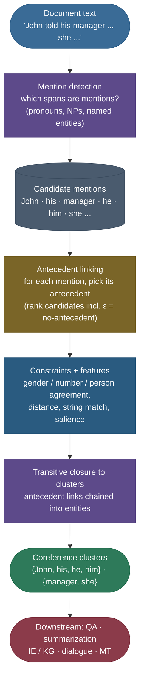

# Coreference Resolution: who is "he," and which "it" did you mean?

Read this sentence and notice what your brain does without being asked: *"John told his manager that he would finish the report by Friday, and she thanked him for the update."* You effortlessly know that **his** and **he** and **him** are all **John**, that **she** is **the manager**, and that **the report** and **the update** are (probably) the same document. You did **entity tracking** — you held a small cast of characters in your head and bound every new pronoun and description to the right one. **Coreference resolution** is the task of teaching a machine to do exactly that: take a text, find every **expression that refers to something** (a name, a pronoun, a noun phrase), and **cluster** those expressions by the real-world entity they point at.

It sounds like a parlour trick until you try to build a system that reads a document. A question-answering system asked *"When will John finish?"* has to know that **he** in *"he would finish"* is John. A summarizer that writes *"She thanked him"* without resolving the pronouns produces gibberish. A knowledge-graph builder reading *"Acme acquired Beta. The company will integrate its products."* must decide whether **The company** is Acme or Beta — get it wrong and the graph is wrong. Coreference is the quiet substrate under almost every task that claims to *understand* a document rather than just classify a sentence.

I'm going to teach this the way I'd actually walk a teammate through it: first the **linguistics** (what counts as a mention, what an entity is, why pronouns are hard), then the **task structure** (detect mentions → link them → close into clusters), then the **model families** in the order the field actually invented them — rule-based Hobbs, mention-pair, mention-ranking, entity-level, and the modern **end-to-end neural span-ranking** model — deriving each one's training objective. Then **evaluation** (why coref needs *three* metrics, not one), the **Winograd Schema** and the role of world knowledge, the **LLM era**, and the open challenges. By the end you'll be able to:

- explain the **mention → cluster** pipeline and the difference between **anaphora**, **cataphora**, and **coreference**;
- enumerate the **agreement and salience constraints** that prune candidate antecedents;
- derive the **mention-ranking softmax objective** and the **end-to-end span-ranking** loss (Lee et al. 2017) from first principles;
- compute **B³** precision/recall by hand and say what **MUC**, **B³**, and **CEAF-φ4** each capture (and why no single one suffices);
- resolve a short passage **by hand** into clusters, and read the output of a real coref pipeline.

> **Note:** keep one distinction crisp from the start. **Coreference** is a *symmetric, transitive* relation between mentions ("these expressions denote the same entity"). **Anaphora** is a *directional* relation ("this expression's interpretation **depends** on an earlier one"). They overlap massively but are not identical — see the linguistics section. Interviewers love this distinction because it separates people who memorized "coref = pronouns" from people who understand the phenomenon.

---

## The problem: a document is full of dangling references

To feel why this is a task and not a triviality, look at what a paragraph actually contains. Here is a four-sentence passage with the **referring expressions** underlined in your mind's eye:

> *Barack Obama visited Berlin in 2008. The senator gave a speech to a huge crowd. He spoke about hope, and it electrified the audience. Years later, the president would return to the city.*

There are at least six expressions pointing at **one man**: *Barack Obama*, *The senator*, *He*, *the president* (and arguably the implied subject of *would return*). There is a second entity, **Berlin / the city**; a third, **a speech / it**; a fourth, **a huge crowd / the audience**. A reader fuses these automatically. A machine sees a flat token stream and must *reconstruct* the entity structure: **which spans are referring expressions, and which of them co-refer.**

What makes it genuinely hard:

- **Pronouns are nearly content-free.** *He* tells you "singular, male, third person" and almost nothing else. Resolving it requires looking **back** through the text and choosing among candidates using agreement, recency, syntactic role, and often **world knowledge** ("the trophy didn't fit in the suitcase because *it* was too big" — which is "it"?).
- **Definite descriptions sneak in new aliases.** *The senator*, *the president*, *the 44th President* are all bridges to the same person but share **no words** with "Barack Obama." You can't match on string overlap alone.
- **The relation is global and transitive.** If *He* = *Obama* and *the president* = *He*, then *the president* = *Obama*. A model that decides pairs independently can produce **inconsistent** clusters (we'll see exactly how).
- **The decision space is enormous.** A 1,000-token document has hundreds of candidate spans; each mention can in principle link to any earlier one. The naive hypothesis space is **combinatorial**.

> **Gotcha:** "coreference" is *not* "named-entity recognition." NER finds and types entity **names** (`John → PERSON`). Coreference takes mentions of *all* kinds — names, pronouns, and **common-noun descriptions** ("the manager," "the company") — and decides which ones denote the **same** entity. NER is a per-span labeling problem; coref is a **clustering** problem over spans. They're complementary: NER often *feeds* mention detection (see [Sequence Labeling — POS & NER](../09-Sequence-Labeling-POS-and-NER/09-Sequence-Labeling-POS-and-NER.md)).

---

## The linguistics: mentions, entities, clusters, anaphora

Before any model, you need the vocabulary the whole field is built on.

**Entity.** A thing in the world (or the discourse model) — a person, organization, place, object, event. *Barack Obama* the man is one entity.

**Mention (a.k.a. referring expression / markable).** A **span of text** that refers to an entity. Mentions come in three broad flavours, in roughly increasing difficulty to resolve:

1. **Named entities / proper nouns** — *Barack Obama*, *Berlin*, *Acme Corp*. Often the **first** (most informative) mention of an entity.
2. **Definite and indefinite noun phrases (NPs)** — *the senator*, *a huge crowd*, *his manager*, *the report*. Definite NPs (*the X*) usually refer to something already established or uniquely identifiable; indefinite NPs (*a X*) often **introduce** a new entity.
3. **Pronouns** — *he, she, it, they, his, her, them, who, which …* The most frequent and the hardest; they carry almost no descriptive content, so their referent must be inferred from context.

**Cluster (coreference chain).** A set of mentions that all refer to the **same** entity. The **output** of coreference resolution is a *partition* of the detected mentions into clusters — equivalently, a set of disjoint chains. In the Obama passage:

```
{ Barack Obama, The senator, He, the president }   ← entity 1
{ Berlin, the city }                               ← entity 2
{ a speech, it }                                    ← entity 3
{ a huge crowd, the audience }                      ← entity 4
```


**Anaphora vs cataphora vs coreference.** These three terms get muddled constantly; here is the clean split:

- **Anaphora** — a later expression (the *anaphor*) depends for its interpretation on an **earlier** one (the *antecedent*). *"John … **he**"*: *he* is an anaphor whose antecedent is *John*. Direction: **backward**.
- **Cataphora** — the dependency runs **forward**: the pronoun comes *first*. *"Before **she** spoke, **the senator** reviewed her notes."* Here *she* points **ahead** to *the senator*. Rarer, and a classic gotcha for recency-only heuristics.
- **Coreference** — the **symmetric** relation "denote the same entity," with no inherent direction. *John* and *he* corefer; so do *the senator* and *the president* even though neither is grammatically dependent on the other.

> **Note:** the relationships are different shapes. Anaphora is a **directed link** (anaphor → antecedent); coreference is an **equivalence relation** (reflexive, symmetric, transitive) whose equivalence classes are the clusters. Most coref systems *operate* via anaphoric antecedent links and then take the **transitive closure** to recover the clusters — link locally, cluster globally.

**Not all anaphora is coreference, and vice versa.** Two edge cases worth knowing:

- **Bound-variable / non-referential anaphora:** *"Every student thinks **he** is smart."* Here *he* is anaphoric to *every student* but doesn't pick out a single real-world entity — it's a bound variable. It's anaphora **without** coreference.
- **Pleonastic ("expletive") "it":** *"**It** is raining."* / *"**It** seems that…"* — this *it* refers to **nothing**. A coref system must learn **not** to resolve it (a common false-positive source).

> **Gotcha:** the **most informative mention is usually the first.** Cataphora aside, the first mention of an entity is typically the name or a full description ("Barack Obama"), and later mentions get shorter and more pronominal ("the president," "he"). This **information-decay** pattern is why models lean heavily on **recency** and why the *antecedent* (the thing pointed back to) is usually richer than the *anaphor*.

---

## The task structure: detect, then link, then close

Almost every coreference system — rule-based or neural — decomposes the work into three conceptual stages. Modern end-to-end models *fuse* them into one network, but the stages are still the right mental model.



**1. Mention detection — which spans are mentions?** Decide which spans of text are referring expressions worth resolving. Classic pipelines used a parser plus rules: take all noun phrases, all pronouns, and all named entities as candidate mentions. This stage has a **precision/recall trade-off**: cast the net too narrow and you miss mentions you can never link (recall ceiling); too wide and you flood the linker with junk spans (e.g. pleonastic *it*). Modern systems often **over-generate** candidates and let the scorer prune them.

**2. Antecedent linking — for each mention, what does it refer to?** The heart of the task. For each mention $i$, choose its **antecedent**: an earlier mention $j$ that co-refers with it, or a special **dummy ε** meaning *"this mention starts a new entity / has no antecedent."* This is where the model families differ — pair classification, ranking, or cluster scoring.

**3. Transitive closure — link locally, cluster globally.** Antecedent links form a forest (each non-first mention points back to one earlier mention). Taking the **transitive closure** of these links yields the clusters: if $a \to b$ and $b \to c$ are both predicted, then $\{a, b, c\}$ is one cluster. This step is why local pairwise inconsistency is dangerous — it propagates.

> **Tip:** in interviews, draw these three boxes. Most candidates jump straight to "a neural net does it," and miss that **mention detection is a real subproblem with its own recall ceiling**: a mention you never proposed can never be linked, so end-to-end models deliberately enumerate *many* candidate spans and prune later, rather than committing to a hard mention/non-mention decision up front.

---

## Constraints and features: how candidates get pruned and scored

Before deep learning, coref was largely **feature engineering** on top of these stages. Even neural models benefit from understanding the signals, because they're what the network learns to approximate. The signals fall into **hard constraints** (filters) and **soft preferences** (features).

**Agreement constraints (hard-ish filters).** A pronoun must agree with its antecedent in:

- **Number** — *he/she/it* (singular) vs *they* (plural). *"The dogs … it"* is usually wrong.
- **Gender** — *he* (masc.), *she* (fem.), *it* (neuter). *"Mary … he"* is usually wrong.
- **Person** — first/second/third. *I/you/he* don't mix.

These prune the candidate set hard. *"Susan asked Tom whether **he** had finished"*: *he* (masc.) agrees with *Tom*, not *Susan*, so agreement alone resolves it.

> **Gotcha:** agreement is a **soft** constraint in the real world, and over-trusting it injects **bias**. Singular *they* (*"Someone left **their** umbrella"*), gender-neutral names, and professions stereotyped by gender ("the nurse … she," "the engineer … he") all break naive gender rules. The **WinoBias** and **GAP** benchmarks were built specifically to measure coref systems' **gender bias** — models that learned "nurse ⇒ she" from data fail on counter-stereotypical cases. Treat agreement as evidence, not law.

**Binding constraints (syntax).** Reflexives and pronouns obey structural rules (Chomsky's *Binding Theory*). *"John saw **himself**"* — the reflexive *himself* **must** be John (bound locally). *"John saw **him**"* — the plain pronoun *him* **cannot** be John (must be someone else). These syntactic constraints rule out candidates that agreement and recency would otherwise allow.

**Salience / recency / centering (soft preferences).** All else equal, the **most recent** and **most syntactically prominent** candidate wins. *Subjects* are more salient than *objects*; the entity in **focus** ("center" of the discourse, per Centering Theory) is the default referent of a following pronoun. This is why "recency" is such a strong baseline feature.

**Lexical / semantic features.**

- **String match** — *"Barack Obama … Obama"* (head match) is a strong coref signal for names.
- **Semantic class / type compatibility** — *"the company … it"* fine; *"the company … he"* odd (orgs aren't male).
- **Distance** — number of mentions/sentences between candidate and mention.
- **Grammatical role** — subject vs object of each mention.

> **Note:** the canonical feature-engineered system, **Soon et al. (2001)**, used exactly these: distance, string match, number/gender/semantic-class agreement, and grammatical features — fed to a decision-tree classifier over mention pairs. Neural coref didn't *discard* these signals; it learned them from contextual embeddings instead of hand-coding them. When you read "end-to-end, no pipeline," remember the **features didn't vanish — they moved into the representation.**

---

## Model family 1: rule-based — the Hobbs algorithm

The oldest serious approach, **Hobbs (1978)**, resolves pronouns by **searching the syntactic parse tree**. Given a pronoun, it walks the trees of the current and preceding sentences in a specific order — roughly **breadth-first, left-to-right, most-recent-sentence-first** — returning the first noun phrase that satisfies agreement (number/gender/person) and binding constraints. The traversal order *encodes* salience: it tends to find recent, prominent subjects first.

The "Hobbs distance" (how far down the search list the correct antecedent sits) is still used as a **feature** in later statistical systems, because the algorithm's ordering is a remarkably good salience proxy. On clean newswire it resolves a large fraction of pronouns with **no training data at all** — a humbling baseline.

> **Note:** the Hobbs algorithm is worth knowing for two reasons. (1) It's a strong **unsupervised baseline** — pure syntax + agreement. (2) It crystallizes the insight every later model reuses: **recency and syntactic prominence are the dominant signals for pronoun resolution.** Its weakness is equally instructive: it has **no semantics and no world knowledge**, so it fails exactly on the cases (Winograd schemas) where meaning, not structure, decides the referent.

---

## Model family 2: mention-pair — and why it's inconsistent

The first wave of **learning-based** coref (Soon et al. 2001; Ng & Cardie 2002) framed linking as **binary classification over mention pairs**. For every pair of mentions $(i, j)$ with $j$ before $i$, train a classifier to output

$$P\big(\text{coref}(i, j)\big) \in [0, 1],$$

using the features above (distance, string match, agreement, …). At test time, you have a soup of pairwise yes/no decisions; you then **cluster** them — e.g. *closest-first* (link each mention to its nearest positive antecedent) or *best-first* (its highest-scoring one), followed by transitive closure.

This works, and for a decade it was the standard. But it has a **structural flaw** that every interviewer probes:

> **Gotcha:** mention-pair models make each pairwise decision **independently**, so they can produce **transitivity violations**. Suppose the classifier says coref(*Obama*, *the senator*) = yes and coref(*the senator*, *he*) = yes but coref(*Obama*, *he*) = **no**. Those three local decisions are mutually inconsistent — coreference is transitive, so the third *must* be yes. The model has no mechanism to enforce that global constraint; it's stitching a partition together from contradictory local votes.

There are two further problems. **Class imbalance**: the vast majority of pairs are *not* coreferent, so the positive class is rare and the classifier drifts toward "no." And **no competition**: scoring (*him*, *John*) in isolation never asks *"is John a better antecedent for him than 'his' or 'he' are?"* — the decisions don't compete, even though a pronoun has exactly **one** true antecedent in its chain's recency order.


---

## Model family 3: mention-ranking — derive the softmax objective

The fix is to make the antecedents **compete**. **Mention-ranking** models (Denis & Baldridge 2008; Durrett & Klein 2013; and the neural Wiseman et al. 2015 / Clark & Manning 2016) reframe linking: for each mention $i$, **rank** all candidate antecedents and pick the best **one**.

Crucially, the candidate set includes a special **dummy antecedent ε** ("epsilon"), which means *"$i$ has no antecedent — it's the first mention of its entity."* This single trick lets the same model handle both *"link me to an earlier mention"* and *"start a new entity"* in one softmax.

**The derivation.** Let mention $i$ have candidate antecedents $\mathcal{Y}(i) = \{\epsilon, 1, 2, \ldots, i-1\}$ (all earlier mentions plus ε). Define a real-valued score $s(i, j)$ for assigning antecedent $j$ to mention $i$. Turn scores into a distribution over antecedents with a **softmax**:

$$P(y_i = j) \;=\; \frac{\exp\, s(i, j)}{\displaystyle\sum_{j' \in \mathcal{Y}(i)} \exp\, s(i, j')}.$$

Now the training signal. We don't always know *which specific* earlier mention is "the" antecedent — gold data gives us **clusters**, and any gold mention in $i$'s cluster is a **correct** antecedent. So we treat the set of gold antecedents $\mathrm{GOLD}(i)$ (the earlier mentions in $i$'s gold cluster, or $\{\epsilon\}$ if $i$ is the first mention of its entity) as a **latent** choice and **marginalize** over it. The loss for mention $i$ is the negative log of the total probability mass the model places on *any* correct antecedent:

$$\mathcal{L}_i \;=\; -\log \sum_{j \,\in\, \mathrm{GOLD}(i)} P(y_i = j) \;=\; -\log \frac{\displaystyle\sum_{j \in \mathrm{GOLD}(i)} \exp\, s(i, j)}{\displaystyle\sum_{j' \in \mathcal{Y}(i)} \exp\, s(i, j')}.$$

Sum $\mathcal{L}_i$ over all mentions in the document and you have the training objective. This is sometimes called a **marginal log-likelihood** or **latent-antecedent** loss: it rewards the model for putting mass on the *right cluster's* mentions without forcing a choice of *which* one.

> **Note:** read the loss carefully — the numerator sums over **correct** antecedents and the denominator over **all** candidates. Minimizing it pushes the softmax mass toward *any* gold antecedent and away from wrong ones. Because each mention gets exactly **one** softmax, the antecedents **compete**, and ε competing alongside them means "start a new entity" is a first-class option. This single change fixes mention-pair's "no competition" and dramatically reduces (though doesn't formally forbid) inconsistency, because each mention commits to one antecedent rather than many independent yes/no votes.

> **Tip:** why is **ε scored at 0** in many implementations ($s(i, \epsilon) = 0$)? It's a convenient **reference point**: every real antecedent's score is measured *relative* to "no antecedent." If no candidate scores above 0, the model prefers ε and declares $i$ a new entity — an elegant built-in threshold instead of a separate "is this a mention with an antecedent?" classifier.

---

## Model family 4: entity / cluster-level models

Mention-ranking still scores against a **single** antecedent. **Entity-level** (a.k.a. cluster-ranking or mention-entity) models go one step further: they score a mention against the **partial cluster** (entity) built so far, using **global** features of the whole chain.

Why this helps: some decisions only make sense at the entity level. If a partial cluster already contains *"Barack Obama"* and *"the 44th President,"* then linking *"he"* to that **entity** can use the fact that the entity *has a male name* — information no single pairwise comparison with the pronoun "his" alone would surface. Entity models (Clark & Manning 2016, using reinforcement learning / imitation learning to build clusters incrementally) reason about the **cluster as a unit**, capturing constraints like "an entity can't be both 'the company' and 'he'."

The cost is **search**: clusters are built **incrementally**, and the decision at step $t$ depends on clusters formed at steps $< t$, so you can't decompose training into independent pairs. These models use beam search or RL to manage the sequential decision process.

> **Note:** the trajectory of the field is a clear arc of **widening context**: Hobbs scores a candidate against *syntax*; mention-pair against *one other mention*; mention-ranking against *all earlier mentions at once*; entity-level against *the whole partial cluster*. Each step buys consistency by considering more of the global structure — at the price of more expensive inference.

---

## Model family 5: end-to-end neural span-ranking (Lee et al. 2017)

The model that defines modern coref is **Lee et al. (2017), "End-to-end Neural Coreference Resolution."** Its breakthrough: **drop the mention-detection pipeline entirely.** Instead of a parser proposing mentions, **consider every possible span** as a potential mention and let the model learn, jointly, *which spans are mentions* and *which co-refer* — one differentiable objective, no hand-built syntactic features.

Let me **derive the model** the way the paper builds it.


**Step 1 — encode the tokens.** Run the document through an encoder to get contextual token vectors $x_1, \ldots, x_T$. In the 2017 paper this was a **bidirectional LSTM** over word + character embeddings; by 2020 it became **SpanBERT** (more below).

**Step 2 — enumerate and represent spans.** Consider **every** contiguous span up to a maximum width $L$ — that's $O(TL)$ spans. For a span $i$ from token `start(i)` to `end(i)`, build a **span representation**

$$g_i \;=\; \big[\, x_{\text{start}(i)} \,;\; x_{\text{end}(i)} \,;\; \hat{x}_i \,;\; \phi(i) \,\big],$$

concatenating: the contextual vectors at the span's **boundaries** (start and end — boundaries carry most of a span's syntactic identity), an **attention-pooled** head vector $\hat{x}_i = \sum_t a_t\, x_t$ over the span's tokens (a learned soft "head word" — *which* token in "his manager" is the semantic head?), and a learned **width feature** $\phi(i)$. This $g_i$ is the span's mention embedding.

**Step 3 — score mentions, and prune.** A feed-forward net scores how mention-like a span is:

$$s_m(i) \;=\; \mathbf{w}_m^\top \, \mathrm{FFNN}_m(g_i).$$

Since there are $O(TL)$ spans, the model **keeps only the top $\lambda T$** by $s_m$ (a learned, soft version of mention detection) — this is the pruning that makes the quadratic-in-spans candidate set tractable.

**Step 4 — score antecedents.** For a kept span $i$ and an earlier kept span $j$, the **antecedent score** combines both mention scores and a **pairwise** compatibility term:

$$s(i, j) \;=\; \underbrace{s_m(i)}_{\text{is } i \text{ a mention?}} \;+\; \underbrace{s_m(j)}_{\text{is } j \text{ a mention?}} \;+\; \underbrace{s_a(i, j)}_{\text{do } i,j \text{ corefer?}},$$

where the pairwise term $s_a(i, j) = \mathbf{w}_a^\top \, \mathrm{FFNN}_a\big([\,g_i\,;\, g_j\,;\, g_i \odot g_j\,;\, \phi(i, j)\,]\big)$ uses the two span reps, their **element-wise product** $g_i \odot g_j$ (a similarity signal), and pairwise features $\phi(i,j)$ (distance, speaker, genre). The dummy antecedent is fixed at $s(i, \epsilon) = 0$.

**Step 5 — softmax and the marginal loss.** This is exactly the **mention-ranking** objective from family 3, applied to the learned spans:

$$P(y_i = j) = \mathrm{softmax}_{j \in \mathcal{Y}(i)}\, s(i, j), \qquad \mathcal{L} = -\sum_i \log \!\!\sum_{j \in \mathrm{GOLD}(i)} P(y_i = j).$$

Because mention scores **and** antecedent scores feed one differentiable loss, the network learns *what is a mention* and *what co-refers* **jointly** — the pipeline collapses into a single trained model.

> **Note:** the elegance is that $s(i,j) = s_m(i) + s_m(j) + s_a(i,j)$ **bakes mention detection into the linking score.** A span that isn't really a mention gets a low $s_m$, which drags down every antecedent score involving it — so the same objective that learns linking also learns mention-hood. No separate mention classifier, no parser. *That* is what "end-to-end" means here.

> **Gotcha:** enumerating all spans is $O(T^2 L)$ pairs before pruning — explosive for long documents. The 2017 model caps span width $L$, keeps the top $\lambda T$ spans, and limits how many antecedents each span considers. Even so, **document length is the scaling pain point** of span-ranking coref, which motivates the next refinement.

**Coarse-to-fine + higher-order inference (Lee, He & Zettlemoyer 2018).** Two upgrades. **Coarse-to-fine**: a cheap bilinear score pre-filters antecedent candidates so the expensive pairwise FFNN runs on far fewer pairs — making longer documents feasible. **Higher-order inference**: iteratively **refine** each span's representation by **averaging in its likely antecedents'** representations (a few rounds of "gather from whom I probably corefer with"), so a span's embedding reflects its emerging **cluster**, not just itself — recovering some of the entity-level benefit inside the span-ranking framework.

---

## SpanBERT and transformer-based coref

The 2017/2018 models used a biLSTM encoder. The single biggest jump in coref accuracy came from **swapping the encoder for a pretrained transformer** — specifically **SpanBERT (Joshi et al. 2020)**.

SpanBERT is a BERT variant pretrained with two changes tailored to **span** tasks: (1) it **masks contiguous spans** of tokens (not random individual tokens), and (2) a **span-boundary objective (SBO)** trains the model to predict the masked span's content from its **boundary** tokens alone. That is *exactly* the signal coref needs — the span-ranking model represents a mention by its boundary vectors, and SpanBERT pretrains those boundaries to encode the span. Plugging SpanBERT into the 2018 coref architecture pushed CoNLL F1 well past 79, a large leap over LSTM-based systems.

> **Note:** the lesson generalizes. The end-to-end **architecture** (enumerate spans → represent → rank antecedents with the marginal loss) stayed fixed; the **encoder** got better (biLSTM → ELMo → BERT → SpanBERT), and accuracy rose with it. Coref rides the same contextual-embedding wave as the rest of NLP — see [Contextual Embeddings (ELMo, BERT)](../06-Contextual-Embeddings-ELMo-BERT/06-Contextual-Embeddings-ELMo-BERT.md) for *why* boundary-aware span representations carry so much coreference signal.

> **Tip:** later work pushed efficiency further — **word-level coref** (Dobrovolskii 2021) ranks *single head words* instead of all spans (cutting the candidate set from $O(T^2)$ to $O(T)$), and **link-append / autoregressive** formulations recast coref as a sequence-generation task suited to large transformers. The span-ranking objective remains the conceptual backbone.

---

## Why it matters downstream

Coreference is rarely the *end* product — it's the **enabler** under tasks that need document-level understanding:

- **Question answering.** *"When did the president visit Berlin?"* over the Obama passage requires linking *the president* → *Obama* → the sentence about 2008. Unresolved coref is a wall for multi-sentence QA. See [Question Answering](../11-Question-Answering/11-Question-Answering.md).
- **Summarization.** A summary that writes *"He thanked her"* without the reader knowing who is incoherent. Faithful summarizers must track and re-introduce entities — coref clusters tell them which mentions are the same person. See [Text Summarization](../13-Text-Summarization/13-Text-Summarization.md).
- **Information extraction / knowledge graphs.** Building *"Obama → bornIn → Hawaii"* from text requires fusing *Obama*, *the president*, and *he* into **one** node. Coref errors create duplicate or merged entities in the KG.
- **Dialogue systems.** Multi-turn agents must track *"it," "that one," "the first option"* across turns — coreference over the conversation history.
- **Machine translation.** Pronoun gender/number must be **resolved in the source** to translate correctly into a target language with different agreement. *"The doctor … she"* → French *"la médecin"* needs to know *she* = the doctor. This is a documented MT failure mode. See [Machine Translation](../12-Machine-Translation/12-Machine-Translation.md).

> **Note:** coref is the bridge from **sentence-level** NLP (classification, tagging) to **document-level** NLP (who/what is this *document* about). Any system that claims to "read" a document rather than score a sentence is doing coreference somewhere — explicitly with a coref model, or implicitly inside a large language model's attention.

---

## Evaluation: why coreference needs THREE metrics

Here is the part that surprises people: there is **no single agreed metric** for coreference, and the field reports the **average of three**. Why? Because a coreference output is a **clustering**, and there are genuinely different ways a predicted clustering can be "wrong" — splitting one entity into two, merging two entities into one, or getting a few mentions misplaced — and **no single number captures all of them fairly**. Each metric has a known **degenerate failure** that another covers.

Let me define all three on a tiny example, then **compute B³ by hand**.

Take **gold** clustering $\{a,b,c\},\{d,e\}$ (two entities, 5 mentions) and a system **prediction** $\{a,b\},\{c\},\{d,e\}$ — the system correctly grouped $d,e$ and $a,b$, but **split** $c$ off into its own singleton instead of joining $\{a,b\}$.


### MUC (Vilain et al. 1995) — link-based

MUC counts **coreference links**. A cluster of size $n$ needs a minimum of $n-1$ links to connect it. MUC **recall** counts how many of the gold links the system recovered; **precision** is the symmetric quantity with the roles of gold and predicted swapped.

- Gold links needed: $\{a,b,c\}$ needs 2, $\{d,e\}$ needs 1 → **3 gold links**.
- The prediction breaks gold cluster $\{a,b,c\}$ into the two pieces $\{a,b\}$ and $\{c\}$, so within that cluster it recovers only $3 - 2 = 1$ of the 2 needed links; cluster $\{d,e\}$'s 1 link is intact. Recall $= 2/3 \approx \mathbf{0.667}$. Precision is $\mathbf{1.0}$ — every link the system *did* predict ($a$–$b$, $d$–$e$) is correct. **MUC F1 $= \frac{2\cdot 1.0 \cdot 0.667}{1.667} = 0.80$.**

> **Gotcha:** MUC's blind spot is **singletons and granularity**. Because it only counts links, a cluster of size 1 contributes **zero** links and is invisible to MUC — a system that splits everything into singletons can still score deceptively, and MUC tends to **reward over-merging** (merging two entities adds links cheaply). This is precisely why MUC alone is untrustworthy.

### B³ (Bagga & Baldwin 1998) — mention-based

B³ scores **per mention** and averages, which fixes MUC's singleton blindness. For each mention $m$, let $G_m$ be its gold cluster and $P_m$ its predicted cluster:

$$\text{Precision}(m) = \frac{|G_m \cap P_m|}{|P_m|}, \qquad \text{Recall}(m) = \frac{|G_m \cap P_m|}{|G_m|},$$

then average over all mentions. Let me **compute it fully** for our example (gold $\{a,b,c\},\{d,e\}$; pred $\{a,b\},\{c\},\{d,e\}$):

| mention | $G_m$ | $P_m$ | $\lvert G_m\cap P_m\rvert$ | Prec $=\frac{\cap}{\lvert P_m\rvert}$ | Rec $=\frac{\cap}{\lvert G_m\rvert}$ |
|---|---|---|---|---|---|
| $a$ | $\{a,b,c\}$ | $\{a,b\}$ | 2 | $2/2 = 1.00$ | $2/3 = 0.667$ |
| $b$ | $\{a,b,c\}$ | $\{a,b\}$ | 2 | $2/2 = 1.00$ | $2/3 = 0.667$ |
| $c$ | $\{a,b,c\}$ | $\{c\}$ | 1 | $1/1 = 1.00$ | $1/3 = 0.333$ |
| $d$ | $\{d,e\}$ | $\{d,e\}$ | 2 | $2/2 = 1.00$ | $2/2 = 1.00$ |
| $e$ | $\{d,e\}$ | $\{d,e\}$ | 2 | $2/2 = 1.00$ | $2/2 = 1.00$ |

Average **precision** $= \frac{1.00 \times 5}{5} = 1.00$ (every predicted cluster is a *subset* of a gold cluster — no wrong merges, so precision is perfect). Average **recall** $= \frac{0.667 + 0.667 + 0.333 + 1.0 + 1.0}{5} = \frac{3.667}{5} = 0.733$. Then

$$\text{B}^3\ \text{F1} = \frac{2 \cdot 1.00 \cdot 0.733}{1.00 + 0.733} = \frac{1.467}{1.733} = \mathbf{0.846}.$$

That matches the measured bar in the figure (0.85). The recall hit comes entirely from the three mentions $a,b,c$ that should be together but aren't.

> **Note:** B³'s strength is that **every mention counts equally**, so singletons are handled and the score degrades **gracefully** with the number of misplaced mentions. Its known quirk: it can **double-count** mentions across overlapping errors and is sensitive to cluster size — large clusters dominate the average.

### CEAF-φ4 (Luo 2005) — entity-alignment

CEAF finds the **best one-to-one alignment** between gold and predicted entities, then scores the alignment. With the similarity $\phi_4(G, P) = \frac{2|G \cap P|}{|G| + |P|}$ (Dice overlap of two clusters), it maximizes total similarity over all bijections:

- Align $\{a,b,c\} \leftrightarrow \{a,b\}$: $\phi_4 = \frac{2\cdot 2}{3+2} = 0.8$. Align $\{d,e\} \leftrightarrow \{d,e\}$: $\phi_4 = \frac{2\cdot 2}{4} = 1.0$. The predicted singleton $\{c\}$ goes unaligned. Total similarity = 1.8.
- **Precision** = 1.8 / (#predicted entities = 3) = **0.60**; **Recall** = 1.8 / (#gold entities = 2) = **0.90**; **CEAF-φ4 F1** $= \frac{2\cdot 0.6\cdot 0.9}{1.5} = \mathbf{0.72}$.

> **Gotcha:** CEAF's blind spot is the **one-to-one constraint**: each gold entity aligns to **at most one** predicted entity, so the *extra* predicted singleton $\{c\}$ is simply discarded and **penalizes precision hard** (3 predicted entities, only ~2 worth of mass). CEAF reacts strongly to having the **wrong number of clusters**, where B³ is gentler. Different blind spot — which is the whole point.

### The CoNLL average — and why three

The **CoNLL-2012 shared task** settled the matter: report the **unweighted mean of MUC, B³, and CEAF-φ4 F1**. For our example:

$$\text{CoNLL F1} = \frac{0.80 + 0.846 + 0.72}{3} = \mathbf{0.789}.$$

Each metric measures the **same error** (one split mention) and lands on a **different number** — 0.80, 0.85, 0.72 — because each is sensitive to a different failure mode (links, mentions, entity alignment). Averaging them is the field's pragmatic admission that **no single view of "clustering correctness" is complete**.

> **Tip:** in an interview, the crisp story is: **MUC counts links** (blind to singletons, rewards over-merging), **B³ counts mentions** (singleton-safe, size-sensitive), **CEAF aligns entities** (punishes wrong cluster *count*), and **CoNLL F1 averages all three** so no single blind spot dominates. If you can compute B³ by hand and name each metric's failure mode, you're ahead of most candidates. There's also **LEA** (Moosavi & Strube 2016), a link-based-entity-aware metric proposed to fix specific CEAF/B³ issues — worth a mention but not in the CoNLL average.

---

## The Winograd Schema Challenge: where world knowledge decides

Some pronouns can't be resolved by **any** amount of syntax, agreement, or recency — only by **understanding the world**. The **Winograd Schema Challenge (Levesque et al. 2012)** is built entirely from such cases. The canonical example:

> *The trophy doesn't fit in the suitcase because **it** is too big.*
> *The trophy doesn't fit in the suitcase because **it** is too small.*

Same syntax, same agreement (*trophy* and *suitcase* are both singular, neuter). Swap one word (*big* → *small*) and the answer **flips**: in the first, *it* = the **trophy** (the trophy is too big); in the second, *it* = the **suitcase** (the suitcase is too small). No structural rule can decide it — you need **physical/commonsense reasoning** about containment. A pair of schemas is designed so that a system exploiting surface statistics scores at chance.

> **Note:** Winograd schemas were proposed as an **alternative to the Turing Test** — a benchmark you can't pass by pattern-matching, only by reasoning. For years coref systems scored near chance on them. Large language models changed that dramatically: GPT-class models resolve most Winograd schemas correctly, because the commonsense knowledge needed has been absorbed into their pretraining. The challenge that was meant to be AI-complete became, largely, a measure of how much world knowledge a model memorized.

> **Gotcha:** Winograd-style cases are exactly where **rule-based and feature-based** systems are helpless — they have agreement and recency but **no semantics**. It's the clearest demonstration of *why* coreference is, at its hardest, an **understanding** problem, not a structural one.

---

## The LLM era: coreference by prompting

You can now do coreference **without a coref model at all** — just ask a large language model. Prompt: *"List the coreference clusters in this passage: …"* and a capable LLM returns the entity chains, often with explanations.

**Strengths.** LLMs bring **world knowledge and commonsense** that dedicated coref systems lacked — they crush Winograd schemas and handle bridging and inference cases that stumped specialized models. They need **no task-specific training** and adapt to new domains zero-shot.

**Weaknesses.** It's **expensive** (a full forward pass per document vs a lightweight specialized model), the output **format is unreliable** (you must parse free text into clusters, and the model may hallucinate or miss mentions), and on **standard benchmarks** dedicated SpanBERT-style models often still **match or beat** few-shot LLMs on exact CoNLL F1 — LLMs are strong on the *hard reasoning* cases but can be sloppy on the *bookkeeping* (exhaustively clustering every mention in a long document). And implicitly, **every LLM already does coreference inside its attention** — resolving *"it"* to the right antecedent is part of next-token prediction — even when you don't ask for clusters explicitly.

```mermaid
graph TD
    START(["Resolve coreference"]):::data --> Q{"How to score<br/>antecedents?"}
    Q -->|"syntactic tree search"| HOBBS["Rule-based<br/>Hobbs 1978<br/>walk the parse tree"]:::frozen
    Q -->|"classify each pair"| PAIR["Mention-pair<br/>Soon et al. 2001<br/>binary P(coref) per pair"]:::navy
    Q -->|"rank candidates"| RANK["Mention-ranking<br/>softmax over antecedents + ε"]:::amber
    Q -->|"score vs cluster"| ENT["Entity / cluster-level<br/>score against partial cluster"]:::process
    PAIR --> WEAK["⚠ transitivity violations<br/>(A=B, B=C, A≠C)"]:::danger
    RANK --> E2E["End-to-end neural<br/>Lee et al. 2017/2018<br/>span enumeration + ranking"]:::out
    ENT --> E2E
    E2E --> SPAN["SpanBERT coref<br/>Joshi et al. 2020"]:::out
    SPAN --> LLM["LLM-prompted coref<br/>commonsense, zero-shot"]:::process

    classDef data fill:#3A6B96,stroke:#2A5B86,color:#fff
    classDef process fill:#5D4A8A,stroke:#4D3A7A,color:#fff
    classDef frozen fill:#4A5B6E,stroke:#3A4B5E,color:#fff
    classDef out fill:#2E7A5A,stroke:#1E6A4A,color:#fff
    classDef amber fill:#7A6528,stroke:#6A5518,color:#fff
    classDef navy fill:#2A5B80,stroke:#1A4B70,color:#fff
    classDef danger fill:#8B3B4A,stroke:#7B2B3A,color:#fff
```



---

## Open challenges

Coreference is **not solved**, even at ~80 CoNLL F1 on clean newswire. The hard cases:

- **Long documents.** Span-ranking is $O(T^2)$ in candidates; books, transcripts, and legal documents blow past the window. Cross-document and book-length coref are active research (and the reason word-level and memory-augmented coref exist).
- **Singletons.** Mentions that refer to an entity appearing **once** (no chain). Some annotation schemes (OntoNotes) **don't annotate singletons at all**, which distorts both training and evaluation — a model that learns "everything has an antecedent" over-merges.
- **Split antecedents.** *"John met Mary. **They** went to dinner."* — *They* refers to John **and** Mary together, a *plural* mention whose antecedent is the **union** of two earlier mentions. Most models assume a single antecedent and can't represent this.
- **Nested / overlapping mentions.** *"[his manager]"* contains *"[his]"* — a mention inside a mention, in **different** clusters. Span enumeration handles nesting in principle, but it stresses the pruning.
- **Bridging / near-identity.** *"I bought a house. **The kitchen** is huge."* — *the kitchen* is *associated* with the house but not strictly coreferent (it's a part). Beyond standard coref, but real for understanding.
- **Domain & gender bias.** Models trained on newswire transfer poorly to dialogue, fiction, or clinical text; and as noted, they encode **gender stereotypes** (WinoBias/GAP) that cause systematic errors and fairness harms.

> **Gotcha:** a subtle benchmark trap — **OntoNotes (the CoNLL-2012 data) doesn't annotate singletons**, so reported F1 numbers are on a task that *ignores* mentions with no chain. A model that looks great on OntoNotes can detect mentions poorly in the wild, because it was never scored on entities that appear only once. Always check what the benchmark *counts* before trusting a coref F1.

---

## Worked example 1: resolve a passage by hand

Let's resolve the running passage end-to-end, the way a model (or you) would, narrating the signals.

> *(1) John told his manager that he would finish the report by Friday. (2) She thanked him for the update.*

**Mention detection** (the spans spaCy actually flags on this text — names, noun chunks, pronouns; verified in the code section): *John*, *his*, *his manager*, *he*, *the report*, *Friday*, *She*, *him*, *the update*.

**Linking, mention by mention** (left to right, choosing an antecedent or ε):

1. **John** — first mention, no candidates → **ε** (starts entity E1).
2. **his** — pronoun, masc./singular. Candidate: *John* (agrees: male, singular, and the salient subject). → antecedent **John**. E1 = {John, his}.
3. **his manager** — NP introducing a *new* entity (the manager), distinct from John → **ε** (starts entity E2 = {his manager}). *(Note 'his' nests inside this NP but is its own E1 mention.)*
4. **he** — masc./singular. Candidates: *John*, *his*, *his manager*. Agreement allows all (manager's gender unknown), but **salience/recency** + the discourse ("**John** told … that **he** would finish") strongly favors the subject **John**. → **John**. E1 = {John, his, he}.
5. **the report** — new inanimate entity → **ε** (E3).
6. **Friday** — date, not coreferent with anything prior → **ε** (E4).
7. **She** — fem./singular. Candidates that agree in gender: *his manager* (if female) — *John* and the male pronouns are ruled out by **gender**. → **his manager**. E2 = {his manager, She}.
8. **him** — masc./singular object. Candidates: *John*, *his*, *he* (all E1, male). Recency + the fact that *She* (the manager) is the subject thanking someone ⇒ *him* is the other party, **John**. → **he** (nearest E1 antecedent). E1 = {John, his, he, him}.
9. **the update** — refers back to *the report* / the finishing event (bridging); a strict coref system may leave it as **ε** (E5) or link to *the report* depending on annotation. We leave it ε.

**Transitive closure → final clusters:**

```
E1 = { John, his, he, him }     (the person John)
E2 = { his manager, She }       (the manager)
E3 = { the report }             (singleton)
E4 = { Friday }                 (singleton)
E5 = { the update }             (singleton)
```

> **Note:** notice which signals did the work: **ε** for first mentions and new entities; **agreement** (gender) resolved *She* unambiguously; **salience/recency** resolved *he* and *him* to the subject John. This is *exactly* what the mention-ranking softmax learns to score — we just did it as a decision list.

---

## Worked example 2: a mention-ranking score by hand

Now make the ranking concrete. Resolve **him** (mention $i$) in *"John told his manager that he would finish… She thanked **him**."* Candidates $\mathcal{Y}(i) = \{\epsilon,\ \text{John},\ \text{his},\ \text{he},\ \text{his manager},\ \text{She}\}$. Suppose a simple linear scorer with three features — `gender_agree` (+2 if the candidate's gender matches *him*=masc., −3 if it mismatches), `recency` (closer candidates score higher, 0 to +1), and `is_subject` (+0.5) — produces these scores $s(i,j)$:

| candidate $j$ | gender | recency | subject | $s(i,j)$ |
|---|---|---|---|---|
| **ε** (no antecedent) | — | — | — | $0.0$ |
| John | +2 (masc ✓) | +0.3 | +0.5 | $\mathbf{2.8}$ |
| his | +2 (masc ✓) | +0.4 | 0 | $2.4$ |
| he | +2 (masc ✓) | +1.0 | +0.5 | $\mathbf{3.5}$ |
| his manager | −1 (unknown) | +0.6 | 0 | $-0.4$ |
| She | −3 (fem ✗) | +0.9 | +0.5 | $-1.6$ |

Apply the softmax $P(y_i=j) = e^{s(i,j)} / \sum_{j'} e^{s(i,j')}$. The denominator is $e^{0} + e^{2.8} + e^{2.4} + e^{3.5} + e^{-0.4} + e^{-1.6} = 1 + 16.4 + 11.0 + 33.1 + 0.67 + 0.20 = 62.4$. So:

$$P(\text{he}) = \frac{33.1}{62.4} = \mathbf{0.53}, \quad P(\text{John}) = \frac{16.4}{62.4} = 0.26, \quad P(\text{his}) = 0.18, \quad P(\epsilon) = 0.016.$$

The model picks **he** as the antecedent — and since *he* is already in E1 = {John, his, he}, transitive closure puts *him* in the **John** cluster, the correct answer. The fem. *She* and the gender-unknown *manager* are crushed by the gender feature; ε gets almost no mass because a strong masculine antecedent exists.

> **Note:** this is the mechanism behind family 3. Each mention runs **one** softmax over its candidates; ε competes as the "new entity" option; and the **marginal loss** would, in training, reward putting mass on *any* of {John, his, he} (all gold antecedents of *him*) — which is why both *he* (0.53) and *John* (0.26) carrying mass is fine, not a bug.

---

## Worked example 3: B³ on a different clustering

Reinforce the metric with a fresh case. **Gold** $\{w,x,y,z\}$ (one 4-mention entity). The system **over-splits**: predicted $\{w,x\}, \{y,z\}$ (two entities). Compute B³:

| mention | $G_m$ | $P_m$ | $\cap$ | Prec | Rec |
|---|---|---|---|---|---|
| $w$ | $\{w,x,y,z\}$ | $\{w,x\}$ | 2 | $2/2=1.0$ | $2/4=0.5$ |
| $x$ | $\{w,x,y,z\}$ | $\{w,x\}$ | 2 | $1.0$ | $0.5$ |
| $y$ | $\{w,x,y,z\}$ | $\{y,z\}$ | 2 | $1.0$ | $0.5$ |
| $z$ | $\{w,x,y,z\}$ | $\{y,z\}$ | 2 | $1.0$ | $0.5$ |

Precision $= 1.0$ (no wrong merges — both predicted clusters are subsets of the gold entity), Recall $= 0.5$ (every mention found only *half* its true cluster). **B³ F1** $= \frac{2 \cdot 1.0 \cdot 0.5}{1.5} = \mathbf{0.667}$.

Now the **opposite error** — the system **over-merges**: gold $\{w,x\},\{y,z\}$ (two entities) but predicted $\{w,x,y,z\}$ (one). By symmetry, precision $= 0.5$ (each mention's predicted cluster is only half-right) and recall $= 1.0$, giving the **same** B³ F1 $= 0.667$.

> **Tip:** the lesson: **B³ precision punishes over-merging; B³ recall punishes over-splitting.** They're the two failure directions of any clustering, and the F1 balances them. This is *why* you report precision and recall, not just F1 — they tell you *which* way your system is broken.

---

## Worked example 4: a measured coref run

Now actually run mention detection and the metric code. spaCy supplies real mention detection; we compute B³ exactly on a clustering (the full generator also computes MUC and CEAF-φ4). The diagram generator `tools/gen_coreference_diagrams.py` runs this and prints the numbers — they match the figure and the by-hand B³ above.

```python
"""Coreference: real spaCy mention detection + exact B-cubed metric.
Verified on Python 3.12 (spaCy 3.8, en_core_web_sm)."""
import spacy
nlp = spacy.load("en_core_web_sm")
text = ("John told his manager that he would finish the report by Friday. "
        "She thanked him for the update.")
doc = nlp(text)

# --- mention detection: named entities + pronouns + noun chunks (candidate mentions) ---
ner   = [(e.text, e.label_) for e in doc.ents]
prons = [t.text for t in doc if t.tag_ in ("PRP", "PRP$")]   # he, his, she, him ...
nps   = [nc.text for nc in doc.noun_chunks]
print("NER          :", ner)
print("pronouns     :", prons)
print("noun chunks  :", nps)

# --- exact B-cubed metric on gold vs predicted clusterings ---
def bcubed(gold, pred):
    g = {m: set(c) for c in gold for m in c}
    p = {m: set(c) for c in pred for m in c}
    P = sum(len(g[m] & p[m]) / len(p[m]) for m in g) / len(g)
    R = sum(len(g[m] & p[m]) / len(g[m]) for m in g) / len(g)
    F = 2 * P * R / (P + R) if P + R else 0.0
    return round(P, 3), round(R, 3), round(F, 3)

gold = [["a", "b", "c"], ["d", "e"]]      # 2 entities
pred = [["a", "b"], ["c"], ["d", "e"]]    # predictor split 'c' into a singleton
print("B-cubed (P,R,F1):", bcubed(gold, pred))   # -> (1.0, 0.733, 0.846)
```

Running it prints:

```
NER          : [('John', 'PERSON'), ('Friday', 'DATE')]
pronouns     : ['his', 'he', 'She', 'him']
noun chunks  : ['John', 'his manager', 'he', 'the report', 'Friday', 'She', 'him', 'the update']
B-cubed (P,R,F1): (1.0, 0.733, 0.846)
```

The mentions match Worked example 1 exactly, and the B³ F1 = **0.846** matches the by-hand table and the figure. The full generator additionally computes MUC F1 = 0.80 and CEAF-φ4 F1 = 0.72, for CoNLL avg = 0.79 — all from the same code, so the page's numbers can't drift from the math.

> **Note:** I used spaCy's mention detector (real, reproducible) plus exact metric code rather than a heavyweight end-to-end coref model, because the canonical libraries (`neuralcoref`, `fastcoref`) are pinned to **older `transformers`/spaCy** versions and break on current installs — a common, frustrating reality of the coref tooling ecosystem. The lesson is itself worth knowing: coref libraries lag the fast-moving transformer stack, so in production you either pin an old environment, use a serving wrapper, or **prompt an LLM**. The **task structure and metrics**, however, are exactly what you compute above.

> **Tip:** to run a full neural model, the practical paths today are: an **LLM prompt** (`"return coreference clusters as JSON"`), a maintained library in a **pinned environment** (`fastcoref`/`maverick-coref` with the transformers version they require), or AllenNLP's SpanBERT coref in its own env. All produce the **clusters**; you score them with the exact metric code above.

---

## Recap and rapid-fire

**If you remember nothing else:** coreference resolution **finds every referring expression (mention) and clusters them by the entity they denote.** The pipeline is **detect mentions → link each to an antecedent (or ε) → transitively close into clusters.** The field walked from **rule-based Hobbs** (syntax + agreement) → **mention-pair** (independent binary classification, *inconsistent*) → **mention-ranking** (one softmax over candidates incl. ε, the consistency fix) → **entity-level** (score against the whole cluster) → **end-to-end span-ranking** (Lee et al. 2017: enumerate spans, $s(i,j)=s_m(i)+s_m(j)+s_a(i,j)$, marginal loss, *no pipeline*) → **SpanBERT** encoders → **LLM prompting**. Evaluation needs **three metrics** (MUC links, B³ mentions, CEAF entity-alignment) averaged into **CoNLL F1**, because each has a different blind spot. The hardest cases — **Winograd schemas** — need **world knowledge**, which is exactly where LLMs leapt ahead.

**Quick-fire — say these out loud:**

- *Coreference vs anaphora?* Coref is symmetric/transitive ("same entity"); anaphora is directional ("interpretation depends on an earlier expression"). They overlap but aren't identical (bound variables, pleonastic *it*).
- *Three model families?* Mention-pair (binary per pair, can violate transitivity), mention-ranking (one softmax over antecedents + ε), entity-level (score vs the whole partial cluster).
- *What's ε for?* The dummy "no antecedent" — lets one softmax both link and start a new entity; scored at 0 as a reference threshold.
- *The end-to-end score?* $s(i,j) = s_m(i) + s_m(j) + s_a(i,j)$ — mention scores bake detection into linking; softmax over candidates; marginal loss over gold antecedents.
- *Why three metrics?* MUC (links) is blind to singletons & rewards over-merging; B³ (mentions) is singleton-safe; CEAF (entity alignment) punishes wrong cluster count. CoNLL F1 = their mean.
- *B³ precision vs recall?* Precision punishes over-merging; recall punishes over-splitting.
- *Why are Winograd schemas hard?* They can't be resolved by syntax/agreement/recency — only by world knowledge; LLMs solve most, dedicated coref systems historically didn't.
- *Where does coref matter?* QA, summarization, IE/knowledge-graphs, dialogue, MT pronoun translation — anything document-level.

---

## References and further reading

The curated link library for this topic — the suggested path, videos, courses, articles, papers, books, and internal cross-links — lives in a companion file so it can be reused as a standalone reference list:

**→ [Coreference Resolution — references and further reading](14-Coreference-Resolution.references.md)**
