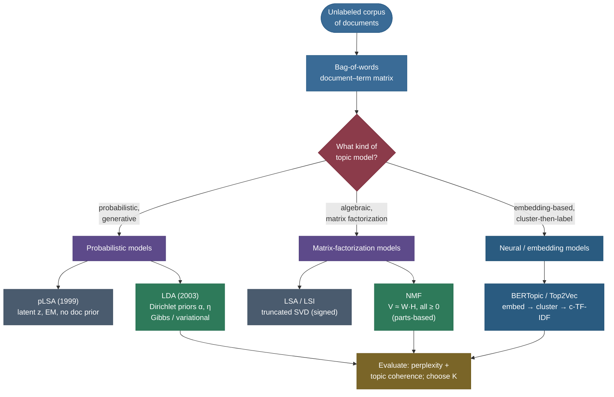
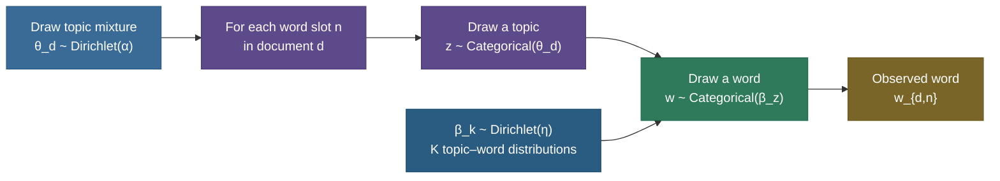
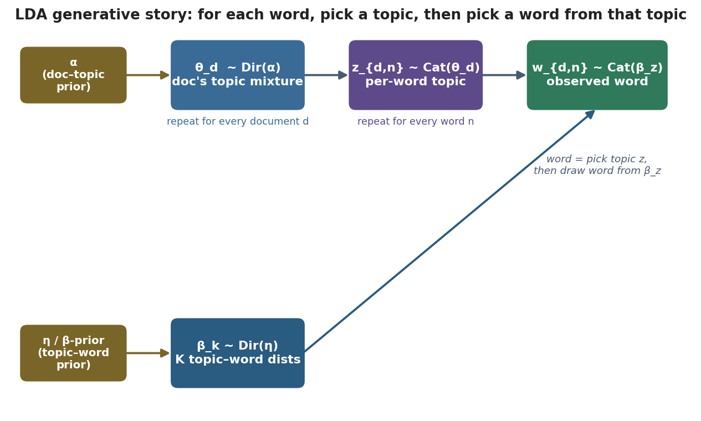
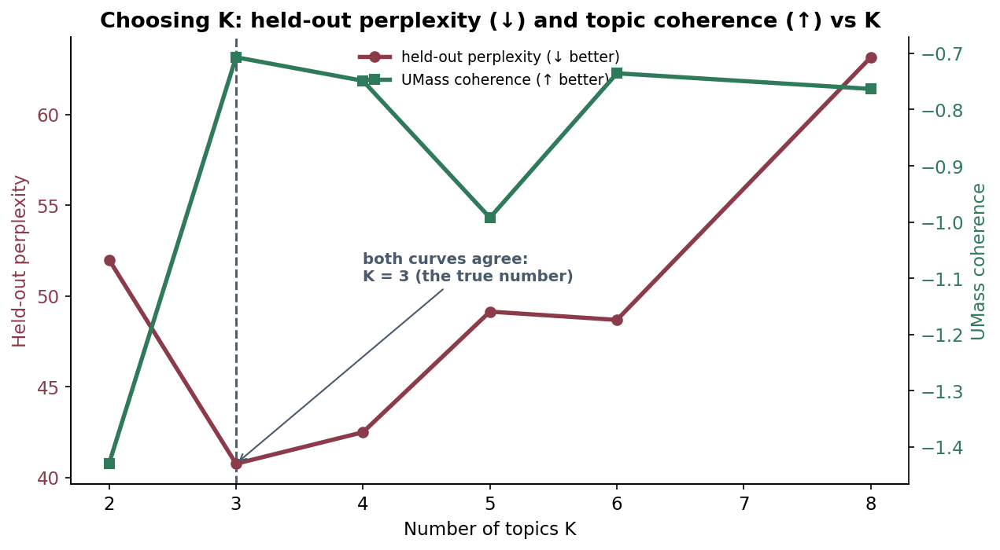
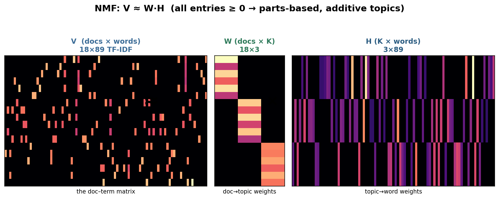
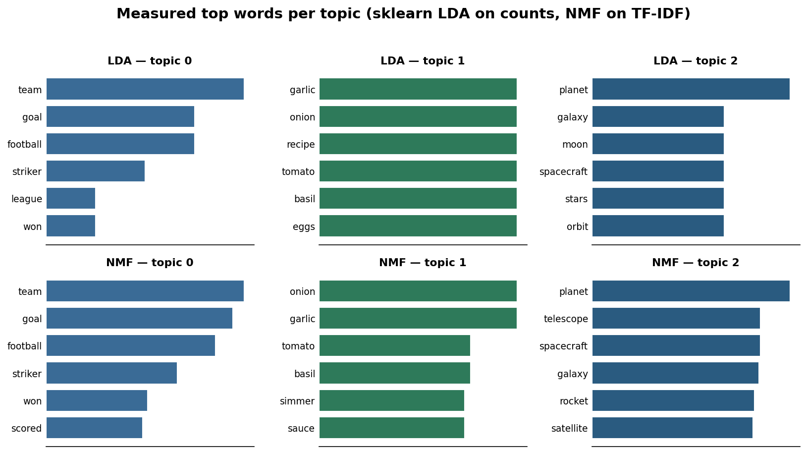

# Topic Modeling: discovering the hidden themes in a pile of text

Imagine someone hands you a hard drive with 200,000 news articles, no labels, no folders, no tags — and asks "what is this collection *about*?" You can't read it. You can't even skim it. But you have an intuition that there aren't 200,000 different things going on in there; there are maybe twenty or thirty recurring **themes** — politics, sports, finance, weather, crime, technology — and every article is some *blend* of a few of them. A budget piece is mostly *finance* with a dash of *politics*; a transfer-window story is mostly *sports* with a dash of *finance*. **Topic modeling** is the family of unsupervised algorithms that reads the whole pile for you and hands back exactly that: a set of discovered themes (each described by the words that define it) and, for every document, the mixture of themes it's made of — **without ever being told what the themes are**.

It is one of the oldest and most useful tricks in unsupervised NLP, and it sits at a beautiful intersection of three things you may already know: it's a **latent-variable model fit by EM** (cousin of the [Gaussian Mixture Model](../../04.%20Unsupervised_Learning/concepts/04-Gaussian-Mixture-Models-and-EM.md)), it's a **dimensionality reduction** of the bag-of-words matrix (cousin of [PCA/SVD](../../04.%20Unsupervised_Learning/concepts/06-Dimensionality-Reduction-Overview.md)), and its modern reincarnation is a **clustering of embeddings**. I'm going to teach it the way I'd walk a teammate through it at a whiteboard: start from the *problem* and the bag-of-words matrix it operates on, build up the predecessor (**pLSA**) so you feel *why* its successor exists, derive **Latent Dirichlet Allocation (LDA)** from its generative story all the way to its sampling update, then derive **Non-negative Matrix Factorization (NMF)** as the linear-algebra answer to the same question, compare them honestly against **LSA/SVD** and the modern **BERTopic** approach, and finish with four worked examples you can re-run. By the end you'll be able to:

- explain **what** topic modeling discovers and **why** it's unsupervised dimensionality reduction over the document–term matrix;
- tell the **LDA generative story** — Dirichlet priors, per-document topic mixtures, per-word topic assignments — and say *why Dirichlet*;
- write down the **collapsed Gibbs sampling** update and explain each of its three factors;
- derive **NMF**'s objective and its **multiplicative update rules**, and explain why non-negativity buys interpretability;
- choose the number of topics **K** with held-out **perplexity** and **topic coherence**, and know when they disagree;
- pick the right tool — **LDA vs NMF vs LSA vs BERTopic** — for a given corpus, and name each method's failure modes.

> **Note:** topic modeling is **descriptive, not predictive**. There is no label, no ground truth, no accuracy score. The output is a *lens* for a human to explore a corpus with — which is exactly why **interpretability** (can a person read a topic and name it?) matters more here than any single fit statistic. Hold onto that; it explains most of the design choices below.

---

## The problem: organize an unlabeled corpus by theme

You have a collection of $D$ documents over a vocabulary of $V$ words, and **no labels**. You want to:

- **discover** the latent themes that run through the collection (what is it about?);
- **summarize** each document as a short mixture of those themes (this one is 70% sports, 30% finance);
- **organize / search / recommend** — group similar documents, route a query to the right theme, surface related reading, track how themes rise and fall over time.

This is fundamentally an **unsupervised** problem, and the obstacle is dimensionality and sparsity. The natural representation of the corpus — the **bag-of-words document–term matrix** — is enormous and almost entirely zero. Three broad families of method attack it: probabilistic-generative models (pLSA, LDA), matrix-factorization models (LSA, NMF), and modern embedding-based models (BERTopic, Top2Vec).



---

## Intuition: a recipe of themes, baked into words

Before any math, hold one picture in your head. A topic is a **bag of weighted words** — *Sports* is mostly *{goal, team, match, league, …}*; *Cooking* is mostly *{garlic, onion, recipe, bake, …}*. A document is a **recipe that mixes those bags in some proportion** — "60% Sports, 40% Cooking" — and then every word in the document was, secretly, drawn from one of the bags the recipe calls for. You never see the recipe or which bag each word came from; you only see the finished soup of words. Topic modeling is **reverse-engineering the recipe and the bags from the soup**, across thousands of documents at once, by exploiting one fact: words from the *same* bag keep showing up together. *goal* and *team* co-occur constantly; *goal* and *garlic* almost never. Those co-occurrence patterns are the only signal — and they're enough.

This is the exact same shape of problem as a [Gaussian Mixture Model](../../04.%20Unsupervised_Learning/concepts/04-Gaussian-Mixture-Models-and-EM.md): there, each data point was secretly drawn from one of $k$ Gaussian "bags," and EM recovered the bags and the soft assignments. Here the "bags" are word distributions and the data points are words; the math is more involved (words are discrete, documents add a second layer of mixing), but the instinct — *soft-cluster the observations, let the clusters sharpen each other* — is identical. If you understand "soft k-means with shapes," you already understand 80% of LDA's machinery; the rest is the Dirichlet bookkeeping that makes it generative.

> **Note:** the two layers of mixing are what makes topic modeling richer than plain clustering. In clustering, each *document* would belong to one cluster. In topic modeling, each *word occurrence* gets its own topic, so a single document can genuinely be *part* Sports and *part* Cooking — a transfer-fee story that's 70/30. This "admixture" is the whole point: real documents aren't about one thing.

---

## The input: the document–term matrix

Every classical topic model operates on the **bag-of-words** representation you met in [Bag-of-Words & TF-IDF](../03-Bag-of-Words-and-TF-IDF/03-Bag-of-Words-and-TF-IDF.md): a $D \times V$ matrix where row $d$ is document $d$ and entry $(d, w)$ counts (or TF-IDF-weights) how often word $w$ appears in $d$. Word **order is thrown away** — only counts remain. Schematically, with three tiny documents and a vocabulary of five words:

| | *goal* | *team* | *recipe* | *garlic* | *orbit* |
|---|---|---|---|---|---|
| **doc1** (a match report) | 3 | 2 | 0 | 0 | 0 |
| **doc2** (a recipe)        | 0 | 0 | 2 | 3 | 0 |
| **doc3** (a space story)   | 0 | 0 | 0 | 0 | 2 |

Two things to notice, because both drive everything that follows. First, the matrix is **huge and sparse**: real vocabularies run to tens of thousands of words, real documents touch a few hundred, so >99% of the entries are zero. Second, it is **low-rank in spirit**: those columns are not independent — *goal* and *team* rise and fall together, *garlic* and *recipe* rise and fall together. That correlation structure **is** the topics. A topic model is just a principled way to factor that matrix into "which themes exist" and "how much of each theme is in each document."

> **Note:** this is the deep link to [dimensionality reduction](../../04.%20Unsupervised_Learning/concepts/06-Dimensionality-Reduction-Overview.md). A $D \times V$ matrix is re-expressed through a small number $K$ of latent topics as $D \times K$ (documents in topic space) times $K \times V$ (topics in word space). LSA does this with the SVD; NMF does it with a non-negative factorization; LDA does it probabilistically. Same shape of answer, three philosophies.

> **Gotcha:** **preprocessing is not optional** for classical topic models. Lowercase, remove stopwords, often lemmatize, and prune extreme-frequency terms (drop words in >95% of docs and words in <2 docs). Skip this and your "topics" come back as *the, of, and, to* — the highest-count words, which carry no theme. TF-IDF (for NMF) or count pruning (for LDA) is what lets the real signal surface.

---

## pLSA: the predecessor, and why it wasn't enough

Before LDA there was **probabilistic latent semantic analysis** (pLSA, Hofmann 1999). It introduced the idea that organizes the whole field: a hidden **topic variable** $z$ that mediates between documents and words. pLSA models the probability of seeing word $w$ in document $d$ as a sum over $K$ topics:

$$p(w \mid d) \;=\; \sum_{z=1}^{K} \, p(w \mid z)\, p(z \mid d).$$

Read it left to right: to generate a word in document $d$, first pick a topic $z$ with probability $p(z \mid d)$ (the document's topic mixture), then pick a word from that topic with probability $p(w \mid z)$ (the topic's word distribution). The two factor-tables — $p(z\mid d)$ (a $D \times K$ table) and $p(w\mid z)$ (a $K \times V$ table) — are fit by **maximum likelihood with EM**, exactly the alternation you know from [GMMs](../../04.%20Unsupervised_Learning/concepts/04-Gaussian-Mixture-Models-and-EM.md): an **E-step** softly assigns each word occurrence to topics ($p(z \mid d, w)$, the responsibility), and an **M-step** re-estimates the two tables from those soft assignments.

pLSA works, and the generative idea is exactly right. But it has **two fatal weaknesses**:

1. **No generative process for documents.** $p(z \mid d)$ is a *free parameter for each specific document in the training set* — there are $D \times K$ of them. The model has no notion of what a *new, unseen* document's topic mixture should look like; it literally has no parameters for documents it hasn't seen. You can't cleanly assign topics to a held-out document without re-fitting.
2. **Parameters grow with the corpus → overfitting.** Because there's one $p(z \mid d)$ vector *per document*, the parameter count grows **linearly with the number of documents**. More data doesn't regularize the model; it just adds more parameters. pLSA overfits, and there's no prior to stop it.

> **Note:** the fix for both is the same single idea — **put a prior on the document–topic mixtures** so they're drawn from a shared distribution rather than being free per-document parameters. That prior is the **Dirichlet**, and adding it turns pLSA into LDA. Everything that makes LDA "better" flows from this one move: a generative story for *documents*, not just words.

---

## LDA: the generative story, derived

**Latent Dirichlet Allocation** (Blei, Ng & Jordan, 2003) is the most influential topic model ever written, and the cleanest way to understand it is to describe the **fictional process it imagines generated your corpus**. LDA pretends each document was written by a little dice-rolling robot, and then asks: *given the documents I actually see, what dice settings most likely produced them?* Here is the robot's procedure.

**Setup (done once for the whole corpus).** There are $K$ topics. Each topic $k$ is a probability distribution over the $V$ vocabulary words, drawn from a Dirichlet prior:

$$\beta_k \sim \text{Dirichlet}(\eta), \qquad k = 1, \dots, K.$$

So $\beta_k$ is a length-$V$ vector that sums to 1 — e.g. a "sports" topic puts high mass on *goal, team, match* and near-zero on *garlic, orbit*.

**For each document $d$:**

1. Draw the document's **topic mixture** $\theta_d \sim \text{Dirichlet}(\alpha)$. This is a length-$K$ vector summing to 1 — e.g. $\theta_d = [0.7, 0.3, 0.0]$ means "70% topic 0, 30% topic 1, none of topic 2."
2. For each of the $N_d$ word slots $n$ in the document:
   - Draw a **topic assignment** $z_{d,n} \sim \text{Categorical}(\theta_d)$ — roll the document's loaded $K$-sided die to pick which topic this word comes from.
   - Draw the **word** $w_{d,n} \sim \text{Categorical}(\beta_{z_{d,n}})$ — roll the chosen topic's loaded $V$-sided die to pick the actual word.

That's the entire model. Visually:



The full joint probability of one document factorizes cleanly along this story:

$$p(\theta_d, \mathbf{z}_d, \mathbf{w}_d \mid \alpha, \beta) \;=\; \underbrace{p(\theta_d \mid \alpha)}_{\text{Dirichlet}} \prod_{n=1}^{N_d} \underbrace{p(z_{d,n} \mid \theta_d)}_{\text{pick topic}} \, \underbrace{p(w_{d,n} \mid \beta_{z_{d,n}})}_{\text{pick word}}.$$

And the schematic of the whole machine — priors feeding the per-document mixture, the mixture feeding per-word topics, topics-plus-word-distributions feeding the observed words — is the picture worth burning into memory:



> **Note (plate notation):** in the paper this is drawn as nested rectangles ("plates"): an outer plate over $D$ documents, an inner plate over $N_d$ words, with $\theta$ inside the document plate and $\beta$ outside everything (shared across all documents). The plate notation is just a compact way of saying "repeat this part." Only the words $w$ are **shaded** (observed); $\theta, z, \beta$ are unshaded (latent — what we must infer).

### What the Dirichlet actually is

The Dirichlet is a **distribution over probability vectors** — it's the natural prior whenever the thing you're putting a prior on is *itself* a categorical distribution (like a topic mixture $\theta$ or a topic's word distribution $\beta$). A $K$-dimensional Dirichlet with parameter $\alpha = (\alpha_1, \dots, \alpha_K)$ has density

$$p(\theta \mid \alpha) \;=\; \frac{1}{B(\alpha)} \prod_{k=1}^{K} \theta_k^{\,\alpha_k - 1}, \qquad \theta_k \ge 0,\;\; \sum_k \theta_k = 1,$$

where $B(\alpha)$ is the normalizing constant (a ratio of Gamma functions). The constraint $\sum_k \theta_k = 1$ means every sample lives on the **probability simplex** — for $K=3$, an equilateral triangle whose corners are "100% topic 1," "100% topic 2," "100% topic 3." The $\alpha$ vector controls *where on that triangle* the mass piles up. With a **symmetric** Dirichlet ($\alpha_k = \alpha$ for all $k$), $\alpha = 1$ gives a uniform spread over the triangle; $\alpha \ll 1$ pushes mass into the **corners** (sparse mixtures — each document is one or two topics); $\alpha \gg 1$ pulls mass to the **center** (dense, even blends). That single scalar is the sparsity dial.

> **Tip:** picture the $K=3$ simplex as a triangle. Small $\alpha$ scatters documents near the *corners* (each is mostly one topic); large $\alpha$ clumps them in the *middle* (each is a uniform smear). You almost always want documents near the corners — so you almost always want $\alpha < 1$. The same triangle picture, with the vocabulary simplex, explains why small $\eta$ gives crisp topics.

### Why the Dirichlet, specifically?

Two reasons, and an interviewer loves both.

**Reason 1 — conjugacy (the math just works).** The Dirichlet is the **conjugate prior** of the Categorical/Multinomial. That means: if your prior over a probability vector is Dirichlet and you observe some categorical counts, the **posterior is again a Dirichlet**, with parameters that are just the prior plus the counts. This is why the inference updates below are so clean — every posterior we need stays in the Dirichlet family, so we never leave a tractable form. Without conjugacy, LDA's math would be a swamp.

**Reason 2 — sparsity control (the modeling knob).** The Dirichlet's concentration parameter controls how *peaky* the vectors it produces are:

- **$\alpha < 1$** (e.g. 0.1) → documents are drawn toward the **corners** of the simplex → each document is dominated by **one or a few** topics. This is what we usually want: a document is *about* a couple of things, not a smear of all $K$.
- **$\alpha > 1$** → documents tend toward an even blend of all topics (rarely what you want).
- The same logic applies to **$\eta$** on the topic–word side: small $\eta$ → each topic concentrates on **few words** → crisp, readable topics.

> **Tip:** the priors are your two big tuning knobs. **Small $\alpha$ = sparse documents** (each doc is about few topics); **small $\eta$ = sparse topics** (each topic is about few words). When topics come back as bland mush — every topic looks the same and contains too many generic words — *lower* $\eta$. When every document looks like it contains all topics, *lower* $\alpha$. (In scikit-learn these are `doc_topic_prior` and `topic_word_prior`; in gensim, `alpha` and `eta`.)

> **Gotcha:** a frequent misconception is that "$\alpha$ and $\eta$ are learned." By default they're **fixed hyperparameters** you set (often symmetric, like $\alpha = 50/K$ or 0.1). You *can* optimize them (gensim's `alpha='auto'`), but the per-document $\theta_d$ and per-topic $\beta_k$ are what's inferred — the priors shape them.

---

## Inference: the posterior is intractable, so we approximate it

We see the words $\mathbf{w}$. We want the **posterior** over the hidden stuff — the topic assignments, the mixtures, the topic-word distributions:

$$p(\theta, \mathbf{z}, \beta \mid \mathbf{w}, \alpha, \eta) \;=\; \frac{p(\theta, \mathbf{z}, \beta, \mathbf{w})}{p(\mathbf{w} \mid \alpha, \eta)}.$$

The numerator is easy (it's the generative story above). The denominator, the **evidence** $p(\mathbf{w})$, requires integrating over all $\theta$ and $\beta$ and summing over **every possible assignment of every word to a topic** — that's $K^{N}$ assignments for $N$ total word occurrences. **Intractable.** So, exactly as with any rich latent-variable model, we use **approximate inference**. Two methods dominate.

### Method A — Variational EM (mean-field)

This is what the original Blei et al. paper used and what **scikit-learn** implements. We posit a *simpler* family of distributions $q(\theta, \mathbf{z}; \phi, \gamma)$ that **factorizes** (the "mean-field" assumption: pretend $\theta$ and the $z$'s are independent in $q$), and then we **tune** that surrogate to be as close as possible to the true posterior by minimizing their KL divergence. Because $\log p(\mathbf{w})$ decomposes as

$$\log p(\mathbf{w}) \;=\; \underbrace{\mathcal{L}(q)}_{\text{ELBO}} \;+\; \underbrace{\mathrm{KL}\big(q \,\Vert\, p(\cdot \mid \mathbf{w})\big)}_{\ge\, 0},$$

and the evidence $\log p(\mathbf{w})$ is a fixed constant, **minimizing the KL gap is identical to maximizing the ELBO** $\mathcal{L}(q) = \mathbb{E}_q[\log p(\theta,\mathbf{z},\mathbf{w})] - \mathbb{E}_q[\log q]$ — a tractable lower bound on the log-evidence. The optimization alternates, EM-style: update the per-word topic responsibilities $\phi$ and the per-document mixture parameters $\gamma$ to tighten the bound (E-step), then update the global topic–word distributions (M-step). Each step provably never lowers the ELBO, so it converges. It's **fast and deterministic** and scales to huge corpora (especially the **online/stochastic** variant of Hoffman et al., which updates from mini-batches), at the cost of the bias the factorization assumption introduces — mean-field tends to *underestimate* posterior variance because it can't represent correlations it assumed away.

> **Note:** this is the exact same ELBO / "maximize a lower bound because the true objective is intractable" move that powers the [variational autoencoder](../../10.%20GenAI/concepts/01-Variational-Autoencoders-VAE-ELBO.md) and, in spirit, the EM algorithm for [GMMs](../../04.%20Unsupervised_Learning/concepts/04-Gaussian-Mixture-Models-and-EM.md). Variational EM for LDA *is* EM, with an approximate E-step because the exact posterior over $(\theta, \mathbf{z})$ doesn't factor nicely. If you've seen the ELBO once, you've seen it everywhere in this corner of ML.

### Method B — Collapsed Gibbs sampling

This is the method most people derive in interviews because the update is so interpretable (Griffiths & Steyvers, 2004). The trick in the name — **collapsed** — is that we *integrate out* $\theta$ and $\beta$ analytically (we can, thanks to Dirichlet–Multinomial conjugacy!), leaving only the discrete topic assignments $\mathbf{z}$ to sample. We then visit each word occurrence in turn and **re-sample its topic** conditioned on the topic of every *other* word. The conditional is the famous update:

$$p(z_i = k \mid \mathbf{z}_{\neg i}, \mathbf{w}) \;\propto\; \underbrace{\big(n_{d,k}^{\neg i} + \alpha\big)}_{\substack{\text{how much doc } d \\ \text{already likes topic } k}} \;\times\; \underbrace{\frac{n_{k,w}^{\neg i} + \eta}{n_{k}^{\neg i} + V\eta}}_{\substack{\text{how much topic } k \\ \text{likes word } w}}$$

where $n_{d,k}$ = count of words in document $d$ currently assigned to topic $k$, $n_{k,w}$ = count of word $w$ across the corpus assigned to topic $k$, $n_{k}$ = total words assigned to topic $k$, and the $\neg i$ superscript means "excluding the current word $i$ we're reassigning." Each term has a plain-English reading:

- **First factor** $(n_{d,k} + \alpha)$ — *"this document already has a lot of topic $k$ in it"* — pulls a word toward topics its neighbors in the same document use. This is what makes a document settle into a few topics.
- **Second factor** $\frac{n_{k,w} + \eta}{n_k + V\eta}$ — *"topic $k$ uses word $w$ a lot, across the whole corpus"* — pulls a word toward topics that elsewhere generate that same word. This is what makes a topic settle into a coherent word set.

> **Note:** the magic is that those two pulls **reinforce each other across iterations** until the corpus self-organizes. Words that co-occur in documents get herded into the same topic (factor 1); topics that contain a word attract more of that word (factor 2). Run this sweep over all words for ~hundreds of iterations and the assignments converge to a sample from the posterior; average the late samples to read off $\hat\beta$ and $\hat\theta$. It's the same self-reinforcing "soft clustering that sharpens" dynamic as EM in a GMM — just sampled instead of expected.

> **Tip:** the $+\alpha$ and $+\eta$ in the numerators are **smoothing** straight out of the Dirichlet prior — they're pseudo-counts that stop any probability from ever hitting exactly zero, so a topic can still occasionally emit a word it hasn't emitted yet. The same Laplace-style smoothing you saw in [n-gram models](../04-N-gram-Language-Models-and-Smoothing/04-N-gram-Language-Models-and-Smoothing.md), arriving here for free from conjugacy.

---

## Choosing K: perplexity and coherence

LDA needs you to fix $K$, the number of topics, in advance. Too few and distinct themes get merged into mush; too many and single themes splinter into near-duplicates. Two measures guide the choice — and they don't always agree, which is itself the lesson.

**Held-out perplexity.** Fit on a training split, then measure how *surprised* the model is by held-out documents. Perplexity is the exponentiated per-word negative log-likelihood, $\exp\!\big(-\frac{\sum_d \log p(\mathbf{w}_d)}{\sum_d N_d}\big)$ — **lower is better** (the model predicts unseen text well). It's the natural likelihood-based score, *but* — and this is the famous Chang et al. (2009) result — **lower perplexity often means *less* human-interpretable topics.** Optimizing likelihood alone can produce statistically tidy topics that read like nonsense to a person.

**Topic coherence.** This measures the thing we actually care about: *do a topic's top words actually go together?* The intuition: if the top words of a topic are *garlic, onion, tomato, basil*, they should **co-occur** in documents far more than chance; if they're *garlic, orbit, the, goal*, they don't. Two standard formalizations:

- **UMass coherence** — sum over top-word pairs of $\log\frac{D(w_i, w_j) + 1}{D(w_j)}$, where $D(w_j)$ is how many documents contain $w_j$ and $D(w_i, w_j)$ how many contain both. Asks: *given a topic word appeared, how often did its topic-mates appear too?* **Higher (less negative) is better.**
- **$C_v$ coherence** (Röder et al. 2015) — the most-used measure in practice; it scores top-word pairs by **normalized pointwise mutual information** over a sliding window in a reference corpus and aggregates with cosine similarity. It correlates best with human ratings, which is why gensim's `CoherenceModel(coherence='c_v')` is the standard sweep tool.

Here is a **measured** sweep on a clean 3-theme corpus: held-out perplexity and UMass coherence as $K$ varies. Both bottom-out / peak at the true $K = 3$:



> **Tip:** the practical recipe is **"sweep $K$, plot coherence, pick the elbow, then read the topics."** Don't trust a single number — coherence guides you to a *range*, and the final call is human: fit two or three nearby $K$ values, print the top-10 words per topic, and choose the one whose topics you can *name*. Interpretability is the real objective; coherence is its best proxy, perplexity a weaker one.

> **Gotcha:** perplexity and coherence **routinely disagree**, and when they do, **trust coherence** (or your own reading). On a small or short-text corpus perplexity can keep improving as $K$ shrinks toward triviality, or reward over-fragmentation — neither of which gives you usable topics. Perplexity answers "does the model predict words?"; coherence answers "can a human use these topics?" — and the second question is the one you're being paid to answer.

---

## NMF: the same question, answered with linear algebra

LDA is the probabilist's answer. **Non-negative Matrix Factorization** (Lee & Seung, 1999) is the linear algebra answer to the *same* question — and on many corpora it's faster, more deterministic, and gives crisper topics, especially on **short texts** where LDA's word-count signal is thin.

The setup is purely algebraic. Take the document–term matrix $V$ (typically **TF-IDF-weighted**, shape $D \times V$ words; all entries $\ge 0$ because counts and TF-IDF are non-negative). Approximate it as a product of two **non-negative** factors:

$$V \;\approx\; W H, \qquad W \ge 0,\; H \ge 0,$$

with $W$ of shape $D \times K$ (each row = a document's weights over the $K$ topics) and $H$ of shape $K \times V$ (each row = a topic's weights over the $V$ words). That's it: $W$ is "documents in topic space," $H$ is "topics in word space" — the exact same $D\times K$ and $K\times V$ decomposition LDA produces, but as a deterministic matrix factorization instead of a probabilistic posterior.



### The objective and the multiplicative update rules

We want $W, H \ge 0$ that make $WH$ close to $V$. "Close" is usually one of two losses:

$$\text{(Frobenius)}\quad \min_{W,H \ge 0} \;\tfrac12\,\lVert V - WH \rVert_F^2, \qquad\quad \text{(KL)}\quad \min_{W,H \ge 0}\; \sum_{ij}\Big(V_{ij}\log\tfrac{V_{ij}}{(WH)_{ij}} - V_{ij} + (WH)_{ij}\Big).$$

The Frobenius objective is least-squares reconstruction; the **generalized KL** objective treats entries like counts (and makes NMF behave a lot like pLSA — they're known to be closely related). Both are minimized by Lee & Seung's elegant **multiplicative update rules**, which for the Frobenius loss are:

$$H \leftarrow H \odot \frac{W^{\top} V}{W^{\top} W H}, \qquad\qquad W \leftarrow W \odot \frac{V H^{\top}}{W H H^{\top}},$$

where $\odot$ and the division are **element-wise**. The beauty of these updates: they're just multiplications and divisions of non-negative quantities, so **non-negativity is preserved automatically** — start with $W, H \ge 0$ and they stay $\ge 0$ forever, no projection or clipping needed. Lee & Seung proved each update **monotonically decreases** the loss (via an auxiliary-function argument akin to EM), so the algorithm converges (to a local optimum — the problem is non-convex jointly, though convex in each factor alone).

> **Note:** the multiplicative updates have a tidy reading. Each factor is scaled by the ratio of "what the data wants" ($W^\top V$, the correlation of topics with the actual matrix) over "what the current reconstruction produces" ($W^\top W H$). Where the model under-explains an entry the ratio exceeds 1 and the factor grows; where it over-explains, the ratio is below 1 and it shrinks. The fixed point is where they balance — exactly $V \approx WH$.

### Why non-negativity buys interpretability

This is the heart of NMF and the answer to "why not just use SVD?" In the SVD (which underlies LSA), the factors can be **negative**, so a document is reconstructed as a sum of components that **add and cancel** — "this document is 0.8 of component A *minus* 0.3 of component B." Negative word weights have no meaning ("this topic *anti*-contains the word 'goal'") and cancellation destroys interpretability.

By forcing every entry $\ge 0$, NMF can only build a document by **adding parts** — never subtracting. So each topic $H_k$ is a genuine, readable bundle of words with positive weights, and each document is a **non-negative blend** of those bundles. Lee & Seung's celebrated demonstration was on faces: NMF learned **parts** (a nose, an eyebrow, a mouth) that add up to a face, whereas PCA learned **ghostly whole-face eigenfaces** that cancel. The same effect on text gives you topics you can actually name.

There's also a clean connection to **clustering**. If you constrain each row of $W$ to be a one-hot indicator (a document belongs to exactly one topic) and use the Frobenius loss, NMF reduces to **k-means** — the topics become hard cluster centroids. Relaxing to non-negative *soft* weights is what turns that hard clustering into the soft, mixed-membership decomposition we want. So NMF sits on a spectrum: tighten it and you get k-means; loosen it and you get a soft topic model. And as noted, NMF with the **generalized-KL** loss is mathematically very close to **pLSA** — the two optimize nearly the same objective from different starting philosophies, which is why they tend to produce similar topics on the same matrix.



> **Tip:** NMF on a **TF-IDF** matrix is often the fastest path to *good-looking* topics, especially for **short documents** (tweets, titles, reviews) where LDA's per-document word counts are too sparse to estimate $\theta_d$ well. It's deterministic given a seed/init (use `init='nndsvda'`), runs in seconds, and the top words are usually crisp. When a quick, reproducible topic breakdown is the goal, reach for NMF first.

---

## LDA vs NMF vs LSA: three philosophies, one matrix

All three reduce the document–term matrix to $K$ latent topics; they differ in *how* and in what guarantees you get.

| | **LSA / LSI** | **NMF** | **LDA** |
|---|---|---|---|
| **Mechanism** | Truncated SVD of (TF-IDF) matrix | Non-negative factorization $V \approx WH$ | Probabilistic generative model |
| **Factors** | Orthogonal, **signed** (±) | **Non-negative** | **Probabilities** (sum to 1) |
| **Output per doc** | Coordinates (can be ±) | Non-negative weights | A **distribution** over topics |
| **Interpretability** | Poor (signed, cancellation) | **Good** (additive parts) | **Good** (proper distributions) |
| **Determinism** | Deterministic (unique SVD) | Deterministic given init | **Stochastic** (seed-dependent) |
| **New documents** | Project via SVD | Transform via fixed $H$ | Infer $\theta$ (principled) |
| **Speed** | Fast | Fast | Slower (sampling/variational) |
| **Best for** | Quick semantic indexing, baseline | Short text, reproducible topics | Probabilistic story, uncertainty, generative tasks |

The honest summary: **LSA** is the oldest and cheapest (it's just an SVD — see [Information Retrieval & Semantic Search](../16-Information-Retrieval-and-Semantic-Search/16-Information-Retrieval-and-Semantic-Search.md), where the same SVD powers latent semantic indexing), but its signed factors are hard to read as "topics." **NMF** keeps the matrix-factorization speed and adds interpretability by banning cancellation — the practitioner's default for a fast, crisp, reproducible topic breakdown. **LDA** is the most principled: it's a real generative model, so it gives you a proper distribution over topics per document, a clean way to score *new* documents, and a foundation other models extend. The cost is that it's slower and **stochastic** — run it twice with different seeds and the topics (and their numbering) shift.

> **Gotcha:** **topics are not aligned across runs or methods.** "Topic 0" from one LDA seed has no relationship to "topic 0" from another seed or from NMF — the numbering is arbitrary and topics can split/merge. Never compare topics by index; compare by their **top words**. If you need stable topics across runs, NMF (fixed init) is more reproducible than LDA.

---

## Topic labeling and interpretation

A model hands you $\beta_k$ (or $H_k$) — a weight over every word. Turning that into a usable result is a human-in-the-loop step:

- **Read the top-$N$ words** (sorted by weight, usually $N=10$). *garlic, onion, tomato, basil, salt* → label it **"cooking."** This manual labeling is standard and expected.
- **Beyond raw weight**, rank words by *distinctiveness* — a word common to many topics (e.g. *time*) is a poor label even if high-weight. **Relevance** (gensim/LDAvis's $\lambda$ knob) interpolates between a word's topic-probability and its **lift** (topic-probability ÷ corpus-probability) to surface words that are *characteristic* of the topic, not just frequent.
- **Visualize** with **pyLDAvis**: an interactive map of inter-topic distances (are topics well-separated or overlapping?) plus per-topic relevant terms. It's the standard tool for sanity-checking an LDA fit before you trust it.
- **Inspect representative documents** — the docs with the highest weight on a topic — to confirm the label matches real content.

> **Tip:** a quick automated first-pass label is just the topic's **top 2–3 distinctive words** joined together (*"garlic-onion-tomato"*). For production dashboards, feed the top words to an LLM and ask for a short human label — a cheap, increasingly common final step that turns *team, goal, striker, league* into **"Football."**

---

## The modern alternative: embedding-based topic modeling

Classical topic models inherit bag-of-words' original sin: **no word order, no context, no synonymy.** To them *bank* (river) and *bank* (money) are one word, and *car* and *automobile* are unrelated. The modern fix replaces counts with **contextual embeddings** ([Sentence & Document Embeddings](../07-Sentence-and-Document-Embeddings/07-Sentence-and-Document-Embeddings.md)) and clusters *those*.

**BERTopic** (Grootendorst, 2022) is the leading example, and its pipeline is a clean four-stage recipe:

1. **Embed** every document with a sentence transformer (e.g. `all-MiniLM-L6-v2`) → dense semantic vectors that *do* understand context and synonymy.
2. **Reduce** the embeddings' dimensionality with **UMAP** (clustering in 384-d is hard; UMAP brings it to ~5-d while preserving neighborhood structure).
3. **Cluster** with **HDBSCAN** — a density-based clusterer that, crucially, **discovers the number of clusters itself** (no $K$ to choose!) and labels genuine outliers as noise rather than forcing them into a topic.
4. **Label** each cluster with **c-TF-IDF**: treat all documents in a cluster as one big document and run TF-IDF *across clusters* to find the words most distinctive of that cluster. Those are the topic's words.

**Top2Vec** (Angelov, 2020) is a close cousin: it embeds documents and words into one joint space, finds dense regions of document vectors as topics, and labels each by the *words* whose vectors are nearest the topic centroid.

> **Note:** the trade-off is real and worth naming. Embedding methods capture **semantics** (synonyms cluster, context disambiguates) and **auto-select $K$** — big wins. But they give a **hard** assignment (each document goes to one cluster, unlike LDA's soft mixture), they need a GPU-ish embedding step and tuning of UMAP/HDBSCAN, and they're less of a clean *generative* story. For exploratory analysis of modern corpora, BERTopic is often the best first tool; for a principled probabilistic model or a low-resource setting, LDA/NMF still earn their keep.

---

## Applications

Where topic modeling actually gets used:

- **Corpus exploration & EDA** — the original use: point it at a new, unlabeled collection and get a map of what's in there before you commit to any labeling scheme.
- **Temporal / trend analysis** — fit topics, then track each topic's prevalence over time. *Dynamic Topic Models* (Blei & Lafferty) formalize this; the everyday version is "what fraction of this month's tickets are about billing?"
- **Document organization, tagging & search** — auto-tag documents with their dominant topics; cluster a help center; route a support ticket to the right queue by its topic mixture.
- **Recommendation** — represent users and items by their topic mixtures and recommend by topic-space similarity (content-based filtering without manual tags).
- **Feature extraction** — a document's $K$-dimensional topic vector $\theta_d$ is a compact, interpretable feature for a downstream classifier — far smaller than the raw bag-of-words and often a strong, cheap baseline.
- **Summarization & sense-making** — surface the themes of a large review set or survey free-text so a human can read $K$ topics instead of 50,000 responses.

---

## Limitations (say these in an interview)

Every method here shares some weaknesses and has its own:

- **Bag-of-words throws away order and context** (LDA/NMF/LSA) — "dog bites man" and "man bites dog" are identical; polysemy and synonymy are invisible. This is *the* motivation for the embedding methods above.
- **$K$ must be chosen** (LDA/NMF/LSA) — there's no objective right answer; you sweep coherence and use judgment. (HDBSCAN-based methods escape this.)
- **Instability / non-determinism** (LDA especially) — different seeds give different topics; topics split and merge; numbering is arbitrary. NMF with fixed init is steadier.
- **Short-text struggles** (LDA especially) — tweets/titles/queries give too few word co-occurrences per document to estimate $\theta_d$; NMF or pooling tricks or embedding methods do better.
- **Garbage in, garbage out** — without solid preprocessing (stopwords, pruning, lemmatization) topics degrade into frequency lists. The model is only as good as the matrix you feed it.
- **No semantics** — *car* and *automobile* are unrelated to a count model; only the embedding methods fix this.
- **Interpretation is manual** — the model gives word lists; *naming* the topic and judging quality is human work, and two analysts may read the same topic differently.

---

## A practitioner's playbook: from raw text to trusted topics

Putting the pieces together, here's the workflow I'd actually run on a fresh corpus, end to end:

1. **Preprocess hard.** Lowercase, tokenize, drop stopwords, lemmatize, and prune the vocabulary — remove terms in more than ~50–95% of documents (too generic) and in fewer than ~2–5 documents (too rare). For LDA, add **bigram/trigram phrases** (gensim's `Phrases`) so *new_york* and *machine_learning* become single tokens; multi-word concepts make topics far more readable.
2. **Pick the representation per method.** **Counts** for LDA (it's a count model — feeding it TF-IDF breaks its generative assumptions); **TF-IDF** for NMF and LSA (down-weights ubiquitous words so the factorization focuses on distinctive ones).
3. **Sweep $K$.** Fit several values (say 5, 10, 15, 20, 30), compute $C_v$ coherence for each, and plot. Pick the **elbow / peak**, not blindly the maximum — coherence can keep nudging up as topics fragment into near-duplicates.
4. **Read and name the topics.** Print top-10 words per topic (ranked by relevance, not just probability), open **pyLDAvis**, and try to give each topic a human label. A topic you can't name is a signal to change $K$ or revisit preprocessing.
5. **Validate against documents.** Pull the top documents for each topic and confirm the label matches their content. Spot-check a few documents' topic mixtures for face validity.
6. **Decide stability needs.** If you'll re-run the model regularly and need topics that don't shuffle, prefer **NMF** (fixed init) or pin LDA's seed and report that topic numbering is arbitrary across re-fits.
7. **Consider the modern route.** If the corpus is short-text, multilingual, or semantics-heavy, benchmark **BERTopic** alongside — it often wins on readability and removes the $K$ choice.

> **Gotcha:** the single most common production mistake is **feeding TF-IDF into LDA.** scikit-learn won't stop you, and it'll even produce topics — but LDA's likelihood is defined over integer word *counts*, so TF-IDF's fractional weights violate the model and quietly degrade quality. Counts → LDA, TF-IDF → NMF/LSA. Keep them straight.

> **Tip:** before you reach for a topic model at all, ask whether you actually have a **labeling problem** in disguise. If you already know the categories you want, a supervised [text classifier](../10-Text-Classification-and-Sentiment-Analysis/10-Text-Classification-and-Sentiment-Analysis.md) will beat any topic model at sorting documents into them. Topic modeling shines precisely when you *don't* know the categories yet — its job is discovery, not classification.

---

## Worked examples

Four hand-traceable examples, increasing in machinery — the first three by hand, the fourth measured in scikit-learn.

### Example 1 — generate a tiny document by walking the LDA story

Let's *be* the dice-rolling robot, with $K = 2$ topics (call them **Sports** and **Food**), $\alpha = [0.5, 0.5]$, and these topic–word distributions:

- $\beta_{\text{Sports}}$: *goal* 0.5, *team* 0.4, *garlic* 0.05, *recipe* 0.05
- $\beta_{\text{Food}}$: *goal* 0.05, *team* 0.05, *garlic* 0.4, *recipe* 0.5

**Step 1 — draw the doc's topic mixture.** Roll $\theta \sim \text{Dir}(0.5, 0.5)$; suppose it comes out $\theta = [0.8, 0.2]$ (this document is 80% Sports). **Step 2 — generate 3 words.** For each word: pick a topic from $\theta$, then a word from that topic's $\beta$.

| word slot | roll $z \sim \text{Cat}([0.8,0.2])$ | then roll $w \sim \beta_z$ | result |
|---|---|---|---|
| 1 | Sports (likely) | from $\beta_{\text{Sports}}$ → *goal* (p .5) | **goal** |
| 2 | Sports | from $\beta_{\text{Sports}}$ → *team* (p .4) | **team** |
| 3 | Food (the 20% case fires) | from $\beta_{\text{Food}}$ → *recipe* (p .5) | **recipe** |

The generated document is **"goal team recipe"** — mostly Sports words with one Food word, exactly as an 80/20 mixture should look. **Inference runs this backward:** given that we *observe* "goal team recipe," what $\theta$ and topic assignments most likely produced it? (Answer: a high-Sports $\theta$, with *recipe* assigned to Food.) That backward problem is what Gibbs/variational inference solves.

### Example 2 — one collapsed-Gibbs reassignment

We have 2 topics and we're re-sampling the topic of one occurrence of the word **goal** in document $d$. Current counts (excluding this word, the $\neg i$ counts):

- In document $d$: $n_{d,\text{Sports}} = 6$, $n_{d,\text{Food}} = 1$.
- For the word *goal* corpus-wide: $n_{\text{Sports},\text{goal}} = 40$, $n_{\text{Food},\text{goal}} = 2$.
- Total words per topic: $n_{\text{Sports}} = 100$, $n_{\text{Food}} = 100$. Vocabulary $V = 50$. Priors $\alpha = 0.1$, $\eta = 0.01$.

Apply the update $p(z = k) \propto (n_{d,k} + \alpha)\cdot \frac{n_{k,\text{goal}} + \eta}{n_k + V\eta}$:

$$p(\text{Sports}) \propto (6 + 0.1)\cdot \frac{40 + 0.01}{100 + 0.5} = 6.1 \times \frac{40.01}{100.5} = 6.1 \times 0.398 = 2.43$$
$$p(\text{Food}) \propto (1 + 0.1)\cdot \frac{2 + 0.01}{100 + 0.5} = 1.1 \times \frac{2.01}{100.5} = 1.1 \times 0.0200 = 0.0220$$

Normalize: $p(\text{Sports}) = \frac{2.43}{2.43 + 0.022} = \mathbf{0.991}$, $p(\text{Food}) = 0.009$. We sample a topic from $[0.991, 0.009]$ — almost surely **Sports**. Both forces pointed the same way: the document is already mostly Sports (first factor 6.1 vs 1.1) *and* the word *goal* is overwhelmingly a Sports word (second factor 0.398 vs 0.020). Do this for every word, many sweeps, and the corpus self-organizes.

### Example 3 — one NMF multiplicative update by hand

Factor a $3\times3$ matrix into rank $K = 2$. Start (verified in code below):

$$V = \begin{bmatrix}5 & 4 & 0\\ 0 & 1 & 4\\ 4 & 3 & 1\end{bmatrix},\quad W_0 = \begin{bmatrix}0.30 & 0.98\\ 0.13 & 0.77\\ 0.52 & 0.66\end{bmatrix},\quad H_0 = \begin{bmatrix}0.24 & 0.30 & 0.90\\ 1.07 & 0.41 & 0.79\end{bmatrix}.$$

The initial reconstruction error is $\lVert V - W_0 H_0\rVert_F = 7.55$. Apply the $H$ update $H \leftarrow H \odot \frac{W^\top V}{W^\top W H}$ (element-wise), then the $W$ update with the new $H$. The first row of the updated $H$ comes out

$$H_1[0] = [0.984,\; 2.072,\; 1.002], \qquad W_1[0] = [0.337,\; 1.160],$$

and the new error is $\lVert V - W_1 H_1\rVert_F = \mathbf{4.30}$ — **down from 7.55 in a single iteration**, every entry still $\ge 0$. Repeat and it keeps dropping monotonically ($8.2 \to 4.1 \to 4.06 \to 4.04 \to \dots$ in the verified run below), converging to a non-negative factorization that reconstructs $V$ as a sum of two parts.

### Example 4 — measured LDA and NMF on a small corpus (scikit-learn)

The end-to-end pipeline, fit on the same 18-document sports/cooking/space corpus the diagrams use, printing each method's discovered topics:

```python
"""Measured LDA + NMF topic modeling. Verified on Python 3.12, scikit-learn 1.5."""
from sklearn.feature_extraction.text import CountVectorizer, TfidfVectorizer
from sklearn.decomposition import LatentDirichletAllocation, NMF
import numpy as np

corpus = [
    "the team won the football game with a last minute goal by the striker",
    "the coach praised the players after the team match victory on the field",
    "fans cheered as the team scored another goal to win the football league",
    "the player passed the ball and the team scored the winning championship goal",
    "the striker and the goalkeeper battled as the football team chased the goal",
    "the league champions celebrated the victory after the players won the match",
    "the recipe needs fresh garlic onion tomato basil and a pinch of salt",
    "bake the bread dough in the oven and add butter sugar and flour",
    "chop the onion fry the garlic and simmer the tomato sauce with basil slowly",
    "the cake recipe uses sugar flour butter eggs and a cup of milk",
    "stir the soup add salt onion garlic and let the sauce simmer in the pot",
    "knead the dough whisk the eggs and bake the cake until the bread is golden",
    "the rocket launched into orbit carrying a satellite for the space mission",
    "astronauts aboard the station observed the planet and the distant stars",
    "the spacecraft reached orbit and the telescope captured the distant galaxy",
    "the space mission sent a probe past the moon toward the outer planet",
    "the satellite orbited the planet while astronauts studied the stars and galaxy",
    "the telescope and the spacecraft tracked the rocket toward the moon",
]
K, TOPN = 3, 6

def top_words(components, vocab, n=TOPN):
    for k, row in enumerate(components):
        idx = row.argsort()[::-1][:n]
        print(f"  topic {k}: " + ", ".join(vocab[idx]))

# --- LDA on raw counts ---
cv = CountVectorizer(stop_words="english", min_df=1)
X_counts = cv.fit_transform(corpus)
lda = LatentDirichletAllocation(n_components=K, random_state=3, max_iter=200,
                                learning_method="batch",
                                doc_topic_prior=0.1, topic_word_prior=0.01).fit(X_counts)
print("LDA topics (counts):");  top_words(lda.components_, cv.get_feature_names_out())

# --- NMF on TF-IDF ---
tf = TfidfVectorizer(stop_words="english", min_df=1)
X_tfidf = tf.fit_transform(corpus)
nmf = NMF(n_components=K, random_state=0, init="nndsvda", max_iter=400).fit(X_tfidf)
print("NMF topics (TF-IDF):"); top_words(nmf.components_, tf.get_feature_names_out())

# --- show a document's topic mixture from LDA ---
theta = lda.transform(X_counts[0])
print("doc-0 topic mixture (theta):", np.round(theta[0], 3))
```

**Measured output** (the numbers behind the bar-chart figure above):

```
LDA topics (counts):
  topic 0: team, goal, football, striker, league, won
  topic 1: garlic, onion, recipe, tomato, basil, eggs
  topic 2: planet, galaxy, moon, spacecraft, stars, orbit
NMF topics (TF-IDF):
  topic 0: team, goal, football, striker, won, scored
  topic 1: onion, garlic, tomato, basil, simmer, sauce
  topic 2: planet, telescope, spacecraft, galaxy, rocket, satellite
doc-0 topic mixture (theta): [0.973 0.014 0.014]
```

Both methods cleanly recover **sports / cooking / space** with no labels, ever. And `theta` for doc-0 (a match report) is **97% topic 0** — the model figured out it's a sports document purely from word co-occurrence.

> **Note:** notice LDA needed tuned priors and a good seed to come out this clean on only 18 short documents, while NMF (on TF-IDF) was crisp more readily — a small live demonstration of the "**NMF is steadier on short corpora**" point from the comparison table. On a large corpus the gap narrows and LDA's probabilistic benefits start to pay off.

---

## Recap and rapid-fire

**If you remember nothing else:** topic modeling is **unsupervised dimensionality reduction of the bag-of-words matrix into $K$ themes**. **LDA** is the generative-probabilistic route — each document is a Dirichlet-drawn mixture of topics, each topic a Dirichlet-drawn distribution over words, fit by variational EM or collapsed Gibbs sampling. **NMF** is the linear-algebra route — factor the (TF-IDF) matrix as $V \approx WH$ with everything non-negative, which forces additive, parts-based, readable topics. Choose $K$ by **coherence** (trust it over perplexity); name topics by their top words; reach for **NMF** on short/reproducible jobs, **LDA** for a principled probabilistic model, and **BERTopic** when you want semantics and automatic $K$.

**Quick-fire — say these out loud:**

- *What does a topic model output?* For each topic, a distribution over words; for each document, a mixture over topics.
- *Why is it called Latent Dirichlet Allocation?* **Latent** topics, **allocated** to words, with **Dirichlet** priors on the mixtures.
- *Why Dirichlet?* Conjugate to the multinomial (clean inference) and its concentration controls **sparsity** (each doc → few topics, each topic → few words).
- *The collapsed-Gibbs update?* $p(z=k) \propto (n_{d,k}+\alpha)\cdot\frac{n_{k,w}+\eta}{n_k+V\eta}$ — "doc likes topic $k$" × "topic $k$ likes word $w$."
- *NMF objective and update?* Minimize $\lVert V - WH\rVert_F^2$ with $W,H\ge0$; multiplicative updates $H \leftarrow H\odot\frac{W^\top V}{W^\top WH}$, $W \leftarrow W\odot\frac{VH^\top}{WHH^\top}$.
- *Why non-negativity?* No cancellation → additive parts → interpretable topics (Lee & Seung's faces).
- *LDA vs NMF vs LSA?* Probabilistic-generative vs non-negative-algebraic vs signed-SVD. LSA can't be read as topics; NMF is fast/reproducible; LDA is principled but stochastic.
- *How do you pick K?* Sweep coherence ($C_v$), pick the elbow, read the topics — perplexity is a weaker, sometimes-misleading proxy.
- *Biggest weakness?* Bag-of-words: no word order, no context, no synonymy — which is exactly what BERTopic's embeddings fix.

---

## References and further reading

The curated link library for this topic — videos, courses, articles, papers, books, and internal cross-links — lives in a companion file so it can be reused as a standalone reference list:

**→ [Topic Modeling — references and further reading](15-Topic-Modeling-LDA-NMF.references.md)**
