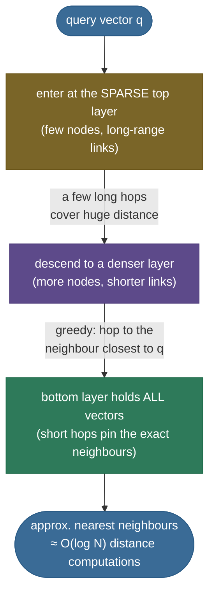
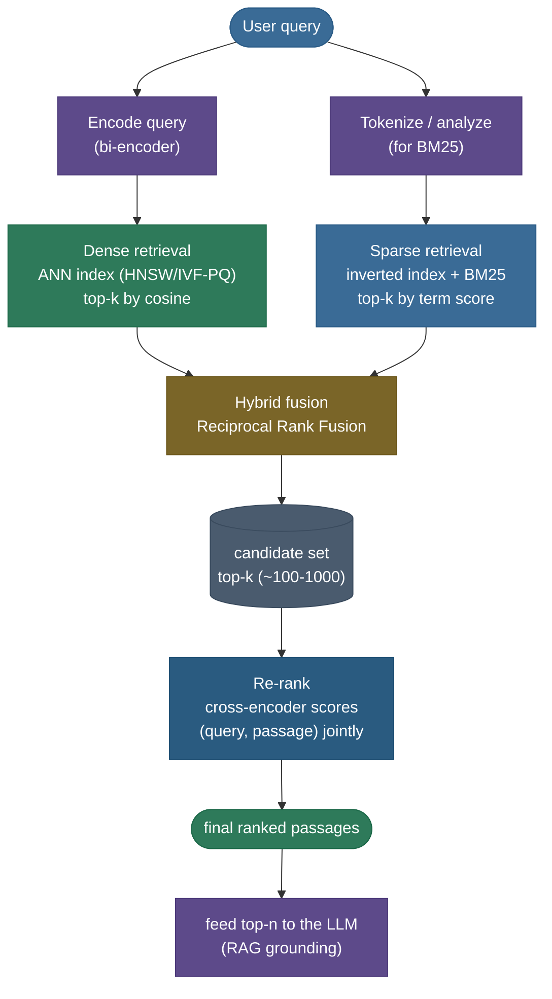

# Information Retrieval & Semantic Search: finding the needle in a billion-document haystack

You type *"how do I fix my car?"* into a search box. Somewhere in a corpus of a hundred million documents sits the one passage you need — written, as it happens, by an author who never used the word *car* once. They wrote *automobile*. A 1990s keyword search would hand you back every page that literally contains *fix* and *my* and *car* and rank that automobile-repair passage **dead last**, because by the only yardstick it knows — word overlap — that passage scores zero. The whole field of **information retrieval (IR)** is the long campaign to fix that failure: to rank documents by *what the query means*, not merely *which strings it shares*, and to do it over billions of documents in **single-digit milliseconds**.

This is also, today, the single most load-bearing component of the LLM stack. Every retrieval-augmented generation (RAG) system, every "chat with your docs" product, every coding assistant that pulls the right file into context, every agent that searches a knowledge base — all of them are an IR system wearing a trench coat. The LLM is the generator; the **retriever** is what decides *what facts the LLM even gets to see*. Get retrieval wrong and the most capable model in the world confidently makes things up. So this page is not a survey — it is the engine room.

I'm going to build the whole thing the way I'd teach it at a whiteboard, deriving every piece from the problem it solves. We start with the bedrock — **sparse, lexical** retrieval and the inverted index that makes it fast — feel exactly where it breaks (the **vocabulary-mismatch** wall), then climb to **dense** retrieval (encode meaning into vectors), confront the brutal cost of exact nearest-neighbor search, and earn the three great **approximate nearest neighbor (ANN)** tricks — **HNSW, IVF, and product quantization**. Then we **fuse** sparse and dense (reciprocal rank fusion, derived), **re-rank** the survivors with an expensive-but-precise cross-encoder, learn to **measure** all of it (precision@k, recall@k, MRR, nDCG — each derived by hand), and finally wire the whole thing into RAG. By the end you'll be able to:

- explain the **inverted index** and *why* it makes boolean and BM25 retrieval fast, and exactly where lexical retrieval fails;
- **derive** the DPR dual-encoder contrastive loss and explain in-batch negatives;
- explain the $O(N\cdot d)$ exact-kNN cost and **how HNSW, IVF, and PQ each beat it** — including the PQ memory math;
- **fuse** two rankings with RRF and **re-rank** with a cross-encoder, and say *why* the two-stage funnel exists;
- **compute** precision@k, recall@k, MRR, and nDCG for a ranked list **by hand**;
- connect all of it to RAG, vector databases, and the production knobs (recall vs latency vs memory) that decide what you can ship.

> **Note:** keep two words straight from the start. **Retrieval** is *recall-oriented* — cheaply pull a few hundred *plausibly* relevant candidates out of millions. **Ranking** (especially re-ranking) is *precision-oriented* — carefully order a small candidate set so the best ones float to the very top. Almost every modern IR system is this two-stage shape, and conflating the stages is the root of most design confusion.

---

## The problem: rank relevant documents from a huge corpus

State it precisely, because the precision is the whole game. We have a **corpus** $D = \{d_1, d_2, \dots, d_N\}$ of $N$ documents (or *passages* — chunks of documents), and a stream of **queries** $q$. For each query we must return a **ranked list** of documents, ordered so that the ones a human would judge **relevant** to $q$ sit at the top. We are judged by how well that ordering matches human relevance — and we must produce it **fast** (milliseconds) and **cheap** (you cannot run a 7B-parameter model against all 100M documents per query).

Two forces pull against each other and define every design decision in this page:

- **Quality** — how well does our ranking match true relevance? (Captured by nDCG, MRR, recall@k — derived below.)
- **Cost** — latency per query, memory for the index, and dollars of compute.

The naive "perfect-quality" system — score *every* document against the query with the most powerful model you have, then sort — is trivially correct and completely unusable: scoring 100M documents per query with a transformer would take minutes and a data center. **Everything clever in IR is a way to approximate that ideal ranking at a tiny fraction of its cost.** Hold that framing; we'll return to it at every step.

> **Tip:** in an interview, the strongest opening move is to *name the two-stage architecture immediately*: "cheap **retriever** narrows millions → hundreds; expensive **re-ranker** orders those hundreds." It signals you understand that IR is fundamentally a **cost-managed approximation** of an ideal ranking, not a single magic scorer.

Here is the whole machine on one page — a **sparse** retriever (BM25 over an inverted index) and a **dense** retriever (bi-encoder over an ANN index) running in parallel, **fused** (RRF), then a precise **cross-encoder re-ranker** ordering the survivors. We build it piece by piece below; keep this map in mind.


---

## Sparse, lexical retrieval: the inverted index

The oldest and still-everywhere approach treats a document as a **bag of terms** and scores it by *term overlap* with the query. We covered the representation in [03 Bag-of-Words & TF-IDF](../03-Bag-of-Words-and-TF-IDF/03-Bag-of-Words-and-TF-IDF.md); here we care about the two things that make it a *search engine*: the **data structure** that makes it fast, and the **scoring function** that makes it good.

### Why a forward scan is hopeless — and what to do instead

The obvious way to find documents containing a query term is to scan every document and check. That's $O(N \times \text{doc length})$ **per query term** — hopeless at $N = 100\text{M}$. The fix is one of the most important data structures in all of computing: the **inverted index**.

A *forward* index maps `document → list of its terms`. An **inverted index** flips it: it maps `term → posting list`, where a **posting list** is the sorted list of document IDs that contain that term (plus, usually, the term frequency and positions within each doc). It's the index at the back of a textbook: instead of reading every page to find *"mitochondria,"* you look up the word once and it tells you exactly which pages.

```
TERM            POSTING LIST  (docID : term-freq)
-------------   --------------------------------------------------
"automobile"  -> [ d0:1, d57:2, d811:1, ... ]
"fix"         -> [ d2:1, d4:2, d2391:1, ... ]
"car"         -> [ d4:1, d88:3, d502:1, ... ]
"engine"      -> [ d0:1, d4:1, d771:2, ... ]
```

To answer a query, you fetch **only the posting lists of the query's terms** and merge them. A term appearing in 1,000 documents touches 1,000 postings — not 100M documents. This is *why* keyword search feels instant: you never look at a document that shares **no** word with the query. The cost is proportional to how many documents contain the query's (rare) terms, not to corpus size.


> **Note:** the inverted index is the reason classical search scales. The entire posting-list machinery — skip pointers, delta-compressed doc IDs, block-max WAND for early termination — exists to merge those lists even faster. You don't need the internals for an interview, but you *do* need to say: "lexical retrieval is fast because the **inverted index** lets us touch only documents that share a query term."

> **Source / derivation:** the inverted index, boolean and ranked retrieval, and IR evaluation (precision/recall, MAP, nDCG) are developed from first principles in [Manning, Raghavan & Schütze, *Introduction to Information Retrieval*](https://nlp.stanford.edu/IR-book/html/htmledition/irbook.html) — Ch. 1 (inverted index), Ch. 6 (term weighting), Ch. 8 (evaluation). Our `build_inverted_index()` in [`information_retrieval.py`](code/information_retrieval.py) builds the `term → posting list` map shown above.

### Boolean retrieval, then ranked retrieval

The simplest query model is **boolean**: `"engine" AND "automobile"` returns the *intersection* of the two posting lists; `OR` returns the union; `NOT` the difference. Set operations on sorted lists are linear in their length. Boolean retrieval is exact and fast but **unranked** — it tells you *which* documents match, not *which match best*. A query matching 50,000 documents is useless without an order.

So we move to **ranked retrieval**: assign each matching document a **relevance score** and sort descending. The classic scores are TF-IDF and its battle-hardened successor **BM25**.

### From TF-IDF to BM25

TF-IDF (derived in [03 Bag-of-Words & TF-IDF](../03-Bag-of-Words-and-TF-IDF/03-Bag-of-Words-and-TF-IDF.md)) scores a query–document pair by summing, over query terms $t$, the product of **term frequency** (how often $t$ appears in $d$) and **inverse document frequency** (how rare $t$ is across the corpus — rare terms are more discriminating). It works, but it has two flaws BM25 fixes:

1. **Raw term frequency grows unboundedly.** A document mentioning *engine* 100 times isn't 100× more relevant than one mentioning it once — relevance **saturates**. BM25 runs TF through a saturating function.
2. **Long documents win unfairly.** A long document accumulates more term hits just by being long. BM25 **normalizes by document length**.

The **BM25** score of document $d$ for query $q$ (Robertson & Zaragoza, 2009) is:

$$
\text{BM25}(q, d) \;=\; \sum_{t \in q} \text{IDF}(t) \cdot \frac{f(t, d)\,(k_1 + 1)}{f(t, d) + k_1\left(1 - b + b\,\dfrac{|d|}{\text{avgdl}}\right)}
$$

Reading every symbol:

- $f(t, d)$ — frequency of term $t$ in document $d$.
- $|d|$ — length of $d$ (in tokens); $\text{avgdl}$ — average document length in the corpus.
- $k_1$ (typically **1.2–2.0**) — the **TF-saturation** knob. As $f \to \infty$ the fraction approaches $k_1 + 1$, so each extra occurrence adds diminishing relevance. Set $k_1 = 0$ and TF is ignored entirely.
- $b$ (typically **0.75**) — the **length-normalization** knob. $b = 0$ disables length normalization; $b = 1$ fully divides by relative length. A document longer than average gets its TF discounted.
- $\text{IDF}(t) = \ln\!\left(\dfrac{N - n_t + 0.5}{n_t + 0.5} + 1\right)$ — the BM25 IDF, where $n_t$ is the number of documents containing $t$. A term in *every* document contributes ~0; a *rare* term contributes a lot.

> **Source / derivation:** [Robertson & Zaragoza (2009), *The Probabilistic Relevance Framework: BM25 and Beyond*](https://www.staff.city.ac.uk/~sbrp622/papers/foundations_bm25_review.pdf) — §3 derives the saturating TF term and the length-normalization factor from the probabilistic relevance model; the $\ln\!\big(\tfrac{N-n_t+0.5}{n_t+0.5}+1\big)$ IDF is its eq. (3). Our from-scratch `bm25_scores()` in [`information_retrieval.py`](code/information_retrieval.py) implements this exactly and is verified rank-for-rank against `rank_bm25.BM25Okapi` in the notebook.

> **Note:** the structure to remember: **BM25 = IDF (rarity) × saturated, length-normalized TF**. That single sentence is the most-asked lexical-IR interview answer. TF-IDF down-weights common words; BM25 *additionally* saturates repeats and corrects for document length — which is why it's the default classical ranker in Lucene, Elasticsearch, and OpenSearch a quarter-century on.

> **Tip:** BM25 has **no training and no embeddings**. It's a fixed formula over term statistics, computable directly from the inverted index. That makes it shockingly strong as a baseline, instant to deploy, perfectly interpretable ("this doc ranked high because of *these* rare query terms"), and a genuinely hard target for fancy neural retrievers to beat on keyword-heavy queries. **Never skip the BM25 baseline.**


---

## Where lexical retrieval breaks: the vocabulary-mismatch problem

Now the wall. Lexical retrieval can only score a document on **terms it literally shares** with the query. It has no notion that *car* and *automobile* mean the same thing, that *physician* and *doctor* are synonyms, or that *"how do I stop my laptop overheating"* and *"reduce notebook thermal throttling"* are the same question. This is the **vocabulary-mismatch problem** (also called the *lexical gap*): relevant documents are invisible to lexical search when they phrase the answer differently.

Let me make it concrete and **measured**, not hand-waved. Take this 8-document corpus and the query *"How do I fix my car?"* — where the genuinely relevant passage (d0) talks about an **automobile**, never a *car*:

```
d0: "A mechanic repaired the automobile engine and replaced the worn brake pads."   <- GOLD
d2: "I had to fix the spelling errors in my report before submitting it."           <- lexical distractor (shares 'fix','my')
d4: "How to fix my code when the build breaks on my machine."                        <- lexical distractor (shares 'how','fix','my')
... (4 unrelated docs)
```

Run a from-scratch BM25 (verified rank-for-rank against `rank_bm25`) and a dense bi-encoder (`all-MiniLM-L6-v2`, with a deterministic synthetic fallback so it runs offline) over this corpus — all in [`information_retrieval.py`](code/information_retrieval.py). The **measured** result:

| Method | Rank of the gold passage d0 | What it ranked above it |
|---|---|---|
| **BM25 (lexical)** | **#3** | d4, d2 — the *fix/my/how* distractors |
| **Dense bi-encoder** | **#1** | nothing — it's first |
| **Hybrid (RRF of both)** | **#2** | one distractor |

BM25 ranks two **off-topic** documents above the right answer purely because they share the surface words *fix* and *my*, while the gold passage — which actually answers the question — shares *zero* query terms (it says *automobile*, not *car*), so its BM25 score is exactly **0**. The dense encoder, which scores by **meaning**, puts it first.


> **Gotcha:** the *converse* failure is just as real, and it's why we don't simply throw lexical retrieval away. Dense retrieval can **miss exact matches** — a product SKU like `XJ-4471`, a function name `parse_headers`, a rare surname, a legal citation. These carry little semantic signal but are *exactly* what the user typed, and BM25 nails them while a dense encoder may drift to "similar-looking" but wrong tokens. Lexical is strong on **precise/rare terms**; dense is strong on **paraphrase/synonymy**. This complementarity is the entire argument for **hybrid search** later.

---

## Dense retrieval: encode meaning into vectors

The cure for vocabulary mismatch is to stop comparing *strings* and start comparing *meaning*. **Dense retrieval** encodes the query and every passage into fixed-length vectors (embeddings — see [07 Sentence & Document Embeddings](../07-Sentence-and-Document-Embeddings/07-Sentence-and-Document-Embeddings.md)) in a shared space, trained so that **a query lands near the passages that answer it**. Relevance becomes geometric proximity.

The architecture is a **bi-encoder** (also "dual encoder"): two encoders (often sharing weights), one for queries and one for passages. Each produces a $d$-dimensional vector (typically $d = 384$ to $1024$). Score a pair by **dot product** or **cosine similarity**:

$$
s(q, p) \;=\; E_Q(q) \cdot E_P(p) \qquad\text{or}\qquad \cos\bigl(E_Q(q), E_P(p)\bigr) = \frac{E_Q(q)\cdot E_P(p)}{\lVert E_Q(q)\rVert\,\lVert E_P(p)\rVert}.
$$

> **Source / derivation:** the dual-encoder dot-product score is the scoring function of [Karpukhin et al. (2020), *Dense Passage Retrieval for Open-Domain QA*](https://arxiv.org/abs/2004.04906) (eq. 1, $\text{sim}(q,p)=E_Q(q)^\top E_P(p)$). Cosine is the same dot product on **unit-normalized** vectors — the geometry of comparison is worked through in [AI-ML-intuition 1.06 Vector Similarities — the Scaled Dot-Product](../../../AI-ML-intuition/Module_1_Representation/1.06_Vector_Similarities_The_Scaled_Dot-Product.md). Our `cosine_matrix()` in [`information_retrieval.py`](code/information_retrieval.py) computes it directly.

The decisive engineering property is **precomputation**: the corpus passages can be encoded **once, offline**, and stored in an index. At query time you encode *only the query* (one forward pass) and search the index. This is what makes dense retrieval fast enough to deploy — passage encoding is amortized away.

> **Note:** the phrase to own is **"the corpus is encoded offline; only the query is encoded online."** A bi-encoder is *separable* — query and passage never interact until the final dot product — which is precisely what lets you precompute the corpus and pre-build a nearest-neighbor index. Contrast this with the cross-encoder (below), which *jointly* reads (query, passage) and therefore can't be precomputed. The whole two-stage architecture lives in this distinction.

### DPR and the contrastive objective (derived)

How do you *train* the encoders so that queries land near their answers? You can't just minimize distance to the right passage — collapse everything to one point and distance is zero. You need a **contrastive** objective: pull the query **toward its positive passage** and **push it away from negatives**. **Dense Passage Retrieval (DPR)** (Karpukhin et al., 2020) does exactly this.

For a training query $q_i$ with one relevant (**positive**) passage $p_i^+$ and a set of irrelevant (**negative**) passages $\{p_{i,j}^-\}$, define the loss as the negative log-likelihood of picking the positive out of the candidate set, under a softmax over similarity scores:

$$
\mathcal{L}(q_i, p_i^+, p_{i,1}^-, \dots) \;=\; -\log \frac{\exp\!\bigl(s(q_i, p_i^+)\bigr)}{\exp\!\bigl(s(q_i, p_i^+)\bigr) + \displaystyle\sum_{j}\exp\!\bigl(s(q_i, p_{i,j}^-)\bigr)}.
$$

> **Source / derivation:** this is the negative-log-likelihood objective of [Karpukhin et al. (2020), DPR](https://arxiv.org/abs/2004.04906) (eq. 2) — itself the InfoNCE / noise-contrastive form of [van den Oord et al. (2018), *Representation Learning with Contrastive Predictive Coding*](https://arxiv.org/abs/1807.03748). The in-batch-negatives reduction to a cross-entropy over the $B\times B$ similarity matrix is DPR §3.

Read it as a classification: among {positive + all negatives}, the model must assign highest similarity to the positive. Minimizing $-\log(\cdot)$ drives $s(q_i, p_i^+)$ **up** and every $s(q_i, p_{i,j}^-)$ **down** — exactly "pull positives close, push negatives away." It's the InfoNCE loss, the workhorse of contrastive learning.

The clever, cheap trick that made DPR practical is **in-batch negatives**. In a training batch of $B$ (query, positive-passage) pairs, take *every other query's positive passage as a negative for this query*. One batch of $B$ pairs gives each query $B-1$ negatives **for free** — no extra encoding, since those passages are already encoded in the batch. Concretely, encode all $B$ queries and all $B$ passages, form the $B \times B$ similarity matrix $S_{ij} = E_Q(q_i)\cdot E_P(p_j)$, and the loss becomes plain **cross-entropy over each row with the diagonal as the correct class** (the $i$-th query's true positive is the $i$-th passage):

$$
\mathcal{L} \;=\; -\frac{1}{B}\sum_{i=1}^{B} \log \frac{\exp(S_{ii})}{\sum_{j=1}^{B}\exp(S_{ij})}.
$$

> **Note:** in-batch negatives are why bigger batches train better retrievers — a batch of 256 gives 255 negatives per query at almost no extra cost. DPR also showed that adding a few **hard negatives** (BM25's top wrong answers — lexically similar but irrelevant) sharpens the encoder dramatically, because those are exactly the confusable cases. "Mine hard negatives" is one of the highest-leverage tricks in retrieval training.

> **Tip:** modern open embedding models (E5, BGE, GTE, Nomic, `all-MiniLM`) are DPR's descendants trained on **orders of magnitude more pairs** with better negatives and instruction-tuning. The *objective* is the same contrastive softmax; the *scale and data* are what moved retrieval quality from "DPR beats BM25 on Natural Questions" to "off-the-shelf embeddings beat BM25 on most benchmarks." Know the loss; it's the thing interviewers probe.

---

## The cost of exact search, and approximate nearest neighbors

Dense retrieval reduces "find relevant passages" to **find the vectors nearest the query vector** — a [k-nearest-neighbors](../../03.%20Supervised_Learning/concepts/04-k-Nearest-Neighbors.md) search in $d$-dimensional space. The trouble: doing it **exactly** means comparing the query against **every** stored vector.

**Exact (brute-force) kNN** computes $N$ dot products of dimension $d$ each — $O(N \cdot d)$ per query. With $N = 10^7$ passages and $d = 768$, that's ~$7.7 \times 10^9$ multiply-adds **per query**. One query you can do; thousands per second over a growing corpus you cannot — and the **memory** to store $10^7 \times 768$ floats is ~30 GB before you've searched anything. Exact search has perfect recall and ruinous cost. (FAISS calls this index `IndexFlat`; it's the ground truth everything else is measured against.)

The escape is to give up *exactness*: return the **approximate** nearest neighbors — almost always the right ones, occasionally a near-miss — for orders of magnitude less time and memory. This is **approximate nearest neighbor (ANN)** search, and three ideas dominate it. Each attacks a different cost: **HNSW** cuts the *number of comparisons*, **IVF** cuts the *candidate set*, **PQ** cuts the *bytes per vector*. Real systems compose them.

![ANN trades a little recall for large speed and memory wins, measured in `code/make_figures_16.py`. Left: an IVF-style retriever's recall@10 vs exact climbs monotonically as you probe more cells (nprobe) — and the fraction of the corpus scanned (∝ latency, dotted) climbs with it. Exact kNN (red dashed) is recall 1.0 but scans 100%. There is no free lunch — only a chosen point on the recall-vs-cost curve. Right: product quantization compresses a 768-dim FP32 vector from 3072 bytes to a 96-byte code — 32× smaller — which is what lets billion-vector indexes fit in RAM (~3 TB → ~96 GB).](../images/ir_ann_tradeoff.png)

### HNSW — navigate a small-world graph

**Hierarchical Navigable Small World** graphs (Malkov & Yashunin, 2018) turn nearest-neighbor search into **graph navigation**. Build a graph where each vector is a node connected to its near neighbors; then *navigate* greedily from an entry point, hopping to whichever neighbor is closest to the query, until you can't get closer. Greedy graph descent finds the neighborhood of the query in a number of hops that grows roughly **logarithmically** with $N$ — the structure behind "six degrees of separation."

The **hierarchical** part is the key refinement (it's the same idea as a skip list). Build **layers**: the top layer has very few nodes with long-range links (express lanes across the space); each lower layer has more nodes and shorter links; the bottom layer holds everything. Search starts at the sparse top — a few long hops cover huge distance — then **descends** layer by layer, refining locally. Long hops up high get you to the right region fast; short hops down low pin the exact neighbors.

$$
\text{HNSW query} \;\approx\; O(\log N)\ \text{distance computations, vs.}\ O(N)\ \text{for exact.}
$$

> **Source / derivation:** [Malkov & Yashunin (2018), *Efficient and robust approximate nearest neighbor search using Hierarchical Navigable Small World graphs*](https://arxiv.org/abs/1603.09320) — the multi-layer small-world graph and the poly-logarithmic search-complexity result (§4–5); the hierarchy is the navigable-small-world analog of a skip list.

> **Note:** HNSW is the default in most vector databases (Qdrant, Weaviate, Milvus, pgvector, Lucene/Elasticsearch) because it gives **~95–99% recall at single-digit-millisecond latency** out of the box. Its costs are **memory** (it stores the full vectors *plus* the graph edges — heavier than IVF) and **slow inserts/deletes** (mutating the graph is expensive). The two tuning knobs: `M` (edges per node — higher = better recall, more memory) and `efSearch` (candidates explored per query — higher = better recall, slower). The recall–`nprobe` analog for IVF is measured below.



*HNSW search descends a hierarchy of small-world graphs: long express-lane hops at the sparse top find the right region fast, short hops at the dense bottom pin the exact neighbours — the skip-list idea applied to vectors, giving ≈ O(log N) comparisons instead of O(N).*

### IVF — cluster first, search a few clusters

**Inverted File** indexing (the "IVF" in FAISS) borrows the inverted-index idea for vectors. **Offline:** cluster all vectors into $n_{\text{list}}$ groups (k-means centroids — *coarse quantization*); each vector is filed under its nearest centroid. **At query time:** find the few centroids nearest the query and search **only the vectors in those clusters** (the `nprobe` closest cells), skipping the rest of the corpus entirely.

If you probe $n_{\text{probe}}$ of $n_{\text{list}}$ clusters, you scan roughly $\frac{n_{\text{probe}}}{n_{\text{list}}}$ of the corpus. With $n_{\text{list}}=1000$ and $n_{\text{probe}}=10$, that's **~1%** of the vectors — a 100× speedup, at the risk of missing a neighbor that fell just across a cluster boundary. **`nprobe` is the recall–latency dial:** probe more cells → higher recall, slower search. Measured precisely with FAISS (20k vectors, $d=64$, 100 IVF cells — the notebook's optional cell reproduces this):

| Method | recall@10 vs exact |
|---|---|
| IVF, nprobe=1 | **0.187** |
| IVF, nprobe=8 | **0.467** |
| IVF, nprobe=32 | **0.808** |

You can *watch* recall climb as you probe more cells — that's the dial in action. The from-scratch numpy IVF in [`information_retrieval.py`](code/information_retrieval.py) shows the same **monotonic knob** on a better-clustered synthetic set (0.44 → 1.00 over nprobe 1→16, plotted above). (Real corpora with better-separated clusters hit far higher IVF recall at the same `nprobe`; the point is the **monotonic knob**, not these absolute numbers.)

### Product quantization — compress the vectors themselves

HNSW and IVF cut *comparisons*; **product quantization (PQ)** (Jégou et al., 2011) cuts the **bytes per vector**, which is what lets a billion vectors fit in RAM. The idea: don't store full vectors — store **compact codes** that approximate them.

Split each $d$-dim vector into $m$ contiguous **subvectors** of dimension $d/m$. For each of the $m$ slots, learn a small **codebook** of $2^{\text{nbits}}$ centroids (k-means on that slice across the corpus, typically $\text{nbits}=8 \Rightarrow 256$ centroids). Now encode a vector by, for each subvector, storing the **ID of its nearest centroid** — just $\text{nbits}$ bits per subvector. A whole vector becomes $m$ small integer codes.

**Derive the compression.** Take $d = 768$, FP32 (4 bytes/dim), $m = 96$ subvectors, $\text{nbits} = 8$:

$$
\text{raw} = 768 \times 4 = 3072\ \text{bytes/vector}, \qquad
\text{PQ} = m \times \tfrac{\text{nbits}}{8} = 96 \times 1 = 96\ \text{bytes/vector}.
$$

$$
\text{compression} = \frac{3072}{96} = \mathbf{32\times}.
$$

> **Source / derivation:** [Jégou, Douze & Schmid (2011), *Product Quantization for Nearest Neighbor Search*](https://inria.hal.science/inria-00514462v2/document) — the subvector decomposition, per-slice codebooks, and asymmetric distance computation (§III–IV). The bytes-per-vector arithmetic is implemented in `pq_compression()` in [`information_retrieval.py`](code/information_retrieval.py) and drives the memory bars in the ANN figure.

A vector that took 3 KB now takes 96 bytes — so **1 billion** vectors drop from ~3 TB to ~96 GB, the difference between "needs a disk cluster" and "fits in one machine's RAM." Distances are computed *in the compressed space* using precomputed lookup tables (asymmetric distance computation), which is also fast.

> **Gotcha:** PQ is **lossy** — codes approximate the originals, so recall drops the more aggressively (larger $m$-reduction, fewer bits) you compress. The standard production recipe is **IVF + PQ together** (FAISS `IndexIVFPQ`): IVF narrows to a few clusters, PQ shrinks the vectors inside them, and an optional **re-ranking pass** re-scores the final handful with their *full* (uncompressed) vectors to recover precision. That's how billion-scale vector search runs on commodity hardware.

> **Tip:** the three knobs map cleanly to the three costs. **HNSW/IVF** → query *latency* (fewer comparisons). **PQ** → *memory* (fewer bytes). **All of them** → *recall* (the quality you trade away). When someone says "we tuned the ANN index," ask *which* of latency, memory, or recall they were buying — there is no free lunch, only a chosen point on the surface.

---

## The recall–latency–memory surface

Step back and see the whole trade-off as one object. Every ANN configuration is a point on a three-axis surface:

- **Recall@k** — fraction of the *true* top-k neighbors your approximate search actually returned. The quality you keep.
- **Latency** — milliseconds per query. Driven by how many vectors/comparisons you touch (HNSW `efSearch`, IVF `nprobe`).
- **Memory** — bytes for the index. Driven by quantization (PQ bits) and graph overhead (HNSW edges).

You cannot maximize all three. Crank recall toward 1.0 and you either slow down (probe/explore more) or use more memory (store full vectors). Shrink memory with PQ and recall dips. Speed up by probing fewer cells and recall dips. **The engineering job is to pick the point that meets your product's bar** — "≥95% recall@10 under 10 ms within 64 GB RAM" — and tune the three knobs to land there.

> **Note:** this is the dense-retrieval analog of the cost framing from the very top of the page. Exact kNN is the unaffordable ideal; ANN is a principled, **measurably-tuned approximation** of it. The interview-grade sentence: "ANN buys orders-of-magnitude speed/memory by spending a few percent of recall — and recall@k is exactly the metric that prices that trade."

---

## Hybrid search: fuse sparse and dense with RRF

We proved lexical and dense fail on *opposite* queries — BM25 misses synonyms; dense misses rare exact tokens. The obvious move is to run **both** and **combine** their rankings. The elegant, robust, training-free way is **Reciprocal Rank Fusion (RRF)** (Cormack et al., 2009).

The problem with naively adding scores is that **BM25 scores and cosine similarities live on incomparable scales** — a BM25 score of 14.2 and a cosine of 0.81 can't be summed meaningfully, and normalizing them is fiddly and corpus-dependent. RRF sidesteps scores entirely and fuses on **rank position only**. For a document $d$ that appears at rank $r_\ell(d)$ in result list $\ell$:

$$
\text{RRF}(d) \;=\; \sum_{\ell \in \text{lists}} \frac{1}{k + r_\ell(d)},
$$

> **Source / derivation:** [Cormack, Clarke & Buettcher (2009), *Reciprocal Rank Fusion Outperforms Condorcet and Individual Rank Learning Methods*](https://plg.uwaterloo.ca/~gvcormac/cormacksigir09-rrf.pdf) — defines the $\tfrac{1}{k+r}$ fusion and reports $k=60$ as the robust default. Our `reciprocal_rank_fusion()` in [`information_retrieval.py`](code/information_retrieval.py) reproduces the by-hand example below exactly.

where $r_\ell(d)$ is $d$'s 1-based rank in list $\ell$ (a document absent from a list contributes nothing), and $k$ is a small constant — **$k = 60$** is the standard default. The $\frac{1}{k+r}$ shape means **top ranks matter most** (rank 1 contributes much more than rank 10), the constant $k$ **damps** how sharply early ranks dominate, and crucially a document that appears **decently in both lists** beats one that ranks #1 in only one — fusion rewards **agreement**.

**Worked example — fuse two rankings by hand.** BM25 returns `[A, B, C, D, E]`; dense returns `[C, A, F, B, G]` (rank 1 first). With $k = 60$:

| Doc | BM25 rank → 1/(60+r) | Dense rank → 1/(60+r) | RRF total |
|---|---|---|---|
| **A** | 1 → 1/61 = 0.01639 | 2 → 1/62 = 0.01613 | **0.03252** |
| **C** | 3 → 1/63 = 0.01587 | 1 → 1/61 = 0.01639 | **0.03227** |
| **B** | 2 → 1/62 = 0.01613 | 4 → 1/64 = 0.01563 | **0.03175** |
| F | — | 3 → 1/63 = 0.01587 | 0.01587 |
| D | 4 → 1/64 = 0.01563 | — | 0.01563 |
| E | 5 → 1/65 = 0.01538 | — | 0.01538 |
| G | — | 5 → 1/65 = 0.01538 | 0.01538 |

**Fused order: A, C, B, F, D, E, G** (verified in code). Note the result: **A wins** even though it was rank 1 in *neither* list — it ranked high in *both* (1 and 2), and that agreement beats C's single #1. The documents both retrievers found bubble to the top; single-list-only documents (F, D, E, G) sink below all the agreed-upon ones. That's RRF doing its job: **trusting consensus**.

![Reciprocal Rank Fusion of BM25 = [A,B,C,D,E] and dense = [C,A,F,B,G], computed by `code/make_figures_16.py`. A wins (0.03252) despite ranking #1 in neither list — it placed 1 and 2 across the two, and that agreement beats C's single #1 (0.03227). The four documents that appear in only one list (F, D, E, G) sink below all three agreed-upon docs. RRF rewards consensus and needs no score calibration.](../images/ir_rrf.png)

> **Tip:** RRF is beloved in production (Elasticsearch, OpenSearch, Weaviate, and Qdrant all ship it) because it is **parameter-light, score-scale-agnostic, and shockingly hard to beat**. It needs no training, no score calibration, and fuses *any* number of rankers (you can throw in a third or fourth retriever). When asked "how do you combine BM25 and embeddings?", **RRF is the crisp, correct, no-caveats answer** — and you can derive its formula on the spot.

> **Gotcha:** RRF discards score *magnitudes*, keeping only ranks — usually a feature (robust to scale), occasionally a bug. If one retriever is *vastly* more confident than another on a given query, RRF can't express that; a *weighted* RRF ($\sum_\ell \frac{w_\ell}{k+r_\ell}$) or a learned fusion (a small model over both scores) recovers it. Reach for those only if measured fusion quality demands it — plain RRF is the right default.

Hybrid fusion recovers the gold passage in our earlier example: BM25 had it at #3, dense at #1, and **RRF lands it at #2** — pulled up by the dense signal, robust to BM25's miss. In a larger corpus with more distractors, hybrid routinely beats either retriever alone, which is exactly why it's the modern default.

---

## Re-ranking: a cross-encoder for the final precision

Retrieval (sparse, dense, or hybrid) is tuned for **recall** — get the right documents *somewhere* in the top ~100–1000 — at the cost of precise *ordering*. A bi-encoder must compress an entire passage into one vector **before it ever sees the query**, so it can't reason about fine-grained query–passage interactions. To get the very top results exactly right, add a second stage: a **re-ranker** that scores each candidate **jointly** with the query.

A **cross-encoder** concatenates `[query] [SEP] [passage]` into **one** transformer input and outputs a single relevance score, letting every query token attend to every passage token. This is far more accurate than a bi-encoder's dot product — it can tell that *"the bank of the river"* and *"the bank approved my loan"* differ even though their bag-of-vectors looks similar. The catch is the catch you already feel: a cross-encoder **cannot precompute** the corpus (the passage representation depends on the query), so scoring $N$ documents means $N$ full transformer passes — **impossible** over millions.

The resolution is the **two-stage retrieve-then-rerank** pattern:

1. **Retrieve** (cheap, recall-oriented): a bi-encoder/BM25/hybrid pulls the top ~100–1000 candidates from millions, fast.
2. **Re-rank** (expensive, precision-oriented): a cross-encoder scores **only those ~100–1000** jointly with the query and re-sorts them.

You pay the cross-encoder's cost on *hundreds* of documents, not millions — and you get its precision exactly where it matters, at the top of the list the user sees.




> **Note:** the mental model — **bi-encoder = fast filter, cross-encoder = careful judge.** The filter sifts millions down to a manageable pile; the judge reads each survivor against the query in full. Neither alone is enough: the judge is too slow for millions, the filter too coarse for the final order. Together they're the backbone of modern search and RAG.

### ColBERT — late interaction, the middle ground

There's an elegant point *between* a bi-encoder (one vector per text, fast but coarse) and a cross-encoder (full joint attention, precise but slow): **ColBERT** (Khattab & Zaharia, 2020). Instead of one vector per passage, ColBERT stores **one vector per token** and scores a pair by **MaxSim** — for each *query* token, find its most similar *passage* token, then sum those maxima:

$$
s(q, p) \;=\; \sum_{i \in q} \max_{j \in p}\ E(q_i)\cdot E(p_j).
$$

> **Source / derivation:** [Khattab & Zaharia (2020), *ColBERT: Efficient and Effective Passage Search via Contextualized Late Interaction over BERT*](https://arxiv.org/abs/2004.12832) — the MaxSim late-interaction operator (eq. 1). The token-level MaxSim mechanism is visualized as a heatmap in the sibling chapter [07 Sentence & Document Embeddings](../07-Sentence-and-Document-Embeddings/07-Sentence-and-Document-Embeddings.md).

Because the passage token vectors are still **precomputable offline**, ColBERT keeps bi-encoder-like indexing speed while recovering much of the cross-encoder's fine-grained, term-level matching — this is **late interaction** (query and passage tokens interact *late*, at scoring time, not inside the encoder). The cost is a much larger index (one vector per token, not per passage), which PQ-style compression then tames.

---

## Evaluation: precision@k, recall@k, MRR, nDCG

You cannot tune retrieval you cannot measure, and "looks good" is not a metric. IR has a precise vocabulary for "how good is this ranked list?" — and interviewers will ask you to compute each by hand. We'll use one running example: a query whose returned top-8, with **graded relevance** (3 = perfect, 0 = irrelevant), is

$$\text{rel} = [\,3,\ 2,\ 3,\ 0,\ 1,\ 2,\ 0,\ 0\,],$$

with **5 relevant documents** total in the returned set.

### Precision@k and Recall@k

**Precision@k** = fraction of the top-$k$ that are relevant. **Recall@k** = fraction of *all* relevant documents that appear in the top-$k$. They trade off as $k$ grows: precision tends to fall (you dip into worse results), recall rises (you capture more of the relevant set).

For our list, treating rel > 0 as "relevant" (relevant positions: 1,2,3,5,6 → 5 total):

| k | relevant in top-k | precision@k | recall@k |
|---|---|---|---|
| 1 | 1 | 1/1 = **1.00** | 1/5 = **0.20** |
| 3 | 3 | 3/3 = **1.00** | 3/5 = **0.60** |
| 5 | 4 | 4/5 = **0.80** | 4/5 = **0.80** |
| 8 | 5 | 5/8 = **0.625** | 5/5 = **1.00** |

![Precision@k (blue) falls and recall@k (green) rises as the cutoff k grows — the canonical IR trade-off — for rel = [3,2,3,0,1,2,0,0] with 5 relevant of 8. Precision dips once you reach into worse results; recall climbs to 1.0 by k=8 (all relevant captured). Computed from scratch in `code/make_figures_16.py`.](../images/ir_metrics_curve.png)

> **Note:** **recall@k is the retriever's metric, precision@k (and nDCG) the ranker's.** A retriever's job is "did the right doc make the top-100 *at all*" → recall@100. The re-ranker's job is "is it near the *top*" → precision@5 / nDCG@10. Quote the metric that matches the stage you're optimizing; mixing them up is a classic interview slip.

### Mean Reciprocal Rank (MRR)

When you care chiefly about **the first correct answer** (QA, "I'm feeling lucky" search), **reciprocal rank** is $1/(\text{rank of the first relevant result})$. **MRR** averages it over a query set $Q$:

$$
\text{MRR} \;=\; \frac{1}{|Q|}\sum_{q \in Q} \frac{1}{\text{rank}_q^{\text{first-relevant}}}.
$$

> **Source / derivation:** the reciprocal-rank measure dates to the [TREC-8 Question Answering Track (Voorhees, 1999)](https://trec.nist.gov/pubs/trec8/papers/qa_report.pdf), which scored systems by the reciprocal rank of the first correct answer; MRR is its mean over a query set. Implemented in `mean_reciprocal_rank()` in [`information_retrieval.py`](code/information_retrieval.py).

If three queries find their first relevant result at ranks 1, 3, and 2:

$$
\text{MRR} = \frac{1}{3}\left(\frac{1}{1} + \frac{1}{3} + \frac{1}{2}\right) = \frac{1}{3}(1 + 0.333 + 0.5) = \mathbf{0.611}.
$$

MRR rewards getting *a* right answer high; it ignores everything after the first hit. Perfect when there's essentially one answer; too blunt when a query has many relevant documents of varying quality — which is where nDCG comes in.

### Normalized Discounted Cumulative Gain (nDCG)

nDCG is the gold-standard ranking metric because it handles **graded relevance** (not just relevant/irrelevant) **and** position discounting (a great result at rank 1 is worth more than the same result at rank 8). Build it in three steps.

**1. DCG** — sum each result's **gain**, **discounted by a log of its rank** so deeper positions count less:

$$
\text{DCG@k} \;=\; \sum_{i=1}^{k} \frac{\text{gain}(\text{rel}_i)}{\log_2(i + 1)},
\qquad
\text{gain}(\text{rel}) = \underbrace{\text{rel}}_{\text{linear}} \ \text{ or }\ \underbrace{2^{\text{rel}} - 1}_{\text{exponential}}.
$$

> **Source / derivation:** [Järvelin & Kekäläinen (2002), *Cumulated Gain-based Evaluation of IR Techniques* (ACM TOIS 20(4))](https://doi.org/10.1145/582415.582418) — introduces (discounted) cumulated gain and the per-query ideal normalization. The **exponential gain** $2^{\text{rel}}-1$ — which rewards highly-relevant hits super-linearly — was popularized by [Burges et al. (2005), *Learning to Rank using Gradient Descent* (RankNet)](https://www.microsoft.com/en-us/research/publication/learning-to-rank-using-gradient-descent/) and is the default in much TREC/LightGBM tooling. The two conventions give **different numbers**; pick one and state it. We derive the worked table below with the **linear** gain — which is exactly what `sklearn.metrics.ndcg_score` computes, so the notebook can verify our number against it to the last digit. Implemented in `dcg_at_k` / `ndcg_at_k` (either gain) in [`information_retrieval.py`](code/information_retrieval.py).

For $\text{rel} = [3,2,3,0,1,2,0,0]$, with the **linear** gain (gain = rel), term by term:

| rank $i$ | $\text{rel}_i$ | $\log_2(i+1)$ | $\text{rel}_i/\log_2(i+1)$ |
|---|---|---|---|
| 1 | 3 | 1.000 | 3.000 |
| 2 | 2 | 1.585 | 1.262 |
| 3 | 3 | 2.000 | 1.500 |
| 4 | 0 | 2.322 | 0.000 |
| 5 | 1 | 2.585 | 0.387 |
| 6 | 2 | 2.807 | 0.712 |
| 7 | 0 | 3.000 | 0.000 |
| 8 | 0 | 3.170 | 0.000 |

$$\text{DCG@8} = 3.000 + 1.262 + 1.500 + 0 + 0.387 + 0.712 + 0 + 0 = \mathbf{6.861}.$$

**2. IDCG** — the DCG of the **ideal** ranking: sort the same relevance grades descending ($[3,3,2,2,1,0,0,0]$) and compute DCG. This is the best score *possible* for this set of grades:

$$\text{IDCG@8} = \frac{3}{1} + \frac{3}{1.585} + \frac{2}{2} + \frac{2}{2.322} + \frac{1}{2.585} + 0 + 0 + 0 = \mathbf{7.141}.$$

**3. nDCG** — normalize so the metric is **comparable across queries** (a query with more relevant docs naturally has a bigger DCG; dividing by *its own* ideal removes that):

$$
\text{nDCG@k} = \frac{\text{DCG@k}}{\text{IDCG@k}} = \frac{6.861}{7.141} = \mathbf{0.961}.
$$

A score of 0.961 means our ranking is 96.1% of the way to perfect for this query. **nDCG ∈ [0, 1]**, 1.0 = ideal order — and because it's normalized per query, you can average it across a whole evaluation set. (All three numbers are reproduced by `ndcg_decomposition()` and **verified equal to `sklearn.metrics.ndcg_score`** — same linear gain — in the notebook.)

![The nDCG decomposition for rel = [3,2,3,0,1,2,0,0], computed by `code/make_figures_16.py`. Left: each grade's discounted gain rel/log₂(i+1) for our ranking (blue) vs the ideal sorted ranking (green) — a perfect grade at rank 1 contributes more than the same grade deeper down. Right: DCG@8 = 6.861, the ideal IDCG@8 = 7.141, and their ratio nDCG@8 = 6.861/7.141 = 0.961 — 96.1% of the best-possible order. This linear-gain value matches sklearn exactly.](../images/ir_ndcg.png)

> **Tip:** the one-line mental model for nDCG — **"reward relevant results, discount them by how deep they sit, then normalize against the best-possible ordering so the score is 0–1 and averages across queries."** It's the default offline metric for search and RAG retrieval evaluation; BEIR (the standard zero-shot retrieval benchmark) reports **nDCG@10**.

---

## The connection to RAG: retrieval grounds the LLM

Everything above is the **retriever** half of retrieval-augmented generation. In RAG, a user question is answered not from the LLM's parametric memory alone but by **first retrieving relevant passages** from a corpus and **feeding them into the prompt** as grounding context. The pattern: embed the question → ANN-search a vector index of document chunks → (optionally re-rank) → stuff the top-$n$ passages into the prompt → the LLM answers *from those passages*, ideally with citations.

Retrieval quality **is** RAG quality. If the retriever doesn't surface the passage containing the answer, no amount of LLM capability recovers it — the model either hallucinates or says it doesn't know. This is why a RAG project's effort goes overwhelmingly into the retrieval stack you just built: chunking, embeddings, hybrid search, re-ranking, and evaluation. The generator is the easy part; the **retriever is where RAG is won or lost**. (Deep dive: the canonical RAG home is [11. RAG & LLM Applications](../../11.%20RAG_and_LLM_Applications/concepts/README.md); the *why* is in [AI-ML-intuition 8.02 Retrieval-Augmented Generation](../../../AI-ML-intuition/Module_8_LLMs_and_Agentic_Systems/8.02_Retrieval_Augmented_Generation.md).)

> **Note:** the same retrieve-then-rerank funnel powers RAG, web search, recommendation, code assistants, and agent memory. Master IR and you've mastered the substrate under a huge swath of applied AI — which is exactly why it's a *very-high-frequency* interview topic.

### Chunking — the silent quality lever

You don't embed whole documents; you embed **chunks** (passages of a few hundred tokens). Chunking is deceptively consequential: chunks too **large** dilute the embedding (one vector averaging many topics → fuzzy matches and wasted context window) and bury the answer in noise; too **small** and a chunk loses the surrounding context needed to be self-explanatory (a pronoun with no antecedent, a number with no unit). Practical recipes: split on semantic boundaries (paragraphs, headings, sentences) rather than fixed character counts, add a **token overlap** between adjacent chunks so an answer straddling a boundary survives, and sometimes prepend the document/section title to each chunk so it carries its own context.

> **Gotcha:** chunking is the most common silent failure in production RAG. A retriever that "doesn't work" is frequently a *chunking* problem — the answer was split across two chunks, or drowned in a 2,000-token mega-chunk, so the right vector never scored high. Before blaming the embedding model, **inspect the chunks** the retriever actually had to match against.

### Query expansion and HyDE

Sometimes the *query* is the problem — too short, too ambiguous, or phrased unlike the documents. Two fixes:

- **Query expansion** — enrich the query with related terms/synonyms (classically pseudo-relevance feedback; today, ask an LLM to rewrite or expand it) so it overlaps more documents.
- **HyDE (Hypothetical Document Embeddings)** (Gao et al., 2022) — a neat inversion: ask an LLM to **hallucinate a plausible answer** to the query, then embed *that fake answer* and search with its vector. The intuition is sharp: a hypothetical *answer* lives in the same region of embedding space as the *real* answer passages — far closer than the terse *question* does. You search "answer-to-answer" instead of "question-to-answer." It often beats raw query embedding, especially for short or abstract queries.

---

## Vector databases and the production stack

Where do the embeddings *live*? In a **vector database** or vector index — infrastructure built to store millions/billions of vectors and serve ANN queries with metadata filtering, updates, and persistence.

- **FAISS** (Johnson et al., 2019) — Facebook AI's library, the de-facto standard for *building* ANN indexes (Flat, IVF, HNSW, PQ, and combinations, with GPU support). It's a **library, not a server** — you embed it in your app and manage storage/serving yourself. The reference implementation everyone benchmarks against.
- **Managed / server vector DBs** — Qdrant, Weaviate, Milvus, Pinecone, Vespa, and Postgres' **pgvector** add a service layer: CRUD, metadata filtering ("vectors *where* `tenant = X` and `date > Y`"), sharding, replication, persistence, and hybrid (BM25 + vector) search out of the box. You pick based on scale, filtering needs, and whether you want managed or self-hosted.

> **Tip:** "vector database" is mostly a **serving and lifecycle wrapper around an ANN index** (often FAISS- or HNSW-derived) plus the boring-but-critical production features: metadata filtering, real-time upserts/deletes, persistence, multi-tenancy, and horizontal scale. The *algorithm* is HNSW/IVF/PQ from above; the *product* is everything around it. In a system-design interview, name the index type **and** the operational concerns (filtering, updates, scale) — that's the staff-level answer.

---

## Code: build a hybrid semantic-search engine end to end

> **Runnable project and a step-by-step notebook:** every number on this page — BM25, dense cosine, RRF, the cross-encoder re-rank, precision/recall/MRR/nDCG, and the ANN sweep — is produced by one seeded source of truth, [`information_retrieval.py`](code/information_retrieval.py), and walked cell-by-cell (each asserting its point before printing, then verified against `rank_bm25` and `sklearn`) in the [step-by-step teaching notebook](code/16-Information-Retrieval-and-Semantic-Search.ipynb). The figures above come from the same backend via [`make_figures_16.py`](code/make_figures_16.py), so the page, the notebook, and the figures cannot disagree. It runs **offline on CPU** (a real `all-MiniLM-L6-v2` if reachable, a deterministic synthetic encoder otherwise) in a few seconds.

Here's the heart of it — **BM25 + dense bi-encoder + RRF fusion** over the vocabulary-mismatch corpus — reproducing the measured ranks cited throughout this page (the library one-liners; the from-scratch BM25 / RRF / metrics live in the script).

```python
"""Hybrid semantic search: BM25 + dense bi-encoder + RRF fusion.
Verified on Python 3.12 (rank_bm25, sentence-transformers 5.x), CPU."""
import numpy as np
from rank_bm25 import BM25Okapi
from sentence_transformers import SentenceTransformer

corpus = [
    "A mechanic repaired the automobile engine and replaced the worn brake pads.",  # d0 GOLD
    "A balanced diet and regular exercise keep your heart healthy.",                # d1
    "I had to fix the spelling errors in my report before submitting it.",          # d2 distractor
    "Stock markets fell sharply amid fears of rising interest rates.",              # d3
    "How to fix my code when the build breaks on my machine.",                      # d4 distractor
    "The doctor advised the patient to rest and drink plenty of fluids.",           # d5
    "Photosynthesis converts sunlight into chemical energy in plants.",             # d6
    "Quarterly earnings beat analyst expectations, lifting the share price.",       # d7
]
query, gold = "How do I fix my car?", 0     # 'car' never appears literally; d0 says 'automobile'

# --- 1. SPARSE: BM25 over a tokenized corpus ---
tok = [c.lower().replace(".", "").split() for c in corpus]
bm25 = BM25Okapi(tok)
bm_scores = np.array(bm25.get_scores(query.lower().replace("?", "").split()))
bm_order = np.argsort(-bm_scores)                       # doc ids, best first

# --- 2. DENSE: bi-encoder, cosine via normalized dot product ---
model = SentenceTransformer("sentence-transformers/all-MiniLM-L6-v2")
emb = model.encode([query] + corpus, normalize_embeddings=True)
dn_scores = emb[1:] @ emb[0]                            # cosine(query, each passage)
dn_order = np.argsort(-dn_scores)

# --- 3. HYBRID: Reciprocal Rank Fusion (k=60) ---
def rrf(*orders, k=60):
    s = np.zeros(len(corpus))
    for order in orders:
        for rank, doc in enumerate(order):             # rank is 0-based here
            s[doc] += 1.0 / (k + rank + 1)
    return s
hy_order = np.argsort(-rrf(bm_order, dn_order))

rank_of = lambda order, idx: list(order).index(idx) + 1
print(f"BM25   gold rank: {rank_of(bm_order, gold)}   top-3 docs: {bm_order[:3].tolist()}")
print(f"Dense  gold rank: {rank_of(dn_order, gold)}   top-3 docs: {dn_order[:3].tolist()}")
print(f"Hybrid gold rank: {rank_of(hy_order, gold)}   top-3 docs: {hy_order[:3].tolist()}")
```

Output:

```
BM25   gold rank: 3   top-3 docs: [4, 2, 0]
Dense  gold rank: 1   top-3 docs: [0, 4, 2]
Hybrid gold rank: 2   top-3 docs: [4, 0, 2]
```

The numbers tell the whole story in three lines: **BM25 buries the right answer at #3** behind two lexical distractors; the **dense encoder ranks it #1**; **RRF fusion** recovers it to #2, robust to BM25's miss. This is the vocabulary-mismatch lesson, measured.

### Measuring ANN recall with FAISS

And here's the ANN recall–latency knob made concrete — IVF `nprobe` against exact ground truth (FAISS):

```python
"""Measure ANN recall@10 vs an exact baseline. Verified on Python 3.12 (faiss-cpu)."""
import numpy as np, faiss
np.random.seed(0)
d, N, nq = 64, 20_000, 200
xb = np.random.randn(N, d).astype("float32"); faiss.normalize_L2(xb)
xq = xb[np.random.choice(N, nq, replace=False)].copy()       # queries with known neighbors

flat = faiss.IndexFlatIP(d); flat.add(xb)                    # EXACT ground truth
_, gt = flat.search(xq, 10)

ivf = faiss.IndexIVFFlat(faiss.IndexFlatIP(d), d, 100, faiss.METRIC_INNER_PRODUCT)
ivf.train(xb); ivf.add(xb)
recall = lambda I: np.mean([len(set(I[i]) & set(gt[i])) / 10 for i in range(nq)])
for nprobe in (1, 8, 32):
    ivf.nprobe = nprobe
    _, I = ivf.search(xq, 10)
    print(f"IVF nprobe={nprobe:2d}: recall@10 = {recall(I):.3f}")   # 0.187 / 0.467 / 0.808
```

```
IVF nprobe= 1: recall@10 = 0.187
IVF nprobe= 8: recall@10 = 0.467
IVF nprobe=32: recall@10 = 0.808
```

Probing more cells **monotonically raises recall** — the latency–recall dial, measured. (On real, well-clustered embeddings these numbers run far higher at the same `nprobe`; the point is the knob.) Together these two scripts are a complete, honest miniature of a production retriever: sparse + dense + fusion for *ranking*, ANN tuning for *cost*.

---

## Recap and rapid-fire

**If you remember nothing else:** IR ranks relevant documents from a huge corpus by approximating an unaffordable ideal ranking cheaply. **Lexical** retrieval (inverted index + **BM25**) is fast, interpretable, and strong on exact terms, but blind to synonyms — the **vocabulary-mismatch** wall. **Dense** retrieval encodes meaning into vectors (bi-encoder, trained with the **DPR contrastive + in-batch-negatives** loss) and crosses that wall, at the cost of an $O(N\cdot d)$ nearest-neighbor search that **ANN** (HNSW for fewer hops, IVF for fewer candidates, **PQ** for fewer bytes) tames by trading a little **recall** for big **latency/memory** wins. **Hybrid** search fuses both via **RRF** (rank-based, score-agnostic, $\frac{1}{k+r}$), and a **cross-encoder re-ranker** precisely orders the cheap retriever's top-k. You measure it with **precision@k / recall@k / MRR / nDCG**, and you wire it into **RAG**, where retrieval quality is the ceiling on answer quality.

**Quick-fire — say these out loud:**

- *Why is lexical search fast?* The **inverted index** — fetch only the posting lists of query terms, never touch documents that share no word.
- *BM25 in one line?* IDF (rarity) × **saturated**, **length-normalized** term frequency — TF-IDF with a TF ceiling ($k_1$) and a length correction ($b$).
- *What breaks lexical retrieval?* **Vocabulary mismatch** — *car* vs *automobile*; relevant docs that phrase it differently are invisible.
- *What loss trains DPR?* A **contrastive softmax** (InfoNCE) pulling the query toward its positive and away from negatives, with **in-batch negatives** = cross-entropy over the $B \times B$ similarity matrix, diagonal = positives.
- *Exact-kNN cost?* $O(N\cdot d)$ per query — infeasible at scale; ANN approximates it.
- *HNSW vs IVF vs PQ?* HNSW = ~log N graph hops (fewer comparisons); IVF = search a few clusters (fewer candidates); PQ = compress vectors to codes (fewer bytes, e.g. 3072 B → 96 B = 32×).
- *Combine sparse + dense?* **RRF**: $\sum_\ell \frac{1}{k+r_\ell(d)}$, $k=60$ — rank-based, no score calibration; rewards agreement across lists.
- *Why a cross-encoder re-ranker, and why only top-k?* It scores (query, passage) **jointly** for precision but can't precompute the corpus — so you run it on the retriever's ~100–1000 survivors, not millions.
- *nDCG?* DCG = $\sum \text{rel}_i / \log_2(i+1)$, normalized by the ideal IDCG → $[0,1]$, averages across queries.
- *Connection to RAG?* Retrieval **grounds** the LLM; retrieval recall is the hard ceiling on RAG answer quality.

---

## References and further reading

The curated link library for this topic — videos, courses, articles, papers, books, and internal cross-links — lives in a companion file so it can be reused as a standalone reference list:

**→ [Information Retrieval & Semantic Search — references and further reading](16-Information-Retrieval-and-Semantic-Search.references.md)**
