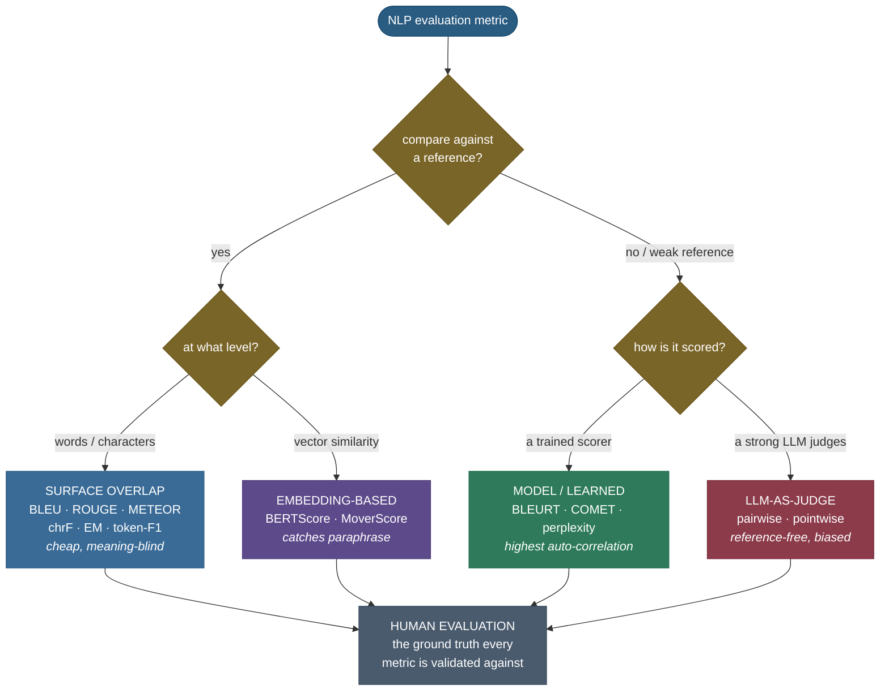
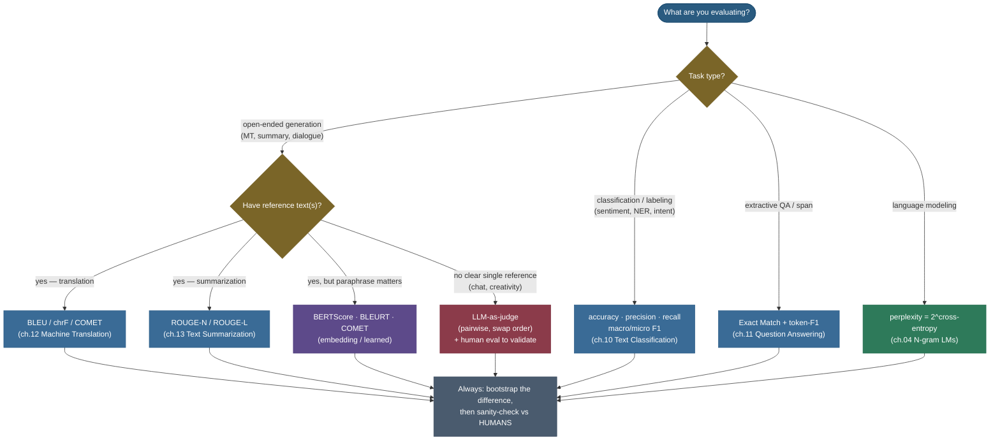

# NLP evaluation metrics: how do we know the text is any good?

Give a translation system the French sentence *"J'ai pris le train ce matin"* and it returns *"I took the train this morning."* A second system returns *"This morning I caught the train."* Both are perfect. A third returns *"I take train morning"* — clearly worse. Now: **write down a single number that ranks these three the way a human would**, automatically, over a million sentences, without a person reading any of them. That is the entire problem of NLP evaluation, and it is genuinely hard — because unlike classification, where there is exactly one right label, **open-ended generation has many equally-valid outputs**, and "valid" depends on meaning, not on which words you happened to use.

This page is the **capstone** of the NLP arc — the map that ties every task's metric together. The individual metrics are derived in full in their home chapters: **BLEU/chrF** in [Machine Translation](../12-Machine-Translation/12-Machine-Translation.md), **ROUGE** in [Text Summarization](../13-Text-Summarization/13-Text-Summarization.md), **EM/token-F1** in [Question Answering](../11-Question-Answering/11-Question-Answering.md), **perplexity** in [N-gram Language Models](../04-N-gram-Language-Models-and-Smoothing/04-N-gram-Language-Models-and-Smoothing.md), and **classification precision/recall/F1** in [Text Classification](../10-Text-Classification-and-Sentiment-Analysis/10-Text-Classification-and-Sentiment-Analysis.md). Here we do something none of those chapters can: **put them side by side on the same input so their *disagreement* becomes the lesson**, then derive the two meta-tools every metric is ultimately judged by — **metric-human correlation** and **statistical significance**. By the end you'll be able to:

- place any metric in a clean **taxonomy** (reference-based vs reference-free; surface vs embedding vs learned vs human) and explain the trade each family makes;
- read the **metric zoo** — five "overlap" metrics scoring the *same* pair completely differently — and say *why* each disagrees;
- explain the cross-chapter punchline — **n-gram metrics are blind to meaning**: a faithful paraphrase scores ~0 on BLEU but high on an embedding metric — *and* the embedding family's own blind spot (negation);
- derive **F1 as a harmonic mean**, **Spearman/Kendall correlation** (the meta-metric), and the **paired bootstrap confidence interval** (the significance test), each from first principles;
- run **LLM-as-judge** correctly — pairwise vs pointwise, the **position / verbosity / self-preference** biases, and their mitigations;
- pick the right metric for any task from a decision tree, and explain why **human evaluation** remains the ground truth every automatic metric is validated against.

Intuition and the taxonomy first, then each meta-tool derived with sources, then runnable code that reproduces every number.

> **Note:** there is no single "best" NLP metric, only the one that matches what your task cares about. A metric is a **proxy** for human judgement; the whole game is choosing a proxy that is **cheap to compute** yet **correlates well with humans** for *your* task. BLEU is a great proxy for translation and a terrible one for open-ended dialogue — same metric, opposite verdict, purely because of the task.

> **Runnable companion:** every number on this page is produced by a single seeded source of truth — the [step-by-step teaching notebook](code/18-NLP-Evaluation-Metrics.ipynb) and the [runnable demo script](code/nlp_evaluation.py) (run it with `python nlp_evaluation.py`). The page's figures are regenerated from the *same* functions by [`make_figures_18.py`](code/make_figures_18.py), so prose, figures, and code cannot drift apart. Each metric below names the exact function that computes it.

---

## The problem: why measuring generated text is genuinely hard

To feel why a whole zoo of metrics exists, sit with what makes generation different from classification.

In **classification** the label space is finite and a single key is correct: the review is *positive* or it isn't; the token is a *person* or it isn't. You compare prediction to gold and tally — accuracy, precision, recall, F1 (derived in [Text Classification](../10-Text-Classification-and-Sentiment-Analysis/10-Text-Classification-and-Sentiment-Analysis.md), recapped below). Evaluation is essentially *bookkeeping*.

**Generation** breaks that comfort in four ways:

1. **One input, many valid outputs.** *"I took the train"* and *"I caught the train"* are both correct. Any metric that demands exact string match will call the second one wrong. The "gold answer" is not unique.
2. **Meaning lives above the surface.** *"The film was wonderful"* and *"The movie was fantastic"* share **zero** content words yet mean the same thing. Surface-overlap metrics see two unrelated sentences.
3. **Small changes can flip meaning.** *"absolutely fantastic"* → *"absolutely terrible"* is a one-word edit that **reverses** the sentiment, yet shares most of its n-grams. Surface metrics barely move.
4. **Quality is multi-dimensional.** Fluency, adequacy, factuality, coherence, helpfulness, safety — a single scalar smears them together, and different tasks weight them differently.

So the field built **many** metrics, each making a different bargain between *cost* and *fidelity to human judgement*. The clean way to hold them all in your head is a taxonomy.

> **Tip:** in an interview, never answer "which metric?" with a single name. Answer with the **two questions** that pick the metric: *(a) what's the task* (classification, QA, MT, summarization, LM, open chat)? and *(b) do you have a reference, and does paraphrase matter?* The decision tree near the end is exactly those two questions drawn out.

---

## Intuition: the metric is a cheap stand-in for a tired human

Here is the analogy that holds all the way down. Imagine you must grade a million student essays and you cannot read them yourself. You hire a series of **graders of increasing skill and cost**:

- The cheapest grader (**surface overlap**) doesn't read for meaning at all — they just **check which words from the answer key appear in the essay**. Fast, perfectly consistent, never tires. But they'll fail a brilliant essay that uses synonyms, and pass a nonsense essay that parrots the key's vocabulary.
- A better grader (**embedding-based**) understands that *"film"* and *"movie"* mean the same — they grade on **meaning, not exact words**. They cost more (they have to actually think about each word) and they have a fatal quirk: they can't tell *"fantastic"* from *"terrible"* when both sit in the same kind of sentence.
- The best automatic grader (**learned / LLM-as-judge**) has **trained on thousands of grades from real teachers**, so they predict the teacher's score directly. Most accurate of the machines — but they inherit the biases of whoever they learned from, and they're slow.
- The **teacher** (**human evaluation**) is the ground truth. Slow, expensive, sometimes inconsistent — which is the entire reason you hired the cheaper graders in the first place.

The single most important consequence: **a grader is only trustworthy to the extent it agrees with the teacher.** That agreement — measured as **correlation with human judgement** — is the *meta-metric* this whole page builds toward. And because even the teacher disagrees with themselves sometimes, a one-point difference between two essays might be **noise**, not skill — which is why you also need a **significance test**. Hold this analogy; every section below is one grader in this lineup, or one of the two tools that keep them honest.

---

## The taxonomy: four families on two axes

Every NLP metric sits on two axes. **Axis 1 — is there a reference?** *Reference-based* metrics compare the output to one or more gold answers; *reference-free* metrics judge the output on its own (or against the input). **Axis 2 — at what level do they compare?** *Surface* (characters / n-grams), *embedding* (vector similarity), *model/learned* (a trained scorer), or *human*.


The families, with the trade each makes:

- **n-gram / surface overlap** — count shared words or characters. *Cheap, deterministic, language-agnostic, reproducible* — and **blind to meaning** (no synonyms, no paraphrase). BLEU, ROUGE, METEOR, chrF, exact-match, token-F1.
- **Embedding-based** — compare *contextual vector* representations, so paraphrases score high. *Captures meaning much better*; costs a model forward pass and is *less interpretable*. BERTScore, MoverScore.
- **Model / learned** — a model **trained on human ratings** predicts the human score directly. *Highest correlation with humans of the automatic metrics*; needs training data and can inherit its biases. BLEURT, COMET, and (intrinsically) perplexity from a language model.
- **Human** — actual people rate or compare outputs. *The ground truth* — but slow, expensive, and noisy, which is the whole reason the other three families exist.



> **Note:** the four families are a *ladder*, not rivals. The standard practice is to report a **cheap surface metric** (BLEU/ROUGE) for fast iteration and reproducibility, a **semantic metric** (BERTScore/COMET) to catch paraphrase, and a **human or LLM-judge** evaluation at milestones to validate that the cheap proxies still track quality. Each rung checks the rung below it.

We'll walk the ladder from the bottom, because the surface metrics are where the foundational ideas (precision, recall, the harmonic mean) are introduced — ideas the higher rungs reuse.

---

## Family 0: classification and QA metrics (the recap, and the one formula we derive)

Many NLP tasks *are* classification in disguise — sentiment, topic, intent, and token-level tagging like POS and NER — and for these the metrics are exactly accuracy, **precision**, **recall**, and **F1**. These are fully derived in [Text Classification](../10-Text-Classification-and-Sentiment-Analysis/10-Text-Classification-and-Sentiment-Analysis.md); here we recap the one-liner and derive the **harmonic mean**, because it is the load-bearing operation that recurs in *every* family below (ROUGE-L's F, chrF's F-beta, BERTScore's F1, token-F1).

**One-line recap.** Precision $=\tfrac{TP}{TP+FP}$ (of what you flagged, how much was right), recall $=\tfrac{TP}{TP+FN}$ (of what mattered, how much you caught).

**The harmonic mean, derived.** F1 combines precision $P$ and recall $R$ into one number. Why not the *arithmetic* mean $\tfrac{P+R}{2}$? Because that lets a system cheat: predict one obvious positive and abstain on everything else → $P=1.0, R\approx 0$, arithmetic mean $\approx 0.5$ — a passing grade for a useless system. The **harmonic mean** refuses this:

$$F_1 \;=\; \frac{2}{\frac{1}{P}+\frac{1}{R}} \;=\; \frac{2PR}{P+R}.$$

The harmonic mean of two numbers is always **pulled toward the smaller** of the two — so $P=1.0, R=0$ gives $F_1 = 0$, not $0.5$. You cannot win F1 by being excellent on one axis and terrible on the other; you must do reasonably well on *both*. That property is exactly why F1, not accuracy, is the headline number whenever the classes are imbalanced.

> **Source / derivation:** the harmonic-mean form of $F_\beta$ is van Rijsbergen's effectiveness measure, [*Information Retrieval* (2nd ed., 1979), Ch. 7](https://www.dcs.gla.ac.uk/Keith/Chapter.7/Ch.7.html); the precision/recall trade it balances is standard IR. The general $F_\beta=\frac{(1+\beta^2)PR}{\beta^2 P+R}$ recovers $F_1$ at $\beta=1$. Computed in code by `harmonic_mean()` in [`nlp_evaluation.py`](code/nlp_evaluation.py).

**The QA twist: exact match and token-level F1.** Extractive question answering (SQuAD-style) wants to know whether the predicted answer *span* matches the gold span, with **two** numbers:

- **Exact Match (EM)** — 1 if the (normalized) predicted string equals *any* gold answer, else 0. Strict and brittle: *"Denver Broncos"* vs gold *"The Denver Broncos"* scores **EM = 0** despite being right.
- **Token-level F1** — treat the predicted and gold answers as **bags of tokens** and compute the harmonic mean above over their overlap. This gives partial credit, which is why SQuAD reports it alongside EM.

**Worked example A — token-F1 for a QA answer (`exact_match`, `token_f1`).** Gold: *"The Denver Broncos"* (3 tokens). Prediction: *"Denver Broncos"* (2 tokens). The shared bag is `{Denver, Broncos}` → **2 shared tokens**:

$$P=\frac{2}{2}=1.0,\qquad R=\frac{2}{3}=0.667,\qquad F_1=\frac{2\cdot 1.0\cdot 0.667}{1.0+0.667}=\mathbf{0.80}.$$

So this answer earns **EM = 0** (string differs) but **token-F1 = 0.80** (mostly right). The notebook reproduces `EM = 0, token-F1 = 0.800` — the strict-vs-forgiving gap that is exactly why QA leaderboards report both.

> *Full derivation and the SQuAD normalization rules: [Question Answering](../11-Question-Answering/11-Question-Answering.md). EM/token-F1 are the official SQuAD metrics — see the Source/derivation note under the decision tree.*

> **Gotcha:** EM and token-F1 are **bag-of-tokens** — they ignore word order. *"dog bites man"* and *"man bites dog"* are F1-identical against each other. For short extractive spans that's fine; never repurpose token-F1 as a generation metric, where word order carries meaning.

---

## The capstone view: the metric zoo (the same pair, five verdicts)

This is the figure the whole arc was building toward. Take **one reference** — *"the movie was absolutely fantastic"* — and four candidates: an **exact copy**, a **paraphrase** (same meaning, different words), a **negation** (one word flipped, opposite meaning), and an **unrelated** sentence. Run every surface metric on each, side by side. The function `metric_zoo()` in [`nlp_evaluation.py`](code/nlp_evaluation.py) computes all five; `semantic_overlap()` adds a deterministic embedding-style metric.

These are the exact numbers the notebook prints (cell 8):

| candidate | Exact match | Token-F1 | BLEU | ROUGE-L | chrF | semantic |
|---|---:|---:|---:|---:|---:|---:|
| exact copy | 100 | 100.0 | 100.0 | 100.0 | 100.0 | 100.0 |
| **paraphrase** | 0 | 40.0 | **0.0** | 40.0 | 15.3 | **86.1** |
| **negation** | 0 | 80.0 | 66.9 | 80.0 | 68.8 | **75.2** |
| unrelated | 0 | 0.0 | 0.0 | 0.0 | 10.5 | 9.6 |

![The metric zoo: five surface metrics plus one semantic, on the same reference "the movie was absolutely fantastic". Left panel (paraphrase "the film was incredibly wonderful"): exact-match and BLEU are 0, token-F1 and ROUGE-L are 40, chrF is 15 — but the embedding metric is 86. Right panel (negation "the movie was absolutely terrible"): the surface metrics score high on shared words (token-F1 and ROUGE-L 80, BLEU 67, chrF 69) and the embedding metric is also fooled at 75. The disagreement across the bars is the whole lesson: metrics that all claim to "measure overlap" assign very different scores to the same text.](../images/nlpeval_metric_zoo.png)

Read the table top to bottom and the disagreement jumps out:

- **Exact match** is binary and brutal — *only* the exact copy scores anything.
- **BLEU collapses to 0 on the paraphrase** — with no shared content words, every higher-order n-gram precision is zero, and BLEU's geometric mean zeroes out (mechanism below). On the negation it's a high **66.9**, because the negation shares almost every word.
- **Token-F1 and ROUGE-L** are bag/subsequence overlap — they give the paraphrase partial credit (40, from the shared *"the"*/*"was"*) and rate the negation **80** (it shares 4 of 5 words).
- **chrF** works at the character level, so it gives the unrelated sentence a small non-zero floor (10.5) from incidental shared characters.
- **semantic** is the only metric that scores the paraphrase **high (86.1)** — because it compares *meaning*, not strings.

> **Note:** the surface metrics here (BLEU, ROUGE-L, chrF, EM, token-F1) are recaps of their home chapters — [MT ch.12](../12-Machine-Translation/12-Machine-Translation.md) (BLEU/chrF), [Summarization ch.13](../13-Text-Summarization/13-Text-Summarization.md) (ROUGE), [QA ch.11](../11-Question-Answering/11-Question-Answering.md) (EM/F1). The point of the capstone is not to re-derive them but to **show them disagreeing on one input** so you internalize that "which metric" is a real decision, not a formality.

---

## The cross-chapter punchline: n-gram metrics are blind to meaning

Pull the two load-bearing rows out of the zoo, because they contain both the central failure of surface metrics *and* the central failure of the family that fixes it.


- **Paraphrase** *"the film was incredibly wonderful"* (same meaning, **essentially no shared content words**): **BLEU = 0, ROUGE-L = 40** — the surface metrics punish a perfectly good paraphrase. **semantic = 86.1** — it rewards the preserved meaning. *This is the single most important takeaway on this page: surface metrics confuse "different words" with "wrong," and embedding metrics fix it.* (The notebook asserts `paraphrase BLEU < 20` and `semantic > 70` before printing — the claim is checked, not asserted by hand.)
- **Negation** *"the movie was absolutely terrible"* (one word changed, **opposite meaning**): BLEU = 66.9 and ROUGE-L = 80 are high (most words shared) — and **the embedding metric is *also* high at 75.2**. Embedding metrics are **fooled by negation and antonyms**: *"terrible"* and *"fantastic"* live in similar contexts, so their vectors are close. **No automatic metric reliably catches meaning reversal** — a crucial limitation to state out loud. (The notebook asserts `negation semantic > 50` — the blind spot is *demonstrated*, not hand-waved.)

> **Note on the embedding metric used here.** The `semantic` column is a small, fully-deterministic stand-in for a real contextual-embedding metric like **BERTScore**: a fixed hashing embedding that places synonyms near each other (no model download, so it runs anywhere and is byte-for-byte reproducible). It reproduces the *pattern* — high on paraphrase, fooled by negation — that real BERTScore exhibits. The real BERTScore derivation (greedy cosine matching → P/R/F1) lives below; the proxy exists so the *mechanism* is runnable in two seconds on CPU.

> **Tip:** the practical rule from this figure: use **BERTScore (or COMET) to avoid penalizing paraphrase**, but never trust a single semantic score on **factuality, negation, or numbers** — those are exactly where it fails. Pair it with a targeted check (an NLI/entailment model, or an LLM-judge asked specifically about faithfulness).

---

## Why BLEU zeroes out: the mechanism, recapped

BLEU's collapse to 0 on the paraphrase isn't a bug — it's the **geometric mean** doing its job. BLEU multiplies clipped n-gram precisions $p_1\dots p_4$ and takes the 4th root: any single zero precision (here, no shared 2-, 3-, or 4-grams) makes the whole product 0. We recap the four pieces compactly — the full derivation is in [Machine Translation](../12-Machine-Translation/12-Machine-Translation.md).

$$\text{BLEU}=\underbrace{\text{BP}}_{\text{brevity penalty}}\cdot\exp\!\Big(\underbrace{\tfrac{1}{4}\textstyle\sum_{n=1}^{4}\ln p_n}_{\text{geometric mean of clipped precisions}}\Big),\qquad \text{BP}=\begin{cases}1 & c>r\\ e^{\,1-r/c} & c\le r,\end{cases}$$

where $p_n$ is the clipped n-gram precision of order $n$, $c$ the candidate length, and $r$ the reference length. The **brevity penalty** is BLEU's stand-in for the recall it lacks: precision alone is gamed by being short (*"the cat"* scores 1.0 against a long reference), so BP shrinks the score exponentially when $c<r$.


> **Source / derivation:** the clipped precision, the four-order geometric mean, and the brevity penalty are all from Papineni et al., [*BLEU: a Method for Automatic Evaluation of Machine Translation* (ACL 2002), §2](https://aclanthology.org/P02-1040/). The reproducible reference implementation is **sacreBLEU** ([Post 2018](https://aclanthology.org/W18-6319/)), which fixes tokenization so scores are comparable across papers. Computed from scratch by `sentence_bleu()` and `brevity_penalty()` in [`nlp_evaluation.py`](code/nlp_evaluation.py), verified against sacreBLEU to the digit.

**Worked example B — BLEU built up (`sentence_bleu`).** Reference *"the cat sat on the warm mat"* ($r=7$), candidate *"the cat sat on the mat"* ($c=6$). The clipped precisions are $p_1=1.0, p_2=0.8, p_3=0.75, p_4=0.667$; their geometric mean is $0.7953$; the brevity penalty is $e^{1-7/6}=0.8465$; so $\text{BLEU}=0.8465\times 0.7953\times 100 = \mathbf{67.3}$.


The notebook prints `BLEU = 67.318` and matches **sacreBLEU 67.318** exactly. Notice the brevity penalty did real work — without it BLEU would have been $79.5$; the single missing word *"warm"* cost ~12 points.

---

## The other surface metrics, in one breath

The rest of the surface family loosens the **matching unit** to recover some of the meaning exact-word-matching throws away — each is derived in its home chapter:

- **ROUGE** (recall-oriented, for summarization, [ch.13](../13-Text-Summarization/13-Text-Summarization.md)) flips BLEU's question from *"how much of the candidate is in the reference?"* (precision) to *"how much of the reference did the candidate cover?"* (recall). **ROUGE-L** uses the **longest common subsequence** — in-order overlap with gaps allowed — and reports an LCS-based F (the same harmonic mean from Family 0). Computed by `rouge_l()`, verified against Google's `rouge-score` to the digit (the notebook prints `our ROUGE-L 0.769 == rouge-score 0.769`).
- **METEOR** matches words **up to stems and synonyms** (via WordNet) and weights recall, so it credits *"quick"↔"fast"* where BLEU sees a miss — better human correlation at the sentence level, at the cost of language-specific resources.
- **chrF** matches **character n-grams** (sub-word), so it needs no tokenizer and rewards shared morphology (*"walked"*/*"walking"* share *"walk"*) — strong for morphologically rich languages. Computed by `chrf()`.

> **Note:** the progression is a story of *loosening the matching unit*. BLEU/ROUGE match **exact word n-grams**; METEOR matches words **up to stems and synonyms**; chrF matches **character n-grams**. Each loosening recovers some meaning — but **none of them truly understands paraphrase**. For that you leave surface matching entirely.

---

## Family 1.5 (intrinsic): perplexity, recapped

One reference-free metric judges a **language model** itself rather than a generated string: **perplexity**, derived fully in [N-gram Language Models](../04-N-gram-Language-Models-and-Smoothing/04-N-gram-Language-Models-and-Smoothing.md). For held-out text $w_1\dots w_N$ it is **two raised to the cross-entropy**:

$$\text{PP}(W)=\Big(\prod_{i=1}^{N}\frac{1}{P(w_i\mid w_{<i})}\Big)^{1/N}=2^{\,H(W)},\qquad H(W)=-\tfrac{1}{N}\sum_{i=1}^{N}\log_2 P(w_i\mid w_{<i}).$$

Lower is better; PP = 20 means the model is, on average, as uncertain as choosing uniformly among 20 words at each step. Two cautions: perplexity is **only comparable across models with the same vocabulary/tokenization**, and **lower perplexity does not guarantee a better downstream system** — it measures fit to the text distribution, not translation quality or helpfulness.

> **Source / derivation:** the perplexity ↔ cross-entropy identity is in Jurafsky & Martin, [*Speech and Language Processing* (3rd ed.), Ch. 3 §"Perplexity"](https://web.stanford.edu/~jurafsky/slp3/3.pdf). Full worked derivation: [N-gram Language Models](../04-N-gram-Language-Models-and-Smoothing/04-N-gram-Language-Models-and-Smoothing.md).

> **Gotcha:** perplexity is **intrinsic**, not a generation-quality metric. A model can have low perplexity and still generate repetitive or off-task text (see [Decoding Strategies](../17-Decoding-Strategies/17-Decoding-Strategies.md)). Never quote perplexity as evidence that *generated* text is good; quote it as evidence the model *fits the distribution*.

---

## Family 2: BERTScore — matching meaning, derived

Surface metrics fail the paraphrase test because they compare **strings**. **BERTScore** (Zhang et al. 2020) compares **contextual embeddings**: run both candidate and reference through a pretrained encoder, then match their token vectors by **cosine similarity**. Let the reference embed to $x_1\dots x_m$ and the candidate to $\hat{x}_1\dots\hat{x}_k$. BERTScore does **greedy** matching — each token pairs with its most similar token in the other sentence:

$$R_{\text{BERT}}=\frac{1}{m}\sum_{i=1}^{m}\max_{j}\ \text{sim}(x_i,\hat{x}_j),\qquad P_{\text{BERT}}=\frac{1}{k}\sum_{j=1}^{k}\max_{i}\ \text{sim}(\hat{x}_j,x_i),\qquad F_{\text{BERT}}=\frac{2\,P_{\text{BERT}}\,R_{\text{BERT}}}{P_{\text{BERT}}+R_{\text{BERT}}}.$$

Because the vectors are **contextual**, the same word in different senses embeds differently and synonyms in similar context embed alike — exactly what surface n-grams miss. The F1 is, once again, the harmonic mean from Family 0.

> **Source / derivation:** the greedy-matching P/R/F1 and optional IDF weighting are from Zhang, Kishore, Wu, Weinberger & Artzi, [*BERTScore: Evaluating Text Generation with BERT* (ICLR 2020), §3](https://arxiv.org/abs/1904.09675). The reference implementation `bert-score` adds a baseline rescaling for interpretable ranges. The deterministic `semantic_overlap()` in [`nlp_evaluation.py`](code/nlp_evaluation.py) reproduces BERTScore's *qualitative behaviour* (high on paraphrase, fooled by negation) without a model download.

---

## Family 3: learned metrics — BLEURT, COMET, MoverScore

The top automatic rung **trains a model to predict the human score** — fit a regressor on thousands of human ratings so the metric *learns* what humans care about:

- **BLEURT** (Sellam et al. 2020) — a BERT model pretrained on synthetic perturbations and **fine-tuned on human MT-quality ratings**; correlates with humans better than BLEU or vanilla BERTScore because it has *seen* how humans grade.
- **COMET** (Rei et al. 2020) — the current MT-evaluation standard. It uses the **source sentence too** (source, candidate, reference), so it judges **adequacy** (did the translation preserve the source meaning?), not just reference similarity. Tops the WMT metrics shared task year after year.
- **MoverScore** (Zhao et al. 2019) — between BERTScore and learned metrics: contextual embeddings matched with **Word Mover's Distance** (optimal transport), a soft many-to-many alignment.

> **Source / derivation:** BLEURT — Sellam, Das & Parikh, [*BLEURT: Learning Robust Metrics for Text Generation* (ACL 2020)](https://arxiv.org/abs/2004.04696). COMET — Rei, Stewart, Farinha & Lavie, [*COMET: A Neural Framework for MT Evaluation* (EMNLP 2020)](https://arxiv.org/abs/2009.09025). MoverScore — Zhao et al., [(EMNLP 2019)](https://arxiv.org/abs/1909.02622). All in the references.

> **Note:** the trade is explicit. Learned metrics buy the **best correlation with humans** by *training on human labels* — and inherit the cost: a trained checkpoint, slower than BLEU, possibly **domain-specific**, and they can encode the **biases** of their training raters. The strongest automatic option for MT today, but they are models, with all that entails.

---

## The meta-metric: correlation with human judgement

Every automatic metric is ultimately judged by **how well it correlates with human judgement** — the only thing that makes it trustworthy. This is the *teacher-agreement* from our analogy, made numerical. We want to know: **does the metric *rank* outputs the way humans do?** That's a question about **monotone agreement**, not linear fit, which is why the right tool is **Spearman's rank correlation**.

**Spearman, derived.** Take $n$ outputs with human scores $h_1\dots h_n$ and metric scores $m_1\dots m_n$. Replace each value by its **rank** (1 = smallest), giving rank vectors $\text{rk}(h)$ and $\text{rk}(m)$. Spearman's $\rho$ is just the **Pearson correlation of the ranks**:

$$\rho \;=\; \text{Pearson}\big(\text{rk}(h),\,\text{rk}(m)\big) \;=\; \frac{\sum_i (\text{rk}(h_i)-\overline{\text{rk}(h)})(\text{rk}(m_i)-\overline{\text{rk}(m)})}{\sqrt{\sum_i (\text{rk}(h_i)-\overline{\text{rk}(h)})^2}\,\sqrt{\sum_i (\text{rk}(m_i)-\overline{\text{rk}(m)})^2}}.$$

Working on ranks means $\rho$ measures *any* monotone relationship, not just a straight-line one — so a metric whose scale is squashed or stretched still scores $\rho=1$ as long as it **orders** outputs correctly. **Kendall's $\tau$** asks the same question pairwise: of all $\binom{n}{2}$ pairs, what fraction are **concordant** (the two rankings agree on their order) minus **discordant**:

$$\tau \;=\; \frac{(\#\text{concordant}) - (\#\text{discordant})}{\binom{n}{2}}.$$

> **Source / derivation:** Spearman's rank correlation is Spearman (1904), *"The Proof and Measurement of Association between Two Things"*, *Am. J. Psychology* — [DOI:10.2307/1412159](https://doi.org/10.2307/1412159); Kendall's $\tau$ is Kendall (1938), *"A New Measure of Rank Correlation"*, *Biometrika* — [DOI:10.1093/biomet/30.1-2.81](https://doi.org/10.1093/biomet/30.1-2.81). Both computed from scratch by `spearman()` and `kendall_tau()` in [`nlp_evaluation.py`](code/nlp_evaluation.py) and cross-checked against `scipy.stats.spearmanr` in the notebook (they match to 1e-9).

On a small synthetic set where the metric tracks human ranking *with noise*, the notebook computes **Spearman ρ = 0.939**, Pearson r = 0.931, Kendall τ = 0.822 (scipy agrees with our ρ to the digit):


Two cautions about *correlation itself* decide how you read any metric result:

- **It is task- and dataset-dependent.** BLEU correlates reasonably on tight-reference news MT and **near-zero** on open dialogue — the *same metric*, wildly different trustworthiness, set by how constrained the valid-output space is. A published correlation number is only a promise for the data it was measured on.
- **System-level vs segment-level disagree.** A metric can rank *whole systems* correctly while being **unreliable on any single sentence**. The practical rule: use surface metrics for **aggregate model comparison and fast iteration**, never to accept or reject an **individual** output (ρ ≈ 0.94 is great for ranking, useless for a single verdict).

> **Gotcha:** the famous failure is **dialogue and open-ended generation**. Liu et al. (2016), *"How NOT To Evaluate Your Dialogue System,"* showed BLEU/ROUGE/METEOR correlate **near-zero** with humans on chit-chat — a good reply can share almost no words with the single reference (*"How are you?"* → *"Doing great!"* vs *"I'm fine, thanks"*). On such tasks, surface metrics are not just weak, they are **actively misleading**. This single result is much of why the field moved to LLM-as-judge.

---

## The other meta-tool: is the difference even real? (paired bootstrap)

A metric number alone is a trap. Suppose system A scores **+2.86 BLEU** above system B on your test set. Did A actually improve, or did you get lucky on a few sentences? **You cannot tell from the single number** — you need a **confidence interval**, and the standard way to get one without distributional assumptions is the **paired bootstrap**.

**The bootstrap, derived.** Both systems are scored on the *same* $n$ sentences (paired). The idea: the test set is just *one sample* from the space of possible test sets, so **simulate** drawing many test sets by **resampling sentences with replacement**. For each of $B$ resamples, recompute $\text{mean}(A)-\text{mean}(B)$; the spread of those $B$ differences **approximates the sampling distribution** of the true difference. Read off the **2.5th and 97.5th percentiles** for a 95% CI:

$$\text{CI}_{95\%} \;=\; \Big[\,\text{percentile}_{2.5}\big(\{\,\overline{A^{(b)}}-\overline{B^{(b)}}\,\}_{b=1}^{B}\big),\ \ \text{percentile}_{97.5}(\cdots)\,\Big].$$

If the interval **excludes 0**, the difference is significant; if it **straddles 0**, your "win" is indistinguishable from noise.

> **Source / derivation:** the paired bootstrap for MT-metric significance is Koehn, [*Statistical Significance Tests for Machine Translation Evaluation* (EMNLP 2004)](https://aclanthology.org/W04-3250/); the bootstrap itself is Efron (1979), [*"Bootstrap Methods: Another Look at the Jackknife," Ann. Statist.* — DOI:10.1214/aos/1176344552](https://doi.org/10.1214/aos/1176344552). Computed by `paired_bootstrap_diff()` in [`nlp_evaluation.py`](code/nlp_evaluation.py) (10,000 resamples, seeded).

On two synthetic systems where A leads by a hair, the notebook prints: observed diff **+2.86**, 95% CI **[−1.42, +7.05]**, **not significant** (the interval contains 0):

![Paired bootstrap distribution of the mean difference (system A minus system B). A roughly bell-shaped histogram of 10,000 resampled differences, centered near +2.86 (the observed difference, marked by a green line) but with the zero line (red dashed) well inside the body of the distribution and the shaded 95% interval [-1.42, +7.05] spanning both sides of zero. System A's +2.86 lead is indistinguishable from noise.](../images/nlpeval_bootstrap_ci.png)

> **Gotcha:** this is the single most common evaluation error in practice — reporting "A beats B by 1.2 BLEU" with **no interval**. A 1–2 point BLEU gap on a small test set is routinely **not significant**. Always bootstrap the difference; a number without a CI is a claim you have not earned.

---

## The modern paradigm: LLM-as-judge

When references are weak, plural, or absent — open-ended chat, instruction following, creative writing, agent transcripts — the field's answer since ~2023 is to use **a strong LLM as the evaluator**. Prompt a capable model to *score* or *rank* outputs, optionally given the question and a rubric. It is reference-free, fast, cheap relative to humans, and — when set up carefully — correlates with human preference **better than any surface or embedding metric** (Zheng et al. 2023 report **>80% agreement** with humans on MT-Bench, on par with human–human agreement).

- **Pointwise (scoring)** — show one answer, ask for an absolute score (e.g. 1–10). Simple, but **uncalibrated**: an LLM's "7/10" drifts across prompts.
- **Pairwise (ranking)** — show **two** answers and ask which is better (or a tie). Far more **reliable**, because relative comparison is more stable than absolute scoring. This is how **Chatbot Arena** and **MT-Bench** build leaderboards — many pairwise battles aggregated into an **Elo / Bradley-Terry** rating.

### The biases — and how to fix them

![Two panels. Left: LLM-judge position bias — the same answer pair shown in two orders; the judge picks whichever is shown first both times, so the verdict flips with order; the fix is to swap order and require a consistent winner, else call a tie. Right: the metric-correlation ladder rising left to right — BLEU/ROUGE-L lowest (~0.30), METEOR/chrF higher (~0.45), BERTScore higher still (~0.60), learned COMET (~0.78), and LLM-as-judge highest (~0.85). Exact numbers vary by dataset; the direction surface < embedding < learned < LLM-judge is the robust finding.](../images/nlpeval_judge_bias.png)

An LLM judge is itself a model with quirks. Naming them and their fixes is exactly what an interviewer wants:

- **Position bias.** Judges favor whichever answer is presented **first** (or last). *Fix:* run **both orderings**; count a win only if the judge picks the **same answer both times**, else **tie**. The left panel above shows the verdict flipping when you swap order — and the fix in one rule.
- **Verbosity / length bias.** Judges favor **longer** answers even when a short one is better. *Fix:* instruct the judge to ignore length, or normalize; watch for length confounds.
- **Self-preference bias.** A judge rates **its own model family** higher. *Fix:* use a **different** model as judge, or an ensemble / human spot-checks.
- **Other issues:** sensitivity to **rubric wording**, **sycophancy**, and weak ability to catch **factual/numerical** errors. *Fix:* **reference-guided** judging (give the judge a gold answer), chain-of-thought before the verdict, and calibration against a human-labeled subset.

> **Source / derivation:** the >80% human-agreement result and the position / verbosity / self-preference biases are from Zheng et al., [*Judging LLM-as-a-Judge with MT-Bench and Chatbot Arena* (NeurIPS 2023)](https://arxiv.org/abs/2306.05685). The pairwise-with-swap protocol below is the paper's recommended mitigation.

```python
JUDGE_PROMPT = """You are an impartial judge. Compare two AI answers to the user's
question. Judge correctness, helpfulness, and relevance. Ignore length and the
order in which the answers appear. Respond with exactly one of: "A", "B", or "tie".

[Question]
{question}

[Answer A]
{a}

[Answer B]
{b}

Verdict:"""

def judge_pairwise(client, question, ans1, ans2):
    """Run BOTH orderings; only a consistent winner counts (position-bias fix)."""
    def ask(a, b):
        msg = JUDGE_PROMPT.format(question=question, a=a, b=b)
        return client.chat(msg).strip().lower()    # -> "a" | "b" | "tie"

    v1 = ask(ans1, ans2)    # ans1 shown as A
    v2 = ask(ans2, ans1)    # ans1 shown as B (order swapped)
    if v1 == "a" and v2 == "b":   # ans1 won in BOTH orderings
        return "ans1"
    if v1 == "b" and v2 == "a":   # ans2 won in BOTH orderings
        return "ans2"
    return "tie"   # verdict flipped with order => position bias => call it a tie
```

> **Tip:** that `return "tie"` on disagreement is the entire position-bias defense in one line: if the judge's verdict **flips when you swap the order**, its preference was about *position*, not *quality*, so you refuse to count it. Because the protocol is LLM-shaped, consult the **Claude / Anthropic model guidance** in the references before wiring a real judge — model choice and prompt structure matter.

> **Gotcha:** LLM-as-judge is powerful but **not ground truth** — it's a strong, biased proxy that must itself be validated against humans. Measure its agreement with people on a held-out set, watch for the biases above, and never let "the judge said 8/10" stand in for a real human evaluation on a high-stakes release.

---

## Code: reproduce every number on this page

Everything above is computed by one seeded module — [`nlp_evaluation.py`](code/nlp_evaluation.py) — and reproduced cell by cell in the [teaching notebook](code/18-NLP-Evaluation-Metrics.ipynb), every cell asserting its qualitative point *before* it prints. The from-scratch BLEU and ROUGE-L are cross-checked against **sacreBLEU** and **rouge-score** to the digit; Spearman against **scipy**. The metric zoo:

```python
from nlp_evaluation import metric_zoo, semantic_overlap, ZOO_REFERENCE, ZOO_CANDIDATES

for name, cand in ZOO_CANDIDATES.items():
    z = metric_zoo(cand, ZOO_REFERENCE)
    sem = semantic_overlap(cand, ZOO_REFERENCE)
    print(f"{name:12} BLEU={z['BLEU']:5.1f}  ROUGE-L={z['ROUGE-L']:5.1f}  semantic={sem:5.1f}")
```

reproduces (notebook cell 8):

```
exact copy   BLEU=100.0  ROUGE-L=100.0  semantic=100.0
paraphrase   BLEU=  0.0  ROUGE-L= 40.0  semantic= 86.1
negation     BLEU= 66.9  ROUGE-L= 80.0  semantic= 75.2
unrelated    BLEU=  0.0  ROUGE-L=  0.0  semantic=  9.6
```

and the significance + correlation demos print:

```
observed mean diff (A - B) = +2.86      95% CI = [-1.42, +7.05]   significant? False
Spearman rho = 0.939   (scipy check: 0.939 — match)   Pearson r = 0.931   Kendall tau = 0.822
our BLEU 67.318 == sacreBLEU 67.318   |   our ROUGE-L 0.769 == rouge-score 0.769
```

> **Reproduce it yourself:** run `python nlp_evaluation.py` for the full assert-checked report, or open [`18-NLP-Evaluation-Metrics.ipynb`](code/18-NLP-Evaluation-Metrics.ipynb) to step through each idea. The figures on this page are regenerated by `python make_figures_18.py` from the *same* functions — so the table, the figures, and the notebook can never disagree.

---

## Pitfalls & failure modes

The errors that actually bite practitioners — name them, recognize them, fix them:

- **Single-number comparison without significance.** "A beats B by 1.2 BLEU" with no CI is the most common evaluation mistake. A small gap on a small test set is routinely **not significant** — bootstrap the difference (the +2.86 above straddles zero). *Fix:* always report a 95% CI from the paired bootstrap.
- **n-gram blindness.** A correct paraphrase scores ~0 on BLEU (the zoo's `paraphrase` row). *Fix:* pair surface metrics with an embedding/learned metric so you don't reject good outputs for using different words.
- **Trusting an embedding metric on negation/facts.** The same metric that rescues paraphrase scores the *opposite-meaning* negation high (75.2). *Fix:* add an NLI/entailment or reference-guided LLM-judge check for factuality and polarity.
- **Wrong metric for the task.** BLEU on dialogue correlates **near-zero** with humans (Liu et al. 2016). *Fix:* pick by the decision tree below — task first, then "reference? paraphrase?".
- **Corpus vs sentence confusion.** BLEU's geometric mean zeroes out on any missing higher-order n-gram, so *sentence*-level BLEU is noisy and needs smoothing; BLEU is meaningful mainly **aggregated over a corpus**. *Fix:* report corpus BLEU; if you must do sentence BLEU, state the smoothing.
- **Metric gaming and benchmark contamination.** Output length can be tuned to BLEU's brevity penalty; test sets leak into pretraining data and inflate scores. *Fix:* report several metrics, use held-out/fresh test sets, and validate against humans at milestones.
- **System-level vs segment-level.** A metric trustworthy for "which system is better overall" can be noise on "is *this* sentence good." *Fix:* never accept/reject a single output on an automatic metric.

---

## The decision: which metric, when



> **Source / derivation:** EM and token-F1 are the official SQuAD metrics — Rajpurkar et al., [*SQuAD: 100,000+ Questions for Machine Comprehension of Text* (EMNLP 2016)](https://arxiv.org/abs/1606.05250). ROUGE — Lin, [*ROUGE: A Package for Automatic Evaluation of Summaries* (ACL 2004 workshop)](https://aclanthology.org/W04-1013/). chrF — Popović, [(WMT 2015)](https://aclanthology.org/W15-3049/). METEOR — Banerjee & Lavie, [(ACL 2005 workshop)](https://aclanthology.org/W05-0909/). All in the references.

> **Tip:** the tree's last row never changes: **every automatic path ends at "bootstrap, then validate against humans."** The automatic metric tells you *which experiment to keep* during fast iteration; the human (or validated LLM-judge) evaluation tells you *whether you actually shipped something better*.

---

## Where it's used & in production

**Standard benchmarks** package these metrics so systems are comparable — knowing which metric each uses is interview table-stakes:

- **GLUE / SuperGLUE** — broad NLU suites; each task its own metric (accuracy, F1, correlation), reported as an average.
- **SQuAD** (v1.1 / v2.0) — extractive QA, **Exact Match + token-F1**.
- **MMLU** — 57-subject multiple-choice, plain **accuracy** — the headline LLM "knowledge" number.
- **HELM** (Stanford) — many scenarios × many metrics at once (accuracy, calibration, robustness, fairness, toxicity, efficiency), arguing no single number suffices.
- **MT-Bench / Chatbot Arena** — the LLM-judge and human-preference leaderboards for chat assistants (Elo from pairwise battles).

**In a real evaluation pipeline**, the ladder is layered by frequency and cost: **surface metrics** (BLEU/ROUGE) every run for speed and reproducibility, with a **bootstrap CI** on every reported difference; **semantic metrics** (BERTScore/COMET) to catch paraphrase; **LLM-as-judge** (pairwise, swap-order, validated) for open-ended quality more often than humans allow; and **periodic human evaluation with reported inter-annotator agreement (Cohen's/Fleiss' κ)** as the anchor that keeps the cheaper proxies honest. Human A/B preference data is also what trains the reward model in [RLHF and Alignment](../../Practitioner-Workflows/RLHF-and-Alignment/RLHF-and-Alignment.md) — the same pairwise-preference idea that powers LLM-as-judge.

> **Note:** the trajectory of benchmarks mirrors the metric ladder: **single-metric single-task** (SQuAD F1) → **multi-task averages** (GLUE) → **holistic multi-metric** (HELM) → **preference-based** (Arena). As models got more general, evaluation had to get more multi-dimensional — one accuracy number stopped telling the whole story.

---

## Recap and rapid-fire

**If you remember nothing else:** NLP metrics form a **ladder** trading cost for fidelity to human judgement — **surface overlap** (BLEU/ROUGE/METEOR/chrF, cheap and meaning-blind) → **embedding** (BERTScore, catches paraphrase, fooled by negation) → **learned** (BLEURT/COMET, best automatic correlation) → **LLM-as-judge** (reference-free, biased, needs swap-order + human validation) → **human** (the ground truth). Every automatic metric is a **proxy for a human**, so **metric-human correlation** (Spearman/Kendall) is the meta-metric, and a difference without a **bootstrap CI** is a claim you have not earned.

**Quick-fire — say these out loud:**

- *Why does F1 use the harmonic mean?* It's pulled toward the smaller of P, R — so you can't win by being great on one axis and terrible on the other ($P{=}1, R{=}0 \Rightarrow F_1{=}0$).
- *What does the metric zoo show?* Five "overlap" metrics give wildly different scores on one pair — proof that "which metric" is a real decision.
- *The cross-chapter punchline?* n-gram metrics are meaning-blind: a paraphrase scores BLEU ≈ 0 but semantic ≈ 86; embedding metrics fix paraphrase but are fooled by negation (≈ 75).
- *Why Spearman not Pearson for metric-human agreement?* We care about *ranking* outputs, not linear fit — Spearman is Pearson on ranks, so it measures monotone agreement.
- *Is a +2 BLEU win real?* Only if the paired-bootstrap 95% CI excludes 0 — here +2.86 gives [−1.42, +7.05], **not** significant.
- *Three LLM-judge biases + fixes?* Position (swap order, require agreement), verbosity (control for length), self-preference (use a different judge model).
- *Which metric for open-ended dialogue?* Not BLEU/ROUGE (near-zero human correlation) — LLM-as-judge (pairwise, validated) and/or human A/B.
- *Why is human eval still the gold standard?* Only people reliably judge fluency+adequacy+factuality+helpfulness together; report κ; everything automatic is a proxy for it.

---

## References and further reading

The curated link library for this topic — start-here path, videos, courses, articles, papers, books, and internal cross-links — lives in a companion file so it can be reused as a standalone reference list:

**→ [NLP Evaluation Metrics — references and further reading](18-NLP-Evaluation-Metrics.references.md)**
