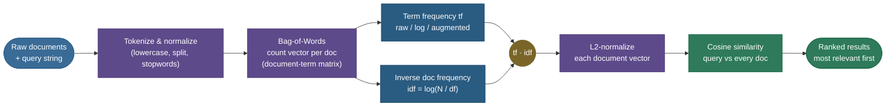

# Bag-of-Words & TF-IDF: turning text into vectors

Suppose I hand you ten thousand product reviews and ask you to *automatically* sort them into "happy" and "angry," or to build a search box that, given the words *"battery drains fast,"* surfaces the three reviews that complain about exactly that. A neural network won't help you until you've answered a more basic question: **what is the input?** A review is a string of characters. Logistic regression, an SVM, a nearest-neighbour search, a clustering algorithm — every one of them eats a **fixed-length vector of numbers**, not a sentence. So before any learning happens, you need a function that turns *"the battery drains fast"* into something like $[0, 1, 0, 3, 1, \dots]$ — a point in some vector space where similar documents land near each other.

**Bag-of-Words (BoW)** is the oldest and most stubbornly useful answer: *represent a document as the counts of the words it contains, over a fixed vocabulary, and throw away the order.* **TF-IDF** is the one critical refinement on top: *reweight those counts so that words appearing everywhere (like "the") count for almost nothing, while words that are frequent here but rare across the collection count a lot.* Sparse, interpretable, embarrassingly fast, and — on small-to-medium datasets — still shockingly hard to beat. It is the baseline every text system is measured against and the interview staple you must be able to derive on a whiteboard.

I'm going to build this the way I'd teach it to a teammate who's about to ship a text classifier: start from the **problem** (text → vectors), construct the **bag-of-words** representation and feel exactly what it throws away, then *derive* **term frequency** and **inverse document frequency** from scratch — including the information-theoretic reason the IDF is a logarithm — combine them into **TF-IDF**, **L2-normalize**, and use **cosine similarity** to actually retrieve and rank documents. Then we'll go past the textbook to **BM25**, the ranking function that powers Lucene/Elasticsearch and beats raw TF-IDF for search, and finish with the **limitations** that motivate dense embeddings. Along the way we build a tiny 3-document corpus **by hand**, compute every number, and then prove the hand numbers match `scikit-learn` exactly. By the end you'll be able to:

- construct a **bag-of-words** vector and a **document-term matrix**, and state precisely what information is lost;
- write the **term-frequency** variants (raw, log-normalized, augmented) and explain *why* you normalize for length;
- **derive** $\text{idf} = \log(N/df_t)$ and the smoothed variant, with the information-theoretic intuition;
- compute **TF-IDF**, L2-normalize, and rank documents by **cosine similarity** — and say why cosine beats dot product and Euclidean distance for text;
- **derive the BM25 ranking function** and explain its two knobs ($k_1$ saturation, $b$ length normalization) and why it beats TF-IDF for retrieval;
- name the limitations (no semantics, no order, OOV, huge sparse vectors) and how each motivates embeddings.

> **Note:** "bag-of-words" is a representation (a feature extractor); "TF-IDF" is a *weighting* you apply on top of that representation. You can have BoW with raw counts and no TF-IDF, and you can apply TF-IDF weighting to n-gram features that aren't single words. Keep the two ideas separate in your head — interviewers probe exactly this seam.

---

## The problem: documents have to become fixed-length vectors

Three of the four pillars of classic text processing — **classification**, **retrieval**, and **clustering** — all require the same thing: a function $\phi : \text{document} \to \mathbb{R}^V$ that maps any document to a fixed-dimensional vector, so that downstream math (a dot product, a distance, a linear decision boundary) is even *defined*.

The difficulty is that documents are variable-length and discrete. *"good"* and *"good good good"* and *"this product is genuinely good"* are three different strings of three different lengths. We need a single, consistent coordinate system. The bag-of-words trick is to **fix a vocabulary** $\{w_1, \dots, w_V\}$ — every distinct word the system knows — and then describe each document by **how many times each vocabulary word appears in it**. Every document, long or short, becomes a vector of length $V$. The coordinate for *"good"* is the same coordinate in every document, so the vectors are comparable.

This is exactly the **vector space model** of information retrieval (Salton, 1970s): documents and queries are points in a $V$-dimensional space, and "relevance" becomes "geometric closeness." Everything in this page is built on that one move.

> **Tip:** the feeding pipeline matters. BoW counts are only as clean as the [tokenization and normalization](01-Text-Preprocessing-and-Normalization.md) that precede them — lowercasing, stripping punctuation, optionally removing stopwords and stemming. *"Cats,"* *"cats"* and *"Cat"* collapse to one vocabulary entry only if preprocessing makes them. Garbage tokens in, garbage vectors out.

---

## Bag-of-Words: count the words, forget the order

Here is the construction, concretely. Take a tiny corpus of three documents — we'll use it for the rest of the page:

- **D1:** `the cat sat on the mat`
- **D2:** `the dog sat on the log`
- **D3:** `the happy cat chased the dog`

Step 1 — **build the vocabulary**: the sorted set of distinct tokens across all documents.

$$V = \{\text{cat}, \text{chased}, \text{dog}, \text{happy}, \text{log}, \text{mat}, \text{on}, \text{sat}, \text{the}\}, \qquad |V| = 9.$$

Step 2 — **count**: for each document, count each vocabulary word. Document D1 (`the cat sat on the mat`) has `the` twice and `cat`, `sat`, `on`, `mat` once each, and zero of everything else. Writing the counts in vocabulary order gives the **count vector**:

$$\text{BoW}(\text{D1}) = [\underbrace{1}_{\text{cat}}, \underbrace{0}_{\text{chased}}, \underbrace{0}_{\text{dog}}, \underbrace{0}_{\text{happy}}, \underbrace{0}_{\text{log}}, \underbrace{1}_{\text{mat}}, \underbrace{1}_{\text{on}}, \underbrace{1}_{\text{sat}}, \underbrace{2}_{\text{the}}].$$

Stack all three documents' vectors as rows and you get the **document-term matrix** $C$ — the central object of classic text mining. Each **row** is a document; each **column** is a vocabulary term; entry $C_{d,t}$ is the raw count of term $t$ in document $d$:

| | cat | chased | dog | happy | log | mat | on | sat | the |
|---|---|---|---|---|---|---|---|---|---|
| **D1** | 1 | 0 | 0 | 0 | 0 | 1 | 1 | 1 | 2 |
| **D2** | 0 | 0 | 1 | 0 | 1 | 0 | 1 | 1 | 2 |
| **D3** | 1 | 1 | 1 | 1 | 0 | 0 | 0 | 0 | 2 |

(These counts are produced verbatim by `CountVectorizer` in the code section — they are not illustrative, they're measured.)

That's the whole representation. The name *bag* is the key insight: a bag (multiset) remembers *what's in it and how many*, but not the order they went in. `the cat sat on the mat` and `the mat sat on the cat` produce the **identical** vector — the model literally cannot tell them apart.



### What bag-of-words throws away

It is worth being precise about the cost, because every limitation of BoW/TF-IDF traces back to one of these losses:

- **Word order / syntax.** *"dog bites man"* and *"man bites dog"* are identical vectors. Any meaning carried by order — negation scope (*"not good"* vs *"good"*), subject/object roles, sarcasm — is invisible.
- **Semantics / synonymy.** Each vocabulary word is its **own** axis, orthogonal to every other. *"car"* and *"automobile"* are as unrelated, geometrically, as *"car"* and *"banana"*: their dot product is zero. BoW has no notion that two different words can *mean* the same thing.
- **Polysemy.** Conversely, one column conflates all senses of a word: *"bank"* (river) and *"bank"* (money) pile into the same coordinate.
- **Out-of-vocabulary (OOV).** A word not seen at fit time has no column; it's silently dropped at inference.

> **Gotcha:** the orthogonality point is the single most important limitation to internalize. In BoW space, *every pair of distinct words is exactly 90° apart.* Two documents that say the same thing in different words ("the film was great" vs "the movie was excellent") can have a cosine similarity of **zero**. This is precisely the gap [word embeddings](05-Word-Embeddings-Word2Vec-GloVe-FastText.md) close by giving related words *nearby* vectors instead of orthogonal ones.

We can recover *some* local order by adding **n-grams** as features (covered below); we recover semantics only by leaving sparse BoW entirely for dense embeddings.

---

## Term frequency: raw counts are a bad weight

A raw count is a crude signal for two reasons, and fixing each gives us a *variant* of term frequency (tf).

**Problem 1 — counts scale with document length.** A 1,000-word essay that mentions *"climate"* eight times is not necessarily *more* about climate than a tweet that says it twice. Raw counts conflate "how much the document is about this term" with "how long the document is." We want a length-aware notion.

**Problem 2 — relevance is sub-linear in count.** The *first* occurrence of *"climate"* tells you a lot ("this document is about climate"); the *tenth* occurrence adds very little new information. Relevance grows fast at first and then **saturates**. Raw count is linear and never saturates — it over-rewards repetition (and is gameable by keyword stuffing).

So term frequency has several standard forms, each addressing one of these:

| Variant | Formula | What it fixes |
|---|---|---|
| **Raw count** | $\text{tf}_{t,d} = f_{t,d}$ | nothing — the baseline |
| **Boolean / binary** | $\mathbb{1}[f_{t,d} > 0]$ | ignores repetition entirely |
| **Log-normalized** | $1 + \log f_{t,d}$ (for $f_{t,d}>0$, else 0) | saturation: damps high counts |
| **Length-normalized** | $f_{t,d} / \sum_{t'} f_{t',d}$ | document length |
| **Augmented (max-norm)** | $0.5 + 0.5 \cdot \dfrac{f_{t,d}}{\max_{t'} f_{t',d}}$ | length, *and* prevents bias toward long docs |

Here $f_{t,d}$ is the raw count of term $t$ in document $d$. The **log-normalized** form, $1 + \log f_{t,d}$, is the one to remember: it encodes "diminishing returns" directly — counts of 1, 10, 100 map to tf of 1, ~3.3, ~5.6. The **augmented** form rescales counts into $[0.5, 1]$ relative to the document's most frequent term, which keeps a long document from dominating purely because every count is larger.

### Worked comparison of tf variants

Numbers make the difference concrete. Suppose a term appears with raw counts of 1, 5, and 50 across three documents. Here is what each variant returns (using natural log for the log-normalized form):

| raw count $f$ | raw tf | binary | log-normalized $1+\ln f$ | how it behaves |
|---|---|---|---|---|
| 1 | 1 | 1 | $1 + 0 = 1.00$ | baseline occurrence |
| 5 | 5 | 1 | $1 + 1.609 = 2.61$ | 5× raw, only ~2.6× log |
| 50 | 50 | 1 | $1 + 3.912 = 4.91$ | 50× raw, only ~4.9× log |

The raw tf spans a **50×** range; the log-normalized tf compresses it to **~4.9×**, and the binary form flattens it to no range at all. This is the "diminishing returns" property in numbers: the jump from 1→5 (×2.6 in log space) is *larger* than the jump from 5→50 (×1.9), even though the raw count grows ten times as much. Which variant you pick depends on the task — binary for short texts where presence matters more than count (tweets, tags), log-normalized for longer documents where you want to damp repetition, raw for the scikit-learn default that leans on later L2 normalization to handle length. The instinct to internalize: **relevance is concave in count, so a concave tf transform beats a linear one** for almost every real task.

> **Note:** in `scikit-learn`'s `TfidfVectorizer`, the default tf is the **raw count** (sublinear damping is opt-in via `sublinear_tf=True`, which switches to $1 + \log f$), and document-length normalization is handled afterwards by **L2-normalizing the final tf-idf vector** rather than dividing tf by document length. Different libraries make different default choices here — always check which tf and which normalization a tool uses before comparing numbers.

---

## Inverse document frequency: derive it from first principles

Term frequency tells you how important a term is *within a document*. But it says nothing about whether the term is **discriminating** *across the collection*. The word `the` appears in essentially every English document — it has high tf everywhere and yet tells you nothing about what any particular document is about. We need a factor that **down-weights terms that are common across documents** and **up-weights terms that are rare**. That factor is **inverse document frequency (idf)**, and we can derive its exact form.

Define the **document frequency** of a term $t$:

$$df_t = \text{number of documents (out of } N\text{) that contain } t \text{ at least once.}$$

Note: document frequency, **not** total count — it's "in how many documents," capped at 1 per document. A term in **every** document ($df_t = N$) is useless for discrimination; a term in **one** document ($df_t = 1$) is maximally specific.

### The information-theoretic derivation

The cleanest justification comes from information theory (this is essentially Spärck Jones's 1972 argument). Treat "a randomly drawn document contains term $t$" as an event with probability

$$p_t = \frac{df_t}{N}.$$

The **self-information** (surprisal) of observing that event is $-\log p_t = \log \frac{N}{df_t}$. A term that appears in every document ($p_t = 1$) carries surprisal $\log 1 = 0$ — observing it tells you nothing, you expected it. A rare term ($p_t$ small) carries large surprisal — observing it is informative, it *narrows down* which document you're looking at. Inverse document frequency is exactly this surprisal:

$$\boxed{\;\text{idf}_t = \log \frac{N}{df_t}\;}$$

That is the canonical definition. The **logarithm is not arbitrary** — it is the information content of the event "this term appears," which is why a term appearing in 1 doc out of 1,000 isn't 1,000× more useful than one in every doc; it's $\log 1000 \approx 6.9$× (in nats) more useful. The log compresses the enormous range of document frequencies into a sane, additive scale, exactly as information content should.


### Smoothing: avoid division by zero and zero weights

Two edge cases break the raw formula. If a query term never appears in the collection, $df_t = 0$ and we divide by zero. And a term in *every* document gets $\text{idf}_t = 0$, which **zeroes out** its tf-idf entirely — sometimes too aggressive. The standard fix is **smoothed idf**, used by `scikit-learn`:

$$\text{idf}_t^{\text{smooth}} = \log \frac{1 + N}{1 + df_t} + 1.$$

The $1+$ in numerator and denominator acts as if there were one extra document containing every term (so no division by zero), and the trailing $+1$ guarantees idf is **strictly positive** for every term — even a term in all documents keeps a small nonzero weight rather than being annihilated. The shape is unchanged: rare terms still get the largest weight.

> **Gotcha:** the most common interview slip is confusing **document frequency** ($df_t$, how many *documents* contain the term, max $N$) with **collection/term frequency** (the total *count* across the whole corpus). IDF uses **document** frequency. A word that appears 50 times but all in one document has $df_t = 1$ — it's *rare* across documents and gets a high idf, which is correct: it's a strong signal for *that one* document.

---

## TF-IDF: multiply them together

The TF-IDF weight of term $t$ in document $d$ is simply the product:

$$\boxed{\;\text{tfidf}_{t,d} = \text{tf}_{t,d} \times \text{idf}_t\;}$$

Read the four corners of this product and you understand the whole scheme:

- **High tf, high idf** → **large weight.** The term is frequent *in this document* and rare *across the collection* — exactly a topic/keyword for this document (e.g. `happy` in D3). These are the words TF-IDF promotes.
- **High tf, low idf** → **small weight.** Frequent here but everywhere else too (e.g. `the`) — a stopword; tf-idf crushes it even though its raw count is the highest in every document.
- **Low tf, high idf** → **small-to-moderate weight.** Rare term mentioned once; a weak signal.
- **Low tf, low idf** → **tiny weight.** Uninformative on both axes.

The magic is in the *first two rows*: TF-IDF automatically **discovers stopwords from data**. You never have to hand-curate a stopword list — any term that appears in (nearly) every document has $\text{idf} \approx 0$ and gets weighted to near-zero on its own. That is the whole point of the IDF factor.

### Worked example: compute the matrix by hand

Let's compute tf-idf for our 3-document corpus, using **raw-count tf** and **smoothed idf** (matching `scikit-learn`, $N=3$). First the idf for each term, from its document frequency:

| term | $df_t$ | $\text{idf}^{\text{smooth}} = \log\frac{1+N}{1+df_t}+1$ | value |
|---|---|---|---|
| `the` | 3 | $\log\frac{4}{4}+1 = 0+1$ | **1.0000** |
| `cat` | 2 | $\log\frac{4}{3}+1 = 0.2877+1$ | **1.2877** |
| `dog` | 2 | $\log\frac{4}{3}+1$ | **1.2877** |
| `sat` | 2 | $\log\frac{4}{3}+1$ | **1.2877** |
| `on` | 2 | $\log\frac{4}{3}+1$ | **1.2877** |
| `happy` | 1 | $\log\frac{4}{2}+1 = 0.6931+1$ | **1.6931** |
| `mat` | 1 | $\log\frac{4}{2}+1$ | **1.6931** |
| `log` | 1 | $\log\frac{4}{2}+1$ | **1.6931** |
| `chased` | 1 | $\log\frac{4}{2}+1$ | **1.6931** |

Look at `the`: it appears in all 3 documents, so its smoothed idf is exactly **1.0** — and with plain (unsmoothed) idf it would be $\log(3/3) = 0$, killing it entirely. Either way, the most frequent word in every document gets the **lowest** weight. That is IDF doing its job.

Now multiply each raw count by its term's idf. For **D1** (`the`×2, `cat`, `sat`, `on`, `mat` ×1):

$$\text{tfidf}(\text{D1}) : \quad \underbrace{\text{cat}=1\times1.2877=1.2877}_{}, \;\; \underbrace{\text{mat}=1\times1.6931=1.6931}_{}, \;\; \underbrace{\text{on}=1.2877}_{}, \;\; \underbrace{\text{sat}=1.2877}_{}, \;\; \underbrace{\text{the}=2\times1.0=2.0}_{}.$$

So in D1 the highest-weighted term is `mat` (1.69) — it appears once but is unique to D1 — while `the`, despite the highest raw count (2), only scores 2.0 *before* normalization and, crucially, becomes the *least* informative axis after we normalize. This is the un-normalized tf-idf row; `scikit-learn` returns exactly these numbers (`norm=None`), which we verify in code.

> **Tip:** notice `mat` (1.69) outscores `cat` (1.29) in D1 even though both appear once. Why? `mat` is unique to D1 ($df=1$) while `cat` is shared with D3 ($df=2$). TF-IDF rewards the term that better *distinguishes* this document from the rest. That's the discriminative signal a downstream classifier or search index actually wants.

---

## L2-normalize: make documents comparable regardless of length

The raw tf-idf vectors still have a length bias: a longer document has more nonzero entries and a larger overall magnitude, which would let document *length* dominate similarity. The standard cure is to **L2-normalize** each document vector to unit length:

$$\hat{v}_d = \frac{v_d}{\lVert v_d \rVert_2}, \qquad \lVert v_d \rVert_2 = \sqrt{\sum_t v_{d,t}^2}.$$

After this, every document is a **point on the unit hypersphere**. Let's normalize D1. Its un-normalized entries are $\{1.2877, 1.6931, 1.2877, 1.2877, 2.0\}$ (cat, mat, on, sat, the). The L2 norm is

$$\lVert v_{\text{D1}} \rVert_2 = \sqrt{1.2877^2 + 1.6931^2 + 1.2877^2 + 1.2877^2 + 2.0^2} = \sqrt{11.84} \approx 3.441.$$

Dividing through gives the normalized weights: `the` $= 2.0/3.441 = 0.5812$, `mat` $= 1.6931/3.441 = 0.4920$, `cat`=`on`=`sat` $= 1.2877/3.441 = 0.3742$. These exact numbers are what the heatmap below shows and what `scikit-learn` returns by default (it L2-normalizes rows):


> **Note:** after L2 normalization, the **dot product of two document vectors equals their cosine similarity** (because both are unit vectors, the denominator of cosine is 1). This is not a coincidence — it's why retrieval systems store L2-normalized vectors: ranking by dot product is then identical to ranking by cosine, and dot products are what fast linear-algebra kernels compute. Normalize once, rank by dot product forever.

---

## Cosine similarity: why angle, not distance

We now have each document as a unit vector. To retrieve and rank, we need a **similarity** between a query vector $q$ and each document vector $d$. The standard choice is **cosine similarity** — the cosine of the angle between them:

$$\cos(q, d) = \frac{q \cdot d}{\lVert q \rVert_2 \, \lVert d \rVert_2} = \frac{\sum_t q_t d_t}{\sqrt{\sum_t q_t^2}\,\sqrt{\sum_t d_t^2}}.$$

It ranges from 0 (orthogonal — no shared terms) to 1 (same direction — proportional term profiles). Why cosine and not the two obvious alternatives?

**Why not raw dot product?** The bare dot product $q \cdot d$ rewards **magnitude**: a long document with many terms can score high against any query simply because it has more nonzero entries, regardless of whether it's *about* the query. Cosine divides out both magnitudes, measuring only the **direction** of the term profile — *what fraction of the document's "energy" points along the query.* (After L2 normalization, of course, dot product and cosine coincide — that's the point of normalizing.)

**Why not Euclidean distance?** Consider a document and a copy of itself repeated three times: same words, three times the counts. Their term *profiles* are identical (they're about the same thing), but their Euclidean distance is large because one vector is 3× longer. Cosine sees them as **identical** (angle 0, cosine 1) — which is what we want: repetition shouldn't change topical similarity. In high-dimensional sparse spaces, Euclidean distance is dominated by length differences and is a poor relevance signal; **angle is length-invariant**, which is exactly the invariance text retrieval needs.

To make the geometry tangible: cosine of 0 means the two term-profile vectors point in the **same direction** (a 0° angle), cosine of $1/\sqrt{2} \approx 0.707$ means they're **45°** apart, and cosine of 0 means they're **90°** apart (orthogonal, no shared terms). Our measured $\cos(\text{D1},\text{D2}) = 0.618$ corresponds to an angle of $\arccos(0.618) \approx 52°$ — the two documents point in *broadly* similar directions but are clearly distinct, which matches intuition: they share the sentence frame but differ on the content nouns. There is a neat algebraic bonus: for L2-normalized vectors, squared Euclidean distance and cosine are tied by $\lVert \hat{q} - \hat{d}\rVert_2^2 = 2 - 2\cos(q,d)$. So *after* L2 normalization, ranking by (ascending) Euclidean distance and ranking by (descending) cosine give the **identical order** — the normalization is what reconciles the two. The reason we still speak in cosine is that it's bounded in $[0,1]$ for non-negative tf-idf and reads directly as "fraction of shared direction."

### Worked example: cosine between two documents

Take the L2-normalized D1 and D2 from the heatmap. They share the terms `on`, `sat`, `the` (each contributes the product of their normalized weights) and differ on `cat`/`mat` (D1) vs `dog`/`log` (D2). The three shared terms have identical normalized weights in both documents ($0.3742, 0.3742, 0.5812$), so:

$$\cos(\text{D1}, \text{D2}) = 0.3742^2 + 0.3742^2 + 0.5812^2 = 0.1400 + 0.1400 + 0.3378 = 0.618.$$

(Only the shared dimensions contribute; the unique terms multiply against zero.) And $\cos(\text{D1}, \text{D3})$: they share only `cat` and `the`, giving $0.3742 \times 0.3565 + 0.5812 \times 0.5536 = 0.1334 + 0.3218 \approx 0.455$. So D1 is **more similar to D2 than to D3** — sensible, since D1 and D2 share the *whole sentence frame* `the … sat on the …` while D1 and D3 share only `cat` and `the`. The full measured matrix:

| cosine | D1 | D2 | D3 |
|---|---|---|---|
| **D1** | 1.000 | 0.618 | 0.455 |
| **D2** | 0.618 | 1.000 | 0.455 |
| **D3** | 0.455 | 0.455 | 1.000 |

These exact values come out of `cosine_similarity` in the code section. Notice how much of the 0.618 between D1 and D2 is carried by `the` ($0.3378$ of $0.618$, more than half) — a hint that stopword-heavy similarity is shaky, and a reason real systems often *remove* stopwords before vectorizing.

> **Tip:** for a **query**, you transform it with the *same* fitted vectorizer (same vocabulary, same idf weights learned from the corpus), then cosine it against every document. Search becomes: vectorize query → dot product with the (normalized) document-term matrix → sort descending. With a sparse matrix this is a single fast sparse mat-vec, which is why TF-IDF retrieval scales to millions of documents on a laptop.

---

## N-gram features: smuggling order back in

Pure unigram BoW loses all order. A cheap partial fix is to add **n-grams** — contiguous sequences of $n$ tokens — as *additional vocabulary entries*. With bigrams, `not good` becomes its own feature distinct from `not` and `good`, so the classifier can learn that `not good` is negative even though `good` alone is positive. The bigram vocabulary of D1 (`the cat sat on the mat`) is `the cat`, `cat sat`, `sat on`, `on the`, `the mat`.

This is the link to [n-gram language models](04-N-gram-Language-Models-and-Smoothing.md): the same contiguous-window idea, used there for *prediction* and here for *features*. In practice `TfidfVectorizer(ngram_range=(1,2))` mixes unigrams and bigrams, and bigrams reliably lift text-classification accuracy a few points — capturing negation, fixed phrases (`new york`, `machine learning`), and short idioms.

There is also a **character** n-gram variant (`analyzer="char_wb"`): instead of word sequences, the features are sliding windows of characters (e.g. `_ca`, `cat`, `at_`). Character n-grams are surprisingly robust — they handle misspellings, morphology, and even languages without clean word boundaries, because a typo like `recieve` still shares most of its character trigrams with `receive`. They're a common choice for noisy text (social media, OCR output) and for language identification, where word-level features fail. The cost, as always, is a larger feature space.

> **Gotcha:** n-grams explode the vocabulary. Unigrams might give 50k features; add bigrams and you can hit *millions*, most appearing once or twice (noise). You then **prune** with `min_df` (drop terms in too few documents) and `max_df` (drop terms in too many — a data-driven stopword filter) and often a hashing trick or feature cap. N-grams trade dimensionality for a little order — useful, but with a steep cost you have to manage.

---

## The curse of dimensionality and sparsity

A real vocabulary is **enormous** — tens of thousands to millions of terms — so each document vector lives in a space of that dimension, yet a single document touches only a few hundred of those coordinates. The vectors are therefore **extremely sparse** (99.9%+ zeros). This has two faces:

- **The good:** sparsity is what makes TF-IDF *fast*. You store only nonzero entries (a `scipy.sparse` CSR matrix), and dot products skip the zeros. A million-document × million-term matrix that would be $10^{12}$ dense floats fits comfortably as a few hundred MB sparse.
- **The bad:** in very high dimensions, distances **concentrate** — every pair of random sparse vectors looks almost equally far apart, so naive nearest-neighbour search degrades. And because dimensions are independent word-axes, the representation has **no generalization across words**: learning that `excellent` is positive teaches the model *nothing* about `superb`. Every word must be learned from its own evidence.

> **Note:** the "huge sparse vector" is both BoW/TF-IDF's superpower (fast, exact, interpretable — you can read off *which words* drove a prediction) and its ceiling (no generalization across related words, no sense of meaning). Dense embeddings invert the trade: a few hundred *dense* dimensions where related words are *close*, gaining generalization at the cost of interpretability. Which side of that trade you want depends on data size and the need to explain decisions.

---

## BM25: the ranking function search engines actually use

TF-IDF + cosine is a fine baseline, but production search (Lucene, Elasticsearch, Solr) ranks with **BM25** ("Best Match 25," Robertson & Zaragoza), which fixes two weaknesses of plain TF-IDF: linear (unbounded) term frequency, and crude length handling. It's the most important upgrade to know, and it's *derivable* as a few sensible patches to TF-IDF.

For a query $Q$ (a set of terms) and document $D$, the BM25 score is a **sum over query terms**:

$$\boxed{\;\text{BM25}(Q, D) = \sum_{t \in Q} \text{idf}(t) \cdot \frac{f_{t,D}\,(k_1 + 1)}{f_{t,D} + k_1\left(1 - b + b\,\dfrac{|D|}{\text{avgdl}}\right)}\;}$$

where $f_{t,D}$ is the raw count of $t$ in $D$, $|D|$ is the document length (in tokens), $\text{avgdl}$ is the average document length in the collection, and $k_1, b$ are tuning knobs. The idf is the Robertson–Spärck-Jones variant: $\text{idf}(t) = \ln\!\left(1 + \frac{N - df_t + 0.5}{df_t + 0.5}\right)$ (smoothed, and always positive). Let's read the formula in three pieces.

### Piece 1 — the IDF component

Same idea as before: rare query terms count more, but BM25's idf has a probabilistic pedigree worth one line. The **probabilistic relevance framework** asks: for a term $t$, what are the odds it appears in a *relevant* document versus a *non-relevant* one? With no relevance feedback, you estimate that "a document not containing $t$" is the non-relevant proxy, and the odds-ratio collapses to

$$\text{idf}_{\text{BM25}}(t) = \ln \frac{N - df_t + 0.5}{df_t + 0.5},$$

with the modern variant wrapping it as $\ln\!\big(1 + \frac{N - df_t + 0.5}{df_t + 0.5}\big)$ to keep it non-negative even when $df_t > N/2$. The $+0.5$ terms are Bayesian smoothing (a uniform prior). So BM25's idf is not an ad-hoc log like the textbook tf-idf — it falls out of asking "how much does this term shift the odds of relevance?" The practical effect is the same as before: a term in nearly every document contributes almost nothing; a rare term contributes a lot. It's the discriminative-power factor, now derived rather than asserted.

### Piece 2 — term-frequency saturation via $k_1$

Look at the tf part with length-normalization off ($b=0$): $\frac{f(k_1+1)}{f + k_1}$. As $f \to \infty$ this approaches $k_1 + 1$ — a **horizontal asymptote**. Unlike raw tf (which grows forever), BM25's tf component **saturates**: the first occurrence of a query term gives a big jump, the second a smaller one, and beyond a point extra occurrences barely move the score. $k_1$ (typically **1.2–2.0**) controls *how fast* it saturates — small $k_1$ saturates almost immediately (close to binary "present or not"), large $k_1$ stays near-linear longer.


Why this matters: raw TF-IDF lets a document that repeats a query word 50 times score ~50× a document that uses it once — easily gamed by **keyword stuffing**. BM25 says the 50th occurrence is barely worth more than the 5th. Concretely, with $k_1 = 1.5$ and $b = 0$, the tf component for counts 1, 2, 3, 5, 10, 50 is **1.00, 1.43, 1.67, 1.92, 2.17, 2.43** — climbing toward the ceiling $k_1 + 1 = 2.5$ but never reaching it. The 50× raw spread collapses to a 2.4× scored spread. That saturation is BM25's headline advantage over TF-IDF for ranking.

### Piece 3 — document-length normalization via $b$

The denominator term $k_1\!\left(1 - b + b\,\frac{|D|}{\text{avgdl}}\right)$ normalizes for length. The knob $b \in [0,1]$ interpolates:

- $b = 0$ → no length normalization (the bracket is just $k_1$); long and short documents treated equally.
- $b = 1$ → **full** normalization by relative length $|D|/\text{avgdl}$.
- $b \approx 0.75$ (the standard default) → partial. The intuition: a longer document naturally contains more words, so a query-term match in a long document is **less surprising** and should count for less than the same match in a short, focused document. Dividing by relative length penalizes long documents — but only partially, because some documents are legitimately long *and* on-topic, and we don't want to punish them fully.

### Worked example: BM25 vs TF-IDF ranking

Take a 5-document corpus and the query **`happy cat`**. Ranking by BM25 (Okapi, $k_1{=}1.5$, $b{=}0.75$) gives the measured scores: **D3** (`the happy cat chased the dog`) = **2.39**, **D1** (`the cat sat on the mat`) = **0.92**, and D2/D4/D5 = 0 (they contain neither `happy` nor `cat`). The cosine-TF-IDF ranking agrees on order — D3 (0.61) above D1 (0.25) — but BM25 *widens* the gap, because D3 matches **both** query terms (`happy` is rare, so its idf is high) while D1 matches only `cat`:


The two methods **agree on the ranking** here but BM25 gives a sharper, better-calibrated separation — which, scaled to a real collection with documents of wildly varying length, is the difference between a mediocre and a good search experience.

> **Tip:** if you're building search and reaching for TF-IDF cosine, reach for **BM25 instead** — it's a near-drop-in upgrade (same inputs: term counts, document frequencies, lengths) that's the default in every serious lexical search engine. TF-IDF cosine is the better choice when you're building *features for a classifier*; BM25 is the better choice when you're *ranking documents for a query*. See [Information Retrieval & Semantic Search](16-Information-Retrieval-and-Semantic-Search.md) for where BM25 meets dense retrieval.

---

## Where it's used: classification, retrieval, clustering, keywords

TF-IDF vectors feed an enormous amount of practical NLP. Four canonical uses:

**1. Text classification.** TF-IDF features + a **linear model** is the classic strong baseline. **Multinomial Naive Bayes** treats each document as a bag of (weighted) word events and is famously good on text despite its naive independence assumption; a **linear SVM** or **logistic regression** on L2-normalized TF-IDF is the workhorse for sentiment, spam, and topic labeling — fast to train, easy to interpret (read the largest-weight features per class), and competitive with neural models when data is limited. See [Text Classification & Sentiment Analysis](10-Text-Classification-and-Sentiment-Analysis.md).

**2. Information retrieval / search.** The vector space model (TF-IDF cosine) and its successor BM25 are the foundation of lexical search; they're still half of modern **hybrid retrieval** (BM25 + dense embeddings), where the lexical side catches exact keyword and rare-term matches that embeddings miss. See [Information Retrieval & Semantic Search](16-Information-Retrieval-and-Semantic-Search.md).

**3. Clustering and topic discovery.** TF-IDF vectors fed to k-means or hierarchical clustering group documents by shared distinctive vocabulary. And the TF-IDF document-term matrix is the *input* to classic [topic models](15-Topic-Modeling-LDA-NMF.md) — **NMF** factorizes it directly, and **LDA** typically runs on raw counts but uses the same BoW representation.

**4. Keyword extraction.** The simplest keyphrase extractor: TF-IDF-weight a document's terms and take the top-$k$ — those are, by construction, the words that are frequent *here* but rare *elsewhere*, i.e. what the document is distinctively about. It's the one-line "what is this document about?" baseline.

> **Note:** TF-IDF's interpretability is a genuine production advantage. When a TF-IDF + logistic-regression spam classifier flags an email, you can print the exact words (`viagra`, `wire transfer`, `prince`) that drove the decision — their tf-idf weight × the model coefficient. Try explaining a transformer's decision that cleanly. For regulated or auditable settings, this transparency alone keeps TF-IDF in production.

---

## Application: a TF-IDF classifier / search pipeline, step by step

Here's the playbook I'd actually run to ship a TF-IDF system end to end:

1. **Preprocess** — lowercase, tokenize, strip punctuation. Decide on stopword removal (usually yes for retrieval, sometimes no for classification where function words carry signal) and stemming/lemmatization (collapses `running`/`ran`/`runs`). See [Text Preprocessing](01-Text-Preprocessing-and-Normalization.md).
2. **Fit the vocabulary on the training set only.** Choose `ngram_range` (unigrams, or `(1,2)` for bigrams), and prune with `min_df` (drop ultra-rare terms — typos, noise) and `max_df` (drop ultra-common terms — data-driven stopwords). This bounds dimensionality.
3. **Learn idf from the training corpus**, build the document-term matrix, apply tf-idf weighting, **L2-normalize**.
4. **For classification:** train a linear SVM / logistic regression / Multinomial NB on the matrix; inspect top features per class as a sanity check.
5. **For retrieval:** store the normalized matrix; at query time, transform the query with the *same* vectorizer and rank documents by cosine (= dot product). Or skip straight to **BM25** for ranking.
6. **Evaluate and iterate** — accuracy/F1 for classification, or precision@k / nDCG for retrieval; tune `ngram_range`, `min_df`/`max_df`, `sublinear_tf`, and (for BM25) $k_1$, $b$.

> **Gotcha:** **fit the vectorizer on training data only**, then `transform` (never `fit_transform`) the test/validation/query data. Fitting on the test set leaks idf statistics — the test set's document frequencies — into your features, inflating offline metrics in a way that won't hold in production. This is the single most common TF-IDF bug in interviews and in real notebooks.

---

## Code: build it by hand, then match scikit-learn exactly

This runs on CPU in under a second. It builds the BoW count matrix, computes tf-idf by hand, and verifies the hand numbers match `scikit-learn`'s `TfidfVectorizer` — then does a small retrieval ranking with both cosine-TF-IDF and BM25.

```python
"""Bag-of-Words, TF-IDF, cosine retrieval, and BM25 — from scratch,
verified against scikit-learn. Verified on Python 3.12, scikit-learn 1.9, numpy 2.4."""
import numpy as np
from sklearn.feature_extraction.text import CountVectorizer, TfidfVectorizer
from sklearn.metrics.pairwise import cosine_similarity

docs = [
    "the cat sat on the mat",          # D1
    "the dog sat on the log",          # D2
    "the happy cat chased the dog",    # D3
]
tok = r"(?u)\b\w+\b"

# ---- 1. Bag-of-Words count matrix --------------------------------------
cv = CountVectorizer(token_pattern=tok)
counts = cv.fit_transform(docs).toarray()
terms = cv.get_feature_names_out()
print("vocabulary:", list(terms))
print("BoW counts (rows = docs):\n", counts)
# D1 row: [1 0 0 0 0 1 1 1 2]  -> cat,mat,on,sat once; the twice

# ---- 2. TF-IDF by hand (raw tf, smoothed idf, L2 norm) -----------------
N = len(docs)
df = (counts > 0).sum(axis=0)                       # document frequency per term
idf = np.log((1 + N) / (1 + df)) + 1                # sklearn smoothed idf
tfidf_raw = counts * idf                            # tf (raw count) * idf
# L2-normalize each row
tfidf_hand = tfidf_raw / np.linalg.norm(tfidf_raw, axis=1, keepdims=True)
print("\nhand idf:", dict(zip(terms, np.round(idf, 4))))

# ---- 3. scikit-learn, and check we match -------------------------------
tv = TfidfVectorizer(token_pattern=tok, norm="l2")   # raw tf, smooth idf, L2
tfidf_sk = tv.fit_transform(docs).toarray()
print("hand == sklearn:", np.allclose(tfidf_hand, tfidf_sk, atol=1e-9),
      "| max abs diff:", f"{np.abs(tfidf_hand - tfidf_sk).max():.2e}")

# ---- 4. cosine similarity between documents ----------------------------
cos = cosine_similarity(tfidf_sk)
print("\ncosine(D1,D2) =", round(cos[0, 1], 3),
      " cosine(D1,D3) =", round(cos[0, 2], 3))

# ---- 5. BM25 retrieval (Okapi, k1=1.5, b=0.75) -------------------------
def bm25(corpus, query, k1=1.5, b=0.75):
    toks = [c.lower().split() for c in corpus]
    Nc, avgdl = len(toks), np.mean([len(t) for t in toks])
    q = query.lower().split()
    dfq = {w: sum(w in t for t in toks) for w in q}
    out = np.zeros(Nc)
    for i, d in enumerate(toks):
        for w in q:
            f = d.count(w)
            if not f:
                continue
            idf_w = np.log(1 + (Nc - dfq[w] + 0.5) / (dfq[w] + 0.5))
            out[i] += idf_w * f * (k1 + 1) / (f + k1 * (1 - b + b * len(d) / avgdl))
    return out

corpus = docs + [
    "a quick brown fox jumps over the lazy dog",
    "cats and dogs are common household pets",
]
scores = bm25(corpus, "happy cat")
print("\nBM25 ranking for 'happy cat':")
for i in np.argsort(-scores):
    print(f"  D{i+1}: {scores[i]:.3f}  {corpus[i]!r}")
```

Running it prints:

```
vocabulary: ['cat','chased','dog','happy','log','mat','on','sat','the']
BoW counts (rows = docs):
 [[1 0 0 0 0 1 1 1 2]
  [0 0 1 0 1 0 1 1 2]
  [1 1 1 1 0 0 0 0 2]]

hand idf: {'cat':1.2877,'chased':1.6931,'dog':1.2877,'happy':1.6931,'log':1.6931,
           'mat':1.6931,'on':1.2877,'sat':1.2877,'the':1.0}
hand == sklearn: True | max abs diff: 0.00e+00

cosine(D1,D2) = 0.618  cosine(D1,D3) = 0.455

BM25 ranking for 'happy cat':
  D3: 2.388  the happy cat chased the dog
  D1: 0.924  the cat sat on the mat
  D2: 0.000  the dog sat on the log
  D4: 0.000  a quick brown fox jumps over the lazy dog
  D5: 0.000  cats and dogs are common household pets
```

The headline is **`hand == sklearn: True`** with a max difference at the level of floating-point dust ($\sim 10^{-16}$ or exactly zero, depending on the BLAS): the by-hand idf, the tf-idf product, and the L2 normalization reproduce `scikit-learn` to machine precision. The cosine and BM25 numbers match the worked examples and the diagrams above exactly — every number on this page is measured, not asserted.

> **Tip:** to see why **stopwords hurt**, re-run with `TfidfVectorizer(stop_words="english")`. The cosine between D1 and D2 drops sharply because `the`, `on` — which carried ~60% of their old similarity — disappear, leaving only the genuinely content-bearing overlap. For *retrieval*, removing stopwords usually helps; for *classification*, test it, since function words can carry stylistic signal.

---

## Limitations → why embeddings exist

Pulling the threads together, here is the honest ledger of what BoW/TF-IDF cannot do — and each gap names a successor:

- **No semantics (synonymy).** Distinct words are orthogonal axes; `car` and `automobile` have similarity 0. → [Word embeddings](05-Word-Embeddings-Word2Vec-GloVe-FastText.md) place related words *near* each other so similar meaning ⇒ similar vector.
- **No word order / syntax.** `dog bites man` = `man bites dog`. N-grams patch this locally at a steep dimensionality cost; **sequence models** (RNNs, transformers) model order natively.
- **No polysemy resolution.** One vector per word type, all senses merged. → [Contextual embeddings](06-Contextual-Embeddings-ELMo-BERT.md) (ELMo, BERT) give a *different* vector per occurrence based on context.
- **Out-of-vocabulary words.** Unseen terms have no column and vanish. → Subword [tokenization](02-Tokenization-and-Subword-Algorithms.md) (BPE, WordPiece) and FastText's character n-grams handle novel words.
- **Huge, sparse dimensionality.** $V$ in the tens of thousands to millions. → Dense embeddings compress to a few hundred dimensions with generalization across words.

> **Note:** none of this makes TF-IDF obsolete. On small datasets, for interpretable features, for exact keyword matching, and as the lexical half of hybrid search, it remains a first-class tool in 2026. The lesson is *complementarity*: lexical (TF-IDF/BM25) catches exact and rare terms; dense embeddings catch meaning and paraphrase. The strongest retrieval systems run **both**. Reach for embeddings when you need semantics and have the data; reach for TF-IDF when you need speed, interpretability, or exact matching.

---

## Provenance: the people who built this

The ideas have a clean lineage worth knowing for interviews:

- **Luhn (1957)** proposed using word *frequency* to measure significance — the seed of term frequency.
- **Spärck Jones (1972)**, *"A Statistical Interpretation of Term Specificity,"* introduced **inverse document frequency** and the information-theoretic argument that term specificity should weight retrieval — the single most-cited idea on this page.
- **Salton & Buckley (1988)**, *"Term-weighting approaches in automatic text retrieval,"* systematized the **TF-IDF** family and the vector space model with cosine.
- **Robertson & Zaragoza (2009)**, *"The Probabilistic Relevance Framework: BM25 and Beyond,"* gives the modern derivation of **BM25** from probabilistic retrieval theory.
- **Manning, Raghavan & Schütze**, *Introduction to Information Retrieval* (Ch. 6), is the canonical free textbook treatment tying tf, idf, the vector space model, and cosine together.

---

## Recap and rapid-fire

**If you remember nothing else:** represent a document as a vector of word counts over a fixed vocabulary (**bag-of-words**, which discards order and meaning); reweight each count by **tf** (importance within the document) times **idf** $= \log(N/df_t)$ (a term's rarity, hence discriminating power, across the collection); **L2-normalize**; and rank by **cosine similarity** (angle, so length-invariant). It's sparse, fast, interpretable, and a strong baseline — but it has no semantics (synonyms are orthogonal) and no order, which is exactly what embeddings fix. For *search*, prefer **BM25**, which saturates term frequency ($k_1$) and normalizes for length ($b$).

**Quick-fire — say these out loud:**

- *Write the TF-IDF formula.* $\text{tfidf}_{t,d} = \text{tf}_{t,d} \cdot \log(N/df_t)$ (smoothed: $\log\frac{1+N}{1+df_t}+1$).
- *Why is IDF a logarithm?* It's the self-information $-\log p_t$ of "the term appears"; a term in every doc carries 0 bits, a rare term carries many.
- *df vs collection frequency?* IDF uses **document** frequency (how many *documents* contain the term, max $N$), not the total count.
- *Why does TF-IDF crush "the"?* `the` is in (nearly) every document, so $df \approx N$ and $\text{idf} \approx 0$ — it auto-discovers stopwords from data.
- *Why cosine, not Euclidean or dot product?* Cosine is **length-invariant** (measures the angle / term profile); Euclidean and raw dot product are dominated by document length.
- *What does L2-normalization buy you?* Unit vectors, so dot product = cosine, and document length stops biasing similarity.
- *What does BoW lose?* Word order, syntax, semantics (synonyms orthogonal), polysemy; OOV words drop out.
- *BM25 over TF-IDF — what's different?* TF saturation via $k_1$ (resists keyword stuffing) and document-length normalization via $b$.
- *Biggest TF-IDF bug?* Fitting the vectorizer on the test set — leaks idf statistics.
- *Why do embeddings exist?* To give synonyms *nearby* vectors instead of orthogonal axes, and to generalize across related words.

---

## References and further reading

The curated link library for this topic — videos, courses, articles, papers, books, and internal cross-links — lives in a companion file so it can be reused as a standalone reference list:

**→ [Bag-of-Words & TF-IDF — references and further reading](03-Bag-of-Words-and-TF-IDF.references.md)**
