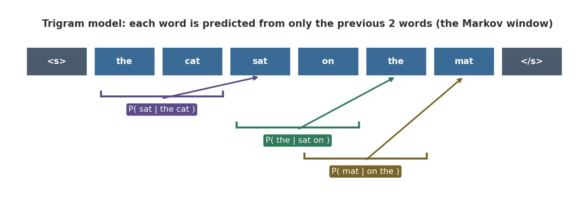
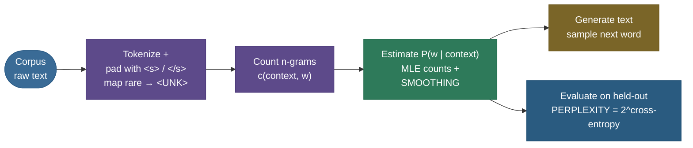
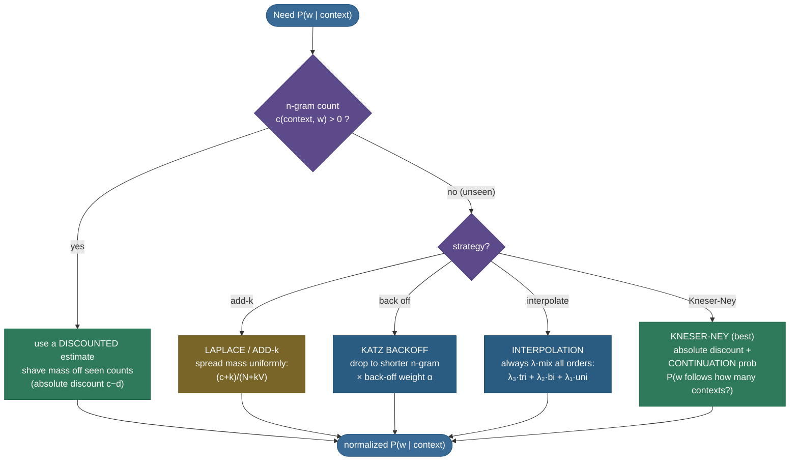

# N-gram Language Models and Smoothing: counting your way to probability

Suppose I hand you the fragment *"I'd like to make a collect …"* and ask you to bet on the next word. You'll say **call** without hesitating — not because you parsed the grammar, but because in all the English you've ever heard, *collect* is followed by *call* far more often than by *banana*. A **language model** is just that instinct made into arithmetic: a function that assigns a **probability to a sequence of words**, and equivalently predicts **how likely each next word is given the words so far**. The **N-gram** model is the oldest, simplest, and most instructive way to build one — you literally **count** which words follow which, and turn those counts into probabilities.

This page is the *complete* tour I'd give a teammate before an interview or before they touch a modern LLM, because every idea here — the **chain rule**, the **Markov assumption**, **maximum-likelihood counts**, the **sparsity catastrophe**, the whole **smoothing** family, and **perplexity** — survives, unchanged in spirit, into the neural and transformer models that replaced n-grams. We'll *derive* each result rather than state it, work **five+ numeric examples by hand**, and finish with a from-scratch model you can run. By the end you'll be able to:

- write the **chain-rule** factorization of a sentence's probability and explain the **Markov assumption** that turns it into an n-gram;
- **derive** the maximum-likelihood estimate $p(w_i \mid w_{i-1}) = c(w_{i-1}, w_i)/c(w_{i-1})$ and compute it by hand;
- explain and *demonstrate numerically* the **zero-probability catastrophe** that makes raw counts unusable;
- climb the **smoothing ladder** — Laplace, add-k, Good-Turing, Katz backoff, interpolation, and **Kneser-Ney** — deriving what each one does to the probability mass and *why*;
- **derive perplexity** $\mathrm{PP}(W) = 2^{-\frac1N \sum \log_2 p}$, read it as a branching factor, and connect it to cross-entropy (the *same* metric neural LMs report);
- state precisely **why** n-grams hit a wall, and how that wall motivated word embeddings and neural language models.

> **Note:** "n-gram" means a contiguous run of $n$ tokens. A **unigram** is one word ($n{=}1$), a **bigram** two ($n{=}2$, "machine learning"), a **trigram** three ($n{=}3$, "the cat sat"). An **n-gram language model** uses (n−1)-word context to predict the next word. The whole field is built on choosing $n$ and dealing with the consequences.

---

## The problem: assign a probability to a sentence

A language model answers one deceptively simple question: **given a string of words, how probable is it?** Formally, for a sequence $W = w_1 w_2 \dots w_n$ we want

$$P(W) = P(w_1, w_2, \dots, w_n).$$

Why would you ever want this? Because *every* generative language task is secretly a ranking over sequences:

- **Speech recognition** — "recognize speech" vs. "wreck a nice beach" sound nearly identical; the LM picks the more probable word sequence.
- **Machine translation** — among many fluent renderings of a foreign sentence, prefer the one with higher $P(W)$ in the target language.
- **Spelling/grammar correction** — "their going to school" scores lower than "they're going to school".
- **Autocomplete / generation** — emit the next word that maximizes (or samples from) $P(w_i \mid \text{context})$.

So the modeling target is a probability distribution over the (infinite) set of all word sequences. The trouble is obvious: there are far too many possible sentences to ever estimate $P(W)$ directly by counting whole sentences — you'd need to have *seen the exact sentence before*, and almost every sentence anyone utters is brand new. We need to **break the joint probability into pieces we *can* estimate.** That decomposition is the chain rule.

> **Note:** a language model is not a classifier over a fixed label set; its "label space" is the entire vocabulary at *every* position, conditioned on everything before. That is exactly why decomposition is mandatory — and exactly why the same machinery scales from n-grams to GPT.

---

## Deriving the chain rule

The chain rule of probability is just the repeated application of the definition of conditional probability, $P(A, B) = P(A)\,P(B \mid A)$. Apply it left to right across the whole sentence:

$$
\begin{aligned}
P(w_1, w_2, \dots, w_n)
&= P(w_1)\, P(w_2 \mid w_1)\, P(w_3 \mid w_1, w_2) \cdots P(w_n \mid w_1, \dots, w_{n-1}) \\[4pt]
&= \prod_{i=1}^{n} P\!\left(w_i \mid w_1, \dots, w_{i-1}\right).
\end{aligned}
$$

Read it aloud: **the probability of a sentence is the product, over each position, of the probability of that word given every word before it.** No approximation yet — this is *exact*. The chain rule converts one impossible estimation (the whole joint) into a sequence of next-word predictions.

> **Note:** this factorization is the heart of **autoregressive** modeling — predict each token from its left context, multiply the conditionals. GPT does *exactly* this; it only replaces the estimator of $P(w_i \mid w_1 \dots w_{i-1})$ with a transformer instead of a count table. Learn the n-gram version and you understand the skeleton of every modern LLM.

But we have only moved the problem, not solved it. The last factor, $P(w_n \mid w_1, \dots, w_{n-1})$, still conditions on the *entire* preceding sentence — a context so long we'll essentially never have seen it before. We need to shorten the history. Enter the Markov assumption.

---

## The Markov assumption turns the chain rule into an n-gram

The **Markov assumption** says: the future depends on only a *bounded* slice of the past. For language: *the probability of the next word depends only on the previous $n-1$ words*, not the whole history.

$$P(w_i \mid w_1, \dots, w_{i-1}) \;\approx\; P(w_i \mid w_{i-n+1}, \dots, w_{i-1}).$$

Plugging different $n$ gives the model family:

$$
\begin{aligned}
\textbf{Unigram } (n{=}1): \quad & P(W) \approx \prod_i P(w_i) \\
\textbf{Bigram } (n{=}2): \quad & P(W) \approx \prod_i P(w_i \mid w_{i-1}) \\
\textbf{Trigram } (n{=}3): \quad & P(W) \approx \prod_i P(w_i \mid w_{i-2}, w_{i-1})
\end{aligned}
$$

The bigram model is the workhorse for teaching: it approximates "given everything so far" by "given just the last word." It's crude — *"the"* surely depends on more than one prior word — but it's *estimable*, because pairs of words recur, whereas whole sentences do not. That is the entire trade: **shorter context = more reliable counts but weaker memory; longer context = sharper predictions but exploding sparsity.** Choosing $n$ is choosing where to sit on that curve.



> **Tip:** to handle sentence boundaries we pad with special tokens: a start symbol `<s>` (one per order below $n$) and an end symbol `</s>`. The `</s>` is not optional bookkeeping — it lets the model assign probability to *where sentences end*, so that $\sum_W P(W) = 1$ over sequences of *all lengths*. Without `</s>` the distribution wouldn't be normalized across lengths, and the model couldn't prefer "the cat sat ." over the run-on "the cat sat on the …".

---

## Maximum-likelihood estimation: deriving the count ratio

How do we get the numbers $P(w_i \mid w_{i-1})$? By **maximum-likelihood estimation (MLE)**: choose the probabilities that make the training corpus as likely as possible. For a categorical (multinomial) distribution, the MLE is — provably — just **relative frequency**: the count of the event over the count of the conditioning context.

**Deriving the bigram MLE.** We want $P(w_i \mid w_{i-1})$. The conditioning event is "the previous word is $w_{i-1}$"; the joint event is "$w_{i-1}$ followed by $w_i$." By the definition of conditional probability, replacing probabilities with their corpus counts:

$$
P(w_i \mid w_{i-1})
= \frac{P(w_{i-1}, w_i)}{P(w_{i-1})}
= \frac{c(w_{i-1}, w_i)\,/\,T}{c(w_{i-1})\,/\,T}
= \boxed{\;\frac{c(w_{i-1}, w_i)}{c(w_{i-1})}\;}
$$

where $c(\cdot)$ is a corpus count and $T$ is the total token count (which cancels). The general n-gram case is identical with a longer context:

$$P(w_i \mid w_{i-n+1}^{\,i-1}) = \frac{c(w_{i-n+1}^{\,i-1},\, w_i)}{c(w_{i-n+1}^{\,i-1})},$$

using the shorthand $w_a^b = w_a \dots w_b$. **In words: count how often the full n-gram appeared, divide by how often its (n−1)-word prefix appeared.** The denominator $c(w_{i-1})$ equals $\sum_{w} c(w_{i-1}, w)$, so the conditional distribution over the next word sums to 1, as a probability must.

> **Note:** the formal MLE derivation maximizes the corpus log-likelihood $\sum c(w_{i-1}, w_i) \log p_{w_i \mid w_{i-1}}$ subject to $\sum_{w} p_{w \mid w_{i-1}} = 1$. A Lagrange multiplier gives $p_{w \mid w_{i-1}} \propto c(w_{i-1}, w)$, and normalizing recovers the count ratio. Relative frequency *is* the maximum-likelihood estimate — it's not a heuristic.

> **Note (provenance):** the whole enterprise is older than it looks. **Claude Shannon** (1948, 1951) framed English as a stochastic source and literally played the *"guess the next letter"* game to *measure the entropy of English* — that experiment is the direct ancestor of perplexity. **Fred Jelinek** and the IBM speech group turned n-grams into the engine of statistical speech recognition in the 1970s–80s (his oft-quoted line: *"every time I fire a linguist, the performance of the recognizer goes up"* — counts beat hand-written rules). The smoothing methods below each have a named inventor and year — **Good** (1953), **Katz** (1987), **Kneser & Ney** (1995), with **Chen & Goodman** (1999) running the definitive bake-off — and all are in the references. Knowing *who* introduced *which* fix, and *why*, is exactly the kind of thing a strong interview answer threads through.

### Worked example 1 — a bigram probability by hand

Take the tiny corpus (the classic SLP3 toy, with `<s>`/`</s>` padding):

```
<s> I am Sam </s>
<s> Sam I am </s>
<s> I do not like green eggs and ham </s>
```

Count the unigrams and the bigram we need: `I` appears $c(\text{I}) = 3$ times; the pair `(I, am)` appears $c(\text{I}, \text{am}) = 2$ times (in "I am Sam" and "Sam I am"). So:

$$P(\text{am} \mid \text{I}) = \frac{c(\text{I}, \text{am})}{c(\text{I})} = \frac{2}{3} \approx 0.667.$$

Likewise $P(\text{I} \mid \texttt{<s>}) = \tfrac{2}{3}$ (two of the three sentences start with "I"), $P(\text{Sam} \mid \text{am}) = \tfrac{1}{2}$, and $P(\texttt{</s>} \mid \text{Sam}) = \tfrac{1}{2}$.

### Worked example 2 — a full sentence probability

Now score the sentence `<s> I am Sam </s>` end to end with the bigram chain:

$$
\begin{aligned}
P(\text{I am Sam}) &= P(\text{I}\mid\texttt{<s>}) \cdot P(\text{am}\mid\text{I}) \cdot P(\text{Sam}\mid\text{am}) \cdot P(\texttt{</s>}\mid\text{Sam}) \\
&= \tfrac{2}{3} \cdot \tfrac{2}{3} \cdot \tfrac{1}{2} \cdot \tfrac{1}{2} = \tfrac{4}{36} \approx \mathbf{0.111}.
\end{aligned}
$$

(All five numbers are reproduced by the verification script at the bottom — `P(am|i)=0.667`, `product=0.111`.) That is a *complete* n-gram language model evaluation: tokenize, pad, look up each conditional, multiply.

> **Gotcha:** multiplying many probabilities (each $<1$) **underflows** to zero on real-length sentences. Always work in **log space**: $\log P(W) = \sum_i \log P(w_i \mid \text{context})$ — a sum of logs instead of a product of tiny numbers. Every production n-gram (and neural) LM accumulates log-probabilities for exactly this reason.

---

## The catastrophe: one unseen n-gram zeros everything

Here is the flaw that makes raw MLE counts unusable, and the reason half this page exists. The sentence probability is a **product**. If *any single* bigram in it was never seen in training, its count is 0, its probability is 0, and — because anything times zero is zero — **the entire sentence gets probability zero.**

### Worked example 3 — watch a zero destroy a sentence

Using the same toy corpus, score `<s> Sam do not …`. The bigram `(Sam, do)` never occurred in training, so:

$$P(\text{do} \mid \text{Sam}) = \frac{c(\text{Sam}, \text{do})}{c(\text{Sam})} = \frac{0}{2} = 0 \;\Longrightarrow\; P(\text{whole sentence}) = 0.$$

The model declares a perfectly grammatical sentence *impossible* purely because one word pair was absent from a small corpus. This is the **sparsity / zero-probability problem**, and it is not a small corner case — it's the *typical* case. Language is **Zipfian**: a few words are extremely common and a long tail of words (and most word *pairs*) are rare. Even a billion-word corpus is missing the overwhelming majority of plausible bigrams and trigrams. Two consequences:

1. **Zeros everywhere.** Unseen n-grams get $P = 0$, so any test sentence containing one is assigned zero probability — and you can't take $\log 0 = -\infty$, so **perplexity blows up to infinity.** The model is unusable for evaluation.
2. **Overconfidence on what *was* seen.** Because the unseen mass is wrongly assigned to seen events, the seen estimates are systematically too high.


The right panel above is the key empirical fact behind every fix: **$N_1$ (the number of n-grams seen exactly once) dominates** — and the *count of singletons* turns out to be the best estimate of how much probability mass we should reserve for things we've **never** seen. The cure is **smoothing**: take a little probability mass away from the events we *did* see (discounting) and redistribute it to the events we *didn't*. The rest of the page is a ladder of increasingly clever ways to do exactly that.



---

## Smoothing ladder, rung 1: Laplace (add-one)

The simplest possible fix, due to Laplace: **pretend you saw every possible n-gram one extra time.** Add 1 to every count before normalizing. For a bigram with vocabulary size $V$:

$$P_{\text{Laplace}}(w_i \mid w_{i-1}) = \frac{c(w_{i-1}, w_i) + 1}{c(w_{i-1}) + V}.$$

**Why does $V$ appear in the denominator?** Because the distribution must still sum to 1. We added 1 to the count of *each* of the $V$ possible next words, so we added $V$ in total to the numerator-sum — and the denominator must grow by the same $V$ to keep $\sum_{w} P_{\text{Laplace}}(w \mid w_{i-1}) = 1$. The denominator is the *original* context count $c(w_{i-1})$ plus the $V$ pseudo-counts we sprinkled across the vocabulary. Derive it once and you'll never misremember it:

$$\sum_{w \in V} \frac{c(w_{i-1}, w) + 1}{c(w_{i-1}) + V} = \frac{\sum_w c(w_{i-1}, w) + V}{c(w_{i-1}) + V} = \frac{c(w_{i-1}) + V}{c(w_{i-1}) + V} = 1. \;\checkmark$$

### Worked example 4 — Laplace rescues the zero

Back to the unseen `(Sam, do)`. The toy vocabulary has $V = 12$ types and $c(\text{Sam}) = 2$. MLE gave 0; Laplace gives:

$$P_{\text{Laplace}}(\text{do} \mid \text{Sam}) = \frac{0 + 1}{2 + 12} = \frac{1}{14} \approx \mathbf{0.071}.$$

Nonzero — the sentence is no longer impossible. (Verified: `Laplace add-1 = 0.0714`.) The same formula *discounts* the seen events: $P_{\text{Laplace}}(\text{am}\mid\text{I}) = \frac{2+1}{3+12} = \frac{3}{15} = 0.2$, down from the MLE's 0.667. That collapse is the problem.

> **Gotcha:** Laplace is **far too aggressive** for language. With a realistic $V$ of tens of thousands, the "$+V$" in the denominator dwarfs $c(w_{i-1})$ for most contexts, so almost all the probability mass is shoved onto the (enormous) set of unseen events, and the seen, *informative* bigrams are starved. It's a fine teaching device and a fine prior for small, dense problems — but a poor smoother for sparse text. Real systems need methods that move only the *right amount* of mass.

The image below shows this concretely on our corpus: for the context "the", MLE (red) gives zero to genuinely-unseen continuations (the zero cliff, arrow), Laplace (amber) lifts them off zero but flattens the seen estimates, and Kneser-Ney (green) — the rung we're climbing toward — keeps the seen distribution sharp while still reserving sensible mass for the unseen.


---

## Rung 2: add-k

The obvious patch to Laplace's over-smoothing is to add a *fraction* $k$ (e.g. $k = 0.05$) instead of a whole count:

$$P_{\text{add-}k}(w_i \mid w_{i-1}) = \frac{c(w_{i-1}, w_i) + k}{c(w_{i-1}) + kV}.$$

With $k < 1$ you move less mass to the unseen events. You can even tune $k$ on a held-out set. But add-k inherits Laplace's fundamental defect: it spreads mass **uniformly** over all unseen n-grams, treating "I am Francisco" and "I am happy" as equally plausible unseen continuations. Language isn't uniform — some unseen events are far likelier than others. To do better we must look at *which kinds* of events go unseen, which is what Good-Turing and Kneser-Ney exploit.

---

## Rung 3: Good-Turing — let the singletons estimate the unseen

Good-Turing (Alan Turing & I.J. Good, WWII codebreaking) introduces a beautiful idea: **use the count of things seen $r{+}1$ times to re-estimate things seen $r$ times.** Define $N_r$ = the number of distinct n-gram types that occur exactly $r$ times (the "frequency of frequencies"). The Good-Turing *reestimated* count is:

$$c^{*} = (c + 1)\,\frac{N_{c+1}}{N_c}.$$

**The idea, derived intuitively.** How much total probability should we have reserved for events we saw $r{+}1$ times? In a held-out sample, the events we'll see $r{+}1$ times are well-modeled by the events we saw $r$ times in training — Good-Turing borrows that bridge to *discount* each count toward the next-lower frequency band. The most important special case is $r = 0$: the events we've **never** seen.

**The missing mass for unseen events.** Set the reestimated count for unseen events ($r = 0$): the total probability mass that should be reserved for *all* zero-count events is

$$P_{\text{GT}}(\text{unseen}) = \frac{N_1}{N},$$

where $N_1$ is the number of n-grams seen **exactly once** and $N$ is the total number of n-gram tokens. **Read that:** the fraction of probability you should hold back for things you've never seen is estimated by the fraction of your data that occurred *just once*. It's intuitive — a corpus full of singletons is a corpus still discovering new events, so reserve a lot; a corpus where everything repeats has likely seen most of its vocabulary, so reserve little. On our toy corpus $N_1/N \approx \mathbf{0.21}$ (verified) — over a fifth of the mass belongs to the unseen.


### A Good-Turing reestimate by hand

Read the frequency-of-frequencies straight off the bar chart's right panel: on this corpus $N_1 = 33$ (33 bigram types seen exactly once), $N_2 = 10$, $N_3 = 7$. The Good-Turing reestimated count for a bigram we saw **once** is

$$c^{*}(1) = (1 + 1)\,\frac{N_2}{N_1} = 2 \cdot \frac{10}{33} \approx \mathbf{0.61}.$$

So a singleton bigram, which raw MLE would treat as a full count of 1, is *discounted to ~0.61* — and the **0.39 of mass shaved off each singleton, summed across all 33 of them, is exactly what funds the unseen events.** That is discounting and redistribution in a single line of arithmetic. (You can read the same $c^{*}$ values off the amber curve in the left panel — note how jagged it is, foreshadowing the next gotcha.)

> **Gotcha:** raw Good-Turing is unstable for large $r$ because $N_r$ becomes 0 or tiny in the tail (you might have *no* n-gram seen exactly 11 times, making $N_{11}/N_{10}$ undefined). Practical Good-Turing **smooths the $N_r$** (e.g. fits a log-log line) before applying the formula — visible as the jagged amber curve above. Its conceptual gift, $N_1/N$ for the missing mass, is what later methods inherit.

---

## Rung 4: Katz backoff — drop to a shorter n-gram

Smoothing-by-discounting still spreads the reserved mass uniformly. **Backoff** spends it more wisely: *if you have no evidence for the full n-gram, fall back to the shorter one you do have evidence for.* Katz backoff:

$$
P_{\text{katz}}(w_i \mid w_{i-n+1}^{\,i-1}) =
\begin{cases}
P^{*}(w_i \mid w_{i-n+1}^{\,i-1}) & \text{if } c(w_{i-n+1}^{\,i}) > 0 \\[6pt]
\alpha(w_{i-n+1}^{\,i-1})\; P_{\text{katz}}(w_i \mid w_{i-n+2}^{\,i-1}) & \text{otherwise.}
\end{cases}
$$

In words: **if the trigram was seen, use a discounted trigram estimate $P^{*}$; if not, *back off* to the bigram (and the bigram to the unigram), scaled by a context-specific weight $\alpha$.** Two pieces make it valid:

- **Discount $P^{*}$.** The seen-n-gram estimate is discounted (Katz uses Good-Turing) to free up mass — otherwise there'd be nothing to give the backed-off events.
- **The back-off weight $\alpha$.** $\alpha(\text{context})$ is set precisely so that the freed mass is distributed over the *unseen* words in proportion to the lower-order model, **and the whole conditional distribution still sums to 1.** $\alpha$ is "how much mass did discounting free up here, normalized over the lower-order distribution restricted to the unseen words."

So Katz uses the *full* n-gram where it has data and gracefully degrades to shorter contexts where it doesn't — instead of pretending all unseen events are equal.



---

## Rung 5: linear interpolation — always mix all orders

Backoff uses the higher-order model **or** the lower one. **Interpolation** uses them **all the time, blended.** The simple linear (deleted) interpolation of a trigram model:

$$
\hat{P}(w_i \mid w_{i-2}, w_{i-1}) =
\lambda_3\, P(w_i \mid w_{i-2}, w_{i-1})
+ \lambda_2\, P(w_i \mid w_{i-1})
+ \lambda_1\, P(w_i),
$$

with $\lambda_1 + \lambda_2 + \lambda_3 = 1$ and each $\lambda \ge 0$ (so the result is a valid distribution). The intuition: **every prediction is a weighted vote between the sharp-but-sparse trigram, the steadier bigram, and the always-available unigram.** When the trigram has plenty of evidence, you want $\lambda_3$ large; when it's data-starved, lean on the lower orders.

**Where do the $\lambda$'s come from?** You *cannot* fit them on the training data (the trigram would always win there — it overfits). You fit them on a **held-out** set: freeze the n-gram counts from training, then choose the $\lambda$'s that **maximize the likelihood of the held-out data** (typically via the EM algorithm, or context-dependent $\lambda$'s bucketed by how much evidence each context has). This held-out fitting is the same "use a separate set to tune the thing that controls generalization" idea you'll see in every regularization method.

**A worked interpolation step.** Suppose for the context "I am" we have trigram $P(\text{Sam} \mid \text{I, am}) = 0.5$, the backed-off bigram $P(\text{Sam} \mid \text{am}) = 0.5$, and the unigram $P(\text{Sam}) = 0.1$, with tuned weights $\lambda_3 = 0.6,\ \lambda_2 = 0.3,\ \lambda_1 = 0.1$. Then

$$\hat P(\text{Sam} \mid \text{I, am}) = 0.6(0.5) + 0.3(0.5) + 0.1(0.1) = 0.30 + 0.15 + 0.01 = \mathbf{0.46}.$$

Notice the unigram term is small but **nonzero** — so even a context the trigram and bigram both missed can never collapse to probability zero. The blend *guarantees* a floor while still letting the sharp higher orders dominate when they have evidence.

> **Tip:** backoff vs. interpolation is a classic interview contrast. **Backoff** consults the lower-order model *only when the higher-order count is zero*; **interpolation** *always* mixes them. Interpolation is usually a touch better and simpler to implement, and — crucially — it's the framework in which **Kneser-Ney**, the best classical smoother, is expressed.

---

## Rung 6: Kneser-Ney — the gold standard

Kneser-Ney (Kneser & Ney 1995, refined by Chen & Goodman 1998) is the **best-performing classical n-gram smoother**, and the empirical winner of Chen & Goodman's exhaustive study. It combines two ideas: **absolute discounting** and a clever **continuation probability** for the lower-order model.

### Part A — absolute discounting

Instead of multiplying counts down, just **subtract a fixed discount $d$** (typically $0 < d < 1$, often $\approx 0.75$) from every nonzero count, and hand the freed mass to a lower-order model:

$$
P_{\text{AD}}(w_i \mid w_{i-1}) =
\frac{\max\!\big(c(w_{i-1}, w_i) - d,\; 0\big)}{c(w_{i-1})}
\;+\; \lambda(w_{i-1})\, P_{\text{lower}}(w_i).
$$

Why subtract a *constant*? Chen & Goodman observed empirically that a bigram seen $c$ times in training tends to appear about $c - 0.75$ times in held-out data — the "held-out count" is consistently a hair below the training count, and that gap is roughly constant across $c$. So absolute discounting is the empirically-calibrated discount, not an arbitrary one. The freed mass per context is $\lambda(w_{i-1}) = \frac{d}{c(w_{i-1})} \cdot |\{w : c(w_{i-1}, w) > 0\}|$ — the discount $d$ times the number of distinct words that followed $w_{i-1}$, normalized — which is exactly the total mass we shaved off, so the distribution still sums to 1.

### Part B — the continuation probability (the real insight)

Here's the move that makes Kneser-Ney special. When we back off to the lower-order (unigram) model, the *naive* choice $P_{\text{lower}}(w) = P(w)$ (raw unigram frequency) is **wrong**, and a single example shows why.

Consider the word **"Francisco."** It's reasonably frequent in many corpora — but it appears almost **only** after one word: "San." So if our bigram fails and we back off to the unigram, raw frequency would assign "Francisco" a *high* probability in *every* context — predicting "Francisco" after "the", "reading", "glass" — which is nonsense. "Francisco" is frequent but **not versatile**: it completes very few distinct contexts.

Kneser-Ney's fix: replace raw unigram frequency with the **continuation probability** — *how many distinct contexts does this word complete?*

$$P_{\text{cont}}(w) = \frac{\big|\{\,v : c(v, w) > 0\,\}\big|}{\big|\{(v', w') : c(v', w') > 0\}\big|} = \frac{\text{\# distinct words that precede } w}{\text{\# distinct bigram types}}.$$

The numerator counts the **distinct preceding words** (distinct contexts $w$ can follow); the denominator normalizes over all bigram types. By this measure, "Francisco" scores *low* (only "San" precedes it), while a versatile word like "the" scores high (it follows almost everything). So when the model backs off, it predicts words that **fit many contexts**, not words that are merely frequent. That single substitution — **frequency → versatility** — is the bulk of Kneser-Ney's empirical win.

### Worked example 5 — continuation probabilities by hand

On the toy corpus, count distinct preceders (there are 15 distinct bigram types):

$$
\begin{aligned}
P_{\text{cont}}(\text{am}) &= \tfrac{1}{15} = 0.067 \quad(\text{only "I" precedes "am"}) \\
P_{\text{cont}}(\text{Sam}) &= \tfrac{2}{15} = 0.133 \quad(\text{"<s>" and "am" precede it}) \\
P_{\text{cont}}(\texttt{</s>}) &= \tfrac{3}{15} = 0.200 \quad(\text{"am", "ham", "Sam" precede it})
\end{aligned}
$$

(All three verified by the script.) Even on three sentences, the *versatile* sentence-ender `</s>` (preceded by three different words) outscores the *narrow* "am" (preceded by only one) — exactly the "Francisco" effect in miniature.

### Interpolated and modified Kneser-Ney

The standard form is **interpolated** Kneser-Ney (mix, don't switch): the absolute-discounting equation above *always* adds the continuation term. **Modified Kneser-Ney** (Chen & Goodman) refines it further by using **three** different discounts — $d_1, d_2, d_{3+}$ for n-grams seen once, twice, and three-or-more times — because the optimal discount isn't quite constant across low counts. Modified KN is the version you'll see in toolkits (SRILM, KenLM) and the one that held the language-modeling crown until neural LMs.

> **Note:** the recursion is the same at every order: a trigram absolute-discounts to an interpolated *bigram* KN model, which discounts to a *unigram* continuation model. Continuation counts replace raw counts at **every** lower order, not just the unigram floor.

---

## Perplexity: deriving the standard evaluation metric

How do you *score* a language model? Not by accuracy (there's no single right next word) but by **how surprised it is by held-out text** — a good model assigns *high probability* to real sentences it didn't train on. The standard metric is **perplexity**.

**Derivation.** Start from the probability the model assigns to a held-out sequence $W = w_1 \dots w_N$. We want a per-word, length-normalized measure (so we can compare a 10-word and a 1000-word test set), so take the **geometric mean** of the per-word probabilities and invert it:

$$
\mathrm{PP}(W)
= P(w_1, \dots, w_N)^{-\frac{1}{N}}
= \sqrt[N]{\frac{1}{P(w_1, \dots, w_N)}}
= \left(\prod_{i=1}^{N} \frac{1}{P(w_i \mid \text{context})}\right)^{\!\frac{1}{N}}.
$$

The inverse and the root are deliberate: **lower perplexity = higher probability = better model.** To compute it stably, move to logs (base 2):

$$
\mathrm{PP}(W)
= 2^{\,-\frac{1}{N} \sum_{i=1}^{N} \log_2 P(w_i \mid \text{context})}
= 2^{\,H(W)},
$$

where $H(W) = -\frac{1}{N}\sum_i \log_2 P(w_i \mid \text{context})$ is the **cross-entropy** (in bits per word) of the held-out text under the model. **So perplexity is just two-to-the-cross-entropy** — the two metrics are the same information, one in bits and one as a "branching factor."

> **Note:** the **branching-factor** reading is the one to say out loud. A perplexity of $k$ means the model is, on average, as confused as if it had to choose **uniformly among $k$ equally-likely words** at each step. Perplexity 1 = perfect (it always knew the next word); perplexity = $V$ = no better than uniform random guessing over the whole vocabulary. A bigram model on English news might score ~150; a good neural LM far lower. **Lower is better, always.**

### Worked example 6 — perplexity by hand

Score the held-out `<s> I am Sam </s>` under the Laplace bigram model ($V = 12$). Its four bigram probabilities (each $(c+1)/(c(\text{prev}) + 12)$) work out so that the per-word cross-entropy gives:

$$\mathrm{PP} = 2^{-\frac14 \sum_{i=1}^{4} \log_2 P(w_i \mid w_{i-1})} \approx \mathbf{5.92}.$$

(Verified: `Laplace perplexity = 5.916` over 4 bigrams.) Interpreted: on this tiny vocabulary the smoothed model is about as uncertain as a uniform choice among ~6 words at each step — reasonable for so little data.

> **Gotcha:** perplexity is **only comparable across models with the same vocabulary and the same tokenization.** Change the vocab (e.g. add `<UNK>`, or switch to subword tokens) and the per-word denominator changes, so the numbers aren't comparable. This is exactly why modern LLM papers report perplexity *per the same tokenizer*, or switch to **bits-per-byte** to compare across tokenizations.

---

## OOV and the `<UNK>` token

Real test text contains words that never appeared in training — **out-of-vocabulary (OOV)** words. A closed-vocabulary model would assign them probability zero (back to the catastrophe). The standard fix is an explicit **unknown-word token `<UNK>`**:

1. **Fix the vocabulary** — e.g. keep the top-$V$ most frequent words, or all words with count $\ge t$.
2. **Replace** every other training word (and every test word not in the vocabulary) with `<UNK>`.
3. **Train normally** — `<UNK>` now has real counts and a real probability, so OOV test words get a sane, nonzero probability via the `<UNK>` slot.

> **Gotcha:** like perplexity, the choice of vocabulary (and thus how much text becomes `<UNK>`) silently changes the score — a smaller vocabulary funnels more mass into `<UNK>` and *lowers* perplexity artificially. Always compare models under an identical vocabulary/UNK policy. Subword tokenization (BPE) later sidesteps OOV entirely by decomposing unknown words into known pieces — another idea n-grams motivated.

---

## A measured n-gram model: train, evaluate, generate

Time to make all of this real. The measured plots on this page come from a from-scratch interpolated-Kneser-Ney model trained on a small corpus. Two findings, both visible above:

- **Perplexity vs $n$** (left panel of the figure below): going from unigram → bigram **slashes** perplexity (from ~17.7 to ~10.1) as soon as the model can use *any* context; pushing to trigram/4-gram barely helps and even ticks *up* on this tiny corpus, because higher orders are starved for counts. On a *large* corpus the curve keeps descending with $n$ (up to a point) — the trade-off between context length and sparsity, made visible.
- **Perplexity vs training size and smoother** (right panel): with the full training set, **Kneser-Ney (9.4) beats Laplace (10.7)** — and the KN curve descends faster as data grows, because its continuation-probability backoff makes better use of scarce counts. (At the smallest data slice the curves cross — a small-corpus artifact where add-one's heavy uniform prior briefly helps; on real corpora KN dominates throughout.)


Here is a compact, runnable interpolated-Kneser-Ney **trigram** model — it trains on a tiny built-in corpus (no downloads), reports held-out **perplexity**, and **generates** text by sampling from its own next-word distribution:

```python
"""From-scratch interpolated Kneser-Ney trigram LM: train, score, generate.
Verified on Python 3.12, standard library only (no downloads)."""
import math, random, re
from collections import Counter, defaultdict

random.seed(0)
text = """
the cat sat on the mat . the cat saw the dog . the dog sat on the log .
a dog ran on the grass . the cat ran on the mat . the dog saw the cat .
the cat chased the dog . the dog chased the cat . a cat sat on a log .
the kitten saw the puppy . the puppy ran on the grass . a cat saw a dog .
"""
sents = [re.findall(r"[a-z]+", line) for line in text.strip().split(".") if line.strip()]
random.shuffle(sents)
split = int(len(sents) * 0.8)
train, test = sents[:split], sents[split:]
pad = lambda s, n: ["<s>"] * (n - 1) + s + ["</s>"]

class KNTrigram:
    """Interpolated Kneser-Ney: absolute discount d, continuation backoff."""
    def __init__(self, train, d=0.75):
        self.d = d
        self.uni, self.bi, self.tri = Counter(), Counter(), Counter()
        self.ctx_bi, self.ctx_tri = Counter(), Counter()
        self.pre1 = defaultdict(set)                 # distinct left-context per word
        self.fol1, self.fol2 = defaultdict(set), defaultdict(set)
        for s in train:
            p3 = pad(s, 3)
            for w in p3: self.uni[w] += 1
            for a, b in zip(p3, p3[1:]):
                self.bi[(a, b)] += 1; self.ctx_bi[(a,)] += 1
                self.pre1[b].add(a); self.fol1[a].add(b)
            for a, b, c in zip(p3, p3[1:], p3[2:]):
                self.tri[(a, b, c)] += 1; self.ctx_tri[(a, b)] += 1
                self.fol2[(a, b)].add(c)
        self.V, self.n_bi_types = len(self.uni), len(self.bi)

    def p_uni(self, w):                              # continuation prob (+1 OOV floor)
        return (len(self.pre1.get(w, ())) + 1) / (self.n_bi_types + self.V)

    def p_bi(self, w, a):
        c, cc = self.bi.get((a, w), 0), self.ctx_bi.get((a,), 0)
        if cc == 0: return self.p_uni(w)
        lam = self.d * len(self.fol1[a]) / cc
        return max(c - self.d, 0) / cc + lam * self.p_uni(w)

    def p_tri(self, w, a, b):
        c, cc = self.tri.get((a, b, w), 0), self.ctx_tri.get((a, b), 0)
        if cc == 0: return self.p_bi(w, b)           # back off to bigram KN
        lam = self.d * len(self.fol2[(a, b)]) / cc
        return max(c - self.d, 0) / cc + lam * self.p_bi(w, b)

    def perplexity(self, sents):
        log2sum, N = 0.0, 0
        for s in sents:
            p3 = pad(s, 3)
            for a, b, c in zip(p3, p3[1:], p3[2:]):
                log2sum += math.log2(max(self.p_tri(c, a, b), 1e-12)); N += 1
        return 2 ** (-log2sum / N)

    def generate(self, max_len=12):
        a, b, out = "<s>", "<s>", []
        vocab = [w for w in self.uni if w != "<s>"]
        for _ in range(max_len):
            probs = [(w, self.p_tri(w, a, b)) for w in vocab]
            r, cum = random.random() * sum(p for _, p in probs), 0.0
            for w, p in probs:
                cum += p
                if cum >= r: break
            if w == "</s>": break
            out.append(w); a, b = b, w
        return " ".join(out)

lm = KNTrigram(train)
print(f"vocab={lm.V}  test perplexity (KN trigram) = {lm.perplexity(test):.2f}")
print("generated:", lm.generate())
print("generated:", lm.generate())
```

Output:

```
vocab=16  test perplexity (KN trigram) = 5.88
generated: the cat sat on the grass ran on the
generated: the sat on the cat
```

> **Note:** the generated text is locally fluent ("the cat sat on the grass …") but globally aimless — it never plans past two words. That is the n-gram model's signature: **plausible local transitions, no long-range coherence.** Watching it generate is the fastest way to *feel* the Markov assumption's ceiling. (For a production-grade build, the same logic trained with `nltk.lm.KneserNeyInterpolated` or **KenLM** on a real corpus gives much lower perplexity — but identical structure.)

---

## Where n-grams are still used

It would be a mistake to file n-grams under "obsolete." They are tiny, transparent, and *blisteringly* fast — no GPU, no training loop, just count tables and a lookup — so they remain the right tool wherever those properties matter:

- **On-device and low-latency** autocomplete, predictive keyboards, and query completion, where a neural model is too heavy or too slow.
- **Speech recognition and machine translation rescoring** — large n-gram LMs (trained with KenLM/SRILM, often modified Kneser-Ney) still rescore candidate hypotheses inside many production ASR/MT pipelines, sometimes *combined* with a neural LM.
- **Feature engineering and classification** — character- and word-n-gram features feed classic text classifiers (spam, language ID, authorship), where they're cheap and surprisingly strong.
- **Baselines and sanity checks** — when you build *any* new LM, an n-gram perplexity is the baseline you must beat; if your fancy model can't outscore a trigram, something is wrong.
- **Teaching the objective** — as this page argues, they're the clearest place to *see* the chain rule, smoothing, and perplexity before those ideas hide inside a transformer.

> **Tip:** **KenLM** is the workhorse you'll meet in practice — it trains modified-Kneser-Ney n-gram models over billions of tokens in minutes and serves them with a memory-mapped, quantized data structure. Reach for it (not a from-scratch dict) the moment you need a *real* n-gram LM.

---

## Why n-grams hit a wall (and what came next)

N-gram models taught the field everything, then ran into three hard limits that no amount of smoothing can fix — and each limit named the feature its successor had to provide:

1. **No memory beyond $n$.** A trigram cannot connect "The **dog** that chased the cat across three yards … was **tired**" — the subject and verb are too far apart for any feasible window. Raising $n$ doesn't help: **sparsity explodes**. The number of possible n-grams is $V^n$; at $V \approx 50{,}000$, there are $1.25 \times 10^{14}$ possible trigrams and you'll have seen a vanishing fraction. Longer context = exponentially emptier count tables.
2. **No generalization / no semantics.** This is the deepest flaw. To an n-gram model, every word is an **atomic, unrelated symbol**. Having seen "the **blue** car" tells it *nothing* about "the **green** car" — "blue" and "green" are as unrelated as "blue" and "throne." There's no notion that words have *meaning* or *similarity*, so knowledge never transfers between related contexts. The model can only ever regurgitate combinations it literally observed.
3. **Storage and scale.** Count tables for high-order n-grams over web-scale corpora are enormous, and most entries are singletons — a huge, sparse, brittle artifact.

The fixes for these limits *are* the next several pages of NLP. The cure for (2) — give words **dense vectors** so that "blue" and "green" sit near each other and knowledge transfers — is **word embeddings** ([Word Embeddings: Word2Vec, GloVe, FastText](05-Word-Embeddings-Word2Vec-GloVe-FastText.md)), which grew directly out of the **distributional hypothesis** that n-gram counting hints at. The cure for (1) — a model that carries information across long spans and *learns* (rather than counts) the conditional $P(w_i \mid \text{context})$ — is the **neural language model**, first with RNNs/LSTMs and then, decisively, with the **transformer** ([Sequence-to-Sequence & Encoder–Decoder](08-Sequence-to-Sequence-and-Encoder-Decoder.md), and the decoder-only LLMs that followed). But every one of those neural models still optimizes the **same chain-rule, same cross-entropy, same perplexity** you derived here — n-grams are not obsolete trivia, they're the **conceptual base class** every modern LM inherits from.

> **Tip:** the cleanest one-line summary for an interview: *"N-grams approximate $P(\text{next} \mid \text{history})$ by **counting** within a fixed window; neural LMs approximate the same quantity by **learning** a function over a dense, unbounded-context representation — same objective, infinitely better estimator."*

---

## Recap and rapid-fire

**If you remember nothing else:** a language model factorizes a sentence's probability by the **chain rule**, the **Markov assumption** truncates the history to the last $n{-}1$ words (the **n-gram**), and **MLE** estimates each conditional as a **count ratio** $c(\text{context}, w)/c(\text{context})$. Raw counts assign **zero** to any unseen n-gram — zeroing whole sentences — so we **smooth**: discount seen events and redistribute the mass, climbing from **Laplace** → **add-k** → **Good-Turing** → **Katz backoff** → **interpolation** → **Kneser-Ney** (the gold standard, via absolute discounting + continuation probabilities). We score with **perplexity** = $2^{\text{cross-entropy}}$, the model's average branching factor (**lower is better**). N-grams die on **long-range dependency, sparsity, and lack of semantics** — which is precisely what embeddings and neural LMs were built to fix.

**Quick-fire — say these out loud:**

- *What's the chain rule for $P(W)$?* $\prod_i P(w_i \mid w_1 \dots w_{i-1})$ — exact, no approximation.
- *What does the Markov assumption do?* Truncates the history to the last $n{-}1$ words: $P(w_i \mid w_{i-n+1}^{\,i-1})$.
- *Bigram MLE formula?* $c(w_{i-1}, w_i) / c(w_{i-1})$ — the count ratio is the maximum-likelihood estimate.
- *Why do we need smoothing?* Unseen n-grams get probability 0, which zeros whole sentences and makes perplexity infinite.
- *Why is there a $+V$ in Laplace's denominator?* We added 1 to each of $V$ next-words, so we added $V$ total — the denominator must match to keep $\sum P = 1$.
- *Good-Turing missing mass for unseen events?* $N_1 / N$ — the fraction of singletons estimates the unseen mass.
- *Backoff vs. interpolation?* Backoff uses the lower order *only when the higher count is 0*; interpolation *always* mixes all orders.
- *What's Kneser-Ney's key idea?* Absolute discounting **plus** a **continuation probability** — back off to *how many distinct contexts a word completes*, not its raw frequency. ("Francisco" is frequent but completes only "San ___", so its continuation prob is low.)
- *Define perplexity.* $\mathrm{PP}(W) = P(W)^{-1/N} = 2^{\text{cross-entropy}}$ — the average branching factor; lower is better.
- *Why did n-grams lose?* No long-range memory (sparsity explodes with $n$) and no semantic generalization ("blue car" tells it nothing about "green car") → embeddings + neural LMs.

---

## References and further reading

The curated link library for this topic — videos, courses, articles, papers, books, and internal cross-links — lives in a companion file so it can be reused as a standalone reference list:

**→ [N-gram Language Models and Smoothing — references and further reading](04-N-gram-Language-Models-and-Smoothing.references.md)**
