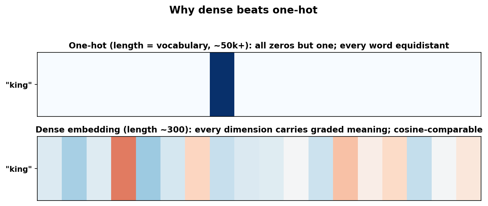
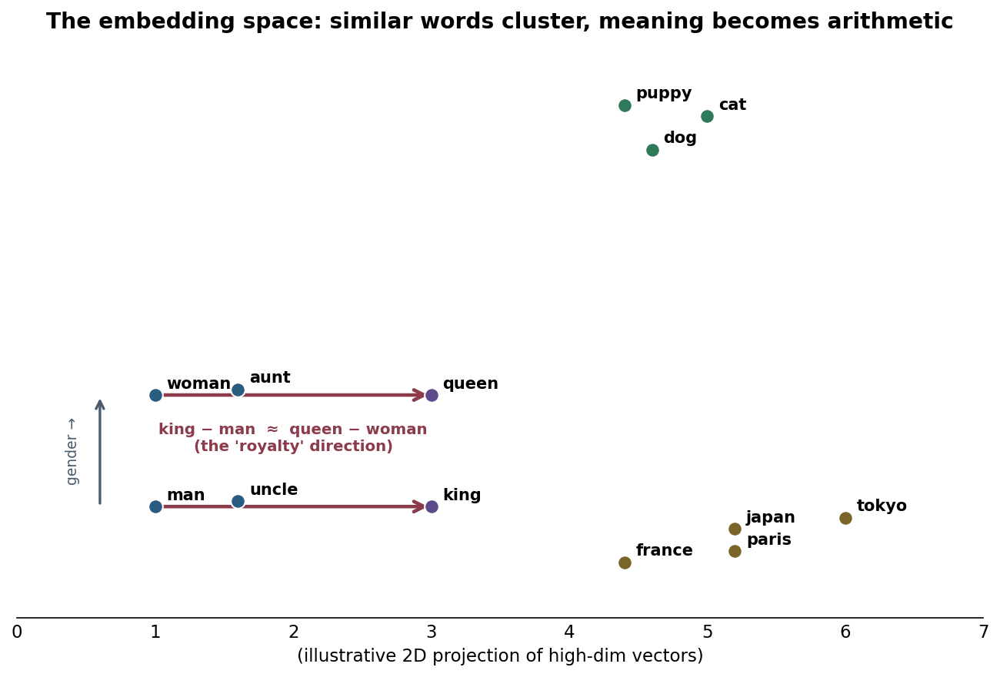
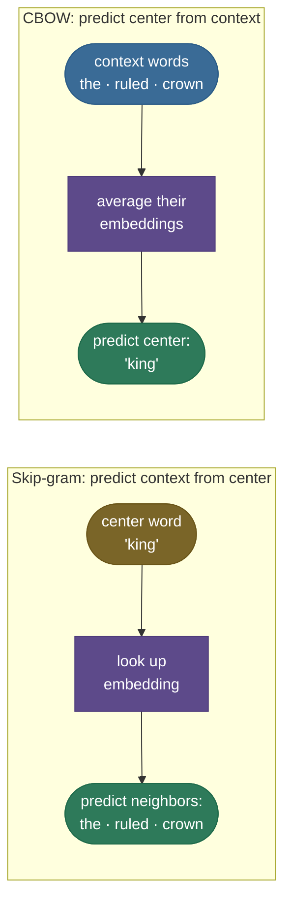
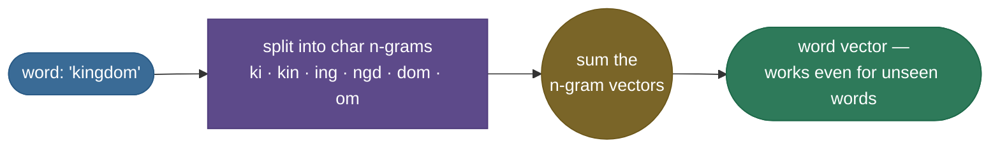

# Word Embeddings: turning words into geometry

To a neural network a word is just a symbol — and symbols have no notion of *meaning* or *similarity*. The first thing any NLP system has to do is turn words into numbers, and the *way* you do it decides everything downstream. Do it naively (a one-hot vector per word) and "cat" and "kitten" are exactly as far apart as "cat" and "thermodynamics" — the model starts from zero knowledge that any two words are related. **Word embeddings** fix this by placing every word at a point in a few-hundred-dimensional space such that **words used in similar contexts land near each other** — and, remarkably, such that directions in that space carry meaning: `king − man + woman ≈ queen`. They were the breakthrough that turned text into geometry, and the conceptual ancestor of every modern token embedding.

By the end of this page you'll be able to:

- explain why **one-hot fails** and what the **distributional hypothesis** buys you;
- derive the **skip-gram** objective and **negative sampling** (the training trick that made word2vec scale);
- contrast **skip-gram vs CBOW**, **word2vec vs GloVe** (predictive vs count-based), and what **FastText** adds (subwords → OOV/morphology);
- reason about the **embedding space** — cosine similarity, analogies, and the **bias** embeddings inherit;
- explain the fatal limitation — **one vector per word, regardless of context** — that motivated [contextual embeddings (ELMo/BERT)](06-Contextual-Embeddings-ELMo-BERT.md);
- train a skip-gram model from scratch and watch related words cluster.

Intuition first, then the math (with sources), then runnable code.

> **Note:** "embedding" just means a learned, dense, low-dimensional vector for a discrete thing. Word embeddings are the famous case, but the *same idea* embeds users, products, graph nodes, and — in every transformer — **tokens**. Get the intuition here and it transfers everywhere.

---

## The problem: one-hot has no notion of similarity

The obvious encoding is **one-hot**: with a 50,000-word vocabulary, each word is a 50,000-long vector of zeros with a single 1. Two fatal flaws:

- **No similarity.** Every pair of one-hot vectors is **orthogonal** — their dot product is 0. "cat" and "kitten" are exactly as (dis)similar as "cat" and "Tuesday." The representation encodes *identity* and nothing else.
- **Huge and sparse.** The dimension equals the vocabulary; a model's first weight matrix becomes enormous, and it must learn every word's behaviour from scratch with no sharing.



The fix rests on a 1950s idea, the **distributional hypothesis** — *"you shall know a word by the company it keeps"* (Firth). Words that appear in similar contexts (you *ruled* a *kingdom*; you *wore* a *crown*) tend to mean similar things. So: **learn a dense vector per word such that words sharing contexts get similar vectors.** That's the whole game.

---

## What it is: meaning as location

A **word embedding** maps each word to a dense vector — typically 100–300 dimensions — learned so that the geometry reflects meaning. Two properties make it magical:

1. **Similar words cluster.** Cosine similarity between vectors tracks semantic similarity: *cat* and *dog* are close; *cat* and *democracy* are far.
2. **Meaning becomes arithmetic.** Consistent relationships show up as consistent *directions*. The vector from *man* to *king* is roughly the same as from *woman* to *queen* — so `king − man + woman ≈ queen` actually works.



> **See it for real:** the **[TensorFlow Embedding Projector](https://projector.tensorflow.org/)** loads real pretrained word2vec/GloVe vectors and lets you fly through the 3D space, search a word, and watch its nearest neighbours — the single best way to *feel* that this geometry is real, not a cartoon.

---

## Word2Vec: learn vectors by predicting neighbours

[Word2Vec](https://arxiv.org/abs/1301.3781) (Mikolov et al. 2013) makes the distributional hypothesis trainable: slide a window over a giant corpus and learn vectors that are **good at predicting which words co-occur**. Two symmetric variants:



- **Skip-gram** — given the **center** word, predict its **context** words. Better for rare words and small data.
- **CBOW** (continuous bag-of-words) — given the **context**, predict the **center** word. Faster, slightly better on frequent words.

Skip-gram maximizes the probability of the real context words over the whole corpus:

$$\max \; \frac{1}{T}\sum_{t=1}^{T}\sum_{-c \le j \le c,\, j\ne 0} \log p(w_{t+j}\mid w_t), \qquad p(o\mid c) = \frac{\exp(u_o^\top v_c)}{\sum_{w\in V}\exp(u_w^\top v_c)}$$

where each word has a "center" vector $v$ and a "context" vector $u$; you keep $v$ as the embedding.

> *Where this comes from: skip-gram and CBOW are **Efficient Estimation of Word Representations in Vector Space** (Mikolov et al. 2013); this softmax objective is derived in **Speech and Language Processing** (Jurafsky & Martin) Ch. 6 and d2l.ai Ch. 15 — all in the references.*

---

## The training trick: negative sampling

There's a problem: the softmax denominator $\sum_{w\in V}$ sums over the **entire vocabulary** every step — millions of words, far too slow. **Negative sampling** ([Mikolov et al. 2013b](https://arxiv.org/abs/1310.4546)) replaces the giant softmax with a handful of cheap binary classifications: push the true (center, context) pair's score up, and push **$k$ randomly sampled "negative" words'** scores down:

$$\mathcal{L} = -\log \sigma(u_o^\top v_c) \;-\; \sum_{i=1}^{k} \log \sigma(-\,u_{n_i}^\top v_c)$$

Read it as: *make the real neighbour likely ($\sigma$ near 1) and $k$ random non-neighbours unlikely.* With $k = 5$–$20$, training goes from $O(V)$ to $O(k)$ per step — the change that let word2vec train on billions of words. (Negatives are sampled from a smoothed unigram distribution, $\propto \text{freq}^{0.75}$, to slightly favour rare words.)

> *Where this comes from: negative sampling (and hierarchical softmax, the other speedup) are **Distributed Representations of Words and Phrases and their Compositionality** (Mikolov et al. 2013b); the $\text{freq}^{0.75}$ trick is from that paper's §2.2.*

> **Gotcha:** negative sampling is *not* the same objective as the full softmax — it's a related binary-classification surrogate (closely connected to **PMI matrix factorization**, as Levy & Goldberg later showed). In an interview, say "it approximates the softmax cheaply," not "it is the softmax."

---

## GloVe: the count-based cousin

[GloVe](https://nlp.stanford.edu/pubs/glove.pdf) (Pennington et al. 2014) reaches the same place from the opposite direction. Instead of *predicting* one window at a time, it builds the **global co-occurrence matrix** $X$ ($X_{ij}$ = how often word $j$ appears near word $i$ across the whole corpus) and factorizes it so that vector dot products match **log co-occurrence**:

$$J = \sum_{i,j} f(X_{ij})\,\big(w_i^\top \tilde w_j + b_i + \tilde b_j - \log X_{ij}\big)^2$$

The weighting $f$ damps very frequent pairs so "the" doesn't dominate. The payoff is that **ratios** of co-occurrence probabilities encode meaning, which is exactly what makes the analogy directions linear.

> *Where this comes from: **GloVe: Global Vectors for Word Representation** (Pennington, Socher & Manning 2014). The deeper unification — that word2vec's skip-gram is *implicitly* factorizing a (shifted PMI) co-occurrence matrix — is Levy & Goldberg (2014), in the references.*

> **Tip:** the clean interview contrast: **word2vec is predictive (local windows, online), GloVe is count-based (global matrix, batch)** — but both end up factorizing co-occurrence statistics, so their vectors behave very similarly.

---

## FastText: words are made of pieces

Word2vec and GloVe have one vector *per whole word*, which means they're helpless on a word they never saw in training (**out-of-vocabulary**) and blind to morphology (*run*, *runs*, *running* are unrelated atoms). [FastText](https://arxiv.org/abs/1607.04606) (Bojanowski et al. 2017) fixes both by representing a word as the **sum of its character n-gram vectors**:



Because *running* and *runs* **share n-grams** they get similar vectors for free, and an unseen word like *kingdoms* still gets a sensible vector from its pieces. This is the same instinct that **subword tokenization** (BPE) brings to modern LLMs.

> *Where this comes from: **Enriching Word Vectors with Subword Information** (Bojanowski et al. 2017) — references.*

---

## The embedding space: similarity, analogies, and bias

Two vectors are compared by **cosine similarity** (the angle between them, ignoring length): $\cos(a,b) = \frac{a\cdot b}{\lVert a\rVert\,\lVert b\rVert}$. Nearest-neighbour-by-cosine is how you find synonyms; the **analogy** `a : b :: c : ?` is solved by finding the word whose vector is closest to $b - a + c$.

> **Gotcha — embeddings inherit bias.** Because they're learned from human text, embeddings absorb its **stereotypes**: the same arithmetic that gives `king − man + woman ≈ queen` also gives `doctor − man + woman ≈ nurse`. This is a real, measured harm (Bolukbasi et al. 2016), not a curiosity — any system built on embeddings can propagate it, and "embeddings are biased and why" is a frequent interview and ethics question.

---

## How they're evaluated

- **Intrinsic** — does the geometry match human judgment? **Analogy** accuracy (the king/queen task) and **word-similarity** correlation (does cosine track human similarity ratings, e.g. WordSim-353).
- **Extrinsic** — does plugging the embeddings into a *downstream* task (NER, sentiment, parsing) improve it? This is what actually matters; intrinsic scores are a quick proxy.

---

## The limit that ended the era: static vs contextual

Every embedding here is **static** — one fixed vector per word, no matter the sentence. So *"river **bank**"* and *"savings **bank**"* get the **identical** vector, even though they're unrelated meanings. The model can't disambiguate, because the representation was baked in before it ever saw your sentence.

That single limitation is what motivated **contextual embeddings** — [ELMo and BERT](06-Contextual-Embeddings-ELMo-BERT.md) — which compute a *different* vector for a word **depending on its sentence**. Static embeddings didn't disappear, though: they're still the right tool when you need cheap, fixed vectors (retrieval, classic NLP, cold-start features).

---

## Where they're used

- **Initializing NLP models** — for years, the first layer of nearly every NLP network was pretrained word vectors.
- **Retrieval and similarity** — semantic search, recommendation, deduplication: embed everything, compare by cosine. (Modern systems use *sentence/document* embeddings, but the principle is identical.)
- **Beyond words** — the embedding idea generalizes to users/items (recsys), nodes (graph embeddings), and is the literal **token-embedding layer** at the bottom of every transformer.

> **Tip:** you rarely train word2vec yourself anymore — you'd download pretrained GloVe/FastText vectors, or, more likely, use a **contextual** model. But the *concept* (discrete → dense, similarity = geometry, learned from co-occurrence) is foundational and asked constantly.

---

## Code: train skip-gram from scratch, watch words cluster

From-scratch skip-gram with negative sampling on a tiny structured corpus. It won't rival pretrained vectors, but it *proves the mechanism*: words that share contexts end up with higher cosine similarity. Runs on CPU in seconds.

```python
"""Skip-gram with negative sampling, from scratch. Verified on Python 3.12 (torch 2.12), CPU."""
import torch, torch.nn as nn, torch.nn.functional as F
torch.manual_seed(0)

# a small but STRUCTURED corpus: royalty words share contexts; animal words share contexts
royalty, animals = ["king", "queen"], ["dog", "cat"]
sents = []
for r in royalty:
    sents += [["the", r, "ruled", "the", "kingdom"], ["the", r, "wore", "a", "crown"],
              ["the", r, "sat", "on", "the", "throne"]] * 6
for a in animals:
    sents += [["the", a, "chased", "the", "ball"], ["the", a, "was", "a", "furry", "pet"],
              ["the", a, "slept", "all", "day"]] * 6

vocab = sorted({w for s in sents for w in s}); V = len(vocab); w2i = {w: i for i, w in enumerate(vocab)}
W, pairs = 2, []                                       # window 2 -> (center, context) pairs
for s in sents:
    idx = [w2i[w] for w in s]
    for i, c in enumerate(idx):
        for j in range(max(0, i - W), min(len(idx), i + W + 1)):
            if j != i: pairs.append((c, idx[j]))
pairs = torch.tensor(pairs)

d, K = 16, 5                                           # embedding dim, # negatives
emb_in, emb_out = nn.Embedding(V, d), nn.Embedding(V, d)
opt = torch.optim.Adam(list(emb_in.parameters()) + list(emb_out.parameters()), lr=0.01)
for _ in range(300):
    perm = pairs[torch.randperm(len(pairs))]; centers, contexts = perm[:, 0], perm[:, 1]
    negs = torch.randint(0, V, (len(perm), K))
    vc = emb_in(centers)
    pos = (vc * emb_out(contexts)).sum(-1)             # true-pair score
    neg = torch.bmm(emb_out(negs), vc.unsqueeze(-1)).squeeze(-1)    # negative scores
    loss = -(F.logsigmoid(pos) + F.logsigmoid(-neg).sum(-1)).mean()
    opt.zero_grad(); loss.backward(); opt.step()

E = F.normalize(emb_in.weight.detach(), dim=1)         # unit vectors -> cosine = dot
cos = lambda a, b: (E[w2i[a]] @ E[w2i[b]]).item()
print(f"cos(king, queen) = {cos('king','queen'):+.3f}  (royalty pair  -> HIGH)")
print(f"cos(dog,  cat)   = {cos('dog','cat'):+.3f}  (animal pair   -> HIGH)")
print(f"cos(king, dog)   = {cos('king','dog'):+.3f}  (unrelated     -> LOWER)")
```

Output:

```
cos(king, queen) = +0.537  (royalty pair  -> HIGH)
cos(dog,  cat)   = +0.319  (animal pair   -> HIGH)
cos(king, dog)   = +0.270  (unrelated     -> LOWER)
```

> **Note:** with only a few dozen sentences the numbers are modest, but the *ordering* is the whole point — words that shared contexts (king/queen, dog/cat) ended up more similar than words that didn't. Scale this to billions of words and you get the vectors that solve `king − man + woman ≈ queen`.

---

## Recap and rapid-fire

**If you remember nothing else:** embeddings turn each word into a dense vector learned so that **words in similar contexts land nearby** (the distributional hypothesis), making similarity a cosine and analogies a direction. **Word2vec** learns them by predicting neighbours (skip-gram/CBOW) with **negative sampling** for speed; **GloVe** factorizes the global co-occurrence matrix to the same effect; **FastText** adds character n-grams for OOV/morphology. All are **static** — one vector per word — which is exactly why **contextual** embeddings (BERT) came next.

**Quick-fire — say these out loud:**

- *Why not one-hot?* Orthogonal (no similarity) and vocabulary-sized (huge, sparse).
- *Skip-gram vs CBOW?* Skip-gram predicts context from center (better for rare words); CBOW predicts center from context (faster).
- *What is negative sampling and why?* Replace the $O(V)$ softmax with $k$ binary "is this a real neighbour?" classifications — makes training scale.
- *Word2vec vs GloVe?* Predictive/local vs count-based/global — but both factorize co-occurrence, so vectors behave alike.
- *What does FastText add?* Subword (char n-gram) vectors → handles OOV and morphology.
- *How do analogies work?* Consistent relations are consistent directions: $\text{king} - \text{man} + \text{woman} \approx \text{queen}$.
- *Static vs contextual?* Static = one vector per word ("bank" is ambiguous); contextual (ELMo/BERT) = a vector per word *per sentence*.
- *A risk to name?* Embeddings inherit and can amplify **bias** from their training text.

---

## References and further reading

The curated link library for this topic — videos, courses, interactive demos, articles, papers, books, and internal cross-links — lives in a companion file so it can be reused as a standalone reference list:

**→ [Word Embeddings — references and further reading](05-Word-Embeddings-Word2Vec-GloVe-FastText.references.md)**
