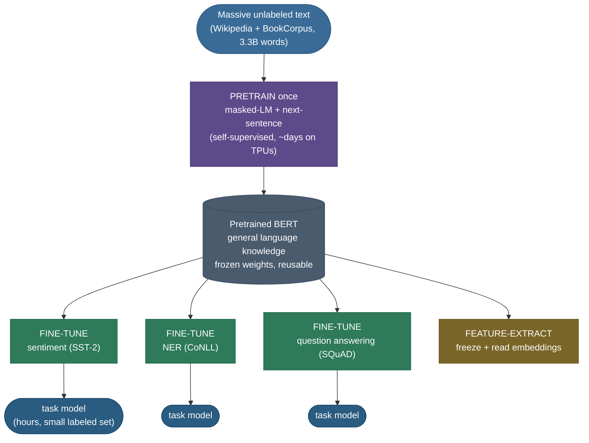
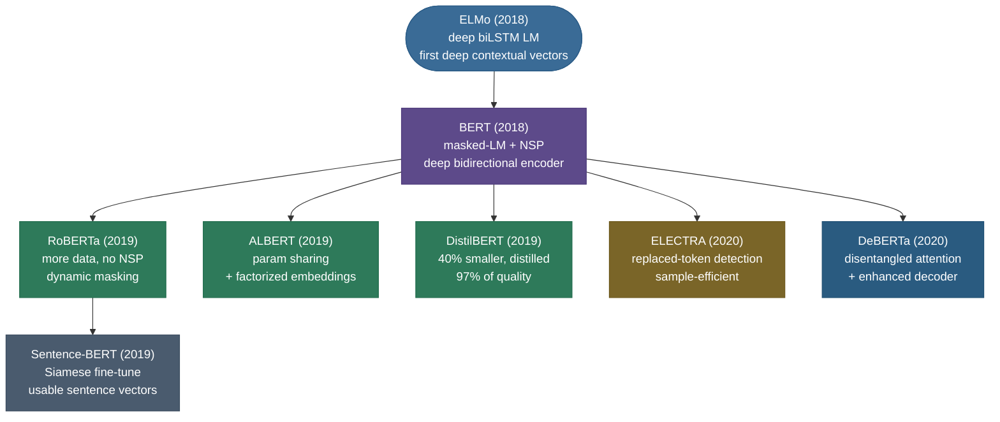

# Contextual embeddings: one word, many vectors

Read these two sentences out loud: *"I sat on the river **bank** watching the water"* and *"I deposited cash at the **bank** downtown."* Your brain produced a completely different meaning for **bank** each time, and it did so effortlessly — using the *surrounding words* to pick the sense. Now here is the uncomfortable fact about the word-embedding era that came before 2018: **word2vec and GloVe cannot do this.** They store exactly one vector for the string `bank`, baked in at training time, and they hand you that same frozen 300-dimensional arrow whether you meant a riverside or a financial institution. The two senses are **averaged into one blurry point** — polysemy collapses, and every downstream model inherits the blur.

Contextual embeddings are the fix, and they reset the entire field of NLP when they arrived. The idea is deceptively simple: **don't precompute a word's vector — compute it on the fly, from the whole sentence.** Feed *"river bank"* into a deep network and it emits one vector for `bank`; feed *"savings bank"* into the same network and it emits a *different* vector for the same token. The representation is now a **function of context**, not a lookup. I'm going to walk this the way I'd teach it to a strong engineer who already knows word2vec and transformers but has never built the bridge between them. We'll start by *feeling* the static-embedding wound, then build **ELMo** (the deep biLSTM that first did this at scale), then **BERT** (the masked-language-model revolution that made it bidirectional and transferable), then the whole **BERT family** and the practical craft of *extracting* and *using* these vectors. By the end you'll be able to:

- explain **precisely** why a static vector cannot represent a polysemous word, and what "contextual" buys you;
- describe **ELMo's** deep biLM and *derive* its per-task learned weighting of layers;
- explain the **masked language model (MLM)** objective and *derive why* bidirectionality forces masking — and why the 80/10/10 corruption trick exists;
- explain **NSP**, why RoBERTa dropped it, and what `[CLS]`/`[SEP]` are for;
- walk the **pretrain → fine-tune** paradigm — the transfer-learning revolution that this work unleashed on NLP;
- place **RoBERTa, ALBERT, DeBERTa, ELECTRA, DistilBERT, SBERT** in one family tree and say what each changed;
- **extract** contextual vectors correctly (which layer, which pooling) and avoid the naive-`[CLS]` sentence-embedding trap;
- contrast **BERT (encoder, understanding) vs GPT (decoder, generation)** and trace the lineage into modern LLMs;
- reproduce, in runnable code, the **same word getting different measured vectors** by context.

> **Note:** "contextual embedding" is not a special kind of vector — it is **any hidden state of a deep model read out at a token position**. The novelty isn't the vector; it's that the model *reads the whole sentence first*, so the vector at position *i* already encodes what surrounds position *i*. Everything below is consequences of that one move.

---

## The problem: static embeddings give one vector per word *type*

To feel why contextual models had to exist, you have to feel the wound they heal.

A static embedding ([word2vec](05-Word-Embeddings-Word2Vec-GloVe-FastText.md), GloVe, fastText) is a **lookup table**: a matrix $E \in \mathbb{R}^{|V| \times d}$ with one row per vocabulary *type*. Training slides over a corpus and nudges each row so that words appearing in similar contexts end up close — the celebrated `king − man + woman ≈ queen` geometry. But notice the unit of representation: it is the **word type** (the string), not the **word token** (this particular occurrence). The string `bank` gets **one** row, full stop. Whatever the corpus's contexts for `bank` were — riversides, vaults, the verb "to bank a plane" — they are all crammed into that single row, and what you get is their **frequency-weighted average**.

This averaging has three concrete failures:

- **Polysemy collapses.** *river bank* and *savings bank* are forced to share a vector. The model can never tell them apart, because there is nothing to tell apart — they are the same lookup. Measured: in a static model, `cos(bank-in-sentence-A, bank-in-sentence-B) = 1.000` always, because it's literally the same vector.
- **No syntax, no role.** The static vector of `run` is identical whether it's a noun (*a morning run*) or a verb (*I run daily*). Part-of-speech, agreement, and grammatical role are invisible.
- **No compositional context.** *not good* and *very good* both contain `good` with its same vector; the surrounding modifiers can't reshape it. Negation and intensifiers are lost at the token level.

> **Gotcha:** people sometimes "fix" polysemy by giving a word *several* static vectors (sense embeddings, e.g. *bank#1*, *bank#2*). This needs a sense inventory and a word-sense-disambiguation step *to even build the table*, and it still can't handle senses you didn't enumerate or subtle context shifts. Contextual models sidestep the whole problem: there is **no inventory** — the vector is recomputed per occurrence, so there are effectively as many "senses" as there are contexts.


That picture is **measured**, not illustrative: it's `bank` pulled from eight sentences through BERT-base, projected to two dimensions. The river uses and the money uses form two separated clusters — *the same token string lands in two different regions of space depending on context.* A static embedding has no way to produce that; it's the red star, one point, forever.

> **Note:** the deepest way to state the difference: a **static embedding is a function of the word**, $v = E[\text{word}]$. A **contextual embedding is a function of the word *and* its context**, $v_i = f(\text{word}_1, \dots, \text{word}_n)_i$ — the whole sequence goes in, and you read out position $i$. That extra argument is the entire revolution.

---

## ELMo: deep contextualized representations from a biLM

The first model to do this convincingly at scale was **ELMo** — *Embeddings from Language Models* (Peters et al., 2018). The recipe: train a **deep bidirectional language model** on a large corpus, then, for any downstream task, read out its internal states as the word representations.

### The biLM

ELMo's backbone is a **two-layer biLSTM language model**. Recall a plain (forward) language model factorizes the probability of a sequence as

$$p(t_1, t_2, \dots, t_N) = \prod_{k=1}^{N} p(t_k \mid t_1, \dots, t_{k-1}),$$

predicting each token from its **left** context. ELMo trains that, *and simultaneously* a **backward** LM that predicts each token from its **right** context:

$$p(t_1, \dots, t_N) = \prod_{k=1}^{N} p(t_k \mid t_{k+1}, \dots, t_N).$$

It maximizes the **sum of the two log-likelihoods**. Crucially the forward and backward LSTMs are **separate stacks** whose outputs are *concatenated* at each layer — they are run independently and only joined at the end. (Hold that thought; it's exactly the limitation BERT removes.)

The bottom of the stack is a **character-level CNN** that builds each word's input embedding from its characters. This is why ELMo gracefully handles **out-of-vocabulary** words — *misspellings, rare morphology, new words* — it composes them from characters rather than failing a lookup.

### The learned per-task weighting (derived)

Here is ELMo's signature idea, and the part interviewers love. A two-layer biLM gives you, for each token $k$, a set of representations: the input (CNN) layer plus the two biLSTM layers — call them $h_{k,0}, h_{k,1}, h_{k,2}$ (each $h_{k,j}$ is the concatenation of the forward and backward states at layer $j$). The naive move is to just use the top layer $h_{k,2}$. ELMo's insight: **different layers capture different things** — lower layers lean **syntactic** (POS, local structure), higher layers lean **semantic** (word sense, coreference) — and *which mix a task wants is task-dependent*. So instead of picking a layer, ELMo learns a **weighted combination**, with weights trained *per downstream task*:

$$\text{ELMo}_k^{\text{task}} = \gamma^{\text{task}} \sum_{j=0}^{L} s_j^{\text{task}}\, h_{k,j}.$$

Let's read every symbol, because the design choices matter:

- $s_j^{\text{task}} = \text{softmax}(w_j^{\text{task}})$ are the **layer-mixing weights**, normalized to sum to 1 by a softmax over the raw scalars $w_j$. Softmax-normalizing keeps the combination a convex average (stable, interpretable as "how much of each layer"); a sentiment task might load on the semantic top layer, a parsing task on the syntactic lower one.
- $\gamma^{\text{task}}$ is a single **scalar gain** that rescales the whole ELMo vector. It matters because the biLM states and the task model may live at very different magnitudes; $\gamma$ lets the task tune the overall scale (and helps optimization, since the layer-norm'd biLM outputs may need amplifying).
- $L = 2$ here (two biLSTM layers + layer 0), so $j$ ranges over $\{0,1,2\}$.

So "**deep** contextualized" is literal twice over: the representations are **deep** (they pool *all* internal layers, not just the top) and **contextualized** (each $h_{k,j}$ already saw the sentence through the recurrence). You then **concatenate ELMo to your existing static word embedding** and feed the pair into whatever task model you had — ELMo was a *feature-based* add-on, not a fine-tuned end-to-end model.

> **Tip:** the practical lesson from ELMo's weighting that outlived ELMo itself: **the "best" layer of a deep encoder is task-dependent, and a learned mix of layers usually beats any single layer.** You'll see this again below when we extract embeddings from BERT — *which layer to pool* is the same question, and "concatenate or sum the last four" is the folk-wisdom descendant of ELMo's softmax weights.

> **Note:** ELMo's gains were large and broad — it improved the state of the art on six diverse NLP benchmarks (QA, entailment, sentiment, NER, coreference, semantic role labeling) just by swapping in these contextual features. That breadth is what signalled a *paradigm* shift, not a one-task trick.

---

## The shift to transformers, and BERT's central problem

ELMo proved contextual representations were transformative, but it had two structural weaknesses. First, its bidirectionality was **shallow**: the forward and backward LMs are trained independently and only their *outputs* are concatenated, so no single representation was ever built while *jointly* attending left and right — each direction is blind to the other during encoding. Second, **LSTMs are sequential** — slow to train, and they struggle to carry information across long distances. The [Transformer](../../05.%20Deep_Learning/concepts/16-Transformer-Architecture.md) had just shown that **self-attention** beats recurrence on both counts: every token attends to every other in parallel, regardless of distance.

So the obvious next step was: build a deep contextual model on a transformer **encoder**. But this immediately runs into a wall, and the wall *is* the key insight of BERT.

> **Note — the bidirectionality dilemma (the heart of BERT).** A standard language model is **autoregressive**: it predicts the next token from the *past* only. That's a perfectly good self-supervised objective — but it's **one-directional**, so a representation built this way only ever sees its left context. You cannot simply "make it bidirectional" by letting each token attend both ways while *also* training it to predict itself, because then **the token would see its own answer** — the word it's supposed to predict is right there in the input, two layers down, and the model trivially copies it ("information leakage"). A bidirectional encoder + a next-token objective = a model that learns nothing. This is the dilemma: *deep bidirectionality and next-token prediction are incompatible.*

BERT — *Bidirectional Encoder Representations from Transformers* (Devlin et al., 2018) — resolves the dilemma with one beautiful idea: **change the objective.** Don't predict the next token; **hide some tokens and predict the hidden ones.** Now every token can safely attend in both directions, because the targets aren't in the input — they've been masked out. That objective is the **masked language model**.

---

## BERT's pretraining objective 1: the masked language model (MLM)

The MLM is the engine of BERT. The procedure:

1. Tokenize the input (WordPiece [subwords](02-Tokenization-and-Subword-Algorithms.md); see the tokenization page for why subwords).
2. Randomly choose **15%** of token positions.
3. Replace those positions (mostly) with a special `[MASK]` token.
4. Run the **bidirectional** transformer encoder — every token attends to every other.
5. At each masked position, put a softmax over the whole vocabulary on top of the final hidden state and **predict the original token**. The loss is cross-entropy on the masked positions only.

![The masked language model objective. 15% of tokens are chosen (here 'bank' becomes [MASK]); the bidirectional BERT encoder lets every token attend to every other, so the masked position is reconstructed from BOTH its left context ('...at the') and its right context. A softmax over the ~30k WordPiece vocabulary predicts the original word — measured here, BERT-base assigns 0.43 to 'bank'.](images/ctx_mlm_objective.png)

Because the encoder is bidirectional, the masked word is reconstructed from **left *and* right context at once** — *"I deposited cash at the [MASK] downtown"* gives the model both *"deposited cash"* on the left and *"downtown"* on the right to infer `bank`. That joint conditioning is exactly what ELMo's shallow concatenation could not do, and it's why BERT's representations are called **deeply** bidirectional.

### The 80/10/10 trick (derived: *why* not just always [MASK])

Step 3 said "**mostly** `[MASK]`." Here is the exact recipe and the reasoning, which is a classic interview question. Of the 15% of positions selected for prediction:

- **80%** are replaced with `[MASK]`,
- **10%** are replaced with a **random** token,
- **10%** are **left unchanged** (kept as the original word).

Why this elaborate corruption rather than always masking? Derive it from a **train/inference mismatch**:

- The `[MASK]` token appears during pretraining but **never at fine-tuning or inference time** — real downstream sentences have no `[MASK]`. If the model only ever saw `[MASK]` at the prediction positions, it would learn the lazy shortcut *"only bother building a rich representation where I see `[MASK]`"* and produce degenerate features for ordinary, unmasked tokens — exactly the tokens that matter at inference. The corruption forces the model to **build a good predictive representation at *every* position**, because it can never be sure a given position isn't a prediction target.
- The **10% random** injects noise so the model can't blindly trust that the input token at a target position is correct — it must *use the context* to decide, which is the whole point. (It also makes the representations more robust.)
- The **10% unchanged** is subtle: it makes the model **predict the correct word even when the input already is the correct word**, so its representation of a genuine, uncorrupted token is still pushed toward "what should be here given context." Without it, the model could learn *"if it's not `[MASK]`, just copy the input"* at target positions.

The net effect: the model can't tell *which* of the 15% it must predict from the input alone (could be a `[MASK]`, a wrong word, or the right word), so it has to encode a context-aware guess **everywhere**. That's precisely the property that makes BERT's hidden states good general-purpose contextual embeddings.

> **Gotcha:** a real downside of MLM is **sample inefficiency**: BERT only computes a loss on the **15%** of positions it masked, so 85% of the tokens in every batch produce *no learning signal* for the main objective. The model "wastes" most of each sentence. Keep this in your pocket — it's exactly the inefficiency **ELECTRA** (below) was designed to remove, and the reason it trains faster.

> **Tip:** why **15%**? It's a tuned trade-off. Too low and there's too little signal per sentence (even slower learning); too high and you've removed so much context that the remaining tokens can't disambiguate the masked ones (the task becomes impossibly hard, and you've also corrupted the very context the encoder learns from). 15% sits near the sweet spot; later work (e.g. on larger models) found you can push it higher, but 15% is the canonical default.

### Worked example: masking a sentence by hand

Let's run the corruption on one sentence so the 15%/80/10/10 procedure is concrete, not abstract. Take the 12-token sentence (after WordPiece, with the special tokens BERT adds):

```
[CLS] the chef cooked a delicious meal for the hungry guests [SEP]
```

That's 10 content tokens (special tokens are never chosen as targets). **15% of 10 ≈ 2** positions are selected for prediction — say the procedure picks `cooked` and `hungry`. Now apply 80/10/10 *independently* to each chosen position:

- `cooked` (drew the 80% bucket) → replaced with `[MASK]`. Input becomes *"the chef **[MASK]** a delicious meal..."*; the **target** the model must predict at this position is the original word `cooked`.
- `hungry` (drew the 10%-random bucket) → replaced with a random vocabulary token, say `purple`. Input becomes *"...for the **purple** guests"*; the **target** is still the original `hungry`. The model must notice that `purple` doesn't fit and recover `hungry` from context.

A third position the procedure *could* have chosen (the 10%-unchanged bucket) would appear in the input **unaltered** yet still be a prediction target — the model has to confirm the right word is already there. The encoder then runs bidirectionally over this corrupted input, and the loss is cross-entropy **only at the two target positions** (`cooked`, `hungry`) — the other eight content tokens contribute no main-objective loss this step. Run this over billions of sentences, re-sampling which positions are masked each epoch (RoBERTa's dynamic masking), and the model is forced to predict *any* word from its surroundings — which is exactly the skill that makes its hidden states context-aware everywhere.

> **Note:** the model never sees the original `cooked`/`hungry` *at those positions* in the input — only `[MASK]` and `purple`. That's the whole trick that lets attention be bidirectional without leakage: the answers were removed from the input before the encoder ran. Contrast a causal LM, where the answer (the next token) is simply not yet in the input because of the left-to-right order; BERT achieves the same "answer not visible" guarantee by *masking* instead of by *ordering*.

---

## BERT's pretraining objective 2: next sentence prediction (NSP)

BERT was pretrained on a **second** objective alongside MLM. Many downstream tasks (question answering, natural language inference) are about the **relationship between two sentences**, which token-level MLM doesn't directly teach. So BERT also learned **Next Sentence Prediction**: take two segments A and B; 50% of the time B genuinely follows A in the corpus, 50% of the time B is a random sentence; a small classifier on top of the `[CLS]` token predicts **IsNext / NotNext**.

To support pairs, BERT's input is built with **special tokens** and **segment embeddings**:

- **`[CLS]`** — prepended to every input. Its final hidden state is the designated "**whole-sequence**" representation, used as the input to sentence-level classifiers (including NSP). Think of it as a learnable "summary slot."
- **`[SEP]`** — separates segment A from segment B (and marks the end).
- **Segment embeddings** $E_A / E_B$ — added to every token to mark which segment it belongs to, so the model can tell the two apart even after they're concatenated.

The full input embedding for each token is the **sum of three** learned embeddings: **token** (WordPiece) + **segment** (A/B) + **position** (which slot, 0..511). BERT uses *learned absolute* position embeddings, capped at 512 tokens — the origin of BERT's famous **512-token limit**.

> **Gotcha:** **RoBERTa (2019) dropped NSP entirely** and *improved*. The finding: NSP is too easy and partly redundant — distinguishing a random sentence from the true next one often reduces to **topic** detection (a random B is usually about a different topic), which the model can do without learning real discourse coherence. Worse, the random-B construction conflates "is it coherent?" with "is it the same topic?". RoBERTa removed NSP, trained on **full sentences packed across document boundaries**, and matched or beat BERT — so NSP turned out to be a weak, even slightly harmful, objective. Modern encoders mostly use MLM alone (or a stronger sentence-order task like ALBERT's SOP).

---

## Encoder-only: what BERT *is* architecturally

BERT is a stack of **transformer encoder** blocks — the *left half* of the original Transformer, with **no decoder and no causal mask**. (For the block internals — multi-head self-attention, residual + layer-norm, the position-wise FFN — see the [Transformer Architecture](../../05.%20Deep_Learning/concepts/16-Transformer-Architecture.md) page; I won't re-derive them here.) Two reference sizes:

- **BERT-base** — 12 layers, hidden size 768, 12 attention heads, ~110M parameters.
- **BERT-large** — 24 layers, hidden size 1024, 16 heads, ~340M parameters.

The defining property is **no causal masking**: every token's self-attention sees the entire sequence, both directions. That's the architectural reason BERT is an *understanding* model — it builds representations with full context — and the reason it **cannot generate** text autoregressively (it has no notion of "next token"; it was never trained to extend a sequence). Encoder-only models are for **classification, tagging, span extraction, retrieval, and embeddings** — not free-form generation.

> **Note:** this is also why a [KV cache](../../09.%20LLMs/concepts/05-KV-Cache.md) — the workhorse of decoder inference — is **irrelevant** to BERT: there's no autoregressive loop to cache across. BERT processes the whole sequence in one parallel pass and you're done.

---

## The real revolution: pretrain → fine-tune

Step back from the mechanics, because the *impact* of BERT was bigger than any single objective. BERT cemented the **pretrain-then-fine-tune** paradigm and triggered what Sebastian Ruder called **NLP's "ImageNet moment."** The two-stage recipe:

1. **Pretrain once**, expensively, on a *massive unlabeled corpus* (BERT: BooksCorpus + English Wikipedia, ~3.3B words) with the self-supervised MLM(+NSP) objective. This learns *general* language: syntax, facts, word sense, some reasoning — all from raw text, **no human labels**.
2. **Fine-tune cheaply**, for each downstream task, on a *small labeled dataset*. Add a tiny task-specific head (often a single linear layer) and continue training **all** the weights end-to-end for a few epochs.



Why this changed everything: before BERT, each NLP task trained a model **from scratch** on its own (small, expensive-to-label) dataset, and bespoke architectures proliferated. After BERT, the recipe became *"download the pretrained encoder, bolt on a linear head, fine-tune for an hour."* One model, dozens of tasks, **state-of-the-art on eleven of them** in the original paper — using **the same architecture** each time, differing only in the head. It democratized strong NLP: you no longer needed millions of labeled examples or a research lab to get excellent results, just a pretrained checkpoint and a modest labeled set.

> **Note:** there are **two ways** to use a pretrained encoder, and the distinction matters in practice. **Fine-tuning** updates all the encoder's weights for your task (best accuracy, but you get a full copy of the model per task). **Feature extraction** freezes the encoder and only trains a head on its output embeddings (cheaper, one frozen model serves many tasks, but usually a few points lower accuracy). ELMo was feature-based; BERT popularized fine-tuning; both remain valid tools — the diagram's amber branch is feature-extraction.

> **Tip:** the fine-tuning head depends on the task shape. **Sentence classification** → linear layer on the `[CLS]` vector. **Token tagging** (NER/POS) → linear layer on *every* token's vector. **Span extraction** (SQuAD QA) → two linear layers predicting start- and end-token positions over the passage. **Sentence-pair** (NLI) → `[CLS]` of the concatenated pair. Same body, four different tiny heads.

---

## The point you must not lose: the embeddings are *contextual*

Everything above exists to produce one property, and it's worth stating starkly and then *measuring*. **A token's BERT vector is a function of the sentence it's in.** The same string, in two contexts, yields two different vectors — and "different" is quantifiable with cosine similarity.

Here are **measured** numbers from BERT-base (last layer), which the code section reproduces:

| comparison | cosine | reading |
|---|---|---|
| `bank` (river) vs `bank` (money) | **0.48** | different senses → far apart |
| `bank` (money) vs `bank` (money, other sentence) | **0.81** | same sense → close |
| `bank` (river) vs `bank` (loan) | **0.43** | different senses → far apart |
| **layer-0** `bank` (river) vs `bank` (money) | **1.000** | input embedding is *static* — identical |

Two things to absorb. First, **same sense → high similarity (~0.81), different sense → low (~0.43–0.48)** — BERT has disambiguated the polysemous word purely from context. Second, and this is the clincher: at **layer 0** (the input embedding, *before* any transformer block) the two `bank`s are **identical (cos = 1.000)** — because layer 0 *is* essentially a static lookup. The context-dependence is **built up by the transformer layers**. We can watch it happen:


This single curve is the most important picture on the page: it shows **contextualization is a process that happens with depth.** The static input (cos = 1.0) is gradually transformed, layer by layer, into context-specific representations (cos ≈ 0.41 at the most-disambiguated layer). The "contextual" in *contextual embeddings* is built by the attention stack, not present at the input.

> **Note:** notice the curve **ticks back up** slightly in the very top layers (cos rises from ~0.41 toward ~0.48). This is a known phenomenon: the **final layers re-specialize toward the pretraining objective** (predicting the masked token), so the *most transferable*, most context-disambiguated representations often sit in the **middle-upper** layers, not the very top. That empirical fact is exactly why people don't just grab the last layer when extracting embeddings — see below.

---

## What BERT learns, by layer (probing)

A whole research subfield — *probing* — asks **what linguistic knowledge lives where** in BERT by training tiny classifiers on each layer's representations. The headline result (Tenney et al., 2019, *"BERT Rediscovers the Classical NLP Pipeline"*) is striking: BERT's layers recover, **in order**, the traditional NLP pipeline:

- **Lower layers** (~1–4): surface and **morphological/syntactic** features — part-of-speech, constituents, basic syntax.
- **Middle layers** (~5–8): **syntactic dependencies**, parse structure.
- **Upper layers** (~9–12): **semantic** features — coreference, semantic roles, word sense.

In other words, a model that was *only* ever trained to fill in blanks **spontaneously organized itself like a linguistics textbook** — POS at the bottom, semantics at the top — with no one telling it to. This vindicates ELMo's original intuition (different layers, different linguistic content) and gives the practical rule for extraction below: *if you want syntax, look low; if you want meaning, look high (but not the very top).*

> **Note:** the layer-probing story is *why ELMo learned a softmax over layers* and *why* BERT-extraction folk wisdom is "sum or concatenate the last few layers." Both are pragmatic responses to the same fact: linguistic information is **distributed across depth**, so the best fixed representation is a **blend**, and the best blend depends on the task.

---

## The BERT family

BERT spawned an ecosystem. Knowing the lineage — and what *one thing* each model changed — is a frequent interview ask.



**RoBERTa** (Liu et al., 2019) — *"BERT was undertrained."* Same architecture, better recipe: **10× more data**, longer training, bigger batches, **no NSP**, and **dynamic masking** — re-sample which tokens are masked *every epoch* instead of fixing one mask pattern per example at preprocessing (static masking). Dynamic masking means the model sees each sentence masked many different ways, a richer signal. RoBERTa beat BERT substantially and showed how much headroom was in *training*, not architecture.

**ALBERT** (Lan et al., 2019) — *A Lite BERT*, attacking parameter count. Two ideas: (1) **cross-layer parameter sharing** — all transformer layers *share the same weights*, drastically cutting parameters (an ALBERT can have BERT-large's depth with a fraction of the params); (2) **factorized embedding parameterization** — decouple the large vocabulary-embedding size from the hidden size by projecting through a small intermediate dimension, since the token embedding need not be as large as the contextual hidden state. ALBERT also replaced NSP with **Sentence Order Prediction (SOP)** — predict whether two consecutive segments are in the right order vs swapped — a harder, coherence-focused task that fixes NSP's topic-shortcut.

**DeBERTa** (He et al., 2020) — *Decoding-enhanced BERT with disentangled attention*. Its key idea: **disentangled attention** represents each token with **two** vectors — one for **content**, one for **relative position** — and computes attention as a sum of content-to-content, content-to-position, and position-to-content terms, instead of cramming position into one additive embedding. Decoupling "what a word is" from "where it is" lets the model use **relative** position more effectively. Plus an enhanced mask decoder that injects absolute position late, for tasks that need it. DeBERTa (and DeBERTaV3) topped many encoder leaderboards.

**DistilBERT** (Sanh et al., 2019) — **knowledge distillation** of BERT into a model with **half the layers**: ~**40% smaller, ~60% faster**, retaining ~**97%** of BERT's performance. The go-to when you need BERT-quality embeddings on a latency/cost budget; the diagrams on this page use a BERT-base, but `distilbert-base-uncased` is the common production stand-in.

**ELECTRA** (Clark et al., 2020) — a different *objective* that fixes MLM's sample-inefficiency, and worth deriving.

### ELECTRA's replaced-token detection (derived: *why* more sample-efficient)

Recall MLM's flaw: BERT only learns from the **15%** masked positions — 85% of every sentence produces no signal for the main loss. ELECTRA replaces MLM with **replaced-token detection (RTD)**:

1. A small **generator** (a tiny MLM) proposes plausible replacements for some masked tokens — e.g. for *"the chef **cooked** the meal"* it might emit *"the chef **ate** the meal."*
2. The main model — the **discriminator** (the part you keep) — looks at *every* token and performs a **binary classification: was this token *original* or *replaced*?**

Now derive the efficiency win. The discriminator's loss is computed over **all** tokens, not just 15% — *every* position contributes a learning signal (real-or-fake). So per sentence, ELECTRA extracts **~6–7× more training signal** than MLM, which is why it reaches BERT-level quality with **far less compute** (or beats it at equal compute), and why small ELECTRA models punch well above their size. The replaced tokens are *plausible* (a real generator made them), so "real vs fake" is a genuinely hard, informative task — not a giveaway.

> **Note:** ELECTRA is **GAN-flavored but not a GAN** — the generator is trained with its *own* MLM likelihood loss, not adversarially against the discriminator (a true adversarial setup was found unstable for text). It's better described as the discriminator learning from a learned-noise process. The discriminator is what you fine-tune downstream; the generator is discarded after pretraining.

> **Gotcha:** don't confuse the *family members'* axes. **RoBERTa** changes the **training recipe** (data/no-NSP/dynamic masking), **ALBERT** changes the **parameter sharing**, **DeBERTa** changes the **attention/position** mechanism, **ELECTRA** changes the **pretraining objective**, **DistilBERT** changes the **size** via distillation. Same encoder spirit; five different levers.

---

## Extracting contextual embeddings: which layer, which pooling

You've decided to *use* BERT as an embedding extractor (feature-based, not fine-tuned). Two practical questions, and the answers come straight from the probing/layer-curve facts above.

**Which layer?** BERT-base has 13 hidden states (the embedding output + 12 layers). Options, with the standard guidance:

- **Last layer** — convenient, but most specialized to the MLM objective (recall the layer curve ticks back up). Fine, often not optimal.
- **Second-to-last layer** — a common single-layer default; less objective-specialized than the last.
- **Sum or concatenate the last four layers** — the BERT paper's NER experiments found concatenating the last four hidden layers was best (within ~0.3 F1 of full fine-tuning); summing them is a cheaper, lower-dimensional alternative. This is the ELMo-weighting idea, simplified to a fixed blend.

**Which pooling (token → fixed vector)?** A single *token's* vector is just its hidden state, but for a **whole sentence** you must reduce many token vectors to one:

- **`[CLS]` pooling** — take the `[CLS]` vector as the sentence vector. Natural for a *fine-tuned* classifier (it was trained to summarize there), but a **trap for off-the-shelf similarity** (next section).
- **Mean pooling** — average all token vectors (mask out padding). Usually the **best simple choice** for similarity.
- **Max pooling** — element-wise max; occasionally useful, captures salient features.

> **Gotcha — subword alignment.** WordPiece splits rare words into pieces (*"embeddings" → "em", "##bed", "##ding", "##s"*), so a "word" may span several token vectors. To get a single **word** vector you must **pool its subwords** (mean is standard) or take the first piece. Forgetting this misaligns your vectors with your words — a very common bug when extracting per-word features for NER or analysis.

---

## The naive-[CLS] sentence-embedding trap → Sentence-BERT

There's a famous, costly mistake here. To embed a *sentence* for **semantic similarity** (search, clustering, dedup), the tempting move is *"just take the `[CLS]` vector of off-the-shelf BERT."* **It works badly** — out-of-the-box BERT sentence embeddings (whether `[CLS]` or mean-pooled) are so poor that they **underperform averaging plain GloVe vectors** on semantic textual similarity. Why? `[CLS]` was optimized for **NSP**, not for producing a metric space where cosine distance means semantic distance — nothing in pretraining ever pushed two paraphrases' vectors together.

The fix is **Sentence-BERT (SBERT)** (Reimers & Gurevych, 2019): fine-tune BERT in a **Siamese/triplet** setup — run two sentences through the *same* BERT, mean-pool each, and train with a loss (classification, regression, or triplet) that pulls semantically similar pairs **close** and dissimilar pairs **apart**. The result is pooled embeddings that are **directly cosine-comparable in milliseconds** — and it also solves a brutal scaling problem: comparing 10,000 sentences pairwise with a cross-encoder BERT takes ~65 hours, while SBERT precomputes 10,000 vectors and compares them in seconds.

This page is about *contextual word/token* embeddings; the full sentence-embedding story — bi-encoders vs cross-encoders, the Siamese training, USE — lives on its own page: **[Sentence & Document Embeddings](07-Sentence-and-Document-Embeddings.md)**. The one-line takeaway to carry from here: **don't use raw BERT `[CLS]` for semantic similarity — use a model fine-tuned for it (SBERT).**

> **Tip:** the contrast in one breath — **token tasks** (NER, QA spans, masked-word probing) read **per-token** contextual vectors, where raw BERT is excellent. **Sentence-similarity tasks** need a **single sentence vector in a well-shaped metric space**, where raw BERT is poor and SBERT is the answer. Same encoder, two very different ways of reading it out.

---

## BERT vs GPT: the contextual → decoder-LLM lineage

Contextual embeddings split into **two families** that define modern NLP, and articulating the split is one of the most common interview questions.


| axis | **BERT** (encoder) | **GPT** (decoder) |
|---|---|---|
| attention | **bidirectional** (sees both sides) | **causal** (left context only) |
| objective | **masked** LM (fill the blank) | **next-token** LM (autoregressive) |
| superpower | **understanding** — classify, tag, extract, embed | **generation** — write, complete, chat |
| can generate? | no (no notion of "next token") | yes (that's its whole training) |
| representation use | hidden states as features/embeddings | hidden states + a next-token head |

These are the two horns of the bidirectionality dilemma from earlier, each taking the *opposite* resolution. BERT chose **bidirectional + masked** (great representations, can't generate). GPT chose **causal + next-token** (can generate, each token sees only its past). Neither is "better" — they're optimized for different jobs. The modern landscape grew from both: **encoder-only** (BERT family) dominates **embeddings, retrieval, classification**; **decoder-only** (GPT family) dominates **generation and chat** and is what most people now mean by "LLM"; **encoder–decoder** (T5, BART) splits the difference for seq2seq tasks like translation and summarization.

> **Note:** an under-appreciated point: today's **decoder-only LLMs also produce contextual embeddings** — any hidden state at any token is a context-dependent vector, just built with *causal* (left-only) attention. So "contextual embeddings" didn't get replaced by LLMs; the concept **subsumes** them. The difference is *which* context (both-sided for BERT, left-only for GPT) and *what they're optimized for*. When you read about "LLM embeddings" for RAG, those are contextual embeddings from a decoder — the same idea this page is about.

> **Tip:** a clean rule of thumb for choosing: need to **understand/score/retrieve** a fixed input (classification, NER, semantic search, reranking)? Reach for an **encoder** (BERT/RoBERTa/DeBERTa or an SBERT-style embedding model) — it's bidirectional, smaller, and faster for these. Need to **produce** text (summaries, answers, dialogue)? Reach for a **decoder** LLM. Many RAG systems use *both*: an encoder embedding model to retrieve, a decoder LLM to generate.

---

## Where contextual embeddings are used, and the domain/lingual variants

It's easy to think of BERT as "old" now that decoder LLMs dominate headlines — but encoder-style contextual embeddings are **everywhere** in production, precisely because they're cheap, bidirectional, and excellent at understanding tasks. The major uses, each leaning on a property derived above:

- **Text classification & sentiment** — fine-tune on the `[CLS]` vector. The bidirectional encoding means a negation late in the sentence reshapes the representation of words earlier in it — something static embeddings can't do.
- **Token tagging — NER, POS, chunking** — a linear head on *every* token's contextual vector. This is where per-token contextual vectors shine: `Washington` as a person, place, or org is disambiguated by surrounding context, the exact polysemy problem from the opening.
- **Extractive question answering** (SQuAD-style) — two heads predict the start and end token of the answer span in a passage; the contextual vectors encode which span the question is "about."
- **Semantic search & retrieval / RAG** — an SBERT-style bi-encoder embeds queries and documents into a shared space for fast nearest-neighbor search; a cross-encoder reranks the top hits. This is the **retriever** half of most retrieval-augmented generation stacks.
- **Reranking & similarity** — duplicate detection, paraphrase mining, clustering, recommendation — all built on cosine distance between (properly pooled, SBERT-style) sentence embeddings.
- **Feature extraction for downstream models** — freeze the encoder and feed its contextual vectors into a smaller task model when you can't afford to fine-tune the whole thing (the ELMo-style usage that never went away).

> **Note:** the family also speciates by **domain and language**. Domain variants pretrain (or continue-pretrain) the same MLM objective on specialized corpora: **BioBERT / PubMedBERT** (biomedical), **SciBERT** (scientific), **FinBERT** (finance), **LegalBERT** (law) — each gains a vocabulary and contextual senses tuned to its field (e.g. *"depression"* in clinical text vs everyday text). Multilingual variants — **mBERT** (104 languages, one shared model) and **XLM-R** (RoBERTa recipe, 100 languages) — learn a *shared* contextual space across languages, enabling **zero-shot cross-lingual transfer**: fine-tune on English NER, run it on Swahili. All of these are *the same architecture and objective* from this page, retrained on different text — which is itself a testament to how general the pretrain→fine-tune recipe is.

> **Gotcha:** "BERT is obsolete because of GPT-4" is a common misconception worth rebutting in an interview. For **embedding/retrieval/classification at scale**, a 110M-parameter encoder (or a distilled 66M one) is often *better and far cheaper* than prompting a giant decoder: it's bidirectional (better representations for a fixed input), tiny (runs on CPU), and produces a fixed-size vector you can index. The decoder LLM and the encoder embedder are **complementary tools**, not competitors — which is exactly why production RAG uses both.

---

## Code: measure the same word getting different vectors

Everything above is verifiable. This script (runs on CPU in a few seconds, on Python 3.12 with `transformers` + `torch`) loads BERT-base, extracts the contextual vector for `bank` in several sentences, and reports cosine similarities — reproducing the table and the layer-0 = 1.000 result. It also shows BERT's MLM filling a blank.

```python
"""Contextual embeddings, measured: the SAME word -> DIFFERENT vectors by context.
Verified on Python 3.12 (torch 2.12, transformers 5.10), CPU. ~5s after model download."""
import warnings; warnings.filterwarnings("ignore")
import torch, torch.nn.functional as F
from transformers import AutoTokenizer, AutoModel, AutoModelForMaskedLM, logging
logging.set_verbosity_error()

tok   = AutoTokenizer.from_pretrained("bert-base-uncased")
model = AutoModel.from_pretrained("bert-base-uncased", output_hidden_states=True).eval()

def word_vec(sentence, word, layer=-1):
    """Contextual vector for `word` in `sentence`, read from a chosen hidden layer."""
    enc = tok(sentence, return_tensors="pt")
    ids = enc["input_ids"][0]
    with torch.no_grad():
        hs = model(**enc).hidden_states          # tuple: layer 0 (embeddings) .. 12
    pos = (ids == tok.convert_tokens_to_ids(word)).nonzero(as_tuple=True)[0][0]
    return hs[layer][0][pos]

cos = lambda a, b: F.cosine_similarity(a, b, dim=0).item()

river  = "I sat on the river bank watching the water."
money  = "I deposited cash at the bank downtown."
loan   = "The bank approved my mortgage loan."
money2 = "She works as a teller at the bank."

# --- contextual (last layer): different senses are far, same sense is close ---
print("cos(river , money) =", round(cos(word_vec(river,"bank"), word_vec(money,"bank")), 3))
print("cos(river , loan ) =", round(cos(word_vec(river,"bank"), word_vec(loan ,"bank")), 3))
print("cos(money , money2)=", round(cos(word_vec(money,"bank"), word_vec(money2,"bank")), 3))

# --- layer 0 (input embedding) is STATIC: identical regardless of context ---
print("cos(river , money) @layer0 =",
      round(cos(word_vec(river,"bank",layer=0), word_vec(money,"bank",layer=0)), 4))

# --- the MLM objective in action: BERT fills the blank bidirectionally ---
mlm = AutoModelForMaskedLM.from_pretrained("bert-base-uncased").eval()
def top_fill(sent, k=3):
    enc = tok(sent, return_tensors="pt"); ids = enc["input_ids"][0]
    mpos = (ids == tok.mask_token_id).nonzero(as_tuple=True)[0][0]
    with torch.no_grad():
        probs = F.softmax(mlm(**enc).logits[0, mpos], dim=-1)
    p, i = probs.topk(k)
    return [(tok.convert_ids_to_tokens([t])[0], round(v.item(), 3)) for v, t in zip(p, i)]

print("fill 'cash at the [MASK] downtown':", top_fill("I deposited cash at the [MASK] downtown."))
print("fill 'capital of France is [MASK]':", top_fill("The capital of France is [MASK]."))
```

Output (BERT-base, CPU):

```
cos(river , money) = 0.48
cos(river , loan ) = 0.43
cos(money , money2)= 0.81
cos(river , money) @layer0 = 1.0
fill 'cash at the [MASK] downtown': [('bank', 0.428), ('atm', 0.186), ('hotel', 0.055)]
fill 'capital of France is [MASK]': [('paris', 0.417), ('lille', 0.071), ('lyon', 0.063)]
```

Read the output as the whole page in miniature. The two *different* senses of `bank` (river vs money, river vs loan) sit at cosine ~**0.43–0.48**; the two *same*-sense uses (both money) sit at ~**0.81** — BERT disambiguated the polyseme **from context alone**. And the decisive line: at **layer 0** the two `bank` vectors are **identical (1.0)** — proof that the input embedding is static and the contextualization is built by the transformer stack above it. The MLM fills *"...at the [MASK] downtown"* with **bank** (0.43) and *"capital of France is [MASK]"* with **paris** (0.42) — using both-sided context, exactly the objective that made these representations possible.

> **Tip:** to see contextualization build with depth yourself, loop `layer` from 0 to 12 in `word_vec` and print `cos(river, money)` at each — you'll reproduce the layer-probe curve: 1.000 at layer 0, sliding to ~0.41 mid-upper stack. That loop *is* the fourth diagram, in three lines.

> **Gotcha:** if the `from_pretrained` download fails (offline/firewall), this whole script can't run — there's no static fallback for *measured* contextual vectors, because the point *is* that you need the model. Pre-download once with internet access (`AutoModel.from_pretrained("bert-base-uncased")`), and the cached weights run offline thereafter.

---

## Recap and rapid-fire

**If you remember nothing else:** static embeddings store **one vector per word type**, so polysemy collapses; **contextual** embeddings recompute a token's vector **from the whole sentence**, so the same word gets different vectors by context (measured: `bank` river-vs-money ≈ 0.48, same-sense ≈ 0.81, but layer-0 input = 1.000 because contextualization is built *by depth*). **ELMo** did this with a deep biLSTM and a *learned per-task weighting of layers*; **BERT** did it deeply-bidirectionally by switching the objective to a **masked LM** (which dodges the "see your own answer" leak that a bidirectional next-token model would suffer), and launched the **pretrain → fine-tune** paradigm that reset NLP. The family then optimized different levers — RoBERTa (recipe), ALBERT (params), DeBERTa (attention/position), ELECTRA (objective: replaced-token detection, ~6× more signal per sentence), DistilBERT (size). Use per-token vectors directly (great); for sentence similarity use **SBERT**, not raw `[CLS]`. BERT (encoder, understanding) and GPT (decoder, generation) are the two horns of the same bidirectionality dilemma.

**Quick-fire — say these out loud:**

- *Why can't a static embedding handle "river bank" vs "savings bank"?* One row per type → one averaged vector; nothing varies with context (cos always 1.0 for the same string).
- *What's "deep contextualized" in ELMo?* It pools **all** biLM layers (a learned softmax weighting per task) — not just the top — and each state already saw the sentence.
- *Why does bidirectionality require masking?* A bidirectional encoder + next-token objective lets a token **see its own answer** (leakage). Masking the targets removes the answer from the input, so both-sided attention becomes safe.
- *What's the 80/10/10 trick for?* To avoid a `[MASK]`-only train/inference mismatch and force good representations at **every** position — not just at `[MASK]`s.
- *Why did RoBERTa drop NSP?* NSP is too easy (often just topic detection) and slightly hurt; removing it + more data + dynamic masking improved results.
- *Why is ELECTRA more sample-efficient than MLM?* RTD computes a loss over **all** tokens (real-vs-replaced), not just the 15% masked — ~6× more signal per sentence.
- *Where does word sense live in BERT?* Upper-middle layers (lower = syntax, upper = semantics — "BERT rediscovers the NLP pipeline"); the very top re-specializes to the MLM objective.
- *Why not use raw BERT `[CLS]` for semantic search?* It wasn't trained for a cosine-meaningful space — it underperforms GloVe averages; use **SBERT** (Siamese fine-tune) instead.
- *BERT vs GPT in one line?* BERT = bidirectional encoder, masked-LM, **understanding**, can't generate; GPT = causal decoder, next-token, **generation**.

---

## References and further reading

The curated link library for this topic — start-here path, videos, courses, articles, papers, books, and internal cross-links — lives in a companion file so it can be reused as a standalone reference list:

**→ [Contextual Embeddings — references and further reading](06-Contextual-Embeddings-ELMo-BERT.references.md)**
