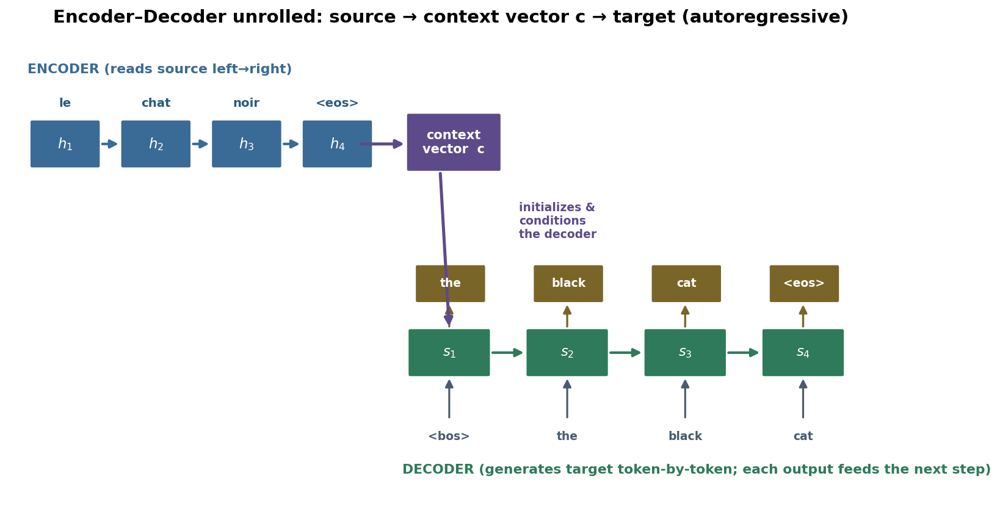
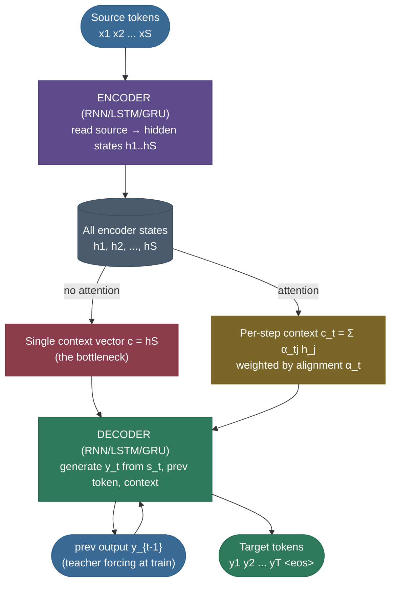
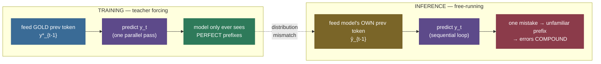
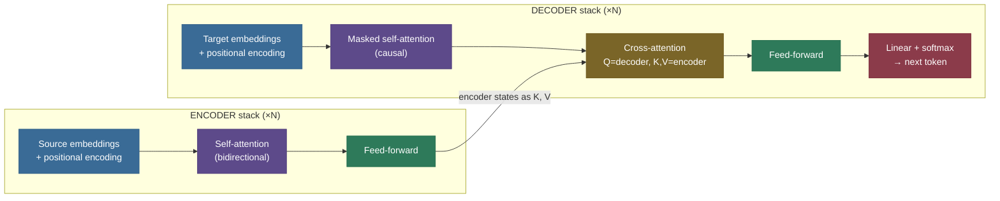

# Sequence-to-Sequence: turning one sequence into another

Imagine being handed a French sentence and asked to write the English. You can't just swap word-for-word: the two sentences have **different lengths**, the word order is **shuffled**, and a single French word may become three English ones (or vice versa). You have to *read the whole thing*, build a mental representation of what it **means**, and only then start writing — generating the translation one word at a time, each new English word chosen in light of both the French source and the English you've written so far. That is **sequence-to-sequence (seq2seq)** learning, and the **encoder–decoder** is the neural architecture that does it: one network (the *encoder*) reads the input into a representation, a second network (the *decoder*) writes the output token by token from that representation.

This single idea — *map a variable-length input sequence to a variable-length output sequence* — is the template behind machine translation, summarization, dialogue, speech recognition, code generation, and **every encoder–decoder LLM** (T5, BART, Whisper). It is also where **attention** was born, in 2014–15, as the fix to a crippling flaw in the original design — and attention is the seed from which the entire Transformer grew. So this page is doing double duty: it teaches you a workhorse architecture *and* it walks you to the doorstep of modern NLP.

I'm going to build this the way I'd explain it to a teammate at a whiteboard. We'll start with *why the problem is genuinely hard* (the lengths differ and don't line up), then the *encoder–decoder* with its equations and tensor shapes, then the **fixed-context-vector bottleneck** — and we'll *measure* it collapsing — then **attention** as the cure (and the soft word-alignment it learns, which we'll also measure), then the training-time subtleties (**teacher forcing**, **exposure bias**, **scheduled sampling**), then **autoregressive decoding**, then how this whole RNN-era idea **generalizes directly into the Transformer's cross-attention**, and finally copy mechanisms, applications, and evaluation. By the end you'll be able to:

- explain **what** seq2seq solves and **why** non-monotonic, length-mismatched alignment makes it hard;
- write the **encoder** and **decoder** equations with their **shapes**, and say exactly what the **context vector** is;
- **argue from first principles** why cramming a whole sentence into one fixed vector loses information — and **point at a measured curve** of accuracy collapsing with length;
- derive the **attention** context vector (Bahdanau additive / Luong multiplicative) and read an **alignment matrix** as soft word-alignment;
- explain **teacher forcing**, the **exposure bias** it creates, and **scheduled sampling** as the remedy;
- map every piece onto the **Transformer encoder–decoder** (self-attention replaces recurrence, cross-attention replaces Bahdanau attention) and name **T5/BART** as its LLM incarnation;
- prove in runnable code that **attention holds at length while a single context vector collapses.**

> **Note:** "seq2seq" (the *task* — input sequence → output sequence) and "encoder–decoder" (the *architecture* that solves it) are used almost interchangeably, but they're not the same thing. Seq2seq is the problem shape; encoder–decoder is one (very successful) family of solutions to it. A decoder-only LLM also does seq2seq-style work (prompt → continuation); it just folds the "encoder" into the same stack.

---

## The problem: input and output are *both* variable-length, and they don't line up

Plenty of neural tasks map a sequence to something *fixed*: sentiment classification reads a review and emits one label; a tagger reads $n$ tokens and emits exactly $n$ tags (one per token, perfectly aligned). Those are comparatively easy because the output structure is pinned down by the input.

Seq2seq is harder on **three** axes at once:

1. **The output length is not the input length, and isn't known in advance.** "I am hungry" (3 words) → "J'ai faim" (2 words). "The cat sat" (3) → "Le chat s'est assis" (4). The model must *decide when to stop* — emit a special `<eos>` (end-of-sequence) token — rather than being told.
2. **The alignment is non-monotonic.** German pushes verbs to the end; "I will eat the apple" → "Ich werde den Apfel essen" maps "eat" (position 3) to "essen" (position 5). A model that assumed output word $i$ comes from input word $i$ would fail on every language pair with reordering.
3. **The mapping is many-to-many.** One source word can become several target words ("hungry" → "ai faim") or several source words collapse to one. There is no fixed correspondence to exploit.

> **Note:** this is exactly why the older [N-gram language models](04-N-gram-Language-Models-and-Smoothing.md) and phrase-based statistical MT systems were so elaborate — they stitched translation together from word/phrase tables plus a separate alignment model plus a language model, all tuned separately. Seq2seq's radical promise in 2014 was **one neural network, trained end-to-end**, that learns the whole mapping — length, reordering, and word choice — jointly from parallel data.

So we need an architecture that can (a) consume an input of arbitrary length, (b) produce an output of *different*, self-determined length, and (c) let any output position depend on any input position. The encoder–decoder delivers (a) and (b) immediately; (c) is where the bottleneck — and then attention — comes in.

---

## What it is: the encoder–decoder architecture

The structure is two recurrent networks ([RNN/LSTM/GRU](../../05.%20Deep_Learning/concepts/14-RNN-LSTM-GRU.md)) bolted together by a single vector:

- The **encoder** reads the source sequence $x_1, \dots, x_S$ one token at a time, updating a hidden state. After the last token its final hidden state is a fixed-length summary of the *entire* source — the **context vector** $c$.
- The **decoder** is a second RNN that *generates* the target $y_1, \dots, y_T$ **autoregressively**: it is initialized from $c$, and at each step it takes the previous target token and its own hidden state and produces a probability distribution over the vocabulary for the next token. It keeps going until it emits `<eos>`.



That picture *is* the architecture. The encoder compresses; the context vector carries; the decoder unrolls. Three moving parts, one bottleneck (we'll get there). Here is the same flow as a graph, foreshadowing the two ways the decoder can consume the encoder — the single context vector (the bottleneck) versus attention over all states:



> **Note:** the original [Sutskever et al. (2014)](https://arxiv.org/abs/1409.3215) paper found a delightful, telling trick: **reverse the source sentence** before feeding it in. Translating "a b c" → "α β γ" became "c b a" → "α β γ". This put the *first* source words physically closer to the *first* target words in the unrolled network, shortening the gradient path for the early alignments — and it bumped BLEU by several points. The very fact that *the order you feed tokens in matters so much* is a giant flashing sign that the single context vector is straining. Attention makes the trick unnecessary.

---

## The math: encoder, decoder, and the context vector — with shapes

Let me write it concretely so every symbol and shape is pinned down. Let the source be tokens $x_1, \dots, x_S$ and the target $y_1, \dots, y_T$. Embeddings live in $\mathbb{R}^{d}$; hidden states in $\mathbb{R}^{H}$.

**Encoder.** An RNN (take a GRU) consumes embedded source tokens and rolls a hidden state forward:

$$h_j = \text{GRU}_{\text{enc}}\big(E_{\text{src}}[x_j],\; h_{j-1}\big), \qquad h_0 = \mathbf{0}, \qquad h_j \in \mathbb{R}^{H}, \quad j = 1 \dots S.$$

Here $E_{\text{src}} \in \mathbb{R}^{|V_{\text{src}}| \times d}$ is the source embedding matrix, so $E_{\text{src}}[x_j] \in \mathbb{R}^{d}$. The encoder produces a sequence of states $h_1, \dots, h_S$, stacked as a matrix $H_{\text{enc}} \in \mathbb{R}^{S \times H}$. The **context vector** is, in the vanilla design, just the last one:

$$c = h_S \in \mathbb{R}^{H}.$$

A **bidirectional** encoder runs a second GRU right-to-left and concatenates, $h_j = [\overrightarrow{h_j}; \overleftarrow{h_j}] \in \mathbb{R}^{2H}$, so each state sees both left and right context — important because word $j$'s meaning often depends on words *after* it. (Our code uses a bidirectional encoder for exactly this reason.)

**Decoder.** A second GRU, initialized from the context, generates the target. Writing its hidden state $s_t$:

$$s_0 = c, \qquad s_t = \text{GRU}_{\text{dec}}\big(E_{\text{tgt}}[y_{t-1}],\; s_{t-1}\big), \qquad s_t \in \mathbb{R}^{H}.$$

At each step it projects $s_t$ to vocabulary logits and applies softmax to get a distribution over the next target token:

$$P(y_t \mid y_{<t}, x) = \text{softmax}\big(W_o\, s_t + b_o\big), \qquad W_o \in \mathbb{R}^{|V_{\text{tgt}}| \times H}.$$

The whole model defines a conditional language model over the target, factorized autoregressively:

$$P(y_1, \dots, y_T \mid x) \;=\; \prod_{t=1}^{T} P\big(y_t \mid y_1, \dots, y_{t-1},\; x\big).$$

**Training objective.** Maximize the log-likelihood of the gold target — equivalently, minimize the per-token cross-entropy averaged over the corpus:

$$\mathcal{L} \;=\; -\sum_{t=1}^{T} \log P\big(y_t^{\star} \mid y_{<t}^{\star},\, x\big),$$

where $y^\star$ is the ground-truth target. (Note the $y_{<t}^\star$ — the *gold* prefix. Feeding the gold prefix during training is **teacher forcing**, a deceptively important choice we dissect below.)

> **Worked example 0 — trace the shapes through one forward pass.** Concrete numbers make the tensors stick. Take source length $S=4$, target length $T=3$, embedding $d=256$, hidden $H=512$, target vocab $|V_{\text{tgt}}|=30{,}000$, batch $B=1$.
> - **Encoder.** Embed: $(B, S) \to (B, S, d) = (1, 4, 256)$. Run the GRU: the state sequence is $(1, 4, 512)$ and the final state $c = h_S$ is $(1, 512)$. (Bidirectional would give $(1, 4, 1024)$ and a $(1, 1024)$ final, projected back to $512$.)
> - **Decoder, step 1.** Input the embedded `<bos>` $(1, 256)$ and $s_0 = c$ $(1, 512)$; the GRU emits $s_1$ $(1, 512)$; project $W_o s_1$ to logits $(1, 30000)$; softmax → next-token distribution; pick $y_1$.
> - **Repeat** for $t=2,3$, each step $(1, 512) \to (1, 30000)$. Over the whole target that's $T=3$ vocab projections.
> The thing to notice: the **only** bridge between the $(1, 4, 512)$ encoder states and the entire decode is the single $(1, 512)$ vector $c$. *All four source positions, compressed to one.* That one tensor shape **is** the bottleneck — and attention's job is to let the decoder read the full $(1, 4, 512)$ instead.

> **Note — GRU or LSTM?** Both work; the encoder–decoder is agnostic. **LSTMs** ([the original Sutskever choice](https://arxiv.org/abs/1409.3215)) carry a separate cell state and gate more finely — historically a touch stronger on long sequences. **GRUs** ([Cho's choice](https://arxiv.org/abs/1406.1078)) merge the gates, have fewer parameters, and train a hair faster — what our code uses for compactness. The mechanics live in the [RNN/LSTM/GRU](../../05.%20Deep_Learning/concepts/14-RNN-LSTM-GRU.md) page; for seq2seq the takeaway is that *neither* fully escapes the recurrent state's recency bias, which is exactly why attention (and later the Transformer) mattered.

> **Note: where is the context vector "used" in the vanilla decoder?** Two designs exist and both appear in papers. (1) *Init-only*: $c$ initializes $s_0$ and then the decoder runs free — $c$'s influence must survive through the recurrence. (2) *Conditioned-every-step*: $c$ is concatenated to the input at **every** decoder step, $s_t = \text{GRU}([E_{\text{tgt}}[y_{t-1}]; c],\, s_{t-1})$, so the source summary is re-injected each step. [Cho et al. (2014)](https://arxiv.org/abs/1406.1078) used the every-step version; it helps because a single init has to compete with a long target for the hidden state's memory. Either way, **there is exactly one $c$ for the whole target** — and that is precisely the bottleneck.

---

## The fixed-context-vector bottleneck — why one vector isn't enough

Here is the crux, and the single most-asked seq2seq interview question. Look hard at the architecture above: **the entire meaning of the source — every word, every dependency, every nuance — must pass through one fixed-size vector $c \in \mathbb{R}^{H}$.** A 5-word sentence and a 50-word sentence both get the *same number of numbers* to be remembered by.

Think about the information accounting. A vector of $H = 512$ FP32 numbers holds a bounded amount of information. A short sentence fits comfortably. But as the source grows, you are asking that *same fixed bucket* to retain more and more — and something has to give. Early words get overwritten by later ones as the RNN rolls forward (the **recency bias** of a recurrent state), long-range dependencies decay (the very [vanishing-gradient](../../05.%20Deep_Learning/concepts/06-Vanishing-Exploding-Gradients.md) problem RNNs suffer), and the decoder, staring at one blurry summary, starts dropping or duplicating content. The classic symptom: **translation quality (BLEU) is fine for short sentences and falls off a cliff as length grows.** [Bahdanau et al. (2015)](https://arxiv.org/abs/1409.0473) showed exactly this curve — a vanilla encoder–decoder's BLEU drops steeply past ~20–30 words, while their attention model **stays flat**. That divergence is the empirical fingerprint of the bottleneck.

We can reproduce the phenomenon ourselves on a clean toy task — **copying a digit string** (output = input). Copying is the *easiest possible* seq2seq task (no reordering, no vocabulary change), so any failure is purely about *capacity to carry information through $c$*. I trained two tiny GRU encoder–decoders on copying digit strings of length 1–16, identical except that one is conditioned only on the single context vector $c$ and the other uses attention (next section). Then I measured free-running, exact-match accuracy at increasing lengths:


The numbers are stark. The **no-attention** model — forced to push the whole source through $c$ — scores only **22.8%** exact-match at length 2 and is essentially **0%** by length 6. It literally cannot reconstruct a 6-digit string from one vector. The **attention** model (same size, same training) sits at **~99–100%** across the entire 1–16 training range. This is the bottleneck, measured, on the simplest task imaginable.

> **Worked example 1 — the bottleneck as an information-capacity argument.** Suppose the encoder must distinguish among all length-$S$ digit strings to copy them. There are $10^{S}$ such strings, so $c$ must encode $\log_2(10^{S}) = S \log_2 10 \approx 3.32\,S$ bits *losslessly*. A real $\mathbb{R}^{H}$ vector under a trained, noisy, finite-precision RNN carries only a bounded, roughly constant number of *reliably recoverable* bits — call it $B$. The model can copy losslessly only while $3.32\,S \lesssim B$, i.e. up to some length $S^\star \approx B / 3.32$; beyond that, accuracy must fall. The shape we measured — flat-then-collapse — is exactly this: a fixed-capacity channel saturating. Attention sidesteps it by giving the decoder a *fresh* read of the source at every step, so the bottleneck channel is never asked to hold the whole thing at once.

> **Gotcha:** people sometimes say "just make $H$ bigger." That raises $B$ and pushes $S^\star$ out, but it doesn't change the *shape* — there's still a fixed cliff, now at a longer length, and you pay quadratic-ish parameter cost for a linear-ish gain. Worse, a bigger $c$ doesn't help with **reordering** or **selective focus**: even a huge vector is a *blurred average* of the source, with no way for the decoder to spotlight "the word I need right now." Attention fixes the *structural* problem, not just the *capacity* one.

---

## Attention: let the decoder read the whole source, every step

The fix, introduced by [Bahdanau, Cho & Bengio (2015)](https://arxiv.org/abs/1409.0473), is beautifully direct: **stop forcing everything through one vector.** Keep *all* encoder states $h_1, \dots, h_S$ around, and let the decoder, at every output step $t$, compute a **fresh context vector** $c_t$ as a **weighted average of all encoder states** — with the weights chosen dynamically based on what the decoder needs *right now*. The decoder learns to **look back** at the relevant source words for each target word it produces.

Concretely, at decoder step $t$ with current decoder state $s_{t-1}$:

1. **Score** how relevant each encoder state $h_j$ is to the current decoding step:
   $$e_{tj} = \text{score}(s_{t-1}, h_j).$$
2. **Normalize** the scores into a probability distribution (the **alignment weights**) with softmax:
   $$\alpha_{tj} = \frac{\exp(e_{tj})}{\sum_{k=1}^{S} \exp(e_{tk})}, \qquad \sum_{j=1}^{S} \alpha_{tj} = 1.$$
3. **Blend** the encoder states by those weights into a step-specific context:
   $$c_t = \sum_{j=1}^{S} \alpha_{tj}\, h_j \;\in \mathbb{R}^{H}.$$
4. **Decode** using $c_t$ alongside the previous token:
   $$s_t = \text{GRU}_{\text{dec}}\big([E_{\text{tgt}}[y_{t-1}];\, c_t],\; s_{t-1}\big), \qquad P(y_t \mid \cdot) = \text{softmax}(W_o[s_t; c_t]).$$

The only design choice is the **score function**. The two classics:

- **Bahdanau (additive) attention** — a tiny one-hidden-layer network scores each pair:
  $$e_{tj} = v_a^{\top} \tanh\!\big(W_a s_{t-1} + U_a h_j\big), \qquad v_a \in \mathbb{R}^{H},\; W_a, U_a \in \mathbb{R}^{H \times H}.$$
  It's expressive (it can mix $s$ and $h$ nonlinearly) and works even when decoder and encoder dimensions differ.
- **Luong (multiplicative / dot-product) attention** — [Luong et al. (2015)](https://arxiv.org/abs/1508.04025) — just a (scaled) dot product, optionally with a learned matrix:
  $$e_{tj} = s_{t}^{\top} h_j \quad(\text{dot}) \qquad\text{or}\qquad e_{tj} = s_{t}^{\top} W_a\, h_j \quad(\text{general}).$$
  Cheaper (a matmul, no extra MLP) and the direct ancestor of the Transformer's **scaled dot-product attention**, $\text{softmax}(QK^\top/\sqrt{d_k})V$. The $\sqrt{d_k}$ scaling and the Q/K/V framing are covered in depth in the [Attention Mechanism](../../05.%20Deep_Learning/concepts/15-Attention-Mechanism.md) page — this is cross-attention, where the **query** comes from the decoder and the **keys/values** from the encoder.

> **Note:** in attention's language, $s_{t-1}$ is the **query** ("what do I need to write next?"), each $h_j$ acts as both a **key** (to be matched against the query) and a **value** (to be averaged into the context). The decoder *queries* the source. This is precisely **cross-attention**, and naming it that way is the bridge to the Transformer.

> **Tip:** the softmax in step 2 is why attention is a *soft, differentiable* selection. A *hard* attention would pick one source word (argmax) — non-differentiable, trained with REINFORCE, higher variance. Soft attention averages, so gradients flow to *every* encoder state, and the model learns sharp-but-smooth focus by gradient descent. Soft won; nearly everything since is soft attention.

> **Note:** attention does **not** replace the encoder's recurrence (in the RNN era) — the $h_j$ still come from the GRU/LSTM. It replaces the *single context vector* with a *per-step, content-addressed* one. The Transformer's later leap was to *also* replace the recurrence (with self-attention) — but that's the next architecture, not this one.

**Global vs local attention.** [Luong et al. (2015)](https://arxiv.org/abs/1508.04025) also distinguished *global* attention (attend over **all** $S$ source positions — what we wrote above, and what almost everyone uses) from *local* attention (predict an aligned position $p_t$ and attend only within a small window $[p_t - D, p_t + D]$). Local attention was an efficiency play for very long sources in the RNN era — it caps the per-step cost at $O(2D{+}1)$ instead of $O(S)$ — but it adds a window-prediction sub-problem and risks missing long-range alignments. Global attention won in practice; the *real* efficiency fix for long sequences arrived later as sparse/linear attention in the Transformer era (out of scope here, but the lineage runs straight through this design choice).

**Input-feeding.** One more Luong refinement worth knowing: **feed the previous step's attentional context back in** as part of the next step's decoder input. Without it, the decoder can "forget" what it already attended to and re-translate the same source span; input-feeding gives it a memory of past alignment decisions and measurably improves translation. It's a poor-man's precursor to the *coverage* mechanism we'll meet under copy networks.

> **Tip — attention's cost.** Per decode step, attention scores the query against all $S$ encoder states: that's $O(S \cdot H)$ work and $O(S)$ memory for the weights, every step, so a full decode is $O(T \cdot S \cdot H)$ versus the no-attention decoder's $O(T \cdot H)$. You pay an extra factor of $S$ — but $S$ is the *source length*, not the (much larger) vocabulary, and the quality win is enormous, so the trade is almost always worth it. This $O(T \cdot S)$ is also exactly the cross-attention cost in a Transformer decoder, which is why the cross-attention KV cache (compute encoder K/V once, reuse for all $T$ steps) is such a clean win.

---

## The alignment matrix: attention as soft word-alignment

The most beautiful by-product of attention is that the weights $\alpha_{tj}$ — collected into a matrix $A \in \mathbb{R}^{T \times S}$, row $t$ = the distribution over source positions when generating target token $t$ — form a **soft alignment** between source and target. You never *supervised* an alignment; the model discovered which source words each target word depends on, purely from the translation objective. Plot $A$ as a heatmap and you can *read* the model's reasoning.

Here is a **measured** alignment from the attention model I trained, generating a copy of the source `3 1 4 1 5 9 2`:


The bright **diagonal** is the model saying "to emit the $t$-th output digit, look at the $t$-th input digit" — exactly the copy mapping, learned from scratch, with diagonal weights of **0.92, 0.88, 0.88, 0.80**. On a *translation* task the diagonal would **bend and break** wherever the languages reorder — and that bent diagonal is literally a picture of the grammar difference between the two languages. (Bahdanau's paper showed this for English↔French, with the alignment going off-diagonal exactly at the noun–adjective swaps.)

> **Worked example 2 — compute one attention step by hand.** Take a 3-token source and compute the context for one decoder step, fully by hand. Let the (toy, 2-D) encoder states and the current decoder query be
> $$h_1 = \begin{bmatrix}1\\0\end{bmatrix},\; h_2 = \begin{bmatrix}0\\1\end{bmatrix},\; h_3 = \begin{bmatrix}1\\1\end{bmatrix}, \qquad s = \begin{bmatrix}1\\1\end{bmatrix}.$$
> Use **dot-product** scoring, $e_j = s^\top h_j$:
> $$e_1 = 1\cdot1 + 1\cdot0 = 1, \quad e_2 = 1\cdot0 + 1\cdot1 = 1, \quad e_3 = 1\cdot1 + 1\cdot1 = 2.$$
> Softmax (with $e^1 \approx 2.718,\; e^2 \approx 7.389$, sum $= 2.718 + 2.718 + 7.389 = 12.825$):
> $$\alpha = \Big[\tfrac{2.718}{12.825},\; \tfrac{2.718}{12.825},\; \tfrac{7.389}{12.825}\Big] = [0.212,\; 0.212,\; 0.576].$$
> The query leans toward $h_3$ (largest dot product) but keeps mass on the others. The context vector:
> $$c = 0.212\,h_1 + 0.212\,h_2 + 0.576\,h_3 = \begin{bmatrix}0.212 + 0 + 0.576\\ 0 + 0.212 + 0.576\end{bmatrix} = \begin{bmatrix}0.788\\0.788\end{bmatrix}.$$
> That $c$ — a query-weighted blend of the source — is what the decoder consumes this step, *instead of* a single frozen $h_S$. Change the query (next decode step) and the weights re-focus on different source words. That re-focusing, every step, is the whole game.

> **Worked example 2b — a *reordering* alignment, read off the matrix.** The copy task gives a clean diagonal, but the whole point of attention is handling *non-monotonic* alignment. Consider French→English "le chat noir" → "the black cat" (adjective–noun order flips). A well-trained attention matrix $A$ (rows = English target, columns = French source) would concentrate roughly like this:
> $$\begin{array}{c|ccc} & \text{le} & \text{chat} & \text{noir}\\\hline \text{the} & 0.90 & 0.06 & 0.04\\ \text{black} & 0.05 & 0.07 & 0.88\\ \text{cat} & 0.06 & 0.86 & 0.08\end{array}$$
> Read the bright cells: "the"→"le" (position 1→1), but then "black"→"noir" (2→3) and "cat"→"chat" (3→2) — the diagonal **crosses itself** exactly at the adjective–noun swap. *That crossing is the grammar difference, drawn.* A single context vector could never express "for *this* output word, look *there*"; attention does it per step, and the matrix is the receipt.

> **Tip:** alignment heatmaps are a free **interpretability** tool. If a translation drops a clause, the heatmap often shows the decoder never attended to it; if it repeats, you'll see two target steps both spike on the same source span. Reach for the heatmap when debugging a seq2seq model's mistakes — it's the closest thing to seeing what the model "looked at."

---

## Teacher forcing and exposure bias

There's a subtle training/inference mismatch lurking in the objective above, and it's a favorite interview probe.

**Teacher forcing.** During *training*, when we compute $P(y_t \mid y_{<t}^\star, x)$, we feed the decoder the **ground-truth** previous token $y_{t-1}^\star$ — *not the token the model itself would have predicted.* This is **teacher forcing** ([Williams & Zipser, 1989](https://ieeexplore.ieee.org/document/6795228)). Why do it? Two big reasons:

1. **Speed / parallelism.** Because every step's input is the known gold token, all $T$ steps can be computed in **one parallel pass** (and in a Transformer decoder, with a causal mask, literally simultaneously). No need to run the slow autoregressive loop during training. This is also why a [KV cache](../../09.%20LLMs/05-KV-Cache/05-KV-Cache.md) isn't used in training — the whole target is known up front.
2. **Stable gradients.** Early in training the model's own predictions are garbage; if you fed them back, errors would compound and the decoder would rarely see a sensible prefix, making learning glacial. Feeding gold prefixes keeps it on a good trajectory.

**Exposure bias.** But here's the catch. At **inference** there is no gold prefix — the decoder must condition on *its own* previous outputs. So the model is trained in a world it never inhabits at test time: it has **only ever seen perfect prefixes**, and was **never exposed to its own mistakes**. The instant it makes one error at test time, it's now conditioning on a prefix unlike anything in training, which makes the *next* error more likely — errors **compound**. This train/test distribution mismatch is **exposure bias** ([Ranzato et al., 2016](https://arxiv.org/abs/1511.06732); [Bengio et al., 2015](https://arxiv.org/abs/1506.03099)).



**Scheduled sampling** ([Bengio et al., 2015](https://arxiv.org/abs/1506.03099)) is the classic remedy: during training, **flip a coin each step** — with probability $\epsilon$ feed the gold token, with probability $1-\epsilon$ feed the model's *own* sampled token — and **anneal $\epsilon$ from 1 toward 0** over training. Early on it's pure teacher forcing (stable); later the model practices recovering from its own mistakes (robust). Other remedies: **sequence-level training** that optimizes the actual metric (BLEU) with RL or minimum-risk training so the model is scored on its *own* generations ([Ranzato et al., 2016](https://arxiv.org/abs/1511.06732)); and, in the Transformer era, large-scale pretraining largely *masks* the symptom because the model has seen so much text that off-distribution prefixes are rarer.

> **Worked example 3 — teacher forcing vs free-running, traced.** Suppose the gold target is `the black cat <eos>` and at step 3 the model wrongly assigns highest probability to "dog". Trace both regimes:
> - **Teacher forcing (training):** step 4's input is the **gold** token "cat" regardless of the step-3 slip. The model's step-4 prediction is computed from a *correct* prefix `the black cat`, so the error doesn't propagate; the loss simply penalizes the bad step-3 distribution. Clean gradients, but the model never *practices* the situation it'll actually face.
> - **Free-running (inference):** step 4's input is the model's **own** step-3 output, "dog". Now it's conditioning on `the black dog` — a prefix it likely never saw in training — and is *more* likely to continue wrongly ("dog barked"?), compounding the error. The single step-3 mistake has knocked the whole generation off the rails. *This gap between the two traces is exposure bias*, and it's exactly why our measured no-attention curve (free-running) is harsher than a teacher-forced loss would suggest.

> **Gotcha:** don't conflate "teacher forcing" with "attention" or "the cache" — they're orthogonal. Teacher forcing is a *training-time input choice* (gold vs own token); it applies to RNN and Transformer decoders, with or without attention. A common interview slip is to say teacher forcing "is" the parallel Transformer training — it *enables* it (known prefix → causal-masked parallel pass), but it's a distinct idea.

---

## Autoregressive decoding: turning probabilities into a sequence

At inference the decoder runs the **autoregressive loop**: emit a token, append it to the running output, feed it back, repeat — until `<eos>` or a max length. The remaining question is *how* to pick each token from the per-step distribution $P(y_t \mid y_{<t}, x)$, and the choice materially changes output quality:

- **Greedy** — take $\arg\max$ each step. Fast, but locally myopic: a high-probability first token can lock you out of a better overall sequence.
- **Beam search** — keep the $k$ highest-probability *partial sequences* at each step and expand them all, pruning to the top $k$. It approximately maximizes the *sequence* probability $P(y \mid x)$, not just per-token, and is the workhorse for translation/summarization where you want the single most-likely output. Beam width $k = 4$–$10$ is typical; bigger isn't always better (it can over-favor short, generic outputs — hence **length normalization**).
- **Sampling** (temperature, top-k, top-p/nucleus) — for open-ended generation (dialogue, story) where you want diversity, not the single MAP sequence.

These — and the crucial subtleties (length penalties, repetition, why beam helps MT but hurts open-ended generation) — are the whole subject of the [Decoding Strategies](17-Decoding-Strategies.md) page; I won't re-derive them here. The seq2seq-specific point is just that **decoding is autoregressive and length-determining**: the model must *learn when to stop* (emit `<eos>`), and the search strategy trades compute for closeness to the true MAP sequence.

> **Worked example 4 — greedy can lose to beam, by the numbers.** Suppose the decoder must emit a 2-token output and the per-step probabilities are:
> - Step 1: $P(\text{A})=0.5,\; P(\text{B})=0.5$.
> - After A: $P(\text{X}\mid \text{A})=0.4,\; P(\text{Y}\mid \text{A})=0.6$.
> - After B: $P(\text{X}\mid \text{B})=0.9,\; P(\text{Y}\mid \text{B})=0.1$.
> **Greedy** ties at step 1 (say it takes A), then takes Y: sequence "A Y" with probability $0.5 \times 0.6 = 0.30$. **Beam search** with width $k=2$ keeps both A and B after step 1, expands all four continuations, and ranks them: $P(\text{B X}) = 0.5 \times 0.9 = \mathbf{0.45}$, $P(\text{A Y}) = 0.30$, $P(\text{A X}) = 0.20$, $P(\text{B Y}) = 0.05$. Beam returns "B X" at 0.45 — a **50% more probable** sequence that greedy never found, because greedy's locally-tied first choice (A) shut the door on B's much better continuation. This is the whole argument for beam search in translation: maximize $P(y \mid x)$ over the *sequence*, not greedily per token.

> **Gotcha — beam search and length bias.** Longer sequences multiply more (sub-1) probabilities, so raw sequence probability is biased toward *short* outputs — beam search left unchecked will favor truncated, generic translations and may even emit `<eos>` too early. The fix is **length normalization**: divide the log-probability by (a function of) the length, $\frac{1}{T^\lambda}\sum_t \log P(y_t\mid\cdot)$ with $\lambda \approx 0.6$–$1.0$. Forgetting this is a classic "my translations are too short" bug.

> **Note:** an encoder–decoder at inference uses a [KV cache](../../09.%20LLMs/05-KV-Cache/05-KV-Cache.md) just like a decoder-only LLM — *two* caches, in fact: the decoder caches its own self-attention K/V each step, **and** it caches the **cross-attention** K/V, which are computed **once** from the encoder output and reused for every generated token (the encoder states don't change during decoding). That "compute encoder K/V once, reuse forever" is the direct descendant of "compute $c$ once" — but now it's *all* the states, addressable by attention.

---

## From RNN seq2seq to the Transformer encoder–decoder

Everything so far is the RNN-era encoder–decoder. The [Transformer](../../05.%20Deep_Learning/concepts/16-Transformer-Architecture.md) ([Vaswani et al., 2017](https://arxiv.org/abs/1706.03762)) kept the *encoder–decoder shape* but replaced its two recurrent pieces with attention, removing recurrence entirely so the whole thing parallelizes:

- **Self-attention replaces the encoder's recurrence.** Instead of rolling a hidden state left-to-right, each source token attends to *all* source tokens directly, in parallel — no sequential dependency, no vanishing gradient over distance.
- **Cross-attention replaces the Bahdanau attention.** The decoder still attends to the encoder, but now with scaled dot-product cross-attention (decoder query, encoder key/value) — the *exact* mechanism we derived above, just generalized to multi-head and stacked. The decoder *also* gets **masked (causal) self-attention** over its own generated prefix, replacing the decoder's recurrence.




The conceptual map is one-to-one, which is why understanding RNN seq2seq makes the Transformer almost free:

| RNN seq2seq (this page) | Transformer encoder–decoder |
|---|---|
| Encoder GRU/LSTM recurrence | Encoder **self-attention** (bidirectional) |
| Single context vector $c = h_S$ | (eliminated — attention everywhere) |
| Bahdanau/Luong attention $c_t = \sum_j \alpha_{tj} h_j$ | Decoder **cross-attention** (multi-head, scaled dot-product) |
| Decoder GRU/LSTM recurrence | Decoder **masked self-attention** (causal) |
| Teacher forcing (sequential train) | Teacher forcing (fully **parallel** train via causal mask) |
| Beam search decoding | Beam search decoding (unchanged) |

**Encoder–decoder LLMs.** This shape didn't die with RNNs — it's a major LLM family:

- **T5** ([Raffel et al., 2020](https://arxiv.org/abs/1910.10683)) — "Text-to-Text Transfer Transformer." *Everything* (translation, summarization, classification, QA) is cast as text-in → text-out through a Transformer encoder–decoder. The cleanest demonstration that seq2seq is a universal interface.
- **BART** ([Lewis et al., 2020](https://arxiv.org/abs/1910.13461)) — a Transformer encoder–decoder pretrained as a *denoising autoencoder* (corrupt the text, reconstruct it); superb for summarization and generation.
- **Whisper** (speech→text) and many multimodal models are encoder–decoders: an encoder over the input modality, a decoder generating text.

> **Note:** so when is encoder–decoder preferred over a **decoder-only** LLM (GPT-style)? When the input and output are *distinct* and the input should be encoded **bidirectionally** — classic translation and summarization, where the source is fully available and benefits from non-causal encoding. Decoder-only models handle the same tasks by concatenating source and target into one stream (prefix → continuation) with a causal mask; they've won at *scale* for general chat, but encoder–decoders remain strong where a clean source→target split and bidirectional source encoding help. It's an architecture *choice*, not a settled hierarchy.

---

## Copy mechanisms and pointer networks

One stubborn seq2seq failure is **out-of-vocabulary (OOV)** and rare tokens — names, numbers, technical terms — that the decoder's softmax can't reliably produce but that often appear *verbatim* in the source. The fix is to let the model **copy** from the input.

- **Pointer networks** ([Vinyals et al., 2015](https://arxiv.org/abs/1506.03134)) use attention itself as a *pointer*: instead of (or alongside) generating from a fixed vocabulary, the model's output distribution can point at a **source position** and copy that token.
- **Pointer-generator networks** ([See et al., 2017](https://arxiv.org/abs/1704.04368)) — the canonical summarization model — combine both: a learned **soft gate** $p_{\text{gen}} \in [0,1]$ mixes the generation distribution (the usual vocab softmax) with the **copy** distribution (the attention weights over source positions), $P(w) = p_{\text{gen}} P_{\text{vocab}}(w) + (1 - p_{\text{gen}}) \sum_{j: x_j = w} \alpha_{tj}$. So the model can *generate* a fluent word or *copy* a source word (even an OOV one), choosing per step. See et al. also added a **coverage** mechanism — penalize attending to source positions already covered — to stop summaries from repeating themselves, a notorious seq2seq pathology.

> **Tip:** copy mechanisms shine in **summarization** (copy named entities, numbers, exact phrases) and **semantic parsing / code** (copy identifiers verbatim). In the Transformer/LLM era, large subword vocabularies + massive pretraining reduce the OOV problem so explicit copy modules are less common — but the *idea* (point at the source) lives on in retrieval-augmented and tool-using systems.

---

## Where seq2seq is used

The encoder–decoder template is everywhere a structured output is generated from a structured input:

- **Machine translation** — the founding application; see the dedicated [Machine Translation](12-Machine-Translation.md) page for the task, data, and metrics.
- **Text summarization** — source document → shorter summary; abstractive summarization is seq2seq, and copy/coverage were invented here. See [Text Summarization](13-Text-Summarization.md).
- **Dialogue / conversational response** — conversation history → response (the original neural chatbots were seq2seq).
- **Speech recognition (ASR)** — audio frames → text (encoder over audio, decoder over text; Whisper).
- **Text-to-speech, image captioning** — one modality → text, or text → another modality.
- **Code generation & semantic parsing** — natural language → code / SQL / logical form; copy mechanisms help with identifiers.
- **Grammar correction, paraphrasing, data-to-text** — any "rewrite/transform this sequence" task.

---

## Evaluation

Because the output is a *generated sequence*, you can't just check accuracy — there are many valid outputs. The standard metrics compare against one or more references:

- **BLEU** — n-gram **precision** with a brevity penalty; the default for **translation**.
- **ROUGE** — n-gram/longest-common-subsequence **recall**; the default for **summarization**.
- **METEOR, chrF, BERTScore** — refinements that add recall, synonymy, or embedding-based similarity.

The mechanics, strengths, and failure modes of each (why BLEU is precision-flavored, why ROUGE is recall-flavored, where both mislead) are the subject of the [NLP Evaluation Metrics](18-NLP-Evaluation-Metrics.md) page. The seq2seq-relevant point is the one from the bottleneck section: **report metrics bucketed by source length** when you suspect a capacity problem — a flat-then-falling BLEU-vs-length curve is the bottleneck's signature, and a fix (attention, bigger model, better decoding) should flatten it.

---

## A practical playbook: building a seq2seq model

If you're actually wiring one up (RNN-era for learning, or to debug an existing system), here's the decision order that mirrors how the field arrived at the design:

1. **Tokenize with subwords, not words.** Use BPE/WordPiece/Unigram ([Tokenization](02-Tokenization-and-Subword-Algorithms.md)) so the vocabulary is bounded and OOV is rare — this is the single biggest practical lever and it shrinks the need for explicit copy mechanisms.
2. **Make the encoder bidirectional.** A left-to-right-only encoder forces every state to summarize only the *prefix*; bidirectional gives each $h_j$ both-sided context, which attention then reads from. (Our code does this.)
3. **Always use attention.** There is essentially no reason to ship the single-context-vector design — the measured collapse above is why. The only question is the score function: dot-product (Luong) if encoder/decoder dims match and you want speed; additive (Bahdanau) if they differ or you want a touch more expressiveness.
4. **Train with teacher forcing, but plan for exposure bias.** Start with full teacher forcing; if free-running quality lags teacher-forced loss (a tell-tale gap), add **scheduled sampling** (anneal $\epsilon$) or sequence-level fine-tuning.
5. **Decode with beam search + length normalization** for translation/summarization; **sampling** (top-p) for open-ended generation. Tie the choice to the task, not habit.
6. **Bucket your eval by length.** If quality falls with source length, your capacity (or attention) is the suspect — the bottleneck curve is your diagnostic.
7. **When you outgrow RNNs, lift to a Transformer encoder–decoder.** The mapping is one-to-one (table above); you keep attention and teacher forcing, gain parallel training and self-attention, and inherit T5/BART as strong pretrained starting points.

> **Tip:** the cleanest way to *internalize* the architecture is to implement the copy-task experiment in the Code section, then change the task to **reverse** (forces non-trivial alignment) and watch the attention matrix turn from a diagonal into an *anti*-diagonal. The model rediscovers the alignment you secretly built into the data — proof that attention is learning structure, not memorizing.

---

## Production failure modes

Seq2seq generation is where a recognizable set of bugs lives — worth knowing before they bite:

- **Repetition / looping.** The decoder gets stuck emitting the same token or phrase ("the the the", or a clause repeated). Causes: weak attention that re-attends the same source span every step, or a decoder that ignores its own history. Fixes: **coverage** penalty (penalize already-attended source positions), **input-feeding**, repetition penalties at decode time, or a **no-repeat-n-gram** block in beam search.
- **Truncation / early `<eos>`.** Outputs come out too short. Usually **length bias** in beam search (see the gotcha above) — fix with length normalization or a minimum-length constraint.
- **Hallucinated or dropped content.** The summary states facts not in the source, or omits a clause. The alignment heatmap is the diagnostic: hallucination often shows diffuse, low-confidence attention; omission shows a source span the decoder never attended to. Copy/coverage mechanisms and better coverage of the source help.
- **OOV / rare-token garbling.** Names, numbers, and technical terms come out wrong because the softmax can't reliably produce them. Fix with **subword tokenization** and/or a **copy mechanism** (pointer-generator).
- **Exposure-bias drift on long outputs.** Quality is fine for the first few tokens then degrades, because the model is increasingly conditioning on its own (possibly wrong) outputs — a distribution it never trained on. Scheduled sampling / sequence-level training mitigate it.
- **Train/serve metric mismatch.** You trained on token cross-entropy but are judged on BLEU/ROUGE; the two don't move together perfectly. Minimum-risk or RL fine-tuning on the actual metric closes the gap when it matters.

---

## Code: attention holds, a single context vector collapses

Here's a compact, from-scratch experiment: two tiny GRU encoder–decoders trained to **copy** digit strings (output = input), identical except one is conditioned only on the single context vector and the other uses Bahdanau attention. We then measure free-running, exact-match accuracy at a short length (in-distribution) and a long one (stress). It runs on CPU in well under a minute — no GPU needed.

```python
"""Seq2seq with vs without attention on a COPY task, from scratch.
Verified on Python 3.12 (torch 2.12), CPU."""
import numpy as np, torch, torch.nn as nn

torch.manual_seed(0); np.random.seed(0)
V, PAD, BOS, EOS, NV, H = 10, 10, 11, 12, 13, 128
LTRAIN = 16

def batch(bs, lo, hi):                                  # random digit strings to COPY
    L = np.random.randint(lo, hi + 1, bs); Lm = int(L.max())
    src = np.full((bs, Lm + 1), PAD); tgt = np.full((bs, Lm + 2), PAD)
    for b in range(bs):
        s = np.random.randint(0, V, L[b])
        src[b, :L[b]] = s; src[b, L[b]] = EOS
        tgt[b, 0] = BOS; tgt[b, 1:1 + L[b]] = s; tgt[b, 1 + L[b]] = EOS
    return torch.tensor(src), torch.tensor(tgt)

class Enc(nn.Module):                                   # bidirectional GRU encoder
    def __init__(self):
        super().__init__()
        self.emb = nn.Embedding(NV, H, padding_idx=PAD)
        self.rnn = nn.GRU(H, H, batch_first=True, bidirectional=True)
        self.bridge = nn.Linear(2 * H, H)
    def forward(self, src):
        out, h = self.rnn(self.emb(src))
        states = self.bridge(out)                                    # (B,S,H) all states
        ctx = self.bridge(torch.cat([h[0], h[1]], -1)).unsqueeze(0)  # (1,B,H) one vector
        return states, ctx

class DecNoAttn(nn.Module):                             # conditioned ONLY on ctx (bottleneck)
    def __init__(self):
        super().__init__()
        self.emb = nn.Embedding(NV, H, padding_idx=PAD)
        self.rnn = nn.GRU(H, H, batch_first=True); self.out = nn.Linear(H, NV)
    def forward(self, ti, states, ctx):
        o, _ = self.rnn(self.emb(ti), ctx); return self.out(o)

class DecAttn(nn.Module):                               # Bahdanau attention over all states
    def __init__(self):
        super().__init__()
        self.emb = nn.Embedding(NV, H, padding_idx=PAD)
        self.rnn = nn.GRU(H + H, H, batch_first=True)
        self.Wa = nn.Linear(H, H, bias=False); self.Ua = nn.Linear(H, H, bias=False)
        self.va = nn.Linear(H, 1, bias=False); self.out = nn.Linear(H, NV)
    def forward(self, ti, states, ctx):
        e = self.emb(ti); s = ctx; logits = []
        for t in range(e.shape[1]):
            score = self.va(torch.tanh(self.Wa(s[-1].unsqueeze(1)) + self.Ua(states)))
            a = torch.softmax(score, 1)                 # alignment over source
            cvec = (a * states).sum(1, keepdim=True)    # per-step context c_t
            o, s = self.rnn(torch.cat([e[:, t:t + 1], cvec], -1), s)
            logits.append(self.out(o))
        return torch.cat(logits, 1)

def train(dec, steps=4000):
    enc = Enc(); params = list(enc.parameters()) + list(dec.parameters())
    opt = torch.optim.Adam(params, lr=1e-3); lf = nn.CrossEntropyLoss(ignore_index=PAD)
    for _ in range(steps):
        src, tgt = batch(96, 1, LTRAIN)
        states, ctx = enc(src)
        logits = dec(tgt[:, :-1], states, ctx)          # teacher forcing
        loss = lf(logits.reshape(-1, NV), tgt[:, 1:].reshape(-1))
        opt.zero_grad(); loss.backward()
        torch.nn.utils.clip_grad_norm_(params, 1.0); opt.step()
    return enc, dec

@torch.no_grad()
def acc(enc, dec, L, n=300):                            # free-running exact-match accuracy
    src = np.full((n, L + 1), PAD); gold = []
    for b in range(n):
        s = np.random.randint(0, V, L); src[b, :L] = s; src[b, L] = EOS; gold.append(s)
    src = torch.tensor(src); states, ctx = enc(src); ys = torch.full((n, 1), BOS)
    for _ in range(L):
        nxt = dec(ys, states, ctx)[:, -1].argmax(-1, keepdim=True)
        ys = torch.cat([ys, nxt], 1)
    pred = ys[:, 1:].numpy()
    return sum(np.array_equal(pred[b], gold[b]) for b in range(n)) / n

enc_n, dec_n = train(DecNoAttn()); enc_a, dec_a = train(DecAttn())
print(f"{'task':>23} | {'short (L=6)':>11} | {'long (L=18)':>11}")
print("-" * 53)
print(f"{'no attention (1 vector)':>23} | {acc(enc_n, dec_n, 6)*100:9.1f}% | {acc(enc_n, dec_n, 18)*100:9.1f}%")
print(f"{'Bahdanau attention':>23} | {acc(enc_a, dec_a, 6)*100:9.1f}% | {acc(enc_a, dec_a, 18)*100:9.1f}%")
```

Output on a laptop CPU (`tools/seq2seq_attention_demo.py`):

```
                   task | short (L=6) | long (L=18)
-----------------------------------------------------
no attention (1 vector) |       0.3% |       0.0%
     Bahdanau attention |      95.3% |      89.3%
```

> **Note:** the headline is the gap. The **single context vector essentially cannot copy a 6-digit string** — 0.3% exact match — because it must squeeze the whole source through one fixed bucket. The **attention** model nails ~95% at length 6 and still ~89% at length 18 (*longer than it ever trained on*), because it reads the source afresh each step. This is the bottleneck, reproduced in ~90 lines: not a modeling subtlety but a structural wall, and attention is the way through it. (The full diagram-generating version, with the alignment heatmap, is in `tools/gen_seq2seq_diagrams.py`.)

> **Tip:** to see it on a *real* task, the [PyTorch seq2seq-with-attention tutorial](https://docs.pytorch.org/tutorials/intermediate/seq2seq_translation_tutorial.html) and the [TensorFlow NMT-with-attention tutorial](https://www.tensorflow.org/text/tutorials/nmt_with_attention) both build a translating encoder–decoder end to end and plot the alignment matrices — the same picture, on French↔English.

---

## Recap and rapid-fire

**If you remember nothing else:** seq2seq maps a variable-length input to a variable-length, self-terminating output via an **encoder** (reads source → representation) and an **autoregressive decoder** (generates target token-by-token). The vanilla design funnels the whole source through **one fixed context vector**, which **collapses with length** (we measured 0% copy accuracy at length 6 without attention). **Attention** removes that bottleneck by letting the decoder compute a **fresh, query-weighted context** over *all* encoder states each step — yielding a soft **alignment** as a free by-product. Training uses **teacher forcing** (gold prefix), which causes **exposure bias** (the model never practices its own mistakes), patched by **scheduled sampling**. The Transformer keeps the encoder–decoder *shape* but swaps recurrence for **self-attention** and Bahdanau attention for **cross-attention** — giving T5 and BART.

**Quick-fire — say these out loud:**

- *What's the bottleneck?* The whole source must pass through one fixed-size context vector $c$; information saturates and quality falls with length.
- *How does attention fix it?* Per step, $c_t = \sum_j \alpha_{tj} h_j$ — a softmax-weighted blend of *all* encoder states, re-focused each step. No single vector.
- *Bahdanau vs Luong?* Bahdanau = additive MLP score $v^\top\tanh(W s + U h)$; Luong = (scaled) dot product $s^\top W h$ — cheaper, the Transformer's ancestor.
- *What is the alignment matrix?* The weights $\alpha_{tj}$; rows are per-target-token distributions over source positions — a soft, unsupervised word alignment.
- *Teacher forcing?* Feed the **gold** previous token during training (enables parallel, stable training).
- *Exposure bias?* Train on gold prefixes but test on the model's own outputs → one mistake compounds. Fix: **scheduled sampling** / sequence-level training.
- *RNN seq2seq → Transformer?* Self-attention replaces encoder recurrence; **cross-attention** replaces Bahdanau attention; masked self-attention replaces decoder recurrence.
- *Encoder–decoder LLMs?* T5 (text-to-text) and BART (denoising); Whisper for speech.
- *Copy mechanism?* Pointer-generator: a gate mixes vocab-generation with copying source tokens (attention as a pointer) — for OOV/summarization.
- *Why beam search for MT?* It approximately maximizes *sequence* probability, not per-token — the single most-likely output.

---

## References and further reading

The curated link library for this topic — the suggested learning path, videos, courses, articles, papers, books, and internal cross-links — lives in a companion file so it can be reused as a standalone reference list:

**→ [Sequence-to-Sequence & Encoder–Decoder — references and further reading](08-Sequence-to-Sequence-and-Encoder-Decoder.references.md)**
