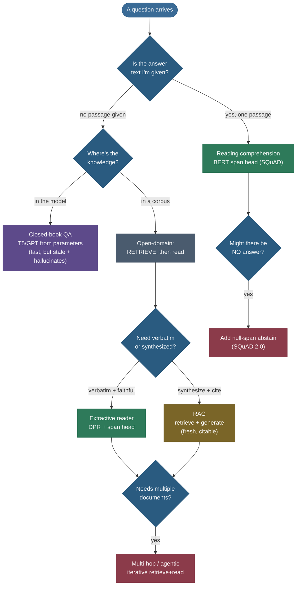

# Question Answering: from finding the span to grounding the answer

Ask a friend "When did Apollo 11 land on the Moon?" and three completely different things can happen depending on what they have in front of them. If they're holding a paragraph that *mentions* the landing, they'll scan it and **point at the words** — "right here: *July 20, 1969*." If they remember it from school, they'll just **say it from memory**. And if they have a library but no idea which book, they'll **go find the right page first, then read you the answer**. Those three reflexes — point at a span, recall from memory, retrieve-then-read — are *exactly* the three families of machine Question Answering, and almost every QA system you'll ever meet is one of them (or a blend).

QA is where representation learning stops being abstract and starts being *useful*: it's the task that turns "the model understands language" into "the model answered my question." It is also one of the most-asked NLP interview topics, because a single question — *"how would you build a QA system?"* — forces you to reason about reading comprehension, retrieval, generation, hallucination, and evaluation all at once. I'm going to walk it the way I'd teach a strong teammate from scratch: first the **problem** and its surprising number of shapes, then **extractive reading comprehension** (the SQuAD span head, derived from the logits up), then **abstaining** when there's no answer (SQuAD 2.0), then **open-domain** retrieve-then-read and **RAG**, then **closed-book** and **multi-hop** and **conversational** QA, then how we **score** any of it (EM/F1 and why generative answers break that), and finally **modern LLM QA** and its failure modes. By the end you'll be able to:

- name **what kind of QA** a problem is (by answer type *and* knowledge source) and pick the architecture from that cell;
- **derive** the BERT start/end span head and **compute a prediction by hand** from logits;
- explain how a model **abstains** on an unanswerable question (the `[CLS]` null score), and why SQuAD 2.0 needed it;
- explain the **retriever–reader** pipeline and how **RAG** grounds a generator in retrieved evidence;
- **score** a predicted answer with **Exact Match** and **token-level F1** by hand, and say why generative QA breaks both;
- reason about **modern LLM QA** — in-context, long-context, tool-use — and its failure modes (hallucination, lost-in-the-middle).

> **Note:** several pieces of this page are *deliberately* short because they each have their own deep page. The **encoder** QA fine-tunes on top of lives in [Contextual Embeddings (ELMo/BERT)](06-Contextual-Embeddings-ELMo-BERT.md); the **retriever** half (BM25, DPR, dense vs lexical, ANN indexes) lives in [Information Retrieval & Semantic Search](16-Information-Retrieval-and-Semantic-Search.md); the **scoring** primitives live in [NLP Evaluation Metrics](18-NLP-Evaluation-Metrics.md); the **generator** backbone lives in [Seq2Seq & Encoder–Decoder](08-Sequence-to-Sequence-and-Encoder-Decoder.md). This page is the **QA-specific glue** that ties them together — it points at those rather than re-deriving them.

---

## The problem: answer a natural-language question

The task sounds trivial — *given a question, return its answer* — but it hides a pile of decisions. Consider three questions:

- *"When did Apollo 11 land on the Moon?"* — a **factoid**: one short, factual answer.
- *"What does the passage say caused the 1929 crash, and how did the author feel about it?"* — a **reading-comprehension** question whose answer lives in a specific text.
- *"Earlier you mentioned the second mission — who commanded **it**?"* — a **conversational** follow-up whose meaning depends on the dialogue so far (note the dangling pronoun *it*).

To turn any of these into a concrete machine-learning problem you must answer **two orthogonal questions**, and the cross-product of the two is the entire design space:

1. **What shape is the answer?** A **span** copied verbatim from some text (*extractive*)? Freely **generated** words (*abstractive*)? A **choice** among options (*multiple-choice*)? A **yes/no** (*boolean*)?
2. **Where does the knowledge come from?** A **single given passage** (*reading comprehension*)? The model's own **parameters** (*closed-book*)? A **large corpus** the system must search (*open-domain*)?


> **Tip:** in an interview, *always classify the question first.* "Is this extractive or generative? Reading-comprehension, closed-book, or open-domain?" pins down the architecture immediately — span head vs seq2seq, retriever-or-not — and shows the interviewer you see the whole map, not one model. The grid above *is* the answer to "how would you approach QA?"

The two axes really are independent. **Extractive open-domain** (DPR + a span reader) and **abstractive open-domain** (RAG) differ only in the *reader*; **extractive reading-comprehension** (plain SQuAD) and **extractive open-domain** differ only in whether a retriever sits in front. That modularity is why it pays to learn the pieces — span head, retriever, generator, scorer — once, then snap them together per cell.

---

## Family 1: extractive reading comprehension

The cleanest, most-studied corner of the grid is **extractive reading comprehension**: you're handed a **question** and a **passage that contains the answer**, and you must return the **shortest span of the passage** that answers it. No generation, no retrieval — just *point at the right words*. This is the **SQuAD** setup, and it's where modern QA was effectively solved, so it's worth getting exactly right.

> **Note:** **SQuAD** (Stanford Question Answering Dataset; [Rajpurkar et al. 2016](https://arxiv.org/abs/1606.05250)) is 100k+ crowd-written questions over Wikipedia paragraphs, where **every answer is a contiguous span of its paragraph**. Because the answer is always a substring, the model never has to *generate* — it only has to **locate**. That single design choice is what makes the task a clean, learnable pointing problem.

### The intuition: two pointers, not a vocabulary

Here's the move that makes extractive QA elegant. A generative model would have to choose the answer out of a 30,000-word vocabulary at every position — hard. But if the answer is *guaranteed to be a span of the passage*, you don't need a vocabulary at all. You only need to choose **two positions**: where the answer **starts** and where it **ends**. The answer is then just `passage[start : end+1]`. You've turned an open-ended generation problem into **two classification problems over passage positions** — and classification over a few hundred positions is far easier than generation over tens of thousands of words.

> **Tip:** this is the whole trick of extractive QA in one sentence: *"don't generate the answer — point at where it begins and where it ends."* Two softmaxes over the passage, and you're done.

### How BERT reads: one sequence, two segments

To use [BERT](06-Contextual-Embeddings-ELMo-BERT.md), we pack the question and passage into **one** input sequence, separated so the model knows which is which:

```
[CLS]  question tokens …  [SEP]  passage tokens …  [SEP]
```

BERT runs full **bidirectional** self-attention over the whole thing, so every passage token's final hidden vector $h_i \in \mathbb{R}^{d}$ is computed *with the question in view* — the representation of "1969" already "knows" you asked *when*. That question-aware contextualization is the entire reason a pretrained encoder is so good here; the span head on top is almost trivial by comparison.

> **Note:** the `[CLS]` token (position 0) and the segment structure aren't decoration — `[CLS]` becomes the **no-answer** signal in SQuAD 2.0 (below), and the `[SEP]` boundary is how the model knows to only emit spans from the *passage* segment, never the question.

### Deriving the span head from scratch

Now the model itself. We learn exactly **two new vectors** — a **start vector** $\mathbf{S} \in \mathbb{R}^{d}$ and an **end vector** $\mathbf{E} \in \mathbb{R}^{d}$ — and *that is the entire QA-specific parameter set added on top of BERT*. For every passage token $i$ with hidden state $h_i$, the **start score** and **end score** are simple dot products:

$$
\text{start\_logit}_i = \mathbf{S} \cdot h_i, \qquad \text{end\_logit}_i = \mathbf{E} \cdot h_i.
$$

Read that geometrically: $\mathbf{S}$ is a learned direction in embedding space that means *"I am the first word of an answer,"* and we score each token by **how much it points that way**. Same for $\mathbf{E}$ and *"I am the last word of an answer."* We then turn the scores into probability distributions over passage positions with a softmax:

$$
P_{\text{start}}(i) = \frac{e^{\mathbf{S}\cdot h_i}}{\sum_{k} e^{\mathbf{S}\cdot h_k}}, \qquad
P_{\text{end}}(j) = \frac{e^{\mathbf{E}\cdot h_j}}{\sum_{k} e^{\mathbf{E}\cdot h_k}}.
$$

To **predict**, we choose the span $(i, j)$ that maximizes the joint score, subject to $j \ge i$ (the end can't come before the start) and a small max-length cap:

$$
(\hat i, \hat j) = \operatorname*{arg\,max}_{\,j \ge i,\; j-i < L_{\max}} \; \big(\mathbf{S}\cdot h_i + \mathbf{E}\cdot h_j\big).
$$

> **Note:** we maximize the **sum of logits** $\mathbf{S}\cdot h_i + \mathbf{E}\cdot h_j$, which is equivalent to maximizing the **product of probabilities** $P_{\text{start}}(i)\cdot P_{\text{end}}(j)$ because the two softmax denominators are constants for a given passage and $\log(ab) = \log a + \log b$. Working in logits avoids underflow and is what every implementation actually does.

> **Gotcha:** the $j \ge i$ constraint is **not optional**. The start and end heads are independent softmaxes — nothing stops `argmax(start)` from landing *after* `argmax(end)`, which would describe a negative-length span. The decode must enumerate valid $(i,j)$ pairs (typically the top-$k$ starts × top-$k$ ends, filtered to $j \ge i$ and $j-i < L_{\max}$), not just take the two independent argmaxes.

### Training the span head

Training is plain **cross-entropy on positions**. SQuAD gives you the gold start index $i^{*}$ and gold end index $j^{*}$; the loss is the sum of two negative log-likelihoods:

$$
\mathcal{L} = -\tfrac{1}{2}\Big(\log P_{\text{start}}(i^{*}) + \log P_{\text{end}}(j^{*})\Big).
$$

You backprop through $\mathbf{S}$, $\mathbf{E}$, **and** all of BERT (full fine-tuning), and that's it — a couple of epochs over SQuAD turns a pretrained encoder into a strong reading-comprehension model. Devlin et al.'s [BERT paper](https://arxiv.org/abs/1810.04805) reported this exact recipe beating the prior state of the art and approaching human performance on SQuAD 1.1.

> **Tip:** because the only new weights are two $d$-dimensional vectors, the span head is **tiny** — the heavy lifting is all in the pretrained encoder. This is the textbook example of "pretrain a general encoder, bolt on a task-specific head, fine-tune end-to-end."

### Seeing the head on a real passage

Here's the span head as it *actually* behaves, measured from a real fine-tuned model (`distilbert-base-cased-distilled-squad`) on the question *"Where is the Eiffel Tower located?"*:


Notice how *peaked* the distributions are: the start head dumps its mass on **Champ** and the end head on **France**, so $\arg\max P_{\text{start}}\cdot P_{\text{end}}$ cleanly selects the span **"Champ de Mars in Paris, France."** That confident, bimodal shape — one sharp green peak, one sharp red peak — is what a well-trained span head looks like.

---

## Worked example 1: predict a span by hand from logits

Let's do the decode arithmetic ourselves so the formula is concrete. Take a tiny passage tokenized as **[The, capital, of, France, is, Paris, .]** (positions 0–6) and the question *"What is the capital of France?"* Suppose BERT produced these start and end logits over the 7 passage positions:

| position $i$ | token   | $\mathbf{S}\cdot h_i$ (start) | $\mathbf{E}\cdot h_i$ (end) |
|:---:|:---|:---:|:---:|
| 0 | The     | −2.0 | −3.0 |
| 1 | capital | −1.0 | −2.5 |
| 2 | of      | −3.0 | −3.0 |
| 3 | France  | −0.5 | −1.0 |
| 4 | is      | −2.0 | −2.0 |
| 5 | Paris   | **4.0** | **4.5** |
| 6 | .       | −1.0 | −0.5 |

**Step 1 — find the best valid span.** Enumerate $(i,j)$ with $j \ge i$ and score $= \text{start}_i + \text{end}_j$. The start head's max is position 5 (4.0) and the end head's max is also position 5 (4.5), and $5 \ge 5$ is valid, so the top span is $(5,5)$ with score $4.0 + 4.5 = 8.5$. The next best valid span, $(5,6)$ ("Paris ."), scores $4.0 + (-0.5) = 3.5$ — far lower. So the prediction is the single-token span **"Paris."**

**Step 2 — turn logits into a confidence.** Softmax the start logits. The dominant term is $e^{4.0}\approx 54.6$ against a sum of roughly $e^{-2}+e^{-1}+e^{-3}+e^{-0.5}+e^{-2}+e^{4}+e^{-1}\approx 0.14+0.37+0.05+0.61+0.14+54.6+0.37 \approx 56.3$, so $P_{\text{start}}(5)\approx 54.6/56.3 \approx \mathbf{0.97}$. The end head is similarly peaked, $P_{\text{end}}(5)\approx 0.97$, giving a joint span probability $\approx 0.94$. **High confidence, correct span.**

> **Note:** this is *exactly* what the measured Eiffel-Tower chart above shows numerically — one sharp start peak, one sharp end peak, and the argmax-pair decode lands on the right span. The hand example just lets you see the softmax produce the ~0.97 confidence the bars depict.

> **Gotcha:** had the end head instead peaked at position 3 ("France", before "Paris"), the *naive* two-argmax decode would return the invalid span "France … Paris" running backwards. The $j \ge i$ filter forces the decoder to instead pick the best *valid* pair — this is why production code enumerates pairs rather than taking independent argmaxes.

---

## Worked example 2: a measured extractive QA over a real passage

Now the real thing end to end. Running the derived decode (best valid $(i,j)$ over the context tokens, $L_{\max}=30$) with `distilbert-base-cased-distilled-squad` on the Apollo passage:

> *Passage:* "The Apollo 11 mission landed the first humans on the Moon on July 20, 1969. Neil Armstrong and Buzz Aldrin walked on the lunar surface while Michael Collins orbited above."

| question | predicted span | span score | null (`[CLS]`) score |
|:---|:---|:---:|:---:|
| Who were the first humans to walk on the Moon? | **Neil Armstrong and Buzz Aldrin** | 17.99 | −7.65 |
| When did Apollo 11 land on the Moon?           | **July 20, 1969**                  | 23.74 | −2.26 |
| Who stayed in orbit during Apollo 11?          | **Michael Collins**                | 20.05 | −5.26 |

All three correct, all three with a large positive span score and a deeply negative null score (we'll use that null score next). Notice the third question requires the model to resolve "stayed in orbit" → "orbited above" → **Michael Collins** — a small piece of reasoning, not a keyword match. That's the contextualized encoder earning its keep. The runnable code for this is in the **Code** section below.

---

## Family 1b: when there is no answer — SQuAD 2.0

SQuAD 1.1 has a hidden cheat: **every question is answerable**, so a model can guess a plausible-looking span and often be right by luck. Real systems face questions whose answer *isn't in the passage at all*, and a model that always returns its best guess will **confidently hallucinate**. [SQuAD 2.0](https://arxiv.org/abs/1806.03822) (Rajpurkar et al. 2018) fixed this by adding **50k+ unanswerable questions** that look answerable — the right response is to **abstain**.

### Deriving the abstain mechanism

The elegant part is that abstaining needs **no new architecture** — it reuses the `[CLS]` token at position 0. Define a **null span** as "the answer is the `[CLS]` token," with score

$$
s_{\text{null}} = \mathbf{S}\cdot h_{\text{[CLS]}} + \mathbf{E}\cdot h_{\text{[CLS]}}.
$$

Let $s_{\text{best}}$ be the score of the best *real* span found by the usual decode. The decision rule is a comparison (often with a tuned threshold $\tau$):

$$
\text{answer} =
\begin{cases}
\text{best span} & \text{if } s_{\text{best}} - s_{\text{null}} > \tau \\[2pt]
\text{abstain (no answer)} & \text{otherwise.}
\end{cases}
$$

Training labels unanswerable examples with **start = end = `[CLS]` position**, so the model *learns* to put its mass on `[CLS]` when nothing in the passage answers the question. At inference you compare the best span against the null span and abstain if the span isn't enough better.

### Worked example 3: abstaining, measured

Here's the rule firing on a model trained for it (`deepset/roberta-base-squad2`), same Apollo passage:

| question | best span | span score $s_{\text{best}}$ | null score $s_{\text{null}}$ | decision |
|:---|:---|:---:|:---:|:---:|
| What is the **diameter** of the Moon? | "lunar surface" | −6.59 | **1.04** | $s_{\text{null}} > s_{\text{best}}$ → **abstain** ✓ |
| Who were the first humans to walk on the Moon? | "Neil Armstrong and Buzz Aldrin" | **16.64** | 4.81 | $s_{\text{best}} > s_{\text{null}}$ → **answer** ✓ |

The passage never gives the Moon's diameter, so the best span the model can scrape together ("lunar surface") scores a measly −6.59, *below* the null score of 1.04 — so the model **correctly says "no answer."** For the answerable question the real span scores 16.64, crushing the null, so it answers. Same model, same decode, one comparison decides between answering and abstaining.

> **Gotcha:** contrast this with a **SQuAD 1.1 model** on the same unanswerable question. A v1 model has no null option and *must* return its best span — on this passage it confidently coughs up "Apollo 11 mission landed the first humans on the Moon on July 20, 1969," a fluent, plausible, **completely wrong** answer. That failure mode — *can't say "I don't know"* — is precisely the bug SQuAD 2.0 was built to expose, and it's the ancestor of LLM hallucination.

> **Tip:** the threshold $\tau$ is a **precision/recall knob**. Raise it and the model abstains more (fewer wrong answers, but it stays silent on some answerable questions); lower it and it answers more (catches more, but hallucinates more). In a production QA bot, $\tau$ is what you tune to hit your "wrong-answer rate" budget.

---

## Family 2: open-domain QA — retrieve, then read

Reading comprehension assumes someone *hands you the passage*. Real questions don't come with a passage — *"Who painted the Mona Lisa?"* expects the system to **find** the relevant text in a huge corpus (all of Wikipedia, the whole web, your company's docs) and *then* answer. That's **open-domain QA**, and the dominant design is two stages — **retrieve, then read**:


1. **Retriever** — given the question, pull the top-$k$ most relevant passages from the corpus. This is an **information-retrieval** problem in its own right; see [Information Retrieval & Semantic Search](16-Information-Retrieval-and-Semantic-Search.md) for BM25, dense retrieval, ANN indexes, and reranking.
2. **Reader** — run an **extractive span head** (or a generator) over the retrieved passages and return the best answer, ideally with a pointer back to the source passage as a **citation**.

> **Note:** **DrQA** ([Chen et al. 2017](https://arxiv.org/abs/1704.00051)) was the landmark first version: a **TF-IDF/bigram bag-of-words retriever** over Wikipedia feeding a neural span **reader**. It established the retrieve-then-read template that every open-domain system since has refined. Its weakness was the retriever — lexical overlap misses paraphrases ("car" ≠ "automobile").

> **Note:** **DPR** (Dense Passage Retrieval; [Karpukhin et al. 2020](https://arxiv.org/abs/2004.04906)) replaced the lexical retriever with a **dense bi-encoder**: a question encoder and a passage encoder trained so a question's vector lands near its answer-bearing passages, retrieved by **maximum inner-product search** over a FAISS index. By matching *meaning* rather than surface words, DPR sharply raised retrieval recall — and thus end-to-end QA accuracy. The full dense-retrieval machinery (bi-encoder vs cross-encoder, ANN) is in the [IR page](16-Information-Retrieval-and-Semantic-Search.md).

> **Gotcha:** open-domain accuracy is **bottlenecked by the retriever**. If the answer-bearing passage isn't in the top-$k$, the reader **cannot** recover it — a perfect reader scores zero on a question whose evidence was never retrieved. This is why so much open-domain QA research is really *retrieval* research, and why "retriever recall@k" is the metric to watch.

### A worked retrieve-then-read trace

Make it concrete with *"Who painted the Mona Lisa?"* against a Wikipedia corpus, $k=3$:

1. **Embed the question** (DPR question encoder) → a vector $q$. **Search** the FAISS index of passage vectors for the 3 nearest. Suppose they come back as: (a) the *Mona Lisa* article's lead paragraph ("…a half-length portrait painting by Italian artist **Leonardo da Vinci**…"), (b) a paragraph about the Louvre, (c) a paragraph about Renaissance portraiture. Passage (a) contains the answer — **recall@3 = hit.**
2. **Read.** Concatenate the question with each retrieved passage and run the **span head** on each. On passage (a), the start head peaks on "Leonardo" and the end head on "Vinci" with a high span score (say 14.2); on passages (b) and (c) the best spans score far lower (the answer isn't there). Take the **global argmax across passages**.
3. **Answer + cite.** Return **"Leonardo da Vinci"**, tagged with its source passage (a) as the citation.

Two failure points are now visible. If step 1 had ranked passage (a) *fourth*, it would fall outside $k=3$ and the system would answer wrongly from (b)/(c) — a **retrieval miss**, unrecoverable by any reader. And if two passages each contain a plausible-but-different answer, the cross-passage argmax has to arbitrate — which is why production readers normalize span scores across passages rather than trusting each in isolation.

> **Tip:** the *"global argmax across passages"* in step 2 is the piece beginners forget. A reader scores spans **per passage**; the system must then compare those scores **across** passages on one scale to pick the final answer. Mismatched score scales between passages are a classic open-domain bug — fix it by sharing the reader and comparing raw span scores, not per-passage softmaxes.

---

## Family 3: multiple-choice and yes/no QA

The two remaining answer shapes — **multiple-choice** and **boolean** — turn QA into **classification** rather than span-pointing, and they're worth a moment because they show up constantly (and in interviews).

**Multiple-choice** (benchmarks like **RACE**, **ARC**, **MMLU**): given a question and $n$ candidate answers, pick the best. The standard encoder recipe is to form $n$ inputs — `[CLS] question + option_i [SEP] passage [SEP]` — score each with a single logit head, and **softmax over the $n$ options**. You're classifying *which option*, not locating a span. With LLMs the modern version is even simpler: put the options in the prompt and read off the model's probability for each option letter, or just let it generate the letter.

**Yes/No (boolean)** QA (**BoolQ**): the answer is a single bit — does the passage support a *yes* or a *no*? This is a **binary classification** off the `[CLS]` representation, structurally identical to sentiment classification (see [Text Classification & Sentiment Analysis](10-Text-Classification-and-Sentiment-Analysis.md)), just with a question + passage input instead of one sentence.

> **Note:** multiple-choice QA quietly dodges the **generation evaluation problem** — because the answer is one of $n$ fixed options, scoring is plain accuracy, no EM/F1/LLM-judge needed. That's exactly why benchmarks like **MMLU** are multiple-choice: it makes large-scale, unambiguous automatic grading of knowledge possible. The cost is that real questions rarely come with four neat options.

---

## Family 4: closed-book QA — the knowledge is in the weights

What if you delete the corpus *and* the passage and just ask the model? A large pretrained model like **T5** or **GPT** has read so much text during pretraining that a surprising amount of world knowledge is **baked into its parameters** — it can often answer factoid questions with no retrieval at all. This is **closed-book QA**: the model is the knowledge base.

[Roberts et al. (2020)](https://arxiv.org/abs/2002.08910) showed T5 fine-tuned to answer questions *from its weights alone* is competitive with some open-book systems on factoid benchmarks — the model has effectively **memorized facts** during pretraining and learned to surface them on demand, and *larger* models memorize *more* (closed-book accuracy rose steadily from T5-Base to T5-11B, because more parameters store more facts).

The mechanism is worth picturing. During pretraining the model sees *"The Mona Lisa was painted by Leonardo da Vinci"* thousands of times across the corpus; gradient descent nudges its weights so that, prompted with *"Who painted the Mona Lisa?"*, the most probable continuation is *"Leonardo da Vinci."* No lookup happens — the fact is **distributed across millions of weights**, reconstructed by the forward pass. That's powerful (instant, no index) and fragile (a rarely-seen fact may not have been stored, and the model can't tell you *whether* it was).

> **Tip:** closed-book is the **simplest** pipeline (no retriever, no index — just `model(question) → answer`) and the **fastest at serving time**, but it has three hard limits: it **can't cite** a source, its knowledge is **frozen** at the training cutoff (ask about last week and it can't know), and it **hallucinates** when the fact isn't actually in its weights — it generates something plausible-sounding regardless. Those three weaknesses are precisely what RAG was designed to fix.

> **Gotcha:** "the model knew the answer" and "the model guessed something fluent" are **indistinguishable from the output alone** in closed-book QA — both are confident, well-formed text. Without a source to check against, you cannot tell a recalled fact from a hallucination. That epistemic blind spot is the core argument for grounding answers in retrieved evidence.

---

## Family 5: RAG — retrieval-augmented generation

**RAG** ([Lewis et al. 2020](https://arxiv.org/abs/2005.11401)) is the open-domain pipeline with a **generator** as the reader instead of a span head. Retrieve the top-$k$ passages (as in DPR), then **condition a seq2seq generator** on the question *plus* those passages, and let it **write** the answer. It's the abstractive × open-domain cell of the grid.

The reason RAG dominates modern QA is that it gets the best of both worlds — and directly fixes closed-book's three weaknesses:

- **Less hallucination.** The generator is conditioned on real retrieved text, so it's anchored to evidence rather than free-associating from parameters. (It still *can* hallucinate — grounding reduces it, doesn't eliminate it.)
- **Citations.** Because the answer came from specific retrieved passages, you can **show the source** — essential for trust, fact-checking, and any application where "says who?" matters.
- **Fresh, swappable knowledge.** Update the **corpus**, not the weights — index this morning's news and the system can answer about it *with no retraining*. Closed-book can't do this at all.

> **Note:** RAG and **extractive** open-domain QA share the same front half (a retriever feeding a reader); they differ only in the reader — **extract a span** (verbatim, faithful, can't paraphrase) vs **generate** (fluent, can synthesize across passages, can drift). Extractive is safer when faithfulness is paramount; generative is better when the answer must combine or rephrase evidence. Many production systems run both and pick per query.

> **Tip:** the modern "chat with your documents" / enterprise-search product is, under the hood, almost always RAG: embed the docs into a vector index ([dense retrieval](16-Information-Retrieval-and-Semantic-Search.md)), retrieve per question, stuff the passages into an LLM's context with the question, and let it answer **with citations**. The deeper conceptual treatment is on the [Retrieval-Augmented Generation intuition page](../../../AI-ML-intuition/Module_8_LLMs_and_Agentic_Systems/8.02_Retrieval_Augmented_Generation.md).

---

## Multi-hop QA: chaining facts across documents

Some questions can't be answered from any single passage — you must **combine facts**. *"Which mission's command module pilot was born in Rome, Italy?"* requires finding the pilot (one document) **and** their birthplace (another) and **joining** them. That's **multi-hop reasoning**.

[HotpotQA](https://arxiv.org/abs/1809.09600) (Yang et al. 2018) is the benchmark: questions that explicitly require reasoning over **two or more** Wikipedia paragraphs, with annotated **supporting facts** so a system is graded not just on the answer but on whether it used the *right* evidence chain.

Trace the example. Hop 1: search *"Apollo 11 command module pilot"* → retrieve the Apollo 11 article → read out **"Michael Collins."** That fact wasn't in the original question, so hop 2 must **reformulate the query** using it: search *"Michael Collins astronaut birthplace"* → retrieve his biography → read **"born in Rome, Italy."** Now join: the question asked for the *mission*, so the answer is **Apollo 11.** Two retrievals, each query shaped by the previous read — that's the multi-hop loop.

> **Gotcha:** multi-hop breaks naive single-shot retrieve-then-read: the second hop's evidence is often **invisible to the first query** (you don't know to search for "Michael Collins birthplace" until you've already found his name). Real multi-hop systems do **iterative retrieval** — retrieve, read, *reformulate the query from what you learned*, retrieve again. This iterate-retrieve loop is the direct ancestor of modern **agentic / tool-using** QA, where an LLM decides what to search next.

> **Tip:** the **error compounds** across hops. If each retrieval step is 90% likely to surface the right evidence, a clean two-hop chain succeeds only $0.9 \times 0.9 \approx 81\%$ of the time, and three hops drop to ~73% — *before* any reader error. This multiplicative decay is why multi-hop QA is hard and why systems invest in high-recall retrieval and the ability to **backtrack** when a hop turns up nothing useful.

---

## Conversational QA: questions in context

Real QA is rarely one-shot — it's a **conversation**, and follow-up questions lean on everything said before. **CoQA** ([Reddy et al. 2019](https://arxiv.org/abs/1808.07042)) and **QuAC** (Question Answering in Context) are the benchmarks: a dialogue of questions over a passage where later questions contain **coreference** ("who commanded **it**?") and **ellipsis** ("and **the third**?") that only resolve given the history.

The standard trick is to **fold the conversation history into the input** — prepend prior Q/A turns (or a rewritten, *de-contextualized* version of the current question) so the same span/generate machinery sees the full context. Resolving those dangling pronouns is itself a deep problem; see [Coreference Resolution](14-Coreference-Resolution.md).

> **Note:** **KBQA** (knowledge-base QA) is a different beast worth a one-liner: instead of reading text, it **translates the question into a structured query** (e.g. SPARQL over Wikidata) — *semantic parsing* — and executes it against a knowledge graph. It's precise and citable for questions a KB covers (*"How tall is the Eiffel Tower?"* → a database lookup), but limited to what's been structured into the graph. Modern LLM "tool use" generalizes this: the model writes a query/API call and runs it.

---

## Evaluation: Exact Match and token-level F1

How do you *score* a QA answer? For **extractive** SQuAD-style QA there are two standard metrics, and SQuAD reports **both** because each alone is misleading. Both first **normalize** the prediction and gold answer — lowercase, strip punctuation, drop the articles *a/an/the*, collapse whitespace — so trivial differences don't count.

**Exact Match (EM)** is all-or-nothing: 1 if the normalized prediction *equals* the normalized gold answer, else 0. **Token-level F1** gives **partial credit** by treating each answer as a **bag of tokens** and computing the overlap. With the predicted tokens $P$ and gold tokens $G$, and $n_{\text{same}} = $ the number of shared tokens (counting multiplicity):

$$
\text{precision} = \frac{n_{\text{same}}}{|P|}, \qquad
\text{recall} = \frac{n_{\text{same}}}{|G|}, \qquad
F_1 = \frac{2 \cdot \text{precision} \cdot \text{recall}}{\text{precision} + \text{recall}}.
$$

> **Note:** when a SQuAD question has **multiple gold answers** (annotators don't always agree), the score is the **max** over golds — you get credit for matching *any* acceptable answer. The full metric machinery (EM/F1 internals, BLEU/ROUGE for generation) lives on the [NLP Evaluation Metrics page](18-NLP-Evaluation-Metrics.md); here we only need them to score *answers*.

### Worked example 4: EM and F1 by hand

Take prediction **"Paris, France"** vs gold **"Paris"**.

**Step 1 — normalize.** Lowercasing and stripping the comma: prediction → tokens `["paris", "france"]`; gold → `["paris"]`.
**Step 2 — EM.** `["paris","france"] != ["paris"]` → **EM = 0**. (The extra word kills an exact match entirely — EM is brutal.)
**Step 3 — F1.** Shared tokens: just `"paris"`, so $n_{\text{same}} = 1$. Precision $= 1/2 = 0.5$ (the prediction has 2 tokens, 1 right), recall $= 1/1 = 1.0$ (it found the only gold token). $F_1 = 2(0.5)(1.0)/(0.5+1.0) = 1.0/1.5 = \mathbf{0.667}$.

So EM says "wrong" (0) but F1 says "two-thirds right" (0.667) — and the second is clearly the fairer verdict. Here are five measured pairs (computed by the SQuAD scorer in `gen_qa_diagrams.py`):


| prediction | gold | EM | F1 | why |
|:---|:---|:---:|:---:|:---|
| "Paris, France" | "Paris" | 0 | 0.67 | extra correct token, no exact match |
| "the Champ de Mars" | "Champ de Mars" | **1** | 1.00 | the article "the" is normalized away |
| "Leonardo da Vinci" | "Leonardo da Vinci" | 1 | 1.00 | identical |
| "1889" | "in 1889" | 0 | 0.67 | missing a token |
| "London" | "Paris" | 0 | 0.00 | no token overlap |

> **Tip:** the *"the Champ de Mars"* row is the one to remember: **normalization** (dropping *a/an/the* and punctuation) is why it scores a perfect EM=1 despite the literal strings differing. Forgetting normalization is the #1 reason a hand-computed SQuAD score disagrees with the official scorer.

### Why generative QA breaks EM/F1

EM and F1 assume the answer is a **short, canonical span**. They fall apart on **generative** answers, where a correct answer can be phrased a thousand ways: *"It was painted by Leonardo da Vinci"* vs gold *"Leonardo da Vinci"* shares only some tokens, so F1 unfairly punishes a perfectly correct, more verbose answer. Worse, EM is essentially always 0 for free-form text.

> **Gotcha:** this is the **open evaluation problem** of modern generative QA. Token-overlap metrics (EM/F1, and even BLEU/ROUGE) systematically under-credit correct-but-differently-worded answers and can over-credit fluent-but-wrong ones. The field has moved toward **model-based judging** — an **LLM-as-judge** scores whether the generated answer is *correct and grounded* given the question and evidence — and human eval for high-stakes settings. There is no clean closed-form metric for "is this generated answer right?", and that's a live research problem.

---

## Modern LLM QA: in-context, long-context, tool use

Today, much QA is *one prompt to an LLM*. Three patterns dominate, each mapping onto a family above:

- **In-context / few-shot QA.** Put the question (and optionally a few example Q/A pairs) in the prompt; the LLM answers from its parameters. This is **closed-book QA** with no fine-tuning — and inherits closed-book's hallucination and staleness.
- **Long-context "answer from the document."** Paste the whole document (or many retrieved passages) into the LLM's context window and ask. This is **reading comprehension** / RAG at scale — the dominant "chat with your PDF" pattern — leaning on long-context models that can hold tens of thousands of tokens.
- **Tool-use / agentic QA.** Let the LLM **decide** to call a retriever, a search API, a database, or a calculator, read the result, and answer — generalizing both RAG (retrieval as a tool) and multi-hop (iterate: search, read, search again). This is where the iterative-retrieval idea from multi-hop QA grows up.

> **Gotcha — hallucination.** An LLM answering closed-book (or with weak/irrelevant retrieval) produces **fluent, confident, sometimes wrong** answers — the SQuAD-1.1 "can't say I don't know" failure, scaled up. The mitigations are exactly the families above: **ground** the answer in retrieved evidence (RAG), **demand citations** so claims are checkable, and let the model **abstain** ("I don't know") when evidence is thin — the SQuAD-2.0 null-answer instinct, re-learned.

> **Gotcha — lost in the middle.** Long-context LLMs don't attend uniformly: [Liu et al. 2023](https://arxiv.org/abs/2307.03172) found accuracy is highest when the relevant passage sits at the **beginning or end** of the context and **sags in the middle** — a U-shaped curve. So "just paste everything in" is *not* free: a great retriever that ranks the answer-bearing passage **first** still matters even with a huge context window. Long context doesn't make retrieval obsolete; it makes *good ordering* matter.

> **Tip:** the through-line of this whole page: every modern QA trick is a re-invention of a classical idea. RAG = retrieve-then-read (DrQA) with a generative reader; tool-use QA = iterative multi-hop retrieval; "I don't know" = the SQuAD-2.0 null answer; citations = the supporting-facts supervision of HotpotQA. Knowing the lineage is what lets you reason about the new systems instead of memorizing them.

---

## Where QA shows up in production

It's worth grounding all this in the systems you actually use, because each maps cleanly onto a family above:

- **Web search "answer boxes."** When a search engine shows a direct snippet at the top of the results — *"the Eiffel Tower is 330 m tall"* — that's **open-domain extractive QA**: retrieve candidate pages, run a span reader, surface the best span with its source. The citation (the linked page) is non-negotiable here precisely because of the hallucination risk.
- **Enterprise / document search and support bots.** "Chat with your docs," internal knowledge-base assistants, and customer-support copilots are **RAG**: embed the corpus, retrieve per question, condition an LLM, answer **with citations** so an agent (or auditor) can verify. The whole value proposition — *grounded, current, attributable* — is the three RAG wins.
- **Voice assistants.** "When does the pharmacy close?" is a factoid that blends **closed-book** (the assistant's parametric knowledge for common facts) with **tool-use** (a live lookup for anything fresh or local) — the modern agentic blend.
- **Reading-comprehension features.** "Highlight the answer in this contract," "summarize what this clause says about liability" — **extractive reading comprehension** over a single given document, the cleanest SQuAD-shaped task.

> **Note:** notice that *every* production system above either **retrieves** or **abstains** (or both). The pure closed-book pattern — answer from weights, no source, no abstention — survives only where being occasionally-confidently-wrong is acceptable. For anything where a wrong answer has a cost, the design pressure is always toward **grounding** and **the ability to say "I don't know."** That's the single most important practical lesson of QA.

---

## Code: extractive QA and SQuAD scoring, verified

Two self-contained blocks, both verified on Python 3.12 (`torch` 2.12, `transformers` 5.10). The first runs the **derived span decode** on a real model; the second is the **SQuAD EM/F1 scorer** computing the worked-example numbers exactly.

```python
"""Extractive QA: the derived start/end span decode on a real SQuAD model.
Verified on Python 3.12 (torch 2.12, transformers 5.10), CPU."""
import warnings; warnings.filterwarnings("ignore")
import torch
from transformers import AutoTokenizer, AutoModelForQuestionAnswering

name = "distilbert-base-cased-distilled-squad"
tok = AutoTokenizer.from_pretrained(name)
model = AutoModelForQuestionAnswering.from_pretrained(name)

def answer(question, passage, l_max=30):
    inp = tok(question, passage, return_tensors="pt")
    with torch.no_grad():
        out = model(**inp)
    start, end = out.start_logits[0], out.end_logits[0]
    ids, seq = inp["input_ids"][0], inp.sequence_ids(0)   # seq==1 marks passage tokens
    n = len(ids)
    best = (-1e9, 0, 0)                                    # (score, i, j)
    for i in range(n):
        if seq[i] != 1:                                   # start must be in the passage
            continue
        for j in range(i, min(i + l_max, n)):             # enforce j >= i and the length cap
            if seq[j] != 1:
                continue
            s = start[i].item() + end[j].item()           # sum of logits = log P_start + log P_end + const
            if s > best[0]:
                best = (s, i, j)
    score, i, j = best
    return tok.decode(ids[i:j + 1]).strip(), score

passage = ("The Apollo 11 mission landed the first humans on the Moon on July 20, 1969. "
           "Neil Armstrong and Buzz Aldrin walked on the lunar surface while Michael Collins orbited above.")
for q in ["Who were the first humans to walk on the Moon?",
          "When did Apollo 11 land on the Moon?",
          "Who stayed in orbit during Apollo 11?"]:
    a, s = answer(q, passage)
    print(f"{a:35s}  (span score {s:5.2f})  <- {q}")
```

Output:

```
Neil Armstrong and Buzz Aldrin       (span score 17.99)  <- Who were the first humans to walk on the Moon?
July 20, 1969                        (span score 23.74)  <- When did Apollo 11 land on the Moon?
Michael Collins                      (span score 20.05)  <- Who stayed in orbit during Apollo 11?
```

All three correct — and the decode is *exactly* the $\arg\max_{j\ge i}(\mathbf{S}\cdot h_i + \mathbf{E}\cdot h_j)$ rule we derived, no library QA helper.

```python
"""SQuAD-style EM and token-level F1, from the definitions. Reproduces the worked example."""
import re, string

def normalize(s):                                  # lowercase, drop punctuation + articles, collapse ws
    s = s.lower()
    s = "".join(ch for ch in s if ch not in set(string.punctuation))
    s = re.sub(r"\b(a|an|the)\b", " ", s)
    return " ".join(s.split())

def em(pred, gold):
    return float(normalize(pred) == normalize(gold))

def f1(pred, gold):
    p, g = normalize(pred).split(), normalize(gold).split()
    if not p or not g:
        return float(p == g)
    same = sum(min(p.count(t), g.count(t)) for t in set(p) & set(g))   # shared tokens w/ multiplicity
    if same == 0:
        return 0.0
    prec, rec = same / len(p), same / len(g)
    return 2 * prec * rec / (prec + rec)

for pred, gold in [("Paris, France", "Paris"), ("the Champ de Mars", "Champ de Mars"),
                   ("Leonardo da Vinci", "Leonardo da Vinci"), ("1889", "in 1889"), ("London", "Paris")]:
    print(f"EM={em(pred, gold):.0f}  F1={f1(pred, gold):.3f}   {pred!r:20s} vs {gold!r}")
```

Output:

```
EM=0  F1=0.667   'Paris, France'      vs 'Paris'
EM=1  F1=1.000   'the Champ de Mars'  vs 'Champ de Mars'
EM=1  F1=1.000   'Leonardo da Vinci'  vs 'Leonardo da Vinci'
EM=0  F1=0.667   '1889'               vs 'in 1889'
EM=0  F1=0.000   'London'             vs 'Paris'
```

The numbers match Worked Example 4 exactly — including the *"the Champ de Mars"* row scoring a perfect EM=1 *because* normalization drops the article.

> **Tip:** to abstain (SQuAD 2.0 style), add the null span to the decode: compute $s_{\text{null}} = \text{start}_{\text{[CLS]}} + \text{end}_{\text{[CLS]}}$ (position 0) and return "no answer" when $s_{\text{best}} - s_{\text{null}} \le \tau$. Swap in a v2 model like `deepset/roberta-base-squad2` and you reproduce Worked Example 3.

---

## A decision guide: which QA system do I build?



Read it top-down: *is the answer in text I'm given?* splits reading-comprehension from the rest; *where's the knowledge?* splits closed-book from open-domain; *verbatim or synthesized?* splits an extractive reader from RAG; and the two red branches add the cross-cutting upgrades — **abstaining** (SQuAD 2.0) and **multi-hop/agentic** iteration. Every box is a family from this page.

---

## Recap and rapid-fire

**If you remember nothing else:** QA has two axes — **answer shape** (extractive span / abstractive / multiple-choice / yes-no) and **knowledge source** (reading-comprehension / closed-book / open-domain) — and the cell picks the architecture. Extractive QA turns answering into **pointing**: learn a start vector $\mathbf{S}$ and end vector $\mathbf{E}$, score each token by $\mathbf{S}\cdot h_i$ and $\mathbf{E}\cdot h_j$, softmax over passage positions, and return $\arg\max_{j\ge i}(\mathbf{S}\cdot h_i + \mathbf{E}\cdot h_j)$. Abstaining (SQuAD 2.0) compares the best span against the `[CLS]` **null span**. Open-domain QA is **retrieve-then-read** (DrQA → DPR); **RAG** swaps the reader for a generator to get fresh, citable, less-hallucinated answers. We score with **EM** (all-or-nothing) and **token-F1** (partial credit) — both of which break on generative answers, the open evaluation problem.

**Quick-fire — say these out loud:**

- *Extractive vs abstractive QA?* Extractive predicts a **span** of a passage (copy); abstractive **generates** the answer (can synthesize/rephrase).
- *Why predict start and end instead of generating?* The answer is guaranteed to be a span, so you only need **two position classifiers**, not a vocabulary.
- *The span head's parameters?* Two learned vectors, $\mathbf{S}$ and $\mathbf{E}$; logits are $\mathbf{S}\cdot h_i$ and $\mathbf{E}\cdot h_j$, softmaxed over positions.
- *Predicted span?* $\arg\max_{j\ge i,\,j-i<L}(\mathbf{S}\cdot h_i + \mathbf{E}\cdot h_j)$ — the **$j\ge i$** constraint is essential.
- *SQuAD 1.1 vs 2.0?* 2.0 adds **unanswerable** questions; the model must **abstain** via the `[CLS]` null-span score.
- *Reading-comp vs closed-book vs open-domain?* Answer from a **given passage** / from the **model's parameters** / from a **retrieved corpus**.
- *Retrieve-then-read?* Retriever (BM25/DPR) pulls top-$k$ passages; a reader (span head or RAG generator) answers from them.
- *Why RAG over closed-book?* **Fresh knowledge** (update the corpus, not the weights), **citations**, and **less hallucination** (grounded in evidence).
- *Multi-hop QA?* Answer needs facts from **multiple documents** (HotpotQA); naive single-shot retrieval misses the later hops.
- *EM vs F1?* EM = exact (after normalization); F1 = token-overlap **partial credit**; SQuAD reports both, max over gold answers.
- *Biggest modern failure modes?* **Hallucination** (confident-but-wrong, the SQuAD-1.1 disease) and **lost-in-the-middle** (long-context accuracy sags for mid-context evidence).

---

## References and further reading

The curated link library for this topic — videos, courses, articles, papers, books, and internal cross-links — lives in a companion file so it can be reused as a standalone reference list:

**→ [Question Answering — references and further reading](11-Question-Answering.references.md)**
