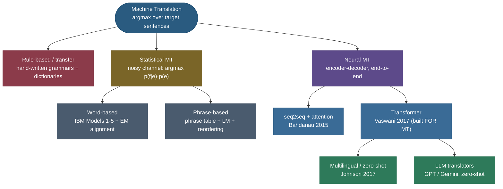

# Machine Translation: teaching a machine to say the same thing in another language

Take the French sentence *"Le chat noir dort sur le canapé."* and ask for its English. You and I answer instantly — *"The black cat is sleeping on the couch"* — but pause on what we just did. We didn't substitute word-for-word: *"noir"* (black) jumped *in front of* *"chat"* (cat) because English puts adjectives before nouns; *"dort"* (sleeps) became the progressive *"is sleeping"* because that reads more naturally; *"le canapé"* became *"the couch"*, choosing one of several valid English words. We **re-expressed the meaning** under a completely different grammar, word order, and vocabulary, while keeping what the sentence *says* intact. **Machine translation (MT)** is the decades-long project of getting a computer to do that — and it is, without exaggeration, the single problem that dragged modern NLP into existence. Sequence-to-sequence learning, attention, beam search, subword tokenization, BLEU — every one of them was invented or popularized *to make translation work*. The Transformer itself, the architecture under every LLM you use, was introduced in a paper titled *Attention Is All You Need* whose headline result was **a translation score**.

So this page is really two stories braided together: *how do you translate*, and *how did chasing that question build the field*. I'll walk it the way I'd teach it to someone who needs to discuss it cold in an interview — feel the problem first, then the four eras (rule-based → statistical → neural → LLM), deriving the load-bearing math (the noisy-channel model, IBM Model 1 alignment, the back-translation argument) rather than just naming it, with worked examples by hand and a **real measured NMT model** translating live. By the end you'll be able to:

- state **why translation is hard** — that it is a *search over an exponential space of target sentences*, not a lookup;
- derive the **noisy-channel** decomposition $\arg\max_e p(e\mid f) = \arg\max_e\, p(f\mid e)\,p(e)$ and explain why SMT split into a *translation model* and a *language model*;
- sketch how **IBM Model 1** learns word **alignments** as a latent variable via EM, by hand on a two-sentence corpus;
- explain why **neural MT** crushed statistical MT, and how subword tokenization, beam search, and attention each plug in (cross-linking the pages that derive them);
- argue from first principles **why back-translation works**, and how multilingual NMT gives **zero-shot** translation between pairs it never saw;
- name the live **challenges** (idioms, gender bias, hallucinated fluency, low-resource languages) and how MT is evaluated (BLEU, chrF, COMET, human eval).

> **Note:** MT is the *canonical* sequence-to-sequence task — variable-length input, variable-length output, no fixed alignment between them. Almost every technique you'll meet in summarization, dialogue, code generation, and speech recognition was either born in MT or validated on it first. Learning MT well is learning the spine of applied NLP.

---

## The problem: translation is a search, not a substitution

The naive mental model — *"look each word up in a bilingual dictionary and string the results together"* — fails immediately, and seeing exactly *how* it fails tells you what every real MT system must handle.

- **One-to-many and many-to-one.** French *"dort"* is English *"sleeps"* / *"is sleeping"* / *"is asleep"* depending on context; English *"the"* covers French *"le / la / les / l'"*. There is no function from word to word.
- **Reordering.** French puts many adjectives *after* the noun (*"chat noir"* = *"cat black"*); English puts them before (*"black cat"*). German pushes the verb to the end of subordinate clauses. Japanese is subject-object-**verb**. Word order is *grammar*, and it differs per language pair.
- **Fertility.** One source word can become several target words (German *"Geschwindigkeitsbegrenzung"* → *"speed limit"*) or zero (articles and particles that one language requires and another omits).
- **Ambiguity that only context resolves.** French *"avocat"* is both *"lawyer"* and *"avocado"*; *"bank"* in English is a riverbank or a financial institution. The right translation depends on the whole sentence, sometimes the whole document.

Put together, translating a sentence of length $n$ is **a search over an astronomically large space of candidate target sentences** — every choice of words, in every order, of every length. You are not retrieving an answer; you are *constructing* the single best-scoring sentence under some model of "good translation." That reframing — **MT as $\arg\max$ over target sentences** — is the thread that runs through all four eras. They differ only in *how they score a candidate translation* and *how they search*.

$$\hat{e} \;=\; \arg\max_{e}\; \text{score}(e \mid f)$$

where $f$ is the source ("foreign") sentence and $e$ is a candidate translation in the target language. Everything below is a different answer to *"what is `score`, and how do we find the maximizer?"*

> **Tip:** the notation $f$ (foreign) and $e$ (English) is a historical convention from the IBM statistical-MT papers, where the running example was French→English. It stuck. Even in neural papers you'll see $p(e\mid f)$ for "probability of the target given the source."



---

## The four eras at a glance

The whole history is a single trade being made, over and over: **push the linguistic knowledge out of human-written rules and into data + learned parameters.** Each era kept more fluency for less hand-engineering.


| Era | How it scores a translation | What a human had to build | Why it gave way |
|---|---|---|---|
| **Rule-based** (1950s–80s) | hand-written transfer rules + bilingual dictionaries | grammars, morphology, lexicons — per language **pair** | brittle, doesn't scale, every new pair is a project |
| **Statistical (SMT)** (1990–2014) | $p(f\mid e)\,p(e)$ learned from parallel corpora | feature engineering, alignment + phrase pipelines | many moving parts; fluency capped by n-gram LMs |
| **Neural (NMT)** (2014–2017) | one neural net $p(e\mid f)$, trained end-to-end | just the architecture + data | far more fluent; the Transformer made it dominant |
| **LLM translators** (2020+) | a general model, prompted to translate | a prompt | often matches dedicated NMT, zero-shot, style-controllable |

The rest of the page expands each row — with the math for SMT (the part interviewers love because it's *derivable*), and cross-links into the neural pages you've already met so we don't re-derive attention and the Transformer here.

---

## Era 1: rule-based MT — the machine as a grammar textbook

The first systems (famously the 1954 Georgetown–IBM demo that translated 60 Russian sentences and triggered a wave of over-optimism) were **rule-based**. A linguist encodes the source language's grammar, a bilingual dictionary, and **transfer rules** that map source structures to target structures: *"a French [noun] [adjective] becomes an English [adjective] [noun]."* The cleanest framing is the **Vauquois triangle** — you can translate at the shallow *direct* level (word substitution + local fixes), at the *transfer* level (parse the source, transform the parse, generate the target), or at the aspirational *interlingua* level (parse all the way to a language-neutral meaning representation, then generate any target from it).

It works for narrow, well-controlled domains (weather bulletins, equipment manuals) and gives you total control. But the cost is fatal: **every rule is hand-written, rules interact combinatorially, and every new language pair starts from zero.** Natural language has a long tail of exceptions, idioms, and ambiguities no finite rule set covers, so output is grammatically rigid and breaks on anything the linguists didn't anticipate.

> **Gotcha:** rule-based MT never fully died — it survives in hybrid systems and ultra-narrow domains where you need *guaranteed* terminology (legal, medical, aviation) and can't risk a learned model paraphrasing a critical term. But as a general approach it was overtaken because it scales with *human effort*, not with *data*.

---

## Era 2: statistical MT — let the parallel data speak

The breakthrough idea, from IBM's Candide project (Brown et al., 1990–1993), was to stop writing rules and instead **learn translation probabilities from a large parallel corpus** — millions of sentence pairs that are translations of each other (the Canadian Hansard parliamentary proceedings, in English and French, were the famous training set). SMT reframes translation as a **probabilistic inference** problem, and its formulation is worth deriving because it's a beautiful application of Bayes' rule and a very common interview question.

### The noisy-channel model (derived)

We want the most probable translation $\hat e$ of the source $f$:

$$\hat e \;=\; \arg\max_e\, p(e\mid f).$$

Apply **Bayes' rule** to $p(e\mid f)$:

$$p(e\mid f) \;=\; \frac{p(f\mid e)\,p(e)}{p(f)}.$$

Now the key move: we are maximizing over $e$, and the denominator $p(f)$ **does not depend on $e$** (the source sentence is fixed). So it's a constant in the $\arg\max$ and drops out:

$$\boxed{\;\hat e \;=\; \arg\max_e\; \underbrace{p(f\mid e)}_{\text{translation model}}\;\underbrace{p(e)}_{\text{language model}}\;}$$

This is the **noisy-channel** model, named by analogy to communication theory: imagine the target sentence $e$ was the "clean message," sent through a noisy channel that "corrupted" it into the foreign sentence $f$; translation is the job of *decoding* the original message. Why decompose like this instead of modeling $p(e\mid f)$ directly? Because it **splits the work into two models that are each easier to estimate**:

- The **translation model** $p(f\mid e)$ — *"does $e$ contain the right words to have produced $f$?"* — captures **adequacy** (faithfulness to meaning). It's learned from the parallel corpus and only has to get the *word correspondences* right; it can be sloppy about fluent ordering.
- The **language model** $p(e)$ — *"is $e$ a fluent sentence in the target language?"* — captures **fluency**. It's an n-gram (later neural) [language model](04-N-gram-Language-Models-and-Smoothing.md) trained on **monolingual** target text, of which there is *vastly* more than parallel text. This is the elegant part: it lets a system trained on limited parallel data still produce fluent output, because fluency is learned separately from oceans of cheap monolingual data.

> **Note:** that division of labor — adequacy from $p(f\mid e)$, fluency from $p(e)$ — is the conceptual ancestor of *everything* that came after. Even today people describe a translation as failing on **adequacy** (wrong meaning) or **fluency** (awkward language), and the two-model split is *why* those are the two axes.

### IBM Model 1: learning word alignments with EM

To estimate $p(f\mid e)$ we hit the central difficulty of word-based SMT: a parallel corpus gives you *sentence* pairs, but not which source word came from which target word. That hidden correspondence is the **alignment** $a$ — a latent variable. Model the translation probability by **summing over all possible alignments**:

$$p(f\mid e) \;=\; \sum_{a} p(f, a \mid e).$$

**IBM Model 1** makes the simplest possible assumptions to make this tractable: every alignment is *a priori* equally likely (no position/distortion modeling yet), and each foreign word $f_j$ is generated independently from the one English word $e_{a_j}$ it aligns to, using a **word-translation table** $t(f_j \mid e_{a_j})$. For a source of length $m$ and a target of length $l$ (plus a special NULL token for words that align to nothing):

$$p(f\mid e) \;=\; \frac{\epsilon}{(l+1)^{m}} \prod_{j=1}^{m} \sum_{i=0}^{l} t(f_j \mid e_i).$$

We don't know $t(\cdot\mid\cdot)$, and we can't count alignments directly because they're hidden — the classic chicken-and-egg of latent-variable learning. The answer is **Expectation–Maximization (EM)**:

1. **Initialize** $t(f\mid e)$ uniformly (every word equally likely to translate to every word).
2. **E-step.** With the current $t$, compute *soft* (probabilistic) alignment counts: for each sentence pair, how much "credit" does the link $(e_i, f_j)$ get? Under Model 1 that credit is the normalized $t$:
   $$ \text{count}(f_j, e_i) \mathrel{+}= \frac{t(f_j\mid e_i)}{\sum_{i'=0}^{l} t(f_j\mid e_{i'})}.$$
3. **M-step.** Renormalize those expected counts into a new $t(f\mid e)$.
4. **Repeat** until convergence. A famous property: **Model 1's objective is convex**, so EM converges to the global optimum regardless of initialization.

> **Worked example 1 — IBM Model 1 alignment by hand.** Take a tiny corpus of two sentence pairs:
> sentence A — `la maison` ↔ `the house`; sentence B — `la fleur` ↔ `the flower`.
> Initialize every $t(f\mid e)$ uniformly. After the **first EM iteration**, `la` appears with **both** `the house` and `the flower`, but `the` is the only English word it co-occurs with in *both* — so the soft counts pile probability mass onto $t(\text{la}\mid\text{the})$ across the two sentences, while $t(\text{la}\mid\text{house})$ and $t(\text{la}\mid\text{flower})$ get credit from only one sentence each and stay smaller. Meanwhile `maison` only ever appears with `the house`, so its mass splits between `the` and `house` — but `the` is "explained away" by `la`, so over iterations `maison` concentrates on `house`. **Co-occurrence statistics alone, iterated, discover that `la`→`the`, `maison`→`house`, `fleur`→`flower`** — with no dictionary and no human labels. That "explaining away" is the whole magic of EM alignment, and it's the intuition to *say out loud* in an interview, not the algebra. (The code at the bottom of this page runs exactly this EM loop and prints the table converging.)

Once you have alignments, the **alignment matrix** for a sentence pair is exactly the latent structure the model infers:


IBM Models 2–5 add the machinery Model 1 ignores: **Model 2** adds a *distortion* model (alignments near the diagonal are more likely); **Models 3–4** add **fertility** (how many foreign words one English word spawns) and richer distortion; **Model 5** fixes deficiency. You rarely need the details, but you should know the *arc*: each model relaxes an over-simplification of the previous one.

### Phrase-based MT: the workhorse that ran Google Translate for a decade

Word-based models translate one word at a time, which fumbles idioms and multi-word units. **Phrase-based SMT** (Koehn, Och & Marcu, 2003) — the dominant paradigm until ~2016 — translates **contiguous chunks of words ("phrases," not necessarily linguistic phrases)** as units. The pipeline:

1. **Word-align** the parallel corpus (using IBM-model alignments, run in both directions and symmetrized).
2. **Extract a phrase table** — every source phrase paired with every target phrase consistent with the alignments, each scored with translation probabilities in both directions.
3. **Decode** a new sentence by searching for the segmentation-into-phrases plus per-phrase translation plus **reordering** (a *distortion* penalty for moving phrases far from their source position) that maximizes a **log-linear** combination of features: the phrase-translation scores, a target **language model**, the distortion cost, and a word/phrase count penalty. Feature weights are tuned (MERT) on a dev set against BLEU.

> **Worked example 2 — phrase-table lookup and scoring.** Suppose the phrase table contains, for the French phrase `chat noir`, two English options with learned scores:
> `chat noir` → `black cat` with $p \approx 0.78$, and `chat noir` → `black tomcat` with $p \approx 0.05$.
> A decoder building the English sentence considers both. Even though `tomcat` is a valid translation of `chat`, the option `black cat` wins because (a) its **phrase-translation probability** is far higher and (b) the **language model** $p(e)$ scores *"the black cat sleeps"* as far more fluent than *"the black tomcat sleeps"* in general English. The final choice is the product of phrase score × LM score × (distortion, length) — exactly the log-linear $\text{score}(e\mid f)$ from the noisy-channel view. The phrase table handles *adequacy*; the language model handles *fluency*; the decoder *searches* their combination. That is SMT in one sentence.

> **Gotcha:** SMT worked — it powered Google Translate, Bing, and Moses (the open-source SMT toolkit) for years — but look at how many *separate, hand-assembled components* it needs: aligner, phrase extractor, reordering model, language model, tuning loop. Each is a research project; errors compound across the pipeline; and the n-gram language model caps fluency because it can only see a few words of context. This **complexity and brittleness** is precisely what neural MT swept away by replacing the whole pipeline with **one model trained end-to-end**.

---

## Era 3: neural MT — one network, end to end

Neural MT (NMT) throws out the pipeline. Instead of separately modeling $p(f\mid e)$, $p(e)$, alignment, and distortion, it trains **a single neural network to directly model $p(e\mid f)$** — the thing the noisy-channel model went out of its way to *avoid* modeling directly, now learnable because neural nets are powerful enough to capture both adequacy and fluency at once. The architecture is the **encoder–decoder (sequence-to-sequence)** model, which this platform derives in full elsewhere; here I'll connect the dots rather than re-derive.

- An **encoder** reads the source sentence and produces a contextual representation of it.
- A **decoder** generates the target sentence one token at a time, each token conditioned on the source representation *and* the tokens generated so far — i.e. it factorizes $p(e\mid f) = \prod_{t} p(e_t \mid e_{<t}, f)$ and is trained by **teacher forcing** (feed the true previous token) with cross-entropy loss.

→ For the full derivation of the encoder–decoder, the single-vector **information bottleneck**, and how **attention** removes it, see **[08 Sequence-to-Sequence & Encoder–Decoder](08-Sequence-to-Sequence-and-Encoder-Decoder.md)**.

### Why attention was the turning point (cross-link, not re-derive)

The first NMT models (Sutskever et al. 2014; Cho et al. 2014) crammed the *entire* source sentence into a **single fixed-length vector**, then decoded from it. This worked for short sentences and degraded badly on long ones — the vector is an information bottleneck. **Attention** (Bahdanau, Cho & Bengio, 2015) fixed this by letting the decoder, at each output step, **look back at all the encoder states and form a weighted average** focused on the relevant source words — *learning the alignment as a soft, differentiable byproduct of translation* rather than as a separate EM-trained model. (Recognize that? It's the same "which source word does this target word come from?" question IBM Model 1 answered with EM — attention answers it with gradient descent, jointly with everything else.)

→ The mechanics — scores, softmax weights, the context vector — are derived in **[05. Deep Learning · 15 Attention Mechanism](../../05.%20Deep_Learning/concepts/15-Attention-Mechanism.md)**.

### The Transformer: invented *for* translation

In 2017, *Attention Is All You Need* (Vaswani et al.) removed the recurrence entirely — no RNN, just stacked **self-attention** and feed-forward layers, with the decoder using **cross-attention** into the encoder. It trained faster (fully parallel over positions), modeled long-range dependencies better, and **set a new state of the art on English–German and English–French translation**. That paper is the origin of every modern LLM, and its benchmark was *translation*.

→ Full architecture in **[05. Deep Learning · 16 Transformer Architecture](../../05.%20Deep_Learning/concepts/16-Transformer-Architecture.md)**.


> **Note:** within two years (2014–2016) NMT went from a research curiosity to beating phrase-based SMT in production. Google's GNMT (Wu et al., 2016) reported reducing translation errors by **~60%** versus their phrase-based system on several language pairs. The reason isn't subtle: where SMT pieced together locally-scored phrases, NMT models the *whole* output sentence with full context, so it produces dramatically **more fluent** text. SMT's old failure mode — disfluent, choppy phrase salad — largely vanished.

### Three NMT ingredients that came from MT and now power all of NLP

NMT needs three supporting techniques. Each is derived in depth on its own page — know *why MT needs it*:

- **Subword tokenization (BPE / SentencePiece).** A fixed word vocabulary can't cover the open-ended, morphologically rich vocabularies of real languages — proper nouns, compounds, inflections, and outright **out-of-vocabulary (OOV)** words would all map to a useless `<unk>`. **Byte-Pair Encoding** (Sennrich, Haddow & Birch, 2016) breaks rare words into reusable subword units (*"unhappiest"* → `un` + `happiest`, an unseen German compound into known pieces), so the model has a **finite vocabulary that can spell anything** — critical for translation across languages with very different morphology, and the foundation of a *shared* multilingual vocabulary (next section). → **[02 Tokenization & Subword Algorithms](02-Tokenization-and-Subword-Algorithms.md)**.
- **Beam search decoding.** Translation is the $\arg\max_e$ search from the very top of this page; greedy decoding (take the most likely token each step) is myopic and misses globally-better sentences. **Beam search** keeps the top-$k$ partial translations at each step, with **length normalization** to stop it favoring short outputs (since each token multiplies in a probability $<1$). MT is *the* setting where beam search clearly beats sampling — you want the single best faithful translation, not a creative sample. → **[17 Decoding Strategies](17-Decoding-Strategies.md)**.
- **Evaluation metrics (BLEU et al.).** You can't improve what you can't measure; automatic MT metrics let you tune and compare systems at scale. → **[18 NLP Evaluation Metrics](18-NLP-Evaluation-Metrics.md)**, and the evaluation section below.

---

## A measured NMT translation, scored

Enough description — let's run a real neural translator and score it, so the numbers are *measured*, not asserted. The code at the bottom of this page loads **`Helsinki-NLP/opus-mt-fr-en`** (a small public Transformer NMT model from the OPUS-MT project), translates three French sentences with beam search, and scores each against a human reference with **chrF** (a character-n-gram F-score) and the whole set with corpus **BLEU**.


The model produced (measured live, beam size 5):

| French source | NMT output | Human reference | chrF |
|---|---|---|---|
| Le chat noir dort sur le canapé. | The black cat sleeps on the couch. | The black cat is sleeping on the couch. | 67.7 |
| J'aime apprendre les langues étrangères. | I like to learn foreign languages. | I love learning foreign languages. | 65.1 |
| La traduction automatique a beaucoup progressé. | Machine translation has progressed a lot. | Machine translation has progressed a lot. | 100.0 |

Corpus scores over the three sentences: **BLEU 59.0, chrF 79.0** (measured with sacreBLEU). **Worked example 3 — read this table as a measured NMT trace.** Look closely at what the metric is "punishing." Sentence 1's *"sleeps"* is a perfectly correct translation of *"dort"* — but the reference writer chose *"is sleeping,"* so BLEU/chrF dock points for a **valid paraphrase**. This is the single most important fact about MT evaluation, and we'll return to it.

> **Tip:** notice the model did the **reordering** automatically — *"chat noir"* came out as *"black cat,"* not *"cat black."* No distortion model, no rules; the Transformer learned that English adjective–noun order from data. That's the whole point of end-to-end NMT: structure that SMT modeled with explicit hand-tuned components is now just *learned weights*.

---

## Multilingual & zero-shot NMT: one model for many languages

Training a separate model for each of the world's ~7,000 languages — and each *pair* (that's millions of directions) — is hopeless. The elegant fix (Johnson et al., 2017, *Google's Multilingual NMT*) is a **single model trained on many language pairs at once**, sharing one neural network and one **shared subword vocabulary** across all of them. The only change to the architecture is a tiny one: **prepend a target-language token** to the source, e.g. `<2en>` to ask for English, `<2de>` for German. The model reads the tag and routes accordingly.

Two remarkable things fall out:

1. **A shared interlingua-like representation.** Because the encoder must serve many source languages and the decoder many targets, the model is pressured to encode *meaning* in a language-agnostic intermediate space — sentences with the same meaning in different languages land near each other. This is the *interlingua* dream of rule-based MT, achieved not by hand-design but as an **emergent** property of joint training.
2. **Zero-shot translation.** Train on English↔French and English↔German, and the model can translate **French↔German directly — a pair it was never shown** — by composing through that shared representation. Quality is below a dedicated French–German system but often surprisingly usable, *for free*, from pairs you did train on.

> **Note:** multilingual training also gives **positive transfer** to low-resource languages: a language with little parallel data piggybacks on the shared representation learned from high-resource languages, lifting its quality above what its own scarce data could support. Models like **mBART**, **M2M-100**, and Meta's **NLLB** ("No Language Left Behind," 200 languages) are the modern descendants of this idea.

---

## Back-translation: making data out of thin air (derived)

Parallel data is scarce and expensive; **monolingual** data in the target language is essentially unlimited. **Back-translation** (Sennrich, Haddow & Birch, 2016) is the gloriously simple trick that turns the second into a substitute for the first — and it's worth *arguing through* rather than just stating, because the argument is the insight.

You want to improve a source→target model and you have a pile of monolingual **target**-language sentences. The procedure:

1. Train a **reverse** model, target→source, on whatever real parallel data you have.
2. Run your monolingual target sentences *backwards* through it to get **synthetic source** sentences. Now each monolingual target sentence is paired with a (machine-generated) source — **synthetic parallel data**.
3. **Mix** this synthetic data with the real parallel data and train your forward source→target model on the union.

Why on earth does training on *machine-generated* source sentences help? Here's the argument:

- The **target** side of every synthetic pair is a **real, fluent, human-written sentence.** That is exactly the signal the decoder needs to become more fluent — and there's a lot of it. The model's *decoder* (the language-modeling half) gets vastly more good target text to learn from.
- The synthetic **source** side only needs to be *good enough* to provide useful conditioning, not perfect. Even imperfect source sentences teach the encoder a broader range of inputs that map to fluent outputs.
- In effect, back-translation lets you **import the abundant monolingual target data into the supervised objective** — turning the cheap resource (monolingual text) into the expensive one (parallel pairs).

The empirical payoff, and the reason it's a default trick today: the **lift is largest exactly where you need it — in low-resource settings** where real parallel data is scarcest.


> **Worked example 4 — back-translation augmentation.** You have 50k real English→Swahili pairs (low-resource) and 5M monolingual Swahili sentences. Train a quick Swahili→English model on the 50k, back-translate the 5M Swahili sentences into (synthetic, imperfect) English, and you now have ~5M synthetic English→Swahili pairs. Train the final English→Swahili model on the union. The decoder now sees **100× more real Swahili output** to learn fluency from; reported gains in this regime are commonly **several BLEU points** — often the difference between unusable and usable. The synthetic English is rough, but it doesn't have to be good; it only has to teach the model *"these kinds of inputs produce that fluent Swahili."*

> **Tip:** back-translation is the workhorse of **low-resource and unsupervised MT.** Fully **unsupervised NMT** (Lample et al., 2018; Artetxe et al., 2018) pushes it to the limit — *no parallel data at all* — by (a) initializing a **shared latent space** for both languages from cross-lingual embeddings, (b) training a **denoising autoencoder** so the model learns to reconstruct clean sentences from noised ones in each language, and (c) **iterative back-translation** to bootstrap a translator from nothing. It's a beautiful demonstration that translation can emerge from monolingual data plus the right inductive biases — though quality still trails supervised systems.

---

## Document- and context-aware MT

Almost all the machinery above translates **one sentence at a time** — and that's a real limitation, because meaning often lives across sentence boundaries:

- **Pronoun and gender resolution.** Translating *"The doctor finished her shift. She went home."* into a language that genders nouns requires knowing *"she"* refers to the doctor — information in the *previous* sentence. Sentence-level MT can't see it. (This is exactly the [coreference](14-Coreference-Resolution.md) problem, surfacing inside translation.)
- **Lexical consistency.** A term (a character's name, a technical word) should be translated the **same way** throughout a document; independent sentence translation can render it three different ways.
- **Register and formality.** German *"du"* vs *"Sie,"* Japanese politeness levels — the right choice often depends on the whole document's context, not one sentence.

**Document-level / context-aware NMT** feeds surrounding sentences (or the whole document) as additional context. It's harder (longer sequences, scarcer document-level training data, harder evaluation) but increasingly important — and it's an area where **LLMs**, which natively handle long context, have a structural advantage over classic sentence-level NMT.

---

## Evaluating translation: BLEU, chrF, COMET, and humans

You cannot tune, compare, or ship MT without a score — but scoring translation is genuinely hard, because **there is no single correct translation.** *"The black cat is sleeping"* and *"The black cat sleeps"* are both right; *"A black cat slumbers on the sofa"* is also right. A good metric must reward all of them.

- **BLEU** (Papineni et al., 2002) — the metric that ran the field for 20 years. It measures **n-gram overlap** (how many 1-, 2-, 3-, 4-grams of the candidate appear in the reference), with a **brevity penalty** so you can't game it by emitting one or two safe words. It's cheap, language-agnostic, and correlates with human judgment **in aggregate, across many sentences**. → derived in **[18 NLP Evaluation Metrics](18-NLP-Evaluation-Metrics.md)**.
- **chrF** — like BLEU but over **character** n-grams. This makes it far kinder to morphologically rich languages (where one root has dozens of surface forms) and to near-misses, which is why we used it per-sentence above. It typically correlates with humans better than BLEU.
- **COMET** (Rei et al., 2020) — a **neural, learned** metric. It encodes the source, the candidate, and the reference with a pretrained multilingual model and predicts a human quality score. Because it works in **embedding space**, it credits *meaning-preserving paraphrases* that surface-overlap metrics miss — and it's now the field standard for serious evaluation.
- **Human evaluation** — still the gold standard. Adequacy/fluency ratings, or direct A/B preference between systems. Expensive and slow, but the ground truth every automatic metric is trying to approximate.

> **Gotcha — why BLEU under-credits good translations.** Our measured sentence 1 scored chrF 67.7 *not because the translation was wrong* — *"The black cat sleeps on the couch"* is perfect — but because the reference happened to say *"is sleeping."* Surface-overlap metrics **penalize valid lexical and syntactic variation.** Consequences you must know for interviews: (1) BLEU is meaningful **in aggregate**, not on single sentences; (2) it is **not comparable across language pairs or across different tokenizations** — *always report `sacreBLEU`*, which fixes the tokenization, or your numbers are meaningless; (3) as systems approach human quality, BLEU's gap with human judgment widens, which is exactly why the field moved to **COMET** and neural metrics. Never compare two papers' raw BLEU numbers unless you know they used identical references and tokenization.

---

## The live challenges

Even today's best systems wrestle with these — and naming them sharply is what separates a surface answer from a real one:

- **Idioms and figurative language.** *"It's raining cats and dogs"* must become the target language's *equivalent* idiom (or a paraphrase), never a literal *"il pleut des chats et des chiens."* Models often translate the words and lose the meaning.
- **Gender and social bias.** Translating from a gender-neutral language into a gendered one forces a choice the source didn't make — and models default to **stereotypes** (*"the doctor"* → masculine, *"the nurse"* → feminine). A documented, much-studied fairness problem.
- **Named entities and numbers.** Names, dates, currencies, and units should pass through **exactly** — but NMT can "translate" or mangle a name, or drop a digit. A *fluent* wrong number is dangerous precisely because it looks confident.
- **Hallucinated fluency.** The most insidious NMT failure: under domain shift or a noisy input, the model produces **perfectly fluent target text that is unfaithful or invented** — confidently wrong. SMT's errors looked broken (disfluent); NMT's errors look *plausible*, which makes them harder to catch.
- **Domain mismatch.** A model trained on parliamentary proceedings translates legal contracts or medical notes or social-media slang poorly. Domain adaptation (fine-tuning, in-domain data) is a constant practical need.
- **Rare and low-resource languages.** For most of the world's languages there is little or no parallel data. Multilingual transfer, back-translation, and unsupervised methods help, but quality still lags far behind high-resource pairs — the central equity problem in MT (and the explicit target of projects like NLLB).

> **Note:** the through-line is that NMT optimizes for **fluency** so well that it can be *fluently wrong* — masking adequacy failures behind smooth prose. Catching that requires meaning-aware evaluation (COMET, human review) and, in high-stakes settings, keeping a human in the loop. Fluency is no longer the bottleneck; **faithfulness** is.

---

## Era 4: the LLM-as-translator

The newest twist: you often don't need a *dedicated* translation model at all. A general **large language model** (GPT-4, Gemini, Claude, Llama), trained on a multilingual web corpus, translates **zero-shot** — just prompt *"Translate this French text to English: …"* — and for high-resource pairs frequently **matches or beats** purpose-built NMT systems, especially on document-level coherence and idiomatic phrasing, because it brings to bear vast world knowledge and long context.

What the LLM uniquely adds is **controllability through the prompt**: ask for a *formal* register, a *casual* tone, British vs American spelling, a specific glossary, or *"translate but keep the code blocks untouched"* — all without retraining. The trade-offs: LLMs are **larger and costlier** to run than a compact dedicated NMT model, can be **less reliable for low-resource languages** (less of those languages in pretraining), and can **hallucinate** just like NMT — sometimes more creatively. The practical landscape today is a **mix**: lightweight dedicated NMT (OPUS-MT, NLLB) where you need cheap, fast, on-device, or low-resource translation; LLMs where you need quality, context, and style control and can afford the compute.

> **Tip:** the conceptual bridge to remember: an **encoder–decoder NMT model and a decoder-only LLM are solving the same $p(e\mid f)$ factorization** you saw above — generate the target autoregressively, conditioned on the source. The LLM just folds "the source" into its prompt/context instead of a dedicated encoder. MT didn't get replaced by LLMs; it got **absorbed** into them — which is fitting, since MT is the task that built the architecture LLMs are made of.

---

## Application: a practitioner's playbook

Suppose you actually have to *ship* a translation system tomorrow. Here's the decision sequence I'd run, and it ties every concept above to a concrete choice:

1. **Is this a high-resource pair (e.g. EN↔FR, EN↔ES, EN↔DE) and do you have budget?** Reach for an **LLM** (prompt it, control formality/glossary/style in the prompt) or a strong dedicated NMT model (NLLB, a fine-tuned Transformer). For high-resource pairs the quality is already excellent; your effort goes into *prompt/glossary engineering* and *evaluation*, not modeling.
2. **Need cheap, fast, or on-device?** Use a **compact dedicated NMT model** (OPUS-MT is tiny and runs on CPU, as the code below proves). You trade some quality for latency, cost, and the ability to run offline — the right call for mobile, embedded, or high-volume pipelines.
3. **Low-resource pair with little parallel data?** This is where the SMT-era tricks earn their keep. Gather **monolingual** target text (abundant) and run **back-translation** to manufacture synthetic parallel data; lean on **multilingual transfer** (fine-tune a massively multilingual base like NLLB/M2M-100 so your language piggybacks on related high-resource ones); and if you have *no* parallel data at all, fall back to **unsupervised NMT** (shared embeddings + denoising + iterative back-translation) as a starting point.
4. **Domain-specific (legal, medical, product)?** Take a strong general model and **fine-tune on in-domain parallel data**, and supply a **glossary/terminology constraint** so critical terms and named entities are translated *consistently and exactly* — this is where rule-based guarantees still matter.
5. **Always: evaluate before you trust it.** Hold out a real test set with human references. Report **sacreBLEU + chrF for tracking**, **COMET for meaning-aware quality**, and **spot-check with humans** for the failure modes automatic metrics miss (hallucinated fluency, gender bias, mangled numbers). Never ship on a single BLEU number.

> **Tip:** the meta-lesson of this playbook is that **the "old" SMT-era ideas didn't disappear — they became data-augmentation and transfer techniques** layered on top of neural models. Back-translation, multilingual sharing, and the adequacy/fluency split are alive and load-bearing inside today's systems; you just reach for them through a neural model instead of a phrase table.

---

## Code: translate, score, and see the noisy-channel intuition

This script runs three things end to end on CPU in a few seconds: (1) a **real NMT model** translating French→English with beam search, scored by **sacreBLEU/chrF**; (2) a hand-coded **IBM-Model-1 EM** loop on a tiny corpus, printing how the word-translation table sharpens each iteration; (3) a **noisy-channel** toy showing how $p(f\mid e)\,p(e)$ picks the fluent candidate. Verified in Python 3.12 (torch 2.12, transformers 5.10, sacrebleu 2.6).

```python
"""Machine Translation, three ways: a real NMT model + IBM Model 1 EM + noisy channel.
Verified on Python 3.12 (torch 2.12, transformers 5.10, sacrebleu 2.6), CPU. Needs:
    uv pip install transformers torch sentencepiece sacremoses sacrebleu
"""
from collections import defaultdict
import sacrebleu

# ---------------------------------------------------------------------------
# 1. A REAL neural MT model translates French -> English, scored by BLEU/chrF.
# ---------------------------------------------------------------------------
from transformers import MarianMTModel, MarianTokenizer

name = "Helsinki-NLP/opus-mt-fr-en"
tok = MarianTokenizer.from_pretrained(name)
model = MarianMTModel.from_pretrained(name)

srcs = ["Le chat noir dort sur le canapé.",
        "J'aime apprendre les langues étrangères.",
        "La traduction automatique a beaucoup progressé."]
refs = ["The black cat is sleeping on the couch.",
        "I love learning foreign languages.",
        "Machine translation has progressed a lot."]

batch = tok(srcs, return_tensors="pt", padding=True)
gen = model.generate(**batch, num_beams=5, max_length=60)          # beam search decode
hyps = [tok.decode(g, skip_special_tokens=True) for g in gen]

for s, h, r in zip(srcs, hyps, refs):
    chrf = sacrebleu.sentence_chrf(h, [r]).score
    print(f"FR: {s}\n -> {h}   (ref: {r})   chrF={chrf:.1f}")
print(f"\ncorpus BLEU = {sacrebleu.corpus_bleu(hyps, [refs]).score:.1f}"
      f"   corpus chrF = {sacrebleu.corpus_chrf(hyps, [refs]).score:.1f}")

# ---------------------------------------------------------------------------
# 2. IBM Model 1: learn word-translation probs t(f|e) from a tiny parallel
#    corpus by EM -- no dictionary, just co-occurrence statistics iterated.
# ---------------------------------------------------------------------------
corpus = [("la maison", "the house"),
          ("la fleur",  "the flower"),
          ("la maison fleur", "the house flower")]   # f (French), e (English)
fr_vocab = set(w for f, _ in corpus for w in f.split())
en_vocab = set(w for _, e in corpus for w in e.split())

t = {f: {e: 1.0 / len(en_vocab) for e in en_vocab} for f in fr_vocab}  # uniform init
for it in range(15):                                   # EM iterations
    count = defaultdict(lambda: defaultdict(float)); total = defaultdict(float)
    for f_sent, e_sent in corpus:
        fs, es = f_sent.split(), e_sent.split()
        for f in fs:                                   # E-step: soft alignment counts
            denom = sum(t[f][e] for e in es)
            for e in es:
                c = t[f][e] / denom
                count[f][e] += c; total[e] += c
    for f in fr_vocab:                                 # M-step: renormalize
        for e in en_vocab:
            if total[e] > 0:
                t[f][e] = count[f][e] / total[e]

print("\nIBM Model 1 learned alignments (best English word per French word):")
for f in sorted(fr_vocab):
    best = max(t[f], key=t[f].get)
    print(f"  {f:8s} -> {best:8s}  (p={t[f][best]:.2f})")

# ---------------------------------------------------------------------------
# 3. Noisy channel: argmax_e p(f|e) * p(e). The LANGUAGE MODEL p(e) breaks the
#    tie between two adequate translations by picking the more fluent one.
# ---------------------------------------------------------------------------
# translation model p(f|e): both candidates are faithful to the French.
p_f_given_e = {"the black cat sleeps": 0.40, "the black tomcat sleeps": 0.38}
# language model p(e): general English is much more likely to say "cat".
p_e         = {"the black cat sleeps": 0.90, "the black tomcat sleeps": 0.10}
best = max(p_f_given_e, key=lambda e: p_f_given_e[e] * p_e[e])
print("\nNoisy-channel pick (argmax p(f|e)*p(e)):", repr(best),
      "-- the LM's fluency vote chooses 'cat' over 'tomcat'.")
```

Representative output (NMT numbers are exact and reproducible; EM/noisy-channel are deterministic):

```
FR: Le chat noir dort sur le canapé.
 -> The black cat sleeps on the couch.   (ref: The black cat is sleeping on the couch.)   chrF=67.7
FR: J'aime apprendre les langues étrangères.
 -> I like to learn foreign languages.   (ref: I love learning foreign languages.)   chrF=65.1
FR: La traduction automatique a beaucoup progressé.
 -> Machine translation has progressed a lot.   (ref: Machine translation has progressed a lot.)   chrF=100.0

corpus BLEU = 59.0   corpus chrF = 79.0

IBM Model 1 learned alignments (best English word per French word):
  fleur    -> flower    (p=0.93)
  la       -> the       (p=0.97)
  maison   -> house     (p=0.93)

Noisy-channel pick (argmax p(f|e)*p(e)): 'the black cat sleeps' -- the LM's fluency vote chooses 'cat' over 'tomcat'.
```

> **Note:** three different eras of MT in 40 lines. The **NMT** block shows the modern reality — fluent, automatic, scored. The **IBM Model 1** block shows statistical MT's beating heart: *iterated co-occurrence counting discovers `la`→`the`, `maison`→`house`, `fleur`→`flower` with zero supervision.* The **noisy-channel** block shows *why* SMT split into two models — the language model $p(e)$ casts the deciding fluency vote between two equally-adequate translations. Run it and watch each idea become concrete.

---

## Recap and rapid-fire

**If you remember nothing else:** translation is a **search for the best-scoring target sentence**, $\hat e = \arg\max_e \text{score}(e\mid f)$, and the history of MT is the history of *what `score` is and how you find its maximizer* — hand-written **rules**, then the **noisy-channel** $p(f\mid e)\,p(e)$ of statistical MT (adequacy × fluency, learned from parallel + monolingual data, with word alignments as a latent variable), then **end-to-end neural** $p(e\mid f)$ that crushed SMT on fluency and gave us the **Transformer** (invented *for* translation), now increasingly just a **prompt to a general LLM**. Subword tokenization handles open vocabularies, beam search does the search, back-translation manufactures data from monolingual text, multilingual training yields zero-shot pairs, and BLEU/chrF/COMET measure it all — imperfectly, because there's no one right translation.

**Quick-fire — say these out loud:**

- *State the noisy-channel model and why it's two models.* $\hat e = \arg\max_e p(f\mid e)\,p(e)$; $p(f\mid e)$ = adequacy (from parallel data), $p(e)$ = fluency (from abundant monolingual data). $p(f)$ drops out because $f$ is fixed.
- *What does IBM Model 1 learn, and how?* Word-translation probabilities $t(f\mid e)$ and word **alignments** (a latent variable), via **EM** over co-occurrence counts — convex, so it finds the global optimum.
- *Why did NMT beat phrase-based SMT?* One model trained end-to-end with full-sentence context → far more fluent; no brittle aligner/phrase-table/LM pipeline to assemble.
- *What did attention fix?* The single-fixed-vector **bottleneck** — the decoder learns a soft **alignment** over all source positions, jointly with translation, by gradient descent.
- *Why subword (BPE) for MT?* A finite vocabulary that can spell **any** word (rare, OOV, morphologically complex) and be **shared** across languages.
- *Why does back-translation work?* It turns abundant **monolingual target** text into synthetic parallel pairs with **real, fluent target sides** — biggest lift in low-resource settings.
- *What is zero-shot multilingual NMT?* One model + shared vocab + a target-language token learns a shared interlingua-like space, enabling translation between pairs it never trained on.
- *Why is BLEU misleading on single sentences?* It scores **surface n-gram overlap**, so it penalizes valid paraphrases; meaningful only in aggregate, and only comparable with fixed tokenization (sacreBLEU). Use COMET for meaning-aware evaluation.
- *Most dangerous NMT failure?* **Hallucinated fluency** — fluent target text that is unfaithful/invented; looks confident, so it's hard to catch without meaning-aware evaluation.

---

## References and further reading

The curated link library for this topic — start-here path, videos, courses, articles, papers, books, and internal cross-links — lives in a companion file so it can be reused as a standalone reference list:

**→ [Machine Translation — references and further reading](12-Machine-Translation.references.md)**
