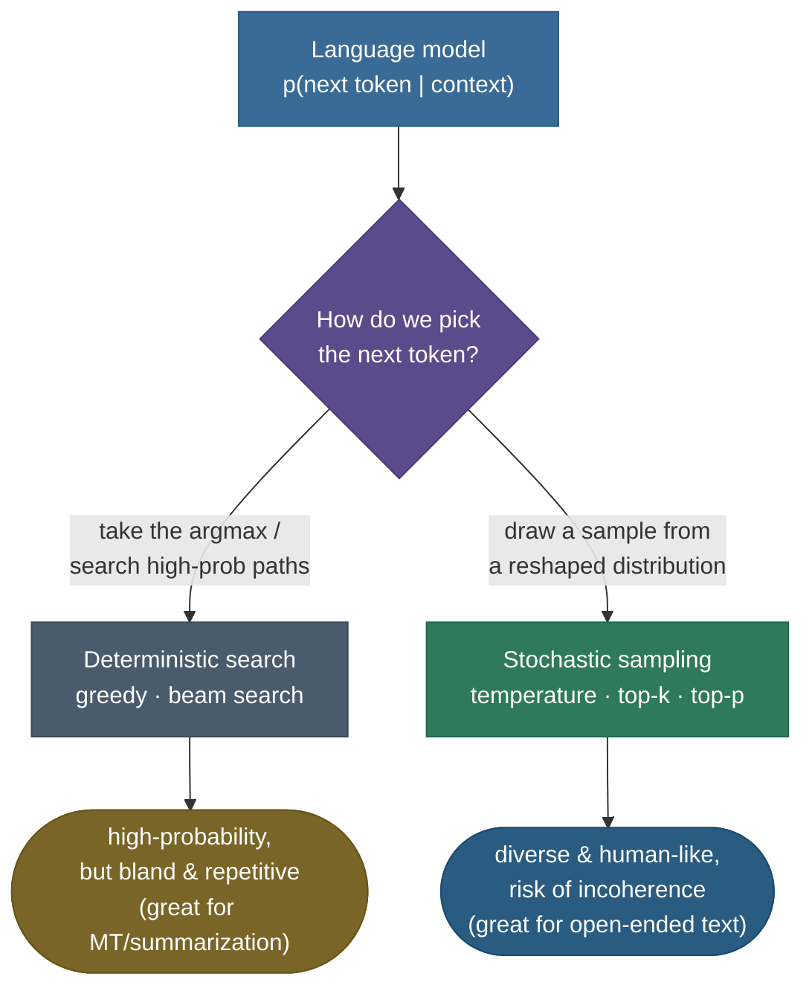
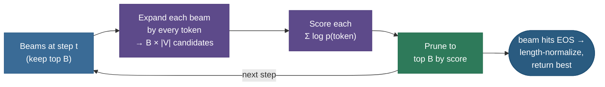

# Decoding Strategies: turning probabilities into text

A trained language model does not produce text. It produces a single, humble thing, over and over: a probability distribution over the next token. Feed it *"The capital of France is"* and it hands you back a vector of ~50,000 numbers that sum to one — a little mass on `Paris`, some on `the`, a sliver on `not`, a vanishing crumb on `banana`. That is the *entire* output of the model. Everything you have ever read that an LLM "wrote" — every essay, every line of code, every chatbot reply — is the result of a separate algorithm, sitting on top of the model, that repeatedly asks for that distribution and **decides which token to actually emit**. That algorithm is the **decoding strategy**, and it is the single most important thing you can change about a deployed model *without retraining it.*

This is why decoding is one of the highest-frequency LLM interview topics: it is the knob you turn in production every day. Two teams can ship the *same* model and get wildly different behavior — one crisp and factual, one creative and wandering, one stuck repeating itself into oblivion — purely from how they decode. I'm going to teach this the way I'd actually explain it to a teammate tuning a generation endpoint: first *why* generation is a search problem at all, then the deterministic methods (**greedy**, **beam search**) and exactly why the "best" search gives *worse* text for open-ended writing, then the sampling methods (**temperature**, **top-k**, **top-p/nucleus**, and the modern variants) that fix it, then the repetition controls, constrained/guided decoding, and speculative decoding, and finally a per-task playbook. By the end you'll be able to:

- explain why generation is a **search over an exponentially large sequence space**, and why we never solve it exactly;
- derive **greedy** and **beam search**, and explain — with a tiny tree — why greedy is *myopic* and why beam can be *worse* than greedy for open-ended text;
- explain **neural text degeneration** (Holtzman et al.) — why the most probable text is *not* the most human;
- derive how **temperature** rescales the softmax, and compute the resulting distribution by hand;
- explain the difference between **top-k** (fixed count) and **top-p/nucleus** (adaptive mass), and *why adaptive wins*;
- reason about **repetition penalties**, **contrastive search**, **min-p/typical**, **constrained/JSON decoding**, and **speculative decoding**;
- pick correct settings per task (factual, code, creative, chat) from first principles.

> **Note:** decoding is a *post-training, inference-time* choice. It changes **nothing** about the model's weights or the distribution it computes — it only changes which sample you draw from that distribution. The same checkpoint can be made deterministic or wildly creative purely by how you decode. This is also why decoding is so cheap to experiment with: no GPUs-for-a-week, just a few flags.

---

## The problem: generation is search over an exponential space

Start from what the model actually gives us. A language model defines a **conditional distribution over the next token** given everything so far:

$$p_\theta(x_t \mid x_{<t}) = \text{softmax}(z_t), \qquad z_t = \text{logits at step } t.$$

Here $x_{<t} = (x_1, \dots, x_{t-1})$ is the context (prompt + everything generated so far), $z_t \in \mathbb{R}^{|V|}$ is the **logit** vector (one real number per vocabulary entry, $|V| \approx 50\text{k}$–$256\text{k}$), and softmax turns those logits into a probability for every possible next token. To produce a *sequence*, we apply the chain rule of probability — the probability of a whole sequence is the product of the per-step conditionals:

$$p_\theta(x_1, \dots, x_T) = \prod_{t=1}^{T} p_\theta(x_t \mid x_{<t}).$$

Now the goal *looks* simple — "find the most probable sequence":

$$x^\star = \arg\max_{x_1,\dots,x_T} \;\prod_{t=1}^{T} p_\theta(x_t \mid x_{<t}).$$

But look at the size of the search. At each of $T$ steps there are $|V|$ choices, so there are $|V|^T$ possible sequences. For a vocabulary of 50,000 and a modest 20-token output that's $50000^{20} \approx 10^{94}$ candidate sequences — more than the number of atoms in the observable universe. We cannot enumerate them, and because each step's distribution **depends on the tokens chosen before it** (the model is autoregressive — its own previous outputs feed back as input), we cannot decompose the search into independent per-position choices either. **Exact** $\arg\max$ over sequences is intractable.

So every decoding strategy is a *heuristic* navigating this exponential tree. They split into two families, and the entire topic is understanding the trade-off between them:



> *Where this framing comes from: the search-vs-sampling split is laid out in **Speech and Language Processing, 3rd ed.** (Jurafsky & Martin, the decoding/sampling sections) and in the canonical practitioner guide **How to generate text** (von Platen, Hugging Face) — both in the references.*

---

## Intuition: a hiker choosing a path down a mountain

Before the algorithms, hold one picture in your head. Imagine a hiker descending a mountain at dusk, where **altitude is improbability** — the valleys are high-probability sequences, the peaks are nonsense. At each step the hiker can see only the slope immediately around their feet (the next-token distribution); they cannot see the whole landscape (the $10^{94}$ sequences). Every decoding strategy is a *policy for choosing the next step* given only that local view.

- **Greedy** is the hiker who always steps in the single steepest-downhill direction. Fast, but they walk straight into the first gully and get stuck — a *local* minimum that is nowhere near the lowest valley. (That's the AX-vs-BP trap below.)
- **Beam search** sends out $B$ scouts who each keep walking and report back; you keep the $B$ lowest so far and prune the rest. You explore more of the terrain and usually find a deeper valley — but you're still relentlessly seeking the *lowest* point, and it turns out the lowest point is a barren, flat basin (bland, repetitive text).
- **Sampling** is a hiker who mostly heads downhill but **occasionally takes a random step**, weighted by how downhill each direction looks. They wander through the interesting mid-altitude terrain where real, varied landscapes live — exactly where human text sits. **Temperature** is how *bold* the random steps are; **top-k / top-p** forbid stepping off a cliff (the noisy low-probability tail).

The whole topic is choosing how adventurous that hiker should be — and the right answer depends entirely on whether you want *the* valley (translation, a fact) or an *interesting walk* (a story). Keep the hiker in mind; every method below is just a different walking policy.

---

## Greedy decoding: the locally-optimal, globally-myopic baseline

The simplest possible strategy: at every step, take the single most probable token, append it, and repeat.

$$x_t = \arg\max_{w \in V}\; p_\theta(w \mid x_{<t}).$$

It's deterministic (same prompt → same output every time), trivially fast (one $\arg\max$ per step, no extra memory), and it is the right default for tasks where you genuinely want the single most likely answer. But it has a structural flaw that the chain rule makes inevitable: **greedy optimizes each step in isolation, and a token that is locally best can lock you onto a globally worse path.** It commits to the highest-probability *first* token even when a slightly-less-probable first token leads to a far-higher-probability *continuation*. It cannot see past the immediate step — it is **myopic**.

The cleanest way to feel this is a tiny two-step tree. Suppose after the prompt the model gives $P(\text{A}) = 0.55$ and $P(\text{B}) = 0.45$, so greedy picks **A**. But the continuations differ in shape: after A the next token is spread out ($P(\text{X}|\text{A}) = 0.40$, $P(\text{Y}|\text{A}) = 0.35$, $P(\text{Z}|\text{A}) = 0.25$), while after B almost all the mass piles on one token ($P(\text{P}|\text{B}) = 0.95$). Greedy, having committed to A, ends at **AX** with joint probability $0.55 \times 0.40 = 0.22$. But the genuinely most-probable two-token sequence is **BP** at $0.45 \times 0.95 = 0.4275$ — nearly **double**. Greedy never even considered it, because B lost the *first* comparison.


> **Gotcha:** "greedy maximizes probability" is a common interview mistake. Greedy maximizes the probability of *each next token*, **not** of the full sequence — those are different optimization problems, and the gap between them is exactly what beam search tries to close.

> **Tip:** greedy is `do_sample=False` with `num_beams=1` in Hugging Face. It's the right choice when the task has essentially one correct answer and you want reproducibility — extractive QA, a deterministic classifier head, a unit-testable codegen call where you compare against a fixed expected output.

---

## Beam search: keep several hypotheses alive

Beam search is the natural fix for greedy's myopia: instead of committing to one token, **keep the $B$ most-probable partial sequences ("beams") at every step**, expand all of them, and re-prune to the best $B$. With $B$ alive hypotheses you can afford to hold onto a first token that looks slightly worse now but pays off later. $B=1$ *is* greedy; larger $B$ searches more of the tree.

The algorithm, step by step:

1. **Initialize.** Start with the single empty hypothesis (just the prompt), score $\log p = 0$.
2. **Expand.** For each of the (up to) $B$ current beams, compute the next-token distribution and form every one-token extension. This gives up to $B \times |V|$ candidate sequences.
3. **Score.** Each candidate's score is the **sum of log-probabilities** along its path: $\text{score}(x_{1:t}) = \sum_{i=1}^{t} \log p_\theta(x_i \mid x_{<i})$. (We work in log-space because multiplying hundreds of probabilities underflows to zero in floating point; sums of logs are numerically stable and monotonic in the product.)
4. **Prune.** Keep only the top $B$ candidates by score; discard the rest.
5. **Repeat** until each beam hits an end-of-sequence token or the length limit; return the best completed beam.

Run that on the tree above with $B=2$: after step 1 we keep **both** A (0.55) and B (0.45). After step 2 we expand both and the best candidate is **BP** at $0.4275$ — beam search **recovers the sequence greedy missed**. That is the whole value proposition: a wider beam explores more of the tree and finds higher-probability sequences greedy's tunnel vision skips.



### Length normalization: don't punish long sequences

There's a bug lurking in "sum of log-probs." Every log-probability is **negative** (probabilities are $\le 1$, so their logs are $\le 0$), so *every additional token lowers the score*. Raw beam search therefore has a systematic bias toward **short** sequences — it would rather stop early than add a token. For translation and summarization, where you want a complete output, this truncates results.

The standard fix is **length normalization**: divide the score by a function of length so long and short hypotheses compete fairly. The common form (Wu et al., Google's NMT, 2016) is:

$$\text{score}(y) = \frac{1}{\text{lp}(y)} \sum_{i=1}^{|y|} \log p_\theta(y_i \mid y_{<i}), \qquad \text{lp}(y) = \frac{(5 + |y|)^\alpha}{(5 + 1)^\alpha},$$

with $\alpha \in [0.6, 0.7]$ typically. At $\alpha = 0$ there's no normalization; at $\alpha = 1$ it's plain mean log-prob per token. The denominator grows with length, offsetting the accumulating negative log-probs so the search stops preferring short outputs.

> **Note:** beam search is the default for **machine translation** and **abstractive summarization** (see [12 Machine Translation](12-Machine-Translation.md) and [13 Text Summarization](13-Text-Summarization.md)). These are *closed-ended*, faithfulness-first tasks: there's a fairly narrow set of correct outputs, and you want the high-probability one. Beam (with length norm, $B$ typically 4–8) reliably finds it and beats greedy on BLEU/ROUGE.

> **Gotcha:** bigger beams are **not** monotonically better. Past a point, very large beams in NMT actually *hurt* quality — they over-favor short, generic, high-probability outputs (the "beam search curse," Koehn & Knowles 2017). $B$ between 4 and 10 is the practical sweet spot; $B=50$ often degrades.

### Diverse beam search

Vanilla beams tend to be near-duplicates of each other (all variations on the single best path), which wastes the width. **Diverse Beam Search** (Vijayakumar et al., 2018) partitions the beams into groups and adds a dissimilarity penalty so groups explore *different* regions of the tree — useful when you want several genuinely distinct candidates (e.g. caption diversity, n-best lists for reranking).

> *Provenance: length normalization is from **Wu et al. 2016** (Google NMT); the large-beam degradation is documented in **Koehn & Knowles 2017** ("Six Challenges for NMT"); diverse beams are **Vijayakumar et al. 2018** — all in the references.*

### Worked example: a three-step beam trace in log-space

To make the prune step concrete — and to show why we work in log-space — here's a fuller $B=2$ trace with explicit scores. Suppose a tiny vocabulary $\{a, b, c\}$ and these conditional log-probabilities (natural log; remember every value is negative):

**Step 1** from the prompt: $\log p(a) = -0.5$, $\log p(b) = -0.7$, $\log p(c) = -2.0$. Keep the top $B=2$: beams $\{a: -0.5,\; b: -0.7\}$ (we drop $c$).

**Step 2** — expand each surviving beam by all three tokens and *add* the new log-prob to the running score:

| Candidate | computation | score |
|---|---|---|
| $aa$ | $-0.5 + (-1.2)$ | $-1.7$ |
| $ab$ | $-0.5 + (-0.4)$ | $\mathbf{-0.9}$ |
| $ac$ | $-0.5 + (-1.6)$ | $-2.1$ |
| $ba$ | $-0.7 + (-0.3)$ | $\mathbf{-1.0}$ |
| $bb$ | $-0.7 + (-1.5)$ | $-2.2$ |
| $bc$ | $-0.7 + (-2.4)$ | $-3.1$ |

Sort all six and keep the top 2: $\{ab: -0.9,\; ba: -1.0\}$. Notice the pruning is *global across all expansions* — we compare $ab$ (a continuation of $a$) against $ba$ (a continuation of $b$) on the same score scale, and both survivors happen to come from different parents. Notice too that $aa$ (score $-1.7$) was beaten by $ba$ even though $a$ was the better *first* token — the chain rule lets a weaker prefix win once its continuation is strong enough. This is exactly the mechanism that recovers BP in the earlier tree.

**Step 3** would repeat: expand $ab$ and $ba$ each by all tokens, score by adding the next $\log p$, prune to 2. A beam that emits the end-of-sequence token is set aside as a *finished* candidate (scored with length normalization) and the search continues with the rest until $B$ finished candidates exist or the length cap hits; the best finished candidate is returned.

> **Note:** the reason we never multiply the raw probabilities is underflow. After 50 tokens, a product like $0.3^{50} \approx 10^{-26}$ is already near the edge of float32's range; after a few hundred it rounds to exactly 0.0 and *every* hypothesis ties at zero, breaking the comparison. Summing logs ($\log 0.3 \times 50 = -60.2$) is numerically stable and preserves the ranking (log is monotonic), which is why every real implementation scores in log-space.

---

## Why "most probable" is the wrong goal for open-ended text

Here is the plot twist that reorganizes the whole topic. For **open-ended generation** — story writing, dialogue, brainstorming, any long free-form text — searching harder for the most-probable sequence makes the output **worse**, not better. This is one of the most important and counterintuitive results in modern NLP, and a near-guaranteed interview question.

Holtzman et al. (2020), *The Curious Case of Neural Text Degeneration*, showed it concretely: maximization-based decoding (greedy and beam) on open-ended prompts produces text that is **bland, generic, and pathologically repetitive** — it falls into loops, repeating the same phrase or sentence indefinitely. Their key empirical finding is captured in one observation: **human text is not the most probable text.** When they measured the per-token probability the model assigns to *real human-written* continuations, it was full of dips — humans constantly choose tokens that are *not* the model's top pick. Natural language has a "bumpy" probability profile; it lives in a band of moderate probability, not at the ceiling. Maximization decoding chases the ceiling and falls off the cliff into degenerate, robotic text.

You can watch this happen in three lines. Feed GPT-2 a repetitive prompt and decode greedily:

> Greedy continuation of *"I love pizza. I love pizza."* →
> *" I love pizza. I love pizza. I love pizza. I love pizza. I love pizza. ..."* — it loops forever. **distinct-2 = 0.103** (only ~10% of bigrams are unique).

The same model with **nucleus sampling (top-p = 0.92)** on an open prompt produces fluent, varied, non-looping prose with **distinct-2 = 1.0** (every bigram unique). Same weights, same distribution — the *decoding strategy alone* is the difference between a broken loop and human-like text.

> **Note — the degeneration loop, mechanically.** Once the model emits a phrase, that phrase is now in its own context, which *raises* the probability it predicts the phrase again (LMs are trained to continue patterns, and a just-seen phrase is a very strong pattern). Greedy dutifully takes that now-highest-probability token, which strengthens the pattern further — a self-reinforcing feedback loop. Sampling breaks the loop by occasionally *not* taking the top token, denying the feedback.

This is the entire motivation for the sampling family. We don't want the *most probable* token every time — we want to **sample from the model's distribution**, but in a controlled way that keeps us in the high-quality region without either collapsing to greedy (dull) or sampling the long, noisy tail (incoherent). The next sections build exactly those controls.

> *Provenance: the degeneration result, the "human text isn't most-probable" finding, and nucleus sampling are all from **Holtzman et al. 2020** (in the references). The measured distinct-n numbers above were produced with GPT-2 in Python 3.12 — the script is in the Code section.*

---

## Temperature: reshaping the distribution before you sample

The first and most fundamental sampling control is **temperature**. It's a single scalar $T > 0$ that you **divide the logits by before applying softmax**, reshaping how peaked or flat the distribution is:

$$p_i = \frac{\exp(z_i / T)}{\sum_j \exp(z_j / T)}.$$

The intuition: dividing logits by a small $T$ *amplifies* the gaps between them (the biggest logit pulls even further ahead → distribution sharpens toward a spike on the top token); dividing by a large $T$ *shrinks* the gaps (all logits move toward equal → distribution flattens toward uniform). Concretely:

- $T \to 0^+$: the gaps blow up; all mass concentrates on the single largest logit. **This is exactly greedy decoding** — temperature is a continuous knob with greedy at one extreme.
- $T = 1$: you sample from the model's **raw, untouched** distribution.
- $T \to \infty$: all logits collapse together; the distribution approaches **uniform** — pure noise, every token equally likely.
- $0 < T < 1$ **sharpens** (more confident, more conservative, less diverse); $T > 1$ **flattens** (more random, more diverse, more risk of incoherence).

### Worked example: temperature on a 4-token vector (by hand)

Take logits $z = [3, 2, 1, 0]$ for tokens A, B, C, D. Compute $\text{softmax}(z/T)$ for three temperatures. For each, divide every logit by $T$, exponentiate, and normalize.

**At $T = 1$** (raw): $\exp([3,2,1,0]) = [20.09, 7.39, 2.72, 1.00]$, sum $= 31.19$, so

$$p = [0.644,\; 0.237,\; 0.087,\; 0.032].$$

**At $T = 0.5$** (sharpen): divide logits by 0.5 → $[6,4,2,0]$, $\exp = [403.4, 54.6, 7.39, 1.0]$, sum $= 466.4$:

$$p = [0.865,\; 0.117,\; 0.016,\; 0.002].$$

The top token jumped from 0.64 to **0.87** — much more committed, approaching greedy.

**At $T = 2$** (flatten): divide logits by 2 → $[1.5, 1, 0.5, 0]$, $\exp = [4.48, 2.72, 1.65, 1.0]$, sum $= 9.85$:

$$p = [0.455,\; 0.276,\; 0.167,\; 0.102].$$

The distribution spread out — the top token fell from 0.64 to **0.46**, and the long-tail token D rose from 0.03 to 0.10 (a 3× higher chance of an unlikely choice). These exact numbers are computed in the Code section and drawn below.

![The same 4-logit vector [3,2,1,0] pushed through softmax at T=0.5, 1.0, and 2.0. Lower temperature sharpens the distribution toward the top token (greedy in the limit); higher temperature flattens it toward the uniform 0.25 line, raising the probability of unlikely tokens.](images/dec_temperature_softmax.png)

> **Note:** temperature is **monotonic in entropy** — lower $T$ lowers the entropy (less uncertainty) of the sampling distribution, higher $T$ raises it. It never changes the *ranking* of tokens (the top token stays the top token at any $T$); it only changes *how much* probability the ranking concentrates. That's why $T \to 0$ is exactly greedy: the ranking's winner takes all.

We can put a number on that. Entropy $H = -\sum_i p_i \log_2 p_i$ measures the distribution's uncertainty in bits. For the three temperatures above:

- $T = 0.5$: $H \approx 0.66$ bits — very confident, almost all mass on one token.
- $T = 1.0$: $H \approx 1.37$ bits — the raw model's uncertainty.
- $T = 2.0$: $H \approx 1.80$ bits — approaching the $\log_2 4 = 2$ bits of a uniform 4-way distribution.

So raising temperature from 0.5 to 2.0 nearly *triples* the entropy here — a quantitative handle on "how random is each step." A useful sanity check when you're choosing settings: ask what entropy (in bits) you actually want per token. Factual answers want near-zero; creative writing wants a healthy positive value, but not all the way to the uniform ceiling, which is just noise.

> **Gotcha:** temperature alone, at $T \ge 1$, still samples from the **full** vocabulary — including the enormous, noisy tail of tens of thousands of tokens that each have tiny but nonzero probability. Summed, that tail carries real mass, and sampling from it is a major source of incoherence ("where does this random word come from?"). Temperature reshapes the distribution but doesn't *truncate* it. That's the job of top-k and top-p, which is why temperature is almost always paired with one of them.

---

## Top-k sampling: keep the k most likely, renormalize

The first truncation method. **Top-k sampling** (Fan, Lewis & Dauphin, 2018, *Hierarchical Neural Story Generation*): at each step, keep only the **$k$ highest-probability tokens**, zero out everything else, renormalize the survivors to sum to 1, and sample from those. This directly cuts off the unreliable tail — you can never sample token #5,000 if $k = 50$.

Mechanically: sort the distribution, take the top $k$, set the rest to probability 0, divide the survivors by their sum so they form a valid distribution again, then draw. Typical values are $k = 40$ or $k = 50$. Combined with temperature, top-k was the workhorse of early high-quality sampling (it's what GPT-2's famous "unicorns" sample used: $k = 40$).

But top-k has a structural weakness that motivates nucleus sampling: **$k$ is a fixed count that ignores the *shape* of the distribution.** Real next-token distributions vary enormously in how peaked they are:

- After *"The capital of France is"*, the distribution is **peaked** — one or two tokens hold almost all the mass. A fixed $k = 50$ here drags in 48 tokens that are basically noise, occasionally letting through a wrong, low-probability answer.
- In the middle of a creative sentence, the distribution is **flat** — fifty tokens might each be reasonable. A fixed $k = 50$ here may *truncate good options*, cutting off token #51 that was just as plausible as #50.

The same $k$ is too permissive in one context and too restrictive in the other. You'd like the cutoff to **adapt to the distribution's shape** — keep few tokens when the model is confident, many when it's uncertain. That is precisely top-p.

> *Provenance: top-k sampling for neural text is **Fan, Lewis & Dauphin 2018** (in the references).*

---

## Top-p / nucleus sampling: keep the smallest set that covers mass p

**Top-p sampling**, also called **nucleus sampling** (Holtzman et al., 2020), fixes top-k's rigidity by truncating on **cumulative probability mass** instead of token count. The rule: sort tokens by probability descending, then keep the **smallest set of top tokens whose cumulative probability is $\ge p$** (the "nucleus"), zero the rest, renormalize, and sample. Formally, the nucleus $V^{(p)}$ is the smallest set such that

$$\sum_{w \in V^{(p)}} p_\theta(w \mid x_{<t}) \;\ge\; p.$$

The cutoff $|V^{(p)}|$ — *how many* tokens survive — is now **data-dependent**: it shrinks when the model is confident (a few tokens already cover mass $p$) and grows when the model is uncertain (it takes many tokens to reach $p$). That single property is why nucleus sampling beats fixed-$k$: it self-adjusts to the shape of every distribution. Holtzman et al. found $p \approx 0.9$–$0.95$ gives the most human-like text on their open-ended benchmarks, and it remains the most widely used open-ended setting today.

### Worked example: top-k vs top-p on the same distribution

Take a realistic 8-token distribution (already sorted): $p = [0.40, 0.25, 0.13, 0.08, 0.06, 0.04, 0.025, 0.015]$.

**Top-k with $k = 2$**: keep $t_1, t_2$. Kept mass $= 0.40 + 0.25 = 0.65$. The cut is purely positional — it keeps exactly 2 tokens no matter what the tail looks like.

**Top-p with $p = 0.9$**: walk the cumulative sum — $0.40,\; 0.65,\; 0.78,\; 0.86,\; \mathbf{0.92},\; 0.96, \dots$ The cumulative mass first reaches $\ge 0.9$ at the **5th** token. So the nucleus is $\{t_1, \dots, t_5\}$, kept mass $= 0.92$, and we sample among **5** tokens. (After this, both sets are renormalized to sum to 1.)


On *this* distribution top-p kept more tokens than top-k=2. But the real point is **adaptivity**: had the distribution been spiky (say $p_1 = 0.95$), top-p=0.9 would have kept just **one** token — collapsing to greedy exactly when the model is certain — while top-k=2 would still force in a second, possibly-wrong token. And on a very flat distribution top-p would keep many tokens, while top-k=2 would over-truncate. **Top-p matches the truncation to the model's confidence; top-k cannot.**

> **Tip:** temperature and top-p **compose**, and the standard open-ended recipe combines them: `temperature` reshapes the distribution, then `top-p` truncates the reshaped tail. Order matters in implementations (temperature is applied to logits, then top-p truncation on the resulting probabilities). A very common production default is `temperature=0.7–0.9, top_p=0.9` — reshape mildly toward diversity, then cut the noise tail.

> **Gotcha:** don't crank both knobs at once. High temperature *and* high top-p compounds the diversity and tips into incoherence; low temperature *and* low top-p compounds the determinism and reintroduces repetition. Tune one primarily (usually temperature) and leave the other at a sane default.

### The renormalization step, in full

It's worth being precise about what "renormalize" does, because it's where the truncation methods actually take effect. After truncation you have a *sub*-distribution — a set of survivors whose probabilities sum to some $S < 1$ (the kept mass), with everything else zeroed. You can't sample from that directly; the probabilities have to sum to 1. **Renormalization** divides each survivor by $S$ so they form a valid distribution again, then you draw one token from it.

Take the top-p=0.9 example: survivors $t_1..t_5$ with probabilities $[0.40, 0.25, 0.13, 0.08, 0.06]$, summing to $S = 0.92$. After dividing by 0.92:

$$[0.435,\; 0.272,\; 0.141,\; 0.087,\; 0.065], \quad \text{sum} = 1.0.$$

The *relative* odds among survivors are preserved exactly ($t_1$ is still 1.6× as likely as $t_2$), but the mass the tail used to hold has been redistributed proportionally onto the survivors. This is why truncation is safe: you never sample a junk token, and the good tokens keep their relative shape. Note the order of operations in a real sampler: **logits → (temperature divide) → softmax → (top-k/top-p truncate) → renormalize → sample.** Temperature acts on logits (pre-softmax); truncation and renormalization act on probabilities (post-softmax). Getting that order wrong — e.g. truncating before applying temperature — gives subtly different distributions, which is a classic implementation bug.

> **Note:** greedy, top-k, and top-p are all *the same operation with different cutoffs*. Greedy = "keep 1 token." Top-k = "keep $k$ tokens." Top-p = "keep tokens until mass $p$." Even temperature fits the family as the limiting case ($T\to 0$ = greedy). Seeing them as one parameterized truncation-and-sample procedure — rather than four unrelated tricks — is the mental model that makes the whole topic click.

---

## The modern tail: min-p, typical, epsilon, and η-sampling

Nucleus sampling isn't the end of the story. A few newer truncation schemes refine the same idea — *which slice of the distribution is "safe" to sample from*:

- **Min-p sampling** sets a *relative* floor: keep only tokens whose probability is at least $p_{\min} \times (\text{max token probability})$. When the top token is very confident (high max prob) the floor rises and few tokens survive; when the model is unsure the floor drops and more survive. It's argued to behave more gracefully than top-p at high temperatures, where top-p can still admit junk.
- **Typical sampling** (Meister et al., 2023) keeps tokens whose information content (surprise, $-\log p$) is *close to the expected* information content (the distribution's entropy) — sampling "typically informative" tokens rather than just the most probable, motivated by information theory. It targets the band where human text actually lives.
- **Epsilon / eta sampling** (Hewitt et al., 2022) truncate using absolute or entropy-dependent probability thresholds, again to cut the unreliable tail more principledly than a fixed $k$ or $p$.

You won't tune these every day, but knowing they exist — and that they all attack the same "truncate the tail well" problem from different angles — is exactly the kind of depth that separates a strong answer from a textbook one.

> *Provenance: typical sampling is **Meister et al. 2023**; epsilon/eta sampling is **Hewitt et al. 2022**; min-p is **Nguyen et al. 2024** — see references.*

---

## Repetition controls: penalties, no-repeat n-grams, contrastive search

Even with sampling, models drift into repetition (the degeneration feedback loop never fully disappears, especially at lower temperatures). A family of *direct* controls suppresses it by editing the logits or the search before you pick a token:

- **Repetition penalty** (Keskar et al., CTRL, 2019): divide (or for negative logits, multiply) the logits of *already-generated* tokens by a factor $r > 1$ before softmax, lowering their probability. A penalty of $r \approx 1.1$–$1.3$ noticeably reduces loops; too high and the text avoids necessary words ("the", "is") and turns stilted.
- **Frequency and presence penalties** (the OpenAI API knobs): **frequency penalty** subtracts an amount *proportional to how many times* a token has already appeared (escalating discouragement of overused words); **presence penalty** subtracts a flat amount once a token has appeared *at all* (encouraging new topics). They're additive adjustments to the logits, tunable independently.
- **No-repeat n-gram blocking** (`no_repeat_ngram_size = n`): a hard constraint that forbids emitting any n-gram that has already occurred — set $n = 3$ and the model can never repeat a trigram. Blunt but effective; risk is blocking *legitimately* recurring phrases (names, technical terms).
- **Contrastive search** (Su et al., 2022, *A Contrastive Framework for Neural Text Generation*): a more principled, *deterministic* method. At each step it scores candidates by a **contrastive objective**: reward high model confidence (model probability) **minus** a **degeneration penalty** equal to the candidate's maximum cosine similarity to the representations of already-generated tokens. The penalty pushes the model away from tokens whose hidden state looks like something it just said — directly attacking repetition at the representation level. With a small candidate set ($k = 4$–$8$) and penalty weight $\alpha \approx 0.6$, contrastive search produces coherent, non-repetitive, deterministic text — often the best quality without sampling.

> **Tip:** these controls stack with the sampling knobs. A robust chat default is `temperature ≈ 0.7, top_p ≈ 0.9, repetition_penalty ≈ 1.1` — sample for variety, lightly discourage exact repeats. Don't pile on all of them at full strength; each one removes probability mass, and over-penalizing produces unnatural, word-avoiding text.

---

## The quality–diversity trade-off: one picture for all of it

Every method above is navigating a single two-axis trade-off — **quality** (coherence, factuality, staying on-topic) versus **diversity** (variety, surprise, distinct n-grams). The two pull against each other, and each decoding setting is a point in that plane:


Reading the picture:

- **Greedy / beam** (bottom-left): maximal "quality" in the narrow sense of high model-probability, but **low diversity** → degeneration on open-ended tasks. Correct for closed-ended tasks (MT, summarization, factual QA) where there's one right answer.
- **Pure sampling, $T = 1$, no truncation** (bottom-right): maximal diversity, but the noisy tail tanks coherence → off-topic, incoherent text.
- **Nucleus top-p ≈ 0.9** (the human-like band): the empirical sweet spot for open-ended generation — diverse enough to be human, truncated enough to stay coherent.
- **Temperature** slides you *along* the curve: raise it to move toward diversity, lower it to move toward quality. There is no universally "best" point — the right one depends entirely on the task.

This single trade-off is the conceptual core of the whole topic. Every knob (temperature, $k$, $p$, penalties) is a way of choosing *where on this curve to sit.*

---

## Constrained and guided decoding: forcing valid structure

So far we've shaped *which* token to pick from the model's preferences. Sometimes you need to **guarantee structure** — valid JSON, a value from an enum, code that parses, output matching a regex or grammar. This is **constrained (guided) decoding**: at each step, mask out every token that would violate the constraint *before* sampling, so an illegal token can never be emitted.

- **Logit bias / token masking**: the simplest form — add $-\infty$ to the logits of forbidden tokens (or a positive bias to encouraged ones). Force a yes/no answer by allowing only the `Yes`/`No` token ids; ban a word by setting its logit to $-\infty$.
- **Grammar / regex-constrained decoding**: maintain a parser/automaton over the partial output and, at every step, compute the set of tokens that keep the output *parseable* under a context-free grammar or regular expression; mask the rest. Libraries like **Outlines**, **Guidance**, and **llama.cpp's GBNF grammars** do this. The model still chooses *among valid tokens* by its own probabilities — but it can *only* choose valid ones.
- **JSON / schema mode**: a special case used everywhere in production (tool calling, structured extraction) — constrain generation to match a JSON schema so the output always parses into the expected object. This is how "function calling" reliably returns well-formed arguments.


> **Note:** constrained decoding changes *which tokens are allowed*, not the model's preferences among the allowed ones. It's orthogonal to temperature/top-p — you can do nucleus sampling *within* a grammar. This is why production "structured output" features are reliable: the grammar makes invalid output literally unreachable, while sampling still gives natural variation in the valid space.

---

## Speculative decoding: the same output, faster

The methods so far choose *what* to emit. **Speculative decoding** (Leviathan et al., 2023; Chen et al., 2023) is different — it's a decoding-time *speedup* that produces the **exact same distribution** as the target model, just faster. It deserves a place here because it's reshaping how decoding actually runs in production.

The idea exploits the fact that autoregressive **decode is memory-bandwidth-bound** (see [09 LLMs · KV Cache](../../09.%20LLMs/concepts/05-KV-Cache.md)): each step the big model mostly waits on memory, doing little compute, so verifying *several* tokens in one forward pass costs barely more than generating one. So:

1. A small, fast **draft model** cheaply proposes the next $\gamma$ tokens (e.g. 4) autoregressively.
2. The big **target model** verifies all $\gamma$ proposals **in a single parallel forward pass** (a mini-prefill).
3. A **rejection-sampling** acceptance rule accepts the longest prefix of proposed tokens that's consistent with the target model's distribution, and resamples the first rejected token from a corrected distribution.

The acceptance rule is constructed so the *accepted* tokens are distributed **exactly** as if they'd been sampled from the target model directly — speculative decoding is **provably lossless**: identical output distribution, typically **2–3× fewer** expensive target-model steps. Because the target model's KV cache must tentatively hold the speculated tokens and **roll back** rejected ones, a block-addressable (paged) KV cache makes this clean.

> **Tip:** variants drop the separate draft model — **self-speculative** / **Medusa** add lightweight extra heads to the target model to propose tokens; **lookahead decoding** guesses n-grams from the model's own history. All share the same contract: *verify cheaply in parallel, keep only what matches, never change the output distribution.*

> *Provenance: speculative decoding is **Leviathan et al. 2023** and **Chen et al. 2023** (concurrent); the bandwidth-bound decode insight is the same one that motivates the KV cache — cross-linked above.*

---

## The playbook: which decoder for which task

Tie it together into the decision you actually make in production. The task's *shape* dictates the strategy:

| Task | Goal | Recommended decoding | Why |
|---|---|---|---|
| **Factual QA / extraction** | one correct answer | greedy, or `T≈0.1, top_p≈0.9` | want the most-probable answer; minimize hallucination |
| **Code generation** | correct, parseable | low temp `T≈0.2`, `top_p≈0.95` (+ grammar/JSON constraints) | small valid space; determinism + structure matter |
| **Machine translation** | faithful, complete | beam search `B=4–8` + length norm | closed-ended; high-probability complete output wins BLEU |
| **Summarization** | faithful, fluent | beam `B=4` + length norm + `no_repeat_ngram=3` | closed-ended; block repeated phrases |
| **Open-ended writing / story** | creative, human-like | `T≈0.9–1.0, top_p≈0.92` | need diversity; nucleus keeps it coherent |
| **Chat / assistant** | helpful, varied, safe | `T≈0.7, top_p≈0.9, rep_penalty≈1.1` | balance quality and variety; light anti-repeat |
| **Reproducible eval / unit tests** | deterministic | greedy (`do_sample=False`) | same input → same output for testing |
| **Structured output (tools)** | valid JSON/enum | constrained decoding + low temp | guarantee parseable output |

The two-line summary that fits in your head: **closed-ended, faithfulness-first tasks → search (greedy/beam); open-ended, creativity-first tasks → sampling (temperature + top-p).** Turn temperature *down* toward the factual end and *up* toward the creative end; reach for constraints whenever structure must be guaranteed.

### Mapping the knobs to real APIs

The same concepts show up under slightly different names across stacks — knowing the mapping prevents a lot of confusion:

- **Hugging Face `transformers`** (`model.generate`): `do_sample` (False = greedy/beam, True = sampling), `num_beams`, `temperature`, `top_k`, `top_p`, `repetition_penalty`, `no_repeat_ngram_size`, `length_penalty` (the $\alpha$ above), `penalty_alpha` + `top_k` (contrastive search), `min_new_tokens`. Setting `temperature` with `do_sample=False` does nothing — a frequent gotcha.
- **OpenAI / Anthropic chat APIs**: `temperature`, `top_p`, plus `frequency_penalty` and `presence_penalty`; `logit_bias` for token-level steering; structured-output / JSON mode for constrained decoding. There's no `top_k` or beam exposed — these endpoints sample. Conventionally you tune *either* `temperature` *or* `top_p`, not both.
- **vLLM / TGI (serving)**: expose the full sampling set (`temperature`, `top_p`, `top_k`, `min_p`, penalties) as per-request `SamplingParams`, plus guided-decoding back-ends (grammar/JSON/regex). Speculative decoding is configured at the engine level, transparent to the request.

The vocabulary differs but the underlying operation is identical everywhere: reshape the logits, optionally truncate the tail, then sample or argmax.

> **Gotcha:** "lower temperature is always safer" is wrong for open-ended tasks — push $T$ too low there and you slide straight back into greedy's repetition. There is no globally safe setting; the safe setting is the one matched to the task's place on the quality–diversity curve.

---

## How decoding interacts with alignment (RLHF) and evaluation

Two connections turn this from a standalone trick into part of the larger LLM picture.

**Alignment changes the distribution decoding samples from.** A base (pretrained) model's next-token distribution often has a heavy, ragged tail, so it leans hard on aggressive truncation to stay coherent. **Instruction tuning and RLHF** ([09 LLMs · RLHF](../../09.%20LLMs/concepts/15-RLHF-and-DPO.md)) reshape that distribution — they *sharpen* it toward helpful, on-policy continuations, concentrating mass on fewer good tokens. A practical consequence: aligned chat models are far more forgiving of decoding settings than raw base models, because the distribution they hand the decoder is already cleaner. It also explains a subtle failure mode — **over-optimized RLHF models can become *too* peaked**, collapsing diversity so that even nucleus sampling produces near-identical, "mode-collapsed" outputs (the model has learned one safe way to answer). When a chat model feels robotic and same-y, the cause may be the *training*, not the decoder — and no temperature setting fully recovers diversity the model no longer has.

**Decoding choice changes your evaluation numbers.** The decoder is part of the system under test, so it must match the metric ([18 NLP Evaluation Metrics](18-NLP-Evaluation-Metrics.md)):

- **Reference-overlap metrics** (BLEU for translation, ROUGE for summarization) reward matching a *specific* reference, so they favor **beam search** — the high-probability output is closest to the canonical answer. Reporting BLEU from a high-temperature sample understates a system.
- **Diversity / human-likeness metrics** (distinct-n, MAUVE, perplexity-of-human-text) reward variety, so they favor **nucleus sampling**. Reporting these from greedy makes a good model look degenerate.
- **Reproducibility:** any benchmark you want to be deterministic must fix the decoder (greedy, or a fixed seed) — otherwise the same model scores differently across runs purely from sampling noise.

> **Gotcha:** a classic eval mistake is comparing two models under *different* decoders — Model A with beam, Model B with sampling — and attributing the gap to the models. The decoder is a confound; hold it fixed (or report both) when comparing models.

---

## Production failure modes

Decoding is where a lot of "the model is broken" tickets actually originate. Knowing the usual suspects saves hours:

- **Repetition loops.** Output collapses into a repeating phrase — almost always too-greedy decoding (temperature too low, or no truncation diversity). Fix: raise temperature a touch, add `repetition_penalty ≈ 1.1` or `no_repeat_ngram_size = 3`. The "I love pizza" demo is this bug in miniature.
- **Incoherent / off-topic text.** The opposite end — temperature too high or top-p too loose, so the noisy tail leaks in. Fix: lower temperature, tighten top-p toward 0.9.
- **Truncated / too-short outputs.** Beam search without length normalization, or an early end-of-sequence token winning. Fix: add length normalization ($\alpha \approx 0.6$); for sampling, set a sane `min_new_tokens`.
- **Non-determinism where you wanted determinism.** A test that passes intermittently because `do_sample=True` was left on, or no seed was fixed. Fix: greedy (`do_sample=False`) or a pinned seed for any reproducible path.
- **Invalid structured output.** JSON that won't parse, an enum value the model invented. Fix: constrained/grammar decoding — don't post-hoc regex-repair the model's output, *prevent* the invalid token at decode time.
- **The "temperature does nothing" surprise.** With `do_sample=False`, temperature and top-p are **ignored** — greedy takes the argmax regardless. A very common confusion: people set `temperature=0.7` but leave sampling off and wonder why output never changes. Temperature only matters when you're actually sampling.
- **Settings that don't transfer between models.** A top-p tuned on a base model can be wrong for an aligned model (sharper distribution) and vice-versa. Re-tune per model; don't copy magic numbers across checkpoints.

> **Tip:** when debugging generation, change **one** knob at a time and inspect a few samples. Decoding bugs masquerade as model bugs, and the fix is usually a single parameter — but only if you can attribute the symptom to the right knob.

---

## Code: compute it, then watch it happen

Two runnable blocks. The first derives every numeric claim in the page from scratch (no model needed). The second measures the degeneration-vs-nucleus effect on a real model (GPT-2).

```python
"""Decoding strategies from scratch — verifies every number in the page.
Runs on CPU in well under a second (Python 3.12, numpy)."""
import numpy as np

def softmax(z):
    z = z - z.max()                       # numerical stability
    e = np.exp(z)
    return e / e.sum()

# --- 1) Temperature reshapes the softmax (logits [3,2,1,0]) ----------------
logits = np.array([3.0, 2.0, 1.0, 0.0])   # tokens A, B, C, D
for T in (0.5, 1.0, 2.0):
    p = softmax(logits / T)
    print(f"T={T}: " + "  ".join(f"{x:.3f}" for x in p))
# T=0.5: 0.865  0.117  0.016  0.002   (sharper -> toward greedy)
# T=1.0: 0.644  0.237  0.087  0.032   (raw model)
# T=2.0: 0.455  0.276  0.167  0.102   (flatter -> toward uniform)

# --- 2) top-k vs top-p truncation (same 8-token distribution) --------------
p = np.array([0.40, 0.25, 0.13, 0.08, 0.06, 0.04, 0.025, 0.015])
order = np.argsort(-p)                     # sort descending
# top-k = 2
k = 2
print("top-k=2 keeps", k, "tokens, mass", round(p[order[:k]].sum(), 3))   # 0.65
# top-p = 0.9 : smallest prefix whose cumulative mass >= 0.9
cum = np.cumsum(p[order])
n_p = int(np.searchsorted(cum, 0.9) + 1)
print("top-p=0.9 keeps", n_p, "tokens, mass", round(p[order[:n_p]].sum(), 3))  # 5, 0.92

# --- 3) Beam vs greedy on the tiny tree ------------------------------------
p1 = {'A': 0.55, 'B': 0.45}
p2 = {'A': {'X': 0.40, 'Y': 0.35, 'Z': 0.25}, 'B': {'P': 0.95, 'Q': 0.05}}
seqs = [(t1 + t2, pa * pb) for t1, pa in p1.items() for t2, pb in p2[t1].items()]
seqs.sort(key=lambda s: -s[1])
g1 = max(p1, key=p1.get); g2 = max(p2[g1], key=p2[g1].get)
print("greedy:", g1 + g2, "p =", round(p1[g1] * p2[g1][g2], 4))   # AX 0.22
print("true best (beam B=2 finds it):", seqs[0])                  # ('BP', 0.4275)
```

Output:

```
T=0.5: 0.865  0.117  0.016  0.002
T=1.0: 0.644  0.237  0.087  0.032
T=2.0: 0.455  0.276  0.167  0.102
top-k=2 keeps 2 tokens, mass 0.65
top-p=0.9 keeps 5 tokens, mass 0.92
greedy: AX p = 0.22
true best (beam B=2 finds it): ('BP', 0.4275)
```

Every number in the worked examples and diagrams comes straight from this block. Now the real-model demonstration of degeneration:

```python
"""Measured: greedy degenerates, nucleus stays diverse (GPT-2, Python 3.12).
distinct-2 = fraction of unique bigrams; lower = more repetitive."""
import torch
from transformers import GPT2LMHeadModel, GPT2TokenizerFast

tok = GPT2TokenizerFast.from_pretrained("gpt2")
model = GPT2LMHeadModel.from_pretrained("gpt2").eval()
torch.manual_seed(0)

def distinct_2(text):
    t = text.split()
    grams = [tuple(t[i:i+2]) for i in range(len(t)-1)]
    return len(set(grams)) / max(len(grams), 1)

ids = tok("I love pizza. I love pizza.", return_tensors="pt").input_ids
with torch.no_grad():
    greedy = model.generate(ids, max_new_tokens=40, do_sample=False,
                            pad_token_id=tok.eos_token_id)
    nucleus = model.generate(ids, max_new_tokens=40, do_sample=True,
                             top_p=0.92, top_k=0, temperature=1.0,
                             pad_token_id=tok.eos_token_id)
g = tok.decode(greedy[0, ids.shape[1]:], skip_special_tokens=True)
n = tok.decode(nucleus[0, ids.shape[1]:], skip_special_tokens=True)
print("GREEDY  distinct-2 =", round(distinct_2(g), 3), "->", g[:80])
print("NUCLEUS distinct-2 =", round(distinct_2(n), 3), "->", n[:80])
```

Representative output:

```
GREEDY  distinct-2 = 0.103 ->  I love pizza. I love pizza. I love pizza. I love pizza. I love pizza.
NUCLEUS distinct-2 = 1.0   ->  I love pizza. But I'm not sure how I feel about the rest of the menu...
```

> **Note:** the headline is the **distinct-2 gap (0.10 vs 1.0)** from the *same model and prompt* — the decoding strategy alone is the difference between a broken loop and varied text. This is Holtzman's degeneration result, reproduced in ten lines. Flip `do_sample`, `top_p`, and `temperature` and watch the trade-off move along the quality–diversity curve.

---

## Recap and rapid-fire

**If you remember nothing else:** a language model only outputs a next-token distribution; the **decoding strategy** is the separate algorithm that turns that distribution into text, and it's the biggest lever you have without retraining. **Search** methods (greedy, beam) chase the most-probable sequence — right for closed-ended tasks (MT, summarization), but they *degenerate* (bland, repetitive) on open-ended text because **human language isn't the most-probable language**. **Sampling** methods fix that: **temperature** reshapes the softmax (low → greedy, high → uniform), **top-k** truncates to a fixed count, and **top-p/nucleus** truncates to an *adaptive* mass — keeping few tokens when the model is confident, many when it's unsure. Everything is one navigation of the **quality–diversity trade-off**.

**Quick-fire — say these out loud:**

- *Why is greedy myopic?* It maximizes each token in isolation; a locally-best token can lock you onto a globally worse sequence (AX 0.22 vs BP 0.4275).
- *Why can beam be worse than greedy for open-ended text?* It searches *harder* for high-probability sequences, but the most-probable text is bland and repetitive — over-optimizing the wrong objective.
- *What does temperature do, exactly?* Divides logits by $T$ before softmax: $T<1$ sharpens (→ greedy as $T\to0$), $T>1$ flattens (→ uniform as $T\to\infty$).
- *Top-k vs top-p?* Top-k keeps a **fixed count**; top-p keeps the **smallest set whose cumulative mass ≥ p**, so its cutoff **adapts to the distribution's shape**.
- *Why does pure sampling at $T=1$ degenerate into incoherence?* It samples the long noisy tail of tens of thousands of tiny-probability tokens; truncation (top-k/top-p) removes that tail.
- *What's the standard open-ended recipe?* `temperature ≈ 0.8–1.0` + `top_p ≈ 0.92` (+ a light `repetition_penalty`).
- *How does speculative decoding speed up generation without changing output?* A draft model proposes tokens, the target verifies them in one parallel pass, rejection sampling keeps the longest correct prefix — provably the same distribution, ~2–3× fewer big-model steps.
- *Which decoder for translation? For a story?* Translation → beam search + length norm (closed-ended). Story → nucleus sampling (open-ended).

---

## References and further reading

The curated link library for this topic — the suggested learning path, videos, courses, articles, papers, books, and internal cross-links — lives in a companion file so it can be reused as a standalone reference list:

**→ [Decoding Strategies — references and further reading](17-Decoding-Strategies.references.md)**
