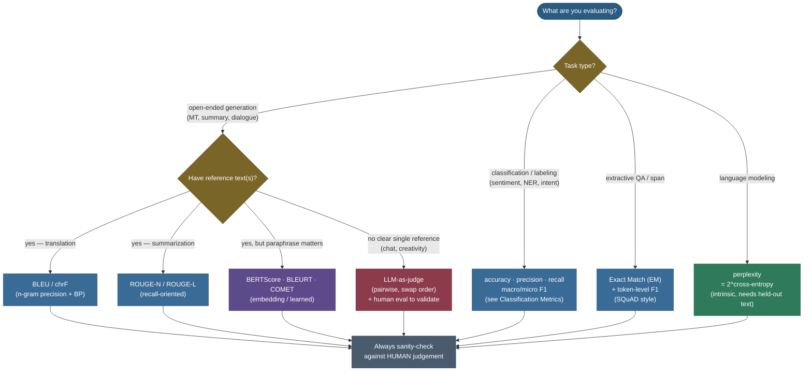

# NLP evaluation metrics: how do we know the text is any good?

Give a translation system the French sentence *"J'ai pris le train ce matin"* and it returns *"I took the train this morning."* A second system returns *"This morning I caught the train."* Both are perfect. A third returns *"I take train morning"* — clearly worse. Now: **write down a single number that ranks these three the way a human would**, automatically, over a million sentences, without a person reading any of them. That is the entire problem of NLP evaluation, and it is genuinely hard — because unlike classification, where there is exactly one right label, **open-ended generation has many equally-valid outputs**, and "valid" depends on meaning, not on which words you happened to use.

This page is the canonical map of how the field answers that question. We will build the whole landscape from one organizing idea — *what are you comparing the output against, and at what level (characters, words, meaning, or a human's judgement)?* — and then derive each major metric **by hand**: BLEU's clipped n-gram precision and brevity penalty, ROUGE's recall and longest-common-subsequence, METEOR's alignment, chrF's character F-score, perplexity's tie to cross-entropy, BERTScore's greedy cosine matching, and the modern **LLM-as-judge** paradigm with its biases. Every formula is computed twice — once on paper, once in code — and the two agree to the digit. By the end you'll be able to:

- explain **why** generation is hard to score and place any metric in a clean **taxonomy** (reference-based vs reference-free; overlap vs embedding vs model vs human);
- **derive and compute BLEU** end to end — modified n-gram precision with clipping, the geometric mean, and the brevity penalty — and state its four well-known weaknesses;
- **derive ROUGE-N and ROUGE-L** and explain why summarization wants *recall*, not precision;
- explain what **METEOR** and **chrF** add over BLEU, and recap **perplexity** as $2^{\text{cross-entropy}}$;
- **derive BERTScore** (greedy cosine matching → precision/recall/F1) and say when embedding metrics help and when they still fail;
- run **LLM-as-judge** correctly — pointwise vs pairwise, the **position / verbosity / self-preference** biases, and their mitigations;
- pick the right metric for any task from a decision tree, and explain why **human evaluation** remains the ground truth every automatic metric is validated against.

Intuition and the taxonomy first, then each metric derived with sources, then runnable code that reproduces every number.

> **Note:** there is no single "best" NLP metric, only the one that matches what your task cares about. A metric is a **proxy** for human judgement; the whole game is choosing a proxy that is **cheap to compute** yet **correlates well with humans** for *your* task. BLEU is a great proxy for translation and a terrible one for open-ended dialogue — same metric, opposite verdict, purely because of the task.

---

## The problem: why measuring generated text is genuinely hard

To feel why a whole zoo of metrics exists, sit with what makes generation different from classification.

In **classification** the label space is finite and a single key is correct: the review is *positive* or it isn't; the token is a *person* or it isn't. You compare prediction to gold and tally — accuracy, precision, recall, F1 (we cover those in depth in [Classification Metrics](../../03.%20Supervised_Learning/concepts/14-Classification-Metrics.md), and reuse them below, not re-derive them). Evaluation is essentially *bookkeeping*.

**Generation** breaks that comfort in four ways:

1. **One input, many valid outputs.** *"I took the train"* and *"I caught the train"* are both correct. Any metric that demands exact string match will call the second one wrong. The "gold answer" is not unique.
2. **Meaning lives above the surface.** *"The film was wonderful"* and *"The movie was fantastic"* share **zero** content words yet mean the same thing. Surface-overlap metrics see two unrelated sentences.
3. **Small changes can flip meaning.** *"absolutely fantastic"* → *"absolutely terrible"* is a one-word edit that **reverses** the sentiment, yet shares most of its n-grams. Surface metrics barely move.
4. **Quality is multi-dimensional.** Fluency, adequacy, factuality, coherence, helpfulness, safety — a single scalar smears them together, and different tasks weight them differently.

So the field built **many** metrics, each making a different bargain between *cost* and *fidelity to human judgement*. The clean way to hold them all in your head is a taxonomy.

> **Tip:** in an interview, never answer "which metric?" with a single name. Answer with the **two questions** that pick the metric: *(a) what's the task* (classification, QA, MT, summarization, LM, open chat)? and *(b) do you have a reference, and does paraphrase matter?* The decision tree near the end is exactly those two questions drawn out.

---

## The taxonomy: four families on two axes

Every NLP metric sits on two axes. **Axis 1 — is there a reference?** *Reference-based* metrics compare the output to one or more gold answers; *reference-free* metrics judge the output on its own (or against the input). **Axis 2 — at what level do they compare?** *Surface* (characters / n-grams), *embedding* (vector similarity), *model/learned* (a trained scorer), or *human*.


The families, with the trade each makes:

- **n-gram / surface overlap** — count shared words or characters. *Cheap, deterministic, language-agnostic, reproducible* — and **blind to meaning** (no synonyms, no paraphrase). BLEU, ROUGE, METEOR, chrF, exact-match, token-F1.
- **Embedding-based** — compare *contextual vector* representations, so paraphrases score high. *Captures meaning much better*; costs a model forward pass and is *less interpretable*. BERTScore, MoverScore.
- **Model / learned** — a model **trained on human ratings** predicts the human score directly. *Highest correlation with humans of the automatic metrics*; needs training data and can inherit its biases. BLEURT, COMET, and (intrinsically) perplexity from a language model.
- **Human** — actual people rate or compare outputs. *The ground truth* — but slow, expensive, and noisy, which is the whole reason the other three families exist.

> **Note:** the four families are a *ladder*, not rivals. The standard practice is to report a **cheap surface metric** (BLEU/ROUGE) for fast iteration and reproducibility, a **semantic metric** (BERTScore/COMET) to catch paraphrase, and a **human or LLM-judge** evaluation at milestones to validate that the cheap proxies still track quality. Each rung checks the rung below it.

We'll walk the ladder from the bottom, because the surface metrics are where the foundational ideas (precision, recall, clipping, the brevity penalty) are introduced — ideas the higher rungs reuse.

---

## Family 0: classification and labeling metrics (recap + the QA twist)

Many NLP tasks *are* classification in disguise — sentiment, topic, intent, spam, and token-level tagging like POS and NER. For these the metrics are exactly accuracy, **precision**, **recall**, and **F1**, computed from a confusion matrix, with **macro** vs **micro** averaging across classes. These are fully derived in [Classification Metrics](../../03.%20Supervised_Learning/concepts/14-Classification-Metrics.md) — read that for the *why*; here we only need the one-line recap and the two NLP-specific wrinkles.

**One-line recap.** Precision $=\tfrac{TP}{TP+FP}$ (of what you flagged, how much was right), recall $=\tfrac{TP}{TP+FN}$ (of what mattered, how much you caught), and their harmonic mean $F_1=\tfrac{2PR}{P+R}$. For **NER / sequence labeling** the unit is a *span* (an entity), and a prediction counts as a true positive only if **both the boundaries and the type** match — partial-overlap scoring is a known subtlety (see [Sequence Labeling: POS and NER](09-Sequence-Labeling-POS-and-NER.md)).

**The QA twist: exact match and token-level F1.** Extractive question answering (SQuAD-style) wants to know whether the predicted answer *span* matches the gold span, and it uses **two** numbers:

- **Exact Match (EM)** — 1 if the (normalized) predicted string equals *any* gold answer, else 0. Strict and brittle: *"the Denver Broncos"* vs gold *"Denver Broncos"* scores **EM = 0** despite being right. Normalization (lowercase, strip articles `a/an/the` and punctuation) softens this but can't fix partial answers.
- **Token-level F1** — treat the predicted and gold answers as **bags of tokens** and compute F1 over their overlap. This gives partial credit, which is why SQuAD reports it alongside EM.

> *Where this comes from: EM and token-F1 are the official SQuAD metrics from **Rajpurkar et al. 2016** (in the references). The token-F1 below is the exact computation in the SQuAD evaluation script.*

**Worked example A — token-F1 for a QA answer.** Gold answer: *"The Denver Broncos"* (3 tokens). Prediction: *"Denver Broncos"* (2 tokens). The shared bag of tokens is `{Denver, Broncos}`, so **number of shared tokens = 2**.

$$\text{precision}=\frac{\text{shared}}{|\text{pred}|}=\frac{2}{2}=1.0,\qquad \text{recall}=\frac{\text{shared}}{|\text{gold}|}=\frac{2}{3}=0.667,$$
$$F_1=\frac{2\cdot 1.0\cdot 0.667}{1.0+0.667}=\frac{1.334}{1.667}=\mathbf{0.80}.$$

So this answer earns **EM = 0** (string differs) but **F1 = 0.80** (mostly right). That gap — strict EM vs forgiving F1 — is exactly why QA leaderboards report both. (The code section reproduces `EM=0, F1=0.80`.)

> **Gotcha:** EM and token-F1 are **bag-of-tokens** — they ignore word order. *"dog bites man"* and *"man bites dog"* are F1-identical against each other. For short extractive spans that's fine; never repurpose token-F1 as a generation metric, where word order carries meaning.

---

## Family 1, the headliner: BLEU, derived from scratch

**BLEU** (Bilingual Evaluation Understudy, Papineni et al. 2002) is the metric that made automatic MT evaluation possible, and it is the single most-asked NLP-metric interview question. Its design answers one question: *how much of the candidate's n-gram content also appears in a reference?* — built so that you **can't cheat it** by being short or by repeating a good word. We'll build it in four pieces.

### Piece 1: modified (clipped) n-gram precision

Start with the naive idea: **n-gram precision** = (count of candidate n-grams that appear in the reference) / (total candidate n-grams). It has an obvious exploit. Reference: *"the cat is on the mat"*. Candidate: *"the the the the"*. Every unigram *"the"* is in the reference, so naive unigram precision is $4/4 = 1.0$ — a perfect score for garbage.

BLEU's fix is **clipping**: count each n-gram **no more than the maximum number of times it appears in any single reference**. *"the"* appears twice in the reference, so the candidate gets credit for at most 2 of its 4 *"the"*s → clipped precision $2/4 = 0.5$. Formally, for n-gram order $n$:

$$p_n=\frac{\displaystyle\sum_{\text{n-gram } g \in \text{cand}} \min\!\big(\text{count}_{\text{cand}}(g),\ \max_{\text{ref}}\text{count}_{\text{ref}}(g)\big)}{\displaystyle\sum_{\text{n-gram } g \in \text{cand}} \text{count}_{\text{cand}}(g)}.$$

The numerator is "clipped matches," the denominator is "total candidate n-grams of order $n$." BLEU computes $p_1,p_2,p_3,p_4$ — unigrams up to 4-grams. Unigrams measure **adequacy** (did you use the right words?); higher orders measure **fluency** (did you put them in the right order?).

### Piece 2: combine the orders with a geometric mean

BLEU multiplies the four precisions and takes the 4th root — a **geometric mean** (equivalently, the exponential of the average log-precision):

$$\text{GM}=\Big(\prod_{n=1}^{4} p_n\Big)^{1/4}=\exp\!\Big(\tfrac{1}{4}\sum_{n=1}^{4}\ln p_n\Big).$$

Why geometric, not arithmetic? Because it is **unforgiving of any zero**: if the candidate has *no* 4-gram match ($p_4=0$), the product is 0 and BLEU is 0. The geometric mean insists you get *all* orders at least somewhat right — you can't paper over broken word order with great unigram coverage.

> **Gotcha:** that "any zero kills it" property is brutal for **single short sentences**, where higher-order matches are easily zero by chance. This is why BLEU is fundamentally a **corpus-level** metric (aggregate counts over the whole test set first, then one ratio) and why *sentence-level* BLEU needs **smoothing** (add a tiny count to zero precisions). When someone quotes a sentence BLEU, ask which smoothing they used.

### Piece 3: the brevity penalty — why precision needs a length cop

Precision alone has a second exploit: **be short**. Candidate *"the cat"* against reference *"the cat is on the mat"* has unigram precision $2/2 = 1.0$ — perfect, by saying almost nothing. Precision rewards *not being wrong*, and the easiest way to avoid wrong words is to emit few words. BLEU has **no recall term** to catch this (it never asks "did you cover the reference?"), so it bolts on a **brevity penalty (BP)** instead:

$$\text{BP}=\begin{cases}1 & \text{if } c > r\\[4pt] e^{\,1-r/c} & \text{if } c \le r,\end{cases}$$

where $c$ is the candidate length and $r$ is the reference length (the closest reference length, at corpus level). When the candidate is at least as long as the reference, no penalty. When it's shorter, BP shrinks **exponentially** toward 0 as $c$ falls below $r$.


> **Note:** BP is BLEU's **stand-in for recall**. A pure-precision metric can score 1.0 by emitting one perfect word; BP makes that strategy collapse, so the candidate is pushed to be roughly as long as the reference. It only penalizes *short* output (over-long output is already punished because the extra words dilute precision).

### Piece 4: put it together

$$\boxed{\ \text{BLEU}=\text{BP}\cdot\exp\!\Big(\tfrac{1}{4}\sum_{n=1}^{4}\ln p_n\Big)\ }\qquad(\text{usually reported}\times 100).$$

That's it: clipped precision over four orders, geometric-meaned, scaled by a length penalty.

> *Where this comes from: every piece — clipping, the four-order geometric mean, and the brevity penalty — is from **Papineni et al. 2002**, §2 (in the references). The modern reproducible implementation is **sacreBLEU** (Post 2018), which fixes tokenization so BLEU scores are comparable across papers.*

### Worked example B — compute BLEU by hand

Reference $R$: **"the cat sat on the warm mat"** ($r = 7$ words).
Candidate $C$: **"the cat sat on the mat"** ($c = 6$ words).

**Step 1 — clipped n-gram precisions.** Count matches at each order (clipping by reference counts):

| $n$ | candidate $n$-grams (total) | clipped matches | $p_n$ |
|---|---|---|---|
| 1 | the, cat, sat, on, the, mat (6) | all 6 appear in $R$ | $6/6 = 1.000$ |
| 2 | the·cat, cat·sat, sat·on, on·the, the·mat (5) | the·mat is **not** in $R$ (which has the·warm) → 4 | $4/5 = 0.800$ |
| 3 | the·cat·sat, cat·sat·on, sat·on·the, on·the·mat (4) | on·the·mat absent → 3 | $3/4 = 0.750$ |
| 4 | the·cat·sat·on, cat·sat·on·the, sat·on·the·mat (3) | sat·on·the·mat absent → 2 | $2/3 = 0.667$ |

**Step 2 — geometric mean.**
$$\text{GM}=\exp\!\Big(\tfrac{1}{4}(\ln 1.0+\ln 0.8+\ln 0.75+\ln 0.667)\Big)=\exp\!\Big(\tfrac{1}{4}(0-0.2231-0.2877-0.4055)\Big)=e^{-0.2291}=0.7953.$$

**Step 3 — brevity penalty.** $c=6 < r=7$, so
$$\text{BP}=e^{\,1-7/6}=e^{-0.1667}=0.8465.$$

**Step 4 — BLEU.**
$$\text{BLEU}=0.8465\times 0.7953=0.6732\ \Rightarrow\ \mathbf{67.3}\ (\times 100).$$

The code section reproduces this **exactly** with sacreBLEU: `BLEU = 67.318, precisions = [100.0, 80.0, 75.0, 66.67], BP = 0.8465`. Our by-hand 67.3 matches to the digit. Notice the brevity penalty did real work — without it BLEU would have been $79.5$; the single missing word *"warm"* cost ~12 points.

### BLEU's four well-known weaknesses

Be ready to list these — interviewers probe whether you know *when not to trust the number*:

1. **No recall / no synonyms.** A correct paraphrase using different words scores low: BLEU only credits exact n-gram matches. *"caught the train"* gets little credit against reference *"took the train."* (We measure this collapse below.)
2. **Brittle at the sentence level.** The geometric mean zeros out on any missing higher-order n-gram, so single-sentence BLEU is noisy and needs smoothing; BLEU is meaningful mainly **aggregated over a corpus**.
3. **Tokenization-sensitive and gameable.** Punctuation splitting, casing, and detokenization can swing the score several points — the reason **sacreBLEU** exists (it standardizes tokenization so numbers are comparable). It can also be partly gamed by tuning output length to the brevity penalty.
4. **Weak correlation with humans for open-ended generation.** For tasks with one tight reference (MT) BLEU correlates reasonably; for dialogue, summarization quality, and creative text — where many surface-different outputs are good — it correlates **poorly** with human judgement (illustrated in the correlation chart later).

---

## Family 1 continued: ROUGE — recall for summarization

**ROUGE** (Recall-Oriented Understudy for Gisting Evaluation, Lin 2004) is BLEU's mirror image, built for **summarization**. The intuition flips: a good summary must **cover** the important content of the reference, so the question becomes *how much of the reference's n-grams did the candidate recover?* — that's **recall**, not precision.

### ROUGE-N (n-gram recall)

$$\text{ROUGE-N}=\frac{\displaystyle\sum_{g\in\text{ref}}\text{count}_{\text{match}}(g)}{\displaystyle\sum_{g\in\text{ref}}\text{count}_{\text{ref}}(g)}$$

— the denominator is over **reference** n-grams (recall), where BLEU's was over **candidate** n-grams (precision). ROUGE-1 (unigram recall) and ROUGE-2 (bigram recall) are the workhorses. In practice ROUGE is reported as **precision, recall, and F1**, but recall is the headline because a summary that drops half the key points should be penalized even if every word it *did* keep is correct.

### ROUGE-L (longest common subsequence)

ROUGE-L drops fixed n-grams entirely and uses the **longest common subsequence (LCS)** — the longest sequence of words appearing in both texts **in order, but not necessarily contiguously**. This rewards in-order overlap without demanding exact phrase matches, so it's robust to small insertions. With $\text{LCS}(C,R)$ the LCS length:

$$P_{\text{lcs}}=\frac{\text{LCS}(C,R)}{|C|},\quad R_{\text{lcs}}=\frac{\text{LCS}(C,R)}{|R|},\quad F_{\text{lcs}}=\frac{(1+\beta^2)\,P_{\text{lcs}}R_{\text{lcs}}}{R_{\text{lcs}}+\beta^2 P_{\text{lcs}}}$$

(with $\beta$ usually large so recall dominates; many tools report the balanced $\beta=1$ F-measure).

> *Where this comes from: ROUGE-N and ROUGE-L are from **Lin 2004**, §2–3 (in the references). LCS is the classic dynamic-programming string algorithm; ROUGE-L applies it at the word level.*

### Worked example C — ROUGE-L by hand

Reference $R$: **"the cat sat on the mat"** ($|R| = 6$).
Candidate $C$: **"the cat was sitting on the mat"** ($|C| = 7$).

The longest common subsequence (in order, gaps allowed) is **the · cat · on · the · mat** — length **5** (we skip *"was sitting"* in $C$ and *"sat"* in $R$). So:

$$P_{\text{lcs}}=\frac{5}{7}=0.714,\qquad R_{\text{lcs}}=\frac{5}{6}=0.833,\qquad F_{\text{lcs}}=\frac{2\cdot 0.714\cdot 0.833}{0.714+0.833}=\mathbf{0.769}.$$

Recall (0.833) beats precision (0.714) because the candidate is a bit longer than the reference — and recall is what summarization rewards. The code reproduces `ROUGE-L: P=0.714, R=0.833, F=0.769`.

> **Tip:** ROUGE is the de-facto summarization metric, but it shares BLEU's surface blindness — it can't tell that *"the firm reported strong profits"* covers *"the company posted big earnings."* Modern summarization work pairs ROUGE with **BERTScore** (semantic coverage) and increasingly a factuality check or LLM-judge for **faithfulness** (is the summary actually *supported* by the source?), which ROUGE cannot measure at all. See [Text Summarization](13-Text-Summarization.md).

> **Gotcha:** ROUGE scores are **not comparable across setups** — stemming on/off, stopword removal, single vs multiple references, and which ROUGE variant all shift the number. Always report the exact configuration, the same discipline sacreBLEU enforces for BLEU.

---

## Family 1 continued: METEOR and chrF — fixing BLEU's blind spots

Two more surface metrics each patch a specific BLEU weakness.

**METEOR** (Banerjee & Lavie 2005) tackles the *synonym* and *recall* gaps. Instead of clipped n-gram counts it builds an explicit **unigram alignment** between candidate and reference, matching words in three stages: **exact** → **stemmed** (so *"running"* aligns with *"run"*) → **synonym** (via WordNet, so *"quick"* aligns with *"fast"*). On that alignment it computes unigram precision $P$ and recall $R$, combines them with a **recall-weighted harmonic mean**

$$F_{\text{mean}}=\frac{P\,R}{\alpha P+(1-\alpha)R}\quad(\alpha\approx 0.9,\text{ so recall dominates}),$$

and then multiplies by a **fragmentation penalty** that punishes alignments broken into many out-of-order *chunks* (rewarding contiguous, correctly-ordered matches):

$$\text{METEOR}=F_{\text{mean}}\cdot\Big(1-\gamma\big(\tfrac{\#\text{chunks}}{\#\text{matches}}\big)^{\theta}\Big).$$

Because it credits synonyms and stems and weights recall, METEOR **correlates better with human judgement than BLEU**, especially at the sentence level — at the cost of needing language-specific stemmers and synonym resources.

To make the synonym win concrete: candidate *"a quick brown fox"* against reference *"a fast brown fox."* BLEU sees *"quick"* ≠ *"fast"* and loses every n-gram that touches that position — unigram precision drops to $3/4$ and all bigrams/trigrams spanning *"quick"* miss, so BLEU is low. METEOR's **synonym stage aligns *quick*↔*fast*** via WordNet, so all four unigrams match: precision and recall are both $1.0$, the alignment is one contiguous chunk (no fragmentation penalty), and METEOR scores near the top — correctly, because the two sentences mean the same thing. That single substitution is the entire gap between "exact word match" and "match up to meaning," and it's why METEOR tracks humans better on paraphrase-heavy text.

**chrF** (Popović 2015) attacks the *tokenization* and *morphology* problems by working at the **character** level. It computes an F-score (β usually 2, recall-weighted) over **character n-grams** (typically up to 6-grams). Because characters are below the word, chrF naturally rewards partial-word matches and shared morphology — *"walked"* and *"walking"* share the stem *"walk"* — which makes it strong for **morphologically rich languages** (Finnish, Turkish, German) where word-level BLEU is brittle. It needs no tokenizer, so it's highly reproducible, and it tends to correlate with humans better than BLEU on modern MT benchmarks (chrF and chrF++ are WMT staples).

> **Note:** the progression across the surface family is a story of *loosening the matching unit*. BLEU/ROUGE match **exact word n-grams**; METEOR matches words **up to stems and synonyms**; chrF matches **character n-grams** (sub-word). Each loosening recovers some meaning that exact word-matching threw away — but none of them truly understands paraphrase. For that you need to leave surface matching entirely, which is the next family.

---

## Family 2 (intrinsic LM): perplexity, recapped

Before the embedding family, one reference-free metric deserves its place: **perplexity**, the intrinsic measure of a **language model** — how *surprised* the model is by held-out text. It is derived fully in [N-gram Language Models and Smoothing](04-N-gram-Language-Models-and-Smoothing.md); here is the load-bearing recap.

For a held-out sequence $w_1\dots w_N$, perplexity is the inverse geometric mean of the per-word probabilities, which equals **two raised to the cross-entropy**:

$$\text{PP}(W)=\Big(\prod_{i=1}^{N}\frac{1}{P(w_i\mid w_{<i})}\Big)^{1/N}=2^{\,H(W)},\qquad H(W)=-\tfrac{1}{N}\sum_{i=1}^{N}\log_2 P(w_i\mid w_{<i}).$$

Lower is better: a perplexity of 20 means the model is, on average, as uncertain as if choosing uniformly among 20 words at each step. It is the standard way to compare language models *intrinsically* — no references, no task, just held-out text — and minimizing it is equivalent to minimizing cross-entropy (the training loss). Two cautions to carry: perplexity is **only comparable across models with the same vocabulary/tokenization** (subword vocabularies change the per-token count), and **lower perplexity does not guarantee a better downstream system** — it measures *fit to the text distribution*, not translation quality or helpfulness.

> **Gotcha:** perplexity is **intrinsic**, not a generation-quality metric. A model can have low perplexity and still generate repetitive or off-task text (see [Decoding Strategies](17-Decoding-Strategies.md) — the decoding algorithm, not just perplexity, shapes output quality). Never quote perplexity as evidence that *generated* text is good; quote it as evidence the model *fits the distribution*.

---

## Family 2: BERTScore — matching meaning, derived

Surface metrics fail the paraphrase test because they compare **strings**. **BERTScore** (Zhang et al. 2020) compares **contextual embeddings** instead: it runs both the candidate and the reference through a pretrained encoder (BERT/RoBERTa), then matches their token vectors by **cosine similarity**. Two sentences that *mean* the same thing have similar embeddings even with no shared words — so paraphrases finally score high.

### The derivation: greedy cosine matching → P/R/F1

Let the reference embed to token vectors $x_1\dots x_m$ and the candidate to $\hat{x}_1\dots\hat{x}_k$. BERTScore does **greedy** matching: each token is paired with its **most similar** token in the other sentence (no one-to-one constraint), using cosine similarity $\text{sim}(a,b)=\frac{a\cdot b}{\|a\|\|b\|}$.

- **Recall** — for each *reference* token, find its best match in the candidate, and average:
$$R_{\text{BERT}}=\frac{1}{m}\sum_{i=1}^{m}\max_{j}\ \text{sim}(x_i,\hat{x}_j).$$
- **Precision** — for each *candidate* token, find its best match in the reference, and average:
$$P_{\text{BERT}}=\frac{1}{k}\sum_{j=1}^{k}\max_{i}\ \text{sim}(\hat{x}_j,x_i).$$
- **F1** — the harmonic mean, as always:
$$F_{\text{BERT}}=\frac{2\,P_{\text{BERT}}\,R_{\text{BERT}}}{P_{\text{BERT}}+R_{\text{BERT}}}.$$

(Optionally each token's contribution is weighted by its **IDF**, so rare, contentful words count more than *"the"*.) Because the vectors are **contextual**, the same word in different senses embeds differently, and synonyms in similar context embed alike — which is exactly what surface n-grams miss.

> *Where this comes from: the greedy-matching P/R/F1 and optional IDF weighting are from **Zhang et al. 2020**, §3 (in the references). The reference implementation `bert-score` adds a baseline rescaling so scores spread across a more interpretable range.*

### Worked example D — measured BLEU vs ROUGE vs BERTScore

Here is the load-bearing comparison. One reference, four candidates, three metrics — computed live with sacreBLEU, rouge-score, and bert-score (RoBERTa-large, baseline-rescaled):

![Measured BLEU, ROUGE-L, and BERTScore for one reference ("the movie was absolutely fantastic") against four candidates. Exact copy: all three score 100. Paraphrase ("the film was incredibly wonderful"): BLEU collapses to 13 and ROUGE-L to 40, but BERTScore stays at 84 because the meaning is preserved. Negation ("the movie was absolutely terrible"): BLEU 67, ROUGE-L 80 — and BERTScore is also fooled at 89, scoring an opposite-meaning sentence high. Unrelated: BLEU and ROUGE hit 0, BERTScore still gives 20.](images/nlpeval_bleu_vs_bertscore.png)

Read the figure carefully — it contains both the win and the limit of embedding metrics:

- **Paraphrase** *"the film was incredibly wonderful"* (same meaning, **zero shared content words**): **BLEU = 13, ROUGE-L = 40** — the surface metrics punish a perfectly good paraphrase. **BERTScore = 84** — it rewards the preserved meaning. *This is the case BERTScore was built for, and the single most important takeaway on this page: surface metrics confuse "different words" with "wrong," and embedding metrics fix it.*
- **Negation** *"the movie was absolutely terrible"* (one word changed, **opposite meaning**): BLEU = 67 and ROUGE-L = 80 are high (most n-grams shared) — but **BERTScore is also high at 89**. Embedding metrics are **fooled by negation and antonyms**: *"terrible"* and *"fantastic"* appear in similar contexts so their vectors are close. **No automatic metric reliably catches meaning reversal** — a crucial limitation to state out loud.
- **Unrelated** sentence: surface metrics correctly hit 0; BERTScore gives a non-zero floor (~20) because *any* English text shares some embedding geometry — so BERTScore values are best read **comparatively**, not as absolute percentages.

> **Tip:** the practical rule from this figure: use **BERTScore (or COMET) to avoid penalizing paraphrase**, but never trust a single semantic score on **factuality, negation, or numbers** — those are exactly where it fails. Pair it with a targeted check (an NLI/entailment model, or an LLM-judge asked specifically about faithfulness).

---

## Family 3: learned metrics — BLEURT, COMET, MoverScore

The top automatic rung **trains a model to predict the human score**. Instead of hand-designing a matching rule, you fit a regressor on thousands of human ratings so the metric *learns* what humans care about.

- **BLEURT** (Sellam et al. 2020) — a BERT model pretrained on synthetic perturbations and then **fine-tuned on human MT-quality ratings** (WMT). It takes (candidate, reference) and outputs a learned quality score that correlates with humans better than BLEU or vanilla BERTScore, because it has *seen* how humans grade.
- **COMET** (Rei et al. 2020) — the current MT-evaluation standard. Crucially it uses the **source sentence too** (source, candidate, reference), so it can judge **adequacy** (did the translation preserve the source meaning?), not just similarity to a reference. COMET tops the WMT metrics shared task year after year and is what serious MT work reports alongside BLEU.
- **MoverScore** (Zhao et al. 2019) — sits between BERTScore and learned metrics: it uses contextual embeddings but matches them with **Word Mover's Distance** (optimal transport) rather than greedy max, giving a soft many-to-many alignment.

> **Note:** the trade is explicit. Learned metrics buy the **best correlation with humans** by *training on human labels* — and inherit the cost: they need a trained checkpoint, are slower than BLEU, can be **domain-specific** (a metric trained on news MT may misjudge code or poetry), and can encode the **biases** of their training raters. They are the strongest automatic option for MT today, but they are models, with all that entails.

---

## The crux: correlation with humans

Every automatic metric is ultimately judged by **how well it correlates with human judgement** — that is the only thing that makes it trustworthy. The pattern across the literature is consistent: **the more semantic the metric, the better it tracks humans.**

![Two panels. Left: an illustration of LLM-judge position bias — the same answer pair shown in two orders, the judge picks the first one both times, so the verdict flips with order; the fix is to swap order and require a consistent winner, else call a tie. Right: illustrative correlation of each metric with human judgement, rising left to right — BLEU and ROUGE-L lowest (~0.3), METEOR and chrF higher (~0.4–0.5), BERTScore higher still (~0.6), learned COMET (~0.78), and LLM-as-judge highest (~0.85). The exact numbers vary by dataset; the direction — surface < embedding < learned < LLM-judge — is the robust finding.](images/nlpeval_judge_bias.png)

The right panel shows the trend (the left panel previews the LLM-judge bias we cover next). Two cautions about *correlation* itself are worth internalizing, because they decide how you read any metric result.

First, correlation is **task- and dataset-dependent**. BLEU correlates reasonably with humans on tight-reference news MT and **near-zero** on open dialogue (next gotcha) — the *same metric*, wildly different trustworthiness, set entirely by how constrained the valid-output space is. A metric's published correlation number is only a promise for the data it was measured on; re-measure it for your domain before trusting it.

Second, correlation is **system-level vs segment-level**, and the two can disagree sharply. A metric can rank *whole systems* correctly (system A scores higher than system B on average, and humans agree) while being **unreliable on any single sentence** (for a given pair, the metric's verdict is noise). BLEU is the textbook case: trustworthy for "which MT system is better overall," untrustworthy for "is *this* translation good." The practical consequence: use surface metrics for **aggregate model comparison and fast iteration**, never to accept or reject an **individual** output — that's a job for a human or a validated judge. Most metric misuse traces back to confusing these two levels.

> **Gotcha:** the famous failure is **dialogue and open-ended generation**. Liu et al. (2016), *"How NOT To Evaluate Your Dialogue System,"* showed BLEU/ROUGE/METEOR correlate **near-zero** with human judgement on chit-chat responses — because a good reply can share almost no words with the single reference (*"How are you?"* → *"Doing great!"* vs reference *"I'm fine, thanks"*). On such tasks, surface metrics are not just weak, they are **actively misleading**. This single result is much of why the field moved to LLM-as-judge.

---

## The modern paradigm: LLM-as-judge

When references are weak, plural, or absent — open-ended chat, instruction following, creative writing, agent transcripts — the field's answer since ~2023 is to use **a strong LLM as the evaluator**. You prompt a capable model (e.g. GPT-4-class) to *score* or *rank* outputs, optionally given the question and a rubric. It is reference-free, fast, cheap relative to humans, and — when set up carefully — correlates with human preference **better than any surface or embedding metric** (Zheng et al. 2023 report **>80% agreement** with humans on MT-Bench, on par with human–human agreement). It has become the default evaluator for chat assistants.

### Pointwise vs pairwise

- **Pointwise (scoring)** — show the judge one answer and ask for an absolute score (e.g. 1–10) against a rubric. Simple, but **uncalibrated**: an LLM's "7/10" drifts across prompts and sessions, so absolute scores are noisy.
- **Pairwise (ranking)** — show the judge **two** answers (A and B) for the same prompt and ask which is better (or a tie). Far more **reliable**, because relative comparison is easier and more stable than absolute scoring. This is how **Chatbot Arena** (crowd-sourced) and **MT-Bench** (LLM-judged) build leaderboards — many pairwise battles aggregated into an **Elo / Bradley-Terry** rating.

### The biases — and how to fix them

An LLM judge is itself a model with quirks. Naming them and their fixes is exactly what an interviewer wants:

- **Position bias.** Judges tend to favor whichever answer is presented **first** (or sometimes last), regardless of quality. *Fix:* run **both orderings** (A,B and B,A); only count a win if the judge picks the **same answer both times**, otherwise score a **tie**. The left panel of the figure above illustrates this: the verdict flips when you swap the order.
- **Verbosity / length bias.** Judges favor **longer**, more elaborate answers even when a short one is better or more correct. *Fix:* control for length (instruct the judge to ignore length; or normalize), and watch for length confounds in results.
- **Self-preference bias.** A judge tends to rate **its own model family's** outputs higher. *Fix:* use a **different** model as judge than the one being evaluated, or use an ensemble / human spot-checks.
- **Other known issues:** sensitivity to the **rubric wording**, **sycophancy** (rewarding confident or flattering tone), and limited ability to catch **factual/numerical** errors. *Fix:* **reference-guided** judging (give the judge a gold answer to check against) sharply improves factual reliability; chain-of-thought rationales before the verdict help; and calibrate against a human-labeled subset.

> **Tip:** a robust LLM-judge protocol in practice: **pairwise**, **swap order and require agreement** (else tie), a **clear rubric** with explicit criteria, **reference-guided** when a gold answer exists, **chain-of-thought before the verdict**, a **different judge model** than the candidate, and a **human-labeled calibration set** to measure the judge's own agreement with people. Report the judge's human-agreement rate so readers know how much to trust it. Because the protocol is LLM-shaped, see the **Claude / Anthropic model guidance** in the references before wiring a real judge — model choice and prompt structure matter.

> **Gotcha:** LLM-as-judge is powerful but **not ground truth** — it's a strong, biased proxy that must itself be validated against humans. Treat its scores like any model's predictions: measure its agreement with people on a held-out set, watch for the biases above, and never let "the judge said 8/10" stand in for a real human evaluation on a high-stakes release.

---

## Task benchmarks: where these metrics get reported

Metrics don't live in isolation — they're packaged into **standard benchmarks** that make systems comparable. Knowing which metric each uses is interview table-stakes:

- **GLUE / SuperGLUE** — broad NLU benchmark suites (entailment, similarity, coreference, etc.); each task uses its own metric (accuracy, F1, or correlation), reported as an **average across tasks**.
- **SQuAD** (v1.1 / v2.0) — extractive QA, scored with **Exact Match and token-F1** (derived above); v2.0 adds unanswerable questions.
- **MMLU** — 57-subject multiple-choice knowledge test, scored with plain **accuracy** — the headline "knowledge" number for LLMs.
- **HELM** (Holistic Evaluation of Language Models, Stanford) — evaluates models across **many scenarios and many metrics at once** (accuracy, calibration, robustness, fairness, toxicity, efficiency), arguing no single number suffices.
- **MT-Bench / Chatbot Arena** — the LLM-judge and human-preference leaderboards for chat assistants (Elo from pairwise battles).

> **Note:** the trajectory of benchmarks mirrors the metric ladder: from **single-metric, single-task** (SQuAD F1) → **multi-task averages** (GLUE) → **holistic, multi-metric** (HELM) → **preference-based** (Arena). As models got more general, evaluation had to get more multi-dimensional — one accuracy number stopped telling the whole story.

---

## Human evaluation: the gold standard everything else approximates

At the bottom of every taxonomy sits the thing all automatic metrics are *trying to predict*: **human judgement**. It remains the ground truth because only people can reliably assess fluency, adequacy, factuality, helpfulness, and safety together. The standard protocols:

- **Likert / direct assessment** — raters score an output on a scale (e.g. 1–5 fluency, 1–5 adequacy). Simple; absolute scores are noisy, so many raters are averaged.
- **A/B / pairwise preference** — raters pick the better of two outputs. More reliable than absolute scoring (same reason pairwise beats pointwise for LLM judges); aggregated into win-rates or Elo. This is what **RLHF** preference data and Chatbot Arena are built on (see [RLHF and Alignment](../../Practitioner-Workflows/RLHF-and-Alignment/RLHF-and-Alignment.md)).
- **Inter-annotator agreement** — because humans disagree, you **must** report agreement: **Cohen's κ** (two raters) or **Fleiss' κ** (many), which correct raw agreement for chance. $\kappa$ near 1 = strong agreement; near 0 = no better than chance. Low κ means the *task itself* is ill-defined, and no automatic metric can do better than the humans it's trained on.

> **Note:** the **cost** is the whole reason this page exists. Human evaluation is slow (days, not seconds), expensive (paid annotators), and noisy (needs many raters + agreement checks), so you **cannot** run it in a training loop or on every commit. The entire automatic-metrics enterprise is a search for **cheap proxies** that correlate well enough with this gold standard to use for fast iteration — validating against humans only at milestones.

> **Tip:** a healthy evaluation regime layers the ladder: **surface metrics** (BLEU/ROUGE) every run for speed and reproducibility; **semantic metrics** (BERTScore/COMET) to catch paraphrase; **LLM-as-judge** for open-ended quality at higher frequency than humans allow; and **periodic human evaluation with reported κ** as the anchor that keeps all the cheaper proxies honest. Report several metrics, not one — and always say which you trust most for *this* task and why.

---

## A note on calibration

One more dimension beyond "is the answer right": **is the model's confidence trustworthy?** A well-**calibrated** model that says "80% confident" is right about 80% of the time. This is measured with **Expected Calibration Error (ECE)** — bin predictions by confidence, compare each bin's stated confidence to its actual accuracy, and average the gaps — and visualized with a **reliability diagram**. It matters because a model can be *accurate but overconfident* (dangerous when you act on its certainty) or *accurate but underconfident* (you ignore correct answers). For QA, classification, and any system that gates on confidence, report calibration alongside accuracy — accuracy says *how often right*, calibration says *whether you can trust the "how sure."*

---

## The decision: which metric, when

Putting the whole page into one selector — the two questions from the start (what task? have a reference and does paraphrase matter?) drawn out:



> **Tip:** the tree's last row is the rule that never changes: **every automatic path ends at "validate against humans."** The automatic metric tells you *which experiment to keep* during fast iteration; the human (or carefully-validated LLM-judge) evaluation tells you *whether you actually shipped something better*.

---

## Code: reproduce every number

This script reproduces the page's by-hand results — BLEU example B, ROUGE-L example C, QA token-F1 example A, and the BLEU-vs-BERTScore paraphrase comparison — and verifies the hand math matches the libraries to the digit. Runs in the project environment (Python 3.12); installs `sacrebleu`, `rouge-score`, `bert-score` if missing.

```python
"""Reproduce every NLP-eval number on the page; check by-hand == library.
Verified on Python 3.12 (sacrebleu 2.6, rouge-score, bert-score 0.3.12)."""
import math
from collections import Counter
import sacrebleu
from rouge_score import rouge_scorer

# ---- Example B: BLEU by hand, then sacreBLEU -------------------------------
ref = "the cat sat on the warm mat".split()
cand = "the cat sat on the mat".split()

def ngrams(toks, n):
    return [tuple(toks[i:i+n]) for i in range(len(toks) - n + 1)]

precisions = []
for n in range(1, 5):
    cc, rc = Counter(ngrams(cand, n)), Counter(ngrams(ref, n))
    clipped = sum(min(c, rc[g]) for g, c in cc.items())   # clip by reference count
    total = sum(cc.values())
    precisions.append(clipped / total)

gm = math.exp(sum(math.log(p) for p in precisions) / 4)   # geometric mean
c, r = len(cand), len(ref)
bp = 1.0 if c > r else math.exp(1 - r / c)                # brevity penalty
bleu_by_hand = 100 * bp * gm
bleu_lib = sacrebleu.sentence_bleu(" ".join(cand), [" ".join(ref)], smooth_method="none")

print("== Example B: BLEU ==")
print(f"  p1..p4    = {[round(p,3) for p in precisions]}")
print(f"  GM={gm:.4f}  BP={bp:.4f}")
print(f"  by hand   = {bleu_by_hand:.3f}")
print(f"  sacreBLEU = {bleu_lib.score:.3f}   (match: {abs(bleu_by_hand-bleu_lib.score)<0.01})")

# ---- Example C: ROUGE-L by hand, then rouge-score -------------------------
def lcs(a, b):
    dp = [[0]*(len(b)+1) for _ in range(len(a)+1)]
    for i in range(1, len(a)+1):
        for j in range(1, len(b)+1):
            dp[i][j] = dp[i-1][j-1]+1 if a[i-1]==b[j-1] else max(dp[i-1][j], dp[i][j-1])
    return dp[-1][-1]

R = "the cat sat on the mat".split()
C = "the cat was sitting on the mat".split()
L = lcs(C, R)
P_l, R_l = L/len(C), L/len(R)
F_l = 2*P_l*R_l/(P_l+R_l)
rl = rouge_scorer.RougeScorer(["rougeL"], use_stemmer=False).score(" ".join(R), " ".join(C))["rougeL"]
print("\n== Example C: ROUGE-L ==")
print(f"  LCS={L}  by hand P={P_l:.3f} R={R_l:.3f} F={F_l:.3f}")
print(f"  rouge-score  P={rl.precision:.3f} R={rl.recall:.3f} F={rl.fmeasure:.3f}")

# ---- Example A: QA exact-match + token-F1 (SQuAD style) -------------------
def squad_f1(pred, gold):
    p, g = pred.lower().split(), gold.lower().split()
    shared = sum((Counter(p) & Counter(g)).values())
    if shared == 0:
        return 0.0
    prec, rec = shared/len(p), shared/len(g)
    return 2*prec*rec/(prec+rec)

pred, gold = "Denver Broncos", "The Denver Broncos"
print("\n== Example A: QA ==")
print(f"  EM = {int(pred.lower()==gold.lower())}   token-F1 = {squad_f1(pred, gold):.3f}")

# ---- Example D: BLEU vs ROUGE-L vs BERTScore (paraphrase test) ------------
from bert_score import score as bscore
gold_ref = "the movie was absolutely fantastic"
cands = {
    "exact":      "the movie was absolutely fantastic",
    "paraphrase": "the film was incredibly wonderful",
    "negation":   "the movie was absolutely terrible",
    "unrelated":  "i need to buy groceries today",
}
sc = rouge_scorer.RougeScorer(["rougeL"], use_stemmer=True)
_, _, F = bscore(list(cands.values()), [gold_ref]*len(cands),
                 lang="en", verbose=False, rescale_with_baseline=True)
print("\n== Example D: paraphrase test ==")
print(f"  {'cand':11} {'BLEU':>6} {'ROUGE-L':>8} {'BERTScore':>10}")
for (name, cnd), f in zip(cands.items(), F.tolist()):
    b = sacrebleu.sentence_bleu(cnd, [gold_ref]).score
    rL = sc.score(gold_ref, cnd)["rougeL"].fmeasure * 100
    print(f"  {name:11} {b:6.1f} {rL:8.1f} {f*100:10.1f}")
```

Output (the by-hand math matches the libraries exactly, and BERTScore rewards the paraphrase that BLEU/ROUGE punish):

```
== Example B: BLEU ==
  p1..p4    = [1.0, 0.8, 0.75, 0.667]
  GM=0.7953  BP=0.8465
  by hand   = 67.318
  sacreBLEU = 67.318   (match: True)

== Example C: ROUGE-L ==
  LCS=5  by hand P=0.714 R=0.833 F=0.769
  rouge-score  P=0.714 R=0.833 F=0.769

== Example A: QA ==
  EM = 0   token-F1 = 0.800

== Example D: paraphrase test ==
  cand          BLEU  ROUGE-L  BERTScore
  exact        100.0    100.0      100.0
  paraphrase    12.7     40.0       83.8
  negation      66.9     80.0       88.7
  unrelated      0.0      0.0       20.0
```

> **Note:** the `paraphrase` row is the whole point in three numbers: a perfect paraphrase scores **BLEU 12.7 / ROUGE-L 40** (surface metrics see "wrong") but **BERTScore 83.8** (it sees "same meaning"). And the `negation` row is the warning: an opposite-meaning sentence still scores **BERTScore 88.7** — no automatic metric reliably catches meaning reversal.

### An LLM-judge pairwise prompt (and the position-bias check)

When you reach the open-ended branch of the tree, here is a minimal, correct pairwise-judge prompt with the position-bias mitigation built in. (Pseudo-code around a chat API — wire it to your provider; see the model guidance linked in the references.)

```python
JUDGE_PROMPT = """You are an impartial judge. Compare two AI answers to the user's
question. Judge correctness, helpfulness, and relevance. Ignore length and the
order in which the answers appear. Respond with exactly one of: "A", "B", or "tie".

[Question]
{question}

[Answer A]
{a}

[Answer B]
{b}

Verdict:"""

def judge_pairwise(client, question, ans1, ans2):
    """Run BOTH orderings; only a consistent winner counts (position-bias fix)."""
    def ask(a, b):
        msg = JUDGE_PROMPT.format(question=question, a=a, b=b)
        return client.chat(msg).strip().lower()    # -> "a" | "b" | "tie"

    v1 = ask(ans1, ans2)    # ans1 shown as A
    v2 = ask(ans2, ans1)    # ans1 shown as B (order swapped)
    if v1 == "a" and v2 == "b":   # ans1 won in BOTH orderings
        return "ans1"
    if v1 == "b" and v2 == "a":   # ans2 won in BOTH orderings
        return "ans2"
    return "tie"   # verdict flipped with order => position bias => call it a tie
```

> **Tip:** that `return "tie"` on disagreement is the entire position-bias defense in one line: if the judge's verdict **flips when you swap the order**, its preference was about *position*, not *quality*, so you refuse to count it. Run this over a human-labeled subset first and report the judge's agreement with people before trusting it at scale.

---

## Recap and rapid-fire

**If you remember nothing else:** NLP metrics form a **ladder** trading cost for fidelity to human judgement — **surface overlap** (BLEU/ROUGE/METEOR/chrF, cheap and meaning-blind) → **embedding** (BERTScore, catches paraphrase, fooled by negation) → **learned** (BLEURT/COMET, best automatic correlation) → **LLM-as-judge** (reference-free, biased, needs swap-order + human validation) → **human** (the ground truth, too costly to run often). Pick by **task** and by **whether paraphrase matters**, report several, and validate against humans.

**Quick-fire — say these out loud:**

- *What are BLEU's four pieces?* Clipped n-gram precision (1–4), geometric mean, brevity penalty $e^{1-r/c}$, times 100.
- *Why does BLEU need a brevity penalty?* It has no recall — pure precision rewards short output; BP punishes $c<r$ so you can't win by saying little.
- *BLEU vs ROUGE?* BLEU = **precision** (translation, did you use right words); ROUGE = **recall** (summarization, did you cover the reference). ROUGE-L uses LCS.
- *EM vs token-F1 for QA?* EM = exact-string (brittle); token-F1 = bag-of-tokens overlap (partial credit). SQuAD reports both.
- *What does BERTScore fix, and what does it miss?* Fixes paraphrase (cosine-matches contextual embeddings → P/R/F1); misses negation/antonyms and factuality.
- *What is perplexity?* $2^{\text{cross-entropy}}$ — intrinsic LM surprise; lower is better; only comparable at equal vocab; not a generation-quality metric.
- *The three LLM-judge biases + fixes?* Position (swap order, require agreement), verbosity (control for length), self-preference (use a different judge model).
- *Why is human eval still the gold standard?* Only people reliably judge fluency+adequacy+factuality+helpfulness together; report inter-annotator κ; everything automatic is a proxy for it.
- *Which metric for open-ended dialogue?* Not BLEU/ROUGE (near-zero human correlation) — use LLM-as-judge (pairwise, validated) and/or human A/B.

---

## References and further reading

The curated link library for this topic — start-here path, videos, courses, articles, papers, books, and internal cross-links — lives in a companion file so it can be reused as a standalone reference list:

**→ [NLP Evaluation Metrics — references and further reading](18-NLP-Evaluation-Metrics.references.md)**
