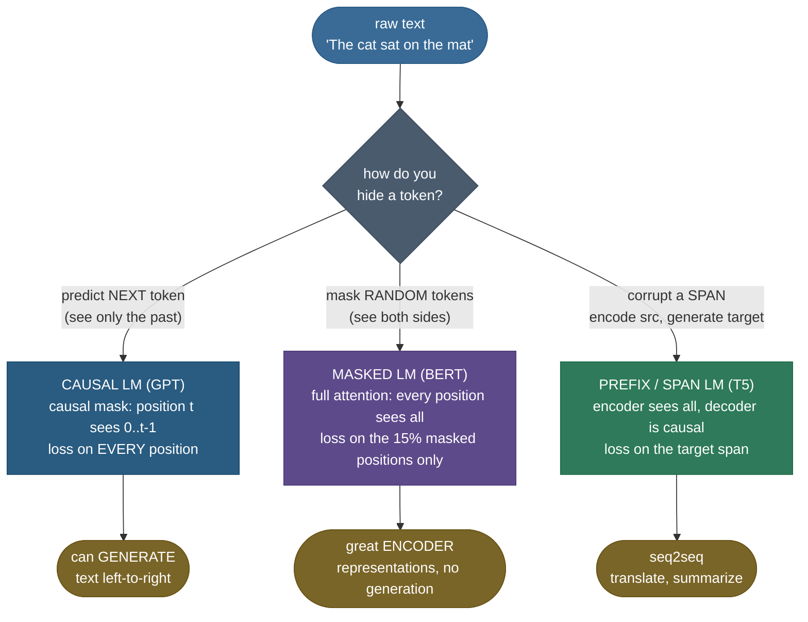
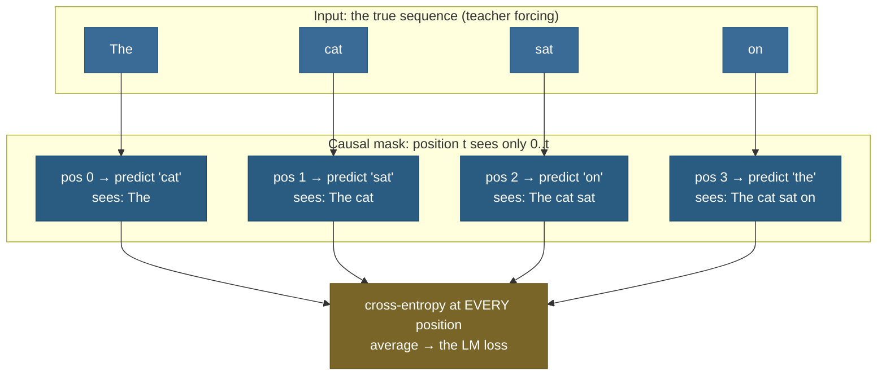

# Language Modeling Objectives: how a model learns language with no labels

You have a trillion words of raw internet text and not a single label. No "this sentence is positive," no "the answer is 42," no human told the model anything. Yet from *only* this unlabeled text, GPT learns to write code, BERT learns to power search, and T5 learns to translate. The trick that makes this possible — the thing that turns a pile of text into a training signal — is the **language modeling objective**: hide part of the text, ask the model to predict it, and score how surprised it is by the truth. That's it. The single most consequential idea in modern AI is *"predict the missing token,"* and the *flavor* of that prediction — next-token vs blanked-out-token — decides whether you get a model that **generates** (GPT) or a model that **understands** (BERT).

I'm going to walk this the way I'd explain it to a teammate who can code a transformer but has never written the loss. We'll start with *why* you'd ever phrase learning as prediction (feel the labels appear out of nowhere), then the **autoregressive / causal** objective behind GPT, then the **masked** objective behind BERT and *why* the same transformer learns something completely different, then the loss math derived symbol by symbol — softmax over the vocabulary, cross-entropy per position, and **perplexity** as its human-readable twin. Then we prove it in from-scratch code: compute next-token cross-entropy *by hand* on a toy vocabulary, watch a tiny model's loss and perplexity *drop* as it learns, and see the causal mask that makes it all work. By the end you'll be able to:

- explain **why** "predict the missing token" needs **no labels** — the text *is* the label (self-supervision);
- write the **causal LM** factorization $p(x) = \prod_t p(x_t \mid x_{<t})$ and the cross-entropy loss from it, on the spot;
- explain **teacher forcing** and the **causal mask**, and why they're two sides of the same coin;
- contrast **masked LM** (BERT) with causal LM, and say *why* masked learns representations but not generation;
- derive **perplexity** $= e^{\text{loss}}$ and explain it as an "effective branching factor";
- pick the right objective — **causal for generation, masked for encoding, prefix/span for seq2seq** — and justify it.

> **Note:** the objective is a *training-time* choice. It decides what the model learns to do, but it lives entirely in **how you compute the loss** — the transformer block underneath is nearly identical across all three. Causal vs masked is *one attention-mask flag and one choice of which positions you score*. That's the whole structural difference.

---

## The problem: learning from text with no labels

To see why these objectives exist, you have to feel the problem they solve: **supervised learning needs labels, and raw text has none.**

Classic machine learning is `(input, label)` pairs — an image and its class, an email and "spam." To train that way on language you'd need a human to annotate every example, and there isn't enough human time on Earth to label a trillion words. So for decades, NLP models were small, trained on tiny hand-labeled datasets, and brittle.

The breakthrough is a reframe so simple it sounds like cheating: **the text is its own label.** Take any sentence and hide one word:

```
The cat sat on the  ____
```

Now you have a supervised example for free — input is `"The cat sat on the"`, label is `"mat"` — and you *never asked a human anything*. The label was already sitting in the text; you just covered it up. Do this for every position in every sentence in your trillion-word corpus and you've manufactured *trillions* of labeled examples out of thin air. This is **self-supervised learning**: the supervision signal is generated automatically from the data's own structure.

> **Note:** "self-supervised" and "unsupervised" get used interchangeably, but they're different. Unsupervised learning (clustering, PCA) finds structure with *no* prediction target. Self-supervised learning *invents* a prediction target from the input itself, then trains exactly like supervised learning — same cross-entropy loss, same backprop. It's the best of both: the scale of unlabeled data, the sharp gradient of a supervised objective.

And here is the crucial fork in the road that the rest of this page is about:

> **Note:** there's more than one way to "hide a word." You can hide the **next** word and predict left-to-right (you only see the past) — that's **causal / autoregressive** LM, and it makes a model that can *generate*. Or you can hide a **random** word in the middle and predict it from **both sides** — that's **masked** LM, and it makes a model that *understands* but can't generate. Same text, same "predict the hidden token" idea, **opposite capabilities**. Which one you choose is the single most important decision in the recipe.

---

## Intuition: the apprentice and the proofreader

Two apprentices learn language from the same library, but with different exercises.

The **first apprentice** plays *"finish my sentence."* You read them text, stop mid-sentence, and they must guess the next word before you reveal it. They only ever see what came *before* — never the future. Do this billions of times and they become extraordinary at continuing any text: give them a prompt and they'll keep writing, word by word, because that's *exactly* the skill they drilled. This is the **causal / autoregressive** apprentice — this is **GPT**.

The **second apprentice** plays *"fill in the blank."* You hand them a full sentence with a few words blacked out, and they must reconstruct the blanks using *everything else in the sentence* — words before *and* after. They get to peek at both sides, so they build a rich, two-directional understanding of how each word fits its context. But notice: they've never had to produce text *from nothing*, left to right — they always had a full sentence scaffold to fill in. This is the **masked** apprentice — this is **BERT**. A brilliant proofreader and analyst, but you can't ask them to write you an essay from a blank page, because that was never the exercise.

That single difference — *do you see the future or not?* — is everything:

- See **only the past** → you learn to **predict forward** → you can **generate**. (Causal LM, GPT.)
- See **both sides** → you learn to **understand context** → you build great **representations** but can't generate. (Masked LM, BERT.)

The math, the attention mask, the loss — all of it is just bookkeeping that enforces one rule or the other. Hold this picture; everything below makes it precise.


---

## Mechanism: same transformer, two ways to hide a token

Concretely, all three objectives run text through a transformer that outputs, for every position, a vector of **logits over the vocabulary** — one score per possible token. The objective differs in exactly two places: **which positions you compute a loss on**, and **what each position is allowed to see** (the attention mask). That's the entire structural story, and it's worth seeing in one picture.



> **Note:** read the diagram as *one* decision — "how do you hide a token?" — with three answers. The transformer block underneath each branch is the same stack of attention + MLP layers. What changes is the **mask** (can a position see the future?) and the **loss positions** (where do you score the prediction?). Everything that makes GPT a generator and BERT an encoder lives in those two knobs. (the encoder/decoder split is unpacked in the seq2seq section below).


> **See it in 3D:** Brendan Bycroft's [interactive LLM visualizer](https://bbycroft.net/llm) walks a single token through a small GPT's entire forward pass — the clearest way to *see* the context turn into a next-token distribution, which is the causal objective made visible.

---

## Causal / autoregressive LM: predict the next token

This is the objective behind GPT, Llama, Claude, and every model that *generates*. The setup: read text strictly left to right; at each position, predict the **next** token using **only the tokens before it**.

The probability of a whole sequence factorizes by the **chain rule of probability** — exactly, with no approximation:

$$p(x_1, x_2, \dots, x_n) \;=\; \prod_{t=1}^{n} p(x_t \mid x_1, \dots, x_{t-1}) \;=\; \prod_{t=1}^{n} p(x_t \mid x_{<t})$$

> **Source / derivation:** [Jurafsky & Martin, *Speech and Language Processing* (3rd ed.), Ch. 3 "N-gram Language Models", §3.1](https://web.stanford.edu/~jurafsky/slp3/3.pdf) and [Bengio et al., *A Neural Probabilistic Language Model* (2003)](https://www.jmlr.org/papers/v3/bengio03a.html) — the chain-rule factorization of a sequence probability that defines the autoregressive language-modeling objective.

Read it left to right: the probability of the sentence is the probability of the first token, times the probability of the second *given* the first, times the third *given* the first two, and so on. We write $x_{<t}$ as shorthand for "all tokens before position $t$" — the **context**. The model's only job is to learn each conditional $p(x_t \mid x_{<t})$: *given everything so far, what comes next?*

> **Note:** this factorization is **exact**, not an assumption — the chain rule of probability holds for *any* joint distribution. The modeling assumption is only that a transformer with finite parameters can *approximate* each conditional well. (Contrast classic **n-gram** models, which *do* approximate, by truncating the context to the last $n-1$ tokens — see [N-gram Language Models](../../06.%20NLP/04-N-gram-Language-Models-and-Smoothing/04-N-gram-Language-Models-and-Smoothing.md). Neural LMs keep the full context.)

**Teacher forcing and the causal mask are the same idea, seen twice.** During training the whole target sentence is known, so we don't generate token by token — we feed the *true* sequence in and ask the model to predict each next token in parallel. Position $t$'s prediction is scored against the real token $x_{t+1}$. This is **teacher forcing**: the model always conditions on the *ground-truth* prefix, not its own past guesses. But for this to be honest, position $t$ must be **forbidden from peeking at** $x_{t+1}, x_{t+2}, \dots$ — otherwise predicting the next token is trivial (it's right there). The **causal mask** enforces exactly that: in the attention scores, every position is blocked from attending to any future position.



![Teacher forcing and the SHIFT, made literal on "the cat sat on mat". The model is fed the **true prefix** (blue, input row) and at every position predicts the **next** token (green, target row) — the amber arrows are the one-position shift, `logits[:, :−1]` lining up with `labels[:, 1:]`. Cross-entropy is scored at every position and averaged: $n$ tokens give $n-1$ predictions. Generated by `code/make_figures_01.py`.](../images/lm_teacher_forcing.png)

> **Gotcha:** there's an off-by-one that trips everyone the first time. With $n$ tokens you get $n-1$ predictions: position 0 predicts token 1, …, position $n-2$ predicts token $n-1$; the last position has no "next" token to predict. In code this is the famous **shift**: `logits[..., :-1, :]` lines up with `labels[..., 1:]`. Get the shift wrong and your loss is silently measuring the wrong thing.

> **Gotcha (training vs inference mismatch — "exposure bias"):** at *training* time the model always sees the true prefix (teacher forcing). At *generation* time it sees its **own** past tokens, errors included. A model that only ever conditioned on perfect prefixes can drift when fed its own mistakes — the gap is called **exposure bias**. It's why generation quality depends so much on the [decoding strategy](../18-Decoding-and-Sampling/18-Decoding-and-Sampling.md), not just the trained loss.

---

## Masked LM: predict the blanks from both sides

BERT's objective hides a *random* subset of tokens and predicts them from the **full** surrounding context — left *and* right. Because every position can attend to every other position (no causal mask), the model builds a deeply **bidirectional** representation of each token. That's a strictly richer view of context than left-to-right — *but it comes at the cost of generation*, because there's no notion of "next."

The recipe BERT introduced (and it's a specific, slightly weird recipe worth knowing) is the **15% rule**: pick 15% of token positions at random, and for each chosen position:

- **80% of the time** → replace it with a special `[MASK]` token. (`The cat [MASK] on the mat`.)
- **10% of the time** → replace it with a *random* token. (`The cat zebra on the mat`.)
- **10% of the time** → leave it *unchanged*. (`The cat sat on the mat`.)

The loss is computed **only on the 15% of chosen positions** — the other 85% are context, not targets.


> **Note (why the 80/10/10, not just always `[MASK]`):** the `[MASK]` token appears during *pre-training* but **never during fine-tuning or use** — real sentences don't contain `[MASK]`. If the model only ever saw `[MASK]` at masked positions, it would learn "only bother building a good representation when you see `[MASK]`," creating a train/test mismatch. The 10% random and 10% unchanged force the model to build a strong representation for **every** position, because it can't tell from the input alone which positions it will be graded on. The asymmetry is engineering to close that gap.

> **Gotcha (why masked LM can't generate):** masking 15% and predicting from both sides is great for *understanding* but useless for *generation*, because generation is fundamentally left-to-right with no future to peek at. BERT never learned to produce token $t+1$ from tokens $1..t$ alone — it always had the right context too. This is *the* reason BERT-family models are **encoders** (classification, retrieval, NER) and GPT-family models are **decoders** (generation). The objective, not the architecture, draws that line.

> **Note (sample efficiency tradeoff):** masked LM only scores 15% of positions per sentence, so it extracts *less* signal per token than causal LM, which scores *every* position. Masked LM needs more passes over the data to learn as much per token — one reason it fell out of favor once people wanted to scale generation. Causal LM's "predict every position" is more data-efficient *and* gives you generation for free.

---

## Prefix / span-corruption LM: the seq2seq middle ground

There's a third option that powers translation and summarization models like **T5**. It splits the model into an **encoder** that reads the input with *full* (bidirectional) attention and a **decoder** that generates the output with a *causal* mask. T5's specific objective is **span corruption**: replace contiguous spans of the input with sentinel tokens, and train the decoder to *generate* the missing spans.

```
input:   The cat <X> on the <Y> mat
target:  <X> sat <Y> soft </s>
```

You get the best of both: bidirectional *encoding* of the source (like BERT) and autoregressive *generation* of the target (like GPT). It's the natural fit when you have a clear `(source → target)` mapping — translate English→French, document→summary — rather than free-form continuation.

> **Note:** prefix-LM is a close cousin: a *single* stack where the **prefix** (the prompt) gets bidirectional attention and the **continuation** gets causal attention. It blurs the encoder/decoder split into one model. The point of all three seq2seq variants: *bidirectional where you're reading, causal where you're writing.*

> **Gotcha (why not use encoder-decoder for everything?):** the encoder-decoder split doubles the parameter bookkeeping and needs a clean `(source -> target)` pairing. For free-form continuation (chat, code) there is no fixed "source" to encode, so a single causal decoder is simpler and strictly more flexible. Encoder-decoder earns its complexity only when input and output are distinct, bounded sequences (translate, summarize).

---

## The math: softmax, cross-entropy, and perplexity

Now make the loss precise — this is the part interviewers ask you to derive on a whiteboard.

**Step 1 — logits to probabilities (softmax).** At each position the transformer emits a logit vector $z \in \mathbb{R}^{|V|}$, one score per vocabulary token ($|V|$ is the vocab size, e.g. ~50K). Softmax turns those raw scores into a probability distribution:

$$p(x_t = j \mid x_{<t}) \;=\; \text{softmax}(z)_j \;=\; \frac{e^{z_j}}{\sum_{k=1}^{|V|} e^{z_k}}$$

> **Source / derivation:** [Goodfellow, Bengio & Courville, *Deep Learning* (2016), §6.2.2 "Output Units"](https://www.deeplearningbook.org/contents/mlp.html) — the softmax that maps a logit vector to a normalized categorical distribution over the vocabulary.

The exponential makes everything positive; dividing by the sum makes the $|V|$ probabilities add to 1. Now $p(\cdot \mid x_{<t})$ is a proper distribution over "what comes next."


**Step 2 — score the truth (cross-entropy = negative log-likelihood).** We want the model to assign **high probability to the token that actually came next**. The clean way to score that is the **negative log-probability of the true token** — the cross-entropy between the one-hot truth and the model's distribution. At position $t$, if the true next token is $x_t$:

$$\mathcal{L}_t \;=\; -\log p(x_t \mid x_{<t})$$

> **Source / derivation:** [Goodfellow, Bengio & Courville, *Deep Learning* (2016), §5.5 "Maximum Likelihood Estimation"](https://www.deeplearningbook.org/contents/ml.html) — the per-position cross-entropy / negative log-likelihood, which is exactly the maximum-likelihood objective for the model's distribution.

If the model is certain and correct ($p \to 1$), then $-\log p \to 0$ — no loss. If it's certain and *wrong* ($p \to 0$), then $-\log p \to \infty$ — huge loss. The log turns "multiply probabilities along the sequence" into "add log-probabilities," which is numerically stable and exactly what gradient descent wants.


> **Note (why this *is* maximum likelihood):** maximizing the sequence probability $p(x) = \prod_t p(x_t \mid x_{<t})$ means maximizing its log, $\sum_t \log p(x_t \mid x_{<t})$, which means *minimizing* $-\sum_t \log p(x_t \mid x_{<t})$ — the sum of cross-entropies. So "predict the next token with cross-entropy loss" is *literally* **maximum-likelihood estimation** of the data distribution. Same objective, two names.

**Step 3 — average over the sequence.** The full loss is the mean cross-entropy over all scored positions (every position for causal LM; the masked positions for MLM):

$$\mathcal{L} \;=\; \frac{1}{T}\sum_{t=1}^{T} -\log p(x_t \mid x_{<t})$$

> **Source / derivation:** [Goodfellow, Bengio & Courville, *Deep Learning* (2016), §5.5 "Maximum Likelihood Estimation"](https://www.deeplearningbook.org/contents/ml.html) and [Jurafsky & Martin, *Speech and Language Processing* (3rd ed.), Ch. 3, §3.2](https://web.stanford.edu/~jurafsky/slp3/3.pdf) — averaging the per-position negative log-likelihood gives the mean cross-entropy training loss.

where $T$ is the number of scored positions. This is a single scalar; backprop pushes the model to raise $p$ on the true tokens.

> *Where this comes from: the cross-entropy / maximum-likelihood objective for language models is laid out in **Speech and Language Processing** (Jurafsky & Martin, Ch. 10) and **Deep Learning** (Goodfellow et al., Ch. 10), both in the references. The shapes follow directly from the transformer's per-position vocabulary projection in **Attention Is All You Need** (Vaswani et al. 2017).*

**Step 4 — perplexity, the human-readable twin.** Loss in "nats" (log base $e$) is hard to feel. **Perplexity** exponentiates it back into a number you can interpret:

$$\text{PPL} \;=\; e^{\mathcal{L}} \;=\; \exp\!\left(\frac{1}{T}\sum_{t=1}^{T} -\log p(x_t \mid x_{<t})\right)$$

> **Source / derivation:** [Jurafsky & Martin, *Speech and Language Processing* (3rd ed.), Ch. 3 "N-gram Language Models", §3.2 "Evaluating Language Models: Perplexity"](https://web.stanford.edu/~jurafsky/slp3/3.pdf) — perplexity as the exponentiated cross-entropy, read as the effective branching factor.

Because the loss is in nats (natural log), we invert with $e$; had we measured in bits (log base 2) we'd write $\text{PPL}=2^{\mathcal L}$ — same number, the base just has to match the log you used. (This is also why bits-per-byte is the tokenizer-free cousin.)

Perplexity is the **effective branching factor** — *how many equally-likely choices the model feels it's choosing between at each step.* If a model has perplexity 20, it's about as uncertain as if it were picking uniformly among 20 tokens at every position. Lower is better:

- **PPL = 1** → perfect: the model assigns probability 1 to every true token (zero loss, zero surprise).
- **PPL = |V|** (e.g. 50K) → no better than guessing uniformly at random — the model learned nothing.
- **A real well-trained LLM** lands at roughly **PPL 10–30** on held-out English (depends heavily on tokenizer and corpus).

> **Note (shapes, stated explicitly):** for a batch of $B$ sequences of length $T$ with vocab $|V|$, the logits tensor is $[B, T, |V|]$, the labels are $[B, T]$ (token *ids*, not one-hot), and cross-entropy reduces this to a single scalar. Two near-universal gotchas: **(1) shift** the logits and labels by one for causal LM (`logits[:, :-1]` vs `labels[:, 1:]`); **(2) ignore padding** — set padded label positions to a sentinel (`-100` in PyTorch) so they contribute zero loss. Forget either and your perplexity is quietly wrong.

> **Gotcha (perplexity isn't comparable across tokenizers):** a model with a *bigger* vocabulary or a *byte-level* tokenizer can have a very different perplexity for the *same* underlying language skill, because PPL is per-*token* and tokens differ. Never compare perplexities across models with different tokenizers — it's apples to oranges. Compare **bits-per-byte** instead when you need a tokenizer-independent number.

---

## Code: cross-entropy by hand, then watch a tiny LM learn

Theory lands when you compute it yourself. Below is a from-scratch demo that (1) computes next-token cross-entropy and perplexity **by hand** on a toy vocabulary so you can check the arithmetic, (2) builds the **causal mask** and prints it, and (3) trains a tiny model a few steps and watches **loss and perplexity drop**. It runs on CPU in seconds; no GPU needed.

> **Runnable project and a step-by-step notebook:** the same verified code lives as a clean script and an executed teaching notebook next to this page — see the [step-by-step teaching notebook](code/01-Language-Modeling-Objectives.ipynb) and the [runnable demo script](code/language_modeling_objectives.py) (run it with `python language_modeling_objectives.py`). Every figure on this page is reproduced from those same seeded functions by [`code/make_figures_01.py`](code/make_figures_01.py), and the autoregressive animation by [`code/make_animation_01.py`](code/make_animation_01.py) — so no number in a figure can drift from the prose or the demo.

```python
"""Language modeling objectives, from scratch: cross-entropy by hand, then watch a tiny LM learn.
Verified on Python 3.12 / torch 2.12.0. Device-agnostic (CUDA / MPS / CPU)."""
import math, torch, torch.nn as nn, torch.nn.functional as F

torch.manual_seed(0)
VOCAB = ["the", "cat", "sat", "on", "mat"]          # a 5-token toy vocabulary
V = len(VOCAB)

# --- 1. Cross-entropy and perplexity BY HAND on one prediction ---------------
# The model predicted these probabilities for the next token; the truth is "sat" (id 2).
probs = torch.tensor([0.10, 0.20, 0.50, 0.15, 0.05])    # sums to 1.0
true_id = 2                                              # "sat"
loss_by_hand = -math.log(probs[true_id].item())         # cross-entropy = -log p(true)
ppl_by_hand = math.exp(loss_by_hand)                    # perplexity = exp(loss)
print(f"p(true='sat') = {probs[true_id]:.2f}")
print(f"cross-entropy = -log({probs[true_id]:.2f}) = {loss_by_hand:.4f} nats")
print(f"perplexity    = exp({loss_by_hand:.4f})    = {ppl_by_hand:.4f}")
# A confident-but-wrong guess costs far more:
print(f"if it had said p=0.05 instead: loss = {-math.log(0.05):.4f} (much worse)\n")

# --- 2. The causal mask: position t may not see the future -------------------
T = 4
causal = torch.tril(torch.ones(T, T))                   # lower-triangular: 1 = allowed
print("causal mask (1=can attend, 0=blocked):")
print(causal.int().numpy(), "\n")

# --- 3. Train a tiny causal LM and watch loss/perplexity DROP -----------------
# One repeated sentence so the model can actually memorize the next-token pattern.
sentence = torch.tensor([[0, 1, 2, 3, 4]])              # "the cat sat on mat", shape [1, 5]

class TinyLM(nn.Module):                                # embedding -> 1 attention-ish layer -> vocab logits
    def __init__(self):
        super().__init__()
        self.emb = nn.Embedding(V, 16)
        self.ff = nn.Linear(16, 16)
        self.head = nn.Linear(16, V)                    # project to one logit per vocab token
    def forward(self, x):
        h = torch.tanh(self.ff(self.emb(x)))
        return self.head(h)                             # logits: [batch, seq, vocab]

model = TinyLM()
opt = torch.optim.Adam(model.parameters(), lr=0.05)
print(f"{'step':>4} | {'loss':>7} | {'perplexity':>10}")
print("-" * 28)
for step in range(0, 201, 40):
    for _ in range(40 if step else 1):                  # train in chunks of 40 steps
        logits = model(sentence)                        # [1, 5, V]
        # SHIFT: position t predicts token t+1 -> logits[:, :-1] vs labels[:, 1:]
        loss = F.cross_entropy(logits[:, :-1].reshape(-1, V), sentence[:, 1:].reshape(-1))
        opt.zero_grad(); loss.backward(); opt.step()
    print(f"{step:>4} | {loss.item():>7.4f} | {math.exp(loss.item()):>10.4f}")
```

Output (the by-hand numbers are exact on any device; the tiny training trace runs on CPU so its loss curve reproduces everywhere — MPS/CUDA reorder float ops and shift only the low-order digits):

```
p(true='sat') = 0.50
cross-entropy = -log(0.50) = 0.6931 nats
perplexity    = exp(0.6931)    = 2.0000
if it had said p=0.05 instead: loss = 2.9957 (much worse)

causal mask (1=can attend, 0=blocked):
[[1 0 0 0]
 [1 1 0 0]
 [1 1 1 0]
 [1 1 1 1]]

step | loss    | perplexity
----------------------------
   0 |  1.7148 |     5.5554
  40 |  0.0002 |     1.0002
  80 |  0.0001 |     1.0001
 120 |  0.0001 |     1.0001
 160 |  0.0001 |     1.0001
 200 |  0.0001 |     1.0001
```

![The training trace from the demo above, plotted: **loss** (top, nats) and its readable twin **perplexity** (bottom) both collapse as the tiny model memorizes the one sentence — loss $1.7148 \to 0.0001$, perplexity $5.56 \to 1.0001$. That march toward perplexity 1 *is* maximum likelihood working. The red dashed line marks the **realistic floor ≈ 1.19** from the "Try it" experiment: once the data is genuinely ambiguous (`'mat'` vs `'rug'` after the same prefix), even a perfect model cannot reach 1.0 — the irreducible entropy of real text. Generated by `code/make_figures_01.py`.](../images/lm_loss_perplexity_curve.png)

> **Note:** read the three blocks in order. **(1) By hand:** the model gave the true token "sat" a probability of 0.50, so cross-entropy is $-\log 0.50 = 0.6931$ nats and perplexity is $e^{0.6931} = 2.0$ — the model is "as uncertain as a fair coin" about this token. Had it said 0.05 instead, the loss jumps to ~3.0: confident-and-wrong is brutally penalized, exactly as the math promised. **(2) The mask** is lower-triangular — position 0 sees only itself, position 3 sees all four; the zeros above the diagonal are the future, blocked. **(3) Training:** loss falls $1.71 \to 0.0001$ and perplexity collapses $5.6 \to 1.0001$ — the model goes from "uncertain among ~6 tokens" to "all but certain of the right next token," because it memorized the one sentence. That perplexity-toward-1 curve *is* maximum likelihood working.

> **Try it:** before you run it, **predict** — we trained on a *single* repeated sentence, so the model drove perplexity to ~1.0 by **memorizing** it. If you instead trained on **two different** sentences that share a prefix but diverge (e.g. `the cat sat on mat` *and* `the cat sat on rug`), would the final perplexity settle **at 1.0**, **above 1.0**, or **below 1.0**? Now change `sentence` to a small batch of both and check. (Hint: after `the cat sat on`, the *true* next token is genuinely ambiguous — sometimes `mat`, sometimes `rug` — so even a perfect model can't put probability 1 on either. The best it can do is ~0.5 each, which floors perplexity *above* 1.0. That floor is the **irreducible entropy** of the data — the real reason no LM reaches PPL 1 on real text — here ~1.19, a touch above the theoretical ~1.09 because 400 steps don't fully zero even the deterministic positions; train longer and it settles toward ~1.09, but never to 1.0.)

> **Tip:** to see the real thing at scale, compute perplexity with `model(...).loss` on a held-out text in Hugging Face for a small GPT-2 vs a larger one — the bigger model's perplexity is lower, which is exactly the signal scaling laws are built on (see [Scaling Laws](../03-Scaling-Laws/03-Scaling-Laws.md)).

---

## Where it matters: the objective decides the model's whole identity

This is the crux, and it's worth stating plainly: **the objective is chosen once, at pre-training, and it determines what the model fundamentally can and cannot do for the rest of its life.** It's not a tunable knob you flip at inference — it's the *exercise the model drilled billions of times*, and you can't un-drill it.

**Which system layer does it live at?** The objective sits at the **training-loss layer** — the very top of the stack, where logits meet labels. Everything below (attention, MLP, the parameter count) is shared infrastructure. So the objective is a *cheap* thing to change in code (one mask flag, one choice of scored positions) but an *enormously expensive* thing to change in practice, because changing it means **re-pretraining from scratch** — millions of dollars of compute. That asymmetry is why the objective is the most consequential single decision in the recipe.

**The tradeoff it makes:**

- **Causal LM** trades away bidirectional context (it can only see the past) to *gain generation* and *maximum data efficiency* (every position is a training signal). This is why the entire generative-AI wave — GPT, Llama, Claude, Gemini — is built on it.
- **Masked LM** trades away generation to *gain a richer bidirectional representation* of each token, which is exactly what you want for *classification and retrieval*, where you have the whole input up front and just need to *understand* it.

**When NOT to use each:**

- **Don't use masked LM if you need to generate.** BERT cannot write you a paragraph — it never learned left-to-right production. Reaching for an encoder to do generation is the classic mismatch.
- **Don't use causal LM if your task is pure understanding of a fixed input** (sentence classification, embedding for search). A bidirectional encoder will usually give better representations for the same compute, because it sees both sides of every token. (Though in 2024+, large causal LMs are so capable that they're often used for *everything* anyway — the line is blurring as scale papers over the gap.)
- **Don't reach for encoder-decoder / T5 on open-ended generation:** there is no fixed source to encode, and a causal decoder does it more simply.

> **Note:** the modern story is that **causal LM won** for the headline use cases — not because it makes better *representations* (masked LM arguably does, per-token) but because generation is the killer app, causal LM is more data-efficient, and a big enough causal model turns out to be a great encoder *too* (you can read its hidden states). When in doubt at scale, people reach for a decoder.

---

## In production: who uses which, and the real numbers

Tying the objectives to models you've used makes them concrete:

| Family | Objective | Attention | Generates? | Typical use | Examples |
|---|---|---|:---:|---|---|
| **GPT / decoder** | causal LM | causal mask | **yes** | chat, code, agents, writing | GPT-4, Llama-3, Claude, Mistral, Gemini |
| **BERT / encoder** | masked LM | bidirectional | no | classification, NER, retrieval, ranking | BERT, RoBERTa, DeBERTa, ELECTRA |
| **T5 / enc-dec** | span corruption | enc bidir, dec causal | **yes** | translation, summarization | T5, BART, FLAN-T5, mT5 |

A few production realities worth carrying into an interview:

- **The causal objective is *all* of pre-training for an LLM.** Before any instruction tuning or RLHF, GPT-style models do *nothing but* next-token prediction over trillions of tokens. That single objective is where ~99% of the model's knowledge and capability comes from; everything after ([SFT](../13-Supervised-Fine-Tuning/13-Supervised-Fine-Tuning.md), [RLHF/DPO](../15-RLHF-and-DPO/15-RLHF-and-DPO.md)) just *aligns and steers* what next-token prediction already learned.
- **Perplexity is the pre-training dashboard.** During pre-training, the one number everyone watches is held-out perplexity (or its log, the loss) ticking down. The [scaling laws](../03-Scaling-Laws/03-Scaling-Laws.md) that predict "more compute → better model" are literally fitted curves of *loss vs compute*.
- **Real ballparks:** GPT-2 scored ~**35** perplexity on WikiText-103; modern large models push held-out English perplexity into the **low teens or single digits** on clean corpora — but remember the tokenizer caveat: these numbers are only comparable within the same tokenizer.
- **BERT-family models are *everywhere you don't see them*** — they quietly power search ranking, semantic retrieval (the embedding half of most RAG systems), spam filters, and content moderation, precisely because masked pre-training makes excellent fixed-input understanders. Generation gets the headlines; encoders do a huge share of the silent work.

> **Gotcha:** because the objective is set at pre-training, you can't "convert" a BERT into a GPT (or vice versa) by fine-tuning — the bidirectional encoder simply never learned to generate left-to-right. To get a generator you pre-train *causally* from the start. The objective is upstream of everything; choose it deliberately.

---

## Recap and rapid-fire

**If you remember nothing else:** every LLM is trained by **hiding part of the text and predicting it** — self-supervision, no labels needed, because the text *is* the label. *How* you hide it is the whole game: hide the **next** token and see only the past → **causal LM** → a **generator** (GPT); hide **random** tokens and see both sides → **masked LM** → an **understander** (BERT); corrupt a **span** and encode-then-decode → **seq2seq** (T5). The loss is always **cross-entropy** ($-\log p$ of the true token, = maximum likelihood), and **perplexity** $= e^{\text{loss}}$ reads it as an effective branching factor. The objective is chosen once at pre-training and decides the model's entire identity.

**Quick-fire — say these out loud:**

- *Why no labels needed?* The next/hidden token *is* the label — self-supervision manufactures trillions of examples from raw text.
- *Write the causal LM factorization.* $p(x) = \prod_t p(x_t \mid x_{<t})$ — chain rule, exact.
- *What's the loss?* Mean cross-entropy $= \frac{1}{T}\sum_t -\log p(x_t \mid x_{<t})$ — which *is* maximum likelihood.
- *What's teacher forcing?* Condition each prediction on the *true* prefix (not the model's own guesses); the causal mask enforces it.
- *Causal vs masked in one line?* Causal sees only the past → can generate; masked sees both sides → understands but can't generate.
- *Why BERT's 80/10/10?* So the model builds a good representation at *every* position, not just where it sees `[MASK]` — closing the pre-train/use mismatch.
- *What's perplexity?* $e^{\text{loss}}$ — the effective number of equally-likely tokens the model is choosing among; PPL 1 is perfect, PPL $|V|$ is random.
- *Why is real-text perplexity never 1?* Language has irreducible entropy — the next token is genuinely ambiguous, so even a perfect model can't be certain.
- *Why did causal LM win?* It generates, it's the most data-efficient (every position is a signal), and at scale it's also a great encoder.
- *Can you fine-tune BERT into GPT?* No — it never learned to generate left-to-right; you must pre-train causally from scratch.

---

## References and further reading

The curated link library for this topic — videos, courses, articles, papers, books, and internal cross-links — lives in a companion file so it can be reused as a standalone reference list:

**→ [Language Modeling Objectives — references and further reading](01-Language-Modeling-Objectives.references.md)**
