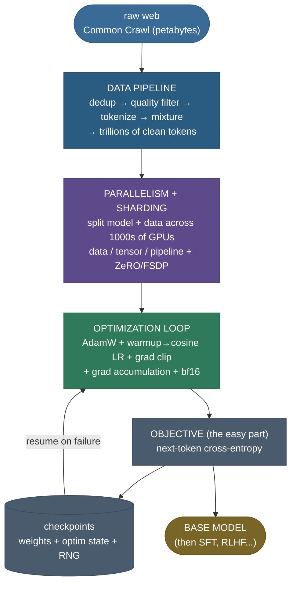
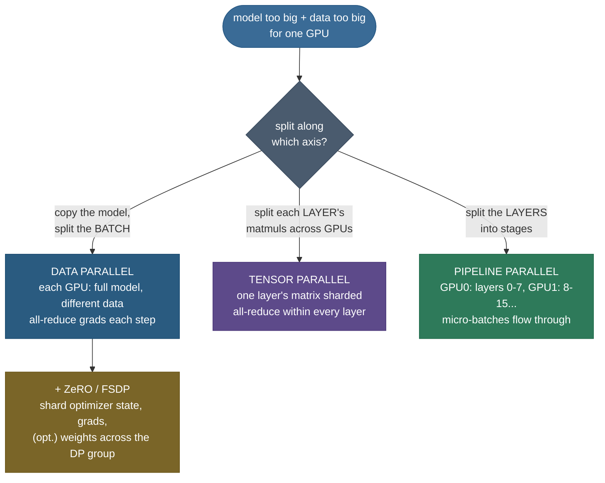

# Pretraining at Scale: turning a trillion tokens into a base model

You already know the *objective*: predict the next token. A few dozen lines of PyTorch can train a tiny one on a laptop. So why does a frontier base model cost **tens of millions of dollars**, occupy **thousands of GPUs for months**, and employ a whole team of systems engineers? Because at scale the objective is the *easy* part — the hard part is everything around it: cleaning **trillions of tokens** of raw web sludge into something worth learning from, splitting one model that *doesn't fit on a single GPU* across thousands of them without the communication melting throughput, and keeping a months-long run from silently diverging at step 80,000 when a single bad batch sends the loss to infinity. **Pretraining at scale is a systems problem wearing a machine-learning hat**, and that is exactly what interviewers probe: not "what's the loss," but "how do you actually *run* this."

I'm going to walk this the way I'd explain it to a teammate about to babysit their first big run. We'll start with *why* scale changes the problem (feel where the bottleneck moves), then the **data pipeline** that turns Common Crawl into a corpus, then the three kinds of **parallelism** (and the memory-vs-compute-vs-communication trade each one makes), then the **optimization recipe** that keeps the run stable, then the **systems realities** — throughput, MFU, checkpointing, hardware failure — and the **6ND compute rule** for budgeting it all. We prove the two non-obvious mechanics in from-scratch code — the **warmup+cosine** learning-rate schedule and **gradient-accumulation equivalence** (how you fake a giant batch). By the end you'll be able to:

- describe the **data pipeline** — Common Crawl → dedup → quality filter → tokenize → mixture — and say *why each stage exists*;
- explain **data, tensor, and pipeline parallelism** and **ZeRO/FSDP sharding**, and *which resource each one trades*;
- write the **warmup + cosine** LR schedule and explain warmup, the off-by-one, and why cosine;
- explain **gradient accumulation** and prove it's equivalent to a bigger batch — the "fake a big batch" trick;
- compute training **FLOPs ≈ 6·N·D**, **tokens/sec**, and **MFU**, and budget a real run from them;
- name the **stability** failure modes (loss spikes, fp16 overflow, the BN/dropout grad-accum caveat) and their fixes.

> **Note:** the *objective* is settled elsewhere — pretraining an LLM is next-token prediction (causal LM) over the whole corpus, nothing more exotic. This page does **not** re-derive the loss (see [Language Modeling Objectives](../01-Language-Modeling-Objectives/01-Language-Modeling-Objectives.md)) and does **not** re-derive the compute-optimal allocation (see [Scaling Laws](../03-Scaling-Laws/03-Scaling-Laws.md)). It is about the **engineering that turns that objective, at trillion-token scale, into a foundation model.**

---

## The problem: at scale, the objective is the easy part

To see why pretraining is hard, you have to feel *where the bottleneck moves* as you scale up.

On a laptop, training a small LM is trivial: the data fits in RAM, the model fits on one device, and the loss curve descends without drama. None of those three facts survive contact with scale.

- **The data doesn't fit, and most of it is garbage.** Common Crawl is **petabytes** of raw web pages — boilerplate, spam, adult content, near-duplicate mirrors, and SEO sludge. Train on it raw and the model learns the average of the internet, which is *not* what you want. Roughly **half the effort of a frontier model is data work** you never see in the paper's headline.
- **The model doesn't fit on one GPU.** A 70B-parameter model in 16-bit weights is **140 GB** — and that's *just the weights*. Add optimizer state and activations and you need several times that, while an H100 has **80 GB**. So the model *must* be split across many GPUs, and the moment you split it, the GPUs have to *talk to each other every step* — and that communication, not the math, becomes the thing that decides your speed.
- **A months-long run can silently break.** Over $10^{24}$ FLOPs and hundreds of thousands of steps, a single anomalous batch or a numerical overflow can send the loss spiking to infinity, and a GPU *will* fail — at thousand-GPU scale, hardware failures are a routine occurrence, not an edge case. A run that isn't engineered to survive these wastes the eight-figure budget.

And here is the reframe the whole page is about:

> **Note:** the headline numbers — GPT-3 trained on **300 billion tokens**, Llama-3 on **15 trillion** — are not about a cleverer objective. They are about *systems*: a data pipeline that can produce 15 trillion clean tokens, a parallelism strategy that keeps thousands of GPUs busy, and an optimization recipe stable enough to run for months. The objective fits in one line; making it run at scale is the discipline.

---

## Intuition: building a skyscraper, not a treehouse

A treehouse and a skyscraper are "the same idea" — wood, nails, a floor — but you do not build a skyscraper by scaling up treehouse techniques. The constraints are *different in kind*: you suddenly care about steel logistics, crane scheduling, wind load, and what happens when one welder calls in sick. Training a tiny LM is the treehouse; pretraining a foundation model is the skyscraper.

- **Treehouse (laptop LM):** grab any wood (any data), one person builds it (one GPU), and if a nail bends you just hammer another (a bad step barely matters). The thing you optimize is *your* time.
- **Skyscraper (foundation model):** the **materials** must be inspected and graded before they go in (data cleaning), the **structure** is too big for one crew so it's built in coordinated sections by thousands of workers who must stay in sync (parallelism + communication), and a **slow, stable schedule** matters more than raw speed because a collapse at floor 80 is catastrophic (LR warmup, gradient clipping, checkpointing). The thing you optimize is *throughput across the whole crew without the building falling down*.

That shift — from "make my code fast" to "keep a thousand-GPU crew in sync, fed with clean materials, on a stable schedule, surviving failures" — is the entire content of this page. Three questions organize it:

1. **Where do the materials come from?** → the data pipeline.
2. **How do a thousand workers build one structure together?** → parallelism + sharding.
3. **What keeps the build from collapsing over months?** → the optimization recipe + systems engineering.

---

## Mechanism: the pretraining stack, end to end

Concretely, a pretraining run is a pipeline of stages, each feeding the next. The objective sits at the very end and is the *least* of the engineering; everything before it is the work.



> **Note:** read the diagram left to right as a *materials → assembly → quality control* line. The **objective** box is deliberately small — it's one cross-entropy. The big, load-bearing boxes are **data**, **parallelism**, and the **optimization loop**, with **checkpoints** as the safety net that catches a failure and feeds the loop back its last good state. The rest of this page is one section per big box.

> **See a real run:** Andrej Karpathy's [Let's reproduce GPT-2 (124M)](https://www.youtube.com/watch?v=l8pRSuU81PU) walks this *entire* stack end to end on a smaller scale — data loading, the init, the warmup+cosine schedule, gradient clipping, and the throughput numbers — the clearest way to *watch* the loop this page describes actually run.

---

## Stage 1 — the data pipeline: from Common Crawl to a corpus

The single highest-leverage part of pretraining is the part nobody sees: **what tokens you feed the model.** A famous result (and a recurring interview point) is that **data quality beats data quantity** — a smaller, cleaner corpus routinely beats a larger, dirtier one. The pipeline is a sequence of filters, each removing a different kind of garbage.


Walking the stages, and *why each one earns its place*:

- **Extraction.** Raw Common Crawl is HTML. Strip the markup, navigation bars, ads, and boilerplate down to the actual prose. Get this wrong and the model learns to predict `<div class="nav">`.
- **Language ID + heuristic filters.** Keep the languages you want; drop pages that fail cheap quality heuristics (too few words, too high a symbol-to-word ratio, bad punctuation distribution). This is the coarse first cut.
- **Deduplication.** The web is *enormously* redundant — the same article is mirrored across thousands of sites. **Exact** dedup catches identical documents; **near-dup** (MinHash / SimHash) catches reworded copies. Dedup matters more than it sounds: training repeatedly on duplicated text both wastes compute and *hurts* the model (it over-memorizes and generalizes worse), and it's a [memorization/privacy](https://arxiv.org/abs/2107.06499) risk.
- **Model-based quality filtering.** Train a lightweight classifier to score "does this read like the high-quality reference text (Wikipedia, books) I want?" and keep the high-scoring pages. This is how FineWeb-Edu, the Llama corpora, and others get their final lift.
- **Data mixture.** A corpus is a *weighted blend* of sources — web text, code, books, academic papers, math. The weights matter: too much code and prose suffers; too little and the model can't program. Tuning the mixture is its own research problem.
- **Tokenization at scale.** Run the whole corpus through a BPE tokenizer (see [Tokenization & Subword Algorithms](../../06.%20NLP/02-Tokenization-and-Subword-Algorithms/02-Tokenization-and-Subword-Algorithms.md)) once, producing token-id shards **packed** into fixed-length training sequences so no compute is wasted on padding.

> **Note (data quality > quantity, made concrete):** the *Textbooks Are All You Need* line (Microsoft's **phi** models) showed a ~1–3B model trained on a small, heavily-filtered "textbook-quality" corpus matching models **10× its size** trained on raw web. The lesson interviewers want: *filtering is not preprocessing trivia — it is a primary lever on final quality, often bigger than a parameter-count bump.*

> **Gotcha (test-set contamination):** if benchmark questions leak into the training corpus — and on a web-scale crawl they *will* unless you actively remove them — your eval scores are inflated and meaningless. Serious pipelines **decontaminate**: explicitly search for and strip known benchmark text before training. Skipping this is how a model "scores great" and then fails in the real world.

> **Tip:** the public corpora to know by name — **C4** (Colossal Clean Crawled Corpus, the cleaned-Common-Crawl behind T5), **The Pile** (EleutherAI's curated 800GB mix), **RedPajama** (an open reproduction of the LLaMA mixture), and **FineWeb / FineWeb-Edu** (Hugging Face's heavily-filtered 15T-token web corpus). Naming the pipeline that produced your tokens is a real interview signal.

---

## Stage 2 — parallelism: one model, a thousand GPUs

The model and its training state don't fit on one device, so you split them. There are **three independent axes** along which you can cut the problem, plus a sharding scheme for the optimizer state — and each one trades a *different* resource. Understanding *which* resource each trades is the whole point.

First, *why* one GPU isn't enough — the memory the optimizer demands:

> **Note (the optimizer-state tax):** training a model with **N** parameters in mixed precision needs far more than just the weights. With **Adam**, per parameter you store: the bf16 weight (2 bytes), an fp32 master copy of the weight (4 bytes), and Adam's two fp32 moments — momentum and variance (4 + 4 bytes). That's **~16 bytes/parameter** *before* activations. A 7B model is thus ~**112 GB** of optimizer + master-weight state (16 × 7×10⁹ bytes), already past an 80 GB GPU before you add activations. This optimizer-state tax, not the forward pass, is why even moderate models must shard.



**Data parallelism (DP)** — the simplest. Replicate the *whole* model on every GPU; give each a different slice of the batch; after the backward pass, **all-reduce** the gradients so every replica averages to the same update. It scales *throughput* almost linearly, but it does **nothing** for the memory problem — every GPU still holds a full model copy. *Trades: communication (one all-reduce of all gradients per step) for throughput. Doesn't help if the model itself doesn't fit.*

**Tensor parallelism (TP)** — split the matrices *inside* a layer. A layer's big weight matrix is sharded column-wise (or row-wise) across GPUs; each computes a partial result and they **all-reduce within the layer** to reconstruct the full output. This shrinks per-GPU memory for the weights, but the all-reduce happens *inside every layer, every forward and backward pass*, so it's communication-heavy — only viable over a **fast interconnect** (NVLink within a node). *Trades: heavy intra-layer communication for the ability to fit a layer too big for one GPU.* This is the **Megatron-LM** approach.

**Pipeline parallelism (PP)** — split the *layers* into stages on different GPUs (GPU 0 holds layers 0–7, GPU 1 holds 8–15, …). A batch flows through the stages like an assembly line. The catch is the **pipeline bubble**: while stage 0 works on the first micro-batch, stages 1–3 sit idle. The fix is to chop the batch into many **micro-batches** so all stages stay busy most of the time. *Trades: a startup/drain bubble (idle time) for fitting a deep model across stages with relatively little communication (only activations cross stage boundaries).*

**ZeRO / FSDP — shard the state, not just the data.** Plain data parallelism is wasteful: it stores N identical copies of the optimizer state. **ZeRO** (Zero Redundancy Optimizer) and its PyTorch sibling **FSDP** (Fully Sharded Data Parallel) **shard** the optimizer state, the gradients, and optionally the weights themselves across the data-parallel GPUs, gathering each shard *just in time* for the computation that needs it and freeing it after. ZeRO has three stages: **Stage 1** shards optimizer state, **Stage 2** adds gradient sharding, **Stage 3** adds weight sharding (this is FSDP's default). The result: data-parallel *throughput* with a per-GPU memory footprint that *drops as you add GPUs* — the trick that lets you train a model far larger than any single device. *Trades: extra gather/scatter communication for a memory footprint that shrinks with cluster size.*

> **Note (3D parallelism — they compose):** real frontier runs use **all three at once** — e.g. tensor-parallel *within* a node (fast NVLink), pipeline-parallel *across* a few nodes, and data-parallel *across* the rest — with ZeRO sharding on top. Picking the split is the core systems decision: TP where the interconnect is fastest, PP across slower links, DP for the rest. "3D parallelism" is the name for this combination.

These memory-saving tricks aren't only about parallelism. Two more, applied *per GPU*, cut memory further:

- **Mixed precision (bf16).** Do the math in **bfloat16** (2 bytes) instead of fp32 (4 bytes) — halving memory and roughly doubling throughput on modern tensor cores — while keeping an **fp32 master copy** of the weights for the optimizer update. **bf16** is preferred over the older fp16 because it has the *same exponent range as fp32*, so it doesn't overflow on large values (the headache fp16 needed "loss scaling" to manage). See the [Mixed Precision](https://arxiv.org/abs/1710.03740) paper.
- **Gradient (activation) checkpointing.** The backward pass needs the forward activations. Storing them all is expensive, so **checkpoint**: keep only a few activations and *recompute* the rest during the backward pass. *Trades compute (an extra forward pass) for memory* — typically ~30% more compute for a large activation-memory saving. Don't confuse this with *model* checkpointing (saving weights to disk); same word, different idea.

| Technique | What it splits / does | Resource it trades | When you reach for it |
|---|---|---|---|
| Data parallel (DP) | replicates model, splits batch | comms (grad all-reduce) → throughput | always, as the outer loop |
| Tensor parallel (TP) | shards matrices inside a layer | heavy intra-layer comms → fit a big layer | layer too big for one GPU; fast interconnect |
| Pipeline parallel (PP) | shards layers into stages | pipeline bubble → fit a deep model | very deep model across nodes |
| ZeRO / FSDP | shards optimizer state/grads/weights | gather/scatter comms → memory shrinks with cluster | the default way to save memory in DP |
| Mixed precision (bf16) | 16-bit math, fp32 master weights | tiny precision → 2× memory & speed | always, on modern hardware |
| Gradient checkpointing | recompute activations in backward | ~30% extra compute → big memory saving | when activation memory is the wall |

---

## Stage 3 — the optimization recipe that keeps a run stable

With clean data and a working parallelism strategy, the last job is the **optimization loop** itself — and at scale, a *stable* loop matters more than a clever one. The recipe is remarkably standard across models, precisely because stability is hard-won.

- **Optimizer: AdamW.** Adam with **decoupled weight decay** ([Loshchilov & Hutter](https://arxiv.org/abs/1711.05101)). Adam's per-parameter adaptive step handles the wildly different gradient scales across an LLM's parameters; "W" means the weight-decay regularization is applied *separately* from the gradient step (the original Adam coupled them incorrectly). Typical $\beta_1=0.9$, $\beta_2=0.95$ (a lower $\beta_2$ than the 0.999 default, for stability on noisy LLM gradients).
- **Learning-rate schedule: warmup → cosine decay.** *Warm up* the LR linearly from 0 over the first few thousand steps, then **cosine-decay** it down to a small floor (often ~10% of peak) over the rest of training. We derive both pieces in the math section — this is one of the two things we prove in code.
- **Gradient clipping.** Clip the global gradient **norm** to a fixed value (commonly 1.0). This is the seatbelt against **loss spikes**: a single anomalous batch can produce a huge gradient that, unclipped, blows the weights out and sends the loss to infinity. Clipping caps the step size so one bad batch can't wreck the run.
- **Weight decay** (~0.1) for regularization, and a **large effective batch** (millions of tokens per step) for a stable gradient estimate — assembled via **gradient accumulation**, the *other* thing we prove in code.

> **Note (the loss curve's shape):** a healthy pretraining loss curve has a recognizable profile — a *fast* early drop (the model learns frequent tokens and basic syntax), then a long, slow, **roughly power-law** descent (it grinds out the long tail of knowledge), often with a small bump where the cosine schedule's LR is still high. The number everyone stares at on the dashboard is **held-out loss / perplexity** ticking down. Sudden *spikes* are the alarm — see the pitfalls section.

---

## The math: the LR schedule, the effective batch, and 6ND

Three pieces of math run the recipe. None is deep, but each has a subtlety worth stating precisely.

**1 — The warmup + cosine learning-rate schedule.** Let $\eta_{\max}$ be the peak LR, $\eta_{\min}$ the floor, $W$ the number of warmup steps, and $T$ the total steps. The LR at step $t$ (with $0 \le t \le T$) is:

$$
\eta(t) = \begin{cases}
\eta_{\max}\cdot \dfrac{t}{W} & t < W \quad\text{(linear warmup)} \\[1.2em]
\eta_{\min} + \tfrac{1}{2}\left(\eta_{\max}-\eta_{\min}\right)\left(1 + \cos\!\left(\pi\,\dfrac{t-W}{T-W}\right)\right) & t \ge W \quad\text{(cosine decay)}
\end{cases}
$$

> **Source / derivation:** the cosine-decay half follows [Loshchilov & Hutter, *SGDR: Stochastic Gradient Descent with Warm Restarts* (2016)](https://arxiv.org/abs/1608.03983) — the cosine-annealing schedule. The linear-warmup half is the standard Transformer/GPT-style training recipe; the original warmup schedule is in [Vaswani et al., *Attention Is All You Need* (2017), §5.3](https://arxiv.org/abs/1706.03762).

Read the two pieces. **Warmup** ($t<W$): a straight line from 0 up to $\eta_{\max}$. *Why warmup at all?* At step 0 the weights are random and Adam's variance estimate is unreliable; a full-size LR step here can wreck the model before it stabilizes. Ramping in gently lets Adam's running statistics settle. **Cosine decay** ($t\ge W$): the cosine argument runs from $0$ (at $t=W$, where $\cos 0 = 1$, giving the full $\eta_{\max}$) to $\pi$ (at $t=T$, where $\cos\pi = -1$, giving $\eta_{\min}$), so the LR follows a smooth half-cosine from peak down to floor. A slow, smooth decay lets the model take big steps early and fine, careful steps late.

> **Gotcha (the off-by-one in the cosine):** the decay fraction is $\frac{t-W}{T-W}$, **not** $\frac{t}{T}$. The cosine must restart its clock *at the end of warmup* — at $t=W$ the fraction is 0 (full LR), at $t=T$ it's 1 (floor). Use $\frac{t}{T}$ and the LR is already partway down the cosine the instant warmup ends, producing a visible kink and a too-low peak LR. We print both endpoints in the code to confirm they're exactly $\eta_{\max}$ and $\eta_{\min}$.

**2 — The effective batch and gradient accumulation.** You want a *large* batch (millions of tokens) for a stable gradient, but a large batch doesn't fit in memory. **Gradient accumulation** fakes it: run $K$ small **micro-batches** of size $m$, *sum* (or average) their gradients *without* stepping the optimizer, then take **one** optimizer step. The effective batch is:

$$\text{batch}_{\text{eff}} = m \times K \times (\text{data-parallel GPUs})$$

> **Source / derivation:** a definitional identity — the effective batch is the per-step example count summed across the $K$ accumulation steps and the data-parallel replicas; the gradient equivalence that makes it behave like one batch is the mean-of-means result proved just below.

The key claim — and the second thing we prove in code — is **equivalence**: accumulating gradients over $K$ micro-batches of size $m$ produces (to floating-point tolerance) the **same parameter update** as one true batch of size $mK$. We prove this on a linear model with MSE — deliberately, so the only thing that can differ between the two paths is float rounding of the gradient sum; doing it inside the Adam+schedule loop would entangle the optimizer's per-parameter scaling and hide the clean identity. Why? The loss is a **mean over examples**, so the gradient is a mean of per-example gradients, and the mean of $K$ groups each averaged over $m$ examples equals the single average over all $mK$ examples — *as long as you average consistently*. The mechanism is pure linearity of the gradient operator:

$$\nabla \left(\frac{1}{mK}\sum_{i=1}^{mK} \ell_i\right) = \frac{1}{mK}\sum_{i=1}^{mK} \nabla \ell_i = \frac{1}{K}\sum_{k=1}^{K}\underbrace{\left(\frac{1}{m}\sum_{i\in \text{chunk}_k} \nabla \ell_i\right)}_{\text{micro-batch }k\text{'s mean grad}}$$

> **Source / derivation:** the equal-batch equivalence (accumulating $K$ micro-batches simulates one batch of size $mK$) is stated in [Hugging Face Transformers — Methods and tools for efficient training: gradient accumulation](https://huggingface.co/docs/transformers/en/perf_train_gpu_one#gradient-accumulation); it rests on nothing more than linearity of the gradient operator (shown above).

The right-hand side is exactly "average the $K$ micro-batch gradients" — which is what accumulation does. This is the single most important systems trick for large-batch training: it **decouples the math (huge effective batch) from the memory (one small micro-batch at a time)**.

> **Gotcha (the averaging must be consistent):** if your loss is a *mean* (PyTorch's default), you must **divide each micro-batch's loss by $K$** before `backward()` (or divide the summed gradient by $K$ after). Forget it and your effective gradient is $K\times$ too large — a silent, run-wrecking bug. Summed-loss setups instead divide once at the end. We assert the equivalence holds in the code precisely to catch this.

**3 — Training compute: the 6ND rule.** The total training compute in FLOPs is, to a very good approximation:

$$C \approx 6 \, N \, D$$

> **Source / derivation:** the $C \approx 6ND$ estimate is from [Kaplan et al., *Scaling Laws for Neural Language Models* (2020)](https://arxiv.org/abs/2001.08361) and used throughout [Hoffmann et al., *Training Compute-Optimal Large Language Models (Chinchilla)* (2022)](https://arxiv.org/abs/2203.15556) — the per-token compute of a forward+backward pass (full forward-$2N$ + backward-$4N$ derivation in the [Scaling Laws](../03-Scaling-Laws/03-Scaling-Laws.md) chapter).

where $N$ is the number of parameters and $D$ is the number of training tokens. The **6** comes from counting multiply-adds: a forward pass over one token costs ~$2N$ FLOPs (each parameter does one multiply-add = 2 FLOPs), and the backward pass costs ~$2\times$ the forward (it computes gradients with respect to both activations and weights), giving ~$6N$ FLOPs *per token*; multiply by $D$ tokens for the total. This single formula is how every training run is budgeted.

> *Where the factor of 6 comes from, in full — including the forward $2N$ and the backward $4N$ accounting — is derived in [Scaling Laws](../03-Scaling-Laws/03-Scaling-Laws.md), which also covers the **compute-optimal** question (given a fixed $C$, how to split it between a bigger $N$ and more $D$ — the Chinchilla result). This page **uses** $6ND$ as a budgeting tool; that page **derives** it and the allocation rule. Don't duplicate them in an interview — cite the split.*

**Worked example — budgeting GPT-3.** GPT-3 is $N = 175\text{B} = 1.75\times10^{11}$ parameters, trained on $D = 300\text{B} = 3\times10^{11}$ tokens. So:

$$C \approx 6 \times 1.75\times10^{11} \times 3\times10^{11} = 3.15\times10^{23}\ \text{FLOPs}.$$

On an A100 delivering ~$3.12\times10^{14}$ FLOP/s *of useful work* (its ~312 TFLOP/s bf16 peak, run at 100% — unrealistic), that's $3.15\times10^{23} / 3.12\times10^{14} \approx 10^{9}$ GPU-seconds ≈ **32 GPU-years**. At a realistic ~40% utilization (MFU — the fraction of peak compute you actually achieve, defined in the next section) it's ~80 GPU-years — i.e. ~1000 A100s for about a month. The formula turns "how long, how many GPUs, how much money" into one multiplication.

---

## Systems realities: throughput, MFU, checkpointing, failure

Once the loop runs, you live and die by a few systems metrics — and an interviewer will ask you to define them.

**Throughput (tokens/sec).** The fundamental speed of a run: how many training tokens you process per second across the whole cluster. Total wall-clock time is just $D / \text{throughput}$. Every optimization — better parallelism split, bf16, bigger micro-batches — is ultimately judged by whether tokens/sec goes up.

**MFU — Model FLOPs Utilization.** The honest efficiency number: the ratio of the *useful* FLOPs your run actually achieves to the GPU's *peak* FLOPs.

$$\text{MFU} = \frac{\text{achieved FLOP/s}}{\text{peak FLOP/s}} = \frac{6 \, N \times (\text{tokens/sec})}{\text{peak FLOP/s} \times (\text{num GPUs})}$$

> **Source / derivation:** Model FLOPs Utilization is defined in [Chowdhery et al., *PaLM: Scaling Language Modeling with Pathways* (2022), §5](https://arxiv.org/abs/2204.02311) — achieved model FLOP/s as a fraction of the cluster's theoretical peak.

Real large runs land at roughly **30–50% MFU** — *half* the hardware's theoretical compute is lost to communication, memory movement, pipeline bubbles, and kernel inefficiency. MFU is the number that tells you whether your parallelism strategy is good or whether you're paying for GPUs that sit idle. PaLM reported ~46% MFU as a then-impressive result. We compute a toy MFU in the code.

**Checkpointing (saving weights, not gradient checkpointing).** A run that can't survive a crash is uninsurable at month-long scale. Periodically write to durable storage the **full resumable state**: model weights, **optimizer state** (Adam's moments), the **LR scheduler step**, the **RNG states**, and the **data-loader position**. Leave any of these out and "resuming" silently restarts something — Adam's momentum, the data order, the LR — producing a discontinuity in the loss curve. (Same completeness requirement as the inference KV-cache lifecycle, for a different reason: an incomplete save can't reconstruct the run.)

**Hardware failure at scale.** With thousands of GPUs running for weeks, a GPU, a NIC, or a node *will* fail — Meta reported hundreds of interruptions over Llama-3's training. Robust training frameworks **detect the failure, restore from the last checkpoint, and resume**, ideally automatically. The frequency of checkpointing is a direct trade: checkpoint too rarely and a failure costs hours of recompute; too often and the I/O eats your throughput.

> **Note (the whole job in one sentence):** maximize **tokens/sec** (and thus MFU) so the run finishes sooner and cheaper, while keeping it **stable** (it doesn't diverge) and **recoverable** (it survives failures). Every technique on this page serves one of those three goals.

---

## Code: the LR schedule, the grad-accum equivalence, and a real training loop

Two of the recipe's mechanics are subtle enough to be worth *proving*: the **warmup+cosine schedule** (does it really hit $\eta_{\max}$ at the end of warmup and $\eta_{\min}$ at the end?) and **gradient-accumulation equivalence** (does $K$ micro-batches really equal one big batch?). The code below builds both from scratch, asserts they're correct, then runs a tiny end-to-end pretraining loop with the *real* recipe (AdamW + warmup→cosine + grad clip) and watches the loss drop — plus a toy **MFU** calculation. It runs on CPU in seconds; no GPU needed.

> **Runnable project and a step-by-step notebook:** the same verified code lives as a clean script and an executed teaching notebook next to this page — see the [step-by-step teaching notebook](code/02-Pretraining-at-Scale.ipynb) and the [runnable demo script](code/pretraining_at_scale.py) (run it with `python pretraining_at_scale.py`).

```python
"""Pretraining-at-scale mechanics, from scratch: the LR schedule, grad-accum equivalence,
a tiny real-recipe training loop, and a toy MFU. Verified on Python 3.12 / torch 2.12.0, CPU."""
import math, torch, torch.nn as nn, torch.nn.functional as F

torch.manual_seed(0)

# --- 1. Warmup + cosine LR schedule -----------------------------------------
def lr_at_step(step, peak=3e-4, floor=3e-5, warmup=10, total=100):
    if step < warmup:                                   # linear warmup: 0 -> peak
        return peak * step / warmup
    progress = (step - warmup) / (total - warmup)       # OFF-BY-ONE FIX: clock restarts at warmup
    return floor + 0.5 * (peak - floor) * (1 + math.cos(math.pi * progress))

schedule = [lr_at_step(t) for t in range(101)]
print("LR schedule (warmup=10, total=100, peak=3e-4, floor=3e-5):")
for t in (0, 5, 10, 30, 55, 100):
    print(f"  step {t:>3}: lr = {schedule[t]:.3e}")
assert abs(schedule[10] - 3e-4) < 1e-12        # peak exactly at end of warmup
assert abs(schedule[100] - 3e-5) < 1e-12       # floor exactly at the end

# --- 2. Gradient-accumulation equivalence -----------------------------------
# K micro-batches of size m must equal ONE batch of size m*K, to float tolerance.
m, K, dim = 4, 8, 16
torch.manual_seed(1)
X = torch.randn(m * K, dim); y = torch.randn(m * K, 1)
def fresh_linear():
    torch.manual_seed(2); return nn.Linear(dim, 1)

big = fresh_linear()                                    # one big batch of size m*K
F.mse_loss(big(X), y).backward()
big_grad = big.weight.grad.clone()

acc = fresh_linear()                                    # K micro-batches, grads accumulated
for k in range(K):
    xb, yb = X[k*m:(k+1)*m], y[k*m:(k+1)*m]
    (F.mse_loss(acc(xb), yb) / K).backward()            # divide by K: mean-of-means == grand mean
acc_grad = acc.weight.grad.clone()

max_diff = (big_grad - acc_grad).abs().max().item()
print(f"\ngrad-accum equivalence: max|big - accumulated| = {max_diff:.2e}")
assert torch.allclose(big_grad, acc_grad, atol=1e-6)    # identical to float noise

# --- 3. A tiny pretraining loop with the REAL recipe ------------------------
torch.manual_seed(0)                                     # re-seed: the loop's trace is pinned to seed 0
V, ctx, period = 16, 8, 4
cycle = torch.arange(period)                             # [0,1,2,3] — a LEARNABLE next-token pattern
data = cycle.repeat(256 // period)                      # [0,1,2,3, 0,1,2,3, ...] toy corpus
class TinyGPT(nn.Module):
    def __init__(self):
        super().__init__()
        self.emb = nn.Embedding(V, 32); self.ff = nn.Linear(32, 32); self.head = nn.Linear(32, V)
    def forward(self, x):
        return self.head(torch.tanh(self.ff(self.emb(x))))
model = TinyGPT()
opt = torch.optim.AdamW(model.parameters(), lr=3e-4, betas=(0.9, 0.95), weight_decay=0.1)
TOTAL = 300
print(f"\n{'step':>4} | {'lr':>9} | {'loss':>7}")
print("-" * 28)
for step in range(TOTAL):
    i = torch.randint(0, len(data) - ctx - 1, (1,)).item()
    x = data[i:i+ctx].unsqueeze(0); tgt = data[i+1:i+ctx+1].unsqueeze(0)
    for g in opt.param_groups: g["lr"] = lr_at_step(step, 3e-4, 3e-5, 20, TOTAL)  # real schedule
    loss = F.cross_entropy(model(x).reshape(-1, V), tgt.reshape(-1))
    opt.zero_grad(); loss.backward()
    torch.nn.utils.clip_grad_norm_(model.parameters(), 1.0)   # gradient clipping = the seatbelt
    opt.step()
    if step % 60 == 0 or step == TOTAL - 1:
        print(f"{step:>4} | {lr_at_step(step,3e-4,3e-5,20,TOTAL):.3e} | {loss.item():>7.4f}")

# --- 4. Toy MFU: achieved FLOPs / peak FLOPs --------------------------------
N = sum(p.numel() for p in model.parameters())          # this model's parameter count
toks_per_sec, peak_flops = 5e4, 1e12                    # pretend measurements
NUM_GPUS = 1                                             # num_GPUs=1 here; a real run divides by the whole cluster's peak
mfu = (6 * N * toks_per_sec) / (peak_flops * NUM_GPUS)   # 6ND-rate / (peak x num_GPUs)
print(f"\nparams N = {N:,}   training FLOPs/token = 6N = {6*N:,}")
print(f"toy MFU = (6N x {toks_per_sec:.0e} tok/s) / {peak_flops:.0e} peak = {mfu:.4%}")
```

Output on a laptop CPU:

```
LR schedule (warmup=10, total=100, peak=3e-4, floor=3e-5):
  step   0: lr = 0.000e+00
  step   5: lr = 1.500e-04
  step  10: lr = 3.000e-04
  step  30: lr = 2.684e-04
  step  55: lr = 1.650e-04
  step 100: lr = 3.000e-05

grad-accum equivalence: max|big - accumulated| = 5.96e-08

step |        lr |    loss
----------------------------
   0 | 0.000e+00 |  2.8396
  60 | 2.866e-04 |  2.1162
 120 | 2.236e-04 |  1.4196
 180 | 1.350e-04 |  1.0068
 240 | 5.945e-05 |  0.8212
 299 | 3.001e-05 |  0.7507

params N = 2,096
training FLOPs/token = 6N = 12,576
toy MFU = (6N x 5e+04 tok/s) / 1e+12 peak = 0.0629%
```

> **Note:** read the four blocks. **(1) LR schedule:** it's 0 at step 0, ramps *linearly* to exactly `3.000e-04` at step 10 (end of warmup), then **cosine-decays** to exactly `3.000e-05` at step 100 — the two `assert`s confirm the endpoints, proving the off-by-one is handled. The midpoint (step 55) sits at the cosine's halfway value, `1.650e-04`. **(2) Grad-accum:** the max difference between one big batch and 8 accumulated micro-batches is `5.96e-08` — *float noise* (one big matmul vs eight small ones round differently in the last digits), not a real difference. The big batch and the accumulated micro-batches compute the **same update**; that's the whole "fake a big batch" trick, verified. **(3) Training:** with the *real* recipe (AdamW + warmup→cosine + grad clip) on a *learnable* (periodic) toy corpus, loss drops cleanly `2.84 → 0.75` as the LR follows the schedule — the recipe working, made visible. The floor at ~0.75 (not ~0) is expected: windows are sampled randomly, so at a window's wrap point the next token is only learnable up to the period — a perfectly-trained model still pays a little cross-entropy there. The signal is the clean monotone descent as the LR follows the schedule, not reaching zero. **(4) MFU:** with a 2,096-param toy model, 6N = 12,576 FLOPs/token, and pretend measurements, MFU is ~0.06% — *tiny because the toy model barely uses the pretend hardware*; in a real run this lands at 30–50%.

> **Try it:** before you change anything, **predict**: in the grad-accum block, what happens to `max|big - accumulated|` if you **delete the `/ K`** (so each micro-batch contributes its *full* mean gradient instead of $1/K$ of it)? Does the difference stay ~`1e-8`, grow to roughly `7×` the big-batch gradient's magnitude, or go to exactly 0? Now run it and check. (Hint: without the `/K`, you're summing $K$ micro-batch means instead of averaging them, so the accumulated gradient is **$K=8\times$ too large** (its norm is $8\times$ the true one); the difference $\max|\text{big} - \text{buggy}|$ is itself $\approx 7\times$ the true gradient's magnitude — the `assert` fails. That single missing division is one of the most common real-world large-batch bugs.)

> **Tip:** to see the real thing at scale, run Karpathy's [nanoGPT](https://github.com/karpathy/nanoGPT) or [llm.c](https://github.com/karpathy/llm.c) — both implement this exact recipe (warmup+cosine, grad clip, grad accumulation, bf16) and print tokens/sec and MFU on real hardware, so you can watch the loss curve and the systems metrics together.

---

## Pitfalls: the failures that actually take down a run

These are the named failure modes an interviewer expects you to know — each shown and fixed.

- **Loss spikes / divergence.** Mid-run, the loss suddenly jumps (sometimes to NaN) and may or may not recover. *Cause:* a large gradient — often from a rare anomalous batch or an unlucky interaction with a high LR — kicks the weights into a bad region. *Fixes (in order):* **gradient clipping** (the first line of defense, caps the step), a **lower or more warmed-up LR**, **bf16 over fp16** (avoids overflow), and, when a spike does happen, **roll back to a checkpoint and skip the offending batches**. Real runs (PaLM, OPT) document doing exactly this. Watching the gradient-norm dashboard is how you catch a spike *before* it's a NaN.
- **The gradient-accumulation BN/dropout caveat.** Accumulation is equivalent to a big batch *for the gradient* — but **not** for layers whose statistics depend on the batch. **BatchNorm** computes mean/variance over the micro-batch (size $m$), *not* the effective batch ($mK$), so its statistics are wrong relative to a true big batch. (LLMs sidestep this by using **LayerNorm/RMSNorm**, which normalize per-token and are unaffected — one reason transformers don't use BatchNorm.) **Dropout** likewise samples a fresh mask per micro-batch; usually fine, but be aware the noise pattern differs from a single big-batch pass.
- **The cosine off-by-one (shown above).** Using $\frac{t}{T}$ instead of $\frac{t-W}{T-W}$ for the decay fraction puts a kink at the end of warmup and a too-low effective peak LR. *Fix:* restart the cosine clock at $W$. The code's two endpoint asserts are exactly the guard against this.
- **fp16 overflow.** Plain fp16 has a *narrow exponent range*; large activations or gradients overflow to `inf`, then propagate to NaN. The old fix was **loss scaling** (multiply the loss by a big constant before backward, unscale before the step) to keep gradients in fp16's representable range. The modern fix is just **use bf16**, which has fp32's exponent range and rarely overflows — which is why bf16 is the default on hardware that supports it.
- **Capacity/throughput sized from the wrong number.** Budgeting GPU-hours from the forward pass alone (forgetting the $6\times$ for forward+backward, or the optimizer-state memory tax) underestimates both time and memory. Size compute from **6ND** and memory from **~16 bytes/param** for Adam (plus activation memory, which gradient checkpointing trades away), not from the parameter count alone.

---

## Where it matters: which system layer, and when NOT to scale

This is the crux. Pretraining's bottleneck is almost never the *objective* (one cross-entropy) — it's the **systems layers** beneath it. Naming which layer each technique attacks is the whole skill:

- **Memory layer** (does the model + optimizer state + activations fit?). Attacked by **tensor/pipeline parallelism**, **ZeRO/FSDP sharding**, **bf16**, and **gradient checkpointing**. The first wall you hit; if you can't fit the model, nothing else matters.
- **Communication layer** (how much do the GPUs talk, and over what link?). Attacked by *choosing the parallelism split wisely* — TP only over fast NVLink, PP across slower node links, DP for the rest. The reason MFU is 40% and not 95%: comms, not compute, is the real ceiling once memory fits.
- **Compute layer** (raw FLOPs). Attacked by **bf16**, big matmuls, and high MFU. This is the *easiest* layer — modern GPUs have enormous compute; the art is *feeding* it (memory + comms) so it doesn't sit idle.

**The trade pretraining removes:** without these techniques, training a large model is simply *impossible* — it doesn't fit, or it diverges, or it takes a decade. The stack trades **engineering complexity** (a 3D-parallel, sharded, mixed-precision, checkpointed run) for **feasibility**.

**When NOT to scale:**

- **When data quality, not size, is your bottleneck.** Past a point, *more dirty tokens* hurt; a better filter beats a bigger crawl. The phi models are the existence proof — *scale the filter, not the corpus.*
- **When you'll serve the model a lot** — then **deliberately over-train a smaller model** (more tokens-per-parameter than Chinchilla-optimal). A smaller model is cheaper to *serve* every single request; spending extra *training* compute to shrink *inference* cost is the right trade at deployment scale. This is **inference-aware** scaling, and it's *why* Llama models are trained on far more tokens than Chinchilla "optimal" prescribes — the full argument is in [Scaling Laws](../03-Scaling-Laws/03-Scaling-Laws.md).
- **When you've hit the data wall.** There are only so many high-quality human tokens on the internet (~tens of trillions). Past that, you're into repeated epochs, synthetic data, or diminishing returns — scaling parameters without fresh data stops helping.

---

## In production: real models, real numbers

Tying the recipe to models you've heard of makes the scale concrete.

| Model | Params $N$ | Train tokens $D$ | tokens/param | Approx. compute $6ND$ | Notes |
|---|---:|---:|---:|---:|---|
| GPT-3 | 175B | 300B | ~1.7 | $3.1\times10^{23}$ | famously **undertrained** (Chinchilla showed this) |
| Chinchilla | 70B | 1.4T | 20 | $5.9\times10^{23}$ | compute-optimal; beat the 280B Gopher at equal compute |
| Llama-2-70B | 70B | 2.0T | ~29 | $8.4\times10^{23}$ | past compute-optimal — inference-aware |
| Llama-3-8B | 8B | 15T | ~1875 | $7.2\times10^{23}$ | *massively* over-trained small model — cheap to serve |
| Llama-3-70B | 70B | 15T | ~214 | $6.3\times10^{24}$ | same 15T corpus, bigger model |

Read the **tokens/param** column — it tells the whole modern story. GPT-3 sat at ~1.7 (Chinchilla later showed this *wasted* compute: it should have trained a smaller model on more tokens). Chinchilla nailed ~20 (the compute-optimal sweet spot). Then the field went **past** optimal on purpose: Llama-3-8B at ~1875 tokens/param is *wildly* over-trained by Chinchilla's rule — deliberately, because an 8B model is cheap to *serve*, and the extra training tokens buy a small, fast, strong model. The same $6ND$ formula budgets all of them; the *allocation* of that budget is the strategic choice.

A few production realities worth carrying into an interview:

- **Data work is half the project.** The headline is "trained on 15T tokens"; the unshown work is the pipeline that *produced* 15T clean, deduplicated, decontaminated, well-mixed tokens. Teams talk about model architecture; they *win* on data.
- **The recipe is boringly standard.** AdamW, warmup+cosine, grad clip at 1.0, bf16, weight decay ~0.1, a large effective batch via accumulation — almost every modern model uses minor variations of this. Stability, not novelty, is the goal; a recipe that's been proven not to diverge is worth more than a clever untested one.
- **MFU is the efficiency scoreboard.** Frontier teams publish MFU (PaLM ~46%) because it's the honest measure of whether the parallelism strategy is good. Half your GPU spend can vanish into comms and bubbles if the split is wrong.
- **Failures are routine, not exceptional.** Meta documented hundreds of interruptions training Llama-3; the run survived because checkpointing + auto-resume were engineered in. Plan for failure as the default, not the exception.

---

## Recap and rapid-fire

**If you remember nothing else:** pretraining is **next-token prediction at trillion-token scale, and the hard part is everything *around* the objective** — a **data pipeline** (dedup + quality-filter + mixture + decontaminate, where quality beats quantity), a **parallelism strategy** (data/tensor/pipeline + ZeRO/FSDP, each trading a different resource: throughput / intra-layer comms / pipeline bubble / memory), and a **stable optimization recipe** (AdamW + warmup→cosine + grad clip + grad accumulation + bf16). You budget it with **$C \approx 6ND$**, measure it with **tokens/sec** and **MFU**, and survive it with **checkpointing + auto-resume**. The two non-obvious mechanics — the warmup+cosine schedule and gradient-accumulation equivalence — are the ones worth being able to write from scratch.

**Quick-fire — say these out loud:**

- *Why is pretraining hard if the objective is simple?* The objective is one cross-entropy; the systems — data cleaning, fitting the model across GPUs, staying stable for months — are the real work.
- *Name the data-pipeline stages.* Extract → language/heuristic filter → dedup → model-based quality filter → mixture → tokenize. Quality > quantity; **decontaminate** against benchmarks.
- *Three kinds of parallelism, what each trades?* DP (comms for throughput), TP (heavy intra-layer comms for fitting a big layer), PP (a pipeline bubble for fitting a deep model). ZeRO/FSDP shards state so memory shrinks with cluster size.
- *Why warmup?* Random init + unreliable Adam stats → a full-size step early can wreck the model; ramp in to let stats settle.
- *The cosine off-by-one?* Decay fraction is $\frac{t-W}{T-W}$ (clock restarts at warmup), not $\frac{t}{T}$.
- *What does gradient accumulation do, and why is it valid?* Fakes a big batch by averaging $K$ micro-batch gradients; valid because the gradient of a mean is the mean of gradients (linearity). Remember the $/K$.
- *Why bf16 over fp16?* Same exponent range as fp32 → no overflow → no loss scaling needed.
- *What's MFU?* Achieved FLOPs / peak FLOPs; real runs hit 30–50% — the rest is lost to comms, bubbles, memory.
- *Compute for GPT-3?* $6 \times 175\text{B} \times 300\text{B} \approx 3.1\times10^{23}$ FLOPs.
- *When do you over-train a small model?* When you'll serve it heavily — inference-aware scaling (Llama-3-8B at ~1875 tokens/param).
- *Biggest stability failure and its fix?* Loss spikes → gradient clipping (first), bf16, and roll-back-to-checkpoint.

---

## References and further reading

The curated link library for this topic — videos, courses, articles, papers, and internal cross-links — lives in a companion file so it can be reused as a standalone reference list:

**→ [Pretraining at Scale — references and further reading](02-Pretraining-at-Scale.references.md)**
