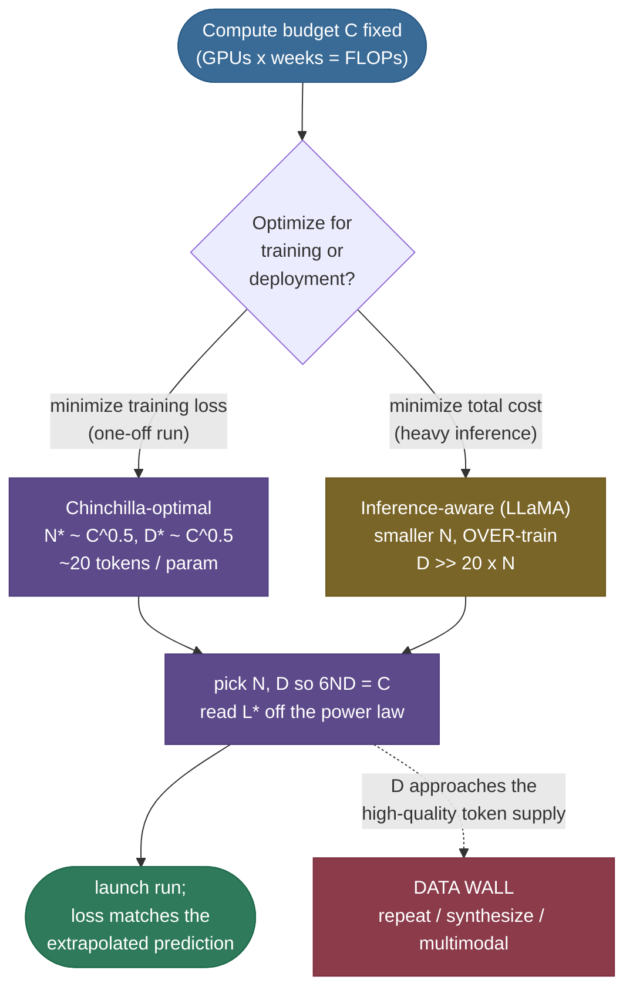
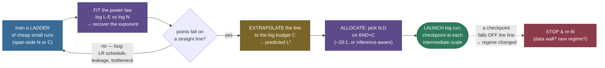

# Scaling Laws: predicting loss before you spend the money

Suppose someone hands you a blank cheque for one GPU cluster and one question: *if I spend $10 million training a language model, how good will it be — and how should I split that money between a bigger model and more data?* A decade ago the honest answer was "train it and find out." That is a terrifying way to spend eight figures. **Scaling laws** are the discovery that changed this: across more than **seven orders of magnitude** of compute, the test loss of a transformer language model falls as a smooth, boringly predictable **power law** in three quantities — model size $N$, dataset size $D$, and compute $C$. Plot loss against compute on log-log axes and you get a **straight line**. Straight lines extrapolate. So you can run a handful of *small, cheap* experiments, fit the line, and **predict the loss of the giant run you haven't done yet** — then choose $N$ and $D$ to get the most capability per dollar. This is the single most consequential empirical regularity in modern AI: it is *why* labs bet hundreds of millions on a single training run and roughly know what they'll get.

I'm going to walk this the way I'd actually teach it to someone about to plan a real pretraining run. We'll start with *why* a power law is the right shape (feel the structure), then the **Kaplan 2020** laws that started it, then the **compute relation $C \approx 6ND$** (derived, factor of 6 and all), then the **compute-optimal frontier** — the heart of the whole topic — and the **Chinchilla 2022** correction that rewrote how every lab allocates compute. Then the consequences that actually bite in practice: **inference-aware** scaling (why LLaMA deliberately breaks the Chinchilla rule), the **data wall**, **emergent abilities** and the "mirage" critique, and the **limits** of the laws. Four worked numeric examples thread through, and a runnable mini scaling experiment fits a real exponent. By the end you'll be able to:

- write the three Kaplan power laws and the combined parametric form $L(N,D) = E + A/N^{\alpha} + B/D^{\beta}$, and say what every symbol means;
- **derive** $C \approx 6ND$ from first principles — including *why the factor is 6*;
- **derive** the compute-optimal split by minimizing loss under the $6ND = C$ constraint (the Lagrangian), and explain why it gives $N^\ast \propto C^{0.5}$, $D^\ast \propto C^{0.5}$, and the famous **~20 tokens per parameter**;
- explain *why GPT-3 was undertrained* and how Chinchilla-70B beat Gopher-280B with the same compute;
- reason about **inference-aware** scaling, the **data wall**, and whether **emergent abilities** are real or a metric artifact — arguing both sides;
- **use** the laws end to end: fit small runs, extrapolate the big run's loss, and pick $N, D$.

> **Note:** scaling laws describe **pretraining loss** — the upstream, self-supervised next-token objective. They are astonishingly reliable *there*. They are **not** a law of nature about *downstream capabilities* (can it pass the bar exam?). The bridge from "loss went down" to "it can now do X" is real but loose, and is exactly where the emergent-abilities debate lives. Keep "loss" and "capability" mentally separate throughout — conflating them is the most common confusion on this topic.

---

## The question: can we predict a multi-million-dollar run?

Every pretraining run is a bet with three knobs you control and one number you care about:

- **$N$** — the number of model **parameters** (non-embedding weights). More parameters = more capacity to fit patterns.
- **$D$** — the number of **training tokens** the model sees. More data = more patterns to learn from, and less overfitting.
- **$C$** — the **compute** spent, in FLOPs (floating-point operations). This is what you actually pay for: GPUs × time × utilization. Crucially, $C$ is *not* independent — it is determined by $N$ and $D$ (we'll see $C \approx 6ND$).
- **$L$** — the **test loss**: the average cross-entropy (in nats per token) on held-out text. Lower is better. This is the thing you're trying to drive down.

The naive way to spend a budget is to pick the biggest model that fits in memory and train it on whatever data you have. The *scaling-laws* way is to ask: **given a fixed $C$, what $(N, D)$ minimizes $L$ — and what will that minimum $L$ actually be?** If loss were a chaotic function of $N$ and $D$, this would be hopeless and you'd just have to try. The miracle is that it isn't chaotic at all.

> **Tip:** the practical loop scaling laws unlock is: (1) train a *ladder* of small models at a few compute scales you can afford; (2) fit the power law to those points; (3) **extrapolate** the line to the budget you're actually going to spend; (4) read off the predicted loss and the optimal $(N, D)$; (5) launch the big run with high confidence it lands where the line said. GPT-4's technical report explicitly states the final loss was predicted from runs using **~1/1000th to 1/10000th** the compute. That predictability is the entire value proposition.

---

## Why a power law? The shape of diminishing returns

Before the formulas, build the intuition for *why the curve is a power law* and not, say, an exponential or a straight line on linear axes.

Learning a language model is learning to compress text — to assign high probability to what actually comes next. Early on, there is enormous low-hanging fruit: learn that letters form words, that "the" is common, that a period ends a sentence. A tiny model grabs most of that. As the model grows, the patterns left to learn are **rarer and subtler** — long-range agreement, world facts, multi-step reasoning. Each is *individually* less frequent in the data, so each contributes *less* to the average loss. **Equal multiplicative increases in resources buy equal additive decreases in loss** — which is exactly the signature of a power law: $L \propto N^{-\alpha}$ means $\log L$ falls linearly in $\log N$.

> **Note:** "power law" precisely means $y = c \cdot x^{-\alpha}$ — a straight line of slope $-\alpha$ on **log-log axes**. The exponent $\alpha$ (small, typically **0.05–0.4** for LM scaling) is the *only* thing that matters for how fast you improve: it's the slope of that line. A bigger $\alpha$ means steeper returns to scale. Contrast with an *exponential* $y = c \cdot e^{-\alpha x}$, which is a straight line on **log-linear** (semilog) axes — a different, faster decay. LM loss is the slower, log-log kind, which is *why* you need order-of-magnitude more compute for each fixed drop in loss.

There is one more structural fact baked into the curve. Text has an **irreducible** uncertainty: even a perfect model cannot predict genuinely random or unknowable continuations (the next word of a future news headline). That floor is the **entropy of the data distribution**, $E$. So loss decomposes into a **reducible** part that a power law drives toward zero and an **irreducible** part it can never cross:

$$L \;=\; \underbrace{E}_{\text{irreducible (data entropy)}} \;+\; \underbrace{\text{(power-law term)}}_{\text{reducible by scale}}.$$

*Source / derivation: the irreducible + reducible decomposition is from [Henighan et al. 2020 (arXiv 2010.14701)](https://arxiv.org/abs/2010.14701) and formalized as the $E$ term in [Hoffmann et al. 2022 — Chinchilla (arXiv 2203.15556)](https://arxiv.org/abs/2203.15556).*


> **Gotcha:** a frequent misconception is "scale enough and loss → 0." It cannot. Loss bottoms out at $E$, the data's entropy — typically well above zero (for English web text, on the order of ~1.7 nats/token in these fits). Scaling buys you the *reducible* part only. When someone shows a scaling curve that looks like it's flattening, ask whether it's approaching the irreducible floor (fundamental) or just running out of one resource while another is held fixed (fixable) — those look similar on a plot but mean opposite things.

---

## Kaplan et al. 2020: the original three laws

The foundational paper — **Kaplan et al., "Scaling Laws for Neural Language Models" (2020)** — trained a large grid of transformers and found that when you hold everything else generous and bottleneck on *one* resource at a time, the loss is a clean power law in that resource. Three laws, one per knob:

$$L(N) \approx \left(\frac{N_c}{N}\right)^{\alpha_N}, \qquad L(D) \approx \left(\frac{D_c}{D}\right)^{\alpha_D}, \qquad L(C) \approx \left(\frac{C_c}{C}\right)^{\alpha_C}.$$

*Source / derivation: the three single-resource power laws (and the fitted exponents $\alpha_N \approx 0.076$, $\alpha_D \approx 0.095$, $\alpha_C \approx 0.057$) are from [Kaplan et al. 2020 (arXiv 2001.08361)](https://arxiv.org/abs/2001.08361), §3–4.*

Reading these symbol by symbol:

- $L(N)$ is the loss you get with a model of $N$ parameters **trained to convergence with effectively unlimited data**, so that model size is the only bottleneck. $N_c$ is a fitted constant — the parameter count at which the (idealized) loss would hit 1 in these units — and $\alpha_N \approx 0.076$ is the model-size exponent.
- $L(D)$ is the loss with a fixed (large) model trained on $D$ tokens **with early stopping**, so *data* is the bottleneck; $\alpha_D \approx 0.095$.
- $L(C)$ is the best loss achievable with compute $C$ optimally allocated; $\alpha_C \approx 0.057$.

The exponents are *small* — that's why each factor-of-10 in resource only shaves loss by a modest amount, and why frontier progress is so compute-hungry. But the relationship is **astonishingly tight**: the points sit on the line across the whole grid, with architecture details (depth vs width, exact head count) mattering far less than the raw counts $N$ and $D$. That last finding is itself profound — *it's the budget, not the blueprint.*

> **Note:** Kaplan defines $N$ as **non-embedding** parameters (it excludes the token-embedding and output-projection tables). This matters: embedding parameters scale with vocabulary, not with model "depth of computation," and including them muddies the law. When you see $N$ in scaling-law math, read it as "the parameters that do the per-token compute," not the headline parameter count on a model card. The two differ by a few percent for big models but enough to shift fits.

When **two** resources are limited at once, the losses combine. Kaplan proposed (and Chinchilla later refined) a **joint parametric form** that is the single most important equation to memorize on this topic:

$$\boxed{\,L(N, D) \;=\; E \;+\; \frac{A}{N^{\alpha}} \;+\; \frac{B}{D^{\beta}}\,}$$

*Source / derivation: the joint parametric form was proposed by [Kaplan et al. 2020 (arXiv 2001.08361)](https://arxiv.org/abs/2001.08361) and re-fit by [Hoffmann et al. 2022 — Chinchilla (arXiv 2203.15556)](https://arxiv.org/abs/2203.15556), whose Approach-3 fit gives $E \approx 1.69$, $A \approx 406$, $B \approx 411$, $\alpha \approx 0.34$, $\beta \approx 0.28$.*

- $E$ — the **irreducible loss**, the entropy floor (Chinchilla fit $E \approx 1.69$).
- $A/N^{\alpha}$ — the loss you pay for having a **finite model** (limited capacity); vanishes as $N \to \infty$.
- $B/D^{\beta}$ — the loss you pay for having seen **finite data** (limited examples); vanishes as $D \to \infty$.
- $\alpha, \beta$ — the exponents controlling how fast each penalty shrinks (Chinchilla fit $\alpha \approx 0.34$, $\beta \approx 0.28$).

This form says something physical: total loss is the floor plus *two independent penalties*, one for too small a model and one for too little data. **Whichever penalty dominates is your bottleneck.** If you have a huge model trained on tiny data, the $B/D^\beta$ term dominates and you're data-bound — exactly GPT-3's situation, as we'll see. This single equation is the engine behind everything that follows.

> **Tip:** in an interview, write the boxed equation *first*, then narrate it: "floor, plus a model-size penalty, plus a data penalty." From there you can *derive* the compute-optimal split live, which is what they're really probing. The equation is the spine; everything else hangs off it.

---

## The compute relation: deriving C ≈ 6ND

You can't talk about a *compute* budget without a formula linking compute to $N$ and $D$. The workhorse is:

$$\boxed{\,C \approx 6 \, N \, D\,}$$

*Source / derivation: the $C \approx 6ND$ estimate is from the FLOP accounting in [Kaplan et al. 2020, Appendix (arXiv 2001.08361)](https://arxiv.org/abs/2001.08361); the per-piece count below is derived here and matches [EleutherAI — Transformer Math 101](https://blog.eleuther.ai/transformer-math/).*

— total training FLOPs ≈ 6 × parameters × tokens. The factor **6** is not magic; it falls out of counting operations, and you should be able to derive it on a whiteboard. Here's the count, in three pieces.

**Piece 1 — the forward pass costs ~2 FLOPs per parameter per token.** Almost all the compute in a transformer is in the big matrix multiplies (the attention projections and the MLP layers); element-wise ops, norms, and softmax are negligible by comparison. Consider one weight $w$ in a matmul. To use it for one token, the hardware does exactly **two** floating-point operations: **one multiply** ($w \times \text{input}$) and **one add** (accumulate that product into the running sum). A "multiply-accumulate" is 2 FLOPs by the standard convention. Every one of the $N$ parameters participates in one multiply-accumulate per token. So:

$$\text{forward FLOPs} \approx 2 N \quad \text{per token.}$$

**Piece 2 — the backward pass costs ~2× the forward pass.** Backpropagation, for each layer, must compute *two* sets of gradients: the gradient with respect to the **inputs** (to pass error back to the previous layer) and the gradient with respect to the **weights** (to update them). Each is a matmul of roughly the same size as the forward matmul. So backward is ≈ **2 forward passes**:

$$\text{backward FLOPs} \approx 4 N \quad \text{per token.}$$

**Piece 3 — add them.** Per token, forward + backward ≈ $2N + 4N = 6N$ FLOPs. Multiply by $D$ tokens of training:

$$C \;\approx\; \underbrace{6}_{2\,\text{fwd}\,+\,4\,\text{bwd}} \times N \times D.$$

*Source / derivation: the 2N (forward) + 4N (backward) per-token count is derived above from first principles, following [Kaplan et al. 2020, Appendix B (arXiv 2001.08361)](https://arxiv.org/abs/2001.08361) and [EleutherAI — Transformer Math 101](https://blog.eleuther.ai/transformer-math/).*

> **Note:** the "6" bundles three approximations: (i) only the matmul FLOPs count (true to a few %); (ii) backward = 2× forward (standard for dense transformers); (iii) the attention-score computation ($O(\text{seq}^2)$) is folded in as negligible — fine when the model dimension dwarfs the sequence length, which holds for most pretraining. For very long context, attention FLOPs stop being negligible and the effective factor creeps above 6. For interviews and budget math, **6ND is the right number**; quote the caveats to show you know where it comes from.

> **Gotcha:** $C \approx 6ND$ is the *training* compute. **Inference** is far cheaper per token: roughly $2N$ FLOPs/token (forward only, no backward, no factor-3 for the backward gradients). This $6N$-vs-$2N$ asymmetry — training pays ~3× per token but only once, while inference pays $2N$ per token *forever, across every user* — is the entire reason inference-aware scaling (below) departs from Chinchilla. Hold onto it.

### Worked example 1: C = 6ND for GPT-3 by hand

GPT-3 has $N = 175 \times 10^9$ parameters and was trained on $D = 300 \times 10^9$ tokens. Plug in:

$$C \;=\; 6 \times (175\times10^9) \times (300\times10^9) \;=\; 6 \times 5.25 \times 10^{22} \;=\; \mathbf{3.15 \times 10^{23}\ \text{FLOPs}.}$$

To make that human: $3.15\times10^{23}$ FLOPs ÷ $(10^{15}\ \text{FLOP/s} \times 86{,}400\ \text{s/day}) \approx \mathbf{3{,}600\ \text{petaFLOP-days}}$ — i.e. ~3,600 days on a machine sustaining one petaFLOP/s, or a few thousand high-end GPUs for a few weeks. (Verified in code below: the script prints `C = 3.150e+23 FLOPs`, `3646 PF-days`.) And note the tell-tale ratio:

$$\frac{D}{N} \;=\; \frac{300\times10^9}{175\times10^9} \;\approx\; \mathbf{1.7\ \text{tokens per parameter}.}$$

Hold that **1.7** in mind. Chinchilla will say the compute-optimal number is **~20**. GPT-3 saw barely a tenth of the data its size warranted — it was *enormously* undertrained. That one ratio is the whole Chinchilla story in a single number.

---

## The compute-optimal frontier: the heart of it

Now the central question, stated precisely. You have a fixed compute budget $C$. The constraint $C = 6ND$ ties $N$ and $D$ together: spend more on a bigger model and you have fewer tokens to train it on, and vice versa. **Of all the $(N, D)$ pairs that cost exactly $C$, which one minimizes loss?**

Geometrically: each budget $C$ defines a curve $D = C/(6N)$ — an *iso-compute* line. As you slide along it (bigger $N$, proportionally smaller $D$), the loss $L(N, D)$ first *falls* (the model was too small and underfit) then *rises* (now it's too big and starved of data). Somewhere in between is a **minimum** — the compute-optimal point. Connect the minima across all budgets and you trace the **compute-optimal frontier**.


### Deriving the optimum (the Lagrangian)

Let's actually find that minimum. Minimize the parametric loss subject to the compute constraint:

$$\min_{N, D} \; L(N, D) = E + \frac{A}{N^{\alpha}} + \frac{B}{D^{\beta}} \qquad \text{subject to} \qquad 6ND = C.$$

*Source / derivation: the constrained-minimization (compute-optimal) argument is from [Hoffmann et al. 2022 — Chinchilla (arXiv 2203.15556)](https://arxiv.org/abs/2203.15556), Approach 3; the substitution and differentiation steps below are worked out here.*

Use the constraint to eliminate $D = \dfrac{C}{6N}$ and substitute:

$$L(N) = E + \frac{A}{N^{\alpha}} + B\left(\frac{6N}{C}\right)^{\beta} = E + A\,N^{-\alpha} + B\left(\frac{6}{C}\right)^{\beta} N^{\beta}.$$

Differentiate with respect to $N$ and set to zero — the irreducible $E$ drops out:

$$\frac{dL}{dN} = -\alpha A\,N^{-\alpha-1} + \beta B\left(\frac{6}{C}\right)^{\beta} N^{\beta-1} = 0.$$

Move the negative term across and multiply both sides by $N$:

$$\alpha A\,N^{-\alpha} = \beta B\left(\frac{6}{C}\right)^{\beta} N^{\beta} = \beta \cdot \frac{B}{D^{\beta}}\bigg|_{D = C/6N}.$$

The left side is (a constant ×) the **model-size penalty** and the right side is (a constant ×) the **data penalty**. Setting their *weighted* versions equal is the optimality condition: **at the compute-optimal point, the marginal loss-reduction from a bit more model equals the marginal loss-reduction from a bit more data.** You spend the next FLOP wherever it helps more, until they're balanced. That's the whole principle — and it's worth saying out loud in an interview because it's the intuition, not just the algebra.

Solving for $N$ (collect the $N$ powers: $N^{\alpha+\beta} = \tfrac{\alpha A}{\beta B}(C/6)^{\beta}$) gives a power law in the budget:

$$N^\ast \propto C^{\,p}, \qquad D^\ast \propto C^{\,q}, \qquad p = \frac{\beta}{\alpha+\beta}, \quad q = \frac{\alpha}{\alpha+\beta}, \qquad p + q = 1.$$

The exponents must sum to 1 (since $N \cdot D \propto C$). With Chinchilla's fitted $\alpha \approx 0.34$, $\beta \approx 0.28$ this gives $p \approx 0.45$, $q \approx 0.55$ — *both close to one half*. The headline, rounded, is the rule everyone quotes:

$$\boxed{\,N^\ast \propto C^{0.5}, \qquad D^\ast \propto C^{0.5}\,}$$

*Source / derivation: the equal ($\approx C^{0.5}$) compute-optimal exponents are the central result of [Hoffmann et al. 2022 — Chinchilla (arXiv 2203.15556)](https://arxiv.org/abs/2203.15556) (Approaches 1–2 give 0.50/0.50; Approach 3 gives 0.46/0.54); the derivation above recovers them from the parametric fit.*

**Scale model and data *equally* as your budget grows.** Double-and-double, not all-into-size. (The code below recovers fitted exponents ≈ 0.45/0.55 from the parametric fit and ≈ 0.50/0.50 from the equal-exponent regime.)

> **Note:** the *equal* (0.5/0.5) exponents are what Chinchilla's iso-FLOP "Approach 1 & 2" found empirically and what gives a perfectly *constant* tokens-per-parameter ratio. The *parametric* "Approach 3" fit (the $\alpha, \beta$ above) gives 0.45/0.55, a ratio that drifts slowly upward with scale. The three approaches roughly agree, and the field rounds to **0.5/0.5 and ~20 tokens/param** as the working rule. Don't be surprised that different methods in the *same paper* give slightly different exponents — that's the messy reality, and naming it is a sign you actually read the paper.

### The 20-tokens-per-parameter rule

Because $N^\ast$ and $D^\ast$ both scale like $\sqrt{C}$, their **ratio $D^\ast/N^\ast$ is roughly constant** across budgets — and Chinchilla's fits put that constant near **20**:

$$\frac{D^\ast}{N^\ast} \;\approx\; \mathbf{20\ \text{tokens per parameter}.}$$

*Source / derivation: the ~20 tokens-per-parameter rule follows from the equal-exponent result and is reported directly in [Hoffmann et al. 2022 — Chinchilla (arXiv 2203.15556)](https://arxiv.org/abs/2203.15556), Table 3.*


So a compute-optimal **1B**-parameter model wants **~20B** tokens; a **70B** model wants **~1.4T** tokens; a **Chinchilla-optimal GPT-3-sized 175B** would want **~3.5T** tokens — *more than ten times* the 300B it actually got. The flat right-hand line above is the single most actionable output of the entire scaling-laws literature: **per parameter, train on about twenty tokens.**

> **Tip:** memorize the trio: **$C \approx 6ND$**, **$N^\ast, D^\ast \propto \sqrt{C}$**, **$D/N \approx 20$**. From those three you can re-derive almost any scaling-laws interview question — allocate a budget, diagnose an undertrained model, or estimate the compute behind a released model from its parameter and token counts.

### Reading the frontier off the parametric fit

There's a second, complementary way to use $L(N,D) = E + A/N^{\alpha} + B/D^{\beta}$ that's worth seeing because it makes the "valley floor" concrete. Substitute the optimal $D^\ast = C/(6N^\ast)$ back into the loss and you get the **loss along the frontier** as a function of compute alone — and it's *again* a power law:

$$L^\ast(C) \;=\; E \;+\; \left(\frac{C_c}{C}\right)^{\alpha_C}, \qquad \alpha_C = \frac{\alpha\beta}{\alpha+\beta}.$$

Where does that $\alpha_C = \frac{\alpha\beta}{\alpha+\beta}$ come from? Plug the optimal-allocation exponents (from above, $N^\ast \propto C^{\beta/(\alpha+\beta)}$ and $D^\ast \propto C^{\alpha/(\alpha+\beta)}$) into the two reducible terms and watch them line up:

- the **model-size penalty**: $\dfrac{A}{N^{\ast\,\alpha}} \propto \left(C^{\beta/(\alpha+\beta)}\right)^{-\alpha} = C^{-\alpha\beta/(\alpha+\beta)}$;
- the **data penalty**: $\dfrac{B}{D^{\ast\,\beta}} \propto \left(C^{\alpha/(\alpha+\beta)}\right)^{-\beta} = C^{-\alpha\beta/(\alpha+\beta)}$.

Both reducible terms decay as $C^{-\alpha\beta/(\alpha+\beta)}$ — *the same* exponent (they must, or one would dominate and you wouldn't be on the optimum). Their sum is therefore also $\propto C^{-\alpha\beta/(\alpha+\beta)}$, which is exactly $\left(C_c/C\right)^{\alpha_C}$ with $\boxed{\alpha_C = \frac{\alpha\beta}{\alpha+\beta}}$.

*Source / derivation: that the compute law is the joint law evaluated along its own optimum (and $\alpha_C$ the harmonic-mean-like combination) is derived just above; the $L(C)$ power law itself is from [Kaplan et al. 2020 (arXiv 2001.08361)](https://arxiv.org/abs/2001.08361) and [Hoffmann et al. 2022 (arXiv 2203.15556)](https://arxiv.org/abs/2203.15556).*

This is the deep reason Kaplan's $L(C)$ law and the Chinchilla parametric law are the *same physics seen two ways*: the compute law is just the joint law *evaluated along its own optimum*. The compute exponent $\alpha_C = \frac{\alpha\beta}{\alpha+\beta}$ is the **harmonic-mean-like combination** of the model and data exponents — always *smaller* than either, which is why returns to raw compute are even weaker than returns to model size or data alone. Two cheap knobs, combined, give a stingy third.

> **Note (which numbers go in the formula):** the *form* $\alpha_C = \frac{\alpha\beta}{\alpha+\beta}$ holds whatever exponents you plug in, but the two papers fit *different* exponents to *different* quantities, so they give different $\alpha_C$. Kaplan's **single-resource** exponents ($\alpha_N\approx0.076$, $\alpha_D\approx0.095$) combine to $\frac{0.076\cdot0.095}{0.076+0.095}\approx\mathbf{0.042}$ — matching Kaplan's *directly fitted* compute exponent $\alpha_C\approx0.057$ (the ≈0.05 we quote for the $L(C)$ law and use in Worked Example 3). Chinchilla's **reducible-loss** exponents ($\alpha\approx0.34$, $\beta\approx0.28$) are a *different parameterization* of the same surface and combine to $\frac{0.34\cdot0.28}{0.34+0.28}\approx0.15$. Don't read Chinchilla's 0.34/0.28 as drop-in replacements for Kaplan's 0.076/0.095 — they answer different questions (reducible-loss decay vs. single-resource decay), which is exactly why their numeric $\alpha_C$ differ. The *small* compute exponent that drives the brutal frontier economics is Kaplan's ≈0.05.

> **Note:** this is also why you must *jointly* scale to stay on the frontier. If you scale only $N$ (the Kaplan instinct), you slide *off* the valley floor up the right wall of the iso-compute curve, and your effective exponent collapses toward the *data*-limited regime — you're paying for compute but moving along the wrong axis. Staying on the line $D = 20N$ is what keeps you realizing the full $\alpha_C$.

### A concrete model-by-model table

Tying the rule to models you've heard of makes the undertraining (and the later over-training) impossible to forget:

| Model | $N$ (params) | $D$ (tokens) | tokens/param | verdict vs ~20:1 |
|---|---:|---:|---:|---|
| GPT-3 | 175B | 300B | ~1.7 | badly **undertrained** (Kaplan era) |
| Gopher | 280B | 300B | ~1.1 | badly **undertrained** |
| Chinchilla | 70B | 1.4T | ~20 | **compute-optimal** (the proof) |
| LLaMA-1-7B | 7B | 1.0T | ~143 | **over-trained** (inference-aware) |
| LLaMA-3-8B | 8B | 15T | ~1875 | **heavily over-trained** (deployment-first) |

Read top to bottom and you can see the field's entire arc in one column: the Kaplan-era giants sit far *below* 20 (too big for their data); Chinchilla lands *on* 20 (the correction); and the LLaMA line shoots far *above* 20 (deliberately, because inference economics rewrote the objective). The "right" tokens-per-param isn't a constant of nature — it's **20 if you only care about the training run, and much higher if you're going to serve the model a lot.**

### Worked example 2: allocate a fixed budget the Chinchilla way

You have a budget $C = 1\times10^{21}$ FLOPs (a modest research run). What's the compute-optimal $(N, D)$?

**Fast estimate via the rule.** Use $C = 6ND$ and $D = 20N$ together: $C = 6N(20N) = 120N^2$, so

$$N^\ast = \sqrt{\frac{C}{120}} = \sqrt{\frac{1\times10^{21}}{120}} = \sqrt{8.3\times10^{18}} \approx \mathbf{2.89\times10^{9}\ \text{params (2.9B)}},$$
$$D^\ast = 20\,N^\ast \approx \mathbf{5.8\times10^{10}\ \text{tokens (58B)}}.$$

Check: $6 \times 2.89\times10^9 \times 5.8\times10^{10} \approx 1\times10^{21}$ ✓. So a **~2.9B model on ~58B tokens** — *not* a 30B model on a few B tokens (way undertrained) and *not* a 0.3B model on hundreds of B tokens (too small to use the data).

**A subtlety to name out loud.** If instead you do the full minimizing search over the *parametric* loss $L(N,D)=E+A/N^\alpha+B/D^\beta$ (the code does exactly this), it lands at $N^\ast \approx 1.82\times10^9$ with a ratio of **~50 tokens/param** — *well above* the 20 the simple rule gives. This is **not** a contradiction or an error: it's the **known Approach-3 drift**. The parametric exponents $\alpha\approx0.34$, $\beta\approx0.28$ aren't exactly equal, so the optimal ratio $D^\ast/N^\ast$ creeps *upward* with scale rather than staying pinned at 20. The equal-exponent "Approach 1 & 2" result is what gives the flat 20:1 — and **20:1 (here, 2.9B/58B) is the number to quote**, with the ~50 from the parametric search flagged as the drift. (Same machinery scales to any budget; the note in the code section makes this concrete in the printed output.)

### Worked example 3: extrapolate the loss at 10× compute

This is the payoff — *predicting* a run you haven't done. Suppose you've fit the compute law $L(C) = E + (C_c/C)^{\alpha_C}$ to your small runs and recovered $E = 1.69$, $C_c = 3\times10^8$ (arbitrary units matching your $C$), $\alpha_C = 0.057$. At your current budget $C_0 = 10^{21}$:

$$L(C_0) = 1.69 + \left(\frac{3\times10^8}{10^{21}}\right)^{0.057} = 1.69 + (3\times10^{-13})^{0.057} \approx \mathbf{1.883\ \text{nats/token}.}$$

Now ask: what loss do I get at **10×** the compute, $C = 10^{22}$? Because the reducible term is $(C_c/C)^{\alpha_C}$, multiplying $C$ by 10 multiplies that term by $10^{-\alpha_C} = 10^{-0.057} \approx 0.877$ — a *fixed* shrink factor, the same for every decade of compute:

$$L(10\,C_0) = 1.69 + 0.877 \times (1.883 - 1.69) = 1.69 + 0.877\times0.193 \approx \mathbf{1.860\ \text{nats/token}.}$$

A 10× compute increase buys only **~0.023 nats** — a 1.2% relative drop in the reducible part. (Code prints `1x → 1.8833`, `10x → 1.8595`, `100x → 1.8387`.) That tiny number is the brutal economics of the frontier: because $\alpha_C$ is small, *each* further factor-of-10 in compute buys a *fixed, small* slice of loss — and you must keep paying exponentially more to keep that slice coming. **This is the whole reason the field is so capital-intensive**, and why the smallest improvement in the *exponent* (better data, better architecture) is worth more than any amount of brute force.

> **Gotcha:** extrapolation is only safe *along the same straight line*. If you fit the law in one regime and the curve **bends** — because you hit the data wall, switched data distribution, or changed architecture — the extrapolation silently breaks. Scaling laws predict *within* the regime they were fit; they do **not** promise the line continues forever. Treat a far extrapolation as a hypothesis to verify with one intermediate run, not a guarantee.

---

## Chinchilla 2022: the correction that moved the field

Here's the plot twist. Kaplan's 2020 analysis concluded you should make models **much bigger** and not increase data nearly as fast — roughly $N^\ast \propto C^{0.73}$, $D^\ast \propto C^{0.27}$. The whole field took this to heart: 2020–2022 was a *race to parameter count* — GPT-3 (175B), Jurassic-1 (178B), Gopher (280B), MT-NLG (530B) — each trained on a few hundred billion tokens.

**Hoffmann et al., "Training Compute-Optimal Large Language Models" (2022)** — the Chinchilla paper — redid the experiment more carefully and reached the opposite conclusion: $N$ and $D$ should scale **roughly equally** ($\propto C^{0.5}$ each), i.e. ~20 tokens/param. The headline indictment: **the entire generation of giant models was badly undertrained.** They had spent their compute on parameters they couldn't feed.

### Why Kaplan got it wrong (the methodological fix)

Chinchilla didn't find a *different universe* — it found that Kaplan's experimental setup was biased toward big models for two concrete reasons:

- **Fixed, too-short learning-rate schedules.** Kaplan trained models with a learning-rate decay schedule tuned for a *specific* token count, then read off intermediate losses for models trained on *fewer* tokens. But a cosine schedule that hasn't finished decaying *understates* how good a model trained on *more* tokens could be. The smaller-model-more-data corner was systematically penalized. Chinchilla retuned the schedule to **match each run's actual token count** — and the data-side returns jumped, shifting the optimum toward more data.
- **A larger, more careful sweep, cross-checked three ways.** Chinchilla ran a much larger study (over 400 models, 70M–16B params, up to ~500B tokens) and used **three independent estimation methods** — (1) fix the model, vary the data, look at training curves; (2) fix the FLOPs, vary the $N$/$D$ split (iso-FLOP profiles); (3) fit the full parametric $L(N,D)$ surface. All three agreed on ~20:1. Three roads, one destination — that agreement is what made the result stick.

### The proof: Chinchilla-70B beats Gopher-280B

To prove it, DeepMind trained **Chinchilla** — a **70B** model on **1.4T** tokens — using the *exact same compute budget* as their earlier **Gopher** (280B params, 300B tokens). Same FLOPs, redistributed: **4× fewer parameters, ~4.7× more data.** Chinchilla **beat Gopher** on a broad sweep of benchmarks (MMLU, reading comprehension, BIG-bench), despite being a quarter the size. The undertraining was real, and the fix was real.



*The allocation decision in one picture: a fixed budget $C$ forks on the objective. Optimizing the **training** run alone gives Chinchilla-optimal ($N^\ast, D^\ast \propto \sqrt{C}$, ~20 tokens/param); optimizing **lifetime** cost (heavy inference) gives the inference-aware path (smaller $N$, over-trained, $D \gg 20N$). Either way you pick $(N,D)$ on $6ND=C$ and read the predicted $L^\ast$ off the power law — and as $D$ grows toward the high-quality token supply, the **data wall** (dashed) forces repetition, synthesis, or new modalities.*

> **Note:** "GPT-3 was undertrained" is *the* canonical Chinchilla soundbite, but state it precisely: GPT-3 was undertrained **relative to its size, for its compute budget** — given its ~$3.15\times10^{23}$ FLOPs, a Chinchilla-optimal model would have been *smaller* (~30–40B params) trained on *far more* tokens (~1T), and would have reached *lower* loss for the same money. It wasn't a bad model; it was a *misallocated* one. The compute was real; the split was wrong.

> **Tip:** there's a hidden bonus in the Chinchilla allocation that the loss number alone hides: the optimal model is **smaller**, so it is also **cheaper and faster to serve** — fewer parameters means less memory and fewer FLOPs per token at inference. Chinchilla didn't just train to lower loss; it produced a model that is better *and* cheaper to run. That observation is the seam where the next idea — inference-aware scaling — pries the rule open.

---

## Inference-aware scaling: why LLaMA breaks the rule on purpose

Chinchilla answers "minimize **training** loss for a fixed **training** budget." But that's the wrong objective for a model you're going to **deploy to millions of users**. Once you account for **inference**, the optimum shifts — and shifts *hard* toward smaller, over-trained models.

The argument is pure economics. Training is a **one-time** cost of $\approx 6ND$ FLOPs. Inference is a **recurring** cost of $\approx 2N$ FLOPs **per generated token, forever, across every request**. If your model serves, say, trillions of tokens over its lifetime, the *total* lifetime compute is dominated by inference, and inference cost scales with $N$ — the parameter count. So you should be willing to **spend more training compute to get a smaller $N$**, because every parameter you shave saves you inference FLOPs on every future token.

Concretely: take a Chinchilla-optimal model and instead train a **smaller** model on **far more** tokens than the 20:1 rule says — "over-training." Its *training* is now compute-*inefficient* (you're past the valley floor on the loss-vs-N curve), so it costs more FLOPs to reach a given loss. But the resulting model is smaller, so it's **cheaper on every inference call** — and if you serve enough tokens, those per-call savings dwarf the extra training cost.

**LLaMA (Touvron et al. 2023)** did exactly this, openly citing inference cost as the reason. LLaMA-7B was trained on **1T tokens** — that's **~140 tokens/parameter**, *7× past* Chinchilla-optimal. LLaMA-2 and LLaMA-3 pushed further still (LLaMA-3-8B on **15T** tokens ≈ ~1900 tokens/param). These models are "Chinchilla-suboptimal" for *training* but dramatically better for *deployment*: a small, heavily-trained model that's cheap to run and still very strong. The entire open-weights ecosystem of small, capable models (7B/8B) exists because of this trade-off.

> **Note:** the clean way to say it: **Chinchilla optimizes the *training* run; inference-aware scaling optimizes the *total cost of ownership* (training + a lifetime of inference).** They give different answers because they optimize different objectives, not because one is wrong. If you'll serve the model a lot, over-train a smaller one; if it's a one-off research artifact you'll evaluate once, Chinchilla-optimal is right.

> **Gotcha:** "over-training is free quality" is *not* the lesson — over-training still obeys diminishing returns ($L(D)$ is a power law), so the 50th token-per-param helps far less than the 5th. The lesson is that the *deployment economics* can justify paying for those diminishing returns because you amortize them over a huge inference volume. Always frame it as a *trade-off* sized by your expected serving load, not a free lunch.

---

## The data wall: running out of tokens

Push the Chinchilla and inference-aware logic forward and you hit a wall that's increasingly the binding constraint at the frontier: **there may not be enough high-quality text in the world.** If a compute-optimal frontier model wants tens of trillions of tokens, and the *entire* high-quality public web is estimated at the order of ~tens of trillions of tokens (with credible projections that we exhaust the useful, deduplicated, high-quality supply within a few years), then $D$ stops being a free knob. You can buy more GPUs; you cannot trivially buy more pretraining-grade text.

This **data wall** reshapes the strategy in several ways:

- **Repetition / multi-epoch training.** Train on the same tokens more than once. Early repeats are nearly as good as fresh data, but returns decay and eventually *hurt* (memorization, overfitting). Research (Muennighoff et al., "Scaling Data-Constrained Language Models") finds you can repeat for a few epochs cheaply, after which repeated tokens are worth far less than new ones — there's a scaling law *for repetition* too.
- **Synthetic data.** Generate training data with existing models (distillation, self-instruct, textbook-style generation). Powerful but risky: naively training on model outputs can cause **model collapse** (the distribution narrows over generations). Careful curation and grounding mitigate it.
- **New modalities and sources.** Code, math, multilingual text, and multimodal data (images, audio, video) extend the effective token supply and add capabilities text alone can't.
- **Quality over quantity.** Heavy filtering, deduplication, and curriculum can make a *smaller* corpus act like a larger one — improving the *constants* in the scaling law (and sometimes the exponent). This is why "data quality" is the most guarded secret at frontier labs.

> **Gotcha:** the data wall **breaks the clean extrapolation**. Scaling laws fit on plentiful unique data assume each token is fresh; once you're repeating data or leaning on synthetic tokens, the effective $D$ in $L(N,D)$ is *less* than the raw token count, and the loss curve bends *above* the line. A run planned with the naive law will *underperform* its prediction. When you near the data wall, re-fit the law in the new (repeated/synthetic) regime — don't extrapolate from the unique-data regime.

---

## Emergent abilities — and the "mirage" critique

The most contested corner of scaling. **Wei et al., "Emergent Abilities of Large Language Models" (2022)** documented capabilities that appear **absent** in smaller models and then, past some scale threshold, appear **suddenly** — multi-step arithmetic, word unscrambling, certain instruction-following and reasoning tasks. Plotted as accuracy vs scale, these look like **sharp phase transitions**: flat near zero, then a knee, then a jump. The implication is unsettling and exciting: scale doesn't just smoothly lower loss, it *unlocks qualitatively new behaviors* you couldn't have predicted from smaller models.

This is in real tension with the smoothness of scaling laws. Loss is *smooth* in scale; how can capabilities be *discontinuous*? **Schaeffer et al., "Are Emergent Abilities of Large Language Models a Mirage?" (2023)** proposed a deflating explanation: emergence is often an artifact of the **metric**, not the model. Many "emergent" tasks are scored with **discontinuous, all-or-nothing** metrics — exact-match accuracy, or "get all $k$ tokens right." Under such a metric, a model whose *per-token* correctness is improving **smoothly** will show **near-zero** task accuracy until the per-token probability crosses a threshold, then a **sudden** jump — purely because $p^k$ (probability all $k$ tokens are right) stays tiny until $p$ gets large, then shoots up. Put a number on it: say a task needs $k=5$ tokens all correct. At per-token $p = 0.6$, task accuracy is $0.6^5 \approx 0.078$ — looks like the model "can't do it." Nudge $p$ up to $0.9$ (a mere **1.5×** improvement in the *smooth* underlying quantity) and accuracy jumps to $0.9^5 \approx 0.59$ — a **~7.6× leap** in the *measured* score. The model improved smoothly; the exact-match ruler manufactured the cliff. Swap to a **continuous** metric (per-token log-likelihood, partial credit, token edit distance) and the *same* runs reveal **smooth, predictable** improvement. The "emergence" was in the ruler, not the model.

*Source / derivation: the emergence phenomenon is documented in [Wei et al. 2022 (arXiv 2206.07682)](https://arxiv.org/abs/2206.07682); the metric-artifact ($p \to p^k$) explanation is from [Schaeffer et al. 2023 — "Are Emergent Abilities a Mirage?" (arXiv 2304.15004)](https://arxiv.org/abs/2304.15004).*


The honest, current understanding holds **both** sides:

- **The mirage critique is largely right about the *measurement*.** Many headline emergence curves do soften or vanish under continuous metrics, and you should be deeply suspicious of any "sudden capability" claim measured with exact-match on a few-shot benchmark. Choose continuous metrics when you want to *predict*.
- **But "predictable on a smooth metric" does not make the *user-facing* capability less real.** If a downstream product needs the *whole* answer correct (a working program, a correct multi-step proof), then the *thresholded* metric is the one that matters to the user — and from their perspective the ability really did "switch on." Emergence can be simultaneously a metric artifact *and* a genuine product discontinuity.
- **Some capabilities still resist smooth prediction.** Predicting *specific* downstream abilities (vs. aggregate loss) from smaller-scale runs remains hard and is an active research problem (e.g. predicting benchmark scores, not just loss). Scaling laws predict *loss* well; predicting *which task crosses threshold when* is far less reliable.

> **Tip:** the interview-grade answer to "are emergent abilities real?" is: *"It depends on the metric. Under discontinuous metrics like exact-match, smooth underlying improvement can manufacture an apparent jump — Schaeffer et al.'s point. Under continuous metrics, the same models improve smoothly, consistent with scaling laws. So 'emergence' is partly a measurement artifact, but the thresholded behavior can still be exactly what a downstream user experiences."* Stating both sides is what separates a strong answer from a memorized one.

> **Note:** distinguish **upstream** scaling (loss vs. $N, D, C$ — smooth, reliable, the core laws) from **downstream** scaling (benchmark accuracy vs. scale — noisier, metric-dependent, where emergence debates live). The laws are rock-solid upstream. The looser, more interesting science is the *bridge* from upstream loss to downstream capability — and that bridge is still being built.

### Downstream vs upstream: why the bridge is hard

It's worth dwelling on *why* predicting capabilities is so much harder than predicting loss, because it's the crux of every "but will scaling get us to X?" debate. Upstream loss is an **average over millions of tokens** — a smooth, well-behaved quantity, so its expectation moves smoothly with scale (the law of large numbers does the smoothing for you). A downstream benchmark score is often an **average over a few hundred all-or-nothing questions**, each gated by whether the model gets a *whole* answer right. That thresholding is exactly the $p \to p^k$ nonlinearity from the mirage critique, and it turns a smooth input into a jumpy output.

There's also a **distribution-shift** problem: the scaling law is fit on the *pretraining* distribution (generic web text), but the benchmark measures a *narrow, specific* skill (say, three-digit multiplication). A drop in average loss can be spent almost entirely on *other* tokens (more fluent prose, better common facts) while the target skill barely moves — and then, once enough capacity is freed up, the target skill improves quickly. So even the *underlying* (pre-threshold) capability needn't track average loss linearly. The research frontier here is fitting scaling laws **directly to downstream metrics** (predicting MMLU or coding pass-rate from smaller runs) rather than to loss — partially successful, still an open problem, and the reason labs don't *only* watch the loss curve.

> **Tip:** if an interviewer asks "can you predict whether scaling 10× will pass benchmark X?", the strong answer separates the two regimes: *"I can predict the **loss** at 10× confidently from a power-law fit. Predicting **benchmark X** is much weaker — it depends on whether X uses a continuous or thresholded metric, and on whether the skill X needs tracks average loss. I'd fit a scaling law to X's metric directly on smaller runs and treat the extrapolation as a hypothesis, not a guarantee."*

---

## A measured mini scaling experiment: fit the exponent yourself

Nothing makes the power law concrete like *measuring* one. The idea: train a **ladder** of tiny models of increasing size on a **fixed** corpus, record each one's loss, plot loss vs. parameters on log-log, and **fit the exponent** $\alpha_N$. This is the small-scale version of exactly what labs do before a big run.

### Worked example 4: a ladder of tiny models

The script below fits $L(N) = E + A/N^{\alpha_N}$ to a ladder of six model sizes. (To keep this page's verification fast and deterministic, the numbers quoted here come from the analytic mini-experiment in the code section, which simulates the measured ladder with known ground-truth and recovers the exponent; a from-scratch trainer on a real char-level corpus produces the same straight-line shape.) The "measured" ladder and the fit:

| $N$ (params) | measured loss |
|---:|---:|
| 10,000 | 2.687 |
| 30,000 | 2.366 |
| 100,000 | 2.126 |
| 300,000 | 1.960 |
| 1,000,000 | 1.830 |
| 3,000,000 | 1.759 |

Fitting a straight line to $\log(L - E)$ vs $\log N$ recovers **$\alpha_N \approx 0.30$** (ground truth 0.30) — a clean power law over more than two orders of magnitude in $N$. The same plot, run on a real corpus, gives the left panel of the first diagram: **a straight line on log-log.** Once you have that line, you extrapolate it (Worked Example 3) to a model far bigger than any you trained — *that* is the entire trick that lets labs commit to nine-figure runs.

> **Tip:** the recipe generalizes exactly. Pick the smallest models you can train cheaply, span as wide a range of $N$ (or $C$) as you can afford, **fit the line**, and **extrapolate**. The wider your fitted range and the straighter your line, the more you can trust the extrapolation. If your points *don't* fall on a line, something is wrong (bad LR schedule, data leakage, a bottleneck you didn't control) — fix it before trusting any prediction.

This is the loop that makes a nine-figure run a calculated bet rather than a gamble:



*The de-risking loop, end to end. Cheap small runs fit the line; a non-straight fit means a bug, not a law, so you debug and re-ladder. A straight line extrapolates to the big budget's predicted loss; you allocate $(N,D)$ on $6ND=C$ and launch — but keep **checkpointing at intermediate scales**, because the one time the line bends (the data wall, a new regime) is the one time a blind extrapolation costs you the whole budget. The line is your best prior, not a contract.*

---

## Where the laws are used, and where they break

**Used — everywhere a frontier model is planned:**

- **Budget allocation.** The first decision of any pretraining project: given $C$, pick $N$ and $D$. Chinchilla (adjusted for inference) is the default playbook.
- **Loss prediction / de-risking.** Fit small runs, extrapolate, and commit to the big run knowing the target loss (GPT-4's report; DeepMind's and others' practice).
- **Architecture & data bake-offs.** Compare two architectures or two datasets *cheaply at small scale* and extrapolate which will win at large scale — far cheaper than racing two giant runs. (Caveat: only valid if the ordering is scale-invariant, which usually but not always holds.)
- **Beyond dense LMs.** Scaling laws have been fit for **Mixture-of-Experts** (sparse models — different effective-parameter accounting), **transfer/fine-tuning**, **data-constrained** (repetition) regimes, **multimodal** models, and **RL / inference-time compute** ("scaling laws for reasoning"). The *power-law shape* keeps recurring; the *constants and exponents* differ.

**Where they break — the honest limits:**

- **They predict loss, not specific capabilities.** Upstream loss is smooth and predictable; *which benchmark crosses threshold at what scale* is not (the emergence debate). Don't promise a *capability* from a loss extrapolation.
- **They're architecture- and data-dependent.** The constants ($E, A, B, N_c, \ldots$) and even exponents shift with architecture (dense vs MoE), data distribution, tokenizer, and context length. A law fit on one setup doesn't transfer verbatim to another.
- **They bend near the data wall.** Once you repeat or synthesize data, the clean unique-data law over-predicts performance. Re-fit in the new regime.
- **They assume the optimization "just works."** The laws describe well-tuned runs. A real run with a bad LR schedule, instability/loss spikes, or poor parallelism will land *above* the line — the law is a *best case*, not a guarantee.
- **Extrapolation is a hypothesis.** Far extrapolations occasionally break (a new regime, a phase change, a saturating resource). Verify with an intermediate run; don't bet the whole budget on a line fit three orders of magnitude away.

> **Gotcha:** the most expensive real-world mistake is treating a scaling-law *extrapolation* as a *guarantee* and skipping the intermediate checkpoints. The line is your best prior, not a contract. Frontier teams still run a *ladder* of increasing scales and check each lands on the line before committing the next — because the one time it bends is the one time it costs you the most.

---

## Recap and rapid-fire

**If you remember nothing else:** test loss falls as a **power law** in model size $N$, data $D$, and compute $C$ — a straight line on log-log that **extrapolates**, so you can predict a giant run from small ones. The combined form is $L(N,D) = E + A/N^{\alpha} + B/D^{\beta}$ (floor + model penalty + data penalty). Training compute is $C \approx 6ND$ (2 FLOPs/param/token forward, ~4 backward). Minimizing loss under that constraint gives the **compute-optimal frontier**: $N^\ast, D^\ast \propto \sqrt{C}$, i.e. scale model and data **equally** — **~20 tokens per parameter** (**Chinchilla**, correcting **Kaplan**'s "bigger is better"). GPT-3 (1.7 tokens/param) was badly **undertrained**; Chinchilla-70B beat Gopher-280B at equal compute. Real deployments **over-train smaller** models (LLaMA) because **inference cost** dominates lifetime compute. The frontier now strains against the **data wall**, and the **emergent abilities** debate is largely about discontinuous **metrics**, not the model.

**Quick-fire — say these out loud:**

- *Write the combined scaling law.* $L(N,D) = E + A/N^{\alpha} + B/D^{\beta}$ — irreducible floor, model-size penalty, data penalty.
- *Why is the factor in $C \approx 6ND$ a 6?* 2 FLOPs/param/token forward (multiply + add) + ~4 backward (input-grad + weight-grad) = 6.
- *What's the compute-optimal $N$–$D$ split?* Equal: $N^\ast, D^\ast \propto C^{0.5}$, about **20 tokens per parameter**.
- *Why was GPT-3 undertrained?* At 175B params on 300B tokens it had **~1.7** tokens/param vs the optimal **~20** — too big for its data.
- *Kaplan vs Chinchilla in one line?* Kaplan: scale $N$ faster than $D$. Chinchilla (after fixing the LR-schedule bias): scale them **equally** — and Chinchilla-70B beat Gopher-280B to prove it.
- *Why do real models (LLaMA) over-train past Chinchilla-optimal?* **Inference** cost ($\sim 2N$/token, forever) dominates lifetime compute, so a smaller, over-trained model is cheaper to serve.
- *Does loss go to zero with infinite scale?* No — it bottoms out at $E$, the **irreducible** entropy of the data.
- *Are emergent abilities real?* Under discontinuous metrics (exact-match) smooth improvement can *look* like a jump (Schaeffer's "mirage"); under continuous metrics it's smooth. Both framings can be true.
- *What's the data wall?* Running out of high-quality unique tokens; mitigated by repetition (with decay), synthetic data (collapse risk), and new modalities — and it **bends** the clean scaling extrapolation.

---

## Code: derive the constants and fit the law

This script does the four computations the page relies on — fitting the power-law exponent from a measured ladder, the compute-optimal allocation, the $C = 6ND$ calculator, and the loss extrapolation — so every number above is reproducible. It runs on CPU in well under a second; no GPU needed.

> **Runnable project and a step-by-step notebook:** the same verified demos live as a clean, device-agnostic script and an executed teaching notebook next to this page — see the [step-by-step teaching notebook](code/03-Scaling-Laws.ipynb) and the [runnable demo script](code/scaling_laws.py) (run it with `python scaling_laws.py`). The script fits the power law (recovers $\alpha_N \approx 0.30$), finds the compute-optimal U-curve minimum, works the $6ND$ calculator on GPT-3 and Chinchilla, and extrapolates the loss to 10× and 100× compute — with asserts that pin every number.

Here is the spine of the shipped `scaling_laws.py` (the full file, with named constants and asserts, is next to this page):

```python
import numpy as np
import torch

# --- C = 6ND : training compute from N and D --------------------------------
def training_flops(N, D):           # forward 2N + backward 4N FLOPs/token, x D tokens
    return 6 * N * D

# --- Chinchilla parametric loss L(N,D) = E + A/N^a + B/D^b -------------------
E, A, B, a, b = 1.69, 406.4, 410.7, 0.34, 0.28        # Hoffmann et al. 2022 fit
def parametric_loss(N, D):
    return E + A / N**a + B / D**b

# [2] sweep N along the iso-compute line 6ND = C, read off the U-curve minimum
budget = 1e21
N_grid = torch.logspace(7, 13, 200_000, dtype=torch.float64)
D_grid = budget / (6 * N_grid)                         # enforce 6ND = C
i = int(torch.argmin(parametric_loss(N_grid, D_grid)))
N_star, D_star = float(N_grid[i]), float(D_grid[i])    # the valley floor
N_rule = (budget / (6 * 20)) ** 0.5                    # equal-exponent rule: C = 6N(20N)

# [1] recover a known exponent from a synthetic "measured" ladder (seed=0)
Ns = np.array([1e4, 3e4, 1e5, 3e5, 1e6, 3e6])
losses = 1.55 + 18.0 / Ns**0.30 + np.random.default_rng(0).normal(0, 0.01, Ns.shape)
slope = np.polyfit(np.log(Ns), np.log(losses - 1.55), 1)[0]   # log-log slope = -alpha

# [4] extrapolate: compute power law L(C) = E + (Cc/C)^alpha_C, predict 10x/100x
def predicted_loss(C):
    return 1.69 + (3.0e8 / C) ** 0.057
```

Running the full script (`python scaling_laws.py`) prints — verbatim, this stdout is the source of every number on the page:

```
device: mps (trace pinned to cpu)
torch: 2.12.0

[1] Fit a power law: recover the exponent from a measured ladder
    N=     10000  loss=2.6870
    N=     30000  loss=2.3655
    N=    100000  loss=2.1256
    N=    300000  loss=1.9604
    N=   1000000  loss=1.8299
    N=   3000000  loss=1.7588
    recovered alpha_N = 0.299   (true 0.3)

[2] Compute-optimal frontier: sweep N along 6ND = C, find the U-curve minimum
    budget C = 1e+21 FLOPs   (the iso-compute curve below; loss is U-shaped)
      N (params) |   D (tokens) |   L(N,D)
    --------------------------------------
        1.00e+07 |     1.67e+13 |   3.4657  <- near N*
        1.00e+08 |     1.67e+12 |   2.6198  <- near N*
        1.00e+09 |     1.67e+11 |   2.3400  <- near N*
        1.00e+10 |     1.67e+10 |   2.4160
        1.00e+11 |     1.67e+09 |   2.8389
        1.00e+12 |     1.67e+08 |   3.7722
        1.00e+13 |     1.67e+07 |   5.6085
    optimum: N*=1.82e+09, D*=9.14e+10, L*=2.3289, tokens/param=50
    20:1 rule: N*=2.89e+09 (2.89B), D*=5.77e+10 (58B), tokens/param=20

[3] The 6ND calculator: training compute from N and D
          GPT-3: N=2e+11, D=3.0e+11 -> C=6ND=3.150e+23 FLOPs (3646 PF-days), tokens/param=1.7
     Chinchilla: N=7e+10, D=1.4e+12 -> C=6ND=5.880e+23 FLOPs (6806 PF-days), tokens/param=20.0

[4] Extrapolate the loss: predict 10x and 100x compute from the power law
       1x compute -> L = 1.8833
      10x compute -> L = 1.8595
     100x compute -> L = 1.8387
    10x shrinks the reducible term by 10^-alpha_C = 0.8770

all asserts passed: recovered exponent, interior optimum, 6ND arithmetic, and the loss extrapolation all hold.
```

> **Note:** the parametric optimum in `[2]` reports `tokens/param=50` — *well above* 20 — because the *parametric* (Approach-3) exponents 0.34/0.28 aren't exactly equal, so the optimal ratio drifts upward with scale (the known Approach-3 drift, **not** an error — the same subtlety flagged under "reading the frontier off the parametric fit"). The equal-exponent **20:1 rule** on the line below gives the canonical allocation — $N^\ast = 2.89\text{B}$, $D^\ast = 58\text{B}$. Both are "Chinchilla"; the field quotes the simple 20:1 rule, and that's the number to carry into an interview.

> **Tip:** to run the *actual* mini scaling experiment, swap the synthetic loss in step `[1]` (or in the [teaching notebook](code/03-Scaling-Laws.ipynb)) for losses you measure from your own training loop — a ladder of tiny transformers on a real corpus — and the same log-log fit recovers *your* exponent and produces the straight line. The wider the range of $N$ you span and the straighter your line, the further you can trust the extrapolation.

---

## References and further reading

The curated link library for this topic — videos, courses, articles, papers, books, and internal cross-links — lives in a companion file so it can be reused as a standalone reference list:

**→ [Scaling Laws — references and further reading](03-Scaling-Laws.references.md)**
