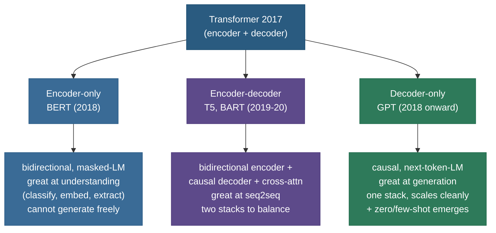
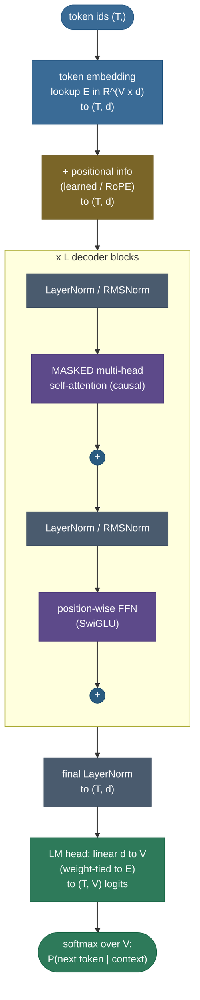
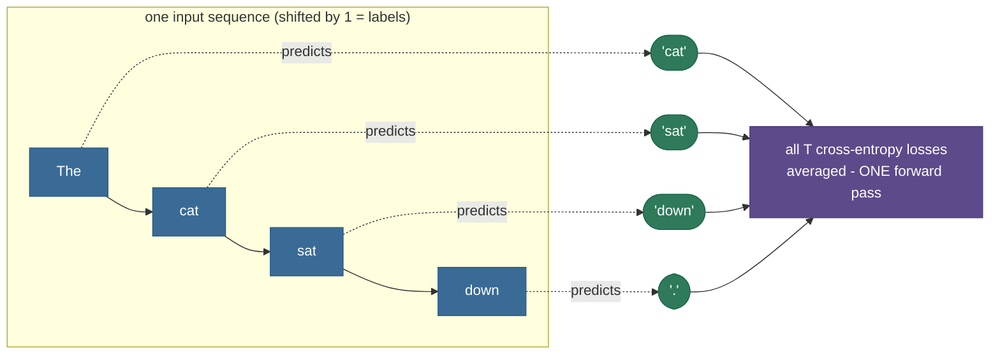
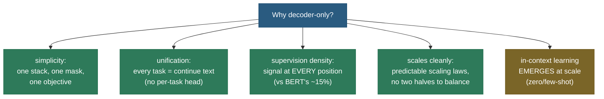
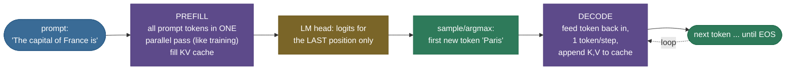

# Decoder-only Architecture: why GPT's shape won

Take the original 2017 Transformer — the one with an encoder *and* a decoder, built to translate French into English — and delete half of it. Throw away the encoder. Throw away the cross-attention that let the decoder peek at the encoder's output. What's left is almost embarrassingly simple: a stack of identical blocks, each one a **masked self-attention** layer followed by a small **feed-forward network**, with a single rule binding the whole thing together — *every token may look left, never right.* Feed it text, ask it to predict the next token, and repeat a few hundred billion times. That stripped-down half-a-Transformer is **GPT**, and it is the shape of essentially every frontier language model shipped today: GPT-4, LLaMA, Mistral, Qwen, Gemma, DeepSeek. The most important architectural decision in modern AI was, in large part, a *subtraction*.

I want to explain this the way I'd actually walk a teammate through it at a whiteboard — starting from the question the whole field had to answer around 2018-2020: *you have three ways to build a language model — encoder-only (BERT), encoder-decoder (T5), decoder-only (GPT) — so which one, and why?* We'll feel why decoder-only is the natural answer for **generation**, then build the block piece by piece, **derive the causal mask** that makes it work (and makes training shockingly efficient), tie the output head back to the input embeddings, count the parameters by hand, trace a real forward pass through GPT-2, follow inference through its two phases, and finish on the **modern recipe** (RMSNorm + RoPE + SwiGLU + GQA) that turned "GPT" into "LLaMA-class." By the end you'll be able to:

- explain **why decoder-only beat** encoder-only and encoder-decoder for general-purpose LLMs;
- draw the **decoder block** from memory and say what each piece does and why;
- **derive the causal mask** and explain why it lets *one* forward pass train on *all* next-token predictions at once;
- explain **weight tying** of the LM head and compute the parameters it saves;
- count a decoder-only model's parameters from $d$, $L$, and vocab — and check it against a real model;
- name the **modern swaps** (pre-norm, RMSNorm, RoPE, SwiGLU, GQA) and what each fixes;
- trace **prefill vs decode** at inference and connect it to the [KV cache](../05-KV-Cache/05-KV-Cache.md).

> **Note:** this page is about the *architecture* — the shape of the network and why that shape won. The *training objective* it's optimized for lives in [Language Modeling Objectives](../01-Language-Modeling-Objectives/01-Language-Modeling-Objectives.md), the *attention math* it's built from lives in [Attention Mechanism](../../05.%20Deep_Learning/concepts/15-Attention-Mechanism.md) and [Transformer Architecture](../../05.%20Deep_Learning/concepts/16-Transformer-Architecture.md), and the *inference optimization* it enables lives in [KV Cache](../05-KV-Cache/05-KV-Cache.md). We'll point to each rather than re-derive it.

---

## The problem: three architectures, one question

When the Transformer arrived in 2017 (**Vaswani et al., "Attention Is All You Need"**), it was an **encoder-decoder**: an encoder read the *source* sentence with full bidirectional attention, and a decoder generated the *target* sentence left-to-right while attending back to the encoder via **cross-attention**. Perfect for translation, where input and output are two distinct sequences.

Then the field split that template three ways, and for a couple of years it genuinely wasn't obvious which branch would win:



- **Encoder-only — BERT** (Devlin et al., 2018). Keep only the encoder. Every token attends to every other token (**bidirectional**), and it's trained by *masking out* ~15% of tokens and predicting them (the **masked-language-modeling**, or "fill-in-the-blank", objective). This is wonderful for *understanding* — classification, named-entity recognition, sentence embeddings, retrieval — because each token's representation is informed by the *whole* sentence, left and right. But it **cannot generate text** naturally: it has no notion of "produce the next token," and its bidirectional training would let it cheat by looking at the answer.
- **Encoder-decoder — T5, BART** (Raffel et al., 2019-2020). Keep both stacks. The encoder reads the input bidirectionally; the decoder generates the output causally while cross-attending to the encoder. Powerful and flexible — T5 reframed *every* NLP task as "text-in, text-out" — but you now have **two stacks to design, size, and balance**, the cross-attention adds parameters and complexity, and (as we'll see) it scales less cleanly than a single uniform stack.
- **Decoder-only — GPT** (Radford et al., 2018-2020). Keep only the decoder, and *delete the cross-attention* (there's no encoder left to attend to). What remains is a single uniform stack of **masked self-attention + FFN** blocks trained on one objective: predict the next token. No input/output split — the "input" (prompt) and "output" (continuation) are the *same* stream of text, and the model just keeps the stream going.

> **Note:** the phrase "decoder-only" is slightly historical. Once you delete the encoder *and* the cross-attention, a "decoder" block is just a Transformer block with a **causal mask** on its self-attention. There's nothing decoder-specific left except that mask. So "decoder-only" really means **"a causal-masked Transformer stack."** Keep that in your head — it demystifies the name.

**The question this page answers:** *given those three, why did decoder-only become the dominant LLM blueprint?* The short answer is **unification + scaling**: decoder-only turns *every* task into one task (next-token prediction over text), and that single uniform stack scales more predictably and unlocks zero/few-shot abilities the other two don't. We'll earn that answer piece by piece.

---

## What it is: the block and the stack

A decoder-only model is a **stack of $L$ identical blocks** wrapped between an input layer (token embedding + positions) and an output layer (final norm + a projection to vocabulary logits). Here is the whole thing, with tensor shapes, for a batch of one sequence of length $T$ and model width $d$:



Read it top to bottom:

1. **Token embedding.** Each token id indexes a row of an embedding matrix $E \in \mathbb{R}^{V \times d}$ ($V$ = vocab size). A length-$T$ sequence becomes a $(T, d)$ matrix of vectors.
2. **Positional information.** Self-attention is **permutation-invariant** — on its own it has no idea token 3 came before token 7. So we inject position, either by *adding* a positional vector (GPT-2's learned positions, the 2017 sinusoids) or by *rotating* the query/key vectors by a position-dependent angle (**RoPE**, the modern default). See [Positional Encoding](../../05.%20Deep_Learning/concepts/17-Positional-Encoding.md) for the full derivation; here it's enough that position gets in *somehow*.
3. **$L$ decoder blocks.** Each block does two things, each wrapped in a **residual connection** and a **normalization**: (a) **masked multi-head self-attention** — tokens mix information, but only from the left; (b) a **position-wise feed-forward network** — each token is independently transformed through a wider hidden layer. This is the heart of the model and we'll dwell on it.
4. **Final norm + LM head.** A last normalization, then a linear projection $d \to V$ producing a **logit** for every vocabulary token at every position. Softmax turns logits into a probability distribution over the next token.

That's it. The same block, repeated $L$ times (12 for GPT-2 small, 32 for LLaMA-2-7B, 80 for the 70B). The model's power comes from *depth × width × data × the causal objective* — not from architectural cleverness inside the block, which has stayed remarkably stable since 2017.

**Worked example — trace the shapes through one block.** Take $T=6$ tokens, $d=64$, $h=8$ heads (so head dim $d_k = d/h = 8$). Follow the tensors:

1. Input to the block: $X \in \mathbb{R}^{6 \times 64}$.
2. Project to queries/keys/values: $Q = X W_Q,\; K = X W_K,\; V = X W_V$, each $(6, 64)$; reshape to per-head $(8, 6, 8)$.
3. Scores per head: $QK^\top / \sqrt{d_k}$ is $(8, 6, 6)$ — a $6\times6$ score matrix for each of the 8 heads. **Add the causal mask** (the lower-triangular pattern), softmax over the last axis → attention weights $(8, 6, 6)$.
4. Mix values: weights $@\,V$ → $(8, 6, 8)$; concatenate the heads back → $(6, 64)$; output projection $W_O$ → $(6, 64)$. Add the residual.
5. FFN: each row independently goes $64 \to 256 \to 64$ (the $4d$ hidden) → $(6, 64)$. Add the residual.

**The block's output is $(6, 64)$ — identical in shape to its input.** That shape invariance is *why* you can stack $L$ blocks like Lego: each one consumes and produces a $(T, d)$ tensor. We confirm exactly these shapes in the from-scratch code below (attention comes out $(8, 6, 6)$, output $(6, 64)$).

> **Note:** the FFN and attention play complementary roles. **Attention moves information *between* positions** (token $t$ pulls in context from tokens $\le t$); the **FFN transforms each position *independently*** (no cross-token mixing — it's applied to every token's vector separately, with shared weights). A common one-liner: *attention is communication, FFN is computation.* The FFN is also where most of the parameters and most of the "stored knowledge" live (it's ~⅔ of a block's weights).

> **Tip:** the single structural difference between a 2017 *decoder* block and a decoder-*only* block is the **missing cross-attention sub-layer**. The original decoder had three sub-layers (masked self-attn → cross-attn → FFN); delete the middle one (there's no encoder to attend to) and you get the two-sub-layer block above. If an interviewer asks "how does a GPT block differ from the Transformer decoder block?", that's the answer: *same block minus the encoder-decoder cross-attention.*

---

## Intuition: an autocomplete that never stops

The cleanest mental model is **the world's most sophisticated autocomplete**. You've used phone-keyboard autocomplete: it sees the words so far and suggests the next one. A decoder-only LLM is that, scaled to a vocabulary of ~50,000-256,000 sub-word tokens, a context of thousands to millions of tokens, and a function approximator with billions of parameters trained on a sizeable slice of the internet.

Crucially, the *only* thing it ever does is **answer the question "given everything so far, what token comes next?"** — and then you *feed its answer back in* and ask again. Translation, summarization, code, dialogue, reasoning, "write a sonnet about a database index" — to the model these are *all the same operation*. They differ only in what text precedes the blank. That's the unification that makes decoder-only so general: **you don't build a new architecture per task, you write a new prefix.**

The causal mask is what makes this honest. When the model is learning to predict token $t$, it must be *forbidden* from seeing tokens $t, t{+}1, \dots$ — otherwise it would just copy the answer and learn nothing. So each position is allowed to look only *backward*. That single constraint is the entire secret, and it's worth deriving carefully, because it does double duty: it defines the model's *semantics* (autoregressive) **and** it's the trick that makes *training* absurdly efficient.

---

## Causal masking, derived

Recall ordinary **scaled dot-product attention** (full derivation in [Attention Mechanism](../../05.%20Deep_Learning/concepts/15-Attention-Mechanism.md)). For one head, with queries $Q$, keys $K$, values $V$ each $(T, d_k)$:

$$\text{Attention}(Q, K, V) = \text{softmax}\!\left(\frac{QK^\top}{\sqrt{d_k}}\right) V.$$

> **Source / derivation:** [Vaswani et al., *Attention Is All You Need* (2017), §3.2.1](https://arxiv.org/abs/1706.03762) — defines scaled dot-product attention, including the $1/\sqrt{d_k}$ factor that stops large $d_k$ from pushing softmax into its saturated, near-zero-gradient region.

The score matrix $S = \frac{QK^\top}{\sqrt{d_k}}$ is $(T, T)$: entry $S_{ij}$ is how much query position $i$ wants to attend to key position $j$. In a *bidirectional* model (BERT), every $S_{ij}$ is allowed. In a **causal** model we must zero out every entry where $j > i$ — position $i$ must not see anything to its right.

The trick is to do this **before the softmax**, by adding a **mask matrix** $M$ where the forbidden entries are $-\infty$ and the rest are $0$:

$$M_{ij} = \begin{cases} 0 & j \le i \quad(\text{allowed: at or before me}) \\ -\infty & j > i \quad(\text{forbidden: the future}) \end{cases}$$

$$\text{CausalAttention}(Q,K,V) = \text{softmax}\!\left(\frac{QK^\top}{\sqrt{d_k}} + M\right)V.$$

> **Source / derivation:** the additive $-\infty$ mask on the decoder's self-attention is from [Vaswani et al., *Attention Is All You Need* (2017), §3.2.3](https://arxiv.org/abs/1706.03762) ("masking out … all values … which correspond to illegal connections"); using it to enforce the **left-to-right autoregressive factorization** $p(x)=\prod_t p(x_t\mid x_{<t})$ is the decoder-only LM of [Radford et al., *Improving Language Understanding by Generative Pre-Training* (2018)](https://cdn.openai.com/research-covers/language-unsupervised/language_understanding_paper.pdf).

Why $-\infty$, and why before the softmax? Because softmax exponentiates: $\text{softmax}(x)_j \propto e^{x_j}$. Adding $-\infty$ to a score sends $e^{-\infty} = 0$, so that key gets **exactly zero attention weight** — and since softmax renormalizes over the *remaining* (allowed) keys, the row still sums to 1. The future doesn't get a "small" weight; it gets *no* weight, and the allowed positions absorb all of it. (In code it's $-10^9$ or the dtype's most-negative value, not literal `-inf`, to keep the math finite.)

Here is the mask for a 4-token sequence — the additive mask on the left, the resulting (illustrative, uniform) attention weights on the right:


The mask is **lower-triangular** — a staircase. Row 0 (the first token) sees only itself. Row 1 sees tokens 0-1. Row $t$ sees tokens $0 \dots t$. Stack the rows and you get the triangle.

> **Gotcha:** the mask is applied **per head, identically, in every layer and every block.** It's not a learned parameter — it's a fixed geometric constraint baked into the attention computation. (In modern kernels like FlashAttention it isn't even materialized as a matrix; the kernel just *skips* the upper-triangular blocks. Same effect, no $(T,T)$ tensor.)

**Worked example 1 — build the 4-token mask by hand and prove token 3 can't see token 4.** Take scores that are all equal (say all 0) so the masking effect is isolated. The masked score matrix and its row-softmax:

$$
S + M =
\begin{pmatrix}
0 & -\infty & -\infty & -\infty \\
0 & 0 & -\infty & -\infty \\
0 & 0 & 0 & -\infty \\
0 & 0 & 0 & 0
\end{pmatrix}
\;\xrightarrow{\text{row softmax}}\;
\begin{pmatrix}
1 & 0 & 0 & 0 \\
\tfrac12 & \tfrac12 & 0 & 0 \\
\tfrac13 & \tfrac13 & \tfrac13 & 0 \\
\tfrac14 & \tfrac14 & \tfrac14 & \tfrac14
\end{pmatrix}
$$

Row 2 (zero-indexed — query "sat", the third token) has weight $\tfrac13$ on each of tokens 0,1,2 and **exactly 0** on token 3 ("down", the future). We verified this in code — the future weights come out bit-for-bit `0.0` and every row sums to `1.0`:

```python
import torch, torch.nn.functional as F
T = 4
mask = torch.triu(torch.full((T, T), float("-inf")), diagonal=1)  # -inf strictly above diagonal
scores = torch.zeros(T, T)                                        # equal scores to isolate the mask
w = F.softmax(scores + mask, dim=-1)
print(w)
# tensor([[1.0000, 0.0000, 0.0000, 0.0000],
#         [0.5000, 0.5000, 0.0000, 0.0000],
#         [0.3333, 0.3333, 0.3333, 0.0000],
#         [0.2500, 0.2500, 0.2500, 0.2500]])
print("row sums:", w.sum(-1).tolist())               # [1.0, 1.0, 1.0, 1.0]
print("token3 -> token4 (future):", float(w[2, 3]))  # 0.0  <- cannot see the future
```

> **Tip:** `torch.triu(x, diagonal=1)` keeps the strictly-upper triangle (the future) and zeros the rest, so adding a `-inf`-filled upper triangle is a one-liner. This exact pattern is what every implementation uses; memorize it, because "write the causal mask" is a common live-coding ask.

### The parallel-training trick (why the mask is also a speed-up)

Here is the part people under-appreciate. The causal mask doesn't just make the model *correct* — it makes **training massively parallel**, and that's a big reason decoder-only scales so well.

Naively, to train on next-token prediction you'd think you must generate one token at a time: predict token 1 from token 0, then token 2 from tokens 0-1, and so on — $T$ sequential steps per sequence. That would be hopelessly slow.

Instead, **teacher forcing** + the causal mask let you do all $T$ predictions in **one forward pass**. You feed the *entire* true sequence in at once. Because of the mask, the model's prediction at position $t$ is computed using *only* positions $0 \dots t$ — it physically *cannot* see the answer at $t{+}1$, so there's no cheating. So a single $(T, d) \to (T, V)$ forward pass simultaneously produces:

- a prediction for token 1 (using token 0),
- a prediction for token 2 (using tokens 0-1),
- …
- a prediction for token $T$ (using tokens $0 \dots T{-}1$),

and the loss is the average cross-entropy of *all* of them at once. One pass, $T$ supervised predictions, all the GPU's parallelism fully used.



> **Note:** this is why the labels are simply **the input shifted left by one position** — the target for position $t$ is the token at position $t{+}1$. You don't need a separate label set; the sequence *is* its own supervision. The objective (averaged next-token cross-entropy) is derived fully in [Language Modeling Objectives](../01-Language-Modeling-Objectives/01-Language-Modeling-Objectives.md); here the point is purely architectural — **the mask is what makes that one-pass, $T$-predictions-at-once training legal.**

> **Gotcha:** this parallel-training trick is a *training-time* phenomenon. At **inference** you genuinely don't have the future tokens — you're producing them — so generation falls back to one-token-at-a-time (the autoregressive loop). The asymmetry between *parallel training* and *sequential inference* is exactly what motivates the [KV cache](../05-KV-Cache/05-KV-Cache.md): if decode is forced to be sequential, at least don't recompute the past.

---

## The objective: next-token cross-entropy (in one breath)

The model outputs, at each position, a logit vector $z \in \mathbb{R}^V$ over the vocabulary. Softmax turns it into $P(\cdot \mid \text{context})$, and training minimizes the **negative log-likelihood** of the *actual* next token $x_{t+1}$, averaged over all positions and sequences:

$$\mathcal{L} = -\frac{1}{T}\sum_{t=1}^{T} \log P_\theta\!\left(x_{t+1} \mid x_{\le t}\right).$$

> **Source / derivation:** the autoregressive (causal-LM) objective — maximizing $\sum_t \log P_\theta(x_t\mid x_{<t})$ over a decoder-only transformer — is [Radford et al., *Improving Language Understanding by Generative Pre-Training* (2018), §3.1](https://cdn.openai.com/research-covers/language-unsupervised/language_understanding_paper.pdf) and [Radford et al., *Language Models are Unsupervised Multitask Learners* (GPT-2, 2019), §2](https://cdn.openai.com/better-language-models/language_models_are_unsupervised_multitask_learners.pdf). Full derivation (perplexity, maximum-likelihood) in [Language Modeling Objectives](../01-Language-Modeling-Objectives/01-Language-Modeling-Objectives.md).

That's it — plain cross-entropy, one term per position, all computed from the single forward pass above. The full treatment (perplexity, why this is maximum-likelihood, label smoothing) lives in **[Language Modeling Objectives](../01-Language-Modeling-Objectives/01-Language-Modeling-Objectives.md)**; we only need it here to motivate the **LM head**, which is what turns the final hidden states into those logits.

---

## The LM head and weight tying

After the last block and final norm, every position holds a hidden vector $h_t \in \mathbb{R}^d$. To get logits over the vocabulary we project it up to $V$ dimensions with a linear map — the **language-modeling head** (LM head):

$$z_t = h_t \, W_{\text{out}}, \qquad W_{\text{out}} \in \mathbb{R}^{d \times V}, \qquad z_t \in \mathbb{R}^V.$$

Now the elegant part. We already *have* a $V \times d$ matrix in the model — the **input embedding** $E$, which maps token ids to vectors. The LM head needs a $d \times V$ matrix mapping vectors back to token scores. These are transposes of each other in shape, and it turns out you can **use the same matrix for both**:

$$W_{\text{out}} = E^\top.$$

> **Source / derivation:** [Press & Wolf, *Using the Output Embedding to Improve Language Models* (2017)](https://arxiv.org/abs/1608.05859) — derives that tying the output projection to the input embedding ($W_{\text{out}}=E^\top$) lowers perplexity and removes the duplicate $V\times d$ matrix; introduced concurrently by [Inan et al., *Tying Word Vectors and Word Classifiers* (2017)](https://arxiv.org/abs/1611.01462).

This is **weight tying** (Press & Wolf 2017; Inan et al. 2017), and it's the default in GPT-2, GPT-3, and most modern models. Two reasons it's a good idea:

**1. It saves a large pile of parameters.** Both matrices have $V \times d$ entries. For GPT-2 small, $V = 50{,}257$ and $d = 768$:

$$V \times d = 50{,}257 \times 768 \approx 38.6 \text{ million parameters.}$$

Tying means you store that matrix **once** instead of twice — a flat **~38.6M-parameter saving** on a 124M-parameter model, i.e. you'd otherwise be ~31% larger for no benefit. For a model with a 256K-token vocabulary (modern tokenizers) and $d=4096$, the untied head alone would be ~1B parameters — tying it away is significant.

**2. It improves quality (mild but real).** Intuitively, the vector that *represents* a token going in and the vector that *scores* that token coming out should live in the same space — if "cat" embeds to a particular direction, predicting "cat" should reward hidden states pointing that way. Tying enforces that symmetry, gives the embedding rows twice the gradient signal (they're updated both as inputs and as output classifiers), and empirically lowers perplexity. It's a rare "fewer parameters *and* better" win.


> **Gotcha:** tying requires the LM head's input dimension to match the embedding dimension and the vocab to be identical (it is — same tokenizer). Some models *don't* tie (e.g. very large vocabularies where the authors found a small quality gain from untied heads, or models that scale the head differently). And LLaMA, despite tying in many configs, sometimes ships **untied** output heads. Always check the config (`tie_word_embeddings`) rather than assuming.

> **Note:** we **verified** tying in GPT-2 directly — `model.lm_head.weight` and `model.transformer.wte.weight` are the *same tensor* (identical data pointer). So GPT-2's reported 124M parameters already count that matrix exactly once.

---

## Counting the parameters by hand

Being able to size a decoder-only model from $d$, $L$, and vocab is a classic interview rep. Here's the breakdown; the only number to memorize is **~12 d² per layer.**

**Per layer.** Ignore biases and norm scales (negligible — a few $d$ each):

| Sub-layer | Matrices | Params |
|---|---|---|
| Attention | $W_Q, W_K, W_V, W_O$, each $d \times d$ | $4d^2$ |
| FFN | up-projection $d \times 4d$, down-projection $4d \times d$ | $8d^2$ |
| **Per block** | | $\mathbf{12 d^2}$ |

The factor of 4 in the FFN ($d_{\text{ff}} = 4d$) is the classic Transformer choice; the attention is exactly $4d^2$ because four square $d\times d$ projections. So one block ≈ $12d^2$.

**Whole model.**

$$N \approx \underbrace{12\,d^2\,L}_{\text{blocks}} \;+\; \underbrace{V \, d}_{\text{token embedding (= tied head)}} \;+\; \underbrace{T_{\max}\, d}_{\text{learned positions (0 for RoPE)}}.$$

> **Source / derivation:** the per-block $12d^2$ count follows directly from the layer shapes in [Vaswani et al., *Attention Is All You Need* (2017), §3.2.2 & §3.3](https://arxiv.org/abs/1706.03762) — four $d\times d$ attention projections ($4d^2$) plus a feed-forward up/down pair at width $d_{\text{ff}}=4d$ ($8d^2$); the same accounting underlies the standard $N\approx 12d^2L$ estimate used by [Kaplan et al., *Scaling Laws for Neural Language Models* (2020), §2.1](https://arxiv.org/abs/2001.08361).

**Worked example 2 — GPT-2 small from scratch.** Config: $d=768$, $L=12$, $V=50{,}257$, $T_{\max}=1024$.

$$\text{blocks} = 12 \times 768^2 \times 12 = 12 \times 589{,}824 \times 12 \approx 84.9\text{M}$$
$$\text{token emb} = 50{,}257 \times 768 \approx 38.6\text{M}, \qquad \text{pos emb} = 1024 \times 768 \approx 0.79\text{M}$$
$$N \approx 84.9 + 38.6 + 0.79 \approx \mathbf{124\text{M}.}$$

That matches the famous "GPT-2 124M." And we checked it against the real model: `sum(p.numel() for p in model.parameters())` returns **124,439,808** — within rounding of our hand count — and one real transformer block measured **7,087,872 ≈ 12 × 768² (= 7,077,888)**, confirming the $12d^2$ rule on the nose.

> **Tip:** because blocks scale as $12d^2 L$ while embeddings scale as $Vd$, the embeddings are a *big* fraction of a small model (38.6M of 124M ≈ 31% for GPT-2 small) but a *tiny* fraction of a large one. For LLaMA-2-7B ($d{=}4096$, $L{=}32$, $V{\approx}32$K), blocks dominate at ~6.5B and the embedding is only ~0.13B. **Rule of thumb: $N \approx 12 d^2 L$ for any model big enough that you can ignore the embedding** — a one-line estimate you can do in your head.

> **Note:** the FFN being $8d^2$ vs attention's $4d^2$ is why people say "two-thirds of a Transformer's parameters are in the MLPs." Modern **SwiGLU** FFNs use *three* weight matrices (gate, up, down) and shrink the hidden width to ~$\tfrac{8}{3}d$ to keep the parameter count roughly the same — more on that in the modern recipe below.

> **Tip:** the SwiGLU accounting is a nice check. A plain FFN has two matrices ($d{\times}4d$ and $4d{\times}d$) = $8d^2$. SwiGLU has *three* ($W_{\text{gate}}, W_{\text{up}}$ both $d{\times}d_{\text{ff}}$, and $W_{\text{down}}$ that's $d_{\text{ff}}{\times}d$), so its cost is $3\,d\,d_{\text{ff}}$. To keep that equal to $8d^2$ you set $d_{\text{ff}} = \tfrac{8}{3}d$ — which is exactly the "weird" hidden size you see in LLaMA configs (e.g. $d{=}4096 \Rightarrow d_{\text{ff}}{\approx}11008$, rounded for hardware). The $12d^2$-per-layer estimate still holds: attention $4d^2$ + SwiGLU $\approx 8d^2$.

---

## Why decoder-only won the debate

We can now answer the headline question with the pieces in hand. Around 2020-2022 there was a real, evidence-driven debate — encoder-decoder (T5) vs decoder-only (GPT) vs prefix-LM hybrids — and a careful study, **Wang et al. (2022), "What Language Model Architecture and Pretraining Objective Work Best for Zero-Shot Generalization?"**, ran the controlled experiment. Decoder-only with a plain next-token (causal-LM) objective gave the **best zero-shot generalization** out of the box. Here's *why*, distilled:

- **Architectural simplicity → cleaner scaling.** One uniform stack, one objective, one mask. There's no encoder/decoder split to *balance* (how big should each half be? how many cross-attention heads?), no second objective to tune. When your whole model is "the same block, $L$ times," scaling is turning one knob, and **scaling laws** (see [Scaling Laws](../03-Scaling-Laws/03-Scaling-Laws.md)) are clean and predictable. Encoder-decoder models have more moving parts, and that friction shows up at frontier scale.
- **Everything-is-generation unifies tasks.** With decoder-only, *every* task is "continue this text," so you never design a task-specific head or architecture — you write a prompt. That's strictly more general than BERT (which needs a fine-tuned classification head per task) and removes T5's input/output ceremony. One model, all tasks, via text.
- **Density of supervision.** A causal-LM gets a *training signal at every position* (predict each next token), so a length-$T$ sequence yields $T$ predictions. BERT's masked-LM only supervises the ~15% of masked positions — it "wastes" ~85% of each sequence as context-only. Decoder-only squeezes more learning out of the same tokens.
- **Zero/few-shot and in-context learning emerge.** Because the model is *trained* to continue arbitrary text, at scale it learns to continue text that *describes a task and gives examples* — which is exactly **in-context learning**: give it a few input→output pairs in the prompt and it infers the pattern, **with no gradient updates** (see [Prompting & In-Context Learning](../16-Prompting-and-In-Context-Learning/16-Prompting-and-In-Context-Learning.md)). This capability **emerged** in GPT-3 and is the practical reason decoder-only is the substrate of modern LLMs. BERT and T5 don't do this nearly as naturally.



**What's lost — the bidirectional trade-off.** Causal attention isn't free. A decoder-only model's representation of token $t$ is built from the left context *only*, so for tasks that are purely about *understanding a fixed input* (classification, retrieval embeddings, extractive QA), a **bidirectional** encoder like BERT — which lets each token see the whole sentence — can produce richer per-token representations and often wins per-parameter. Concretely: in "the bank raised interest rates," the word *bank* is disambiguated (financial, not river) by the words to its *right* ("interest rates"). A bidirectional encoder folds that right context into *bank*'s representation directly; a causal model only has it for the *later* tokens, so *bank*'s own vector can't use it. For a pooled sentence embedding that asymmetry costs real accuracy. This is why **BERT-style encoders are still the default for embeddings and retrieval** even in 2026: when you don't need to generate, giving up the right context is a real loss. The decoder-only bet is that *generation generality + scale* outweighs that loss for general-purpose LLMs — and for the frontier, it has. (Interestingly, the gap shrinks at scale, and recent work even *converts* strong decoder-only LLMs into embedders by removing the causal mask and lightly fine-tuning — evidence that scale recovers much of what causality gave up.)

> **Note:** **prefix-LM** is the interesting middle ground: use *bidirectional* attention over the prompt (the "prefix") and *causal* attention over the generated continuation. It buys some of BERT's bidirectional understanding of the input while keeping generation. Several models (UL2, some GLM variants) use it, but pure causal decoder-only remained the dominant choice — simpler, and the empirical zero-shot edge held.

> **Gotcha:** "decoder-only won" is about *general-purpose generative LLMs*, not *all of NLP*. For sentence embeddings, reranking, and many classification pipelines, an encoder (BERT/RoBERTa, or modern e5/BGE embedders) is still the right, cheaper tool. Don't over-generalize the verdict in an interview — name the exception and you sound senior.

---

## The GPT lineage: same shape, more scale

The decoder-only architecture barely changed from GPT-1 to GPT-3 — what changed was **scale and data**, and that alone unlocked qualitatively new behavior. This is the empirical heart of "the bitter lesson": the *shape* was right early; scaling it was the work.


- **GPT-1** (Radford et al., 2018) — *117M params.* Introduced the recipe: **generative pretraining** on unlabeled text, then **supervised fine-tuning** per task. Showed that a pretrained decoder-only transformer transfers well. Still needed task-specific fine-tuning.
- **GPT-2** (Radford et al., 2019) — *up to 1.5B params.* Same architecture, ~10× bigger, trained on more/cleaner data (WebText). Showed surprisingly coherent long-form generation and the first signs of **zero-shot** task performance — doing tasks it was never fine-tuned for, just from a prompt. (Also the famous "too dangerous to release" staged rollout.)
- **GPT-3** (Brown et al., 2020) — *175B params.* Same architecture again, ~100× bigger. The breakthrough wasn't a new component — it was that **in-context / few-shot learning emerged**: put a few examples in the prompt and the model performs the task with **no weight updates**. This is the capability that defines the modern LLM, and it arrived purely from scaling the decoder-only stack.
- **GPT-4** (2023) — architecture details unofficial (widely believed to be a large mixture-of-experts decoder-only model; see [Mixture of Experts](../07-Mixture-of-Experts/07-Mixture-of-Experts.md)). Strong reasoning and multimodality. Still, at its core, *next-token prediction over a causal transformer.*

> **Note:** the through-line is the story of the field: **GPT-1 → GPT-3 is roughly the same architecture scaled ~1500×**, and the dramatic new abilities (coherent generation → zero-shot → few-shot/in-context learning) appeared *from scale*, not from architectural invention. Decoder-only was the chassis that scaled gracefully enough to make that possible.

---

## The modern decoder-only recipe (LLaMA-style)

A 2024-era decoder-only block (LLaMA, Mistral, Qwen, Gemma) keeps the *skeleton* — masked self-attention + FFN + residual + norm — but swaps four components for better-behaved versions. Each swap fixes a specific problem; know them all and you can "draw a modern GPT block."


1. **Pre-norm instead of post-norm.** The 2017 Transformer put LayerNorm *after* each sub-layer (post-norm); modern models put it *before* (pre-norm: `x + Sublayer(Norm(x))`). Pre-norm keeps a clean **residual highway** — the identity path is never normalized — so gradients flow to very deep stacks without the warmup/instability post-norm needs. Essentially every large model is pre-norm. (See [Normalization](../../05.%20Deep_Learning/concepts/11-Normalization.md).)
2. **RMSNorm instead of LayerNorm.** **RMSNorm** drops LayerNorm's mean-centering and bias, normalizing only by the root-mean-square: $\text{RMSNorm}(x) = \frac{x}{\sqrt{\frac1d\sum x_i^2 + \epsilon}} \odot g$. It's cheaper (fewer ops, no mean/var) and works just as well — a free efficiency win at scale. (See [Normalization](../../05.%20Deep_Learning/concepts/11-Normalization.md).)
3. **RoPE instead of learned absolute positions.** **Rotary Position Embedding** rotates the query and key vectors by an angle proportional to their position, so the *dot product* $q_i \cdot k_j$ depends only on the **relative** offset $i - j$. This generalizes to longer contexts better than learned absolute tables (which can't extrapolate past their trained length) and is the backbone of long-context extension tricks. (Full derivation in [Positional Encoding](../../05.%20Deep_Learning/concepts/17-Positional-Encoding.md); see also [Long-Context Methods](../08-Long-Context-Methods/08-Long-Context-Methods.md).)
4. **SwiGLU instead of GELU FFN.** The FFN becomes a **gated** unit: $\text{SwiGLU}(x) = (\text{Swish}(xW_{\text{gate}}) \odot xW_{\text{up}})W_{\text{down}}$ — a learned gate that modulates the up-projection. It consistently beats a plain GELU MLP at equal compute, so it's the modern default; the hidden width is shrunk to ~$\tfrac{8}{3}d$ to offset the third matrix and keep parameters roughly constant. (See [Activation Functions](../../05.%20Deep_Learning/concepts/03-Activation-Functions.md).)
5. **(Bonus) GQA instead of plain MHA.** **Grouped-query attention** shares each key/value head across a *group* of query heads (e.g. 8 KV heads serving 32 query heads). It barely touches quality but shrinks the **KV cache** by the group factor — a ~4-8× memory cut that's the difference between serving long context and not. (Full treatment in [KV Cache](../05-KV-Cache/05-KV-Cache.md).)

> **Source / derivation:** each component above is its primary paper — **pre-norm** ($x + \text{Sublayer}(\text{Norm}(x))$, the warmup-free residual highway) is [Xiong et al., *On Layer Normalization in the Transformer Architecture* (2020)](https://arxiv.org/abs/2002.04745); **RMSNorm** is [Zhang & Sennrich (2019)](https://arxiv.org/abs/1910.07467); **RoPE** is [Su et al. (2021)](https://arxiv.org/abs/2104.09864); **SwiGLU** is [Shazeer, *GLU Variants Improve Transformer* (2020)](https://arxiv.org/abs/2002.05202); **GQA** is [Ainslie et al. (2023)](https://arxiv.org/abs/2305.13245). The combined recipe is spelled out in [Touvron et al., *LLaMA* (2023), §2.1](https://arxiv.org/abs/2302.13971).

> **Note:** none of these change the *fundamental* shape — it's still a causal-masked stack of attention+FFN blocks trained on next-token prediction. They're **quality-and-efficiency refinements** on a frozen blueprint. That stability is itself the point: the decoder-only architecture has been the right answer long enough that progress is now in *components, data, and scale*, not in the skeleton.

> **Tip:** a clean way to remember the modern recipe is **"Pre-RMS-RoPE-SwiGLU-GQA"** — pre-norm with RMSNorm, RoPE for position, SwiGLU for the FFN, GQA for the attention. Say those five and you've described LLaMA-2/3, Mistral, Qwen-2, and Gemma to first order.

---

## Inference: prefill, then decode

Training is one parallel pass (the mask trick). **Inference is different** — you don't have the future, you're producing it — so generation has two phases, and recognizing them is essential to everything in serving (and the entire reason the [KV cache](../05-KV-Cache/05-KV-Cache.md) exists).



- **Prefill.** Run the *entire prompt* through the stack in one parallel pass — exactly like a training forward pass, with the causal mask. This computes and **caches the K and V** for every prompt position, and produces logits; we only need the **last position's** logits (that's the prediction for the first new token). Prefill is **compute-bound** and sets your *time-to-first-token*.
- **Decode.** Now generate one token at a time. Feed the just-emitted token back in; it only needs to compute *its own* Q, K, V and attend over the **cached** K/V of everything before it. Append its K/V to the cache and repeat. Decode is **memory-bound** (it streams the cache and weights to do tiny math) and sets your *time-per-output-token*.

This is precisely where the **quadratic cost** of attention bites and where the KV cache rescues you. Naively, generating token $t$ re-runs attention over all $t$ previous tokens — and doing that for every step is $O(n^2)$ work over a sequence. The KV cache makes each decode step **$O(1)$ new projection** (just the one new token) instead of recomputing the past, turning the decode loop from quadratic to linear. We confirmed both the **cache shape** and the **speed-up** on GPT-2:

- After prefilling the 5-token prompt "The capital of France is", layer 0's K cache has shape **`(1, 12, 5, 64)`** = `[batch, n_heads, seq_len, head_dim]` — one such (K, V) pair per layer, exactly the $2 \times L \times \text{heads} \times d_{\text{head}}$ object the cache-size formula counts.
- Generating 40 tokens with `use_cache=True` took **~0.97 s** vs **~1.6 s** with `use_cache=False` on CPU — a ~1.7× win even at tiny scale, growing with sequence length.

> **Note:** the **context window** is the maximum sequence length the model was trained/positioned for (GPT-2: 1024; LLaMA-2: 4096; modern models: 128K-1M via RoPE-scaling tricks). The cost of attention is quadratic in this length, which is why long context is *expensive* and why the whole [Long-Context Methods](../08-Long-Context-Methods/08-Long-Context-Methods.md) toolkit (RoPE scaling, sliding windows, sparse/linear attention) exists. **GQA/MQA** (above, and in [KV Cache](../05-KV-Cache/05-KV-Cache.md)) attack the *memory* side of the same problem by shrinking the per-token cache.

> **Gotcha:** during **prefill** the causal mask matters (many positions processed at once, each must not see its future). During a **decode** step there's effectively *no mask to apply* — the single new query attends to the whole cache, which only ever holds *past* tokens, so causality is automatic. People conflate these; be precise.

---

## Where it's used — and where it isn't

**Decoder-only is the default for:**

- **General-purpose LLMs and chat assistants** — GPT-4/4o, Claude, LLaMA-2/3, Mistral, Qwen, Gemma, DeepSeek. If it generates text and you talk to it, it's almost certainly decoder-only.
- **Code models** — Codex, Code Llama, StarCoder, DeepSeek-Coder. Code is just text to continue.
- **Instruction-tuned / RLHF'd assistants** — the base is a decoder-only LM; alignment ([SFT](../13-Supervised-Fine-Tuning/13-Supervised-Fine-Tuning.md) → [RLHF/DPO](../15-RLHF-and-DPO/15-RLHF-and-DPO.md)) is a post-training stage on top of the same architecture.
- **Multimodal LLMs** — most VLMs (LLaVA-style) keep a decoder-only LLM backbone and project images into its token stream.

**It is *not* the default for:**

- **Embeddings / retrieval / reranking / classification** where you only need to *understand* a fixed input — **encoder-only (BERT-family, e5, BGE)** wins, because bidirectional context yields richer per-token representations and there's nothing to generate.
- **Some seq2seq with strong input/output distinction** — translation and speech (Whisper) still use **encoder-decoder**, where a clean input encoder + cross-attention is a natural fit. (Though decoder-only handles these fine at scale too.)

> **Tip:** an interview-grade summary: *encoder-only for understanding a fixed input (BERT), encoder-decoder for distinct-input-to-distinct-output sequence tasks (T5, Whisper), decoder-only for open-ended generation and general-purpose LLMs (GPT, LLaMA).* The frontier landed on decoder-only because **generality + scale** beat the others for the thing we care about most — a single model that does everything via text.

---

## Application: a step-by-step build playbook

If you were to *build* (or instantiate) a decoder-only model, here's the checklist, each step pointing at the concept that governs it:

1. **Tokenizer + vocab.** Pick a sub-word tokenizer (BPE / SentencePiece), fix $V$. This sets the embedding/head size $Vd$.
2. **Embedding + positions.** Token embedding $E \in \mathbb{R}^{V\times d}$; choose positions — **RoPE** (modern default, extrapolates) over learned absolute. ([Positional Encoding](../../05.%20Deep_Learning/concepts/17-Positional-Encoding.md).)
3. **The block, ×$L$.** Pre-norm **RMSNorm** → **causal multi-head attention** (with **GQA** if you'll serve long context) → residual → RMSNorm → **SwiGLU FFN** → residual. ([Normalization](../../05.%20Deep_Learning/concepts/11-Normalization.md), [Attention](../../05.%20Deep_Learning/concepts/15-Attention-Mechanism.md), [Activation Functions](../../05.%20Deep_Learning/concepts/03-Activation-Functions.md).)
4. **Final norm + tied LM head.** RMSNorm, then linear $d \to V$ **tied** to $E$.
5. **Objective.** Next-token cross-entropy with teacher forcing; labels = inputs shifted by one; one parallel masked pass. ([Language Modeling Objectives](../01-Language-Modeling-Objectives/01-Language-Modeling-Objectives.md).)
6. **Scale + data.** Pick $d, L$, tokens-per-parameter from **scaling laws**; pretrain at scale. ([Scaling Laws](../03-Scaling-Laws/03-Scaling-Laws.md), [Pretraining at Scale](../02-Pretraining-at-Scale/02-Pretraining-at-Scale.md).)
7. **Align.** SFT → preference optimization (RLHF/DPO) to turn the base LM into an assistant. ([SFT](../13-Supervised-Fine-Tuning/13-Supervised-Fine-Tuning.md), [RLHF/DPO](../15-RLHF-and-DPO/15-RLHF-and-DPO.md).)
8. **Serve.** Prefill + decode with a **KV cache**, GQA, paging, quantization. ([KV Cache](../05-KV-Cache/05-KV-Cache.md), [Inference Optimization & Serving](../09-Inference-Optimization-and-Serving/09-Inference-Optimization-and-Serving.md).)

Each step is one concept on this platform — this page is the spine that connects them.

---

## Code: a tiny decoder block, then a real GPT-2

Two runnable pieces, both verified on Python 3.12 (torch 2.12, transformers 5.10). First, a **from-scratch single decoder block** so the shapes and the causal mask are concrete; then a **real GPT-2** to ground it in a model you can download.

> **Runnable project and a step-by-step notebook:** the from-scratch code below is also a clean, multi-layer **decoder-only *stack*** (`d_model=32`, 4 heads, 2 layers, weight-tied head) next to this page — a [runnable demo script](code/decoder_only_architecture.py) (`python decoder_only_architecture.py`) and an executed [step-by-step teaching notebook](code/04-Decoder-only-Architecture.ipynb). They print the shape at **every** stage and run the **no-leakage proof**: changing a *future* token leaves every *earlier* position's logits **bit-for-bit identical** (`torch.equal`, max abs diff `0.00e+00`) — the causal mask's guarantee that makes parallel teacher-forced training legal. Device-agnostic (CUDA → MPS → CPU), seeded for reproducibility.

### A tiny decoder block from scratch (shapes you can trace)

```python
"""One decoder-only block: causal multi-head self-attention + FFN + pre-norm residuals.
Shows the shapes end to end and proves the mask zeros the future. CPU, ~1 second."""
import torch, torch.nn as nn, torch.nn.functional as F

torch.manual_seed(0)
T, d, n_heads = 6, 64, 8         # seq len, model width, heads
hd = d // n_heads                # head dim = 8

class DecoderBlock(nn.Module):
    def __init__(self, d, n_heads):
        super().__init__()
        self.n_heads, self.hd = n_heads, d // n_heads
        self.qkv = nn.Linear(d, 3 * d)          # Wq,Wk,Wv fused
        self.proj = nn.Linear(d, d)             # Wo
        self.ln1, self.ln2 = nn.LayerNorm(d), nn.LayerNorm(d)
        self.ffn = nn.Sequential(nn.Linear(d, 4 * d), nn.GELU(), nn.Linear(4 * d, d))

    def attn(self, x):                          # x: (T, d)
        T = x.shape[0]
        q, k, v = self.qkv(x).split(x.shape[-1], dim=-1)
        # (T, d) -> (n_heads, T, hd)
        shp = lambda t: t.view(T, self.n_heads, self.hd).transpose(0, 1)
        q, k, v = shp(q), shp(k), shp(v)
        scores = (q @ k.transpose(-1, -2)) / self.hd ** 0.5               # (n_heads, T, T)
        mask = torch.triu(torch.full((T, T), float("-inf")), diagonal=1)  # causal
        w = F.softmax(scores + mask, dim=-1)                             # future weights -> 0
        out = (w @ v).transpose(0, 1).reshape(T, -1)                    # (T, d)
        return self.proj(out), w

    def forward(self, x):
        a, w = self.attn(self.ln1(x))           # pre-norm
        x = x + a                                # residual
        x = x + self.ffn(self.ln2(x))           # pre-norm FFN + residual
        return x, w

block = DecoderBlock(d, n_heads)
x = torch.randn(T, d)
y, w = block(x)
print("input  :", tuple(x.shape))               # (6, 64)
print("output :", tuple(y.shape))               # (6, 64)  -- shape preserved by the block
print("attn   :", tuple(w.shape))               # (8, 6, 6) -- per-head TxT weights
# causal check: head 0, query position 2 must put zero weight on positions 3,4,5
print("q2 weights on the future:", w[0, 2, 3:].tolist())   # [0.0, 0.0, 0.0]
print("each query row sums to 1:", torch.allclose(w.sum(-1), torch.ones(n_heads, T)))
```

Output:

```
input  : (6, 64)
output : (6, 64)
attn   : (8, 6, 6)
q2 weights on the future: [0.0, 0.0, 0.0]
each query row sums to 1: True
```

The block **preserves the shape** $(T, d)$ — which is exactly why you can stack $L$ of them — and the causal mask makes query position 2 put **exactly zero** weight on the future positions 3, 4, 5, with every row a valid distribution.

> **Note:** stacking is trivial *because* the block is shape-preserving: `for blk in blocks: x, _ = blk(x)`. A real model wraps this with the embedding/positions at the front and the final-norm/tied-head at the back — but the repeated unit is exactly this block.

### A real GPT-2: generate, inspect the LM head, see the cache

```python
"""Real decoder-only model (GPT-2 124M): greedy generation, the LM head's next-token
distribution, weight tying, and the KV cache shape. Downloads ~500MB on first run."""
import torch
from transformers import GPT2LMHeadModel, GPT2TokenizerFast

tok = GPT2TokenizerFast.from_pretrained("gpt2")
model = GPT2LMHeadModel.from_pretrained("gpt2").eval()

# (a) parameter count + weight tying (head shares the input embedding matrix)
total = sum(p.numel() for p in model.parameters())
tied = model.lm_head.weight.data_ptr() == model.transformer.wte.weight.data_ptr()
print(f"params: {total:,}  | LM head tied to token embedding: {tied}")
# params: 124,439,808  | LM head tied to token embedding: True

# (b) the LM head as a next-token distribution
prompt = "The capital of France is"
ids = tok(prompt, return_tensors="pt").input_ids
with torch.no_grad():
    logits = model(ids).logits[0, -1]            # logits for the LAST position only
probs = torch.softmax(logits, dim=-1)
top = torch.topk(probs, 5)
print("top-5 next tokens:")
for p, i in zip(top.values, top.indices):
    print(f"  {tok.decode([i])!r:12} {p.item()*100:5.1f}%")

# (c) greedy generation = argmax of the head, fed back in (the autoregressive loop)
out = model.generate(ids, max_new_tokens=6, do_sample=False, pad_token_id=tok.eos_token_id)
print("greedy:", tok.decode(out[0]))

# (d) the KV cache shape after prefilling the prompt
with torch.no_grad():
    cached = model(ids, use_cache=True).past_key_values
k0 = cached.layers[0].keys                       # transformers 5.x DynamicCache
print("layer-0 K cache shape:", tuple(k0.shape))  # (batch, heads, seq_len, head_dim)
```

Measured output:

```
params: 124,439,808  | LM head tied to token embedding: True
top-5 next tokens:
  ' the'         8.5%
  ' now'         4.8%
  ' a'           4.6%
  ' France'      3.2%
  ' Paris'       3.2%
greedy: The capital of France is the capital of the French Republic
layer-0 K cache shape: (1, 12, 5, 64)
```


> **Note:** two honest teaching points fall out of the *measured* run. First, **weight tying is real and counted** — the head literally *is* the token-embedding matrix (same pointer), so it adds zero parameters to the 124M total. Second, GPT-2-small is *small*: it ranks `' the'` above `' Paris'`, because at 124M it hasn't sharply memorized "Paris" as the completion. A bigger, instruction-tuned model assigns the bulk of the mass to "Paris." That gap — fuzzy small base model → confident large aligned model — *is* the scaling story of this page, visible in one bar chart.

> **Tip:** to *feel* the KV-cache win on the real model, time `model.generate(..., use_cache=True)` against `use_cache=False` on a long generation and watch the wall-clock diverge (we measured ~0.97 s vs ~1.6 s for 40 tokens on CPU). Same architecture, the cache just stops it recomputing the past — the full story is in [KV Cache](../05-KV-Cache/05-KV-Cache.md).

---

## Three comparison patterns, side by side

To cement the architectural distinction, here are the three attention patterns as matrices — *who can attend to whom*:


| | Encoder-only (BERT) | Encoder-decoder (T5) | Decoder-only (GPT) |
|---|---|---|---|
| **Attention** | bidirectional | bi (enc) + causal (dec) + cross | causal only |
| **Objective** | masked-LM (fill blanks) | denoising / seq2seq | next-token (causal LM) |
| **Best at** | understanding, embeddings | seq2seq (translate, summarize) | open-ended generation, LLMs |
| **Generates?** | no | yes (decoder) | yes |
| **Stacks** | one (encoder) | two (enc + dec) | one (decoder) |
| **Supervision/seq** | ~15% of positions | output positions | **every** position |
| **In-context learning** | weak | weak | **emerges at scale** |
| **Canonical models** | BERT, RoBERTa, e5, BGE | T5, BART, Whisper | GPT, LLaMA, Mistral, Qwen |

---

## Recap and rapid-fire

**If you remember nothing else:** a decoder-only model is a stack of $L$ identical blocks — **masked (causal) self-attention + FFN, each with a residual and a pre-norm** — bookended by a token embedding and a (weight-tied) LM head, trained on **next-token cross-entropy**. The **causal mask** ($-\infty$ above the diagonal before softmax) is the whole trick: it makes the model autoregressive *and* lets one parallel forward pass train on all $T$ next-token predictions at once. It won the architecture debate because it **unifies every task as text generation**, **supervises every position**, **scales cleanly**, and **unlocks in-context learning** at scale — at the cost of giving up BERT's bidirectional understanding. The modern recipe keeps that skeleton and swaps in **pre-norm RMSNorm + RoPE + SwiGLU + GQA**; inference splits into compute-bound **prefill** and memory-bound **decode**, which is why the [KV cache](../05-KV-Cache/05-KV-Cache.md) exists.

**Quick-fire — say these out loud:**

- *How does a GPT block differ from the 2017 decoder block?* Same block **minus the encoder-decoder cross-attention** — just masked self-attn + FFN.
- *Why the causal mask, and where?* Add $-\infty$ to scores above the diagonal **before softmax**, so future keys get exactly zero weight; applied per head, every layer.
- *Why does the mask make training fast?* Teacher forcing + mask = **one** forward pass gives $T$ next-token predictions in parallel (no cheating, since each position can't see its future).
- *What is weight tying and what does it save?* The LM head reuses the input embedding ($W_{\text{out}}=E^\top$); saves $V{\times}d$ params (~38.6M for GPT-2 small) and mildly improves quality.
- *Parameters of a decoder model?* $\approx 12 d^2 L + Vd$; per layer $12d^2$ (attn $4d^2$ + FFN $8d^2$). GPT-2 small = 124M.
- *Why did decoder-only win over BERT and T5?* Unifies tasks as generation, supervises every token, scales cleanly with one stack, and in-context learning emerges; trade-off is losing bidirectional understanding.
- *What's the modern recipe?* Pre-norm **RMSNorm + RoPE + SwiGLU + GQA** on the same causal stack (LLaMA-class).
- *Prefill vs decode?* Prefill = one parallel masked pass over the prompt (fills the KV cache, sets TTFT); decode = one token at a time over the cache (sets TPOT).
- *What's lost vs an encoder?* Bidirectional context — so encoders still win for embeddings/retrieval/classification.

---

## References and further reading

The curated link library for this topic — videos, courses, articles, papers, books, and internal cross-links — lives in a companion file so it can be reused as a standalone reference list:

**→ [Decoder-only Architecture — references and further reading](04-Decoder-only-Architecture.references.md)**
