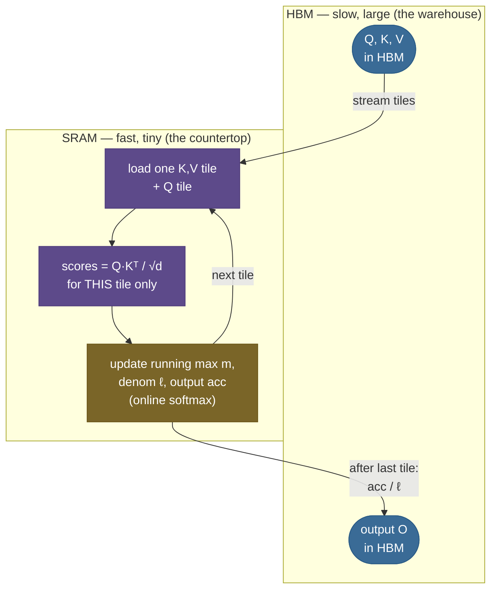
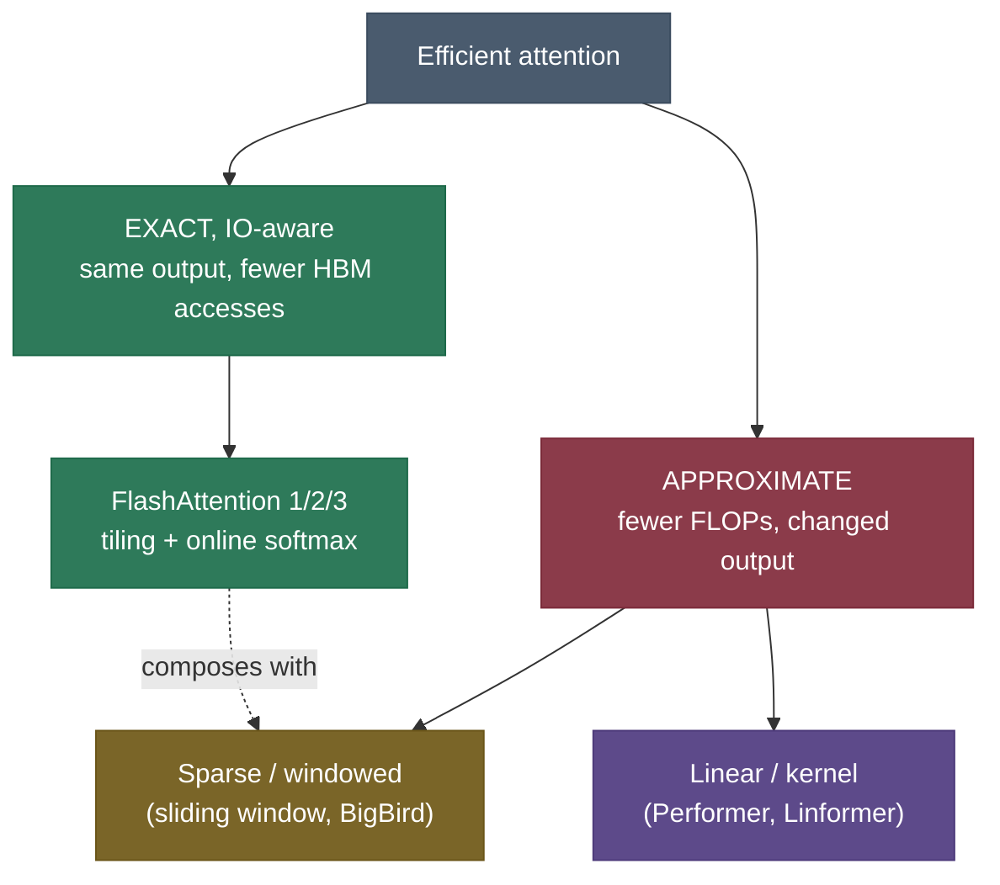

# FlashAttention: the bottleneck was never the math

Here is a fact that surprises almost everyone the first time they hear it: when you train a transformer on long sequences, the attention layer spends most of its time **waiting for memory**, not doing arithmetic. The matrix multiplies are fast. What's slow is shuttling a giant intermediate — the $N \times N$ matrix of attention scores — out to the GPU's main memory and back. The GPU's compute units sit mostly idle, drumming their fingers, waiting on the memory bus.

**FlashAttention** is the realization that you never need to write that matrix down at all. It computes *bit-for-bit the same attention output* — it is **exact**, not an approximation — by **tiling** the computation into blocks small enough to live in the GPU's fast on-chip memory, and keeping a **running softmax** so the blocks combine correctly. The matrix never touches slow memory. That one change made long-context training and inference practical, and the technique is now baked into PyTorch, every serious LLM library, and essentially every model you've used.

I'm going to walk this the way I'd explain it to a teammate who just hit an out-of-memory error trying to train at 8K context. We'll start by *feeling* the memory wall (real numbers — it's worse than you think), then build the intuition for why tiling escapes it, then derive the **online-softmax** math that is the actual heart of the trick, then build it from scratch and **prove** it matches standard attention, then the pitfalls, then where it lives in production. By the end you'll be able to:

- explain why attention is **memory-bandwidth-bound**, not compute-bound, with the arithmetic to back it up;
- describe **tiling** and why keeping blocks in **SRAM** instead of **HBM** is the whole game;
- **derive** the online-softmax running-max / running-sum update and the rescale factor, and explain why blockwise partial softmaxes combine to the *exact* full softmax;
- explain the **IO-complexity** argument — fewer HBM accesses → big wall-clock speedup though the FLOPs are unchanged;
- explain the **backward-pass recomputation** trade-off;
- place FlashAttention-1/2/3, sliding-window, and sparse/linear attention in the efficient-attention landscape;
- prove in runnable code that blockwise attention is **exact**.

> **Note:** FlashAttention is an **exact** algorithm and a **systems** optimization. It changes *nothing* about the output — the model produces the identical numbers with or without it (we prove this in code below). It only changes how much memory the computation needs and how fast it runs. This is its key difference from sparse/linear attention, which approximate the output to go faster.

This is the **training/prefill-side companion** to the [KV Cache](../05-KV-Cache/05-KV-Cache.md) chapter. The KV cache makes *decode* memory-efficient (don't recompute the past); FlashAttention makes the *attention kernel itself* memory-efficient (don't materialize the score matrix). Same enemy — HBM traffic — attacked from two directions.

---

## The problem: attention drowns in its own scratch matrix

To feel why FlashAttention exists, you have to feel the memory wall it removes.

Standard scaled-dot-product [attention](../../05.%20Deep_Learning/concepts/15-Attention-Mechanism.md) over a sequence of $N$ tokens does three steps:

1. **Scores.** $S = QK^\top / \sqrt{d}$ — every query dotted with every key, giving an $N \times N$ matrix.
2. **Softmax.** Normalize each row of $S$ over the key axis to get attention weights $P$ — still $N \times N$.
3. **Output.** $O = PV$ — each output is a weighted sum of value vectors.

The trouble is step 1's output. That $N \times N$ matrix has to be **written to GPU main memory (HBM)** so step 2 can read it back, softmax it, write it again, and step 3 can read it once more. The matrix is **quadratic in sequence length**, and it is read and written several times.

How bad is that, in real numbers? Take $N = 8192$ — a routine training context. One score matrix in fp16 is:

$$8192 \times 8192 \times 2\ \text{bytes} = 134{,}217{,}728\ \text{bytes} = \mathbf{0.125\ GiB}.$$

That sounds harmless — until you remember you need **one such matrix per attention head, per sequence in the batch**, all live at once (the backward pass needs them). A modest batch of 16 with 32 heads:

$$0.125\ \text{GiB} \times 16 \times 32 = \mathbf{64\ GiB}.$$

That single intermediate — just the attention scores, for one layer — **overflows an 80 GB A100** before you've stored a single weight or activation. Push to $N=16{,}384$ and one fp16 matrix is already 0.5 GiB; the quadratic term explodes.

> **Source / derivation:** the $N\times N$ score-matrix size and the memory-bound diagnosis are from [Tri Dao, Daniel Y. Fu, Stefano Ermon, Atri Rudra, Christopher Ré, *FlashAttention: Fast and Memory-Efficient Exact Attention with IO-Awareness* (2022)](https://arxiv.org/abs/2205.14135) — §2–§3 quantify the $O(N^2)$ HBM memory and traffic of standard attention. The byte counts above recompute directly from the demo's `flash_attention.py` output (one fp16 8192² matrix = 0.125 GiB; ×16×32 = 64 GiB).

And here's the kicker that makes this an *IO* problem, not a *compute* problem: the actual math — the matmuls — is fast. The GPU finishes the arithmetic and then **stalls, waiting for the memory bus** to ferry that giant matrix around. The FLOPs aren't the bottleneck. The bytes are.

> **Gotcha:** people sometimes say "attention is $O(N^2)$, so it's expensive to *compute*." Be precise: the FLOPs are $O(N^2 d)$, yes, but on modern GPUs those FLOPs are cheap relative to the **memory traffic** of moving the $O(N^2)$ score matrix through HBM. FlashAttention does the **same** $O(N^2 d)$ FLOPs — it just stops paying the memory bill. The speedup comes entirely from IO, not from doing less math.

---

## Intuition: cook from the pantry, not the warehouse

Picture two tiers of storage in a GPU, exactly like a kitchen:

- **HBM** (high-bandwidth memory) — the big warehouse. ~40–80 GB, but "far away": ~2 TB/s, and every trip costs you.
- **SRAM** (on-chip shared memory) — the countertop next to the stove. Tiny (~20 MB across the chip, ~100s of KB per compute unit), but **~10–20× faster** to read and write.

Standard attention cooks like a disorganized chef: it hauls *all* the ingredients (the full $Q$, $K$, $V$), produces the entire $N\times N$ dish of scores, **walks it back to the warehouse**, walks it out again to season it (softmax), walks it back, walks it out a third time to plate it (multiply by $V$). The food is fine — but the chef spends the day walking to the warehouse.

FlashAttention cooks **block by block on the countertop**. It carries one small tile of keys and values into SRAM, computes that tile's contribution to every query's output right there, keeps a few running numbers on a sticky note, then swaps in the next tile. **The full $N\times N$ dish is never assembled in one place** — and crucially, it never gets walked back to the warehouse. The countertop is small, so you can only hold a tile at a time; the cleverness is in the *sticky note* that lets you combine tiles correctly without ever seeing them all at once.

That sticky note is a running softmax, and making it correct is the whole technical problem. Here's the follow-up question that tests whether the analogy holds: *softmax needs to divide by the sum over **all** scores — how can you possibly normalize a tile before you've seen the later tiles?* The answer is the online-softmax trick: you keep a **running maximum** and a **running sum**, and when a later tile reveals a bigger number, you **retroactively rescale** everything you've accumulated so far by a single correction factor. The sticky note holds exactly two numbers per query — the running max $m$ and the running normalizer $\ell$ — plus the running output. That is enough to reconstruct the exact softmax. Let's see why.

---

## Mechanism: tile the matrix, stream the softmax, fuse into one kernel

Here is the dataflow. Standard attention round-trips the score matrix through HBM three times; FlashAttention loads tiles into SRAM, does *all* the work there, and writes back only the final output.



*The full $N\times N$ score matrix is never written to HBM. Tiles stream into SRAM; the running $(m, \ell, \text{acc})$ statistics are all that crosses between tiles; only the final output $O$ goes back to HBM. One fused kernel, one pass.*

Three ideas combine:

1. **Tiling.** Split $Q$, $K$, $V$ along the sequence axis into blocks that fit in SRAM. Process attention one $(Q\text{-tile}, K/V\text{-tile})$ pair at a time. The working set is one tile, not the whole matrix — **$O(\text{block size})$ memory, independent of $N$.**
2. **Online softmax.** Because softmax normalizes over *all* keys but we only see a tile at a time, we carry running statistics and rescale as we go (derived next). This is what makes tiling *correct*.
3. **Kernel fusion.** Scores → softmax → value-multiply are fused into **one** GPU kernel. There's no intermediate written to HBM between the steps; it all happens in registers/SRAM. Fusion is why the HBM traffic actually drops — without it, tiling alone would still spill intermediates.

> **Note:** "exact" deserves emphasis. The output is the same as standard attention to floating-point rounding — the *only* difference is the order in which sums are accumulated. We do not drop any score, approximate any softmax, or sparsify any connection. Contrast sparse/linear attention (later), which change the math to go faster and accept an approximation.

---

## The math: deriving the online softmax

This is the heart of FlashAttention, and it's worth deriving slowly because every term maps to a line in the code. The goal: compute $\text{softmax}(x)$ for a vector $x \in \mathbb{R}^N$ **in a single streaming pass**, holding only a constant amount of state, so we never need all of $x$ at once.

**Symbols.** $x \in \mathbb{R}^N$ is one row of scores (one query against all keys), with entries $x_1,\dots,x_N$. We process it in blocks. After seeing the first $j$ entries we maintain two running scalars: $m_j = \max(x_1,\dots,x_j)$ (the running max) and $\ell_j = \sum_{i=1}^{j} e^{x_i - m_j}$ (the running sum of exponentials, *taken against the current max*).

**Why subtract the max at all?** Numerical stability. $e^{x}$ overflows fp32 around $x \approx 88$; raw attention scores routinely exceed that. The standard fix is the identity

$$\text{softmax}(x)_i = \frac{e^{x_i}}{\sum_k e^{x_k}} = \frac{e^{x_i - m}}{\sum_k e^{x_k - m}}, \qquad m = \max_k x_k,$$

which is exact for *any* constant $m$ (the $e^{-m}$ cancels top and bottom) and, with $m = \max x$, keeps every exponent $\le 0$ so nothing overflows. The catch: it seems to need $m = \max x$ **up front**, before you can exponentiate anything — which means seeing all of $x$ first. Online softmax removes that requirement.

> **Source / derivation:** the max-subtraction stability identity is standard; its single-pass streaming form — the running-max / running-sum update below — is [Maxim Milakov & Natalia Gimelshein, *Online normalizer calculation for softmax* (2018)](https://arxiv.org/abs/1805.02867), which proves a one-pass softmax that never materializes the full exponential vector.

**The update.** Suppose we've processed a block and hold $(m_\text{old}, \ell_\text{old})$. A new block arrives with local max $b = \max(\text{new block})$. The new global max is

$$m_\text{new} = \max(m_\text{old},\, b).$$

Now the problem: $\ell_\text{old}$ was computed as $\sum e^{x_i - m_\text{old}}$ — every term was exponentiated against the *old* max. If $m_\text{new} > m_\text{old}$, those terms are now "too big." We fix each one by multiplying by $e^{m_\text{old} - m_\text{new}}$:

$$e^{x_i - m_\text{old}} \cdot e^{m_\text{old} - m_\text{new}} = e^{x_i - m_\text{new}}. $$

That's the key algebraic move — the correction factor $e^{m_\text{old} - m_\text{new}} \le 1$ **re-bases every previously accumulated term against the new max**, in a single multiply, without revisiting the individual terms. So the running sum updates as:

$$\boxed{\;\ell_\text{new} = \underbrace{\ell_\text{old} \cdot e^{m_\text{old} - m_\text{new}}}_{\text{rescale old terms}} \;+\; \underbrace{\sum_{i \in \text{new block}} e^{x_i - m_\text{new}}}_{\text{this block's contribution}}\;}$$

After the last block, $m_\text{final}$ is the true global max and $\ell_\text{final} = \sum_i e^{x_i - m_\text{final}}$ is the true denominator — **identical** to what one-shot softmax computes. Intuitively: we kept a running normalizer and corrected it every time a bigger number showed up.

> **Source / derivation:** combining these per-block partial softmaxes into exact attention — and the recognition that this *is* the trick that lets attention be tiled without materializing the matrix — is the contribution of [Dao et al., *FlashAttention* (2022)](https://arxiv.org/abs/2205.14135), building on the memory-efficient streaming-attention formulation of [Markus N. Rabe & Charles Staats, *Self-attention Does Not Need $O(n^2)$ Memory* (2021)](https://arxiv.org/abs/2112.05682).

**From softmax to attention output.** Attention doesn't want the softmax *weights*, it wants the weighted sum $O = \sum_i P_i V_i$ where $P_i = e^{x_i - m}/\ell$. We carry one more running quantity: an **un-normalized output accumulator**

$$\text{acc}_j = \sum_{i=1}^{j} e^{x_i - m_j}\, V_i.$$

When the max jumps from $m_\text{old}$ to $m_\text{new}$, we rescale `acc` by the **same** factor $e^{m_\text{old}-m_\text{new}}$ — in lockstep with $\ell$ — so it stays consistent with the new max:

$$\text{acc}_\text{new} = \text{acc}_\text{old} \cdot e^{m_\text{old}-m_\text{new}} \;+\; \sum_{i \in \text{new block}} e^{x_i - m_\text{new}}\, V_i.$$

After the last block, the exact attention output for this query is simply

$$O = \frac{\text{acc}_\text{final}}{\ell_\text{final}}.$$

That's the entire algorithm. Three running scalars/vectors per query — $m$ (scalar), $\ell$ (scalar), `acc` (a $d$-vector) — updated block by block, and one division at the end. Shapes, stated explicitly:

```
Q ∈ ℝ^{N×d}    # N queries, head dim d
K ∈ ℝ^{N×d}    # N keys
V ∈ ℝ^{N×d}    # N values
per query i:  mᵢ ∈ ℝ (scalar),  ℓᵢ ∈ ℝ (scalar),  accᵢ ∈ ℝ^d
output O ∈ ℝ^{N×d}
working set: one K/V tile ∈ ℝ^{B×d}  — O(B·d), independent of N
```

---

## Mechanics: forward, backward, and the IO-complexity payoff

**Forward pass.** Exactly the streaming algorithm above, tiled over both query blocks and key blocks and fused into one kernel. Working set: $O(B \cdot d)$ for a block of size $B$, independent of $N$. The full score matrix is never resident.

**Backward pass — the recomputation trade.** Backprop through attention needs the attention weights $P$ (the $N\times N$ matrix) to compute gradients. Storing $P$ from the forward pass would re-introduce the $O(N^2)$ memory we just eliminated. FlashAttention's answer: **don't store it — recompute it.** During backward, re-derive each score block on the fly from $Q$, $K$ (cheap, they're already in HBM) using the saved per-row statistics $(m, \ell)$, which are only $O(N)$ to store. This costs *extra FLOPs* (you compute the scores twice) but saves the $O(N^2)$ memory — and since attention is memory-bound, **trading cheap FLOPs for scarce memory is a win**. This is gradient checkpointing, applied surgically inside the attention kernel.

> **Source / derivation:** the backward-pass recomputation strategy — store only the $O(N)$ softmax statistics and recompute the $O(N^2)$ scores in backward — is §3.1 of [Dao et al., *FlashAttention* (2022)](https://arxiv.org/abs/2205.14135).

**The IO-complexity argument — why fewer HBM accesses win.** This is the paper's analytical core. Let $M$ be the SRAM size (in elements). Standard attention moves $\Theta(N d + N^2)$ elements through HBM (it writes and reads the $N^2$ matrix). FlashAttention, by tiling, moves $\Theta(N^2 d^2 / M)$ — and since $d^2 \ll M$ in practice (e.g. $d=64$, $d^2=4096$; $M$ is hundreds of thousands of elements), this is **much smaller**. Concretely the paper reports HBM accesses dropping by a factor proportional to $M/d$ — often **~9× fewer reads/writes**. Because the GPU is bandwidth-bound here, *fewer bytes moved ≈ proportionally faster*, even though the FLOP count is unchanged. That decoupling — same FLOPs, far fewer memory accesses, big speedup — is the whole thesis of "IO-awareness."

> **Source / derivation:** the IO-complexity bounds (standard attention $\Theta(Nd + N^2)$ HBM accesses vs FlashAttention $\Theta(N^2 d^2 M^{-1})$, with the $M/d$ reduction factor) are Theorem 1–2 and §3.2 of [Dao et al., *FlashAttention* (2022)](https://arxiv.org/abs/2205.14135). The underlying compute-vs-bandwidth framing is the roofline model of [Williams, Waterman & Patterson, *Roofline* (2009)](https://www2.eecs.berkeley.edu/Pubs/TechRpts/2008/EECS-2008-134.html).

> **Tip:** the cleanest one-line summary for an interview: *FlashAttention does the same FLOPs as standard attention but turns $O(N^2)$ HBM traffic into $O(N)$, and because attention is bandwidth-bound, that traffic reduction is the speedup.*

---

## Code: build the online softmax, then prove blockwise == full

Here's the algorithm from scratch in PyTorch, on tiny printable shapes ($N=8$, $d=4$, block size $2$). It builds the online softmax, builds blockwise attention on top of it, and **asserts the blockwise output equals textbook full-softmax attention to ~1e-6 before anything else** — correctness first, always. It runs on CPU/MPS/GPU in well under a second.

> **Runnable project and a step-by-step notebook:** the same verified code lives as a clean script and an executed teaching notebook next to this page — see the [step-by-step teaching notebook](code/06-Efficient-Attention-FlashAttention.ipynb) and the [runnable demo script](code/flash_attention.py) (run it with `python flash_attention.py`).

```python
"""From-scratch FlashAttention: prove blockwise (tiled) attention equals full attention.
Verified on Python 3.12 / torch 2.12.0."""
import torch
import torch.nn.functional as F

SEQ_LEN, HEAD_DIM, BLOCK_SIZE = 8, 4, 2
SCALE = HEAD_DIM ** -0.5          # 1/sqrt(d): standard attention scaling
ALLCLOSE_ATOL = 1e-6
torch.manual_seed(0)
q, k, v = torch.randn(SEQ_LEN, HEAD_DIM), torch.randn(SEQ_LEN, HEAD_DIM), torch.randn(SEQ_LEN, HEAD_DIM)

def full_attention(q, k, v):                  # the baseline that materializes the whole matrix
    scores = (q @ k.transpose(-1, -2)) * SCALE       # (N, N): every query vs every key
    return F.softmax(scores, dim=-1) @ v             # row softmax, then weighted sum of values

def flash_attention(q, k, v, block_size):     # never forms the full N×N matrix
    out = torch.zeros_like(q)
    for i in range(q.shape[0]):                       # one query at a time (kernels tile queries too)
        m = torch.tensor(float("-inf"))               # running max
        l = torch.tensor(0.0)                         # running denominator
        acc = torch.zeros(HEAD_DIM)                   # un-normalised running output
        for start in range(0, q.shape[0], block_size):
            k_blk, v_blk = k[start:start+block_size], v[start:start+block_size]
            s = (q[i] @ k_blk.transpose(-1, -2)) * SCALE      # this query vs the tile's keys
            m_new = torch.maximum(m, s.max())                  # new global max so far
            corr = torch.exp(m - m_new)                        # ≤1: rescale old (l, acc) to the new max
            p = torch.exp(s - m_new)                           # exps of this tile vs the new max
            l = l * corr + p.sum()                             # rescale denom, add this tile
            acc = acc * corr + p @ v_blk                       # rescale output, add weighted values
            m = m_new
        out[i] = acc / l                                       # final normalisation
    return out

out_full = full_attention(q, k, v)
out_flash = flash_attention(q, k, v, BLOCK_SIZE)
print("max abs diff:", (out_full - out_flash).abs().max().item())
assert torch.allclose(out_full, out_flash, atol=ALLCLOSE_ATOL)   # FlashAttention is EXACT
print("blockwise == full:", True)
```

Output:

```
max abs diff: 2.0861625671386719e-07
blockwise == full: True
```

The difference is **2.09e-07** — pure floating-point summation-order noise, far under the 1e-6 tolerance. Blockwise attention reproduces full attention exactly; the tiling and streaming changed *nothing* about the result, only the memory it needed.

The notebook also prints the running $(m, \ell)$ for query 0 climbing block by block — the bookkeeping made visible:

```
running (max m, denom l) per block for query 0 (block_size=2):
  after block 0: m = +0.3350,  l = 1.4390
  after block 1: m = +0.3350,  l = 2.1709
  after block 2: m = +0.3730,  l = 3.6028
  after block 3: m = +1.4647,  l = 2.2857
```

> **Note:** read that trace carefully — it *shows* the rescale at work. $m$ is non-decreasing (it only rises). But $\ell$ **drops** from 3.6028 to 2.2857 between blocks 2 and 3. That is not a bug: block 3 brings a much larger score, so $m$ jumps from $0.3730$ to $1.4647$, and the correction factor $e^{0.3730 - 1.4647} = e^{-1.0917} \approx 0.336$ shrinks the previously accumulated $\ell$ to re-base it against the new, larger max before block 3's own (now relatively small) exponentials are added. The denominator gets *smaller in absolute terms* because everything is now measured relative to a bigger maximum — exactly the algebra from the derivation, made numeric.

> **Try it:** before running, **predict**: if you change `BLOCK_SIZE` from 2 to 4 (or even to 8, one giant block = plain attention), does the final `max abs diff` get bigger, smaller, or stay ~the same? (Hint: the algorithm is *exact* for any block size — the only thing that changes is the summation order, so the diff stays at float-noise level, ~1e-7, regardless. Block size is a performance knob, never a correctness one.)

---

## Pitfalls and failure modes

The things that actually bite people using or implementing this:

- **Forgetting to rescale `acc` along with `ℓ`.** The single most common bug when implementing online attention from scratch: you remember to correct the denominator $\ell$ when the max jumps, but forget to apply the *same* correction to the output accumulator `acc`. The result is silently wrong — outputs that look plausible but don't match standard attention. The fix is the discipline in the code: `acc = acc * corr + p @ v_blk` and `l = l * corr + p.sum()` use the **same** `corr`, every block.
- **fp16 overflow without the max subtraction.** If you skip $m$ and exponentiate raw scores, $e^x$ overflows fp16 (~65504, exponent overflow near $x\approx 11$) and fp32 near $x\approx 88$. Attention scores before scaling routinely exceed this. The running-max subtraction isn't decoration — it's what keeps every exponent $\le 0$ and the kernel numerically alive. (FlashAttention deliberately keeps the softmax statistics and rescaling in fp32 even when $Q,K,V$ are fp16.)
- **The causal-mask off-by-one in tiled attention.** With a causal mask, a query at position $i$ may attend only to keys $j \le i$. In a tiled kernel you must mask **per tile**: a block of keys entirely in the future of a query block is skipped; a block straddling the diagonal needs a partial triangular mask. Get the boundary wrong and you either leak future tokens (silent training corruption) or drop a legitimate key. This is fiddly enough that you should lean on the library kernel rather than hand-roll it.
- **Assuming the speedup shows up on CPU.** The win is **HBM traffic** on a GPU with a real fast/slow memory split. On CPU there is no SRAM/HBM hierarchy to exploit, so a from-scratch Python implementation like ours is *slower* than batched matmul — it exists to prove **correctness**, not speed. Don't benchmark FlashAttention on CPU and conclude it's pointless. (This is exactly why the demo proves the match and counts bytes rather than timing a fake speedup.)
- **Expecting it on tiny sequences.** The fusion and tiling overhead only pays off once the score matrix is large enough to dominate HBM traffic. At very short $N$, standard attention can be as fast or faster; the libraries dispatch to the right kernel automatically.

---

## Where it matters: long context is impossible without it

The crux: **FlashAttention is the reason modern long-context training and inference exist.** Before it, the $O(N^2)$ memory of the score matrix was a hard wall — you simply could not fit attention at 8K, 32K, or 128K tokens on available hardware. By dropping the memory to $O(N)$, FlashAttention turned "out of memory" into "runs fine," and turned the wall-clock cost of long context from prohibitive into merely expensive.

Concretely, this is the lever that:

- **Made 32K–128K-token context windows trainable.** Every long-context model you've heard of (GPT-4-class, Claude, Llama-3, Mistral) relies on FlashAttention or a descendant for the attention kernel during training. Without it, the score matrix alone would OOM.
- **Speeds up *prefill* at inference.** Recall from the [KV Cache](../05-KV-Cache/05-KV-Cache.md) chapter that prefill (digesting the prompt) is the **compute-bound, parallel** phase that processes all prompt tokens at once — exactly where a full $N\times N$ matrix would otherwise be materialized. FlashAttention makes prefill faster and lower-memory. (Its decode-time cousin, **FlashDecoding**, parallelizes a single decode query across KV-cache chunks — covered in the KV-cache chapter.)
- **Shipped into the defaults.** It's `torch.nn.functional.scaled_dot_product_attention` (PyTorch's `sdpa`, which dispatches to a FlashAttention backend), `flash-attn` the library, and the `attn_implementation="flash_attention_2"` flag in Hugging Face. You're almost certainly using it already.

**When you don't need it:** very short sequences (the matrix is small, overhead dominates), or when you genuinely need *approximate* attention for asymptotically sub-quadratic scaling at extreme length — that's the sparse/linear family below, a *different* trade-off (FlashAttention keeps exactness; those give it up).

---

## The landscape: FlashAttention 1/2/3, windows, and the approximate family

FlashAttention is one point in a broad space of efficient-attention work. The map:

**The FlashAttention line (exact, IO-aware) — same output, faster kernels:**

| Version | Year | Key improvement |
|---|---|---|
| **FlashAttention-1** | 2022 | The original: tiling + online softmax + recomputation. ~2–4× faster, ~10–20× less memory than standard attention. |
| **FlashAttention-2** | 2023 | Better work partitioning across GPU threads/warps, fewer non-matmul FLOPs, parallelize over the sequence-length dimension. ~2× faster than v1, reaching ~50–73% of GPU peak. |
| **FlashAttention-3** | 2024 | Exploits Hopper (H100) features — asynchrony (warp specialization, TMA) and FP8 — overlapping matmul with softmax. ~1.5–2× over v2, up to ~75% of H100 peak in FP16 and ~1.2 PFLOPs in FP8. |

> **Source / derivation:** FlashAttention-2's algorithmic refinements (work partitioning, reduced non-matmul FLOPs) are [Tri Dao, *FlashAttention-2: Faster Attention with Better Parallelism and Work Partitioning* (2023)](https://arxiv.org/abs/2307.08691). FlashAttention-3's Hopper-specific asynchrony and FP8 are [Shah et al., *FlashAttention-3* (2024)](https://arxiv.org/abs/2407.08608).

**Sparsity — bound *which* keys each query sees (changes the output):**

- **Sliding-window attention** (Mistral) — each token attends only to the last $w$ tokens, so attention cost is $O(N \cdot w)$ instead of $O(N^2)$. Stacking $L$ layers gives an effective receptive field of $\approx L \times w$ (the same window-up-the-stack argument as the [KV Cache](../05-KV-Cache/05-KV-Cache.md) sliding-window lever). FlashAttention and a window **compose** — you can run an IO-aware kernel *over* a windowed pattern.
- **Block-sparse / strided patterns** (Longformer, BigBird, Sparse Transformer) — hand-designed sparsity that keeps a global + local mix of connections.

**Linear/kernelized attention — change the math to drop the quadratic entirely (approximate):**

- **Linformer, Performer, Linear Attention** — approximate the softmax with a low-rank or kernel feature map, achieving $O(N)$ complexity but **giving up exactness**, and historically with a quality cost on language modeling.

> **Note:** the crucial distinction for an interview. FlashAttention is **exact and IO-aware** — it reorganizes the *same* computation to move fewer bytes. Sparse/linear attention is **approximate and FLOP-reducing** — it does *less* computation by attending to fewer things or approximating the softmax. They're orthogonal and composable: you can run FlashAttention's kernel over a sparse pattern. In practice, exact FlashAttention won the mainstream because IO-awareness gave most of the speedup *without* the quality risk of approximation.



*The efficient-attention landscape splits on one question: do you keep the exact output (FlashAttention — reorganize the computation to move fewer bytes) or accept an approximation (sparse/linear — do less computation)? FlashAttention's exact kernel composes with sparse patterns.*

---

## In production: real numbers

What FlashAttention actually buys, with verified figures:

- **Memory: $O(N^2) \to O(N)$.** The headline. The reported memory reduction is **10–20×** for the attention computation, which is what turned long-context training from impossible into routine. ([Dao et al. 2022](https://arxiv.org/abs/2205.14135).)
- **Speed (v1):** ~**2–4×** faster end-to-end attention, ~**15%** faster BERT-large training, ~**3×** faster GPT-2 training versus the standard implementation. ([Dao et al. 2022](https://arxiv.org/abs/2205.14135).)
- **Speed (v2):** ~**2×** over v1, reaching **50–73%** of theoretical max FLOPs/s on A100. ([Dao 2023](https://arxiv.org/abs/2307.08691).)
- **Speed (v3):** ~**1.5–2×** over v2 on H100, hitting **~75%** of peak in FP16 and **~1.2 PFLOPs/s** in FP8. ([Shah et al. 2024](https://arxiv.org/abs/2407.08608).)
- **Adoption:** the default attention path in PyTorch (`scaled_dot_product_attention`), Hugging Face Transformers (`flash_attention_2`), vLLM, and essentially every production training and inference stack. It is no longer an optimization you opt into — it's the baseline.

> **Note:** the through-line tying this chapter to [KV Cache](../05-KV-Cache/05-KV-Cache.md): a long-context stack needs **both** kernels. FlashAttention makes the compute-bound *prefill* (and training) IO-efficient; the KV cache (+ GQA/MLA/quantization/paging) makes the memory-bound *decode* efficient. "GQA + paging + FP8 + FlashAttention" is the recurring four-part recipe behind every "128K context, served efficiently" claim.

---

## Recap and rapid-fire

**If you remember nothing else:** standard attention is **memory-bound**, not compute-bound — it drowns in HBM traffic moving the $O(N^2)$ score matrix around. FlashAttention computes the **exact same** output without ever materializing that matrix: it **tiles** $Q,K,V$ into blocks that fit in fast **SRAM**, keeps a **running softmax** (running max $m$, running denominator $\ell$, running output `acc`, rescaled by $e^{m_\text{old}-m_\text{new}}$ when the max jumps), and **fuses** the whole thing into one kernel. Memory drops $O(N^2)\to O(N)$; the backward pass **recomputes** scores instead of storing them. Same FLOPs, far fewer bytes moved — and since attention is bandwidth-bound, that's the speedup.

**Quick-fire — say these out loud:**

- *Why is attention memory-bound?* The $O(N^2)$ score matrix dominates HBM traffic; the matmul FLOPs are cheap by comparison.
- *Is FlashAttention an approximation?* No — bit-for-bit exact (to float rounding). Only the summation order differs.
- *What are the three running statistics?* Running max $m$, running denominator $\ell$, running un-normalized output `acc`.
- *What's the rescale factor and why?* $e^{m_\text{old} - m_\text{new}} \le 1$ — it re-bases previously accumulated terms against the new max so blocks combine exactly.
- *Why subtract the max?* Numerical stability — keeps every exponent $\le 0$ so $e^x$ doesn't overflow.
- *What does the backward pass do differently?* Recomputes the score matrix on the fly (storing only the $O(N)$ statistics) instead of keeping the $O(N^2)$ matrix.
- *Where does the speedup come from if FLOPs are unchanged?* Fewer HBM accesses ($O(N^2)\to O(N)$ traffic), and attention is bandwidth-bound.
- *FlashAttention vs sparse/linear attention?* Exact + IO-aware (fewer bytes) vs approximate + FLOP-reducing (less math). Orthogonal; composable.
- *What did v2 and v3 improve?* v2: parallelism / work partitioning (~2× over v1). v3: Hopper asynchrony + FP8 (~1.5–2× over v2).

---

## References and further reading

The curated link library for this topic — videos, courses, articles, papers, and internal cross-links — lives in a companion file so it can be reused as a standalone reference list:

**→ [Efficient Attention (FlashAttention) — references and further reading](06-Efficient-Attention-FlashAttention.references.md)**
