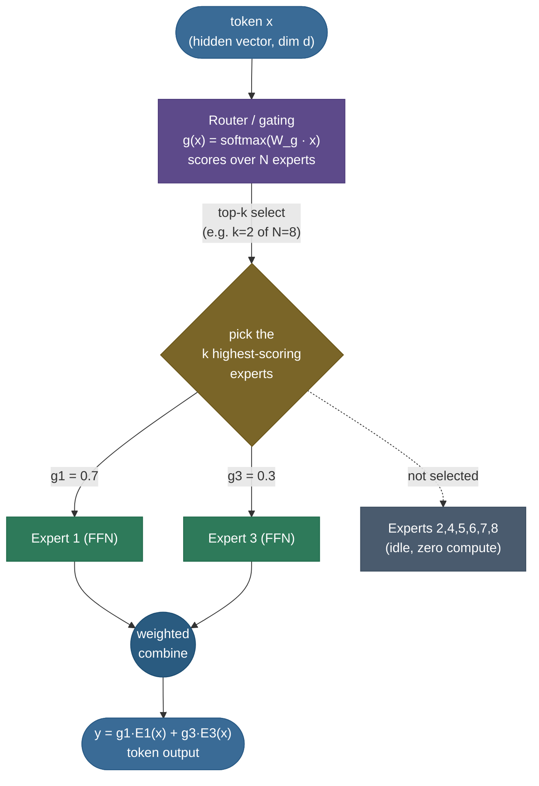
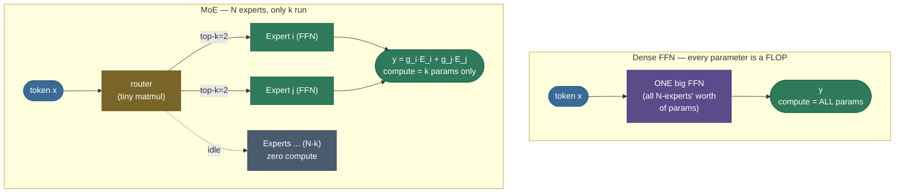
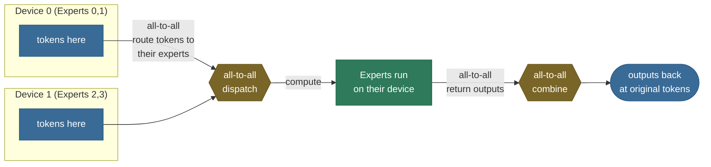

# Mixture-of-Experts: more parameters, not more compute

Imagine a hospital with one brilliant generalist doctor who personally sees *every* patient — the broken arm, the rare autoimmune disease, the routine checkup, the cardiac emergency — and has to keep the entire span of medicine fresh in their head for all of them. That is a **dense** neural network: every parameter fires for every input, whether the input needs it or not. Now imagine instead a hospital with a **front desk** and a hundred **specialists**. The front desk takes thirty seconds to glance at each patient and routes them to the two specialists who can actually help; the other ninety-eight specialists stay in their offices. The hospital's *total knowledge* is enormous — a hundred experts' worth — but the *work done per patient* is tiny: a quick triage plus two consultations. That hospital is a **Mixture-of-Experts (MoE)** model, and that single reframing — *grow the knowledge, not the work per input* — is the most important idea in how frontier LLMs got cheap enough to scale.

I'm going to build this the way I'd actually walk a teammate through it on a whiteboard. We'll start with the **problem** that forces MoE to exist (the dense model wastes compute), then derive the **MoE layer** itself — the router and the experts — and prove from the arithmetic *why* it decouples parameter count from per-token compute. Then we'll hit the thing that makes or breaks every real MoE: **load balancing**, the rich-get-richer collapse and the auxiliary loss that prevents it. We'll cover **capacity and token dropping**, the **routing variants** that the field actually ships (Switch's top-1, Mixtral's top-2, DeepSeek's fine-grained + shared experts), the **training instabilities** and their fixes, and the deployment reality that MoE is *cheap in FLOPs but expensive in memory and communication*. Four worked examples — a token routed by hand, an active-vs-total parameter count, a balance loss computed on a tiny batch, and a real measured MoE layer in PyTorch — keep every claim grounded. By the end you'll be able to:

- explain **what** an MoE layer is (experts + router) and **why** it replaces the FFN, not attention;
- **derive** the gating function, top-k selection, and the weighted-combine output;
- prove from FLOP arithmetic *why* MoE **decouples capacity from compute**, and compute the active-vs-total split for an 8×7B-style model;
- explain the **load-balancing problem** and **derive** the auxiliary loss that fixes it — and the **z-loss** that stabilizes training;
- reason about **expert capacity**, **token dropping**, and the **capacity factor**;
- compare **Switch / GShard / Mixtral / DeepSeek-MoE** and say *why* each routing choice;
- explain the **memory-vs-compute** and **communication** trade-offs that decide whether MoE is worth it.

> **Note:** the single sentence to memorize: **MoE decouples a model's *capacity* (how many parameters it has) from its *compute* (how many parameters run per token).** A dense model couples them — every parameter is also a FLOP. MoE breaks that link by only running a few experts per token. Everything else on this page is a consequence of that one decoupling.

---

## The problem: dense models pay for every parameter on every token

To feel why MoE exists, you have to feel the waste it removes — exactly as with the KV cache.

A standard transformer block has two halves: **attention** (tokens exchange information) and a **feed-forward network (FFN)** (each token is transformed independently). As the [Transformer Architecture](../../05.%20Deep_Learning/16-Transformer-Architecture/16-Transformer-Architecture.md) page derives, the FFN — the $d \to 4d \to d$ expansion — holds roughly **two-thirds of every block's parameters**. It is where the model does most of its per-token "thinking," and it is the heaviest part of the compute. In a **dense** model, *that entire FFN runs for every single token.* Every token — the word "the", a closing bracket, a rare technical term — pushes through all $\sim\!\tfrac{2}{3}$ of the block's weights.

That is the waste. Most tokens are easy and don't need the model's full representational firepower; but a dense model has no way to spend *less* compute on an easy token and *more* on a hard one. Compute is flat, regardless of difficulty, because **parameters and FLOPs are the same thing in a dense model**: to use a parameter is to multiply by it.

Now recall what the [scaling laws](../03-Scaling-Laws/03-Scaling-Laws.md) tell us: model quality improves predictably as you add **parameters** (and data and compute). So you want *more parameters*. But in a dense model, more parameters means proportionally more FLOPs **per token**, which means proportionally more cost to train *and* to serve — for **every** token, forever. Training a dense 1-trillion-parameter model means running a trillion parameters for every one of trillions of training tokens. The compute bill is astronomical, and most of it is spent running parameters that a given token didn't need.

Here is the crucial observation that makes MoE possible:

> **Note:** in the FFN, *which* weights a token actually needs depends on *what the token is*. A token about chemistry doesn't need the weights that learned about Python syntax. A dense model is forced to run all of them because it has no routing mechanism. If we could **route** each token to only the slice of parameters it needs, we could grow total parameters (capacity) **without** growing per-token FLOPs (compute). That is precisely the decoupling MoE delivers.

So the question MoE answers is: **how do we scale a model's capacity — its parameter count, the thing scaling laws reward — without scaling the compute we pay per token?** The dense answer is "you can't, they're the same number." The MoE answer is "make the FFN sparse: many experts, but only a few run per token."

---

## What it is: replace the FFN with many experts and a router

An **MoE layer** replaces the single dense FFN in a transformer block with:

- **$N$ expert FFNs** — $E_1, E_2, \dots, E_N$, each an ordinary FFN (the same $d \to d_{ff} \to d$ shape the dense block had). These are the "specialists." $N$ is typically 8, 16, 64, 128, or more.
- **A router (gating network)** — a tiny learned function (usually a single linear layer) that looks at each token and decides **which $k$ experts** should process it, and with **what weights**. $k$ is small: 1 or 2 in most models.

Each token flows through the router, gets assigned to its **top-$k$** experts, is processed by **only those $k$**, and the $k$ outputs are combined (weighted by the router's confidence) into the token's output. The other $N-k$ experts do nothing for that token.



*One MoE layer: the router scores all $N$ experts, top-$k$ selects a few (here experts 1 and 3), only those run, and their outputs are combined by the gate weights. The gate values (0.7 / 0.3) and chosen indices are **schematic — illustrative numbers**; the fully-worked single-token example below computes the real softmax and gives 0.731 / 0.269 to experts 1 and 2.*

That's the whole architecture. The diagram above is *one MoE layer* — and in a real model, **only some** of the transformer blocks use MoE (often every other block, or every block); the rest stay dense. The attention sublayers are **unchanged** — MoE replaces the FFN, never attention.

> **Gotcha:** a common misconception is that MoE routes *whole sequences* or *whole prompts* to experts ("a coding expert, a math expert"). It does **not**. Routing is **per-token, per-layer** — the same sentence has its tokens scattered across many experts, and a single token can hit different experts in different layers. The learned specializations are subtle and rarely human-interpretable (they tend to cluster on syntactic or positional features, not clean topics). Don't promise an interviewer "expert 5 is the Python expert" — that's almost never how it works.

> **Note:** "expert" is a grand word for what is just **a feed-forward network**. There's nothing special inside an expert — it's the same MLP a dense block uses. The intelligence is in the **router** deciding who runs, and in the **training** that makes the experts differentiate. An MoE layer is "a pile of ordinary FFNs plus a chooser."

---

## Intuition: a panel of consultants with a triage desk

Hold three pictures and the rest follows.

**The triage desk (the router).** Every token arrives at a front desk. The desk takes a quick look — one cheap matrix multiply — and produces a score for each of the $N$ specialists: "for this token, specialist 3 looks most relevant, then specialist 7." It sends the token to the top few and writes down how much to trust each one.

**The specialists (the experts).** Each is a full FFN that, over training, drifts toward handling a particular *kind* of token well. Because each expert only ever sees the tokens routed to it, it specializes on that slice — and because it's not diluted by having to handle *everything*, it can be sharper on its slice than a single dense FFN that has to be a jack-of-all-trades.

**The combine (the weighted sum).** The token's final answer is a weighted blend of its chosen specialists' outputs — weighted by the router's confidence. If the desk was 70% sure about specialist 3 and 30% about specialist 7, the answer is $0.7 \cdot E_3(x) + 0.3 \cdot E_7(x)$.

The magic number is the **ratio of total specialists to consulted specialists**. A hospital with 100 specialists that consults 2 per patient has $50\times$ the *knowledge* of a 2-specialist clinic but does the *same work per patient*. That ratio — $N/k$ — is exactly the **sparsity factor** that lets MoE models carry tens of times more parameters than they spend per token.

> **Tip:** the dense transformer is *already* "a differentiable router" in disguise — that's the second framing on the [Transformer Architecture](../../05.%20Deep_Learning/16-Transformer-Architecture/16-Transformer-Architecture.md) page, where **attention** dynamically routes *information between positions*. MoE adds a *second* kind of routing: not "which tokens talk to which" but "**which parameters each token uses**." Once you see both, MoE stops feeling exotic — it's the same routing instinct applied to the FFN.

---

## The math, derived: gating, top-k, and the weighted combine

Let's derive the MoE layer's forward pass, defining every symbol. Take a single token whose hidden representation entering the MoE layer is $x \in \mathbb{R}^{d}$ (here $d$ is the model dimension, e.g. 4096).

**Step 1 — the router produces a score per expert.** A learned matrix $W_g \in \mathbb{R}^{N \times d}$ (the **gating weights**) maps the token to one logit per expert, and a softmax turns those into a distribution:

$$
h \;=\; W_g\, x \;\in\; \mathbb{R}^{N}, \qquad\qquad g(x) \;=\; \operatorname{softmax}(h) \;\in\; \mathbb{R}^{N}, \qquad g_i(x) = \frac{e^{h_i}}{\sum_{j=1}^{N} e^{h_j}}.
$$

> **Source / derivation:** [Shazeer et al., *Outrageously Large Neural Networks: The Sparsely-Gated MoE Layer* (2017)](https://arxiv.org/abs/1701.06538) §2.1 — defines the softmax gating $g(x)=\operatorname{softmax}(x \cdot W_g)$ over experts that all modern MoE routers (Switch, Mixtral, DeepSeek) inherit.

$g_i(x)$ is the router's probability that expert $i$ is the right one for this token; $\sum_i g_i(x) = 1$. This is the entire router — **one tiny matmul plus a softmax**, costing $O(N d)$, utterly negligible next to the experts. (Many implementations apply the softmax *after* selecting top-k; we'll note that variant below.)

**Step 2 — select the top-$k$ experts.** Let $\mathcal{T}(x) \subset \{1,\dots,N\}$ be the indices of the **$k$ largest** entries of $g(x)$:

$$
\mathcal{T}(x) \;=\; \operatorname*{arg\,top\text{-}k}_{\,i} \; g_i(x).
$$

> **Source / derivation:** [Shazeer et al., *Sparsely-Gated MoE Layer* (2017)](https://arxiv.org/abs/1701.06538) §3.1 (noisy top-$k$ gating) — keeping only the $k$ largest gates and zeroing the rest is what makes the layer *sparse*; [Fedus et al., *Switch Transformers* (2021)](https://arxiv.org/abs/2101.03961) §2.1 specialises it to $k=1$.

For $k=2, N=8$, $\mathcal{T}$ holds the two best experts. The other $N-k$ experts are **not evaluated at all** — this is where the sparsity, and all the FLOP savings, come from.

**Step 3 — combine the chosen experts' outputs, weighted by the gates.** Each selected expert $E_i$ is an ordinary FFN, $E_i : \mathbb{R}^d \to \mathbb{R}^d$. The layer output is the gate-weighted sum over the selected experts:

$$
\boxed{\;y \;=\; \sum_{i \in \mathcal{T}(x)} \tilde{g}_i(x)\, E_i(x)\;}
$$

> **Source / derivation:** [Shazeer et al., *Sparsely-Gated MoE Layer* (2017)](https://arxiv.org/abs/1701.06538) eq. (1), $y=\sum_i G(x)_i\, E_i(x)$ — the gate-weighted sum of expert outputs; the renormalise-over-selected convention is [Fedus et al., *Switch Transformers* (2021)](https://arxiv.org/abs/2101.03961) and [Jiang et al., *Mixtral of Experts* (2024)](https://arxiv.org/abs/2401.04088) §2.

where $\tilde{g}_i$ are the gate weights for the selected experts. Two conventions exist for $\tilde{g}$:

- **Renormalized** (Switch, Mixtral): rescale the selected gates so they sum to 1, $\tilde{g}_i = g_i / \sum_{j\in\mathcal{T}} g_j$. The output is a true convex combination of the chosen experts.
- **Raw** (some GShard variants): use $g_i$ directly, so the combine weights sum to $\le 1$. The router's absolute confidence then scales the layer's contribution.

> **Note:** notice the output $y$ is **differentiable in the gate weights** $\tilde{g}_i$ — they multiply the expert outputs, so gradients flow back into $W_g$, training the router to send tokens where they reduce loss. But the **top-k selection itself is not differentiable** (it's an argmax — a hard pick). This is the central technical wrinkle of MoE: *we train a discrete routing decision with gradients that only flow through the chosen experts.* It's why MoE training is finicky, and why the load-balancing tricks below exist. The router learns "send this token to expert 3" only indirectly, by learning "weight expert 3 highly," and then top-k turns that weight into the hard choice.

**The shapes, for a batch.** In practice we process $T$ tokens at once (batch × sequence). Then $X \in \mathbb{R}^{T \times d}$, the router gives $G = \operatorname{softmax}(X W_g^\top) \in \mathbb{R}^{T \times N}$, top-k gives a dispatch of each token to $k$ experts, and the output is $Y \in \mathbb{R}^{T \times d}$. Engineering-wise this becomes a **gather/scatter**: group tokens by their assigned expert, run each expert on its group as a dense matmul, scatter the results back. The capacity machinery below exists to make those per-expert groups a **fixed, hardware-friendly size**.

**Worked example — route one token by hand.** Take $N=4$ experts, $k=2$, and suppose for some token the router logits come out $h = (2.0,\ 1.0,\ 0.5,\ -1.0)$. Softmax them:

$$
e^{h} = (7.389,\ 2.718,\ 1.649,\ 0.368), \qquad \textstyle\sum = 12.124,
$$
$$
g = (0.609,\ 0.224,\ 0.136,\ 0.030).
$$

Top-2 picks experts **1 and 2** (gates 0.609 and 0.224). Renormalize over just those two: $\tilde{g}_1 = 0.609/(0.609+0.224) = 0.731$, $\tilde{g}_2 = 0.224/0.833 = 0.269$. The token's output is

$$
y = 0.731\cdot E_1(x) + 0.269\cdot E_2(x),
$$

and experts 3 and 4 are **never run** for this token. That's the whole forward pass for one token — a softmax, a top-2, a renormalize, two FFN evaluations, a weighted sum.

> **Tip:** the router operating on the **softmax probability** vs the raw logit matters for top-k *ordering* not at all (softmax is monotonic), but it matters a lot for the *combine weights* and for the **z-loss** (below), which penalizes large logits. Keep the distinction "logits $h$ → probabilities $g$" clear; interviewers probe it.

---

## Why it works: sparse activation decouples capacity from compute

This is the heart of MoE, and it's worth deriving from the FLOP count rather than asserting it. First, the picture — what a single token's FFN compute looks like in a dense block vs an MoE block with the **same total parameters**:



*Same total parameters, opposite compute. The dense block runs every parameter on every token; the MoE block holds $N$ experts but runs only $k$ — so its per-token FLOPs are set by $k$ while its capacity is set by $N$. The greyed experts are stored in memory but contribute zero compute for this token.*

The compute cost of an MoE layer for one token is **the cost of the router plus the cost of $k$ experts** — *not* $N$ experts:

$$
\text{FLOPs}_{\text{MoE/token}} \;=\; \underbrace{O(Nd)}_{\text{router}} \;+\; \underbrace{k \cdot \text{FLOPs}_{\text{expert}}}_{\text{only the chosen } k}.
$$

The router term is tiny ($Nd$ vs an expert's $\sim 2 \cdot d \cdot d_{ff}$ with $d_{ff} \approx 4d$, so the router is $\sim N/(8d)$ of one expert — utterly negligible for $d$ in the thousands). So to a very good approximation:

$$
\text{FLOPs}_{\text{MoE/token}} \;\approx\; k \cdot \text{FLOPs}_{\text{expert}}.
$$

The decisive fact: **this depends on $k$, not $N$.** Add more experts — grow $N$ from 8 to 64 to 256 — and the per-token FLOPs **do not change**, because you still only run $k$ of them. Meanwhile the **total parameter count** grows linearly in $N$:

$$
\text{Params}_{\text{MoE layer}} \;=\; \underbrace{N \cdot \text{Params}_{\text{expert}}}_{\text{grows with } N} \;+\; \underbrace{Nd}_{\text{router (tiny)}}, \qquad\qquad \text{Params/token run} \;=\; k \cdot \text{Params}_{\text{expert}}.
$$

> **Source / derivation:** [Fedus et al., *Switch Transformers* (2021)](https://arxiv.org/abs/2101.03961) §2 — the FLOPs-per-token are set by the *active* experts ($k$) while total parameters scale with $N$; this "decouple parameters from compute" accounting is also the thesis of [Du et al., *GLaM* (2022)](https://arxiv.org/abs/2112.06905), which runs ~97B of 1.2T params per token. (The standard $\approx 2{\cdot}\text{params}$ forward-FLOP rule the expert term uses is from [Kaplan et al., *Scaling Laws for Neural LMs* (2020)](https://arxiv.org/abs/2001.08361).)

So as $N$ grows, **capacity (total params) climbs while compute (active params/token) stays flat.** That is the decoupling — the single most important quantitative property of MoE, and the reason it exists.


**Worked example 1 — the active-vs-total split for an 8×7B-style MoE (Mixtral).** Mixtral-8×7B uses $N=8$ experts with **top-2** routing ($k=2$) on a transformer backbone with $d=4096$, 32 layers, and SwiGLU FFNs of intermediate size $d_{ff}=14{,}336$. Let's count.

- **Per-expert FFN params (one layer).** A SwiGLU FFN has three matrices (gate, up, down), each roughly $d \times d_{ff}$: $3 \cdot d \cdot d_{ff} = 3 \cdot 4096 \cdot 14336 \approx 176{\,}\text{M}$ params per expert per layer.
- **Total expert params.** Across 32 layers and 8 experts: $32 \cdot 8 \cdot 176\text{M} \approx 45\text{B}$.
- **Backbone (attention + embeddings),** roughly constant at $\sim 2$–$3\text{B}$.
- **Total ≈ 47B parameters.** (This is why "8×7B" is *not* $8 \times 7 = 56$B — the experts share the attention layers, so it's ~47B, not 56B. Interviewers love this trap.)
- **Active per token.** Only $k=2$ experts run, so the *active* expert params are $32 \cdot 2 \cdot 176\text{M} \approx 11\text{B}$, plus the shared $\sim 2$–$3\text{B}$ backbone → **≈ 13B active.**

So Mixtral-8×7B is a **47B-parameter model that computes like a 13B model.** It has the *knowledge capacity* of a ~47B dense model but the *inference FLOPs* (and therefore the speed) closer to a 13B dense model. That is the headline number everyone quotes — and now you can derive it.

> **Note:** the "$N{\times}$something B" naming is a trap worth internalizing. "8×7B" advertises *eight experts*, but the model is ~47B total / ~13B active, **not** 56B and **not** 7B. Always translate a marketing name into the two numbers that matter: **total parameters** (sets the memory you need) and **active parameters** (sets the compute/speed). They're different by the sparsity factor.

> **Gotcha:** the decoupling is *not* free quality. A 47B-total / 13B-active MoE is **not** as good as a true 47B-active dense model — sparsity costs you. The right comparison is against a dense model of the **same active compute**: an MoE generally beats a dense model with the same FLOPs/token (more parameters help), but loses to a dense model with the same *total* parameters (which spends far more compute). MoE buys quality-per-FLOP, not quality-per-parameter. The [scaling laws](../03-Scaling-Laws/03-Scaling-Laws.md) for MoE quantify this: there's an optimal number of experts for a given compute budget, beyond which extra experts help less.

---

## The load-balancing problem: routers collapse

Here is the failure mode that sinks every naive MoE, and the single most important thing to understand about training one.

Nothing in the forward pass *requires* the router to use all the experts. And gradient descent, left alone, actively **prefers not to.** Consider the dynamics: early in training, by random chance, a few experts get slightly more tokens. More tokens means more gradient updates, which means those experts get *better* faster. Better experts reduce the loss more, so the router — which is trained to minimize that same loss — learns to send them *even more* tokens. More tokens, better experts, higher router preference, more tokens… This is a **rich-get-richer feedback loop**, and its fixed point is **collapse**: a handful of experts handle almost everything while the rest sit idle, never receiving enough tokens to become useful. You've paid for $N$ experts and you're effectively running 2.

![A real tiny MoE (8 experts, top-1) trained on the same task with and without the auxiliary load-balancing loss. Left: WITHOUT the loss, the router collapses — a couple of experts dominate (over 25 percent of tokens each) and two experts go completely dead (zero tokens). Right: WITH the loss, usage spreads near the ideal 12.5 percent per expert and every expert stays alive. The collapse on the left is the rich-get-richer dynamic; the balanced right is what the auxiliary loss buys. These bars are measured from an actual training run, not illustrative.](../images/moe_balance.png)

This isn't merely wasteful — it's **multiply** harmful. (1) You wasted parameters: the dead experts are memory you paid for and never use. (2) You wasted *capacity to learn*: with experts collapsed, your effective model is far smaller than its parameter count suggests, so quality stalls. (3) In a distributed setup (below), collapse creates **stragglers** — the overloaded experts' devices become bottlenecks while idle devices wait.

### The fix: an auxiliary load-balancing loss

Since gradient descent won't balance the load on its own, we **add a term to the loss that punishes imbalance.** The goal: make every expert receive roughly $1/N$ of the tokens. The trick (Shazeer et al. 2017; refined by Switch) is to penalize the **product** of two per-expert quantities:

$$
\boxed{\;\mathcal{L}_{\text{aux}} \;=\; \alpha \cdot N \cdot \sum_{i=1}^{N} f_i \cdot P_i\;}
$$

> **Source / derivation:** [Fedus et al., *Switch Transformers* (2021)](https://arxiv.org/abs/2101.03961) eq. (4)–(6) — the exact $\mathcal{L}_{\text{aux}} = \alpha N \sum_i f_i P_i$ form (with $f_i$ the dispatch fraction and $P_i$ the mean gate probability, $\alpha=10^{-2}$), a differentiable simplification of the importance + load losses first introduced in [Shazeer et al., *Sparsely-Gated MoE Layer* (2017)](https://arxiv.org/abs/1701.06538) §4.

where, over a batch of $T$ tokens:

- $f_i$ = **fraction of tokens dispatched to expert $i$** — i.e. $f_i = \frac{1}{T}\sum_t \mathbb{1}[\,\text{expert } i \text{ is the top choice for token } t\,]$. This is the *hard* routing statistic (a count). It is **not differentiable** (it comes from argmax).
- $P_i$ = **mean router probability for expert $i$** — i.e. $P_i = \frac{1}{T}\sum_t g_i(x_t)$. This is the *soft* statistic, and it **is** differentiable in $W_g$.
- $\alpha$ = a small coefficient (typically $10^{-2}$), and $N$ a scale factor so the loss is $O(1)$.

**Why this exact form works — the derivation.** We want the loss minimized when $f_i = P_i = 1/N$ for all $i$ (perfectly uniform). Why multiply $f$ by $P$ rather than penalize, say, the variance of $f$? Two reasons, both essential:

1. **Differentiability through the back door.** $f_i$ is a hard count with no gradient. But in the product $f_i P_i$, the **gradient flows through $P_i$** (the soft probability) while $f_i$ acts as a *measured weight*. So the loss says: "for every expert that's currently **over**-loaded (large $f_i$), **push its router probability $P_i$ down**." Lowering $P_i$ for the popular experts makes the router less likely to pick them next time — directly counteracting the rich-get-richer pull. We get a usable gradient on a non-differentiable quantity by pairing it with a differentiable proxy.

2. **It's minimized exactly at uniform.** Be precise about what is being optimized: the loss is the cross term $\sum_i f_i P_i$, and **gradient descent only back-props through $P$** ($f$ is a measured constant, no gradient — point 1). So the penalty's *only* lever is to push $P_i$ down wherever $f_i$ is large — i.e. away from the over-loaded experts. Since $f$ is itself produced by sampling top-$k$ from those same probabilities, lowering $P_i$ on the busy experts drives $f_i$ down too on the next batch: **$f$ and $P$ co-adapt toward each other and toward uniform** at the fixed point. Once $f \approx P$ there, the minimized object is effectively $\sum_i P_i^2$, and $\sum_i P_i^2$ subject to $\sum_i P_i = 1$ is minimized when all $P_i = 1/N$, giving $N \cdot \sum_i (1/N)^2 = N \cdot N \cdot (1/N^2) = 1$. So the loss bottoms out at **1.0** for perfect balance and rises toward $N$ as routing concentrates. (The $\sum P_i^2$-minimized-at-uniform fact is the same one behind why entropy is maximized at uniform.)


**Worked example 2 — the auxiliary loss by hand.** Take $N=4$ experts and a batch of tokens. Set $\alpha=1$ for clarity (so we read off the raw $N\sum f_i P_i$).

*Balanced batch.* Each expert gets a quarter of the tokens and a quarter of the router's mean probability: $f = P = (0.25, 0.25, 0.25, 0.25)$.

$$
\mathcal{L}_{\text{aux}} = 4 \cdot (0.25\cdot0.25 \times 4) = 4 \cdot (4 \times 0.0625) = 4 \cdot 0.25 = \mathbf{1.000}.
$$

*Collapsed batch.* One expert hogs the tokens: $f = (0.70, 0.20, 0.07, 0.03)$, with matching mean probabilities $P = (0.62, 0.22, 0.10, 0.06)$.

$$
\sum_i f_i P_i = 0.70\cdot0.62 + 0.20\cdot0.22 + 0.07\cdot0.10 + 0.03\cdot0.06 = 0.434 + 0.044 + 0.007 + 0.0018 = 0.4868,
$$
$$
\mathcal{L}_{\text{aux}} = 4 \cdot 0.4868 = \mathbf{1.947}.
$$

The collapsed routing scores **nearly double** the balanced one — and crucially, because the penalty rises with $f_i P_i$, the *gradient* pushes hardest exactly on the over-used experts' probabilities. Train with this term added and the router is continually nudged back toward uniform. The two-panel chart above is exactly these two numbers; the measured-MoE chart before it is what happens over a full run with vs without this term.

> **Tip:** the coefficient $\alpha$ is a real knob. Too small and the router still collapses; too large and you *over*-balance — forcing tokens to experts that aren't the best fit, which hurts quality (you're optimizing for uniformity over correctness). Switch Transformer found $\alpha \approx 10^{-2}$ a good default. The auxiliary loss is a **regularizer on the routing**, and like all regularizers it's a tug-of-war with the main objective.

### Two more stabilizers: the router z-loss and noise

The auxiliary loss handles *balance*, but MoE routers have a second problem: their **logits can blow up**. Because the softmax is invariant to adding a constant but very sensitive to the logits' *scale*, a router can drive its logits to large magnitudes, which makes the softmax razor-sharp (nearly one-hot), kills gradient flow to the non-top experts, and causes numerical instability (large $e^{h_i}$ overflow in fp16/bf16). ST-MoE (Zoph et al. 2022) introduced the **router z-loss** to keep the logits small:

$$
\mathcal{L}_{z} \;=\; \frac{\beta}{T} \sum_{t=1}^{T} \Big( \log \sum_{i=1}^{N} e^{h_i(x_t)} \Big)^2,
$$

> **Source / derivation:** [Zoph et al., *ST-MoE: Designing Stable and Transferable Sparse Expert Models* (2022)](https://arxiv.org/abs/2202.08906) §3.2, eq. (5) — the router z-loss penalises the squared log-partition (log-sum-exp) of the router logits to keep them small, the single change that made large-MoE training stable ($\beta \approx 10^{-3}$).

which penalizes the **log-sum-exp** (the softmax normalizer) of the logits. Driving the log-partition toward zero keeps logits bounded and the router numerically stable, with negligible quality cost. The full training loss is therefore:

$$
\mathcal{L} \;=\; \underbrace{\mathcal{L}_{\text{task}}}_{\text{next-token CE}} \;+\; \underbrace{\alpha \, \mathcal{L}_{\text{aux}}}_{\text{balance}} \;+\; \underbrace{\beta \, \mathcal{L}_{z}}_{\text{stability}}.
$$

> **Source / derivation:** [Zoph et al., *ST-MoE* (2022)](https://arxiv.org/abs/2202.08906) §3 — the full MoE objective combines the task cross-entropy with the load-balancing aux loss ($\alpha$) of [Switch Transformers (2021)](https://arxiv.org/abs/2101.03961) and the router z-loss ($\beta$); they solve *different* problems (balance vs logit scale) and are used together.

A third common trick is **noisy / jitter routing**: add a little noise to the router logits (or multiply the input by uniform jitter) during training. This stops the router from over-committing early, encourages exploration of underused experts, and acts as a regularizer — much like the noise in noisy top-k gating from the original Shazeer paper.

> **Gotcha:** the z-loss and the load-balancing loss solve **different** problems and you usually want **both**. The aux loss balances *who gets tokens*; the z-loss bounds *how confident the router is*. Skipping the z-loss is a frequent cause of MoE training divergence at scale — the loss looks fine, then the router logits spike and everything destabilizes. ST-MoE's headline contribution was making large MoE training *stable*, and the z-loss was the key.

---

## Expert capacity and token dropping

There's a hardware reality the math above glosses over. To run experts efficiently on a GPU/TPU, each expert needs a **fixed-size buffer** of tokens — you can't have one expert handling 1,000 tokens and another handling 5 in the same batched matmul; ragged sizes kill throughput and don't fit static shapes. So every expert is given a **capacity**: a maximum number of tokens it will accept per batch.

$$
\text{capacity} \;=\; \Big\lceil \frac{T}{N} \cdot C_f \Big\rceil,
$$

> **Source / derivation:** [Lepikhin et al., *GShard* (2020)](https://arxiv.org/abs/2006.16668) §2.2 introduces the fixed per-expert capacity and token dropping; [Fedus et al., *Switch Transformers* (2021)](https://arxiv.org/abs/2101.03961) §2.2 defines the **capacity factor** $C_f$ exactly as $\lceil (T/N)\,C_f \rceil$ and analyses the drop-rate vs compute trade-off.

where $T/N$ is the tokens-per-expert under perfect balance and $C_f$ is the **capacity factor** (e.g. 1.0, 1.25, 2.0) — a safety margin for imbalance. With $C_f = 1.25$, each expert can hold 25% more than its fair share.

What happens when more tokens route to an expert than its capacity? They get **dropped** — the overflow tokens are not processed by that expert. A dropped token typically falls back to just its **residual connection** (the layer passes it through unchanged), so it isn't lost from the model, but it skips the expert it wanted.


There's a direct tension here:

- **Low capacity factor (e.g. 1.0):** cheap (small buffers, less compute and memory) but **more tokens dropped** when routing is imbalanced — and dropped tokens hurt quality.
- **High capacity factor (e.g. 2.0):** few drops, better quality, but **more wasted compute** (buffers are padded with empty slots when routing is balanced) and more memory.

This is *another* reason the load-balancing loss matters: **the better balanced your routing, the lower the capacity factor you can afford,** because no expert gets badly overloaded. Good balance lets you run near $C_f = 1.0$ with few drops; bad balance forces you to pad with a high $C_f$, eating the compute savings MoE was supposed to give you.

> **Note:** token dropping is mostly a **training-time** concern. At inference, especially with batch-1 or small batches, you typically don't drop (you let experts take whatever they get, or use a high capacity factor) — quality matters more than the throughput of perfectly-shaped matmuls. Some systems do "dropless" MoE (e.g. **MegaBlocks**, which uses block-sparse matmuls to handle ragged expert sizes without dropping or padding). So "tokens get dropped" is true of the classic Switch/GShard training recipe, less so of modern inference.

---

## Routing variants: how the field actually does it

The forward pass above is the template; real models differ in **$k$, $N$, the capacity handling, and the expert structure.** The major designs, in order of appearance:

### GShard (Lepikhin et al. 2020) — top-2 at scale, with capacity

GShard scaled MoE to a 600B-parameter translation model. It introduced the practical machinery that made large MoE work: **top-2 routing**, the **expert-capacity** mechanism with token dropping, and **expert parallelism** (sharding experts across devices, below). It also added a **local group dispatch** (balancing within groups of tokens) and **random routing** of the second expert to spread load. GShard is essentially the blueprint every later MoE refines.

### Switch Transformer (Fedus et al. 2021) — top-1 is enough

Switch made a bold simplification: route each token to **exactly one** expert ($k=1$). The conventional wisdom (from the original Shazeer paper) had been that you need $k \ge 2$ so the router gets a gradient signal comparing experts. Switch showed top-1 works *if* you handle the engineering: it halves the routing/communication cost vs top-2, simplifies the implementation, and — with a well-tuned capacity factor and the auxiliary loss — matches or beats top-2 quality per FLOP. Switch scaled to **1.6 trillion parameters** and demonstrated that the simplest possible routing is viable.

> **Note:** why does top-1 work despite the "no comparison gradient" worry? Because the router still gets a gradient through the *chosen* expert's gate weight and through the auxiliary loss, and across a batch of millions of tokens, *different* tokens pick *different* experts, so the router learns relative preferences in aggregate. Switch also keeps the gate weight $g_i$ multiplying the expert output (so $y = g_i E_i(x)$ for the single chosen $i$), which makes the router differentiable even with $k=1$. The simplification that "looked impossible" was mostly an engineering, not a theory, problem.

### Mixtral 8×7B (Jiang et al. 2024) — top-2 of 8, the open-weights flagship

Mixtral brought MoE to the open-weights mainstream: $N=8$ experts, **top-2** routing, in a decoder-only LLM (not translation). It's the model most people first meet MoE through, and the source of the "47B total / 13B active" numbers we derived. Its success showed MoE is a *general LLM* technique, not a niche scaling trick — comparable quality to a much larger dense model at a fraction of the inference FLOPs.

### DeepSeek-MoE (Dai et al. 2024) — fine-grained experts + shared experts

DeepSeek's design makes two refinements that meaningfully improve MoE, and both are worth understanding because they're the current frontier (used in DeepSeek-V2/V3):

1. **Fine-grained experts.** Instead of $N=8$ big experts with top-2, use **many more, smaller** experts (e.g. $N=64$) and route to **more of them** (e.g. top-6), keeping active params constant. Why does this help? With more, finer experts and more slots, the router can compose a token's computation from a **richer combination** of specialists — the number of possible top-$k$ subsets is $\binom{N}{k}$, which explodes with $N$. More combinations means more expressive routing and finer specialization, at the same compute. It's the difference between mixing 2 of 8 paints vs 6 of 64: vastly more reachable colors.

2. **Shared (always-on) experts.** Designate one (or a few) experts that **every** token always uses, in addition to its routed experts. The intuition: every token needs some *common* processing (basic syntax, general language structure) that would otherwise be redundantly re-learned by every specialized expert. By factoring that common knowledge into an always-on shared expert, the **routed** experts are freed to specialize purely on what's *distinctive* about their tokens — less redundancy, sharper specialization, better parameter efficiency.

$$
y \;=\; \underbrace{E_{\text{shared}}(x)}_{\text{always run}} \;+\; \sum_{i \in \mathcal{T}(x)} \tilde{g}_i(x)\, E_i(x).
$$

> **Source / derivation:** [Dai et al., *DeepSeekMoE: Towards Ultimate Expert Specialization* (2024)](https://arxiv.org/abs/2401.06066) §3, eq. (5)–(8) — the fine-grained-expert + isolated **shared-expert** formulation: one (or few) always-on experts absorb common knowledge so the routed experts specialise; carried into [DeepSeek-V3 (2024)](https://arxiv.org/abs/2412.19437).

> **Tip:** [DeepSeek-V3](https://arxiv.org/abs/2412.19437) (671B total, ~37B active) combines fine-grained experts, shared experts, and an **auxiliary-loss-free** balancing scheme (it adjusts a per-expert *bias* added to the router logits to equalize load, instead of a gradient penalty — dodging the quality cost of the aux-loss tug-of-war). It's the most refined production MoE recipe as of this writing, and a great "what's state of the art" answer in an interview.

> **Gotcha:** "more experts is strictly better" is wrong. Fine-grained experts increase **routing overhead** (more all-to-all communication, more router compute), increase **memory** (more, smaller matrices have worse hardware utilization), and eventually hit diminishing returns from the scaling laws. The sweet spot is a balance — DeepSeek's choices (64 routed + shared, top-6/8) are tuned, not maximal.

---

## The deployment reality: cheap FLOPs, expensive memory and communication

MoE's decoupling sounds like a free lunch — more capacity at the same compute. It isn't, and the catch is **everything other than FLOPs.** This is the part interviewers use to separate people who've *read* about MoE from people who've *served* it.

### Memory: you must hold ALL experts, even though you run few

The router can only choose an expert if that expert is **in memory**. So even though a given token only runs $k$ experts, **all $N$ experts' parameters must be resident** — across a batch, every expert will get used. Mixtral-8×7B computes like a 13B model but needs the **VRAM of a 47B model** (~94 GB in fp16). DeepSeek-V3 runs ~37B active but you must hold all **671B parameters** (~1.3 TB in fp8). This is the fundamental MoE trade:

> **Note:** **MoE trades memory for compute.** A dense model of equal *quality* would have fewer total parameters but run all of them (more FLOPs, less memory pressure). An MoE has many more parameters to store (high memory / serving cost) but runs few of them (low FLOPs / fast). On a memory-constrained device, an MoE can be *worse* than a smaller dense model — you're paying for VRAM you barely use per token. MoE shines when **memory is plentiful but compute (FLOPs/throughput) is the bottleneck** — i.e. at datacenter scale with many concurrent requests, where the active-FLOP savings multiply across a big batch.

This interacts directly with the [KV cache](../05-KV-Cache/05-KV-Cache.md) and [serving](../09-Inference-Optimization-and-Serving/09-Inference-Optimization-and-Serving.md) story: the weights are a fixed, *large* one-time memory cost (larger than a dense model of equal speed), leaving less room for the KV cache, so you may serve fewer concurrent sequences than the active-FLOP count suggests. Capacity planning for MoE must budget from **total** parameters for memory and **active** parameters for compute — two different numbers, two different bottlenecks.

### Communication: expert parallelism and all-to-all

At scale, $N$ experts won't fit on one device, so they're **sharded across devices** — this is **expert parallelism**. But now a token on device A might be routed to an expert on device D. So every MoE layer needs an **all-to-all** communication: gather each token to wherever its experts live, run the experts, then scatter the outputs back. Two all-to-alls per MoE layer, every forward pass.



All-to-all is the **most expensive collective** (every device talks to every other), and it's on the critical path of every MoE layer. This is *why* load balancing matters for systems and not just quality: if routing is imbalanced, one device's experts get swamped (a **straggler**) while others idle, and the all-to-all waits for the slowest device. It's also why MoE wants **fast interconnect** (NVLink, InfiniBand) — on a slow network, the all-to-all dominates and the FLOP savings evaporate. The communication cost is the hidden tax that makes MoE harder to deploy than its FLOP count suggests.

> **Gotcha:** MoE is **not** automatically faster wall-clock than a dense model of equal active FLOPs, because of this communication overhead. On a single GPU with all experts resident, an MoE layer can even be *slower* than the equivalent dense FFN due to the gather/scatter and the underutilized small expert matmuls. MoE's win is real at **scale with good systems** (expert parallelism over fast interconnect, large batches that amortize the all-to-all), not on a laptop. "MoE is faster" needs the qualifier "in FLOPs, given the systems to exploit it."

---

## MoE vs dense: when to reach for each

Put the trade-offs together and a decision rule falls out.

| Axis | Dense model | MoE model |
|---|---|---|
| **Capacity vs compute** | coupled (params = FLOPs) | **decoupled** (huge params, few active) |
| **Quality per FLOP** | baseline | **better** (more params per FLOP) |
| **Quality per parameter** | **better** (every param runs) | worse (sparsity tax) |
| **Memory / VRAM** | proportional to active size | **high** — must hold all experts |
| **Serving simplicity** | simple | complex (routing, all-to-all, balance) |
| **Best regime** | memory-bound, single-device, simplicity | **compute-bound, large-scale, fast interconnect, lots of data** |

The crisp version:

- **Reach for MoE when** you want maximum quality for a fixed *training/inference compute* budget, you have the *memory and interconnect* to hold and shard many experts, and you have *enough data* to train all those experts to specialize (under-trained experts waste capacity — MoE is data-hungry). This is the frontier-lab, datacenter-serving regime.
- **Reach for dense when** you're memory-constrained (edge, single GPU), you value **serving simplicity** (no routing, no all-to-all, no balance tuning), or you don't have the data volume to populate many experts. A 13B dense model is far easier to deploy than a 47B-total MoE, even if the MoE is "smarter per FLOP."

> **Tip:** the [scaling laws](../03-Scaling-Laws/03-Scaling-Laws.md) sharpen this: for a **fixed compute budget**, MoE generally reaches lower loss than dense (more effective parameters), but there's an optimal expert count — too many experts under a data budget and each is under-trained, so quality regresses. MoE doesn't repeal scaling laws; it shifts the compute-optimal frontier toward more parameters at the same FLOPs.

---

## Upcycling: turn a dense checkpoint into an MoE

Training an MoE from scratch is expensive and finicky (all those balance/stability tricks). A clever shortcut is **upcycling** (Komatsuzaki et al. 2022): start from a **pretrained dense** model and *initialize* the MoE from it. Concretely, **copy the dense FFN's weights into all $N$ experts** (so every expert starts identical to the original FFN), add a freshly-initialized router, and continue training. The experts then **diverge** as the router sends them different tokens, gradually specializing from a shared, already-competent starting point.

Why it works: the dense model already learned good general FFN weights; upcycling reuses that investment instead of throwing it away, so the MoE converges far faster than from random init — you're *adding capacity to* a working model rather than building one from nothing. It's how several MoEs were bootstrapped cheaply from existing dense checkpoints, and a great "how would you build an MoE on a budget" answer.

> **Gotcha:** upcycling needs a nudge to break the symmetry — if all experts start *identical*, the router has no reason to prefer one over another, and they may not differentiate. Practical recipes add **router noise / jitter** and the **load-balancing loss** from the start to force the experts apart, plus enough continued training for specialization to emerge. Initialize identical, then *push them to differ*.

---

## The modern landscape

MoE went from research curiosity to the dominant frontier architecture in a few years. The lineage:

- **Sparsely-Gated MoE (Shazeer et al. 2017)** — the modern MoE layer: noisy top-k gating, the load-balancing loss, MoE between LSTM layers. Everything traces here.
- **GShard (2020)** — top-2 + capacity + expert parallelism; MoE at 600B for translation.
- **Switch Transformer (2021)** — top-1 routing; simplicity at 1.6T params; the z-loss precursor and capacity-factor analysis.
- **GLaM (Du et al. 2022)** — a 1.2T-param MoE LLM with ~97B active; showed MoE matching GPT-3 quality at **~⅓ the training energy** — the efficiency argument for MoE in decoder-only LLMs.
- **ST-MoE (Zoph et al. 2022)** — made large MoE **stable and transferable**: the router z-loss, fine-tuning recipes, the definitive engineering study.
- **Mixtral 8×7B (2024)** — open-weights top-2-of-8; brought MoE to the mainstream.
- **DeepSeek-MoE / V2 / V3 (2024)** — fine-grained + shared experts, auxiliary-loss-free balancing; the current state of the art (V3: 671B total / 37B active).
- **Grok-1, Qwen-MoE, Arctic, DBRX, Mixtral 8×22B, …** — MoE is now the default for cost-efficient frontier models. When a lab ships a model that's "as smart as a 200B dense model but serves like a 40B," it's almost always an MoE.

> **Note:** the through-line of seven years: the **architecture barely changed** (experts + router + top-k, straight from 2017), but the **training and systems** matured — load balancing, z-loss, capacity tuning, expert parallelism, fine-grained + shared experts, auxiliary-loss-free balancing. MoE's history is a case study in how a simple idea becomes practical only once the *engineering around it* is solved. The idea was always there; making it *stable and servable at scale* took a decade.

---

## Code: a real MoE layer, routed and balanced

Here's a from-scratch single MoE layer in PyTorch. It builds $N$ expert FFNs and a router, does top-k routing with the gate-weighted combine, computes the auxiliary load-balancing loss, and — the point — **measures expert utilization with and without the balance loss**, so you can watch the collapse happen and the loss fix it. It runs on CPU in a few seconds.

> **Runnable project and a step-by-step notebook:** the same verified code lives as a clean script and an executed teaching notebook next to this page — see the [step-by-step teaching notebook](code/07-Mixture-of-Experts.ipynb) (routes a batch, prints which expert each token hit, then trains the collapse-vs-balanced demo) and the [runnable demo script](code/mixture_of_experts.py) (run it with `python mixture_of_experts.py`). Every number printed below is reproduced verbatim by both.

```python
"""From-scratch MoE layer: route tokens, combine experts, and SHOW that the
auxiliary load-balancing loss prevents router collapse.
Verified on Python 3.12 (torch 2.12), CPU."""
import torch, torch.nn as nn, torch.nn.functional as F

class MoELayer(nn.Module):
    def __init__(self, d_model=32, d_ff=64, n_experts=8, k=2):
        super().__init__()
        self.n_experts, self.k = n_experts, k
        self.router = nn.Linear(d_model, n_experts, bias=False)        # the gating net
        self.experts = nn.ModuleList(                                   # N ordinary FFNs
            nn.Sequential(nn.Linear(d_model, d_ff), nn.GELU(), nn.Linear(d_ff, d_model))
            for _ in range(n_experts))

    def forward(self, x):                              # x: (tokens, d_model)
        logits = self.router(x)                        # (T, N)   router scores
        probs  = F.softmax(logits, dim=-1)             # (T, N)   g(x)
        gate, idx = probs.topk(self.k, dim=-1)         # top-k experts per token
        gate = gate / gate.sum(-1, keepdim=True)       # renormalise the k gates

        y = torch.zeros_like(x)
        for slot in range(self.k):                     # combine the k chosen experts
            for e in range(self.n_experts):
                m = idx[:, slot] == e                  # tokens whose slot-th pick is e
                if m.any():
                    y[m] += gate[m, slot:slot+1] * self.experts[e](x[m])

        # load-balancing auxiliary loss (Switch):  L = N * sum_i f_i * P_i
        top1 = idx[:, 0]
        f = F.one_hot(top1, self.n_experts).float().mean(0)   # fraction routed (top-1)
        P = probs.mean(0)                                     # mean router prob
        aux = self.n_experts * (f * P).sum()
        return y, aux, top1

def run(use_aux, steps=1500, seed=0):
    torch.manual_seed(seed)
    moe = MoELayer(k=1)                                # top-1: rich-get-richer is real
    opt = torch.optim.Adam(moe.parameters(), lr=3e-3)
    W = torch.randn(32, 32)                            # a fixed target map
    for _ in range(steps):
        x = torch.randn(256, 32)
        target = torch.tanh(x @ W)
        y, aux, _ = moe(x)
        # route-aware term: train the router toward the currently-best experts
        # (the rich-get-richer driver). The aux loss is the only counter-pressure.
        with torch.no_grad():
            err = torch.stack([((moe.experts[e](x) - target)**2).mean(-1)
                               for e in range(moe.n_experts)], -1)
            want = (-err).argmax(-1)
        loss = F.mse_loss(y, target) + 3.0 * F.cross_entropy(moe.router(x), want)
        if use_aux: loss = loss + 4.0 * aux
        opt.zero_grad(); loss.backward(); opt.step()
    with torch.no_grad():                              # measure utilisation
        x = torch.randn(4096, 32); _, _, top1 = moe(x)
        util = torch.bincount(top1, minlength=moe.n_experts).float()
        util = (util / util.sum() * 100)
    return util

for aux in (False, True):
    u = run(use_aux=aux)
    dead = int((u < 0.5).sum())
    tag = "WITH aux " if aux else "NO aux   "
    print(f"{tag}| util% = [{', '.join(f'{v:4.1f}' for v in u)}]"
          f" | max {u.max():.1f}%  dead {dead}/{len(u)}")
```

Output (ideal is 12.5% per expert, 0 dead):

```
NO aux   | util% = [26.1, 16.8, 12.5,  6.0, 25.7,  0.1, 12.7,  0.0] | max 26.1%  dead 2/8
WITH aux | util% = [13.5, 14.4, 12.0,  8.6, 16.6,  8.3, 13.4, 13.2] | max 16.6%  dead 0/8
```

> **Note:** read the two lines side by side. **Without** the auxiliary loss the router **collapses** — two experts each grab ~26% of tokens and **two experts go completely dead** (0.0%): you paid for 8 experts and you're effectively running 6. **With** the auxiliary loss usage spreads near the 12.5% ideal and **every expert stays alive**. That single added term — $N\sum_i f_i P_i$, a handful of lines — is the difference between an MoE that uses its capacity and one that wastes a quarter of it. This is the measured version of the balance chart above; the numbers are real, from this exact code.

> **Tip:** in production you'd never loop over experts in Python (it's $O(N)$ and slow). Real implementations **group tokens by expert** and run each expert as one batched matmul (gather → expert → scatter), or use block-sparse kernels (**MegaBlocks**) to avoid both padding and dropping. The teaching loop above is for clarity; the routing *logic* is identical, only the dispatch is vectorized.

---

## Recap and rapid-fire

**If you remember nothing else:** MoE replaces the transformer's dense FFN with **$N$ expert FFNs + a router** that sends each token to its **top-$k$** experts ($k \ll N$). Because only $k$ experts run per token, **per-token compute stays flat as $N$ grows** — so total parameters (capacity) decouple from active parameters (compute). The price: you must **store all experts** (high memory) and **balance the routing** (or it collapses to a few experts), and at scale you pay **all-to-all communication**. MoE wins quality-per-FLOP at large scale with enough data and fast interconnect; dense wins on simplicity and memory.

**Quick-fire — say these out loud:**

- *What does MoE replace — attention or the FFN?* The **FFN**. Attention is untouched.
- *Why is "8×7B" not 56B?* The experts share the attention/embedding layers; only the FFNs are replicated → ~47B total, not 56B. And only ~13B active (top-2).
- *What decouples capacity from compute?* Running only $k$ of $N$ experts per token: FLOPs scale with $k$, parameters with $N$.
- *Why do routers collapse?* Rich-get-richer: more tokens → better experts → router prefers them → more tokens. Fixed point is a few experts doing everything.
- *Write the load-balancing loss.* $\mathcal{L}_{\text{aux}} = \alpha N \sum_i f_i P_i$, with $f_i$ = fraction of tokens to expert $i$ (hard), $P_i$ = mean router prob (soft, differentiable). Minimized at uniform.
- *What's the z-loss for?* Bounds the router logits (penalizes log-sum-exp) for numerical stability — a different problem from balance.
- *Top-1 vs top-2?* Switch uses top-1 (cheapest); Mixtral top-2 (8 experts); DeepSeek fine-grained top-6/8 of 64 + a shared always-on expert.
- *What's the catch for serving?* Memory — all experts must be resident — plus all-to-all communication across devices. MoE is cheap in FLOPs, expensive in VRAM and bandwidth.
- *When dense over MoE?* Memory-constrained / single-device / want simplicity / not enough data to populate experts.
- *What is upcycling?* Initialize an MoE from a dense checkpoint (copy the FFN into every expert + new router) and continue training — far cheaper than from scratch.

---

## References and further reading

The curated link library for this topic — videos, courses, articles, papers, books, and internal cross-links — lives in a companion file so it can be reused as a standalone reference list:

**→ [Mixture-of-Experts — references and further reading](07-Mixture-of-Experts.references.md)**
