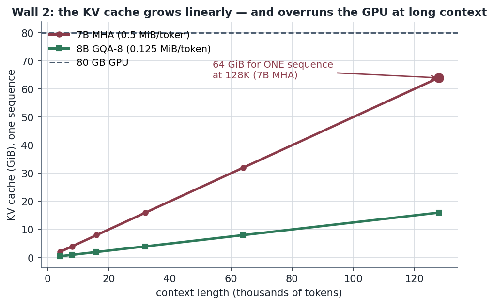
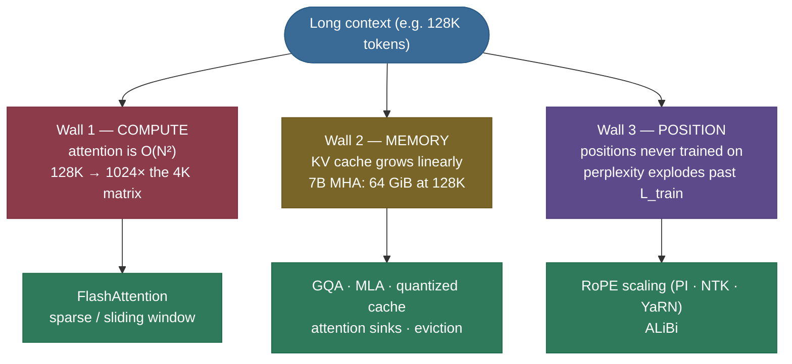
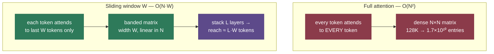
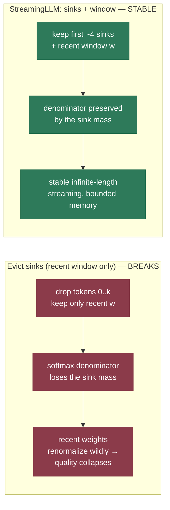

# Long-context methods: how an LLM reads 128K tokens

A model is trained on 4K-token windows. You hand it a 200-page document — 128K tokens — and ask it to find the one clause that contradicts page 3. It doesn't crash. It doesn't even slow down catastrophically. How? Nothing in the architecture obviously *knows* what position 100,000 means; nothing budgets memory for a context 32× longer than training; and a naïve attention over 128K tokens would build a score matrix with **16 billion entries** per layer per head. Long context is the art of making all three of those non-problems.

I'm going to walk this the way I'd actually explain it to a teammate who just watched their fine-tune produce garbage past 8K tokens. We start by feeling the **three walls** that make long context hard — and they are genuinely three *different* problems, which is why there's no single trick. Then we knock each one down: the **positional wall** (RoPE scaling — Position Interpolation, NTK/YaRN, ALiBi), the **compute wall** (sparse and sliding-window attention), and the **memory wall** (attention sinks, eviction, KV compression). We'll build the positional fix from scratch in code and *prove* it. By the end you'll be able to:

- name the **three walls** and say which technique attacks which — and why they don't substitute for each other;
- explain why **naïve extrapolation breaks** (it's an *angle* problem) and how **Position Interpolation** and **YaRN** fix it;
- contrast **RoPE-scaling** with **ALiBi**'s bias-based extrapolation;
- explain how a **sliding window** of size $W$ over $L$ layers still reaches $\approx L{\cdot}W$ tokens;
- explain the **attention-sink** phenomenon and why evicting the first tokens collapses streaming;
- and say why **perplexity is not retrieval** — why a model can score well on long context and still get "lost in the middle."

> **Note:** long context is a **systems** problem dressed as a modeling one. The headline ("1M context!") is a marketing number; the engineering is always a *stack* of techniques — RoPE-scaling **and** FlashAttention **and** a compressed KV cache — each attacking a different one of the three walls. Anyone who tells you one trick does it all is selling something.

---

## The problem: three walls, not one

To extend context you must pay three separate tolls. Confusing them is the root of most long-context confusion, so let's feel each one with real numbers, using a 32-layer, 7B-class model as the running example.

**Wall 1 — attention compute is $O(N^2)$.** Self-[attention](../../05.%20Deep_Learning/concepts/15-Attention-Mechanism.md) compares every token to every other token, so the score matrix has $N^2$ entries. Go from a 4K to a 128K context — a 32× longer sequence — and the attention matrix grows by $32^2 = \mathbf{1024\times}$. At 128K that's $131072^2 \approx 1.7\times10^{10}$ entries **per layer, per head**. Materialising that matrix in memory is impossible; even computing it is the dominant cost. *(This wall is knocked down by [FlashAttention](../06-Efficient-Attention-FlashAttention/06-Efficient-Attention-FlashAttention.md) — which never materialises the matrix — and by the **sparse/sliding** attention patterns below.)*

**Wall 2 — the KV cache grows linearly with $N$.** Every token's key and value vectors are cached so they're not recomputed (see [KV Cache](../05-KV-Cache/05-KV-Cache.md)). For Llama-2-7B (MHA) the cache is **0.5 MiB per token**. At a 128K context that's

$$131072 \times 0.5\,\text{MiB} \;=\; \mathbf{64\ GiB} \quad \text{for a *single* sequence.}$$

That alone overflows an 80 GB GPU once you add the 14 GB of weights. *(Knocked down by GQA/MLA, quantized caches, and the **eviction/sink** methods below.)*



**Wall 3 — positions the model never trained on.** This is the subtle one, and the heart of this page. A model trained with positions $0\ldots4095$ has simply **never seen** position 4096, let alone 100,000. With learned absolute position embeddings there isn't even a vector *for* that slot. With RoPE there is a value, but it corresponds to a rotation angle outside the trained range — and the model's behaviour there is undefined. **Run a 4K-trained model at 8K with no fix and perplexity explodes**; the output degenerates into repetition or noise. No amount of memory or compute helps — the model is positionally lost.



*The three independent walls of long context, and the family of techniques that brings each one down. A real "128K-context" model applies one fix from each row at once — they compose, they don't substitute.*

---

## Intuition first: the clock-hands picture of position

Before any math, here's the mental model that makes the positional wall — and its fix — obvious.

**RoPE** ([Su et al. 2021](https://arxiv.org/abs/2104.09864)) encodes a token's position not by *adding* a vector but by *rotating* its query and key vectors. Picture each pair of feature dimensions as the two hands of a clock. The token's position is the *time*: at position $m$, hand $i$ has rotated to angle $\theta_{m,i}$. Different feature pairs are clocks ticking at **different speeds** — some sweep a full circle every few tokens, others take thousands of tokens for one revolution.


Why does this give *relative* position? Because when a query at position $i$ dots with a key at position $j$, both have been rotated, and the dot product of two rotated vectors depends only on the **angle between them** — i.e. on $i - j$. The absolute times cancel; only the *offset* survives. *(We prove exactly this in code below — the same offset at positions (2,5) and (10,13) gives a bit-for-bit identical score.)*

Now the wall. Suppose the fastest clock-hand swept from 0 to 15 radians over the 4K training window. At position 128K it would be asked to sweep to an angle **32× larger** — a place on the dial the model has literally never read. That out-of-distribution angle is *why* naïve extrapolation fails.

> **Intuitively:** the fix writes itself. If the problem is the clock spinning into unseen territory, **slow the clock down** so that even at 128K it only sweeps through angles it saw during training. That is **Position Interpolation** — squeeze the position index so the longest sequence maps onto the trained angular range. The analogy holds under the obvious follow-up ("won't slowing the clock lose resolution between adjacent tokens?") — *yes, it does*, and that precise tradeoff is what NTK-aware scaling and YaRN exist to manage. We'll make the loss quantitative below.

> **Note (the alternative philosophy — ALiBi):** RoPE-scaling *adapts the rotation*. **ALiBi** ([Press et al. 2021](https://arxiv.org/abs/2108.12409)) takes a different route entirely: don't encode position in the vectors at all — instead **subtract a penalty proportional to distance** directly from each attention score, so a token automatically pays less attention to far-away tokens. Because the penalty is just "distance × slope", it's defined at *any* distance, so the model extrapolates to longer sequences for free. Two philosophies — *rescale the geometry* (RoPE) vs *bias the scores* (ALiBi) — both aimed at Wall 3.

---

## The math: RoPE, and why extrapolation breaks

Let's make the clock picture precise. Take a query/key vector of dimension $d_\text{head}$, split into $d_\text{head}/2$ pairs. RoPE rotates pair $i$ at position $m$ by angle

$$\theta_{m,i} \;=\; m \cdot \text{base}^{-2i/d_\text{head}}, \qquad i = 0,1,\dots,\tfrac{d_\text{head}}{2}-1,$$

where $m$ is the integer position, $\text{base}=10000$ is a fixed constant, and the exponent makes pair $i=0$ rotate fastest and the last pair slowest. The factor $\text{base}^{-2i/d_\text{head}}$ is the **angular frequency** of pair $i$.

> **Source / derivation:** [Su et al., *RoFormer: Enhanced Transformer with Rotary Position Embedding* (2021)](https://arxiv.org/abs/2104.09864) — derives the rotation form and proves the relative-position property; the per-pair frequency schedule $\text{base}^{-2i/d}$ is its Eq. (15).

The rotation applied to a pair $(x_{2i}, x_{2i+1})$ is the 2-D rotation matrix:

$$\begin{pmatrix} x'_{2i} \\ x'_{2i+1} \end{pmatrix} = \begin{pmatrix} \cos\theta_{m,i} & -\sin\theta_{m,i} \\ \sin\theta_{m,i} & \cos\theta_{m,i} \end{pmatrix} \begin{pmatrix} x_{2i} \\ x_{2i+1} \end{pmatrix}.$$

> **Source / derivation:** [Su et al., *RoFormer* (2021), §3.2](https://arxiv.org/abs/2104.09864) — the block-diagonal rotation $R_{\Theta,m}$ applied to queries and keys. The shapes: $q, k \in \mathbb{R}^{d_\text{head}}$; the rotation is applied **per position**, so a sequence of $T$ tokens uses angles $\Theta \in \mathbb{R}^{T \times d_\text{head}/2}$.

**Formally**, the attention logit between query at $i$ and key at $j$ becomes $q_i^\top R_{\Theta,i}^\top R_{\Theta,j} k_j$, and because $R^\top_{\Theta,i} R_{\Theta,j} = R_{\Theta,j-i}$ (rotations compose by adding angles), the score depends **only on $j-i$**. That's the relative-position property, derived, not asserted.

**Now the wall, quantitatively.** The fastest pair ($i=0$) has frequency $\text{base}^0 = 1$, so its angle is simply $\theta_{m,0} = m$. Over a $L_\text{train}=4096$ window it sweeps $0\to4095$ radians. Push to $L_\text{target}=131072$ and you demand angle $131071$ — **32× past** anything trained. The model has no calibrated behaviour there; attention scores become unreliable; perplexity explodes.

### Position Interpolation: slow the clock

**Position Interpolation (PI)** ([Chen et al. 2023](https://arxiv.org/abs/2306.15595)) rescales the position index by $L_\text{train}/L_\text{target}$ *before* computing angles:

$$\theta^{\text{PI}}_{m,i} \;=\; \big(m \cdot \tfrac{L_\text{train}}{L_\text{target}}\big)\cdot \text{base}^{-2i/d_\text{head}}.$$

> **Source / derivation:** [Chen et al., *Extending Context Window of Large Language Models via Positional Interpolation* (2023)](https://arxiv.org/abs/2306.15595) — replaces position $m$ with $m\,L_\text{train}/L_\text{target}$ so the maximum angle stays in the trained range; they show ~1000 steps of fine-tuning recovers full quality at 32K.

Now position $L_\text{target}-1$ maps to angle $(L_\text{target}-1)\cdot\frac{L_\text{train}}{L_\text{target}} \approx L_\text{train}-1$ — back inside the trained range. **The price:** adjacent tokens are now only $\frac{L_\text{train}}{L_\text{target}}$ of an angle apart instead of a full unit, so fine positional resolution shrinks. A short fine-tune restores quality. PI is *interpolation* (squeeze in) rather than *extrapolation* (push out) — and interpolating within a trained range is always safer than extrapolating beyond it.


### NTK-aware and YaRN: don't squeeze every clock equally

PI's flaw: it slows **every** clock by the same factor, including the slow high-$i$ pairs that weren't anywhere near their limit — needlessly crushing their resolution. **NTK-aware scaling** and its refinement **YaRN** ([Peng et al. 2023](https://arxiv.org/abs/2309.00071)) fix this by scaling **frequency-dependently**: barely touch the high-frequency (fast) pairs that carry local order, scale the low-frequency (slow) pairs that carry long-range position the most.

YaRN decides per pair by **wavelength** (the number of tokens a pair takes for one full rotation, $\lambda_i = 2\pi/\text{base}^{-2i/d_\text{head}}$): a pair that completes **many** rotations within the training window (short wavelength, $\lambda_i \ll L_\text{train}$) is left almost untouched, because it never lacked positions to learn from; a pair whose wavelength **exceeds** the training window ($\lambda_i > L_\text{train}$ — it never finished even one full rotation in training) gets the full PI squeeze. The scale $s_i$ below is exactly that interpolation, by wavelength, between "leave alone" and "squeeze."

$$\text{YaRN: } \theta^{\text{YaRN}}_{m,i} = m\cdot \frac{\text{base}^{-2i/d_\text{head}}}{s_i}, \quad s_i \text{ interpolates from }1\text{ (fast pairs)}\to \tfrac{L_\text{target}}{L_\text{train}}\text{ (slow pairs)}.$$

> **Source / derivation:** [Peng et al., *YaRN: Efficient Context Window Extension of Large Language Models* (2023)](https://arxiv.org/abs/2309.00071) — the "NTK-by-parts" wavelength-dependent interpolation plus an attention-temperature correction; reaches 128K with ~0.1% of the original pretraining tokens, far less fine-tuning than PI.

> **See it side by side:** this [interactive YaRN explainer](https://mbrenndoerfer.com/writing/yarn-rope-context-extension-llm) (Michael Brenndoerfer) plots PI's uniform squeeze against YaRN's frequency-dependent scaling on the same axes — the clearest external visual of *why* leaving the fast pairs alone preserves local order. For the paper's own perplexity-vs-length curves, see [Peng et al. (2023), Fig. 1](https://arxiv.org/abs/2309.00071).

> **Tip:** the one-line mental model. **PI**: slow all clocks equally (simple, blunt). **NTK/YaRN**: slow each clock by how close it was to overflowing (smarter, the modern default). **ALiBi**: don't use clocks — penalise by distance (extrapolates natively, but loses RoPE's exact relative encoding). Most production long-context models (Llama-3, Qwen-2, Mistral) use **RoPE + YaRN-style scaling**.

---

## Mechanism: sparse and sliding-window attention (Wall 1)

Position is solved; now the **compute** wall. The $O(N^2)$ score matrix is mostly waste — distant tokens rarely need to talk directly. **Sparse attention** computes only a chosen subset of the matrix.

- **Sliding-window attention** (Mistral) — each token attends only to the last $W$ tokens. The matrix becomes a band of width $W$, so compute drops from $O(N^2)$ to $O(N{\cdot}W)$ — *linear* in $N$.
- **Longformer / BigBird** ([Beltagy et al. 2020](https://arxiv.org/abs/2004.05150)) — a sliding window **plus a few global tokens** that every position can attend to (and that attend to everything). The window captures local structure; the global tokens (e.g. a `[CLS]` or task token) route long-range information through a cheap hub. BigBird adds random connections and proves this sparse pattern is still a universal sequence approximator.
- **Dilated / block-sparse** — attend to every $k$-th token (dilation), or to fixed blocks, trading some resolution for a much sparser matrix.

The obvious objection: *if every token only sees $W$ neighbours, how can the model ever connect page 1 to page 200?* The answer is **depth**, and it's the single most elegant idea in this whole topic.



*Full attention fills the whole $N{\times}N$ matrix; a sliding window fills only a band of width $W$, making compute linear in $N$. The receptive field is recovered by stacking layers — covered next.*

### Why a window isn't a ceiling: the $L{\cdot}W$ receptive field

A sliding window of $W=4096$ sounds like a token can only ever see 4096 tokens back. It can't — *in one layer*. But stacking layers grows the reach exactly like stacking convolutions grows a CNN's receptive field:

- Layer 1's output at position $i$ already mixes the last $W$ tokens.
- Layer 2 reads those outputs, so it reaches back $W$ from each of *those* — i.e. $\approx 2W$ from $i$.
- Over $L$ layers, information propagates **window-by-window up the stack** to an effective receptive field of

$$\text{reach} \;\approx\; 1 + L\,(W-1) \;\approx\; L\cdot W \text{ tokens.}$$

> **Source / derivation:** [Jiang et al., *Mistral 7B* (2023), §2.1](https://arxiv.org/abs/2310.06825) — the layered-receptive-field argument: a window $w$ over $L$ layers reaches $\approx L\,w$ tokens. Mistral's $W=4096$ over 32 layers reaches **$4096\times32 = 131{,}072$** tokens of effective context — while the KV cache stays capped at $W$ per layer.


> **Note:** this is the crux that makes sliding-window attention *and* its bounded cache (Wall 2) actually work. You get linear compute, a constant-size cache, **and** a receptive field that spans the whole sequence — three wins from one mechanism. *(We prove the $1 + L(W-1)$ reach numerically in the code below.)*

---

## Mechanism: bounding the cache — attention sinks (Wall 2)

For an *endless* stream (a chat that never resets, a live transcript), even a linear cache eventually overflows. The brute-force fix — keep only the most recent $W$ tokens and evict the rest — **breaks catastrophically**, and *why* it breaks is one of the most beautiful results in this area.

**StreamingLLM** ([Xiao et al. 2023](https://arxiv.org/abs/2309.17453)) traced the failure to the softmax. Recall that softmax **forces the attention weights to sum to 1** — there is no "attend to nothing" option:

$$\alpha_j = \frac{e^{s_j}}{\sum_{k} e^{s_k}}, \qquad \sum_j \alpha_j = 1.$$

> **Source / derivation:** [Xiao et al., *Efficient Streaming Language Models with Attention Sinks* (2023)](https://arxiv.org/abs/2309.17453) — identifies that the mandatory normalisation makes the model dump excess attention mass onto a few **initial** tokens (the "attention sinks"), and that evicting them removes a large part of the softmax denominator.

When the current query matches no recent token well, that mandatory probability mass has to land **somewhere**. It pools on the **first few tokens**, which are visible from *every* position — they become a learned "sink" that absorbs spare attention. Evict them and you delete a large chunk of the softmax **denominator** $\sum_k e^{s_k}$; the surviving weights renormalise wildly and quality collapses.

The fix is almost insultingly simple: **keep the first ~4 tokens (the sinks) plus the recent window**. That restores the denominator, and you get **stable, infinite-length streaming at bounded memory**.



*Evicting the first tokens removes the attention sinks and collapses the softmax; keeping ~4 sink tokens alongside the recent window preserves the denominator and enables endless streaming. We reproduce this drift numerically below.*


> **Note (related cache levers):** **H2O** (Heavy-Hitter Oracle) keeps the tokens that *historically received the most attention* rather than just the recent/first ones. **KV quantization** (FP8/INT4 — see [Quantization](../10-Quantization/10-Quantization.md)) shrinks each cached entry. **MLA** (DeepSeek, in [KV Cache](../05-KV-Cache/05-KV-Cache.md)) caches one low-rank latent per token. These attack the *size* of each entry or *which* entries to keep — orthogonal to, and combinable with, sinks.

---

## Alternatives: recurrence and sub-quadratic models

Two honest mentions, kept brief because they're parallel research lines rather than the mainstream long-context recipe.

**Transformer-XL** ([Dai et al. 2019](https://arxiv.org/abs/1901.02860)) predates the RoPE-scaling era and takes a **recurrence** approach: process the sequence in fixed segments, and **cache the hidden states of the previous segment** as extra (gradient-free) context for the next. This extends the effective context beyond one segment without quadratic cost, and it introduced **relative positional encodings** — a direct ancestor of RoPE's relative property.

> **Source / derivation:** [Dai et al., *Transformer-XL: Attentive Language Models Beyond a Fixed-Length Context* (2019)](https://arxiv.org/abs/1901.02860) — segment-level recurrence with cached states, plus the relative positional encoding scheme that made the recurrence position-consistent across segments.

**State-space models (Mamba).** A genuinely different architecture: replace attention with a **selective state-space recurrence** that processes the sequence in $O(N)$ time and *constant* memory per step — no KV cache that grows with $N$ at all. The honest caveat: SSMs compress all history into a fixed-size state, so they can struggle with exact long-range *retrieval* (finding a specific earlier token) where attention excels. Many 2024+ frontier models are **hybrids** — mostly SSM layers with a few attention layers to recover retrieval. This is an active frontier, not a settled replacement; we note it and move on.

---

## Code: prove the positional wall, then knock it down

Here is from-scratch code that builds **RoPE**, proves it's relative, shows the **angle wall** and the **Position Interpolation** fix, then demonstrates the **sliding-window $L{\cdot}W$ receptive field** and the **attention-sink** collapse. Every `assert` runs *before* any interpretation. It runs on CPU in under a second; the trace is pinned to CPU and labelled honestly so the numbers are reproducible on any host.

> **Runnable project and a step-by-step notebook:** the same verified code lives as a clean script and an executed teaching notebook next to this page — see the [step-by-step teaching notebook](code/08-Long-Context-Methods.ipynb) and the [runnable demo script](code/long_context_methods.py) (run it with `python long_context_methods.py`).

```python
import torch

HEAD_DIM, ROPE_BASE = 8, 10_000.0
TRAIN_LEN, TARGET_LEN = 16, 64          # toy: extend a 16-token model to 64 (4x)
WINDOW, N_LAYERS = 4, 5
N_SINK, RECENT_W = 4, 6
NEG_INF = float("-inf")

def rope_angles(positions, head_dim=HEAD_DIM, base=ROPE_BASE, *, device="cpu"):
    half = head_dim // 2
    inv_freq = base ** (-torch.arange(0, half, device=device, dtype=torch.float32) * 2.0 / head_dim)
    return positions[:, None].to(torch.float32) * inv_freq[None, :]   # theta_{m,i} = m * base^(-2i/d)

def apply_rope(x, angles):
    cos, sin = torch.cos(angles), torch.sin(angles)
    xe, xo = x[:, 0::2], x[:, 1::2]
    out = torch.empty_like(x)
    out[:, 0::2] = xe * cos - xo * sin       # 2-D rotation, row 1
    out[:, 1::2] = xe * sin + xo * cos       # 2-D rotation, row 2
    return out

def rope_score(q, k, pos_q, pos_k, *, scale):     # scale=1: standard; scale=L_train/L_target: PI
    pq, pk = torch.tensor([pos_q * scale]), torch.tensor([pos_k * scale])
    q_rot = apply_rope(q[None, :], rope_angles(pq))[0]
    k_rot = apply_rope(k[None, :], rope_angles(pk))[0]
    return float((q_rot @ k_rot).item())

torch.manual_seed(0)
q, k = torch.randn(HEAD_DIM), torch.randn(HEAD_DIM)

# (1a) RoPE is RELATIVE: same offset -> same score, anywhere in the sequence.
s1 = rope_score(q, k, 2, 5,   scale=1.0)     # offset -3
s2 = rope_score(q, k, 10, 13, scale=1.0)     # offset -3, far away
assert abs(s1 - s2) < 1e-4
print(f"RoPE relative: score(2,5)={s1:.4f}  score(10,13)={s2:.4f}  diff={abs(s1-s2):.1e}")

# (1b) The WALL and the FIX: naive extrapolation overshoots the trained angle range; PI rescues it.
trained = rope_angles(torch.tensor([TRAIN_LEN - 1.0]))[0, 0]    # fastest pair, max trained angle
naive   = rope_angles(torch.tensor([TARGET_LEN - 1.0]))[0, 0]   # what naive extension demands
pi      = rope_angles(torch.tensor([(TARGET_LEN - 1.0) * (TRAIN_LEN / TARGET_LEN)]))[0, 0]
assert naive > trained * 2 and float(pi) <= float(trained) + 1.0
print(f"trained max angle={float(trained):.1f}  naive={float(naive):.1f} "
      f"({float(naive/trained):.1f}x past)  PI={float(pi):.2f} (back in range)")
```

Output (CPU, reproducible):

```
RoPE relative: score(2,5)=1.5851  score(10,13)=1.5851  diff=0.0e+00
trained max angle=15.0  naive=63.0 (4.2x past)  PI=15.75 (back in range)
```

> **Note:** read both lines. The **`diff=0.0e+00`** is the relative property made literal — the same offset $-3$ gives a *bit-for-bit identical* score at positions (2,5) and (10,13); RoPE genuinely encodes only relative position. The second line is Wall 3 and its fix in three numbers: naïve extension to 4× the training length demands a maximum angle of **63 rad — 4.2× past** the trained ceiling of 15; **Position Interpolation** squeezes it back to **15.75 rad**, essentially the trained max. That single squeeze is the whole idea behind every "context-extended" model.

And the sliding-window receptive field — the proof that a window isn't a ceiling:

```python
def sliding_window_mask(seq_len, window=WINDOW, *, device="cpu"):
    idx = torch.arange(seq_len, device=device)
    offset = idx[:, None] - idx[None, :]
    return (offset >= 0) & (offset < window)        # causal AND within the window

def reachable_set(layer, query, window=WINDOW):     # influence set after `layer` layers
    reach = {query}
    for _ in range(layer):
        reach = {p for pos in reach for p in range(max(0, pos - (window - 1)), pos + 1)}
    return reach

seq_len, query = 12, 11
mask = sliding_window_mask(seq_len)
allowed = mask[query].nonzero().flatten().tolist()
assert allowed == [8, 9, 10, 11]                    # one layer: exactly the last W=4 keys
print(f"1 layer: token {query} sees keys {allowed}")
for L in range(1, N_LAYERS + 1):
    span = query - min(reachable_set(L, query)) + 1
    print(f"  {L} layers -> reach {span} tokens")
assert (query - min(reachable_set(N_LAYERS, query)) + 1) == 1 + N_LAYERS * (WINDOW - 1)
```

Output:

```
1 layer: token 11 sees keys [8, 9, 10, 11]
  1 layers -> reach 4 tokens
  2 layers -> reach 7 tokens
  3 layers -> reach 10 tokens
  4 layers -> reach 12 tokens
  5 layers -> reach 12 tokens
```

> **Note:** one layer is hard-bounded to the last $W=4$ keys (the assert proves a token *cannot* see further). But the reach grows $4 \to 7 \to 10 \to 12$ as layers stack — exactly $1 + L(W-1)$ until it hits the sequence start. Scale this up: Mistral's $W=4096$ over 32 layers reaches $\approx131{,}072$ tokens. **The window bounds the cache; depth restores the receptive field.**

> **Try it:** the notebook's third demo reproduces the **attention sink** — it makes the first 4 keys align with every query, then measures how much the recent-window weights *drift* when you evict the sinks (0.295) vs keep them (0.001). **Predict before you run:** if you raise `N_SINK` from 4 to 8, does the recent-window drift-with-sinks go *up* or *down*? (Hint: more sinks → more of the mandatory softmax mass has a stable home → the recent weights move *less*. The sinks are a pressure-release valve for the denominator.)

---

## Pitfalls and failure modes

The things that actually bite when you push context:

- **Extrapolating instead of interpolating.** Running a RoPE model past its trained length **with no scaling** doesn't degrade gracefully — perplexity *explodes* (the angle wall). Always apply PI/NTK/YaRN, and **fine-tune even briefly** after — PI without any fine-tuning loses local resolution.
- **Scaling the frequencies uniformly (PI's flaw).** PI crushes high-frequency (local-order) pairs it didn't need to. If short-range tasks regress after context extension, you over-squeezed — switch to **YaRN/NTK-aware**, which leaves the fast pairs nearly untouched.
- **Evicting attention sinks.** A "keep only the recent $w$ tokens" cache policy looks correct and **silently destroys quality** because it deletes the sink tokens' softmax mass. Keep the first ~4 tokens **always**.
- **Off-by-one in the causal+window mask.** A token at position $i$ should see $[i-W+1,\, i]$ — that's $W$ keys *including itself*. A frequent bug is masking with `offset <= window` (lets in $W{+}1$ keys) or forgetting the causal `offset >= 0` (leaks the future). The code above uses `(offset >= 0) & (offset < window)` — verify it gives exactly the last $W$ keys.
- **float16 overflow at long context.** Attention logits grow with sequence length and `d_head`; in float16 the unscaled `exp()` can overflow to `inf`. The $1/\sqrt{d_\text{head}}$ scale and the log-sum-exp trick inside FlashAttention exist precisely to keep this stable — don't hand-roll attention in fp16 without them.
- **Trusting perplexity as a long-context metric.** The deepest pitfall — its own section next.

---

## Where it matters: perplexity is not retrieval

Here's the crux, and the most important thing to internalise about long context: **a model can have low perplexity at 128K and still be useless at 128K.**

Perplexity measures average next-token prediction over the whole sequence. But most tokens are predictable from *local* context — you don't need token 100,000 to predict the next word in a sentence. So a model can score great perplexity at 128K while completely **ignoring** the far reaches of the context. Perplexity rewards *fluency*, not *recall*.

The honest tests:

- **Needle-in-a-haystack.** Hide a specific fact ("the magic number is 7492") at a random depth in a long document and ask for it back. This directly tests whether the model can *retrieve* from anywhere in the context — and many models that report huge context windows fail badly at certain depths.
- **"Lost in the middle"** ([Liu et al. 2023](https://arxiv.org/abs/2307.03172)) — the now-famous finding that retrieval accuracy is **U-shaped**: models reliably use information at the **start** and **end** of a long context but systematically **miss the middle**. A relevant fact buried at 50% depth is often invisible even when the model "supports" that length.


> **Note:** this is why "context length" on a model card is a *ceiling, not a guarantee*. When evaluating a long-context model for real work, **run needle-in-a-haystack at multiple depths** and check the middle. The number that matters is *effective* context (where retrieval still works), which is often far below the advertised window.

---

## In production: how real models hit long context

Tying the techniques to models you've heard of. Note that **every** one of these uses a *combination* across the three walls — never a single trick:

| Model | Position (Wall 3) | Compute (Wall 1) | Memory (Wall 2) | Context |
|---|---|---|---|---|
| Llama-3-8B/70B | RoPE + scaling | FlashAttention | GQA-8 | 8K → 128K |
| Mistral-7B | RoPE | sliding window $W{=}4096$ | GQA-8, cache capped at $W$ | 32K effective |
| Qwen-2 / Qwen-2.5 | RoPE + YaRN (+ DCA at 1M) | FlashAttention | GQA | 128K (1M tier) |
| DeepSeek-V2/V3 | decoupled RoPE | FlashAttention | **MLA** (latent KV) | 128K |
| Code Llama | RoPE base rescaled (NTK-flavoured) | FlashAttention | GQA | 16K → 100K |

> **Note (Qwen's 1M tier):** Qwen-2.5's **128K** models use YaRN, but the **1M** tier (Qwen2.5-1M) adds **Dual Chunk Attention (DCA)** on top — DCA splits the sequence into chunks and remaps positions so intra- and inter-chunk distances both stay within the trained range, which YaRN alone does not achieve at 1M. So the honest attribution is **YaRN to 128K, YaRN + DCA to 1M**.

> **Note:** read the columns, not the rows. **Position** is almost always RoPE plus some scaling (PI/NTK/YaRN); **compute** is FlashAttention (often with a sliding window); **memory** is GQA or MLA plus a paged, often quantized cache. "128K context" is the *product* of one choice from each column. Llama-3 extended from 8K to 128K by **continued pretraining on long sequences with RoPE scaling**, not by changing the architecture.

> **Tip:** when an interviewer asks "how would you extend this 4K model to 32K?", the gold answer walks all three walls: *(1)* **YaRN-scale RoPE** and fine-tune briefly so positions generalise; *(2)* serve with **FlashAttention** (and consider a **sliding window** if the task is local) so the $O(N^2)$ compute is tractable; *(3)* use **GQA + a quantized/paged KV cache** (and **sinks** for endless streams) so the cache fits. Then *(4)* **validate with needle-in-a-haystack**, not perplexity.

---

## Recap and rapid-fire

**If you remember nothing else:** long context is **three independent walls** — $O(N^2)$ **compute**, linearly-growing **KV memory**, and **positions never trained on** — and you need one fix from each. The positional wall is an *angle* problem: RoPE rotates by an angle that grows with position, so extrapolating past training demands unseen angles; **Position Interpolation** squeezes the index back into range, and **NTK/YaRN** do it frequency-by-frequency. **Sliding-window** attention makes compute linear while **depth** ($\approx L{\cdot}W$ reach) preserves the receptive field. **Attention sinks** keep the softmax denominator intact for endless streaming. And **perplexity ≠ retrieval** — validate with needle-in-a-haystack and watch for "lost in the middle."

**Quick-fire — say these out loud:**

- *What are the three walls of long context?* $O(N^2)$ compute, linear KV-cache memory, and positional generalisation — different problems, different fixes.
- *Why does naïve length extrapolation break?* RoPE's rotation angle grows with position; past the training length you hit angles the model never saw — an *out-of-distribution angle*, not a memory issue.
- *PI vs YaRN?* PI slows every frequency equally (blunt); YaRN scales frequency-dependently — barely touching fast local-order pairs (the modern default).
- *RoPE-scaling vs ALiBi?* RoPE rescales the rotation geometry; ALiBi adds a distance penalty to the scores and extrapolates natively.
- *Sliding window of $W$ over $L$ layers reaches how far?* $\approx L{\cdot}W$ tokens — depth restores the receptive field a single window can't.
- *Why can't you just keep the recent $w$ tokens?* You delete the **attention sinks**; the softmax denominator collapses and quality dies. Keep ~4 first tokens.
- *Why isn't perplexity enough?* Most tokens are locally predictable, so a model can ignore the far context and still score well. Use needle-in-a-haystack.
- *What is "lost in the middle"?* Retrieval accuracy is U-shaped — good at the start/end of a long context, poor in the middle.

---

## References and further reading

The curated link library for this topic — videos, courses, articles, papers, and interactive visualisations — lives in a companion file so it can be reused as a standalone reference list:

**→ [Long-Context Methods — references and further reading](08-Long-Context-Methods.references.md)**
